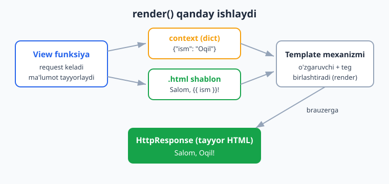
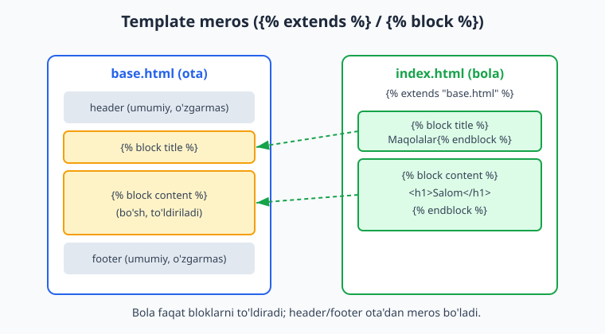
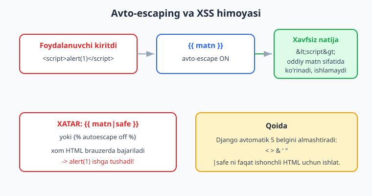

# 04 — Template tizimi (DTL)

[⬅️ Oldingi: 03 — View va URL marshrutlash](./03-view-url.md) · [🏠 README](./README.md) · [Keyingi: 05 — Modellar va migratsiya ➡️](./05-modellar-migratsiya.md)

---

> **Bu bobda:** View funksiya ma'lumotni tayyorlaydi, lekin uni chiroyli HTML sahifaga aylantirish kerak. Aynan shu ish uchun Django'da **template tizimi** mavjud. Bobda quyidagilarni o'rganamiz: `render()` qisqartmasi va **context** (view'dan shablonga ma'lumot uzatish); **Django Template Language (DTL)** sintaksisi — `{{ o'zgaruvchi }}`, nuqtali kirish (`obj.atribut`), teglar (``, ``, ``, ``); **filtrlar** (`date`, `length`, `default`, `upper`, `truncatewords` va boshqalar) va ularni zanjirlash; **template meros** — `` / `` orqali takrorni yo'qotish; `` bilan bo'laklarni qayta ishlatish; `` orqali CSS/JS/rasm ulash; va eng muhimi — **avto-escaping** hamda u qanday qilib **XSS** hujumidan himoya qilishi. Yo'l-yo'lakay `{{ block.super }}`, ``, ``, ``, `` va o'z **maxsus filtr/teg**laringizni yozishni ko'ramiz. Bu kitob Python bilishni faraz qiladi (havola: [../python/README.md](../python/README.md)); DTL Python emas — bu alohida, ataylab cheklangan til, shuni esda tuting. Hamma kod Django 6.0.6 da haqiqatan ishga tushirib tekshirilgan.

---

## DTL nima va nega Python emas

Avval bitta tushunchani aniqlab olaylik: **template (shablon)** — bu ko'p qismi o'zgarmas (HTML), kichik qismi esa har so'rovda almashadigan ("o'rni to'ldiriladigan") matn fayli. Django'ning shablon tili **Django Template Language (DTL)** deb ataladi.

DTL'da atigi **uch xil** maxsus belgi bor:

- `{{ ... }}` — **o'zgaruvchi**: qiymatni chiqaradi. Masalan `{{ ism }}`.
- `` — **teg**: mantiq bajaradi (shart, sikl, meros, ...). Masalan ``.
- `{# ... #}` — **izoh**: chiqishga umuman tushmaydi.

Va filtrlar — `{{ qiymat|filtr }}` ko'rinishida o'zgaruvchini o'zgartirib chiqaradi.

Yangi boshlovchilar tez-tez beradigan savol: "Nega shablonda to'g'ridan-to'g'ri Python yozolmaymiz?" Javob — bu **ataylab** qilingan. DTL juda cheklangan: unda `for` bor, lekin ixtiyoriy Python ifodasini bajarib bo'lmaydi, fayl o'chirib, bazaga yozib bo'lmaydi. Maqsad — dizaynerlar/template muallifi xavfsiz ishlasin, biznes-mantiq esa Python tomonida (view, model) qolsin. Shu falsafani yodda tuting: **og'ir ish view'da, ko'rsatish shablonda.**

> DTL'dan tashqari Django **Jinja2** mexanizmini ham qo'llab-quvvatlaydi. Bu kitobda biz standart va eng keng tarqalgan DTL'ni ishlatamiz.

## render() va context: view'dan shablonga ma'lumot

[03-bob](./03-view-url.md)da view'lar `HttpResponse` qaytarishini ko'rgandik. HTML'ni qo'lda satr sifatida yozish noqulay. `render()` qisqartmasi uchta ishni bitta qatorga jamlaydi: shablonni topadi, **context** (lug'at) bilan to'ldiradi, tayyor HTML'ni `HttpResponse` ichida qaytaradi.



`render()` imzosi: `render(request, template_nomi, context=None)`. Mana minimal view:

```python
# blog/views.py
import datetime
from django.shortcuts import render
from django.utils import timezone


def index(request):
    maqolalar = [
        {"sarlavha": "Django nima", "sana": datetime.date(2026, 1, 15)},
        {"sarlavha": "Template tizimi", "sana": datetime.date(2026, 3, 2)},
        {"sarlavha": "ORM asoslari", "sana": datetime.date(2026, 5, 20)},
    ]
    context = {
        "sarlavha": "Eng so'nggi maqolalar",
        "maqolalar": maqolalar,
        "eslatma": "Bu demo ma'lumot.",
        "hozir": timezone.now(),
    }
    return render(request, "blog/index.html", context)
```

`context` — oddiy Python lug'ati. Uning **kalitlari** shablonda o'zgaruvchi nomiga aylanadi: `context["sarlavha"]` shablonda `{{ sarlavha }}` bo'lib chiqadi.

### Shablon qayerda turadi

Django shablonni ikki joydan qidiradi (`settings.py` dagi `TEMPLATES` sozlamasiga ko'ra):

1. **Loyiha darajasidagi** `DIRS` ro'yxatidagi papkalar (umumiy shablonlar uchun qulay).
2. **Har bir ilova ichidagi** `app_nomi/templates/` papkasi (`APP_DIRS: True` bo'lganda).

`startproject` bergan standart sozlamani shunday to'ldiramiz:

```python
# config/settings.py (kerakli qismlar)
TEMPLATES = [
    {
        "BACKEND": "django.template.backends.django.DjangoTemplates",
        "DIRS": [BASE_DIR / "templates"],   # loyiha darajasidagi umumiy papka
        "APP_DIRS": True,                    # har ilovaning templates/ papkasi ham
        "OPTIONS": {
            "context_processors": [
                "django.template.context_processors.request",
                "django.contrib.auth.context_processors.auth",
                "django.contrib.messages.context_processors.messages",
            ],
        },
    },
]
```

**Muhim nom kelishuvi (namespacing):** ilova ichida shablonni to'g'ridan-to'g'ri `templates/index.html` emas, balki `templates/blog/index.html` ga qo'ying va `render(request, "blog/index.html", ...)` deb chaqiring. Sababi: ikki ilovada ham `index.html` bo'lsa, Django birinchisini topadi va aralashib ketadi. Ilova nomi bilan papka — bu chalkashlikning oldini oladi.

## O'zgaruvchilar va nuqtali kirish

`{{ ism }}` — context'dagi `ism` qiymatini chiqaradi. Eng kuchli tomoni — **nuqtali kirish** (`.`). Django nuqtani ko'rganda quyidagi tartibda urinib ko'radi:

1. Lug'at kaliti: `obj["kalit"]`
2. Atribut yoki metod: `obj.atribut` (metod bo'lsa, **qavssiz** chaqiradi)
3. Ro'yxat/indeks: `obj[0]`

Ya'ni shablonda `{{ ro.0 }}`, `{{ lugat.kalit }}`, `{{ obj.ism }}`, `{{ obj.salom }}` — hammasi bir xil nuqta bilan yoziladi. Buni tekshirib ko'ramiz:

```python
# Django shell'da haqiqatan ishga tushirilgan
from django.template import Template, Context

class Foydalanuvchi:
    def __init__(self):
        self.ism = "Oqil"
    def salom(self):
        return "Salom!"

ctx = Context({
    "lugat": {"kalit": "qiymat"},
    "ro": ["birinchi", "ikkinchi"],
    "obj": Foydalanuvchi(),
})
t = Template("{{ lugat.kalit }} / {{ ro.0 }} / {{ obj.ism }} / {{ obj.salom }}")
print(t.render(ctx))
# Natija: qiymat / birinchi / Oqil / Salom!
```

Diqqat: `{{ obj.salom }}` — metodni **qavssiz** chaqiradik; DTL'da qavs (`()`) bilan argument uzatib bo'lmaydi. Bu — yana o'sha "mantiqni view'da qoldir" falsafasi.

Yana bir muhim xatti-harakat — **mavjud bo'lmagan o'zgaruvchi**. Python'da `KeyError` chiqadi, lekin DTL'da shablon **buzilmaydi**, shunchaki bo'sh satr chiqaradi:

```python
from django.template import Template, Context
t = Template("[{{ yoq_narsa }}]")
print(t.render(Context({})))
# Natija: []
```

Bu — yana xavfsizlik va barqarorlik uchun. (Buni `string_if_invalid` sozlamasi orqali o'zgartirsa bo'ladi, lekin odatda kerak emas.)

## Filtrlar: qiymatni ko'rinishidan oldin o'zgartirish

Filtr — `{{ qiymat|filtr }}` ko'rinishida qiymatni o'zgartiradi. Argument quyidagicha beriladi: `{{ qiymat|filtr:argument }}`. Filtrlarni **zanjirlash** ham mumkin: `{{ matn|lower|truncatewords:3 }}`.

Eng ko'p ishlatiladigan filtrlarni jonli natijalari bilan ko'ramiz (hammasi `Template(...).render(...)` orqali haqiqatan ishga tushirilgan):

```python
# Django muhitida ishga tushirilgan; chap tomonda shablon, o'ngda natija
{{ items|join:", " }}              # ['a','b','c'] -> 'a, b, c'
{{ s|truncatewords:2 }}            # 'bir ikki uch tort' -> 'bir ikki …'
{{ n }} kitob{{ n|pluralize:",lar" }}   # n=3 -> '3 kitoblar';  n=1 -> '1 kitob'
{{ d|date:"d.m.Y H:i" }}           # 2026-06-13 09:05 -> '13.06.2026 09:05'
{{ x|default_if_none:"yoq" }}      # None -> 'yoq'
{{ z|default:"-" }}                # '' -> '-'  (bo'sh/false uchun)
{{ a|add:b }}                      # 10, 5 -> '15'
{{ s|lower }} / {{ s|title }}      # 'Salom Dunyo' -> 'salom dunyo' / 'Salom Dunyo'
{{ s|slugify }}                    # 'Salom Dunyo 2026' -> 'salom-dunyo-2026'
{{ b|filesizeformat }}             # 1048576 -> '1.0 MB' (son va birlik orasida uzilmas bo'shliq U+00A0)
{{ v|yesno:"ha,yoq,nomalum" }}     # False -> 'yoq'
{{ s|linebreaksbr }}              # 'a\nb' -> 'a<br>b'
{{ xs|first }} / {{ xs|last }}     # [1,2,3] -> '1' / '3'
{{ qiymat|length }}                # ['a','b','c'] -> 3
```

Eng muhim/eng ko'p so'raladigan filtrlar bo'yicha qisqacha jadval:

| Filtr | Vazifasi | Misol natija |
|---|---|---|
| `date:"d.m.Y"` | sana/vaqtni formatlaydi | `13.06.2026` |
| `length` | element soni yoki satr uzunligi | `3` |
| `default:"x"` | qiymat bo'sh/false bo'lsa `x` | `x` |
| `default_if_none:"x"` | faqat `None` bo'lsa `x` | `x` |
| `upper` / `lower` / `title` | harf registri | `ABC` / `abc` / `Abc` |
| `truncatewords:N` | dastlabki N so'z + `…` | `bir ikki …` |
| `join:", "` | ro'yxatni satrga | `a, b, c` |
| `pluralize` | ko'plik qo'shimchasi | `lar` yoki `''` |
| `slugify` | URL'ga mos slug | `salom-dunyo` |
| `yesno:"a,b,c"` | True/False/None -> matn | `ha`/`yoq`/`nomalum` |

`date` filtri formatlari Python'ning emas, Django'ning o'z belgilaridan iborat: `d`=kun (01-31), `m`=oy raqami, `Y`=4 xonali yil, `H`=soat (00-23), `i`=daqiqa. To'liq ro'yxat hujjatda; lekin `"d.m.Y H:i"` ko'pchilik holatni qoplaydi.

> **Diqqat — vaqt mintaqasi.** `settings.py` da `USE_TZ = True` bo'lsa, `timezone.now()` UTC vaqtni saqlaydi. Shablonda `{{ vaqt|date }}` Django avtomatik faol vaqt mintaqasiga (`TIME_ZONE`) o'tkazib ko'rsatadi. Bu kitob bo'yicha standart `TIME_ZONE = "UTC"`.

## Teglar: shart va sikl

###  /  / 

```html

  <p>Jami: {{ maqolalar|length }} ta maqola.</p>

  <p>Xatolik yuz berdi.</p>

  <p>Maqolalar topilmadi.</p>

```

Shartda `==`, `!=`, `<`, `>`, `<=`, `>=`, `in`, `not in`, `and`, `or`, `not` ishlaydi. Lekin yana bir bor: og'ir mantiqni shablonga tiqishtirmang. `` kabi sodda tekshiruvlar yaxshi; murakkab hisob view'da bo'lsin.

###  va forloop

```html

  <li class="">
    #{{ forloop.counter }} - {{ maqola.sarlavha|upper }}
    ({{ maqola.sana|date:"d.m.Y" }})
  </li>

  <li>Hozircha maqola yo'q.</li>

```

Sikl ichida juda foydali `forloop` o'zgaruvchisi bor:

| `forloop.*` | Ma'nosi |
|---|---|
| `counter` | 1 dan boshlangan tartib raqami |
| `counter0` | 0 dan boshlangan tartib raqami |
| `revcounter` | oxiridan sanaganda nechanchi |
| `first` | birinchi iteratsiyada `True` |
| `last` | oxirgi iteratsiyada `True` |
| `parentloop` | tashqi sikl forloop'iga kirish (ichma-ich sikl) |

`` bloki — ro'yxat **bo'sh** bo'lganda ishlaydi; alohida `` yozish shart emas. `` esa har iteratsiyada berilgan qiymatlarni navbatma-navbat qaytaradi (jadval qatorlarini "zebra" qilishda qulay).

Yuqoridagi `index.html` ni to'liq render qilib, natijani tekshirdik. Quyidagi HTML aynan chiqdi (qisqartirilgan):

```html
<h1>Eng so&#x27;nggi maqolalar</h1>
<p>Jami: 3 ta maqola.</p>
<ul>
  <li class="juft"> #1 - DJANGO NIMA (15.01.2026) </li>
  <li class="toq"> #2 - TEMPLATE TIZIMI (02.03.2026) </li>
  <li class="juft"> #3 - ORM ASOSLARI (20.05.2026) </li>
</ul>
```

E'tibor bering: `so'nggi` dagi apostrof `&#x27;` ga aylandi — bu avto-escaping (pastda batafsil).

### , , 

```python
# Hammasi ishga tushirilgan
{{ x }}          # -> '5' (qimmat hisobni bir marta saqlash)
                  # a='' b='' -> 'zaxira' (birinchi rost qiymat)
<p>   <a> hi </a></p>  # -> '<p><a> hi </a></p>'
```

`` — bir qiymatni (ayniqsa qimmat metod natijasini) o'zgaruvchiga olib, takror chaqirmaslik uchun. `` — bir nechta qiymatdan birinchi "rost"ini chiqaradi. `` — teglar orasidagi bo'sh joyni olib tashlaydi.

## : havolalarni nomi bo'yicha qurish

[03-bob](./03-view-url.md)da URL'larga `name=` va `app_name` bergandik. Shablonda havolani **qo'lda** (`/blog/5/`) yozmang — manzil o'zgarsa hammasi sinadi. O'rniga `` tegidan foydalaning: u nom bo'yicha haqiqiy yo'lni quradi.

```html
<a href="">Bosh sahifa</a>
<a href="">Batafsil</a>
```

Bu — view'dagi `reverse()` ning shablon ekvivalenti. Tekshirib ko'ramiz (`blog/urls.py` da `app_name = "blog"`, `name="index"` va `name="xss"` bor):

```python
# RequestContext bilan ishga tushirilgan
   # -> '/'
     # -> '/xss/'
```

Agar manzil keyin `path("blog/", ...)` ga ko'chsa, `` avtomatik `/blog/` qaytaradi — shablonni tahrirlash kerak bo'lmaydi. Aynan shuning uchun **doim** `` ishlating.

## : formani himoyalash

HTML formada `POST` yuborayotganda Django **CSRF** (Cross-Site Request Forgery) himoyasini talab qiladi. Buni teg bilan qo'shasiz:

```html
<form method="post" action="">
  
  <input type="text" name="matn">
  <button type="submit">Yuborish</button>
</form>
```

`` o'rniga yashirin maydon (`<input type="hidden" name="csrfmiddlewaretoken" ...>`) qo'yiladi. Server kelgan tokenni tekshiradi; mos kelmasa, `403 Forbidden` qaytaradi. Buni unutsangiz, POST formangiz "ishlamaydi" — bu eng tez-tez uchraydigan yangi boshlovchi xatosi.

CSRF token forma ichiga haqiqatan qo'shilishini tekshirdik:

```python
# RequestContext bilan ishga tushirilgan
from django.middleware.csrf import get_token
get_token(req)
Template('<form></form>').render(RequestContext(req, {}))
# Natija ichida "csrfmiddlewaretoken" yashirin maydoni bor: True
```

> `` faqat `POST` formalar uchun kerak. `GET` so'rovlar (oddiy havolalar, qidiruv) uchun shart emas.

## Template meros:  va 

Eng kuchli xususiyat. Har sahifada `<html>`, `<head>`, menyu, footer'ni qayta yozish — bu takror va xato manbai. Yechim: **bitta ota shablon** (`base.html`) tuziladi, unda o'zgaruvchan joylar `` bilan belgilanadi; **bola shablonlar** `` qilib faqat shu bloklarni to'ldiradi.



Ota shablon (`templates/base.html`):

```html

<!DOCTYPE html>
<html lang="uz">
<head>
  <meta charset="utf-8">
  <title>Blog</title>
  <link rel="stylesheet" href="">
</head>
<body>
  <header>
    <a href="">Bosh sahifa</a>
  </header>
  <main>
    
  </main>
  <footer>
    (c) 2026 Blog
  </footer>
</body>
</html>
```

Bola shablon (`blog/templates/blog/index.html`):

```html


Maqolalar - {{ block.super }}


  <h1>{{ sarlavha|default:"Maqolalar" }}</h1>
  ...

```

Qoidalar:

- `` — bola shablonning **eng birinchi** qatori bo'lishi shart.
- Bola faqat ota'dagi blok nomlarini to'ldiradi; ta'riflanmagan blok **ota'dagi standart** qiymatda qoladi (bu yerda `footer`).
- `{{ block.super }}` — ota blokining mazmunini ham qo'shadi. Yuqorida `Maqolalar - {{ block.super }}` natijada `Maqolalar - Blog` beradi (sinovda aynan shu chiqdi).

Bu naqsh ko'p qatlamli ham bo'la oladi: `base.html` -> `base_blog.html` -> `index.html`. Har qatlam yuqorisini `` qiladi.

## : bo'laklarni qayta ishlatish

Meros — bu "ramka ichini to'ldirish". `` esa — boshqa shablonni **shu yerga qo'shish** (Pythondagi funksiya chaqiruviga o'xshash, ko'rsatish uchun). Takrorlanuvchi bo'laklar (kartochka, izoh, navbar) uchun ideal.

Kichik bo'lak (`blog/templates/blog/_izoh.html` — pastki chiziq nomi shunchaki "bu bo'lak, mustaqil sahifa emas" degan kelishuv):

```html
<aside class="izoh">
  <strong>Eslatma:</strong> {{ matn|default:"yo'q" }}
</aside>
```

Asosiy shablonda chaqirish:

```html

```

`with matn=eslatma` — bo'lakka aniq qiymat uzatadi (`eslatma` — context'dagi o'zgaruvchi, `matn` — bo'lak ichidagi nom). `with`siz `` butun joriy context'ni bo'lakka uzatadi. Agar faqat berilganini uzatib, qolganini berkitmoqchi bo'lsangiz: ``.

`render_to_string()` orqali bo'lakni mustaqil render qilib ham tekshirdik:

```python
from django.template.loader import render_to_string
html = render_to_string("blog/_izoh.html", {"matn": "test"})
# html ichida "Eslatma:" va "test" bor.
```

## : CSS, JS, rasmlarni ulash

Statik fayllar (CSS/JS/rasm) URL'ini qo'lda yozmang — `STATIC_URL` o'zgarsa yoki productionda fayl nomiga xesh qo'shilsa, hammasi sinadi. To'g'ri yo'l — `` tegi.

Avval `` bilan tegni yuklaysiz (shablon yuqorisida), keyin ishlatasiz:

```html

<link rel="stylesheet" href="">

```

Faylni `blog/static/blog/style.css` ga qo'ying (yana namespacing — `static/blog/` ostida). `` to'g'ri URL quradi:

```python
# Ishga tushirilgan

# Natija: '/static/blog/style.css'
```

Eng ko'p uchraydigan xato — `` ni unutish. U bo'lmasa `` "Invalid block tag" xatosini beradi. Esda saqlang: **har** shablonda (yoki ota shablonda) statik kerak bo'lsa, `` bo'lishi shart. (Productionda `collectstatic` va xizmat ko'rsatish [deploy bobi](../git-github/README.md) bilan bog'liq mavzu — bu yerda faqat shablon tomonini ko'ryapmiz.)

## Avto-escaping va XSS himoyasi

Bu — bobning eng muhim xavfsizlik mavzusi. **XSS (Cross-Site Scripting)** — bu hujumchi kiritgan matnda `<script>` bo'lsa va u sahifaga xom holda chiqsa, brauzer uni **kod sifatida** bajaradi. Natijada hujumchi boshqa foydalanuvchining sahifasida JavaScript ishlatadi (cookie o'g'irlash, foydalanuvchi nomidan amal qilish).

Django'ning yechimi: **avto-escaping doim yoqilgan**. `{{ ... }}` orqali chiqadigan har bir qiymatda quyidagi 5 belgi xavfsiz HTML-entitiyga almashtiriladi:

| Belgi | Almashadi |
|---|---|
| `<` | `&lt;` |
| `>` | `&gt;` |
| `&` | `&amp;` |
| `'` | `&#x27;` |
| `"` | `&quot;` |



Buni jonli ko'rsatamiz. View xavfli matnni context'ga uzatadi:

```python
def xss_demo(request):
    context = {"foydalanuvchi_kiritgan": "<script>alert(1)</script>"}
    return render(request, "blog/xss.html", context)
```

Shablon (`blog/xss.html`):

```html
<p>Avto-escape (xavfsiz): {{ foydalanuvchi_kiritgan }}</p>
<p>safe filtri (xavfli): {{ foydalanuvchi_kiritgan|safe }}</p>

  <p>autoescape off (xavfli): {{ foydalanuvchi_kiritgan }}</p>

```

Bu sahifani `self.client.get("/xss/")` bilan chaqirib, chiqishni tekshirdik:

- Oddiy `{{ ... }}` natija: `&lt;script&gt;alert(1)&lt;/script&gt;` — ya'ni **matn sifatida** ko'rinadi, **bajarilmaydi**. Xavfsiz.
- `|safe` va `` natija: `<script>alert(1)</script>` — xom holda chiqdi, brauzer **bajaradi**. Xatarli.

Demak qoida:

- **Hech qachon** foydalanuvchi kiritgan ma'lumotga `|safe` qo'ymang.
- `|safe` va `` ni faqat **o'zingiz nazorat qiladigan, ishonchli** HTML uchun ishlating (masalan, Markdown'dan tozalab olingan HTML).
- Shubha bo'lsa — escape qoldiring. Django sizni standart holatda himoya qiladi; o'zingizni o'zingiz himoyasiz qilmang.

```python
# ❌ XAVFLI: foydalanuvchi izohini xom chiqarish
{{ izoh.matn|safe }}

# ✅ XAVFSIZ: avto-escape o'z ishini qilsin
{{ izoh.matn }}
```

## Maxsus filtr va teglar yozish

Django filtrlar/teglar ko'p, lekin ba'zan o'zingiznikini yozish kerak bo'ladi. Ilova ichida `templatetags/` paketi yaratiladi (`__init__.py` bilan), unga modul qo'yiladi:

```python
# blog/templatetags/blog_extra.py
from django import template

register = template.Library()


@register.filter
def takror(matn, n):
    """{{ "ab"|takror:3 }} -> ababab"""
    return str(matn) * int(n)


@register.simple_tag
def qoshish(a, b):
    """ -> 5"""
    return a + b
```

Shablonda `` bilan yuklab, ishlatamiz. Tekshirdik:

```python
# Ishga tushirilgan
{{ "ab"|takror:3 }} / 
# Natija: 'ababab / 5'
```

- `@register.filter` — bitta yoki ikkita argument oladigan filtr (`qiymat`, ixtiyoriy `argument`).
- `@register.simple_tag` — qiymat qaytaradigan teg; bir nechta argument oladi.

Maxsus filtr qaytargan satr ham avto-escape qilinadi (xavfsiz). Agar HTML qaytarsangiz va escape qilinmasin desangiz, `@register.filter(is_safe=True)` yoki `mark_safe()` ishlatiladi — lekin XSS xavfini eslab, ehtiyot bo'ling.

## Hammasini birga sinab ko'rish (pytest emas, Django test)

Yuqoridagi barcha kod bitta `blog` ilovasida birlashtirilib, Django'ning `TestCase` test mijozi bilan sinovdan o'tkazildi. Sinov shablonni haqiqatan render qiladi va natijani tekshiradi:

```python
# blog/tests.py (qisqartirilgan)
from django.test import TestCase
from django.template import Template, Context


class TemplateRenderTest(TestCase):
    def test_index_view(self):
        resp = self.client.get("/")
        self.assertEqual(resp.status_code, 200)
        self.assertContains(resp, "Eng so&#x27;nggi maqolalar")  # apostrof escape
        self.assertContains(resp, "Jami: 3 ta maqola")
        self.assertContains(resp, "DJANGO NIMA")    # upper filtri
        self.assertContains(resp, "15.01.2026")     # date filtri
        self.assertContains(resp, "#1 -")           # forloop.counter

    def test_xss_escaping(self):
        resp = self.client.get("/xss/")
        self.assertContains(resp, "&lt;script&gt;alert(1)&lt;/script&gt;")  # avto-escape
        self.assertContains(resp, "<script>alert(1)</script>")              # |safe + off

    def test_filters(self):
        t = Template("{{ x|length }}-{{ y|upper }}-{{ z|default:'-' }}")
        out = t.render(Context({"x": [1, 2, 3], "y": "abc", "z": ""}))
        self.assertEqual(out, "3-ABC--")
```

Natija (6 ta test):

```bash
$ python manage.py test
Found 6 test(s).
......
Ran 6 tests in 0.035s
OK
```

[SQL/ma'lumotlar bazasi](../sql/README.md) bilan integratsiyani 05-bobda, formalarni keyingi boblarda ko'ramiz; ammo shablon mexanizmini endi mukammal egallaganmiz: ma'lumot view'dan context orqali keladi, DTL uni xavfsiz HTML'ga aylantiradi, meros va include takrorni yo'qotadi. ([Node.js](../nodejs/README.md) dunyosida bunga EJS/Handlebars/Pug mos keladi — lekin Django'ning avto-escaping standart-yoqilgan yondashuvi xavfsizroq.)

---

## Mashqlar

Quyidagi mashqlarni o'z `blog` ilovangizda bajaring. Har birini render qilib (yoki `manage.py shell` da `Template(...).render(...)` bilan) natijani tekshiring.

### Oson

1. View yozing: context'ga `{"ism": "Oqil", "yosh": 25}` uzatib, shablonda `Salom, {{ ism }}! Sizning yoshingiz {{ yosh }}.` ni chiqaring.
2. Bir ro'yxat (`["olma", "anor", "uzum"]`) ni `` bilan `<ul><li>` ko'rinishida chiqaring va har elementga `forloop.counter` raqamini qo'shing.
3. `{{ narx|default:"narx yo'q" }}` orqali bo'sh qiymatga standart matn qo'ying. `narx=""` va `narx=1000` uchun natijani solishtiring.
4. `{{ sana|date:"d.m.Y" }}` bilan bir sanani formatlang. Keyin `"l, d F Y"` formatini sinab ko'ring va farqini ko'ring.
5. `base.html` va undan meros oladigan `about.html` yarating. `about.html` faqat `` ni to'ldirsin, `` ni esa tegmasin (standart qolsin).
6. Bitta satr `{{ matn|truncatewords:3 }}` bilan uzun matnni 3 so'zga qisqartiring.

### O'rta

7. `//` bilan: `ball >= 90` bo'lsa "A'lo", `ball >= 60` bo'lsa "O'rta", aks holda "Past" chiqaring.
8. Mahsulotlar ro'yxatini `` bilan chiqaring; ro'yxat bo'sh bo'lsa `` orqali "Mahsulot yo'q" deb yozing.
9. `` va `with` bilan qayta ishlatiladigan `_kartochka.html` bo'lagini yarating; unga `sarlavha` va `matn` uzating.
10. `` tegidan foydalanib, ikki sahifa (`index` va `about`) orasida navigatsiya menyusini `base.html` ga qo'ying. URL nomlari `app_name` bilan namespaced bo'lsin.
11. `{{ block.super }}` ishlatib, bola shablonda `title` blokini "Sahifa - " prefiksi bilan ota qiymatiga qo'shing.
12. `` bilan jadval qatorlarini "zebra" qiling (har qatorga navbatma-navbat `qator-1` / `qator-2` klassi).

### Qiyin

13. Maxsus filtr `bosh_harf` yozing: `"oqil imomnazarov"` -> `"O.I."` (har so'zning bosh harfini olib, nuqta bilan ajratib, katta harfda qaytarsin). `templatetags/` paketida joylashtiring va shablonda ishlating.
14. XSS demo qiling: foydalanuvchi izohini context'ga uzatib, bir joyda `{{ izoh }}` (xavfsiz), boshqa joyda `{{ izoh|safe }}` (xavfli) bilan chiqaring. Render natijasida `<script>` qaysi holatda escape bo'lganini ko'rsating va nega `|safe` xavfli ekanini yozing.
15. `@register.simple_tag` bilan `joriy_yil` tegini yozing: argumentsiz chaqirilganda joriy yilni qaytarsin (`` ga muqobil, lekin Python tomonida). `django.utils.timezone` dan foydalaning.

<details markdown="1">
<summary>Yechimlar</summary>

### 1
```python
# blog/views.py
from django.shortcuts import render

def salom(request):
    return render(request, "blog/salom.html", {"ism": "Oqil", "yosh": 25})
```
```html
<!-- blog/templates/blog/salom.html -->
Salom, {{ ism }}! Sizning yoshingiz {{ yosh }}.
<!-- Natija: Salom, Oqil! Sizning yoshingiz 25. -->
```

### 2
```html
<ul>
  
    <li>{{ forloop.counter }}. {{ mahsulot }}</li>
  
</ul>
<!-- context: {"royxat": ["olma", "anor", "uzum"]} -->
<!-- Natija: 1. olma  2. anor  3. uzum -->
```

### 3
```html
Narx: {{ narx|default:"narx yo'q" }}
```
`narx=""` -> `Narx: narx yo'q` (bo'sh satr "false" hisoblanadi, shu uchun standart ishladi).
`narx=1000` -> `Narx: 1000`. Eslatma: `default` bo'sh/false uchun ishlaydi; faqat `None` uchun `default_if_none` ishlating.

### 4
```html
{{ sana|date:"d.m.Y" }}     {# -> 13.06.2026 #}
{{ sana|date:"l, d F Y" }}  {# -> Saturday, 13 June 2026 (haftakun nomi + oy nomi) #}
```
`d.m.Y` faqat raqamlar; `l` to'liq haftakun nomi, `F` to'liq oy nomini beradi.

### 5
```html
<!-- templates/base.html (qisqa) -->
<title>Mening saytim</title>
<main></main>
```
```html
<!-- blog/templates/blog/about.html -->


  <h1>Biz haqimizda</h1>
  <p>Bu about sahifasi.</p>

```
`title` ta'riflanmaganligi uchun standart "Mening saytim" qoladi.

### 6
```html
{{ matn|truncatewords:3 }}
<!-- matn="bir ikki uch tort besh" -> "bir ikki uch …" -->
```

### 7
```html

  A'lo

  O'rta

  Past

<!-- ball=95 -> A'lo ; ball=70 -> O'rta ; ball=40 -> Past -->
```

### 8
```html
<ul>
  
    <li>{{ m }}</li>
  
    <li>Mahsulot yo'q</li>
  
</ul>
<!-- mahsulotlar=[] -> "Mahsulot yo'q" -->
```

### 9
```html
<!-- blog/templates/blog/_kartochka.html -->
<div class="kartochka">
  <h3>{{ sarlavha }}</h3>
  <p>{{ matn }}</p>
</div>
```
```html
<!-- chaqirish -->

```

### 10
```python
# blog/urls.py
from django.urls import path
from . import views

app_name = "blog"
urlpatterns = [
    path("", views.index, name="index"),
    path("about/", views.about, name="about"),
]
```
```html
<!-- templates/base.html ichidagi menyu -->
<nav>
  <a href="">Bosh sahifa</a>
  <a href="">Biz haqimizda</a>
</nav>
```

### 11
```html
<!-- base.html -->
<title>Blog</title>
```
```html
<!-- bola shablon -->
Sahifa - {{ block.super }}
<!-- Natija: "Sahifa - Blog" -->
```

### 12
```html
<table>
  
    <tr class="">
      <td>{{ q }}</td>
    </tr>
  
</table>
<!-- Har qator klassi navbatma-navbat: qator-1, qator-2, qator-1, ... -->
```

### 13
```python
# blog/templatetags/blog_extra.py
from django import template

register = template.Library()

@register.filter
def bosh_harf(toliq_ism):
    """'oqil imomnazarov' -> 'O.I.'"""
    soz_lar = str(toliq_ism).split()
    return ".".join(s[0].upper() for s in soz_lar if s) + "."
```
```html

{{ "oqil imomnazarov"|bosh_harf }}   {# -> O.I. #}
```
Tekshirish (shell): `Template('{{ "oqil imomnazarov"|bosh_harf }}').render(Context({}))` -> `'O.I.'`.

### 14
```python
# view
def izoh_demo(request):
    return render(request, "blog/izoh.html",
                  {"izoh": "<script>alert('xss')</script>"})
```
```html
<!-- blog/izoh.html -->
<p>Xavfsiz: {{ izoh }}</p>
<p>Xavfli: {{ izoh|safe }}</p>
```
Natija:
- Xavfsiz qatorda: `&lt;script&gt;alert(&#x27;xss&#x27;)&lt;/script&gt;` — matn sifatida, brauzer bajarmaydi.
- Xavfli qatorda: `<script>alert('xss')</script>` — brauzer **bajaradi**, bu XSS.

Nega `|safe` xavfli: u Django'ga "bu HTML'ni escape qilma" deydi. Agar matn foydalanuvchidan kelsa, hujumchi `<script>` joylashtirib boshqa foydalanuvchilar brauzerida kod ishga tushira oladi. Shuning uchun foydalanuvchi ma'lumotiga **hech qachon** `|safe` qo'ymang.

### 15
```python
# blog/templatetags/blog_extra.py
from django import template
from django.utils import timezone

register = template.Library()

@register.simple_tag
def joriy_yil():
    return timezone.now().year
```
```html

<footer>(c)  Mening saytim</footer>
{# -> (c) 2026 Mening saytim #}
```
Bu `` bilan bir xil natija beradi, lekin mantiq Python tomonida — murakkab hisob kerak bo'lganda shu yondashuv qulay.

</details>

---

[⬅️ Oldingi: 03 — View va URL marshrutlash](./03-view-url.md) · [🏠 README](./README.md) · [Keyingi: 05 — Modellar va migratsiya ➡️](./05-modellar-migratsiya.md)
