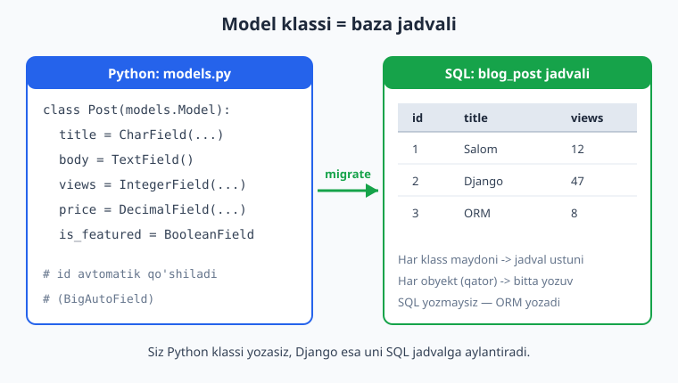
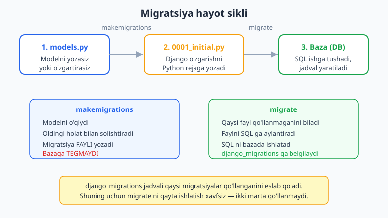
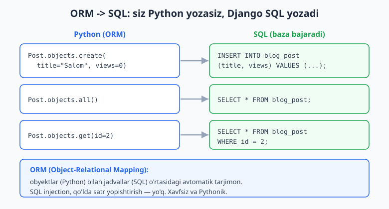

# 05 — Modellar va migratsiya

[⬅️ Oldingi: 04 — Template tizimi (DTL)](./04-template-tizimi.md) · [🏠 README](./README.md) · [Keyingi: 06 — ORM va QuerySet so'rovlar ➡️](./06-orm-queryset.md)

---

> **Bu bobda:** Django'ning yuragi — **modellar** bilan tanishamiz. Model nima ekanini va nega u shunchaki Python klassi bo'la turib **baza jadvaliga** aylanishini ko'ramiz. Eng kerakli **maydon turlari**ni (`CharField`, `TextField`, `IntegerField`, `BooleanField`, `DateTimeField`, `DecimalField`, `EmailField`, `SlugField` va boshqalar) qachon qaysi birini ishlatishni o'rganamiz. `Meta` klass orqali jadval xulqini (`ordering`, `verbose_name`, `unique`) sozlaymiz; `__str__` bilan obyektni odamga tushunarli ko'rsatamiz. So'ngra Django'ning eng kuchli mexanizmlaridan biri — **migratsiya tizimi**ni ochib beramiz: `makemigrations` va `migrate` orasidagi farq, migratsiya fayli aslida nima, `django_migrations` jadvali qanday "xotira" vazifasini bajaradi, va `sqlmigrate` bilan migratsiya qaysi SQL ga aylanishini o'z ko'zimiz bilan ko'ramiz. Oxirida **ORM**ga (`objects.create`, `.all()`, `.get()`) ilk qadam qo'yib, Python kodimiz qanday qilib SQL `INSERT`/`SELECT` ga aylanishini amalda sinab ko'ramiz. Hamma kod Django 6.0.6 da haqiqatan ishga tushirib tekshirilgan.

---

## Model nima va nega kerak?

Veb-ilovaning aksariyati ma'lumotni **saqlash** va **qaytarib olish** ustiga qurilgan: foydalanuvchilar, maqolalar, mahsulotlar, buyurtmalar. Bu ma'lumotlar **ma'lumotlar bazasida** (database) jadvallar ko'rinishida yashaydi.

An'anaviy yo'lda siz qo'lda SQL yozasiz:

```sql
-- ❌ Bu yo'lni Django'da ishlatmaymiz (faqat tushuntirish uchun)
CREATE TABLE blog_post (
    id INTEGER PRIMARY KEY,
    title VARCHAR(200),
    body TEXT
);
INSERT INTO blog_post (title, body) VALUES ('Salom', 'Matn');
```

Bu yondashuvning muammosi: SQL qo'lda yozish xatoga moyil, baza turi (SQLite, PostgreSQL, MySQL) o'zgarsa sintaksis o'zgaradi, va Python kodingiz bilan baza orasida hech qanday bog'liqlik yo'q.

Django'da esa siz **oddiy Python klassi** yozasiz — uni **model** deb ataymiz. Django bu klassni o'qib, sizning o'rningizga jadval yaratadi va SQL'ni o'zi yozadi. Bitta klass = bitta jadval. Klassning har bir maydoni = jadvalning bir ustuni. Klassdan yaratilgan har bir obyekt = jadvaldagi bitta qator (yozuv).



Bu yondashuv **ORM** (Object-Relational Mapping — obyekt-relatsion moslashtirish) deb ataladi. Python obyektlari bilan SQL jadvallari o'rtasidagi avtomatik tarjimon. Agar siz [SQL](../sql/README.md) bilan tanish bo'lsangiz, ORM "ostida" o'sha SQL ishlayotganini ko'rasiz — lekin uni qo'lda yozmaysiz.

> **Python bilganlar uchun:** model — bu oddiy klass, lekin `django.db.models.Model` dan meros oladi. Klass atributlari (`title = models.CharField(...)`) — bu **deskriptorlar**: Django ulardan jadval sxemasini ham, obyekt atributlarini ham yasaydi.

---

## Birinchi modelni yozish

Avval (3-bobdan eslang) ilova yaratib, uni `INSTALLED_APPS` ga qo'shgan bo'lishingiz kerak. Misol uchun `blog` nomli ilova:

```bash
python -m django startproject mysite .
python manage.py startapp blog
```

So'ng `mysite/settings.py` da:

```python
# mysite/settings.py
INSTALLED_APPS = [
    "django.contrib.admin",
    "django.contrib.auth",
    "django.contrib.contenttypes",
    "django.contrib.sessions",
    "django.contrib.messages",
    "django.contrib.staticfiles",
    "blog",  # <-- o'z ilovamizni ro'yxatga oldik
]
```

Endi `blog/models.py` faylida birinchi modelni yozamiz:

```python
# blog/models.py
from django.db import models


class Post(models.Model):
    title = models.CharField(max_length=200)
    body = models.TextField()
    views = models.IntegerField(default=0)

    def __str__(self):
        return self.title
```

Shu uch qatorlik maydon bilan biz Django'ga aytdik: "Menga `title` (qisqa matn), `body` (uzun matn) va `views` (butun son) ustunlari bo'lgan jadval kerak." `id` ustunini **so'ramadik** — Django uni avtomatik qo'shadi (buni keyinroq ko'ramiz).

`models.Model` dan meros olish modelni "haqiqiy" qiladi: u `objects` menejeri, `save()`, `delete()` kabi metodlarga ega bo'ladi.

---

## Maydon turlari: qachon qaysi birini ishlatish

Maydon turi (field type) Django'ga ikki narsani aytadi: (1) bazada qanday ustun yaratish kerak, (2) Python tomonida qiymat qanday tekshirilishi va ko'rsatilishi kerak. Eng ko'p ishlatiladiganlarini ko'rib chiqaylik.

### Matn maydonlari

| Maydon | Vazifasi | Misol |
|---|---|---|
| `CharField(max_length=N)` | Qisqa, cheklangan uzunlikdagi matn | sarlavha, ism |
| `TextField()` | Uzun, cheksiz matn | maqola tanasi, izoh |
| `EmailField()` | Email — formati tekshiriladi | foydalanuvchi emaili |
| `SlugField()` | URL uchun xavfsiz qisqa nom (`-` va harf) | `salom-django` |

```python
title = models.CharField(max_length=200)   # max_length SHART
body = models.TextField()                   # max_length kerak emas
author_email = models.EmailField(blank=True)
slug = models.SlugField(max_length=220, unique=True)
```

**Muhim farq:** `CharField` da `max_length` **majburiy** (baza shu uzunlikdagi ustun yaratadi). `TextField` da esa kerak emas — u cheksiz matn uchun. Qoida: agar matn qisqa va cheklangan bo'lsa (sarlavha) — `CharField`; uzun bo'lsa (maqola tanasi) — `TextField`.

**`SlugField`** — bu URL uchun mo'ljallangan `CharField`. "Slug" — bu sarlavhaning URL'ga yaroqli ko'rinishi: `"Salom Django!"` -> `"salom-django"`. Faqat harf, raqam, defis va pastki chiziqdan iborat bo'ladi.

### Son maydonlari

```python
views = models.IntegerField(default=0)              # butun son
price = models.DecimalField(max_digits=8, decimal_places=2)  # aniq o'nlik son
rating = models.FloatField()                        # suzuvchi nuqtali son
```

**`DecimalField` vs `FloatField` — bu juda muhim:** pul, narx, hisob-kitob kabi **aniqlik talab qiladigan** sonlar uchun **doim** `DecimalField` ishlating. `FloatField` (suzuvchi nuqta) ikkilik kasr xatosiga ega bo'ladi (`0.1 + 0.2 != 0.3`). `DecimalField` da `max_digits` (jami raqamlar soni) va `decimal_places` (kasr qismidagi raqamlar soni) majburiy. Masalan `max_digits=8, decimal_places=2` -> `999999.99` gacha pul saqlay oladi.

### Mantiqiy va sana maydonlari

```python
is_featured = models.BooleanField(default=False)        # True / False
created_at = models.DateTimeField(auto_now_add=True)    # birinchi saqlashda o'rnatiladi
updated_at = models.DateTimeField(auto_now=True)        # HAR saqlashda yangilanadi
birth_date = models.DateField(null=True, blank=True)    # faqat sana (vaqtsiz)
```

`DateTimeField` da ikkita sehrli argument bor:

- `auto_now_add=True` — obyekt **birinchi marta** yaratilganda joriy vaqtni qo'yadi va keyin **o'zgarmaydi**. "Yaratilgan vaqt" uchun ideal.
- `auto_now=True` — obyekt **har safar** saqlanganda joriy vaqtga yangilanadi. "Oxirgi tahrir vaqti" uchun ideal.

### `null` va `blank` — chalkashtirmang

Bu ikki argument boshlovchilarni eng ko'p chalkashtiradi:

- **`null=True`** — bu **baza** darajasidagi sozlama. Ustun bazada `NULL` (bo'sh) bo'lishi mumkinligini bildiradi.
- **`blank=True`** — bu **forma/validatsiya** darajasidagi sozlama. Maydonni formada bo'sh qoldirish mumkinligini bildiradi.

```python
# To'g'ri naqshlar:
author_email = models.EmailField(blank=True)        # matn: bo'sh satr "" saqlanadi, NULL kerak emas
category = models.ForeignKey(..., null=True, blank=True)  # bog'lanish: ikkalasi ham kerak
birth_date = models.DateField(null=True, blank=True)      # sana: bo'sh satr yo'q, shuning uchun null kerak
```

**Oltin qoida:** matn maydonlari (`CharField`, `TextField`) uchun **`null=True` ishlatmang** — bo'sh matn uchun ikki xil "bo'sh" qiymat (`NULL` va `""`) chalkashlik tug'diradi. Faqat `blank=True` yetarli. Lekin sana, son, bog'lanish kabi maydonlar uchun bo'sh qiymat kerak bo'lsa — `null=True, blank=True` ikkalasi ham kerak.

---

## To'liq model: hammasi birga

Endi yuqoridagilarni birlashtirib, ikkita model yozamiz: `Category` (toifa) va `Post` (maqola). Bu kod Django 6.0.6 da haqiqatan ishlatib tekshirilgan.

```python
# blog/models.py
from django.db import models


class Category(models.Model):
    name = models.CharField(max_length=100, unique=True)
    slug = models.SlugField(max_length=120, unique=True)

    class Meta:
        verbose_name = "Toifa"
        verbose_name_plural = "Toifalar"
        ordering = ["name"]

    def __str__(self):
        return self.name


class Post(models.Model):
    class Status(models.TextChoices):
        DRAFT = "draft", "Qoralama"
        PUBLISHED = "published", "Chop etilgan"

    title = models.CharField(max_length=200)
    slug = models.SlugField(max_length=220, unique=True)
    body = models.TextField()
    author_email = models.EmailField(blank=True)
    views = models.IntegerField(default=0)
    price = models.DecimalField(max_digits=8, decimal_places=2, default=0)
    is_featured = models.BooleanField(default=False)
    status = models.CharField(
        max_length=10, choices=Status.choices, default=Status.DRAFT
    )
    created_at = models.DateTimeField(auto_now_add=True)
    updated_at = models.DateTimeField(auto_now=True)
    category = models.ForeignKey(
        Category,
        on_delete=models.CASCADE,
        related_name="posts",
        null=True,
        blank=True,
    )

    class Meta:
        ordering = ["-created_at"]
        verbose_name = "Maqola"
        verbose_name_plural = "Maqolalar"

    def __str__(self):
        return self.title
```

Bu kodda yangi uch narsa bor: `__str__`, `Meta` klass va `choices`. Ularni alohida ko'raylik. (`ForeignKey` — bog'lanish — keyingi boblarda chuqur ochiladi; hozir uni "bu maqola qaysi toifaga tegishli" deb tushuning.)

---

## `__str__` — obyektni odamga tushunarli ko'rsatish

`__str__` — bu oddiy Python metodi (model'ga xos emas, Python'ning o'zidan). U obyekt **matnga aylantirilganda** nima ko'rsatilishini belgilaydi. Modelda uni yozmasangiz, Django `Post object (1)` kabi foydasiz narsa ko'rsatadi.

```python
def __str__(self):
    return self.title
```

Endi shell'da yoki admin panelda obyekt `<Post: Django modellari>` kabi tushunarli ko'rinadi. Bu admin panel, debug va log uchun juda foydali. **Har bir modelga `__str__` yozish — yaxshi odat.**

---

## `Meta` klass — jadval xulqini sozlash

`Meta` — bu model **ichidagi** ichki klass. U maydon emas; u modelning "metama'lumotini" (jadval haqida ma'lumot) sozlaydi. Eng kerakli sozlamalar:

```python
class Meta:
    ordering = ["-created_at"]          # standart saralash tartibi (- = teskari)
    verbose_name = "Maqola"             # admin'da yakka nomi
    verbose_name_plural = "Maqolalar"   # admin'da ko'plik nomi
    # unique_together = ["title", "author_email"]   # birga noyob bo'lsin
    # db_table = "blog_posts"           # jadval nomini o'zgartirish (kamdan-kam)
```

- **`ordering`** — `Post.objects.all()` qanday tartibda qaytarishini belgilaydi. `"-created_at"` — eng yangisi birinchi (`-` teskari tartib). Bu juda qulay: har so'rovda `order_by` yozmaysiz.
- **`verbose_name` / `verbose_name_plural`** — admin panelda chiroyli nom ko'rsatadi. Aks holda Django ingliz tilida `Posts` deb avtomatik qo'yadi.

> **Diqqat:** o'zbekcha ko'plik avtomatik to'g'ri yasalmaydi (Django `s` qo'shadi), shuning uchun `verbose_name_plural` ni qo'lda yozish ma'qul.

### `choices` — cheklangan tanlovlar

Ba'zan maydon faqat ma'lum qiymatlardan birini olishi kerak (masalan, holat: qoralama yoki chop etilgan). Django 6.0 da buning zamonaviy yo'li — `TextChoices`:

```python
class Status(models.TextChoices):
    DRAFT = "draft", "Qoralama"          # (bazaga yoziladigan qiymat, odamga ko'rsatiladigan yorliq)
    PUBLISHED = "published", "Chop etilgan"

status = models.CharField(
    max_length=10, choices=Status.choices, default=Status.DRAFT
)
```

Har bir variant ikki qismdan iborat: bazada saqlanadigan **qiymat** (`"draft"`) va foydalanuvchiga ko'rsatiladigan **yorliq** (`"Qoralama"`). Django avtomatik `get_status_display()` metodini yaratadi — u yorliqni qaytaradi:

```python
post.status                  # 'published'  (bazadagi qiymat)
post.get_status_display()    # 'Chop etilgan'  (odamga ko'rsatiladigan yorliq)
```

---

## `id` va birlamchi kalit (primary key)

Diqqat qiling: biz modelda `id` maydonini **yozmadik**. Django uni avtomatik qo'shadi — har bir modelga `BigAutoField` turidagi `id` (birlamchi kalit, primary key) beriladi. Bu har yangi qatorda 1, 2, 3... deb avtomatik o'sadigan noyob raqam.

Django 6.0 da **`BigAutoField`** sukut bo'yicha (default) birlamchi kalit turi. Shuning uchun yangi loyihada `settings.py` ga `DEFAULT_AUTO_FIELD` yozish **endi shart emas** — u global default sifatida o'rnatilgan. (Eski loyihalarda hali ham ko'rishingiz mumkin; bu zarar qilmaydi.)

```python
post = Post.objects.create(title="Salom", slug="salom", body="matn")
print(post.id)   # 1  (avtomatik berildi)
print(post.pk)   # 1  (pk = primary key uchun universal qisqartma)
```

`post.pk` — `post.id` ning universal taxallusi (alias). Agar birlamchi kalitni o'zingiz boshqa maydonga o'rnatsangiz ham `pk` doim ishlaydi.

---

## Migratsiya: modeldan bazaga

Modelni yozdik — lekin bazada hali hech narsa yo'q! Model — bu shunchaki Python kodi. Uni **haqiqiy baza jadvaliga** aylantirish uchun **migratsiya** kerak.

**Migratsiya** — bu sizning model o'zgarishingizni bazaga qanday qo'llashni tasvirlaydigan reja. Django'da bu ikki bosqichli jarayon:

1. **`makemigrations`** — Django modelni o'qiydi, oldingi holat bilan solishtiradi va o'zgarishni tasvirlovchi **migratsiya faylini** yozadi. **Bazaga tegmaydi.**
2. **`migrate`** — Django o'sha migratsiya faylini SQL ga aylantiradi va uni **bazada haqiqatan ishlatadi**.



Bu ikkisi nega ajratilgan? Chunki migratsiya fayli — bu **versiya nazorati** ostida saqlanadigan (git'ga qo'shiladigan) baza o'zgarishlari tarixidir. Jamoadagi har bir dasturchi `migrate` ishlatib, bazasini bir xil holatga keltira oladi. Bu — bazaning [git'i](../git-github/README.md) kabi.

### `makemigrations` — rejani yaratish

```bash
python manage.py makemigrations blog
```

Natija:

```text
Migrations for 'blog':
  blog\migrations\0001_initial.py
    + Create model Category
    + Create model Post
```

Django `blog/migrations/0001_initial.py` faylini yaratdi. Uni ochib ko'rsak (bu fayl **avtomatik** yaratilgan, qo'lda yozmaysiz):

```python
# blog/migrations/0001_initial.py (avtomatik yaratilgan)
import django.db.models.deletion
from django.db import migrations, models


class Migration(migrations.Migration):
    initial = True
    dependencies = []
    operations = [
        migrations.CreateModel(
            name="Category",
            fields=[
                ("id", models.BigAutoField(auto_created=True, primary_key=True, serialize=False, verbose_name="ID")),
                ("name", models.CharField(max_length=100, unique=True)),
                ("slug", models.SlugField(max_length=120, unique=True)),
            ],
            options={"verbose_name": "Toifa", "verbose_name_plural": "Toifalar", "ordering": ["name"]},
        ),
        migrations.CreateModel(
            name="Post",
            fields=[
                ("id", models.BigAutoField(auto_created=True, primary_key=True, serialize=False, verbose_name="ID")),
                ("title", models.CharField(max_length=200)),
                # ... qolgan maydonlar ...
            ],
            options={"ordering": ["-created_at"], "verbose_name": "Maqola", "verbose_name_plural": "Maqolalar"},
        ),
    ]
```

E'tibor bering — bu fayl **Python**, SQL emas. Bu Django'ning ichki "rejasi". `id` maydoni avtomatik qo'shilganini ko'ryapsizmi? (`BigAutoField`).

### `sqlmigrate` — qanday SQL yaratilishini ko'rish

Migratsiya aslida qanday SQL ga aylanishini ko'rishni xohlaysizmi? `sqlmigrate` aynan shuni ko'rsatadi (lekin **ishlatmaydi** — faqat chop etadi):

```bash
python manage.py sqlmigrate blog 0001
```

Natija (SQLite uchun):

```sql
BEGIN;
--
-- Create model Category
--
CREATE TABLE "blog_category" ("id" integer NOT NULL PRIMARY KEY AUTOINCREMENT, "name" varchar(100) NOT NULL UNIQUE, "slug" varchar(120) NOT NULL UNIQUE);
--
-- Create model Post
--
CREATE TABLE "blog_post" ("id" integer NOT NULL PRIMARY KEY AUTOINCREMENT, "title" varchar(200) NOT NULL, "slug" varchar(220) NOT NULL UNIQUE, "body" text NOT NULL, "author_email" varchar(254) NOT NULL, "views" integer NOT NULL, "price" decimal NOT NULL, "is_featured" bool NOT NULL, "status" varchar(10) NOT NULL, "created_at" datetime NOT NULL, "updated_at" datetime NOT NULL, "category_id" bigint NULL REFERENCES "blog_category" ("id") DEFERRABLE INITIALLY DEFERRED);
CREATE INDEX "blog_post_category_id_c326dbf8" ON "blog_post" ("category_id");
COMMIT;
```

Mana — bu sizning Python modelingizning SQL ko'rinishi! Ko'ring:

- `CharField(max_length=200)` -> `varchar(200)`
- `TextField()` -> `text`
- `BooleanField` -> `bool`
- `unique=True` -> `UNIQUE`
- `category` (ForeignKey) -> `category_id` ustuni + `REFERENCES` + indeks

Bu SQL'ni **siz yozmadingiz** — Django modelingizdan yasab berdi. Va eng yaxshisi: agar PostgreSQL ishlatsangiz, Django o'sha bazaga mos SQL chiqaradi. Kod o'zgarmaydi, faqat baza sozlamasi o'zgaradi.

### `migrate` — bazaga qo'llash

Endi haqiqatan bazaga qo'llaymiz:

```bash
python manage.py migrate
```

Natija:

```text
Operations to perform:
  Apply all migrations: admin, auth, blog, contenttypes, sessions
Running migrations:
  Applying contenttypes.0001_initial... OK
  Applying auth.0001_initial... OK
  ...
  Applying blog.0001_initial... OK
  Applying sessions.0001_initial... OK
```

`blog.0001_initial... OK` — bizning jadvallarimiz yaratildi! (Boshqalar — `auth`, `admin` — Django'ning o'rnatilgan ilovalari jadvallari; ular ham birinchi `migrate` da yaratiladi.)

---

## Migratsiya tizimi qanday ishlaydi: `django_migrations`

`migrate` ni ikki marta ishlatsangiz, ikkinchi marta nima bo'ladi? Hech narsa — Django "bu migratsiya allaqachon qo'llangan" deydi va o'tkazib yuboradi. Buni qanday biladi?

Javob: Django bazada maxsus jadval — **`django_migrations`** ni yuritadi. Har bir qo'llangan migratsiya u yerga yoziladi. `migrate` har safar shu jadvalni tekshiradi: qaysi fayllar yozilmagan bo'lsa, faqat o'shalarni qo'llaydi.

```bash
python manage.py showmigrations blog
```

```text
blog
 [X] 0001_initial
 [X] 0002_post_summary
```

`[X]` — qo'llangan, `[ ]` — hali qo'llanmagan. Bu jadval — migratsiya tizimining "xotirasi". Shuning uchun:

- `migrate` ni xohlagancha qayta ishlatish **xavfsiz** — bir migratsiya ikki marta qo'llanmaydi.
- Jamoadagi yangi a'zo loyihani klonlab, `migrate` ishlatsa, **barcha** migratsiyalar tartib bilan qo'llanadi va u sizning bazangiz bilan bir xil holatga keladi.

### Modelni o'zgartirsak nima bo'ladi?

Aytaylik, `Post` ga yangi maydon qo'shdik:

```python
# blog/models.py — Post klassi ichiga qo'shdik
summary = models.CharField(max_length=300, blank=True, default="")
```

Endi yana ikki qadam:

```bash
python manage.py makemigrations blog
```

```text
Migrations for 'blog':
  blog\migrations\0002_post_summary.py
    + Add field summary to post
```

```bash
python manage.py migrate blog
```

```text
Running migrations:
  Applying blog.0002_post_summary... OK
```

Django avtomatik **`0002`** raqamli yangi migratsiya yaratdi — faqat **o'zgarishni** (yangi maydon). U eski jadvalni qaytadan yaratmaydi; mavjud jadvalni yangilaydi. Mana migratsiyaning kuchi: baza o'zgarishlari tarixi, bosqichma-bosqich.

> **Foydali odat:** `python manage.py makemigrations --check --dry-run` — model o'zgarib, lekin migratsiya yaratilmaganini tekshiradi (CI/CD'da juda qulay). `python manage.py check` esa modellardagi xatolarni topadi.

---

## ORM: Python orqali baza bilan ishlash

Jadval tayyor. Endi unga ma'lumot qo'shamiz va o'qiymiz — lekin SQL emas, **Python** orqali. Buning sehrli darvozasi — har bir modelda mavjud bo'lgan **`objects`** menejeri.



Quyidagi kodlarni `python manage.py shell` ichida (interaktiv Django qobig'i) sinab ko'rishingiz mumkin.

### `create()` — yangi yozuv yaratish

```python
from blog.models import Category, Post
from decimal import Decimal

cat = Category.objects.create(name="Texnologiya", slug="texnologiya")
print(cat, "id =", cat.id)        # Texnologiya id = 1

post = Post.objects.create(
    title="Django modellari",
    slug="django-modellari",
    body="Model nima va qanday ishlaydi.",
    author_email="oqil@example.com",
    price=Decimal("19.99"),
    is_featured=True,
    status=Post.Status.PUBLISHED,
    category=cat,
)
print(post, "id =", post.id)              # Django modellari id = 1
print(post.get_status_display())          # Chop etilgan
```

`objects.create(...)` ostida `INSERT INTO blog_post (...) VALUES (...)` SQL'i ishlaydi. Qaytishda obyektga avtomatik `id` beriladi.

> **Eslatma:** `price` uchun `Decimal("19.99")` ishlatdik — `19.99` (float) emas. `DecimalField` da aniqlikni saqlash uchun shunday qilish ma'qul.

### `all()` — barcha yozuvlarni olish

```python
qs = Post.objects.all()
print(qs)                          # <QuerySet [<Post: Django modellari>, ...]>
print(Post.objects.count())        # 2  (jami nechta)
for p in Post.objects.all():
    print("-", p.title)
```

`objects.all()` -> `SELECT * FROM blog_post`. Natija — **QuerySet** (so'rovlar to'plami). U `Meta.ordering` bo'yicha saralangan (bizda `-created_at` — eng yangisi birinchi). QuerySet'ni 6-bobda chuqur o'rganamiz.

### `get()` — bitta aniq yozuvni olish

```python
one = Post.objects.get(slug="django-modellari")
print(one.title)        # Django modellari
print(one.views)        # 0  (default qiymat)

# Toifaning maqolalari (teskari bog'lanish — related_name)
print(list(cat.posts.all()))   # [<Post: Django modellari>]
```

`get()` **aynan bitta** yozuv qaytaradi. Diqqat: u faqat bitta yozuv topishi shart.

```python
# ❌ Topilmasa — xato (DoesNotExist)
Post.objects.get(slug="yoq-bunaqa")
# blog.models.Post.DoesNotExist: Post matching query does not exist.

# ❌ Bir nechta topilsa — boshqa xato (MultipleObjectsReturned)
# Post.objects.get(status="draft")   # agar bir nechta qoralama bo'lsa
```

Shuning uchun `get()` ni faqat **noyob** maydon bo'yicha (masalan `pk`, `slug` (unique)) ishlatish ma'qul. Ro'yxat kerak bo'lsa — `filter()` (6-bobda). Xato berishidan qo'rqsangiz, `try/except` bilan ushlang:

```python
try:
    post = Post.objects.get(slug="yoq-bunaqa")
except Post.DoesNotExist:
    post = None
    print("Topilmadi")
```

### `get_or_create()` — bor bo'lsa ol, yo'q bo'lsa yarat

Ko'p uchraydigan naqsh: "agar bunday yozuv bo'lsa, uni ol; bo'lmasa, yarat". `get_or_create` aynan shuni qiladi:

```python
cat, created = Category.objects.get_or_create(name="AI", slug="ai")
print(cat, "yangi yaratildimi?", created)   # AI yangi yaratildimi? True

cat2, created2 = Category.objects.get_or_create(name="AI", slug="ai")
print(created2)                              # False  (mavjud edi, oldi)
```

U **ikkita** qiymat qaytaradi: obyekt va `created` (yangi yaratildimi yoki yo'qmi — `True`/`False`).

---

## Hammasini birga sinab ko'rish

Quyidagi kod butun jarayonni — model, migratsiya, ORM — ko'rsatadi va Django 6.0.6 da tekshirilgan. Avval modelni yozib, `makemigrations` + `migrate` qilganingizdan keyin, `python manage.py shell` da:

```python
from blog.models import Category, Post
from decimal import Decimal

# 1. Yaratish
tech = Category.objects.create(name="Texnologiya", slug="texnologiya")
Post.objects.create(
    title="Salom Django", slug="salom-django", body="Birinchi maqola",
    price=Decimal("9.99"), status=Post.Status.PUBLISHED, category=tech,
)
Post.objects.create(title="Ikkinchi", slug="ikkinchi", body="matn")

# 2. O'qish
print("Jami:", Post.objects.count())                 # Jami: 2
for p in Post.objects.all():
    print("-", p.title, "|", p.get_status_display())

# 3. Aniq olish
p = Post.objects.get(slug="salom-django")
print("Narx:", p.price, "| Toifa:", p.category.name)  # Narx: 9.99 | Toifa: Texnologiya
print("Toifaning postlari:", tech.posts.count())      # Toifaning postlari: 1
```

Kutilgan natija:

```text
Jami: 2
- Ikkinchi | Qoralama
- Salom Django | Chop etilgan
Narx: 9.99 | Toifa: Texnologiya
Toifaning postlari: 1
```

Bu butun zanjir ishladi: Python klassi -> migratsiya -> SQL jadval -> ORM orqali yozish va o'qish. Mana Django modellarining go'zalligi.

> **Node.js bilan solishtirsangiz** ([Node.js bobi](../nodejs/README.md)): Django ORM — bu Prisma yoki Sequelize kabi, lekin Django'ning ichida, qo'shimcha kutubxonasiz keladi va migratsiya tizimi bilan chambarchas bog'langan.

---

## Mashqlar

Quyidagi mashqlarni temp loyiha yaratib (`startproject` + `startapp`), modelni yozib, `makemigrations`/`migrate` qilib va `python manage.py shell` da sinab ko'ring.

### Oson

1. `Book` modelini yarating: `title` (max 200 belgi), `pages` (butun son), `is_read` (mantiqiy, default `False`). `__str__` `title` qaytarsin.
2. `Book` ga `price` maydonini qo'shing — `DecimalField`, jami 6 raqam, kasrda 2 raqam. Nega bu yerda `FloatField` emas, `DecimalField` ishlatish kerakligini bir jumlada izohlang.
3. `makemigrations` va `migrate` orasidagi farqni o'z so'zlaringiz bilan ayting. Qaysi biri bazaga tegadi?
4. `Book` modeliga `Meta` qo'shib, ro'yxat `title` bo'yicha alifbo tartibida qaytadigan qiling (`ordering`).
5. `sqlmigrate` buyrug'ini ishlatib, `Book` jadvali uchun yaratilgan `CREATE TABLE` SQL'ini chiqaring va `title` ustuni qaysi SQL turiga aylanganini toping.
6. Shell'da `Book.objects.create(...)` bilan ikkita kitob yarating, so'ng `Book.objects.count()` bilan sonini tekshiring.

### O'rta

7. `Author` modelini yarating: `name` (max 120), `email` (`EmailField`, formada bo'sh bo'lishi mumkin), `bio` (`TextField`, ixtiyoriy). `email` uchun `null` emas, `blank` ishlatganingizni asoslang.
8. `Book` ga `created_at` (yaratilgan vaqt, faqat birinchi saqlashda) va `updated_at` (har saqlashda yangilanadigan) maydonlarini qo'shing. `auto_now_add` va `auto_now` farqini ko'rsating.
9. `Book` ga `status` maydonini `TextChoices` (`AVAILABLE`/"Mavjud", `BORROWED`/"Olingan") bilan qo'shing. Shell'da `book.get_status_display()` qiymatini chiqaring.
10. `Book` ga `slug` (`SlugField`, `unique=True`) qo'shing. So'ng shell'da bir xil `slug` bilan ikkinchi kitob yaratishga urinib, qanday xato chiqishini yozing.
11. `Book.objects.get(slug="yoq")` ni `try/except` bilan o'rab, `DoesNotExist` xatosini ushlang va "Topilmadi" chop eting.
12. `get_or_create` ishlatib, bir xil `Author` ni ikki marta "yaratishga" urining va har safar `created` qiymati nima bo'lishini ko'rsating.

### Qiyin

13. `Category` va `Book` modellarini `ForeignKey` (`on_delete=CASCADE`, `related_name="books"`) bilan bog'lang. Bitta toifa va unga 3 ta kitob yarating. So'ng `category.books.count()` bilan 3 chiqishini tekshiring va `sqlmigrate` da `category_id` ustuni va `REFERENCES` paydo bo'lganini ko'rsating.
14. `pytest-django` bilan test yozing: kitob yaratilganda `is_read` ning default `False` ekanini va `__str__` `title` qaytarishini tekshiring. (`pytest.ini` da `DJANGO_SETTINGS_MODULE` ni sozlang, testda `@pytest.mark.django_db` ishlating.)
15. Modelga `unique` bo'lmagan, lekin tez-tez izlanadigan maydon qo'shilganda indeks qo'shish foydali. `Book.title` ga `db_index=True` qo'shing, `makemigrations` + `sqlmigrate` qilib, `CREATE INDEX` qatori paydo bo'lganini ko'rsating.

<details markdown="1"><summary>Yechimlar</summary>

**1.**
```python
# blog/models.py
from django.db import models

class Book(models.Model):
    title = models.CharField(max_length=200)
    pages = models.IntegerField()
    is_read = models.BooleanField(default=False)

    def __str__(self):
        return self.title
```
```bash
python manage.py makemigrations blog
python manage.py migrate
```

**2.**
```python
price = models.DecimalField(max_digits=6, decimal_places=2, default=0)
```
`DecimalField` aniq o'nlik son saqlaydi; `FloatField` esa ikkilik kasr xatosiga ega (`0.1 + 0.2 != 0.3`), shuning uchun pul/narx uchun `DecimalField` ishlatiladi.

**3.** `makemigrations` model o'zgarishini o'qib, **migratsiya faylini** (Python reja) yaratadi — bazaga **tegmaydi**. `migrate` esa o'sha faylni SQL ga aylantirib, **bazada haqiqatan ishlatadi** — jadval/ustun yaratadi. Bazaga tegadigani — `migrate`.

**4.**
```python
class Book(models.Model):
    title = models.CharField(max_length=200)
    pages = models.IntegerField()
    is_read = models.BooleanField(default=False)

    class Meta:
        ordering = ["title"]   # alifbo tartibida

    def __str__(self):
        return self.title
```

**5.**
```bash
python manage.py makemigrations blog
python manage.py sqlmigrate blog 0001
```
Natijada `"title" varchar(200) NOT NULL` ko'rinadi — `CharField(max_length=200)` SQLite'da `varchar(200)` ga aylanadi.

**6.**
```python
Book.objects.create(title="Sof Python", pages=300)
Book.objects.create(title="Django sirlari", pages=250, is_read=True)
print(Book.objects.count())   # 2
```

**7.**
```python
class Author(models.Model):
    name = models.CharField(max_length=120)
    email = models.EmailField(blank=True)
    bio = models.TextField(blank=True)

    def __str__(self):
        return self.name
```
Matn maydonida `null=True` ishlatilmaydi — chunki bo'sh email uchun bo'sh satr `""` saqlanadi. Ikki xil "bo'sh" qiymat (`NULL` va `""`) chalkashlik tug'diradi, shuning uchun faqat `blank=True` yetarli.

**8.**
```python
created_at = models.DateTimeField(auto_now_add=True)   # faqat yaratilganda
updated_at = models.DateTimeField(auto_now=True)        # har save() da
```
```python
b = Book.objects.create(title="Test", pages=10)
print(b.created_at == b.updated_at)   # taxminan teng (yaratilganda)
b.pages = 20
b.save()
print(b.created_at, "o'zgarmadi;", b.updated_at, "yangilandi")
```
`auto_now_add` faqat birinchi yaratishda o'rnatiladi va keyin o'zgarmaydi; `auto_now` har `save()` da joriy vaqtga yangilanadi.

**9.**
```python
class Book(models.Model):
    class Status(models.TextChoices):
        AVAILABLE = "available", "Mavjud"
        BORROWED = "borrowed", "Olingan"

    title = models.CharField(max_length=200)
    pages = models.IntegerField()
    status = models.CharField(max_length=10, choices=Status.choices, default=Status.AVAILABLE)

    def __str__(self):
        return self.title
```
```python
b = Book.objects.create(title="K", pages=10, status=Book.Status.BORROWED)
print(b.status)                  # borrowed
print(b.get_status_display())    # Olingan
```

**10.**
```python
slug = models.SlugField(max_length=220, unique=True)
```
```python
Book.objects.create(title="Bir", pages=10, slug="bir")
Book.objects.create(title="Boshqa", pages=20, slug="bir")
# django.db.utils.IntegrityError: UNIQUE constraint failed: blog_book.slug
```
`unique=True` bo'lgani uchun ikkinchi bir xil `slug` `IntegrityError` (UNIQUE constraint) beradi.

**11.**
```python
try:
    book = Book.objects.get(slug="yoq")
except Book.DoesNotExist:
    book = None
    print("Topilmadi")
```

**12.**
```python
a1, c1 = Author.objects.get_or_create(name="Oqil", email="oqil@example.com")
print(c1)   # True  (yangi yaratildi)
a2, c2 = Author.objects.get_or_create(name="Oqil", email="oqil@example.com")
print(c2)   # False (mavjud edi, oldi)
```
Birinchi marta `created=True` (yaratildi), ikkinchi marta `created=False` (mavjudini oldi).

**13.**
```python
class Category(models.Model):
    name = models.CharField(max_length=100, unique=True)
    def __str__(self):
        return self.name

class Book(models.Model):
    title = models.CharField(max_length=200)
    pages = models.IntegerField()
    category = models.ForeignKey(
        Category, on_delete=models.CASCADE, related_name="books", null=True, blank=True
    )
    def __str__(self):
        return self.title
```
```python
c = Category.objects.create(name="Texnik")
for t in ["A", "B", "C"]:
    Book.objects.create(title=t, pages=10, category=c)
print(c.books.count())   # 3
```
`sqlmigrate` da ko'rasiz: `"category_id" bigint NULL REFERENCES "blog_category" ("id")` va `CREATE INDEX ... ON "blog_book" ("category_id")`. ForeignKey ustun nomiga `_id` qo'shadi va indeks yaratadi.

**14.**
```ini
# pytest.ini
[pytest]
DJANGO_SETTINGS_MODULE = mysite.settings
python_files = tests.py test_*.py *_tests.py
```
```python
# blog/test_models.py
import pytest
from blog.models import Book

@pytest.mark.django_db
def test_book_defaults():
    book = Book.objects.create(title="Test", pages=100)
    assert book.is_read is False
    assert str(book) == "Test"
    assert Book.objects.count() == 1
```
```bash
python -m pytest blog/test_models.py -v
# test_book_defaults PASSED
```

**15.**
```python
title = models.CharField(max_length=200, db_index=True)
```
```bash
python manage.py makemigrations blog
python manage.py sqlmigrate blog 0002
```
Natijada `CREATE INDEX "blog_book_title_..." ON "blog_book" ("title");` qatori paydo bo'ladi. `db_index=True` qidiruvni tezlashtirish uchun ustunga indeks qo'shadi.

</details>

---

[⬅️ Oldingi: 04 — Template tizimi (DTL)](./04-template-tizimi.md) · [🏠 README](./README.md) · [Keyingi: 06 — ORM va QuerySet so'rovlar ➡️](./06-orm-queryset.md)
