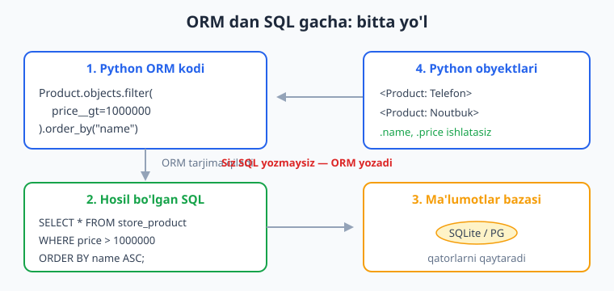
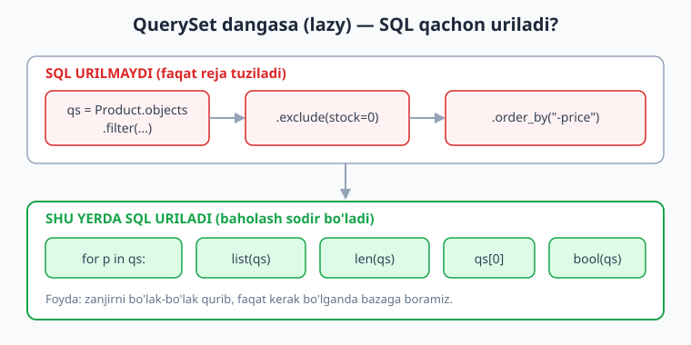
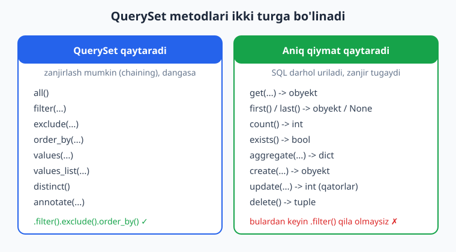

# 06 — ORM va QuerySet so'rovlar

[⬅️ Oldingi: 05 — Modellar va migratsiya](./05-modellar-migratsiya.md) · [🏠 README](./README.md) · [Keyingi: 07 — Model munosabatlari ➡️](./07-munosabatlar.md)

---

> **Bu bobda:** O'tgan bobda modellarni yaratdik va migratsiya bilan jadvallarni bazaga tushirdik. Endi eng qiziq qismi — o'sha jadvallardan ma'lumot olish, filtrlash, saralash, yangilash va o'chirish. Buni Django'da SQL yozmasdan, Python kodi bilan qilamiz. Buning siri — **ORM** (Object-Relational Mapper) va uning yuragi bo'lgan **QuerySet**.
>
> Bobda quyidagilarni o'rganasiz: `all`, `filter`, `exclude`, `get`, `first`/`last`, `order_by`, `values`, `values_list`, `count`, `exists` metodlari; maydon qidiruvlari (field lookups) — `gte`, `lte`, `contains`, `icontains`, `in`, `startswith`, `range`, `isnull`; QuerySet'ning **dangasa baholanishi** (lazy evaluation) va u nima uchun muhim; `get_object_or_404` bilan xavfsiz `get`; ko'p qatorni bir yo'la o'zgartirish — `update`, `delete`, `bulk_create`, `bulk_update`; metodlarni **zanjirlash** (chaining); va eng asosiysi — har bir ORM kodi orqasida qanday **SQL** yotishini ko'rish. Yo'l-yo'lakay `Q`, `F`, `aggregate`, `annotate`, `get_or_create` bilan ham tanishamiz.
>
> Hamma kod Django 6.0.6 da haqiqatan ishga tushirib tekshirilgan.

---

## ORM nima va nega kerak

Tasavvur qiling, bazadan barcha mahsulotlarni narxi bo'yicha kamayish tartibida olishingiz kerak. SQL bilan bu shunday yoziladi:

```sql
SELECT * FROM store_product ORDER BY price DESC;
```

Django ORM bilan esa shunday:

```python
Product.objects.order_by("-price")
```

**ORM** — bu Python obyektlari va relyatsion baza jadvallari orasidagi "tarjimon". Siz Python yozasiz, ORM uni SQL ga aylantiradi, bazaga yuboradi, qaytgan qatorlarni esa qaytadan Python obyektlariga aylantiradi. Natijada `product.name`, `product.price` deb obyekt sifatida ishlaysiz.



Nega bu yaxshi?

- **SQL yozmaysiz** — Pythonda qolaverasiz, xato kamayadi.
- **Baza mustaqilligi** — bir xil kod SQLite, PostgreSQL, MySQL'da ishlaydi (RUN paytida biz SQLite ishlatamiz; ishlab chiqarishda ko'pincha PostgreSQL — qarang [SQL bo'limi](../sql/README.md)).
- **Xavfsizlik** — ORM avtomatik parametrlaydi, demak SQL injection xavfi kamayadi.

> Agar SQL'ni umuman bilmasangiz, [SQL qo'llanmasi](../sql/README.md) ga bir ko'z tashlang — ORM tagida nima sodir bo'layotganini tushunish ancha osonlashadi. Pythonni esa bilishingiz shart deb faraz qilamiz ([Python qo'llanmasi](../python/README.md)).

### `objects` — Manager

Har bir modelda `objects` degan atribut bor — bu modelning **menejeri** (Manager). U so'rovlarning kirish nuqtasi. `Product.objects.all()`, `Product.objects.filter(...)` — barchasi shu menejerdan boshlanadi. Menejer chaqiruvlari sizga **QuerySet** qaytaradi.

---

## Tayyorgarlik: model va shell

Bob davomida shu modellardan foydalanamiz (5-bobdagi uslubda). Bu `store/models.py`:

```python
from django.db import models


class Category(models.Model):
    name = models.CharField(max_length=100)

    def __str__(self):
        return self.name


class Product(models.Model):
    name = models.CharField(max_length=200)
    price = models.DecimalField(max_digits=10, decimal_places=2)
    stock = models.IntegerField(default=0)
    is_active = models.BooleanField(default=True)
    category = models.ForeignKey(
        Category, on_delete=models.CASCADE, related_name="products", null=True
    )
    created_at = models.DateTimeField(auto_now_add=True)

    def __str__(self):
        return self.name
```

Migratsiyani qilib olamiz:

```bash
python manage.py makemigrations
python manage.py migrate
```

ORM bilan tajriba qilishning eng qulay joyi — **Django shell**. U oddiy Python REPL, lekin loyiha sozlamalari yuklangan holda:

```bash
python manage.py shell
```

Ichida modelni import qilib, darrov so'rov yozish mumkin:

```python
from store.models import Category, Product
from decimal import Decimal

elektronika = Category.objects.create(name="Elektronika")
kitoblar = Category.objects.create(name="Kitoblar")

Product.objects.create(name="Telefon", price=Decimal("3500000"), stock=10, category=elektronika)
Product.objects.create(name="Noutbuk", price=Decimal("8500000"), stock=3, category=elektronika)
Product.objects.create(name="Quloqchin", price=Decimal("250000"), stock=0, is_active=False, category=elektronika)
Product.objects.create(name="Python kitobi", price=Decimal("120000"), stock=25, category=kitoblar)
Product.objects.create(name="Django kitobi", price=Decimal("150000"), stock=15, category=kitoblar)
```

> **Diqqat:** `DecimalField` uchun narxni `Decimal("3500000")` ko'rinishida beramiz, `float` (`3500000.0`) emas — pul bilan ishlaganda `float` aniqlik xatolariga olib keladi. Shuning uchun `from decimal import Decimal` import qilamiz.

Yuqoridagi 5 mahsulot bilan bob misollarining natijalari aynan mos keladi.

---

## `all()` — hamma qatorlar

`all()` jadvaldagi barcha qatorlarni qamrab oluvchi QuerySet qaytaradi:

```python
>>> Product.objects.all()
<QuerySet [<Product: Telefon>, <Product: Noutbuk>, <Product: Quloqchin>, <Product: Python kitobi>, <Product: Django kitobi>]>

>>> Product.objects.all().count()
5
```

Diqqat qiling: bu hali ham QuerySet — ro'yxat (list) emas. Lekin u ustida `for` aylanish, indekslash, `len()` ishlatish mumkin, xuddi ro'yxatdek. Bu nima uchun shundayligini "Dangasa baholash" bo'limida ko'ramiz.

---

## `filter()` va `exclude()` — saralash

`filter()` shartga **mos** qatorlarni, `exclude()` esa shartga **mos kelmaydigan** qatorlarni qaytaradi.

```python
>>> # faqat elektronika kategoriyasidagilar
>>> Product.objects.filter(category=elektronika)
<QuerySet [<Product: Telefon>, <Product: Noutbuk>, <Product: Quloqchin>]>

>>> # faol BO'LMAGANlar (is_active=True bo'lganlarni chiqarib tashlaymiz)
>>> Product.objects.exclude(is_active=True)
<QuerySet [<Product: Quloqchin>]>
```

Bir nechta shartni vergul bilan bersangiz, ular **VA** (AND) bilan birlashadi — hammasi bir vaqtda bajarilishi kerak:

```python
>>> # ombor > 0 VA narx < 1 000 000
>>> Product.objects.filter(stock__gt=0, price__lt=Decimal("1000000"))
<QuerySet [<Product: Python kitobi>, <Product: Django kitobi>]>
```

SQL tilida bu `WHERE stock > 0 AND price < 1000000` ga teng.

---

## Maydon qidiruvlari (field lookups)

`filter(price=100)` — bu "narx aynan 100 ga teng" degani. Lekin ko'pincha "kattaroq", "ichida bor", "boshlanadi" kabi shartlar kerak. Buning uchun maydon nomidan keyin **ikkita pastki chiziq** `__` va qidiruv turini yozamiz: `maydon__lookup=qiymat`.

Eng ko'p ishlatiladiganlari:

| Lookup | Ma'nosi | SQL ekvivalenti |
|---|---|---|
| `gt` | katta (`>`) | `> qiymat` |
| `gte` | katta yoki teng (`>=`) | `>= qiymat` |
| `lt` | kichik (`<`) | `< qiymat` |
| `lte` | kichik yoki teng (`<=`) | `<= qiymat` |
| `contains` | ichida bor (registrga sezgir) | `LIKE %qiymat%` |
| `icontains` | ichida bor (registrga befarq) | `LIKE %qiymat%` (i) |
| `startswith` | shu bilan boshlanadi | `LIKE qiymat%` |
| `endswith` | shu bilan tugaydi | `LIKE %qiymat` |
| `in` | ro'yxatdagilardan biri | `IN (...)` |
| `range` | oraliqda | `BETWEEN a AND b` |
| `isnull` | NULL mi (True/False) | `IS NULL` |

Misollar (yuqoridagi 5 mahsulot bilan):

```python
>>> # narxi >= 150000 bo'lganlar
>>> Product.objects.filter(price__gte=Decimal("150000")).values_list("name", flat=True)
<QuerySet ['Telefon', 'Noutbuk', 'Quloqchin', 'Django kitobi']>

>>> # ombori <= 3
>>> Product.objects.filter(stock__lte=3).values_list("name", flat=True)
<QuerySet ['Noutbuk', 'Quloqchin']>

>>> # nomida "kitobi" bor (registrga sezgir)
>>> Product.objects.filter(name__contains="kitobi").values_list("name", flat=True)
<QuerySet ['Python kitobi', 'Django kitobi']>

>>> # registrga befarq — "KITOBI" ham topadi
>>> Product.objects.filter(name__icontains="KITOBI").values_list("name", flat=True)
<QuerySet ['Python kitobi', 'Django kitobi']>

>>> # ombor 0, 3 yoki 10 ga teng bo'lganlar
>>> Product.objects.filter(stock__in=[0, 3, 10]).values_list("name", flat=True)
<QuerySet ['Telefon', 'Noutbuk', 'Quloqchin']>

>>> # "P" harfi bilan boshlanadiganlar
>>> Product.objects.filter(name__startswith="P").values_list("name", flat=True)
<QuerySet ['Python kitobi']>

>>> # narxi 100000 dan 300000 gacha oraliqda
>>> Product.objects.filter(price__range=(Decimal("100000"), Decimal("300000"))).values_list("name", flat=True)
<QuerySet ['Quloqchin', 'Python kitobi', 'Django kitobi']>

>>> # kategoriyasi NULL bo'lganlar (bizda yo'q)
>>> Product.objects.filter(category__isnull=True).count()
0
```

### Bog'liq jadvaldan qidirish

`__` orqali bog'langan (ForeignKey) modelning maydonlariga ham kirish mumkin. Masalan, kategoriya nomi bo'yicha mahsulotlarni qidirish:

```python
>>> Product.objects.filter(category__name="Kitoblar").values_list("name", flat=True)
<QuerySet ['Python kitobi', 'Django kitobi']>
```

Bu yerda `category__name` — "mahsulotning kategoriyasining nomi" degani. ORM buni SQL JOIN ga aylantiradi. Bog'liqliklar haqida [7-bobda](./07-munosabatlar.md) batafsil to'xtalamiz.

---

## `get()` — bitta obyekt

`get()` aniq **bitta** obyekt qaytaradi (QuerySet emas). U primary key yoki noyob shart bo'yicha bitta yozuvni olishga mo'ljallangan:

```python
>>> p = Product.objects.get(name="Telefon")
>>> p.name, p.price
('Telefon', Decimal('3500000.00'))
```

`get()` ning ikkita muhim "tuzog'i" bor:

```python
>>> # 1) hech narsa topilmasa -> DoesNotExist
>>> Product.objects.get(name="Yo'q narsa")
Traceback (most recent call last):
  ...
store.models.Product.DoesNotExist: Product matching query does not exist.

>>> # 2) bittadan ko'p topilsa -> MultipleObjectsReturned
>>> Product.objects.get(category=elektronika)
Traceback (most recent call last):
  ...
store.models.Product.MultipleObjectsReturned: get() returned more than one Product -- it returned 3!
```

Shuning uchun `get()` ni ehtiyotkorlik bilan ishlatamiz va xatoni tutamiz:

```python
try:
    p = Product.objects.get(name="Telefon")
except Product.DoesNotExist:
    p = None
except Product.MultipleObjectsReturned:
    p = Product.objects.filter(name="Telefon").first()
```

> **Qachon `get`, qachon `filter`?** Bitta noyob yozuv kerak bo'lsa (pk, email kabi) — `get`. Nol, bitta yoki ko'p bo'lishi mumkin bo'lsa — `filter`. Web view'da esa quyida ko'radigan `get_object_or_404` eng qulay.

---

## `first()` va `last()`

`first()` QuerySet'ning birinchi obyektini, `last()` oxirgisini qaytaradi. Agar QuerySet bo'sh bo'lsa — `None` (xato emas!). Bu `get` dan farqli o'laroq, "yo'q bo'lsa ham mayli" holatlar uchun qulay:

```python
>>> Product.objects.order_by("price").first().name
'Python kitobi'

>>> Product.objects.order_by("price").last().name
'Noutbuk'

>>> # bo'sh QuerySet -> None, xato yo'q
>>> Product.objects.filter(name="Yo'q").first() is None
True
```

> **Muhim:** `first()`/`last()` mantiqan tartibga bog'liq. Aniq natija olish uchun avval `order_by(...)` qiling, aks holda baza qaysi qatorni "birinchi" deb hisoblashi noaniq.

---

## `order_by()` — saralash

Maydon nomi bo'yicha o'sish tartibida saralaydi. Oldiga `-` qo'ysangiz — kamayish tartibida:

```python
>>> # narx bo'yicha kamayish
>>> Product.objects.order_by("-price").values_list("name", "price")
<QuerySet [('Noutbuk', Decimal('8500000.00')), ('Telefon', Decimal('3500000.00')),
           ('Quloqchin', Decimal('250000.00')), ('Django kitobi', Decimal('150000.00')),
           ('Python kitobi', Decimal('120000.00'))]>

>>> # bir nechta maydon: avval kategoriya, keyin narx
>>> Product.objects.order_by("category", "-price")
```

`order_by("?")` — tasodifiy tartib (lekin katta jadvalda sekin). `order_by()` ni umuman chaqirmasangiz, tartib model `Meta.ordering` ga yoki bazaga bog'liq bo'ladi.

---

## `values()` va `values_list()` — to'liq obyekt emas

Ba'zan butun model obyekti kerakmas — faqat ayrim maydonlar kerak. Bu tezroq va kamroq xotira sarflaydi.

- `values(...)` — har bir qatorni **dict** sifatida qaytaradi.
- `values_list(...)` — har bir qatorni **tuple** sifatida qaytaradi.
- `values_list("maydon", flat=True)` — bitta maydon kerak bo'lsa, tuple emas, oddiy qiymatlar ro'yxatini beradi.

```python
>>> Product.objects.values("name", "price")[:2]
<QuerySet [{'name': 'Telefon', 'price': Decimal('3500000.00')},
           {'name': 'Noutbuk', 'price': Decimal('8500000.00')}]>

>>> Product.objects.values_list("name", "price")[:2]
<QuerySet [('Telefon', Decimal('3500000.00')), ('Noutbuk', Decimal('8500000.00'))]>

>>> # flat=True -> faqat nomlar ro'yxati
>>> list(Product.objects.values_list("name", flat=True))
['Telefon', 'Noutbuk', 'Quloqchin', 'Python kitobi', 'Django kitobi']
```

SQL tomonda `values("name", "price")` faqat `SELECT name, price` qiladi — `SELECT *` emas. Demak, JSON javob yoki hisobot uchun aynan kerak ustunlarni so'rab, ishlashni tezlashtirasiz.

---

## `count()` va `exists()`

`count()` — qatorlar sonini qaytaradi (`SELECT COUNT(*)`). `exists()` — kamida bitta qator bormi yo'qmi, `True`/`False` (`SELECT 1 ... LIMIT 1`).

```python
>>> Product.objects.filter(stock__gt=0).count()
4

>>> Product.objects.filter(price__gt=Decimal("10000000")).exists()
False

>>> Product.objects.filter(price__gt=Decimal("1000000")).exists()
True
```

> **Tezlik maslahati:** "Kamida bitta bormi?" degan savolga `count() > 0` emas, `exists()` ishlating — `exists()` baza darajasida `LIMIT 1` qo'yadi va tezroq. Xuddi shunday, "ro'yxat bo'shmi?" uchun `len(qs)` emas (u hamma qatorni yuklaydi), `qs.exists()` afzal.

---

## Dangasa baholash (lazy evaluation)

Bu ORM'ning eng muhim tushunchasi. **QuerySet yaratish bazaga so'rov yubormaydi.** SQL faqat siz natijani haqiqatan *ishlatganingizda* uriladi.

```python
>>> # Bu qator SQL URMAYDI — faqat "rejani" tuzadi
>>> qs = Product.objects.filter(stock__gt=0).exclude(is_active=False).order_by("-price")
>>> type(qs).__name__
'QuerySet'

>>> # Mana SHU YERDA SQL uriladi (list() baholaydi)
>>> list(qs)
[<Product: Noutbuk>, <Product: Telefon>, <Product: Django kitobi>, <Product: Python kitobi>]
```

QuerySet quyidagi holatlarda **baholanadi** (ya'ni SQL uriladi):

- `for x in qs:` — aylanish
- `list(qs)`, `len(qs)`
- `qs[0]` — indekslash
- `bool(qs)`, `if qs:` — mantiqiy kontekst
- `qs.first()`, `qs.count()`, `qs.exists()` kabi aniq qiymat qaytaruvchilar



Nega bu foydali? Chunki zanjirni bo'lak-bo'lak qurishingiz mumkin va faqat oxirida bir marta bazaga borasiz:

```python
qs = Product.objects.all()
if faqat_faollar:
    qs = qs.filter(is_active=True)
if min_narx:
    qs = qs.filter(price__gte=min_narx)
qs = qs.order_by("-price")
# Bu yergacha BITTA HAM SQL urilmadi.
mahsulotlar = list(qs)   # mana endi bitta optimal so'rov uriladi
```

### QuerySet keshi

Bir QuerySet bir marta baholangach, natija **keshlanadi**: o'sha *bir xil* QuerySet'ni qayta aylansangiz, bazaga ikkinchi marta bormaydi.

```python
qs = Product.objects.all()
list(qs)   # 1-marta: SQL uriladi
list(qs)   # keshdan oqaladi, SQL urilmaydi
```

Lekin har gal *yangi* QuerySet yaratsangiz (yangi `filter` chaqiruvi yangi obyekt qaytaradi), kesh ulashilmaydi va SQL qayta uriladi. Buni `connection.queries` bilan ko'ramiz (faqat `DEBUG=True` bo'lganda to'ladi):

```python
from django.db import connection, reset_queries

reset_queries()
list(Product.objects.filter(stock__gt=0))   # 1-so'rov (yangi QuerySet)
list(Product.objects.filter(stock__gt=0))   # 2-so'rov (yana yangi QuerySet)
print(len(connection.queries))
# 2
```

---

## Metodlarni zanjirlash (chaining)

`filter`, `exclude`, `order_by`, `values` kabi metodlar har biri **yangi QuerySet** qaytaradi. Shuning uchun ularni ketma-ket ulab ketish mumkin — bu **zanjirlash** (chaining):

```python
>>> Product.objects.filter(is_active=True).exclude(stock=0).order_by("-price").values_list("name", flat=True)
<QuerySet ['Noutbuk', 'Telefon', 'Django kitobi', 'Python kitobi']>
```

Lekin diqqat: `count()`, `get()`, `first()`, `exists()`, `aggregate()` kabi metodlar aniq qiymat (int, obyekt, bool, dict) qaytaradi — QuerySet emas. Shu sababli ulardan **keyin** boshqa metodni zanjirlay olmaysiz.



```python
# ❌ XATO: count() int qaytaradi, int'da .filter() yo'q
Product.objects.filter(stock__gt=0).count().filter(...)
#   AttributeError: 'int' object has no attribute 'filter'

# ✓ TO'G'RI: aniq qiymat qaytaruvchini OXIRIDA chaqiramiz
Product.objects.filter(stock__gt=0).order_by("name").count()
```

---

## SQL'ni o'z ko'zingiz bilan ko'rish

ORM tagida qanday SQL borligini bilish — debug va optimizatsiya uchun bebaho. QuerySet'ning `.query` atributi hosil bo'ladigan SQL'ni ko'rsatadi:

```python
>>> qs = Product.objects.filter(price__gt=Decimal("1000000")).order_by("name")
>>> print(qs.query)
SELECT "store_product"."id", "store_product"."name", "store_product"."price",
       "store_product"."stock", "store_product"."is_active", "store_product"."category_id",
       "store_product"."created_at"
FROM "store_product"
WHERE "store_product"."price" > 1000000
ORDER BY "store_product"."name" ASC
```

Slicing (`qs[:2]`) esa SQL'ga `LIMIT` qo'shadi — ya'ni Python emas, baza kesadi:

```python
>>> print(Product.objects.order_by("price")[:2].query)
SELECT ... FROM "store_product" ORDER BY "store_product"."price" ASC LIMIT 2
```

> **Maslahat:** `qs.explain()` esa bazaning bajarilish rejasini chiqaradi — sekin so'rovni tahlil qilishda asqotadi. SQL haqida chuqurroq bilim uchun [SQL bo'limiga](../sql/README.md) qarang.

---

## `get_object_or_404` — web view uchun xavfsiz get

Web ilovasida foydalanuvchi mavjud bo'lmagan ID so'rasa, `get()` `DoesNotExist` xatosini otadi va bu **500 server xatosi** ga aylanadi. To'g'risi esa — **404 Not Found** qaytarish. Django shuning uchun `get_object_or_404` qisqartmasini beradi: topsa — obyekt, topmasa — `Http404`.

Bu `store/views.py`:

```python
from django.http import JsonResponse
from django.shortcuts import get_object_or_404, get_list_or_404
from .models import Product


def product_list(request):
    products = Product.objects.filter(is_active=True).order_by("-price")
    data = list(products.values("id", "name", "price"))
    return JsonResponse({"products": data}, json_dumps_params={"default": str})


def product_detail(request, pk):
    # topilmasa avtomatik 404 qaytaradi
    product = get_object_or_404(Product, pk=pk)
    return JsonResponse({"name": product.name, "price": str(product.price)})


def cheap_products(request):
    # bo'sh ro'yxat bo'lsa 404 (get_list_or_404)
    products = get_list_or_404(Product, price__lt=1000000)
    return JsonResponse({"count": len(products)})
```

URL bilan ulaymiz (`shop/urls.py` — Django 6.0 idiomi, `path()`):

```python
from django.contrib import admin
from django.urls import path
from store import views

urlpatterns = [
    path("admin/", admin.site.urls),
    path("products/", views.product_list, name="product-list"),
    path("products/<int:pk>/", views.product_detail, name="product-detail"),
    path("cheap/", views.cheap_products, name="cheap"),
]
```

Buni `pytest-django` bilan tekshirdik — mavjud ID 200, mavjud bo'lmagani 404 qaytaradi:

```python
# store/tests.py
from decimal import Decimal
import pytest
from store.models import Category, Product


@pytest.fixture
def seed(db):
    c = Category.objects.create(name="Elektronika")
    Product.objects.create(name="Telefon", price=Decimal("3500000"), stock=10, category=c)
    Product.objects.create(name="Kitob", price=Decimal("120000"), stock=5, category=c)
    return c


def test_detail_200(client, seed):
    p = Product.objects.get(name="Telefon")
    resp = client.get(f"/products/{p.pk}/")
    assert resp.status_code == 200
    assert resp.json()["name"] == "Telefon"


def test_detail_404(client, seed):
    resp = client.get("/products/99999/")
    assert resp.status_code == 404
```

```bash
python -m pytest store/tests.py -v
# test_detail_200 PASSED
# test_detail_404 PASSED
```

> `get_object_or_404` birinchi argumenti model **yoki** QuerySet bo'lishi mumkin: `get_object_or_404(Product.objects.filter(is_active=True), pk=pk)` — faqat faol mahsulotlar ichidan qidiradi.

---

## Yangilash va o'chirish: `update()` va `delete()`

Bitta obyektni o'zgartirish odatdagidek: maydonni o'zgartirib `.save()` chaqirasiz:

```python
p = Product.objects.get(name="Telefon")
p.price = Decimal("3600000")
p.save()
```

Lekin **ko'p qatorni bir yo'la** o'zgartirish kerak bo'lsa, QuerySet'ning `update()` metodi ancha tezroq — u bitta `UPDATE ... WHERE ...` so'rovi yuboradi, har bir obyektni alohida yuklamaydi:

```python
>>> # elektronika kategoriyasidagi hamma narsaning ombori 100 ga
>>> Product.objects.filter(category=elektronika).update(stock=100)
3
```

`update()` o'zgartirilgan **qatorlar sonini** qaytaradi (int). Xuddi shunday `delete()`:

```python
>>> # faol bo'lmagan mahsulotlarni o'chiramiz
>>> Product.objects.filter(is_active=False).delete()
(1, {'store.Product': 1})
```

`delete()` jami nechta obyekt o'chirilgani va har model bo'yicha taqsimotni tuple sifatida qaytaradi.

> **Muhim ogohlantirish:** `update()` va `delete()` modelning `save()`/`delete()` metodlarini va `pre_save`/`post_save` signallarini **chaqirmaydi** — ular to'g'ridan-to'g'ri SQL yuboradi. Agar maxsus mantiq (`save()` da) kerak bo'lsa, obyektlarni aylanib chiqib alohida saqlang. Va, albatta, `Product.objects.all().delete()` HAMMA narsani o'chiradi — `filter` siz ehtiyot bo'ling.

### `F()` — ustunni ustunning o'zi orqali yangilash

Narxni 10% oshirish yoki omborni 1 ga kamaytirish kabi amallarda qiymatni Pythonda o'qib, qaytadan yozish kerak emas — `F()` ifoda bazada to'g'ridan-to'g'ri hisoblaydi (poyga holatlaridan ham himoya qiladi):

```python
>>> from django.db.models import F
>>> # ombori 5 dan ko'plarning omboriga 100 qo'shamiz, baza darajasida
>>> Product.objects.filter(stock__gt=5).update(stock=F("stock") + 100)
```

---

## Ko'p obyektni tez yaratish: `bulk_create` va `bulk_update`

100 ta obyektni `create()` bilan birma-bir yaratsangiz — 100 ta `INSERT`. `bulk_create()` esa hammasini **bitta** so'rovda kiritadi:

```python
>>> yangilar = [
...     Product(name="Sichqoncha", price=Decimal("90000"), stock=50, category=elektronika),
...     Product(name="Klaviatura", price=Decimal("180000"), stock=40, category=elektronika),
... ]
>>> Product.objects.bulk_create(yangilar)
[<Product: Sichqoncha>, <Product: Klaviatura>]
```

Ko'p mavjud obyektni bir yo'la o'zgartirish uchun `bulk_update()` — obyektlar ro'yxati va yangilanadigan maydonlar ro'yxatini beramiz:

```python
>>> ps = list(Product.objects.all())
>>> for p in ps:
...     p.is_active = False
>>> Product.objects.bulk_update(ps, ["is_active"])
7
>>> Product.objects.filter(is_active=True).count()
0
```

> `bulk_create` ham `save()`/signal'larni chetlab o'tadi — tezlik evaziga. Ommaviy import/seed uchun ideal. Node.js'da bunga `Model.bulkCreate` (Sequelize) mos keladi — solishtirish uchun [Node.js bo'limi](../nodejs/README.md).

---

## `Q` obyektlari — murakkab shartlar (OR, NOT)

`filter(a=1, b=2)` har doim **AND**. Lekin "narxi arzon **YOKI** ombori ko'p" kabi **OR** shart kerak bo'lsa, `Q` obyektidan foydalanamiz: `|` — OR, `&` — AND, `~` — NOT.

```python
>>> from django.db.models import Q
>>> # narxi < 200000 YOKI ombori > 20
>>> Product.objects.filter(Q(price__lt=Decimal("200000")) | Q(stock__gt=20)).values_list("name", flat=True)
<QuerySet ['Python kitobi', 'Django kitobi']>

>>> # kategoriyasi elektronika BO'LMAGANlar
>>> Product.objects.filter(~Q(category=elektronika)).values_list("name", flat=True)
<QuerySet ['Python kitobi', 'Django kitobi']>
```

---

## `aggregate` va `annotate` — yig'indilar

`aggregate()` butun QuerySet bo'yicha bitta natija (dict) qaytaradi — son, o'rtacha, max, min, sum:

```python
>>> from django.db.models import Count, Avg, Max, Min
>>> Product.objects.aggregate(
...     jami=Count("id"),
...     ortacha=Avg("price"),
...     eng_qimmat=Max("price"),
...     eng_arzon=Min("price"),
... )
{'jami': 5, 'ortacha': Decimal('2504000'), 'eng_qimmat': Decimal('8500000'), 'eng_arzon': Decimal('120000')}
```

`annotate()` esa har bir qatorga hisoblangan qiymat **qo'shadi** — odatda guruhlash (GROUP BY) uchun. Masalan, har kategoriyada nechta mahsulot bor:

```python
>>> Category.objects.annotate(mahsulot_soni=Count("products")).values("name", "mahsulot_soni")
<QuerySet [{'name': 'Elektronika', 'mahsulot_soni': 3}, {'name': 'Kitoblar', 'mahsulot_soni': 2}]>
```

---

## `get_or_create` va `update_or_create`

"Bor bo'lsa ol, yo'q bo'lsa yarat" naqshi juda tez-tez kerak bo'ladi. Buni ikkita so'rov bilan qo'lda yozish o'rniga `get_or_create()` bor — u `(obyekt, created)` tuple qaytaradi:

```python
>>> obj, created = Category.objects.get_or_create(name="Elektronika")
>>> created      # birinchi marta -> yaratildi
True
>>> obj, created = Category.objects.get_or_create(name="Elektronika")
>>> created      # endi mavjud -> yaratilmadi
False
```

`update_or_create()` — bor bo'lsa **yangilaydi**, yo'q bo'lsa yaratadi. `defaults` o'zgartiriladigan maydonlarni belgilaydi. Quyida `name="Soatfon"` ataylab **yangi** nom (seed'da yo'q), shuning uchun birinchi chaqiruv yangi yozuv yaratadi va `created=True` bo'ladi:

```python
>>> p, created = Product.objects.update_or_create(
...     name="Soatfon",
...     defaults={"price": Decimal("3000000"), "stock": 5, "category": obj},
... )
>>> created      # bunday nom yo'q edi -> yaratildi
True
>>> p, created = Product.objects.update_or_create(
...     name="Soatfon",
...     defaults={"price": Decimal("3200000")},
... )
>>> created, p.price      # endi mavjud -> faqat yangilandi
(False, Decimal('3200000'))
```

> `p.price` xotiradagi (`defaults`'dan kelgan) qiymat — `Decimal('3200000')`. Bazaga yozilgach `DecimalField(decimal_places=2)` uni `Decimal('3200000.00')` ko'rinishida saqlaydi; qayta o'qiganingizda (`Product.objects.get(...)`) `.00` bilan qaytadi.

---

## ORM ishlash tuzoqlari (qisqacha)

- **N+1 so'rov muammosi:** ro'yxatni aylanib, har birida bog'liq obyektni so'rasangiz (`for p in products: print(p.category.name)`), har qadamda yangi SQL uriladi. Yechim — `select_related`/`prefetch_related` ([7-bobda](./07-munosabatlar.md)).
- **Faqat kerakli ustunlarni oling:** katta jadvalda `values("id", "name")` yoki `only(...)` ishlatib, `SELECT *` dan qoching.
- **`exists()` va `count()` ni to'g'ri tanlang:** "bormi?" — `exists()`, "nechta?" — `count()`. `len(list(qs))` dan qoching.
- **`update()`/`delete()` signal chaqirmaydi** — maxsus `save()` mantiqingiz bo'lsa, e'tiborli bo'ling.

---

## Mashqlar

Quyidagi mashqlar uchun shu bobdagi `Category`/`Product` modellaridan foydalaning. Avval bobdagi 5 ta mahsulotni shell'da yaratib oling.

### Oson

1. Barcha mahsulotlar sonini chiqaring (`count()`).
2. Faqat `is_active=True` bo'lgan mahsulotlarni narxi bo'yicha o'sish tartibida oling.
3. Nomi "kitobi" ni o'z ichiga olgan mahsulotlarni toping (registrga befarq).
4. Narxi 1 000 000 dan katta bo'lgan mahsulot bormi? `True`/`False` qaytaring.
5. Faqat mahsulot nomlarini oddiy Python ro'yxati (`list`) sifatida oling.
6. Ombori 0 ga teng bo'lgan mahsulotni `filter` bilan toping va birinchisini `first()` bilan oling.

### O'rta

7. Narxi 100 000 dan 300 000 gacha oraliqdagi mahsulotlarni nomi bo'yicha saralangan holda chiqaring (`range` + `order_by`).
8. `get()` ni `try/except` bilan o'rab, mavjud bo'lmagan nom so'ralsa `None` qaytaradigan funksiya yozing.
9. "Kitoblar" kategoriyasidagi mahsulotlar nomlarini bog'liq qidiruv (`category__name`) orqali oling.
10. `Q` obyekti bilan: narxi < 200 000 **YOKI** ombori > 20 bo'lgan mahsulotlarni toping.
11. `bulk_create` bilan 3 ta yangi mahsulot kiriting, so'ng umumiy sonni chiqaring.
12. Har bir kategoriyada nechta mahsulot borligini `annotate(Count(...))` bilan hisoblang.

### Qiyin

13. `get_object_or_404` ishlatadigan `product_detail` view yozing va `pytest-django` bilan 200 va 404 holatlarini tekshiring.
14. `update()` va `F()` yordamida narxi 1 000 000 dan past bo'lgan barcha mahsulotlar narxini bitta so'rovda 10% ga oshiring (`F("price") * Decimal("1.1")`).
15. Quyidagi zanjirning hosil qiladigan SQL'ini `.query` bilan chiqaring va `LIMIT`/`WHERE`/`ORDER BY` borligini izohlang: `Product.objects.filter(is_active=True).exclude(stock=0).order_by("-price")[:3]`.

<details markdown="1"><summary>Yechimlar</summary>

### Oson

**1.**
```python
Product.objects.count()
# 5
```

**2.**
```python
Product.objects.filter(is_active=True).order_by("price")
```

**3.**
```python
Product.objects.filter(name__icontains="kitobi")
# <QuerySet [<Product: Python kitobi>, <Product: Django kitobi>]>
```

**4.**
```python
from decimal import Decimal
Product.objects.filter(price__gt=Decimal("1000000")).exists()
# True
```

**5.**
```python
list(Product.objects.values_list("name", flat=True))
# ['Telefon', 'Noutbuk', 'Quloqchin', 'Python kitobi', 'Django kitobi']
```

**6.**
```python
Product.objects.filter(stock=0).first()
# <Product: Quloqchin>
```

### O'rta

**7.**
```python
from decimal import Decimal
Product.objects.filter(price__range=(Decimal("100000"), Decimal("300000"))).order_by("name")
# <QuerySet [<Product: Django kitobi>, <Product: Python kitobi>, <Product: Quloqchin>]>
```

**8.**
```python
def mahsulot_top(nom):
    try:
        return Product.objects.get(name=nom)
    except Product.DoesNotExist:
        return None

mahsulot_top("Yo'q narsa")   # None
mahsulot_top("Telefon")      # <Product: Telefon>
```

**9.**
```python
list(Product.objects.filter(category__name="Kitoblar").values_list("name", flat=True))
# ['Python kitobi', 'Django kitobi']
```

**10.**
```python
from django.db.models import Q
from decimal import Decimal
Product.objects.filter(Q(price__lt=Decimal("200000")) | Q(stock__gt=20))
# <QuerySet [<Product: Python kitobi>, <Product: Django kitobi>]>
```

**11.**
```python
from decimal import Decimal
Product.objects.bulk_create([
    Product(name="Sichqoncha", price=Decimal("90000"), stock=50),
    Product(name="Klaviatura", price=Decimal("180000"), stock=40),
    Product(name="Monitor", price=Decimal("1200000"), stock=8),
])
Product.objects.count()
# 8
```

**12.**
```python
from django.db.models import Count
list(Category.objects.annotate(soni=Count("products")).values("name", "soni"))
# [{'name': 'Elektronika', 'soni': 3}, {'name': 'Kitoblar', 'soni': 2}]
```

### Qiyin

**13.** `views.py`:
```python
from django.http import JsonResponse
from django.shortcuts import get_object_or_404
from .models import Product

def product_detail(request, pk):
    product = get_object_or_404(Product, pk=pk)
    return JsonResponse({"name": product.name, "price": str(product.price)})
```
`urls.py`:
```python
path("products/<int:pk>/", views.product_detail, name="product-detail"),
```
`tests.py`:
```python
from decimal import Decimal
import pytest
from store.models import Product

@pytest.fixture
def seed(db):
    Product.objects.create(name="Telefon", price=Decimal("3500000"), stock=10)

def test_detail_200(client, seed):
    pk = Product.objects.get(name="Telefon").pk
    assert client.get(f"/products/{pk}/").status_code == 200

def test_detail_404(client, seed):
    assert client.get("/products/99999/").status_code == 404
```
```bash
python -m pytest -q
# 2 passed
```

**14.**
```python
from django.db.models import F
from decimal import Decimal
Product.objects.filter(price__lt=Decimal("1000000")).update(price=F("price") * Decimal("1.1"))
# o'zgartirilgan qatorlar soni qaytadi, masalan 3
```
`F("price") * Decimal("1.1")` bazada hisoblanadi — qiymatni Python'da o'qib-yozish shart emas, poyga holatidan ham xavfsiz.

**15.**
```python
qs = Product.objects.filter(is_active=True).exclude(stock=0).order_by("-price")[:3]
print(qs.query)
```
Hosil bo'lgan SQL (taxminan):
```sql
SELECT ... FROM "store_product"
WHERE "store_product"."is_active" AND NOT ("store_product"."stock" = 0)
ORDER BY "store_product"."price" DESC
LIMIT 3
```
Izoh: `filter(is_active=True)` -> `WHERE is_active`; `exclude(stock=0)` -> `AND NOT (stock = 0)`; `order_by("-price")` -> `ORDER BY price DESC`; slicing `[:3]` -> `LIMIT 3`. Ya'ni cheklash Pythonda emas, baza darajasida sodir bo'ladi — bu samarali.

</details>

---

## Xulosa

Bu bobda ORM'ning yuragi — QuerySet bilan ishlashni o'rgandik. Asosiy fikrlar:

- `objects` menejeridan boshlanadigan `all/filter/exclude/get/first/order_by/values/count/exists` — kundalik so'rovlarning asosi.
- Maydon qidiruvlari (`__gte`, `__icontains`, `__in`, `__range`, ...) shartlarni ifodalashning kuchli usuli.
- QuerySet **dangasa** — SQL faqat natija ishlatilganda uriladi; shuning uchun zanjirlash arzon va qulay.
- `get_object_or_404` — web view'da `get` o'rniga ishlatiladigan xavfsiz qisqartma.
- `update/delete/bulk_create/bulk_update` — ko'p qatorni samarali o'zgartirish (lekin `save()`/signal'larni chetlab o'tadi).
- `.query` bilan har doim tagidagi SQL'ni ko'rishingiz mumkin.

Keyingi bobda modellar orasidagi **munosabatlarga** (ForeignKey, ManyToMany, OneToOne) va `select_related`/`prefetch_related` bilan N+1 muammosini yengishga o'tamiz.

---

[⬅️ Oldingi: 05 — Modellar va migratsiya](./05-modellar-migratsiya.md) · [🏠 README](./README.md) · [Keyingi: 07 — Model munosabatlari ➡️](./07-munosabatlar.md)
