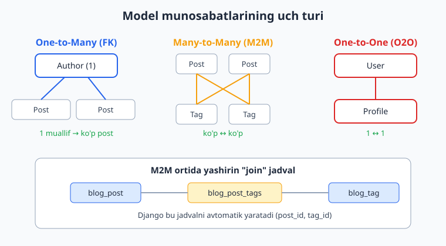
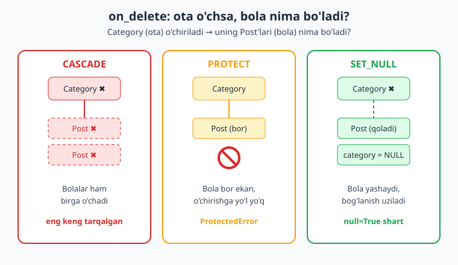
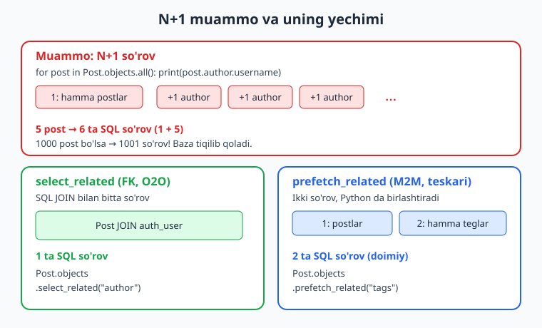

# 07 — Model munosabatlari

[⬅️ Oldingi: 06 — ORM va QuerySet so'rovlar](./06-orm-queryset.md) · [🏠 README](./README.md) · [Keyingi: 08 — Admin panel ➡️](./08-admin-panel.md)

---

> **Bu bobda:** real ilovalarda ma'lumotlar hech qachon yolg'iz bo'lmaydi — muallifning postlari, postning teglari, foydalanuvchining profili bir-biriga bog'langan. Shu bog'lanishlarni Django'da qanday ifodalashni o'rganamiz. `ForeignKey` orqali "bittadan ko'pga" (one-to-many) munosabatni, `ManyToManyField` orqali "ko'pdan ko'pga" (many-to-many) munosabatni, `OneToOneField` orqali "bitta-bittaga" (one-to-one) munosabatni quramiz. `on_delete` argumentining barcha muhim variantlarini (`CASCADE`, `PROTECT`, `SET_NULL`) amalda ko'rib, ota obyekt o'chganda bola obyektga nima bo'lishini boshqaramiz. `related_name` bilan teskari munosabatga chiroyli nom beramiz, related obyektlarga to'g'ri va teskari yo'nalishda kirishni, M2M ga qo'shimcha ma'lumot saqlash uchun `through` modelni ishlatishni o'rganamiz. Oxirida har bir Django dasturchisi duch keladigan eng mashhur ishlash muammosi — **N+1 so'rov** muammosiga kirishib, `select_related` va `prefetch_related` bilan uni qanday hal qilishni ko'ramiz. Modellarni bilmasangiz, avval [06-bobga](./06-orm-queryset.md) qayting; baza jadvallari va `JOIN` tushunchasi uchun [SQL qo'llanmasi](../sql/README.md) yordam beradi. Hamma kod Django 6.0.6 va Python 3.14 da haqiqatan ishga tushirib tekshirilgan.

---

## Nega munosabatlar kerak?

Tasavvur qiling, blog yozyapmiz. Har bir **postning** muallifi bor. Har bir muallif bir nechta post yozishi mumkin. Har bir post bir nechta **teg** (tag) bilan belgilanadi, va har bir teg ko'p postlarda uchraydi. Har bir foydalanuvchining bitta **profili** bor.

Bularning hammasini bitta jadvalga tiqishtirish mumkin emas — ma'lumot takrorlanib ketadi, yangilash kabusga aylanadi. Yechim: ma'lumotni alohida jadvallarga bo'lib, ular orasiga **bog'lanish** (munosabat) o'rnatish. Bu — relyatsion bazaning asosiy g'oyasi.

Django'da munosabatlarning uch turi bor:

| Tur | Maydon | Misol | Ma'no |
|---|---|---|---|
| One-to-many | `ForeignKey` | Post -> Author | Bitta muallifga ko'p post |
| Many-to-many | `ManyToManyField` | Post <-> Tag | Ko'p post, ko'p teg |
| One-to-one | `OneToOneField` | User -> Profile | Bitta foydalanuvchi, bitta profil |



Quyidagi misollar uchun `blog` ilovasida bitta `models.py` faylida ishlaymiz. To'liq fayl shunday ko'rinadi (qismlarini keyin bo'lim-bo'lim tushuntiramiz):

```python
# blog/models.py
from django.conf import settings
from django.db import models


class Profile(models.Model):
    user = models.OneToOneField(
        settings.AUTH_USER_MODEL,
        on_delete=models.CASCADE,
        related_name="profile",
    )
    bio = models.TextField(blank=True)


class Category(models.Model):
    name = models.CharField(max_length=100)

    def __str__(self):
        return self.name


class Tag(models.Model):
    name = models.CharField(max_length=50)

    def __str__(self):
        return self.name


class Post(models.Model):
    title = models.CharField(max_length=200)
    author = models.ForeignKey(
        settings.AUTH_USER_MODEL,
        on_delete=models.CASCADE,
        related_name="posts",
    )
    category = models.ForeignKey(
        Category,
        on_delete=models.SET_NULL,
        null=True,
        blank=True,
        related_name="posts",
    )
    tags = models.ManyToManyField(Tag, related_name="posts", blank=True)
    body = models.TextField(blank=True)
    created = models.DateTimeField(auto_now_add=True)

    def __str__(self):
        return self.title
```

> **Eslatma:** foydalanuvchiga ishora qilganda doim `settings.AUTH_USER_MODEL` ishlating, to'g'ridan-to'g'ri `from django.contrib.auth.models import User` import qilib `User` yozmang. Bu — Django'ning rasmiy tavsiyasi: kelajakda maxsus (custom) User modelga o'tsangiz, modellaringizni umuman o'zgartirmaysiz.

---

## ForeignKey — one-to-many munosabat

`ForeignKey` "bittadan ko'pga" munosabatni ifodalaydi. Bizning misolda: **bitta** muallif (User) **ko'p** post yozadi. `ForeignKey` maydoni har doim "ko'p" tomonda, ya'ni `Post` modelida turadi:

```python
class Post(models.Model):
    title = models.CharField(max_length=200)
    author = models.ForeignKey(
        settings.AUTH_USER_MODEL,   # qaysi modelga bog'lanamiz
        on_delete=models.CASCADE,   # author o'chsa, postlari ham o'chadi
        related_name="posts",       # teskari munosabat nomi (keyin tushuntiramiz)
    )
```

Bazada bu `Post` jadvaliga `author_id` ustunini qo'shadi — bu ustun `auth_user` jadvalining `id` ustuniga ishora qiluvchi **chet kalit** (foreign key). Buni Django avtomatik yaratadi. Generatsiya qilingan SQL'da quyidagini ko'rasiz:

```sql
CREATE TABLE "blog_post" (
    "id" integer NOT NULL PRIMARY KEY AUTOINCREMENT,
    "title" varchar(200) NOT NULL,
    ...
    "author_id" integer NOT NULL REFERENCES "auth_user" ("id"),
    "category_id" bigint NULL REFERENCES "blog_category" ("id")
);
```

`author_id` ustuni nomidagi `_id` qo'shimchasiga e'tibor bering: Python kodida `post.author` deb yozasiz (bu User obyektini qaytaradi), bazada esa `author_id` (faqat son) saqlanadi.

### To'g'ri munosabatga kirish: bola -> ota

Postdan uning muallifiga o'tish — eng oddiy yo'nalish. Maydon nomini ishlatasiz:

```python
post = Post.objects.create(title="Birinchi post", author=user)
print(post.author.username)   # bola -> ota: User obyekti
print(post.author_id)         # faqat ID kerak bo'lsa, qo'shimcha so'rovsiz
```

`post.author` baza so'rovi yuboradi (User obyektini olib keladi). Agar sizga faqat ID kerak bo'lsa, `post.author_id` ishlating — u allaqachon yuklangan, qo'shimcha so'rov yubormaydi. Bu kichik narsa, lekin tezlik uchun muhim.

### `null=True` qachon kerak?

Yuqoridagi `author` maydoni majburiy — har post muallifsiz bo'lolmaydi. Lekin `category` ixtiyoriy bo'lsin desak:

```python
category = models.ForeignKey(
    Category,
    on_delete=models.SET_NULL,
    null=True,    # bazada NULL bo'lishi mumkin
    blank=True,   # formada bo'sh qoldirish mumkin
)
```

`null=True` — **baza** darajasi (ustun NULL qabul qiladi). `blank=True` — **forma/validatsiya** darajasi (maydonni bo'sh qoldirsa bo'ladi). Ko'pincha ikkalasi birga keladi, lekin ular har xil narsa.

---

## related_name va teskari munosabat: ota -> bola

`ForeignKey` ikki yo'nalishli ko'prik yaratadi. Postdan muallifga o'tdik (`post.author`). Endi teskari: muallifdan uning **barcha postlariga** qanday o'tamiz?

Django har bir `ForeignKey` uchun avtomatik **teskari menejer** (reverse manager) yaratadi. `related_name="posts"` bergan bo'lsak, shunday yozamiz:

```python
user = User.objects.get(username="ali")
print(user.posts.count())       # ali ning postlari soni
print(user.posts.all())         # hamma postlari (QuerySet)
print(user.posts.filter(title__icontains="django"))  # filtrlash ham mumkin
```

`user.posts` — oddiy menejer, ya'ni unda `all()`, `filter()`, `count()`, `create()` va boshqalar bor. Bu — to'liq QuerySet, demak [06-bobdagi](./06-orm-queryset.md) hamma usullar ishlaydi.

### related_name bermasangiz nima bo'ladi?

Agar `related_name` ko'rsatmasangiz, Django standart nom yasaydi: `<model_nomi_kichik_harfda>_set`. Ya'ni:

```python
# related_name YO'Q bo'lsa:
user.post_set.all()   # _set qo'shimchasi bilan
```

`post_set` ishlaydi, lekin xunuk. `related_name="posts"` ancha tabiiy. Shuning uchun deyarli har doim `related_name` beriladi.

### Teskari menejerdan obyekt yaratish

Teskari menejer orqali to'g'ridan-to'g'ri yangi obyekt yaratish ham mumkin — bunda bog'lanish avtomatik o'rnatiladi:

```python
user = User.objects.get(username="ali")
# author=user ni alohida yozish shart emas, avtomatik bog'lanadi:
new_post = user.posts.create(title="Teskari menejerdan yaratildi")
print(new_post.author == user)   # True
```

> **Diqqat — to'g'rilik:** quyidagi ikki nom bir-biriga teskari, ularni adashtirmang.
>
> ```python
> post.author      # bola -> ota (maydon nomi, ForeignKey'da yozgan)
> user.posts       # ota -> bola (related_name, teskari menejer)
> ```

---

## on_delete — ota o'chganda bolaga nima bo'ladi?

`ForeignKey` va `OneToOneField` uchun `on_delete` **majburiy** argument. U bitta muhim savolga javob beradi: *ota obyekt (masalan Category) o'chirilsa, unga bog'langan bola obyektlar (Post'lar) bilan nima qilamiz?* Javobni noto'g'ri tanlasangiz, ma'lumotingiz "yetim" qoladi yoki tasodifan butun bir bo'lim o'chib ketadi.



Eng ko'p ishlatiladigan uchta variant:

### CASCADE — birga o'chadi

Ota o'chsa, hamma bolalari ham o'chadi. "Bu post bu foydalanuvchiga tegishli, foydalanuvchi yo'q bo'lsa postlari ham keraksiz" mantiqi uchun.

```python
author = models.ForeignKey(User, on_delete=models.CASCADE, related_name="posts")
```

Amalda:

```python
user = User.objects.create_user("dilshod")
post = Post.objects.create(title="Cascade test", author=user)
pid = post.id

user.delete()                                  # foydalanuvchini o'chiramiz
print(Post.objects.filter(id=pid).exists())    # False — post ham o'chdi
```

`CASCADE` — eng keng tarqalgan tanlov, lekin **ehtiyot bo'ling**: u jimgina butun zanjirni o'chiradi. Foydalanuvchini o'chirsangiz, uning postlari, postlarning izohlari... hammasi yo'qoladi.

### PROTECT — o'chirishni taqiqlaydi

Agar bog'langan bola obyektlar bo'lsa, ota obyektni o'chirishga umuman yo'l qo'ymaydi va `ProtectedError` ko'taradi. "Avval bog'langan yozuvlarni hal qilmasdan turib bu narsani o'chira olmaysan" mantiqi uchun. Misol: izohi bor postni tasodifan o'chirib qo'ymaslik.

```python
class Comment(models.Model):
    post = models.ForeignKey(Post, on_delete=models.PROTECT, related_name="comments")
    text = models.CharField(max_length=300)
```

Amalda:

```python
from django.db.models.deletion import ProtectedError

post = Post.objects.create(title="Muhim post", author=user)
Comment.objects.create(post=post, text="Zo'r maqola!")

try:
    post.delete()   # ❌ izohi bor, o'chmaydi
except ProtectedError:
    print("Postni o'chirib bo'lmaydi: unga bog'langan izohlar bor")
```

> **Kutilmagan, lekin foydali xatti-harakat:** `PROTECT` zanjir bo'ylab "tepaga" ham ta'sir qiladi. Agar `Post.author` `CASCADE`, lekin `Comment.post` `PROTECT` bo'lsa, izohi bor postga ega foydalanuvchini o'chirishga ham yo'l qo'yilmaydi. Sababi: foydalanuvchini o'chirish postlarini o'chirishga uriniladi (CASCADE), lekin postda himoyalangan izoh bor (PROTECT), shuning uchun butun amal bekor qilinadi. Bu xato emas — Django ma'lumotingizni shunday himoya qiladi.

### SET_NULL — bog'lanish uziladi, bola yashaydi

Ota o'chsa, bolaning chet kalit maydoni `NULL` ga o'rnatiladi. Bola obyekt o'chmaydi, faqat "bog'lanishi yo'qoladi". Buning uchun maydon `null=True` bo'lishi **shart**.

```python
category = models.ForeignKey(
    Category, on_delete=models.SET_NULL, null=True, blank=True, related_name="posts"
)
```

Amalda:

```python
cat = Category.objects.create(name="Texnologiya")
post = Post.objects.create(title="AI haqida", author=user, category=cat)

cat.delete()                  # kategoriyani o'chiramiz
post.refresh_from_db()        # postni bazadan qayta yuklaymiz
print(post.category)          # None — post qoldi, kategoriyasi yo'q
print(post.category_id)       # None
```

`refresh_from_db()` — muhim: `cat.delete()` faqat bazani o'zgartirdi, lekin Python xotirasidagi `post` obyekti hali eski qiymatni tutib turibdi. Yangi holatni ko'rish uchun obyektni bazadan qayta yuklaymiz.

### To'liq ro'yxat (qisqacha)

| Variant | Ota o'chsa bola... | `null=True` kerakmi? |
|---|---|---|
| `CASCADE` | birga o'chadi | yo'q |
| `PROTECT` | o'chirilmaydi (`ProtectedError`) | yo'q |
| `SET_NULL` | qoladi, FK = NULL | **ha** |
| `SET_DEFAULT` | qoladi, FK = default qiymat | yo'q (`default` kerak) |
| `SET(...)` | qoladi, FK = berilgan qiymat | holatga qarab |
| `DO_NOTHING` | hech narsa (baza o'zi hal qiladi — xavfli) | yo'q |
| `RESTRICT` | o'chirilmaydi (`RestrictedError`), lekin... | yo'q |

`RESTRICT` ning `PROTECT` dan aniq farqi: u ham o'chirishni taqiqlaydi (`RestrictedError` ko'taradi), **ammo** agar o'sha bolaning o'zi shu amal davomida boshqa `CASCADE` yo'li bilan o'chirilayotgan bo'lsa, unda ruxsat beradi. Ya'ni: bola allaqachon o'chib ketayotgan bo'lsa, `RESTRICT` to'sqinlik qilmaydi; `PROTECT` esa bunday vaziyatda ham qattiq taqiqlaydi. Bu nozik farq murakkab kaskad zanjirlarda kerak bo'ladi.

Amalda 90% holatlarda `CASCADE`, `PROTECT` yoki `SET_NULL` yetadi.

---

## ManyToManyField — many-to-many munosabat

Endi murakkabroq holat: **bitta post ko'p tegga ega, bitta teg ko'p postda uchraydi**. Bu "ko'pdan ko'pga" munosabat. Uni bitta chet kalit bilan ifodalab bo'lmaydi (`author_id` kabi bitta ustun yetmaydi). Yechim: alohida **bog'lovchi jadval** (join table). Django buni `ManyToManyField` orqali avtomatik yaratadi:

```python
class Post(models.Model):
    title = models.CharField(max_length=200)
    tags = models.ManyToManyField(Tag, related_name="posts", blank=True)
```

`makemigrations` qilganingizda Django yashirin `blog_post_tags` jadvalini yaratadi:

```sql
CREATE TABLE "blog_post_tags" (
    "id" integer NOT NULL PRIMARY KEY AUTOINCREMENT,
    "post_id" bigint NOT NULL REFERENCES "blog_post" ("id"),
    "tag_id"  bigint NOT NULL REFERENCES "blog_tag" ("id")
);
```

Bu jadvalning har bir qatori bitta "post-teg" juftligini ifodalaydi. Siz uni hech qachon to'g'ridan-to'g'ri ko'rmaysiz — ORM hammasini siz uchun boshqaradi.

### M2M bilan ishlash: add, remove, set, clear

`ForeignKey`dan farqli o'laroq, M2M maydonini `=` bilan o'rnatib bo'lmaydi. `post.tags = [...]` yozsangiz, Django uni ataylab taqiqlaydi va `TypeError` ko'taradi:

```python
# ❌ XATO: forward M2M ga to'g'ridan-to'g'ri biriktirish taqiqlangan
post.tags = [t1, t2]
# TypeError: Direct assignment to the forward side of a many-to-many
# set is prohibited. Use tags.set() instead.
```

Sababi: M2M bog'lanish alohida join jadvalda saqlanadi, oddiy ustun emas — shuning uchun uni atribut sifatida bevosita o'zlashtirib bo'lmaydi. Django sizni xatoning oldini olish uchun maxsus metodlarni ishlatishga majbur qiladi:

```python
post = Post.objects.create(title="Django darslari", author=user)
t1 = Tag.objects.create(name="django")
t2 = Tag.objects.create(name="python")

post.tags.add(t1, t2)        # teg
print(post.tags.count())     # 2

post.tags.remove(t1)         # bittasini olib tashlash
print(post.tags.count())     # 1

post.tags.set([t1, t2])      # to'liq qayta o'rnatish (eskisini almashtiradi)
print(post.tags.count())     # 2

post.tags.clear()            # hammasini uzish
print(post.tags.count())     # 0
```

| Metod | Vazifa |
|---|---|
| `.add(obj, ...)` | bog'lanish qo'shadi |
| `.remove(obj, ...)` | bog'lanishni olib tashlaydi |
| `.set([obj, ...])` | hammasini berilgan ro'yxatga almashtiradi |
| `.clear()` | hamma bog'lanishni uzadi |

Diqqat: `.add()`, `.remove()`, `.clear()` faqat **bog'lanishni** o'zgartiradi, `Tag` obyektlarining o'zini o'chirmaydi.

### Teskari yo'nalish M2M'da

M2M ikki tomonlama simmetrik. `related_name="posts"` berdik, demak tegdan postlarga ham o'tamiz:

```python
django_tag = Tag.objects.get(name="django")
print(django_tag.posts.all())     # bu teg bilan belgilangan hamma postlar
print(django_tag.posts.count())
```

### M2M bo'ylab filtrlash va `distinct()` tuzog'i

Munosabat bo'ylab filtrlashda ikki tomonli pastki chiziq (`__`) ishlatiladi:

```python
# "django" yoki "python" tegi bor postlar:
Post.objects.filter(tags__name__in=["django", "python"])
```

Ammo bu yerda klassik tuzoq bor. Agar bir postda **ikkala** teg ham bo'lsa, `JOIN` natijasida u **ikki marta** qaytadi:

```python
qs = Post.objects.filter(tags__name__in=["django", "python"])
print(qs.count())            # 2 — bir post ikki marta sanaldi! ❌
print(qs.distinct().count()) # 1 — to'g'ri natija ✅
```

M2M bo'ylab filtr ishlatganda dublikatdan qutulish uchun ko'pincha `.distinct()` qo'shish kerak. Buni eslab qolish muhim — debug paytida ko'p vaqt yeydi.

---

## OneToOneField — one-to-one munosabat

`OneToOneField` — aslida `unique=True` qo'yilgan `ForeignKey`. U "har bir A uchun aynan bitta B" munosabatini ifodalaydi. Eng mashhur ishlatilishi: standart `User` modelini buzmasdan unga qo'shimcha maydonlar qo'shish (profil naqshi).

```python
class Profile(models.Model):
    user = models.OneToOneField(
        settings.AUTH_USER_MODEL,
        on_delete=models.CASCADE,
        related_name="profile",
    )
    bio = models.TextField(blank=True)
```

Bazada bu `user_id` ustunini `UNIQUE` cheklov bilan yaratadi — ya'ni bitta foydalanuvchiga ikkita profil bog'lab bo'lmaydi:

```sql
CREATE TABLE "blog_profile" (
    "id" integer NOT NULL PRIMARY KEY AUTOINCREMENT,
    "bio" text NOT NULL,
    "user_id" integer NOT NULL UNIQUE REFERENCES "auth_user" ("id")
);
```

Ikkala yo'nalishda kirish — sodda, hech qanday `_set` yoki ro'yxat yo'q, chunki har tomondan aynan bitta obyekt bor:

```python
user = User.objects.create_user("ali")
profile = Profile.objects.create(user=user, bio="Backend dasturchi")

print(profile.user.username)   # to'g'ri: profile -> user
print(user.profile.bio)        # teskari: user -> profile (related_name)
```

### Yo'q profil tuzog'i

Agar foydalanuvchining profili hali yaratilmagan bo'lsa, `user.profile` ga murojaat qilish xato (`DoesNotExist`) ko'taradi:

```python
yangi = User.objects.create_user("yangi_user")
# bu user uchun Profile yaratilmagan

try:
    yangi.profile          # ❌ Profile.DoesNotExist
except Profile.DoesNotExist:
    print("Bu foydalanuvchining profili yo'q")

# Xavfsiz tekshiruv:
if hasattr(yangi, "profile"):
    print(yangi.profile.bio)
else:
    print("Profil yo'q")    # hasattr False qaytaradi
```

`hasattr(user, "profile")` — yo'q profil holatini xavfsiz tekshirishning oson yo'li.

---

## through — M2M ga qo'shimcha ma'lumot qo'shish

Oddiy `ManyToManyField` faqat "bog'langan/bog'lanmagan" faktini saqlaydi. Lekin ko'pincha bog'lanishning o'ziga **qo'shimcha ma'lumot** qo'shish kerak bo'ladi. Masalan: foydalanuvchi loyihaga a'zo — lekin u **qaysi rolda** (admin, muharrir) va **qachon** qo'shilgan?

Bu ma'lumotni na `User`, na `Project`ga qo'yib bo'lmaydi — u aynan bog'lanishga tegishli. Yechim: o'z qo'limiz bilan **oraliq model** (through model) yozish:

```python
class Project(models.Model):
    name = models.CharField(max_length=100)
    members = models.ManyToManyField(
        settings.AUTH_USER_MODEL,
        through="Membership",        # oraliq modelni ko'rsatamiz
        related_name="projects",
    )

    def __str__(self):
        return self.name


class Membership(models.Model):
    user = models.ForeignKey(settings.AUTH_USER_MODEL, on_delete=models.CASCADE)
    project = models.ForeignKey(Project, on_delete=models.CASCADE)
    role = models.CharField(max_length=50)        # qo'shimcha maydon!
    joined = models.DateField(auto_now_add=True)  # qo'shimcha maydon!
```

`Membership` — Django avtomatik yasaydigan yashirin join jadvalining o'rniga **bizniki**. Unda ikkita `ForeignKey` (har tomonga) va istalgancha qo'shimcha maydon bor.

### through model bilan ishlash

`through` ishlatilganda muhim cheklov bor: oddiy `.add(user)` **ishlamaydi**, chunki Django `role` maydoniga qanday qiymat qo'yishni bilmaydi. Ikki yo'l bor:

```python
user = User.objects.create_user("ali")
project = Project.objects.create(name="E-commerce sayt")

# 1-yo'l: Membership obyektini to'g'ridan-to'g'ri yaratish
Membership.objects.create(user=user, project=project, role="admin")

# 2-yo'l: through_defaults bilan .add() (Django 2.2+)
user2 = User.objects.create_user("vali")
project.members.add(user2, through_defaults={"role": "muharrir"})
```

O'qishda esa hammasi odatdagidek ishlaydi:

```python
print(project.members.count())                  # 2 — a'zolar soni
print(project.members.all())                    # User obyektlari
print(user.projects.all())                       # teskari: ali ning loyihalari

# qo'shimcha maydonga kirish uchun Membership orqali:
m = Membership.objects.get(user=user, project=project)
print(m.role)                                    # "admin"
```

`project.members` sizga `User` obyektlarini beradi (rol ko'rinmaydi). Rolni ko'rish uchun `Membership` jadvaliga murojaat qilasiz. Bu — `through` modelning to'lovi: ko'proq nazorat, lekin biroz ko'proq kod.

---

## N+1 muammosiga kirish

Endi har bir Django dasturchisi (va umuman ORM ishlatadigan har kim) duch keladigan eng mashhur ishlash muammosiga keldik. U shu qadar keng tarqalganki, o'z nomi bor: **N+1 so'rov muammosi**.

Tasavvur qiling, hamma postlarni muallifi bilan birga chiqarmoqchimiz:

```python
# ❌ N+1 MUAMMO
for post in Post.objects.all():        # 1 ta so'rov: hamma postlar
    print(post.title, post.author.username)   # HAR post uchun +1 so'rov!
```

Bu kod **toza ishlaydi**, lekin yashirin muammosi bor. `Post.objects.all()` bitta so'rov yuboradi. Lekin har bir `post.author` murojaati **alohida** baza so'rovi yuboradi, chunki muallif hali yuklanmagan. Agar 5 ta post bo'lsa: 1 (postlar) + 5 (har bir author) = **6 so'rov**. 1000 post bo'lsa — **1001 so'rov**! Baza tiqilib qoladi.



So'rovlar sonini o'lchab, buni o'z ko'zimiz bilan ko'ramiz. Django'da `CaptureQueriesContext` aynan shu uchun:

```python
from django.db import connection
from django.test.utils import CaptureQueriesContext

# N+1: select_related YO'Q
with CaptureQueriesContext(connection) as ctx:
    for post in Post.objects.all():
        _ = post.author.username
print("So'rovlar:", len(ctx.captured_queries))   # 6 (5 post uchun)
```

### Yechim 1: select_related (FK va O2O uchun)

`select_related` Django'ga "bu munosabatni darrov, SQL `JOIN` orqali olib kel" deydi. Natijada hammasi **bitta** so'rovda keladi. U `ForeignKey` va `OneToOneField` uchun ishlaydi (chunki bu yerda har bola uchun aynan bitta ota bor, `JOIN` qulay):

```python
# ✅ select_related bilan
with CaptureQueriesContext(connection) as ctx:
    for post in Post.objects.select_related("author"):
        _ = post.author.username
print("So'rovlar:", len(ctx.captured_queries))   # 1 ta!
```

5 ta postdan 6 so'rov o'rniga endi **1 ta** so'rov. 1000 post bo'lsa ham — baribir 1 ta.

### Yechim 2: prefetch_related (M2M va teskari munosabat uchun)

`ManyToManyField` yoki teskari `ForeignKey` (masalan `user.posts`) uchun `JOIN` ishlamaydi (har tomonda ko'p obyekt bor). Bu holatda `prefetch_related` ishlatamiz. U ikkita alohida so'rov yuboradi va natijani Python tomonda birlashtiradi:

```python
# ✅ prefetch_related bilan (M2M tags uchun)
with CaptureQueriesContext(connection) as ctx:
    for post in Post.objects.prefetch_related("tags"):
        _ = list(post.tags.all())
print("So'rovlar:", len(ctx.captured_queries))   # 2 ta (doimiy)
```

Postlar soni qancha bo'lishidan qat'i nazar, doimo **2 ta** so'rov: biri postlar uchun, ikkinchisi shu postlarga tegishli hamma teglar uchun.

### Qaysi birini ishlataman?

| Munosabat turi | Optimallashtirish |
|---|---|
| `ForeignKey` (bola -> ota) | `select_related` |
| `OneToOneField` | `select_related` |
| `ManyToManyField` | `prefetch_related` |
| Teskari `ForeignKey` (`user.posts`) | `prefetch_related` |

Ikkalasini birga ham ishlatish mumkin: `Post.objects.select_related("author").prefetch_related("tags")`.

> **Bu — kirish, davomi keyin.** N+1 muammosi va uning chuqurroq yechimlari (masalan `Prefetch` obyekti, `annotate` bilan birlashtirish, `only`/`defer`) bo'yicha to'liqroq ma'lumot ORM optimallashtirish bo'limida bo'ladi. Hozircha asosiy qoidani eslab qoling: **siklda munosabatga murojaat qilsangiz, ehtimol `select_related` yoki `prefetch_related` kerak.**

---

## Munosabatlarni test bilan mustahkamlash

Munosabatlar to'g'ri ishlashini `pytest-django` bilan tekshiramiz. Bu — har bir jiddiy loyihada bo'lishi kerak bo'lgan odat. (`pytest-django` o'rnatish va sozlash uchun keyingi test boblariga qarang; bu yerda faqat munosabatlarga oid testlarni ko'rsatamiz.)

```python
# blog/tests_rel.py
import pytest
from django.contrib.auth.models import User
from django.db.models import Count
from django.db.models.deletion import ProtectedError
from blog.models import Profile, Category, Tag, Post, Comment, Project, Membership


@pytest.mark.django_db
def test_foreignkey_reverse():
    u = User.objects.create_user("ali")
    Post.objects.create(title="A", author=u)
    Post.objects.create(title="B", author=u)
    assert u.posts.count() == 2          # teskari menejer ishlayapti
    assert Post.objects.first().author == u


@pytest.mark.django_db
def test_protect_blocks_delete():
    u = User.objects.create_user("ali")
    p = Post.objects.create(title="A", author=u)
    Comment.objects.create(post=p, text="izoh")
    with pytest.raises(ProtectedError):   # izohli post o'chmasligi kerak
        p.delete()


@pytest.mark.django_db
def test_set_null():
    u = User.objects.create_user("ali")
    c = Category.objects.create(name="K")
    p = Post.objects.create(title="A", author=u, category=c)
    c.delete()
    p.refresh_from_db()
    assert p.category_id is None          # post qoldi, kategoriyasi NULL


@pytest.mark.django_db
def test_annotate_count():
    u = User.objects.create_user("ali")
    Post.objects.create(title="A", author=u)
    Post.objects.create(title="B", author=u)
    qs = User.objects.annotate(n=Count("posts"))   # munosabat bo'ylab sanash
    assert qs.get(username="ali").n == 2


@pytest.mark.django_db
def test_m2m_distinct():
    u = User.objects.create_user("ali")
    p = Post.objects.create(title="A", author=u)
    t1 = Tag.objects.create(name="django")
    t2 = Tag.objects.create(name="python")
    p.tags.add(t1, t2)
    qs = Post.objects.filter(tags__name__in=["django", "python"])
    assert qs.count() == 2             # dublikat: bir post ikki marta sanaldi
    assert qs.distinct().count() == 1  # distinct() tuzatadi


@pytest.mark.django_db
def test_onetoone_missing_profile():
    u = User.objects.create_user("ali")
    assert not hasattr(u, "profile")   # profil hali yaratilmagan
    with pytest.raises(Profile.DoesNotExist):
        _ = u.profile
    Profile.objects.create(user=u, bio="Backend")
    u.refresh_from_db()
    assert u.profile.bio == "Backend"  # endi bor


@pytest.mark.django_db
def test_through_membership():
    u = User.objects.create_user("ali")
    proj = Project.objects.create(name="E-commerce")
    proj.members.add(u, through_defaults={"role": "admin"})
    assert proj.members.count() == 1
    assert u.projects.count() == 1     # teskari yo'nalish ishlayapti
    m = Membership.objects.get(user=u, project=proj)
    assert m.role == "admin"           # through modeldagi qo'shimcha maydon
```

Ishga tushirish:

```bash
python -m pytest blog/tests_rel.py -q
```

Natija: `7 passed`. Bu yetti test bobning asosiy g'oyalarini qamrab oladi: FK teskari menejer, `PROTECT`, `SET_NULL`, `annotate(Count(...))`, M2M `distinct()` tuzog'i, `OneToOneField` `DoesNotExist`, va `through` model. `test_annotate_count` dagi `annotate(Count("posts"))` — juda foydali naqsh: har bir foydalanuvchining nechta posti borligini **bitta** so'rovda hisoblaydi (yana N+1'dan qochish).

---

## Boshqa tillar bilan solishtirish

Agar [Node.js](../nodejs/README.md) ekotizimidan kelgan bo'lsangiz, Django ORM'ining munosabatlari Prisma yoki Sequelize'dagiga juda o'xshaydi: `ForeignKey` ~ `@relation`/`belongsTo`, `ManyToManyField` ~ implicit/explicit many-to-many, `select_related`/`prefetch_related` ~ Prisma'dagi `include`. N+1 muammosi esa tildan qat'i nazar — barcha ORM'larda bir xil. SQL darajasida nima sodir bo'layotganini chuqurroq tushunish uchun [SQL qo'llanmasidagi](../sql/README.md) `JOIN` boblariga murojaat qiling — `select_related` aslida shunchaki `INNER JOIN` (yoki `LEFT JOIN`) ekanini ko'rasiz.

---

## Mashqlar

### Oson

1. `Author` modeli (`name`) va `Book` modeli (`title`, `author` -> `ForeignKey`) yarating. Bitta muallifga bir nechta kitob bog'lash one-to-many ekanini tushuntiring. `ForeignKey` qaysi modelda turishi kerak?
2. `Book.author` maydoniga `related_name="books"` bering. Bitta muallifning hamma kitoblarini olib keladigan kod yozing.
3. `Book.author` ga `related_name` bermasangiz, muallifning kitoblariga qaysi nom bilan murojaat qilasiz?
4. `Post.author` maydonida `on_delete=models.CASCADE` turibdi. Foydalanuvchi o'chsa postlariga nima bo'ladi? Bir gap bilan yozing.
5. `category` maydoni `SET_NULL` bo'lishi uchun unga yana qaysi argument **majburiy** kerak? Nega?
6. `post.author` va `post.author_id` orasidagi farqni ayting: qaysi biri qo'shimcha baza so'rovi yuborishi mumkin?

### O'rta

7. `Student` va `Course` modellari orasida `ManyToManyField` o'rnating (talaba ko'p kursga yoziladi, kursda ko'p talaba). Bitta talabani uchta kursga yozing va keyin bittasidan chiqaring (`add`, `remove`).
8. 7-mashqdagi M2M ga `through` model qo'shing: `Enrollment` (`grade` maydoni bilan). Talabani kursga `through_defaults` orqali baho bilan yozing.
9. `Profile` (`OneToOneField` -> `User`) modeli yarating. Profili **yo'q** foydalanuvchida `user.profile` ga murojaat qilsangiz qanday xato chiqadi? Uni `hasattr` bilan xavfsiz tekshiradigan kod yozing.
10. `Post.objects.filter(tags__name__in=["a", "b"])` so'rovi nega ba'zan dublikat qaytaradi va buni qanday tuzatasiz?
11. Hamma postlarni muallifi bilan chiqaradigan siklni `select_related` siz va bilan yozing. `CaptureQueriesContext` orqali ikkala holatda so'rovlar sonini o'lchang.
12. `Comment.post` maydonida `on_delete=models.PROTECT` turibdi. Izohi bor postni o'chirishga uringanda nima bo'ladi? Buni `try/except` bilan ushlaydigan kod yozing.

### Qiyin

13. Bitta `for` siklida har bir postning ham muallifini (`FK`), ham teglarini (`M2M`) ishlatadigan kod yozing. Uni **eng kam** so'rov soniga optimallashtiring (maslahat: `select_related` va `prefetch_related` ni zanjir qiling) va `CaptureQueriesContext` bilan isbotlang.
14. `User.objects.annotate(...)` ishlatib, har bir foydalanuvchini posti soni bilan birga, **bitta** so'rovda chiqaring. Postga ega bo'lmagan foydalanuvchilar uchun son `0` bo'lishini tekshiring.
15. Quyidagi senariy uchun `on_delete` ni loyihalang va sababini yozing: `Order` (buyurtma) `Customer` (mijoz)ga bog'langan; `OrderItem` (buyurtma qatori) `Order`ga bog'langan; `OrderItem` `Product`ga ham bog'langan. Mijoz o'chsa buyurtmalari ham o'chsin; buyurtma o'chsa qatorlar ham o'chsin; lekin sotuvda ishlatilgan mahsulotni o'chirishga yo'l qo'yilmasin. Har bir FK uchun mos `on_delete` ni tanlang.

<details markdown="1">
<summary>Yechimlar</summary>

**1.**
```python
class Author(models.Model):
    name = models.CharField(max_length=100)

class Book(models.Model):
    title = models.CharField(max_length=200)
    # ForeignKey HAR DOIM "ko'p" tomonda turadi, ya'ni Book'da.
    # Bitta Author -> ko'p Book = one-to-many.
    author = models.ForeignKey(Author, on_delete=models.CASCADE)
```

**2.**
```python
class Book(models.Model):
    title = models.CharField(max_length=200)
    author = models.ForeignKey(Author, on_delete=models.CASCADE, related_name="books")

# Foydalanish:
author = Author.objects.get(name="Oqil")
author.books.all()         # shu muallifning hamma kitoblari
author.books.count()
```

**3.** `related_name` bermasangiz, standart nom `<model>_set` bo'ladi:
```python
author.book_set.all()      # _set qo'shimchasi bilan
```

**4.** Foydalanuvchi o'chirilsa, unga bog'langan hamma postlar ham avtomatik o'chadi (CASCADE — birga o'chish).

**5.** `null=True` majburiy. Sababi: `SET_NULL` ota o'chganda FK maydonini `NULL` ga o'rnatadi, demak bazaning ustuni `NULL` qabul qilishi shart. `null=True` bo'lmasa Django `makemigrations` paytida xato beradi.

**6.** `post.author` — User obyektini olib kelish uchun **qo'shimcha baza so'rovi** yuborishi mumkin (agar `select_related` bilan oldindan yuklanmagan bo'lsa). `post.author_id` esa allaqachon `Post` qatorida mavjud, **qo'shimcha so'rov yubormaydi** — faqat ID kerak bo'lganda shuni ishlating.

**7.**
```python
class Student(models.Model):
    name = models.CharField(max_length=100)

class Course(models.Model):
    title = models.CharField(max_length=200)
    students = models.ManyToManyField(Student, related_name="courses", blank=True)

# Foydalanish:
s = Student.objects.create(name="Ali")
c1 = Course.objects.create(title="Python")
c2 = Course.objects.create(title="Django")
c3 = Course.objects.create(title="SQL")
s.courses.add(c1, c2, c3)        # 3 kursga yozildi
print(s.courses.count())          # 3
s.courses.remove(c2)              # Django'dan chiqdi
print(s.courses.count())          # 2
```

**8.**
```python
class Course(models.Model):
    title = models.CharField(max_length=200)
    students = models.ManyToManyField(
        Student, through="Enrollment", related_name="courses"
    )

class Enrollment(models.Model):
    student = models.ForeignKey(Student, on_delete=models.CASCADE)
    course = models.ForeignKey(Course, on_delete=models.CASCADE)
    grade = models.CharField(max_length=2, blank=True)

# Foydalanish:
c.students.add(s, through_defaults={"grade": "A"})
# yoki:
Enrollment.objects.create(student=s, course=c, grade="A")
print(Enrollment.objects.get(student=s, course=c).grade)   # "A"
```

**9.**
```python
class Profile(models.Model):
    user = models.OneToOneField(User, on_delete=models.CASCADE, related_name="profile")
    bio = models.TextField(blank=True)

# Profili yo'q user'da:
u = User.objects.create_user("yangi")
# u.profile   -> Profile.DoesNotExist xatosi ko'tariladi

# Xavfsiz tekshiruv:
if hasattr(u, "profile"):
    print(u.profile.bio)
else:
    print("Profil hali yaratilmagan")
```
Xato turi: `Profile.DoesNotExist` (RelatedObjectDoesNotExist).

**10.** M2M bo'ylab filtr bazada `JOIN` qiladi. Agar bir post **ikkala** tegga ham ega bo'lsa, `JOIN` natijasida u har bir mos teg uchun bir martadan, ya'ni ikki marta qaytadi. Tuzatish — `.distinct()`:
```python
Post.objects.filter(tags__name__in=["a", "b"]).distinct()
```

**11.**
```python
from django.db import connection
from django.test.utils import CaptureQueriesContext

# N+1 (yomon):
with CaptureQueriesContext(connection) as ctx:
    for post in Post.objects.all():
        _ = post.author.username
print("select_related siz:", len(ctx.captured_queries))   # masalan 6

# Optimallashtirilgan:
with CaptureQueriesContext(connection) as ctx:
    for post in Post.objects.select_related("author"):
        _ = post.author.username
print("select_related bilan:", len(ctx.captured_queries)) # 1
```

**12.**
```python
from django.db.models.deletion import ProtectedError

post = Post.objects.create(title="Muhim", author=user)
Comment.objects.create(post=post, text="izoh")

try:
    post.delete()
except ProtectedError:
    print("Postni o'chirib bo'lmaydi: bog'langan izohlar bor")
# Post o'chmaydi, ProtectedError ko'tariladi.
```

**13.**
```python
from django.db import connection
from django.test.utils import CaptureQueriesContext

with CaptureQueriesContext(connection) as ctx:
    qs = Post.objects.select_related("author").prefetch_related("tags")
    for post in qs:
        _ = post.author.username      # FK -> select_related (JOIN, qo'shimcha so'rovsiz)
        _ = list(post.tags.all())     # M2M -> prefetch_related (1 qo'shimcha so'rov)
print("Jami so'rovlar:", len(ctx.captured_queries))
# Natija: 2 ta (1 ta postlar+author JOIN, 1 ta hamma teglar) — post soniga bog'liq emas.
```

**14.**
```python
from django.db.models import Count

qs = User.objects.annotate(post_soni=Count("posts"))
for u in qs:
    print(u.username, u.post_soni)
# Count() LEFT JOIN ishlatadi, shuning uchun postsiz user uchun ham
# qator chiqadi va post_soni = 0 bo'ladi (NULL emas). Bitta so'rov.
```

**15.**
```python
class Customer(models.Model):
    name = models.CharField(max_length=100)

class Product(models.Model):
    name = models.CharField(max_length=100)

class Order(models.Model):
    # Mijoz o'chsa buyurtmalari ham o'chsin -> CASCADE
    customer = models.ForeignKey(Customer, on_delete=models.CASCADE, related_name="orders")

class OrderItem(models.Model):
    # Buyurtma o'chsa qatorlari ham o'chsin -> CASCADE
    order = models.ForeignKey(Order, on_delete=models.CASCADE, related_name="items")
    # Sotuvda ishlatilgan mahsulotni o'chirishga yo'l qo'yilmasin -> PROTECT
    product = models.ForeignKey(Product, on_delete=models.PROTECT, related_name="order_items")
    quantity = models.PositiveIntegerField(default=1)
```
Sabablar:
- `Order.customer = CASCADE`: buyurtma mijozsiz mantiqsiz, shuning uchun birga o'chadi.
- `OrderItem.order = CASCADE`: qator buyurtmaning bir qismi, buyurtma o'chsa keraksiz.
- `OrderItem.product = PROTECT`: mahsulot tarix uchun muhim; sotilgan mahsulotni o'chirsak buyurtma qatori "yetim" qoladi va hisobotlar buziladi. PROTECT bunga yo'l qo'ymaydi.

</details>

---

[⬅️ Oldingi: 06 — ORM va QuerySet so'rovlar](./06-orm-queryset.md) · [🏠 README](./README.md) · [Keyingi: 08 — Admin panel ➡️](./08-admin-panel.md)
