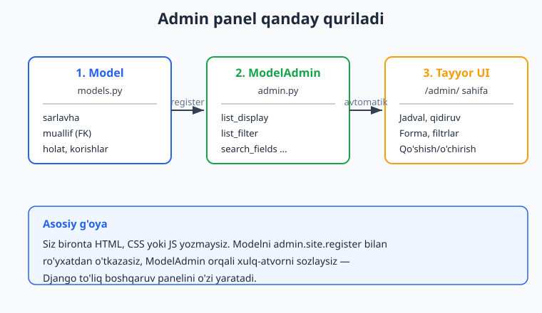
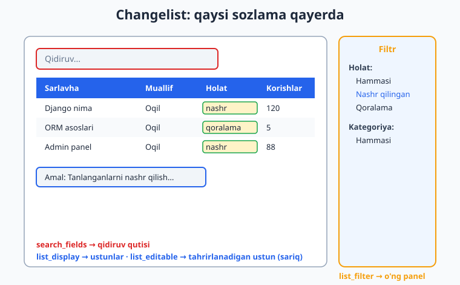
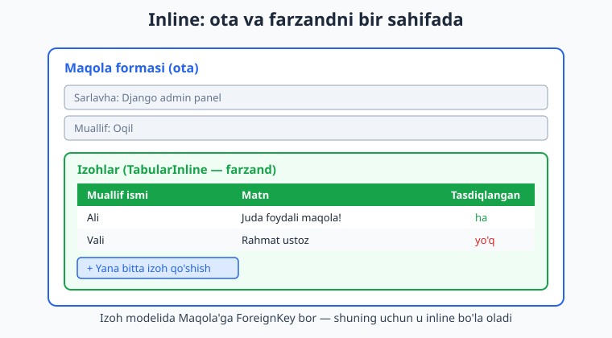

# 08 — Admin panel

[⬅️ Oldingi: 07 — Model munosabatlari](./07-munosabatlar.md) · [🏠 README](./README.md) · [Keyingi: 09 — Ilg'or ORM va optimizatsiya ➡️](./09-ilgor-orm.md)

---

> **Bu bobda:** Django'ning eng mashhur "sehri" — **admin panel** bilan tanishamiz. Bironta HTML, CSS yoki JavaScript yozmasdan, faqat bir necha qator Python kodi bilan ma'lumotlarni qo'shish, ko'rish, tahrirlash va o'chirish uchun to'liq boshqaruv interfeysini olamiz. Avval `createsuperuser` bilan admin foydalanuvchi yaratamiz va `/admin/` ga kiramiz. So'ng modellarni `admin.site.register` bilan ro'yxatdan o'tkazamiz. Keyin **`ModelAdmin`** sinfi orqali panelni sozlaymiz: ro'yxat sahifasidagi ustunlar (`list_display`), o'ng paneldagi filtrlar (`list_filter`), qidiruv qutisi (`search_fields`), tartiblash (`ordering`), ro'yxatda to'g'ridan-to'g'ri tahrirlash (`list_editable`). Forma sahifasini chiroyli guruhlarga ajratamiz (`fieldsets`), ba'zi maydonlarni faqat o'qish uchun qilamiz (`readonly_fields`). Bog'liq yozuvlarni ota model formasi ichida tahrirlashni o'rganamiz (`TabularInline` va `StackedInline`). Bir vaqtning o'zida yuzlab yozuvga ta'sir qiladigan **admin actions** yozamiz. Oxirida `@admin.display` dekoratori bilan maxsus ustunlar va `admin.site` sozlamalari. Hamma kod Django 6.0.6 da haqiqatan ishga tushirib tekshirilgan.

---

## Nega admin panel — Django'ning sovg'asi

Tasavvur qiling: blog sayti qildingiz. Maqola qo'shish kerak. Maqola modelingiz bor, lekin uni baza ichiga qanday kiritasiz? Qo'lda SQL `INSERT` yozasizmi? Yangi maqola formasi, ro'yxat sahifasi, "o'chirish" tugmasi — bularning hammasini noldan yozasizmi?

Aksariyat veb-freymvorklarda aynan shunday — boshqaruv panelini o'zingiz qurasiz. Django esa boshqacha yo'l tutadi: u **modellaringizni o'qiydi va ular asosida to'liq ishlaydigan admin interfeysini avtomatik yaratadi**. Maydonlaringiz qanday bo'lsa — matn qutisi, sana tanlagich, ochiluvchi ro'yxat (ForeignKey uchun) — Django mosini tanlaydi.

Bu shunchaki demo emas. Django admin paneli — kuchli, xavfsiz va kengaytiriladigan vosita. Ko'p loyihalarda kontent muharrirlari, moderatorlar va menejerlar aynan shu panel bilan ishlaydi. Sayt foydalanuvchilari ko'radigan jamoatchilik yuzini (frontend) siz alohida qurasiz, lekin **ichki boshqaruv** uchun admin panel ko'pincha yetarli.



> **Python eslatma.** Bu bob to'liq Python sinflari va dekoratorlariga tayanadi. Agar `class`, meros (inheritance) yoki `@dekorator` sintaksisi yodingizdan ko'tarilgan bo'lsa, [Python qo'llanmasiga](../python/README.md) bir nazar tashlang. Django'ga xos hamma narsani esa shu yerda to'liq tushuntiramiz.

Bu bobda quyidagi modellar bilan ishlaymiz (`blog/models.py`). Bular [07-bobdagi munosabatlar](./07-munosabatlar.md) bilimini davom ettiradi: bitta `Muallif` ko'p `Maqola` yozadi, har `Maqola` ko'p `Izoh`ga ega.

```python
# blog/models.py
from django.db import models


class Muallif(models.Model):
    ism = models.CharField(max_length=100)
    email = models.EmailField(blank=True)

    def __str__(self):
        return self.ism


class Kategoriya(models.Model):
    nom = models.CharField(max_length=50)

    class Meta:
        verbose_name_plural = "Kategoriyalar"

    def __str__(self):
        return self.nom


class Maqola(models.Model):
    HOLAT = [
        ("qoralama", "Qoralama"),
        ("nashr", "Nashr qilingan"),
    ]
    sarlavha = models.CharField(max_length=200)
    slug = models.SlugField(max_length=200, blank=True)
    muallif = models.ForeignKey(Muallif, on_delete=models.CASCADE, related_name="maqolalar")
    kategoriya = models.ForeignKey(Kategoriya, on_delete=models.SET_NULL, null=True, blank=True)
    matn = models.TextField()
    holat = models.CharField(max_length=10, choices=HOLAT, default="qoralama")
    korishlar = models.IntegerField(default=0)
    yaratilgan = models.DateTimeField(auto_now_add=True)

    def __str__(self):
        return self.sarlavha


class Izoh(models.Model):
    maqola = models.ForeignKey(Maqola, on_delete=models.CASCADE, related_name="izohlar")
    muallif_ism = models.CharField(max_length=100)
    matn = models.TextField()
    tasdiqlangan = models.BooleanField(default=False)

    def __str__(self):
        return f"{self.muallif_ism}: {self.matn[:30]}"
```

> **`__str__` haqida muhim eslatma.** Har modelda `__str__` metodi bo'lishi admin panel uchun juda muhim. Aks holda admin har bir yozuvni `Maqola object (1)` ko'rinishida ko'rsatadi — foydasiz. `__str__` qaytargan matn esa odam o'qiy oladigan nom bo'ladi. Bu kichik metod butun panel ko'rinishini yaxshilaydi.

---

## 1-qadam: superuser yaratish va `/admin/` ga kirish

Admin panelga kirish uchun avval **superuser** (cheksiz huquqli foydalanuvchi) kerak. Buni `createsuperuser` buyrug'i yaratadi. Migratsiyalar bajarilgan bo'lishi shart (admin va auth jadvallari kerak):

```bash
python manage.py migrate
python manage.py createsuperuser
```

Buyruq sizdan foydalanuvchi nomi, email (ixtiyoriy) va parol so'raydi. Parolni ikki marta kiritasiz (ekranda ko'rinmaydi — bu normal):

```text
Username: admin
Email address: admin@example.uz
Password:
Password (again):
Superuser created successfully.
```

So'ng serverni ishga tushirib, brauzerda `http://127.0.0.1:8000/admin/` ga kiring:

```bash
python manage.py runserver
```

> **Eslatma.** `runserver` — bu ishlab chiqish (development) serveri, ishlab chiqarish (production) uchun emas. Uni deploy bobida [git-github](../git-github/README.md) va keyingi boblarda gunicorn/uvicorn bilan almashtiramiz. Hozircha mahalliy ishlash uchun ideal.

`admin/` URL'i loyiha yaratilganda `urls.py` ga avtomatik qo'shilgan bo'ladi:

```python
# mysite/urls.py
from django.contrib import admin
from django.urls import path

urlpatterns = [
    path("admin/", admin.site.urls),
]
```

### Skript orqali superuser (CI uchun)

Interaktiv so'roq CI/CD yoki Docker'da ishlamaydi. Shunda `--noinput` bayrog'i va atrof-muhit o'zgaruvchilaridan foydalaning. Parolni `DJANGO_SUPERUSER_PASSWORD` ga qo'yasiz:

```bash
# Linux/macOS
DJANGO_SUPERUSER_PASSWORD=parol12345 python manage.py createsuperuser \
    --noinput --username admin --email admin@example.uz
```

```powershell
# Windows PowerShell
$env:DJANGO_SUPERUSER_PASSWORD = "parol12345"
python manage.py createsuperuser --noinput --username admin --email admin@example.uz
```

Bu usul aynan shu bobni tekshirishda ishlatildi va `Superuser created successfully.` natijasini berdi.

> **Xavfsizlik.** Haqiqiy parolni hech qachon kodga yoki Git'ga yozmang. Atrof-muhit o'zgaruvchisi (`.env` fayl, deploy platformasi sirlari) orqali bering. Bu naqsh deploy bosqichida muhim bo'ladi.

---

## 2-qadam: modelni ro'yxatdan o'tkazish — `admin.site.register`

Yangi superuser bilan `/admin/` ga kirsangiz, faqat **Users** va **Groups** ko'rasiz. Sizning `Maqola`, `Muallif` modellaringiz yo'q — chunki ularni hali admin'ga **e'lon qilmadingiz**.

Buni `blog/admin.py` faylida qilamiz. Eng oddiy ro'yxatdan o'tkazish:

```python
# blog/admin.py
from django.contrib import admin
from .models import Muallif, Kategoriya, Maqola, Izoh

admin.site.register(Muallif)
admin.site.register(Kategoriya)
admin.site.register(Maqola)
admin.site.register(Izoh)
```

Endi sahifani yangilang — to'rt model ham paydo bo'ldi. Har biriga bosib, yozuv qo'shishingiz, tahrirlashingiz, o'chirishingiz mumkin. **Hech qanday HTML yozmadingiz** — Django modellardan formani avtomatik qurdi.

> **Bu qanday ishlaydi?** Django ishga tushganda har bir ilovaning `admin.py` faylini avtomatik **import qiladi** (`django.contrib.admin` ning `autodiscover` mexanizmi). Shu import paytida `register` chaqiruvlari ishga tushadi va modellar global `admin.site` obyektiga qo'shiladi. Shuning uchun sozlamalaringiz aynan `admin.py` da bo'lishi kerak.

Hozircha hammasi standart. Maqolalar ro'yxati `__str__` natijasini bitta ustunda ko'rsatadi, filtrlar va qidiruv yo'q. Buni yaxshilash uchun `ModelAdmin` kerak.

---

## `ModelAdmin` — panelni sozlash markazi

`admin.site.register(Maqola)` deganda Django ichki sukut bo'yicha `ModelAdmin` sinfini ishlatadi. Panelni sozlash uchun shu sinfdan **meros olib**, o'z sozlamalaringizni yozasiz.

Ikki yozish uslubi bor. Birinchisi — `register` ga ikkinchi argument sifatida sinfni berish:

```python
# blog/admin.py
from django.contrib import admin
from .models import Maqola


class MaqolaAdmin(admin.ModelAdmin):
    list_display = ["sarlavha", "holat", "korishlar"]


admin.site.register(Maqola, MaqolaAdmin)
```

Ikkinchisi — **dekorator** uslubi. Bu zamonaviy va toza ko'rinadi, shuning uchun bu bobda asosan shuni ishlatamiz:

```python
# blog/admin.py
from django.contrib import admin
from .models import Maqola


@admin.register(Maqola)
class MaqolaAdmin(admin.ModelAdmin):
    list_display = ["sarlavha", "holat", "korishlar"]
```

Ikkalasi ham bir xil ishlaydi. `@admin.register(Maqola)` ostidagi sinfni avtomatik `Maqola` modeli uchun ro'yxatdan o'tkazadi. Endi `ModelAdmin` ning asosiy sozlamalarini birma-bir ko'rib chiqamiz.

---

## `list_display` — ro'yxat sahifasidagi ustunlar

Sukut bo'yicha ro'yxat (changelist) sahifasi faqat `__str__` ni bitta ustunda ko'rsatadi. `list_display` esa qaysi maydonlar **ustun** sifatida ko'rinishini belgilaydi:

```python
# blog/admin.py
@admin.register(Maqola)
class MaqolaAdmin(admin.ModelAdmin):
    list_display = ["sarlavha", "muallif", "holat", "korishlar", "yaratilgan"]
```

Endi maqolalar ro'yxati jadval ko'rinishida — har maqola uchun sarlavha, muallif, holat, ko'rishlar soni va yaratilgan sana ustunlari. Ustun sarlavhasiga bosish bilan o'sha ustun bo'yicha tartiblash ham mumkin.



> **Diqqat.** `list_display` ga `ManyToManyField` ni to'g'ridan-to'g'ri qo'sha olmaysiz (chunki bir yozuv ko'p qiymatga ega) — Django xato beradi. Bunday holatda maxsus metod yozasiz (pastda `@admin.display` qismida ko'ramiz). `ForeignKey` esa (masalan `muallif`) muammosiz ishlaydi — u modelning `__str__` ini ko'rsatadi.

---

## `list_filter` — o'ng paneldagi filtrlar

Yuzlab maqola orasidan faqat "nashr qilingan"larini ko'rmoqchimisiz? `list_filter` o'ng tomonda filtr panelini paydo qiladi:

```python
# blog/admin.py
@admin.register(Maqola)
class MaqolaAdmin(admin.ModelAdmin):
    list_display = ["sarlavha", "muallif", "holat", "korishlar", "yaratilgan"]
    list_filter = ["holat", "kategoriya", "yaratilgan"]
```

Endi o'ng panelda uch filtr:

- **holat** — `choices` borligi uchun "Qoralama" / "Nashr qilingan" tugmalari.
- **kategoriya** — `ForeignKey` borligi uchun mavjud kategoriyalar ro'yxati.
- **yaratilgan** — sana maydoni borligi uchun "Bugun", "So'nggi 7 kun", "Shu oy" kabi aqlli vaqt filtrlar.

Django maydon turiga qarab mos filtr widget'ini o'zi tanlaydi. Bu kichik qator katta qulaylik beradi.

---

## `search_fields` — qidiruv qutisi

`search_fields` ro'yxat sahifasining yuqorisida qidiruv qutisini paydo qiladi va qaysi maydonlar bo'yicha qidirilishini belgilaydi:

```python
# blog/admin.py
@admin.register(Maqola)
class MaqolaAdmin(admin.ModelAdmin):
    list_display = ["sarlavha", "muallif", "holat", "korishlar", "yaratilgan"]
    list_filter = ["holat", "kategoriya", "yaratilgan"]
    search_fields = ["sarlavha", "matn"]
```

Endi qidiruv qutisiga "Django" yozsangiz, sarlavhasi yoki matni ichida "Django" bor maqolalar chiqadi (katta-kichik harf farqsiz, qisman moslik — ya'ni `icontains`).

**Bog'liq model ichida ham qidirish** mumkin — ikki pastki chiziq (`__`) bilan munosabatga kirasiz. Masalan muallif ismi bo'yicha qidirish:

```python
# blog/admin.py
    search_fields = ["sarlavha", "matn", "muallif__ism"]
```

> **Texnik nozik.** `muallif__ism` — bu [07-bobdagi munosabatlar](./07-munosabatlar.md) sintaksisining o'zi. Django bu so'rovni baza darajasida `JOIN` ga aylantiradi. SQL'da bu qanday ishlashini bilmoqchi bo'lsangiz, [SQL qo'llanmaga](../sql/README.md) qarang. Ko'p maydonli qidiruv katta jadvallarda sekin bo'lishi mumkin — production'da indekslar yoki to'liq matnli qidiruv (PostgreSQL) kerak bo'ladi.

---

## `ordering` va `list_editable`

**`ordering`** ro'yxat sukut bo'yicha qanday tartibda chiqishini belgilaydi. Minus belgisi (`-`) teskari tartib (kattadan kichikka):

```python
# blog/admin.py
    ordering = ["-yaratilgan"]   # eng yangi maqola tepada
```

**`list_editable`** esa bir ajoyib imkoniyat: ro'yxat sahifasidan **chiqmasdan**, to'g'ridan-to'g'ri ustunni tahrirlash. Masalan har maqolaning holatini bittalab ochmasdan o'zgartirish:

```python
# blog/admin.py
@admin.register(Maqola)
class MaqolaAdmin(admin.ModelAdmin):
    list_display = ["sarlavha", "muallif", "holat", "korishlar", "yaratilgan"]
    list_filter = ["holat", "kategoriya", "yaratilgan"]
    search_fields = ["sarlavha", "matn"]
    ordering = ["-yaratilgan"]
    list_editable = ["holat"]
```

Endi `holat` ustuni ochiluvchi ro'yxatga aylanadi — bir necha maqolaning holatini o'zgartirib, pastdagi "Saqlash" tugmasini bossangiz, hammasi bir zumda yangilanadi.

> **Muhim qoida (xato manbai).** `list_editable` dagi maydon `list_display` da **ham bo'lishi shart**. Bundan tashqari, `list_display` ning **birinchi** elementi `list_editable` da bo'lmasligi kerak — birinchi ustun yozuv sahifasiga havola bo'lib qoladi va tahrirlash bilan to'qnashadi. Yuqorida `sarlavha` birinchi (havola), `holat` esa tahrirlanadi — to'g'ri naqsh. Aks holda (birinchi ustun `list_editable` da bo'lsa) Django ishga tushishda aniq `admin.E124` xatosini beradi.

```python
# ❌ XATO: birinchi ustun list_editable da bo'lishi mumkin emas
@admin.register(Maqola)
class XatoAdmin(admin.ModelAdmin):
    list_display = ["holat", "sarlavha"]
    list_editable = ["holat"]      # birinchi ustun -> admin.E124 xatosi
```

---

## `fieldsets` — forma sahifasini guruhlash

Hozirgacha **ro'yxat** sahifasi haqida gaplashdik. Endi bitta yozuvga bosganda ochiladigan **forma** (change) sahifasini sozlaymiz.

Sukut bo'yicha forma barcha maydonlarni bir uzun ro'yxatda ko'rsatadi. `fieldsets` esa maydonlarni mantiqiy bo'limlarga ajratadi — bu, ayniqsa, ko'p maydonli modellarda formani o'qishni yengillashtiradi:

```python
# blog/admin.py
@admin.register(Maqola)
class MaqolaAdmin(admin.ModelAdmin):
    list_display = ["sarlavha", "muallif", "holat", "korishlar", "yaratilgan"]
    fieldsets = [
        ("Asosiy", {"fields": ["sarlavha", "slug", "muallif", "kategoriya"]}),
        ("Mazmun", {"fields": ["matn", "holat"]}),
        ("Statistika", {
            "fields": ["korishlar", "yaratilgan"],
            "classes": ["collapse"],
        }),
    ]
```

Endi forma uch bo'limga bo'linadi: "Asosiy", "Mazmun" va "Statistika". Har bir element — `(sarlavha, {sozlamalar})` ko'rinishidagi juftlik. `"classes": ["collapse"]` esa o'sha bo'limni **yopiq** (yig'ilgan) holda ko'rsatadi — foydalanuvchi kerak bo'lsa ochadi. Kam ishlatiladigan maydonlarni shunday yashirish formani toza tutadi.

> **Eslatma.** `fieldsets` va oddiy `fields` birga ishlatilmaydi — bittasini tanlaysiz. Agar shunchaki maydonlar tartibini o'zgartirmoqchi bo'lsangiz va guruhlamoqchi bo'lmasangiz, `fields = ["sarlavha", "muallif", "matn"]` yetarli.

### `prepopulated_fields` — slug'ni avtomatik to'ldirish

`SlugField` (URL'ga mos qisqa nom) ni qo'lda yozish zerikarli. `prepopulated_fields` boshqa maydondan slug'ni avtomatik hosil qiladi — siz sarlavha yozganingizda JavaScript orqali slug o'zi to'ladi:

```python
# blog/admin.py
    prepopulated_fields = {"slug": ("sarlavha",)}
```

"Django Admin Panel" yozsangiz, slug `django-admin-panel` bo'ladi.

---

## `readonly_fields` — faqat o'qish uchun maydonlar

Ba'zi maydonlarni ko'rsatish kerak, lekin tahrirlash mumkin emas. Masalan `yaratilgan` (`auto_now_add=True` bo'lgani uchun avtomatik to'ladi) yoki `korishlar` (kod o'zi oshiradi). Bularni qo'lda o'zgartirish mantiqsiz:

```python
# blog/admin.py
    readonly_fields = ["yaratilgan", "korishlar"]
```

Endi bu ikki maydon formada ko'rinadi, lekin **kulrang va tahrirlab bo'lmaydigan** holatda. Bu noto'g'ri tahrirlardan himoya qiladi.

> **Nozik nuqta.** `auto_now_add=True` bo'lgan `yaratilgan` maydoni baribir formada tahrirlanmaydigan bo'lardi, lekin u sukut bo'yicha ko'rinmaydi ham. `readonly_fields` ga qo'shsangiz — **ko'rinadi**, faqat o'zgartirib bo'lmaydi. Bu yozuvning yaratilgan vaqtini admin'da ko'rsatishning to'g'ri yo'li.

---

## Inlines — bog'liq yozuvlarni bir sahifada tahrirlash

Hozirgacha har modelni alohida boshqardik. Lekin ko'pincha **bog'liq** yozuvlarni birga tahrirlash qulay: maqolani ochganda uning **izohlarini** ham o'sha sahifada ko'rish va qo'shish.

Bu — **inline** ning kuchi. `Izoh` modelida `Maqola`ga `ForeignKey` bor (ya'ni izoh maqolaga "tegishli"), shuning uchun izohni maqola formasi ichiga **joylash** mumkin.



Ikki turdagi inline bor:

- **`TabularInline`** — yozuvlarni **jadval** (qatorlar) ko'rinishida ko'rsatadi. Ixcham, ko'p yozuv uchun qulay.
- **`StackedInline`** — har yozuvni **alohida blok** sifatida ko'rsatadi. Maydon ko'p bo'lganda o'qish osonroq.

```python
# blog/admin.py
from django.contrib import admin
from .models import Maqola, Izoh


class IzohInline(admin.TabularInline):
    model = Izoh
    extra = 1                                       # bo'sh forma soni
    fields = ["muallif_ism", "matn", "tasdiqlangan"]


@admin.register(Maqola)
class MaqolaAdmin(admin.ModelAdmin):
    list_display = ["sarlavha", "muallif", "holat"]
    inlines = [IzohInline]
```

Endi har bir maqola formasining pastida uning izohlari jadval ko'rinishida chiqadi. `extra = 1` bitta bo'sh izoh formasini qo'shadi — yangi izoh qo'shish uchun. Maqolani saqlaganda izohlar ham birga saqlanadi.

**`StackedInline`** ga o'tish uchun faqat asosiy sinfni almashtiramiz:

```python
# blog/admin.py
class IzohStackedInline(admin.StackedInline):
    model = Izoh
    extra = 0           # bo'sh forma ko'rsatma
```

> **`extra` haqida.** `extra` — necha dona bo'sh forma oldindan ko'rsatilishini belgilaydi. `extra = 0` esa hech narsa ko'rsatmaydi (mavjudlarini tahrirlaysiz, kerak bo'lsa "Yana qo'shish" tugmasini bosasiz). Katta jadvallarda `extra = 0` ekranni toza tutadi. Bundan tashqari `max_num` (eng ko'p yozuv soni) va `min_num` (eng kam) ni ham belgilash mumkin.

> **Talab.** Inline bo'lish uchun farzand modelda ota modelga `ForeignKey` (yoki bitta `OneToOneField`) bo'lishi shart. `Izoh.maqola` aynan shunday. Agar bir nechta `ForeignKey` bo'lsa, `fk_name` bilan qaysi birini ishlatishni aniq ko'rsatasiz.

---

## Admin actions — ommaviy amallar

Yuzta maqolani bittalab "nashr qilingan" qilish — azob. **Admin action** bir vaqtning o'zida **tanlangan barcha yozuvlarga** amal bajaradi. Ro'yxat tepasidagi "Amal" ochiluvchi ro'yxatida paydo bo'ladi.

Action — bu uchta argument oladigan oddiy funksiya: `modeladmin` (ModelAdmin obyekti), `request` (joriy so'rov) va `queryset` (belgilangan yozuvlar). `@admin.action` dekoratori esa ro'yxatdagi ko'rinadigan nomni belgilaydi:

```python
# blog/admin.py
from django.contrib import admin
from .models import Maqola


@admin.action(description="Tanlanganlarni nashr qilish")
def nashr_qilish(modeladmin, request, queryset):
    yangilangan = queryset.update(holat="nashr")
    modeladmin.message_user(request, f"{yangilangan} ta maqola nashr qilindi.")


@admin.register(Maqola)
class MaqolaAdmin(admin.ModelAdmin):
    list_display = ["sarlavha", "holat"]
    actions = [nashr_qilish]
```

Endi ro'yxatda bir necha maqolani belgilab, "Amal" dan "Tanlanganlarni nashr qilish" ni tanlab, "Bajarish" tugmasini bossangiz — hammasi bir SQL `UPDATE` so'rovi bilan yangilanadi. `message_user` esa foydalanuvchiga yashil xabar ko'rsatadi.

> **Tezlik nozikligi.** `queryset.update(...)` — bu **bitta** SQL `UPDATE` so'rovi, mingta yozuv uchun ham. Agar har yozuvni alohida `obj.save()` qilsangiz, mingta so'rov bo'lardi va `save()` dagi maxsus mantiq, signallar ishlamasligi mumkin. `update()` esa tez, lekin u `save()` metodini va `pre_save`/`post_save` signallarni **chaqirmaydi**. Murakkab mantiq kerak bo'lsa, sikl bilan `save()` ni ishlating (sekinroq, lekin to'liq).

Action sifatida **`ModelAdmin` metodi** ham yozish mumkin. Bu, agar `self` ga murojaat kerak bo'lsa, qulay:

```python
# blog/admin.py
@admin.register(Maqola)
class MaqolaAdmin(admin.ModelAdmin):
    list_display = ["sarlavha", "holat"]
    actions = ["qoralama_qilish"]

    @admin.action(description="Tanlanganlarni qoralamaga qaytarish")
    def qoralama_qilish(self, request, queryset):
        soni = queryset.update(holat="qoralama")
        self.message_user(request, f"{soni} ta maqola qoralamaga qaytarildi.")
```

> **Sukut amal.** Django'da har modelda "Tanlangan ... larni o'chirish" amali allaqachon bor. Uni o'chirib qo'yish uchun shu `ModelAdmin` da `actions = None`, yoki butun saytda global `admin.site.disable_action("delete_selected")` ishlatiladi. Diqqat: `disable_action` — bu `AdminSite` metodi (`admin.site.disable_action(...)`), `ModelAdmin` da yo'q; uni `self.disable_action(...)` deb chaqirsangiz `AttributeError` chiqadi.

---

## Maxsus ustunlar — `@admin.display`

Ba'zan `list_display` ga model maydoni emas, **hisoblangan qiymat** chiqarmoqchi bo'lasiz: matn qismini, rangli belgini yoki ikki maydon birikmasini. Buning uchun `ModelAdmin` ichida metod yozasiz va uni `list_display` ga qo'shasiz.

`@admin.display` dekoratori ustun sarlavhasini (`description`) va tartiblash uchun maydonni (`ordering`) belgilaydi:

```python
# blog/admin.py
from django.contrib import admin
from django.utils.html import format_html
from .models import Maqola


@admin.register(Maqola)
class MaqolaAdmin(admin.ModelAdmin):
    list_display = ["sarlavha", "qisqa_matn", "holat_belgisi"]

    @admin.display(description="Qisqacha")
    def qisqa_matn(self, obj):
        return obj.matn[:20]

    @admin.display(description="Holat", ordering="holat")
    def holat_belgisi(self, obj):
        rang = "green" if obj.holat == "nashr" else "gray"
        return format_html('<b style="color:{}">{}</b>', rang, obj.get_holat_display())
```

Bu yerda ikki maxsus ustun:

- `qisqa_matn` — maqola matnining birinchi 20 belgisini ko'rsatadi.
- `holat_belgisi` — holatni **rangli** qilib ko'rsatadi: nashr — yashil, qoralama — kulrang. `ordering="holat"` tufayli bu ustun sarlavhasiga bosib tartiblash ham mumkin.

> **`format_html` — XSS himoyasi.** HTML qaytarayotganda **hech qachon** oddiy `f"<b>{obj.matn}</b>"` ishlatmang — bu XSS (zararli skript) teshigi ochadi. `format_html` esa `.format()` kabi ishlaydi, lekin argumentlarni **avtomatik ekran qiladi** (xavfsiz belgilarga aylantiradi). `get_holat_display()` esa `choices` li maydonning odam o'qiy oladigan nomini beradi (Django avtomatik beradigan metod).

---

## `admin.site` ni sozlash va so'rov optimizatsiyasi

### Sarlavha va nomlar

Sukut bo'yicha panel "Django administration" deb yoziladi. Buni o'zgartirish uchun `admin.site` atributlarini sozlaysiz (odatda `admin.py` oxirida):

```python
# blog/admin.py
from django.contrib import admin

admin.site.site_header = "Blog boshqaruvi"     # tepadagi katta sarlavha
admin.site.site_title = "Blog admin"           # brauzer tab nomi
admin.site.index_title = "Bosh sahifa"         # bosh sahifa sarlavhasi
```

### `list_select_related` — N+1 muammosini oldini olish

`list_display` da `ForeignKey` (masalan `muallif`) ko'rsatsangiz, Django har bir qator uchun **alohida** so'rov yuborib muallifni oladi — 100 maqola = 101 so'rov. Bu **N+1 muammosi**. `list_select_related` esa hammasini bitta `JOIN` ga birlashtiradi:

```python
# blog/admin.py
@admin.register(Maqola)
class MaqolaAdmin(admin.ModelAdmin):
    list_display = ["sarlavha", "muallif", "kategoriya"]
    list_select_related = ["muallif", "kategoriya"]   # bitta JOIN
```

Bu sozlama [09-bobdagi ilg'or ORM](./09-ilgor-orm.md) da chuqurroq ochiladigan `select_related()` ning admin'dagi ko'rinishidir. Katta jadvallarda admin sahifasini sezilarli tezlashtiradi.

> **Node.js bilan solishtirish.** [Node.js qo'llanmasidagi](../nodejs/README.md) ko'p ekotizimda admin panelni qo'lda qurishingiz yoki uchinchi tomon kutubxonalarini ulashingiz kerak bo'ladi. Django esa buni "batareya bilan" beradi — bu uning eng kuchli tomonlaridan biri. Bir necha qator `ModelAdmin` to'liq CRUD interfeysini, autentifikatsiya bilan birga, beradi.

---

## To'liq `admin.py` — hammasi birga

Mana bobda o'rgangan hamma narsani jamlaydigan, ishga tushirib **tekshirilgan** to'liq `admin.py`:

```python
# blog/admin.py
from django.contrib import admin

from .models import Muallif, Kategoriya, Maqola, Izoh


class IzohInline(admin.TabularInline):
    model = Izoh
    extra = 1
    fields = ["muallif_ism", "matn", "tasdiqlangan"]


@admin.action(description="Tanlanganlarni nashr qilish")
def nashr_qilish(modeladmin, request, queryset):
    yangilangan = queryset.update(holat="nashr")
    modeladmin.message_user(request, f"{yangilangan} ta maqola nashr qilindi.")


@admin.register(Maqola)
class MaqolaAdmin(admin.ModelAdmin):
    list_display = ["sarlavha", "muallif", "holat", "korishlar", "yaratilgan"]
    list_filter = ["holat", "kategoriya", "yaratilgan"]
    search_fields = ["sarlavha", "matn"]
    ordering = ["-yaratilgan"]
    list_editable = ["holat"]
    prepopulated_fields = {"slug": ("sarlavha",)}
    readonly_fields = ["yaratilgan", "korishlar"]
    inlines = [IzohInline]
    actions = [nashr_qilish]
    fieldsets = [
        ("Asosiy", {"fields": ["sarlavha", "slug", "muallif", "kategoriya"]}),
        ("Mazmun", {"fields": ["matn", "holat"]}),
        ("Statistika", {"fields": ["korishlar", "yaratilgan"], "classes": ["collapse"]}),
    ]


@admin.register(Muallif)
class MuallifAdmin(admin.ModelAdmin):
    list_display = ["ism", "email"]
    search_fields = ["ism"]


admin.site.register(Kategoriya)
```

Bu fayl `python manage.py check` ni xatosiz o'tadi va admin paneli to'liq ishlaydi: ro'yxat ustunlari, filtrlar, qidiruv, ro'yxatda holat tahrirlash, slug avtomatik to'ldirish, faqat o'qish maydonlari, izoh inline'lari, nashr action'i va guruhlangan forma.

---

## Mashqlar

Quyidagi mashqlar yuqoridagi `blog` modellariga asoslanadi. Har birini temp loyihada `python manage.py check` va `python manage.py test` bilan sinab ko'ring.

### Oson

1. `Muallif` modelini admin'da `admin.site.register` (sodda usul) bilan ro'yxatdan o'tkazing.
2. `Maqola` admin'ida `list_display` ga `sarlavha`, `holat` va `yaratilgan` ustunlarini qo'shing.
3. `Maqola` admin'ida `holat` va `kategoriya` bo'yicha filtr (`list_filter`) qo'shing.
4. `Maqola` admin'ida `sarlavha` bo'yicha qidiruv (`search_fields`) yoqing.
5. `Maqola` ro'yxatini eng yangi maqola tepada turadigan qilib tartiblang (`ordering`).
6. `Kategoriya` admin'ini `@admin.register` dekorator uslubida yozing.

### O'rta

7. `Maqola` admin'ida `holat` ni ro'yxatdan to'g'ridan-to'g'ri tahrirlanadigan qiling (`list_editable`), lekin `sarlavha` havola bo'lib qolsin.
8. `Maqola` formasini uch `fieldsets` ga ajrating: "Asosiy" (sarlavha, muallif), "Mazmun" (matn, holat), "Texnik" (slug, kategoriya) — oxirgisi `collapse` bo'lsin.
9. `Izoh` ni `Maqola` formasi ichida `TabularInline` sifatida ko'rsating, `extra=1` bilan.
10. `slug` maydonini `sarlavha` dan `prepopulated_fields` orqali avtomatik to'ldiradigan qiling.
11. `yaratilgan` va `korishlar` ni `readonly_fields` qiling va formada ko'rinadigan qiling.
12. Muallif ismi bo'yicha qidiruv qo'shing (`muallif__ism` ishlating).

### Qiyin

13. "Tanlangan maqolalarni qoralamaga qaytarish" admin action'ini yozing va foydalanuvchiga necha yozuv o'zgargani haqida xabar (`message_user`) ko'rsating.
14. `list_display` ga `@admin.display` dekoratorli `holat_belgisi` ustunini qo'shing: nashr — yashil, qoralama — qizil rangda (`format_html` bilan, XSS xavfsiz).
15. `Maqola` ro'yxatida har maqolaning izohlari sonini ko'rsatadigan `@admin.display` ustunini yozing (ko'rsatma: `obj.izohlar.count()`), va N+1 ni `list_select_related` bilan kamaytiring.

---

<details markdown="1"><summary>Yechimlar</summary>

### Oson

**1. `Muallif` ni sodda ro'yxatdan o'tkazish**

```python
# blog/admin.py
from django.contrib import admin
from .models import Muallif

admin.site.register(Muallif)
```

**2. `list_display`**

```python
# blog/admin.py
from django.contrib import admin
from .models import Maqola


@admin.register(Maqola)
class MaqolaAdmin(admin.ModelAdmin):
    list_display = ["sarlavha", "holat", "yaratilgan"]
```

**3. `list_filter`**

```python
# blog/admin.py
@admin.register(Maqola)
class MaqolaAdmin(admin.ModelAdmin):
    list_display = ["sarlavha", "holat", "yaratilgan"]
    list_filter = ["holat", "kategoriya"]
```

**4. `search_fields`**

```python
# blog/admin.py
@admin.register(Maqola)
class MaqolaAdmin(admin.ModelAdmin):
    list_display = ["sarlavha", "holat"]
    search_fields = ["sarlavha"]
```

**5. `ordering`**

```python
# blog/admin.py
@admin.register(Maqola)
class MaqolaAdmin(admin.ModelAdmin):
    list_display = ["sarlavha", "yaratilgan"]
    ordering = ["-yaratilgan"]    # minus = teskari (yangidan eskiga)
```

**6. Dekorator uslubi**

```python
# blog/admin.py
from django.contrib import admin
from .models import Kategoriya


@admin.register(Kategoriya)
class KategoriyaAdmin(admin.ModelAdmin):
    list_display = ["nom"]
```

### O'rta

**7. `list_editable` (birinchi ustun havola bo'lib qoladi)**

```python
# blog/admin.py
@admin.register(Maqola)
class MaqolaAdmin(admin.ModelAdmin):
    list_display = ["sarlavha", "holat"]    # sarlavha birinchi -> havola
    list_editable = ["holat"]               # holat tahrirlanadi
```

**8. `fieldsets`**

```python
# blog/admin.py
@admin.register(Maqola)
class MaqolaAdmin(admin.ModelAdmin):
    fieldsets = [
        ("Asosiy", {"fields": ["sarlavha", "muallif"]}),
        ("Mazmun", {"fields": ["matn", "holat"]}),
        ("Texnik", {"fields": ["slug", "kategoriya"], "classes": ["collapse"]}),
    ]
```

**9. `TabularInline`**

```python
# blog/admin.py
from django.contrib import admin
from .models import Maqola, Izoh


class IzohInline(admin.TabularInline):
    model = Izoh
    extra = 1


@admin.register(Maqola)
class MaqolaAdmin(admin.ModelAdmin):
    inlines = [IzohInline]
```

**10. `prepopulated_fields`**

```python
# blog/admin.py
@admin.register(Maqola)
class MaqolaAdmin(admin.ModelAdmin):
    prepopulated_fields = {"slug": ("sarlavha",)}
```

**11. `readonly_fields`**

```python
# blog/admin.py
@admin.register(Maqola)
class MaqolaAdmin(admin.ModelAdmin):
    readonly_fields = ["yaratilgan", "korishlar"]
    # readonly maydon formada ko'rinadi, lekin tahrirlanmaydi.
    # fields/fieldsets ishlatsangiz, ularni o'sha yerga ham qo'shing.
    fields = ["sarlavha", "matn", "holat", "yaratilgan", "korishlar"]
```

**12. Bog'liq model bo'yicha qidiruv**

```python
# blog/admin.py
@admin.register(Maqola)
class MaqolaAdmin(admin.ModelAdmin):
    list_display = ["sarlavha", "muallif"]
    search_fields = ["sarlavha", "muallif__ism"]   # __ orqali FK ichiga kirish
```

### Qiyin

**13. Action: qoralamaga qaytarish**

```python
# blog/admin.py
from django.contrib import admin
from .models import Maqola


@admin.action(description="Tanlanganlarni qoralamaga qaytarish")
def qoralama_qilish(modeladmin, request, queryset):
    soni = queryset.update(holat="qoralama")
    modeladmin.message_user(request, f"{soni} ta maqola qoralamaga qaytarildi.")


@admin.register(Maqola)
class MaqolaAdmin(admin.ModelAdmin):
    list_display = ["sarlavha", "holat"]
    actions = [qoralama_qilish]
```

**14. Rangli holat ustuni (`@admin.display` + `format_html`)**

```python
# blog/admin.py
from django.contrib import admin
from django.utils.html import format_html
from .models import Maqola


@admin.register(Maqola)
class MaqolaAdmin(admin.ModelAdmin):
    list_display = ["sarlavha", "holat_belgisi"]

    @admin.display(description="Holat", ordering="holat")
    def holat_belgisi(self, obj):
        rang = "green" if obj.holat == "nashr" else "red"
        return format_html('<b style="color:{}">{}</b>', rang, obj.get_holat_display())
```

`format_html` argumentlarni avtomatik ekran qiladi — XSS xavfsiz. `get_holat_display()` esa `choices` ning odam o'qiy oladigan nomini beradi.

**15. Izohlar sonini ko'rsatish + N+1 optimizatsiya**

```python
# blog/admin.py
from django.contrib import admin
from .models import Maqola


@admin.register(Maqola)
class MaqolaAdmin(admin.ModelAdmin):
    list_display = ["sarlavha", "muallif", "izohlar_soni"]
    list_select_related = ["muallif", "kategoriya"]   # FK uchun N+1 ni kamaytiradi

    @admin.display(description="Izohlar soni")
    def izohlar_soni(self, obj):
        return obj.izohlar.count()
```

Eslatma: `izohlar.count()` har qator uchun bitta `COUNT` so'rovi yuboradi — ya'ni bu metod o'zi N+1 qiladi. Buni butunlay yo'qotish uchun `get_queryset` ni qayta yozib, `annotate(Count("izohlar"))` ishlatish kerak (bu [09-bobda](./09-ilgor-orm.md) ko'riladi):

```python
# blog/admin.py — to'liq optimallashtirilgan variant
from django.contrib import admin
from django.db.models import Count
from .models import Maqola


@admin.register(Maqola)
class MaqolaAdmin(admin.ModelAdmin):
    list_display = ["sarlavha", "izohlar_soni"]
    list_select_related = ["muallif", "kategoriya"]

    def get_queryset(self, request):
        qs = super().get_queryset(request)
        return qs.annotate(_izoh=Count("izohlar"))

    @admin.display(description="Izohlar soni", ordering="_izoh")
    def izohlar_soni(self, obj):
        return obj._izoh
```

`annotate` bilan izohlar soni asosiy so'rov ichida hisoblanadi — bitta so'rov, va `ordering="_izoh"` tufayli ustun bo'yicha tartiblash ham mumkin.

</details>

---

[⬅️ Oldingi: 07 — Model munosabatlari](./07-munosabatlar.md) · [🏠 README](./README.md) · [Keyingi: 09 — Ilg'or ORM va optimizatsiya ➡️](./09-ilgor-orm.md)
