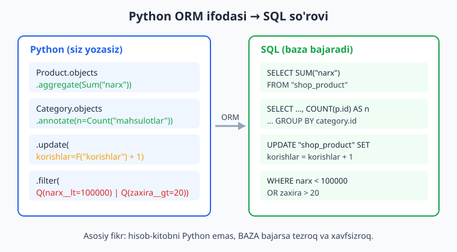
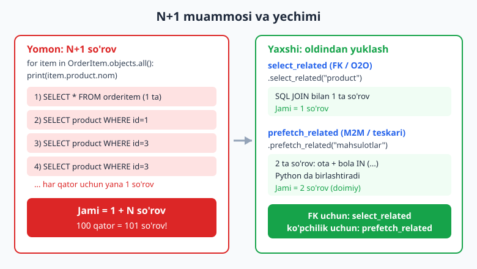
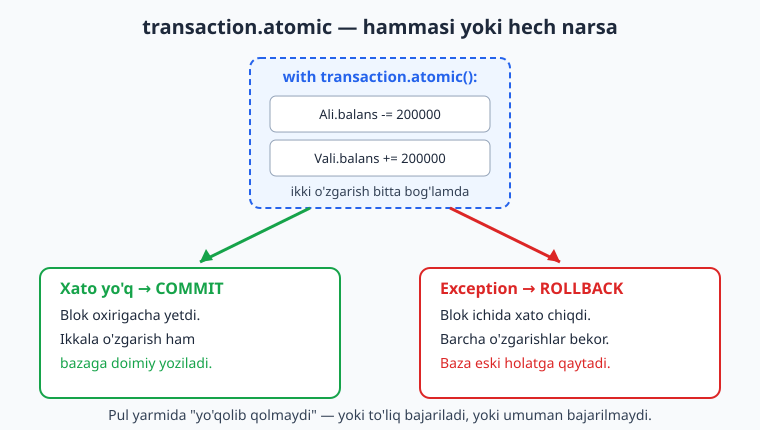

# 09 — Ilg'or ORM va optimizatsiya

[⬅️ Oldingi: 08 — Admin panel](./08-admin-panel.md) · [🏠 README](./README.md) · [Keyingi: 10 — Formalar va validatsiya ➡️](./10-formalar.md)

---

> **Bu bobda:** Django ORM'ning kuchli tomonlarini chuqur o'rganamiz. `aggregate` bilan butun jadval bo'yicha yig'indi/o'rtacha/maksimum hisoblaymiz; `annotate` bilan har bir qatorga hisoblangan ustun qo'shamiz (`GROUP BY`); `F()` obyektlari yordamida bazada to'g'ridan-to'g'ri, atomik (race condition'siz) yangilash qilamiz va ustunlarni o'zaro taqqoslaymiz; `Q()` obyektlari bilan `OR`, `AND`, `NOT` murakkab filtrlarni quramiz; eng muhimi — **N+1 muammosi**ni `select_related` va `prefetch_related` bilan yechamiz va so'rovlar sonini **aniq raqam bilan isbotlaymiz**; `transaction.atomic` bilan "hammasi yoki hech narsa" mantig'ini ta'minlaymiz; oxirida o'z **custom QuerySet va Manager**ingizni yozib, biznes mantig'ini chiroyli joyga ko'chiramiz. ORM aslida SQL generatori — har bo'limda u qanday SQL hosil qilishini ko'rsatamiz. Bu bob Python'ni bilishni nazarda tutadi ([Python qo'llanma](../python/README.md)) va SQL asoslarini eslab turish foydali ([SQL qo'llanma](../sql/README.md)). Hamma kod Django 6.0.6 da haqiqatan ishga tushirib tekshirilgan.

---

## Tayyorgarlik: misol modellar

Butun bob davomida bitta kichik internet-do'kon sxemasidan foydalanamiz. Quyidagi modellarni `shop/models.py` ga joylashtiramiz (custom Manager'ni keyinroq tushuntiramiz, hozircha shunchaki yozib qo'ying):

```python
from django.db import models


class ProductQuerySet(models.QuerySet):
    def mavjud(self):
        return self.filter(faol=True, zaxira__gt=0)

    def arzon(self, narx=100000):
        return self.filter(narx__lt=narx)


class ProductManager(models.Manager):
    def get_queryset(self):
        return ProductQuerySet(self.model, using=self._db)

    def mavjud(self):
        return self.get_queryset().mavjud()

    def arzon(self, narx=100000):
        return self.get_queryset().arzon(narx)


class Category(models.Model):
    nom = models.CharField(max_length=100)

    def __str__(self):
        return self.nom


class Product(models.Model):
    nom = models.CharField(max_length=200)
    category = models.ForeignKey(
        Category, on_delete=models.CASCADE, related_name="mahsulotlar"
    )
    narx = models.DecimalField(max_digits=12, decimal_places=2)
    zaxira = models.IntegerField(default=0)
    faol = models.BooleanField(default=True)
    korishlar = models.IntegerField(default=0)

    objects = ProductManager()

    def __str__(self):
        return self.nom


class Customer(models.Model):
    ism = models.CharField(max_length=100)
    email = models.EmailField(unique=True)
    balans = models.DecimalField(max_digits=12, decimal_places=2, default=0)

    def __str__(self):
        return self.ism


class Order(models.Model):
    customer = models.ForeignKey(
        Customer, on_delete=models.CASCADE, related_name="buyurtmalar"
    )
    sana = models.DateTimeField(auto_now_add=True)
    tolangan = models.BooleanField(default=False)


class OrderItem(models.Model):
    order = models.ForeignKey(
        Order, on_delete=models.CASCADE, related_name="qatorlar"
    )
    product = models.ForeignKey(Product, on_delete=models.PROTECT)
    soni = models.IntegerField(default=1)
    narx = models.DecimalField(max_digits=12, decimal_places=2)
```

```bash
python manage.py makemigrations
python manage.py migrate
```

Tajriba qilish uchun eng qulay joy — Django shell:

```bash
python manage.py shell
```

> Quyidagi misollar uchun bizda taxminan shunday ma'lumot bor: 2 ta kategoriya (Elektronika, Kitob), 4 ta mahsulot (Telefon 5 000 000 zaxira=10, Quloqchin 250 000 zaxira=0, Python kitobi 80 000 zaxira=50, Django kitobi 90 000 zaxira=5 `faol=False`), 3 ta mijoz (Ali, Vali, Hasan) va bir nechta buyurtma. Natijadagi raqamlar shu ma'lumotlarga mos.

---

## 1. `aggregate` — butun jadval bo'yicha bitta natija

`aggregate()` butun QuerySet'ni **bitta lug'atga** siqib qaytaradi. U `SUM`, `AVG`, `MAX`, `MIN`, `COUNT` kabi SQL agregat funksiyalarini ishlatadi va natija siz aylanib chiqadigan qatorlar emas, balki **yakuniy raqamlar** bo'ladi.

```python
from django.db.models import Count, Sum, Avg, Max, Min
from shop.models import Product

# Avtomatik kalit nomlari: maydon__funksiya
Product.objects.aggregate(Sum("narx"), Avg("narx"), Max("narx"), Min("narx"), Count("id"))
```

Natija (haqiqiy chiqish):

```python
{'narx__sum': Decimal('5420000'), 'narx__avg': Decimal('1355000'),
 'narx__max': Decimal('5000000'), 'narx__min': Decimal('80000'), 'id__count': 4}
```

Kalit nomlarini o'zingiz belgilashingiz mumkin — bu tavsiya etiladi, chunki kod o'qishga qulay bo'ladi:

```python
Product.objects.aggregate(jami=Sum("narx"), ortacha=Avg("narx"), soni=Count("id"))
# {'jami': Decimal('5420000'), 'ortacha': Decimal('1355000'), 'soni': 4}
```

`aggregate` ham odatdagi `filter()` bilan zanjirlanadi — avval filtrlaysiz, keyin yig'asiz:

```python
# Faqat faol mahsulotlar zaxirasi yig'indisi
Product.objects.filter(faol=True).aggregate(jami=Sum("zaxira"))
# {'jami': 60}
```

**Shartli agregatsiya** (`COUNT(... ) FILTER`) — bitta so'rovda bir nechta shartli sanoq:

```python
from django.db.models import Q
from shop.models import Order

Order.objects.aggregate(
    tolangan_soni=Count("id", filter=Q(tolangan=True)),
    tolanmagan_soni=Count("id", filter=Q(tolangan=False)),
)
# {'tolangan_soni': 2, 'tolanmagan_soni': 1}
```

> ⚠️ **Tuzoq:** `aggregate()` aliasiga model maydoni bilan bir xil nom (`tolangan=Count(...)`) bersangiz, xato bermaydi — natija oddiy lug'at bo'lib qaytadi. Ammo aynan shu nomni `annotate()` da ishlatsangiz, `ValueError: The annotation 'tolangan' conflicts with a field on the model` chiqadi, chunki annotatsiya har bir qatorga maydon kabi qo'shiladi. Chalkashlikni oldini olish uchun har ikki holatda ham `tolangan_soni` kabi alohida nom afzal.



---

## 2. `annotate` — har bir qatorga hisoblangan ustun

`aggregate` butun jadval uchun **bitta** raqam bersa, `annotate` **har bir qatorga** alohida hisoblangan qiymat qo'shadi. Ya'ni "har bir kategoriyada nechta mahsulot bor?" degan savolga aynan `annotate` javob beradi. SQL'da bu `GROUP BY` ga aylanadi.

```python
from django.db.models import Count
from shop.models import Category

qs = Category.objects.annotate(mahsulot_soni=Count("mahsulotlar"))
for c in qs:
    print(c.nom, "->", c.mahsulot_soni)
```

Natija:

```
Elektronika -> 2
Kitob -> 2
```

`Count("mahsulotlar")` dagi `mahsulotlar` — bu `Product.category` da bergan `related_name`. Ya'ni biz teskari munosabat (kategoriyaga tegishli mahsulotlar) bo'ylab sanaymiz. Bu qaysi SQL'ga aylanishini ko'rsak:

```sql
SELECT "shop_category"."id", "shop_category"."nom", COUNT("shop_product"."id") AS "n"
FROM "shop_category"
LEFT OUTER JOIN "shop_product" ON ("shop_category"."id" = "shop_product"."category_id")
GROUP BY "shop_category"."id", "shop_category"."nom"
```

Bir nechta agregatni birga qo'shsa bo'ladi:

```python
from django.db.models import Avg, Max

qs = Category.objects.annotate(
    ortacha_narx=Avg("mahsulotlar__narx"),
    eng_qimmat=Max("mahsulotlar__narx"),
)
for c in qs:
    print(c.nom, "ortacha:", c.ortacha_narx, "max:", c.eng_qimmat)
# Elektronika ortacha: 2625000 max: 5000000
# Kitob ortacha: 85000 max: 90000
```

`annotate` dan keyin `filter` qo'ysangiz, u SQL `HAVING` ga aylanadi — ya'ni hisoblangan ustun bo'yicha filtrlash:

```python
# 2 va undan ortiq mahsulotli kategoriyalar
Category.objects.annotate(n=Count("mahsulotlar")).filter(n__gte=2)
```

Mijozlarni buyurtma soni bo'yicha tartiblash:

```python
from shop.models import Customer

Customer.objects.annotate(buyurtma_soni=Count("buyurtmalar")).order_by("-buyurtma_soni")
# Ali buyurtmalar: 2
# Vali buyurtmalar: 1
# Hasan buyurtmalar: 0
```

### `values().annotate()` — guruhlash kaliti

Agar siz "obyekt qatorlari" emas, balki **guruhlangan jadval** (masalan, kategoriya bo'yicha jami narx) xohlasangiz, `values()` ni `annotate()` bilan birlashtiring. `values()` `GROUP BY` ning kalitini belgilaydi:

```python
Product.objects.values("category__nom").annotate(
    soni=Count("id"), jami=Sum("narx")
).order_by("category__nom")
# {'category__nom': 'Elektronika', 'soni': 2, 'jami': Decimal('5250000')}
# {'category__nom': 'Kitob', 'soni': 2, 'jami': Decimal('170000')}
```

> **Eslatma:** `values()` ni `annotate()` dan **oldin** qo'ysangiz — u guruhlash kaliti bo'ladi. `annotate()` dan **keyin** qo'ysangiz — shunchaki tanlanadigan ustunlarni cheklaydi. Tartib muhim.

---

## 3. `F()` obyektlari — bazada to'g'ridan-to'g'ri ishlash

`F()` model maydoniga **Python'ga olib kelmasdan** murojaat qilish imkonini beradi. Bu ikki sababga ko'ra muhim: (1) **atomiklik** — race condition'ni oldini oladi; (2) **tezlik** — hisob baza ichida bajariladi.

### Muammo: oddiy yangilash race condition'ga olib keladi

```python
# ❌ XAVFLI: ikki bosqich — o'qish va yozish orasida boshqa so'rov o'zgartirishi mumkin
p = Product.objects.get(nom="Python kitobi")
p.korishlar = p.korishlar + 1   # qiymat Python xotirasida hisoblanadi
p.save()
```

Agar bir vaqtda ikkita so'rov kelsa, ikkalasi ham eski qiymatni o'qiydi (masalan 10), ikkalasi ham 11 yozadi — bitta ko'rish **yo'qoladi**.

### Yechim: `F()` bilan atomik yangilash

```python
from django.db.models import F
from shop.models import Product

Product.objects.filter(nom="Python kitobi").update(korishlar=F("korishlar") + 1)
```

Bu bitta SQL so'rovga aylanadi va hisobni baza bajaradi:

```sql
UPDATE "shop_product" SET korishlar = korishlar + 1 WHERE nom = 'Python kitobi'
```

Tekshirish:

```python
p = Product.objects.get(nom="Python kitobi")
print(p.korishlar)  # oldin: 0
Product.objects.filter(nom="Python kitobi").update(korishlar=F("korishlar") + 1)
p.refresh_from_db()
print(p.korishlar)  # keyin: 1
```

> `update()` dan keyin obyektning xotiradagi nusxasi eskiradi — yangi qiymatni ko'rish uchun `p.refresh_from_db()` chaqiring.

### `F()` bilan ustunlararo taqqoslash va hisob

`F()` ni `annotate` ichida ham ishlatib, ikki ustunni ko'paytirish (masalan, ombor qiymati = narx × zaxira) mumkin:

```python
qiymat = Product.objects.annotate(ombor_qiymati=F("narx") * F("zaxira"))
for x in qiymat:
    print(x.nom, x.ombor_qiymati)
# Telefon 50000000
# Quloqchin 0
# Python kitobi 4000000
# Django kitobi 450000
```

`F()` ni `filter` ichida bir maydonni boshqa maydon bilan solishtirishga ham ishlatasiz. Masalan, "buyurtmadagi narx mahsulotning hozirgi narxidan farq qiladigan qatorlar":

```python
from shop.models import OrderItem

OrderItem.objects.filter(narx__lt=F("product__narx"))
# (chegirma bilan sotilgan qatorlar)
```

---

## 4. `Q()` obyektlari — murakkab `OR` / `AND` / `NOT` filtrlar

Oddiy `filter(a=1, b=2)` har doim `AND` ni anglatadi. Lekin `OR` yoki `NOT` kerak bo'lganda `Q()` obyektlariga o'tasiz. Ular orasida operatorlar:

- `|` — `OR`
- `&` — `AND`
- `~` — `NOT`

```python
from django.db.models import Q
from shop.models import Product

# OR: arzon (narx < 100000) YOKI ko'p zaxira (> 20)
Product.objects.filter(Q(narx__lt=100000) | Q(zaxira__gt=20))
# ['Python kitobi', 'Django kitobi']
```

Bu quyidagi SQL'ga aylanadi:

```sql
SELECT ... FROM "shop_product"
WHERE ("shop_product"."narx" < 100000 OR "shop_product"."zaxira" > 20)
```

`AND` va `NOT` ni birga ishlatish:

```python
# faol VA zaxirasi nol BO'LMAGAN
Product.objects.filter(Q(faol=True) & ~Q(zaxira=0))
# ['Telefon', 'Python kitobi']
```

### Dinamik filtr qurish

`Q()` ning eng kuchli jihati — uni o'zgaruvchiga saqlab, **bosqichma-bosqich** qurish mumkin. Bu qidiruv formalaridagi ixtiyoriy filtrlar uchun ajoyib:

```python
shart = Q(category__nom="Kitob")
shart |= Q(narx__gt=1000000)   # endi: kitob YOKI 1 mln dan qimmat
Product.objects.filter(shart)
# ['Telefon', 'Python kitobi', 'Django kitobi']
```

Amaliy misol — qidiruv:

```python
def mahsulot_qidir(soz=None, min_narx=None, faqat_mavjud=False):
    shart = Q()
    if soz:
        shart &= Q(nom__icontains=soz)
    if min_narx is not None:
        shart &= Q(narx__gte=min_narx)
    if faqat_mavjud:
        shart &= Q(zaxira__gt=0)
    return Product.objects.filter(shart)
```

Bo'sh `Q()` hech narsani cheklamaydi, shuning uchun hech qaysi parametr berilmasa hamma narsa qaytadi.

---

## 5. N+1 muammosi va `select_related`

Bu bobning eng muhim amaliy qismi. **N+1 muammosi** — bu sodir bo'ladigan eng keng tarqalgan ishlash xatosi. U shunday yuz beradi: siz N ta obyektni olasiz, keyin sikl ichida har biri uchun bog'liq obyektni olishga **yana bittadan so'rov** yuborasiz.

So'rovlar sonini aniq sanab ko'ramiz. Django'da `connection.queries` (faqat `DEBUG=True` bo'lganda to'ladi) va `reset_queries()` shu uchun bor:

```python
from django.db import connection, reset_queries

# ❌ N+1: har bir item uchun product alohida olinadi
reset_queries()
for item in OrderItem.objects.all():
    _ = item.product.nom
print(len(connection.queries), "ta query")   # 5 ta query (1 + 4 qator)
```

Endi `select_related` bilan — u SQL `JOIN` qilib, hamma narsani **bitta so'rovda** olib keladi:

```python
# ✅ select_related: bitta JOIN'li so'rov
reset_queries()
for item in OrderItem.objects.select_related("product", "order__customer"):
    _ = item.product.nom
    _ = item.order.customer.ism
print(len(connection.queries), "ta query")   # 1 ta query
```

Natija — **5 ta query'dan 1 ta query'ga**. `select_related` ko'rsatadigan SQL (qisqartirilgan):

```sql
SELECT "shop_orderitem".*, "shop_product".*
FROM "shop_orderitem"
INNER JOIN "shop_product" ON ("shop_orderitem"."product_id" = "shop_product"."id")
```

> **Qoida:** `select_related` faqat **ForeignKey** va **OneToOne** uchun ishlaydi (ya'ni "bitta" tomonga). U `JOIN` ishlatadi, shuning uchun bitta so'rov qoladi. `order__customer` kabi ikki bosqichli yo'lni ham qo'llab-quvvatlaydi.



---

## 6. `prefetch_related` — "ko'pchilik" tomon uchun

`select_related` `JOIN` ishlatgani uchun **ko'plik munosabati** (teskari ForeignKey yoki ManyToMany) bilan ishlamaydi — bunda har bir ota uchun bir nechta bola bo'ladi va `JOIN` qatorlarni takrorlaydi. Bunday hollarda `prefetch_related` ishlatasiz: u **alohida so'rov** yuborib, natijalarni Python'da birlashtiradi.

```python
from shop.models import Category
from django.db import connection, reset_queries

# ❌ Har bir kategoriya uchun mahsulotlar alohida olinadi
reset_queries()
for c in Category.objects.all():
    _ = list(c.mahsulotlar.all())
print(len(connection.queries), "ta query")   # 3 ta query (1 + 2 kategoriya)

# ✅ prefetch_related: doimiy 2 ta so'rov
reset_queries()
for c in Category.objects.prefetch_related("mahsulotlar"):
    _ = list(c.mahsulotlar.all())
print(len(connection.queries), "ta query")   # 2 ta query
```

`prefetch_related` har doim **doimiy** sonli so'rov beradi: bitta asosiy obyektlar uchun, yana bittasi bog'liq obyektlar uchun (`WHERE category_id IN (...)`). Kategoriyalar 2 ta bo'lsin yoki 2000 ta — baribir 2 ta so'rov.

### `Prefetch` bilan moslashtirilgan so'rov

Ba'zan oldindan yuklanadigan bog'liq obyektlarni **filtrlash yoki tartiblash** kerak. Buning uchun `Prefetch` obyektidan foydalanasiz:

```python
from django.db.models import Prefetch
from shop.models import Category, Product

# Faqat mavjud mahsulotlarni oldindan yuklab kelamiz
kat = Category.objects.prefetch_related(
    Prefetch("mahsulotlar", queryset=Product.objects.mavjud())
).first()
list(kat.mahsulotlar.all())   # endi bu yerda faqat mavjud mahsulotlar
```

**Qisqa qoida:**

| Munosabat | Vosita | Qancha so'rov |
|---|---|---|
| ForeignKey / OneToOne ("bitta" tomon) | `select_related` | 1 (JOIN) |
| Teskari FK / ManyToMany ("ko'p" tomon) | `prefetch_related` | 2 (alohida + IN) |

> Node.js'da Prisma yoki Sequelize'dagi `include`/eager loading ham aynan shu muammoni yechadi — solishtirish uchun [Node.js qo'llanma](../nodejs/README.md)ga qarang.

---

## 7. `transaction.atomic` — "hammasi yoki hech narsa"

Ba'zi amallar bir nechta yozuvni o'zgartiradi va ular **bo'linmas** bo'lishi shart. Klassik misol — pul o'tkazmasi: bir hisobdan ayirib, ikkinchisiga qo'shasiz. Agar yarmida xato chiqsa, pul "havoda yo'qolib qolmasligi" kerak. `transaction.atomic` aynan shuni ta'minlaydi: blok ichidagi hamma narsa **commit** bo'ladi yoki birortasi xato bersa **rollback** (hammasi bekor) bo'ladi.

```python
from decimal import Decimal
from django.db import transaction
from django.db.models import F
from shop.models import Customer


@transaction.atomic
def pul_otkaz(kimdan_id, kimga_id, summa):
    # select_for_update: qatorni so'rov davomida qulflab turadi (race'ni oldini oladi)
    kimdan = Customer.objects.select_for_update().get(pk=kimdan_id)
    kimga = Customer.objects.select_for_update().get(pk=kimga_id)
    kimdan.balans = F("balans") - summa
    kimga.balans = F("balans") + summa
    kimdan.save()
    kimga.save()
```

Ishlatish:

```python
ali = Customer.objects.get(ism="Ali")    # balans: 1000000
vali = Customer.objects.get(ism="Vali")  # balans: 500000

pul_otkaz(ali.pk, vali.pk, Decimal("200000"))

ali.refresh_from_db(); vali.refresh_from_db()
print(ali.balans, vali.balans)   # 800000.00 700000.00
```

`@transaction.atomic` dekoratorni kontekst-menejer sifatida ham ishlatish mumkin. Endi **rollback**ni isbotlaymiz — blok ichida ataylab xato chiqaramiz:

```python
try:
    with transaction.atomic():
        Customer.objects.filter(pk=ali.pk).update(balans=F("balans") - Decimal("100000"))
        raise ValueError("xato!")   # blok yarmida portladi
except ValueError:
    pass

ali.refresh_from_db()
print(ali.balans)   # 800000.00 — o'zgarmadi! Rollback ishladi.
```

`UPDATE` bajarilgan bo'lsa-da, exception tufayli butun bog'lam bekor qilindi va balans eski holatda qoldi.



> **Eslatma:** `select_for_update()` qator-darajasidagi qulf (`SELECT ... FOR UPDATE`) ishlatadi va **transaction ichida** bo'lishi shart. U PostgreSQL/MySQL'da to'liq ishlaydi; SQLite'da bu so'rov xatosiz qabul qilinadi, ammo SQLite butun bazani qulflagani uchun amalda haqiqiy parallel qulflashni boshqa baza beradi. Ishlab chiqarishda PostgreSQL tavsiya etiladi ([SQL qo'llanma](../sql/README.md)).

---

## 8. Custom QuerySet va Manager — biznes mantig'ini bir joyga

Vaqt o'tib, kod butun loyiha bo'ylab `Product.objects.filter(faol=True, zaxira__gt=0)` ni qayta-qayta yozayotganini ko'rasiz. Bu mo'rt va takrorlanuvchi. Yechim — bu mantiqni **custom QuerySet** ichidagi metodga ko'chirish, keyin uni **Manager** orqali ochish.

Bizning bob boshidagi modelda allaqachon shunday yozilgan edi. Uni qayta ko'rib chiqaylik:

```python
from django.db import models


class ProductQuerySet(models.QuerySet):
    def mavjud(self):
        return self.filter(faol=True, zaxira__gt=0)

    def arzon(self, narx=100000):
        return self.filter(narx__lt=narx)


class ProductManager(models.Manager):
    def get_queryset(self):
        return ProductQuerySet(self.model, using=self._db)

    def mavjud(self):
        return self.get_queryset().mavjud()

    def arzon(self, narx=100000):
        return self.get_queryset().arzon(narx)
```

Endi mantiq bitta joyda yashaydi va o'qishga oson:

```python
from shop.models import Product

Product.objects.mavjud()         # ['Telefon', 'Python kitobi']
Product.objects.arzon()          # ['Python kitobi', 'Django kitobi']
Product.objects.mavjud().arzon(100000)   # zanjir: ['Python kitobi']
```

E'tibor bering — `mavjud()` `QuerySet` qaytargani uchun uni `arzon()` bilan **zanjirlash** mumkin. Bu QuerySet metodlarining kuchi.

### Qisqaroq yo'l: `QuerySet.as_manager()`

Yuqorida `mavjud`/`arzon` metodlarini ikki marta (QuerySet'da va Manager'da) yozdik. Buni `as_manager()` bilan bir martaga qisqartirish mumkin — metodlar QuerySet'da bir marta yoziladi va Manager avtomatik yaratiladi:

```python
class ProductQuerySet(models.QuerySet):
    def mavjud(self):
        return self.filter(faol=True, zaxira__gt=0)

    def arzon(self, narx=100000):
        return self.filter(narx__lt=narx)


class Product(models.Model):
    # ... maydonlar ...
    objects = ProductQuerySet.as_manager()
```

Endi `Product.objects.mavjud().arzon()` xuddi shunday ishlaydi, lekin kod ikki barobar qisqa. Boshlovchi sifatida `as_manager()` ni afzal ko'ring; faqat Manager'ga maxsus mantiq (masalan, `get_queryset()` ni butunlay o'zgartirish) kerak bo'lganda to'liq Manager yozasiz.

### `Coalesce` — `NULL` ni standart qiymatga

Agregat hech qatorni topmasa `NULL` (Python'da `None`) qaytaradi. Buni `0` ga aylantirish uchun `Coalesce` ishlatamiz — masalan, har bir mijozning jami xaridi (xarid qilmagan mijoz uchun `0`):

```python
from decimal import Decimal
from django.db.models import Sum, DecimalField
from django.db.models.functions import Coalesce
from shop.models import Customer

Customer.objects.annotate(
    jami_xarid=Coalesce(
        Sum("buyurtmalar__qatorlar__narx"), Decimal("0"), output_field=DecimalField()
    )
)
# Ali jami: 5160000
# Hasan jami: 0     <- buyurtmasiz mijoz uchun None emas, 0
# Vali jami: 80000
```

---

## 9. So'rovlarni testda hisoblash (N+1 ni qaytarib kelmaslik)

Eng yaxshi tomoni — so'rovlar sonini **avtomatik test** bilan qotirib qo'yish mumkin. `TestCase.assertNumQueries(N)` blok aynan N ta so'rov yuborganini tekshiradi. Agar kelajakda kimdir `select_related` ni olib tashlasa, test darhol qulaydi.

```python
from decimal import Decimal
from django.test import TestCase
from django.db.models import Count, Sum, F, Prefetch
from shop.models import Category, Product, Customer, Order, OrderItem


class OrmTest(TestCase):
    @classmethod
    def setUpTestData(cls):
        cls.kat = Category.objects.create(nom="Kitob")
        cls.p1 = Product.objects.create(nom="Python", category=cls.kat, narx=Decimal("80000"), zaxira=10)
        cls.p2 = Product.objects.create(nom="Django", category=cls.kat, narx=Decimal("90000"), zaxira=0)
        cls.mijoz = Customer.objects.create(ism="Ali", email="a@a.uz")
        cls.order = Order.objects.create(customer=cls.mijoz)
        OrderItem.objects.create(order=cls.order, product=cls.p1, soni=2, narx=cls.p1.narx)

    def test_aggregate(self):
        self.assertEqual(Product.objects.aggregate(jami=Sum("narx"))["jami"], Decimal("170000"))

    def test_f_atomik(self):
        Product.objects.filter(pk=self.p1.pk).update(korishlar=F("korishlar") + 5)
        self.p1.refresh_from_db()
        self.assertEqual(self.p1.korishlar, 5)

    def test_custom_manager(self):
        self.assertEqual(Product.objects.mavjud().count(), 1)

    def test_select_related_n_plus_1(self):
        # Faqat 1 ta query bo'lishini qotirib qo'yamiz
        with self.assertNumQueries(1):
            for item in OrderItem.objects.select_related("product"):
                _ = item.product.nom

    def test_prefetch_related(self):
        with self.assertNumQueries(2):
            for c in Category.objects.prefetch_related("mahsulotlar"):
                _ = list(c.mahsulotlar.all())
```

Ishga tushirish:

```bash
python manage.py test shop
```

Natija (haqiqiy chiqish, qisqartirilgan):

```
.....
----------------------------------------------------------------------
Ran 5 tests in 0.008s

OK
```

> Testlar bo'yicha to'liqroq ma'lumot keyingi boblarda. CI'da bu testlarni avtomatik ishga tushirish haqida [Git va GitHub qo'llanma](../git-github/README.md)da o'qing.

---

## Mashqlar

> Mashqlarni bob modellarida (`Category`, `Product`, `Customer`, `Order`, `OrderItem`) bajaring. Har birini `python manage.py shell` da yoki test sifatida sinab ko'ring.

### Oson

1. Barcha mahsulotlar narxining **o'rtachasini** bitta `aggregate` so'rovi bilan toping va natija kalitini `ortacha_narx` deb nomlang.
2. Har bir kategoriyada nechta mahsulot borligini `annotate` bilan hisoblang va kategoriya nomi bilan birga chop eting.
3. `F()` ishlatib, `pk=1` bo'lgan mahsulotning `korishlar` maydonini **atomik** ravishda 1 ga oshiring.
4. `Q()` bilan narxi 100 000 dan **arzon YOKI** zaxirasi 20 dan **ko'p** mahsulotlarni filtrlang.
5. Faqat `faol=True` mahsulotlar **soni**ni `aggregate(Count(...))` bilan toping.
6. `Product.objects.values("category__nom").annotate(...)` ishlatib, har bir kategoriya bo'yicha **jami narx**ni guruhlab chiqaring.

### O'rta

7. `aggregate` ichida `Count("id", filter=Q(...))` bilan **to'langan** va **to'lanmagan** buyurtmalar sonini bitta so'rovda hisoblang. Alias nomlari model maydoni bilan to'qnashmasin.
8. `OrderItem` larni aylanib chiqib, har birining `product.nom` ini chop etadigan kodni `select_related` **bilan** va **siz** yozing; `connection.queries` orqali so'rovlar sonini ikkala holatda solishtiring.
9. `prefetch_related` ishlatib, har bir kategoriya uchun mahsulotlar ro'yxatini olib keling va `reset_queries()` bilan **doimiy 2 ta** so'rov bo'lishini isbotlang.
10. `annotate` va `F()` ni birlashtirib, har bir mahsulot uchun `ombor_qiymati = narx * zaxira` hisoblang va natijani kamayish tartibida saralang.
11. `Coalesce` ishlatib, har bir mijozning jami xaridini hisoblang; xarid qilmagan mijoz uchun natija `0` bo'lsin (`None` emas).
12. `Product` uchun `ProductQuerySet.as_manager()` yondashuvini qo'llab, `mavjud()` va `qimmat(narx=1000000)` metodlarini yozing va `Product.objects.mavjud().qimmat()` zanjirini sinab ko'ring.

### Qiyin

13. `transaction.atomic` ichida ikkita mijoz o'rtasida pul o'tkazadigan funksiya yozing. Yetarli mablag' bo'lmasa `ValueError` chiqarib, **rollback** ishlashini test bilan isbotlang (balans o'zgarmaganini tekshiring). `F()` va `select_for_update()` ishlating.
14. `assertNumQueries` ishlatadigan `TestCase` yozing: bitta test `select_related` 1 ta so'rovni, ikkinchisi `prefetch_related` 2 ta so'rovni ta'minlashini qotirib qo'ysin.
15. Dinamik qidiruv funksiyasi yozing: `mahsulot_qidir(soz=None, min_narx=None, max_narx=None, faqat_mavjud=False)`. `Q()` ni bosqichma-bosqich quring; berilmagan parametrlar filtrga ta'sir qilmasin.

---

<details markdown="1"><summary>Yechimlar</summary>

### Oson

**1.**
```python
from django.db.models import Avg
from shop.models import Product

Product.objects.aggregate(ortacha_narx=Avg("narx"))
# {'ortacha_narx': Decimal('1355000')}
```

**2.**
```python
from django.db.models import Count
from shop.models import Category

for c in Category.objects.annotate(n=Count("mahsulotlar")):
    print(c.nom, c.n)
# Elektronika 2
# Kitob 2
```

**3.**
```python
from django.db.models import F
from shop.models import Product

Product.objects.filter(pk=1).update(korishlar=F("korishlar") + 1)
```

**4.**
```python
from django.db.models import Q
from shop.models import Product

Product.objects.filter(Q(narx__lt=100000) | Q(zaxira__gt=20))
```

**5.**
```python
from django.db.models import Count
from shop.models import Product

Product.objects.filter(faol=True).aggregate(soni=Count("id"))
# {'soni': 3}
```

**6.**
```python
from django.db.models import Sum
from shop.models import Product

Product.objects.values("category__nom").annotate(jami=Sum("narx")).order_by("category__nom")
# {'category__nom': 'Elektronika', 'jami': Decimal('5250000')}
# {'category__nom': 'Kitob', 'jami': Decimal('170000')}
```

### O'rta

**7.**
```python
from django.db.models import Count, Q
from shop.models import Order

Order.objects.aggregate(
    tolangan_soni=Count("id", filter=Q(tolangan=True)),
    tolanmagan_soni=Count("id", filter=Q(tolangan=False)),
)
# {'tolangan_soni': 2, 'tolanmagan_soni': 1}
```

**8.**
```python
from django.db import connection, reset_queries
from shop.models import OrderItem

# select_related SIZ
reset_queries()
for item in OrderItem.objects.all():
    _ = item.product.nom
print("siz:", len(connection.queries))   # 5

# select_related BILAN
reset_queries()
for item in OrderItem.objects.select_related("product"):
    _ = item.product.nom
print("bilan:", len(connection.queries)) # 1
```
> `connection.queries` faqat `DEBUG=True` da to'ladi.

**9.**
```python
from django.db import connection, reset_queries
from shop.models import Category

reset_queries()
for c in Category.objects.prefetch_related("mahsulotlar"):
    _ = list(c.mahsulotlar.all())
print(len(connection.queries))   # 2 (kategoriyalar soni qancha bo'lsa ham 2)
```

**10.**
```python
from django.db.models import F
from shop.models import Product

qs = Product.objects.annotate(ombor_qiymati=F("narx") * F("zaxira")).order_by("-ombor_qiymati")
for x in qs:
    print(x.nom, x.ombor_qiymati)
# Telefon 50000000
# Python kitobi 4000000
# Django kitobi 450000
# Quloqchin 0
```

**11.**
```python
from decimal import Decimal
from django.db.models import Sum, DecimalField
from django.db.models.functions import Coalesce
from shop.models import Customer

qs = Customer.objects.annotate(
    jami_xarid=Coalesce(Sum("buyurtmalar__qatorlar__narx"), Decimal("0"), output_field=DecimalField())
)
for m in qs:
    print(m.ism, m.jami_xarid)
# Ali 5160000 / Hasan 0 / Vali 80000
```

**12.**
```python
from django.db import models


class ProductQuerySet(models.QuerySet):
    def mavjud(self):
        return self.filter(faol=True, zaxira__gt=0)

    def qimmat(self, narx=1000000):
        return self.filter(narx__gt=narx)


class Product(models.Model):
    # ... maydonlar ...
    objects = ProductQuerySet.as_manager()


# Foydalanish
Product.objects.mavjud().qimmat()   # zanjirlash ishlaydi
```

### Qiyin

**13.**
```python
from decimal import Decimal
from django.db import transaction
from django.db.models import F
from django.test import TestCase
from shop.models import Customer


class MablagYetarli(Exception):
    pass


@transaction.atomic
def pul_otkaz(kimdan_id, kimga_id, summa):
    kimdan = Customer.objects.select_for_update().get(pk=kimdan_id)
    kimga = Customer.objects.select_for_update().get(pk=kimga_id)
    if kimdan.balans < summa:
        raise ValueError("Mablag' yetarli emas")
    kimdan.balans = F("balans") - summa
    kimga.balans = F("balans") + summa
    kimdan.save()
    kimga.save()


class TransferTest(TestCase):
    def setUp(self):
        self.a = Customer.objects.create(ism="A", email="a@a.uz", balans=Decimal("100"))
        self.b = Customer.objects.create(ism="B", email="b@b.uz", balans=Decimal("0"))

    def test_rollback_mablag_yetmasa(self):
        with self.assertRaises(ValueError):
            pul_otkaz(self.a.pk, self.b.pk, Decimal("999"))
        self.a.refresh_from_db()
        self.b.refresh_from_db()
        # Balanslar o'zgarmadi — rollback ishladi
        self.assertEqual(self.a.balans, Decimal("100"))
        self.assertEqual(self.b.balans, Decimal("0"))

    def test_muvaffaqiyatli(self):
        pul_otkaz(self.a.pk, self.b.pk, Decimal("40"))
        self.a.refresh_from_db()
        self.b.refresh_from_db()
        self.assertEqual(self.a.balans, Decimal("60"))
        self.assertEqual(self.b.balans, Decimal("40"))
```

**14.**
```python
from decimal import Decimal
from django.test import TestCase
from shop.models import Category, Product, Order, OrderItem, Customer


class QuerySonTest(TestCase):
    @classmethod
    def setUpTestData(cls):
        kat = Category.objects.create(nom="Kitob")
        p = Product.objects.create(nom="Py", category=kat, narx=Decimal("100"), zaxira=5)
        m = Customer.objects.create(ism="Ali", email="a@a.uz")
        o = Order.objects.create(customer=m)
        OrderItem.objects.create(order=o, product=p, soni=1, narx=p.narx)

    def test_select_related_bitta(self):
        with self.assertNumQueries(1):
            for it in OrderItem.objects.select_related("product"):
                _ = it.product.nom

    def test_prefetch_ikkita(self):
        with self.assertNumQueries(2):
            for c in Category.objects.prefetch_related("mahsulotlar"):
                _ = list(c.mahsulotlar.all())
```

**15.**
```python
from django.db.models import Q
from shop.models import Product


def mahsulot_qidir(soz=None, min_narx=None, max_narx=None, faqat_mavjud=False):
    shart = Q()
    if soz:
        shart &= Q(nom__icontains=soz)
    if min_narx is not None:
        shart &= Q(narx__gte=min_narx)
    if max_narx is not None:
        shart &= Q(narx__lte=max_narx)
    if faqat_mavjud:
        shart &= Q(faol=True, zaxira__gt=0)
    return Product.objects.filter(shart)


# Misollar:
mahsulot_qidir()                         # hammasi (bo'sh Q hech narsani cheklamaydi)
mahsulot_qidir(soz="kitob")              # nomida "kitob" borlar
mahsulot_qidir(max_narx=100000, faqat_mavjud=True)
```

</details>

---

[⬅️ Oldingi: 08 — Admin panel](./08-admin-panel.md) · [🏠 README](./README.md) · [Keyingi: 10 — Formalar va validatsiya ➡️](./10-formalar.md)
