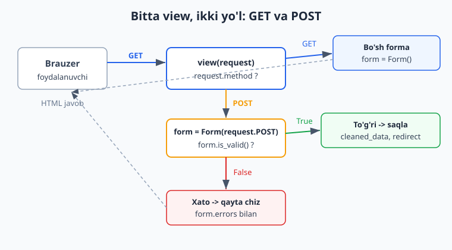
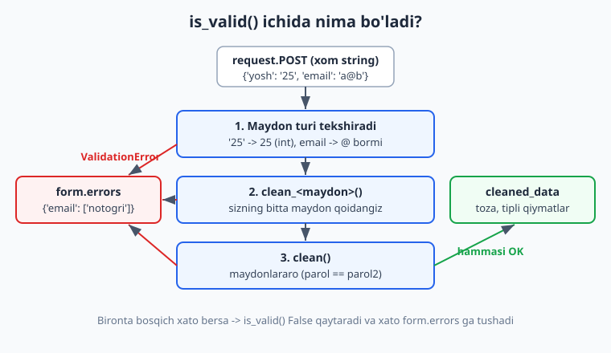
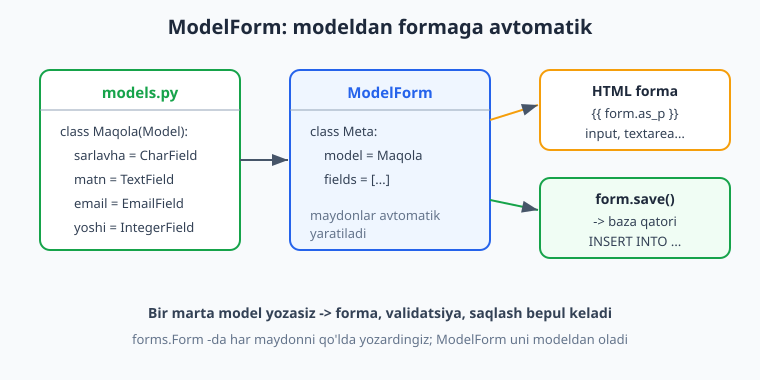

# 10 — Formalar va validatsiya

[⬅️ Oldingi: 09 — Ilg'or ORM va optimizatsiya](./09-ilgor-orm.md) · [🏠 README](./README.md) · [Keyingi: 11 — Class-based views (CBV) ➡️](./11-class-based-views.md)

---

> **Bu bobda:** foydalanuvchidan ma'lumot olishni Django'cha o'rganamiz. Nega xom `request.POST` bilan ishlash xavfli ekanini ko'rib, `forms.Form` yozamiz: maydon turlari (`CharField`, `EmailField`, `IntegerField`, `ChoiceField`, `BooleanField`...), `as_p` bilan HTML render, GET va POST oqimi (bitta view ikki vazifa), `is_valid()` va `cleaned_data`. Keyin validatsiyani chuqurlashtiramiz: `clean_<maydon>()` bitta maydon uchun, `clean()` maydonlararo qoidalar uchun, `add_error()` va `ValidationError`. Xatoni shablonda ko'rsatishni, `` bilan CSRF himoyasini va `widgetlar` (`Textarea`, `PasswordInput`, atributlar) ni o'rganamiz. Oxirida `forms.ModelForm` — modeldan formani avtomatik yasash va `form.save()` bilan to'g'ridan-to'g'ri bazaga yozish, jumladan `save(commit=False)` nayrangi. Hamma kod Django 6.0.6 da haqiqatan ishga tushirib tekshirilgan.

---

## Muammo: xom ma'lumotga ishonib bo'lmaydi

Oldingi boblarda biz ma'lumotni bazadan **o'qishni** ko'p ko'rdik (ORM, queryset). Endi teskari yo'nalish: foydalanuvchi bizga ma'lumot **yuboradi** — ro'yxatdan o'tish formasi, izoh, qidiruv, profil tahriri. Bu ma'lumot HTML `<form>` orqali keladi va viewda `request.POST` ichida turadi.

Python'da `request.POST` — bu lug'atga o'xshash obyekt va undagi **hamma qiymat string**. Agar uni qo'lda tekshirmoqchi bo'lsangiz, har forma uchun shunaqa kod yozishingizga to'g'ri keladi:

```python
# ❌ Qo'lda tekshirish: uzun, takroriy, xatoga moyil
def aloqa(request):
    ism = request.POST.get("ism", "").strip()
    email = request.POST.get("email", "")
    yosh = request.POST.get("yosh", "")

    xatolar = {}
    if not ism:
        xatolar["ism"] = "Ism bo'sh bo'lmasin"
    if len(ism) > 100:
        xatolar["ism"] = "Ism juda uzun"
    if "@" not in email:
        xatolar["email"] = "Email noto'g'ri"
    try:
        yosh = int(yosh)        # string -> int qo'lda
    except ValueError:
        xatolar["yosh"] = "Yosh raqam bo'lsin"
    # ... va yana o'nlab if, har forma uchun qaytadan
```

Muammolar aniq: kod uzun, har formada takrorlanadi, xato xabarlarini qo'lda to'playsiz, `int()` ga o'tkazishni unutsangiz dastur qulaydi, va eng yomoni — bitta tekshiruvni tashlab ketsangiz, ilovangizda **xavfsizlik teshigi** paydo bo'ladi.

Django bularning hammasini bitta joyga jamlaydi — **Form** klassiga. Siz faqat maydonlarni e'lon qilasiz, qolganini (turini tekshirish, string'dan kerakli tipga o'tkazish, xatolarni to'plash, HTML chizish) Django bajaradi:

```python
# Xuddi shu narsa, Django'cha
from django import forms

class AloqaForm(forms.Form):
    ism = forms.CharField(max_length=100)
    email = forms.EmailField()
    yosh = forms.IntegerField(required=False)
```

Mana shu uch qator yuqoridagi 20 qator if'ni almashtiradi. Boshlaymiz.

> Eslatma: bu kitob Python bilishni faraz qiladi ([Python qo'llanmasi](../python/README.md)). Lekin Django formalariga xos hamma narsa shu yerda tushuntiriladi. Agar siz Node.js'dan kelgan bo'lsangiz, Django formasi — bu `express-validator` + shablon-render + CSRF himoyasini bitta klassga jamlangan ko'rinishi ([Node.js validatsiya](../nodejs/README.md) bilan solishtiring).

## forms.Form — birinchi forma

`Form` klassi — Python klassi bo'lib, har bir **atribut** bitta forma maydonini bildiradi. Faylni odatda ilovaning ichida `forms.py` deb nomlaymiz:

```python
# blog/forms.py
from django import forms

class AloqaForm(forms.Form):
    ism = forms.CharField(label="Ismingiz", max_length=100)
    email = forms.EmailField(label="Email")
    xabar = forms.CharField(label="Xabar", widget=forms.Textarea)
    yosh = forms.IntegerField(label="Yoshingiz", min_value=0, required=False)
```

E'tibor bering:

- Har maydon — `forms.<Tur>Field(...)` ko'rinishida. Tur maydon qanday ma'lumot qabul qilishini va qanday tekshirilishini belgilaydi.
- `label` — formada ko'rinadigan yorliq. Bermasangiz, Django maydon nomidan avtomatik yasaydi (`ism` -> "Ism").
- `required=False` — maydon majburiy emas (standart `True`).
- `widget=forms.Textarea` — bu maydon bitta qatorli `<input>` emas, ko'p qatorli `<textarea>` bo'lib chizilsin. Widget — maydon HTML'da qanday ko'rinishi.
- `min_value=0` — `IntegerField` uchun eng kichik ruxsat etilgan qiymat.

Bu **maydon turi** (qanday ma'lumot, qanday tekshiriladi) va **widget** (qanday ko'rinadi) ikki alohida tushuncha — buni keyinroq batafsil ko'ramiz.

### Ko'p ishlatiladigan maydon turlari

| Maydon | Qabul qiladi | HTML | Asosiy argumentlar |
|---|---|---|---|
| `CharField` | matn | `<input type="text">` | `max_length`, `min_length`, `strip` |
| `EmailField` | email | `<input type="email">` | email formatini tekshiradi |
| `IntegerField` | butun son | `<input type="number">` | `min_value`, `max_value` |
| `DecimalField` | o'nlik son | `<input type="number">` | `max_digits`, `decimal_places` |
| `BooleanField` | ha/yo'q | `<input type="checkbox">` | `required` (default True!) |
| `ChoiceField` | ro'yxatdan biri | `<select>` | `choices` |
| `DateField` | sana | `<input type="text">` | `input_formats` |
| `DateTimeField` | sana+vaqt | `<input>` | — |
| `URLField` | URL | `<input type="url">` | URL formatini tekshiradi |
| `FileField` | fayl | `<input type="file">` | (bobda 18-da batafsil) |

Hamma maydonda umumiy argumentlar bor: `required`, `label`, `initial` (boshlang'ich qiymat), `help_text` (yordamchi matn), `widget`, va `error_messages` (xato matnlarini o'zgartirish).

## Formani shablonda chizish: as_p

Forma obyektini viewdan shablonga uzatamiz, shablonda esa uni HTML'ga aylantiramiz. Django bir necha "tayyor render" usulini beradi:

- `{{ form.as_p }}` — har maydon `<p>` ichida (eng ommabop).
- `{{ form.as_div }}` — har maydon `<div>` ichida (Django 5+ da standart va eng zamonaviysi).
- `{{ form.as_ul }}` — `<li>` ichida.
- `{{ form.as_table }}` — `<tr><td>` ichida (eskirgan uslub).

Shablon (bu fayl Django shabloni — `python`/`html` aralashmasi):

```html
<!-- blog/templates/blog/aloqa.html -->
<form method="post">
  
  {{ form.as_p }}
  <button type="submit">Yuborish</button>
</form>
```

`{{ form.as_p }}` quyidagicha HTML chiqaradi (haqiqiy render natijasi, bizning `AloqaForm` uchun):

```html
<p>
  <label for="id_ism">Ismingiz:</label>
  <input type="text" name="ism" maxlength="100" required id="id_ism">
</p>
<p>
  <label for="id_email">Email:</label>
  <input type="email" name="email" maxlength="320" required id="id_email">
</p>
<!-- ... xabar va yosh ham shunday -->
```

Diqqat: Django har maydon uchun `<label>` ni `id` bilan bog'ladi, `required` atributini qo'ydi, `EmailField` ni `type="email"` qildi. Hech bir narsani qo'lda yozmadik.

> **Muhim:** `{{ form.as_p }}` faqat maydonlarni chizadi — `<form>` tegini, `` ni va "Yuborish" tugmasini **siz qo'lda** qo'shasiz. Va `<form method="post">` bo'lishi shart.

## GET va POST: bitta view, ikki vazifa

Forma bilan ishlaydigan view **ikki holatni** ko'rishi kerak:

1. **GET so'rovi** — foydalanuvchi sahifani birinchi marta ochdi. Unga **bo'sh forma** ko'rsatamiz.
2. **POST so'rovi** — foydalanuvchi formani to'ldirib "Yuborish" bosdi. Ma'lumotni tekshiramiz; to'g'ri bo'lsa — qayta ishlaymiz, xato bo'lsa — formani **xatolari bilan** qayta chizamiz.

Bu naqsh Django'da deyarli har formada bir xil:

```python
# blog/views.py
from django.shortcuts import render
from django.http import HttpResponse
from .forms import AloqaForm

def aloqa(request):
    if request.method == "POST":
        form = AloqaForm(request.POST)      # POST bo'lsa: ma'lumot bilan to'ldiramiz
        if form.is_valid():                 # tekshiramiz
            ism = form.cleaned_data["ism"]  # toza ma'lumot
            return HttpResponse(f"Rahmat, {ism}! Xabaringiz qabul qilindi.")
    else:
        form = AloqaForm()                  # GET bo'lsa: bo'sh forma
    return render(request, "blog/aloqa.html", {"form": form})
```

Diqqat qilinglar — `else` shoxi va oxirgi `return` **bir xil shablonni** ishlatadi. POST kelib, lekin `is_valid()` `False` qaytarsa, kod `if` bloklaridan tushib, oxirgi `render` ga boradi va **xatolari bilan to'lgan** formani qaytaradi. Foydalanuvchi nima noto'g'ri ekanini ko'radi.



URL ulash (Django 6.0 idiomi — `path()`):

```python
# myforms/urls.py
from django.urls import path
from blog import views

urlpatterns = [
    path("aloqa/", views.aloqa, name="aloqa"),
]
```

### To'g'ri kelganda: redirect (PRG naqsh)

Yuqorida muvaffaqiyatda `HttpResponse` qaytardik — bu o'rganish uchun qulay. Lekin **haqiqiy ilovada** muvaffaqiyatdan keyin doim **redirect** qiling:

```python
from django.shortcuts import redirect

# is_valid() True bo'lganda:
        if form.is_valid():
            # ... ma'lumotni saqlang/yuboring ...
            return redirect("aloqa")   # boshqa URL'ga yo'naltiramiz
```

Bu "POST -> Redirect -> GET" (PRG) naqshi. Nega kerak? Agar redirect qilmasangiz va foydalanuvchi sahifani **yangilasa** (F5), brauzer "Formani qayta yuborasizmi?" deb so'raydi va ma'lumot ikki marta yuboriladi. Redirect buni oldini oladi.

## is_valid() va cleaned_data

`form.is_valid()` — formaning yuragi. U:

1. Har maydonni **tipini** tekshiradi (string'ni `IntegerField` uchun `int` ga o'tkazadi, `EmailField` da `@` borligini, h.k.).
2. Sizning maxsus qoidalaringizni (`clean_<maydon>`, `clean`) ishga tushiradi.
3. Hammasi joyida bo'lsa — `True` qaytaradi va tekshirilgan, **toza, tipli** qiymatlarni `form.cleaned_data` lug'atiga joylaydi.
4. Bironta xato bo'lsa — `False` qaytaradi va xatolarni `form.errors` ga joylaydi.

`cleaned_data` — bu xom `request.POST` emas! Bu **tekshirilgan va to'g'ri tipga o'tkazilgan** ma'lumot. Mana farqi (Django shellda haqiqatan ishlatilgan natija):

```python
>>> from blog.forms import AloqaForm
>>> f = AloqaForm(data={"ism": "  bobur ", "email": "b@b.uz", "xabar": "salom"})
>>> f.is_valid()
True
>>> f.cleaned_data
{'ism': 'Bobur', 'email': 'b@b.uz', 'xabar': 'salom', 'yosh': None}
```

Diqqat: `ism` da bo'sh joylar olib tashlangan (`CharField` standart `strip=True`), `clean_ism` orqali bosh harf qilingan (buni keyin yozamiz), `yosh` berilmagani uchun `None` (chunki `required=False`). Bu `cleaned_data` ni endi bemalol bazaga yozish yoki email yuborish uchun ishlatish mumkin.

> **Oltin qoida:** `is_valid()` `True` qaytargandan **keyingina** `cleaned_data` ga murojaat qiling. `is_valid()` ni chaqirmasdan turib `cleaned_data` ga tegsangiz, u hali yo'q (`AttributeError`).

## Validatsiya: clean_<maydon> va clean

Standart tekshiruvlar (`max_length`, `EmailField`, `min_value`) ko'p holatda yetadi. Lekin biznes qoidalaringiz bo'lsa — masalan "bu ism band emasligini" yoki "ikki parol mos kelishini" tekshirish kerak bo'lsa — Django ikki maxsus metod beradi.



### clean_<maydon>() — bitta maydon uchun

`clean_<maydon_nomi>()` metodi **faqat bitta maydonni** tekshiradi. U `self.cleaned_data` dan o'sha maydon qiymatini oladi, tekshiradi va **tozalangan qiymatni qaytaradi** (qaytarishni unutmang!). Xato bo'lsa `ValidationError` ko'taradi:

```python
from django import forms
from django.core.exceptions import ValidationError

class AloqaForm(forms.Form):
    ism = forms.CharField(label="Ismingiz", max_length=100)
    email = forms.EmailField(label="Email")
    xabar = forms.CharField(label="Xabar", widget=forms.Textarea)
    yosh = forms.IntegerField(label="Yoshingiz", min_value=0, required=False)

    def clean_ism(self):
        ism = self.cleaned_data["ism"]
        if ism.lower() == "admin":
            raise ValidationError("Bu ism band.")
        return ism.strip().title()   # tozalangan qiymatni QAYTARAMIZ
```

Endi `admin` ismini kiritsa, `is_valid()` `False` bo'ladi va xato `form.errors["ism"]` ga tushadi. Aks holda ism `.title()` qilinib qaytadi.

### clean() — maydonlararo qoidalar

`clean()` (suffikssiz) **bir nechta maydonni birga** tekshirish uchun. Klassik misol — parol tasdig'i. Bu yerda `super().clean()` ni chaqirib, butun `cleaned_data` lug'atini olamiz:

```python
class RoyxatForm(forms.Form):
    login = forms.CharField(max_length=30)
    parol = forms.CharField(widget=forms.PasswordInput)
    parol2 = forms.CharField(widget=forms.PasswordInput, label="Parolni takrorlang")

    def clean(self):
        cleaned = super().clean()
        p1 = cleaned.get("parol")
        p2 = cleaned.get("parol2")
        if p1 and p2 and p1 != p2:
            self.add_error("parol2", "Parollar mos kelmadi.")
        return cleaned
```

Shellda tekshirilgan natija:

```python
>>> f = RoyxatForm(data={"login": "ali", "parol": "abc123", "parol2": "xyz999"})
>>> f.is_valid()
False
>>> dict(f.errors)
{'parol2': ['Parollar mos kelmadi.']}
```

`add_error("parol2", ...)` — xatoni aniq bir maydonga bog'laydi (formada o'sha maydon ostida ko'rinadi). Agar xato umumiy bo'lsa (hech bir maydonga tegishli emas), `clean()` ichida shunchaki `raise ValidationError(...)` qiling — u "umumiy xato" (`__all__`, ya'ni `non_field_errors`) bo'lib chizilada.

```python
def clean(self):
    cleaned = super().clean()
    xabar = cleaned.get("xabar", "")
    if "reklama" in xabar.lower():
        raise ValidationError("Reklamaga ruxsat yo'q.")   # umumiy xato
    return cleaned
```

> **clean_field vs clean — qachon qaysi?** Bitta maydonning o'zigagina bog'liq qoidalar uchun `clean_<maydon>` (masalan "login band emasligi"). Bir nechta maydon o'rtasidagi bog'liqlik uchun `clean` (masalan "parollar mos", "boshlanish sanasi tugash sanasidan oldin"). Tartibi: Django avval har maydonni tipini tekshiradi, keyin `clean_<maydon>` larni, oxirida `clean` ni chaqiradi.

## Xatolarni shablonda ko'rsatish

`{{ form.as_p }}` ishlatsangiz, xatolar **avtomatik** har maydon yonida chiqadi — qo'shimcha kod kerak emas. Lekin formani qo'lda chizsangiz (dizayn uchun), xatolarga o'zingiz murojaat qilasiz:

```html
<form method="post">
  

  {# umumiy (maydonsiz) xatolar #}
  {{ form.non_field_errors }}

  <div>
    {{ form.ism.label_tag }}
    {{ form.ism }}
    {{ form.ism.errors }}        {# shu maydon xatolari #}
  </div>

  <div>
    {{ form.email.label_tag }}
    {{ form.email }}
    {{ form.email.errors }}
  </div>

  <button type="submit">Yuborish</button>
</form>
```

Har bir maydonga shablonda `form.<nom>` (widget), `form.<nom>.errors` (xatolar ro'yxati), `form.<nom>.label_tag` (`<label>`), `form.<nom>.help_text` (yordamchi matn), `form.<nom>.value` (joriy qiymat) orqali murojaat qilasiz.

Python tomonida xatolar shunaqa ko'rinadi (shellda tekshirilgan):

```python
>>> f = AloqaForm(data={"ism": "admin", "email": "x", "xabar": ""})
>>> f.is_valid()
False
>>> dict(f.errors)
{'ism': ['Bu ism band.'],
 'email': ['Enter a valid email address.'],
 'xabar': ['This field is required.']}
```

`form.errors` — lug'at: kalit maydon nomi, qiymat xatolar ro'yxati. JSON ko'rinishida ham olish mumkin: `form.errors.as_json()`.

> Xato matnlarini o'zbekchaga o'girish uchun har maydonda `error_messages={"required": "Bu maydon majburiy", ...}` berasiz yoki loyiha tilini o'zbekchaga sozlaysiz (`LANGUAGE_CODE`). Tarjima — alohida mavzu (i18n).

## CSRF himoyasi: 

POST formada `` ni ko'rdingiz. Bu **majburiy** — usiz Django POST so'rovni rad etadi. Nega?

**CSRF (Cross-Site Request Forgery)** — hujum turi. Tasavvur qiling, siz `bank.uz` ga kirgansiz (cookie'ngiz brauzerda turibdi). Keyin yovuz `yomon-sayt.uz` ga kirasiz, u sahifasida yashirin forma bilan `bank.uz/pul-otkaz` ga POST yuboradi. Brauzer cookie'ngizni avtomatik biriktiradi — va bank so'rovni "sizdan kelgan" deb qabul qiladi. Mana bu CSRF.

Django himoyasi: har formaga **maxfiy, bir martalik token** qo'yadi. Token faqat sizning saytingizdan keladi; yovuz sayt uni bilmaydi. `` shu yashirin maydonni chizadi:

```html
<input type="hidden" name="csrfmiddlewaretoken" value="...uzun-tasodifiy-string...">
```

POST kelganda `CsrfViewMiddleware` token to'g'riligini tekshiradi. Token yo'q yoki noto'g'ri bo'lsa — **403 Forbidden**. Bu tekshirilgan (test client'da `enforce_csrf_checks=True` bilan):

```python
>>> from django.test import Client
>>> c = Client(enforce_csrf_checks=True)
>>> r = c.post("/aloqa/", {"ism": "Ali", "email": "a@b.uz", "xabar": "hi"})
>>> r.status_code
403                       # tokensiz POST -> rad etildi
>>> # GET bilan token olib, keyin token bilan POST qilsak:
>>> r2.status_code
200                       # token bilan -> ishladi
```

Demak qoida oddiy: **har POST formada `<form>` ichiga `` qo'ying.** GET formalarida (masalan qidiruv) kerak emas, chunki GET ma'lumotni o'zgartirmaydi.

## Widgetlar — maydon HTML'da qanday ko'rinadi

Yana eslaylik: **maydon turi** (`CharField`, `IntegerField`) ma'lumot qanaqa va qanday tekshirilishini belgilaydi; **widget** esa uning HTML ko'rinishini belgilaydi. Bir xil `CharField` ni turli widget bilan chizish mumkin: oddiy `<input>`, ko'p qatorli `<textarea>`, yoki parol `<input type="password">`.

```python
class IzohForm(forms.Form):
    matn = forms.CharField(
        label="Izoh",
        widget=forms.Textarea(attrs={
            "rows": 4,
            "placeholder": "Fikringizni yozing...",
            "class": "form-control",       # CSS klass — Bootstrap va h.k. uchun
        }),
    )
    maxfiy = forms.BooleanField(label="Maxfiy", required=False)
    rang = forms.ChoiceField(
        label="Rang",
        choices=[("qizil", "Qizil"), ("kok", "Ko'k"), ("yashil", "Yashil")],
    )
```

`attrs` — widgetga qo'yiladigan HTML atributlari (CSS klass, `placeholder`, `rows`, h.k.). Bu CSS bilan formani bezashda eng ko'p ishlatiladi. Har widget HTML'ga shunday aylanadi (shellda tekshirilgan):

```html
<!-- matn (Textarea, attrs bilan) -->
<textarea name="matn" cols="40" rows="4" placeholder="Fikringizni yozing..."
          class="form-control" required id="id_matn"></textarea>

<!-- rang (ChoiceField -> select) -->
<select name="rang" id="id_rang">
  <option value="qizil">Qizil</option>
  <option value="kok">Ko'k</option>
  <option value="yashil">Yashil</option>
</select>

<!-- maxfiy (BooleanField -> checkbox) -->
<input type="checkbox" name="maxfiy" id="id_maxfiy">
```

Eng ko'p ishlatiladigan widgetlar: `TextInput`, `Textarea`, `PasswordInput`, `EmailInput`, `NumberInput`, `CheckboxInput`, `Select`, `SelectMultiple`, `RadioSelect`, `DateInput`, `HiddenInput`.

> **Diqqat — `BooleanField` tuzog'i:** `BooleanField` standart `required=True`! Bu "checkbox **belgilangan** bo'lishi shart" degani (masalan "Shartlarga roziman" uchun to'g'ri). Oddiy ixtiyoriy checkbox uchun `required=False` qo'ying, aks holda foydalanuvchi belgilamasa forma xato beradi.

## forms.ModelForm — modeldan formani avtomatik

Ko'pincha forma maydonlari modelingiz maydonlari bilan deyarli bir xil bo'ladi. `Maqola` modelida `sarlavha`, `matn`, `email`, `yoshi` bor — va siz xuddi shu maydonlardan iborat forma yasamoqchisiz. `forms.Form` da bularning hammasini qo'lda qaytadan yozish — takror. `ModelForm` esa formani **modeldan avtomatik yasaydi**.



```python
# blog/models.py
from django.db import models

class Maqola(models.Model):
    sarlavha = models.CharField(max_length=200)
    matn = models.TextField()
    email = models.EmailField()
    yoshi = models.PositiveIntegerField(default=0)
    yaratilgan = models.DateTimeField(auto_now_add=True)
```

```python
# blog/forms.py
from django import forms
from .models import Maqola

class MaqolaForm(forms.ModelForm):
    class Meta:
        model = Maqola
        fields = ["sarlavha", "matn", "email", "yoshi"]
        labels = {
            "sarlavha": "Sarlavha",
            "matn": "Maqola matni",
            "email": "Aloqa email",
            "yoshi": "Muallif yoshi",
        }
        widgets = {
            "matn": forms.Textarea(attrs={"rows": 6}),
        }

    # ModelForm ham clean_<maydon> / clean qabul qiladi
    def clean_sarlavha(self):
        s = self.cleaned_data["sarlavha"]
        if len(s) < 5:
            raise ValidationError("Sarlavha kamida 5 belgi bo'lsin.")
        return s
```

`class Meta` ichida:

- `model` — qaysi model asosida.
- `fields` — formaga qaysi maydonlar kirsin (ro'yxat). Hammasini olish uchun `fields = "__all__"` (lekin aniq ro'yxat berish — yaxshi amaliyot, chunki tasodifan maxfiy maydon formaga tushib qolmaydi). Aksincha "shulardan tashqari hammasi" uchun `exclude = [...]`.
- `labels`, `widgets`, `help_texts`, `error_messages` — model maydonlari uchun forma sozlamalarini ustidan yozadi.

Django maydon turlarini modeldan oladi: `CharField(max_length=200)` -> forma `CharField(max_length=200)`, `EmailField` -> forma `EmailField`, va hokazo. Validatsiya ham bepul keladi (`max_length`, `email` formati). `yaratilgan` (auto_now_add) formaga kiritilmaydi — chunki uni Django o'zi to'ldiradi.

### form.save() — to'g'ridan-to'g'ri bazaga

`ModelForm` ning eng kuchli tomoni — `save()` metodi. U `cleaned_data` ni olib, model obyektini yaratadi va **bazaga yozadi**:

```python
# blog/views.py
from .forms import MaqolaForm

def maqola_qoshish(request):
    if request.method == "POST":
        form = MaqolaForm(request.POST)
        if form.is_valid():
            maqola = form.save()       # INSERT va saqlangan obyektni qaytaradi
            return redirect("maqola_qoshish")
    else:
        form = MaqolaForm()
    return render(request, "blog/maqola_form.html", {"form": form})
```

Bu uch qator (`form.is_valid()`, `form.save()`, `redirect`) — Django'da yangi yozuv qo'shishning **standart naqshi**. Bazaga qanday so'rov ketishini xohlasangiz, `form.save()` ostida ORM `INSERT INTO blog_maqola (...)` yuboradi ([ORM va SQL haqida](../sql/README.md) bobiga qarang).

Tahrirlash ham xuddi shunaqa — mavjud obyektni `instance` orqali uzatasiz:

```python
maqola = Maqola.objects.get(pk=pk)
form = MaqolaForm(request.POST, instance=maqola)   # mavjudini tahrirlaymiz
if form.is_valid():
    form.save()                                     # UPDATE qiladi (INSERT emas)
```

### save(commit=False) — saqlashdan oldin qo'shimcha

Ba'zan obyektni bazaga yozishdan **oldin** unga qo'shimcha narsa qo'shmoqchi bo'lasiz — masalan joriy foydalanuvchini muallif sifatida belgilash (forma bu maydonni so'ramaydi). Buning uchun `save(commit=False)`: u obyektni **yasaydi, lekin bazaga yozmaydi**, sizga qaytaradi:

```python
form = MaqolaForm(request.POST)
if form.is_valid():
    obj = form.save(commit=False)      # hali bazaga yozilmadi (pk = None)
    obj.sarlavha = obj.sarlavha.upper()  # qo'shimcha o'zgartirish
    # obj.muallif = request.user       # so'ralmagan maydonni qo'lda to'ldirish
    obj.save()                         # endi bazaga yozamiz
```

Shellda tekshirilgan: `commit=False` dan keyin `obj.pk` hali `None`, qo'lda `obj.save()` qilgach `pk = 1` bo'ladi va o'zgarishlar bazaga tushadi.

## Hammasi birga: to'liq oqim

Quyidagi to'liq misol — `ModelForm`, GET/POST, validatsiya, CSRF va saqlash. Bu kodning hammasi bobni yozishda Django 6.0.6 da ishga tushirib tekshirilgan (12 ta test PASS bo'ldi).

```python
# blog/models.py
from django.db import models

class Maqola(models.Model):
    sarlavha = models.CharField(max_length=200)
    matn = models.TextField()
    email = models.EmailField()
    yoshi = models.PositiveIntegerField(default=0)
    yaratilgan = models.DateTimeField(auto_now_add=True)

    def __str__(self):
        return self.sarlavha
```

```python
# blog/forms.py
from django import forms
from django.core.exceptions import ValidationError
from .models import Maqola

class MaqolaForm(forms.ModelForm):
    class Meta:
        model = Maqola
        fields = ["sarlavha", "matn", "email", "yoshi"]
        widgets = {"matn": forms.Textarea(attrs={"rows": 6})}

    def clean_sarlavha(self):
        s = self.cleaned_data["sarlavha"]
        if len(s) < 5:
            raise ValidationError("Sarlavha kamida 5 belgi bo'lsin.")
        return s
```

```python
# blog/views.py
from django.shortcuts import render, redirect
from django.http import HttpResponse
from .forms import MaqolaForm

def maqola_qoshish(request):
    if request.method == "POST":
        form = MaqolaForm(request.POST)
        if form.is_valid():
            maqola = form.save()
            return HttpResponse(f"Saqlandi: #{maqola.pk} {maqola.sarlavha}")
    else:
        form = MaqolaForm()
    return render(request, "blog/maqola_form.html", {"form": form})
```

```html
<!-- blog/templates/blog/maqola_form.html -->
<form method="post">
  
  {{ form.as_p }}
  <button type="submit">Saqlash</button>
</form>
```

## Mashqlar

Quyidagi mashqlarni temp loyihangizda (`startproject` + `startapp`) sinab ko'ring. Ko'pini Django shellida yoki `python manage.py test` orqali tekshirsa bo'ladi.

### Oson

1. `forms.Form` asosida `QidiruvForm` yozing: bitta `q` maydoni (`CharField`, `required=False`, `label="Qidiruv"`). Uni shellda `as_p` bilan chizing.
2. `AloqaForm` ga `telefon` degan `CharField` qo'shing (`max_length=20`, `required=False`). `as_p` da yangi maydon chiqqanini tekshiring.
3. Bo'sh `AloqaForm()` va to'ldirilgan `AloqaForm(data={...})` ni shellda yaratib, `is_valid()` natijasini taqqoslang.
4. `IntegerField(min_value=18, max_value=99)` li `yosh` maydoni yozing. `5` va `200` kiritib, `errors` ni ko'ring.
5. Shablonda `{{ form.as_p }}` ni `{{ form.as_div }}` ga almashtiring va HTML qanday o'zgarishini kuzating.
6. `BooleanField` li `rozilik` maydoni yozing (`required=True`, `label="Shartlarga roziman"`). Belgilamasdan yuborib, xato chiqishini ko'ring.

### O'rta

7. `RoyxatForm` yozing: `login`, `email`, `parol`, `parol2`. `clean()` da parollar mosligini tekshiring (`add_error` bilan `parol2` ga).
8. `clean_login()` yozing: agar `login` da bo'sh joy bo'lsa `ValidationError` ko'taring, aks holda kichik harfga o'tkazib qaytaring.
9. `ModelForm` (`MaqolaForm`) yarating va shellda `form.save()` bilan bitta `Maqola` yarating. `Maqola.objects.count()` ni tekshiring.
10. `MaqolaForm` da `fields = "__all__"` qilib ko'ring. `yaratilgan` (auto_now_add) maydoni formaga tushadimi? Nega?
11. Viewni PRG naqshiga o'tkazing: muvaffaqiyatda `HttpResponse` o'rniga `redirect` qiling.
12. `widgets` orqali `email` maydoniga `placeholder="email@misol.uz"` va `class="form-control"` qo'shing. Render HTML'ni tekshiring.

### Qiyin

13. `IzohForm` da `clean()` yozing: agar `matn` da "spam" so'zi bo'lsa, umumiy (`__all__`) xato ko'taring. `non_field_errors` ga tushganini tekshiring.
14. `save(commit=False)` ishlating: `MaqolaForm` dan obyekt yasab, `sarlavha` ni katta harfga o'tkazib, keyin saqlang. Bazadagi qiymatni tekshiring.
15. `DjangoTestCase` yozing: `Client` bilan GET `/maqola/qoshish/` 200 qaytarishini, `csrfmiddlewaretoken` borligini, va to'g'ri POST `Maqola.objects.count()` ni 1 ga oshirishini test qiling.
16. CSRF himoyasini "sindirib ko'ring": `Client(enforce_csrf_checks=True)` bilan tokensiz POST 403 qaytarishini, token bilan 200 qaytarishini test qiling.

<details markdown="1"><summary>Yechimlar</summary>

**1.**
```python
# blog/forms.py
from django import forms

class QidiruvForm(forms.Form):
    q = forms.CharField(label="Qidiruv", required=False)

# shell:
# >>> from blog.forms import QidiruvForm
# >>> print(QidiruvForm().as_p())
```

**2.**
```python
class AloqaForm(forms.Form):
    ism = forms.CharField(label="Ismingiz", max_length=100)
    email = forms.EmailField(label="Email")
    xabar = forms.CharField(label="Xabar", widget=forms.Textarea)
    telefon = forms.CharField(max_length=20, required=False, label="Telefon")
# as_p da endi 'telefon' uchun <input> ham chiqadi.
```

**3.**
```python
>>> from blog.forms import AloqaForm
>>> AloqaForm().is_valid()           # bog'lanmagan (unbound) forma
False                                 # ma'lumot yo'q -> tekshirib bo'lmaydi
>>> AloqaForm(data={"ism": "Ali", "email": "a@b.uz", "xabar": "salom"}).is_valid()
True
# Bo'sh AloqaForm() data uzatilmagani uchun "bound" emas; is_valid() doim False.
```

**4.**
```python
class YoshForm(forms.Form):
    yosh = forms.IntegerField(min_value=18, max_value=99)

>>> f = YoshForm(data={"yosh": 5})
>>> f.is_valid(); dict(f.errors)
False
{'yosh': ['Ensure this value is greater than or equal to 18.']}
>>> f2 = YoshForm(data={"yosh": 200}); f2.is_valid(); dict(f2.errors)
False
{'yosh': ['Ensure this value is less than or equal to 99.']}
```

**5.**
```html
<!-- as_p: har maydon <p> ichida -->
{{ form.as_p }}
<!-- as_div: har maydon <div> ichida (Django 5+ standarti; label va errors ham div ichida) -->
{{ form.as_div }}
```
`as_div` zamonaviyroq tuzilma beradi va CSS bilan bezashga qulayroq.

**6.**
```python
class RozilikForm(forms.Form):
    rozilik = forms.BooleanField(required=True, label="Shartlarga roziman")

>>> RozilikForm(data={}).is_valid()     # belgilanmagan
False
# errors: {'rozilik': ['This field is required.']}
# Sababi: BooleanField(required=True) belgilangan bo'lishni talab qiladi.
```

**7.**
```python
class RoyxatForm(forms.Form):
    login = forms.CharField(max_length=30)
    email = forms.EmailField()
    parol = forms.CharField(widget=forms.PasswordInput)
    parol2 = forms.CharField(widget=forms.PasswordInput, label="Parolni takrorlang")

    def clean(self):
        cleaned = super().clean()
        p1, p2 = cleaned.get("parol"), cleaned.get("parol2")
        if p1 and p2 and p1 != p2:
            self.add_error("parol2", "Parollar mos kelmadi.")
        return cleaned

# >>> RoyxatForm(data={"login":"a","email":"a@b.uz","parol":"x1","parol2":"x2"}).is_valid()
# False -> errors: {'parol2': ['Parollar mos kelmadi.']}
```

**8.**
```python
from django.core.exceptions import ValidationError

    def clean_login(self):
        login = self.cleaned_data["login"]
        if " " in login:
            raise ValidationError("Loginda bo'sh joy bo'lmasin.")
        return login.lower()
```

**9.**
```python
>>> from blog.forms import MaqolaForm
>>> from blog.models import Maqola
>>> f = MaqolaForm(data={"sarlavha":"Django forma","matn":"matn","email":"a@b.uz","yoshi":25})
>>> f.is_valid()
True
>>> f.save()
<Maqola: Django forma>
>>> Maqola.objects.count()
1
```

**10.**
```python
class Meta:
    model = Maqola
    fields = "__all__"
# 'yaratilgan' maydoni formaga TUSHMAYDI, chunki u auto_now_add=True.
# Django bunday "tahrirlanmaydigan" (editable=False) maydonlarni formaga kiritmaydi —
# qiymatni Django o'zi qo'yadi, foydalanuvchi emas.
```

**11.**
```python
from django.shortcuts import redirect

def maqola_qoshish(request):
    if request.method == "POST":
        form = MaqolaForm(request.POST)
        if form.is_valid():
            form.save()
            return redirect("maqola_qoshish")   # PRG: F5 da qayta yuborilmaydi
    else:
        form = MaqolaForm()
    return render(request, "blog/maqola_form.html", {"form": form})
```

**12.**
```python
class Meta:
    model = Maqola
    fields = ["sarlavha", "matn", "email", "yoshi"]
    widgets = {
        "email": forms.EmailInput(attrs={
            "placeholder": "email@misol.uz",
            "class": "form-control",
        }),
    }
# Render: <input type="email" name="email" placeholder="email@misol.uz"
#                class="form-control" ... id="id_email">
```

**13.**
```python
from django.core.exceptions import ValidationError

class IzohForm(forms.Form):
    matn = forms.CharField(widget=forms.Textarea)

    def clean(self):
        cleaned = super().clean()
        if "spam" in cleaned.get("matn", "").lower():
            raise ValidationError("Spamga ruxsat yo'q.")
        return cleaned

# >>> f = IzohForm(data={"matn": "bu SPAM xabar"})
# >>> f.is_valid()
# False
# >>> f.non_field_errors()
# ['Spamga ruxsat yo'q.']   # __all__ ga tushdi
```

**14.**
```python
>>> f = MaqolaForm(data={"sarlavha":"katta harf test","matn":"m","email":"a@b.uz","yoshi":5})
>>> f.is_valid()
True
>>> obj = f.save(commit=False)
>>> obj.pk                       # hali bazaga yozilmadi
>>> obj.sarlavha = obj.sarlavha.upper()
>>> obj.save()                   # endi yozildi
>>> from blog.models import Maqola
>>> Maqola.objects.get(pk=obj.pk).sarlavha
'KATTA HARF TEST'
```

**15.**
```python
# blog/tests.py
from django.test import TestCase, Client
from .models import Maqola

class MaqolaViewTest(TestCase):
    def setUp(self):
        self.c = Client()

    def test_get_va_csrf(self):
        r = self.c.get("/maqola/qoshish/")
        self.assertEqual(r.status_code, 200)
        self.assertContains(r, "csrfmiddlewaretoken")

    def test_post_saqlanadi(self):
        r = self.c.post("/maqola/qoshish/", {
            "sarlavha": "Test maqola", "matn": "matn",
            "email": "a@b.uz", "yoshi": 20,
        })
        self.assertContains(r, "Saqlandi")
        self.assertEqual(Maqola.objects.count(), 1)
# python manage.py test  ->  2 test PASS
```

**16.**
```python
from django.test import TestCase, Client

class CsrfTest(TestCase):
    def test_csrf(self):
        c = Client(enforce_csrf_checks=True)
        # tokensiz POST -> 403
        r = c.post("/aloqa/", {"ism": "Ali", "email": "a@b.uz", "xabar": "hi"})
        self.assertEqual(r.status_code, 403)
        # token olib, keyin token bilan POST -> 200
        g = c.get("/aloqa/")
        import re
        token = re.search(
            r'name="csrfmiddlewaretoken" value="([^"]+)"', g.content.decode()
        ).group(1)
        r2 = c.post("/aloqa/", {
            "csrfmiddlewaretoken": token,
            "ism": "Ali", "email": "a@b.uz", "xabar": "hi",
        })
        self.assertEqual(r2.status_code, 200)
```

</details>

---

[⬅️ Oldingi: 09 — Ilg'or ORM va optimizatsiya](./09-ilgor-orm.md) · [🏠 README](./README.md) · [Keyingi: 11 — Class-based views (CBV) ➡️](./11-class-based-views.md)
