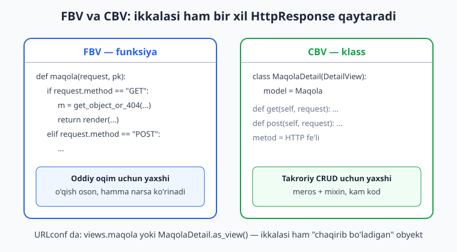
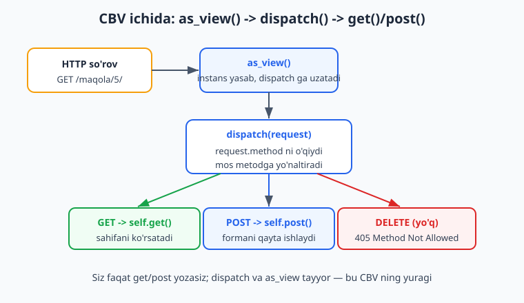
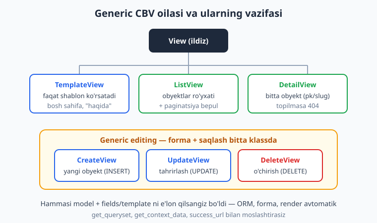

# 11 — Class-based views (CBV)

[⬅️ Oldingi: 10 — Formalar va validatsiya](./10-formalar.md) · [🏠 README](./README.md) · [Keyingi: 12 — Static, media va to'liq layout ➡️](./12-static-media-layout.md)

---

> **Bu bobda:** shu paytgacha view'larni funksiya (FBV — *function-based view*) sifatida yozdik. Endi ikkinchi yo'lni — **CBV** (*class-based view*) ni o'rganamiz: view klass bo'lib, HTTP metodlari (`get`, `post`) shu klassning metodlari bo'ladi. Avval `View` (eng ildizi) bilan `as_view()` va `dispatch()` mexanizmini ochamiz, keyin tayyor **generic** klasslar bo'ylab yuramiz: `TemplateView` (sof shablon), `ListView` (ro'yxat + paginatsiya), `DetailView` (bitta obyekt), va `CreateView`/`UpdateView`/`DeleteView` (generic editing — forma+saqlash avtomatik). Yo'l-yo'lakay eng ko'p ishlatiladigan moslashtirish nuqtalarini — `get_context_data()`, `get_queryset()`, `form_valid()`, `success_url`/`get_success_url()` — va **mixin** (`LoginRequiredMixin`) larni ko'ramiz. Oxirida muhim savol: qachon FBV, qachon CBV ishlatish kerak. Hamma kod Django 6.0.6 da haqiqatan ishga tushirib tekshirilgan.

---

## FBV va CBV: bir vazifaning ikki ko'rinishi

Avvalgi boblarda view shunaqa edi — oddiy funksiya, `request` qabul qiladi, `HttpResponse` qaytaradi:

```python
# views.py — FBV (funksiya)
from django.http import HttpResponse

def salom_fbv(request):
    return HttpResponse("Salom, FBV!")
```

CBV da xuddi shu narsa **klass** bo'ladi va HTTP metodi — klassning metodi:

```python
# views.py — CBV (klass)
from django.views import View
from django.http import HttpResponse

class SalomView(View):
    def get(self, request):
        return HttpResponse("Salom, GET!")

    def post(self, request):
        return HttpResponse("POST qabul qilindi!")
```

E'tibor bering: FBV da siz `if request.method == "GET": ... elif request.method == "POST": ...` deb qo'lda ajratardingiz. CBV da bu ajratish **avtomatik** — `GET` so'rov `get()` metodiga, `POST` so'rov `post()` metodiga boradi. Bu CBV ning birinchi yutug'i: har bir HTTP fe'li o'z metodiga ega bo'lib, kod toza ajraladi.



URLconf da farq bitta joyda: FBV ni to'g'ridan-to'g'ri uzatasiz, CBV ni esa `.as_view()` orqali:

```python
# urls.py
from django.urls import path
from . import views

urlpatterns = [
    path("salom-fbv/", views.salom_fbv, name="salom-fbv"),     # funksiyaning o'zi
    path("salom/", views.SalomView.as_view(), name="salom"),   # klass -> as_view()
]
```

`path()` ga "chaqirib bo'ladigan" (callable) narsa kerak. Funksiya o'zi chaqiriladi. Klass esa o'zi chaqirilmaydi — `as_view()` klassdan chaqirib bo'ladigan funksiya **yasab beradi**. Buni keyingi bo'limda ochamiz.

> Eslatma: bu kitob Python bilishni faraz qiladi ([Python qo'llanmasi](../python/README.md)) — ayniqsa klass, meros (inheritance) va `super()` tushunchasi shu bobda asosiy rol o'ynaydi. Agar siz Node.js'dan kelgan bo'lsangiz, CBV — bu marshrutni metodlarga (`router.get`, `router.post`) bog'lashning Django'cha, klassga jamlangan ko'rinishi ([Node.js solishtirish](../nodejs/README.md)).

## Nega umuman CBV kerak? Meros va takror-yo'qlik

Savol tabiiy: FBV ishlayapti-ku, nega yangi narsa? Javob — **takrorni yo'qotish**. Veb-ilovalarda bir xil naqsh qayta-qayta uchraydi: "ro'yxatni ko'rsat", "bitta obyektni ko'rsat", "forma ko'rsat va saqla". FBV da bu naqshni har safar qaytadan yozasiz. CBV da Django uni tayyor klass qilib bergan — siz faqat **farqni** (qaysi model, qaysi shablon) aytasiz, qolgani meros orqali keladi.

Quyidagi FBV — bitta maqolani ko'rsatadi. Diqqat bilan qarang, har bir qator "naqsh"ning bir bo'lagi:

```python
# ❌ Yomon emas, lekin har detail sahifada qaytariladigan naqsh
from django.shortcuts import render, get_object_or_404
from .models import Maqola

def maqola_detail_fbv(request, pk):
    maqola = get_object_or_404(Maqola, pk=pk)         # obyektni top yoki 404
    return render(request, "blog/maqola_detail.html", {"maqola": maqola})
```

Xuddi shu narsa CBV da:

```python
# Generic DetailView shu naqshni o'zida saqlaydi
from django.views.generic import DetailView
from .models import Maqola

class MaqolaDetailView(DetailView):
    model = Maqola
    template_name = "blog/maqola_detail.html"
    context_object_name = "maqola"
```

Bu yerda hech qanday "top yoki 404", hech qanday "render" yozmadik — `DetailView` ularni biladi. Biz faqat *qaysi model* va *qaysi shablon* ekanini aytdik. Ana shu — CBV ning kuchi: **konfiguratsiya orqali**, kod yozish orqali emas. Endi har bir generic klassni ochib chiqamiz; lekin avval ularning umumiy poydevorini — `View` ni — tushunamiz.

## `View` va `as_view()` / `dispatch()` mexanizmi

Hamma CBV ning ildizi — `django.views.View`. U eng sodda CBV bo'lib, undan ortig'ini sizdan kutmaydi: siz HTTP metodlariga mos `get`, `post`, `put`, `delete` metodlarini yozasiz. Mexanizm ikki qadamdan iborat:

1. **`as_view()`** — URLconf da chaqirasiz. U bir marta ishlaydi-da, view klassining instansini yasaydigan va `dispatch()` ni chaqiradigan **funksiya** qaytaradi. Yana bir bor: `path()` ga funksiya kerak, `as_view()` esa funksiya beradi.
2. **`dispatch()`** — har so'rovda ishlaydi. U `request.method` ni o'qib (masalan `"GET"`), nomi mos keladigan metodni (`self.get`) topadi va chaqiradi. Agar bunday metod yo'q bo'lsa (masalan klassingizda `delete` yo'q, lekin so'rov DELETE bo'lsa), Django avtomatik **405 Method Not Allowed** qaytaradi.



Mana shu mexanizmni o'z ko'zimiz bilan ko'rish uchun, view ichida `self` orqali so'rovning ma'lumotlariga kiramiz:

```python
# views.py — View ning ichki ishlashini ko'rsatuvchi misol
from django.views import View
from django.http import HttpResponse

class SalomView(View):
    def get(self, request):
        # self.request, self.args, self.kwargs — dispatch tomonidan biriktiriladi
        return HttpResponse("Salom, GET!")

    def post(self, request):
        return HttpResponse("POST qabul qilindi!")
```

`get()` chaqirilishidan oldin `dispatch()` allaqachon `self.request`, `self.args`, `self.kwargs` ni instansga yozib qo'ygan bo'ladi — shuning uchun har qanday metod ichida `self.request` mavjud. Bu FBV dagi `request` argumentining CBV'dagi ko'rinishi, ammo butun klass bo'ylab ulashiladi.

Endi DELETE so'rovi nima bo'lishini sinab ko'ramiz. Test mijozi (`Client`) orqali — bu Django'ning rasmiy sinov vositasi:

```python
# tests.py — 405 ni isbotlash
from django.test import TestCase

class ViewTest(TestCase):
    def test_get_post_405(self):
        self.assertEqual(self.client.get("/salom/").content, b"Salom, GET!")
        self.assertEqual(self.client.post("/salom/").content, b"POST qabul qilindi!")
        # klassda delete() yo'q -> dispatch 405 qaytaradi
        self.assertEqual(self.client.delete("/salom/").status_code, 405)
```

Bu test bizning muhitda **PASS** bo'ldi. `405` ni siz hech qaerda yozmadingiz — `dispatch()` "men bunday metodni qo'llab-quvvatlamayman" deb o'zi qaytardi. FBV da buni qo'lda tekshirishingizga to'g'ri kelardi.

> `dispatch()` ni o'zi ham boshqa muhim joy: u har bir so'rovda, har qanday metoddan **oldin** ishlaydi. Shuning uchun "tekshiruv" (masalan, foydalanuvchi tizimga kirganmi) odatda `dispatch()` ga qo'yiladi — bu aynan mixin'lar (`LoginRequiredMixin`) ishlaydigan joy. Buni quyida ko'ramiz.

## `TemplateView` — sof shablon ko'rsatish

Ko'p sahifalar shunchaki shablon ko'rsatadi: bosh sahifa, "biz haqimizda", yordam. Buning uchun `get` yozish ham ortiqcha — `TemplateView` bor. Faqat `template_name` ni aytasiz:

```python
# views.py
from django.views.generic import TemplateView

class HaqidaView(TemplateView):
    template_name = "blog/haqida.html"
```

URLconf:

```python
# urls.py
path("haqida/", views.HaqidaView.as_view(), name="haqida"),
```

Tamom — sahifa ishlaydi. Lekin shablonga ma'lumot uzatish kerak bo'lsa-chi? Mana shu yerda CBV ning eng muhim moslashtirish nuqtalaridan biri — **`get_context_data()`** keladi.

### `get_context_data()` — shablonga ma'lumot uzatish

FBV da kontekstni `render(request, tpl, {"jami": ...})` ning uchinchi argumenti orqali berardingiz. CBV da kontekst `get_context_data()` metodidan qaytadi. Uni qayta yozganda **doim** `super()` ni chaqirib, tayyor kontekstni olasiz, keyin o'zingiznikini qo'shasiz:

```python
# views.py
from django.views.generic import TemplateView
from .models import Maqola

class BoshView(TemplateView):
    template_name = "blog/bosh.html"

    def get_context_data(self, **kwargs):
        ctx = super().get_context_data(**kwargs)   # ota-klass kontekstini ol
        ctx["jami"] = Maqola.objects.count()       # o'zingiznikini qo'sh
        return ctx
```

Shablon:

```html
<!-- blog/bosh.html -->
<h1>Bosh sahifa</h1>
<p>Jami maqolalar: {{ jami }}</p>
```

`super().get_context_data(**kwargs)` ni **unutmang** — agar uni o'tkazib yuborsangiz, generic klasslar (`ListView`, `DetailView`...) o'z obyektlarini kontekstga qo'sha olmay qoladi. Bu CBV'dagi eng ko'p uchraydigan boshlovchi xatosi. Quyidagi test kontekstdagi `jami` to'g'ri kelishini tasdiqlaydi (bizda 8 ta maqola bor edi):

```python
# tests.py
def test_templateview_context(self):
    r = self.client.get("/")
    self.assertEqual(r.status_code, 200)
    self.assertEqual(r.context["jami"], 8)   # PASS
```

## `ListView` — ro'yxat va paginatsiya bepul

`ListView` modeldagi obyektlar ro'yxatini ko'rsatadi. Eng sodda ko'rinishi — faqat `model` ni aytish:

```python
# views.py
from django.views.generic import ListView
from .models import Maqola

class MaqolaListView(ListView):
    model = Maqola
```

Bu allaqachon ishlaydi, lekin Django ikkita "kelishuv" (convention) ga tayanadi, ularni bilish kerak:

- **Shablon nomi:** standart bo'yicha `<ilova>/<model>_list.html` — bizning holatda `blog/maqola_list.html`. Boshqa nom kerak bo'lsa `template_name` bilan o'zgartirasiz.
- **Kontekst nomi:** standart bo'yicha shablonda obyektlar `object_list` deb ataladi. Lekin `maqolalar` deb chaqirgan tabiiyroq — buning uchun `context_object_name` bor.

To'liqroq, amaliy ko'rinishi:

```python
# views.py
class MaqolaListView(ListView):
    model = Maqola
    template_name = "blog/maqola_list.html"
    context_object_name = "maqolalar"   # shablonda {{ maqolalar }}
    paginate_by = 5                      # har sahifada 5 ta -> paginatsiya yoqiladi

    def get_queryset(self):
        # standart hammasini oladi; biz faqat nashr etilganlarni, yangidan eskiga
        return Maqola.objects.filter(nashr=True).order_by("-yaratilgan")
```

### `get_queryset()` — qaysi obyektlar ko'rsatiladi

`get_queryset()` — `ListView` (va `DetailView`) ning eng muhim moslashtirish nuqtasi. U "qaysi obyektlar"ni belgilaydi. Standart bo'yicha `Model.objects.all()` qaytaradi; uni qayta yozib, **filter**, **order_by**, **select_related** (N+1 ni yo'qotish — [Ilg'or ORM](./09-ilgor-orm.md) bobiga qarang) qo'shasiz. Yuqorida biz faqat `nashr=True` bo'lgan maqolalarni, eng yangisidan boshlab ko'rsatdik.

`paginate_by = 5` qo'shilishi bilan Django shablonga uchta qo'shimcha narsa beradi: `page_obj` (joriy sahifa), `paginator` (umumiy ma'lumot) va `is_paginated` (bayroq). URL'ga `?page=2` qo'shilsa, ikkinchi sahifa keladi:

```html
<!-- blog/maqola_list.html -->
<h1>Maqolalar</h1>
<ul>

  <li><a href="{{ maqola.get_absolute_url }}">{{ maqola.sarlavha }}</a></li>

  <li>Maqola yo'q</li>

</ul>

  <p>Sahifa {{ page_obj.number }} / {{ page_obj.paginator.num_pages }}</p>

```

Quyidagi test ikki narsani bir vaqtda isbotlaydi: `get_queryset` filtri ishlaydi (yashirin maqola chiqmaydi), va paginatsiya 7 ta nashr etilgan maqolani 5+2 qilib bo'ladi:

```python
# tests.py — setUp: 7 ta nashr=True, 1 ta nashr=False yaratilgan
def test_listview_queryset_and_pagination(self):
    r = self.client.get("/maqolalar/")
    self.assertEqual(len(r.context["maqolalar"]), 5)      # 1-sahifada 5 ta
    self.assertTrue(r.context["is_paginated"])
    self.assertEqual(r.context["paginator"].count, 7)     # yashirin chiqmadi (8 emas, 7)
    r2 = self.client.get("/maqolalar/?page=2")
    self.assertEqual(len(r2.context["maqolalar"]), 2)     # 2-sahifada qolgan 2 ta
```

Bu test **PASS** bo'ldi. E'tibor bering: FBV da paginatsiyani Django'ning `Paginator` klassi bilan qo'lda qurardingiz; bu yerda bitta `paginate_by = 5` yetadi.

## `DetailView` — bitta obyekt

`DetailView` bitta obyektni ko'rsatadi. URL'dan `pk` (yoki `slug`) oladi, obyektni topadi, topilmasa **404** qaytaradi:

```python
# views.py
from django.views.generic import DetailView
from .models import Maqola

class MaqolaDetailView(DetailView):
    model = Maqola
    template_name = "blog/maqola_detail.html"
    context_object_name = "maqola"   # shablonda {{ maqola }}, yo'qsa {{ object }}
```

URLconf'da `<int:pk>` bo'lishi shart — `DetailView` aynan shu nomdagi parametrni qidiradi:

```python
# urls.py
path("maqola/<int:pk>/", views.MaqolaDetailView.as_view(), name="maqola-detail"),
```

Shablonda obyekt `maqola` (yoki `context_object_name` bermasangiz `object`) deb keladi:

```html
<!-- blog/maqola_detail.html -->
<h1>{{ maqola.sarlavha }}</h1>
<p>{{ maqola.matn }}</p>
```

`DetailView` ortida `get_queryset()` turgani uchun, faqat ma'lum obyektlar ko'rinishi kerak bo'lsa (masalan, "faqat nashr etilganlar"), uni shu yerda ham qayta yozasiz: `return Maqola.objects.filter(nashr=True)`. Topilmaslik 404 ga aylanadi:

```python
# tests.py
def test_detailview(self):
    m = Maqola.objects.first()
    r = self.client.get(f"/maqola/{m.pk}/")
    self.assertEqual(r.status_code, 200)
    self.assertEqual(r.context["maqola"].pk, m.pk)

def test_detailview_404(self):
    self.assertEqual(self.client.get("/maqola/99999/").status_code, 404)   # PASS
```

Ikkala test ham **PASS**. "Mavjud bo'lmasa 404" mantiqini siz yozmadingiz — generic view'ning ichida.



## Generic editing: `CreateView`, `UpdateView`, `DeleteView`

Bu uchtasi CBV ning eng katta vaqt tejovchisi. Ular **forma + saqlash** ning butun naqshini o'zida saqlaydi:

- **GET** so'rovida — formani (modeldan avtomatik yasalgan `ModelForm` ni, [10-bob](./10-formalar.md)) ko'rsatadi.
- **POST** so'rovida — formani tekshiradi; to'g'ri bo'lsa bazaga yozadi va `success_url` ga yo'naltiradi; xato bo'lsa formani xatolar bilan qayta ko'rsatadi.

Siz `model` va `fields` ni aytasiz (yoki o'z `form_class` ingizni berasiz), Django qolganini bajaradi.

### `CreateView` — yangi obyekt yaratish

```python
# views.py
from django.views.generic import CreateView
from .models import Maqola

class MaqolaCreateView(CreateView):
    model = Maqola
    fields = ["sarlavha", "matn", "nashr"]   # formaga kiradigan maydonlar
    template_name = "blog/maqola_form.html"
```

Shablon — oddiy forma (forma `{{ form }}` deb keladi, [10-bobdagi](./10-formalar.md) `ModelForm` bilan bir xil):

```html
<!-- blog/maqola_form.html -->
<h1>Maqola formasi</h1>
<form method="post">
  
  {{ form.as_p }}
  <button type="submit">Saqlash</button>
</form>
```

Saqlangach qayerga ketadi? `CreateView` (va `UpdateView`) standart bo'yicha yangi obyektning **`get_absolute_url()`** iga yo'naltiradi. Shuning uchun modelda uni yozib qo'yish foydali:

```python
# models.py
from django.db import models
from django.urls import reverse

class Maqola(models.Model):
    sarlavha = models.CharField(max_length=200)
    matn = models.TextField()
    nashr = models.BooleanField(default=False)
    yaratilgan = models.DateTimeField(auto_now_add=True)

    def __str__(self):
        return self.sarlavha

    def get_absolute_url(self):
        # saqlangach shu URL ga yo'naltiriladi
        return reverse("maqola-detail", kwargs={"pk": self.pk})
```

### `UpdateView` — mavjud obyektni tahrirlash

`UpdateView` deyarli `CreateView` bilan bir xil, faqat URL'dan `pk` olib mavjud obyektni topadi va formani **uning qiymatlari bilan to'ldirib** ko'rsatadi:

```python
# views.py
from django.views.generic import UpdateView

class MaqolaUpdateView(UpdateView):
    model = Maqola
    fields = ["sarlavha", "matn", "nashr"]
    template_name = "blog/maqola_form.html"   # Create bilan bitta shablonni baham ko'radi
```

```python
# urls.py
path("maqola/<int:pk>/tahrir/", views.MaqolaUpdateView.as_view(), name="maqola-update"),
```

### `DeleteView` va `success_url`

`DeleteView` GET'da tasdiq sahifasini, POST'da o'chirishni bajaradi. O'chirilgach yo'naltirish uchun obyekt endi mavjud emas, shuning uchun `get_absolute_url()` ishlamaydi — bu yerda **`success_url`** kerak. Lekin URL'ni odatdagi `reverse()` bilan modul yuklanishida hisoblab bo'lmaydi (URLconf hali tayyor emas), shuning uchun **`reverse_lazy`** ishlatiladi:

```python
# views.py
from django.views.generic import DeleteView
from django.urls import reverse_lazy

class MaqolaDeleteView(DeleteView):
    model = Maqola
    template_name = "blog/maqola_confirm_delete.html"
    success_url = reverse_lazy("maqola-list")   # ❌ reverse() emas — reverse_lazy()
```

```html
<!-- blog/maqola_confirm_delete.html -->
<h1>O'chirish</h1>
<form method="post">
  
  <p>"{{ maqola }}" ni o'chirishni tasdiqlaysizmi?</p>
  <button type="submit">Ha, o'chir</button>
</form>
```

> **Nega `reverse_lazy`, `reverse` emas?** `success_url = reverse(...)` klass e'lon qilinayotgan paytda — ya'ni Django hali barcha URL'larni yuklab bo'lmaganida — ishga tushadi va `NoReverseMatch` xatosi beradi. `reverse_lazy` esa "dangasa": URL'ni faqat haqiqatan kerak bo'lganda (yo'naltirish vaqtida) hisoblaydi. Klass darajasidagi har qanday URL uchun (`success_url`, `login_url`) doim `reverse_lazy` ishlating.

Dinamik URL kerak bo'lsa (masalan, har obyekt uchun har xil joy), `success_url` o'rniga **`get_success_url()`** metodini yozasiz — u so'rov vaqtida chaqiriladi, demak `reverse()` (oddiy) ham bemalol:

```python
# views.py — dinamik yo'naltirish
from django.urls import reverse

class MaqolaUpdateView(UpdateView):
    model = Maqola
    fields = ["sarlavha", "matn"]

    def get_success_url(self):
        return reverse("maqola-detail", kwargs={"pk": self.object.pk})
```

Quyidagi testlar uchala editing view'ni tekshiradi — yaratish `get_absolute_url`ga, o'chirish `success_url`ga yo'naltirishini:

```python
# tests.py (foydalanuvchi tizimga kirgan holatda — quyidagi mixin bo'limiga qarang)
def test_create_logged_in(self):
    self.client.login(username="ali", password="parol12345")
    r2 = self.client.post("/maqola/yangi/", {
        "sarlavha": "Yangi", "matn": "kontent", "nashr": True,
    })
    self.assertEqual(r2.status_code, 302)                 # yaratildi -> yo'naltirish
    m = Maqola.objects.get(sarlavha="Yangi")
    self.assertEqual(r2.url, f"/maqola/{m.pk}/")          # get_absolute_url ga

def test_delete(self):
    self.client.login(username="ali", password="parol12345")
    m = Maqola.objects.first()
    r = self.client.post(f"/maqola/{m.pk}/ochir/")
    self.assertEqual(r.url, "/maqolalar/")                # success_url ga
    self.assertFalse(Maqola.objects.filter(pk=m.pk).exists())
```

Ikkalasi ham **PASS**. To'liq CRUD'ni (Create, Read-list, Read-detail, Update, Delete) biz deyarli faqat e'lonlar bilan qurdik.

### `form_valid()` — saqlashdan oldin aralashish

Ko'p hollarda saqlashdan oldin biror narsa qo'shish kerak bo'ladi — eng klassik misol: maqolaning **muallifini** joriy foydalanuvchiga tenglash. Buni `form_valid()` da qilasiz. U forma to'g'ri bo'lgach, lekin bazaga yozishdan oldin chaqiriladi:

```python
# views.py — muallifni avtomatik biriktirish (illustrativ, modelda `muallif` maydoni bo'lsa)
class MaqolaCreateView(CreateView):
    model = Maqola
    fields = ["sarlavha", "matn", "nashr"]   # muallif formada YO'Q

    def form_valid(self, form):
        form.instance.muallif = self.request.user   # saqlanmagan obyektga qo'shamiz
        return super().form_valid(form)             # super() saqlaydi + yo'naltiradi
```

Biz `form_valid()` mexanizmini soddalashtirilgan misolda haqiqatan tekshirdik: `form.instance` ni o'zgartirib, `super().form_valid()` chaqirilgach baza qatori o'zgargan qiymat bilan yozildi va 302 yo'naltirish qaytdi (**PASS**). Yodda tuting: `super().form_valid(form)` ni chaqirishni unutmang — aks holda obyekt saqlanmaydi.

## Mixin'lar: `LoginRequiredMixin` va boshqalar

Endi `dispatch()` haqida aytganimizga qaytamiz. Eslang: `dispatch()` har bir metoddan oldin ishlaydi. **Mixin** — bu `dispatch()` (yoki boshqa metod) ga "ulanib", umumiy xatti-harakat qo'shadigan kichik klass. Eng ko'p ishlatiladigani — **`LoginRequiredMixin`**: u "agar foydalanuvchi tizimga kirmagan bo'lsa, uni kirish sahifasiga yo'naltir" deydi.

Muhim qoida (Python merosidan): **mixin har doim asosiy view'dan oldin** yoziladi. Sababi metod-aniqlash tartibi (MRO — *method resolution order*): chapdagi klass ustun bo'ladi, shuning uchun tekshiruv asosiy view ishlashidan oldin bajariladi.

```python
# views.py
from django.contrib.auth.mixins import LoginRequiredMixin
from django.views.generic import CreateView
from .models import Maqola

class MaqolaCreateView(LoginRequiredMixin, CreateView):   # ✅ mixin chapda
    model = Maqola
    fields = ["sarlavha", "matn", "nashr"]
    template_name = "blog/maqola_form.html"
    login_url = "/kirish/"          # kirmaganlar shu yerga yo'naltiriladi
```

```python
# ❌ XATO tartib: CreateView avval -> LoginRequiredMixin ta'sir qilmaydi
class MaqolaCreateView(CreateView, LoginRequiredMixin):
    ...
```

Quyidagi test ikki holatni isbotlaydi — kirmagan foydalanuvchi yo'naltiriladi, kirgani esa kiritiladi:

```python
# tests.py
def test_create_requires_login(self):
    r = self.client.get("/maqola/yangi/")
    self.assertEqual(r.status_code, 302)        # kirmagan -> yo'naltirish
    self.assertIn("/kirish/", r.url)

def test_create_logged_in(self):
    User.objects.create_user("ali", password="parol12345")
    self.client.login(username="ali", password="parol12345")
    self.assertEqual(self.client.get("/maqola/yangi/").status_code, 200)   # PASS
```

Ikkalasi ham **PASS**. Boshqa foydali tayyor mixin'lar (autentifikatsiya bobida chuqurroq ko'ramiz):

- **`PermissionRequiredMixin`** — ma'lum ruxsat (`permission_required = "blog.add_maqola"`) talab qiladi.
- **`UserPassesTestMixin`** — `test_func()` da o'z shartingizni yozasiz (masalan, "faqat o'z maqolasini tahrirlay olsin").

### O'z mixin'ingizni yozish

Mixin — oddiy klass. Ko'p view'da takrorlanadigan kontekstni bitta joyga jamlash uchun o'zingiznikini yozishingiz mumkin. Quyidagi mixin har bir sahifaga sarlavha qo'shadi:

```python
# views.py — o'z mixin
from django.views.generic.base import ContextMixin

class SarlavhaMixin(ContextMixin):
    sahifa_sarlavha = "Standart"

    def get_context_data(self, **kwargs):
        ctx = super().get_context_data(**kwargs)
        ctx["sahifa_sarlavha"] = self.sahifa_sarlavha
        return ctx

class HaqidaView(SarlavhaMixin, TemplateView):
    template_name = "blog/bosh.html"
    sahifa_sarlavha = "Biz haqimizda"
```

Biz buni haqiqatan tekshirdik: `HaqidaView().get_context_data()` kontekstida `sahifa_sarlavha == "Biz haqimizda"` chiqdi, va MRO tartibi `HaqidaView -> SarlavhaMixin -> TemplateView -> ... -> ContextMixin` bo'ldi (**PASS**). Bu yerda `super().get_context_data()` zanjiri MRO bo'ylab har bir klassni navbat bilan chaqirgani uchun ishlaydi — `super()` ni unutmaslikning yana bir sababi.

## Qachon FBV, qachon CBV?

Bu eng amaliy savol va javob "har doim CBV" emas. Quyidagi qoidalar amaliyotda yaxshi ishlaydi:

**CBV oling, agar:**

- Klassik CRUD naqshini bajaryapsiz — ro'yxat, detail, yaratish/tahrirlash/o'chirish. Bu yerda `ListView`, `DetailView`, `CreateView` va h.k. juda ko'p kod tejaydi.
- Bir nechta view'da bir xil xatti-harakat kerak (login talabi, umumiy kontekst) — mixin orqali bir marta yozasiz.
- Loyiha o'sib boryapti va izchillik (har detail sahifa bir xil ko'rinsin) muhim.

**FBV oling, agar:**

- View'da g'ayrioddiy, "naqshga tushmaydigan" mantiq bor — bir nechta model bilan ishlash, murakkab shart, tashqi API chaqiruvi. CBV ni majburlab moslashtirgandan ko'ra, oddiy funksiya tushunarliroq.
- View juda oddiy va bir martalik (masalan, bitta JSON qaytaradigan endpoint).
- Jamoangiz yoki siz hali CBV ichki oqimi (qaysi metod nimani chaqiradi) bilan tanish emassiz — o'qib bo'lmaydigan "sehrli" CBV dan ochiq FBV afzal.

Oltin qoida: **takrorlanuvchi, standart ish — CBV; noyob, murakkab mantiq — FBV.** Ikkalasini bir loyihada aralash ishlatish mutlaqo normal va keng tarqalgan. Django ham, jamoa ham buni qoralamaydi.

Bitta foydali maslahat: CBV ichida qaysi metodni qayta yozishni bilmasangiz, [Classy Class-Based Views](https://ccbv.co.uk) (ccbv.co.uk) saytida har bir generic view'ning butun metod ro'yxati va MRO si ochib berilgan — eng yaxshi ma'lumotnoma.

## Mashqlar

### Oson

1. `View` dan meros olib, `get()` da `HttpResponse("Vaqt: ...")` qaytaradigan `VaqtView` yozing va URL'ga ulang. `as_view()` ni qaerda chaqirasiz?
2. `TemplateView` yordamida "Bog'lanish" (`aloqa.html`) sahifasini ko'rsatuvchi view yozing. Hech qanday `get()` yozmang.
3. `BoshView` (TemplateView) ning `get_context_data()` ida kontekstga `nom = "Mening blogim"` qo'shing va shablonda ko'rsating.
4. `ListView` uchun shablon nomi va kontekst nomining **standart** qiymatlari qanaqa? `Maqola` modeli uchun aniq yozib bering.
5. `MaqolaDetailView` (DetailView) ning URL'i `<int:pk>` o'rniga `<int:id>` bo'lsa nima bo'ladi? Nega?
6. `DeleteView` da nega `success_url = reverse(...)` xato, `reverse_lazy(...)` to'g'ri? Bir jumlada tushuntiring.

### O'rta

7. `MaqolaListView` (ListView) da `get_queryset()` ni shunday yozingki, faqat `nashr=True` bo'lgan va sarlavhasida URL'dan kelgan `?q=` so'zi bor maqolalar chiqsin (`self.request.GET`).
8. `MaqolaListView` ga `paginate_by = 3` qo'shing va shablonda "oldingi / keyingi" havolalarini `page_obj.has_previous` / `has_next` orqali ko'rsating.
9. `MaqolaCreateView` (CreateView) ga `form_valid()` yozib, saqlashdan oldin `form.instance.nashr = False` qiling (har yangi maqola qoralama bo'lib yaratilsin).
10. `MaqolaUpdateView` da `success_url` o'rniga `get_success_url()` yozing — tahrirlangach o'sha maqolaning detail sahifasiga qaytsin.
11. `LoginRequiredMixin` ni `MaqolaUpdateView` va `MaqolaDeleteView` ga qo'shing. Mixin klasslar ro'yxatida qayerda turishi kerak va nega?
12. `get_context_data()` da `super()` ni **chaqirmasangiz** `ListView` da nima yo'qoladi? Sinab ko'ring va tushuntiring.

### Qiyin

13. `SarlavhaMixin` (ContextMixin) yozing: u kontekstga `sahifa_sarlavha` qo'shsin. Uni `ListView` va `DetailView` ga qo'llang, har birida boshqa sarlavha bering. MRO tartibi qanaqa bo'ladi?
14. `UserPassesTestMixin` yordamida `MaqolaUpdateView` ni shunday cheklang: faqat staff (`request.user.is_staff`) foydalanuvchi tahrirlay olsin, boshqasi 403 olsin. (Modelda muallif maydoni yo'q deb faraz qiling.)
15. Bitta `MaqolaActionView(View)` yozing: `get()` da tasdiq sahifasini, `post()` da maqolani `nashr=True` qilib belgilab, ro'yxatga yo'naltiruvchi (qo'lda `redirect`) — ya'ni generic editing'siz, sof `View` bilan. Bu CBV ichida `dispatch` ning ishini ko'rsatadi.

<details markdown="1"><summary>Yechimlar</summary>

**1.**

```python
# views.py
from django.views import View
from django.http import HttpResponse
from django.utils import timezone

class VaqtView(View):
    def get(self, request):
        return HttpResponse(f"Vaqt: {timezone.now():%H:%M:%S}")
```

```python
# urls.py — as_view() URLconf da chaqiriladi (path ga callable kerak)
path("vaqt/", VaqtView.as_view(), name="vaqt"),
```

**2.**

```python
# views.py
from django.views.generic import TemplateView

class AloqaView(TemplateView):
    template_name = "blog/aloqa.html"
```

```python
# urls.py
path("aloqa/", AloqaView.as_view(), name="aloqa"),
```

`TemplateView` GET'ni o'zi qayta ishlaydi — `get()` yozish shart emas.

**3.**

```python
class BoshView(TemplateView):
    template_name = "blog/bosh.html"

    def get_context_data(self, **kwargs):
        ctx = super().get_context_data(**kwargs)
        ctx["nom"] = "Mening blogim"
        return ctx
```

```html
<h1>{{ nom }}</h1>
```

**4.** Shablon: `blog/maqola_list.html` (`<ilova>/<model kichik harf>_list.html`). Kontekst nomi: `object_list` (yana `maqola_list` ham mavjud bo'ladi). `context_object_name = "maqolalar"` bilan o'zgartirasiz.

**5.** `DetailView` standart bo'yicha URL'dan `pk` yoki `slug` nomli parametrni qidiradi. `<int:id>` bo'lsa, `id` nomi mos kelmaydi va `AttributeError`/konfiguratsiya xatosi chiqadi. Yechim: `<int:pk>` ishlating, yoki `pk_url_kwarg = "id"` deb view'ga ayting.

**6.** `success_url = reverse(...)` klass yuklanayotgan paytda — URL'lar hali ro'yxatdan o'tmaganida — ishga tushadi va `NoReverseMatch` beradi; `reverse_lazy(...)` esa URL'ni faqat haqiqatan kerak bo'lganda (yo'naltirishda) hisoblaydi.

**7.**

```python
class MaqolaListView(ListView):
    model = Maqola
    context_object_name = "maqolalar"

    def get_queryset(self):
        qs = Maqola.objects.filter(nashr=True)
        q = self.request.GET.get("q")
        if q:
            qs = qs.filter(sarlavha__icontains=q)
        return qs.order_by("-yaratilgan")
```

**8.**

```python
class MaqolaListView(ListView):
    model = Maqola
    context_object_name = "maqolalar"
    paginate_by = 3
```

```html

  
    <a href="?page={{ page_obj.previous_page_number }}">Oldingi</a>
  
  <span>{{ page_obj.number }} / {{ page_obj.paginator.num_pages }}</span>
  
    <a href="?page={{ page_obj.next_page_number }}">Keyingi</a>
  

```

**9.**

```python
class MaqolaCreateView(CreateView):
    model = Maqola
    fields = ["sarlavha", "matn"]   # nashr formada yo'q
    template_name = "blog/maqola_form.html"

    def form_valid(self, form):
        form.instance.nashr = False        # qoralama
        return super().form_valid(form)
```

**10.**

```python
from django.urls import reverse

class MaqolaUpdateView(UpdateView):
    model = Maqola
    fields = ["sarlavha", "matn", "nashr"]
    template_name = "blog/maqola_form.html"

    def get_success_url(self):
        return reverse("maqola-detail", kwargs={"pk": self.object.pk})
```

`get_success_url()` so'rov vaqtida chaqilgani uchun bu yerda oddiy `reverse()` bemalol ishlaydi.

**11.**

```python
from django.contrib.auth.mixins import LoginRequiredMixin

class MaqolaUpdateView(LoginRequiredMixin, UpdateView):
    model = Maqola
    fields = ["sarlavha", "matn", "nashr"]
    template_name = "blog/maqola_form.html"

class MaqolaDeleteView(LoginRequiredMixin, DeleteView):
    model = Maqola
    success_url = reverse_lazy("maqola-list")
```

Mixin **eng chapda** (asosiy view'dan oldin) turishi kerak. MRO tufayli chapdagi klass ustun bo'ladi, shuning uchun `LoginRequiredMixin.dispatch()` tekshiruvi asosiy view ishlamasdan oldin bajariladi. Teskari tartibda mixin ta'sir qilmaydi.

**12.** `super().get_context_data()` ni chaqirmasangiz, `ListView` o'zining `object_list`/`paginator`/`page_obj`/`is_paginated` (va `context_object_name` orqali ataladigan ro'yxat) kontekstini kontekstga **qo'sha olmaydi** — shablonda obyektlar ro'yxati yo'qoladi, `` bo'sh ishlaydi. Sinov: `get_context_data` da faqat `return {"x": 1}` qaytarsangiz, shablon ro'yxatni topa olmaydi.

**13.**

```python
from django.views.generic.base import ContextMixin

class SarlavhaMixin(ContextMixin):
    sahifa_sarlavha = "Standart"

    def get_context_data(self, **kwargs):
        ctx = super().get_context_data(**kwargs)
        ctx["sahifa_sarlavha"] = self.sahifa_sarlavha
        return ctx

class MaqolaListView(SarlavhaMixin, ListView):
    model = Maqola
    context_object_name = "maqolalar"
    sahifa_sarlavha = "Barcha maqolalar"

class MaqolaDetailView(SarlavhaMixin, DetailView):
    model = Maqola
    context_object_name = "maqola"
    sahifa_sarlavha = "Maqola tafsiloti"
```

MRO (masalan ListView uchun): `MaqolaListView -> SarlavhaMixin -> ListView -> ... -> ContextMixin -> object`. `super().get_context_data()` zanjiri shu tartibda har bir klassni chaqirgani uchun mixin ham, ListView ham o'z hissasini qo'shadi.

**14.**

```python
from django.contrib.auth.mixins import UserPassesTestMixin

class MaqolaUpdateView(UserPassesTestMixin, UpdateView):
    model = Maqola
    fields = ["sarlavha", "matn", "nashr"]
    template_name = "blog/maqola_form.html"
    raise_exception = True   # test o'tmasa 403 (yo'naltirish o'rniga)

    def test_func(self):
        return self.request.user.is_staff
```

`raise_exception = True` bo'lmasa, test o'tmagan foydalanuvchi `login_url` ga yo'naltiriladi; `True` bilan to'g'ridan-to'g'ri 403 oladi.

**15.**

```python
from django.views import View
from django.shortcuts import render, get_object_or_404, redirect

class MaqolaActionView(View):
    def get(self, request, pk):
        maqola = get_object_or_404(Maqola, pk=pk)
        return render(request, "blog/nashr_tasdiq.html", {"maqola": maqola})

    def post(self, request, pk):
        maqola = get_object_or_404(Maqola, pk=pk)
        maqola.nashr = True
        maqola.save()
        return redirect("maqola-list")
```

```python
# urls.py
path("maqola/<int:pk>/nashr/", MaqolaActionView.as_view(), name="maqola-nashr"),
```

Bu yerda `dispatch()` GET'ni `get()` ga, POST'ni `post()` ga o'zi yo'naltiradi — siz hech qanday `if request.method` yozmaysiz. Aynan shu CBV ning `View` darajasidagi asosiy foydasi.

</details>

---

[⬅️ Oldingi: 10 — Formalar va validatsiya](./10-formalar.md) · [🏠 README](./README.md) · [Keyingi: 12 — Static, media va to'liq layout ➡️](./12-static-media-layout.md)
