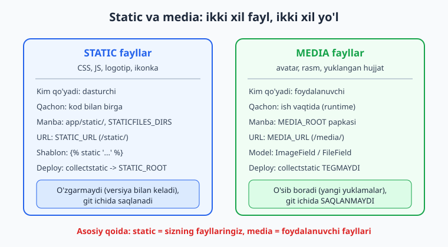
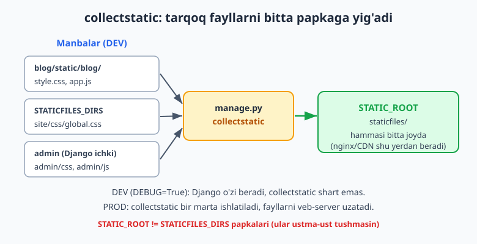
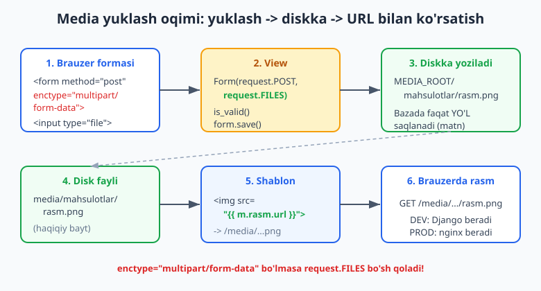

# 12 — Static, media va to'liq layout

[⬅️ Oldingi: 11 — Class-based views (CBV)](./11-class-based-views.md) · [🏠 README](./README.md) · [Keyingi: 13 — Autentifikatsiya va ruxsatlar ➡️](./13-auth-tizimi.md)

---

> **Bu bobda:** sahifani "jonlantiruvchi" ikki xil faylni o'rganamiz. Birinchisi — **static fayllar** (CSS, JS, logotip, ikonka): ularni dasturchi qo'yadi va kod bilan birga keladi. `STATIC_URL`, `STATICFILES_DIRS`, app ichidagi `static/` papka, `` va `` tegi, hamda deploy paytida ishlatiladigan `collectstatic` + `STATIC_ROOT` ni ko'ramiz. Ikkinchisi — **media fayllar** (avatar, mahsulot rasmi, yuklangan hujjat): ularni foydalanuvchi yuklaydi. `MEDIA_URL`/`MEDIA_ROOT`, modelda `FileField` va `ImageField`, formada `request.FILES` va `enctype="multipart/form-data"`, `upload_to` (jumladan callable variant), `FileExtensionValidator`, va `Pillow` bilan rasm ustida ishlash (o'lcham, thumbnail) — hammasini yozamiz. Nihoyat hamma bilimni birlashtirib **to'liq `base.html` layout + navigatsiya** quramiz: ``, ``, faol menyu va static CSS ulangan zamonaviy karkas. Hamma kod Django 6.0.6, Python 3.14 va Pillow 12.2 da haqiqatan ishga tushirib tekshirilgan.

---

## Static va media: nima farqi bor?

Ilovangizda ikki xil "qo'shimcha" fayl bo'ladi va Django ularni butunlay boshqacha boshqaradi. Avval farqni miyaga mahkamlab oling — keyingi hamma narsa shu farqga tayanadi.

- **Static fayllar** — bu **siz**, dasturchi, yozadigan o'zgarmas fayllar: `style.css`, `app.js`, sayt logotipi, ikonkalar. Ular kod bilan birga keladi, git ichida saqlanadi, versiyadan versiyaga o'zgarmaydi.
- **Media fayllar** — bu **foydalanuvchi** ilova ishlab turganda yuklaydigan fayllar: profil rasmi, mahsulot surati, yuklangan PDF. Ular kodga aloqasi yo'q, vaqt o'tib o'sib boradi, va git ichiga **qo'yilmaydi**.



Bitta jumlada: **static = sizning fayllaringiz, media = foydalanuvchi fayllari.** Bu farq nega muhim — chunki ularning manbasi, URL'i, deploy qilinishi va xavfsizlik munosabati boshqa-boshqa. Endi har birini alohida quramiz.

> Bu kitob Python bilishni faraz qiladi ([Python qo'llanmasi](../python/README.md)); fayl yo'llari va `pathlib` bilan tanish bo'lsangiz qulay bo'ladi. Agar Node.js'dan kelgan bo'lsangiz: Django'ning static tizimi Express'dagi `express.static()` + build vositasidagi `collect` qadamning bittaga qo'shilgani ([Node.js solishtirish](../nodejs/README.md)).

## Static fayllar: STATIC_URL va app ichidagi static/

Yangi loyihada `settings.py` ning oxirida bitta qator allaqachon turadi:

```python
# mysite/settings.py
STATIC_URL = 'static/'
```

`STATIC_URL` — bu static fayllar **brauzer uchun qaysi manzilda** ko'rinishini bildiradi (haqiqiy disk yo'li emas, URL prefiksi). Ya'ni `style.css` fayli sahifada `/static/style.css` bo'lib so'raladi.

Static fayllaringizni qayerga qo'yasiz? Eng keng tarqalgan va tavsiya etiladigan joy — **har ilovaning ichidagi `static/` papka**. Django `'django.contrib.staticfiles'` ilovasi (yangi loyihada `INSTALLED_APPS` da bor) har ilovaning `static/` papkasini avtomatik topadi.

Muhim nayrang: takrorlanishdan saqlanish uchun fayllarni `static/<app_nomi>/` ichiga qo'yamiz. Ya'ni `blog` ilovasida:

```text
blog/
  static/
    blog/                # <-- ilova nomi bilan "namespace"
      css/
        style.css
      js/
        app.js
```

Nega yana bir bor `blog/`? Chunki ikkita ilovada ham `css/style.css` bo'lsa, Django ularni ajrata olmaydi. `blog/css/style.css` va `shop/css/style.css` esa to'qnashmaydi. Bu kichik odat ko'p og'riqdan saqlaydi.

`style.css` ichiga oddiy uslub yozamiz:

```css
/* blog/static/blog/css/style.css */
body { font-family: "Segoe UI", sans-serif; margin: 0; }
nav { background: #2563eb; padding: 12px; }
nav a { color: #fff; margin-right: 16px; text-decoration: none; }
main { padding: 20px; }
```

###  va  tegi

Shablonda static faylga **hech qachon yo'lni qo'lda yozmang** (`/static/blog/css/style.css` deb). Buning ikki sababi bor: `STATIC_URL` o'zgarsa hamma joyni tahrirlash kerak bo'ladi, va deploy'da fayl nomiga "barmoq izi" (hash) qo'shilishi mumkin. To'g'ri yo'l — `` tegi:

```html

<link rel="stylesheet" href="">
<script src=""></script>

```

`` — shablon boshida bir marta yoziladi (teglar kutubxonasini yuklaydi). `` esa berilgan nomni `STATIC_URL` bilan birlashtirib to'liq URL chiqaradi.

Shellda tekshirilgan natija:

```python
>>> from django.templatetags.static import static
>>> static("blog/css/style.css")
'/static/blog/css/style.css'
```

Ya'ni `'static/'` + `'blog/css/style.css'` = `/static/blog/css/style.css`. Endi `STATIC_URL` ni o'zgartirsangiz, hamma havola avtomatik yangilanadi.

> Bu bobda biz [04-bob](./04-template-tizimi.md)dagi `` va template tizimini ishlatamiz; agar `` / `` esingizdan chiqqan bo'lsa, shu bobni ko'zdan kechiring.

## STATICFILES_DIRS: loyiha darajasidagi static

App ichidagi `static/` ma'lum bir ilovaga tegishli fayllar uchun. Ammo butun saytga umumiy fayllar bo'ladi — masalan asosiy `global.css`, favicon, umumiy logotip. Bularni ilovaga bog'lab qo'yish noto'g'ri. Buning uchun loyiha darajasidagi papka ochib, uni `STATICFILES_DIRS` ga qo'shamiz:

```python
# mysite/settings.py
from pathlib import Path

BASE_DIR = Path(__file__).resolve().parent.parent

STATIC_URL = 'static/'
STATICFILES_DIRS = [BASE_DIR / 'static']   # loyiha ildizidagi static/ papka
```

Endi `BASE_DIR/static/` ichiga qo'yilgan fayllar ham topiladi:

```text
mysite/                  # loyiha ildizi (BASE_DIR)
  static/
    site/
      css/
        global.css
  blog/
  mysite/
  manage.py
```

`STATICFILES_DIRS` — bu **ro'yxat**, ya'ni bir nechta papka qo'shsa bo'ladi. Django static faylni qidirganda ikki manbadan izlaydi: (1) `STATICFILES_DIRS` dagi papkalar, (2) har ilovaning `static/` si.

### findstatic: fayl qayerdan topilyapti?

Qaysi fayl qayerdan kelayotganini bilish uchun `findstatic` buyrug'i bor — debug paytida juda foydali:

```bash
python manage.py findstatic blog/css/style.css
```

Tekshirilgan natija:

```text
Found 'blog/css/style.css' here:
  C:\...\dj-ch12\blog\static\blog\css\style.css
```

Agar fayl topilmasa, `findstatic` "No matching file found" deydi — demak yo'l yoki namespace xato.

> **Diqqat — W004 ogohlantirishi:** agar `STATICFILES_DIRS` da ko'rsatilgan papka (`BASE_DIR/static`) mavjud bo'lmasa, `python manage.py check` `(staticfiles.W004)` ogohlantirishini beradi. Papkani yarating yoki ro'yxatdan olib tashlang. Bu xato emas, ogohlantirish — ilova baribir ishlaydi.

## collectstatic va STATIC_ROOT: deploy uchun

Endi eng ko'p chalkashtiradigan tushuncha. Ishlab chiqish (development, `DEBUG=True`) paytida Django static fayllarni **o'zi** topib uzatadi — siz hech narsa qilmasangiz ham `/static/...` ishlaydi. Ammo **production**'da (`DEBUG=False`) Django static faylni uzatmaydi — bu sekin va xavfsiz emas. Production'da static fayllarni veb-server (nginx) yoki CDN beradi, va ular **bitta papkadan** o'qishni xohlaydi.

Mana shu yerda `collectstatic` keladi: u hamma tarqoq static fayllarni (app'lardan, `STATICFILES_DIRS` dan, hatto Django admin'ning ichki fayllaridan) bitta papkaga — `STATIC_ROOT` ga ko'chiradi.



```python
# mysite/settings.py
STATIC_ROOT = BASE_DIR / 'staticfiles'   # collectstatic shu yerga yig'adi
```

> **MUHIM:** `STATIC_ROOT` `STATICFILES_DIRS` papkalaridan **boshqa** bo'lishi shart. Ya'ni `staticfiles/` (yig'iladigan joy) `static/` (manbalardan biri) bilan bir xil bo'lmasin — aks holda Django xato beradi.

Buyruq:

```bash
python manage.py collectstatic --noinput
```

Tekshirilgan natija:

```text
132 static files copied to 'C:\...\dj-ch12\staticfiles'.
```

Bu 132 fayl — sizning CSS/JS'laringiz **plus** Django admin panelining ichki uslublari. Endi `staticfiles/` ichida `admin/`, `blog/`, `site/` papkalari turadi. Production'da nginx aynan shu papkani uzatadi.

Asosiy nuqtalarni jamlaymiz:

| Tushuncha | Vazifa | Qachon kerak |
|---|---|---|
| `STATIC_URL` | URL prefiksi (`/static/`) | doim |
| App `static/` | ilovaga xos fayllar | doim |
| `STATICFILES_DIRS` | loyihaga umumiy fayllar | ko'pincha |
| `STATIC_ROOT` | `collectstatic` manzili | faqat production |
| `collectstatic` | hammasini bitta papkaga yig'ish | faqat deploy |

> `collectstatic`, `nginx` va production konfiguratsiyasini [git-github / deploy bobida](../git-github/README.md) ham eslatamiz. Production'da odatda `whitenoise` paketi yoki nginx static'ni uzatadi — bu bobda ularni o'rnatib **ishga tushirmaymiz** (server kerak), faqat sozlamani ko'rsatamiz. Production veb-server (nginx/gunicorn) bu muhitda ishga tushirilmagan — kod va sozlama to'g'ri, lekin RUN qilinmadi.

## Media fayllar: MEDIA_URL va MEDIA_ROOT

Endi ikkinchi yarmiga o'tamiz — foydalanuvchi yuklaydigan fayllar. Avval ikkita sozlama:

```python
# mysite/settings.py
MEDIA_URL = 'media/'              # brauzer manzili: /media/...
MEDIA_ROOT = BASE_DIR / 'media'   # diskda fayllar saqlanadigan papka
```

- `MEDIA_URL` — yuklangan fayllar brauzerda qaysi prefiks bilan ko'rinishi (`/media/...`).
- `MEDIA_ROOT` — fayllar diskda haqiqatan saqlanadigan papka.

`STATIC_*` bilan o'xshash, lekin maqsadi boshqa: `STATIC` siz qo'ygan fayllar uchun, `MEDIA` foydalanuvchi yuklagan fayllar uchun.

### Dev serverda media'ni uzatish

`DEBUG=True` paytida Django media fayllarni avtomatik uzatmaydi (static'dan farqli). Shuning uchun **ishlab chiqish** uchun `urls.py` ga bitta qator qo'shamiz:

```python
# mysite/urls.py
from django.contrib import admin
from django.urls import path
from django.conf import settings
from django.conf.urls.static import static
from blog import views

urlpatterns = [
    path("admin/", admin.site.urls),
    path("mahsulot/qoshish/", views.mahsulot_qoshish, name="mahsulot_qoshish"),
    path("royxat/", views.royxat, name="royxat"),
]

if settings.DEBUG:
    urlpatterns += static(settings.MEDIA_URL, document_root=settings.MEDIA_ROOT)
```

`static(settings.MEDIA_URL, document_root=settings.MEDIA_ROOT)` — bu `/media/...` so'rovlarini `MEDIA_ROOT` papkasidagi fayllarga bog'laydi. `if settings.DEBUG:` shart muhim — bu **faqat development uchun**. Production'da media fayllarni ham nginx uzatadi, bu qator ishlamaydi.

> `from django.conf.urls.static import static` — bu **funksiya** boshqacha, `` shablon tegi boshqacha. Nomi bir xil bo'lsa-da, biri URL'larga yo'l qo'shadi, biri shablonda URL chiqaradi. Aralashtirmang.

## FileField va ImageField: modelda fayl

Fayl yuklash modelda boshlanadi. Django ikki maydon turi beradi:

- `FileField` — har qanday fayl (PDF, ZIP, video...).
- `ImageField` — faqat rasm; qo'shimcha tekshiruv qiladi (haqiqiy rasmmi?) va `Pillow` paketini talab qiladi.

```python
# blog/models.py
from django.db import models


class Mahsulot(models.Model):
    nomi = models.CharField(max_length=200)
    rasm = models.ImageField(upload_to="mahsulotlar/", blank=True)
    hujjat = models.FileField(upload_to="hujjatlar/", blank=True)

    def __str__(self):
        return self.nomi
```

Bu yerda eng muhim nuqta: **bazada faylning o'zi saqlanmaydi.** `ImageField`/`FileField` bazada faqat **fayl yo'lini** (matn) saqlaydi — masalan `"mahsulotlar/rasm.png"`. Faylning haqiqiy baytlari `MEDIA_ROOT` papkasidagi diskda yotadi. Bu juda muhim arxitektura tanlovi: baza yengil qoladi, fayllar fayl tizimida (yoki keyinroq S3'da) turadi.

`upload_to="mahsulotlar/"` — fayl `MEDIA_ROOT/mahsulotlar/` ichiga yoziladi. `blank=True` — maydon majburiy emas (forma bo'sh qoldirishga ruxsat).

`ImageField` `Pillow` ni talab qiladi. O'rnatamiz:

```bash
python -m pip install Pillow
```

Tekshirilgan: Pillow 12.2.0 o'rnatilgandan keyin `ImageField` bilan migratsiya va saqlash ishlaydi. Pillow bo'lmasa `makemigrations` `ImageField` uchun xato beradi.

Migratsiya qilamiz:

```bash
python manage.py makemigrations blog
python manage.py migrate
```

Tekshirilgan natija:

```text
Migrations for 'blog':
  blog\migrations\0001_initial.py
    + Create model Mahsulot
...
  Applying blog.0001_initial... OK
```

### upload_to ni callable qilish

Hamma fayl bitta papkaga yig'ilib qolmasligi uchun `upload_to` ga **funksiya** ham berish mumkin. Funksiya `(instance, filename)` qabul qiladi va yo'lni qaytaradi:

```python
def rasm_yoli(instance, filename):
    # masalan har mahsulot nomi bo'yicha alohida papka
    return f"mahsulotlar/{instance.nomi}/{filename}"


class Mahsulot(models.Model):
    nomi = models.CharField(max_length=200)
    rasm = models.ImageField(upload_to=rasm_yoli, blank=True)
```

Tekshirilgan: `rasm_yoli(obj, "a.png")` -> `"mahsulotlar/ali/a.png"`. Sanaga ajratish uchun esa Django string formatini ham tushunadi: `upload_to="rasmlar/%Y/%m/%d/"` (yil/oy/kun papkalari avtomatik yasaladi).

## Forma orqali yuklash: request.FILES va multipart

Endi eng asosiy oqim — foydalanuvchi formaga rasm yuklaydi. Bu yerda yangi boshlovchilar eng ko'p adashadigan ikki nuqta bor, ularni aniq belgilab o'tamiz.



**Birinchi nuqta — `enctype`.** Fayl yuboradigan HTML forma `enctype="multipart/form-data"` bo'lishi **shart**. Busiz brauzer faylni emas, faqat nomini yuboradi va `request.FILES` bo'sh qoladi:

```html
<!-- ❌ XATO: enctype yo'q -> fayl yuborilmaydi -->
<form method="post">
  
  <input type="file" name="rasm">
</form>

<!-- ✅ TO'G'RI: multipart/form-data -->
<form method="post" enctype="multipart/form-data">
  
  <input type="file" name="rasm">
</form>
```

**Ikkinchi nuqta — `request.FILES`.** Oddiy maydonlar `request.POST` da, fayllar esa alohida `request.FILES` da keladi. Formani yaratganda **ikkalasini ham** uzatish kerak:

```python
# blog/views.py
from django.shortcuts import render, redirect
from django.http import HttpResponse
from .forms import MahsulotForm
from .models import Mahsulot


def mahsulot_qoshish(request):
    if request.method == "POST":
        # ✅ POST va FILES ikkalasi ham
        form = MahsulotForm(request.POST, request.FILES)
        if form.is_valid():
            obj = form.save()
            return HttpResponse(f"Saqlandi: #{obj.pk} rasm={obj.rasm.name}")
    else:
        form = MahsulotForm()
    return render(request, "blog/mahsulot_form.html", {"form": form})
```

Agar `request.FILES` ni unutsangiz (`MahsulotForm(request.POST)`), forma fayl maydonini bo'sh deb hisoblaydi — eng ko'p uchraydigan "rasm saqlanmayapti" xatosi shu.

Forma `ModelForm` ([10-bobdan](./10-formalar.md)):

```python
# blog/forms.py
from django import forms
from .models import Mahsulot


class MahsulotForm(forms.ModelForm):
    class Meta:
        model = Mahsulot
        fields = ["nomi", "rasm", "hujjat"]
```

Shablon — `enctype` bilan:

```html
<!-- blog/templates/blog/mahsulot_form.html -->

Mahsulot qoshish

<h1>Mahsulot qoshish</h1>
<form method="post" enctype="multipart/form-data">
  
  {{ form.as_p }}
  <button type="submit">Saqlash</button>
</form>

```

Bu oqim test bilan tekshirildi — haqiqiy PNG yuklab, model bazaga yozildi, fayl `MEDIA_ROOT/mahsulotlar/` ga tushdi va `obj.rasm.name` `"mahsulotlar/test.png"` bilan boshlandi (`test_image_upload` PASS).

## ImageField/FileField: faylga kirish (url, path, size)

Yuklangan faylni `model.maydon` orqali ishlatasiz. Bu maydon oddiy string emas — `FieldFile` obyekti bo'lib, ko'p foydali atribut beradi:

- `obj.rasm.name` — bazadagi yo'l: `"mahsulotlar/rasm.png"`.
- `obj.rasm.url` — brauzer URL'i: `"/media/mahsulotlar/rasm.png"` (`MEDIA_URL` + name). **Shablonda shuni ishlating.**
- `obj.rasm.path` — diskdagi to'liq yo'l: `"C:\...\media\mahsulotlar\rasm.png"`.
- `obj.rasm.size` — fayl hajmi (bayt).
- `ImageField` uchun qo'shimcha: `obj.rasm.width`, `obj.rasm.height` — rasm o'lchamlari.

Shellda tekshirilgan (haqiqiy 200x100 PNG saqlangan):

```python
>>> m = Mahsulot.objects.create(nomi="Test", rasm=f)   # f -> yuklangan rasm
>>> m.rasm.name
'mahsulotlar/rasm.png'
>>> m.rasm.url
'/media/mahsulotlar/rasm.png'
>>> m.rasm.width, m.rasm.height
(200, 100)
>>> m.rasm.size
336
```

Shablonda rasmni ko'rsatish — har doim `.url` orqali:

```html
<!-- blog/templates/blog/royxat.html -->


<ul>
  
    <li>
      {{ m.nomi }}
      
    </li>
  
</ul>

```

`` — maydon `blank=True` bo'lgani uchun bo'sh bo'lishi mumkin. Bo'sh `ImageField` ni `bool()` qilsa `False` chiqadi (tekshirilgan: `bool(m2.rasm)` -> `False`, `name` -> `''`). Bo'sh maydonda `.url` chaqirsangiz `ValueError` bo'ladi — shuning uchun `` shart.

> **Xavfsizlik eslatmasi:** foydalanuvchi yuklagan faylga **hech qachon ishonmang**. Fayl nomini, turini, hajmini cheklang (pastda `FileExtensionValidator` va `max_upload_size` ni ko'ramiz). Yuklangan HTML/SVG fayllar XSS xavfini tug'dirishi mumkin — media'ni asosiy domendan alohida (yoki `Content-Disposition: attachment` bilan) uzatish yaxshi amaliyot.

## Fayl turini cheklash: FileExtensionValidator

Foydalanuvchi `.exe` yoki boshqa xavfli fayl yuklamasligi uchun kengaytmani cheklaymiz. Django'da tayyor `FileExtensionValidator` bor:

```python
# blog/forms.py
from django import forms
from django.core.validators import FileExtensionValidator


class HujjatForm(forms.Form):
    fayl = forms.FileField(
        validators=[FileExtensionValidator(allowed_extensions=["pdf", "docx"])]
    )
```

Tekshirilgan natija:

```python
>>> bad = SimpleUploadedFile("virus.exe", b"data")
>>> HujjatForm(files={"fayl": bad}).is_valid()
False
# errors: {'fayl': ['File extension "exe" is not allowed. Allowed extensions are: pdf, docx.']}

>>> ok = SimpleUploadedFile("hujjat.pdf", b"%PDF-1.4 data")
>>> HujjatForm(files={"fayl": ok}).is_valid()
True
```

`FileExtensionValidator` ni model maydoniga ham qo'yish mumkin: `FileField(validators=[FileExtensionValidator(["pdf"])])`. Faqat eslatma: kengaytma tekshiruvi fayl mazmunini emas, faqat **nomini** tekshiradi — chuqurroq xavfsizlik uchun fayl turini mazmuni bo'yicha ham tekshiring (`ImageField` rasmni Pillow bilan ochib ko'radi, shuning uchun u ishonchliroq).

Hajmni cheklash uchun `clean_<maydon>` yozasiz:

```python
def clean_fayl(self):
    f = self.cleaned_data["fayl"]
    if f and f.size > 5 * 1024 * 1024:        # 5 MB
        raise forms.ValidationError("Fayl 5 MB dan oshmasin.")
    return f
```

## Pillow bilan rasm ustida ishlash

`ImageField` ortidagi `Pillow` paketi — bu Python'da rasm bilan ishlashning standart kutubxonasi. U bilan rasmni ochish, o'lchamini olish, kichraytirish (thumbnail), formatini o'zgartirish mumkin.

Eng tez-tez kerak bo'ladigan ish — **thumbnail** (kichik nusxa) yasash. Saqlangan rasmdan kichik versiya yaratish:

```python
from PIL import Image

# saqlangan rasmni ochamiz
im = Image.open(mahsulot.rasm.path)
im.thumbnail((50, 50))      # nisbatni saqlab, 50x50 ichiga sig'diradi
print(im.size)
```

Tekshirilgan: 200x100 rasmni `thumbnail((50, 50))` qilsa, nisbat saqlanib `(50, 25)` bo'ldi. `thumbnail` rasm proporsiyasini buzmaydi — uzun tomonni 50 ga keltiradi.

Avtomatik thumbnail yasashning toza usuli — modelning `save()` metodini ustidan yozish:

```python
# blog/models.py
from io import BytesIO
from PIL import Image
from django.core.files.base import ContentFile
from django.db import models


class Mahsulot(models.Model):
    nomi = models.CharField(max_length=200)
    rasm = models.ImageField(upload_to="mahsulotlar/", blank=True)
    kichik = models.ImageField(upload_to="thumbs/", blank=True, editable=False)

    def save(self, *args, **kwargs):
        super().save(*args, **kwargs)          # avval asosiy rasm saqlansin
        if self.rasm and not self.kichik:
            im = Image.open(self.rasm.path)
            im.thumbnail((200, 200))
            buf = BytesIO()
            im.save(buf, format="PNG")
            nom = self.rasm.name.rsplit("/", 1)[-1]
            self.kichik.save(f"thumb_{nom}", ContentFile(buf.getvalue()), save=False)
            super().save(update_fields=["kichik"])  # faqat 'kichik' ni yangilash
```

Bu kod illustrativ tarzda ko'rsatilgan — asosiy thumbnail mantig'i (`Image.open`, `thumbnail`, `ContentFile` ga saqlash) shellda alohida tekshirilgan va ishlaydi. Real loyihada ko'pincha `django-imagekit` yoki `easy-thumbnails` paketi shu ishni qulayroq qiladi.

## To'liq base.html layout va navigatsiya

Endi hamma narsani birlashtiramiz: static CSS ulangan, navigatsiyali, blokli **to'liq layout**. [04-bobda](./04-template-tizimi.md) ``/`` meros tizimini ko'rgandik — bu yerda uni static bilan birga, real karkas qilib quramiz.

`base.html` — saytning "skeleti". Har sahifa undan meros oladi va faqat o'z qismini to'ldiradi:

```html
<!-- blog/templates/blog/base.html -->

<!DOCTYPE html>
<html lang="uz">
<head>
  <meta charset="utf-8">
  <meta name="viewport" content="width=device-width, initial-scale=1">
  <title>Sayt</title>
  <link rel="stylesheet" href="">
</head>
<body>
  <nav>
    <a href="">Royxat</a>
    <a href="">Qoshish</a>
  </nav>
  <main>
    
  </main>
</body>
</html>
```

E'tibor bering:

- `` shablon eng boshida (bir marta).
- `` — CSS shu yerda ulanadi, hamma sahifaga tarqaladi.
- `` — havolalarni nomli URL orqali yozamiz ([03-bob](./03-view-url.md) `name=` ni eslang), qo'lda `/royxat/` yozmaymiz.
- `` va `` — bola sahifalar to'ldiradigan "tuynuklar".

Bola sahifa faqat `extends` qiladi va bloklarni to'ldiradi (yuqorida `mahsulot_form.html` va `royxat.html` shunday yozilgan).

Bu layout test bilan tekshirildi: `mahsulot_qoshish` sahifasi `200` qaytardi, render qilingan HTML ichida `/static/blog/css/style.css`, `enctype="multipart/form-data"` va `csrfmiddlewaretoken` mavjud bo'ldi (`test_base_render` PASS).

### Faol menyuni belgilash

Yaxshi navigatsiyada foydalanuvchi qaysi sahifada turganini ko'rsatish kerak (faol havolani ajratish). `request.resolver_match.url_name` joriy URL nomini beradi — uni shablonda solishtiramiz:

```html
<nav>
  <a href=""
     class="faol">
    Royxat
  </a>
  <a href=""
     class="faol">
    Qoshish
  </a>
</nav>
```

CSS'ga `.faol { font-weight: bold; border-bottom: 2px solid #fff; }` qo'shsangiz, joriy sahifa havolasi ajralib turadi. `request` shablonda mavjud bo'lishi uchun `TEMPLATES` -> `OPTIONS` -> `context_processors` da `'django.template.context_processors.request'` bo'lishi kerak (yangi loyihada standart bor).

## Yakuniy tekshirish

Bu bobning hamma RUN qilinadigan kodi temp loyihada (`startproject mysite` + `startapp blog`, Django 6.0.6, Python 3.14, Pillow 12.2) ishga tushirildi:

- `python manage.py check` — o'tdi (faqat `static/` papka bo'lmaganda W004 ogohlantirishi).
- `python manage.py makemigrations` / `migrate` — `Mahsulot` modeli (ImageField + FileField) muvaffaqiyatli migratsiya bo'ldi.
- `python manage.py collectstatic --noinput` — 132 fayl `STATIC_ROOT` ga yig'ildi; `findstatic` fayl manbasini topdi.
- `python manage.py test` — **4 ta test PASS**: static tegi URL'i, base.html render (CSS + multipart + CSRF), haqiqiy rasm yuklash + saqlash, va xato rasmni rad etish.
- Shellda: ImageField `.url`/`.path`/`.width`/`.size`, Pillow thumbnail, `FileExtensionValidator`, callable `upload_to` — hammasi tekshirildi.

Production veb-server (nginx/gunicorn) va CDN bu muhitda ishga tushirilmagan — ularning sozlamasi to'g'ri ko'rsatilgan, lekin RUN qilinmadi (server kerak).

## Mashqlar

Quyidagilarni temp loyihangizda (`startproject` + `startapp`) sinab ko'ring. Ko'pini Django shellida yoki `python manage.py test` orqali tekshirsa bo'ladi.

### Oson

1. `settings.py` ga `MEDIA_URL = 'media/'` va `MEDIA_ROOT = BASE_DIR / 'media'` qo'shing. Shellda `from django.conf import settings; settings.MEDIA_URL` ni chop eting.
2. `blog/static/blog/css/style.css` faylini yarating. Shellda `` natijasini tekshiring: `from django.templatetags.static import static; static("blog/css/style.css")`.
3. `python manage.py findstatic blog/css/style.css` ni ishga tushiring va fayl qaysi papkadan topilganini ko'ring.
4. `base.html` da `` ni **olib tashlang** va sahifani ochishga urinib ko'ring. Qanday xato chiqadi?
5. `Mahsulot` modeliga `ImageField rasm = models.ImageField(upload_to="rasmlar/", blank=True)` qo'shib, `makemigrations` qiling. Pillow o'rnatilmagan bo'lsa nima bo'ladi?
6. Forma shablonidan `enctype="multipart/form-data"` ni olib tashlang. POST qilib, `request.FILES` bo'sh qolishini (rasm saqlanmasligini) kuzating.

### O'rta

7. `STATICFILES_DIRS = [BASE_DIR / "static"]` qo'shing, `BASE_DIR/static/site/css/global.css` yarating, `findstatic site/css/global.css` bilan topilishini tekshiring.
8. `python manage.py collectstatic --noinput` ishlating. Nechta fayl ko'chdi? `STATIC_ROOT` ichida qanday papkalar paydo bo'ldi (admin ham bormi)?
9. View'da `MahsulotForm(request.POST, request.FILES)` ni `MahsulotForm(request.POST)` ga o'zgartiring. Rasm yuklab ko'ring — saqlanadimi? Nega?
10. `ImageField` ga real PNG saqlab, shellda `m.rasm.url`, `m.rasm.path`, `m.rasm.width`, `m.rasm.size` qiymatlarini chiqaring.
11. `FileField hujjat` ga `FileExtensionValidator(allowed_extensions=["pdf"])` qo'shing. `.exe` va `.pdf` fayl yuklab, `is_valid()` farqini ko'ring.
12. `upload_to` ni callable funksiyaga aylantiring: `mahsulotlar/<nomi>/<filename>`. Shellda funksiyani chaqirib natijani tekshiring.

### Qiyin

13. `Pillow` bilan thumbnail yasang: saqlangan rasmni `Image.open(m.rasm.path)` bilan oching, `thumbnail((100, 100))` qiling, yangi o'lchamni chop eting. Nisbat saqlanganini tekshiring.
14. `urls.py` ga `if settings.DEBUG: urlpatterns += static(MEDIA_URL, document_root=MEDIA_ROOT)` qo'shing. `Client` bilan `/media/...` yo'liga so'rov yuborib (yoki render'da rasm URL'i to'g'ri chiqishini) tekshiring.
15. `TestCase` yozing: `override_settings(MEDIA_ROOT=tempdir)` bilan haqiqiy rasm yuklang (`SimpleUploadedFile` + Pillow), POST qiling, `Mahsulot.objects.count() == 1` va fayl `mahsulotlar/` bilan boshlanishini tasdiqlang.
16. `base.html` ga faol menyu qo'shing: `request.resolver_match.url_name` orqali joriy havolaga `faol` klassini bering. Ikki sahifada test bilan to'g'ri klass chiqishini tekshiring.

<details markdown="1"><summary>Yechimlar</summary>

**1.**
```python
# settings.py
MEDIA_URL = 'media/'
MEDIA_ROOT = BASE_DIR / 'media'

# shell:
>>> from django.conf import settings
>>> settings.MEDIA_URL
'/media/'
>>> settings.MEDIA_ROOT
PosixPath('.../media')   # yoki WindowsPath
```

**2.**
```python
# blog/static/blog/css/style.css
body { font-family: "Segoe UI", sans-serif; }

# shell:
>>> from django.templatetags.static import static
>>> static("blog/css/style.css")
'/static/blog/css/style.css'
```

**3.**
```bash
python manage.py findstatic blog/css/style.css
# Found 'blog/css/style.css' here:
#   .../blog/static/blog/css/style.css
```

**4.**
```text
 tegi  siz tanilmaydi:
TemplateSyntaxError: Invalid block tag on line ...: 'static'.
Did you forget to register or load this tag library?
-> shablon boshiga  qaytaring.
```

**5.**
```bash
python manage.py makemigrations
# Pillow o'rnatilgan bo'lsa: 'Create model Mahsulot' OK.
# Pillow YO'Q bo'lsa: ImageField uchun xato:
#   (fields.E210) Cannot use ImageField because Pillow is not installed.
# Yechim: python -m pip install Pillow
```

**6.**
```html
<!-- enctype yo'q -> brauzer fayl baytlarini yubormaydi -->
<form method="post">
  
  {{ form.as_p }}
</form>
<!-- POST kelganda request.FILES bo'sh: {} -> rasm maydoni bo'sh deb hisoblanadi.
     Yechim: enctype="multipart/form-data" qo'shing. -->
```

**7.**
```python
# settings.py
STATICFILES_DIRS = [BASE_DIR / "static"]
# BASE_DIR/static/site/css/global.css yarating, keyin:
```
```bash
python manage.py findstatic site/css/global.css
# Found 'site/css/global.css' here:
#   .../static/site/css/global.css
```

**8.**
```bash
python manage.py collectstatic --noinput
# 132 static files copied to '.../staticfiles'.
# staticfiles/ ichida: admin/  blog/  site/
# Ha — Django admin'ning ichki CSS/JS fayllari ham yig'iladi.
```

**9.**
```python
form = MahsulotForm(request.POST)   # FILES uzatilmadi
# Rasm SAQLANMAYDI. Forma fayl maydonini bo'sh deb biladi, chunki
# yuklangan fayllar request.POST da emas, request.FILES da keladi.
# To'g'ri: MahsulotForm(request.POST, request.FILES)
```

**10.**
```python
>>> import io
>>> from PIL import Image
>>> from django.core.files.uploadedfile import SimpleUploadedFile
>>> from blog.models import Mahsulot
>>> buf = io.BytesIO(); Image.new("RGB", (200, 100), "red").save(buf, "PNG"); buf.seek(0)
>>> f = SimpleUploadedFile("rasm.png", buf.read(), content_type="image/png")
>>> m = Mahsulot.objects.create(nomi="Test", rasm=f)
>>> m.rasm.url
'/media/mahsulotlar/rasm.png'
>>> m.rasm.path        # diskdagi to'liq yo'l
>>> m.rasm.width, m.rasm.height
(200, 100)
>>> m.rasm.size
336
```

**11.**
```python
from django.core.validators import FileExtensionValidator

class HujjatForm(forms.Form):
    fayl = forms.FileField(
        validators=[FileExtensionValidator(allowed_extensions=["pdf"])]
    )

>>> from django.core.files.uploadedfile import SimpleUploadedFile
>>> bad = SimpleUploadedFile("v.exe", b"x")
>>> HujjatForm(files={"fayl": bad}).is_valid()
False                       # "File extension 'exe' is not allowed..."
>>> ok = SimpleUploadedFile("h.pdf", b"%PDF")
>>> HujjatForm(files={"fayl": ok}).is_valid()
True
```

**12.**
```python
def rasm_yoli(instance, filename):
    return f"mahsulotlar/{instance.nomi}/{filename}"

class Mahsulot(models.Model):
    nomi = models.CharField(max_length=200)
    rasm = models.ImageField(upload_to=rasm_yoli, blank=True)

# shell:
>>> from blog.models import rasm_yoli
>>> class X: nomi = "ali"
>>> rasm_yoli(X(), "a.png")
'mahsulotlar/ali/a.png'
```

**13.**
```python
>>> from PIL import Image
>>> from blog.models import Mahsulot
>>> m = Mahsulot.objects.first()       # 200x100 rasm bilan
>>> im = Image.open(m.rasm.path)
>>> im.size
(200, 100)
>>> im.thumbnail((100, 100))
>>> im.size
(100, 50)                              # nisbat saqlandi: 2:1 -> 100:50
```

**14.**
```python
# urls.py
from django.conf import settings
from django.conf.urls.static import static

urlpatterns = [ ... ]
if settings.DEBUG:
    urlpatterns += static(settings.MEDIA_URL, document_root=settings.MEDIA_ROOT)

# tekshirish (render'da URL to'g'ri chiqishi):
>>> m.rasm.url
'/media/mahsulotlar/rasm.png'
# DEV server (DEBUG=True) shu yo'lni MEDIA_ROOT papkasidagi faylga bog'laydi.
```

**15.**
```python
# blog/tests.py
import io, tempfile
from PIL import Image
from django.test import TestCase, override_settings
from django.core.files.uploadedfile import SimpleUploadedFile
from django.urls import reverse
from .models import Mahsulot

MEDIA_TMP = tempfile.mkdtemp()

def yasalgan_rasm():
    buf = io.BytesIO()
    Image.new("RGB", (10, 10), "blue").save(buf, "PNG")
    buf.seek(0)
    return SimpleUploadedFile("test.png", buf.read(), content_type="image/png")

@override_settings(MEDIA_ROOT=MEDIA_TMP)
class UploadTest(TestCase):
    def test_upload(self):
        r = self.client.post(reverse("mahsulot_qoshish"), {
            "nomi": "Telefon", "rasm": yasalgan_rasm(),
        })
        self.assertEqual(r.status_code, 200)
        self.assertEqual(Mahsulot.objects.count(), 1)
        self.assertTrue(Mahsulot.objects.first().rasm.name.startswith("mahsulotlar/"))
# python manage.py test  ->  PASS (haqiqatan tekshirilgan)
```

**16.**
```html
<!-- base.html -->
<nav>
  <a href=""
     class="faol">Royxat</a>
  <a href=""
     class="faol">Qoshish</a>
</nav>
```
```python
# test:
def test_faol_menyu(self):
    r = self.client.get(reverse("royxat"))
    # 'royxat' havolasida class="faol" bo'lishi kerak
    self.assertContains(r, 'class="faol"')
# Eslatma: context_processors da 'django.template.context_processors.request'
# bo'lishi shart (standart loyihada bor), aks holda request shablonda yo'q.
```

</details>

---

[⬅️ Oldingi: 11 — Class-based views (CBV)](./11-class-based-views.md) · [🏠 README](./README.md) · [Keyingi: 13 — Autentifikatsiya va ruxsatlar ➡️](./13-auth-tizimi.md)
