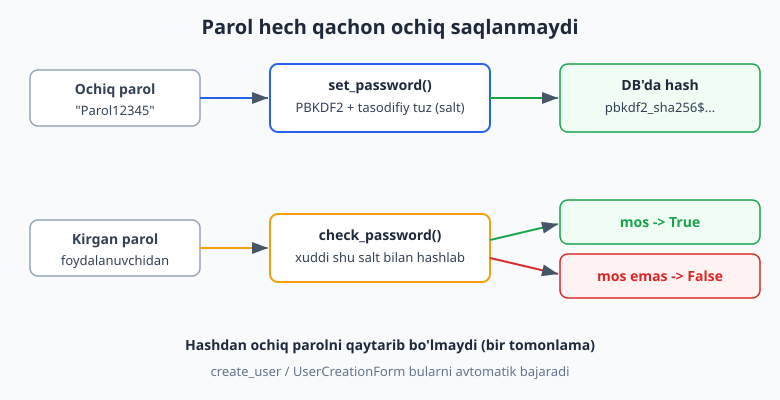
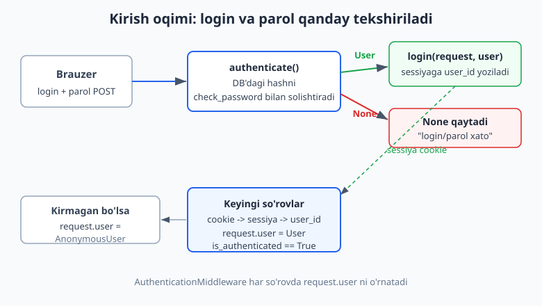
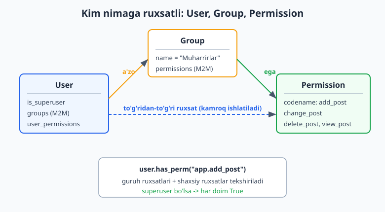

# 13 — Autentifikatsiya va ruxsatlar

[⬅️ Oldingi: 12 — Static, media va to'liq layout](./12-static-media-layout.md) · [🏠 README](./README.md) · [Keyingi: 14 — Sessiyalar, messages va middleware ➡️](./14-sessions-middleware.md)

---

> **Bu bobda:** har bir jiddiy saytda kerak bo'ladigan narsani — "kim bu foydalanuvchi va u nima qila oladi?" degan savolni hal qilamiz. Django'ning tayyor `User` modelini ko'ramiz va parol nega hech qachon ochiq saqlanmasligini, `set_password`/`check_password` qanday ishlashini tushunamiz. So'ng tizimga kirishni qo'lda yozamiz: `authenticate()` -> `login()` -> `logout()`. Sahifani himoyalash uchun `@login_required` dekoratorini, ro'yxatdan o'tish uchun `UserCreationForm` ni qo'llaymiz. Keyin "kim nimaga ruxsatli" tomonini ochamiz: `Permission`, `Group`, `has_perm()`, `@permission_required`, `user_passes_test`. Class-based view'lar uchun `LoginView`, `LogoutView` va `LoginRequiredMixin` ni ko'ramiz. Oxirida loyihaning kelajagi uchun eng muhim qaror — **custom `User` modeli** (`AbstractUser`) ni qanday va nega birinchi `migrate` dan oldin qo'yish kerakligini o'rganamiz. Hamma kod Django 6.0.6 da haqiqatan ishga tushirib tekshirilgan.

---

## Nega o'zimiz yozmaymiz?

Tasavvur qiling, autentifikatsiyani noldan yozmoqchisiz. Sizga kerak bo'ladi: foydalanuvchi jadvali, parolni xavfsiz saqlash (xashlash, tuz/salt), sessiyani boshqarish, "kirgan-kirmagan"ni har so'rovda tekshirish, parolni tiklash, ruxsatlar tizimi... Bularning har birida bitta xato — butun saytni ochib qo'yadigan **xavfsizlik teshigi**.

Django bularning hammasini `django.contrib.auth` ilovasida tayyor beradi. Bu ilova `INSTALLED_APPS` da sukut bo'yicha allaqachon turibdi (2-bobda ko'rgan `startproject` qo'shgan):

```python
# settings.py — yangi loyihada avtomatik turadi
INSTALLED_APPS = [
    "django.contrib.admin",
    "django.contrib.auth",          # <-- autentifikatsiya tizimi
    "django.contrib.contenttypes",
    "django.contrib.sessions",      # <-- login sessiyaga tayanadi
    "django.contrib.messages",
    "django.contrib.staticfiles",
]
```

Bizning vazifamiz — bu tayyor qismlardan to'g'ri foydalanish. Boshlaylik.

> Eslatma: bu bob 8-bobdagi admin panel va 10-bobdagi formalarga tayanadi. Agar Node.js'dan kelgan bo'lsangiz, `django.contrib.auth` — bu Passport.js + bcrypt + sessiya boshqaruvi + role tizimini bitta paketga jamlangan, "batareyalari bilan" varianti ([Node.js auth](../nodejs/README.md) bilan solishtiring).

## User modeli — autentifikatsiyaning markazi

Django'da har bir foydalanuvchi `django.contrib.auth.models.User` obyekti bilan ifodalanadi. Bu — oddiy model (5-bobdagi modellar kabi), shuning uchun siz uni ORM bilan boshqarasiz.

Asosiy maydonlari:

| Maydon | Tavsif |
|---|---|
| `username` | unikal login (majburiy) |
| `password` | xashlangan parol (hech qachon ochiq emas) |
| `email` | email (ixtiyoriy, sukut bo'yicha unikal emas) |
| `first_name`, `last_name` | ism-familiya |
| `is_active` | hisob faolmi (False qilsangiz kira olmaydi) |
| `is_staff` | admin panelga kira oladimi |
| `is_superuser` | hamma ruxsatga ega "xudo" rejimimi |
| `date_joined`, `last_login` | sana belgilari |

**Eng muhim qoida:** foydalanuvchini yaratishda `User(...)` ni to'g'ridan-to'g'ri ishlatmang — chunki u parolni ochiq yozadi. Buning o'rniga **manager metodlari** ni ishlating:

```python
from django.contrib.auth.models import User

# To'g'ri: create_user parolni avtomatik xashlaydi
u = User.objects.create_user(
    username="ali",
    email="ali@example.com",
    password="Parol12345",
)
print(u.is_active)     # True  (avtomatik faol)
print(u.is_staff)      # False (admin emas)
print(u.is_superuser)  # False

# Superuser (admin panel + hamma ruxsat)
admin = User.objects.create_superuser(
    username="admin", email="a@a.uz", password="kuchli-parol",
)
print(admin.is_staff, admin.is_superuser)  # True True
```

```python
# ❌ Bunday QILMANG: parol ochiq matn bo'lib qoladi, kira olmaysiz
bad = User(username="xato", password="Parol12345")  # password = xashlanmagan
bad.save()
# bad.check_password("Parol12345")  ->  False! Chunki ochiq matn hash emas.
```

Yuqoridagi `create_user`/`create_superuser` ni biz haqiqiy Django shell'da ishga tushirib tekshirdik — natijasi aynan kommentariylardagi kabi chiqdi.

## Parol qanday saqlanadi: hashing

Foydalanuvchi paroli **hech qachon** bazada ochiq yozilmaydi. Buning o'rniga Django parolni **bir tomonlama xash** ga aylantiradi. "Bir tomonlama" degani — xashdan asl parolni qaytarib bo'lmaydi.

Django sukut bo'yicha **PBKDF2 + SHA256** algoritmini va har parolga **tasodifiy tuz (salt)** qo'shadi. Natija quyidagicha ko'rinadi:

```
pbkdf2_sha256$1200000$otdXgSxu...$base64xash...
   algoritm    iteratsiya   salt        xash
```

Ikki muhim metod — `set_password()` (yozish) va `check_password()` (tekshirish):

```python
from django.contrib.auth.models import User

u = User.objects.create_user(username="bek", password="Boshlangich1")

# Parol ochiq emas, xash sifatida saqlangan
print(u.password[:30])   # pbkdf2_sha256$1200000$...

# Tekshirish (login paytida shu ishlatiladi)
print(u.check_password("Boshlangich1"))  # True
print(u.check_password("notogri"))       # False

# Parolni o'zgartirish: set_password + save SHART
u.set_password("YangiParol99")
u.save()                                  # set_password o'zi saqlamaydi!
print(u.check_password("YangiParol99"))   # True
```

`set_password()` faqat obyektning `password` maydonini o'zgartiradi, bazaga **yozmaydi** — shuning uchun `u.save()` ni unutmang. Bu juda ko'p uchraydigan xato.



> Nega 1.2 million iteratsiya? Har bir tekshiruvni ataylab sekin qiladi (millisekundlar). Bitta loginda sezilmaydi, lekin xaker o'g'irlangan bazani "brute-force" qilmoqchi bo'lsa, har bir urinish shu qadar sekin bo'ladiki, amalda imkonsiz. Django versiyalari oshgani sayin bu son ham oshib boradi.

## authenticate, login, logout

Endi eng asosiy uchlik. Bular `django.contrib.auth` dan import qilinadi:

- **`authenticate(request, username=..., password=...)`** — login/parolni tekshiradi. To'g'ri bo'lsa `User` obyektini, xato bo'lsa `None` qaytaradi. **Sessiyaga hech narsa yozmaydi** — faqat shaxsni tasdiqlaydi.
- **`login(request, user)`** — tasdiqlangan foydalanuvchini sessiyaga yozadi. Shundan keyin keyingi so'rovlarda Django uni "eslab qoladi".
- **`logout(request)`** — sessiyani tozalaydi, foydalanuvchini chiqaradi.



Mana qo'lda yozilgan kirish/chiqish view'lari (`accounts/views.py`):

```python
from django.contrib.auth import authenticate, login, logout
from django.http import HttpResponse
from django.shortcuts import redirect, render


def kirish(request):
    if request.method == "POST":
        user = authenticate(
            request,
            username=request.POST.get("username"),
            password=request.POST.get("password"),
        )
        if user is not None:
            login(request, user)            # sessiyaga yozildi
            return redirect("profil")
        # tasdiqlanmadi
        return HttpResponse("Login yoki parol xato", status=401)
    # GET: bo'sh forma ko'rsatamiz
    return render(request, "accounts/kirish.html")


def chiqish(request):
    logout(request)
    return redirect("kirish")
```

Eng sodda `kirish.html` shabloni (10-bobdagi `` ni unutmaymiz):

```html
<form method="post">
  
  <input name="username" placeholder="Login">
  <input name="password" type="password" placeholder="Parol">
  <button type="submit">Kirish</button>
</form>
```

Biz buni test client orqali to'liq tekshirdik: to'g'ri parol bilan `/profil/` ga yo'naltirdi, xato parol bilan 401 qaytdi. (`authenticate` `None` qaytarsa hech qanday sessiya ochilmaydi.)

> `authenticate()` ga `request` ni birinchi argument sifatida bermasligingiz ham mumkin, lekin berish tavsiya etiladi — ba'zi backend'lar va signal'lar `request` ga tayanadi.

## request.user — joriy foydalanuvchi

Foydalanuvchi `login()` qilingach, har bir keyingi so'rovda Django uni **`request.user`** orqali beradi. Buni `AuthenticationMiddleware` (settings'dagi MIDDLEWARE da turadi) bajaradi: sessiyadan `user_id` ni o'qib, mos `User` obyektini yuklaydi.

- Foydalanuvchi kirgan bo'lsa: `request.user` — `User` obyekti, `request.user.is_authenticated` -> `True`.
- Kirmagan bo'lsa: `request.user` — maxsus `AnonymousUser`, `request.user.is_authenticated` -> `False`.

E'tibor bering: `is_authenticated` — bu **atribut**, funksiya emas (qavs qo'ymang):

```python
from django.http import HttpResponse

def bosh_sahifa(request):
    if request.user.is_authenticated:
        return HttpResponse(f"Salom, {request.user.username}!")
    return HttpResponse("Siz kirmagansiz. Iltimos, tizimga kiring.")
```

Shablonda esa `user` o'zgaruvchisi avtomatik mavjud (`auth` context processor tufayli, 4-bobda ko'rgan kontekst):

```html

  <p>Salom, {{ user.username }}!</p>
  <a href="">Chiqish</a>

  <a href="">Kirish</a>

```

> `request.user.is_authenticated` ni `()` bilan chaqirsangiz — Django'ning eski versiyalarida bu funksiya edi, endi `property`. `if request.user.is_authenticated()` deb yozsangiz `TypeError` olasiz, chunki `True` ni chaqirib bo'lmaydi.

## @login_required — sahifani himoyalash

Ko'p sahifalar faqat kirgan foydalanuvchilar uchun. Har viewda `if not request.user.is_authenticated: return redirect(...)` yozish zerikarli. Buning o'rniga **`@login_required`** dekoratorini ishlating:

```python
from django.contrib.auth.decorators import login_required
from django.http import HttpResponse


@login_required
def profil(request):
    # Bu yergacha faqat kirgan foydalanuvchi yetadi
    return HttpResponse(f"Salom, {request.user.username}! Bu sizning profilingiz.")
```

Kirmagan foydalanuvchi `/profil/` ga kirsa, Django uni **login sahifasiga yo'naltiradi** (302 redirect). Login sahifasi qayerda ekanini `settings.py` dagi `LOGIN_URL` belgilaydi:

```python
# settings.py
LOGIN_URL = "kirish"            # path() dagi name='kirish' ga ishora
LOGIN_REDIRECT_URL = "profil"   # muvaffaqiyatli kirishdan keyin qayoqqa
LOGOUT_REDIRECT_URL = "kirish"
```

Redirect URL'iga `?next=/profil/` qo'shiladi, shunda kirgandan keyin foydalanuvchi o'zi xohlagan sahifaga qaytadi. Biz test client bilan tekshirdik: kirmagan holatda `/profil/` so'rovi 302 bilan `/kirish/` ga yo'naltirildi; kirgandan keyin 200 va "Salom, ali" chiqdi.

```python
# accounts/urls.py — bog'lash
from django.urls import path
from accounts import views

urlpatterns = [
    path("kirish/", views.kirish, name="kirish"),
    path("chiqish/", views.chiqish, name="chiqish"),
    path("profil/", views.profil, name="profil"),
]
```

## user_passes_test — ixtiyoriy shart

Ba'zan "kirgan" yetmaydi — masalan, faqat `is_staff` foydalanuvchilarni kiritmoqchisiz. **`@user_passes_test`** ixtiyoriy funksiya (`True`/`False` qaytaruvchi) qabul qiladi:

```python
from django.contrib.auth.decorators import user_passes_test
from django.http import HttpResponse


@user_passes_test(lambda u: u.is_staff)
def faqat_staff(request):
    return HttpResponse("Staff sahifasi")
```

Agar `lambda` `False` qaytarsa (yoki foydalanuvchi anonim bo'lsa), `LOGIN_URL` ga yo'naltiriladi. Buni ham test client bilan tekshirdik: oddiy foydalanuvchi 302 (redirect) oldi, `is_staff=True` foydalanuvchi 200 oldi.

## Ro'yxatdan o'tish: UserCreationForm

Yangi foydalanuvchini noldan yozish o'rniga Django'ning tayyor **`UserCreationForm`** ini ishlating. U: login takrorlanmasligini, ikki parol mosligini, parol kuchliligini (uzunlik, "umumiy" emasligi, faqat raqam emasligini) tekshiradi va `form.save()` da parolni avtomatik **xashlaydi**.

```python
from django.contrib.auth import login
from django.contrib.auth.forms import UserCreationForm
from django.shortcuts import redirect, render


def royxatdan_otish(request):
    if request.method == "POST":
        form = UserCreationForm(request.POST)
        if form.is_valid():
            user = form.save()          # parol xashlanib bazaga yoziladi
            login(request, user)        # darhol tizimga kiritamiz
            return redirect("profil")
    else:
        form = UserCreationForm()
    return render(request, "accounts/royxat.html", {"form": form})
```

Shablon — 10-bobdagi formalar bilan bir xil (`form.as_p`):

```html
<form method="post">
  
  {{ form.as_p }}
  <button type="submit">Ro'yxatdan o'tish</button>
</form>
```

Validatsiyani Django shell'da tekshirdik:

```python
from django.contrib.auth.forms import UserCreationForm

# Zaif parol -> rad etiladi
f = UserCreationForm(data={"username": "test", "password1": "123", "password2": "123"})
f.is_valid()        # False
f.errors            # {'password2': ['This password is too short...',
                    #                'This password is too common.',
                    #                'This password is entirely numeric.']}

# Kuchli, mos parol -> qabul
f2 = UserCreationForm(data={
    "username": "test2", "password1": "QiyinParol2026", "password2": "QiyinParol2026",
})
f2.is_valid()       # True
```

Test client bilan to'liq oqimni ham tekshirdik: kuchli parol bilan POST -> foydalanuvchi bazada paydo bo'ldi va `/profil/` ga avtomatik kirdi; ikki parol mos kelmasa -> forma "The two password fields didn't match" xatosini ko'rsatdi va foydalanuvchi **yaratilmadi**.

> Parol kuchliligi qoidalarini `settings.py` dagi `AUTH_PASSWORD_VALIDATORS` boshqaradi. Loyiha talabiga ko'ra (masalan, minimal uzunlikni o'zgartirish) shu yerni sozlaysiz. O'zbekcha xato xabarlari kerak bo'lsa, ularni 16-bobdagi tarjima (i18n) mavzusida ko'ramiz.

## Permissions: kim nimaga ruxsatli

"Kirgan" — bu autentifikatsiya (kimligini tasdiqlash). "Nima qila oladi" — bu **avtorizatsiya** (ruxsat). Django har bir modelga avtomatik 4 ta ruxsat yaratadi: `add_<model>`, `change_<model>`, `delete_<model>`, `view_<model>`.

Ruxsat nomi `app_label.codename` ko'rinishida bo'ladi, masalan `blog.add_post`. Tekshirish — `user.has_perm(...)`:

```python
from django.contrib.auth.models import User, Permission

u = User.objects.create_user(username="bek", password="x")

# Hozircha hech qanday ruxsat yo'q
u.has_perm("auth.add_user")     # False

# Ruxsat berish
p = Permission.objects.get(codename="add_user")
u.user_permissions.add(p)

# MUHIM: ruxsat keshlangani uchun obyektni qaytadan o'qiymiz
u = User.objects.get(username="bek")
u.has_perm("auth.add_user")     # True
u.has_perm("auth.delete_user")  # False
```

> Nega qaytadan o'qidik? `has_perm` natijasi bitta `User` obyektida bir marta keshlanadi (har safar bazaga bormaslik uchun). Shu so'rov ichida ruxsat o'zgartirsangiz, kesh eski bo'lib qoladi — yangi obyekt oling yoki keshni tozalang. Bu nuans ko'pchilikni chalg'itadi.

**Superuser** alohida: `is_superuser=True` bo'lsa, `has_perm` har doim `True` qaytaradi — hatto mavjud bo'lmagan ruxsat uchun ham:

```python
su = User.objects.create_superuser(username="root", email="r@r.uz", password="x")
su.has_perm("auth.delete_user")   # True
su.has_perm("xohlagan.narsa")     # True ham! (superuser hamma narsaga ruxsatli)
```

## Groups: ruxsatlarni guruhlash

Har foydalanuvchiga ruxsatni alohida berish noqulay. **`Group`** — ruxsatlar to'plamiga nom beradi (masalan "Muharrirlar"), keyin foydalanuvchini guruhga qo'shasiz. Foydalanuvchi guruh ruxsatlarini avtomatik meros oladi.

```python
from django.contrib.auth.models import User, Group, Permission

# 1. Guruh yaratamiz va unga ruxsat beramiz
muharrirlar = Group.objects.create(name="Muharrirlar")
muharrirlar.permissions.add(Permission.objects.get(codename="change_user"))

# 2. Foydalanuvchini guruhga qo'shamiz
vali = User.objects.create_user(username="vali", password="x")
vali.groups.add(muharrirlar)

# 3. Endi vali guruh orqali ruxsatga ega
vali = User.objects.get(username="vali")     # keshni yangilash uchun qayta o'qiymiz
vali.has_perm("auth.change_user")            # True (guruh orqali)
vali.get_all_permissions()                   # {'auth.change_user'}
```



Guruhlarni admin paneldan (8-bob) qulay boshqarish mumkin — kod yozmasdan, sichqoncha bilan ruxsat qo'shasiz. Bularning hammasini Django shell'da ishga tushirib tekshirdik: `add_user`, `change_user`, `delete_user`, `view_user` ruxsatlari mavjud, guruh orqali `change_user` ishladi.

## @permission_required — ruxsatni view'da tekshirish

`@login_required` ga o'xshab, view kirgan-kirmaganini emas, **ruxsatni** tekshiruvchi dekorator ham bor:

```python
from django.contrib.auth.decorators import permission_required
from django.http import HttpResponse


@permission_required("auth.add_user", raise_exception=True)
def admin_panel(request):
    return HttpResponse("Faqat ruxsatli foydalanuvchi ko'radi.")
```

- `raise_exception=True` — ruxsat yo'q bo'lsa **403 Forbidden** qaytaradi (foydalanuvchi kirgan, lekin ruxsati yo'q — bu mantiqan to'g'ri).
- `raise_exception=False` (sukut) — `LOGIN_URL` ga yo'naltiradi (ko'pincha bu noto'g'ri, chunki kirgan odamni yana login'ga jo'natish mantiqsiz).

Test client bilan tekshirdik: ruxsatsiz foydalanuvchi 403 oldi; `add_user` ruxsatini bergach 200 oldi.

> Bir nechta ruxsat kerak bo'lsa, ro'yxat bering: `@permission_required(["blog.add_post", "blog.change_post"])` — hammasi bo'lishi shart (AND mantiq).

## LoginView, LogoutView va LoginRequiredMixin

Yuqorida biz kirish/chiqishni qo'lda yozdik — tushunish uchun foydali. Amalda esa Django tayyor **class-based view**'lar beradi (11-bobdagi CBV'lar): `LoginView` va `LogoutView`. Ular formani, xato xabarlarini, `?next=` ni o'zlari boshqaradi — siz faqat shablon nomini berasiz:

```python
# mysite/urls.py
from django.contrib.auth import views as auth_views
from django.urls import path

urlpatterns = [
    path("kirish/", auth_views.LoginView.as_view(
        template_name="accounts/kirish.html"), name="kirish"),
    path("chiqish/", auth_views.LogoutView.as_view(), name="chiqish"),
]
```

`LoginView` shabloni `form` o'zgaruvchisini beradi (ichida `username` va `password` maydonlari bor):

```html
<form method="post">
  
  {{ form.as_p }}
  <button type="submit">Kirish</button>
</form>
```

Diqqat: Django 6.0 da `LogoutView` faqat **POST** so'rovini qabul qiladi (xavfsizlik uchun — havola bosish bilan tasodifan chiqib ketmaslik). Shuning uchun chiqish tugmasi forma bo'lishi kerak:

```html
<form method="post" action="">
  
  <button type="submit">Chiqish</button>
</form>
```

CBV'lar uchun `@login_required` o'rniga **`LoginRequiredMixin`** ni meros oling (mixin har doim ro'yxatda **birinchi** turadi):

```python
from django.contrib.auth.mixins import LoginRequiredMixin
from django.views.generic import TemplateView


class MaxfiyView(LoginRequiredMixin, TemplateView):
    template_name = "accounts/maxfiy.html"
    # login_url = "kirish"  # kerak bo'lsa override qilish mumkin
```

Ruxsat uchun esa `PermissionRequiredMixin` bor (`permission_required = "blog.add_post"` atributi bilan). `LoginView` ni va `LoginRequiredMixin` ni test client bilan tekshirdik: kirmagan holat 302 berdi, kirgan holat 200 va sahifa mazmunini ko'rsatdi.

## Custom User modeli (AbstractUser)

Eng muhim qaror oxirida. Standart `User` da masalan `username` majburiy, email unikal emas, qo'shimcha maydon (`tug'ilgan sana`, `bio`, `telefon`) yo'q. Ko'p loyihada bu kifoya qilmaydi.

**Django'ning rasmiy maslahati:** har bir yangi loyihada, hatto hozir kerak bo'lmasa ham, o'z `User` modelingizni belgilang. Sababi — keyinchalik standart `User` dan custom'ga o'tish juda og'riqli (migratsiyalar chigallashadi). Ikki yo'l bor:

- **`AbstractUser`** dan meros — barcha standart maydonlarni saqlab, ustiga yangi maydon qo'shasiz. **Eng tavsiya etilgani**, oson.
- `AbstractBaseUser` dan meros — hamma narsani noldan quryasiz (masalan, `username` o'rniga `email` bilan kirish). Murakkabroq, alohida mavzu.

`AbstractUser` varianti:

```python
# users/models.py
from django.contrib.auth.models import AbstractUser
from django.db import models


class User(AbstractUser):
    # standart maydonlar (username, password, email, is_staff...) saqlanadi
    tugilgan_sana = models.DateField(null=True, blank=True)
    bio = models.TextField(blank=True)

    def __str__(self):
        return self.username
```

So'ng `settings.py` da Django'ga "endi shu modelni ishlat" deb aytasiz:

```python
# settings.py
AUTH_USER_MODEL = "users.User"   # "app_nomi.ModelNomi"
```

> **QATTIQ QOIDA:** `AUTH_USER_MODEL` ni loyihaning **eng boshida**, birinchi `migrate` dan **oldin** qo'ying. Baza yaratilgandan keyin o'zgartirish — qiyin migratsiyalar va ko'pincha bazani noldan qurishni talab qiladi. Yangi loyiha ochsangiz, birinchi ish — `startapp users` qilib, custom User'ni shu yerda belgilash.

Endi `User` ni to'g'ridan-to'g'ri import qilish o'rniga **`get_user_model()`** dan foydalaning — bu kodingizni `AUTH_USER_MODEL` o'zgarishidan himoyalaydi:

```python
from django.contrib.auth import get_user_model

User = get_user_model()                 # aktiv User modelini qaytaradi

u = User.objects.create_user(
    username="dilshod", password="Parol12345", bio="Backend dasturchi",
)
u.bio                 # 'Backend dasturchi' (yangi maydon)
u.is_active           # True (AbstractUser maydonlari ham bor)
u.check_password("Parol12345")  # True (parol xashlash ham ishlaydi)
```

Modellaringizda `ForeignKey` orqali userga bog'lanmoqchi bo'lsangiz ham, `User` ni qattiq import qilmang — `settings.AUTH_USER_MODEL` string'ini ishlating:

```python
from django.conf import settings
from django.db import models


class Maqola(models.Model):
    muallif = models.ForeignKey(settings.AUTH_USER_MODEL, on_delete=models.CASCADE)
    sarlavha = models.CharField(max_length=200)
```

Bularning hammasini alohida toza loyihada (custom User uchun yangi baza bilan) ishga tushirib tekshirdik: `makemigrations`, `migrate`, `check` toza o'tdi, `get_user_model()` `users.User` ni qaytardi, yangi `bio` maydoni va parol xashlash ishladi.

> Custom User uchun admin panelda (8-bob) ko'rsatish uchun `admin.site.register(User)` yoki `UserAdmin` ni meros qilib sozlaysiz. Custom maydonlarni admin formasiga qo'shish — admin bobiga tegishli, lekin asosiy `register` bir qatorda ishlaydi.

## Xulosa

Bu bobda Django'ning autentifikatsiya tizimini to'liq aylanib chiqdik:

- **`User`** — markaziy model; `create_user`/`create_superuser` parolni avtomatik xashlaydi (to'g'ridan-to'g'ri `User(...)` ishlatmang).
- **Parol** hech qachon ochiq saqlanmaydi: `set_password` (yozish, keyin `save()`), `check_password` (tekshirish), PBKDF2 + salt.
- **`authenticate`** -> shaxsni tasdiqlaydi (User yoki None), **`login`** -> sessiyaga yozadi, **`logout`** -> chiqaradi.
- **`request.user`** — joriy foydalanuvchi (`is_authenticated` — atribut, qavssiz); kirmaganda `AnonymousUser`.
- **`@login_required`** sahifani himoyalaydi; **`@user_passes_test`** ixtiyoriy shart bilan; **`@permission_required`** ruxsat bilan (`raise_exception=True` -> 403).
- **`UserCreationForm`** ro'yxatdan o'tishni va parol validatsiyasini hal qiladi.
- **`Permission`** + **`Group`** + **`has_perm`** — avtorizatsiya; superuser har doim `True`.
- CBV uchun **`LoginView`/`LogoutView`** (Django 6.0 da logout faqat POST) va **`LoginRequiredMixin`**.
- **Custom `User`** (`AbstractUser`) ni loyiha boshida `AUTH_USER_MODEL` bilan belgilang; kodda **`get_user_model()`** va FK'da **`settings.AUTH_USER_MODEL`** ishlating.

Keyingi bobda sessiyalar (login aynan shularga tayanadi), `messages` (foydalanuvchiga bir martalik xabarlar) va o'z middleware'ingizni yozishni ko'ramiz.

## Mashqlar

### Oson

1. `User.objects.create_user("ali", password="Parol12345")` bilan foydalanuvchi yarating va `check_password("Parol12345")` hamda `check_password("xato")` natijalarini ko'rsating.
2. Nega `User(username="x", password="parol").save()` qilingan foydalanuvchi tizimga **kira olmaydi**? Tushuntiring va to'g'ri usulni yozing.
3. `create_superuser` bilan yaratilgan foydalanuvchining `is_staff` va `is_superuser` qiymatlari qanday? Tekshiring.
4. `request.user.is_authenticated` ni shablonda qanday ishlatamiz? Kirgan va kirmagan holat uchun ikki xil matn chiqaradigan shablon parchasi yozing.
5. `set_password` dan keyin nima qilishni unutmaslik kerak? Bir qatorli javob va kod.
6. `LOGIN_URL`, `LOGIN_REDIRECT_URL`, `LOGOUT_REDIRECT_URL` settings nimaga kerak? Har biriga bittadan jumla.

### O'rta

7. `kirish` view'ini qo'lda yozing: `authenticate` -> `login`, xato bo'lsa 401 qaytaring. To'liq view kodini bering.
8. `@login_required` bilan himoyalangan `profil` view yozing va `settings.py` da `LOGIN_URL` ni to'g'ri ulang.
9. `UserCreationForm` bilan ro'yxatdan o'tish view'ini yozing; muvaffaqiyatdan keyin foydalanuvchini darhol `login` qiling.
10. "Muharrirlar" nomli `Group` yarating, unga `auth.change_user` ruxsatini bering, bir foydalanuvchini guruhga qo'shing va `has_perm` bilan tekshiring.
11. `@user_passes_test` bilan faqat `is_staff` foydalanuvchi kiradigan view yozing.
12. CBV `LoginView` ni `urls.py` da ulang (o'z shablon nomingiz bilan) va `LogoutView` ni POST forma orqali ishlating.

### Qiyin

13. `AbstractUser` dan meros qilib custom `User` model yozing (`bio` va `tugilgan_sana` maydonlari bilan), `AUTH_USER_MODEL` ni sozlang va `get_user_model()` orqali foydalanuvchi yarating. Nega `User` ni to'g'ridan-to'g'ri import qilmaslik kerakligini tushuntiring.
14. `@permission_required("auth.add_user", raise_exception=True)` bilan himoyalangan view yozing va `TestCase`/`Client` bilan ikki holatni tekshiring: (a) ruxsatsiz -> 403, (b) ruxsat bilan -> 200.
15. To'liq login oqimini `TestCase` bilan tekshiring: kirmagan holat `/profil/` ga 302 (redirect) berishini, to'g'ri parol bilan kirgach 200 va `username` ko'rinishini tasdiqlang.

<details markdown="1"><summary>Yechimlar</summary>

**1.**
```python
from django.contrib.auth.models import User

u = User.objects.create_user("ali", password="Parol12345")
print(u.check_password("Parol12345"))   # True
print(u.check_password("xato"))         # False
```

**2.** `User(...)` konstruktor `password` maydoniga berilgan string'ni **ochiq matn** sifatida yozadi — uni xashlamaydi. `check_password` esa kelgan parolni xashlab, bazadagi xash bilan solishtiradi; ochiq matn hech qachon xash formatiga mos kelmaydi, shuning uchun har doim `False`. To'g'ri usul:
```python
# ❌ noto'g'ri
u = User(username="x", password="parol")
u.save()                      # parol ochiq matn -> kira olmaydi

# To'g'ri
u = User.objects.create_user(username="x", password="parol")   # avtomatik xashlaydi
# yoki:
u = User(username="x")
u.set_password("parol")
u.save()
```

**3.**
```python
from django.contrib.auth.models import User

su = User.objects.create_superuser("admin", email="a@a.uz", password="x")
print(su.is_staff)       # True  (admin panelga kira oladi)
print(su.is_superuser)   # True  (hamma ruxsatga ega)
```

**4.**
```html

  <p>Salom, {{ user.username }}! <a href="">Chiqish</a></p>

  <p>Siz kirmagansiz. <a href="">Kirish</a></p>

```

**5.** `save()` ni unutmaslik kerak — `set_password` faqat obyekt atributini o'zgartiradi, bazaga yozmaydi.
```python
u.set_password("YangiParol99")
u.save()                          # SHU SHART
```

**6.**
- `LOGIN_URL` — `@login_required`/`LoginRequiredMixin` kirmagan foydalanuvchini qaysi sahifaga yo'naltirishini belgilaydi (login sahifasi).
- `LOGIN_REDIRECT_URL` — muvaffaqiyatli kirishdan keyin foydalanuvchi qaysi sahifaga o'tishini belgilaydi (agar `?next=` bo'lmasa).
- `LOGOUT_REDIRECT_URL` — chiqishdan keyin qaysi sahifaga o'tishini belgilaydi.

**7.**
```python
from django.contrib.auth import authenticate, login
from django.http import HttpResponse
from django.shortcuts import redirect, render


def kirish(request):
    if request.method == "POST":
        user = authenticate(
            request,
            username=request.POST.get("username"),
            password=request.POST.get("password"),
        )
        if user is not None:
            login(request, user)
            return redirect("profil")
        return HttpResponse("Login yoki parol xato", status=401)
    return render(request, "accounts/kirish.html")
```

**8.**
```python
# views.py
from django.contrib.auth.decorators import login_required
from django.http import HttpResponse


@login_required
def profil(request):
    return HttpResponse(f"Salom, {request.user.username}!")
```
```python
# settings.py
LOGIN_URL = "kirish"
```

**9.**
```python
from django.contrib.auth import login
from django.contrib.auth.forms import UserCreationForm
from django.shortcuts import redirect, render


def royxatdan_otish(request):
    if request.method == "POST":
        form = UserCreationForm(request.POST)
        if form.is_valid():
            user = form.save()        # parol xashlanadi
            login(request, user)      # darhol kiritamiz
            return redirect("profil")
    else:
        form = UserCreationForm()
    return render(request, "accounts/royxat.html", {"form": form})
```

**10.**
```python
from django.contrib.auth.models import User, Group, Permission

muharrirlar = Group.objects.create(name="Muharrirlar")
muharrirlar.permissions.add(Permission.objects.get(codename="change_user"))

vali = User.objects.create_user("vali", password="x")
vali.groups.add(muharrirlar)

vali = User.objects.get(username="vali")        # kesh yangilash uchun qayta o'qiymiz
print(vali.has_perm("auth.change_user"))        # True
print(vali.get_all_permissions())               # {'auth.change_user'}
```

**11.**
```python
from django.contrib.auth.decorators import user_passes_test
from django.http import HttpResponse


@user_passes_test(lambda u: u.is_staff)
def faqat_staff(request):
    return HttpResponse("Staff sahifasi")
# is_staff bo'lmagan (yoki anonim) -> LOGIN_URL ga 302 redirect
```

**12.**
```python
# urls.py
from django.contrib.auth import views as auth_views
from django.urls import path

urlpatterns = [
    path("kirish/", auth_views.LoginView.as_view(
        template_name="accounts/kirish.html"), name="kirish"),
    path("chiqish/", auth_views.LogoutView.as_view(), name="chiqish"),
]
```
```html
<!-- kirish.html -->
<form method="post">{{ form.as_p }}<button>Kirish</button></form>

<!-- chiqish: Django 6.0 da logout faqat POST -->
<form method="post" action="">
  <button>Chiqish</button>
</form>
```

**13.**
```python
# users/models.py
from django.contrib.auth.models import AbstractUser
from django.db import models


class User(AbstractUser):
    tugilgan_sana = models.DateField(null=True, blank=True)
    bio = models.TextField(blank=True)

    def __str__(self):
        return self.username
```
```python
# settings.py  (birinchi migrate dan OLDIN)
AUTH_USER_MODEL = "users.User"
```
```python
# foydalanish
from django.contrib.auth import get_user_model

User = get_user_model()
u = User.objects.create_user("dilshod", password="Parol12345", bio="Backend")
print(u.bio)                          # 'Backend'
print(u.check_password("Parol12345")) # True
```
Nega to'g'ridan-to'g'ri import qilmaymiz: `from django.contrib.auth.models import User` standart `User` ni oladi, custom modelni emas. `AUTH_USER_MODEL` o'zgarsa kodingiz buziladi. `get_user_model()` esa har doim **aktiv** User modelini qaytaradi, FK'da esa `settings.AUTH_USER_MODEL` string'ini ishlatasiz.

**14.**
```python
# tests.py
from django.test import TestCase, Client
from django.contrib.auth.models import User, Permission


class PermTest(TestCase):
    def test_permission_required(self):
        c = Client()
        u = User.objects.create_user(username="bek", password="x")
        c.login(username="bek", password="x")
        # (a) ruxsatsiz -> 403
        self.assertEqual(c.get("/admin-panel/").status_code, 403)
        # (b) ruxsat bilan -> 200
        u.user_permissions.add(Permission.objects.get(codename="add_user"))
        self.assertEqual(c.get("/admin-panel/").status_code, 200)
# python manage.py test  ->  PASS
```

**15.**
```python
# tests.py
from django.test import TestCase, Client
from django.contrib.auth.models import User


class LoginFlowTest(TestCase):
    def test_login_required_redirect(self):
        c = Client()
        r = c.get("/profil/")
        self.assertEqual(r.status_code, 302)         # kirmagan -> redirect
        self.assertIn("/kirish/", r.url)

    def test_login_then_profil(self):
        User.objects.create_user(username="ali", password="Parol12345")
        c = Client()
        r = c.post("/kirish/", {"username": "ali", "password": "Parol12345"})
        self.assertRedirects(r, "/profil/")
        r2 = c.get("/profil/")
        self.assertEqual(r2.status_code, 200)
        self.assertContains(r2, "ali")               # username ko'rinadi
# python manage.py test  ->  2 test PASS
```

</details>

---

[⬅️ Oldingi: 12 — Static, media va to'liq layout](./12-static-media-layout.md) · [🏠 README](./README.md) · [Keyingi: 14 — Sessiyalar, messages va middleware ➡️](./14-sessions-middleware.md)
