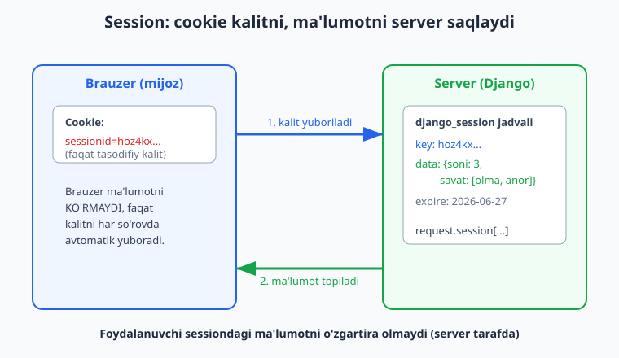
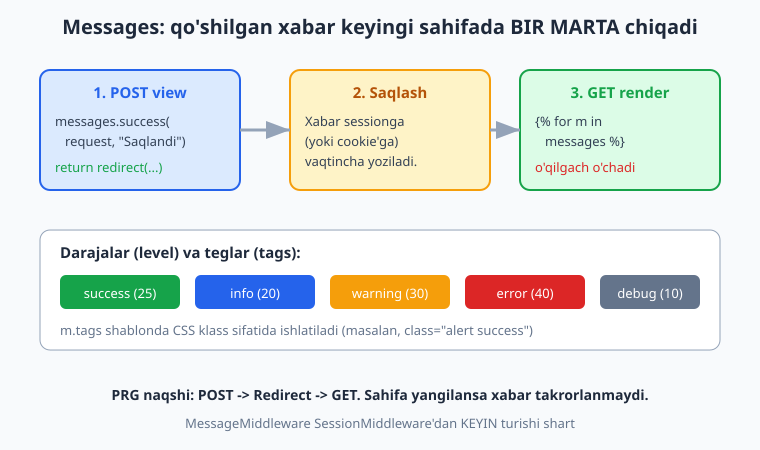
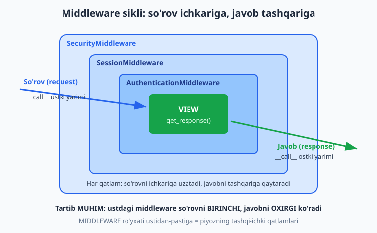

# 14 — Sessiyalar, messages va middleware

[⬅️ Oldingi: 13 — Autentifikatsiya va ruxsatlar](./13-auth-tizimi.md) · [🏠 README](./README.md) · [Keyingi: 15 — DRF kirish va serializers ➡️](./15-drf-serializers.md)

---

> **Bu bobda:** HTTP eslab qolmaydigan (stateless) protokol bo'lsa-da, ilovamiz foydalanuvchini "tanishi" kerak: savatdagi mahsulotlar, tanlangan til, "kirgansiz" holati. Buni Django ikki bosqichda hal qiladi — **cookie** (brauzerda saqlanadigan kichik ma'lumot) va uning ustiga qurilgan **session framework** (`request.session`). Avval session nima, qanday ishlaydi, ma'lumot qayerda turadi va `request.session` bilan qanday o'qib-yozishni ko'ramiz. Keyin **messages framework** ni o'rganamiz: bir so'rovda xabar qo'shib (`messages.success`, `messages.error` va h.k.), keyingi sahifada bir marta ko'rsatish — bu PRG (POST-Redirect-GET) naqshining yuragi. So'ng kitobning eng muhim tushunchalaridan biriga — **middleware** ga o'tamiz: u nima, so'rov-javob sikli qanday qatlamlardan o'tadi, `get_response` naqshi, Django'ning o'rnatilgan middleware'lari va ularning **tartibi** nega muhim, va nihoyat o'zimizning **custom middleware** mizni (ham klass, ham funksiya ko'rinishida) yozamiz. Oxirida cookie'larni qo'lda boshqarish va **imzolangan** (signed) cookie bilan ishlashni ko'rib chiqamiz. Hamma kod Django 6.0.6, Python 3.14 da haqiqatan ishga tushirib tekshirilgan.

---

## Muammo: HTTP hech narsani eslamaydi

Brauzeringiz saytga ikkita alohida so'rov yuborsa, server uchun bu **butunlay begona** ikki odam. HTTP **stateless** — har so'rov mustaqil, oldingisi haqida hech narsa bilmaydi. Lekin haqiqiy ilovada bizga teskari narsa kerak:

- foydalanuvchi tizimga kirgan bo'lsa, keyingi sahifalarda ham kirgan bo'lib qolsin;
- savatga qo'shgan mahsulot boshqa sahifaga o'tganda yo'qolmasin;
- "Maqola saqlandi" degan xabar redirect'dan keyin ham ko'rinsin.

Yagona ko'prik — **cookie**. Server javob bilan birga brauzerga kichik matn yuboradi, brauzer uni saqlaydi va **keyingi har so'rovda avtomatik qaytaradi**. Shu tariqa server ikki so'rovni bog'lay oladi.

Lekin cookie'ga to'g'ridan-to'g'ri muhim ma'lumot (masalan, `kirgansiz=ha` yoki `balans=1000000`) yozish **xavfli** — foydalanuvchi uni o'zgartira oladi. Django bu muammoni **session** bilan hal qiladi: cookie'da faqat tasodifiy, taxmin qilib bo'lmaydigan **kalit** (`sessionid`) turadi, haqiqiy ma'lumot esa **serverda** saqlanadi.



---

## Session framework: `request.session`

Yangi loyihada session allaqachon yoqilgan. `startproject` qilganda `settings.py` da quyidagilar bor:

```python
# settings.py (Django 6.0 default — qo'shimcha sozlash shart emas)
INSTALLED_APPS = [
    # ...
    "django.contrib.sessions",   # session ilovasi
    # ...
]

MIDDLEWARE = [
    "django.middleware.security.SecurityMiddleware",
    "django.contrib.sessions.middleware.SessionMiddleware",   # session middleware'i
    # ...
]
```

`SessionMiddleware` har so'rovda brauzerdan `sessionid` cookie'sini o'qiydi, mos ma'lumotni bazadan topib `request.session` ga joylaydi. View tugagach, agar session o'zgargan bo'lsa, uni bazaga saqlab, cookie'ni javobga qo'shadi. Demak siz faqat `request.session` bilan ishlaysiz — qolgani avtomatik.

`request.session` lug'atga (dict) o'xshaydi:

```python
# core/views.py
from django.http import HttpResponse


def hisoblagich(request):
    # session ichidan o'qish; bo'lmasa 0
    soni = request.session.get("soni", 0)
    soni += 1
    request.session["soni"] = soni
    return HttpResponse(f"Siz bu sahifani {soni} marta ochdingiz.")
```

Bu view har refresh'da hisobni oshiradi va eslab qoladi — chunki `soni` serverdagi sessionda turadi. Buni test bilan tasdiqlaymiz (`Client` cookie'larni xuddi brauzer kabi saqlaydi):

```python
# core/tests.py
from django.test import TestCase, Client


class SessionTest(TestCase):
    def test_hisoblagich_oshadi(self):
        c = Client()
        self.assertContains(c.get("/hisob/"), "1 marta")
        self.assertContains(c.get("/hisob/"), "2 marta")
        self.assertContains(c.get("/hisob/"), "3 marta")

    def test_yangi_klient_alohida_session(self):
        Client().get("/hisob/")          # birinchi mehmon
        r = Client().get("/hisob/")      # boshqa mehmon -> alohida session
        self.assertContains(r, "1 marta")
```

```bash
python manage.py test core.tests.SessionTest
# Ran 2 tests ... OK
```

Ikkinchi test muhim: **har brauzer (har `sessionid`) alohida session** oladi. Bir foydalanuvchining hisobi ikkinchisiga ta'sir qilmaydi.

### Session'da nimani saqlash mumkin

Session ma'lumoti **JSON** ga seriyalashtiriladi (Django 6.0 default backend — `JSONSerializer`). Demak qiymatlar JSON'ga aylanadigan turlar bo'lishi kerak: `str`, `int`, `float`, `bool`, `list`, `dict`, `None`. Murakkab Python obyektini (masalan, model namunasini) to'g'ridan-to'g'ri solib bo'lmaydi — odatda uning `id` sini saqlaymiz.

```python
# core/views.py
from django.http import JsonResponse


def savat_qoshish(request, mahsulot):
    savat = request.session.get("savat", [])
    savat.append(mahsulot)
    request.session["savat"] = savat   # o'zgartirishni belgilash uchun qayta tayinlash
    return JsonResponse({"savat": savat})
```

```python
# core/tests.py
class SavatTest(TestCase):
    def test_savat_royxat(self):
        c = Client()
        c.get("/savat/olma/")
        r = c.get("/savat/anor/")
        self.assertEqual(r.json()["savat"], ["olma", "anor"])
```

### Diqqat: o'zgaruvchan obyekt nayrangi

Yuqoridagi kodda `request.session["savat"] = savat` qatorini ataylab qoldirdik. Sababi — Django sessionni faqat **kalit tayinlanganda** "o'zgargan" deb biladi. Agar siz ro'yxat yoki lug'atni **joyida** o'zgartirsangiz (masalan, `.append()`), Django buni **sezmaydi** va saqlamaydi:

```python
# ❌ Django bu o'zgarishni sezmaydi — savatga saqlanmaydi
request.session["savat"].append("anor")

# ✅ To'g'ri: yo qayta tayinlang...
savat = request.session["savat"]
savat.append("anor")
request.session["savat"] = savat

# ✅ ...yoki Django'ga qo'lda ayting
request.session.modified = True
```

Buni shellda isbotlaymiz:

```python
>>> from django.contrib.sessions.backends.db import SessionStore
>>> s = SessionStore()
>>> s["savat"] = ["olma"]
>>> s.modified            # True — qiymat tayinlandi
True
>>> s.save(); s.modified = False
>>> s["savat"].append("anor")   # joyida o'zgartirish
>>> s.modified            # False! Django sezmaydi
False
>>> s["savat"] = s["savat"]     # qayta tayinlash nayrangi
>>> s.modified            # True — endi saqlanadi
True
```

### Session metodlari

`request.session` oddiy dict emas — qo'shimcha foydali metodlari bor:

```python
request.session.get("til", "uz")        # bo'lmasa default
request.session.setdefault("til", "uz") # yo'q bo'lsa o'rnat
del request.session["soni"]             # bitta kalitni o'chir
request.session.pop("savat", None)      # o'qib, o'chir
"soni" in request.session               # bormi?
request.session.keys()                  # kalitlar

request.session.set_expiry(0)           # brauzer yopilganda o'chsin
request.session.set_expiry(60 * 60)     # 1 soatdan keyin
request.session.get_expiry_age()        # necha soniya qoldi

request.session.flush()                 # ma'lumot + cookie'ni butunlay o'chir (logout)
request.session.cycle_key()             # ma'lumotni saqlab, kalitni yangila (login'da)
```

`set_expiry` ni amalda ko'ramiz:

```python
# core/views.py
def til_tanla(request, til):
    request.session["til"] = til
    request.session.set_expiry(60 * 60 * 24 * 30)  # 30 kun
    return HttpResponse(f"Til o'rnatildi: {til}")
```

`SessionStore` ni to'g'ridan-to'g'ri ishlatib, kalit va muddatni ko'rsa bo'ladi:

```python
>>> s = SessionStore()
>>> s["savat"] = ["olma", "anor"]; s["til"] = "uz"
>>> s.create()                  # bazaga yozadi, kalit yaratadi
>>> s.session_key[:12]
'hoz4kxjuesjz'
>>> s2 = SessionStore(session_key=s.session_key)   # qayta yuklash
>>> s2["savat"]
['olma', 'anor']
>>> s2.get_expiry_age()
1209600                         # 14 kun (default SESSION_COOKIE_AGE)
```

### Session backendlari (qayerda saqlanadi)

Default'da session ma'lumoti **bazada** (`django_session` jadvali) turadi. `SESSION_ENGINE` orqali boshqa joyga o'tkazsa bo'ladi:

```python
# settings.py
# 1) Baza (default — hech narsa yozmasangiz shu)
SESSION_ENGINE = "django.contrib.sessions.backends.db"

# 2) Kesh (eng tez — Redis/Memcached bilan)
SESSION_ENGINE = "django.contrib.sessions.backends.cache"

# 3) Kesh + baza (tez, lekin server qulaganda yo'qolmaydi)
SESSION_ENGINE = "django.contrib.sessions.backends.cached_db"

# 4) Imzolangan cookie (serverga hech narsa yozilmaydi)
SESSION_ENGINE = "django.contrib.sessions.backends.signed_cookies"
```

> Eslatma: `cache` va `cached_db` ishlab chiqarishda odatda Redis bilan ishlatiladi. Bu bobda RUN paytida baza (SQLite) backend'i tekshirilgan; Redis server bu muhitda ishga tushirilmagan — sozlamalar to'g'ri, lekin haqiqiy Redis bilan ulanish 23-bobda (kesh) ko'rsatiladi.

### Session bilan bog'liq sozlamalar

```python
# settings.py
SESSION_COOKIE_AGE = 1209600            # cookie muddati (soniya), default 2 hafta
SESSION_COOKIE_NAME = "sessionid"       # cookie nomi
SESSION_COOKIE_HTTPONLY = True          # JavaScript cookie'ni o'qiy olmasin (XSS himoyasi)
SESSION_COOKIE_SECURE = True            # faqat HTTPS orqali yuborilsin (production)
SESSION_COOKIE_SAMESITE = "Lax"         # CSRF himoyasiga yordam
SESSION_EXPIRE_AT_BROWSER_CLOSE = False # True bo'lsa brauzer yopilganda o'chadi
SESSION_SAVE_EVERY_REQUEST = False      # True bo'lsa har so'rovda muddat yangilanadi
```

> `SESSION_COOKIE_SECURE = True` va `SESSION_COOKIE_HTTPONLY = True` — ishlab chiqarishda **majburiy** desak bo'ladi. Deploy bobida (29-30) buni tekshirib o'tamiz.

---

## Messages framework

Eng keng tarqalgan ehtiyoj: foydalanuvchi formani yubordi, biz uni boshqa sahifaga **redirect** qildik, lekin "Muvaffaqiyatli saqlandi" degan xabarni ko'rsatmoqchimiz. Redirect — bu yangi so'rov, kontekst yo'qoladi. **Messages framework** aynan shuni hal qiladi: bir so'rovda xabar qo'shasiz, u vaqtincha saqlanadi va **keyingi** sahifada **bir marta** ko'rsatiladi (o'qilgach o'chadi).



Bu ham yangi loyihada yoqilgan:

```python
# settings.py (default)
INSTALLED_APPS = [
    # ...
    "django.contrib.messages",
]
MIDDLEWARE = [
    # ...
    "django.contrib.sessions.middleware.SessionMiddleware",
    # ...
    "django.contrib.messages.middleware.MessageMiddleware",   # sessiondan KEYIN
]
TEMPLATES = [{
    # ...
    "OPTIONS": {"context_processors": [
        # ...
        "django.contrib.messages.context_processors.messages",  # shablonda {{ messages }}
    ]},
}]
```

### View'da xabar qo'shish

```python
# core/views.py
from django.shortcuts import render, redirect
from django.contrib import messages


def xabar_yubor(request):
    messages.success(request, "Maqola saqlandi.")
    messages.error(request, "Rasm yuklanmadi.")
    messages.info(request, "Yangi xabarlaringiz bor.")
    messages.warning(request, "Parolingiz eskirgan.")
    return redirect("xabarlarni_korish")


def xabarlarni_korish(request):
    return render(request, "xabarlar.html")
```

To'rt asosiy daraja bor (+ `messages.debug`):

| Funksiya | Tag (CSS klass) | Level qiymati |
|---|---|---|
| `messages.debug()` | `debug` | 10 |
| `messages.info()` | `info` | 20 |
| `messages.success()` | `success` | 25 |
| `messages.warning()` | `warning` | 30 |
| `messages.error()` | `error` | 40 |

### Shablonda ko'rsatish

```html
<!-- core/templates/xabarlar.html -->

<ul class="messages">
  
    <li class="{{ m.tags }}">{{ m }}</li>
  
</ul>

```

`m.tags` — bu xabarning CSS klassi (`success`, `error`...). Bootstrap bilan ko'pincha shunday yoziladi: `class="alert alert-{{ m.tags }}"`.

### Bir marta ko'rsatish — isbot

Eng muhim xususiyat: xabar **bir marta** o'qilgach o'chadi. Test bilan ko'rsatamiz:

```python
# core/tests.py
class MessagesTest(TestCase):
    def test_xabarlar_qoshildi(self):
        r = Client().get("/xabar/", follow=True)   # redirect'ni kuzatib boramiz
        xabarlar = list(r.context["messages"])
        self.assertEqual(len(xabarlar), 4)
        self.assertIn("Maqola saqlandi.", [str(x) for x in xabarlar])

    def test_xabar_bir_marta(self):
        c = Client()
        c.get("/xabar/", follow=True)               # birinchi o'qishda iste'mol qilinadi
        r = c.get("/xabarlar/")                      # ikkinchi marta -> bo'sh
        self.assertEqual(len(list(r.context["messages"])), 0)

    def test_tags(self):
        r = Client().get("/xabar/", follow=True)
        teglar = sorted(m.tags for m in r.context["messages"])
        self.assertEqual(teglar, ["error", "info", "success", "warning"])
```

```bash
python manage.py test core.tests.MessagesTest
# Ran 3 tests ... OK
```

`test_xabar_bir_marta` aniq ko'rsatadi: birinchi sahifada xabarlar render qilinib **iste'mol** qilinadi, keyingi so'rovda ular yo'q. Shu sabab foydalanuvchi sahifani refresh qilsa, "Saqlandi" xabari takror chiqmaydi.

### Saqlash backendi (storage)

Messages default'da `FallbackStorage` ni ishlatadi: kichik xabarlarni **cookie**'ga, sig'masa **session**'ga yozadi. Shuning uchun `MessageMiddleware` ro'yxatda `SessionMiddleware`'dan **keyin** turishi shart.

```python
# settings.py — agar faqat sessiondan foydalanmoqchi bo'lsangiz:
MESSAGE_STORAGE = "django.contrib.messages.storage.session.SessionStorage"
```

```python
# Default storage turini tekshirish:
>>> from django.conf import settings
>>> settings.MESSAGE_STORAGE
'django.contrib.messages.storage.fallback.FallbackStorage'
```

---

## Middleware: so'rov-javob siklining qatlamlari

Mana shu bobning markaziy tushunchasi. **Middleware** — bu har bir so'rov view'ga **yetib borishidan oldin** va har bir javob brauzerga **qaytishidan oldin** o'tadigan **qatlamlar**. Yuqorida ko'rgan session va messages — bularning hammasi middleware orqali ishlaydi.

Tasavvur qiling: so'rov piyozning tashqi qatlamidan ichkariga (view'ga) kirib boradi, javob esa teskari yo'nalishda tashqariga chiqadi. Har qatlam so'rovni **o'zgartira**, **bloklay**, yoki javobga **qo'shimcha** qila oladi.



### `get_response` naqshi

Zamonaviy middleware — bu chaqiriladigan (callable) obyekt. Eng oddiy ko'rinishi:

```python
# core/middleware.py
import time


class TimerMiddleware:
    def __init__(self, get_response):
        # Server ishga tushganda BIR MARTA chaqiriladi
        self.get_response = get_response

    def __call__(self, request):
        # --- so'rovdan OLDIN (view'gacha) ---
        boshlandi = time.monotonic()

        response = self.get_response(request)  # keyingi qatlam / view

        # --- javobdan KEYIN (view'dan keyin) ---
        ketgan = (time.monotonic() - boshlandi) * 1000
        response["X-Time-Ms"] = f"{ketgan:.1f}"
        return response
```

Bu naqshni yaxshi tushunish kalit:

- `__init__(self, get_response)` — server **bir marta** ishga tushganda chaqiriladi. `get_response` — zanjirdagi **keyingi** narsa (boshqa middleware yoki oxir-oqibat view).
- `__call__(self, request)` — **har so'rovda** chaqiriladi. `get_response(request)` dan **oldingi** kod — bu "so'rov oldidan" mantiq; **keyingi** kod — bu "javob keyin" mantiq.
- `self.get_response(request)` ni chaqirmasangiz — view umuman ishlamaydi (so'rovni bloklash shunday ishlaydi).

### Funksiya ko'rinishidagi middleware

Klass shart emas — bir xil natijani funksiya bilan ham olamiz:

```python
# core/middleware.py
def oddiy_middleware(get_response):
    # tashqi funksiya: server ishga tushganda bir marta
    def middleware(request):
        request.maxsus = "salom"          # so'rovga atribut qo'shamiz
        response = get_response(request)
        response["X-Oddiy"] = "ha"
        return response
    return middleware
```

Bu yopilma (closure) klass bilan **aynan** bir xil ishlaydi: tashqi funksiya `__init__` o'rnida, ichki funksiya `__call__` o'rnida.

### Ro'yxatdan o'tkazish

Middleware faqat `settings.MIDDLEWARE` ga to'liq yo'l bilan qo'shilgandagina ishlaydi:

```python
# settings.py
MIDDLEWARE = [
    "django.middleware.security.SecurityMiddleware",
    "django.contrib.sessions.middleware.SessionMiddleware",
    "django.middleware.common.CommonMiddleware",
    "django.middleware.csrf.CsrfViewMiddleware",
    "django.contrib.auth.middleware.AuthenticationMiddleware",
    "django.contrib.messages.middleware.MessageMiddleware",
    "django.middleware.clickjacking.XFrameOptionsMiddleware",
    "core.middleware.TimerMiddleware",     # bizning middleware'lar
    "core.middleware.oddiy_middleware",
]
```

Test bilan ikkala middleware ham ishlayotganini ko'ramiz — javob sarlavhalarida (header) o'z izlarini qoldirgan:

```python
# core/tests.py
class MiddlewareTest(TestCase):
    def test_timer_header(self):
        r = Client().get("/hisob/")
        self.assertIn("X-Time-Ms", r.headers)

    def test_oddiy_header(self):
        r = Client().get("/hisob/")
        self.assertEqual(r.headers["X-Oddiy"], "ha")
```

```bash
python manage.py test core.tests.MiddlewareTest
# Ran ... tests ... OK
```

### So'rovni bloklash: `get_response` ni chaqirmaslik

Agar `get_response(request)` ni chaqirmasdan to'g'ridan-to'g'ri javob qaytarsangiz — view umuman ishga tushmaydi. Bu xususiyat IP bloklash, maintenance rejimi yoki oddiy himoya uchun ishlatiladi:

```python
# core/middleware.py
from django.http import HttpResponse


class BlokMiddleware:
    def __init__(self, get_response):
        self.get_response = get_response

    def __call__(self, request):
        if request.path == "/blok/":
            # get_response CHAQIRILMAYDI -> view umuman ishlamaydi
            return HttpResponse("Bu yo'l bloklangan.", status=403)
        return self.get_response(request)
```

```python
# core/tests.py
    def test_blok_yolni_tosadi(self):
        r = Client().get("/blok/")
        self.assertEqual(r.status_code, 403)
        self.assertContains(r, "bloklangan", status_code=403)
```

`/blok/` uchun hech qanday `path()` yoki view yozmagan bo'lsak ham, middleware so'rovni 403 bilan to'sadi.

### O'rnatilgan middleware'lar va tartibi

Django'ning default middleware'lari (har biri qatlam):

| Middleware | Vazifasi |
|---|---|
| `SecurityMiddleware` | HTTPS yo'naltirish, xavfsizlik sarlavhalari (HSTS) |
| `SessionMiddleware` | `request.session` ni tayyorlaydi |
| `CommonMiddleware` | URL normalizatsiya (`APPEND_SLASH`), `Content-Length` |
| `CsrfViewMiddleware` | CSRF tokenni tekshiradi |
| `AuthenticationMiddleware` | `request.user` ni qo'yadi |
| `MessageMiddleware` | xabarlarni saqlaydi/o'qiydi |
| `XFrameOptionsMiddleware` | clickjacking himoyasi (`X-Frame-Options`) |

**Tartib hayotiy muhim.** Ro'yxat ustidan-pastiga = piyozning tashqi-ichki qatlamlari. So'rov ustdan pastga, javob pastdan ustga o'tadi. Bir nechta qoida:

- `AuthenticationMiddleware` **albatta** `SessionMiddleware`'dan **keyin** turishi shart — chunki `request.user` ni aniqlash uchun avval session o'qilgan bo'lishi kerak.
- `MessageMiddleware` ham `SessionMiddleware`'dan keyin (xabar sessionga yoziladi).
- `SecurityMiddleware` odatda **eng tepada** — barcha so'rovlarni birinchi bo'lib tekshirsin.

Agar tartibni buzsangiz (masalan, `AuthenticationMiddleware` ni `SessionMiddleware`'dan oldinga qo'ysangiz), `python manage.py check` odatda **hech qanday ogohlantirish bermaydi** (`System check identified no issues` chiqadi) — lekin runtime'da `request.user`/`request.session` ga murojaat qilinganda xato beradi, chunki auth qatlami session hali tayyor bo'lmasdan ishlaydi. `check` ogohlantirishi (`admin.E410`) faqat `SessionMiddleware` ro'yxatdan **butunlay yo'q** bo'lgandagina chiqadi (shunchaki Auth'dan oldinga ko'chirilganda emas).

### Eski uslubdagi hook metodlar

`__call__` dan tashqari, middleware'da maxsus **hook** metodlari bo'lishi mumkin. Django ularni avtomatik chaqiradi:

```python
# core/middleware.py
class HookMiddleware:
    def __init__(self, get_response):
        self.get_response = get_response

    def __call__(self, request):
        return self.get_response(request)

    def process_view(self, request, view_func, view_args, view_kwargs):
        # View ANIQLANGACH, lekin chaqirilmasdan OLDIN ishlaydi.
        # None qaytarsa -> oqim davom etadi. Response qaytarsa -> view tashlanadi.
        request.tekshirildi = True
        return None

    def process_exception(self, request, exception):
        # View istisno (exception) ko'tarsa chaqiriladi.
        from django.http import HttpResponse
        return HttpResponse(f"Xato ushlandi: {exception}", status=500)
```

`process_exception` ni test qilamiz (view ataylab xato ko'taradi):

```python
# core/views.py
def xatoli(request):
    raise ValueError("ataylab xato")
```

```python
# core/tests.py
class HookTest(TestCase):
    def test_process_exception(self):
        from django.test import override_settings
        with override_settings(DEBUG=True):
            r = Client(raise_request_exception=False).get("/xatoli/")
        self.assertEqual(r.status_code, 500)
        self.assertContains(r, "Xato ushlandi", status_code=500)
```

Yana ikkita hook bor: `process_template_response` (TemplateResponse uchun) va eskirgan, lekin hali ishlaydigan `MiddlewareMixin` (eski `process_request`/`process_response` uslubini yangi naqshga moslab beradi).

> Node.js bilan tanish bo'lsangiz, Django middleware'i Express'ning `app.use((req, res, next) => ...)` naqshiga juda o'xshaydi — `next()` o'rnida `get_response(request)`. Taqqoslash uchun: [../nodejs/README.md](../nodejs/README.md).

---

## Cookie'lar bilan to'g'ridan-to'g'ri ishlash

Session va messages — bular cookie ustiga qurilgan **yuqori** darajadagi vositalar. Lekin cookie'ni qo'lda ham qo'yib, o'qisa bo'ladi. O'qish — `request.COOKIES` (oddiy dict), qo'yish — `response.set_cookie(...)`:

```python
# core/views.py
def cookie_qoy(request):
    resp = HttpResponse("Cookie o'rnatildi.")
    resp.set_cookie("salom", "dunyo", max_age=3600)   # 1 soat
    return resp


def cookie_oqi(request):
    qiymat = request.COOKIES.get("salom", "yo'q")
    return HttpResponse(f"salom cookie = {qiymat}")
```

```python
# core/tests.py
class CookieTest(TestCase):
    def test_cookie_qoyiladi(self):
        r = Client().get("/cookie-qoy/")
        self.assertEqual(r.cookies["salom"].value, "dunyo")

    def test_cookie_oqiladi(self):
        c = Client()
        c.get("/cookie-qoy/")
        r = c.get("/cookie-oqi/")
        self.assertContains(r, "salom cookie = dunyo")
```

`set_cookie` ning muhim parametrlari:

```python
resp.set_cookie(
    "kalit", "qiymat",
    max_age=3600,        # soniya; bo'lmasa sessiya cookie'si (brauzer yopilsa o'chadi)
    httponly=True,       # JavaScript o'qiy olmasin (XSS himoyasi)
    secure=True,         # faqat HTTPS
    samesite="Lax",      # CSRF himoyasi: "Lax" | "Strict" | "None"
)
resp.delete_cookie("kalit")   # o'chirish
```

### Imzolangan (signed) cookie

Cookie'ga muhim qiymat yozsangiz, foydalanuvchi uni o'zgartira oladi. Agar **serverda saqlamasdan** lekin **buzilmasligini** kafolatlamoqchi bo'lsangiz, `set_signed_cookie` ishlatiladi. Django qiymatga imzo qo'shadi; o'qishda imzo tekshiriladi, buzilgan bo'lsa `BadSignature` ko'tariladi:

```python
# Shellda isbot (RequestFactory bilan):
>>> from django.http import HttpResponse
>>> resp = HttpResponse("ok")
>>> resp.set_signed_cookie("foydalanuvchi_id", "42", salt="user")
>>> imzolangan = resp.cookies["foydalanuvchi_id"].value
>>> imzolangan[:20]
'42:1wYITh:l7dQOjG9sx'        # qiymat + imzo

>>> from django.test import RequestFactory
>>> req = RequestFactory().get("/", HTTP_COOKIE=f"foydalanuvchi_id={imzolangan}")
>>> req.get_signed_cookie("foydalanuvchi_id", salt="user")
'42'

>>> # buzilgan cookie:
>>> req2 = RequestFactory().get("/", HTTP_COOKIE="foydalanuvchi_id=42:buzuq")
>>> from django.core.signing import BadSignature
>>> try:
...     req2.get_signed_cookie("foydalanuvchi_id", salt="user")
... except BadSignature:
...     print("imzo noto'g'ri -> rad etildi")
imzo noto'g'ri -> rad etildi
```

Imzo qiymatni **maxfiy qilmaydi** (foydalanuvchi `42` ni ko'ra oladi), lekin uni **o'zgartirib bo'lmaydi**. Maxfiylik kerak bo'lsa — sessionni ishlating.

---

## Hammasini birga: tekshirish

Yuqoridagi barcha kod bitta temp loyihada yig'ilib, to'liq test qilindi:

```bash
python manage.py test core
# Ran 12 tests in 0.078s
# OK
python manage.py check
# System check identified no issues (0 silenced).
```

pytest-django bilan ham xuddi shu ishlaydi (`client` fikstura — Django'ning test `Client`'i):

```python
# test_pytest_session.py
import pytest

@pytest.mark.django_db
def test_session_pytest(client):
    assert "1 marta" in client.get("/hisob/").content.decode()
    assert "2 marta" in client.get("/hisob/").content.decode()
```

```bash
python -m pytest -q
# 1 passed
```

> Diqqat: pytest default'da faqat `test_*.py` yoki `*_test.py` naqshli fayllarni yig'adi, shuning uchun `python -m pytest` yuqoridagi `test_pytest_session.py` dagi **bitta** testni topadi (`1 passed`). `core/tests.py` (Django `TestCase`'lari) bu naqshga tushmaydi, shu bois pytest uni yig'maydi — u testlar `manage.py test core` orqali yuqorida alohida ishga tushgan edi. Agar `tests.py` ni ham pytest yig'sin desangiz, `pytest.ini` da `python_files = test_*.py tests.py` qo'shing.

---

## Mashqlar

Quyidagi mashqlarni temp loyihangizda (`startproject` + `startapp`) sinab ko'ring. Ko'pini Django shellida yoki `python manage.py test` orqali tekshirsa bo'ladi.

### Oson

1. `request.session` ga `oxirgi_kirish` deb hozirgi vaqtni (`str(timezone.now())`) yozadigan view yozing. Ikki marta ochib, qiymat o'zgarganini ko'ring.
2. `hisoblagich` viewni o'zgartiring: `request.session.set_expiry(0)` qo'shing. Bu nima qiladi (brauzer yopilganda)?
3. `messages.warning(request, "...")` ishlatadigan view yozing. Shablonda `m.tags` ning `warning` ekanini ko'ring.
4. Shellda `SessionStore` yarating, unga `{"ism": "Ali"}` yozing, `create()` qiling va `session_key` ni chop eting.
5. `request.COOKIES.get("til", "uz")` orqali til cookie'sini o'qiydigan view yozing; bo'lmasa `"uz"` qaytsin.
6. `TimerMiddleware` ga o'xshash, lekin `X-App-Name: MeningSayt` sarlavhasini qo'shadigan funksiya-middleware yozing.

### O'rta

7. `savat_qoshish` ni kengaytiring: `savat_tozala` view yozing — `request.session.pop("savat", None)` bilan savatni bo'shatsin. Test bilan tekshiring.
8. `xabar_bir_marta` g'oyasini o'zingiz test qiling: bitta view'da xabar qo'shing, ikki sahifa o'qing, ikkinchisida 0 ta ekanini tasdiqlang.
9. `AuthMiddleware` yozing: agar `request.session.get("user_id")` bo'lmasa va yo'l `/maxfiy/` bilan boshlansa, `/kirish/` ga `redirect` qiling.
10. `set_signed_cookie` bilan `sessiya_soni` ni cookie'ga yozing va keyingi so'rovda `get_signed_cookie` bilan o'qib, oshiring.
11. Middleware'da `process_view` yozing: u har so'rovda view nomini (`view_func.__name__`) javob sarlavhasiga (`X-View`) qo'ysin. (Maslahat: nomni `request` ga saqlab, `__call__` da headerga yozing.)
12. `MESSAGE_LEVEL` ni `settings.py` da `messages.WARNING` ga o'rnating, keyin `messages.info(...)` qo'shing. Shablonda ko'rinadimi? Nega?

### Qiyin

13. To'liq "flash xabar" oqimini test qiling: POST view xabar qo'shib `redirect` qilsin, `follow=True` bilan GET'da 1 ta xabar, keyingi GET'da 0 ta xabar ekanini tasdiqlang.
14. `MaintenanceMiddleware` yozing: `settings.MAINTENANCE = True` bo'lsa, `/admin/` dan tashqari barcha yo'llarga 503 "Texnik ishlar" qaytarsin. `override_settings` bilan ikkala holatni test qiling.
15. `RateLimitMiddleware` yozing (oddiy): bir IP (`request.META["REMOTE_ADDR"]`) dan kelgan so'rovlar sonini `cache` (locmem) da hisoblang; daqiqada 5 dan oshsa 429 qaytaring. `override_settings(CACHES=...)` bilan locmem ishlating va test yozing.
16. `process_exception` middleware yozing: view `Http404`'dan boshqa istisno ko'tarsa, uni log qilib (`logging`), foydalanuvchiga chiroyli "Xatolik yuz berdi" sahifasini (status 500) ko'rsatsin. `Client(raise_request_exception=False)` bilan test qiling.

<details markdown="1"><summary>Yechimlar</summary>

**1.**
```python
# core/views.py
from django.utils import timezone
from django.http import HttpResponse

def oxirgi_kirish(request):
    avval = request.session.get("oxirgi_kirish", "birinchi marta")
    request.session["oxirgi_kirish"] = str(timezone.now())
    return HttpResponse(f"Oldingi kirish: {avval}")
```

**2.**
```python
def hisoblagich(request):
    soni = request.session.get("soni", 0) + 1
    request.session["soni"] = soni
    request.session.set_expiry(0)   # 0 -> cookie sessiya cookie'siga aylanadi:
    return HttpResponse(f"{soni} marta")
# set_expiry(0): cookie'da muddat ko'rsatilmaydi, brauzer yopilganda session yo'qoladi.
```

**3.**
```python
from django.contrib import messages
from django.shortcuts import render

def ogoh(request):
    messages.warning(request, "Diqqat: limit tugayapti.")
    return render(request, "xabarlar.html")
# Shablonda <li class="{{ m.tags }}"> -> class="warning"
```

**4.**
```python
>>> from django.contrib.sessions.backends.db import SessionStore
>>> s = SessionStore()
>>> s["ism"] = "Ali"
>>> s.create()
>>> print(s.session_key)
'a1b2c3...'        # tasodifiy 32+ belgili kalit
```

**5.**
```python
def til_oqi(request):
    til = request.COOKIES.get("til", "uz")
    return HttpResponse(f"Til: {til}")
```

**6.**
```python
# core/middleware.py
def app_nomi_middleware(get_response):
    def middleware(request):
        response = get_response(request)
        response["X-App-Name"] = "MeningSayt"
        return response
    return middleware
# settings.py MIDDLEWARE ga "core.middleware.app_nomi_middleware" qo'shing.
```

**7.**
```python
# core/views.py
def savat_tozala(request):
    request.session.pop("savat", None)
    return JsonResponse({"savat": request.session.get("savat", [])})

# core/tests.py
class SavatTozalaTest(TestCase):
    def test_tozalash(self):
        c = Client()
        c.get("/savat/olma/")
        r = c.get("/savat-tozala/")
        self.assertEqual(r.json()["savat"], [])
# urls.py: path("savat-tozala/", views.savat_tozala, name="savat_tozala")
```

**8.**
```python
class FlashTest(TestCase):
    def test_bir_marta(self):
        c = Client()
        r1 = c.get("/xabar/", follow=True)
        self.assertEqual(len(list(r1.context["messages"])), 4)
        r2 = c.get("/xabarlar/")
        self.assertEqual(len(list(r2.context["messages"])), 0)
```

**9.**
```python
# core/middleware.py
from django.shortcuts import redirect

class AuthMiddleware:
    def __init__(self, get_response):
        self.get_response = get_response

    def __call__(self, request):
        if request.path.startswith("/maxfiy/") and not request.session.get("user_id"):
            return redirect("/kirish/")
        return self.get_response(request)
# Diqqat: SessionMiddleware'dan KEYIN turishi shart (request.session kerak).
```

**10.**
```python
def sessiya_soni(request):
    avval = 0
    try:
        avval = int(request.get_signed_cookie("soni", default="0", salt="cnt"))
    except Exception:
        avval = 0
    yangi = avval + 1
    resp = HttpResponse(f"Soni: {yangi}")
    resp.set_signed_cookie("soni", str(yangi), salt="cnt", max_age=3600)
    return resp
```

**11.**
```python
# core/middleware.py
class ViewNomiMiddleware:
    def __init__(self, get_response):
        self.get_response = get_response

    def __call__(self, request):
        response = self.get_response(request)
        nom = getattr(request, "_view_nomi", "?")
        response["X-View"] = nom
        return response

    def process_view(self, request, view_func, view_args, view_kwargs):
        request._view_nomi = view_func.__name__
        return None
# process_view __call__ ichidagi get_response paytida ishlaydi, shuning uchun
# nomni request'ga saqlab, javob sarlavhasiga keyin yozamiz.
```

**12.**
```python
# settings.py
from django.contrib import messages
MESSAGE_LEVEL = messages.WARNING   # 30 — bundan past darajalar yozilmaydi

# Endi messages.info(...) (level 20) UMUMAN saqlanmaydi:
# faqat warning(30) va error(40) ko'rinadi. info < WARNING bo'lgani uchun tashlanadi.
```

**13.**
```python
# core/views.py
from django.contrib import messages
from django.shortcuts import redirect

def saqla(request):
    messages.success(request, "Saqlandi!")
    return redirect("xabarlarni_korish")

# core/tests.py
class FlashOqimTest(TestCase):
    def test_toliq_oqim(self):
        c = Client()
        r1 = c.get("/saqla/", follow=True)            # POST/GET -> redirect -> GET
        self.assertEqual(len(list(r1.context["messages"])), 1)
        r2 = c.get("/xabarlar/")                       # qayta yuklash
        self.assertEqual(len(list(r2.context["messages"])), 0)
```

**14.**
```python
# core/middleware.py
from django.conf import settings
from django.http import HttpResponse

class MaintenanceMiddleware:
    def __init__(self, get_response):
        self.get_response = get_response

    def __call__(self, request):
        if getattr(settings, "MAINTENANCE", False) and not request.path.startswith("/admin/"):
            return HttpResponse("Texnik ishlar olib borilmoqda.", status=503)
        return self.get_response(request)

# core/tests.py
from django.test import TestCase, Client, override_settings

class MaintenanceTest(TestCase):
    @override_settings(MAINTENANCE=True)
    def test_yopiq(self):
        self.assertEqual(Client().get("/hisob/").status_code, 503)

    @override_settings(MAINTENANCE=False)
    def test_ochiq(self):
        self.assertEqual(Client().get("/hisob/").status_code, 200)
```

**15.**
```python
# core/middleware.py
from django.core.cache import cache
from django.http import HttpResponse

class RateLimitMiddleware:
    def __init__(self, get_response):
        self.get_response = get_response

    def __call__(self, request):
        ip = request.META.get("REMOTE_ADDR", "?")
        kalit = f"rl:{ip}"
        soni = cache.get(kalit, 0) + 1
        cache.set(kalit, soni, timeout=60)   # 60 soniya oynasi
        if soni > 5:
            return HttpResponse("Juda ko'p so'rov.", status=429)
        return self.get_response(request)

# core/tests.py — locmem kesh bilan (Redis SHART EMAS):
LOCMEM = {"default": {"BACKEND": "django.core.cache.backends.locmem.LocMemCache"}}

class RateLimitTest(TestCase):
    @override_settings(CACHES=LOCMEM)
    def test_limit(self):
        from django.core.cache import cache
        cache.clear()
        c = Client()
        for _ in range(5):
            self.assertEqual(c.get("/hisob/").status_code, 200)
        self.assertEqual(c.get("/hisob/").status_code, 429)  # 6-so'rov bloklanadi
```

**16.**
```python
# core/middleware.py
import logging
from django.http import Http404, HttpResponse

logger = logging.getLogger(__name__)

class XatoUshlovchiMiddleware:
    def __init__(self, get_response):
        self.get_response = get_response

    def __call__(self, request):
        return self.get_response(request)

    def process_exception(self, request, exception):
        if isinstance(exception, Http404):
            return None   # 404'ni Django'ning o'ziga qoldiramiz
        logger.error("Kutilmagan xato: %s", exception, exc_info=True)
        return HttpResponse("Xatolik yuz berdi. Keyinroq urinib ko'ring.", status=500)

# core/tests.py
class XatoTest(TestCase):
    @override_settings(DEBUG=True)
    def test_xato_ushlanadi(self):
        r = Client(raise_request_exception=False).get("/xatoli/")
        self.assertEqual(r.status_code, 500)
        self.assertContains(r, "Xatolik yuz berdi", status_code=500)
# /xatoli/ -> raise ValueError(...) ko'taradigan view bo'lishi kerak.
```

</details>

---

[⬅️ Oldingi: 13 — Autentifikatsiya va ruxsatlar](./13-auth-tizimi.md) · [🏠 README](./README.md) · [Keyingi: 15 — DRF kirish va serializers ➡️](./15-drf-serializers.md)
