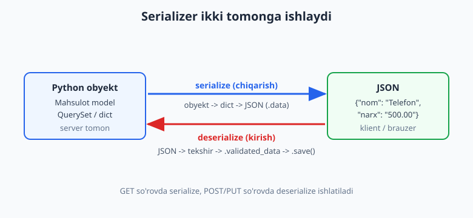
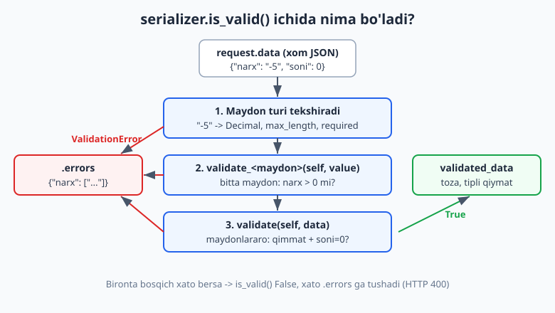
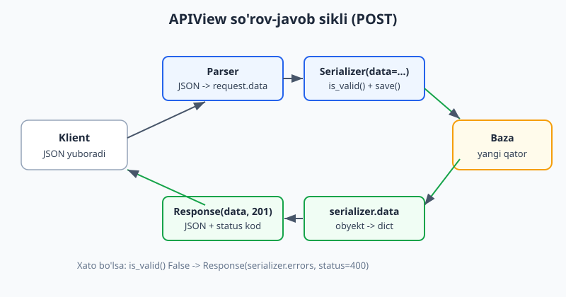

# 15 — DRF kirish va serializers

[⬅️ Oldingi: 14 — Sessiyalar, messages va middleware](./14-sessions-middleware.md) · [🏠 README](./README.md) · [Keyingi: 16 — DRF ViewSets va routers ➡️](./16-drf-viewsets-routers.md)

---

> **Bu bobda:** Django'ni shu paytgacha HTML qaytaradigan veb-sayt sifatida ishlatdik. Endi undan **API** yasaymiz — ya'ni HTML emas, **JSON** qaytaradigan, mobil ilova, React/Vue frontend yoki boshqa server iste'mol qiladigan xizmat. Buni Django'ning eng mashhur kengaytmasi **Django REST Framework (DRF)** bilan qilamiz. Avval REST API nima va nega kerakligini tushunamiz, DRF'ni o'rnatib `settings.py`'ga ulaymiz. Keyin DRF'ning yuragi — **Serializer** bilan tanishamiz: u Python obyektini JSON'ga (serialize) va JSON'ni qayta Python obyektga (deserialize) o'giradi. `serializers.Serializer` (qo'lda) va `ModelSerializer` (modeldan avtomatik) farqini, `.data`, `is_valid()`, `validated_data`, `.errors`, `.save()` ni ko'ramiz. Validatsiyani chuqurlashtiramiz: `validate_<maydon>()` bitta maydon uchun, `validate()` maydonlararo qoidalar uchun. So'ng `APIView` bilan view yozamiz, `Response` va `status` kodlar (200/201/204/400/404) bilan to'g'ri javob qaytaramiz va `request.data` bilan ishlaymiz. Oxirida `ModelForm` va Node.js/Express bilan solishtiramiz. Hamma kod Django 6.0.6, Python 3.14, djangorestframework 3.17 da haqiqatan ishga tushirib tekshirilgan.

---

## REST API nima va nega kerak?

Shu paytgacha bizning view'larimiz `render()` orqali **HTML sahifa** qaytarardi. Bu brauzer uchun ajoyib: odam saytni ochadi, HTML ko'radi, bosadi. Lekin tasavvur qiling:

- Sizning ilovangizga **mobil app** (Android/iOS) ulanmoqchi. Telefon HTML kerakmas — unga toza **ma'lumot** kerak.
- Frontend'ni **React** yoki **Vue**'da yozdingiz. U serverdan ma'lumotni `fetch()` bilan oladi va o'zi chizadi.
- Boshqa **server** sizning ma'lumotingizni so'raydi (masalan, to'lov tizimi).

Bu hollarning hammasida bizga HTML emas, **mashina o'qiy oladigan format** kerak. Eng keng tarqalgani — **JSON**:

```json
{
  "id": 1,
  "nom": "Telefon",
  "narx": "500.00",
  "soni": 10
}
```

**REST API** — bu serverga HTTP orqali ma'lumot so'rash va yuborishning bir uslubi. "REST" qoidalari oddiy: har bir **resurs** (mahsulot, foydalanuvchi, buyurtma) o'z URL'iga ega, va biz unga **HTTP metodlari** orqali murojaat qilamiz:

| HTTP metod | Ma'no | Misol |
|---|---|---|
| `GET` | o'qish | `GET /api/mahsulotlar/` — hammasini ber |
| `GET` | bittasini o'qish | `GET /api/mahsulotlar/1/` — id=1 ni ber |
| `POST` | yangi yaratish | `POST /api/mahsulotlar/` — yangi mahsulot |
| `PUT`/`PATCH` | yangilash | `PUT /api/mahsulotlar/1/` — o'zgartirish |
| `DELETE` | o'chirish | `DELETE /api/mahsulotlar/1/` — o'chirish |

> **Node.js'dan kelganlar uchun:** bu xuddi Express'da `app.get('/products', ...)`, `app.post('/products', ...)` yozganday. DRF — bu Express + Mongoose validatsiya + `JSON.stringify`/`JSON.parse` ni bitta tizimga jamlangan, ammo bundan ham ko'proq narsa beradi. Solishtirish uchun [Node.js qo'llanmasi](../nodejs/README.md)'ga qarang.

Django'da bularning hammasini qo'lda yozish mumkin (`JsonResponse`, `json.loads`...), lekin bu xuddi 10-bobda formalarsiz xom `request.POST` bilan ishlaganday — uzun va xatoga moyil. DRF buni soddalashtiradi.

## DRF o'rnatish va sozlash

Django REST Framework alohida paket. O'rnatish:

```bash
pip install djangorestframework
```

> Bu kitobda kerakli paketlar (Django 6.0.6, djangorestframework 3.17) global o'rnatilgan, shuning uchun alohida o'rnatishingiz shart emas. O'z loyihangizda esa yuqoridagi buyruq bilan o'rnatasiz.

O'rnatgach, `settings.py`'da `INSTALLED_APPS`'ga `rest_framework`'ni qo'shamiz:

```python
# config/settings.py
INSTALLED_APPS = [
    "django.contrib.admin",
    "django.contrib.auth",
    "django.contrib.contenttypes",
    "django.contrib.sessions",
    "django.contrib.messages",
    "django.contrib.staticfiles",
    "rest_framework",   # <-- qo'shildi
    "shop",             # bizning ilova
]
```

Ixtiyoriy, lekin foydali — DRF'ning o'z sozlamalar bloki. Hammasi bitta `REST_FRAMEWORK` lug'atida turadi:

```python
# config/settings.py
REST_FRAMEWORK = {
    # standart format JSON bo'lsin
    "DEFAULT_RENDERER_CLASSES": [
        "rest_framework.renderers.JSONRenderer",
        "rest_framework.renderers.BrowsableAPIRenderer",  # brauzerda chiroyli ko'rinish
    ],
    # standart parser
    "DEFAULT_PARSER_CLASSES": [
        "rest_framework.parsers.JSONParser",
    ],
}
```

`BrowsableAPIRenderer` — DRF'ning juda yoqimli xususiyati: API'ni oddiy brauzerda ochsangiz, JSON bilan birga chiroyli HTML interfeys ham ko'rsatadi (test qilish uchun qulay). Production'da ko'pincha uni o'chirib, faqat `JSONRenderer` qoldiriladi.

Ushbu bobning misollarini biz quyidagi modellar ustida quramiz (5–7-boblardagi modellarga o'xshash):

```python
# shop/models.py
from django.db import models


class Kategoriya(models.Model):
    nom = models.CharField(max_length=100)

    def __str__(self):
        return self.nom


class Mahsulot(models.Model):
    nom = models.CharField(max_length=200)
    narx = models.DecimalField(max_digits=10, decimal_places=2)
    soni = models.IntegerField(default=0)
    kategoriya = models.ForeignKey(
        Kategoriya, on_delete=models.CASCADE, related_name="mahsulotlar"
    )
    yaratilgan = models.DateTimeField(auto_now_add=True)

    def __str__(self):
        return self.nom
```

`makemigrations` va `migrate` qilib bazani tayyorlaymiz — bu sizga 5-bobdan tanish:

```bash
python manage.py makemigrations
python manage.py migrate
```

## Serializer nima? serialize va deserialize

DRF'ning markaziy tushunchasi — **Serializer**. Uning ikki vazifasi bor va ular bir-biriga teskari:

1. **serialize** (chiqarish) — Python obyektini (model, QuerySet, dict) JSON'ga aylantirish. Bu `GET` so'rovda kerak: bazadan obyekt olamiz, klientga JSON yuboramiz.
2. **deserialize** (kirish) — kelgan JSON'ni qabul qilib, **tekshirib**, qayta Python obyektga aylantirish. Bu `POST`/`PUT` so'rovda kerak: klient JSON yuboradi, biz uni tekshirib bazaga yozamiz.



E'tibor bering: serializer **shunchaki JSON o'giruvchi emas** — u o'rtada **validatsiya** ham qiladi. Bu xuddi 10-bobdagi `Form`'ga juda o'xshaydi, faqat HTML o'rniga JSON bilan ishlaydi. Aslida DRF serializer'i g'oyasini Django formalaridan olgan.

## serializers.Serializer — qo'lda yozilgan birinchi serializer

Eng past darajadan boshlaylik — har bir maydonni **qo'lda** e'lon qilamiz. Faylni odatda ilova ichida `serializers.py` deb nomlaymiz:

```python
# shop/serializers.py
from rest_framework import serializers
from .models import Mahsulot


class MahsulotSerializer(serializers.Serializer):
    id = serializers.IntegerField(read_only=True)
    nom = serializers.CharField(max_length=200)
    narx = serializers.DecimalField(max_digits=10, decimal_places=2)
    soni = serializers.IntegerField(default=0)

    def create(self, validated_data):
        return Mahsulot.objects.create(**validated_data)

    def update(self, instance, validated_data):
        instance.nom = validated_data.get("nom", instance.nom)
        instance.narx = validated_data.get("narx", instance.narx)
        instance.soni = validated_data.get("soni", instance.soni)
        instance.save()
        return instance
```

Diqqat qiling — bu deyarli aynan `forms.Form`'ga o'xshaydi: maydonlarni klass atributlari sifatida e'lon qilamiz. Farq: `forms` o'rniga `serializers`, va `read_only=True` (bu maydonni faqat chiqarishda ko'rsat, kirishda qabul qilma).

`create()` va `update()` metodlarini DRF avtomatik chaqiradi: `serializer.save()` chaqirilganda yangi obyekt bo'lsa `create()`, mavjud obyektni yangilash bo'lsa `update()` ishga tushadi.

### serialize qilib ko'ramiz (obyekt -> dict)

Bazadagi obyektni serializer'ga berib, `.data`'sini olamiz:

```python
# Django shell ichida (python manage.py shell)
from shop.models import Mahsulot, Kategoriya
from shop.serializers import MahsulotSerializer

kat = Kategoriya.objects.create(nom="Elektronika")
m = Mahsulot.objects.create(nom="Telefon", narx="500.00", soni=10, kategoriya=kat)

s = MahsulotSerializer(m)
print(s.data)
# {'id': 1, 'nom': 'Telefon', 'narx': '500.00', 'soni': 10}
```

`s.data` — bu oddiy Python lug'at. Uni JSON'ga o'girish uchun DRF'ning `JSONRenderer`'i ishlatiladi (view buni avtomatik qiladi, lekin qo'lda ham sinab ko'rsa bo'ladi):

```python
from rest_framework.renderers import JSONRenderer

json_bytes = JSONRenderer().render(s.data)
print(json_bytes.decode())
# {"id":1,"nom":"Telefon","narx":"500.00","soni":10}
```

### deserialize qilib ko'ramiz (JSON -> obyekt)

Endi teskari yo'nalish. Kelgan ma'lumotni `data=` argumenti bilan beramiz, `is_valid()` chaqiramiz, keyin `save()` qilamiz:

```python
from shop.serializers import MahsulotSerializer

kirish = {"nom": "Noutbuk", "narx": "1200.50", "soni": 3}
s = MahsulotSerializer(data=kirish)

print(s.is_valid())          # True
print(s.validated_data)      # {'nom': 'Noutbuk', 'narx': Decimal('1200.50'), 'soni': 3}

yangi = s.save(kategoriya=kat)   # create() chaqiriladi
print(yangi.id, yangi.nom)       # 2 Noutbuk
```

Uchta muhim nuqta:

- **`is_valid()`** — tekshiradi. Avval chaqirmasdan `validated_data`'ga murojaat qilolmaysiz (xato beradi).
- **`validated_data`** — tekshiruvdan o'tgan, **to'g'ri tipga o'tkazilgan** qiymatlar. E'tibor bering: `"1200.50"` (string) avtomatik `Decimal('1200.50')` ga aylandi. Bu xuddi formalardagi `cleaned_data`.
- **`save(kategoriya=kat)`** — `save()`'ga qo'shimcha argument berish mumkin; ular `validated_data`'ga qo'shilib `create()`'ga uzatiladi. Bu URL'dan yoki tizim ichidan keladigan ma'lumot uchun qulay (masalan, joriy foydalanuvchi).

## ModelSerializer — modeldan avtomatik serializer

Yuqorida har maydonni qo'lda yozdik. Lekin maydonlar allaqachon **modelda** e'lon qilingan — yana takrorlash zerikarli. Bu xuddi 10-bobdagi `ModelForm` muammosi: yechim ham o'xshash — **`ModelSerializer`**.

`ModelSerializer` modelga qarab maydonlarni **o'zi yasaydi**, `create()` va `update()`'ni ham **o'zi yozadi**:

```python
# shop/serializers.py
from rest_framework import serializers
from .models import Mahsulot


class MahsulotModelSerializer(serializers.ModelSerializer):
    class Meta:
        model = Mahsulot
        fields = ["id", "nom", "narx", "soni", "kategoriya", "yaratilgan"]
        read_only_fields = ["yaratilgan"]
```

Mana shu 4 qator yuqoridagi 18 qatorli `Serializer`'ni almashtiradi. Solishtiring:

- `model` — qaysi modeldan;
- `fields` — qaysi maydonlarni chiqarish (`fields = "__all__"` ham mumkin, lekin aniq ro'yxat xavfsizroq — keraksiz maydonni tasodifan ochib qo'ymaysiz);
- `read_only_fields` — faqat o'qish uchun (klient bularni o'zgartira olmaydi).

Sinab ko'ramiz:

```python
from shop.models import Mahsulot
from shop.serializers import MahsulotModelSerializer

m = Mahsulot.objects.first()
s = MahsulotModelSerializer(m)
print(s.data)
# {'id': 1, 'nom': 'Telefon', 'narx': '500.00', 'soni': 10,
#  'kategoriya': 1, 'yaratilgan': '2026-06-13T07:07:18.413479Z'}
```

`yaratilgan` maydoni `read_only_fields`'da bo'lgani uchun chiqishda ko'rinadi, lekin kirishda qabul qilinmaydi. Sinaymiz:

```python
s = MahsulotModelSerializer(data={
    "nom": "Shim", "narx": "80", "soni": 7, "kategoriya": kat.pk,
    "yaratilgan": "2000-01-01T00:00:00Z",   # klient soxta sana yubormoqchi
})
s.is_valid()
print("yaratilgan" in s.validated_data)   # False — e'tiborga olinmadi
```

Klient `yaratilgan`'ni o'zgartirmoqchi bo'ldi, lekin DRF uni jimgina rad etdi. Bu xavfsizlik uchun muhim.

### many=True — ro'yxatni serialize qilish

Bitta obyektni emas, QuerySet'ni (ko'p obyektni) serialize qilish uchun `many=True` beriladi:

```python
hammasi = Mahsulot.objects.all()
s = MahsulotModelSerializer(hammasi, many=True)
print(s.data)
# [{'id': 1, 'nom': 'Telefon', ...}, {'id': 2, 'nom': 'Noutbuk', ...}]  -> JSON da massiv
# Eslatma: DRF 3.16+ oddiy dict qaytaradi; eski versiyalarda OrderedDict edi.
```

`many=True` bo'lsa, `.data` lug'at emas, **lug'atlar ro'yxati** bo'ladi va JSON'da `[...]` massiv ko'rinishida chiqadi.

### partial=True — qisman yangilash (PATCH)

`PUT` so'rovda barcha maydonlarni yuborish kerak. `PATCH` (qisman yangilash) uchun esa faqat o'zgaradiganini yuboramiz — buning uchun `partial=True`:

```python
m = Mahsulot.objects.get(nom="Telefon")
s = MahsulotModelSerializer(m, data={"soni": 99}, partial=True)
print(s.is_valid())   # True — boshqa maydonlar talab qilinmadi
s.save()
m.refresh_from_db()
print(m.soni, m.nom)  # 99 Telefon  -> faqat soni o'zgardi
```

## Validatsiya: validate_field va validate

Serializer'ning eng kuchli tomoni — **validatsiya**. Maydon turi (`DecimalField`, `IntegerField`) avtomatik tekshiradi, lekin biznes qoidalarini biz qo'shamiz. Ikki daraja bor:

1. **`validate_<maydon>(self, value)`** — bitta maydon uchun. Masalan "narx noldan katta bo'lsin".
2. **`validate(self, data)`** — bir nechta maydon birgalikda. Masalan "agar qimmat bo'lsa, omborda bo'lishi shart".



```python
# shop/serializers.py
from rest_framework import serializers
from .models import Mahsulot


class MahsulotValidSerializer(serializers.ModelSerializer):
    class Meta:
        model = Mahsulot
        fields = ["id", "nom", "narx", "soni"]

    # 1. bitta maydon uchun
    def validate_narx(self, value):
        if value <= 0:
            raise serializers.ValidationError("Narx noldan katta bo'lishi kerak.")
        return value          # MUHIM: qiymatni qaytarish SHART

    def validate_nom(self, value):
        return value.strip()  # tozalab qaytaramiz

    # 2. maydonlararo qoida
    def validate(self, data):
        if data.get("soni", 0) == 0 and data.get("narx", 0) > 1000:
            raise serializers.ValidationError(
                "Qimmat mahsulot omborda bo'lishi shart (soni > 0)."
            )
        return data           # MUHIM: data ni qaytarish SHART
```

Eng tez-tez uchraydigan **xato** — qiymatni qaytarishni unutish. `validate_narx` `None` qaytarsa, narx maydoni `None` bo'lib qoladi:

```python
# ❌ XATO: return yo'q -> narx None bo'lib ketadi
def validate_narx(self, value):
    if value <= 0:
        raise serializers.ValidationError("...")
    # return value  <-- unutilgan!

# ✅ TO'G'RI: har doim qiymatni qaytaring
def validate_narx(self, value):
    if value <= 0:
        raise serializers.ValidationError("...")
    return value
```

Validatsiyani amalda ko'ramiz:

```python
from shop.serializers import MahsulotValidSerializer

# 1) narx manfiy -> field xatosi
s = MahsulotValidSerializer(data={"nom": "X", "narx": "-5", "soni": 1})
print(s.is_valid())   # False
print(s.errors)
# {'narx': [ErrorDetail(string="Narx noldan katta bo'lishi kerak.", code='invalid')]}

# 2) qimmat, lekin soni=0 -> validate() xatosi
s = MahsulotValidSerializer(data={"nom": "Server", "narx": "5000", "soni": 0})
print(s.is_valid())   # False
print(s.errors)
# {'non_field_errors': [ErrorDetail(string="Qimmat mahsulot omborda...", ...)]}

# 3) nom bo'shliqlar bilan -> validate_nom tozalaydi
s = MahsulotValidSerializer(data={"nom": "  Mishka  ", "narx": "10", "soni": 5})
s.is_valid()
print(repr(s.validated_data["nom"]))   # 'Mishka'
```

E'tibor bering: bitta maydon xatosi `errors["narx"]` ga, maydonlararo xato esa `errors["non_field_errors"]` ga tushadi. Bu xuddi 10-bobdagi `clean_<maydon>()` va `clean()` farqi.

> **`Serializer` xatosi `ValidationError`'i `rest_framework.serializers`'dan keladi**, Django'ning `django.core.exceptions.ValidationError`'i emas. Adashtirmang — DRF ichida har doim `serializers.ValidationError` ishlating.

## APIView, Response va status kodlar

Endi serializer'ni **view**'ga ulaymiz. DRF'ning asosiy view klassi — **`APIView`**. U Django'ning oddiy `View`'iga o'xshaydi (11-bobdagi CBV), lekin DRF qulayliklari bilan: `request.data`, `Response`, avtomatik parser/renderer.

`APIView`'da har bir HTTP metod uchun alohida metod yozasiz: `get()`, `post()`, `put()`, `delete()`. Bu xuddi 11-bobdagi CBV uslubi.



```python
# shop/views.py
from rest_framework.views import APIView
from rest_framework.response import Response
from rest_framework import status
from django.shortcuts import get_object_or_404

from .models import Mahsulot
from .serializers import MahsulotModelSerializer, MahsulotValidSerializer


class MahsulotRoyxat(APIView):
    def get(self, request):
        qs = Mahsulot.objects.all()
        serializer = MahsulotModelSerializer(qs, many=True)
        return Response(serializer.data)          # status standart 200

    def post(self, request):
        serializer = MahsulotValidSerializer(data=request.data)
        if serializer.is_valid():
            serializer.save(kategoriya_id=request.data.get("kategoriya"))
            return Response(serializer.data, status=status.HTTP_201_CREATED)
        return Response(serializer.errors, status=status.HTTP_400_BAD_REQUEST)


class MahsulotDetal(APIView):
    def get(self, request, pk):
        mahsulot = get_object_or_404(Mahsulot, pk=pk)
        serializer = MahsulotModelSerializer(mahsulot)
        return Response(serializer.data)

    def put(self, request, pk):
        mahsulot = get_object_or_404(Mahsulot, pk=pk)
        serializer = MahsulotModelSerializer(mahsulot, data=request.data)
        if serializer.is_valid():
            serializer.save()
            return Response(serializer.data)
        return Response(serializer.errors, status=status.HTTP_400_BAD_REQUEST)

    def delete(self, request, pk):
        mahsulot = get_object_or_404(Mahsulot, pk=pk)
        mahsulot.delete()
        return Response(status=status.HTTP_204_NO_CONTENT)
```

Bu yerda bir nechta yangi narsa bor, ularni alohida ko'ramiz.

### request.data

Oddiy Django'da `request.POST` faqat forma ma'lumotini oladi va hammasi string. DRF'da esa **`request.data`** — JSON, forma, fayl — qaysi format kelganidan qat'iy nazar, **parserlangan, tipli** lug'at qaytaradi. Klient `{"narx": "500.00"}` JSON yuborsa, `request.data["narx"]` allaqachon o'qishga tayyor.

### Response

`Response` — DRF'ning `JsonResponse`'i. Unga oddiy Python lug'at yoki ro'yxat beramiz, DRF uni **avtomatik JSON'ga o'giradi** (renderer orqali). Sizga `json.dumps()` yozish kerakmas:

```python
return Response({"xabar": "Salom"})            # -> {"xabar": "Salom"}, 200
return Response(serializer.data, status=201)   # serializer natijasi + 201
```

### status kodlar

HTTP javob har doim **status kod** bilan keladi. To'g'ri kodni qaytarish — yaxshi API belgisi. `rest_framework.status` ularni o'qiladigan nom bilan beradi:

| Konstanta | Kod | Qachon |
|---|---|---|
| `HTTP_200_OK` | 200 | muvaffaqiyatli o'qish/yangilash |
| `HTTP_201_CREATED` | 201 | yangi resurs yaratildi (POST) |
| `HTTP_204_NO_CONTENT` | 204 | muvaffaqiyatli, tana bo'sh (DELETE) |
| `HTTP_400_BAD_REQUEST` | 400 | klient noto'g'ri ma'lumot yubordi (validatsiya) |
| `HTTP_404_NOT_FOUND` | 404 | resurs topilmadi |

`200` standart, shuning uchun `Response(data)`'da yozmasak ham bo'ladi. Qolganini aniq yozish kerak. `status.is_success(201)` kabi yordamchi funksiyalar ham bor.

`get_object_or_404` (3-bobdan tanish) topilmasa avtomatik 404 qaytaradi — DRF buni JSON 404 javobga aylantiradi.

### URL'ga ulash

`APIView` ham CBV bo'lgani uchun `.as_view()` bilan ulanadi (11-bobdagiday):

```python
# shop/urls.py
from django.urls import path
from . import views

urlpatterns = [
    path("mahsulotlar/", views.MahsulotRoyxat.as_view()),
    path("mahsulotlar/<int:pk>/", views.MahsulotDetal.as_view()),
]
```

```python
# config/urls.py
from django.contrib import admin
from django.urls import path, include

urlpatterns = [
    path("admin/", admin.site.urls),
    path("api/", include("shop.urls")),
]
```

Endi API tayyor. Brauzerda `http://127.0.0.1:8000/api/mahsulotlar/`'ni ochsangiz (`BrowsableAPIRenderer` yoqilgan bo'lsa) JSON'ni chiroyli ko'rinishda ko'rasiz, yoki `curl` bilan:

```bash
# Bu buyruqlar ishlaydigan serverga qarata yuboriladi (illustrativ — server ishga tushgan bo'lishi kerak)
curl http://127.0.0.1:8000/api/mahsulotlar/

curl -X POST http://127.0.0.1:8000/api/mahsulotlar/ \
  -H "Content-Type: application/json" \
  -d '{"nom": "Noutbuk", "narx": "1200.00", "soni": 5, "kategoriya": 1}'
```

> Yuqoridagi `curl` buyruqlari **illustrativ** — ular ishga tushgan `runserver`'ga yuboriladi. Kod to'g'ri, lekin bu kitobni tekshirish muhitida jonli server ko'tarilmagani uchun ular o'rniga DRF'ning `APIClient`'i bilan avtomatik test orqali tekshirildi (pastdagi "Testlash" bo'limiga qarang).

## @api_view — funksiya asosida view (qisqa variant)

Agar bitta-ikkita oddiy endpoint kerak bo'lsa, klass ortiqcha tuyulishi mumkin. DRF funksiya asosidagi view uchun `@api_view` dekoratorini beradi:

```python
# shop/views.py
from rest_framework.decorators import api_view
from rest_framework.response import Response


@api_view(["GET"])
def salom(request):
    return Response({"xabar": "Salom DRF"})
```

`@api_view(["GET"])` — bu view faqat `GET` qabul qiladi (boshqa metod kelsa avtomatik 405 qaytaradi). Ichida `request.data`, `Response` baribir ishlaydi. Bu xuddi Express'dagi `app.get('/salom', (req, res) => res.json({...}))` ga o'xshaydi.

Katta loyihalarda esa `APIView` (yoki keyingi bobdagi `ViewSet`) afzal — kod tartibli bo'ladi.

## ModelSerializer va ModelForm: nima farqi?

Agar 10-bobni o'qigan bo'lsangiz, `ModelSerializer` tanish tuyulishi kerak. Ular juda o'xshash, lekin maqsadi har xil:

| Jihat | `ModelForm` (10-bob) | `ModelSerializer` (bu bob) |
|---|---|---|
| Maqsad | HTML forma + brauzer | JSON API + dasturlar |
| Kirish | `request.POST` (string) | `request.data` (tipli JSON) |
| Tekshirish | `is_valid()` + `cleaned_data` | `is_valid()` + `validated_data` |
| Xato | `form.errors` (HTML uchun) | `serializer.errors` (JSON uchun) |
| Chiqish | `form.as_p()` (HTML) | `serializer.data` (dict/JSON) |
| Saqlash | `form.save()` | `serializer.save()` |

Ko'rib turganingizdek, g'oya bir xil — DRF ataylab Django formalariga taqlid qildi, shuning uchun bittasini bilsangiz, ikkinchisi oson. Asosiy farq: forma **odam** uchun (HTML), serializer **dastur** uchun (JSON).

## Testlash: APIClient bilan API'ni tekshirish

DRF API'ni avtomatik test qilishning eng to'g'ri yo'li — **`APIClient`**. U Django'ning `Client`'iga o'xshaydi, lekin JSON yuborish (`format="json"`) qulayligi bor:

```python
# shop/tests.py
from django.test import TestCase
from rest_framework.test import APIClient
from rest_framework import status
from .models import Mahsulot, Kategoriya


class MahsulotApiTest(TestCase):
    def setUp(self):
        self.client = APIClient()
        self.kat = Kategoriya.objects.create(nom="Elektronika")
        self.m = Mahsulot.objects.create(
            nom="Telefon", narx="500.00", soni=10, kategoriya=self.kat
        )

    def test_royxat_get(self):
        r = self.client.get("/api/mahsulotlar/")
        self.assertEqual(r.status_code, status.HTTP_200_OK)
        self.assertEqual(len(r.json()), 1)

    def test_yaratish_201(self):
        r = self.client.post(
            "/api/mahsulotlar/",
            {"nom": "Noutbuk", "narx": "1200.00", "soni": 5,
             "kategoriya": self.kat.pk},
            format="json",
        )
        self.assertEqual(r.status_code, status.HTTP_201_CREATED)
        self.assertEqual(Mahsulot.objects.count(), 2)

    def test_yaratish_xato_400(self):
        r = self.client.post(
            "/api/mahsulotlar/",
            {"nom": "Yomon", "narx": "-1", "soni": 1, "kategoriya": self.kat.pk},
            format="json",
        )
        self.assertEqual(r.status_code, status.HTTP_400_BAD_REQUEST)
        self.assertIn("narx", r.json())

    def test_ochirish_204(self):
        r = self.client.delete(f"/api/mahsulotlar/{self.m.pk}/")
        self.assertEqual(r.status_code, status.HTTP_204_NO_CONTENT)
        self.assertEqual(Mahsulot.objects.count(), 0)
```

```bash
python manage.py test shop
# Ran 4 tests ... OK
```

Bu testlar yuqoridagi `curl` so'rovlarining avtomatlashtirilgan, takrorlanadigan ekvivalenti. Har commitda ishonch bilan ishlaydi.

## Xulosa

Bu bobda Django'ni JSON API'ga aylantirdik:

- **REST API** — resurslarni HTTP metodlari (GET/POST/PUT/DELETE) orqali boshqarish; JSON formatda gaplashish.
- **DRF** o'rnatish: `pip install djangorestframework`, `INSTALLED_APPS`'ga `rest_framework`, ixtiyoriy `REST_FRAMEWORK` sozlamasi.
- **Serializer** — ikki tomonlama ko'prik: **serialize** (obyekt -> JSON, `.data`) va **deserialize** (JSON -> obyekt, `is_valid()` -> `validated_data` -> `save()`).
- **`serializers.Serializer`** — qo'lda, har maydon; **`ModelSerializer`** — modeldan avtomatik (`Meta.model`, `fields`, `read_only_fields`).
- **Validatsiya**: `validate_<maydon>()` bitta maydon uchun, `validate()` maydonlararo; xato `errors`'da (`non_field_errors` umumiy xato uchun). Qiymatni **qaytarish shart**.
- **`APIView`** — `get/post/put/delete` metodlari, `request.data`, `Response`, to'g'ri **status** kodlar (200/201/204/400/404).
- DRF serializer Django **formalariga** ataylab o'xshatilgan; Node.js'da bu Express + validatsiya + JSON ishini bitta tizimga jamlaydi.

Keyingi bobda takrorlanayotgan `APIView` kodini yanada qisqartiramiz: **ViewSet** va **router** bilan butun CRUD'ni bir necha qatorda yozamiz.

> Cross-link: bazasi/SQL [SQL qo'llanma](../sql/README.md); API'ni CI'da test qilish va deploy [Git va GitHub qo'llanma](../git-github/README.md); REST g'oyasini Express bilan solishtirish [Node.js qo'llanma](../nodejs/README.md).

## Mashqlar

### Oson

1. **DRF ulash.** Yangi loyihada `rest_framework`'ni `INSTALLED_APPS`'ga qo'shing. `python manage.py check` xatosiz o'tishini ko'rsating.

2. **Birinchi serializer.** `Kitob` modeli (`nom`, `sahifa`, `narx`) uchun `ModelSerializer` yozing. `fields`'da uchala maydon bo'lsin.

3. **serialize.** Bitta `Kitob` obyektini serializer'ga berib, uning `.data`'sini chop eting. Natijada lug'at chiqishini ko'rsating.

4. **many=True.** Hamma kitobni `many=True` bilan serialize qiling. `.data` ro'yxat (massiv) ekanini tushuntiring.

5. **read_only.** `Kitob`'ga `qoshilgan = DateTimeField(auto_now_add=True)` qo'shing va serializer'da uni `read_only_fields`'ga kiriting. Klient bu maydonni o'zgartira olmasligini tasdiqlang.

6. **status kod.** Quyidagilarning har biri qaysi vaziyatda ishlatiladi: `200`, `201`, `204`, `400`, `404`? Bittadan misol yozing.

### O'rta

7. **deserialize + save.** `KitobSerializer(data=...)` ga JSON bering, `is_valid()` chaqiring, `validated_data`'ni ko'ring va `save()` bilan bazaga yozing. Saqlangan obyekt `id`'sini chop eting.

8. **validate_field.** `narx` manfiy yoki nol bo'lsa "Narx noldan katta bo'lsin" xatosini bering (`validate_narx`). Manfiy narx bilan `is_valid()` `False` qaytarishini ko'rsating.

9. **validate (maydonlararo).** `Kitob`'ga "agar `sahifa > 1000` bo'lsa, `narx` 50 dan katta bo'lishi shart" qoidasini `validate()` da yozing. Xato `non_field_errors`'ga tushishini ko'rsating.

10. **APIView GET.** `KitobRoyxat(APIView)` yozing: `get()` hamma kitobni JSON qaytarsin. URL'ga ulang.

11. **APIView POST + 201/400.** O'sha view'ga `post()` qo'shing: to'g'ri ma'lumotda `201`, xato ma'lumotda `400` va `serializer.errors` qaytsin.

12. **@api_view.** `statistika` degan funksiya-view yozing (`@api_view(["GET"])`): u kitoblar **soni** va **o'rtacha narxini** JSON qaytarsin.

### Qiyin

13. **To'liq CRUD.** `KitobDetal(APIView)` yozing: `get` (bitta, topilmasa 404), `put` (yangilash), `delete` (`204`). `get_object_or_404` ishlating va APIClient bilan to'rtala metodni test qiling.

14. **Nested serializer.** `Muallif` va `Kitob` (FK) bo'lsin. `MuallifSerializer` ichida muallifning kitoblarini ichma-ich (nested, `many=True, read_only=True`) ko'rsating.

15. **SerializerMethodField.** `KitobSerializer`'ga hisoblanadigan maydon qo'shing: `chegirmali_narx` = `narx * 0.9`. `SerializerMethodField` va `get_chegirmali_narx(self, obj)` ishlating.

16. **APIClient test to'plami.** Yuqoridagi CRUD uchun kamida 5 ta test yozing (`get` ro'yxat, `get` bitta, `post` 201, `post` 400, `delete` 204) va `python manage.py test` bilan hammasi PASS bo'lishini ko'rsating.

<details markdown="1"><summary>Yechimlar</summary>

**1.**
```python
# config/settings.py
INSTALLED_APPS = [
    # ... standart ilovalar ...
    "rest_framework",
    "kutubxona",   # o'z ilovangiz
]
```
```bash
python manage.py check
# System check identified no issues (0 silenced).
```

**2.**
```python
# kutubxona/models.py
from django.db import models

class Kitob(models.Model):
    nom = models.CharField(max_length=200)
    sahifa = models.IntegerField()
    narx = models.DecimalField(max_digits=10, decimal_places=2)

# kutubxona/serializers.py
from rest_framework import serializers
from .models import Kitob

class KitobSerializer(serializers.ModelSerializer):
    class Meta:
        model = Kitob
        fields = ["id", "nom", "sahifa", "narx"]
```

**3.**
```python
from kutubxona.models import Kitob
from kutubxona.serializers import KitobSerializer

k = Kitob.objects.create(nom="Python", sahifa=300, narx="120.00")
s = KitobSerializer(k)
print(s.data)
# {'id': 1, 'nom': 'Python', 'sahifa': 300, 'narx': '120.00'}
```

**4.**
```python
s = KitobSerializer(Kitob.objects.all(), many=True)
print(s.data)
# [{'id': 1, 'nom': 'Python', ...}, ...]  -> JSON ga o'tkanda massiv [...]
# many=True bo'lsa har obyekt alohida lug'at, hammasi ro'yxatda jamlanadi.
# (DRF 3.16+ oddiy dict; eski versiyalarda OrderedDict edi.)
```

**5.**
```python
class Kitob(models.Model):
    nom = models.CharField(max_length=200)
    sahifa = models.IntegerField()
    narx = models.DecimalField(max_digits=10, decimal_places=2)
    qoshilgan = models.DateTimeField(auto_now_add=True)

class KitobSerializer(serializers.ModelSerializer):
    class Meta:
        model = Kitob
        fields = ["id", "nom", "sahifa", "narx", "qoshilgan"]
        read_only_fields = ["qoshilgan"]

# Tasdiq:
s = KitobSerializer(data={"nom": "X", "sahifa": 10, "narx": "5",
                          "qoshilgan": "2000-01-01T00:00:00Z"})
s.is_valid()
print("qoshilgan" in s.validated_data)   # False — e'tiborga olinmaydi
```

**6.**
```python
# 200 OK        -> GET muvaffaqiyatli; ma'lumot qaytdi
# 201 CREATED   -> POST: yangi resurs yaratildi
# 204 NO CONTENT-> DELETE muvaffaqiyatli; tana bo'sh
# 400 BAD REQUEST -> validatsiya xatosi (klient noto'g'ri yubordi)
# 404 NOT FOUND -> so'ralgan id topilmadi
```

**7.**
```python
kirish = {"nom": "Django", "sahifa": 450, "narx": "150.00"}
s = KitobSerializer(data=kirish)
print(s.is_valid())          # True
print(dict(s.validated_data))
# {'nom': 'Django', 'sahifa': 450, 'narx': Decimal('150.00')}
obj = s.save()
print(obj.id)                # masalan 2
```

**8.**
```python
from rest_framework import serializers

class KitobSerializer(serializers.ModelSerializer):
    class Meta:
        model = Kitob
        fields = ["id", "nom", "sahifa", "narx"]

    def validate_narx(self, value):
        if value <= 0:
            raise serializers.ValidationError("Narx noldan katta bo'lsin.")
        return value   # qaytarish shart!

# Tekshirish:
s = KitobSerializer(data={"nom": "X", "sahifa": 10, "narx": "-3"})
print(s.is_valid())   # False
print(s.errors)       # {'narx': [ErrorDetail(string='Narx noldan katta bo'lsin.', ...)]}
```

**9.**
```python
class KitobSerializer(serializers.ModelSerializer):
    class Meta:
        model = Kitob
        fields = ["id", "nom", "sahifa", "narx"]

    def validate(self, data):
        if data.get("sahifa", 0) > 1000 and data.get("narx", 0) <= 50:
            raise serializers.ValidationError(
                "Yirik kitob (1000+ sahifa) narxi 50 dan katta bo'lsin."
            )
        return data   # data ni qaytarish shart!

# Tekshirish:
s = KitobSerializer(data={"nom": "Katta", "sahifa": 1200, "narx": "30"})
print(s.is_valid())   # False
print(s.errors)       # {'non_field_errors': [...]}
```

**10–11.**
```python
# kutubxona/views.py
from rest_framework.views import APIView
from rest_framework.response import Response
from rest_framework import status
from .models import Kitob
from .serializers import KitobSerializer

class KitobRoyxat(APIView):
    def get(self, request):
        s = KitobSerializer(Kitob.objects.all(), many=True)
        return Response(s.data)

    def post(self, request):
        s = KitobSerializer(data=request.data)
        if s.is_valid():
            s.save()
            return Response(s.data, status=status.HTTP_201_CREATED)
        return Response(s.errors, status=status.HTTP_400_BAD_REQUEST)

# kutubxona/urls.py
from django.urls import path
from . import views
urlpatterns = [
    path("kitoblar/", views.KitobRoyxat.as_view()),
]
```

**12.**
```python
from rest_framework.decorators import api_view
from rest_framework.response import Response
from django.db.models import Avg
from .models import Kitob

@api_view(["GET"])
def statistika(request):
    natija = Kitob.objects.aggregate(ortacha=Avg("narx"))
    return Response({
        "soni": Kitob.objects.count(),
        "ortacha_narx": natija["ortacha"],
    })

# urls.py
path("statistika/", views.statistika),
```

**13.**
```python
# views.py
from django.shortcuts import get_object_or_404

class KitobDetal(APIView):
    def get(self, request, pk):
        k = get_object_or_404(Kitob, pk=pk)
        return Response(KitobSerializer(k).data)

    def put(self, request, pk):
        k = get_object_or_404(Kitob, pk=pk)
        s = KitobSerializer(k, data=request.data)
        if s.is_valid():
            s.save()
            return Response(s.data)
        return Response(s.errors, status=status.HTTP_400_BAD_REQUEST)

    def delete(self, request, pk):
        k = get_object_or_404(Kitob, pk=pk)
        k.delete()
        return Response(status=status.HTTP_204_NO_CONTENT)

# urls.py
path("kitoblar/<int:pk>/", views.KitobDetal.as_view()),

# tests.py
from rest_framework.test import APIClient
from rest_framework import status
from django.test import TestCase
from .models import Kitob

class KitobCrudTest(TestCase):
    def setUp(self):
        self.c = APIClient()
        self.k = Kitob.objects.create(nom="A", sahifa=100, narx="10.00")

    def test_get_bitta(self):
        r = self.c.get(f"/kitoblar/{self.k.pk}/")
        self.assertEqual(r.status_code, 200)

    def test_get_404(self):
        r = self.c.get("/kitoblar/9999/")
        self.assertEqual(r.status_code, 404)

    def test_put(self):
        r = self.c.put(f"/kitoblar/{self.k.pk}/",
                       {"nom": "B", "sahifa": 200, "narx": "20.00"},
                       format="json")
        self.assertEqual(r.status_code, 200)
        self.k.refresh_from_db()
        self.assertEqual(self.k.nom, "B")

    def test_delete(self):
        r = self.c.delete(f"/kitoblar/{self.k.pk}/")
        self.assertEqual(r.status_code, 204)
        self.assertEqual(Kitob.objects.count(), 0)
```

**14.**
```python
# models.py
class Muallif(models.Model):
    ism = models.CharField(max_length=120)

class Kitob(models.Model):
    nom = models.CharField(max_length=200)
    narx = models.DecimalField(max_digits=10, decimal_places=2)
    muallif = models.ForeignKey(Muallif, on_delete=models.CASCADE,
                                related_name="kitoblar")

# serializers.py
class KitobKichikSerializer(serializers.ModelSerializer):
    class Meta:
        model = Kitob
        fields = ["id", "nom", "narx"]

class MuallifSerializer(serializers.ModelSerializer):
    kitoblar = KitobKichikSerializer(many=True, read_only=True)
    class Meta:
        model = Muallif
        fields = ["id", "ism", "kitoblar"]

# Natija:
# {"id": 1, "ism": "Oybek",
#  "kitoblar": [{"id": 1, "nom": "...", "narx": "..."}, ...]}
```

**15.**
```python
from rest_framework import serializers
from decimal import Decimal

class KitobSerializer(serializers.ModelSerializer):
    chegirmali_narx = serializers.SerializerMethodField()

    class Meta:
        model = Kitob
        fields = ["id", "nom", "narx", "chegirmali_narx"]

    def get_chegirmali_narx(self, obj):
        return round(obj.narx * Decimal("0.9"), 2)

# Natija: {"id":1,"nom":"X","narx":"100.00","chegirmali_narx":90.0}
# Diqqat: SerializerMethodField qaytargan qiymat to'g'ridan-to'g'ri
# JSON ga o'tadi (Decimal -> son), shuning uchun "90.00" emas, 90.0 chiqadi.
# SerializerMethodField har doim read-only: faqat chiqishda ko'rinadi.
```

**16.**
```python
from rest_framework.test import APIClient
from rest_framework import status
from django.test import TestCase
from .models import Kitob

class KitobApiTest(TestCase):
    def setUp(self):
        self.c = APIClient()
        self.k = Kitob.objects.create(nom="A", sahifa=100, narx="10.00")

    def test_royxat(self):
        r = self.c.get("/kitoblar/")
        self.assertEqual(r.status_code, status.HTTP_200_OK)
        self.assertEqual(len(r.json()), 1)

    def test_bitta(self):
        r = self.c.get(f"/kitoblar/{self.k.pk}/")
        self.assertEqual(r.status_code, 200)
        self.assertEqual(r.json()["nom"], "A")

    def test_post_201(self):
        r = self.c.post("/kitoblar/",
                        {"nom": "B", "sahifa": 50, "narx": "5.00"},
                        format="json")
        self.assertEqual(r.status_code, status.HTTP_201_CREATED)
        self.assertEqual(Kitob.objects.count(), 2)

    def test_post_400(self):
        r = self.c.post("/kitoblar/",
                        {"nom": "C", "sahifa": 50, "narx": "-1"},
                        format="json")
        self.assertEqual(r.status_code, status.HTTP_400_BAD_REQUEST)

    def test_delete_204(self):
        r = self.c.delete(f"/kitoblar/{self.k.pk}/")
        self.assertEqual(r.status_code, status.HTTP_204_NO_CONTENT)

# python manage.py test  ->  5 test PASS
# Eslatma: test_post_400 ishlashi uchun KitobSerializer da
# validate_narx (narx > 0) bo'lishi kerak (8-mashqdagiday).
```

</details>

---

[⬅️ Oldingi: 14 — Sessiyalar, messages va middleware](./14-sessions-middleware.md) · [🏠 README](./README.md) · [Keyingi: 16 — DRF ViewSets va routers ➡️](./16-drf-viewsets-routers.md)
