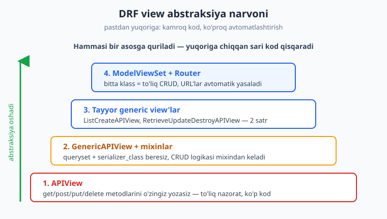
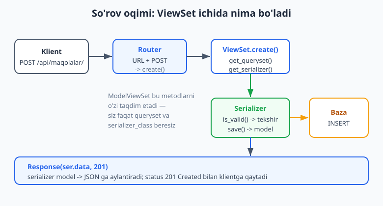
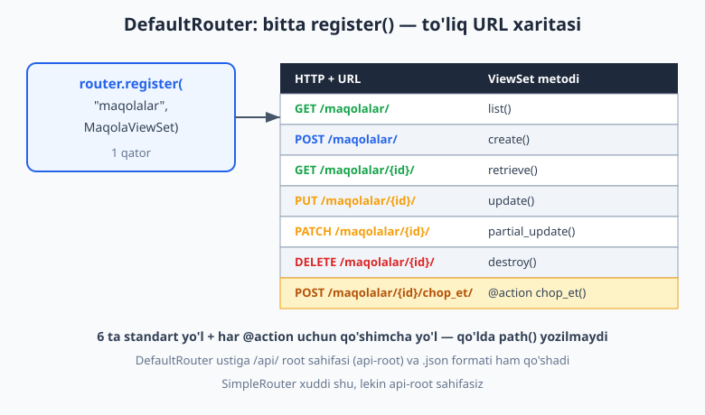

# 16 — DRF ViewSets va routers

[⬅️ Oldingi: 15 — DRF kirish va serializers](./15-drf-serializers.md) · [🏠 README](./README.md) · [Keyingi: 17 — DRF autentifikatsiya (Token, JWT) ➡️](./17-drf-auth.md)

---

> **Bu bobda:** o'tgan bobda serializer bilan ma'lumotni JSON ga aylantirishni o'rgandik; endi shu serializerlarni view'larga ulab, to'liq REST API yasaymiz. Avval eng past darajadagi `APIView` ni ko'ramiz — bu yerda `get`, `post` metodlarini o'zingiz yozasiz. Keyin **generic view'lar** (`ListCreateAPIView`, `RetrieveUpdateDestroyAPIView`) takror kodni qanday yo'q qilishini ko'rib chiqamiz. So'ng asosiy mavzu: **ViewSet** va **ModelViewSet** — bitta klassda butun CRUD (list/create/retrieve/update/partial_update/destroy). Bularni **DefaultRouter** ga ulab, URL'larni qo'lda yozmasdan avtomatik yasashni ko'ramiz. **Browsable API** — DRF ning brauzerda ishlaydigan tekin admin-paneliga o'xshash interfeysini, **`@action`** dekoratori bilan standartdan tashqari amallarni (masalan `POST /maqolalar/5/chop_et/`) qo'shishni, va nihoyat to'liq ishlaydigan CRUD API ni atigi bir necha qatorda yozishni o'rganamiz. Hamma kod Django 6.0.6, Python 3.14, djangorestframework 3.17 da haqiqatan ishga tushirib tekshirilgan.

---

## Eslatma: oldingi bobdan davom

Bu bobda 15-bobdagi `Maqola` modeli va `MaqolaSerializer` dan foydalanamiz. Qisqacha eslatma:

```python
# blog/models.py
from django.db import models

class Maqola(models.Model):
    sarlavha = models.CharField(max_length=200)
    matn = models.TextField()
    chop_etilgan = models.BooleanField(default=False)
    yaratilgan = models.DateTimeField(auto_now_add=True)

    def __str__(self):
        return self.sarlavha
```

```python
# blog/serializers.py
from rest_framework import serializers
from .models import Maqola

class MaqolaSerializer(serializers.ModelSerializer):
    class Meta:
        model = Maqola
        fields = ["id", "sarlavha", "matn", "chop_etilgan", "yaratilgan"]
        read_only_fields = ["yaratilgan"]
```

`settings.py` da DRF o'rnatilgan (`INSTALLED_APPS` ga `"rest_framework"` qo'shilgan). Endi shu serializer ustiga view qatlamini quramiz.

## Muammo: bitta resurs, ko'p takror kod

REST API da bitta resurs (masalan "maqola") odatda oltita amalni qo'llab-quvvatlaydi:

| HTTP metod | URL | Ma'no |
|---|---|---|
| `GET` | `/maqolalar/` | ro'yxat (list) |
| `POST` | `/maqolalar/` | yangi yaratish (create) |
| `GET` | `/maqolalar/5/` | bittasini olish (retrieve) |
| `PUT` | `/maqolalar/5/` | to'liq yangilash (update) |
| `PATCH` | `/maqolalar/5/` | qisman yangilash (partial update) |
| `DELETE` | `/maqolalar/5/` | o'chirish (destroy) |

Agar har birini qo'lda yozsangiz, har resurs uchun deyarli bir xil kodni qayta-qayta yozasiz: querysetni olib, serializerga berib, `is_valid()` chaqirib, saqlab, `Response` qaytarish. Ikki-uchta modelli loyihada bu yuzlab qator takror bo'ladi.

DRF buni bosqichma-bosqich hal qiladi — **abstraksiya narvoni** bor. Pastdan yuqoriga ko'tarilgan sari kamroq kod yozasiz:



Quyida narvonning har pog'onasini ko'rib chiqamiz: `APIView` (1), generic view'lar (2-3), ViewSet + Router (4).

## APIView — eng past daraja

`APIView` — Django ning oddiy CBV (class-based view) sining DRF versiyasi. U HTTP metodlariga (`get`, `post`, `put`, `delete`) mos metodlarni o'zingiz yozishingizni kutadi. Buning evaziga sizga to'liq nazorat beradi.

```python
# blog/views.py
from rest_framework.views import APIView
from rest_framework.response import Response
from rest_framework import status

from .models import Maqola
from .serializers import MaqolaSerializer

class MaqolaListAPIView(APIView):
    def get(self, request):
        qs = Maqola.objects.all()
        ser = MaqolaSerializer(qs, many=True)
        return Response(ser.data)

    def post(self, request):
        ser = MaqolaSerializer(data=request.data)
        ser.is_valid(raise_exception=True)
        ser.save()
        return Response(ser.data, status=status.HTTP_201_CREATED)
```

E'tibor bering:

- `request.data` — DRF ning `request.POST` o'rnida ishlatiladigan obyekti. U JSON, forma va boshqa formatlarni avtomatik tushunadi (Django ning `request.POST` faqat formani biladi).
- `Response(...)` — DRF ning `HttpResponse` o'rnida ishlatiladigan obyekti. U ma'lumotni klient so'ragan formatga (JSON, HTML) aylantirib beradi.
- `ser.is_valid(raise_exception=True)` — agar ma'lumot xato bo'lsa, DRF avtomatik 400 javob qaytaradi. Qo'lda `if not ser.is_valid()` yozish shart emas.
- `status.HTTP_201_CREATED` — raqamlarni (`201`) eslab o'tirmaslik uchun nomli konstantalar.

URL ga ulash — oddiy CBV kabi `.as_view()` bilan:

```python
# config/urls.py
from blog.views import MaqolaListAPIView

urlpatterns = [
    path("api/apiview/maqolalar/", MaqolaListAPIView.as_view()),
]
```

Bu ishlaydi, lekin `get` va `post` deyarli har resursda bir xil bo'ladi. Bittasini olish/yangilash/o'chirish uchun yana bitta `APIView` (`get`, `put`, `delete` bilan) yozishingiz kerak. Takror boshlanadi. Narvonning keyingi pog'onasi shuni kamaytiradi.

> **APIView qachon kerak?** Resursingiz standart CRUD ga sig'maydigan g'ayrioddiy mantiqqa ega bo'lsa (masalan tashqi API ga proksilash, fayl yuklash, hisobot generatsiyasi). Standart CRUD uchun esa quyidagi vositalar tezroq.

## Generic view'lar — takrorni yo'q qilish

DRF ning eng kuchli g'oyasi: CRUD amallari deyarli har doim bir xil naqsh bo'lib takrorlanadi, demak ularni **tayyor klasslarga** jamlash mumkin. Sizdan faqat ikki narsa so'raladi: `queryset` (qaysi ma'lumotlar) va `serializer_class` (qanday aylantirish). Qolganini klass o'zi bajaradi.

```python
# blog/views.py
from rest_framework import generics
from .models import Maqola
from .serializers import MaqolaSerializer

# GET /maqolalar/  (list)  va  POST /maqolalar/  (create)
class MaqolaGenericList(generics.ListCreateAPIView):
    queryset = Maqola.objects.all()
    serializer_class = MaqolaSerializer

# GET/PUT/PATCH/DELETE /maqolalar/5/  (retrieve/update/destroy)
class MaqolaGenericDetail(generics.RetrieveUpdateDestroyAPIView):
    queryset = Maqola.objects.all()
    serializer_class = MaqolaSerializer
```

Mana bu — yuqoridagi `APIView` dagi o'nlab qatorni almashtiradi. `ListCreateAPIView` o'zida `get` (ro'yxat) va `post` (yaratish) ni; `RetrieveUpdateDestroyAPIView` esa `get`, `put`, `patch`, `delete` ni taqdim etadi. URL'ga ulash:

```python
# config/urls.py
urlpatterns = [
    path("api/generic/maqolalar/", MaqolaGenericList.as_view()),
    path("api/generic/maqolalar/<int:pk>/", MaqolaGenericDetail.as_view()),
]
```

DRF da tayyor generic view'lar to'plami bor. Eng ko'p ishlatiladigani:

| Klass | HTTP metodlar | Vazifa |
|---|---|---|
| `ListAPIView` | GET | faqat ro'yxat |
| `CreateAPIView` | POST | faqat yaratish |
| `ListCreateAPIView` | GET, POST | ro'yxat + yaratish |
| `RetrieveAPIView` | GET | faqat bittasini olish |
| `RetrieveUpdateAPIView` | GET, PUT, PATCH | olish + yangilash |
| `RetrieveUpdateDestroyAPIView` | GET, PUT, PATCH, DELETE | olish + yangilash + o'chirish |

Demak to'liq CRUD uchun ikki klass kerak: ro'yxat/yaratish bittasi (`ListCreateAPIView`), bittasini boshqarish ikkinchisi (`RetrieveUpdateDestroyAPIView`). Ikkalasida ham bir xil `queryset` va `serializer_class` takrorlanadi. ViewSet shu ikkita klassni ham bittaga birlashtiradi.

> **Ichki mexanizm:** bu generic klasslar `GenericAPIView` (queryset, serializer, paginatsiya beradi) ustiga **mixin**'lardan (`ListModelMixin`, `CreateModelMixin`, `RetrieveModelMixin`...) yig'ilgan. Har mixin bitta amalni biladi. Xohlasangiz o'zingiz `GenericAPIView, ListModelMixin, CreateModelMixin` ni aralashtirib o'z klassingizni yasashingiz mumkin — lekin tayyorlari ko'p hollarda yetadi.

## ViewSet — CRUD ni bitta klassga

**ViewSet** generic view'lardan keyingi pog'ona. G'oya oddiy: bir resursning hamma amallari (ro'yxat, yaratish, olish, yangilash, o'chirish) bir-biriga bog'liq — ularni **bitta klassga** jamlaylik. ViewSet HTTP metod nomlari (`get`, `post`) o'rniga **amal nomlari** bilan ishlaydi:

| Amal (action) | Mos HTTP+URL |
|---|---|
| `list()` | GET `/maqolalar/` |
| `create()` | POST `/maqolalar/` |
| `retrieve()` | GET `/maqolalar/5/` |
| `update()` | PUT `/maqolalar/5/` |
| `partial_update()` | PATCH `/maqolalar/5/` |
| `destroy()` | DELETE `/maqolalar/5/` |

Eng past `ViewSet` da bu metodlarni o'zingiz yozasiz (APIView kabi). Lekin amalda deyarli hech kim bunday yozmaydi — chunki **`ModelViewSet`** bu oltita metodni model uchun avtomatik taqdim etadi. Sizdan yana o'sha ikki narsa:

```python
# blog/views.py
from rest_framework import viewsets
from .models import Maqola
from .serializers import MaqolaSerializer

class MaqolaViewSet(viewsets.ModelViewSet):
    queryset = Maqola.objects.all().order_by("-id")
    serializer_class = MaqolaSerializer
```

Mana bu uch qator — **to'liq CRUD**. list, create, retrieve, update, partial_update, destroy — hammasi tayyor. So'rov kelganda ichkarida nima bo'lishini ko'rib chiqaylik:



`ModelViewSet` ichki ishlashi: `create()` chaqirilganda u `get_serializer(data=request.data)` ni oladi, `is_valid()` qiladi, `save()` qiladi va `Response(..., 201)` qaytaradi — xuddi biz yuqorida `APIView` da qo'lda yozganimizdek, lekin tayyor. Faqat bitta savol qoldi: ViewSet HTTP metod yozmasa, qaysi URL qaysi amalga ulanadi? Buni **router** hal qiladi.

> **`ReadOnlyModelViewSet`** — agar resurs faqat o'qish uchun bo'lsa (yaratish/o'chirish kerak emas), `ModelViewSet` o'rniga shuni ishlating. U faqat `list()` va `retrieve()` ni beradi. Quyida buni tekshirib ko'ramiz.

## DefaultRouter — URL'larni avtomatik yasash

Oddiy view'da har URL'ni qo'lda `path(...)` bilan yozasiz. ViewSet uchun esa **router** URL'larni avtomatik yasaydi. Siz faqat ViewSet ni ro'yxatdan o'tkazasiz:

```python
# config/urls.py
from django.urls import path, include
from rest_framework.routers import DefaultRouter
from blog.views import MaqolaViewSet, IzohViewSet

router = DefaultRouter()
router.register(r"maqolalar", MaqolaViewSet, basename="maqola")
router.register(r"izohlar", IzohViewSet, basename="izoh")

urlpatterns = [
    path("api/", include(router.urls)),
]
```

`router.register("maqolalar", MaqolaViewSet)` bitta qatori quyidagi hamma URL'ni yasaydi:



Buni isbotlash uchun routerning yasagan URL'larini chop etamiz (shellda haqiqatan ishga tushirilgan):

```python
>>> from rest_framework.routers import DefaultRouter
>>> from blog.views import MaqolaViewSet
>>> router = DefaultRouter()
>>> router.register(r"maqolalar", MaqolaViewSet, basename="maqola")
>>> for u in router.urls:
...     print(u.pattern, "->", u.name)
```

Natija (haqiqiy chiqish):

```text
^maqolalar/$                                  -> maqola-list
^maqolalar\.(?P<format>[a-z0-9]+)/?$          -> maqola-list
^maqolalar/(?P<pk>[^/.]+)/$                   -> maqola-detail
^maqolalar/(?P<pk>[^/.]+)\.(?P<format>...)$   -> maqola-detail
                                              -> api-root
```

Diqqat qiling:

- **`basename`** — URL nomlarining prefiksi (`maqola-list`, `maqola-detail`). `reverse("maqola-detail", args=[5])` bilan URL yasaganda kerak. Agar ViewSet da `queryset` bo'lsa, router `basename` ni o'zi aniqlaydi — lekin uni aniq yozish yaxshi amaliyot.
- **`.format`** li nusxalar — `/maqolalar.json` yoki `/maqolalar/5.json` kabi formatni URL orqali so'rash imkonini beradi.
- **`api-root`** — `/api/` manzilidagi sahifa, hamma ro'yxatdan o'tgan resurslarga havola beradi. Bu `DefaultRouter` ning xususiyati.

`SimpleRouter` ham bor — u xuddi shu URL'larni yasaydi, lekin `api-root` sahifasiz va `.format` qo'shimchasisiz. Shellda tekshirilgan: `SimpleRouter` da `api-root` yo'q (`any(u.name == "api-root" ...)` -> `False`).

### ViewSet ni router'siz ulash (nima bo'layotganini ko'rish uchun)

Router "sehr" emas — u shunchaki ViewSet metodlarini HTTP metodlarga bog'lab `path()` yasaydi. Buni qo'lda ham qilish mumkin (router nima qilayotganini ko'rsatish uchun):

```python
# config/urls.py  (qo'lda — odatda router ishlatasiz)
maqola_list = MaqolaViewSet.as_view({
    "get": "list",
    "post": "create",
})
maqola_detail = MaqolaViewSet.as_view({
    "get": "retrieve",
    "put": "update",
    "patch": "partial_update",
    "delete": "destroy",
})

urlpatterns = [
    path("api/maqolalar/", maqola_list),
    path("api/maqolalar/<int:pk>/", maqola_detail),
]
```

Mana shu `{"get": "list", "post": "create"}` lug'atini router avtomatik yasaydi. Shellda tekshirilgan: `MaqolaViewSet.as_view({...})` chaqiruvi ishlaydigan view qaytaradi. Demak router — bu shunchaki qulaylik, lekin juda ko'p qo'l mehnatini tejaydi.

## Browsable API — brauzerda ishlaydigan interfeys

DRF ning yana bir sovg'asi: agar API ga **brauzerdan** kirsangiz (ya'ni `Accept: text/html` bilan), JSON o'rniga chiroyli HTML sahifa ko'rsatadi — ro'yxat, forma, tugmalar bilan. Buni hech narsa sozlamasdan, tekinga olasiz. JavaScript yozmasdan ham API ni sinab ko'rasiz.

Bu mexanizm **kontent muzokarasi** (content negotiation) ga asoslangan: klient nima so'rasa, shuni oladi. Buni test client bilan tekshirdik (haqiqiy chiqish):

```python
>>> from rest_framework.test import APIClient
>>> c = APIClient()
>>> # brauzer kabi: HTML so'raymiz
>>> r = c.get("/api/maqolalar/", HTTP_ACCEPT="text/html")
>>> r["Content-Type"]
'text/html; charset=utf-8'
>>> b"<form" in r.content        # HTML ichida forma bor
True
>>> # dastur kabi: JSON so'raymiz
>>> r2 = c.get("/api/maqolalar/", format="json")
>>> r2["Content-Type"]
'application/json'
```

Demak bir xil URL: brauzer ochsa — to'ldiriladigan formali HTML sahifa; `fetch`/`requests` so'rasa — toza JSON. Bu API ni qo'lda sinashda juda qulay; serverni `runserver` bilan ishga tushirib `/api/maqolalar/` ga kirsangiz, formalardan POST yuborib ko'rishingiz mumkin.

> **Maslahat:** browsable API faqat ishlab chiqish (development) uchun qulay. Production'da uni o'chirib qo'yish mumkin — `REST_FRAMEWORK` da `DEFAULT_RENDERER_CLASSES` ni faqat `JSONRenderer` ga sozlasangiz, HTML render qilinmaydi.

## @action — standartdan tashqari amallar

Oltita standart CRUD amali (list, create, retrieve...) hamma narsani qoplaydi deb o'ylash xato. Ko'pincha resursga xos qo'shimcha amal kerak bo'ladi: "maqolani chop etish", "parolni tiklash", "buyurtmani bekor qilish". Bularni `@action` dekoratori bilan ViewSet ichiga qo'shamiz — router ular uchun ham avtomatik URL yasaydi.

```python
# blog/views.py
from rest_framework import viewsets
from rest_framework.decorators import action
from rest_framework.response import Response
from .models import Maqola
from .serializers import MaqolaSerializer

class MaqolaViewSet(viewsets.ModelViewSet):
    queryset = Maqola.objects.all().order_by("-id")
    serializer_class = MaqolaSerializer

    # bitta obyektga amal:  POST /maqolalar/5/chop_et/
    @action(detail=True, methods=["post"])
    def chop_et(self, request, pk=None):
        maqola = self.get_object()
        maqola.chop_etilgan = True
        maqola.save()
        return Response({"status": "chop etildi", "id": maqola.id})

    # butun ro'yxatga amal:  GET /maqolalar/chop_etilganlar/
    @action(detail=False)
    def chop_etilganlar(self, request):
        qs = self.get_queryset().filter(chop_etilgan=True)
        ser = self.get_serializer(qs, many=True)
        return Response(ser.data)
```

Ikki muhim parametr:

- **`detail=True`** — amal **bitta obyektga** tegishli, URL'da `pk` bo'ladi: `/maqolalar/5/chop_et/`. Ichkarida `self.get_object()` bilan o'sha obyektni olasiz.
- **`detail=False`** — amal **butun to'plamga** tegishli, `pk` yo'q: `/maqolalar/chop_etilganlar/`.
- `methods=["post"]` — qaysi HTTP metodlar ruxsat etilgan (standart `["get"]`).

Router bu action'lar uchun ham URL yasaganini shellda tekshirdik (haqiqiy `pattern` larning bir qismi):

```text
^maqolalar/chop_etilganlar/$            -> maqola-chop-etilganlar
^maqolalar/(?P<pk>[^/.]+)/chop_et/$     -> maqola-chop-et
```

Metod nomidagi `_` URL nomida `-` ga aylanadi (`chop_et` -> `chop-et`). Action'ni test bilan ishlatib ko'rdik (haqiqiy natija):

```python
>>> from rest_framework.test import APIClient
>>> from blog.models import Maqola
>>> m = Maqola.objects.create(sarlavha="X", matn="m")
>>> c = APIClient()
>>> r = c.post(f"/api/maqolalar/{m.pk}/chop_et/")
>>> r.status_code, r.data
(200, {'status': 'chop etildi', 'id': 1})
>>> m.refresh_from_db(); m.chop_etilgan
True
```

### URL nomini o'zgartirish — url_path

Agar URL segmentini metod nomidan boshqacha qilmoqchi bo'lsangiz (masalan o'zbekcha-tire bilan), `url_path` bering:

```python
@action(detail=False, url_path="oxirgi-maqola")
def oxirgi(self, request):
    obj = self.get_queryset().first()
    return Response(self.get_serializer(obj).data)
```

Shellda tekshirilgan: bu `^demo/oxirgi-maqola/$` URL'ni yasaydi (metod nomi `oxirgi` bo'lsa ham, URL `oxirgi-maqola`).

## To'liq CRUD API — bir necha qatorda

Endi hammasini birlashtiramiz. Quyida ikki resursli (maqola + izoh) **to'liq ishlaydigan REST API** — modellaridan tashqari atigi bir necha qator kod. Bularning hammasi Django 6.0.6 + DRF 3.17 da test bilan tekshirilgan (8 test PASS).

```python
# blog/models.py
from django.db import models

class Maqola(models.Model):
    sarlavha = models.CharField(max_length=200)
    matn = models.TextField()
    chop_etilgan = models.BooleanField(default=False)
    yaratilgan = models.DateTimeField(auto_now_add=True)

    def __str__(self):
        return self.sarlavha

class Izoh(models.Model):
    maqola = models.ForeignKey(Maqola, on_delete=models.CASCADE, related_name="izohlar")
    muallif = models.CharField(max_length=80)
    matn = models.TextField()
```

```python
# blog/serializers.py
from rest_framework import serializers
from .models import Maqola, Izoh

class MaqolaSerializer(serializers.ModelSerializer):
    class Meta:
        model = Maqola
        fields = ["id", "sarlavha", "matn", "chop_etilgan", "yaratilgan"]
        read_only_fields = ["yaratilgan"]

class IzohSerializer(serializers.ModelSerializer):
    class Meta:
        model = Izoh
        fields = ["id", "maqola", "muallif", "matn"]
```

```python
# blog/views.py
from rest_framework import viewsets
from rest_framework.decorators import action
from rest_framework.response import Response
from .models import Maqola, Izoh
from .serializers import MaqolaSerializer, IzohSerializer

class MaqolaViewSet(viewsets.ModelViewSet):
    queryset = Maqola.objects.all().order_by("-id")
    serializer_class = MaqolaSerializer

    @action(detail=True, methods=["post"])
    def chop_et(self, request, pk=None):
        maqola = self.get_object()
        maqola.chop_etilgan = True
        maqola.save()
        return Response({"status": "chop etildi", "id": maqola.id})

class IzohViewSet(viewsets.ModelViewSet):
    queryset = Izoh.objects.all()
    serializer_class = IzohSerializer
```

```python
# config/urls.py
from django.urls import path, include
from rest_framework.routers import DefaultRouter
from blog.views import MaqolaViewSet, IzohViewSet

router = DefaultRouter()
router.register(r"maqolalar", MaqolaViewSet, basename="maqola")
router.register(r"izohlar", IzohViewSet, basename="izoh")

urlpatterns = [
    path("api/", include(router.urls)),
]
```

Mana shu — ikkita to'liq CRUD resurs (har biri 12+ URL), browsable API, paginatsiya, `@action` bilan. Solishtirish uchun: agar buni `APIView` bilan qo'lda yozsangiz, bir necha yuz qator bo'lardi. Node.js'dan kelganlar uchun bu Express + bir nechta router fayl + qo'lda validatsiyaning DRF'cha siqilgan ko'rinishi ([Node.js solishtirish](../nodejs/README.md)).

To'liq CRUD oqimini test bilan tekshirdik (haqiqiy natija — paginatsiya yoqilgani uchun ro'yxat `count/next/previous/results` qaytaradi):

```python
>>> from rest_framework.test import APIClient
>>> c = APIClient()
>>> c.post("/api/maqolalar/", {"sarlavha": "V", "matn": "m"}, format="json").status_code
201
>>> c.get("/api/maqolalar/").data["count"]      # paginatsiya: count kaliti
1
>>> c.patch("/api/maqolalar/1/", {"sarlavha": "VV"}, format="json").status_code
200
>>> c.delete("/api/maqolalar/1/").status_code
204
```

JSON ro'yxat javobining haqiqiy tuzilishi (paginatsiya bilan):

```json
{
  "count": 1,
  "next": null,
  "previous": null,
  "results": [
    {
      "id": 1,
      "sarlavha": "Salom dunyo",
      "matn": "birinchi maqola",
      "chop_etilgan": false,
      "yaratilgan": "2026-06-13T07:08:18.211209Z"
    }
  ]
}
```

> Paginatsiya `settings.py` da yoqilgan: `REST_FRAMEWORK = {"DEFAULT_PAGINATION_CLASS": "rest_framework.pagination.PageNumberPagination", "PAGE_SIZE": 5}`. Agar buni olib tashlasangiz, ro'yxat to'g'ridan-to'g'ri massiv (`[...]`) qaytaradi.

## Qaysi vositani qachon tanlash

Endi narvonning hamma pog'onalarini ko'rdik. Qaysi birini ishlatish kerak?

| Holat | Tanlov |
|---|---|
| Standart model CRUD (ko'p hollarda) | **ModelViewSet + Router** |
| Faqat o'qish (read-only) resurs | **ReadOnlyModelViewSet + Router** |
| Resurslar bog'liq, bir nechta endpoint | **Router** (bir necha `register`) |
| Bitta endpoint, oddiy ro'yxat/yaratish | `ListCreateAPIView` (router shart emas) |
| Standartdan tashqari, murakkab mantiq | `APIView` (to'liq nazorat) |

Amaliy maslahat: **ModelViewSet + DefaultRouter** dan boshlang. 90% holatda shu yetadi. Faqat kerak bo'lganda pastroq pog'onaga (generic, keyin APIView) tushing. Bu "yuqoridan boshlab, kerak bo'lsa pastga" yondashuvi — DRF ning asosiy falsafasi.

## Mashqlar

Quyidagilarni temp loyihangizda (`startproject config .` + `startapp blog`, `settings.py` ga `"rest_framework"` qo'shib) sinab ko'ring. Ko'pini `python manage.py shell` yoki `python manage.py test` orqali tekshirsa bo'ladi. Test uchun `from rest_framework.test import APIClient` ishlating.

### Oson

1. `Maqola` modeli va `MaqolaSerializer` ni yarating. `ModelViewSet` (`MaqolaViewSet`) yozing — faqat `queryset` va `serializer_class` bilan.
2. `DefaultRouter` yarating, `MaqolaViewSet` ni `register` qiling, `config/urls.py` ga `include(router.urls)` bilan ulang. `python manage.py check` xatosiz o'tishini tekshiring.
3. Shellda `router.urls` ni aylanib chiqib, har URL `pattern` va `name` ini chop eting. `maqola-list` va `maqola-detail` borligini ko'ring.
4. `MaqolaViewSet` ni `viewsets.ReadOnlyModelViewSet` ga o'zgartiring. Router endi qaysi amallarni (nomlarni) yasaydi? Shellda tekshiring.
5. `ListCreateAPIView` asosida router'siz oddiy `MaqolaList` yozing va uni qo'lda `path()` ga ulang. Bu ViewSet bilan farqini ayting.
6. `APIView` asosida `SalomAPIView` yozing: `get` da `Response({"xabar": "salom"})` qaytaring. URL'ga ulab, test client bilan 200 va to'g'ri JSON kelishini tekshiring.

### O'rta

7. `APIClient` bilan to'liq CRUD ni test qiling: POST (201), GET ro'yxat (200), GET bitta (200), PATCH (200), DELETE (204). Har qadamda `Maqola.objects.count()` ni tekshiring.
8. `@action(detail=True, methods=["post"])` bilan `chop_et` yozing: maqolaning `chop_etilgan` ini `True` qiladi. Test bilan `POST /api/maqolalar/1/chop_et/` ni chaqirib, bazada o'zgarganini tekshiring.
9. `@action(detail=False)` bilan `chop_etilganlar` yozing: faqat `chop_etilgan=True` maqolalarni qaytaradi. Ikkita maqola yaratib (biri True, biri False), action faqat bittasini qaytarishini tekshiring.
10. `@action` ga `url_path="ozbekcha-yol"` bering. Router yasagan URL `pattern` metod nomidan farq qilishini shellda ko'ring.
11. `IzohViewSet` qo'shing (`ForeignKey` bilan `Izoh` modeli). Bitta maqola yaratib, unga izoh POST qiling (`maqola` maydoniga maqola id beresiz). 201 kelishini tekshiring.
12. `SimpleRouter` va `DefaultRouter` yasagan URL'larni solishtiring. Qaysi biri `api-root` beradi? Shellda `any(u.name == "api-root" ...)` bilan tekshiring.

### Qiyin

13. `get_serializer_class()` ni override qiling: `list` amalida qisqa serializer (`id`, `sarlavha`), boshqa amallarda to'liq serializer qaytarsin. Shellda `self.action` qiymatiga qarab tanlanishini ko'rsating.
14. `get_queryset()` ni override qiling: agar URL'da `?chop=1` query parametri bo'lsa, faqat `chop_etilgan=True` larni qaytarsin. Test client bilan `?chop=1` va parametrsiz holatlarni solishtiring.
15. Browsable API'ni tekshiring: `APIClient().get(url, HTTP_ACCEPT="text/html")` da `Content-Type` `text/html` ekanini va javobda `<form` borligini; `format="json"` da esa `application/json` kelishini test bilan isbotlang.
16. `ModelViewSet.as_view({...})` bilan ViewSet ni **router'siz** qo'lda URL'ga ulang (list+create bitta `path`, detail to'rt metod ikkinchi `path`). To'liq CRUD ishlashini test bilan tekshiring.

<details markdown="1"><summary>Yechimlar</summary>

**1.**
```python
# blog/views.py
from rest_framework import viewsets
from .models import Maqola
from .serializers import MaqolaSerializer

class MaqolaViewSet(viewsets.ModelViewSet):
    queryset = Maqola.objects.all().order_by("-id")
    serializer_class = MaqolaSerializer
```

**2.**
```python
# config/urls.py
from django.urls import path, include
from rest_framework.routers import DefaultRouter
from blog.views import MaqolaViewSet

router = DefaultRouter()
router.register(r"maqolalar", MaqolaViewSet, basename="maqola")

urlpatterns = [path("api/", include(router.urls))]
# python manage.py check  ->  System check identified no issues
```

**3.**
```python
>>> from rest_framework.routers import DefaultRouter
>>> from blog.views import MaqolaViewSet
>>> r = DefaultRouter(); r.register(r"maqolalar", MaqolaViewSet, basename="maqola")
>>> for u in r.urls:
...     print(u.pattern, "->", u.name)
# ^maqolalar/$              -> maqola-list
# ^maqolalar/(?P<pk>...)$   -> maqola-detail
# ... + api-root
```

**4.**
```python
class MaqolaViewSet(viewsets.ReadOnlyModelViewSet):
    queryset = Maqola.objects.all()
    serializer_class = MaqolaSerializer
# Router faqat ikki nom yasaydi: ['maqola-list', 'maqola-detail'].
# create/update/destroy YO'Q — chunki ReadOnly faqat list() va retrieve() beradi.
```

**5.**
```python
# blog/views.py
from rest_framework import generics
class MaqolaList(generics.ListCreateAPIView):
    queryset = Maqola.objects.all()
    serializer_class = MaqolaSerializer

# config/urls.py
path("api/maqolalar/", MaqolaList.as_view())
# Farq: generic view bitta URL = bitta klass; har metod (GET/POST) shu yerda.
# ViewSet esa list/detail ni bitta klassga jamlaydi va router URL'larni o'zi yasaydi.
```

**6.**
```python
# blog/views.py
from rest_framework.views import APIView
from rest_framework.response import Response
class SalomAPIView(APIView):
    def get(self, request):
        return Response({"xabar": "salom"})

# test:
>>> from rest_framework.test import APIClient
>>> r = APIClient().get("/api/salom/")
>>> r.status_code, r.data
(200, {'xabar': 'salom'})
```

**7.**
```python
from django.test import TestCase
from rest_framework.test import APIClient
from blog.models import Maqola

class CrudTest(TestCase):
    def test_full_crud(self):
        c = APIClient()
        r = c.post("/api/maqolalar/", {"sarlavha": "A", "matn": "m"}, format="json")
        self.assertEqual(r.status_code, 201)
        pk = r.data["id"]
        self.assertEqual(c.get("/api/maqolalar/").status_code, 200)
        self.assertEqual(c.get(f"/api/maqolalar/{pk}/").status_code, 200)
        self.assertEqual(
            c.patch(f"/api/maqolalar/{pk}/", {"sarlavha": "B"}, format="json").status_code,
            200,
        )
        self.assertEqual(c.delete(f"/api/maqolalar/{pk}/").status_code, 204)
        self.assertEqual(Maqola.objects.count(), 0)
```

**8.**
```python
from rest_framework.decorators import action
from rest_framework.response import Response

class MaqolaViewSet(viewsets.ModelViewSet):
    queryset = Maqola.objects.all()
    serializer_class = MaqolaSerializer

    @action(detail=True, methods=["post"])
    def chop_et(self, request, pk=None):
        m = self.get_object()
        m.chop_etilgan = True
        m.save()
        return Response({"status": "chop etildi", "id": m.id})

# test:
>>> m = Maqola.objects.create(sarlavha="X", matn="m")
>>> r = APIClient().post(f"/api/maqolalar/{m.pk}/chop_et/")
>>> r.status_code            # 200
>>> m.refresh_from_db(); m.chop_etilgan   # True
```

**9.**
```python
    @action(detail=False)
    def chop_etilganlar(self, request):
        qs = self.get_queryset().filter(chop_etilgan=True)
        return Response(self.get_serializer(qs, many=True).data)

# test:
>>> Maqola.objects.create(sarlavha="A", matn="m", chop_etilgan=True)
>>> Maqola.objects.create(sarlavha="B", matn="m", chop_etilgan=False)
>>> r = APIClient().get("/api/maqolalar/chop_etilganlar/")
>>> len(r.data)             # 1 — faqat chop_etilgan=True
```

**10.**
```python
    @action(detail=False, url_path="ozbekcha-yol")
    def istalgan_nom(self, request):
        return Response({"ok": True})

>>> r = DefaultRouter(); r.register(r"maqolalar", MaqolaViewSet, basename="maqola")
>>> [str(u.pattern) for u in r.urls if "ozbekcha-yol" in str(u.pattern)]
# ['^maqolalar/ozbekcha-yol/$', '^maqolalar/ozbekcha-yol\\.(?P<format>...)/?$']
# Metod nomi 'istalgan_nom' bo'lsa ham, URL 'ozbekcha-yol' bo'ldi.
```

**11.**
```python
# models.py
class Izoh(models.Model):
    maqola = models.ForeignKey(Maqola, on_delete=models.CASCADE, related_name="izohlar")
    muallif = models.CharField(max_length=80)
    matn = models.TextField()

# serializers.py
class IzohSerializer(serializers.ModelSerializer):
    class Meta:
        model = Izoh
        fields = ["id", "maqola", "muallif", "matn"]

# views.py
class IzohViewSet(viewsets.ModelViewSet):
    queryset = Izoh.objects.all()
    serializer_class = IzohSerializer

# urls.py: router.register(r"izohlar", IzohViewSet, basename="izoh")

# test:
>>> m = Maqola.objects.create(sarlavha="Z", matn="m")
>>> r = APIClient().post("/api/izohlar/",
...     {"maqola": m.pk, "muallif": "Ali", "matn": "salom"}, format="json")
>>> r.status_code           # 201
```

**12.**
```python
from rest_framework.routers import DefaultRouter, SimpleRouter
>>> dr = DefaultRouter(); dr.register(r"m", MaqolaViewSet, basename="m")
>>> any(u.name == "api-root" for u in dr.urls)
True
>>> sr = SimpleRouter(); sr.register(r"m", MaqolaViewSet, basename="m")
>>> any(u.name == "api-root" for u in sr.urls)
False
# DefaultRouter api-root sahifasi (/api/ root) va .format qo'shimchasini beradi;
# SimpleRouter bermaydi.
```

**13.**
```python
from rest_framework import serializers

class QisqaSerializer(serializers.ModelSerializer):
    class Meta:
        model = Maqola
        fields = ["id", "sarlavha"]

class MaqolaViewSet(viewsets.ModelViewSet):
    queryset = Maqola.objects.all()

    def get_serializer_class(self):
        if self.action == "list":
            return QisqaSerializer
        return MaqolaSerializer
# list (GET /maqolalar/) -> faqat id+sarlavha;
# retrieve/create/update -> to'liq maydonlar.
# self.action joriy amal nomini ('list', 'retrieve', 'create'...) saqlaydi.
```

**14.**
```python
class MaqolaViewSet(viewsets.ModelViewSet):
    serializer_class = MaqolaSerializer

    def get_queryset(self):
        qs = Maqola.objects.all()
        if self.request.query_params.get("chop") == "1":
            qs = qs.filter(chop_etilgan=True)
        return qs

# test:
>>> Maqola.objects.create(sarlavha="A", matn="m", chop_etilgan=True)
>>> Maqola.objects.create(sarlavha="B", matn="m", chop_etilgan=False)
>>> c = APIClient()
>>> c.get("/api/maqolalar/?chop=1").data["count"]   # 1
>>> c.get("/api/maqolalar/").data["count"]          # 2
# (queryset'da order_by bo'lsa, ReadOnly emas, lekin get_queryset bilan queryset
#  atributini berish shart emas — get_queryset uni almashtiradi.)
```

**15.**
```python
from django.test import TestCase
from rest_framework.test import APIClient

class BrowsableTest(TestCase):
    def test_content_negotiation(self):
        c = APIClient()
        r_html = c.get("/api/maqolalar/", HTTP_ACCEPT="text/html")
        self.assertIn("text/html", r_html["Content-Type"])
        self.assertIn(b"<form", r_html.content)
        r_json = c.get("/api/maqolalar/", format="json")
        self.assertIn("application/json", r_json["Content-Type"])
# Bir xil URL: brauzer HTML formani, dastur JSON ni oladi (content negotiation).
```

**16.**
```python
# config/urls.py — router'siz, qo'lda
from django.urls import path
from blog.views import MaqolaViewSet

maqola_list = MaqolaViewSet.as_view({"get": "list", "post": "create"})
maqola_detail = MaqolaViewSet.as_view({
    "get": "retrieve", "put": "update",
    "patch": "partial_update", "delete": "destroy",
})

urlpatterns = [
    path("api/maqolalar/", maqola_list),
    path("api/maqolalar/<int:pk>/", maqola_detail),
]
# Test: 7-mashqdagi to'liq CRUD testi xuddi shunday ishlaydi.
# Router shu {"get": "list", ...} lug'atini avtomatik yasaydi, xolos.
```

</details>

---

[⬅️ Oldingi: 15 — DRF kirish va serializers](./15-drf-serializers.md) · [🏠 README](./README.md) · [Keyingi: 17 — DRF autentifikatsiya (Token, JWT) ➡️](./17-drf-auth.md)
