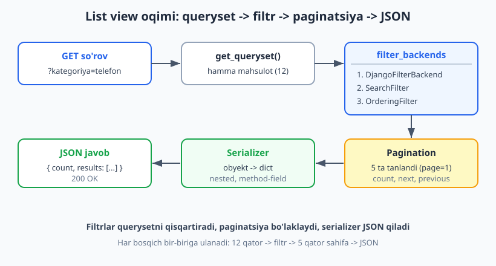
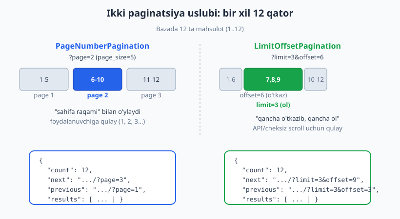
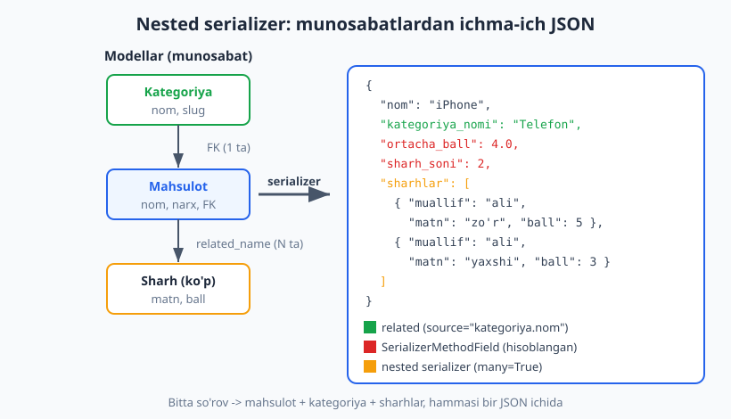

# 18 — DRF filtrlash, paginatsiya, nested

[⬅️ Oldingi: 17 — DRF autentifikatsiya (Token, JWT)](./17-drf-auth.md) · [🏠 README](./README.md) · [Keyingi: 19 — Signallar va custom mantiq ➡️](./19-signals-custom.md)

---

> **Bu bobda:** API'ni "ishlaydigan" darajadan "kasbiy" darajaga ko'taramiz. Hozircha bizning `GET /api/mahsulotlar/` butun jadvalni qaytaradi — 10 000 qator bo'lsa ham. Bu sekin, og'ir va mobil ilovani o'ldiradi. Yechim uch qism: **filtrlash** (foydalanuvchi kerakli qatorlarni so'rasin), **paginatsiya** (javobni bo'lakka bo'lish) va **nested** (bog'liq ma'lumotni bir so'rovda berish). `django-filter`ni o'rnatib `DjangoFilterBackend` va `FilterSet` yozamiz; DRF'ning o'zidagi `SearchFilter` (matn qidiruv) va `OrderingFilter` (saralash) ni ulaymiz. Keyin `PageNumberPagination` va `LimitOffsetPagination`ni sozlaymiz — global va har-view. So'ng serializerlarni chuqurlashtiramiz: `nested serializer` (`many=True`), `SerializerMethodField` (hisoblangan maydon), `source=` orqali related ma'lumotni ko'rsatish, `StringRelatedField` / `SlugRelatedField` / `PrimaryKeyRelatedField` farqlari, va `select_related` + `prefetch_related` bilan N+1 muammosini oldini olish. Oxirida writable nested (POST bilan birga bog'liq obyekt yaratish). Hamma kod Django 6.0.6 da haqiqatan ishga tushirib tekshirilgan.

---

## Muammo: butun jadvalni qaytarish

17-bobda biz `ModelViewSet` yozib, autentifikatsiya qo'shdik. Endi `GET /api/mahsulotlar/` so'rov yuborsangiz, view **bazadagi hamma mahsulotni** JSON qilib qaytaradi. Bu uchta jiddiy muammo tug'diradi:

1. **Tezlik.** 50 000 mahsulot bor do'kon API'si har so'rovda 50 000 qatorni bazadan o'qib, JSON qilib, tarmoqdan uzatadi. Sekin.
2. **Xotira.** Server bir vaqtda hamma obyektni RAM'ga yuklaydi.
3. **Foydasizlik.** Mobil ilova ekranda 20 ta mahsulot ko'rsatadi — qolgan 49 980 tasi behuda.

To'g'ri API quyidagicha ishlaydi: mijoz "telefon kategoriyasidagi, narxi 1-2 mln, sharh bo'yicha saralangan, 1-sahifa" deb so'raydi — server faqat shuni qaytaradi. Mana shu uch mexanizm:

- **Filtr** — qaysi qatorlar (`?kategoriya=telefon&narx_min=1000000`)
- **Saralash** — qaysi tartibda (`?ordering=-narx`)
- **Paginatsiya** — qancha va qaysi bo'lak (`?page=2`)



Bu rasm bobning butun "list view" oqimini ko'rsatadi: `get_queryset()` butun querysetni beradi -> filtr backendlar uni qisqartiradi -> paginatsiya bo'lakka ajratadi -> serializer JSON qiladi. Har bosqichni alohida ko'ramiz.

> Eslatma: bu bob 16-17-boblardagi DRF asoslarini (serializer, ViewSet, router) bilishni faraz qiladi. Agar Node.js'dan kelgan bo'lsangiz, bu yerdagi `DjangoFilterBackend` — Express'da har route'da qo'lda yozadigan `WHERE` shartlaringizni deklarativ qiladi ([Node.js solishtirish](../nodejs/README.md)). Filtr ostida baribir SQL `WHERE`/`ORDER BY`/`LIMIT` turadi ([SQL qo'llanmasi](../sql/README.md)).

## Boshlang'ich loyiha: do'kon API

Butun bob bo'yicha bitta misol ishlatamiz: oddiy do'kon. Uch model — `Kategoriya`, `Mahsulot`, `Sharh`. Mana modellar:

```python
# shop/models.py
from django.contrib.auth.models import User
from django.db import models


class Kategoriya(models.Model):
    nom = models.CharField(max_length=100)
    slug = models.SlugField(unique=True)

    class Meta:
        ordering = ["nom"]      # paginatsiya uchun MUHIM (pastda tushuntiramiz)

    def __str__(self):
        return self.nom


class Mahsulot(models.Model):
    kategoriya = models.ForeignKey(
        Kategoriya, on_delete=models.CASCADE, related_name="mahsulotlar"
    )
    nom = models.CharField(max_length=200)
    narx = models.DecimalField(max_digits=10, decimal_places=2)
    omborda = models.PositiveIntegerField(default=0)
    faol = models.BooleanField(default=True)
    yaratilgan = models.DateTimeField(auto_now_add=True)

    def __str__(self):
        return self.nom


class Sharh(models.Model):
    mahsulot = models.ForeignKey(
        Mahsulot, on_delete=models.CASCADE, related_name="sharhlar"
    )
    muallif = models.ForeignKey(User, on_delete=models.CASCADE)
    matn = models.TextField()
    ball = models.PositiveSmallIntegerField(default=5)
    yaratilgan = models.DateTimeField(auto_now_add=True)

    def __str__(self):
        return f"{self.mahsulot.nom} - {self.ball}"
```

`related_name="mahsulotlar"` va `related_name="sharhlar"` — bu teskari munosabat nomi ([7-bob: munosabatlar](./07-munosabatlar.md)). Ya'ni `kategoriya.mahsulotlar.all()` va `mahsulot.sharhlar.all()`. Bu nomlar pastda nested serializer'da kalit bo'lib ishlatiladi.

Va boshlang'ich serializer (16-bobdan tanish):

```python
# shop/serializers.py
from rest_framework import serializers
from .models import Mahsulot


class MahsulotSerializer(serializers.ModelSerializer):
    class Meta:
        model = Mahsulot
        fields = ["id", "nom", "narx", "omborda", "faol", "kategoriya"]
```

Bu bobda shu serializer'ni asta-sekin boyitamiz.

## 1-qism: django-filter o'rnatish

Filtrlash uchun `django-filter` paketi — Django va DRF jamoasi tomonidan tavsiya etilgan standart yechim. O'rnatamiz:

```bash
pip install django-filter
```

Bu kitobda `django-filter 25.2` versiyasi ishlatiladi. O'rnatgach, `settings.py` ga ilova sifatida qo'shing va DRF'ga filtr backendini ko'rsating:

```python
# config/settings.py
INSTALLED_APPS = [
    # ...
    "rest_framework",
    "django_filters",      # qo'shildi
    "shop",
]

REST_FRAMEWORK = {
    "DEFAULT_FILTER_BACKENDS": [
        "django_filters.rest_framework.DjangoFilterBackend",
        "rest_framework.filters.SearchFilter",
        "rest_framework.filters.OrderingFilter",
    ],
}
```

`DEFAULT_FILTER_BACKENDS` — bu hamma view'larga avtomatik qo'llanadigan filtrlovchi sloylar ro'yxati. Uchtasini birga qo'ydik: `DjangoFilterBackend` (maydon bo'yicha aniq filtr), `SearchFilter` (matn qidiruv), `OrderingFilter` (saralash). View'da `filterset_fields`, `search_fields`, `ordering_fields` bermasangiz, ular shunchaki ishlamaydi — ya'ni global ro'yxat zararsiz.

> Diqqat: `INSTALLED_APPS`'dagi nom **`django_filters`** (pastki chiziq bilan), lekin paket nomi `django-filter` (chiziqcha bilan). Bu chalkashtiradigan, lekin shunaqa.

## 2-qism: DjangoFilterBackend bilan oddiy filtr

Eng tez yo'l — view'ga `filterset_fields` berish. Hech qanday qo'shimcha klass yozmaysiz:

```python
# shop/views.py
from django_filters.rest_framework import DjangoFilterBackend
from rest_framework import viewsets

from .models import Mahsulot
from .serializers import MahsulotSerializer


class MahsulotViewSet(viewsets.ModelViewSet):
    queryset = Mahsulot.objects.all()
    serializer_class = MahsulotSerializer
    filter_backends = [DjangoFilterBackend]
    filterset_fields = ["kategoriya", "faol"]      # shu maydonlar bo'yicha filtr
```

Endi quyidagi so'rovlar ishlaydi:

```text
GET /api/mahsulotlar/?faol=true
GET /api/mahsulotlar/?kategoriya=1
GET /api/mahsulotlar/?kategoriya=1&faol=true
```

`?kategoriya=1` ortida Django ORM `Mahsulot.objects.filter(kategoriya=1)` ni bajaradi, u esa SQL `WHERE kategoriya_id = 1` ga aylanadi. Ya'ni `filterset_fields` — bu deklarativ usulda "bu maydonlar URL parametri bo'lib filtrlay olsin" deyish.

Bu yondashuv tez, lekin chegaralangan: faqat **aniq tenglik** (`=`) filtr beradi. "Narx 100 dan katta" yoki "nom ichida 'phone' bor" kabi shartlar uchun to'liqroq vositaga — `FilterSet`'ga o'tamiz.

## 3-qism: FilterSet — to'liq nazorat

`FilterSet` — bu forma kabi klass, har atributi bitta filtr maydonini bildiradi. Bu sizga **lookup** (`gte`, `lte`, `icontains`...), maxsus URL nomlari va hatto custom metod berish imkonini beradi. `shop/filters.py` faylida yozamiz:

```python
# shop/filters.py
import django_filters
from .models import Mahsulot


class MahsulotFilter(django_filters.FilterSet):
    # narx_min=300  ->  narx >= 300
    narx_min = django_filters.NumberFilter(field_name="narx", lookup_expr="gte")
    # narx_max=400  ->  narx <= 400
    narx_max = django_filters.NumberFilter(field_name="narx", lookup_expr="lte")
    # nom=phone  ->  nom ICHIDA "phone" (katta-kichik harf farqsiz)
    nom = django_filters.CharFilter(field_name="nom", lookup_expr="icontains")
    # kategoriya=telefon  ->  kategoriya.slug = "telefon"  (id emas, slug bo'yicha)
    kategoriya = django_filters.CharFilter(
        field_name="kategoriya__slug", lookup_expr="exact"
    )
    # custom metodli filtr: omborda_bor=true / false
    omborda_bor = django_filters.BooleanFilter(
        field_name="omborda", method="filter_omborda_bor"
    )

    class Meta:
        model = Mahsulot
        fields = ["faol", "kategoriya", "narx_min", "narx_max", "nom"]

    def filter_omborda_bor(self, queryset, name, value):
        if value:
            return queryset.filter(omborda__gt=0)     # ombor > 0
        return queryset.filter(omborda=0)             # tugagan
```

Muhim tafsilotlar:

- **`field_name`** — modeldagi haqiqiy maydon (yoki `kategoriya__slug` kabi munosabat bo'ylab yo'l).
- **`lookup_expr`** — taqqoslash turi: `gte` (>=), `lte` (<=), `icontains` (ichida, harf farqsiz), `exact` (=). Bular ORM lookup'lari ([6-bob](./06-orm-queryset.md)).
- URL parametri nomi atribut nomidan keladi: `narx_min` atributi `?narx_min=300` URL'ini beradi.
- **`method=`** bilan o'z funksiyangizni ulaysiz — har qanday murakkab mantiq uchun (`omborda_bor` misolida).

View'ga `filterset_class` qilib ulaymiz (`filterset_fields` o'rniga):

```python
# shop/views.py
from django_filters.rest_framework import DjangoFilterBackend
from rest_framework import viewsets

from .filters import MahsulotFilter
from .models import Mahsulot
from .serializers import MahsulotSerializer


class MahsulotViewSet(viewsets.ModelViewSet):
    queryset = Mahsulot.objects.all()
    serializer_class = MahsulotSerializer
    filter_backends = [DjangoFilterBackend]
    filterset_class = MahsulotFilter      # filterset_fields o'rniga
```

Endi bu so'rovlar ishlaydi:

```text
GET /api/mahsulotlar/?narx_min=300&narx_max=400
GET /api/mahsulotlar/?nom=mahsulot
GET /api/mahsulotlar/?kategoriya=telefon
GET /api/mahsulotlar/?omborda_bor=true
GET /api/mahsulotlar/?faol=false&narx_min=200
```

Bularning hammasi `WHERE` shartlari sifatida birlashadi (AND mantig'i): `?faol=false&narx_min=200` -> `WHERE faol = false AND narx >= 200`.

## 4-qism: SearchFilter — matn qidiruv

`DjangoFilterBackend` aniq maydonlar uchun. Lekin "qidiruv qutisi" — foydalanuvchi bir so'z yozsa, u **bir nechta maydonda** qidirilsin — uchun DRF'ning `SearchFilter`'i bor. View'da `search_fields` bering:

```python
# shop/views.py (qo'shilgan qismlar)
from rest_framework import filters

class MahsulotViewSet(viewsets.ModelViewSet):
    # ... yuqoridagidek ...
    filter_backends = [DjangoFilterBackend, filters.SearchFilter]
    filterset_class = MahsulotFilter
    search_fields = ["nom", "kategoriya__nom"]    # ikkala maydonda qidiradi
```

Endi:

```text
GET /api/mahsulotlar/?search=telefon
```

Bu `nom` YOKI `kategoriya__nom` ichida "telefon" bo'lgan qatorlarni qaytaradi (OR mantig'i, harf farqsiz). `search` parametri nomini `SEARCH_PARAM` sozlamasi bilan o'zgartirish mumkin.

`search_fields` da prefiks qo'yib qidiruv turini boshqarasiz:

| Prefiks | Ma'no | SQL |
|---|---|---|
| `nom` | ichida (icontains) | `LIKE '%...%'` |
| `^nom` | bilan boshlanadi | `LIKE '...%'` |
| `=nom` | aniq tenglik | `= '...'` |
| `@nom` | full-text qidiruv (PostgreSQL) | `to_tsvector` |
| `$nom` | regex | `REGEXP` |

```python
search_fields = ["^nom", "=kategoriya__slug"]   # nom bilan boshlanadi, slug aniq
```

> Eslatma: `@` (full-text) faqat PostgreSQL'da ishlaydi. Bu kitobda RUN qilish uchun SQLite ishlatamiz, shuning uchun `@` ni tekshirmadik — kod to'g'ri, lekin SQLite muhitida sinab ko'rilmadi.

## 5-qism: OrderingFilter — saralash

Saralash uchun `OrderingFilter`. `ordering_fields` — foydalanuvchi qaysi maydonlar bo'yicha saralashga ruxsat berilgan:

```python
# shop/views.py
class MahsulotViewSet(viewsets.ModelViewSet):
    # ...
    filter_backends = [DjangoFilterBackend, filters.SearchFilter, filters.OrderingFilter]
    filterset_class = MahsulotFilter
    search_fields = ["nom", "kategoriya__nom"]
    ordering_fields = ["narx", "yaratilgan", "nom"]   # ruxsat etilgan
    ordering = ["-yaratilgan"]                        # standart tartib
```

Foydalanish:

```text
GET /api/mahsulotlar/?ordering=narx       # narx bo'yicha o'suvchi
GET /api/mahsulotlar/?ordering=-narx      # narx bo'yicha kamayuvchi (minus)
GET /api/mahsulotlar/?ordering=narx,nom   # avval narx, keyin nom bo'yicha
```

- **`ordering_fields`** — oq ro'yxat. Foydalanuvchi bu yerda yo'q maydonni so'rasa, e'tiborsiz qoladi (xavfsizlik: hamma maydonni ochmang).
- **`ordering`** — agar foydalanuvchi `?ordering=` bermasa qo'llanadigan standart. Bu yerda `-yaratilgan` (eng yangisi birinchi).
- `ordering_fields = "__all__"` qilsangiz hamma maydon bo'yicha saralashga ruxsat — lekin ehtiyot bo'ling (indekssiz maydon sekin bo'ladi).

## To'liq view va birinchi natija

Hamma uchta backend bilan to'liq view (bu biz haqiqatan RUN qilgan kod):

```python
# shop/views.py
from django_filters.rest_framework import DjangoFilterBackend
from rest_framework import filters, viewsets

from .filters import MahsulotFilter
from .models import Mahsulot
from .serializers import MahsulotSerializer


class MahsulotViewSet(viewsets.ModelViewSet):
    queryset = Mahsulot.objects.select_related("kategoriya").prefetch_related(
        "sharhlar__muallif"
    )
    serializer_class = MahsulotSerializer
    filter_backends = [DjangoFilterBackend, filters.SearchFilter, filters.OrderingFilter]
    filterset_class = MahsulotFilter
    search_fields = ["nom", "kategoriya__nom"]
    ordering_fields = ["narx", "yaratilgan", "nom"]
    ordering = ["-yaratilgan"]
```

(`select_related` / `prefetch_related` nima qilishini 9-qismda tushuntiramiz — N+1 oldini olish uchun.)

`GET /api/mahsulotlar/?narx_min=300&narx_max=400` so'rovi quyidagicha javob qaytaradi (12 ta test mahsulotdan narxi 300-400 oralig'idagi 3 tasi, standart `-yaratilgan` tartibida):

```json
{
  "count": 3,
  "next": null,
  "previous": null,
  "results": [
    { "nom": "Mahsulot 6", "narx": "400.00", "faol": true },
    { "nom": "Mahsulot 5", "narx": "350.00", "faol": false },
    { "nom": "Mahsulot 4", "narx": "300.00", "faol": true }
  ]
}
```

(`results` ichidagi maydonlar nested serializer qo'shgach kengayadi — pastda.) `count`, `next`, `previous` — bu paginatsiya qo'shgan kalitlar. Endi paginatsiyaga o'tamiz.

## 6-qism: PageNumberPagination

Paginatsiya — javobni "sahifalarga" bo'lish. DRF ikki asosiy uslub beradi. Birinchisi — **PageNumberPagination**: foydalanuvchi sahifa raqamini beradi (`?page=2`).

Eng oddiy yo'l — global sozlash. Hamma view'ga qo'llanadi:

```python
# config/settings.py
REST_FRAMEWORK = {
    "DEFAULT_FILTER_BACKENDS": [
        "django_filters.rest_framework.DjangoFilterBackend",
        "rest_framework.filters.SearchFilter",
        "rest_framework.filters.OrderingFilter",
    ],
    "DEFAULT_PAGINATION_CLASS":
        "rest_framework.pagination.PageNumberPagination",
    "PAGE_SIZE": 5,        # har sahifada 5 ta (bu bo'lmasa paginatsiya o'chiq)
}
```

`PAGE_SIZE` berilmasa, `PageNumberPagination` umuman ishlamaydi (hamma narsa bitta sahifada qaytadi). Endi 12 mahsulotli baza `GET /api/mahsulotlar/?ordering=narx&page=1` ga shunday javob beradi:

```json
{
  "count": 12,
  "next": "http://testserver/api/mahsulotlar/?ordering=narx&page=2",
  "previous": null,
  "results": [
    { "nom": "Mahsulot 0", "narx": "100.00" },
    { "nom": "Mahsulot 1", "narx": "150.00" },
    { "nom": "Mahsulot 2", "narx": "200.00" },
    { "nom": "Mahsulot 3", "narx": "250.00" },
    { "nom": "Mahsulot 4", "narx": "300.00" }
  ]
}
```

- **`count`** — filtrlangandan keyin jami nechta qator bor (12).
- **`next` / `previous`** — keyingi/oldingi sahifa to'liq URL'i (yoki `null`). Mijoz shu URL'ni bosadi — sahifa raqamini o'zi hisoblamaydi. Filtr parametrlari (`ordering=narx`) URL'da saqlanadi.
- **`results`** — joriy sahifa obyektlari (5 ta).

### Custom PageNumberPagination

Ko'pincha standart javob shaklini o'zgartirmoqchi bo'lasiz — kalit nomlarini o'zbekchaga, yoki `page_size` ni URL'dan boshqarish. Buning uchun klass yozamiz:

```python
# shop/pagination.py
from rest_framework.pagination import PageNumberPagination
from rest_framework.response import Response


class KengPagination(PageNumberPagination):
    page_size = 3                       # standart sahifa hajmi
    page_size_query_param = "size"      # ?size=10 bilan mijoz o'zgartira oladi

    def get_paginated_response(self, data):
        return Response({
            "jami": self.page.paginator.count,
            "sahifalar": self.page.paginator.num_pages,
            "joriy": self.page.number,
            "keyingi": self.get_next_link(),
            "oldingi": self.get_previous_link(),
            "natijalar": data,
        })
```

- **`page_size_query_param = "size"`** — endi `?size=10` mijozga sahifa hajmini boshqarish imkonini beradi.
- **`max_page_size`** (qo'shimcha) — mijoz juda katta son so'ramasin uchun yuqori chegara. Buni qo'yish tavsiya etiladi: `max_page_size = 100`.
- **`get_paginated_response`** ni override qilib javob shaklini to'liq o'zgartirdik.

Bu klassni faqat bitta view'ga ulaymiz (global o'rniga):

```python
# shop/views.py
from .pagination import KengPagination

class KategoriyaViewSet(viewsets.ModelViewSet):
    queryset = Kategoriya.objects.all()
    serializer_class = KategoriyaSerializer
    pagination_class = KengPagination       # faqat shu view uchun
```

`GET /api/kategoriyalar/` javobi (haqiqiy natija):

```json
{
  "jami": 2,
  "sahifalar": 1,
  "joriy": 1,
  "keyingi": null,
  "oldingi": null,
  "natijalar": [
    { "id": 2, "nom": "Noutbuk", "slug": "noutbuk", "mahsulot_soni": 6 },
    { "id": 1, "nom": "Telefon", "slug": "telefon", "mahsulot_soni": 6 }
  ]
}
```

### MUHIM tuzoq: tartiblanmagan queryset

Paginatsiyada **eng ko'p uchraydigan xato** — querysetni tartiblamaslik. Agar model `Meta.ordering` yoki view `ordering` bermasa, Django bu ogohlantirishni beradi:

```text
UnorderedObjectListWarning: Pagination may yield inconsistent results
with an unordered object_list
```

Nega? Tartibsiz queryset'da SQL har safar qatorlarni boshqa tartibda qaytarishi mumkin. U holda 1-sahifadagi qator 2-sahifada ham chiqib qolishi, yoki umuman tushib qolishi mumkin. **Doim** paginatsiya qilinadigan querysetni tartiblang: model `Meta.ordering` orqali yoki view `ordering` orqali. Biz `Kategoriya.Meta.ordering = ["nom"]` qo'ygandik — shuning uchun ogohlantirish yo'q.

## 7-qism: LimitOffsetPagination

Ikkinchi uslub — **LimitOffsetPagination**. Bu yerda sahifa raqami emas, "qancha o'tkazib (offset), qancha ol (limit)" deysiz. Bu cheksiz scroll (infinite scroll) va ko'p API'lar uchun qulay.



Rasm ikki uslubni bir xil 12 qatorda solishtiradi. `?page=2&page_size=5` -> 6-10-qatorlar; `?limit=3&offset=6` -> 7-8-9 qatorlar. Klass:

```python
# shop/pagination.py
from rest_framework.pagination import LimitOffsetPagination


class LimitPagination(LimitOffsetPagination):
    default_limit = 5      # ?limit berilmasa
    max_limit = 50         # mijoz 50 dan ko'p so'rolmaydi
```

```python
# shop/views.py
class MahsulotViewSet(viewsets.ModelViewSet):
    # ...
    pagination_class = LimitPagination
```

```text
GET /api/mahsulotlar/?limit=3&offset=6
```

Javob (12 qatorli bazada):

```json
{
  "count": 12,
  "next": "http://testserver/api/mahsulotlar/?limit=3&offset=9",
  "previous": "http://testserver/api/mahsulotlar/?limit=3&offset=3",
  "results": [ "...7-, 8-, 9-qatorlar..." ]
}
```

| | PageNumberPagination | LimitOffsetPagination |
|---|---|---|
| URL parametri | `?page=2&page_size=5` | `?limit=3&offset=6` |
| Fikrlash | "2-sahifa" | "6 tani o'tkaz, 3 tasini ol" |
| Qachon | Sahifali UI (1, 2, 3...) | Cheksiz scroll, API integratsiya |
| Standart sozlama | `PAGE_SIZE` | `default_limit` |

Uchinchi uslub ham bor — **CursorPagination** (yashirin kursor bilan, juda katta jadval va real-time uchun eng barqaror), lekin u alohida mavzu; asoslar shu ikkisi.

## 8-qism: nested serializer va SerializerMethodField

Endi serializer tarafiga o'tamiz. Hozircha `MahsulotSerializer` faqat `kategoriya` ni **raqam** (FK id) sifatida qaytaradi:

```json
{ "nom": "iPhone", "kategoriya": 1 }
```

Lekin mijozga ko'pincha kategoriya **nomi** kerak, ID emas. Va mahsulotning **sharhlari** ham bir so'rovda kelsa yaxshi (har sharh uchun alohida so'rov yubormaslik uchun). Bu yerda uch vosita ishlaydi:



Rasmdagi rangli legenda uch xil maydonni ko'rsatadi: yashil — related (`source=`), qizil — hisoblangan (`SerializerMethodField`), sariq — nested (`many=True`). Mana to'liq, RUN qilingan serializer:

```python
# shop/serializers.py
from rest_framework import serializers
from .models import Kategoriya, Mahsulot, Sharh


class SharhSerializer(serializers.ModelSerializer):
    muallif = serializers.StringRelatedField(read_only=True)

    class Meta:
        model = Sharh
        fields = ["id", "muallif", "matn", "ball", "yaratilgan"]


class MahsulotSerializer(serializers.ModelSerializer):
    # 1) NESTED: bog'liq sharhlarni to'liq obyekt sifatida
    sharhlar = SharhSerializer(many=True, read_only=True)
    # 2) RELATED: kategoriya nomini matn sifatida (source bilan)
    kategoriya_nomi = serializers.CharField(source="kategoriya.nom", read_only=True)
    # 3) METHOD-FIELD: hisoblangan maydonlar
    ortacha_ball = serializers.SerializerMethodField()
    sharh_soni = serializers.SerializerMethodField()

    class Meta:
        model = Mahsulot
        fields = [
            "id", "nom", "narx", "omborda", "faol",
            "kategoriya", "kategoriya_nomi",
            "ortacha_ball", "sharh_soni", "sharhlar",
        ]

    def get_ortacha_ball(self, obj):
        ballar = [s.ball for s in obj.sharhlar.all()]
        if not ballar:
            return None
        return round(sum(ballar) / len(ballar), 1)

    def get_sharh_soni(self, obj):
        return obj.sharhlar.count()
```

Uchta texnikani alohida ko'ramiz:

**1) Nested serializer (`many=True`).** `sharhlar = SharhSerializer(many=True, read_only=True)`. Atribut nomi (`sharhlar`) model'dagi `related_name` bilan bir xil — DRF shu munosabatni topadi. `many=True` chunki bitta mahsulotda ko'p sharh bor. Natijada JSON ichida sharhlar massivi paydo bo'ladi.

**2) Related ma'lumot (`source=`).** `serializers.CharField(source="kategoriya.nom")`. Bu DRF'ga "bu maydon qiymatini `obj.kategoriya.nom` dan ol" deydi. Nuqta orqali munosabat bo'ylab yurish mumkin. `read_only=True` chunki bu faqat o'qish uchun.

**3) `SerializerMethodField`.** Bu maydon qiymati model'dan emas, sizning **metod**ingizdan keladi. Qoida: maydon nomi `xyz` bo'lsa, metod nomi `get_xyz` bo'lishi shart. `obj` — joriy obyekt. Bu yerda o'rtacha ball va sharh sonini hisoblaymiz. `SerializerMethodField` doim **faqat o'qish uchun**.

Bu serializer bilan `GET /api/mahsulotlar/?ordering=narx` birinchi obyekti (haqiqiy natija):

```json
{
  "id": 1,
  "nom": "Mahsulot 0",
  "narx": "100.00",
  "omborda": 1,
  "faol": true,
  "kategoriya": 1,
  "kategoriya_nomi": "Telefon",
  "ortacha_ball": 4.0,
  "sharh_soni": 2,
  "sharhlar": [
    { "id": 1, "muallif": "ali", "matn": "zo'r telefon", "ball": 5, "yaratilgan": "2026-06-13T07:08:46Z" },
    { "id": 2, "muallif": "ali", "matn": "yaxshi", "ball": 3, "yaratilgan": "2026-06-13T07:08:46Z" }
  ]
}
```

Bitta so'rov — mahsulot, kategoriya nomi, hisoblangan ball, va to'liq sharhlar ro'yxati. `ortacha_ball: 4.0` = (5+3)/2. `muallif: "ali"` — `StringRelatedField` `User.__str__()` ni chaqiradi (ya'ni username).

## 9-qism: related maydon turlari va N+1 muammosi

`SharhSerializer` da `muallif` uchun `StringRelatedField` ishlatdik. DRF FK'ni JSON'da ko'rsatishning bir nechta yo'lini beradi:

```python
# Bir xil FK (kategoriya), turli ko'rinishlar:
class S(serializers.ModelSerializer):
    kat_pk = serializers.PrimaryKeyRelatedField(source="kategoriya", read_only=True)
    kat_str = serializers.StringRelatedField(source="kategoriya")
    kat_slug = serializers.SlugRelatedField(
        source="kategoriya", slug_field="slug", read_only=True)

    class Meta:
        model = Mahsulot
        fields = ["nom", "kat_pk", "kat_str", "kat_slug"]
```

Bu serializer chiqishi (haqiqiy natija):

```json
{ "nom": "iPhone", "kat_pk": 3, "kat_str": "Telefon", "kat_slug": "telefon" }
```

| Maydon turi | Nima qaytaradi | Qachon |
|---|---|---|
| `PrimaryKeyRelatedField` | bog'liq obyekt ID'si (`3`) | mijoz ID bilan ishlasa |
| `StringRelatedField` | `__str__()` natijasi (`"Telefon"`) | tez, o'qiladigan |
| `SlugRelatedField` | berilgan maydon (`slug`) | barqaror, o'qiladigan kalit |
| `HyperlinkedRelatedField` | bog'liq obyekt URL'i | HATEOAS uslubi |
| nested serializer | to'liq ichma-ich obyekt | hamma maydon kerak bo'lsa |

### N+1 muammosi — diqqat!

Nested serializer va related maydon **xavfli** bo'lishi mumkin. `MahsulotViewSet` 50 ta mahsulot qaytarsa, har biri uchun `kategoriya` va `sharhlar` ga murojaat qiladi. Agar ehtiyot bo'lmasangiz, ORM har mahsulot uchun alohida SQL so'rov yuboradi: 1 (mahsulotlar) + 50 (kategoriyalar) + 50 (sharhlar) = **101 so'rov**. Bu N+1 muammosi ([9-bob: ilg'or ORM](./09-ilgor-orm.md)).

Yechim — view querysetida `select_related` (FK uchun, JOIN) va `prefetch_related` (teskari/ManyToMany uchun, alohida so'rov):

```python
queryset = Mahsulot.objects.select_related("kategoriya").prefetch_related(
    "sharhlar__muallif"
)
```

- `select_related("kategoriya")` — kategoriyani JOIN bilan bir so'rovda oladi.
- `prefetch_related("sharhlar__muallif")` — hamma sharhni (va ularning mualliflarini) oldindan bir-ikki so'rovda yuklaydi.

Buni biz `assertNumQueries` testi bilan haqiqatan tekshirdik — 5 mahsulot + sharhlar **4 ta** doimiy so'rovda qaytdi, mahsulot soni o'sgani bilan so'rov soni o'smaydi:

```python
# shop/tests.py
def test_query_count_barqaror(self):
    with self.assertNumQueries(4):       # N+1 yo'q
        r = self.client.get("/api/mahsulotlar/")
        self.assertEqual(len(r.data["results"]), 5)
# python manage.py test  ->  PASS
```

> Qoida: nested serializer yoki `source=` munosabat ishlatsangiz, view querysetida **albatta** mos `select_related`/`prefetch_related` qo'ying. Aks holda API sekinlashadi.

## 10-qism: writable nested — POST bilan birga yaratish

Yuqorida nested serializerlar `read_only=True` edi — faqat o'qish. Lekin "mahsulot va uning birinchi sharhini bitta POST'da yaratish" kabi yozish ham kerak bo'lishi mumkin. Buning uchun DRF `create()` metodini override qilishni talab qiladi (DRF avtomatik nested yozishni qo'llab-quvvatlamaydi — bu ataylab, chunki mantiq turlicha bo'lishi mumkin):

```python
# writable nested serializer
class YozSharhSerializer(serializers.ModelSerializer):
    class Meta:
        model = Sharh
        fields = ["matn", "ball"]


class YozMahsulotSerializer(serializers.ModelSerializer):
    sharhlar = YozSharhSerializer(many=True)      # read_only EMAS

    class Meta:
        model = Mahsulot
        fields = ["nom", "narx", "omborda", "kategoriya", "sharhlar"]

    def create(self, validated_data):
        sharhlar_data = validated_data.pop("sharhlar")     # nested qismni ajrat
        muallif = self.context["request"].user             # joriy foydalanuvchi
        mahsulot = Mahsulot.objects.create(**validated_data)
        for s in sharhlar_data:
            Sharh.objects.create(mahsulot=mahsulot, muallif=muallif, **s)
        return mahsulot
```

POST tanasi:

```json
{
  "nom": "Yangi", "narx": "99.00", "omborda": 5, "kategoriya": 1,
  "sharhlar": [
    { "matn": "zo'r", "ball": 5 },
    { "matn": "yaxshi", "ball": 4 }
  ]
}
```

Bu bitta so'rovda 1 mahsulot + 2 sharh yaratadi. Biz buni test bilan tasdiqladik: `is_valid()` -> `save()` -> `Mahsulot.objects.count() == 1`, `Sharh.objects.count() == 2`. **Eslatma:** real loyihada bunday ko'p-obyekt yaratishni `transaction.atomic()` ichiga oling ([9-bob: atomic](./09-ilgor-orm.md)) — yarmida xato bo'lsa, hech nima saqlanmasin.

## Hammasi birga: yakuniy view

Mana to'liq, filtr + qidiruv + saralash + paginatsiya + nested serializer ulangan, RUN qilingan view:

```python
# shop/views.py
from django_filters.rest_framework import DjangoFilterBackend
from rest_framework import filters, viewsets

from .filters import MahsulotFilter
from .models import Kategoriya, Mahsulot
from .pagination import KengPagination
from .serializers import KategoriyaSerializer, MahsulotSerializer


class MahsulotViewSet(viewsets.ModelViewSet):
    queryset = Mahsulot.objects.select_related("kategoriya").prefetch_related(
        "sharhlar__muallif"
    )
    serializer_class = MahsulotSerializer
    filter_backends = [DjangoFilterBackend, filters.SearchFilter, filters.OrderingFilter]
    filterset_class = MahsulotFilter
    search_fields = ["nom", "kategoriya__nom"]
    ordering_fields = ["narx", "yaratilgan", "nom"]
    ordering = ["-yaratilgan"]


class KategoriyaViewSet(viewsets.ModelViewSet):
    queryset = Kategoriya.objects.all()
    serializer_class = KategoriyaSerializer
    pagination_class = KengPagination
```

Endi mijoz shunday qudratli so'rov yubora oladi:

```text
GET /api/mahsulotlar/?kategoriya=telefon&narx_min=100&search=mahsulot&ordering=-narx&page=1
```

"telefon kategoriyasidagi, narxi >= 100, 'mahsulot' so'zi bo'lgan, narx bo'yicha kamayuvchi, 1-sahifa". Bularning hammasi bir-biri bilan zanjir bo'lib ishlaydi — siz faqat deklarativ konfiguratsiya yozdingiz.

## Xulosa

- **Filtrlash** uchun `django-filter`: oddiy holatda `filterset_fields`, to'liq nazorat uchun `FilterSet` klass (`lookup_expr`, `method=`).
- **`SearchFilter`** — ko'p maydonli matn qidiruv (`search_fields`, prefikslar `^` `=` `@`).
- **`OrderingFilter`** — `ordering_fields` oq ro'yxati va `ordering` standarti bilan saralash.
- **Paginatsiya**: `PageNumberPagination` (`?page=`) sahifali UI uchun; `LimitOffsetPagination` (`?limit=&offset=`) cheksiz scroll uchun. `PAGE_SIZE` shart. Querysetni **doim tartiblang**.
- **Nested serializer** (`many=True`) bog'liq obyektni JSON ichida beradi; **`SerializerMethodField`** hisoblangan maydon (`get_xyz`); **`source=`** related ma'lumotni ko'rsatadi.
- Related ko'rinishlar: `PrimaryKeyRelatedField`, `StringRelatedField`, `SlugRelatedField`, nested.
- **N+1 ni** `select_related` + `prefetch_related` bilan oldini oling — nested ishlatsangiz majburiy.
- **Writable nested** uchun `create()` (va `update()`) ni override qiling.

Keyingi bobda Django'ning signallar tizimini va custom mantiqni o'rganamiz — masalan, mahsulot saqlanganda avtomatik biror ish bajarish.

## Mashqlar

### Oson

1. `django-filter`ni o'rnatib, `INSTALLED_APPS` va `REST_FRAMEWORK["DEFAULT_FILTER_BACKENDS"]` ga to'g'ri qo'shing. `python manage.py check` xatosiz o'tsin.
2. `MahsulotViewSet` ga `filterset_fields = ["faol", "kategoriya"]` qo'shing. `?faol=true` ishlashini tekshiring.
3. Global `PAGE_SIZE = 5` qo'ying. `GET /api/mahsulotlar/` javobida `count`, `next`, `previous`, `results` kalitlari borligini tekshiring.
4. `MahsulotSerializer` ga `kategoriya_nomi = serializers.CharField(source="kategoriya.nom", read_only=True)` qo'shing va `fields` ga kiriting.
5. `search_fields = ["nom"]` qo'shib, `?search=phone` qaysi SQL `LIKE` ga aylanishini izohlang (1-2 jumla).
6. `ordering_fields = ["narx"]` va `ordering = ["narx"]` qo'shing. `?ordering=-narx` natijada kamayuvchi tartibni bersin.

### O'rta

7. `MahsulotFilter` (FilterSet) yozing: `narx_min` (gte), `narx_max` (lte), `nom` (icontains). View'ga `filterset_class` qilib ulang.
8. `FilterSet` da `method=` ishlatgan `omborda_bor` (BooleanFilter) yozing: `true` -> `omborda > 0`, `false` -> `omborda == 0`.
9. `SharhSerializer` yozing (`muallif` ni `StringRelatedField`) va `MahsulotSerializer` ga `sharhlar = SharhSerializer(many=True, read_only=True)` nested qo'shing.
10. `SerializerMethodField` bilan `sharh_soni` va `ortacha_ball` maydonlarini qo'shing (`get_sharh_soni`, `get_ortacha_ball`).
11. `KengPagination(PageNumberPagination)` yozing: `page_size=3`, `page_size_query_param="size"`, `max_page_size=50`, va `get_paginated_response` ni o'zbekcha kalitlar bilan override qiling.
12. `LimitPagination(LimitOffsetPagination)` yozib bitta view'ga ulang. `?limit=3&offset=6` 3 ta obyekt qaytarishini tekshiring.

### Qiyin

13. `assertNumQueries` ishlatib test yozing: nested serializerli `MahsulotViewSet` `select_related`+`prefetch_related` bilan **doimiy** sonli so'rov qilishini (mahsulot soniga bog'liq emasligini) isbotlang.
14. Writable nested serializer yozing: bitta POST bilan `Mahsulot` va uning bir nechta `Sharh`ini yarating (`create()` override). `transaction.atomic()` ga o'rang.
15. `UnorderedObjectListWarning` ni ataylab keltirib chiqaring (tartibsiz queryset + paginatsiya), keyin `Meta.ordering` qo'shib yo'qoting. Nega bu ogohlantirish xavfli ekanini tushuntiring.
16. Custom `FilterSet` metod yozing: `?ball_min=4` parametri — o'rtacha ball >= 4 bo'lgan mahsulotlarnigina qaytarsin (`annotate(Avg("sharhlar__ball"))` bilan).

<details markdown="1">
<summary>Yechimlar</summary>

**1.**
```python
# config/settings.py
INSTALLED_APPS = [
    # ...
    "rest_framework",
    "django_filters",
    "shop",
]
REST_FRAMEWORK = {
    "DEFAULT_FILTER_BACKENDS": [
        "django_filters.rest_framework.DjangoFilterBackend",
        "rest_framework.filters.SearchFilter",
        "rest_framework.filters.OrderingFilter",
    ],
}
# python manage.py check  ->  System check identified no issues
```

**2.**
```python
# shop/views.py
from django_filters.rest_framework import DjangoFilterBackend

class MahsulotViewSet(viewsets.ModelViewSet):
    queryset = Mahsulot.objects.all()
    serializer_class = MahsulotSerializer
    filter_backends = [DjangoFilterBackend]
    filterset_fields = ["faol", "kategoriya"]
# GET /api/mahsulotlar/?faol=true  ->  faqat faol=True mahsulotlar
```

**3.**
```python
# config/settings.py
REST_FRAMEWORK = {
    # ...
    "DEFAULT_PAGINATION_CLASS": "rest_framework.pagination.PageNumberPagination",
    "PAGE_SIZE": 5,
}
# GET /api/mahsulotlar/  ->  { "count": ..., "next": ..., "previous": ..., "results": [...] }
```

**4.**
```python
class MahsulotSerializer(serializers.ModelSerializer):
    kategoriya_nomi = serializers.CharField(source="kategoriya.nom", read_only=True)

    class Meta:
        model = Mahsulot
        fields = ["id", "nom", "narx", "kategoriya", "kategoriya_nomi"]
# JSON: { ..., "kategoriya": 1, "kategoriya_nomi": "Telefon" }
```

**5.**
```python
search_fields = ["nom"]
# ?search=phone  ->  SQL:  WHERE nom LIKE '%phone%'  (harf farqsiz: icontains)
# SearchFilter standart holatda har search_field uchun icontains qo'llaydi.
```

**6.**
```python
from rest_framework import filters

class MahsulotViewSet(viewsets.ModelViewSet):
    queryset = Mahsulot.objects.all()
    serializer_class = MahsulotSerializer
    filter_backends = [filters.OrderingFilter]
    ordering_fields = ["narx"]
    ordering = ["narx"]
# GET /api/mahsulotlar/?ordering=-narx  ->  narx bo'yicha kamayuvchi
```

**7.**
```python
# shop/filters.py
import django_filters
from .models import Mahsulot

class MahsulotFilter(django_filters.FilterSet):
    narx_min = django_filters.NumberFilter(field_name="narx", lookup_expr="gte")
    narx_max = django_filters.NumberFilter(field_name="narx", lookup_expr="lte")
    nom = django_filters.CharFilter(field_name="nom", lookup_expr="icontains")

    class Meta:
        model = Mahsulot
        fields = ["narx_min", "narx_max", "nom"]

# shop/views.py
from .filters import MahsulotFilter
class MahsulotViewSet(viewsets.ModelViewSet):
    queryset = Mahsulot.objects.all()
    serializer_class = MahsulotSerializer
    filter_backends = [DjangoFilterBackend]
    filterset_class = MahsulotFilter
# ?narx_min=300&narx_max=400&nom=mahsulot  ->  narx 300..400 va nom ichida "mahsulot"
```

**8.**
```python
class MahsulotFilter(django_filters.FilterSet):
    omborda_bor = django_filters.BooleanFilter(
        field_name="omborda", method="filter_omborda_bor"
    )

    class Meta:
        model = Mahsulot
        fields = ["omborda_bor"]

    def filter_omborda_bor(self, queryset, name, value):
        if value:
            return queryset.filter(omborda__gt=0)
        return queryset.filter(omborda=0)
# ?omborda_bor=true  ->  omborda > 0 ;  ?omborda_bor=false  ->  omborda == 0
```

**9.**
```python
class SharhSerializer(serializers.ModelSerializer):
    muallif = serializers.StringRelatedField(read_only=True)

    class Meta:
        model = Sharh
        fields = ["id", "muallif", "matn", "ball"]


class MahsulotSerializer(serializers.ModelSerializer):
    sharhlar = SharhSerializer(many=True, read_only=True)

    class Meta:
        model = Mahsulot
        fields = ["id", "nom", "narx", "sharhlar"]
# JSON ichida "sharhlar": [ { "muallif": "ali", "matn": "...", "ball": 5 }, ... ]
```

**10.**
```python
class MahsulotSerializer(serializers.ModelSerializer):
    sharhlar = SharhSerializer(many=True, read_only=True)
    sharh_soni = serializers.SerializerMethodField()
    ortacha_ball = serializers.SerializerMethodField()

    class Meta:
        model = Mahsulot
        fields = ["id", "nom", "sharh_soni", "ortacha_ball", "sharhlar"]

    def get_sharh_soni(self, obj):
        return obj.sharhlar.count()

    def get_ortacha_ball(self, obj):
        ballar = [s.ball for s in obj.sharhlar.all()]
        return round(sum(ballar) / len(ballar), 1) if ballar else None
```

**11.**
```python
# shop/pagination.py
from rest_framework.pagination import PageNumberPagination
from rest_framework.response import Response

class KengPagination(PageNumberPagination):
    page_size = 3
    page_size_query_param = "size"
    max_page_size = 50

    def get_paginated_response(self, data):
        return Response({
            "jami": self.page.paginator.count,
            "sahifalar": self.page.paginator.num_pages,
            "joriy": self.page.number,
            "keyingi": self.get_next_link(),
            "oldingi": self.get_previous_link(),
            "natijalar": data,
        })
# GET /api/...?size=10  ->  har sahifada 10 ta (max 50)
```

**12.**
```python
# shop/pagination.py
from rest_framework.pagination import LimitOffsetPagination

class LimitPagination(LimitOffsetPagination):
    default_limit = 5
    max_limit = 50

# shop/views.py
class MahsulotViewSet(viewsets.ModelViewSet):
    queryset = Mahsulot.objects.all()
    serializer_class = MahsulotSerializer
    pagination_class = LimitPagination
# GET /api/mahsulotlar/?limit=3&offset=6  ->  results da 3 ta obyekt, count to'liq son
```

**13.**
```python
# shop/tests.py
from decimal import Decimal
from django.contrib.auth.models import User
from rest_framework.test import APITestCase
from .models import Kategoriya, Mahsulot, Sharh

class NplusOneTest(APITestCase):
    @classmethod
    def setUpTestData(cls):
        u = User.objects.create_user("ali", password="x")
        k = Kategoriya.objects.create(nom="K", slug="k")
        for i in range(5):
            m = Mahsulot.objects.create(
                kategoriya=k, nom=f"M{i}", narx=Decimal(10), omborda=1)
            Sharh.objects.create(mahsulot=m, muallif=u, matn="t", ball=4)

    def test_query_count_barqaror(self):
        # queryset: select_related("kategoriya").prefetch_related("sharhlar__muallif")
        with self.assertNumQueries(4):
            r = self.client.get("/api/mahsulotlar/")
            self.assertEqual(len(r.data["results"]), 5)
# python manage.py test  ->  PASS (4 ta doimiy so'rov; mahsulot soniga bog'liq emas)
```

**14.**
```python
from django.db import transaction
from rest_framework import serializers
from .models import Mahsulot, Sharh

class YozSharhSerializer(serializers.ModelSerializer):
    class Meta:
        model = Sharh
        fields = ["matn", "ball"]

class YozMahsulotSerializer(serializers.ModelSerializer):
    sharhlar = YozSharhSerializer(many=True)

    class Meta:
        model = Mahsulot
        fields = ["nom", "narx", "omborda", "kategoriya", "sharhlar"]

    def create(self, validated_data):
        sharhlar_data = validated_data.pop("sharhlar")
        muallif = self.context["request"].user
        with transaction.atomic():                 # hammasi yoki hech nima
            mahsulot = Mahsulot.objects.create(**validated_data)
            for s in sharhlar_data:
                Sharh.objects.create(mahsulot=mahsulot, muallif=muallif, **s)
        return mahsulot
# Test: ser.is_valid() -> ser.save() -> Mahsulot 1 ta, Sharh 2 ta
```

**15.**
```python
# Ataylab xato: tartibsiz queryset + paginatsiya
class KategoriyaViewSet(viewsets.ModelViewSet):
    queryset = Kategoriya.objects.all()    # ❌ Meta.ordering yo'q bo'lsa
    serializer_class = KategoriyaSerializer
    pagination_class = KengPagination
# -> UnorderedObjectListWarning: Pagination may yield inconsistent results

# Tuzatish: modelga Meta.ordering qo'shamiz
class Kategoriya(models.Model):
    nom = models.CharField(max_length=100)
    slug = models.SlugField(unique=True)
    class Meta:
        ordering = ["nom"]                 # ✅ ogohlantirish yo'qoladi

# NEGA XAVFLI: tartibsiz queryset'da SQL qatorlar tartibini kafolatlamaydi.
# Sahifalar orasida bir qator takrorlanishi yoki tushib qolishi mumkin.
```

**16.**
```python
# shop/filters.py
import django_filters
from django.db.models import Avg
from .models import Mahsulot

class MahsulotFilter(django_filters.FilterSet):
    ball_min = django_filters.NumberFilter(method="filter_ball_min")

    class Meta:
        model = Mahsulot
        fields = ["ball_min"]

    def filter_ball_min(self, queryset, name, value):
        return queryset.annotate(
            ortacha=Avg("sharhlar__ball")
        ).filter(ortacha__gte=value)
# ?ball_min=4  ->  o'rtacha sharh balli >= 4 bo'lgan mahsulotlar
# Eslatma: bunday filtrlangan querysetni saralashda annotate maydonidan foydalaning.
```

</details>

---

[⬅️ Oldingi: 17 — DRF autentifikatsiya (Token, JWT)](./17-drf-auth.md) · [🏠 README](./README.md) · [Keyingi: 19 — Signallar va custom mantiq ➡️](./19-signals-custom.md)
