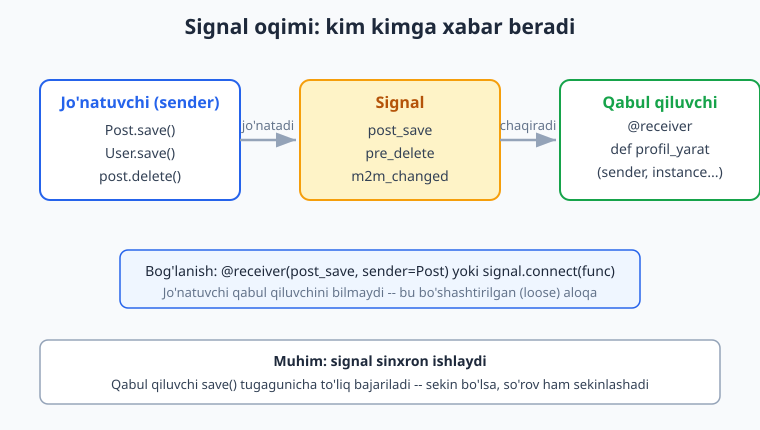
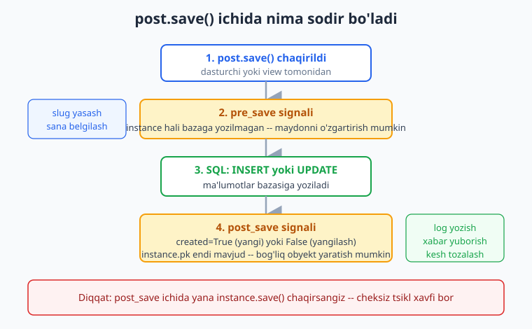
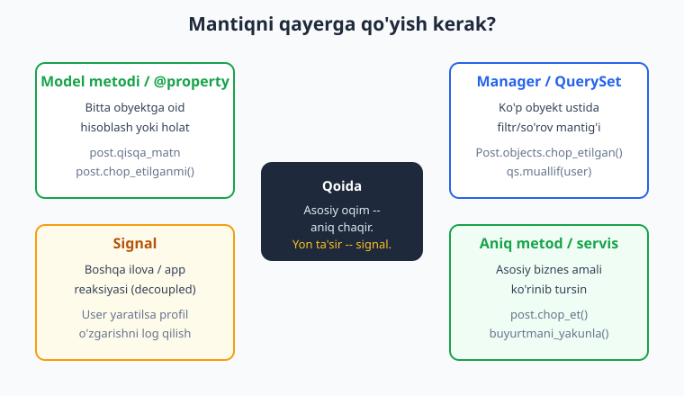

# 19 — Signallar va custom mantiq

[⬅️ Oldingi: 18 — DRF filtrlash, paginatsiya, nested](./18-drf-filtering-pagination.md) · [🏠 README](./README.md) · [Keyingi: 20 — Keshlash va performance ➡️](./20-caching-performance.md)

---

> **Bu bobda:** Django'ning eng "sehrli" ko'ringan, lekin aslida juda oddiy mexanizmi — **signallar** bilan tanishamiz. Signal — bu "biror narsa sodir bo'lganda menga xabar ber" degan obuna tizimi. `pre_save`, `post_save`, `pre_delete` va `m2m_changed` signallarini batafsil o'rganamiz; `@receiver` dekoratori bilan qabul qiluvchi (receiver) funksiya yozamiz; `created`, `update_fields`, `pk_set` kabi argumentlardan to'g'ri foydalanamiz; cheksiz tsikl (infinite loop) tuzog'idan qochamiz. Eng muhimi — **qachon signal ishlatish kerak va qachon kerak emas** degan savolga aniq javob beramiz (ko'pchilik signalni keragidan ko'p ishlatadi). Keyin signalga muqobil — toza, ochiq mantiq: **custom model metodlari va `@property`**, **custom `Manager` va `QuerySet`** (so'rov mantig'ini bitta joyga yig'ish, `as_manager()` va `from_queryset()` qisqa yo'llari). Va nihoyat — signallarni qayerda ulash kerak: `AppConfig.ready()`. O'zingizning **custom signal**ingizni ham yasab, `Signal()` va `send()` bilan ishlatamiz. Bu bob Python'ni bilishni nazarda tutadi ([Python qo'llanma](../python/README.md)). Hamma kod Django 6.0.6, Python 3.14 da haqiqatan ishga tushirib tekshirilgan.

---

## Signal nima va nega kerak?

Tasavvur qiling: yangi foydalanuvchi ro'yxatdan o'tganda unga avtomatik **profil** yaratmoqchisiz. Eng sodda yo'l — `User` yaratadigan har bir joyda qo'lda `Profil.objects.create(...)` yozish. Lekin foydalanuvchi ko'p joyda yaratiladi: ro'yxatdan o'tish formasi, admin panel, `createsuperuser` buyrug'i, test fixture'lari... Har biriga profil yaratish kodini qo'shib chiqasizmi? Bittasini unutsangiz — xato.

Signal aynan shu muammoni yechadi: "**`User` saqlanganda, qayerda saqlanishidan qat'i nazar, menga xabar ber — men profil yarataman**". Bu — *publish/subscribe* (nashr/obuna) naqshi. Django ichidagi modellar (jo'natuvchi) signal *jo'natadi*, sizning funksiyangiz (qabul qiluvchi) unga *obuna bo'ladi*.



Eng muhim tushuncha: **jo'natuvchi qabul qiluvchini bilmaydi**. `User` modeli "kimdir mening saqlanishimni kuzatyaptimi?" deb so'ramaydi — u shunchaki signal chiqaradi. Bu **bo'shashtirilgan aloqa** (loose coupling): bitta app'ni o'zgartirmasdan boshqa app unga reaksiya qo'shishi mumkin. Aynan shu kuch ham, xavf ham — chunki mantiq "ko'rinmas" joyda yashiringan bo'ladi.

Django'da tayyor (built-in) model signallari:

| Signal | Qachon | Asosiy argumentlar |
|--------|--------|--------------------|
| `pre_save` | `save()` da, bazaga yozishdan **oldin** | `instance` |
| `post_save` | bazaga yozilgandan **keyin** | `instance`, `created`, `update_fields` |
| `pre_delete` | `delete()` da, o'chirishdan **oldin** | `instance` |
| `post_delete` | o'chirilgandan **keyin** | `instance` |
| `m2m_changed` | ManyToMany maydon o'zgarganda | `action`, `pk_set`, `reverse` |

> Eslatma: `pre_save`/`post_save` **faqat** `Model.save()` chaqirilganda ishlaydi. `Post.objects.filter(...).update(...)` va `bulk_create()` ularni **chaqirmaydi** — bu bo'limning oxirida muhim ogohlantirish bor.

---

## Birinchi signal: `post_save` bilan profil yaratish

Avval ishlaydigan modellarni yozamiz. Bu bob davomida kichik blog sxemasidan foydalanamiz: `Post`, `Teg`, har bir `User` uchun `Profil`, va o'zgarishlarni yozib boruvchi `AuditLog`.

`shop/models.py`:

```python
from django.conf import settings
from django.db import models
from django.utils import timezone


class Post(models.Model):
    HOLATLAR = [("qoralama", "Qoralama"), ("chop", "Chop etilgan")]
    muallif = models.ForeignKey(
        settings.AUTH_USER_MODEL, on_delete=models.CASCADE, related_name="postlar"
    )
    sarlavha = models.CharField(max_length=200)
    matn = models.TextField(blank=True)
    holat = models.CharField(max_length=10, choices=HOLATLAR, default="qoralama")
    chop_sana = models.DateTimeField(null=True, blank=True)
    soz_soni = models.PositiveIntegerField(default=0, editable=False)
    teglar = models.ManyToManyField("Teg", blank=True, related_name="postlar")
    yaratilgan = models.DateTimeField(auto_now_add=True)

    def __str__(self):
        return self.sarlavha


class Teg(models.Model):
    nom = models.CharField(max_length=50, unique=True)

    def __str__(self):
        return self.nom


class Profil(models.Model):
    user = models.OneToOneField(
        settings.AUTH_USER_MODEL, on_delete=models.CASCADE, related_name="profil"
    )
    bio = models.TextField(blank=True)

    def __str__(self):
        return f"{self.user.username} profili"


class AuditLog(models.Model):
    xabar = models.CharField(max_length=255)
    vaqt = models.DateTimeField(auto_now_add=True)

    def __str__(self):
        return self.xabar
```

> `settings.AUTH_USER_MODEL` dan foydalanish — yaxshi odat. To'g'ridan-to'g'ri `from django.contrib.auth.models import User` yozish ham ishlaydi, lekin loyihada custom user model bo'lsa `settings.AUTH_USER_MODEL` moslashuvchan qoladi.

Endi signallarni alohida faylga — `shop/signals.py` ga yozamiz. Nima uchun alohida fayl? Chunki signallarni `models.py` ga yozsangiz, fayl shishadi va import tartibida muammo chiqishi mumkin. Konvensiya: `signals.py`.

`shop/signals.py`:

```python
from django.conf import settings
from django.db.models.signals import post_save
from django.dispatch import receiver

from .models import Profil


@receiver(post_save, sender=settings.AUTH_USER_MODEL)
def profil_yarat(sender, instance, created, **kwargs):
    if created:
        Profil.objects.create(user=instance)
```

Bu funksiyani diqqat bilan o'qiymiz:

- **`@receiver(post_save, sender=...)`** — "`post_save` signalini, faqat `User` jo'natganda eshit" degani. `sender=` bo'lmasa — *har qanday* model saqlanganda ishlaydi (deyarli har doim xato).
- **`sender`** — signalni kim jo'natdi (bu yerda `User` klassi).
- **`instance`** — saqlangan aniq obyekt (haqiqiy `User` qatori).
- **`created`** — `True` bo'lsa, yangi qator yaratildi (INSERT); `False` bo'lsa, mavjud qator yangilandi (UPDATE). Profilni faqat yangi user uchun yaratamiz, shuning uchun `if created:` shart.
- **`**kwargs`** — Django signalga boshqa argumentlar ham yuboradi (`using`, `update_fields`, `raw`, `signal`). Hammasini yozish shart emas, lekin **`**kwargs` ni har doim qo'shing** — Django yangi argument qo'shsa, funksiyangiz buzilmaydi.

Bu kod ishlashi uchun signal **import qilinishi** kerak (pastda `ready()` bo'limida ko'ramiz). Test natijasi:

```python
# shell yoki testda
from django.contrib.auth.models import User
u = User.objects.create_user("demo", password="x")
print(Profil.objects.filter(user=u).exists())   # True -- avtomatik yaratildi!
```

Biz buni `pytest` bilan tekshirdik va `True` chiqdi — profil hech qanday qo'shimcha kodsiz paydo bo'ldi.

> **Mustahkamroq variant:** `Profil.objects.create()` o'rniga `Profil.objects.get_or_create(user=instance)` ishlatish ko'pincha xavfsizroq — agar boshqa joyda profil allaqachon yaratilgan bo'lsa, `IntegrityError` chiqmaydi.

---

## `pre_save`: bazaga yozishdan oldin aralashish

`pre_save` instance bazaga yozilmasdan **oldin** ishlaydi — demak, maydonlarini o'zgartirsangiz, o'zgargan qiymat saqlanadi. Klassik foydalanish: avtomatik `slug`, normallashtirilgan qiymat, yoki sana belgilash.

Postning holati `"chop"` ga o'tganda, agar `chop_sana` hali belgilanmagan bo'lsa, joriy vaqtni qo'yamiz:

```python
from django.db.models.signals import pre_save
from django.dispatch import receiver
from django.utils import timezone

from .models import Post


@receiver(pre_save, sender=Post)
def chop_sanani_belgila(sender, instance, **kwargs):
    if instance.holat == "chop" and instance.chop_sana is None:
        instance.chop_sana = timezone.now()
```

`pre_save` da `instance.save()` chaqirmaymiz — shunchaki maydonni o'zgartiramiz, Django o'zi davom etib bazaga yozadi. Tekshirildi:

```python
u = User.objects.create_user("vali", password="x")
p = Post.objects.create(muallif=u, sarlavha="Salom", holat="chop")
print(p.chop_sana)   # None emas -- pre_save uni belgilab qo'ydi
```



Diagrammada ko'rinib turibdi: `save()` → `pre_save` → SQL (INSERT/UPDATE) → `post_save`. `pre_save` da instance hali bazada yo'q (`pk` bo'lmasligi mumkin), `post_save` da esa allaqachon yozilgan (`pk` aniq mavjud).

> **Diqqat — bu signal mantig'i ko'pincha model metodi bo'lishi kerak edi.** Bu `chop_sana` mantig'ini keyinroq `Post.save()` ni override qilish yoki `chop_et()` metodi bilan qilish toza bo'ladimi degan savolni ko'rib chiqamiz. Hozircha signal sintaksisini o'rganyapmiz.

---

## `post_save` + `created`: log yozish

`post_save` da instance allaqachon bazaga yozilgan — `pk` aniq mavjud, bog'liq obyektlar yaratish xavfsiz. Har yangi post yaratilganda audit log yozamiz:

```python
from django.db.models.signals import post_save
from django.dispatch import receiver

from .models import Post, AuditLog


@receiver(post_save, sender=Post)
def post_log(sender, instance, created, **kwargs):
    if created:
        AuditLog.objects.create(xabar=f"Yangi post: {instance.sarlavha}")
```

`created` bilan farqlash juda muhim: bu signal har bir `save()` da ishlaydi — ham INSERT, ham UPDATE'da. `if created:` bo'lmasa, har tahrirlashda yana log yozilib ketadi.

### `update_fields` — qaysi maydon o'zgardi?

`save(update_fields=[...])` bilan saqlasangiz, `post_save` qabul qiluvchisiga `update_fields` argumenti `frozenset` shaklida keladi (aks holda `None`). Bu — "faqat ko'rishlar soni o'zgarsa kesh tozala" kabi mantiq uchun zo'r:

```python
@receiver(post_save, sender=Post)
def faqat_holat_ozgarsa(sender, instance, update_fields, **kwargs):
    if update_fields and "holat" in update_fields:
        # masalan: bildirishnoma yuborish
        ...
```

Biz buni testda tekshirdik: `p.save(update_fields=["soz_soni"])` chaqirilganda qabul qiluvchiga `frozenset({"soz_soni"})` keldi.

---

## `pre_delete` va `post_delete`

O'chirishdan **oldin** ishlasa — instance hali bazada bor, ma'lumotini o'qish mumkin. O'chirilgandan **keyin** ishlasa — instance Python obyekti sifatida hali mavjud, lekin bazada yo'q.

```python
from django.db.models.signals import pre_delete
from django.dispatch import receiver

from .models import Post, AuditLog


@receiver(pre_delete, sender=Post)
def post_ochirish_log(sender, instance, **kwargs):
    AuditLog.objects.create(xabar=f"Post ochirildi: {instance.sarlavha}")
```

Tekshirildi:

```python
p = Post.objects.create(muallif=u, sarlavha="Ochiriladi")
p.delete()
print(AuditLog.objects.filter(xabar__contains="ochirildi").exists())  # True
```

> **Muhim cheklov:** `pre_delete`/`post_delete` faqat `instance.delete()` yoki QuerySet `delete()` ichida obyekt-obyekt o'chirilganda chaqiriladi. Lekin **`CASCADE` o'chirishlar**da Django bog'liq obyektlar uchun ham signal yuboradi. Bir narsa esda: katta hajmda `delete()` qilsangiz, har bir qator uchun signal ishlaydi — bu sekin bo'lishi mumkin.

---

## `m2m_changed`: ManyToMany maydon o'zgarganda

ManyToMany maydon — alohida holat. `post.teglar.add(t1, t2)` chaqirganda `post.save()` ishlamaydi — bu boshqa (oraliq) jadvalni o'zgartiradi. Shuning uchun maxsus signal: `m2m_changed`.

Qabul qiluvchining `sender`'i — model emas, balki **oraliq (through) jadval**: `Post.teglar.through`.

```python
from django.db.models.signals import m2m_changed
from django.dispatch import receiver

from .models import Post, AuditLog


@receiver(m2m_changed, sender=Post.teglar.through)
def teg_ozgardi(sender, instance, action, pk_set, **kwargs):
    if action == "post_add":
        AuditLog.objects.create(
            xabar=f"'{instance.sarlavha}' ga {len(pk_set)} ta teg qoshildi"
        )
```

Asosiy argumentlar:

- **`action`** — nima sodir bo'ldi. `m2m_changed` har o'zgarishda **ikki marta** ishlaydi: `"pre_add"` (oldin) va `"post_add"` (keyin). Boshqalari: `"pre_remove"`/`"post_remove"`, `"pre_clear"`/`"post_clear"`. Odatda `post_*` ni tekshiramiz.
- **`pk_set`** — qaysi obyektlar qo'shildi/o'chirildi (ularning `pk` lari to'plami). `clear()` da `None` bo'ladi.
- **`instance`** — qaysi obyektning m2m maydoni o'zgardi (bu yerda `Post`).
- **`reverse`** — `False` bo'lsa, `post.teglar.add()` (oldinga); `True` bo'lsa, `teg.postlar.add()` (teskari).

Tekshirildi:

```python
p = Post.objects.create(muallif=u, sarlavha="Teglik")
t1 = Teg.objects.create(nom="django")
t2 = Teg.objects.create(nom="python")
p.teglar.add(t1, t2)
print(AuditLog.objects.filter(xabar__contains="2 ta teg").exists())  # True
```

`if action == "post_add":` bo'lmasa, `"pre_add"` da `pk_set` hali yangi qiymatlarni o'z ichiga olmaydi yoki ikki marta log yozilib ketadi.

---

## `AppConfig.ready()`: signallarni qayerda ulash kerak

Signal fayli (`signals.py`) shunchaki yozib qo'yilsa **hech narsa qilmaydi** — uni biror joy *import* qilishi kerak, shunda `@receiver` dekoratorlari ishga tushadi va signallarga ulanadi. To'g'ri joy — app'ning `AppConfig.ready()` metodi. Django ilovani yuklaganda buni avtomatik chaqiradi.

`shop/apps.py`:

```python
from django.apps import AppConfig


class ShopConfig(AppConfig):
    default_auto_field = "django.db.models.BigAutoField"
    name = "shop"

    def ready(self):
        from . import signals  # noqa: F401
```

E'tibor bering:

- **Import `ready()` ichida** — yuqorida, fayl boshida `import` qilsangiz, app'lar hali to'liq yuklanmaganda modellarga murojaat qilib `AppRegistryNotReady` xatosi chiqishi mumkin. `ready()` esa hamma app yuklanib bo'lgach chaqiriladi — xavfsiz joy.
- **`# noqa: F401`** — linter "bu import ishlatilmayapti" deb shikoyat qilmasin (aslida import yon-ta'sir uchun: dekoratorlarni ishga tushirish).
- Django 6.0 da `startapp` `apps.py` ni avtomatik yaratadi va `INSTALLED_APPS` da to'liq yo'l (`"shop.apps.ShopConfig"`) yoki shunchaki `"shop"` yozilsa, Django shu `AppConfig` ni topadi.

Biz `python manage.py check` ni ishga tushirdik — `System check identified no issues` chiqdi, signallar muvaffaqiyatli ulandi.

> **Tez-tez uchraydigan xato:** Signalni `models.py` oxirida yozib, `ready()` da hech narsa qilmaslik. Ba'zan ishlaydi (chunki `models.py` har doim import qilinadi), lekin signal alohida `signals.py` da bo'lsa, `ready()` siz u **hech qachon import qilinmaydi** va signal jim turaveradi. Bu — eng ko'p "nega signalim ishlamayapti?" sababidir.

---

## Qachon signal ishlatish kerak — va qachon KERAK EMAS

Bu — bobning eng muhim bo'limi. Signal qudratli, lekin **ko'pchilik uni keragidan ortiq ishlatadi**. Sababi: signal mantiqni *ko'rinmas* qiladi. Kodni o'qiyotgan dasturchi `post.save()` deb yozadi, ammo orqada uch xil signal ishga tushib, log yozib, kesh tozalab, email yuborayotganini bilmaydi.



**Signal MOS keladi:**

- **Boshqa app'ga reaksiya.** O'z modelingizni o'zgartira olmaysiz (masalan, `django.contrib.auth.User`), lekin unga reaksiya qo'shmoqchisiz — profil yaratish bunga klassik misol.
- **Haqiqatan yon-ta'sir (side effect)**, asosiy oqimga taalluqli emas: audit log, qidiruv indeksini yangilash, keshni tozalash.
- **Bir nechta turli model bir xil hodisaga reaksiya qilishi** kerak bo'lganda (umumiy "tozalash" mantig'i).

**Signal KERAK EMAS (aksincha — zarar):**

- **O'z modelingizning asosiy mantig'i.** "Post chop etilganda chop_sana qo'y" — bu `Post`ning o'z ishi. `pre_save` signalidan ko'ra `save()` metodi yoki `chop_et()` metodi ravshanroq.
- **Tartibga (order) bog'liq mantiq.** Bir nechta `post_save` qabul qiluvchisi bo'lsa, ularning ishga tushish tartibi kafolatlanmaydi.
- **Transaksiya muhim bo'lganda.** Signal `save()` bilan bir transaksiyada ishlaydi, lekin agar signalda email yuborsangiz va transaksiya keyin bekor (`rollback`) bo'lsa — email allaqachon ketgan bo'ladi. To'g'ri yechim: `transaction.on_commit(...)`.
- **Test va debug.** Signal mantig'ini test qilish va kuzatish qiyinroq — chunki u "yashirin".

**Oltin qoida:** Asosiy biznes oqimini **aniq chaqir** (model metodi, servis funksiyasi). Faqat haqiqiy, qo'shimcha yon-ta'sirni signalga qo'y. Quyidagi ikki bo'limda aynan shu "aniq" muqobillarni ko'ramiz.

---

## Custom model metodlari va `@property`

Signaldan oldin har doim oddiy savol bering: "bu mantiq aslida shu modelning o'z ishi emasmi?". Agar shunday bo'lsa — **model metodi** yoki **`@property`** ravshanroq, oson test qilinadigan va ko'rinadigan yechim.

```python
class Post(models.Model):
    # ... maydonlar ...

    @property
    def qisqa_matn(self):
        return (self.matn[:50] + "...") if len(self.matn) > 50 else self.matn

    def chop_etilganmi(self):
        return self.holat == "chop" and self.chop_sana is not None
```

Farqi:

- **`@property`** — argumentsiz, hisoblangan "maydon" kabi: `post.qisqa_matn` (qavssiz). Templatda ham `{{ post.qisqa_matn }}` deb chaqiriladi — template metodni qavssiz chaqiradi.
- **Oddiy metod** — `post.chop_etilganmi()` (qavs bilan). Mantiq biroz "amal" tusida bo'lsa, metod tabiiyroq.

Tekshirildi:

```python
p = Post.objects.create(muallif=u, sarlavha="X", matn="a"*100, holat="chop")
print(p.qisqa_matn)        # "aaaa...aaa..." (50 belgi + ...)
print(p.chop_etilganmi())  # True
```

### Asosiy oqimni `save()` orqali — signalga muqobil

Yodingizdami, `chop_sana`ni `pre_save` signalida belgilagandik? Endi uni **ochiq** qilamiz. Ikki toza muqobil:

```python
# ❌ Yashirin: pre_save signalida -- o'qiyotgan dasturchi ko'rmaydi
# (yuqorida ko'rsatilgan -- mantiq "ko'rinmas")

# ✅ Variant A: save() ni override qilish (model o'z ishini biladi)
class Post(models.Model):
    # ...
    def save(self, *args, **kwargs):
        if self.holat == "chop" and self.chop_sana is None:
            from django.utils import timezone
            self.chop_sana = timezone.now()
        super().save(*args, **kwargs)

# ✅ Variant B: aniq "amal" metodi -- eng ravshani
class Post(models.Model):
    # ...
    def chop_et(self):
        from django.utils import timezone
        self.holat = "chop"
        self.chop_sana = timezone.now()
        self.save(update_fields=["holat", "chop_sana"])
```

Variant B (`post.chop_et()`) ko'pincha eng yaxshisi: chaqiruvchi nima bo'layotganini ko'radi. "Post chop etish" — bu asosiy biznes amali, signalda yashirinmasin.

> **`save()` override qilganda diqqat:** `super().save(*args, **kwargs)` ni **albatta** chaqiring va `*args, **kwargs` ni o'tkazing — aks holda `update_fields`, `using` kabi parametrlar yo'qoladi.

---

## Custom `Manager` va `QuerySet`

`Post.objects` — bu `Manager`. `Post.objects.filter(...)` — `QuerySet` qaytaradi. So'rov mantig'i takrorlanaversa (`filter(holat="chop", chop_sana__lte=timezone.now())` ni o'nta joyda yozish), uni **bitta nomli joyga** yig'ish kerak. Bu — custom `QuerySet`/`Manager`ning maqsadi.

### To'liq, ochiq usul

```python
from django.db import models
from django.utils import timezone


class PostQuerySet(models.QuerySet):
    def chop_etilgan(self):
        return self.filter(holat="chop", chop_sana__lte=timezone.now())

    def muallif(self, user):
        return self.filter(muallif=user)


class PostManager(models.Manager):
    def get_queryset(self):
        return PostQuerySet(self.model, using=self._db)

    def chop_etilgan(self):
        return self.get_queryset().chop_etilgan()
```

Modelga ulash:

```python
class Post(models.Model):
    # ... maydonlar ...
    objects = PostManager()
```

Endi:

```python
Post.objects.chop_etilgan()                       # faqat chop etilganlar
Post.objects.get_queryset().chop_etilgan().muallif(u)  # zanjir!
```

`QuerySet` metodlari `self` ni qaytarganligi (aniqrog'i, yangi `QuerySet`) tufayli ularni **zanjirlash** mumkin: `.chop_etilgan().muallif(u)`. Bu — Django ORM'ining go'zalligi. Biz buni testda tekshirdik: ikkala chaqiruv ham to'g'ri sonni qaytardi.


### Qisqa yo'l: `as_manager()` va `from_queryset()`

Yuqorida `PostManager` ichida har bir metodni qo'lda takrorlash zerikarli. Django ikki qisqa yo'l beradi:

```python
# 1-usul: QuerySet'dan to'g'ridan-to'g'ri Manager yasash
class Post(models.Model):
    # ...
    objects = PostQuerySet.as_manager()
```

`as_manager()` — `PostQuerySet`ning hamma metodini avtomatik `Manager`ga ko'chiradi. Endi `Post.objects.chop_etilgan()` ham, `Post.objects.muallif(u)` ham to'g'ridan-to'g'ri ishlaydi, alohida `Manager` klassi yozish shart emas.

```python
# 2-usul: Manager'ga qo'shimcha metod ham kerak bo'lsa
class PostManager(models.Manager.from_queryset(PostQuerySet)):
    def statistika(self):
        # faqat Manager darajasidagi maxsus mantiq
        return {"jami": self.count(), "chop": self.chop_etilgan().count()}


class Post(models.Model):
    # ...
    objects = PostManager()
```

`from_queryset(PostQuerySet)` — `PostQuerySet`ning hamma metodini olib keladigan `Manager` baza klassini yasaydi; siz unga faqat *qo'shimcha* metod qo'shasiz. Biz `as_manager()` va `from_queryset()` ikkalasini ham testda tekshirdik — ikkalasi ham `chop_etilgan()` ni to'g'ri qaytardi.

**Qachon qaysi:** Faqat zanjirli filtrlar kerak bo'lsa — `as_manager()`. Manager darajasida ham metod (masalan butun jadval statistikasi) kerak bo'lsa — `from_queryset()`.

> **Diqqat — `update()` signal yubormaydi:** Custom QuerySet bilan `Post.objects.chop_etilgan().update(soz_soni=0)` chaqirsangiz, bu to'g'ridan-to'g'ri SQL `UPDATE` qiladi — `pre_save`/`post_save` **ishlamaydi**. Xuddi shu `bulk_create()` uchun ham amal qiladi. Agar signalga tayanayotgan bo'lsangiz, `update()`/`bulk_create()` mantiqni chetlab o'tadi. Bu — signalga emas, aniq metodga tayanish foydasiga yana bir dalil.

---

## Cheksiz tsikl tuzog'i va undan qochish

Eng mashhur signal xatosi: `post_save` ichida xuddi shu obyektni yana `save()` qilish.

```python
# ❌ XATO -- cheksiz tsikl (RecursionError yoki bazaga to'xtovsiz yozish)
@receiver(post_save, sender=Post)
def yomon(sender, instance, **kwargs):
    instance.soz_soni += 1
    instance.save()   # -> yana post_save -> yana save() -> ...
```

`save()` → `post_save` → `save()` → `post_save` → ... cheksiz. Yechimlar:

```python
# ✅ Yechim 1: update_fields bilan ma'lum maydonni saqlab, shartni tekshirish
@receiver(post_save, sender=Post)
def yaxshi(sender, instance, update_fields, **kwargs):
    if update_fields and "soz_soni" in update_fields:
        return  # bu o'zimiz qilgan save -- to'xta
    Post.objects.filter(pk=instance.pk).update(soz_soni=instance.soz_soni + 1)
    # .update() post_save yubormaydi -> tsikl yo'q

# ✅ Yechim 2: umuman save() chaqirmaslik, .update() ishlatish
# ✅ Yechim 3: bu mantiqni signalga emas, model metodiga ko'chirish (eng toza)
```

Eng yaxshi yechim — bunday "o'zini yangilash" mantig'ini umuman signalga qo'ymaslik. `pre_save` da maydonni o'zgartirish (`instance.x = ...`, `save()` siz) — tsikl yaratmaydi, chunki Django keyin bir marta yozadi.

---

## Custom signal yasash

Tayyor signallar yetmasa, o'zingiznikini yasashingiz mumkin. Masalan, "post chop etildi" degan **biznes hodisasi** uchun (ORM `save()` dan ko'ra ma'noliroq).

`shop/signals.py`:

```python
import django.dispatch

# 1. Signalni e'lon qilamiz
post_chop_etildi = django.dispatch.Signal()
```

Modelda hodisa yuz berganda yuboramiz:

```python
from .signals import post_chop_etildi

class Post(models.Model):
    # ...
    def chop_et(self):
        from django.utils import timezone
        self.holat = "chop"
        self.chop_sana = timezone.now()
        self.save(update_fields=["holat", "chop_sana"])
        # 2. Signal yuboramiz -- ixtiyoriy nomli argumentlar bilan
        post_chop_etildi.send(sender=self.__class__, post=self)
```

Qabul qiluvchi:

```python
from django.dispatch import receiver
from .signals import post_chop_etildi

@receiver(post_chop_etildi)
def chop_etilganda(sender, post, **kwargs):
    # masalan: obunachilarga xabar yuborish
    print(f"'{post.sarlavha}' chop etildi!")
```

Biz custom signalni testda tekshirdik: `post_chop_etildi.send(sender=Post, post=p)` chaqirilganda qabul qiluvchi haqiqatan ishga tushdi va postni qabul qildi. `send()` har bir qabul qiluvchini sinxron chaqiradi va `(receiver, javob)` juftliklari ro'yxatini qaytaradi.

> Custom signal — to'liq dekoplangan arxitektura uchun foydali, lekin yana bir bor: aniq metod chaqiruvi ko'pincha ravshanroq. Custom signalni *bir nechta mustaqil joy* bitta hodisaga reaksiya qilishi kerak bo'lganda ishlating.

---

## Signalni vaqtincha o'chirish (test va migratsiyada)

Ba'zan signal xalaqit beradi — masalan, testda yoki ma'lumotni ommaviy yuklashda profil avtomatik yaralishini istamaysiz. `disconnect()`/`connect()`:

```python
from django.db.models.signals import post_save
from django.contrib.auth.models import User
from shop import signals

post_save.disconnect(signals.profil_yarat, sender=User)
try:
    User.objects.create_user("temir", password="x")  # profil YARALMAYDI
finally:
    post_save.connect(signals.profil_yarat, sender=User)  # qayta ulaymiz
```

Biz buni testda tekshirdik: `disconnect` dan keyin yangi user uchun profil yaralmadi, `try/finally` esa signalni qayta uladi. **`finally` ni unutmang** — aks holda signal boshqa testlarda o'chiq qoladi.

---

## To'liq misol: hammasini birlashtirish

Quyida bob bo'yicha yig'ma `shop/signals.py` (biz aynan shuni ishga tushirib tekshirdik):

```python
from django.conf import settings
from django.db.models.signals import (
    pre_save, post_save, pre_delete, m2m_changed,
)
from django.dispatch import receiver
from django.utils import timezone

from .models import Post, Profil, AuditLog


@receiver(pre_save, sender=Post)
def chop_sanani_belgila(sender, instance, **kwargs):
    if instance.holat == "chop" and instance.chop_sana is None:
        instance.chop_sana = timezone.now()


@receiver(post_save, sender=settings.AUTH_USER_MODEL)
def profil_yarat(sender, instance, created, **kwargs):
    if created:
        Profil.objects.create(user=instance)


@receiver(post_save, sender=Post)
def post_log(sender, instance, created, **kwargs):
    if created:
        AuditLog.objects.create(xabar=f"Yangi post: {instance.sarlavha}")


@receiver(pre_delete, sender=Post)
def post_ochirish_log(sender, instance, **kwargs):
    AuditLog.objects.create(xabar=f"Post ochirildi: {instance.sarlavha}")


@receiver(m2m_changed, sender=Post.teglar.through)
def teg_ozgardi(sender, instance, action, pk_set, **kwargs):
    if action == "post_add":
        AuditLog.objects.create(
            xabar=f"'{instance.sarlavha}' ga {len(pk_set)} ta teg qoshildi"
        )
```

`AppConfig.ready()` da ulanadi, va `pytest` bilan to'liq oqim tekshirildi: foydalanuvchi yaratilganda profil paydo bo'ldi, post chop etilganda `chop_sana` belgilandi, log yozildi, teg qo'shilganda m2m log yozildi, post o'chirilganda o'chirish logi yozildi. Hammasi `8 passed`.

---

## Mashqlar

### Oson

1. `post_save` qabul qiluvchisi yozing: yangi `Teg` yaratilganda `AuditLog` ga `"Yangi teg: <nom>"` yozsin. `created` ni to'g'ri ishlating.
2. `@property` qo'shing: `Post.soz_haqida` — matndagi so'zlar sonini qaytarsin (`len(self.matn.split())`).
3. `pre_save` qabul qiluvchisi yozing: `Teg.nom` ni har doim kichik harfga (`lower()`) aylantirib saqlasin.
4. `Post` ga `ochilganmi()` metodi qo'shing: `holat == "chop"` bo'lsa `True` qaytarsin.
5. `AppConfig.ready()` ichida signal import qilinishini tushuntiring: nega yuqorida (fayl boshida) import qilish noto'g'ri?
6. `post_delete` va `pre_delete` farqini ayting: qaysida `instance.pk` hali bazada mavjud?

### O'rta

7. `PostQuerySet` ga `qoralama()` metodi qo'shing (`holat="qoralama"` filtri) va `Manager` orqali `Post.objects.qoralama()` ishlashini ta'minlang.
8. `m2m_changed` da `"post_remove"` ni tutib, `AuditLog` ga "teg o'chirildi" yozing. `pk_set` ni ishlating.
9. Cheksiz tsiklga tushadigan `post_save` qabul qiluvchisini yozing (xato namuna), so'ng uni `update_fields` shartini tekshirib tuzating.
10. `as_manager()` dan foydalanib, `Post`ga `PostQuerySet` ni alohida `Manager` klassisiz ulang. Avvalgi `PostManager` bilan farqini ayting.
11. Signalni vaqtincha o'chiruvchi test yozing: `profil_yarat` ni `disconnect` qilib, user yarating va profil yaralmaganini tasdiqlang. `finally` da qayta ulang.
12. `Post.save()` ni override qilib, `chop_sana` mantig'ini `pre_save` signalidan ko'chiring. Qaysi biri ravshanroq — fikr bildiring.

### Qiyin

13. Custom signal `post_chop_etildi` yarating, `Post.chop_et()` da uni yuboring, va ikkita mustaqil qabul qiluvchi ulang (biri log yozadi, biri `print` qiladi). `send()` qaytargan ro'yxatni tekshiring.
14. `transaction.on_commit()` bilan ishlovchi `post_save` qabul qiluvchisi yozing: log faqat transaksiya muvaffaqiyatli yakunlanganda yozilsin (`pytest` da `transaction=True` sozlamasini eslang).
15. `from_queryset()` bilan `PostManager` yasab, unga faqat Manager darajasidagi `statistika()` metodini qo'shing (`{"jami": ..., "chop": ...}` qaytarsin) va `chop_etilgan()` ham zanjirlanishini saqlang.

---

<details markdown="1"><summary>Yechimlar</summary>

### Oson

**1.** Yangi teg logi:

```python
from django.db.models.signals import post_save
from django.dispatch import receiver
from .models import Teg, AuditLog

@receiver(post_save, sender=Teg)
def teg_log(sender, instance, created, **kwargs):
    if created:
        AuditLog.objects.create(xabar=f"Yangi teg: {instance.nom}")
```

**2.** So'z soni `@property`:

```python
class Post(models.Model):
    # ...
    @property
    def soz_haqida(self):
        return len(self.matn.split())
```

**3.** Teg nomini kichik harfga:

```python
from django.db.models.signals import pre_save

@receiver(pre_save, sender=Teg)
def teg_kichik(sender, instance, **kwargs):
    instance.nom = instance.nom.lower()
```

**4.** `ochilganmi()` metodi:

```python
class Post(models.Model):
    # ...
    def ochilganmi(self):
        return self.holat == "chop"
```

**5.** `signals.py` shunchaki yozilgan bo'lsa, biror joy import qilmaguncha `@receiver` dekoratorlari **bajarilmaydi** — demak signal ulanmaydi. `ready()` Django ilovani yuklab bo'lgach chaqiriladi, shuning uchun u eng to'g'ri (va xavfsiz) import joyi. Faylning boshida import qilsangiz, app registry hali tayyor bo'lmaganda modellarga murojaat qilib `AppRegistryNotReady` chiqishi mumkin.

**6.** `pre_delete` da `instance.pk` **hali bazada mavjud** (o'chirish hali bo'lmagan) — uni o'qish/bog'liq ma'lumot olish mumkin. `post_delete` da bazada qator yo'q (Python obyektida `pk` qiymati hali turishi mumkin, lekin bazada topilmaydi).

### O'rta

**7.** `qoralama()` metodi:

```python
class PostQuerySet(models.QuerySet):
    def chop_etilgan(self):
        return self.filter(holat="chop", chop_sana__lte=timezone.now())
    def qoralama(self):
        return self.filter(holat="qoralama")

class PostManager(models.Manager):
    def get_queryset(self):
        return PostQuerySet(self.model, using=self._db)
    def chop_etilgan(self):
        return self.get_queryset().chop_etilgan()
    def qoralama(self):
        return self.get_queryset().qoralama()
```

`Post.objects.qoralama()` endi qoralamalarni qaytaradi.

**8.** `post_remove` ni tutish:

```python
@receiver(m2m_changed, sender=Post.teglar.through)
def teg_ozgardi(sender, instance, action, pk_set, **kwargs):
    if action == "post_add":
        AuditLog.objects.create(
            xabar=f"'{instance.sarlavha}' ga {len(pk_set)} ta teg qoshildi")
    elif action == "post_remove":
        AuditLog.objects.create(
            xabar=f"'{instance.sarlavha}' dan {len(pk_set)} ta teg ochirildi")
```

**9.** Xato va tuzatish:

```python
# ❌ Cheksiz tsikl
@receiver(post_save, sender=Post)
def yomon(sender, instance, **kwargs):
    instance.soz_soni += 1
    instance.save()   # -> yana post_save -> ...

# ✅ Tuzatilgan
@receiver(post_save, sender=Post)
def yaxshi(sender, instance, update_fields, **kwargs):
    if update_fields and "soz_soni" in update_fields:
        return
    Post.objects.filter(pk=instance.pk).update(soz_soni=instance.soz_soni + 1)
    # .update() post_save yubormaydi
```

**10.** `as_manager()`:

```python
class Post(models.Model):
    # ...
    objects = PostQuerySet.as_manager()
```

Farqi: `as_manager()` `PostQuerySet`ning hamma metodini avtomatik Manager'ga ko'chiradi — alohida `PostManager` klassi va har metodni qo'lda takrorlash kerak emas. Faqat zanjirli filtrlar kerak bo'lsa bu eng qisqa yo'l. Manager darajasida boshqa-ya mantiq (masalan butun jadval statistikasi) kerak bo'lsagina to'liq `Manager` yoki `from_queryset()` kerak bo'ladi.

**11.** Signalni o'chiruvchi test:

```python
import pytest
from django.contrib.auth.models import User
from django.db.models.signals import post_save
from shop import signals
from shop.models import Profil

@pytest.mark.django_db
def test_signal_uzish():
    post_save.disconnect(signals.profil_yarat, sender=User)
    try:
        u = User.objects.create_user("temir", password="x")
        assert not Profil.objects.filter(user=u).exists()
    finally:
        post_save.connect(signals.profil_yarat, sender=User)
```

**12.** `save()` override:

```python
class Post(models.Model):
    # ...
    def save(self, *args, **kwargs):
        if self.holat == "chop" and self.chop_sana is None:
            self.chop_sana = timezone.now()
        super().save(*args, **kwargs)
```

`save()` override ravshanroq: kodni o'qiyotgan dasturchi `Post` klassini ochib, mantiqni darhol ko'radi. `pre_save` signalida bu mantiq alohida faylda "yashiringan" bo'lardi — bu o'z modelimizning asosiy mantig'i bo'lgani uchun, signal emas, model ichida turishi to'g'riroq.

### Qiyin

**13.** Custom signal:

```python
# signals.py
import django.dispatch
post_chop_etildi = django.dispatch.Signal()

from django.dispatch import receiver

@receiver(post_chop_etildi)
def chop_log(sender, post, **kwargs):
    AuditLog.objects.create(xabar=f"Chop etildi: {post.sarlavha}")
    return "log_yozildi"

@receiver(post_chop_etildi)
def chop_print(sender, post, **kwargs):
    print(f"'{post.sarlavha}' chop etildi!")
    return "printed"

# models.py: Post.chop_et()
def chop_et(self):
    self.holat = "chop"
    self.chop_sana = timezone.now()
    self.save(update_fields=["holat", "chop_sana"])
    return post_chop_etildi.send(sender=self.__class__, post=self)

# foydalanish: natija = post.chop_et()
# natija -> [(chop_log, "log_yozildi"), (chop_print, "printed")]
```

`send()` har bir qabul qiluvchini chaqiradi va `(funksiya, qaytarilgan qiymat)` juftliklarini ro'yxat qilib qaytaradi.

**14.** `transaction.on_commit()`:

```python
from django.db import transaction
from django.db.models.signals import post_save

@receiver(post_save, sender=Post)
def commitdan_keyin_log(sender, instance, created, **kwargs):
    if created:
        transaction.on_commit(
            lambda: AuditLog.objects.create(
                xabar=f"(commit) post: {instance.sarlavha}")
        )
```

`on_commit` ichidagi funksiya faqat transaksiya muvaffaqiyatli `COMMIT` bo'lganda ishlaydi — `rollback` bo'lsa umuman chaqirilmaydi. `pytest-django` da buni tekshirish uchun `@pytest.mark.django_db(transaction=True)` ishlatiladi (oddiy `django_db` har testni rollback qiladi, shuning uchun `on_commit` ishlamaydi).

**15.** `from_queryset()`:

```python
class PostManager(models.Manager.from_queryset(PostQuerySet)):
    def statistika(self):
        return {"jami": self.count(), "chop": self.chop_etilgan().count()}

class Post(models.Model):
    # ...
    objects = PostManager()

# Post.objects.chop_etilgan() -> zanjirli filtr (QuerySet'dan)
# Post.objects.statistika()   -> {"jami": N, "chop": M} (Manager metodi)
```

`from_queryset(PostQuerySet)` `PostQuerySet`ning hamma metodini olib keladigan baza Manager yasaydi; biz unga faqat `statistika()` ni qo'shamiz. Shu tariqa zanjir ham, Manager darajasidagi maxsus mantiq ham birga ishlaydi.

</details>

---

[⬅️ Oldingi: 18 — DRF filtrlash, paginatsiya, nested](./18-drf-filtering-pagination.md) · [🏠 README](./README.md) · [Keyingi: 20 — Keshlash va performance ➡️](./20-caching-performance.md)
