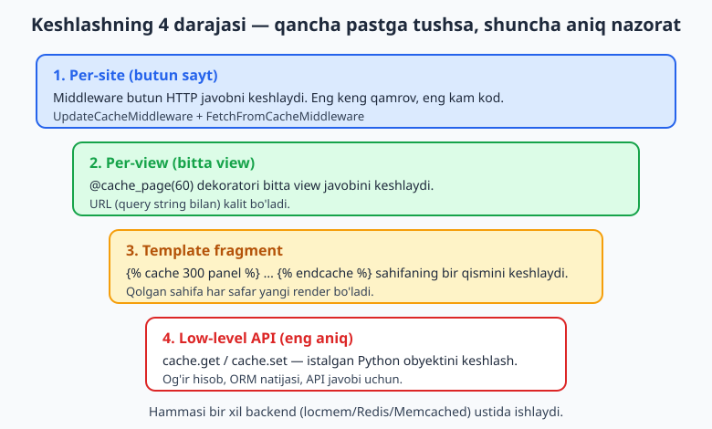
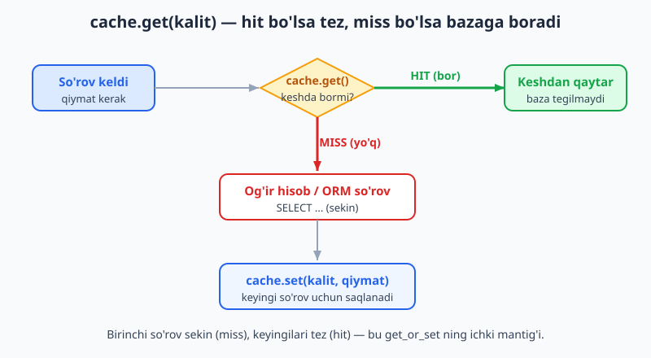
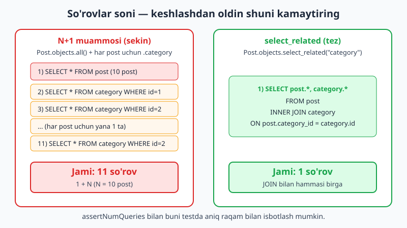

# 20 — Keshlash va performance

[⬅️ Oldingi: 19 — Signallar va custom mantiq](./19-signals-custom.md) · [🏠 README](./README.md) · [Keyingi: 21 — Async va fon vazifalari ➡️](./21-async-celery.md)

---

> **Bu bobda:** ilovangizni tezlashtirishni o'rganamiz. Avval Django'ning **cache framework**i bilan tanishamiz: bitta `CACHES` sozlamasi orqali butun loyihaga kesh ulanadi. **Backendlar**ni ko'rib chiqamiz — ishlab chiqish uchun `locmem` (xotirada, hech narsa o'rnatish shart emas), production uchun `Redis` va `Memcached` (bu bobda Redis serveri yo'q, shuning uchun uni **illustrativ** ko'rsatamiz, lekin RUN paytida `locmem` ishlatamiz). Keyin keshlashning to'rt darajasini bosib o'tamiz: **low-level cache API** (`cache.get`/`cache.set`/`get_or_set`/`incr`/`set_many` — eng aniq nazorat), **per-view kesh** (`@cache_page` dekoratori), **template fragment kesh** (`` tegi), va **per-site kesh** (middleware bilan butun saytni keshlash). Eng muhim savolga javob beramiz: **qachon keshlash kerak va qachon kerak emas** — kesh "stale" (eskirgan) ma'lumot xavfini keltiradi, shuning uchun **invalidatsiya** (keshni bekor qilish) strategiyalarini ko'ramiz. Oxirida keshlashdan oldin qilinishi shart bo'lgan ishni — **query optimizatsiya**ni (`select_related`, `prefetch_related`, `only`, `values`, `count`) `assertNumQueries` bilan **aniq raqam** orqali isbotlaymiz. Bu bob Python'ni bilishni nazarda tutadi ([Python qo'llanma](../python/README.md)); ORM va SQL asoslari foydali ([SQL qo'llanma](../sql/README.md)); production deploy keyingi qadamlarda ([CI/deploy qo'llanma](../git-github/README.md)). Hamma kod Django 6.0.6 da haqiqatan ishga tushirib tekshirilgan (kesh uchun `locmem`, baza uchun SQLite; Redis/Memcached serverlari illustrativ).

---

## Nega keshlash kerak?

Har bir HTTP so'rov kelganda Django bir xil ishni qaytadan bajaradi: bazaga so'rovlar yuboradi, shablonlarni render qiladi, hisob-kitoblar qiladi. Agar ma'lumot tez-tez o'zgarmasa — masalan, bosh sahifadagi "eng mashhur 10 maqola" ro'yxati — bu ishni **har safar qaytarish isrof**dir.

**Keshlash** — qimmat hisobning natijasini tez joyga (xotira yoki Redis) saqlab qo'yish, keyingi so'rovda esa qaytadan hisoblamasdan to'g'ridan-to'g'ri o'sha tayyor natijani berish.

Asosiy tushunchalar:

- **Cache hit** — kerakli qiymat keshda topildi, tez qaytariladi (bazaga tegilmaydi).
- **Cache miss** — keshda yo'q, qimmat hisob bajariladi, natija keshga yoziladi.
- **Timeout (TTL)** — qiymat necha soniya keshda yashaydi. Vaqt tugagach "eskiradi" (expire).
- **Invalidatsiya** — manba ma'lumot o'zgarganda eski keshni qo'lda o'chirish.

Django'da keshlashni to'rt darajada qilish mumkin — keng qamrovdan (butun sayt) aniq nazoratgacha (bitta qiymat):



Pastga tushganingiz sari kodingiz ko'payadi, lekin nazoratingiz aniqlashadi. Quyida pastdan yuqoriga emas, balki **eng moslashuvchanidan** (low-level) boshlaymiz, chunki qolganlarini tushunish osonlashadi.

> **Muhim qoida:** Keshlash sekin kodni tuzatmaydi, faqat **yashiradi**. Keshlashdan **oldin** so'rovlaringizni optimizatsiya qiling (bobning oxiriga qarang). Aks holda kesh "miss" bo'lgan har safar foydalanuvchi yana sekin javob oladi.

---

## Cache framework va backendlar

Django keshni **markazlashgan** tarzda sozlaydi: `settings.py` da bitta `CACHES` lug'ati. Undan keyin butun loyiha bo'ylab bir xil `cache` obyektidan foydalanasiz — kod backend'ga bog'liq emas. Ertaga `locmem`'dan Redis'ga o'tsangiz, **kodni o'zgartirmaysiz**, faqat sozlamani almashtirasiz.

### locmem — ishlab chiqish uchun (RUN qilinadi)

Eng oddiy backend — **local memory** (jarayon xotirasida). Hech narsa o'rnatish shart emas, default ham aynan shu. Bu bobda hamma kod aynan shu backend bilan tekshirilgan.

```python
# config/settings.py
CACHES = {
    "default": {
        "BACKEND": "django.core.cache.backends.locmem.LocMemCache",
        "LOCATION": "ch20-cache",  # bir nechta locmem keshni ajratish uchun
    }
}
```

`locmem`'ning cheklovi: kesh **har bir jarayon xotirasida alohida**. Agar production'da bir nechta worker (gunicorn) ishlasa, har biri o'z keshiga ega bo'ladi va ular bir-birini ko'rmaydi. Shuning uchun `locmem` faqat ishlab chiqish va testlar uchun.

### Redis — production uchun (illustrativ)

Production'da hammasi bitta umumiy keshni ko'rishi kerak. Django 6.0 da Redis backend **o'rnatilgan** holda keladi (`RedisCache` klassi). Quyidagi konfiguratsiya **to'g'ri**, lekin bu muhitda Redis serveri yo'q — shuning uchun u **illustrativ** (ishga tushirilmagan):

```python
# config/settings.py  — ILLUSTRATIV: Redis serveri ishlab turishi kerak
CACHES = {
    "default": {
        "BACKEND": "django.core.cache.backends.redis.RedisCache",
        "LOCATION": "redis://127.0.0.1:6379",
    }
}
```

`RedisCache` klassi Django bilan birga keladi (uni import qilib bo'ladi), lekin ishlash uchun `redis` Python paketi (`pip install redis`) va ishlab turgan Redis serveri kerak. Redis disk emas, **xotirada** ishlaydi, shuning uchun juda tez; bundan tashqari `incr`, `expire` kabi atomik operatsiyalarni qo'llab-quvvatlaydi.

### Memcached — yana bir production varianti (illustrativ)

Memcached ham mashhur. Django 6.0 da `PyMemcacheCache` backend bor:

```python
# config/settings.py  — ILLUSTRATIV: Memcached serveri + pymemcache paketi kerak
CACHES = {
    "default": {
        "BACKEND": "django.core.cache.backends.memcached.PyMemcacheCache",
        "LOCATION": "127.0.0.1:11211",
    }
}
```

### Boshqa backendlar (qisqacha)

- `db.DatabaseCache` — keshni baza jadvalida saqlaydi (`createcachetable` kerak). Redis yo'q bo'lsa ham worker'lar o'rtasida umumiy bo'ladi, lekin bazaga yuk tushiradi.
- `filebased.FileBasedCache` — keshni fayllarda saqlaydi.
- `dummy.DummyCache` — hech narsa keshlamaydi (kodingizni testlashda keshni "o'chirib qo'yish" uchun qulay).

> **Bash:** Quyidagi buyruq Redis backend klassi Django bilan kelishini ko'rsatadi (server kerakmas, faqat import):
>
> ```bash
> python -c "from django.core.cache.backends.redis import RedisCache; print('RedisCache mavjud')"
> ```
>
> Natija: `RedisCache mavjud` (bizning muhitda ham chiqdi). Lekin uni amalda ishlatish uchun server kerak.

---

## Low-level cache API: cache.get / cache.set

Eng moslashuvchan usul — istalgan Python obyektini (son, satr, ro'yxat, lug'at, hatto QuerySet natijasi) qo'lda keshlash. Buning uchun `django.core.cache` dan `cache` obyektini import qilamiz.

```python
from django.core.cache import cache

cache.set("salom", "Assalomu alaykum", timeout=300)  # 300 soniya (5 daqiqa)
qiymat = cache.get("salom")          # "Assalomu alaykum"
yoq = cache.get("yoq", "standart")   # kalit yo'q bo'lsa -> "standart"
```

Mantiq oddiy: avval keshdan so'raymiz; bor bo'lsa (hit) — qaytaramiz; yo'q bo'lsa (miss) — hisoblaymiz va keshga yozamiz.



Quyidagi to'liq misol haqiqatan ishga tushirilgan (`python test_lowlevel.py`):

```python
from django.core.cache import cache

# set / get
cache.set("salom", "Assalomu alaykum", timeout=300)
print(cache.get("salom"))                  # Assalomu alaykum
print(cache.get("yoq", "standart-qiymat")) # standart-qiymat (kalit yo'q)

# add — FAQAT kalit yo'q bo'lsa yozadi, bor bo'lsa tegmaydi
print(cache.add("hisob", 1))     # True  (yangi yozildi)
print(cache.add("hisob", 999))   # False (allaqachon bor, tegmadi)
print(cache.get("hisob"))        # 1     (999 yozilmadi)

# incr / decr — atomik son oshirish/kamaytirish
cache.set("hits", 10)
print(cache.incr("hits"))        # 11
print(cache.incr("hits", 5))     # 16
print(cache.decr("hits"))        # 15

# set_many / get_many — bir nechta kalit birvarakayiga
cache.set_many({"a": 1, "b": 2, "c": 3})
print(cache.get_many(["a", "b", "c"]))  # {'a': 1, 'b': 2, 'c': 3}

# delete — keshdan o'chirish (invalidatsiya)
cache.delete("salom")
print(cache.get("salom", "OCHIRILDI"))  # OCHIRILDI
```

**Timeout qoidalari** (bu ham tekshirilgan):

```python
cache.set("abadiy", "x", timeout=None)  # None = hech qachon eskirmaydi
cache.set("darhol", "y", timeout=0)     # 0 = darhol eskiradi (deyarli yozilmaydi)
print(cache.get("abadiy"))              # x
print(cache.get("darhol", "ESKIRDI"))   # ESKIRDI
```

> **Diqqat:** Yuqoridagi `cache.add("hisob", 999)` qatori ataylab "ishlamaydigan" misol — `add` mavjud kalitni **o'zgartirmaydi**. Agar majburan ustiga yozmoqchi bo'lsangiz, `cache.set` ishlating, `cache.add` emas.

### get_or_set: eng ko'p ishlatiladigan naqsh

"Keshda bo'lsa qaytar, bo'lmasa hisobla-yoz-qaytar" mantig'ini bitta chaqiruvga jamlaydi:

```python
from django.core.cache import cache

def qimmat_hisob():
    print("  >> qimmat funksiya ishladi")
    return 42

# 1-chaqiruv: keshda yo'q -> funksiya ishlaydi, natija keshga yoziladi
print(cache.get_or_set("javob", qimmat_hisob, 300))  # funksiya ishladi -> 42
# 2-chaqiruv: keshda bor -> funksiya UMUMAN ishlamaydi
print(cache.get_or_set("javob", qimmat_hisob, 300))  # to'g'ridan keshdan -> 42
```

Haqiqiy chiqishda `>> qimmat funksiya ishladi` **faqat bir marta** chiqdi — ikkinchi chaqiruvda funksiya umuman ishga tushmadi. Bu aynan biz xohlagan tejamkorlik.

### touch: eskirish vaqtini yangilash

Qiymatni qayta yozmasdan, faqat TTL'ni uzaytirish:

```python
cache.set("sessiya", "ma'lumot", timeout=10)
print(cache.touch("sessiya", 300))   # True  — endi yana 300 soniya yashaydi
print(cache.touch("yoq-kalit", 300)) # False — kalit yo'q, hech narsa qilmadi
```

---

## Low-level keshni view ichida ishlatish

Endi haqiqiy stsenariy — bosh sahifada og'ir hisobni keshlash. Quyidagi naqsh `python test_invalidate.py` da tekshirilgan:

```python
from django.core.cache import cache
from blog.models import Post

def postlar_soni():
    """Keshlangan hisob. Faqat kesh bo'sh bo'lsa bazaga boradi."""
    kesh = cache.get("postlar_soni")
    if kesh is None:               # cache miss
        kesh = Post.objects.count()  # qimmat hisob (DB so'rovi)
        cache.set("postlar_soni", kesh, 300)
    return kesh                    # cache hit yo'lida DB tegilmaydi
```

Tekshirishda birinchi chaqiruv bazaga bordi (DB hisob: 1), ikkinchi chaqiruv keshdan keldi (DB hisob hamon 1). Yangi post qo'shilganda esa eski kesh **noto'g'ri** bo'lib qoladi — uni qo'lda bekor qilamiz:

```python
Post.objects.create(sarlavha="Yangi", matn="...", category=c)
cache.delete("postlar_soni")  # INVALIDATSIYA — endi keyingi chaqiruv qayta hisoblaydi
```

Bu **stale ma'lumot** muammosining yechimi: ma'lumot o'zgarganda keshni o'chirib tashlaysiz. Buni qo'lda emas, signal orqali avtomatik qilish ham mumkin — pastda ko'ramiz.

### Bir nechta nomli kesh

`CACHES` da bir nechta kesh sozlasangiz, `caches` lug'ati orqali nomi bilan tanlanadi:

```python
from django.core.cache import cache, caches

# `cache` — bu "default" keshning qulay yorlig'i (thread-local proxy)
caches["default"].set("kalit", "qiymat")
print(cache.get("kalit"))  # qiymat — ikkalasi bir xil keshni ko'rsatadi
```

> **Nozik nuqta:** `caches["default"] is cache` aslida `False` qaytaradi — `cache` bu nomli keshga ishora qiluvchi alohida proxy obyekt, lekin **xuddi shu** kesh ma'lumotlariga ulanadi. Ya'ni `caches["default"]` ga yozganingizni `cache` orqali o'qiy olasiz.

---

## Per-view kesh: @cache_page

Agar butun view'ning HTTP javobini keshlamoqchi bo'lsangiz, qiymatlarni qo'lda boshqarish shart emas — `@cache_page` dekoratori javobni butunligicha keshlaydi.

```python
# blog/views.py
from django.http import HttpResponse
from django.views.decorators.cache import cache_page

VIEW_HISOB = {"n": 0}

@cache_page(60)  # javob 60 soniya keshlanadi
def vaqt_view(request):
    VIEW_HISOB["n"] += 1
    return HttpResponse(f"Hisoblandi: {VIEW_HISOB['n']} marta")
```

`assertNumQueries`'ga o'xshab, biz view necha marta haqiqatan ishlaganini sanab isbotladik (`python manage.py test`):

```python
# blog/tests.py
from django.test import TestCase, override_settings
from django.core.cache import cache
from blog import views

@override_settings(CACHES={"default": {
    "BACKEND": "django.core.cache.backends.locmem.LocMemCache",
}})
class CachePageTest(TestCase):
    def setUp(self):
        cache.clear()
        views.VIEW_HISOB["n"] = 0

    def test_cache_page(self):
        r1 = self.client.get("/vaqt/")
        r2 = self.client.get("/vaqt/")
        self.assertEqual(r1.content, r2.content)   # ikkala javob bir xil
        self.assertEqual(views.VIEW_HISOB["n"], 1) # view FAQAT 1 marta ishladi
        # query string boshqa bo'lsa -> ALOHIDA kesh
        self.client.get("/vaqt/?p=2")
        self.assertEqual(views.VIEW_HISOB["n"], 2) # boshqa URL uchun yana ishladi
```

Natija: `OK` — birinchi va ikkinchi `/vaqt/` so'rovida view atigi **bir marta** ishladi (ikkinchisi keshdan keldi), lekin `?p=2` boshqa URL bo'lgani uchun alohida keshlandi (view yana ishladi).

URL'ga dekoratorni `urls.py` da ham qo'yish mumkin (view'ni o'zgartirmasdan):

```python
# config/urls.py
from django.urls import path
from django.views.decorators.cache import cache_page
from blog import views

urlpatterns = [
    path("vaqt/", cache_page(60)(views.vaqt_view), name="vaqt"),
]
```

> **Diqqat:** `@cache_page` ni **autentifikatsiyaga bog'liq** (har foydalanuvchiga har xil) yoki **POST** view'larda ishlatmang — barcha foydalanuvchilar bir xil keshlangan javobni ko'rib qoladi. U faqat **anonim, GET, hammaga bir xil** sahifalar uchun. Foydalanuvchiga bog'liq javoblar uchun `vary_on_headers`/`vary_on_cookie` yoki low-level kesh ishlating.

---

## Template fragment kesh: 

Ko'pincha butun sahifa emas, faqat bir qismi qimmat bo'ladi — masalan, sidebar'dagi "eng mashhur teglar" yoki murakkab jadval. `` tegi shablonning **faqat shu bo'lagini** keshlaydi, qolgani har safar yangi render bo'ladi.

```html


  <!-- bu blok 300 soniya keshlanadi -->
  OG'IR HISOB: {{ qiymat }}

```

`python test_fragment.py` da tekshirildi: birinchi render `qiymat=AAA` bilan keshlandi; ikkinchi render `qiymat=BBB` bilan chaqirilsa ham, fragment keshlangani uchun **hali ham AAA** chiqdi (`OG'IR HISOB: AAA`). Demak fragment ichidagi hisob qaytadan bajarilmadi.

### Vary-by argumentlar

Bitta fragment turli foydalanuvchilarga turlicha bo'lishi mumkin. `` ga **qo'shimcha argumentlar** bersangiz, har bir kombinatsiya alohida keshlanadi:

```html


  Panel #{{ user.id }}

```

Tekshirishda `user_id=1` uchun `Panel #1`, `user_id=2` uchun `Panel #2` chiqdi — ya'ni har bir foydalanuvchi o'z keshini oldi, aralashib ketmadi.

### Fragmentni dasturdan o'chirish: make_template_fragment_key

Manba o'zgarganda fragment keshini bekor qilish uchun uning kalitini `make_template_fragment_key` bilan qayta hosil qilamiz:

```python
from django.core.cache import cache
from django.core.cache.utils import make_template_fragment_key

#  ga mos kalit (user.id=7 uchun)
kalit = make_template_fragment_key("user_panel", [7])
print(kalit)              # template.cache.user_panel.03a149245ce7dd99...
cache.delete(kalit)       # fragment keshi o'chdi -> keyingi render yangilanadi
```

Birinchi argument — fragment nomi (`` dagi), ikkinchisi — vary-by argumentlar ro'yxati. Bu tekshirildi: o'chirgandan keyin `cache.get(kalit)` `None` qaytardi.

---

## Per-site kesh: butun saytni keshlash

Eng yuqori daraja — middleware orqali **butun saytning** har bir GET javobini keshlash. Ikki middleware kerak va ularning **tartibi muhim**: `UpdateCacheMiddleware` ro'yxatda eng **tepada** (javobni yozish uchun), `FetchFromCacheMiddleware` eng **pastda** (kelgan so'rovga kesh bormi tekshirish uchun).

```python
# config/settings.py  (per-site uchun)
MIDDLEWARE = [
    "django.middleware.cache.UpdateCacheMiddleware",      # ENG TEPADA
    "django.middleware.security.SecurityMiddleware",
    "django.contrib.sessions.middleware.SessionMiddleware",
    "django.middleware.common.CommonMiddleware",
    "django.middleware.cache.FetchFromCacheMiddleware",   # ENG PASTDA
]

CACHE_MIDDLEWARE_SECONDS = 60          # har javob 60 soniya keshlanadi
CACHE_MIDDLEWARE_KEY_PREFIX = ""       # bir nechta sayt bitta keshni bo'lishsa
```

`python -m pytest test_persite.py` bilan tekshirildi: per-site kesh yoqilganida, dekoratori yo'q oddiy view ham ikkinchi so'rovga **umuman ishlamadi** (view hisobi 1 da qoldi). Ya'ni javob to'liq middleware darajasida keshdan qaytdi.

> **Diqqat:** Per-site kesh — eng kuchli, lekin eng **xavfli** variant. U autentifikatsiya qilingan/shaxsiy sahifalar bo'lgan saytda noto'g'ri ishlaydi (bir foydalanuvchining sahifasi boshqasiga ko'rinib qolishi mumkin). U faqat **deyarli to'liq anonim, statik** saytlar (masalan, blog, hujjatlar sayti) uchun. Aksariyat real loyihalarda `@cache_page` yoki low-level kesh aniqroq va xavfsizroq.

---

## Kesh versiyalash va kalit prefiksi

Bir nechta loyiha bitta Redis serverini bo'lishsa, kalitlar to'qnashmasligi uchun Django har kalitga **prefiks** va **versiya** qo'shadi. Versiyalashdan deploy paytida butun keshni "yangilash" uchun foydalansa bo'ladi.

```python
from django.core.cache import cache

# version bilan izolyatsiya
cache.set("kalit", "v1-qiymat", version=1)
cache.set("kalit", "v2-qiymat", version=2)
print(cache.get("kalit", version=1))  # v1-qiymat
print(cache.get("kalit", version=2))  # v2-qiymat

# incr_version — kalit versiyasini oshirib, eski versiyani "ko'rinmas" qiladi
cache.set("hujjat", "matn", version=1)
cache.incr_version("hujjat", version=1)  # endi qiymat version=2 da
print(cache.get("hujjat", version=1, default="YO'Q"))  # YO'Q (eski versiya bo'sh)
print(cache.get("hujjat", version=2))                  # matn (yangi versiyada)
```

Bu tekshirildi: `incr_version` qiymatni eski versiyadan yangisiga "ko'chirdi". `settings.py` da `KEY_PREFIX` va `VERSION` ni global belgilash ham mumkin:

```python
CACHES = {
    "default": {
        "BACKEND": "django.core.cache.backends.locmem.LocMemCache",
        "KEY_PREFIX": "myapp",  # barcha kalitlar oldiga "myapp:" qo'shiladi
        "VERSION": 1,           # default versiya
        "TIMEOUT": 300,         # default TTL (soniyalarda)
    }
}
```

---

## Qachon keshlash kerak (va qachon kerak emas)

Keshlash bepul emas — u **stale ma'lumot** xavfini va invalidatsiya murakkabligini olib keladi. Mashhur ibora: kompyuter fanidagi ikki qiyin masala — kesh invalidatsiyasi va narsalarga nom qo'yish.

**Keshlash YAXSHI bo'lgan joylar:**

- O'qish ko'p, yozish kam ma'lumot (blog postlari, kategoriyalar, sozlamalar).
- Hisoblash qimmat (murakkab agregat, tashqi API javobi, og'ir shablon render).
- Natija deyarli barcha foydalanuvchilarga bir xil (anonim bosh sahifa).
- Bir necha soniya/daqiqa eskirgan ma'lumot maqbul (yangiliklar lentasi).

**Keshlash YOMON bo'lgan joylar:**

- Har foydalanuvchiga shaxsiy va doim yangi bo'lishi shart ma'lumot (bank balansi, savatcha).
- Tez-tez o'zgaradigan, lekin har doim aniq bo'lishi kerak qiymat.
- So'rov allaqachon tez (keshlash murakkablik qo'shadi, foyda bermaydi).

**Invalidatsiya strategiyalari:**

1. **TTL (vaqt bilan)** — eng oddiy. `timeout` qo'yasiz, vaqt tugagach kesh o'zi yangilanadi. Biroz "stale" ma'lumotga toqat qilsangiz, eng kam og'riqli yo'l.
2. **Hodisa bilan (signal)** — manba o'zgarganda keshni darhol o'chirish. `post_save`/`post_delete` signaliga ulanasiz (19-bobga qarang):

```python
# blog/signals.py — ILLUSTRATIV naqsh (signal 19-bobda batafsil)
from django.db.models.signals import post_save, post_delete
from django.dispatch import receiver
from django.core.cache import cache
from blog.models import Post

@receiver([post_save, post_delete], sender=Post)
def postlar_keshini_bekor_qil(sender, **kwargs):
    cache.delete("postlar_soni")  # manba o'zgardi -> kesh eskirdi, o'chiramiz
```

Bu naqshning mantig'i (signalsiz, qo'lda `cache.delete`) `test_invalidate.py` da tekshirildi: yangi post qo'shilib, kesh o'chirilgandan keyin hisob qayta hisoblandi.

> **Maslahat:** Avval TTL bilan boshlang. Faqat "stale" ma'lumot haqiqatan muammo bo'lganda hodisaga asoslangan invalidatsiyaga o'ting — u ancha murakkab va xatoga moyil.

---

## Keshlashdan oldin: query optimizatsiya

Eng katta xato — sekin so'rovni keshlash bilan "yashirish". Kesh "miss" bo'lgan har safar foydalanuvchi yana sekin javob oladi. Shuning uchun **avval so'rovlar sonini kamaytiring**.

Eng keng tarqalgan muammo — **N+1**: bitta so'rov bilan ro'yxat olasiz, keyin har bir element uchun yana bittadan so'rov yuborasiz.



`assertNumQueries` Django testlarida har bir blok aniq necha SQL so'rov yuborganini **isbotlaydi**. Quyidagilar `python manage.py test blog.tests` da o'tdi (`Ran 7 tests ... OK`):

```python
# blog/tests.py
from blog.models import Category, Post

class QueryOptimizationTest(TestCase):
    @classmethod
    def setUpTestData(cls):
        c1 = Category.objects.create(nom="Texnologiya")
        c2 = Category.objects.create(nom="Sport")
        for i in range(10):
            Post.objects.create(
                sarlavha=f"Post {i}", matn="...",
                category=c1 if i % 2 else c2,
            )

    def test_n_plus_1(self):
        # ❌ select_related YO'Q -> 1 (postlar) + 10 (har biriga category) = 11 so'rov
        with self.assertNumQueries(11):
            for p in Post.objects.all():
                _ = p.category.nom

    def test_select_related(self):
        # ✅ select_related BOR -> JOIN bilan atigi 1 so'rov
        with self.assertNumQueries(1):
            for p in Post.objects.select_related("category"):
                _ = p.category.nom

    def test_count_vs_len(self):
        # ✅ .count() -> SELECT COUNT(*), 1 so'rov, qatorlarni xotiraga yuklamaydi
        with self.assertNumQueries(1):
            n = Post.objects.count()
        self.assertEqual(n, 10)
```

11 vs 1 — bu farq 10 postda sezilmaydi, lekin 10 000 postda sayt "qotib" qoladi. Boshqa muhim vositalar (bular ham tekshirildi):

```python
class MoreOptimizationTest(TestCase):
    # ... setUpTestData: 1 category, 5 post ...

    def test_prefetch_related(self):
        # teskari FK (Category -> postlar): prefetch bilan atigi 2 so'rov
        with self.assertNumQueries(2):
            for cat in Category.objects.prefetch_related("postlar"):
                _ = list(cat.postlar.all())

    def test_only(self):
        # .only("sarlavha") faqat kerakli ustunni oladi (kam ma'lumot)
        with self.assertNumQueries(1):
            list(Post.objects.only("sarlavha"))

    def test_values(self):
        # .values() dict qaytaradi, model obyekti yaratmaydi -> tezroq, yengilroq
        with self.assertNumQueries(1):
            data = list(Post.objects.values("sarlavha"))
        self.assertIsInstance(data[0], dict)
```

Qoidalar:

- **`select_related`** — `ForeignKey`/`OneToOne` (ya'ni "bitta" tomon) uchun: SQL `JOIN` bilan bir so'rovda oladi.
- **`prefetch_related`** — `ManyToMany` va teskari `ForeignKey` ("ko'p" tomon) uchun: alohida so'rov yuboradi, Python'da bog'laydi (yuqorida 2 so'rov).
- **`only`/`defer`** — faqat kerakli ustunlarni oling (`only`) yoki og'irlarini keyinga qoldiring (`defer`).
- **`values`/`values_list`** — model obyekti kerak bo'lmasa, dict/tuple bilan tezroq.
- **`count`** — ro'yxat uzunligi kerak bo'lsa `len(qs)` o'rniga `qs.count()` (qatorlarni yuklamaydi).
- **`exists`** — "biror qator bormi" uchun `if qs:` o'rniga `if qs.exists():`.

N+1 va munosabatlar 9-bobda chuqurroq ko'rilgan. Esda tuting: **optimizatsiya birinchi, keshlash ikkinchi.**

---

## Performance o'lchash: DEBUG va so'rovlarni ko'rish

`DEBUG=True` bo'lsa, Django har bir so'rovni `connection.queries` da yozib boradi. Buni ishlab chiqishda tekshirish uchun ishlatasiz:

```python
from django.db import connection, reset_queries
from blog.models import Post

reset_queries()
list(Post.objects.select_related("category"))
print("So'rovlar soni:", len(connection.queries))
# DEBUG=True da har bir so'rovning SQL matnini ham ko'rish mumkin
for q in connection.queries:
    print(q["sql"][:80])
```

> **Eslatma:** `connection.queries` faqat `DEBUG=True` da to'ldiriladi. Production'da (`DEBUG=False`) u har doim bo'sh — bu xotirani tejash uchun. So'rovlarni testda aniq sanash uchun `assertNumQueries` ishonchliroq. Real loyihada `django-debug-toolbar` yoki `django-silk` paketlari so'rovlarni vizual ko'rsatadi (ular bu bobda o'rnatilmagan — illustrativ).

---

## Xulosa

- **Cache framework** markazlashgan: bitta `CACHES` sozlamasi, kod backend'ga bog'liq emas.
- **Backendlar**: `locmem` (ishlab chiqish, RUN qilindi), `Redis`/`Memcached` (production, illustrativ — server kerak), `db`/`filebased`/`dummy`.
- **Low-level API**: `cache.set/get/add/delete/incr/set_many/get_or_set/touch` — eng aniq nazorat.
- **Per-view**: `@cache_page(60)` butun javobni keshlaydi; URL (query bilan) kalit bo'ladi.
- **Fragment**: `...` sahifaning bir qismini; `make_template_fragment_key` bilan o'chiriladi.
- **Per-site**: ikki middleware butun saytni keshlaydi — kuchli, lekin faqat anonim/statik saytlar uchun.
- **Qachon keshlash**: o'qish ko'p / yozish kam, qimmat hisob, biroz "stale"ga toqat. Invalidatsiya: TTL (oddiy) yoki signal (aniq).
- **Avval optimizatsiya**: `select_related`/`prefetch_related`/`only`/`values`/`count` bilan so'rovlar sonini kamaytiring; `assertNumQueries` bilan isbotlang.

Keyingi bobda fon vazifalari va asinxron ishlashni ko'ramiz — uzoq davom etadigan ishlarni (email yuborish, hisobot tayyorlash) so'rov tsiklidan tashqariga chiqaramiz.

---

## Mashqlar

### Oson

1. `settings.py` da `locmem` keshini sozlang (`LOCATION` bilan). `python manage.py shell` da `cache.set("test", 123, 60)` va `cache.get("test")` ni chaqirib, `123` qaytishini tekshiring.
2. `cache.add` va `cache.set` farqini ko'rsating: bitta kalitga `add` ni ikki marta turli qiymat bilan chaqirib, ikkinchisi e'tiborga olinmasligini isbotlang.
3. `cache.set_many({"x": 1, "y": 2})` bilan ikkita kalit yozing, keyin `cache.get_many(["x", "y", "z"])` natijasida `z` yo'qligini ko'ring.
4. `cache.get("yoq-kalit", "default")` chaqirib, mavjud bo'lmagan kalit uchun `default` qaytishini tasdiqlang.
5. `@cache_page(30)` dekoratorini bitta oddiy view'ga qo'shing va URL'ga ulang.
6. Shablonda `` qilib, `Salom {{ ism }}` bloki yozing.

### O'rta

7. `get_or_set` dan foydalanib, `Post.objects.count()` natijasini keshlovchi funksiya yozing. Funksiya bazaga faqat birinchi marta borishini print bilan ko'rsating.
8. `incr`/`decr` bilan oddiy "sahifa ko'rishlar hisoblagichi" yozing: har bir view chaqiruvida `cache.incr("hits")`.
9. `make_template_fragment_key("user_panel", [user_id])` bilan ma'lum bir foydalanuvchining fragment keshini topib o'chiring.
10. `cache.set(..., version=1)` va `version=2` bilan bir xil kalitga ikki qiymat yozib, ular bir-biriga aralashmasligini ko'rsating.
11. Testda `assertNumQueries` bilan `Post.objects.all()` (N+1) va `Post.objects.select_related("category")` so'rovlar sonini taqqoslang.
12. `@override_settings` bilan testda `DummyCache` ishlatib, `cache.set`/`cache.get` dan keyin `None` qaytishini (kesh o'chirilgan) tekshiring.

### Qiyin

13. Signal (`post_save`) orqali `Post` saqlanganda `cache.delete("postlar_soni")` ni avtomatik chaqiruvchi invalidatsiya tizimi yozing va uni test bilan isbotlang (post yaratilgandan keyin keshlangan hisob yangilanadi).
14. Per-site kesh middleware'ini sozlab (`UpdateCacheMiddleware` + `FetchFromCacheMiddleware`), `pytest` testida ikkinchi so'rovga view umuman ishlamasligini `assertNumQueries(0)` yoki view hisoblagichi orqali isbotlang.
15. `Category.objects.prefetch_related("postlar")` va prefetch'siz versiyani `assertNumQueries` bilan taqqoslab, prefetch'ning so'rovlar sonini kamaytirishini ko'rsating.

<details markdown="1"><summary>Yechimlar</summary>

**1.**
```python
# settings.py
CACHES = {"default": {
    "BACKEND": "django.core.cache.backends.locmem.LocMemCache",
    "LOCATION": "mashq-cache",
}}
# shell
from django.core.cache import cache
cache.set("test", 123, 60)
print(cache.get("test"))  # 123
```

**2.**
```python
from django.core.cache import cache
cache.delete("k")
print(cache.add("k", "birinchi"))  # True
print(cache.add("k", "ikkinchi"))  # False — tegmadi
print(cache.get("k"))              # birinchi
```

**3.**
```python
cache.set_many({"x": 1, "y": 2})
print(cache.get_many(["x", "y", "z"]))  # {'x': 1, 'y': 2}  — z yo'q
```

**4.**
```python
print(cache.get("yoq-kalit", "default"))  # default
```

**5.**
```python
# views.py
from django.http import HttpResponse
from django.views.decorators.cache import cache_page

@cache_page(30)
def oddiy(request):
    return HttpResponse("Keshlangan javob")

# urls.py
from django.urls import path
from blog import views
urlpatterns = [path("oddiy/", views.oddiy, name="oddiy")]
```

**6.**
```html


  Salom {{ ism }}

```

**7.**
```python
from django.core.cache import cache
from blog.models import Post

def keshlangan_soni():
    def hisobla():
        print(">> bazaga bordi")
        return Post.objects.count()
    return cache.get_or_set("post_soni", hisobla, 300)

keshlangan_soni()  # >> bazaga bordi  (birinchi marta)
keshlangan_soni()  # (print chiqmaydi — keshdan)
```

**8.**
```python
from django.core.cache import cache
from django.http import HttpResponse

def hisoblagich(request):
    cache.add("hits", 0)        # kalit yo'q bo'lsa 0 dan boshla
    soni = cache.incr("hits")   # har chaqiruvda +1
    return HttpResponse(f"Ko'rishlar: {soni}")
```

**9.**
```python
from django.core.cache import cache
from django.core.cache.utils import make_template_fragment_key

def fragmentni_ochir(user_id):
    kalit = make_template_fragment_key("user_panel", [user_id])
    cache.delete(kalit)
```

**10.**
```python
cache.set("k", "v1", version=1)
cache.set("k", "v2", version=2)
print(cache.get("k", version=1))  # v1
print(cache.get("k", version=2))  # v2  — aralashmaydi
```

**11.**
```python
from django.test import TestCase
from blog.models import Category, Post

class N1Test(TestCase):
    @classmethod
    def setUpTestData(cls):
        c = Category.objects.create(nom="A")
        for i in range(10):
            Post.objects.create(sarlavha=f"P{i}", matn="...", category=c)

    def test_taqqos(self):
        with self.assertNumQueries(11):  # N+1
            [p.category.nom for p in Post.objects.all()]
        with self.assertNumQueries(1):   # select_related
            [p.category.nom for p in Post.objects.select_related("category")]
```

**12.**
```python
from django.test import TestCase, override_settings
from django.core.cache import cache

@override_settings(CACHES={"default": {
    "BACKEND": "django.core.cache.backends.dummy.DummyCache",
}})
class DummyTest(TestCase):
    def test_dummy(self):
        cache.set("k", "v")
        self.assertIsNone(cache.get("k"))  # DummyCache hech narsa saqlamaydi
```

**13.**
```python
# blog/signals.py
from django.db.models.signals import post_save, post_delete
from django.dispatch import receiver
from django.core.cache import cache
from blog.models import Post

@receiver([post_save, post_delete], sender=Post)
def post_keshini_bekor_qil(sender, **kwargs):
    cache.delete("postlar_soni")

# blog/apps.py — ready() da signalni ulang
class BlogConfig(AppConfig):
    default_auto_field = "django.db.models.BigAutoField"
    name = "blog"
    def ready(self):
        from blog import signals  # noqa

# blog/tests.py
from django.test import TestCase
from django.core.cache import cache
from blog.models import Category, Post

class InvalidateTest(TestCase):
    def test_signal_keshni_bekor(self):
        c = Category.objects.create(nom="A")
        cache.set("postlar_soni", Post.objects.count(), 300)  # 0
        Post.objects.create(sarlavha="X", matn="...", category=c)  # signal -> delete
        self.assertIsNone(cache.get("postlar_soni"))  # kesh bekor qilindi
```

**14.**
```python
# test_persite.py
from django.test import override_settings

MW = [
    "django.middleware.cache.UpdateCacheMiddleware",
    "django.middleware.common.CommonMiddleware",
    "django.middleware.cache.FetchFromCacheMiddleware",
]

@override_settings(
    MIDDLEWARE=MW, CACHE_MIDDLEWARE_SECONDS=60,
    CACHES={"default": {"BACKEND": "django.core.cache.backends.locmem.LocMemCache"}},
)
def test_per_site(client):
    from blog import views
    views.PLAIN_HISOB["n"] = 0
    client.get("/oddiy/")
    client.get("/oddiy/")
    assert views.PLAIN_HISOB["n"] == 1  # 2-so'rov view'ga bormadi
```

**15.**
```python
from django.test import TestCase
from blog.models import Category, Post

class PrefetchTest(TestCase):
    @classmethod
    def setUpTestData(cls):
        for j in range(3):
            c = Category.objects.create(nom=f"C{j}")
            for i in range(5):
                Post.objects.create(sarlavha=f"P{i}", matn="...", category=c)

    def test_prefetch(self):
        # prefetch'siz: 1 (category) + 3 (har biriga postlar) = 4
        with self.assertNumQueries(4):
            for cat in Category.objects.all():
                list(cat.postlar.all())
        # prefetch bilan: atigi 2
        with self.assertNumQueries(2):
            for cat in Category.objects.prefetch_related("postlar"):
                list(cat.postlar.all())
```

</details>

---

[⬅️ Oldingi: 19 — Signallar va custom mantiq](./19-signals-custom.md) · [🏠 README](./README.md) · [Keyingi: 21 — Async va fon vazifalari ➡️](./21-async-celery.md)
