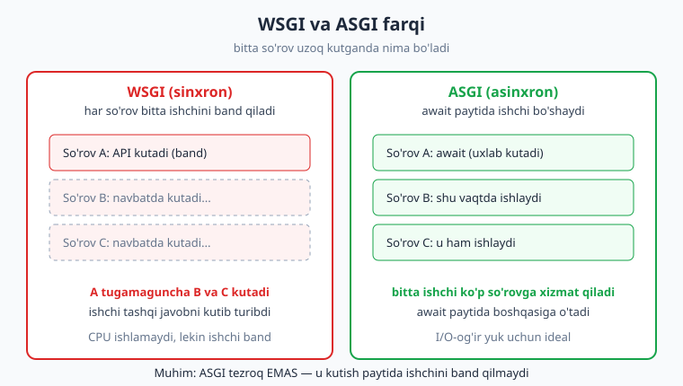
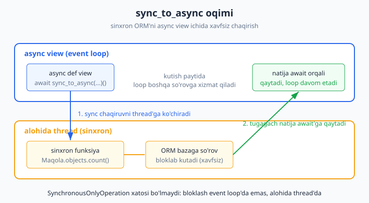
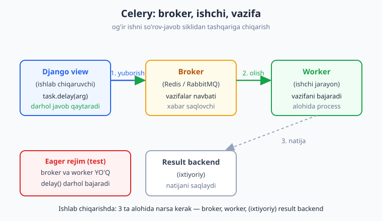
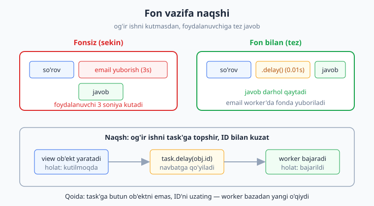

# 21 — Async va fon vazifalari

[⬅️ Oldingi: 20 — Keshlash va performance](./20-caching-performance.md) · [🏠 README](./README.md) · [Keyingi: 22 — Testlash ➡️](./22-testing.md)

---

> **Bu bobda:** Django'da ikki xil "tezlashtirish" yo'lini o'rganamiz va ularni adashtirmaslikni. Birinchisi — **asinxron view'lar** (`async def`): so'rov tashqi xizmatni (API, baza, fayl) kutib turganda ishchini band qilmaslik. Buning uchun **WSGI va ASGI** farqini, **qachon async haqiqatan foyda berishini** (va qachon umuman bermasligini) ko'ramiz. Async kontekstda Django ORM'ni ishlatish — eng ko'p xato qilinadigan joy: nega to'g'ridan-to'g'ri `Model.objects.count()` chaqirish `SynchronousOnlyOperation` xatosini beradi va **`sync_to_async`** hamda native `acount()`/`aget()` metodlari buni qanday hal qiladi. Ikkinchi yo'l — **Celery**: og'ir ishni (email yuborish, hisobot tayyorlash, rasm qayta ishlash) so'rov-javob siklidan butunlay tashqariga chiqarish. Celery'ning uch qismi (**broker, worker, task**), `@shared_task`, `.delay()` va **fon vazifa naqshi** (view tez javob qaytaradi, og'ir ish keyin bajariladi). Bizda haqiqiy broker (Redis/RabbitMQ) yo'q, shuning uchun task'larni **`task_always_eager`** rejimida — broker va worker'siz, darhol bajariladigan tarzda — ishga tushirib sinab ko'ramiz. Hamma kod Django 6.0.6, Python 3.14, Celery 5.6 da haqiqatan ishga tushirib tekshirilgan.

---

## Ikki xil muammo, ikki xil yechim

Django ilovangiz sekin ishlayotgan bo'lsa, sabab odatda ikkitadan biri:

1. **View tashqi narsani kutyapti.** Masalan boshqa serverga `requests.get()` yuboryapti va 2 soniya javob kutyapti. Bu vaqtda protsessor hech narsa qilmayapti — shunchaki kutyapti. Buni **async view** hal qiladi: kutish paytida ishchi boshqa so'rovlarga xizmat qiladi.

2. **View og'ir ish qilyapti va foydalanuvchini kuttiryapti.** Masalan ro'yxatdan o'tgan foydalanuvchiga email yuboryapti (3 soniya), yoki katta hisobot tayyorlayapti. Foydalanuvchi sahifa yuklanishini 3 soniya kutadi. Buni **fon vazifasi** (Celery) hal qiladi: og'ir ishni keyinroq bajariladigan navbatga qo'yib, foydalanuvchiga darhol javob qaytarasiz.

Bu bobda ikkalasini ham ko'ramiz. Eng muhim narsa — **qaysi muammoga qaysi yechim** kerakligini bilish. Async — kutishni; Celery — kechiktirib bajarishni hal qiladi. Ko'p yangi dasturchi ikkalasini bir narsa deb o'ylab adashadi.

> Eslatma: Python'ning `async`/`await` asoslari bu kitobda emas, balki [Python qo'llanmasida](../python/README.md) yoritilgan deb faraz qilamiz. Bu bobda faqat Django'ga xos jihatlarni — async view, ASGI, async ORM va Celery'ni — to'liq tushuntiramiz.

## WSGI va ASGI: ishchi nega band bo'lib qoladi

Django ilova bilan tashqi server o'rtasida **protokol** turadi. An'anaviy protokol — **WSGI** (Web Server Gateway Interface). U sinxron: ishchi (worker) bitta so'rovni boshlasa, to'liq tugatmaguncha boshqa so'rovga o'tmaydi.

Muammo shu yerda: agar view tashqi API javobini 2 soniya kutsa, ishchi shu 2 soniya **band** turadi, garchi hech qanday hisob-kitob qilmasa ham. Boshqa so'rovlar navbatda kutadi.

**ASGI** (Asynchronous Server Gateway Interface) buni o'zgartiradi. `await` ga yetganda — ya'ni "kutish" boshlanganda — ishchi shu so'rovni "pauza" qiladi va shu vaqtda boshqa so'rovga xizmat qiladi. Tashqi javob kelganda birinchi so'rovni davom ettiradi.



Muhim tushuncha: **ASGI tezroq ishlamaydi.** Bitta so'rov xuddi shuncha vaqtda bajariladi. Lekin **ko'p so'rovni bir vaqtda** kutib tura oladi, shuning uchun bir xil server bilan ko'proq so'rovga xizmat qiladi — agar ish I/O-og'ir (kutishga ko'p vaqt) bo'lsa.

`startproject` ikkala faylni ham yaratadi: `wsgi.py` (sinxron server uchun) va `asgi.py` (asinxron server uchun). Async view ishlashi uchun ilova ASGI orqali ishga tushirilishi kerak:

```python
# mysite/asgi.py — startproject avtomatik yaratadi
import os
from django.core.asgi import get_asgi_application

os.environ.setdefault("DJANGO_SETTINGS_MODULE", "mysite.settings")
application = get_asgi_application()
```

```python
# mysite/wsgi.py — sinxron variant (eski usul)
import os
from django.core.wsgi import get_wsgi_application

os.environ.setdefault("DJANGO_SETTINGS_MODULE", "mysite.settings")
application = get_wsgi_application()
```

Ishlab chiqarishda ASGI'ni `uvicorn` yoki `daphne` kabi ASGI-server bilan ishga tushirasiz (gunicorn esa WSGI uchun). Quyidagi buyruq **illustrativ** — bu muhitda haqiqiy server ishga tushirilmagan, faqat sintaksisni ko'rsatadi:

```bash
# illustrativ: ASGI serverni ishga tushirish (bu yerda RUN qilinmagan)
uvicorn mysite.asgi:application --host 0.0.0.0 --port 8000
```

Development paytida `python manage.py runserver` async view'larni ham qo'llab-quvvatlaydi — alohida sozlash kerak emas. Lekin bu development server, ishlab chiqarish uchun emas.

## Birinchi async view

Async view yozish oddiy: `def` o'rniga `async def` ishlatasiz. Django funksiya `async def` ekanini avtomatik aniqlaydi va uni async tarzda chaqiradi.

```python
# blog/views.py
import asyncio
from django.http import HttpResponse

# Oddiy sinxron view (taqqoslash uchun)
def salom(request):
    return HttpResponse("salom")

# Asinxron view: async def
async def async_salom(request):
    await asyncio.sleep(0.01)   # tashqi kutishga taqlid (masalan API javobi)
    return HttpResponse("async salom")
```

URL'ga ulash xuddi oddiy view kabi — hech qanday farq yo'q:

```python
# blog/urls.py — bobni o'qigan sari bu ro'yxatni to'ldirib boramiz
from django.urls import path
from . import views

urlpatterns = [
    path("salom/", views.salom),
    path("async-salom/", views.async_salom),
    path("parallel/", views.parallel),                  # keyingi bo'limda
    path("maqola-soni/", views.maqola_soni),            # ORM bo'limida
    path("xabar/", views.xabar_yuborish_view),          # fon vazifa bo'limida
]
```

> Eslatma: bu yagona `urls.py` — bob davomida qo'shiladigan barcha view'larning marshrutlari shu yerda jamlangan. Har bir view'ni quyida ko'rganingizda, uning marshruti yuqorida allaqachon ro'yxatga olinganini bilib turing. Agar bobni ketma-ket kuzatsangiz, testlardagi `/blog/parallel/`, `/blog/maqola-soni/` va `/blog/xabar/` so'rovlari 404 bermaydi.

Bu view'larni qanday tekshiramiz? Django'ning `AsyncClient` (test mijozi) `await` bilan so'rov yuboradi va `TestCase` ichida async test metodlari yozish mumkin:

```python
# blog/tests.py
from django.test import TestCase, AsyncClient

class AsyncViewTest(TestCase):
    async def test_async_salom(self):
        client = AsyncClient()
        resp = await client.get("/blog/async-salom/")
        self.assertEqual(resp.status_code, 200)
        self.assertEqual(resp.content, b"async salom")
```

Bu test `python manage.py test` bilan ishlaydi va o'tadi. `await asyncio.sleep(0.01)` — bu yerda haqiqiy tashqi xizmat o'rniga qo'yilgan taqlid; real loyihada bu `await client.get(url)` (async HTTP kutubxona) yoki `await sync_to_async(...)()` bo'lardi.

## Qachon async foydali (va qachon umuman emas)

Bu — eng ko'p adashiladigan joy. Aniq qoidalar:

**Async FOYDA beradi, agar view ko'p vaqtni I/O-kutishga sarflasa:**

- Boshqa serverlarga bir nechta HTTP so'rov yuborib, javoblarni kutish.
- Tashqi API'lardan ma'lumot yig'ish (mikroservislar).
- WebSocket, uzoq ulanishlar (long-polling), streaming javoblar.

**Async FOYDA BERMAYDI (yoki hatto sekinlashtiradi):**

- Oddiy CRUD view — bittagina baza so'rovi qilib, sahifa qaytaradi. Bu yerda kutish kam, async qo'shimcha murakkablik beradi, xolos.
- CPU-og'ir ish (katta hisob-kitob, rasm qayta ishlash). Async bunga yordam bermaydi — protsessor baribir band. Bunaqasi uchun **Celery** kerak.

Async view'ning asosiy kuchi — bir nechta kutishni **parallel** qilish. `asyncio.gather` bilan uchta tashqi ishni ketma-ket emas, bir vaqtda kutamiz:

```python
# blog/views.py
import asyncio
from django.http import JsonResponse

async def parallel(request):
    async def ish(n):
        await asyncio.sleep(0.01)   # har biri tashqi API o'rniga
        return n * 2
    # ketma-ket bo'lsa 0.03s; gather bilan parallel ~0.01s
    natija = await asyncio.gather(ish(1), ish(2), ish(3))
    return JsonResponse({"natija": natija})
```

Test:

```python
# blog/tests.py (davomi)
    async def test_parallel(self):
        client = AsyncClient()
        resp = await client.get("/blog/parallel/")
        self.assertEqual(resp.json(), {"natija": [2, 4, 6]})
```

Uchta `ish()` parallel kutadi: agar ketma-ket bo'lsa umumiy vaqt yig'iladi, `gather` bilan eng uzuni qadar. Bu — async'ning haqiqiy foydasi. Bittagina kutish bo'lsa, async hech narsa yutmaydi.

## Eng katta tuzoq: async ichida sinxron ORM

Mana eng muhim qoida. Django ORM **sinxron** kutubxona — u baza bilan bloklab (kutib) ishlaydi. Async view ichida ORM'ni to'g'ridan-to'g'ri chaqirsangiz, Django sizni **himoyalaydi** va xato ko'taradi, chunki sinxron baza chaqiruvi async eventsiklini bloklab qo'yadi:

```python
# ❌ XATO NAQSH: async kontekstda to'g'ridan-to'g'ri sinxron ORM
async def maqola_soni(request):
    soni = Maqola.objects.count()   # SynchronousOnlyOperation xatosi!
    return JsonResponse({"soni": soni})
```

Bu kod ishga tushganda quyidagi xatoni beradi (biz buni haqiqatan tekshirdik):

```
SynchronousOnlyOperation: You cannot call this from an async context -
use a thread or sync_to_async.
```

Xato matnining o'zi yechimni aytadi: **`sync_to_async`** ishlat. Bu funksiya sinxron chaqiruvni alohida ipga (thread) ko'chirib, async tarzda kutiladigan qiladi:

```python
# blog/views.py
from django.http import JsonResponse
from asgiref.sync import sync_to_async
from .models import Maqola

# ✅ TO'G'RI: sinxron ORM'ni sync_to_async bilan o'rab kutamiz
async def maqola_soni(request):
    soni = await sync_to_async(Maqola.objects.count)()
    return JsonResponse({"soni": soni})
```

E'tibor bering: `sync_to_async(Maqola.objects.count)` — funksiyani **chaqirmasdan** uzatasiz (qavslar yo'q), keyin natijani `()` bilan chaqirib, `await` qilasiz.



### Native async ORM metodlari

Django'ning zamonaviy versiyalari ko'p ORM metodlarining **async variantini** beradi — ular `a` harfi bilan boshlanadi: `acount()`, `aget()`, `acreate()`, `asave()`, `afirst()` va hokazo. Bular bilan `sync_to_async` umuman kerak emas:

```python
# blog/views.py — native async ORM (eng toza usul)
from django.http import JsonResponse
from .models import Maqola

async def maqola_soni(request):
    soni = await Maqola.objects.acount()    # native async metod
    return JsonResponse({"soni": soni})
```

QuerySet'ni async aylantirish uchun `async for` ishlatiladi:

```python
# async iteratsiya: async for
async def maqolalar_royxati(request):
    sarlavhalar = []
    async for m in Maqola.objects.all():    # async iteratsiya
        sarlavhalar.append(m.sarlavha)
    return JsonResponse({"sarlavhalar": sarlavhalar})
```

Biz test loyihasida `acount()` va `async for` ni ishlatib tekshirdik — ikkalasi ham ishlaydi. Test:

```python
# blog/tests.py (davomi)
    async def test_maqola_soni_sync_to_async(self):
        await Maqola.objects.acreate(sarlavha="A", matn="x")
        await Maqola.objects.acreate(sarlavha="B", matn="y")
        client = AsyncClient()
        resp = await client.get("/blog/maqola-soni/")
        self.assertEqual(resp.status_code, 200)
        self.assertEqual(resp.json(), {"soni": 2})
```

**Qoida:** native `a*` metodi bor bo'lsa — uni ishlat. Bo'lmasa (masalan murakkab sinxron kod bloki) — `sync_to_async` bilan o'ra. Async view ichida hech qachon to'g'ridan-to'g'ri sinxron ORM chaqirma.

## Async yo'l muammoni hal qilmaydigan holat

Endi ikkinchi muammoga o'tamiz. Tasavvur qiling: foydalanuvchi ro'yxatdan o'tdi va siz unga tasdiqlash emaili yuborishingiz kerak. Email yuborish (SMTP) 2-3 soniya davom etadi.

Agar buni view ichida qilsangiz, foydalanuvchi sahifa yuklanishini 3 soniya kutadi — yomon tajriba:

```python
# ❌ MUAMMOLI: og'ir ish view ichida, foydalanuvchi kutadi
def royxatdan_otish(request):
    user = create_user(request)
    send_confirmation_email(user)   # 3 soniya bloklaydi!
    return JsonResponse({"holat": "muvaffaqiyatli"})
```

Bu yerda **async ham yordam bermaydi**. Async kutishni samaralashtiradi, lekin email baribir 3 soniya yuboriladi va foydalanuvchi javobni shu email tugaguncha kutadi. Bizga kerak narsa boshqacha: emailni **fonga** o'tkazib, foydalanuvchiga **darhol** javob berish. Mana shu yerda Celery keladi.

## Celery: broker, worker, task

**Celery** — Python uchun fon vazifalari (background tasks) tizimi. U uchta qismdan iborat:

- **Task** (vazifa) — fonda bajariladigan funksiya. Masalan "email yuborish".
- **Broker** (vositachi) — vazifalar navbati. Django view vazifani brokerga yuboradi. Odatda **Redis** yoki **RabbitMQ**. (Redis bilan [20-bobda — Keshlash va performance](./20-caching-performance.md) kesh backend sifatida ham tanishganmiz; bu yerda u navbat vositachisi rolida.)
- **Worker** (ishchi) — alohida jarayon. U brokerdan vazifalarni olib, bajaradi. Django jarayonidan **mustaqil** ishlaydi.

Oqim shunday: view `task.delay(...)` chaqiradi → vazifa brokerga tushadi → view darhol javob qaytaradi → worker keyinroq brokerdan vazifani olib bajaradi.



Sozlash uch faylda bo'ladi. Avval Celery ilova ob'ekti:

```python
# mysite/celery.py
import os
from celery import Celery

os.environ.setdefault("DJANGO_SETTINGS_MODULE", "mysite.settings")

app = Celery("mysite")
# settings.py dagi CELERY_ prefiksli o'zgaruvchilarni o'qiydi
app.config_from_object("django.conf:settings", namespace="CELERY")
# har bir ilovaning tasks.py faylini avtomatik topadi
app.autodiscover_tasks()
```

Django ishga tushganda Celery ilovasi yuklanishi uchun uni `__init__.py` da import qilamiz:

```python
# mysite/__init__.py
from .celery import app as celery_app

__all__ = ("celery_app",)
```

`settings.py` da broker va natija backendini ko'rsatamiz. **Ishlab chiqarish** uchun bu Redis bo'lardi (quyidagi qator **illustrativ** — bu muhitda Redis serveri yo'q):

```python
# settings.py — ISHLAB CHIQARISH varianti (illustrativ, bu yerda RUN qilinmagan)
CELERY_BROKER_URL = "redis://localhost:6379/0"
CELERY_RESULT_BACKEND = "redis://localhost:6379/0"
```

Worker'ni ishlab chiqarishda alohida terminal/jarayonda ishga tushirasiz (bu ham **illustrativ** — server kerak):

```bash
# illustrativ: Celery worker (bu yerda RUN qilinmagan — broker yo'q)
celery -A mysite worker --loglevel=info
```

## Task yozish: @shared_task

Vazifalar har ilovaning `tasks.py` faylida yoziladi. `@shared_task` dekoratori oddiy funksiyani Celery task'iga aylantiradi:

```python
# blog/tasks.py
import time
from celery import shared_task
from .models import Xabar

@shared_task
def qoshish(a, b):
    return a + b

@shared_task
def email_yuborish(xabar_id):
    # MUHIM: ob'ektni emas, ID'ni qabul qilamiz — bazadan yangi o'qiymiz
    xabar = Xabar.objects.get(id=xabar_id)
    time.sleep(0.01)            # haqiqiy SMTP o'rniga taqlid
    xabar.yuborildi = True
    xabar.save(update_fields=["yuborildi"])
    return f"yuborildi: {xabar.email}"
```

E'tibor bering, `email_yuborish` butun `Xabar` ob'ektini emas, balki uning **ID**'sini qabul qiladi. Sabab: vazifa brokerga JSON sifatida yuboriladi — butun ob'ektni serializatsiya qilib bo'lmaydi. Ikkinchidan, worker vazifani **keyinroq** bajarganda baza o'zgargan bo'lishi mumkin, shuning uchun worker ID bilan bazadan **eng yangi** holatni o'qiydi.

`Xabar` modeli — oddiy:

```python
# blog/models.py
from django.db import models

class Xabar(models.Model):
    email = models.EmailField()
    matn = models.TextField()
    yuborildi = models.BooleanField(default=False)
    yaratilgan = models.DateTimeField(auto_now_add=True)

    def __str__(self):
        return f"{self.email} -> {self.yuborildi}"
```

## task_always_eager: broker'siz sinash

Bizda haqiqiy Redis broker va worker yo'q. Lekin Celery'da maxsus **eager rejim** bor: `CELERY_TASK_ALWAYS_EAGER = True` qo'yilsa, `.delay()` vazifani brokerga yubormasdan, **shu yerda, darhol, sinxron** bajaradi. Bu — test va o'rganish uchun ideal, chunki hech qanday server kerak emas:

```python
# settings.py — TEST/o'rganish varianti (bu yerda RUN qilingan)
CELERY_BROKER_URL = "memory://"
CELERY_RESULT_BACKEND = "cache+memory://"
CELERY_TASK_ALWAYS_EAGER = True       # delay() darhol bajaradi (broker'siz)
CELERY_TASK_EAGER_PROPAGATES = True   # task ichidagi xato test'ga ko'tariladi
```

Endi worker'siz, broker'siz task'ni chaqirib ko'ramiz. `manage.py shell` yoki oddiy skriptda:

```python
# eager rejimda task'ni sinash — worker va broker KERAK EMAS
import os, django
os.environ.setdefault("DJANGO_SETTINGS_MODULE", "mysite.settings")
django.setup()
from blog.tasks import qoshish

natija = qoshish.delay(10, 5)         # eager: darhol bajariladi
print(type(natija).__name__)          # EagerResult
print(natija.get())                   # 15
print(natija.successful())            # True
```

Biz buni haqiqatan ishga tushirdik — chiqish:

```
EagerResult
15
True
```

`delay()` har doim **AsyncResult** (eager rejimda `EagerResult`) qaytaradi — bu vazifa natijasiga "havola". `.get()` natijani oladi, `.successful()` muvaffaqiyatli tugaganini tekshiradi. Eager rejimda bularning hammasi darhol tayyor.

> **Diqqat:** `task_always_eager` faqat test va o'rganish uchun. Ishlab chiqarishda uni HECH QACHON yoqmang — aks holda vazifalar fonga o'tmaydi va butun maqsad yo'qoladi (foydalanuvchi baribir kutadi).

Test'da `@override_settings` bilan eager rejimni aniq yoqamiz:

```python
# blog/tests.py
from django.test import TestCase
from django.test.utils import override_settings
from .models import Xabar
from .tasks import qoshish, email_yuborish

class CeleryEagerTest(TestCase):
    @override_settings(CELERY_TASK_ALWAYS_EAGER=True, CELERY_TASK_EAGER_PROPAGATES=True)
    def test_qoshish_delay(self):
        natija = qoshish.delay(2, 3)
        self.assertEqual(natija.get(), 5)
        self.assertTrue(natija.successful())

    @override_settings(CELERY_TASK_ALWAYS_EAGER=True)
    def test_email_task(self):
        xabar = Xabar.objects.create(email="a@b.uz", matn="salom")
        self.assertFalse(xabar.yuborildi)
        natija = email_yuborish.delay(xabar.id)
        self.assertEqual(natija.get(), "yuborildi: a@b.uz")
        xabar.refresh_from_db()
        self.assertTrue(xabar.yuborildi)    # task ob'ektni yangiladi
```

## Fon vazifa naqshi: view tez javob qaytaradi

Endi hammasini birlashtiramiz. Fon vazifa naqshi shunday ishlaydi:

1. View ob'ekt yaratadi (holat: "kutilmoqda").
2. View `task.delay(obj.id)` chaqiradi — vazifa navbatga tushadi.
3. View **darhol** javob qaytaradi (foydalanuvchi kutmaydi).
4. Worker fonda vazifani bajaradi (holat: "bajarildi").



```python
# blog/views.py
from django.http import JsonResponse
from .models import Xabar
from .tasks import email_yuborish

def xabar_yuborish_view(request):
    # 1. ob'ekt yaratamiz (hali yuborilmagan)
    xabar = Xabar.objects.create(email="test@example.com", matn="salom")
    # 2. og'ir ishni (email yuborish) fonga topshiramiz
    email_yuborish.delay(xabar.id)
    # 3. darhol javob — foydalanuvchi email tugashini kutmaydi
    return JsonResponse({"holat": "navbatga qo'yildi", "xabar_id": xabar.id})
```

Diqqat: bu view **oddiy sinxron** `def` — fon vazifa naqshi uchun async kerak emas. Celery'ning butun maqsadi — og'ir ishni view'dan tashqariga chiqarish. View'ning o'zi tez ishlaydi.

Eager rejimda buni tekshirsak, `delay()` darhol bajarilgani uchun javob qaytguniga qadar email "yuborilgan" bo'ladi (ishlab chiqarishda esa worker buni fonda, javobdan keyin bajaradi):

```python
# blog/tests.py (davomi)
    def test_view_navbatga_qoyadi(self):
        resp = self.client.get("/blog/xabar/")
        self.assertEqual(resp.status_code, 200)
        data = resp.json()
        self.assertEqual(data["holat"], "navbatga qo'yildi")
        # eager rejimda task darhol ishladi -> yuborildi True bo'ldi
        xabar = Xabar.objects.get(id=data["xabar_id"])
        self.assertTrue(xabar.yuborildi)
```

### Hamma testlarni ishga tushirish

Yuqoridagi barcha test'larni biz haqiqatan ishga tushirdik:

```bash
python manage.py test blog -v 2
```

Natija — oltita test, hammasi o'tdi:

```
test_async_salom ... ok
test_maqola_soni_sync_to_async ... ok
test_parallel ... ok
test_email_task ... ok
test_qoshish_delay ... ok
test_view_navbatga_qoyadi ... ok
----------------------------------------------------------------------
Ran 6 tests in 0.150s
OK
```

## Async va Celery'ni qanday tanlash

Yakuniy qoida, qisqacha:

| Muammo | Yechim |
|---|---|
| View bir nechta tashqi API javobini kutyapti | **Async view** + `asyncio.gather` |
| View bittagina baza so'rovi qilyapti | Hech narsa — oddiy sinxron view yetarli |
| View og'ir ish qilib foydalanuvchini kuttiryapti (email, hisobot, rasm) | **Celery fon vazifasi** |
| CPU-og'ir hisob-kitob (sahifani bloklaydi) | **Celery** (async yordam bermaydi) |
| Belgilangan vaqtda takroriy ish (har kecha hisobot) | **Celery beat** (rejalashtirilgan vazifalar) |

Eng ko'p uchraydigan xato — emailni "tezlashtirish" uchun async ishlatish. Async kutishni samaralashtiradi, lekin foydalanuvchi baribir email tugashini kutadi. To'g'ri yechim — Celery: emailni fonga o'tkazib, darhol javob berish.

Boshqa tillarda ham shunga o'xshash ajratuv bor — masalan [Node.js'da](../nodejs/README.md) event-loop tabiatan async, lekin og'ir fon ishlari uchun BullMQ kabi navbat tizimlari ishlatiladi. Tushuncha bir xil: kutish boshqa, kechiktirib bajarish boshqa.

Ishlab chiqarishga chiqarishda Celery worker'ni alohida jarayon sifatida (masalan `systemd` yoki Docker konteynerida) ishga tushirasiz — bu haqida [CI/deploy bobida](../git-github/README.md) ko'proq fikr yuriting.

## Mashqlar

### Oson

1. `salom_async` nomli async view yozing: u `await asyncio.sleep(0.01)` qilib, `HttpResponse("tayyor")` qaytarsin. URL'ga ulang.
2. `JsonResponse` qaytaruvchi async view yozing: u `{"vaqt": "hozir"}` qaytarsin.
3. `@shared_task` bilan `kopaytir(a, b)` task'ini yozing — u `a * b` qaytarsin.
4. Eager rejimda `kopaytir.delay(4, 5)` chaqirib, `.get()` natijasini chop eting.
5. Quyidagi kodning nega xato ekanini tushuntiring va to'g'rilang:
   ```python
   async def soni(request):
       n = Maqola.objects.count()
       return JsonResponse({"n": n})
   ```
6. `CELERY_TASK_ALWAYS_EAGER = True` qatorining vazifasini bir jumlada tushuntiring.

### O'rta

7. Async view yozing: u ikkita `asyncio.sleep` ni `asyncio.gather` bilan parallel kutib, ikkalasining natijasi yig'indisini JSON qilib qaytarsin.
8. `Maqola.objects.acount()` (native async) ishlatuvchi async view yozing va uni `AsyncClient` bilan tekshiruvchi test yozing.
9. `@shared_task` bilan `maqola_chop_et(maqola_id)` task'ini yozing: u `Maqola` ni ID bo'yicha topib, `chop_etilgan=True` qilib saqlasin. ID qabul qilishini izohda asoslang (nega ob'ekt emas).
10. Fon vazifa naqshi bilan view yozing: u `Maqola` yaratib, `maqola_chop_et.delay(maqola.id)` chaqirib, `{"holat": "navbatda", "id": ...}` qaytarsin.
11. `@override_settings(CELERY_TASK_ALWAYS_EAGER=True)` bilan 9- va 10-mashq task/view'ini tekshiruvchi test yozing.
12. `async for` ishlatib, barcha `Maqola` sarlavhalarini ro'yxatga yig'uvchi async view yozing.

### Qiyin

13. `sync_to_async` ishlatib, async view ichida murakkab sinxron blokni (bir nechta ORM chaqiruvi bo'lgan oddiy funksiya) o'rang. Native `a*` metodi yetarli bo'lmagan holatni tasvirlang.
14. Bir view'da WSGI va ASGI farqini amaliy ko'rsating: ketma-ket ikki `sleep(0.05)` qiluvchi async view va `gather` bilan parallel qiluvchi async view yozing, ikkalasining taxminiy vaqtini izohda solishtiring.
15. `task_always_eager` ning ishlab chiqarishda nega XAVFLI ekanini, va nega faqat test uchun ekanligini batafsil tushuntiring (foydalanuvchi tajribasi nuqtai nazaridan).

<details markdown="1"><summary>Yechimlar</summary>

### Oson

**1.**
```python
# blog/views.py
import asyncio
from django.http import HttpResponse

async def salom_async(request):
    await asyncio.sleep(0.01)
    return HttpResponse("tayyor")
```
```python
# blog/urls.py
path("salom-async/", views.salom_async),
```

**2.**
```python
from django.http import JsonResponse

async def vaqt_async(request):
    return JsonResponse({"vaqt": "hozir"})
```

**3.**
```python
# blog/tasks.py
from celery import shared_task

@shared_task
def kopaytir(a, b):
    return a * b
```

**4.**
```python
# manage.py shell ichida (eager rejim yoqilgan)
from blog.tasks import kopaytir
natija = kopaytir.delay(4, 5)
print(natija.get())   # 20
```

**5.** Xato: `Maqola.objects.count()` — sinxron ORM chaqiruvi, async view ichida to'g'ridan-to'g'ri chaqirilgan. Bu `SynchronousOnlyOperation` xatosini beradi, chunki sinxron baza chaqiruvi async eventsiklini bloklaydi. To'g'risi:
```python
from django.http import JsonResponse
from .models import Maqola

async def soni(request):
    n = await Maqola.objects.acount()   # native async metod
    return JsonResponse({"n": n})
```

**6.** `CELERY_TASK_ALWAYS_EAGER = True` — `.delay()` chaqirilganda vazifani brokerga yubormasdan, shu yerda darhol (sinxron) bajaradi; broker va worker'siz test qilish imkonini beradi.

### O'rta

**7.**
```python
import asyncio
from django.http import JsonResponse

async def ikki_parallel(request):
    async def ish(n):
        await asyncio.sleep(0.01)
        return n
    a, b = await asyncio.gather(ish(3), ish(4))
    return JsonResponse({"yigindi": a + b})
```

**8.**
```python
# views.py
from django.http import JsonResponse
from .models import Maqola

async def maqola_acount(request):
    n = await Maqola.objects.acount()
    return JsonResponse({"soni": n})
```
```python
# tests.py
from django.test import TestCase, AsyncClient
from .models import Maqola

class AcountTest(TestCase):
    async def test_acount(self):
        await Maqola.objects.acreate(sarlavha="A", matn="x")
        client = AsyncClient()
        resp = await client.get("/blog/maqola-acount/")
        self.assertEqual(resp.json(), {"soni": 1})
```

**9.**
```python
# tasks.py
from celery import shared_task
from .models import Maqola

@shared_task
def maqola_chop_et(maqola_id):
    # ID qabul qilamiz, ob'ekt emas: vazifa brokerga JSON bo'lib yuboriladi
    # (ob'ektni serializatsiya qilib bo'lmaydi) va worker eng yangi
    # holatni bazadan o'qishi kerak
    maqola = Maqola.objects.get(id=maqola_id)
    maqola.chop_etilgan = True
    maqola.save(update_fields=["chop_etilgan"])
    return maqola.id
```

**10.**
```python
# views.py
from django.http import JsonResponse
from .models import Maqola
from .tasks import maqola_chop_et

def maqola_yarat_view(request):
    maqola = Maqola.objects.create(sarlavha="Yangi", matn="...")
    maqola_chop_et.delay(maqola.id)
    return JsonResponse({"holat": "navbatda", "id": maqola.id})
```

**11.**
```python
# tests.py
from django.test import TestCase
from django.test.utils import override_settings
from .models import Maqola
from .tasks import maqola_chop_et

class ChopEtTest(TestCase):
    @override_settings(CELERY_TASK_ALWAYS_EAGER=True)
    def test_task(self):
        m = Maqola.objects.create(sarlavha="A", matn="x")
        maqola_chop_et.delay(m.id).get()
        m.refresh_from_db()
        self.assertTrue(m.chop_etilgan)

    @override_settings(CELERY_TASK_ALWAYS_EAGER=True)
    def test_view(self):
        resp = self.client.get("/blog/maqola-yarat/")
        data = resp.json()
        self.assertEqual(data["holat"], "navbatda")
        m = Maqola.objects.get(id=data["id"])
        self.assertTrue(m.chop_etilgan)   # eager rejimda darhol bajarildi
```

**12.**
```python
from django.http import JsonResponse
from .models import Maqola

async def sarlavhalar(request):
    royxat = []
    async for m in Maqola.objects.all():
        royxat.append(m.sarlavha)
    return JsonResponse({"sarlavhalar": royxat})
```

### Qiyin

**13.** `sync_to_async` murakkab sinxron blok uchun kerak — masalan bir nechta bog'liq ORM chaqiruvi bitta funksiyaga jamlangan bo'lsa, har birini alohida `a*` metod bilan yozish noqulay yoki transactiya ichida bitta thread'da bo'lishi kerak:
```python
from asgiref.sync import sync_to_async
from django.db import transaction
from django.http import JsonResponse
from .models import Maqola

def _murakkab_ish():
    # bir nechta sinxron ORM amali, transactiya ichida
    with transaction.atomic():
        m = Maqola.objects.create(sarlavha="X", matn="m")
        soni = Maqola.objects.count()
        return {"id": m.id, "umumiy": soni}

async def murakkab_view(request):
    natija = await sync_to_async(_murakkab_ish)()
    return JsonResponse(natija)
```
Bu yerda native `a*` metodi yetarli emas, chunki butun blok bitta sinxron kontekstda (bitta thread, bitta transactiya) bajarilishi kerak; `sync_to_async` butun funksiyani bitta thread'ga ko'chiradi.

**14.**
```python
import asyncio, time
from django.http import JsonResponse

async def ketma_ket(request):
    boshi = time.monotonic()
    await asyncio.sleep(0.05)
    await asyncio.sleep(0.05)
    # ketma-ket: taxminan 0.10 soniya (0.05 + 0.05)
    return JsonResponse({"vaqt": round(time.monotonic() - boshi, 3)})

async def parallel_timing(request):    # asosiy matndagi parallel bilan to'qnashmasin
    boshi = time.monotonic()
    await asyncio.gather(asyncio.sleep(0.05), asyncio.sleep(0.05))
    # parallel: taxminan 0.05 soniya (ikkalasi bir vaqtda kutiladi)
    return JsonResponse({"vaqt": round(time.monotonic() - boshi, 3)})
```
WSGI dunyosida ikkala holatda ham ishchi band turardi. ASGI'da `gather` bilan ikki `sleep` bir vaqtda kutiladi, shuning uchun parallel variant ikki barobar tez (~0.05s vs ~0.10s). Bu — async'ning asosiy foydasi: kutishlarni ustma-ust qo'yish.

**15.** `task_always_eager=True` ishlab chiqarishda XAVFLI, chunki u Celery'ning butun maqsadini buzadi. Eager rejimda `.delay()` vazifani brokerga yubormasdan **shu yerda, view jarayonida, darhol** bajaradi. Demak agar email yuborish 3 soniya davom etsa, foydalanuvchi javobni baribir 3 soniya kutadi — xuddi Celery'siz kabi. Foydalanuvchi tajribasi nuqtai nazaridan: butun "fon vazifasi" g'oyasi — og'ir ishni so'rov-javob siklidan tashqariga chiqarish — yo'qoladi. Sahifa qotib qoladi, og'ir vazifalar ko'p bo'lsa server ishchilari band bo'lib, boshqa so'rovlar ham sekinlashadi. Eager rejim faqat **test** uchun mo'ljallangan: u broker/worker'siz vazifa mantig'ini sinash imkonini beradi, lekin haqiqiy asinxronlikni ta'minlamaydi. Ishlab chiqarishda u o'chirilgan (False) bo'lishi va vazifalar haqiqiy broker orqali alohida worker jarayonida bajarilishi shart.

</details>

---

[⬅️ Oldingi: 20 — Keshlash va performance](./20-caching-performance.md) · [🏠 README](./README.md) · [Keyingi: 22 — Testlash ➡️](./22-testing.md)
