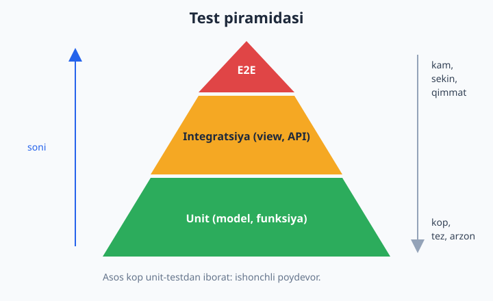
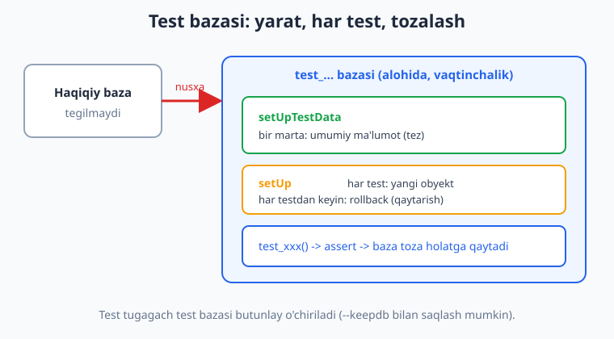
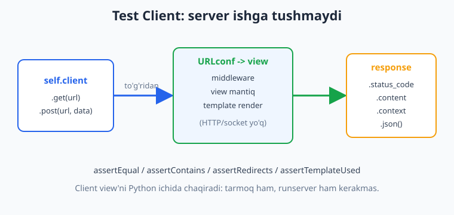

# 22 — Testlash

[⬅️ Oldingi: 21 — Async va fon vazifalari](./21-async-celery.md) · [🏠 README](./README.md) · [Keyingi: 23 — Settings, env va xavfsizlik ➡️](./23-settings-xavfsizlik.md)

---

> **Bu bobda:** Loyihangizni qo'rqmasdan o'zgartirishning yagona yo'li — **avtomatik testlar** bilan tanishamiz. Avval nega test kerakligini, **test piramidasi** (unit / integratsiya / E2E) nimaligini tushunamiz. Keyin Django'ning o'z asbobi `django.test.TestCase` bilan ishlaymiz: **test bazasi** qanday avtomatik yaratilib, har testdan keyin tozalanishi; `setUp` va `setUpTestData` farqi; `assertEqual`, `assertTrue`, `assertRaises` va boshqa tasdiqlar. So'ng **`Client`** bilan view'larni HTTP server ishga tushirmasdan sinaymiz — `get`/`post`, `assertContains` / `assertNotContains` / `assertRedirects` / `assertTemplateUsed`, login va `response.context`. **Model** va **view** testlarini alohida yozamiz. DRF API uchun **`APITestCase`** va **`APIClient`** (`force_authenticate`, `format="json"`, `assertJSONEqual`) ni o'rganamiz. Keyin ikkinchi mashhur asbob — **`pytest-django`**: `pytest`, `@pytest.mark.django_db`, **fixtures**, `parametrize`, `client` fikstura. Test ma'lumotini chiroyli yasash uchun **`factory-boy`** (`DjangoModelFactory`, `Sequence`, `SubFactory`, `LazyAttribute`). Oxirida **coverage** (qamrov) tushunchasi: kodning qancha qismi testdan o'tdi va bu raqamni qanday to'g'ri tushunish kerak. Versiyalar: Django 6.0.6, Python 3.14, djangorestframework 3.17, pytest-django 4.12, factory-boy 3.3, coverage 7.14. Bu bob Python'ni bilishni nazarda tutadi ([Python qo'llanma](../python/README.md)). Hamma kod Django 6.0.6 da haqiqatan ishga tushirib tekshirilgan.

---

## Nega test yozamiz?

Tasavvur qiling: loyihangizda yuzlab funksiya, view va model bor. Bitta kichik o'zgarish kiritdingiz — masalan, narxga chegirma hisoblash mantig'ini tahrirladingiz. Boshqa joyda nimadir buzilmaganini qanday bilasiz? Ikki yo'l bor:

1. **Qo'lda** — brauzerni ochib, har sahifani bosib chiqasiz. Sekin, zerikarli, va har doim bir narsani unutasiz.
2. **Avtomatik test** — bir buyruq yozasiz (`manage.py test`), Django esa daqiqalar emas, soniyalarda yuzlab holatni o'zi tekshirib beradi.

Test — bu sizning kodingizni sinaydigan **boshqa kod**. Uning eng katta foydasi tekshirish emas, balki **ishonch**: testlar yashil bo'lsa, kodni qo'rqmasdan qayta yozasiz (refactoring), kutubxonani yangilaysiz, yangi funksiya qo'shasiz. Test yo'q loyiha — har o'zgarish "uchadimi-yo'qmi" degan qo'rquv bilan kechadigan loyiha.

Testlarni qatlamlarga bo'lish odat tusiga kirgan — **test piramidasi**:



- **Unit (birlik) test** — bitta funksiya yoki model metodini izolyatsiyada sinaydi. Tez, arzon, ko'p bo'lishi kerak. Piramidaning keng asosi.
- **Integratsiya testi** — bir nechta qism birga ishlashini sinaydi: view + URL + template + baza. Django'da `Client` bilan yoziladigan testlar shu qatlamda.
- **E2E (end-to-end)** — haqiqiy brauzer butun tizimni boshdan-oxir sinaydi (masalan Selenium/Playwright bilan). Sekin va mo'rt, shu sababli kam bo'ladi. Bu bobda E2E'ga kirmaymiz, lekin Django'ning `LiveServerTestCase` shu maqsadda borligini bilib qo'ying.

Bu bob asosan past ikki qatlamga — **unit** va **integratsiya** ga bag'ishlangan, chunki kunlik ish vaqtingizning ko'pi shu yerda o'tadi.

> **Node.js bilan solishtirish.** Agar Jest/Mocha bilan tanish bo'lsangiz ([Node.js qo'llanma](../nodejs/README.md)), tushuncha bir xil: tasdiq (assert), setup/teardown, test "runner". Farqi shundaki, Django sizga **test bazasini avtomatik** boshqarib beradi — buni qo'lda sozlash kerak emas.

---

## Birinchi test: loyiha va modellar

Bob davomida kichik blog loyihasidan foydalanamiz. Modelimiz — `Maqola`: muallifi, sarlavhasi, holati (qoralama/chop) va narxi bor. Unda bitta `@property` va bitta hisoblovchi metod ham bor — aynan shularni sinaymiz.

`blog/models.py`:

```python
from django.conf import settings
from django.db import models
from django.urls import reverse


class Maqola(models.Model):
    HOLATLAR = [("qoralama", "Qoralama"), ("chop", "Chop etilgan")]
    muallif = models.ForeignKey(
        settings.AUTH_USER_MODEL, on_delete=models.CASCADE, related_name="maqolalar"
    )
    sarlavha = models.CharField(max_length=200)
    matn = models.TextField(blank=True)
    holat = models.CharField(max_length=10, choices=HOLATLAR, default="qoralama")
    narx = models.PositiveIntegerField(default=0)

    def __str__(self):
        return self.sarlavha

    def get_absolute_url(self):
        return reverse("maqola-detail", args=[self.pk])

    @property
    def chop_etilganmi(self):
        return self.holat == "chop"

    def chegirma_narx(self, foiz):
        if not (0 <= foiz <= 100):
            raise ValueError("foiz 0..100 oraligida bolishi kerak")
        return self.narx - self.narx * foiz // 100
```

Django testlari odatda har app'ning ichidagi `tests.py` (yoki `tests/` paketi) ichida yashaydi. Test klassi `django.test.TestCase` dan meros oladi, har metod nomi `test_` bilan boshlanadi — Django shu nomlarga qarab testlarni topadi.

Eng oddiy model testi:

```python
from django.contrib.auth.models import User
from django.test import TestCase

from .models import Maqola


class MaqolaModelTest(TestCase):
    def test_chegirma_narx(self):
        user = User.objects.create_user("ali", password="parol12345")
        maqola = Maqola.objects.create(muallif=user, sarlavha="Salom", narx=100)
        self.assertEqual(maqola.chegirma_narx(20), 80)
```

Ishga tushirish:

```bash
python manage.py test blog
```

Django avtomatik **alohida test bazasi** yaratadi (haqiqiy bazaga TEGMAYDI), test ichida `User` va `Maqola` yaratadi, tasdiqni tekshiradi, keyin hammasini tozalaydi.

> **Diqqat.** Test ichida yaratilgan `User`, `Maqola` va boshqa hamma yozuvlar **test tugagach yo'qoladi**. Haqiqiy bazangizdagi ma'lumotlar saqlanib qoladi. Buni keyingi bo'limda batafsil ko'ramiz.

---

## Test bazasi va izolyatsiya

Test bazasi — Django testlarining eng muhim va eng sehrli ko'ringan qismi. Ammo aslida juda oddiy.



Sodda so'z bilan:

1. `manage.py test` ishga tushganda Django **yangi, bo'sh** baza yaratadi. SQLite uchun u xotirada (`:memory:`) bo'ladi — juda tez. Nomi odatda `test_<sizning_baza>`.
2. Migratsiyalarni shu test bazasiga qo'llaydi — jadvallar paydo bo'ladi.
3. Har test metodini **alohida tranzaksiya** ichida ishlatadi. Test tugagach tranzaksiyani **rollback** qiladi (orqaga qaytaradi) — shu sababli bir test boshqasiga ta'sir qilmaydi.
4. Hamma testlar tugagach test bazasini **butunlay o'chiradi**.

Bu degani: **testlar tartibidan qat'i nazar bir xil natija beradi**, va testlar bir-birining ma'lumotini ko'rmaydi. Bu izolyatsiya — testlarga ishonishning asosi.

### `setUp` va `setUpTestData`

Ko'pincha bir nechta testga bir xil tayyor ma'lumot kerak bo'ladi. Uni har testda qayta yozmaslik uchun ikkita usul bor, va ular orasidagi farq muhim:

```python
from django.contrib.auth.models import User
from django.test import TestCase

from .models import Maqola


class MaqolaModelTest(TestCase):
    @classmethod
    def setUpTestData(cls):
        # BIR MARTA butun klass uchun. Tez, lekin yozuvlarni o'zgartirmang.
        cls.user = User.objects.create_user("ali", password="parol12345")
        cls.maqola = Maqola.objects.create(
            muallif=cls.user, sarlavha="Salom", narx=100, holat="chop"
        )

    def test_str(self):
        self.assertEqual(str(self.maqola), "Salom")

    def test_chop_etilganmi_property(self):
        self.assertTrue(self.maqola.chop_etilganmi)

    def test_chegirma_narx(self):
        self.assertEqual(self.maqola.chegirma_narx(20), 80)

    def test_chegirma_nochaqil_foiz(self):
        with self.assertRaises(ValueError):
            self.maqola.chegirma_narx(150)

    def test_get_absolute_url(self):
        self.assertEqual(self.maqola.get_absolute_url(), f"/{self.maqola.pk}/")
```

Farqi:

| | `setUp(self)` | `setUpTestData(cls)` |
|---|---|---|
| Qachon ishlaydi | **Har** test metodidan oldin | **Bir marta**, butun klass uchun |
| Tezlik | Sekinroq (takrorlanadi) | Tezroq (bir marta) |
| Qachon ishlatiladi | Test yozuvni **o'zgartiradigan** bo'lsa | Yozuv faqat **o'qiladigan** bo'lsa |

Qoida: agar ma'lumotni faqat o'qisangiz (str, property, list bo'yicha tekshirish) — `setUpTestData` ishlating, tez bo'ladi. Agar testda ma'lumotni o'zgartirsangiz — har test toza nusxa olishi uchun `setUp` xavfsizroq. (Aslida `setUpTestData` yaratgan obyekt har test boshida tranzaksiya bilan asliga qaytadi, lekin Python-darajadagi atributlar emas — shuning uchun yozuvni o'zgartiruvchi testlarda `setUp` aniqroq.)

> **Eslatma: `assertEqual` ichidagi argument tartibi.** `self.assertEqual(haqiqiy, kutilgan)` — birinchi argument kodingiz qaytargan qiymat, ikkinchisi siz kutgan qiymat. Test yiqilsa Django ikkalasini ko'rsatadi, shu sababli tartibni izchil saqlash xato matnini o'qishni osonlashtiradi.

### Eng ko'p ishlatiladigan tasdiqlar (assertlar)

| Tasdiq | Nima tekshiradi |
|--------|-----------------|
| `assertEqual(a, b)` | `a == b` |
| `assertNotEqual(a, b)` | `a != b` |
| `assertTrue(x)` / `assertFalse(x)` | `x` rost / yolg'on |
| `assertIsNone(x)` / `assertIsNotNone(x)` | `x is None` yoki emas |
| `assertIn(x, koll)` | `x in koll` |
| `assertRaises(Xato)` | blok ichida xato ko'tariladi |
| `assertGreater(a, b)` | `a > b` |
| `assertContains(resp, matn)` | javobda matn bor (faqat HTTP javobga) |

---

## View'larni `Client` bilan sinash

Model metodlarini sinash oson — funksiyani chaqirib natijani tekshirasiz. View'lar murakkabroq: ularga HTTP so'rov, URL routing, template render kerak. Django buning uchun **test `Client`** beradi — u **haqiqiy server ishga tushirmasdan** so'rovni view'ga yetkazadi.



`Client` `runserver`'ni ishga tushirmaydi, tarmoqdan foydalanmaydi. U Django'ning ichki so'rov mexanizmini chaqirib, sizga to'liq `response` obyektini qaytaradi. Har `TestCase` da `self.client` tayyor turadi.

View'larimiz (`blog/views.py`): ro'yxat faqat chop etilgan maqolalarni ko'rsatadi, detail qoralama uchun 404 qaytaradi, yaratish view'i login talab qiladi:

```python
from django.shortcuts import get_object_or_404, redirect, render

from .models import Maqola


def maqola_royxat(request):
    maqolalar = Maqola.objects.filter(holat="chop").order_by("-id")
    return render(request, "blog/royxat.html", {"maqolalar": maqolalar})


def maqola_detail(request, pk):
    maqola = get_object_or_404(Maqola, pk=pk, holat="chop")
    return render(request, "blog/detail.html", {"maqola": maqola})


def maqola_yarat(request):
    if not request.user.is_authenticated:
        return redirect("/accounts/login/")
    if request.method == "POST":
        maqola = Maqola.objects.create(
            muallif=request.user,
            sarlavha=request.POST["sarlavha"],
            matn=request.POST.get("matn", ""),
            holat="chop",
        )
        return redirect("maqola-detail", pk=maqola.pk)
    return render(request, "blog/yarat.html")
```

Endi view testlari. URL'larni qo'lda yozmasdan `reverse()` bilan olamiz (3-bobdagidek) — URL o'zgarsa testlar buzilmaydi:

```python
from django.contrib.auth.models import User
from django.test import TestCase
from django.urls import reverse

from .models import Maqola


class MaqolaViewTest(TestCase):
    def setUp(self):
        self.user = User.objects.create_user("vali", password="parol12345")
        self.chop = Maqola.objects.create(
            muallif=self.user, sarlavha="Korinadi", holat="chop"
        )
        self.qoralama = Maqola.objects.create(
            muallif=self.user, sarlavha="Korinmaydi", holat="qoralama"
        )

    def test_royxat_faqat_chop(self):
        resp = self.client.get(reverse("maqola-royxat"))
        self.assertEqual(resp.status_code, 200)
        self.assertContains(resp, "Korinadi")        # chop bor
        self.assertNotContains(resp, "Korinmaydi")   # qoralama yo'q
        self.assertTemplateUsed(resp, "blog/royxat.html")

    def test_detail_404_qoralama(self):
        resp = self.client.get(reverse("maqola-detail", args=[self.qoralama.pk]))
        self.assertEqual(resp.status_code, 404)

    def test_yarat_anonim_redirect(self):
        resp = self.client.get(reverse("maqola-yarat"))
        self.assertRedirects(resp, "/accounts/login/")

    def test_yarat_post_login(self):
        self.client.login(username="vali", password="parol12345")
        resp = self.client.post(
            reverse("maqola-yarat"),
            {"sarlavha": "Yangi", "matn": "Matn"},
        )
        yangi = Maqola.objects.get(sarlavha="Yangi")
        self.assertRedirects(resp, yangi.get_absolute_url())
        self.assertEqual(yangi.muallif, self.user)
```

E'tibor bering:

- **`self.client.get(url)`** / **`self.client.post(url, data)`** — `data` oddiy lug'at, form-data sifatida yuboriladi. POST'da CSRF avtomatik o'tkazib yuboriladi (test client uchun maxsus), demak `csrf_token` haqida tashvishlanmaysiz.
- **`assertContains(resp, "Korinadi")`** — javob HTML'ida shu matn borligini, **va** status 200 ekanini birvarakayiga tekshiradi. `assertNotContains` — aksincha.
- **`assertTemplateUsed(resp, "blog/royxat.html")`** — qaysi template render qilinganini tekshiradi.
- **`assertRedirects(resp, "/accounts/login/")`** — javob shu manzilga yo'naltirishini (302 -> keyin maqsad sahifa) tekshiradi.
- **`self.client.login(...)`** — keyingi so'rovlar uchun foydalanuvchini "kirgan" qiladi. (Tezroq variant: `self.client.force_login(user)` — parolni tekshirmaydi.)

POST so'rovdan keyin biz **bazadan** maqolani qayta o'qib (`Maqola.objects.get(...)`), view haqiqatan yangi yozuv yaratganini va to'g'ri muallif bog'laganini tasdiqladik. View testining mohiyati shu: tashqi (HTTP) natijani ham, ichki (baza) ta'sirini ham tekshirish.

> **`response` obyektidan yana nimalar bor:** `resp.context["maqolalar"]` (template'ga uzatilgan kontekst), `resp.json()` (JSON javob uchun), `resp["Content-Type"]` (sarlavha), `resp.redirect_chain` (`follow=True` bilan). Masalan kontekstni to'g'ridan-to'g'ri tekshirish:

```python
def test_royxat_konteksti(self):
    resp = self.client.get(reverse("maqola-royxat"))
    # template matniga emas, view bergan ma'lumotga qaraymiz
    self.assertEqual(list(resp.context["maqolalar"]), [self.chop])
```

---

## DRF API'ni sinash: `APITestCase`

15-17-boblardagi DRF API'lari oddiy view emas — ular JSON qabul qilib JSON qaytaradi, autentifikatsiya/ruxsatga ega. DRF buning uchun maxsus `APITestCase` va `APIClient` beradi. Ular Django'ning `TestCase`/`Client` ustiga qurilgan, lekin JSON va token autentifikatsiya bilan ishlashni osonlashtiradi.

API'imiz (`blog/api.py`) — ModelViewSet, anonim o'qiy oladi, lekin yozish uchun login kerak:

```python
from rest_framework import serializers, viewsets
from rest_framework.permissions import IsAuthenticatedOrReadOnly

from .models import Maqola


class MaqolaSerializer(serializers.ModelSerializer):
    class Meta:
        model = Maqola
        fields = ["id", "sarlavha", "matn", "holat", "narx", "muallif"]
        read_only_fields = ["muallif"]


class MaqolaViewSet(viewsets.ModelViewSet):
    queryset = Maqola.objects.all().order_by("id")
    serializer_class = MaqolaSerializer
    permission_classes = [IsAuthenticatedOrReadOnly]

    def perform_create(self, serializer):
        serializer.save(muallif=self.request.user)
```

API testlari:

```python
from django.contrib.auth.models import User
from rest_framework import status
from rest_framework.test import APITestCase

from .models import Maqola


class MaqolaAPITest(APITestCase):
    def setUp(self):
        self.user = User.objects.create_user("api", password="parol12345")
        self.maqola = Maqola.objects.create(
            muallif=self.user, sarlavha="API maqola", holat="chop"
        )

    def test_list_anonim_okay(self):
        resp = self.client.get("/api/maqolalar/")
        self.assertEqual(resp.status_code, status.HTTP_200_OK)
        self.assertEqual(len(resp.data), 1)

    def test_create_anonim_403(self):
        resp = self.client.post("/api/maqolalar/", {"sarlavha": "Yangi"})
        self.assertEqual(resp.status_code, status.HTTP_403_FORBIDDEN)

    def test_create_login(self):
        self.client.force_authenticate(self.user)   # token shart emas
        resp = self.client.post(
            "/api/maqolalar/",
            {"sarlavha": "Yangi API", "narx": 50},
            format="json",
        )
        self.assertEqual(resp.status_code, status.HTTP_201_CREATED)
        self.assertEqual(resp.data["muallif"], self.user.pk)
        self.assertEqual(Maqola.objects.count(), 2)
```

DRF testlarining muhim jihatlari:

- **`status.HTTP_200_OK`** — raqam `200` o'rniga nomli konstanta. O'qish osonroq va xato kamroq (`403_FORBIDDEN`, `201_CREATED` h.k.).
- **`resp.data`** — DRF javobining parse qilingan Python ma'lumoti (serializer chiqargan lug'at/ro'yxat). JSON satrini qayta o'qish kerak emas.
- **`format="json"`** — ma'lumotni JSON sifatida yuborish. Tavsiya etiladi: form-data emas, haqiqiy JSON yuborgan klientga o'xshaydi.
- **`self.client.force_authenticate(user)`** — eng qulay usul: token/parol o'rniga foydalanuvchini to'g'ridan-to'g'ri "kirgan" qiladi. (17-bobdagi JWT/Token bilan ham sinash mumkin: `self.client.credentials(HTTP_AUTHORIZATION=f"Bearer {token}")`, lekin testda `force_authenticate` ko'pincha yetarli va tezroq.)

JSON javobni butunligicha solishtirish uchun `assertJSONEqual` qulay (kalitlar tartibidan qat'i nazar):

```python
def test_detail_json(self):
    resp = self.client.get(f"/api/maqolalar/{self.maqola.pk}/")
    self.assertJSONEqual(resp.content, {
        "id": self.maqola.pk,
        "sarlavha": "API maqola",
        "matn": "",
        "holat": "chop",
        "narx": 0,
        "muallif": self.user.pk,
    })
```

---

## `pytest-django`: ikkinchi (ko'pchilik sevadigan) yo'l

Django'ning o'z `TestCase` tizimi yaxshi, lekin Python dunyosida eng mashhur test asbobi — **pytest**. `pytest-django` plagini Django'ni pytest bilan bog'laydi. Nega ko'pchilik pytest'ni afzal ko'radi?

- Test — oddiy **funksiya** bo'lishi mumkin, klass shart emas.
- `assert a == b` — oddiy Python `assert`, `self.assertEqual` shart emas. Yiqilganda pytest ikkala tomonni chiroyli ko'rsatadi.
- **Fixtures** — qayta ishlatiladigan tayyorgarlikni toza tarzda berish.
- **`parametrize`** — bitta testni ko'p qiymat bilan takrorlash.

O'rnatish va sozlash. `pytest.ini` (yoki `pyproject.toml`) loyiha ildizida:

```ini
[pytest]
DJANGO_SETTINGS_MODULE = mysite.settings
python_files = test_*.py tests_*.py *_test.py
```

`DJANGO_SETTINGS_MODULE` — pytest qaysi settings'ni ishlatishini bilishi uchun shart. `python_files` — pytest qaysi fayllarni test deb topishini belgilaydi.

Asosiy tushunchalar bitta faylda (`blog/test_pytest.py`):

```python
import pytest

from blog.factories import MaqolaFactory   # keyingi bo'limda
from blog.models import Maqola


@pytest.mark.django_db          # bu testga baza kerak
def test_maqola_yaratiladi():
    maqola = MaqolaFactory(sarlavha="Pytest maqola")
    assert maqola.pk is not None
    assert Maqola.objects.count() == 1


@pytest.mark.django_db
def test_chegirma():
    maqola = MaqolaFactory(narx=200)
    assert maqola.chegirma_narx(25) == 150


def test_chegirma_xato():
    # bazaga TEGMAYDI: obyektni saqlamasdan tekshiramiz, shuning uchun django_db kerakmas
    maqola = Maqola(narx=100)
    with pytest.raises(ValueError):
        maqola.chegirma_narx(-5)


@pytest.mark.parametrize("foiz,kutilgan", [(0, 100), (10, 90), (50, 50), (100, 0)])
def test_chegirma_jadval(foiz, kutilgan):
    maqola = Maqola(narx=100)
    assert maqola.chegirma_narx(foiz) == kutilgan
```

Diqqat qilinglar:

- **`@pytest.mark.django_db`** — eng muhim dekorator. pytest-django sukut bo'yicha testlarga bazaga kirishni **taqiqlaydi** (tasodifan haqiqiy bazaga yozib qo'ymaslik uchun). Bazaga tegadigan har test bu marker bilan belgilanishi shart. Tegmaydigan toza unit-testlarda (yuqoridagi `test_chegirma_xato`, `test_chegirma_jadval`) marker kerak emas — ular tezroq ham ishlaydi.
- **`@pytest.mark.parametrize`** — bitta test funksiyasi 4 ta holatda alohida ishlaydi. Yiqilsa qaysi qiymatda yiqilgani ko'rinadi.

### Fixtures va tayyor `client` fikstura

pytest fixtures — funksiyaga argument sifatida "tushadigan" tayyorgarlik. `conftest.py` ichida e'lon qilingan fikstura butun loyihaga ko'rinadi:

`conftest.py` (loyiha ildizida):

```python
import pytest

from blog.factories import MaqolaFactory, UserFactory


@pytest.fixture
def user(db):                    # 'db' — pytest-django ning tayyor fiksturasi
    return UserFactory(username="testchi")


@pytest.fixture
def maqola(db):
    return MaqolaFactory(sarlavha="Fixture maqola")
```

Testda fiksturani shunchaki argument nomi bilan so'raysiz:

```python
def test_fixture_maqola(maqola):          # 'maqola' fikstura avtomatik chaqiriladi
    assert maqola.sarlavha == "Fixture maqola"


def test_client_royxat(client, maqola):   # 'client' — pytest-django bergan test Client
    resp = client.get("/")
    assert resp.status_code == 200
    assert b"Fixture maqola" in resp.content
```

pytest-django ikkita foydali fikstura beradi:

- **`db`** — testga baza ruxsatini beradi (`@pytest.mark.django_db` ning fikstura ko'rinishi). Fikstura ichida ishlatish qulay.
- **`client`** — Django'ning `Client` obyekti (admin/login uchun `admin_client`, `client.force_login(...)` ham bor).

> **Qaysi birini tanlayman?** Ikkala uslub ham professional loyihalarda ishlatiladi. `TestCase` — Django bilan birga keladi, hech narsa o'rnatmaysiz, jamoa Django'ga odatlangan bo'lsa tabiiy. `pytest` — fixtures va parametrize tufayli yirik loyihada testlar qisqaroq va o'qishliroq bo'ladi. **Muhimi: bitta loyihada bittasini tanlab izchil ishlating.** pytest-django Django `TestCase` testlarini ham ishga tushira oladi, demak ikkalasini aralash saqlash ham mumkin.

---

## `factory-boy`: test ma'lumotini chiroyli yasash

Yuqoridagi misollarda `Maqola.objects.create(muallif=..., sarlavha=..., holat=...)` ni qayta-qayta yozdik. Maqolaga har safar muallif (User) ham kerak. Testlar o'sgani sayin bu tayyorgarlik zerikarli va mo'rt bo'ladi: modelga yangi majburiy maydon qo'shsangiz, o'nlab testni tuzatish kerak.

**factory-boy** shu muammoni yechadi: model uchun bir marta "fabrika" yozasiz, u oqilona standart qiymatlar bilan obyekt yasab beradi. Faqat testga muhim maydonni o'zingiz uzatasiz, qolganini fabrika to'ldiradi.

`blog/factories.py`:

```python
import factory
from django.contrib.auth.models import User

from .models import Maqola


class UserFactory(factory.django.DjangoModelFactory):
    class Meta:
        model = User

    username = factory.Sequence(lambda n: f"user{n}")            # user0, user1, ...
    email = factory.LazyAttribute(lambda o: f"{o.username}@misol.uz")


class MaqolaFactory(factory.django.DjangoModelFactory):
    class Meta:
        model = Maqola

    muallif = factory.SubFactory(UserFactory)   # avtomatik User ham yasaydi
    sarlavha = factory.Sequence(lambda n: f"Maqola {n}")
    holat = "chop"
    narx = 100
```

Asosiy "deklarator"lar:

- **`Sequence(lambda n: ...)`** — har chaqiruvda `n` 0, 1, 2 ... bo'lib o'sadi. `username` kabi noyob bo'lishi shart maydonlar uchun ajoyib: ikkita bir xil username tufayli xato chiqmaydi.
- **`LazyAttribute(lambda o: ...)`** — qiymat **boshqa maydonga** bog'liq bo'lganda. Bu yerda `email` `username` dan hosil bo'ladi.
- **`SubFactory(UserFactory)`** — bog'langan obyektni avtomatik yasaydi. `MaqolaFactory()` chaqirsangiz, u avval `UserFactory()` ni chaqirib muallif yasaydi.

Ishlatish — bir qator:

```python
maqola = MaqolaFactory()                       # to'liq, haqiqiy maqola (muallifi bilan)
maqola = MaqolaFactory(narx=500)               # faqat narxni o'zgartiramiz
maqolalar = MaqolaFactory.create_batch(5)      # bir zarbda 5 ta
qoralama = MaqolaFactory(holat="qoralama")     # boshqa holat
```

`build()` esa obyektni **bazaga saqlamasdan** yasaydi (`Maqola(...)` kabi) — toza unit-test uchun, `django_db` kerak bo'lmaganda foydali.

> **Solishtirish.** factory-boy bilan `MaqolaFactory(narx=500)` — bir qator. `objects.create(...)` bilan har gal muallif (User) ham yaratish, hamma majburiy maydonni to'ldirish kerak edi. Test o'qishliroq, modelga maydon qo'shilsa faqat fabrikani tuzatasiz — testlar tegmaydi.

---

## Coverage: kodning qancha qismi sinaldi?

"Testlarim yetarlimi?" degan savolga taxminiy javob beradigan o'lchov bor — **coverage (qamrov)**: testlar ishlaganda kodning qaysi qatorlari **bajarildi**, qaysilari **tegilmadi**. `coverage` kutubxonasi shuni hisoblaydi.

pytest bilan ishlatish (pytest-cov plagini orqali):

```bash
python -m pytest --cov=blog --cov-report=term-missing
```

Yoki Django `TestCase` bilan:

```bash
python -m coverage run --source=blog manage.py test blog
python -m coverage report -m
```

Natija taxminan shunday ko'rinadi (haqiqiy ishga tushgan natija):

```text
Name                    Stmts   Miss  Cover   Missing
-----------------------------------------------------
blog\api.py                14      1    93%   20
blog\models.py             21      2    90%   17, 24
blog\views.py              15      8    47%   12-27
-----------------------------------------------------
TOTAL                     167     73    56%
```

O'qish:

- **Stmts** — kod qatorlari (operatorlar) soni.
- **Miss** — sinalmagan (bajarilmagan) qatorlar.
- **Cover** — qamrov foizi.
- **Missing** — aynan qaysi qatorlar tegilmadi (masalan `views.py: 12-27` — login/POST tarmoqlari shu pytest testlarida sinalmagan).

HTML hisobot (har qatorni rangli ko'rsatadi — qaysi qator yashil/qizil) ham juda foydali:

```bash
python -m coverage html
# keyin htmlcov/index.html ni brauzerda oching
```

> **Eng muhim ogohlantirish: 100% coverage "xatosiz" degani EMAS.** Coverage faqat qator **bajarilganini** o'lchaydi, uning **to'g'ri** ekanini emas. Test `chegirma_narx(20)` ni chaqirib natijani **umuman tekshirmasa** ham, o'sha qator "qamralgan" sanaladi. Coverage — bo'sh joylarni ko'rsatadigan **xarita**, sifat o'lchovi emas. 70-80% — ko'p loyiha uchun amaliy maqsad; 100% ortidan quvish ko'pincha qimmatli, lekin past foydali testlarga olib keladi. Sinalmagan **muhim** mantiqqa e'tibor bering, raqamning o'ziga emas.

---

## Foydali buyruqlar va maslahatlar

Kundalik ishda asqotadigan bayroqlar:

```bash
# Faqat bitta app, klass yoki metodni ishga tushirish
python manage.py test blog
python manage.py test blog.tests.MaqolaViewTest
python manage.py test blog.tests.MaqolaViewTest.test_detail_404_qoralama

# Test bazasini har safar qayta yaratmay, saqlab qolish (tezroq)
python manage.py test --keepdb

# Birinchi xatoda to'xtash
python manage.py test --failfast

# Testlarni parallel ishga tushirish (ko'p yadroda tezroq)
python manage.py test --parallel
```

`@tag` bilan testlarni guruhlab, faqat keraklisini ishga tushirish mumkin:

```python
from django.test import TestCase, tag


@tag("sekin")
class TashqiAPITest(TestCase):
    def test_belgilangan(self):
        ...
```

```bash
python manage.py test --tag=sekin       # faqat 'sekin' belgili testlar
python manage.py test --exclude-tag=sekin  # 'sekin' larsiz
```

pytest tomonida o'xshash:

```bash
python -m pytest -k "royxat"      # nomida 'royxat' bor testlar
python -m pytest -x               # birinchi xatoda to'xtash
python -m pytest -q               # qisqa chiqish
python -m pytest --reuse-db       # bazani qayta ishlatish (--keepdb ga o'xshash)
```

Ataylab **noto'g'ri** test — o'quvchi farqni ko'rsin:

```python
# ❌ Bu test HECH NARSANI tekshirmaydi — assert yo'q.
def test_yomon(self):
    maqola = Maqola.objects.create(muallif=self.user, sarlavha="X")
    maqola.chegirma_narx(20)   # natija tashlab yuborildi -> har doim "o'tadi"

# ✅ To'g'ri: natijani tasdiqlaymiz
def test_yaxshi(self):
    maqola = Maqola.objects.create(muallif=self.user, sarlavha="X", narx=100)
    self.assertEqual(maqola.chegirma_narx(20), 80)
```

> **CI bilan bog'lanish.** Testlar eng katta foydani avtomatik ishga tushganda beradi: har `git push` da GitHub Actions ularni o'zi ishga tushiradi, yiqilsa PR'ni qizil qiladi. Buni [Git va GitHub bobida](../git-github/README.md) ko'rasiz — bu yerda yozgan `manage.py test` yoki `pytest` buyrug'i o'sha yerda aynan ishlatiladi.

---

## Mashqlar

### Oson

1. `Maqola` modeliga `chop_etilganmi` property uchun **ikkita** test yozing: holat `"chop"` bo'lsa `True`, `"qoralama"` bo'lsa `False`. `assertTrue`/`assertFalse` ishlating.
2. `__str__` metodi sarlavhani qaytarishini tekshiradigan test yozing (`setUpTestData` ishlatib).
3. `maqola_royxat` view'i status `200` qaytarishini va `blog/royxat.html` template ishlatishini tekshiruvchi test yozing.
4. `assertEqual` va `assertContains` orasidagi farqni o'z so'zingiz bilan tushuntiring: qaysi biri HTTP javobiga, qaysi biri har qanday qiymatga ishlaydi?
5. `setUp` va `setUpTestData` orasidagi farqni ayting: qaysi biri har testdan oldin, qaysi biri bir marta ishlaydi?
6. `@pytest.mark.django_db` nima uchun kerakligini va qaysi testlarda kerak EMASligini tushuntiring.

### O'rta

7. `chegirma_narx()` metodi uchun pytest `parametrize` bilan kamida 4 holatni sinaydigan test yozing (narx 100, turli foizlar).
8. `chegirma_narx()` ga noto'g'ri foiz (`-10` yoki `200`) berilganda `ValueError` ko'tarilishini ikki uslubda sinang: (a) `TestCase` da `assertRaises`, (b) pytest'da `pytest.raises`.
9. Anonim foydalanuvchi `maqola_yarat` sahifasiga GET qilganda `/accounts/login/` ga yo'naltirilishini `assertRedirects` bilan tekshiring.
10. `MaqolaFactory` yozing va `create_batch(3)` bilan 3 ta maqola yasab, `Maqola.objects.count() == 3` ekanini pytest testida tasdiqlang.
11. `maqola_royxat` view'i **faqat** chop etilgan maqolalarni ko'rsatishini tekshiring: bitta chop, bitta qoralama yarating; `assertContains` chop sarlavhasini, `assertNotContains` qoralama sarlavhasini topsin.
12. DRF API'da anonim foydalanuvchi `POST /api/maqolalar/` qilganda `403` qaytishini `APITestCase` bilan tekshiring.

### Qiyin

13. To'liq oqimni sinang (`APITestCase`): foydalanuvchini `force_authenticate` qiling, `POST` bilan maqola yarating (`format="json"`), javob `201` ekanini, `resp.data["muallif"]` to'g'ri user pk ekanini va bazada maqola soni 1 ga oshganini tasdiqlang.
14. `conftest.py` da `user` va `chop_maqola` fiksturalarini yozing (factory-boy ishlatib). So'ng `client` va `chop_maqola` fiksturalarini olib, ro'yxat sahifasida maqola ko'rinishini tekshiruvchi test yozing.
15. Berilgan **yomon** testni tuzating: u `chegirma_narx` ni chaqiradi, lekin natijani tekshirmaydi (assert yo'q). To'g'ri assert qo'shing va nega avvalgi test "har doim o'taverishi" mumkinligini tushuntiring.
16. `blog` app'ingiz uchun coverage hisobotini ishga tushiring (`pytest --cov=blog --cov-report=term-missing`). Sinalmagan qatorni toping, o'sha mantiqni qoplaydigan yangi test yozing va foiz oshganini ko'rsating.

<details markdown="1">
<summary>Yechimlar</summary>

**1.**

```python
from django.contrib.auth.models import User
from django.test import TestCase
from blog.models import Maqola


class PropertyTest(TestCase):
    @classmethod
    def setUpTestData(cls):
        cls.user = User.objects.create_user("u", password="parol12345")

    def test_chop(self):
        m = Maqola.objects.create(muallif=self.user, sarlavha="A", holat="chop")
        self.assertTrue(m.chop_etilganmi)

    def test_qoralama(self):
        m = Maqola.objects.create(muallif=self.user, sarlavha="B", holat="qoralama")
        self.assertFalse(m.chop_etilganmi)
```

**2.**

```python
class StrTest(TestCase):
    @classmethod
    def setUpTestData(cls):
        user = User.objects.create_user("u", password="parol12345")
        cls.maqola = Maqola.objects.create(muallif=user, sarlavha="Salom dunyo")

    def test_str(self):
        self.assertEqual(str(self.maqola), "Salom dunyo")
```

**3.**

```python
from django.urls import reverse


class RoyxatTest(TestCase):
    def test_status_va_template(self):
        resp = self.client.get(reverse("maqola-royxat"))
        self.assertEqual(resp.status_code, 200)
        self.assertTemplateUsed(resp, "blog/royxat.html")
```

**4.** `assertEqual(a, b)` — istalgan ikki Python qiymatini taqqoslaydi (`a == b`). `assertContains(resp, matn)` faqat **HTTP javob** obyektiga ishlaydi: javob status'i 200 ekanini **va** HTML/matn ichida berilgan satr borligini birvarakayiga tekshiradi. Demak `assertContains` — view/template natijasini sinash uchun, `assertEqual` — har qanday qiymat (son, list, model atributi) uchun.

**5.** `setUp(self)` **har** test metodidan oldin qayta ishlaydi — har test toza, yangi tayyorgarlik oladi (lekin sekinroq). `setUpTestData(cls)` butun test klassi uchun **bir marta** ishlaydi — tezroq, lekin ma'lumotni faqat o'qiydigan testlar uchun mos. Yozuvni o'zgartiradigan testlarda `setUp` xavfsizroq.

**6.** `pytest-django` testlarga bazaga kirishni sukut bo'yicha **bloklaydi** (tasodifan ma'lumotga yozib qo'ymaslik uchun). Bazaga tegadigan (yozuv yaratadigan/o'qiydigan) testlarga `@pytest.mark.django_db` shart. Lekin obyektni **saqlamasdan** ishlatadigan toza funksiya/metod testlariga (masalan `Maqola(narx=100).chegirma_narx(20)`) baza kerak emas — marker qo'ymasa ham ishlaydi va tezroq bo'ladi.

**7.**

```python
import pytest
from blog.models import Maqola


@pytest.mark.parametrize("foiz,kutilgan", [(0, 100), (10, 90), (50, 50), (100, 0)])
def test_chegirma(foiz, kutilgan):
    maqola = Maqola(narx=100)      # saqlamaymiz -> django_db kerakmas
    assert maqola.chegirma_narx(foiz) == kutilgan
```

**8.**

```python
# (a) TestCase
from django.test import TestCase
from blog.models import Maqola


class XatoTest(TestCase):
    def test_assert_raises(self):
        maqola = Maqola(narx=100)
        with self.assertRaises(ValueError):
            maqola.chegirma_narx(200)


# (b) pytest
import pytest


def test_pytest_raises():
    maqola = Maqola(narx=100)
    with pytest.raises(ValueError):
        maqola.chegirma_narx(-10)
```

**9.**

```python
from django.urls import reverse
from django.test import TestCase


class YaratRedirectTest(TestCase):
    def test_anonim_redirect(self):
        resp = self.client.get(reverse("maqola-yarat"))
        self.assertRedirects(resp, "/accounts/login/")
```

**10.**

```python
# blog/factories.py
import factory
from django.contrib.auth.models import User
from blog.models import Maqola


class UserFactory(factory.django.DjangoModelFactory):
    class Meta:
        model = User
    username = factory.Sequence(lambda n: f"user{n}")


class MaqolaFactory(factory.django.DjangoModelFactory):
    class Meta:
        model = Maqola
    muallif = factory.SubFactory(UserFactory)
    sarlavha = factory.Sequence(lambda n: f"Maqola {n}")
    holat = "chop"


# test
import pytest
from blog.factories import MaqolaFactory
from blog.models import Maqola


@pytest.mark.django_db
def test_batch():
    MaqolaFactory.create_batch(3)
    assert Maqola.objects.count() == 3
```

**11.**

```python
from django.contrib.auth.models import User
from django.test import TestCase
from django.urls import reverse
from blog.models import Maqola


class FiltrTest(TestCase):
    def setUp(self):
        u = User.objects.create_user("u", password="parol12345")
        Maqola.objects.create(muallif=u, sarlavha="Korinadi", holat="chop")
        Maqola.objects.create(muallif=u, sarlavha="Yashirin", holat="qoralama")

    def test_faqat_chop(self):
        resp = self.client.get(reverse("maqola-royxat"))
        self.assertContains(resp, "Korinadi")
        self.assertNotContains(resp, "Yashirin")
```

**12.**

```python
from rest_framework import status
from rest_framework.test import APITestCase


class AnonPostTest(APITestCase):
    def test_post_403(self):
        resp = self.client.post("/api/maqolalar/", {"sarlavha": "X"})
        self.assertEqual(resp.status_code, status.HTTP_403_FORBIDDEN)
```

**13.**

```python
from django.contrib.auth.models import User
from rest_framework import status
from rest_framework.test import APITestCase
from blog.models import Maqola


class CreateOqimTest(APITestCase):
    def setUp(self):
        self.user = User.objects.create_user("api", password="parol12345")

    def test_toliq_oqim(self):
        self.client.force_authenticate(self.user)
        resp = self.client.post(
            "/api/maqolalar/",
            {"sarlavha": "Yangi", "narx": 50},
            format="json",
        )
        self.assertEqual(resp.status_code, status.HTTP_201_CREATED)
        self.assertEqual(resp.data["muallif"], self.user.pk)
        self.assertEqual(Maqola.objects.count(), 1)
```

**14.**

```python
# conftest.py
import pytest
from blog.factories import MaqolaFactory, UserFactory


@pytest.fixture
def user(db):
    return UserFactory(username="testchi")


@pytest.fixture
def chop_maqola(db):
    return MaqolaFactory(sarlavha="Korinadigan", holat="chop")


# test_pytest.py
def test_royxatda_korinadi(client, chop_maqola):
    resp = client.get("/")
    assert resp.status_code == 200
    assert b"Korinadigan" in resp.content
```

**15.**

```python
# ❌ Yomon: natija tekshirilmaydi -> chegirma_narx noto'g'ri ishlasa ham "o'tadi"
def test_yomon(self):
    m = Maqola(narx=100)
    m.chegirma_narx(20)

# ✅ Tuzatilgan: natijani tasdiqlaymiz
def test_yaxshi(self):
    m = Maqola(narx=100)
    self.assertEqual(m.chegirma_narx(20), 80)
```

Tushuntirish: test faqat kod **xato ko'tarsa** yiqiladi. Assert bo'lmagan testda metod chaqiriladi-yu, natija solishtirilmaydi — shu sababli metod `80` o'rniga `999` qaytarsa ham test "yashil" qoladi. Coverage uni "qamralgan" deb ko'rsatadi, lekin u aslida hech narsani himoya qilmaydi. Har test kamida bitta mazmunli `assert` bilan tugashi kerak.

**16.**

```bash
python -m pytest --cov=blog --cov-report=term-missing
```

Masalan hisobot `blog/views.py` da `maqola_yarat` ning login/POST tarmoqlari (`12-27`) sinalmaganini ko'rsatsa, o'sha mantiqni qoplovchi test qo'shamiz:

```python
from django.contrib.auth.models import User
from django.test import TestCase
from django.urls import reverse
from blog.models import Maqola


class YaratPostTest(TestCase):
    def test_login_post(self):
        User.objects.create_user("u", password="parol12345")
        self.client.login(username="u", password="parol12345")
        resp = self.client.post(reverse("maqola-yarat"),
                                {"sarlavha": "Yangi", "matn": "M"})
        yangi = Maqola.objects.get(sarlavha="Yangi")
        self.assertRedirects(resp, yangi.get_absolute_url())
```

Bu testni qo'shgach coverage'ni qayta ishga tushiring — `views.py` foizi sezilarli oshadi, chunki avval tegilmagan POST tarmog'i endi bajariladi. Eslatma: foiz oshgani yaxshi, lekin asosiy maqsad — **muhim mantiqni** (yozuv yaratish va to'g'ri yo'naltirish) tasdiqlash.

</details>

---

[⬅️ Oldingi: 21 — Async va fon vazifalari](./21-async-celery.md) · [🏠 README](./README.md) · [Keyingi: 23 — Settings, env va xavfsizlik ➡️](./23-settings-xavfsizlik.md)
