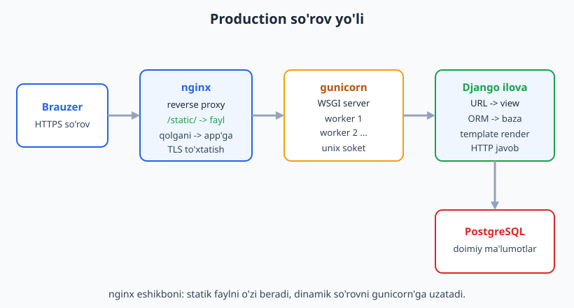
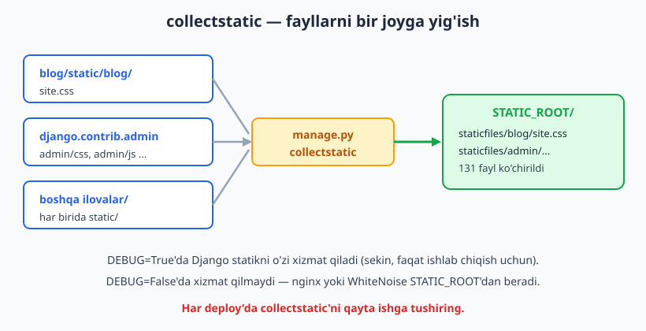
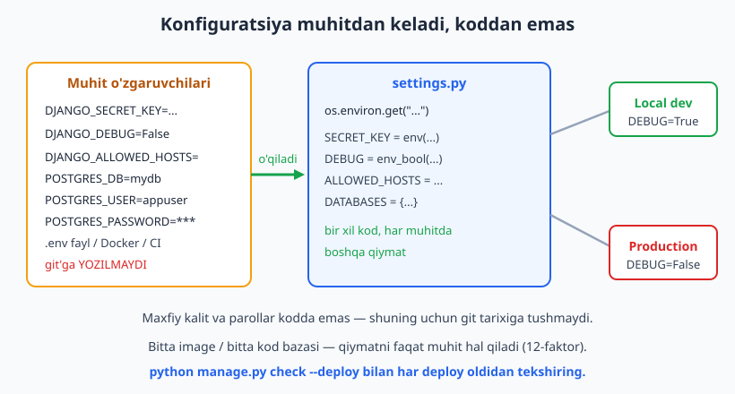

# 24 — Deployment (production)

[⬅️ Oldingi: 23 — Settings, env va xavfsizlik](./23-settings-xavfsizlik.md) · [🏠 README](./README.md) · [Keyingi: 25 — Yakuniy kapston loyiha ➡️](./25-kapston.md)

---

> **Bu bobda:** ilovangizni o'z kompyuteringizdan chiqarib, internetda haqiqiy foydalanuvchilarga ko'rsatishni o'rganamiz. Avval **nega `runserver` production'ga yaramasligini** va to'g'ri arxitektura qanaqaligini ko'ramiz: brauzer -> **nginx** (reverse proxy) -> **gunicorn/uvicorn** (WSGI/ASGI server) -> **Django** -> **PostgreSQL**. Keyin **WSGI va ASGI** farqini tushunamiz va `gunicorn`/`uvicorn` qanday ishga tushishini ko'ramiz. **nginx**ni reverse proxy sifatida sozlaymiz — statik fayllarni o'zi xizmat qiladi, dinamik so'rovlarni Django'ga uzatadi. SQLite'dan **PostgreSQL**'ga o'tamiz (`psycopg`, env'dan keladigan `DATABASES`). Statik fayllarni **`collectstatic`** bilan bitta papkaga yig'amiz va **WhiteNoise** bilan Django'ning o'zidan ham xizmat qilishni ko'ramiz. Hamma sozlamani **muhit o'zgaruvchilari** (env) orqali boshqaramiz — 12-faktor uslubi. Loyihani **Docker**ga (`Dockerfile`, `docker-compose.yml`) joylaymiz. Oxirida **CI/CD** g'oyasini ko'rib chiqamiz ([Git va GitHub qo'llanma](../git-github/README.md)) va **deploy checklist**ni `python manage.py check --deploy` bilan tekshiramiz. Bu bob Python'ni bilishni nazarda tutadi ([Python qo'llanma](../python/README.md)); baza tushunchalari foydali ([SQL qo'llanma](../sql/README.md)); Node.js deploy bilan solishtirish ([Node.js qo'llanma](../nodejs/README.md)). **Halol ogohlantirish:** gunicorn, nginx, PostgreSQL serveri va Docker bu Windows test muhitida **ishga tushirilmagan** — ular **illustrativ** (kod va konfiguratsiya to'g'ri, lekin server kerak). Django'ga xos hamma narsa — `settings`, env'dan o'qish, `DATABASES` shakli, `collectstatic`, `check --deploy`, WSGI/ASGI entry point'lari — **Django 6.0.6 da haqiqatan ishga tushirib tekshirilgan** (baza uchun SQLite ishlatildi).

---

## Nega `runserver` production uchun yaramaydi?

Butun kitob davomida `python manage.py runserver` ishlatdik. U ishlab chiqish (development) uchun ajoyib: avto-qayta yuklash, aniq xato sahifalari, sodda. Lekin Django hujjatlari aniq ogohlantiradi — **`runserver`ni hech qachon production'da ishlatmang**. Sabablari:

- **Bir vaqtda bitta-ikkita so'rov.** `runserver` yuzlab parallel foydalanuvchini ko'tara olmaydi.
- **Xavfsizlik tekshirilmagan.** U faqat ishlab chiqish uchun, audit qilinmagan.
- **Statik fayllarni sekin beradi.** Har faylni Python orqali uzatadi.
- **Avto-qayta yuklash xotira yeydi**, va `DEBUG=True` xatolarni ochiq ko'rsatadi (maxfiy ma'lumot sizib chiqishi mumkin).

Production'da boshqa qatlamlar kerak. Eng keng tarqalgan arxitektura quyidagicha:



So'rov yo'li:

1. **Brauzer** HTTPS so'rov yuboradi.
2. **nginx** (reverse proxy) so'rovni qabul qiladi. TLS'ni (HTTPS) shu yerda "to'xtatadi". Agar so'rov `/static/`ga bo'lsa — faylni o'zi beradi. Aks holda Django'ga uzatadi.
3. **gunicorn** (WSGI server) Django'ni ishga tushirib, so'rovni unga beradi. Bir nechta **worker** jarayoni parallel ishlaydi.
4. **Django** URL -> view -> ORM -> template orqali javob tayyorlaydi.
5. **PostgreSQL** doimiy ma'lumotlarni saqlaydi.

Har bir qatlam o'z ishini eng yaxshi qiladi: nginx — tez I/O va statik, gunicorn — Python jarayonlarini boshqarish, Django — biznes mantiq, PostgreSQL — ma'lumot.

> **Eslatma:** Node.js'da odatda Express/Fastify ilovasini to'g'ridan-to'g'ri ishga tushirish keng tarqalgan, lekin u yerda ham production'da ko'pincha nginx old qatlam sifatida turadi ([Node.js qo'llanma](../nodejs/README.md)). Tamoyil bir xil.

---

## WSGI va ASGI — Django va server o'rtasidagi til

Django va veb-server bir-biri bilan qanday gaplashadi? Ular o'rtasida **standart interfeys** kerak — shunda istalgan serverni istalgan ilova bilan birlashtirish mumkin. Python'da ikkita bunday standart bor:

- **WSGI** (Web Server Gateway Interface) — **sinxron**. Bitta so'rov kelganda worker uni to'liq qayta ishlamaguncha band bo'ladi. Klassik Django uchun yetarli. Server: **gunicorn**.
- **ASGI** (Asynchronous Server Gateway Interface) — **asinxron**. WebSocket, uzoq so'rovlar, `async` view'lar uchun. Server: **uvicorn** (yoki gunicorn + uvicorn worker).

`startproject` ikkala entry point'ni ham yaratadi: `config/wsgi.py` va `config/asgi.py`. Ular ichida `application` nomli obyekt bor — server aynan shuni qidiradi.

```python
# config/wsgi.py — gunicorn shu obyektni topadi
import os
from django.core.wsgi import get_wsgi_application

os.environ.setdefault("DJANGO_SETTINGS_MODULE", "config.settings")
application = get_wsgi_application()
```

```python
# config/asgi.py — uvicorn shu obyektni topadi
import os
from django.core.asgi import get_asgi_application

os.environ.setdefault("DJANGO_SETTINGS_MODULE", "config.settings")
application = get_asgi_application()
```

Bu ikki `application` obyekti — Django'ga kirish eshigi. Ularni Django o'zi yaratadi, biz faqat to'g'ri sozlama moduliga ishora qilamiz. Quyidagi tekshiruv har ikkalasi ham yuklanishini va chaqirilishi mumkinligini (callable) ko'rsatadi — bu **haqiqatan tekshirildi**:

```python
# tekshiruv: ikkala entry point ham yuklanadi (RUN qilindi)
import os
os.environ.setdefault("DJANGO_SETTINGS_MODULE", "config.settings")
from config.wsgi import application as wsgi_app
from config.asgi import application as asgi_app
print("WSGI callable:", callable(wsgi_app))  # True
print("ASGI callable:", callable(asgi_app))  # True
print(type(wsgi_app).__name__, type(asgi_app).__name__)  # WSGIHandler ASGIHandler
```

Natija (haqiqiy):

```
WSGI callable: True
ASGI callable: True
WSGIHandler ASGIHandler
```

> **Qaysi birini tanlash?** Agar `async` view, WebSocket yoki SSE kerak bo'lmasa — WSGI + gunicorn yetarli va sodda. Async kerak bo'lsa — ASGI + uvicorn. Ko'p loyiha WSGI bilan boshlaydi.

---

## gunicorn — WSGI server (illustrativ)

`gunicorn` (Green Unicorn) — eng mashhur WSGI server. U `config.wsgi:application`ni topib, bir nechta worker jarayonida ishga tushiradi.

> **Halol:** `gunicorn` bu Windows muhitida o'rnatilmagan va asosan Linux uchun. Quyidagilar **illustrativ** — buyruq va konfiguratsiya **to'g'ri**, lekin biz uni shu yerda ishga tushirmadik.

O'rnatish va ishga tushirish:

```bash
# ILLUSTRATIV — Linux production serverda
pip install gunicorn

# config.wsgi modulidagi application obyektini ishga tushiradi
gunicorn config.wsgi:application --bind 0.0.0.0:8000 --workers 3
```

`--workers` soni odatda `(2 x CPU yadrosi) + 1` formulasi bilan tanlanadi. nginx orqasida turganda ko'pincha unix soket ishlatiladi (TCP'dan tezroq):

```bash
# ILLUSTRATIV — unix soket orqali (nginx shu soketga ulanadi)
gunicorn config.wsgi:application \
    --bind unix:/run/myapp/gunicorn.sock \
    --workers 3 \
    --timeout 60 \
    --access-logfile - \
    --error-logfile -
```

Konfiguratsiyani faylga ham yozish mumkin:

```python
# gunicorn.conf.py — ILLUSTRATIV
bind = "unix:/run/myapp/gunicorn.sock"
workers = 3
timeout = 60
accesslog = "-"   # stdout'ga log
errorlog = "-"
```

Keyin shunchaki `gunicorn -c gunicorn.conf.py config.wsgi:application`.

**ASGI uchun uvicorn:**

```bash
# ILLUSTRATIV — async ilova uchun
pip install "uvicorn[standard]"
uvicorn config.asgi:application --host 0.0.0.0 --port 8000 --workers 3
```

Yoki gunicorn'ni uvicorn worker bilan birga (eng keng tarqalgan production sozlamasi):

```bash
# ILLUSTRATIV — gunicorn jarayon menejeri + uvicorn worker
gunicorn config.asgi:application \
    -k uvicorn.workers.UvicornWorker \
    --bind 0.0.0.0:8000 --workers 3
```

> **Muhim:** gunicorn/uvicorn statik fayllarni xizmat qilmaydi va qilmasligi kerak ham. Buni nginx yoki WhiteNoise qiladi (pastda ko'ramiz).

---

## nginx — reverse proxy va statik xizmat (illustrativ)

**nginx** — eshikbon. U tashqi dunyo bilan birinchi gaplashadi va ikki vazifani bajaradi:

1. **Statik fayllar** (`/static/`, `/media/`) so'rovini — to'g'ridan-to'g'ri diskdan, Python'siz, juda tez beradi.
2. Qolgan so'rovlarni gunicorn'ga **uzatadi** (proxy_pass).

> **Halol:** nginx bu muhitda o'rnatilmagan/ishga tushirilmagan. Quyidagi konfiguratsiya **to'g'ri** va tipik, lekin **illustrativ**.

```nginx
# /etc/nginx/sites-available/myapp  — ILLUSTRATIV
server {
    listen 80;
    server_name example.com www.example.com;

    # Statik fayllar — nginx o'zi beradi (collectstatic STATIC_ROOT'ga yig'gan)
    location /static/ {
        alias /srv/myapp/staticfiles/;
        expires 30d;
        access_log off;
    }

    # Foydalanuvchi yuklagan media fayllar
    location /media/ {
        alias /srv/myapp/media/;
    }

    # Qolgan hamma so'rov -> gunicorn (unix soket)
    location / {
        proxy_pass http://unix:/run/myapp/gunicorn.sock;
        proxy_set_header Host $host;
        proxy_set_header X-Real-IP $remote_addr;
        proxy_set_header X-Forwarded-For $proxy_add_x_forwarded_for;
        proxy_set_header X-Forwarded-Proto $scheme;  # Django HTTPS'ni shu orqali biladi
    }
}
```

E'tibor bering: `X-Forwarded-Proto` header'i muhim. nginx TLS'ni o'zida to'xtatib, gunicorn'ga oddiy HTTP yuboradi. Django esa "men HTTPS orqali keldimi?" deb shu header'ga qaraydi. Buning uchun `settings.py`da:

```python
# settings.py — nginx orqasida HTTPS'ni to'g'ri aniqlash
SECURE_PROXY_SSL_HEADER = ("HTTP_X_FORWARDED_PROTO", "https")
```

HTTPS uchun TLS sertifikatini bepul **Let's Encrypt** (certbot) beradi:

```bash
# ILLUSTRATIV — bepul HTTPS sertifikat
sudo certbot --nginx -d example.com -d www.example.com
```

> **DEBUG=True'da Django statikni o'zi beradi** (`runserver` qulayligi uchun). **DEBUG=False'da bermaydi** — shuning uchun production'da albatta nginx yoki WhiteNoise kerak. Buni keyingi bo'limlarda hal qilamiz.

---

## SQLite'dan PostgreSQL'ga o'tish

Butun kitob davomida SQLite ishlatdik — fayl bazasi, hech narsa o'rnatish shart emas, ishlab chiqish uchun ideal. Lekin production'da uning kamchiliklari bor:

- Parallel **yozish** so'rovlarini yaxshi ko'tarmaydi (bitta vaqtda bitta yozuvchi).
- Tarmoq orqali ishlamaydi (faqat lokal fayl).
- Replikatsiya, kuchli turlar, ilg'or indekslar yo'q.

Production uchun standart tanlov — **PostgreSQL**. Django 6.0 unga `psycopg` (versiya 3) drayveri orqali ulanadi.

> **Halol:** PostgreSQL serveri bu muhitda yo'q va `psycopg` o'rnatilmagan. Pastdagi `DATABASES` konfiguratsiya **to'g'ri** va biz uning **shaklini env'dan to'g'ri qurilishini haqiqatan tekshirdik**, lekin haqiqiy ulanish **illustrativ** (server kerak). RUN paytida SQLite ishlatildi.

Drayverni o'rnatish:

```bash
# ILLUSTRATIV — PostgreSQL drayveri (Django 6.0 psycopg 3 ni afzal ko'radi)
pip install "psycopg[binary]"
```

`settings.py`da `DATABASES`ni env o'zgaruvchilaridan quramiz — shunda parol kodda turmaydi:

```python
# settings.py — PostgreSQL konfiguratsiyasi (server illustrativ, shakl tekshirilgan)
import os

DATABASES = {
    "default": {
        "ENGINE": "django.db.backends.postgresql",
        "NAME": os.environ["POSTGRES_DB"],
        "USER": os.environ["POSTGRES_USER"],
        "PASSWORD": os.environ["POSTGRES_PASSWORD"],
        "HOST": os.environ.get("POSTGRES_HOST", "127.0.0.1"),
        "PORT": os.environ.get("POSTGRES_PORT", "5432"),
        "CONN_MAX_AGE": 60,  # ulanishni 60s qayta ishlatish (ulanishlar pooli)
    }
}
```

Amaliy yondashuv: **env bor bo'lsa PostgreSQL, bo'lmasa SQLite** — shunda bir xil kod lokal va production'da ishlaydi:

```python
# settings.py — env'ga qarab baza tanlash (shu mantiq RUN qilib tekshirildi)
import os
from pathlib import Path

BASE_DIR = Path(__file__).resolve().parent.parent

if os.environ.get("POSTGRES_DB"):
    DATABASES = {
        "default": {
            "ENGINE": "django.db.backends.postgresql",
            "NAME": os.environ["POSTGRES_DB"],
            "USER": os.environ["POSTGRES_USER"],
            "PASSWORD": os.environ["POSTGRES_PASSWORD"],
            "HOST": os.environ.get("POSTGRES_HOST", "127.0.0.1"),
            "PORT": os.environ.get("POSTGRES_PORT", "5432"),
            "CONN_MAX_AGE": 60,
        }
    }
else:
    DATABASES = {
        "default": {
            "ENGINE": "django.db.backends.sqlite3",
            "NAME": BASE_DIR / "db.sqlite3",
        }
    }
```

Bu mantiqni biz env o'zgaruvchilarini berib **haqiqatan tekshirdik**. `POSTGRES_DB` va boshqalar berilganda hosil bo'lgan lug'at:

```json
{
  "ENGINE": "django.db.backends.postgresql",
  "NAME": "mydb",
  "USER": "appuser",
  "PASSWORD": "secret",
  "HOST": "db",
  "PORT": "5432",
  "CONN_MAX_AGE": 60
}
```

> **Migratsiyalar baza-mustaqil.** SQLite'dan PostgreSQL'ga o'tganda kodingizni o'zgartirmaysiz. Yangi PostgreSQL bazada `python manage.py migrate` ni qayta ishlatasiz — Django barcha jadvallarni o'sha yerda qayta yaratadi. Faqat ESLATMA: mavjud SQLite **ma'lumotini** ko'chirish alohida ish (`dumpdata`/`loaddata` yoki maxsus migratsiya vositalari).

---

## Statik fayllar: collectstatic

Production'da har ilovaning statik fayllari (CSS, JS, rasmlar) turli papkalarda tarqoq turadi: sizning `blog/static/`, admin'ning `static/`, har ilovaning o'zining. nginx esa ularning hammasini **bitta papkadan** xizmat qilishni xohlaydi. `collectstatic` aynan shuni qiladi — hammasini `STATIC_ROOT`ga ko'chiradi.



`settings.py`da `STATIC_ROOT`ni belgilaymiz (qaysi papkaga yig'ilsin):

```python
# settings.py
STATIC_URL = "static/"            # URL prefiksi (brauzer ko'radigan)
STATIC_ROOT = BASE_DIR / "staticfiles"  # collectstatic shu papkaga yig'adi
```

Keyin buyruq (bu **haqiqatan RUN qilindi**):

```bash
python manage.py collectstatic --noinput
```

Natija (haqiqiy):

```
131 static files copied to '.../dj-ch24/staticfiles'.
```

Bizning `blog/static/blog/site.css` faylimiz `staticfiles/blog/site.css`ga ko'chgani ham tasdiqlandi. Admin'ning fayllari `staticfiles/admin/`ga tushdi.

> **`STATIC_URL` va `STATIC_ROOT`ni adashtirmang:**
> - `STATIC_URL` — brauzerdagi **manzil** (`/static/blog/site.css`). Template'da `` shuni quradi.
> - `STATIC_ROOT` — diskdagi **papka**, faqat `collectstatic` natijasi. Uni hech qachon o'z faylingizni qo'lda yozadigan joy qilmang — `collectstatic` uni tozalashi mumkin.

**Qoida:** har production deploy'da `collectstatic`ni qayta ishga tushiring (CSS o'zgargan bo'lsa yangilanadi).

---

## WhiteNoise — Django o'zi statik beradi

nginx kuchli, lekin ba'zan oddiyroq variant kerak: Heroku, ba'zi konteyner platformalarida alohida nginx yo'q. **WhiteNoise** — Django'ning o'zi statik fayllarni samarali (siqilgan, kesh-do'st) beradigan kutubxona. Kichik va o'rta loyihalar uchun nginx statik xizmatiga muqobil.

> **Halol:** `whitenoise` bu muhitda o'rnatilmagan, shuning uchun pastdagi sozlama **illustrativ**. `collectstatic` (yuqorida) va `STATIC_ROOT` esa **haqiqatan tekshirildi** — WhiteNoise aynan shu yig'ilgan papkadan o'qiydi.

O'rnatish va sozlash:

```bash
# ILLUSTRATIV
pip install whitenoise
```

```python
# settings.py — WhiteNoise (ILLUSTRATIV)
MIDDLEWARE = [
    "django.middleware.security.SecurityMiddleware",
    "whitenoise.middleware.WhiteNoiseMiddleware",  # SecurityMiddleware'dan keyin, qolganidan oldin
    "django.contrib.sessions.middleware.SessionMiddleware",
    # ... qolgani
]

# Django 6.0 STORAGES uslubi: siqilgan + manifest (kesh-buster nom)
STORAGES = {
    "default": {"BACKEND": "django.core.files.storage.FileSystemStorage"},
    "staticfiles": {
        "BACKEND": "whitenoise.storage.CompressedManifestStaticFilesStorage",
    },
}
```

`CompressedManifestStaticFilesStorage` ikki ish qiladi: fayllarni gzip/brotli bilan **siqadi** va nomiga **hash** qo'shadi (`site.4a3b...css`) — shunda brauzer eskirgan keshni emas, yangi versiyani oladi.

> **WhiteNoise'ning o'rni `MIDDLEWARE`da muhim:** aynan `SecurityMiddleware`dan keyin. Aks holda xavfsizlik header'lari statik javoblarga qo'shilmaydi.

---

## Konfiguratsiyani muhitdan boshqarish (12-faktor)

Bu boshqa boblarda ham ko'rdik, lekin deploy'da u markaziy: **maxfiy ma'lumot va muhit-bog'liq qiymatlar kodda turmasligi kerak**. `SECRET_KEY`, baza paroli, `DEBUG`, `ALLOWED_HOSTS` — hammasi **muhit o'zgaruvchilaridan** keladi. Bu "12-faktor" metodologiyasining uchinchi qoidasi.



Nega? Chunki:

- **Maxfiylik:** parol git tarixiga tushmaydi (bir marta tushsa, tarixdan o'chirish qiyin).
- **Bitta kod, ko'p muhit:** xuddi shu kod lokal, staging, production'da boshqa qiymatlar bilan ishlaydi.
- **Docker mosligi:** konteynerga qiymatni faqat env orqali beriladi.

Standart kutubxonaning `os.environ`i bilan kichik yordamchilar yozamiz (hech qanday qo'shimcha paket kerak emas — bu **haqiqatan tekshirildi**):

```python
# settings.py — env yordamchilari (RUN qilib tekshirildi)
import os

def env(key, default=None):
    return os.environ.get(key, default)

def env_bool(key, default=False):
    raw = os.environ.get(key)
    if raw is None:
        return default
    return raw.strip().lower() in {"1", "true", "yes", "on"}

def env_list(key, default=None):
    raw = os.environ.get(key)
    if not raw:
        return default or []
    return [item.strip() for item in raw.split(",") if item.strip()]


SECRET_KEY = env("DJANGO_SECRET_KEY", "django-insecure-dev-only-key-change-me")
DEBUG = env_bool("DJANGO_DEBUG", default=True)
ALLOWED_HOSTS = env_list("DJANGO_ALLOWED_HOSTS", default=["127.0.0.1", "localhost"])
```

Lokal ishlab chiqishda qulaylik uchun `.env` faylidan o'qish mumkin (ixtiyoriy paket `django-environ` yoki `python-dotenv`):

```bash
# .env — bu fayl .gitignore'ga qo'shiladi, git'ga YOZILMAYDI
DJANGO_SECRET_KEY=uzun-tasodifiy-kalit-bu-yerda
DJANGO_DEBUG=False
DJANGO_ALLOWED_HOSTS=example.com,www.example.com
POSTGRES_DB=mydb
POSTGRES_USER=appuser
POSTGRES_PASSWORD=juda-maxfiy-parol
POSTGRES_HOST=db
```

```python
# settings.py — .env'ni yuklash (ILLUSTRATIV: pip install python-dotenv kerak)
# import os
# from dotenv import load_dotenv
# from pathlib import Path
# BASE_DIR = Path(__file__).resolve().parent.parent
# load_dotenv(BASE_DIR / ".env")
```

> **`.env` faylini hech qachon git'ga qo'shmang.** `.gitignore`da bo'lsin. Buning o'rniga `.env.example` qo'ying — ichida qiymatsiz kalit nomlari (`POSTGRES_PASSWORD=`), boshqalar qanday env kerakligini bilsin.

Yangi `SECRET_KEY` generatsiya qilish (bu **haqiqatan RUN qilindi**):

```python
# yangi maxfiy kalit yaratish (RUN qilindi)
from django.core.management.utils import get_random_secret_key
print(get_random_secret_key())
```

Natija — 50 belgili, `django-insecure` prefiksisiz tasodifiy kalit (tekshirildi: uzunlik 50, prefiks yo'q).

---

## Production xavfsizlik sozlamalari

`DEBUG=False` bo'lganda Django ba'zi xavfsizlik sozlamalarini **kutadi**. Ularni yoqmasak `check --deploy` ogohlantiradi. Eng yaxshi yondashuv — bu sozlamalarni faqat production'da (DEBUG=False) yoqish:

```python
# settings.py — production xavfsizlik (RUN qilib tekshirildi)
if not DEBUG:
    SECURE_SSL_REDIRECT = env_bool("DJANGO_SECURE_SSL_REDIRECT", default=True)
    SECURE_HSTS_SECONDS = int(env("DJANGO_HSTS_SECONDS", "31536000"))  # 1 yil
    SECURE_HSTS_INCLUDE_SUBDOMAINS = True
    SECURE_HSTS_PRELOAD = True
    SESSION_COOKIE_SECURE = True       # cookie faqat HTTPS orqali
    CSRF_COOKIE_SECURE = True
    SECURE_PROXY_SSL_HEADER = ("HTTP_X_FORWARDED_PROTO", "https")  # nginx orqasida
    CSRF_TRUSTED_ORIGINS = env_list("DJANGO_CSRF_TRUSTED_ORIGINS", default=[])
```

Har biri nima qiladi:

- `SECURE_SSL_REDIRECT` — HTTP so'rovni avtomatik HTTPS'ga yo'naltiradi.
- `SECURE_HSTS_SECONDS` — brauzerga "bu sayt faqat HTTPS, eslab qol" deydi (HSTS).
- `SESSION_COOKIE_SECURE` / `CSRF_COOKIE_SECURE` — cookie faqat shifrlangan ulanish orqali yuboriladi.
- `SECURE_PROXY_SSL_HEADER` — nginx TLS'ni to'xtatganda Django HTTPS'ni shu header orqali biladi.

> **HSTS ehtiyotkorlik bilan.** `SECURE_HSTS_SECONDS`ni katta qiymatga qo'yganingizda brauzer uzoq vaqt faqat HTTPS'ni eslaydi. Agar HTTPS to'g'ri sozlanmagan bo'lsa, sayt kirib bo'lmas holga keladi. Avval kichik qiymat (masalan `3600`) bilan sinab ko'ring.

Bu bobning sozlamalarida xavfsizlik tafsilotlari [23-bob (Settings va xavfsizlik)](./23-settings-xavfsizlik.md)da chuqurroq.

---

## Deploy checklist: `check --deploy`

Django'da deploy'dan oldin ishlatadigan rasmiy tekshiruv buyrug'i bor — `python manage.py check --deploy`. U production uchun xavfsiz emas sozlamalarni topadi. Bu buyruqni biz **ikki holatda haqiqatan ishga tushirdik**.

**1-holat: ishlab chiqish sozlamalari bilan (DEBUG=True)** — kutilganidek ogohlantirishlar chiqdi:

```bash
python manage.py check --deploy
```

Natija (haqiqiy, qisqartirilgan):

```
WARNINGS:
?: (security.W004) You have not set a value for the SECURE_HSTS_SECONDS setting...
?: (security.W008) Your SECURE_SSL_REDIRECT setting is not set to True...
?: (security.W009) Your SECRET_KEY has less than 50 characters... prefixed with 'django-insecure-'...
?: (security.W012) SESSION_COOKIE_SECURE is not set to True...
?: (security.W016) ... CSRF_COOKIE_SECURE to True...
?: (security.W018) You should not have DEBUG set to True in deployment.

System check identified 6 issues (0 silenced).
```

**2-holat: production env o'zgaruvchilari bilan** (DEBUG=False, haqiqiy kalit, ALLOWED_HOSTS) — **0 muammo**:

```bash
# DJANGO_DEBUG=False, DJANGO_SECRET_KEY=<50-belgi>, DJANGO_ALLOWED_HOSTS=example.com,...
python manage.py check --deploy
```

Natija (haqiqiy):

```
System check identified no issues (0 silenced).
```

Bu bizning xavfsizlik sozlamalarimiz to'g'ri ishlayotganini isbotlaydi: dev'da ochiq (qulay), production'da yopiq (xavfsiz).

> **CI'da majburiy qiling.** Deploy quvuringizda `python manage.py check --deploy --fail-level WARNING` ni qadam qiling — ogohlantirish bo'lsa deploy to'xtaydi.

---

## Docker — bir xil muhit, hamma joyda

**Docker** ilovangizni hamma narsasi (Python, paketlar, kod, sozlama) bilan bitta "konteyner" ichiga o'raydi. "Mening kompyuterimda ishlayapti" muammosi yo'qoladi — chunki konteyner serverda ham aynan o'sha.

> **Halol:** Docker bu muhitda ishga tushirilmagan. Quyidagi `Dockerfile` va `docker-compose.yml` **to'g'ri va tipik**, lekin **illustrativ** (Docker engine kerak). Ichidagi Django buyruqlari (`collectstatic`, `migrate`, `gunicorn`) — alohida-alohida (Docker'siz) tekshirilgan idiomalar.

**`Dockerfile`** — image qanday qurilishini tasvirlaydi:

```dockerfile
# Dockerfile — ILLUSTRATIV (lekin to'g'ri va production-tayyor)
FROM python:3.14-slim

# Python'ni konteynerda to'g'ri sozlash
ENV PYTHONUNBUFFERED=1 \
    PYTHONDONTWRITEBYTECODE=1

WORKDIR /app

# Avval faqat requirements — kesh qatlamidan foydalanish uchun
COPY requirements.txt .
RUN pip install --no-cache-dir -r requirements.txt

# Keyin kodning qolgani
COPY . .

# Statikni image qurish paytida yig'amiz
RUN python manage.py collectstatic --noinput

EXPOSE 8000

# Konteyner ishga tushganda gunicorn'ni ishga tushiradi
CMD ["gunicorn", "config.wsgi:application", "--bind", "0.0.0.0:8000", "--workers", "3"]
```

E'tibor bering: `requirements.txt`ni koddan **alohida** ko'chiramiz. Shunda kod o'zgarganda Docker paketlarni qaytadan o'rnatmaydi (qatlam keshi).

**`requirements.txt`** — paketlar ro'yxati:

```
Django==6.0.6
gunicorn==23.0.0
psycopg[binary]==3.2.10
whitenoise==6.11.0
```

**`docker-compose.yml`** — bir nechta xizmatni (Django + PostgreSQL) birga ishga tushiradi:

```yaml
# docker-compose.yml — ILLUSTRATIV
services:
  db:
    image: postgres:17
    environment:
      POSTGRES_DB: mydb
      POSTGRES_USER: appuser
      POSTGRES_PASSWORD: juda-maxfiy-parol
    volumes:
      - pgdata:/var/lib/postgresql/data
    healthcheck:
      test: ["CMD-SHELL", "pg_isready -U appuser -d mydb"]
      interval: 5s
      retries: 5

  web:
    build: .
    command: gunicorn config.wsgi:application --bind 0.0.0.0:8000 --workers 3
    environment:
      DJANGO_DEBUG: "False"
      DJANGO_SECRET_KEY: uzun-tasodifiy-kalit
      DJANGO_ALLOWED_HOSTS: example.com,localhost
      POSTGRES_DB: mydb
      POSTGRES_USER: appuser
      POSTGRES_PASSWORD: juda-maxfiy-parol
      POSTGRES_HOST: db        # xizmat nomi = hostname
    depends_on:
      db:
        condition: service_healthy
    ports:
      - "8000:8000"

volumes:
  pgdata:
```

Muhim nuqtalar:

- `POSTGRES_HOST: db` — compose'da xizmat nomi (`db`) avtomatik hostname bo'ladi. Bizning env-driven `DATABASES` aynan shuni o'qiydi.
- `volumes: pgdata` — baza ma'lumotini konteyner o'chsa ham saqlab qoladi.
- `depends_on ... service_healthy` — `db` tayyor bo'lmaguncha `web` kutadi.

Ishga tushirish (illustrativ):

```bash
# ILLUSTRATIV — Docker engine kerak
docker compose up --build -d
docker compose exec web python manage.py migrate   # birinchi marta
docker compose exec web python manage.py createsuperuser
```

> **Migratsiya qachon?** Image qurilishida emas (baza hali yo'q), balki **konteyner ishga tushgach** alohida buyruq bilan. Ko'pincha `entrypoint.sh` ichida `migrate`ni avtomatik qilishadi.

---

## CI/CD — avtomatik test va deploy

Qo'lda deploy xato bilan to'la. **CI/CD** (Continuous Integration / Continuous Deployment) buni avtomatlashtiradi: har `git push`da kod testdan o'tadi, keyin avtomatik serverga chiqadi.

> Tafsilotlar [Git va GitHub qo'llanma](../git-github/README.md)da. Quyida Django'ga xos qadamlar.

Tipik CI quvuri (GitHub Actions misoli, **illustrativ**):

```yaml
# .github/workflows/ci.yml — ILLUSTRATIV
name: CI
on: [push, pull_request]

jobs:
  test:
    runs-on: ubuntu-latest
    services:
      postgres:
        image: postgres:17
        env:
          POSTGRES_DB: testdb
          POSTGRES_USER: testuser
          POSTGRES_PASSWORD: testpass
        ports: ["5432:5432"]
    steps:
      - uses: actions/checkout@v4
      - uses: actions/setup-python@v5
        with:
          python-version: "3.14"
      - run: pip install -r requirements.txt
      - run: python manage.py check --deploy --fail-level WARNING
        env:
          DJANGO_DEBUG: "False"
          DJANGO_SECRET_KEY: ci-uchun-uzun-tasodifiy-kalit-50-belgidan-ortiq-bolishi-kerak
          DJANGO_ALLOWED_HOSTS: example.com
      - run: python manage.py migrate
        env:
          POSTGRES_DB: testdb
          POSTGRES_USER: testuser
          POSTGRES_PASSWORD: testpass
          POSTGRES_HOST: localhost
      - run: python manage.py test
        env:
          POSTGRES_DB: testdb
          POSTGRES_USER: testuser
          POSTGRES_PASSWORD: testpass
          POSTGRES_HOST: localhost
```

Bu quvur har push'da: paketlarni o'rnatadi -> deploy tekshiruvi -> migratsiya -> testlar. Hammasi yashil bo'lsagina, keyingi `deploy` job serverga chiqaradi (masalan SSH orqali `docker compose pull && up -d`).

> **Maxfiy ma'lumot CI'da ham env'dan.** GitHub'da ular "Secrets" sifatida saqlanadi va `${{ secrets.DJANGO_SECRET_KEY }}` orqali olinadi — kodda emas.

**Deploy oldidan qisqa checklist:**

1. `DEBUG = False` (env orqali).
2. `SECRET_KEY` — uzun, tasodifiy, env'dan (kodda emas).
3. `ALLOWED_HOSTS` — haqiqiy domen(lar).
4. `python manage.py check --deploy` — 0 muammo.
5. `python manage.py migrate` — baza yangilangan.
6. `python manage.py collectstatic --noinput` — statik yig'ilgan.
7. HTTPS yoqilgan (SSL redirect, secure cookie).
8. Loglar yig'ilyapti, monitoring bor.

---

## Mashqlar

### Oson

1. `python manage.py runserver`ni nega production'da ishlatib bo'lmasligining kamida uchta sababini ayting.
2. WSGI va ASGI o'rtasidagi asosiy farq nima? Qaysi biri `async` view va WebSocket uchun kerak?
3. `config/wsgi.py` ichidagi `application` obyektini gunicorn nima uchun qidiradi? Buyruqda u qanday ko'rsatiladi (`gunicorn config.wsgi:application` qatorini tushuntiring)?
4. `STATIC_URL` va `STATIC_ROOT` o'rtasidagi farqni o'z so'zlaringiz bilan ayting. Qaysi biri brauzer manzili, qaysi biri disk papkasi?
5. Nima uchun `SECRET_KEY` va baza paroli kodda emas, muhit o'zgaruvchilarida turishi kerak? Kamida ikki sabab.
6. `python manage.py check --deploy` buyrug'i nimani tekshiradi va uni qachon ishlatish kerak?

### O'rta

1. Bo'sh Django loyihasida `STATIC_ROOT`ni belgilab, bitta ilovaga `static/<ilova>/style.css` fayl qo'shing va `collectstatic --noinput` ishga tushiring. Necha fayl ko'chganini va sizning faylingiz qayerga tushganini yozing.
2. `os.environ` asosida `env_bool(key, default)` funksiyasini yozing: `"1"`, `"true"`, `"yes"`, `"on"` (katta-kichik harf farqsiz) -> `True`, qolgani -> `False`, o'zgaruvchi yo'q bo'lsa -> `default`. Bir nechta input bilan tekshiring.
3. `DEBUG`ni `env_bool("DJANGO_DEBUG", default=True)` qiling, va `ALLOWED_HOSTS`ni vergul bilan ajratilgan `DJANGO_ALLOWED_HOSTS` env'dan o'qiydigan qiling. `DJANGO_ALLOWED_HOSTS="a.com, b.com"` berilganda natija `["a.com", "b.com"]` bo'lishini tekshiring.
4. `settings.py`ni shunday yozingki, `POSTGRES_DB` env bor bo'lsa PostgreSQL, bo'lmasa SQLite ishlatilsin. PostgreSQL holatida hosil bo'ladigan `DATABASES["default"]` lug'atini chop eting (ulanish shart emas — faqat shakl).
5. `python manage.py check --deploy`ni avval default (DEBUG=True) sozlama bilan, keyin `DJANGO_DEBUG=False` + uzun `DJANGO_SECRET_KEY` + `DJANGO_ALLOWED_HOSTS` bilan ishga tushiring. Ikki holatdagi ogohlantirishlar sonini solishtiring.
6. `get_random_secret_key()` bilan yangi kalit yarating va uzunligi 50 ekanini hamda `django-insecure` bilan boshlanmasligini tekshiring.

### Qiyin

1. To'liq `Dockerfile` yozing (Python 3.14-slim asosida): requirements'ni alohida ko'chiring, paketlarni o'rnating, kodni ko'chiring, `collectstatic` qiling, va `CMD` sifatida gunicorn'ni ishga tushiring. Nega `requirements.txt`ni koddan alohida ko'chirish muhimligini (qatlam keshi) izohlang. (Illustrativ — RUN shart emas, kod to'g'ri bo'lsin.)
2. `docker-compose.yml` yozing: `db` (postgres:17, healthcheck bilan) va `web` (Django, `depends_on` orqali `db` tayyor bo'lishini kutadi). `web`'ning env'ida `POSTGRES_HOST`ni `db` xizmat nomiga ulang. Nega host sifatida `db` ishlatilishini tushuntiring.
3. nginx server blokini yozing: `/static/`ni `STATIC_ROOT`dan `alias` bilan bersin, qolgan hamma so'rovni unix soket orqali gunicorn'ga `proxy_pass` qilsin, va `X-Forwarded-Proto` header'ini uzatsin. Django tomonida shu header'ni HTTPS aniqlash uchun ishlatadigan sozlamani ko'rsating.

<details markdown="1"><summary>Yechimlar</summary>

### Oson

**1.** Uchta sabab (har qaysi yetarli): (a) `runserver` bir vaqtda juda kam so'rovni ko'taradi — yuzlab foydalanuvchi uchun emas; (b) u xavfsizlik nuqtai nazaridan audit qilinmagan, faqat ishlab chiqish uchun; (c) statik fayllarni har birini Python orqali sekin uzatadi; (qo'shimcha) avto-qayta yuklash xotira yeydi va `DEBUG=True` xato sahifalari maxfiy ma'lumot ko'rsatishi mumkin. Production'da o'rniga gunicorn/uvicorn + nginx kerak.

**2.** WSGI — **sinxron** interfeys: worker bitta so'rovni to'liq qayta ishlamaguncha band. ASGI — **asinxron**: bir vaqtda ko'p so'rov/ulanishni boshqaradi. `async` view, WebSocket va SSE uchun **ASGI** kerak (server: uvicorn). Oddiy sinxron Django uchun WSGI (gunicorn) yetarli.

**3.** `get_wsgi_application()` Django'ga kirish eshigi bo'lgan `application` obyektini yaratadi; gunicorn aynan shu obyektni topib, har so'rovni unga uzatadi. `gunicorn config.wsgi:application` da `config.wsgi` — modul yo'li (`config/wsgi.py`), `application` — o'sha modul ichidagi obyekt nomi. Ya'ni "config/wsgi.py faylidagi application obyektini ishga tushir".

**4.** `STATIC_URL` — brauzer ko'radigan **URL prefiksi** (`/static/...`), `` shuni quradi. `STATIC_ROOT` — diskdagi **papka**, `collectstatic` hamma statikni shu yerga yig'adi va nginx/WhiteNoise shu yerdan o'qiydi. Biri manzil, biri papka — ularni hech qachon adashtirmaslik kerak.

**5.** Sabablar: (a) **maxfiylik** — kalit/parol git tarixiga tushmaydi (bir marta tushsa, butun tarixdan o'chirish qiyin va xavfli); (b) **bir kod, ko'p muhit** — xuddi shu kod lokal/staging/production'da boshqa qiymat bilan ishlaydi, har biri uchun alohida fayl shart emas; (qo'shimcha) Docker/CI konteynerlariga qiymat faqat env orqali oson uzatiladi.

**6.** `check --deploy` production uchun xavfsiz bo'lmagan sozlamalarni topadi (`DEBUG=True`, zaif `SECRET_KEY`, secure cookie yo'qligi, HSTS sozlanmaganligi va h.k.). Uni har deploy oldidan — ayniqsa CI quvurida — ishlatish kerak, ideal holda `--fail-level WARNING` bilan, shunda ogohlantirish deploy'ni to'xtatadi.

### O'rta

**1.**
```python
# settings.py
from pathlib import Path
BASE_DIR = Path(__file__).resolve().parent.parent
STATIC_URL = "static/"
STATIC_ROOT = BASE_DIR / "staticfiles"
```
```bash
# blog/static/blog/site.css yaratilgach
python manage.py collectstatic --noinput
```
Natija (bizning sinovda): `131 static files copied to '.../staticfiles'`. Sizning faylingiz `staticfiles/blog/site.css`ga ko'chadi (admin'ning fayllari ham `staticfiles/admin/`ga qo'shilgani uchun umumiy son katta). Aniq son ilovalaringizga bog'liq.

**2.**
```python
import os

def env_bool(key, default=False):
    raw = os.environ.get(key)
    if raw is None:
        return default
    return raw.strip().lower() in {"1", "true", "yes", "on"}

# tekshirish
os.environ["A"] = "True"
os.environ["B"] = "0"
os.environ["C"] = " YES "
print(env_bool("A"))            # True
print(env_bool("B"))            # False
print(env_bool("C"))            # True (strip + lower)
print(env_bool("YOQ", True))    # True (yo'q -> default)
```

**3.**
```python
import os

def env_list(key, default=None):
    raw = os.environ.get(key)
    if not raw:
        return default or []
    return [item.strip() for item in raw.split(",") if item.strip()]

def env_bool(key, default=False):
    raw = os.environ.get(key)
    if raw is None:
        return default
    return raw.strip().lower() in {"1", "true", "yes", "on"}

DEBUG = env_bool("DJANGO_DEBUG", default=True)
ALLOWED_HOSTS = env_list("DJANGO_ALLOWED_HOSTS", default=["127.0.0.1", "localhost"])

# DJANGO_ALLOWED_HOSTS="a.com, b.com" -> ["a.com", "b.com"]  (probel strip qilinadi)
```

**4.**
```python
import os
from pathlib import Path
BASE_DIR = Path(__file__).resolve().parent.parent

if os.environ.get("POSTGRES_DB"):
    DATABASES = {
        "default": {
            "ENGINE": "django.db.backends.postgresql",
            "NAME": os.environ["POSTGRES_DB"],
            "USER": os.environ["POSTGRES_USER"],
            "PASSWORD": os.environ["POSTGRES_PASSWORD"],
            "HOST": os.environ.get("POSTGRES_HOST", "127.0.0.1"),
            "PORT": os.environ.get("POSTGRES_PORT", "5432"),
            "CONN_MAX_AGE": 60,
        }
    }
else:
    DATABASES = {
        "default": {
            "ENGINE": "django.db.backends.sqlite3",
            "NAME": BASE_DIR / "db.sqlite3",
        }
    }

import json
print(json.dumps(DATABASES["default"], indent=2, default=str))
```
`POSTGRES_DB=mydb POSTGRES_USER=appuser POSTGRES_PASSWORD=secret POSTGRES_HOST=db` berilganda chiqadi:
```json
{
  "ENGINE": "django.db.backends.postgresql",
  "NAME": "mydb",
  "USER": "appuser",
  "PASSWORD": "secret",
  "HOST": "db",
  "PORT": "5432",
  "CONN_MAX_AGE": 60
}
```
(`psycopg` o'rnatilmagani uchun haqiqiy ulanish illustrativ — bu yerda faqat lug'at shakli tekshiriladi.)

**5.**
```bash
# 1-holat: dev sozlama (DEBUG=True)
python manage.py check --deploy
# -> 6 ta ogohlantirish (W004, W008, W009, W012, W016, W018)

# 2-holat: production env
DJANGO_DEBUG=False \
DJANGO_SECRET_KEY="$(python -c 'from django.core.management.utils import get_random_secret_key; print(get_random_secret_key())')" \
DJANGO_ALLOWED_HOSTS="example.com" \
python manage.py check --deploy
# -> System check identified no issues (0 silenced)
```
Dev holatida 6 ta ogohlantirish, production env bilan 0 ta — chunki `if not DEBUG:` blokidagi xavfsizlik sozlamalari yoqiladi va kalit/host to'g'rilanadi. (Windows PowerShell'da env'ni `$env:DJANGO_DEBUG="False"` ko'rinishida bering.)

**6.**
```python
from django.core.management.utils import get_random_secret_key
key = get_random_secret_key()
print(len(key))                          # 50
print(key.startswith("django-insecure")) # False
```
Bu kalitni `DJANGO_SECRET_KEY` env'iga qo'yasiz — kodga yozmaysiz.

### Qiyin

**1.**
```dockerfile
FROM python:3.14-slim

ENV PYTHONUNBUFFERED=1 \
    PYTHONDONTWRITEBYTECODE=1

WORKDIR /app

# requirements'ni alohida ko'chiramiz — kod o'zgarganda paketlar qayta o'rnatilmaydi (kesh qatlami)
COPY requirements.txt .
RUN pip install --no-cache-dir -r requirements.txt

# Endi kodning qolgani
COPY . .

RUN python manage.py collectstatic --noinput

EXPOSE 8000
CMD ["gunicorn", "config.wsgi:application", "--bind", "0.0.0.0:8000", "--workers", "3"]
```
Izoh: Docker har `COPY`/`RUN`ni alohida **qatlam** sifatida keshlaydi. Agar `requirements.txt` o'zgarmagan bo'lsa, `pip install` qatlami keshdan olinadi — bu qayta qurishni juda tezlashtiradi. Agar kod va requirements bitta `COPY . .` da kelsa, har kod o'zgarishida paketlar ham qaytadan o'rnatiladi (sekin). (Illustrativ — Docker engine kerak.)

**2.**
```yaml
services:
  db:
    image: postgres:17
    environment:
      POSTGRES_DB: mydb
      POSTGRES_USER: appuser
      POSTGRES_PASSWORD: juda-maxfiy-parol
    volumes:
      - pgdata:/var/lib/postgresql/data
    healthcheck:
      test: ["CMD-SHELL", "pg_isready -U appuser -d mydb"]
      interval: 5s
      retries: 5

  web:
    build: .
    command: gunicorn config.wsgi:application --bind 0.0.0.0:8000 --workers 3
    environment:
      DJANGO_DEBUG: "False"
      DJANGO_SECRET_KEY: uzun-tasodifiy-kalit
      DJANGO_ALLOWED_HOSTS: localhost,example.com
      POSTGRES_DB: mydb
      POSTGRES_USER: appuser
      POSTGRES_PASSWORD: juda-maxfiy-parol
      POSTGRES_HOST: db
    depends_on:
      db:
        condition: service_healthy
    ports:
      - "8000:8000"

volumes:
  pgdata:
```
Izoh: docker-compose har xizmatni o'z nomi bilan **ichki DNS**ga qo'shadi. Shuning uchun `web` konteyneri ichidan `db` so'zi PostgreSQL konteynerining hostname'iga aylanadi — bizning env-driven `DATABASES`dagi `POSTGRES_HOST=db` aynan shunga ulanadi. `127.0.0.1` ishlamaydi, chunki har konteyner alohida tarmoq makonida. (Illustrativ.)

**3.**
```nginx
server {
    listen 80;
    server_name example.com;

    location /static/ {
        alias /srv/myapp/staticfiles/;   # STATIC_ROOT
        expires 30d;
    }

    location / {
        proxy_pass http://unix:/run/myapp/gunicorn.sock;
        proxy_set_header Host $host;
        proxy_set_header X-Real-IP $remote_addr;
        proxy_set_header X-Forwarded-For $proxy_add_x_forwarded_for;
        proxy_set_header X-Forwarded-Proto $scheme;
    }
}
```
Django tomonida:
```python
# settings.py
SECURE_PROXY_SSL_HEADER = ("HTTP_X_FORWARDED_PROTO", "https")
```
Izoh: nginx HTTPS'ni o'zida to'xtatib gunicorn'ga oddiy HTTP yuboradi. `X-Forwarded-Proto` header'i orqali "asl so'rov HTTPS edi" deb Django'ga aytadi; `SECURE_PROXY_SSL_HEADER` esa Django'ga shu header'ga ishonishni o'rgatadi, shunda `request.is_secure()` to'g'ri ishlaydi. (Illustrativ — nginx kerak.)

</details>

---

[⬅️ Oldingi: 23 — Settings, env va xavfsizlik](./23-settings-xavfsizlik.md) · [🏠 README](./README.md) · [Keyingi: 25 — Yakuniy kapston loyiha ➡️](./25-kapston.md)
