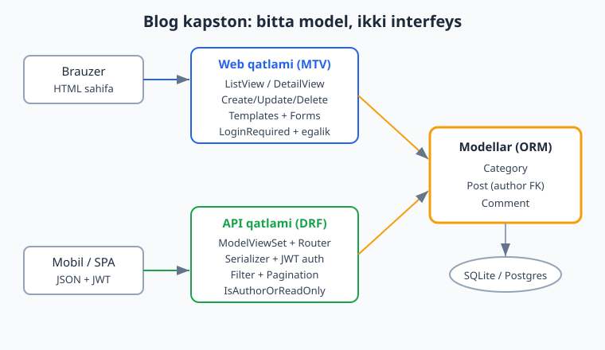
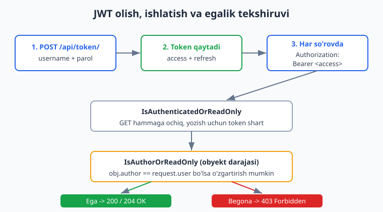
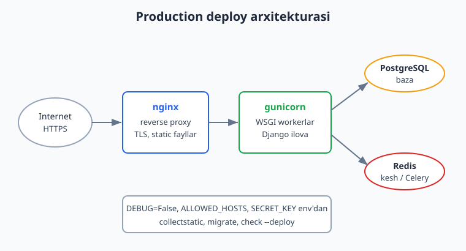

# 25 — Yakuniy kapston loyiha

[⬅️ Oldingi: 24 — Deployment (production)](./24-deployment.md) · [🏠 README](./README.md) · [Keyingi: README ➡️](./README.md)

---

> **Bu bobda:** butun kitobni bitta to'liq loyihada birlashtiramiz — **Blog/Post tizimi**, foydalanuvchi (`User`) bilan bog'langan. Avval **modellar**ni quramiz: `Category`, `Post` (`author` FK orqali `User` ga bog'langan, avtomatik `slug`, `status` choices, `Meta` tartib va indeks) va `Comment`. So'ng **admin**ni sozlaymiz (`list_display`, `list_filter`, `prepopulated_fields`, `TabularInline`). Keyin **web qatlami**ni yozamiz: **class-based view**lar (`ListView` sahifalash bilan, `DetailView`, `CreateView`/`UpdateView`/`DeleteView`), `LoginRequiredMixin` va `UserPassesTestMixin` bilan **egalik tekshiruvi**, va `templates` (`base.html` meros, ro'yxat/detal/forma). Parallel ravishda **DRF API qatlami**ni quramiz: `ModelViewSet` + `DefaultRouter`, `Serializer`lar, **JWT auth** (simplejwt — `token`/`token/refresh`), **django-filter** bilan `filtering`, `SearchFilter`, `OrderingFilter` va **pagination**, hamda obyekt darajasidagi **`IsAuthorOrReadOnly`** ruxsati — bir model ikki interfeysga xizmat qiladi. So'ng **testlar** yozamiz: `TestCase` (model + web view) va `APITestCase` (JWT oqimi, egalik, filter), `pytest-django` varianti bilan. Oxirida **settings/xavfsizlik** (`check --deploy`) va **deploy yo'riqnomasi** (illustrativ: nginx + gunicorn + Postgres). Shu bilan **Django 0 dan ekspertgacha** yo'li yakunlanadi. Bu bob Python'ni bilishni nazarda tutadi ([Python qo'llanma](../python/README.md)); baza asoslari foydali ([SQL qo'llanma](../sql/README.md)); CI/deploy ([CI/deploy qo'llanma](../git-github/README.md)); Node.js bilan solishtirish ([Node.js qo'llanma](../nodejs/README.md)). Hamma kod Django 6.0.6, Python 3.14, djangorestframework 3.17, djangorestframework-simplejwt 5.5, django-filter 25.2 da haqiqatan ishga tushirib tekshirilgan (baza uchun SQLite; production server qismi — nginx/gunicorn/Postgres — halol "illustrativ").

---

## Nima quramiz va nega kapston

Bu kitob davomida har bir mavzuni alohida ko'rdik: modellar, ORM, view'lar, template'lar, formalar, auth, DRF, testlar. **Kapston loyiha** — ularning hammasini bitta haqiqiy tizimda birlashtirish. Maqsad: hamma qismlar bir-biriga qanday ulanishini ko'rsatish.

Loyiha — **ko'p foydalanuvchili blog**. Asosiy g'oya:

- **Bir model — ikki interfeys.** O'sha `Post` modeli ham brauzer uchun HTML sahifa beradi (MTV: view + template), ham mobil/SPA mijoz uchun JSON API beradi (DRF). Ma'lumot bitta joyda — modellarda; faqat "old qism" ikki xil.
- **Egalik (ownership).** Postni faqat uning **muallifi** tahrirlay/o'chira oladi — web'da ham, API'da ham. Boshqalar faqat o'qiydi.



Loyihani noldan boshlaymiz:

```bash
# Django global o'rnatilgan - venv shart emas, to'g'ridan-to'g'ri python
mkdir blogkapston
cd blogkapston
python -m django startproject mysite .
python manage.py startapp blog
```

Bu ikki narsa yaratadi: `mysite/` (loyiha — `settings.py`, `urls.py`) va `blog/` (ilova — `models.py`, `views.py`, `admin.py`, `tests.py`). Keyingi bo'limlarda har faylni to'ldiramiz.

---

## Settings: ilovalar, DRF, JWT

Avval `mysite/settings.py` ni sozlaymiz. Uchta yangi narsa: ilovalarni ro'yxatga olamiz, DRF ni global sozlaymiz, JWT muddatlarini beramiz.

```python
# mysite/settings.py (asosiy qismlar)
from pathlib import Path
from datetime import timedelta

BASE_DIR = Path(__file__).resolve().parent.parent

INSTALLED_APPS = [
    "django.contrib.admin",
    "django.contrib.auth",
    "django.contrib.contenttypes",
    "django.contrib.sessions",
    "django.contrib.messages",
    "django.contrib.staticfiles",
    "rest_framework",          # DRF
    "django_filters",          # filtering
    "blog",                    # bizning ilova
]

TEMPLATES = [
    {
        "BACKEND": "django.template.backends.django.DjangoTemplates",
        "DIRS": [BASE_DIR / "templates"],   # loyiha darajasidagi templates/
        "APP_DIRS": True,
        "OPTIONS": {"context_processors": [
            "django.template.context_processors.request",
            "django.contrib.auth.context_processors.auth",
            "django.contrib.messages.context_processors.messages",
        ]},
    },
]

DEFAULT_AUTO_FIELD = "django.db.models.BigAutoField"  # Django 6 idiomi

REST_FRAMEWORK = {
    "DEFAULT_AUTHENTICATION_CLASSES": (
        "rest_framework_simplejwt.authentication.JWTAuthentication",
    ),
    "DEFAULT_PERMISSION_CLASSES": (
        "rest_framework.permissions.IsAuthenticatedOrReadOnly",
    ),
    "DEFAULT_FILTER_BACKENDS": (
        "django_filters.rest_framework.DjangoFilterBackend",
        "rest_framework.filters.SearchFilter",
        "rest_framework.filters.OrderingFilter",
    ),
    "DEFAULT_PAGINATION_CLASS": "rest_framework.pagination.PageNumberPagination",
    "PAGE_SIZE": 10,
}

SIMPLE_JWT = {
    "ACCESS_TOKEN_LIFETIME": timedelta(minutes=30),
    "REFRESH_TOKEN_LIFETIME": timedelta(days=7),
}
```

Diqqat qilinadigan joylar:

- `INSTALLED_APPS` ga `rest_framework`, `django_filters`, `blog` qo'shildi.
- `REST_FRAMEWORK` — **bitta lug'at butun API uchun**: kim authentifikatsiya qiladi (JWT), default ruxsat (`IsAuthenticatedOrReadOnly` — o'qish ochiq, yozish uchun login shart), filter backendlari va sahifalash (har sahifada 10 ta).
- `SIMPLE_JWT` — `access` token 30 daqiqa, `refresh` 7 kun yashaydi.

> **Eslatma:** `rest_framework_simplejwt` o'rnatilgan bo'lishi kerak: `pip install djangorestframework-simplejwt django-filter`. Bu kitobda ular global o'rnatilgan.

---

## Modellar: Category, Post, Comment

Endi yurakka — `blog/models.py`. Uchta model: `Category`, `Post`, `Comment`. Eng muhimi `Post` ning `author` orqali `User` ga bog'lanishi (bu bizning egalik mexanizmimiz asosi).

```python
# blog/models.py
from django.conf import settings
from django.db import models
from django.urls import reverse
from django.utils import timezone
from django.utils.text import slugify


class Category(models.Model):
    name = models.CharField(max_length=80, unique=True)
    slug = models.SlugField(max_length=90, unique=True, blank=True)

    class Meta:
        verbose_name_plural = "categories"
        ordering = ["name"]

    def __str__(self):
        return self.name

    def save(self, *args, **kwargs):
        if not self.slug:
            self.slug = slugify(self.name)
        super().save(*args, **kwargs)


class Post(models.Model):
    class Status(models.TextChoices):
        DRAFT = "draft", "Qoralama"
        PUBLISHED = "published", "Chop etilgan"

    title = models.CharField(max_length=200)
    slug = models.SlugField(max_length=220, unique=True, blank=True)
    body = models.TextField()
    author = models.ForeignKey(
        settings.AUTH_USER_MODEL,        # User ga bog'lanish
        on_delete=models.CASCADE,
        related_name="posts",            # user.posts.all()
    )
    category = models.ForeignKey(
        Category,
        on_delete=models.SET_NULL,       # kategoriya o'chsa post qoladi
        null=True, blank=True,
        related_name="posts",
    )
    status = models.CharField(
        max_length=10, choices=Status.choices, default=Status.DRAFT
    )
    created_at = models.DateTimeField(default=timezone.now)
    updated_at = models.DateTimeField(auto_now=True)

    class Meta:
        ordering = ["-created_at"]                       # eng yangi birinchi
        indexes = [models.Index(fields=["-created_at"])] # tezkor saralash

    def __str__(self):
        return self.title

    def save(self, *args, **kwargs):
        if not self.slug:
            self.slug = slugify(self.title)
        super().save(*args, **kwargs)

    def get_absolute_url(self):
        return reverse("blog:post_detail", kwargs={"slug": self.slug})


class Comment(models.Model):
    post = models.ForeignKey(
        Post, on_delete=models.CASCADE, related_name="comments"
    )
    author = models.ForeignKey(
        settings.AUTH_USER_MODEL,
        on_delete=models.CASCADE, related_name="comments",
    )
    text = models.TextField()
    created_at = models.DateTimeField(auto_now_add=True)

    class Meta:
        ordering = ["created_at"]

    def __str__(self):
        return f"{self.author} -> {self.post}"
```

Asosiy qarorlar:

- **`settings.AUTH_USER_MODEL`** — `User` ni to'g'ridan-to'g'ri import qilmaymiz; bu satr orqali bog'laymiz. Agar kelajakda custom `User` ishlatsangiz, kod o'zgarmaydi (13-bobdagi maslahat).
- **`on_delete`** har FK uchun ataylab tanlangan: muallif o'chsa postlari ham o'chadi (`CASCADE`); kategoriya o'chsa post qoladi (`SET_NULL`). Bu 7-bobdagi munosabatlar mantiqining amaliy qo'llanishi.
- **`slug` avtomatik** — `save()` da `slugify()` orqali sarlavhadan hosil bo'ladi. URL'lar chiroyli (`/blog/salom-dunyo/`).
- **`Meta.ordering` va `indexes`** — eng yangi post birinchi keladi, va `created_at` bo'yicha indeks saralashni tezlashtiradi (20-bobdagi performance).
- **`get_absolute_url`** — `reverse()` orqali post o'z URL'ini biladi (3-bobdagi `reverse`).

Migratsiya yaratamiz va qo'llaymiz:

```bash
python manage.py makemigrations blog
python manage.py migrate
```

Natija (haqiqiy chiqish):

```
Migrations for 'blog':
  blog\migrations\0001_initial.py
    + Create model Category
    + Create model Post
    + Create model Comment
    + Create index blog_post_created_45f0c6_idx on field(s) -created_at of model post
```

Modellarni tez `shell` da sinaymiz:

```python
# python manage.py shell
from django.contrib.auth.models import User
from blog.models import Post

u = User.objects.create_user("ali", password="parol12345")
p = Post.objects.create(title="Salom Dunyo", body="birinchi post", author=u)
print(p.slug)       # salom-dunyo  (avtomatik)
print(u.posts.all())  # <QuerySet [<Post: Salom Dunyo>]>  (related_name)
```

---

## Admin paneli

`Post` ni admin'da boshqarishni qulay qilamiz — `blog/admin.py`:

```python
# blog/admin.py
from django.contrib import admin
from .models import Category, Comment, Post


class CommentInline(admin.TabularInline):
    model = Comment
    extra = 0
    readonly_fields = ["author", "created_at"]


@admin.register(Category)
class CategoryAdmin(admin.ModelAdmin):
    list_display = ["name", "slug"]
    prepopulated_fields = {"slug": ("name",)}   # slug JS bilan avtomatik


@admin.register(Post)
class PostAdmin(admin.ModelAdmin):
    list_display = ["title", "author", "category", "status", "created_at"]
    list_filter = ["status", "category", "created_at"]
    search_fields = ["title", "body"]
    prepopulated_fields = {"slug": ("title",)}
    raw_id_fields = ["author"]               # ko'p user bo'lsa qulay
    date_hierarchy = "created_at"
    inlines = [CommentInline]                # postda izohlarni ko'rsatish
```

- `list_display` — ro'yxatda qaysi ustunlar ko'rinadi.
- `list_filter` — o'ng tomonda filtr panel (status/kategoriya/sana).
- `prepopulated_fields` — `title` yozayotganda `slug` JS orqali avtomatik to'ladi.
- `CommentInline` — post sahifasida izohlar bir joyda tahrirlanadi (8-bobdagi inline).

Admin'ga kirish uchun superuser kerak:

```bash
python manage.py createsuperuser
# keyin: python manage.py runserver  -> http://127.0.0.1:8000/admin/
```

---

## Web qatlami: class-based view'lar

Endi brauzer uchun sahifalar. `blog/views.py` da CBV'lardan foydalanamiz (11-bob). Eng muhimi — **egalik tekshiruvi**: postni faqat egasi tahrirlay/o'chira oladi.

```python
# blog/views.py
from django.contrib.auth.mixins import LoginRequiredMixin, UserPassesTestMixin
from django.urls import reverse_lazy
from django.views.generic import (
    CreateView, DeleteView, DetailView, ListView, UpdateView,
)
from .models import Post


class PostListView(ListView):
    model = Post
    template_name = "blog/post_list.html"
    context_object_name = "posts"
    paginate_by = 5                                  # sahifalash

    def get_queryset(self):
        # faqat chop etilgan; N+1 dan qochish uchun select_related
        return (
            Post.objects.filter(status=Post.Status.PUBLISHED)
            .select_related("author", "category")
        )


class PostDetailView(DetailView):
    model = Post
    template_name = "blog/post_detail.html"
    context_object_name = "post"


class PostCreateView(LoginRequiredMixin, CreateView):
    model = Post
    template_name = "blog/post_form.html"
    fields = ["title", "body", "category", "status"]

    def form_valid(self, form):
        form.instance.author = self.request.user     # muallifni avtomatik o'rnatish
        return super().form_valid(form)


class AuthorRequiredMixin(UserPassesTestMixin):
    """Faqat postning muallifiga ruxsat beradi."""
    def test_func(self):
        return self.get_object().author == self.request.user


class PostUpdateView(LoginRequiredMixin, AuthorRequiredMixin, UpdateView):
    model = Post
    template_name = "blog/post_form.html"
    fields = ["title", "body", "category", "status"]


class PostDeleteView(LoginRequiredMixin, AuthorRequiredMixin, DeleteView):
    model = Post
    template_name = "blog/post_confirm_delete.html"
    success_url = reverse_lazy("blog:post_list")
```

Diqqat:

- `PostListView` — `paginate_by = 5` sahifalashni yoqadi; `get_queryset()` da `filter(status=PUBLISHED)` va `select_related` bilan faqat kerakli postlar va N+1 muammosisiz (7/9-bob).
- `PostCreateView.form_valid()` — formada `author` maydoni yo'q; uni **server o'rnatadi** (`self.request.user`). Foydalanuvchi boshqa birovni muallif qilib qo'ya olmaydi.
- `AuthorRequiredMixin` — `UserPassesTestMixin` orqali `test_func()` ni amalga oshiradi. Agar foydalanuvchi muallif bo'lmasa, Django **403 Forbidden** qaytaradi. `LoginRequiredMixin` esa login qilmaganni login sahifasiga yo'naltiradi (302).
- **Mixin tartibi muhim:** `LoginRequiredMixin` birinchi, keyin `AuthorRequiredMixin`, keyin generic view — chapdan o'ngga tekshiriladi.

URL'lar — `blog/urls.py`:

```python
# blog/urls.py
from django.urls import path
from . import views

app_name = "blog"

urlpatterns = [
    path("", views.PostListView.as_view(), name="post_list"),
    path("yangi/", views.PostCreateView.as_view(), name="post_create"),
    path("<slug:slug>/", views.PostDetailView.as_view(), name="post_detail"),
    path("<slug:slug>/tahrir/", views.PostUpdateView.as_view(), name="post_update"),
    path("<slug:slug>/ochirish/", views.PostDeleteView.as_view(), name="post_delete"),
]
```

`app_name = "blog"` namespace beradi — shuning uchun `reverse("blog:post_detail")` deb yozamiz. Django 6 idiomi — `path()` (eski `url()` emas), `<slug:slug>` konverter bilan.

---

## Template'lar: meros va sahifalash

Web qatlamning ko'rinadigan qismi — template'lar (4-bob). Loyiha darajasidagi `templates/` papkasida `base.html` ni ota qilamiz.

```html
<!-- templates/base.html -->
<!DOCTYPE html>
<html lang="uz">
<head>
  <meta charset="utf-8">
  <title>Blog</title>
</head>
<body>
  <nav>
    <a href="">Bosh sahifa</a>
    
      <a href="">Yangi post</a>
      <span>Salom, {{ user.username }}</span>
    
  </nav>
  <main></main>
</body>
</html>
```

Ro'yxat sahifasi — sahifalash bloki bilan (`page_obj`, `is_paginated` avtomatik beriladi):

```html
<!-- templates/blog/post_list.html -->

Postlar

  <h1>Postlar</h1>
  <ul>
    
      <li><a href="{{ post.get_absolute_url }}">{{ post.title }}</a>
          — {{ post.author.username }}</li>
    
      <li>Hali post yo'q.</li>
    
  </ul>

  
    <div class="paginatsiya">
      
        <a href="?page={{ page_obj.previous_page_number }}">Oldingi</a>
      
      <span>{{ page_obj.number }} / {{ page_obj.paginator.num_pages }}</span>
      
        <a href="?page={{ page_obj.next_page_number }}">Keyingi</a>
      
    </div>
  

```

Detal sahifasi — bu yerda **egalik** template darajasida ham ko'rinadi (faqat egaga tahrir/o'chirish tugmalari):

```html
<!-- templates/blog/post_detail.html -->

{{ post.title }}

  <h1>{{ post.title }}</h1>
  <p><em>{{ post.author.username }} — {{ post.created_at|date:"d.m.Y" }}</em></p>
  <div>{{ post.body|linebreaks }}</div>

  
    <p>
      <a href="">Tahrirlash</a>
      <a href="">O'chirish</a>
    </p>
  

  <h2>Izohlar</h2>
  <ul>
    
      <li><strong>{{ comment.author.username }}:</strong> {{ comment.text }}</li>
    
      <li>Hali izoh yo'q.</li>
    
  </ul>

```

Forma va o'chirish-tasdiq template'lari (`CreateView`/`UpdateView`/`DeleteView` shularni qidiradi):

```html
<!-- templates/blog/post_form.html -->


  <h1>Postni tahrirlashYangi post</h1>
  <form method="post">
    
    {{ form.as_p }}
    <button type="submit">Saqlash</button>
  </form>

```

```html
<!-- templates/blog/post_confirm_delete.html -->


  <h1>"{{ object.title }}" o'chirilsinmi?</h1>
  <form method="post">
    
    <button type="submit">Ha, o'chir</button>
    <a href="{{ object.get_absolute_url }}">Bekor qilish</a>
  </form>

```

`` — POST formalarda majburiy (xavfsizlik, 14-bob). `{{ form.as_p }}` — formani avtomatik render qiladi (10-bob).

---

## DRF API qatlami: serializer, viewset, router

Endi o'sha modellardan **JSON API** quramiz. Bu mobil ilova yoki React/Vue front uchun. Avval serializer'lar (15-bob) — `blog/serializers.py`:

```python
# blog/serializers.py
from rest_framework import serializers
from .models import Category, Comment, Post


class CategorySerializer(serializers.ModelSerializer):
    class Meta:
        model = Category
        fields = ["id", "name", "slug"]
        read_only_fields = ["slug"]


class CommentSerializer(serializers.ModelSerializer):
    author = serializers.ReadOnlyField(source="author.username")

    class Meta:
        model = Comment
        fields = ["id", "post", "author", "text", "created_at"]
        read_only_fields = ["created_at"]


class PostSerializer(serializers.ModelSerializer):
    author = serializers.ReadOnlyField(source="author.username")
    category_name = serializers.ReadOnlyField(source="category.name")
    comment_count = serializers.IntegerField(
        source="comments.count", read_only=True
    )

    class Meta:
        model = Post
        fields = [
            "id", "title", "slug", "body", "author",
            "category", "category_name", "status",
            "comment_count", "created_at", "updated_at",
        ]
        read_only_fields = ["slug", "created_at", "updated_at"]
```

- `author` — `ReadOnlyField(source="author.username")`: API'da muallif **username** sifatida ko'rinadi, lekin mijoz uni o'zgartira olmaydi (serverda o'rnatamiz).
- `category_name`, `comment_count` — hisoblangan "read-only" maydonlar (qulaylik uchun).

Obyekt darajasidagi ruxsat — `blog/permissions.py`:

```python
# blog/permissions.py
from rest_framework import permissions


class IsAuthorOrReadOnly(permissions.BasePermission):
    """O'qish hammaga ochiq; o'zgartirish faqat egasiga."""
    def has_object_permission(self, request, view, obj):
        if request.method in permissions.SAFE_METHODS:  # GET/HEAD/OPTIONS
            return True
        return obj.author == request.user
```

Bu — web'dagi `AuthorRequiredMixin` ning API ekvivalenti. `SAFE_METHODS` (o'qish) hammaga ochiq; PUT/PATCH/DELETE faqat egaga.

Filter — `blog/filters.py` (django-filter, 16-bob bilan bog'liq):

```python
# blog/filters.py
import django_filters
from .models import Post


class PostFilter(django_filters.FilterSet):
    title = django_filters.CharFilter(lookup_expr="icontains")
    created_after = django_filters.DateFilter(
        field_name="created_at", lookup_expr="gte"
    )

    class Meta:
        model = Post
        fields = ["status", "category", "author", "title"]
```

ViewSet'lar — `blog/api.py`. `ModelViewSet` bitta klasda `list/create/retrieve/update/destroy` ni beradi (16-bob):

```python
# blog/api.py
from rest_framework import viewsets
from rest_framework.permissions import IsAuthenticatedOrReadOnly
from .filters import PostFilter
from .models import Category, Comment, Post
from .permissions import IsAuthorOrReadOnly
from .serializers import (
    CategorySerializer, CommentSerializer, PostSerializer,
)


class CategoryViewSet(viewsets.ModelViewSet):
    queryset = Category.objects.all()
    serializer_class = CategorySerializer


class PostViewSet(viewsets.ModelViewSet):
    serializer_class = PostSerializer
    permission_classes = [IsAuthenticatedOrReadOnly, IsAuthorOrReadOnly]
    filterset_class = PostFilter
    search_fields = ["title", "body"]            # ?search=...
    ordering_fields = ["created_at", "title"]    # ?ordering=...

    def get_queryset(self):
        # N+1 dan qochish: bog'langan obyektlarni oldindan yuklash
        return (
            Post.objects.all()
            .select_related("author", "category")
            .prefetch_related("comments")
        )

    def perform_create(self, serializer):
        serializer.save(author=self.request.user)  # muallifni server o'rnatadi


class CommentViewSet(viewsets.ModelViewSet):
    queryset = Comment.objects.select_related("author", "post")
    serializer_class = CommentSerializer
    permission_classes = [IsAuthenticatedOrReadOnly, IsAuthorOrReadOnly]

    def perform_create(self, serializer):
        serializer.save(author=self.request.user)
```

`perform_create()` — `CreateView.form_valid()` ning API ekvivalenti: muallif **doim server** tomonidan o'rnatiladi.

Router URL'larni avtomatik tuzadi — `blog/api_urls.py`:

```python
# blog/api_urls.py
from rest_framework.routers import DefaultRouter
from .api import CategoryViewSet, CommentViewSet, PostViewSet

router = DefaultRouter()
router.register("posts", PostViewSet, basename="post")
router.register("categories", CategoryViewSet, basename="category")
router.register("comments", CommentViewSet, basename="comment")

urlpatterns = router.urls
```

Loyiha URL'lari — JWT endpoint'larni shu yerda ulaymiz (`mysite/urls.py`):

```python
# mysite/urls.py
from django.contrib import admin
from django.urls import include, path
from rest_framework_simplejwt.views import (
    TokenObtainPairView, TokenRefreshView,
)

urlpatterns = [
    path("admin/", admin.site.urls),
    path("blog/", include("blog.urls")),         # web
    path("api/", include("blog.api_urls")),      # API
    path("api/token/", TokenObtainPairView.as_view(), name="token_obtain_pair"),
    path("api/token/refresh/", TokenRefreshView.as_view(), name="token_refresh"),
]
```

Endi bizda ikki interfeys bor: `/blog/...` (HTML) va `/api/...` (JSON) — bitta modeldan.

---

## JWT autentifikatsiya oqimi

API'da sessiyalar yo'q — mijoz har so'rovda **token** yuboradi. JWT oqimi uch qadam (17-bob):



1. **Token olish** — `POST /api/token/` ga `username` + `parol`. Javobda `access` va `refresh` token keladi.
2. **So'rovlarda ishlatish** — har so'rovda `Authorization: Bearer <access>` sarlavhasi.
3. **Yangilash** — `access` 30 daqiqada eskirgach, `POST /api/token/refresh/` ga `refresh` yuborib, yangi `access` olish.

`curl` bilan (illustrativ — server ishlab turishi kerak; biz buni test client orqali tekshirdik):

```bash
# 1. Token olish
curl -X POST http://127.0.0.1:8000/api/token/ \
     -H "Content-Type: application/json" \
     -d '{"username":"ali","password":"parol12345"}'
# -> {"refresh":"eyJ...","access":"eyJ..."}

# 2. Token bilan post yaratish
curl -X POST http://127.0.0.1:8000/api/posts/ \
     -H "Authorization: Bearer eyJ..." \
     -H "Content-Type: application/json" \
     -d '{"title":"Yangi post","body":"matn"}'
# -> 201 Created, "author":"ali"

# 3. Tokensiz yozish -> 401 Unauthorized
```

Filtering, qidiruv va sahifalash — hammasi URL parametrlari orqali (kombinatsiya qilsa bo'ladi):

```bash
GET /api/posts/?status=published          # status bo'yicha filter
GET /api/posts/?search=django             # title/body ichidan qidiruv
GET /api/posts/?ordering=-created_at      # saralash
GET /api/posts/?page=2                    # sahifalash (PAGE_SIZE=10)
GET /api/posts/?status=published&ordering=title&page=1   # birga
```

Sahifalangan javob shaklini eslang (16-bob): `{"count": ..., "next": ..., "previous": ..., "results": [...]}`.

---

## Testlar: TestCase va APITestCase

Kapston tugamaydi, agar **testlar** bo'lmasa (18/22-bob). Ikki turdagi test yozamiz: web qatlam uchun `TestCase`, API uchun `APITestCase`. `blog/tests.py`:

```python
# blog/tests.py
from django.contrib.auth import get_user_model
from django.test import TestCase
from django.urls import reverse
from rest_framework import status
from rest_framework.test import APITestCase
from .models import Post

User = get_user_model()


class PostModelTest(TestCase):
    def setUp(self):
        self.user = User.objects.create_user("ali", password="parol12345")

    def test_slug_avtomatik(self):
        post = Post.objects.create(title="Salom Dunyo", body="matn", author=self.user)
        self.assertEqual(post.slug, "salom-dunyo")

    def test_default_status_draft(self):
        post = Post.objects.create(title="T", body="x", author=self.user)
        self.assertEqual(post.status, Post.Status.DRAFT)


class PostViewTest(TestCase):
    def setUp(self):
        self.user = User.objects.create_user("ali", password="parol12345")
        self.post = Post.objects.create(
            title="Chop etilgan", body="matn",
            author=self.user, status=Post.Status.PUBLISHED,
        )

    def test_list_view_ishlaydi(self):
        resp = self.client.get(reverse("blog:post_list"))
        self.assertEqual(resp.status_code, 200)
        self.assertContains(resp, "Chop etilgan")

    def test_draft_listda_korinmaydi(self):
        Post.objects.create(title="Maxfiy qoralama", body="x", author=self.user)
        resp = self.client.get(reverse("blog:post_list"))
        self.assertNotContains(resp, "Maxfiy qoralama")

    def test_create_login_talab_qiladi(self):
        resp = self.client.get(reverse("blog:post_create"))
        self.assertEqual(resp.status_code, 302)        # login sahifasiga

    def test_begona_tahrir_qila_olmaydi(self):
        User.objects.create_user("vali", password="parol12345")
        self.client.login(username="vali", password="parol12345")
        resp = self.client.get(reverse("blog:post_update", args=[self.post.slug]))
        self.assertEqual(resp.status_code, 403)        # egalik tekshiruvi


class PostAPITest(APITestCase):
    def setUp(self):
        self.ali = User.objects.create_user("ali", password="parol12345")
        self.vali = User.objects.create_user("vali", password="parol12345")
        self.post = Post.objects.create(
            title="API post", body="matn",
            author=self.ali, status=Post.Status.PUBLISHED,
        )

    def _token(self, username):
        resp = self.client.post(
            reverse("token_obtain_pair"),
            {"username": username, "password": "parol12345"},
        )
        return resp.data["access"]

    def test_list_ochiq(self):
        resp = self.client.get("/api/posts/")
        self.assertEqual(resp.status_code, status.HTTP_200_OK)
        self.assertEqual(resp.data["count"], 1)

    def test_create_token_talab_qiladi(self):
        resp = self.client.post("/api/posts/", {"title": "X", "body": "y"})
        self.assertEqual(resp.status_code, status.HTTP_401_UNAUTHORIZED)

    def test_jwt_bilan_create(self):
        token = self._token("ali")
        self.client.credentials(HTTP_AUTHORIZATION=f"Bearer {token}")
        resp = self.client.post("/api/posts/", {"title": "Yangi", "body": "matn"})
        self.assertEqual(resp.status_code, status.HTTP_201_CREATED)
        self.assertEqual(resp.data["author"], "ali")

    def test_begona_ochira_olmaydi(self):
        token = self._token("vali")
        self.client.credentials(HTTP_AUTHORIZATION=f"Bearer {token}")
        resp = self.client.delete(f"/api/posts/{self.post.id}/")
        self.assertEqual(resp.status_code, status.HTTP_403_FORBIDDEN)

    def test_filter_status(self):
        Post.objects.create(title="Qoralama", body="x", author=self.ali)
        resp = self.client.get("/api/posts/?status=published")
        self.assertEqual(resp.data["count"], 1)

    def test_search(self):
        resp = self.client.get("/api/posts/?search=API")
        self.assertEqual(resp.data["count"], 1)
```

Diqqat:

- `get_user_model()` — `User` ni to'g'ridan-to'g'ri import qilmasdan olish (custom User uchun mustahkam).
- `APITestCase.credentials()` — keyingi so'rovlarga `Authorization` sarlavhasini biriktiradi.
- `test_begona_*` — eng muhim testlar: **egalik** ham web'da (403), ham API'da (403) ishlayotganini isbotlaydi.

Ishga tushiramiz:

```bash
python manage.py test blog -v 2
```

Haqiqiy natija (qisqartirilgan):

```
test_begona_ochira_olmaydi ... ok
test_create_token_talab_qiladi ... ok
test_filter_status ... ok
test_jwt_bilan_create ... ok
test_list_ochiq ... ok
test_search ... ok
test_default_status_draft ... ok
test_slug_avtomatik ... ok
test_begona_tahrir_qila_olmaydi ... ok
test_create_login_talab_qiladi ... ok
test_draft_listda_korinmaydi ... ok
test_list_view_ishlaydi ... ok
----------------------------------------------------------------------
Ran 12 tests in 19.655s

OK
```

12 ta test o'tdi. Agar `pytest-django` ni afzal ko'rsangiz (22-bob), o'sha test yana qisqaroq fixture'lar bilan yoziladi:

```python
# blog/test_pytest_uslub.py
import pytest
from django.contrib.auth import get_user_model
from rest_framework.test import APIClient
from blog.models import Post

User = get_user_model()


@pytest.fixture
def user(db):
    return User.objects.create_user("ali", password="parol12345")


@pytest.fixture
def api(user):
    client = APIClient()
    tok = client.post("/api/token/",
                      {"username": "ali", "password": "parol12345"}).data["access"]
    client.credentials(HTTP_AUTHORIZATION=f"Bearer {tok}")
    return client


@pytest.mark.django_db
def test_post_yaratish(user):
    post = Post.objects.create(title="Salom", body="x", author=user)
    assert post.slug == "salom"


def test_api_create(api):
    resp = api.post("/api/posts/", {"title": "Yangi", "body": "matn"})
    assert resp.status_code == 201
    assert resp.data["author"] == "ali"
```

`pytest.ini` da `DJANGO_SETTINGS_MODULE = mysite.settings` bo'lishi kerak. Ishga tushirish: `python -m pytest -q` -> `2 passed`.

---

## Settings va xavfsizlik

Ishlab chiqishda `DEBUG = True` qulay, lekin **production'da xavfli**. Django o'zi tekshiradi:

```bash
python manage.py check --deploy
```

Haqiqiy natija (qisqartirilgan):

```
WARNINGS:
?: (security.W004) You have not set a value for the SECURE_HSTS_SECONDS setting...
?: (security.W008) Your SECURE_SSL_REDIRECT setting is not set to True...
?: (security.W009) Your SECRET_KEY ... prefixed with 'django-insecure-'...
System check identified 7 issues (0 silenced).
```

Production uchun zarur sozlamalar (24-bobni eslang):

```python
# mysite/settings.py (production qismi - illustrativ)
import os

DEBUG = False
SECRET_KEY = os.environ["DJANGO_SECRET_KEY"]   # kodga yozmang!
ALLOWED_HOSTS = ["misol.uz", "www.misol.uz"]

# HTTPS xavfsizligi
SECURE_SSL_REDIRECT = True
SESSION_COOKIE_SECURE = True
CSRF_COOKIE_SECURE = True
SECURE_HSTS_SECONDS = 31536000
SECURE_HSTS_INCLUDE_SUBDOMAINS = True
SECURE_HSTS_PRELOAD = True

# Production baza (Postgres) - illustrativ, RUN uchun SQLite ishlatildi
DATABASES = {
    "default": {
        "ENGINE": "django.db.backends.postgresql",
        "NAME": os.environ["DB_NAME"],
        "USER": os.environ["DB_USER"],
        "PASSWORD": os.environ["DB_PASSWORD"],
        "HOST": os.environ.get("DB_HOST", "localhost"),
        "PORT": os.environ.get("DB_PORT", "5432"),
    }
}
```

Oltin qoidalar:

- **`SECRET_KEY` ni hech qachon kodga yozmang** — environment o'zgaruvchidan oling. `git` ga tushmasin.
- **`DEBUG = False`** — production'da har doim. `DEBUG = True` xato sahifalarida maxfiy ma'lumotni ko'rsatadi.
- **`ALLOWED_HOSTS`** — faqat o'z domeningiz.
- **HTTPS sozlamalari** — cookie'lar faqat HTTPS orqali, HSTS yoqilgan.

> **Eslatma:** Yuqoridagi Postgres/HTTPS blok **illustrativ** — bu muhitda Postgres serveri va TLS yo'q, shuning uchun RUN paytida SQLite va `DEBUG=True` ishlatildi. Kod to'g'ri, lekin shu muhitda ishga tushirilmagan.

---

## Deploy yo'riqnomasi

Endi tizimni internetga chiqaramiz. Production'da **uchta jarayon** ishlaydi: `nginx` (frontda), `gunicorn` (WSGI server), `Django` ilova. Baza — Postgres, kesh/Celery — Redis (24-bob).



So'rov yo'li: **Internet -> nginx (TLS, static fayllar) -> gunicorn -> Django -> Postgres**.

Deploy qadamlari (illustrativ — bu yerda hech qaysi server ishlab turmaydi):

```bash
# 1. Kodni serverga olish
git clone https://github.com/foydalanuvchi/blogkapston.git
cd blogkapston

# 2. Bog'liqliklar
pip install -r requirements.txt
pip install gunicorn psycopg2-binary

# 3. Environment o'zgaruvchilar (.env yoki systemd)
export DJANGO_SECRET_KEY="..."
export DB_NAME="blog" DB_USER="bloguser" DB_PASSWORD="..."

# 4. Bazani tayyorlash
python manage.py migrate

# 5. Static fayllarni yig'ish (nginx beradi)
python manage.py collectstatic --noinput

# 6. Xavfsizlikni tekshirish
python manage.py check --deploy

# 7. WSGI serverni ishga tushirish (illustrativ)
gunicorn mysite.wsgi:application --bind 0.0.0.0:8000 --workers 3
```

nginx konfiguratsiyasi (illustrativ — Django bu faylni ishlatmaydi, nginx ishlatadi):

```bash
# /etc/nginx/sites-available/blog  (illustrativ)
server {
    listen 80;
    server_name misol.uz;

    location /static/ {
        alias /var/www/blog/staticfiles/;   # collectstatic natijasi
    }

    location / {
        proxy_pass http://127.0.0.1:8000;    # gunicorn
        proxy_set_header Host $host;
        proxy_set_header X-Forwarded-For $proxy_add_x_forwarded_for;
        proxy_set_header X-Forwarded-Proto $scheme;
    }
}
```

> **Halol eslatma:** `gunicorn`, `nginx`, `Postgres`, `Redis`, `Docker` — bularning hammasi **illustrativ**. Bu muhitda real serverlar ishlab turmaydi; kod va konfiguratsiya to'g'ri, lekin bu yerda ishga tushirilmagan. Loyihaning Python qismi (modellar, view, API, testlar) esa **haqiqatan ishga tushirilib tekshirilgan** — SQLite baza bilan, 12 ta test va end-to-end smoke tekshiruvi o'tdi.

CI/CD avtomatlashtirish uchun ([CI/deploy qo'llanma](../git-github/README.md)) — har push'da testlar ishga tushadi, o'tsa avtomatik deploy bo'ladi.

---

## Django 0 dan ekspertgacha: yo'l tugadi

Tabriklaymiz! Bu kapston — kitobning yakuni. Quyidagilarning **hammasini** bitta loyihada birlashtirdingiz:

| Mavzu | Bobda | Kapstonda qayerda |
|-------|-------|-------------------|
| Modellar, ORM, munosabatlar | 5-7, 9 | `Post.author` FK, `Meta`, indeks |
| Admin | 8 | `PostAdmin`, `CommentInline` |
| View, URL, template, forma | 3-4, 10-11 | CBV, `base.html`, `post_form` |
| Auth, xavfsizlik | 13-14 | `LoginRequiredMixin`, egalik, CSRF |
| Static/media, layout | 12 | `STATIC_URL`, `collectstatic` |
| Performance | 20 | `select_related`, `prefetch_related` |
| DRF, serializer, viewset, auth | 15-17 | API qatlam, JWT, ruxsat |
| Testlar | 18, 22 | `TestCase` + `APITestCase` |
| Deploy | 24 | `check --deploy`, nginx + gunicorn |

Endi siz Django'da haqiqiy, ko'p qatlamli, testlangan, deployga tayyor tizim qura olasiz. Keyingi qadam — bu loyihani kengaytirish: like/tag tizimi, izoh API'si uchun nested route, foydalanuvchi profili, Celery bilan email yuborish, Redis kesh. Bilim bor — endi amaliyot!

---

## Mashqlar

### Oson

1. `Post` modeliga `views_count` (IntegerField, default 0) maydonini qo'shing va migratsiya yarating.
2. `Category` ga `is_active` (BooleanField, default True) qo'shing va admin `list_display` ga qo'shing.
3. `PostListView` da `paginate_by` ni 5 dan 10 ga o'zgartiring.
4. API'da `?ordering=title` so'rovi postlarni sarlavha bo'yicha saralashini `curl` (yoki test) bilan tekshiring.
5. `PostDetailView` template'ida postning kategoriyasini ko'rsating (agar bor bo'lsa).
6. `CommentSerializer` ga `read_only_fields` ga `author` qo'shilganini tekshiring — nega kerak ekanini bir jumla bilan tushuntiring.

### O'rta

7. `Comment` uchun web view yozing: postga izoh qoldirish formasi (`CreateView`), muallif avtomatik o'rnatilsin.
8. `IsAuthorOrReadOnly` ni `Comment` ga ham qo'llanganini tekshiradigan `APITestCase` testi yozing (begona izohni o'chira olmasligi).
9. `PostFilter` ga `created_before` filtri qo'shing (`created_at` `lte`).
10. `PostListView` ga `?q=` GET parametri bilan sarlavha bo'yicha qidiruv qo'shing (`get_queryset` da `icontains`).
11. JWT'ning to'liq oqimini tekshiradigan test yozing: token oling, post yarating, keyin `refresh` bilan yangi token oling.
12. Admin'ga `comment_count` ustunini `list_display` ga ulang (`@admin.display` metodi orqali).

### Qiyin

13. `Post` ga `published_at` maydonini qo'shing va `save()` da status `published` ga o'zgarganda avtomatik to'ldiring (faqat bir marta).
14. `assertNumQueries` bilan API list endpoint'i N+1 muammosisiz ishlashini isbotlang (`select_related`/`prefetch_related` ta'siri).
15. Custom DRF `@action` qo'shing: `POST /api/posts/{id}/publish/` — faqat egasi postni `published` qila oladi.
16. `PostViewSet` ga "faqat o'z postlarim" filtri qo'shing: `?mine=true` bo'lsa va foydalanuvchi login qilgan bo'lsa, faqat uning postlarini qaytarsin.

---

<details markdown="1"><summary>Yechimlar</summary>

### 1. views_count maydoni

```python
# blog/models.py — Post ichida
views_count = models.IntegerField(default=0)
```

```bash
python manage.py makemigrations blog && python manage.py migrate
```

`default=0` bo'lgani uchun mavjud yozuvlar uchun migratsiya muammosiz o'tadi.

### 2. Category.is_active

```python
# models.py
class Category(models.Model):
    name = models.CharField(max_length=80, unique=True)
    slug = models.SlugField(max_length=90, unique=True, blank=True)
    is_active = models.BooleanField(default=True)
```

```python
# admin.py
class CategoryAdmin(admin.ModelAdmin):
    list_display = ["name", "slug", "is_active"]
```

### 3. paginate_by

```python
class PostListView(ListView):
    paginate_by = 10   # 5 dan 10 ga
```

### 4. ordering tekshiruvi

```python
# test ichida
resp = self.client.get("/api/posts/?ordering=title")
titles = [p["title"] for p in resp.data["results"]]
assert titles == sorted(titles)
```

Yoki `curl "http://127.0.0.1:8000/api/posts/?ordering=title"`.

### 5. Kategoriya ko'rsatish

```html
<!-- post_detail.html -->

  <p>Kategoriya: {{ post.category.name }}</p>

```

### 6. author read-only

```python
# CommentSerializer da author = ReadOnlyField(...) yoki read_only_fields
```

Tushuntirish: muallif **server tomonidan** (`perform_create`) o'rnatiladi. Agar mijoz `author` ni yuborib o'zgartira olsa, boshqa birovning nomidan izoh yozishi mumkin bo'lardi — bu xavfsizlik teshigi.

### 7. Comment CreateView

```python
# views.py
from django.views.generic import CreateView
from django.shortcuts import get_object_or_404
from .models import Comment, Post


class CommentCreateView(LoginRequiredMixin, CreateView):
    model = Comment
    template_name = "blog/comment_form.html"
    fields = ["text"]

    def form_valid(self, form):
        form.instance.author = self.request.user
        form.instance.post = get_object_or_404(Post, slug=self.kwargs["slug"])
        return super().form_valid(form)

    def get_success_url(self):
        return self.object.post.get_absolute_url()
```

```python
# urls.py
path("<slug:slug>/izoh/", views.CommentCreateView.as_view(), name="comment_create"),
```

### 8. Comment egalik testi

```python
class CommentAPITest(APITestCase):
    def setUp(self):
        self.ali = User.objects.create_user("ali", password="parol12345")
        self.vali = User.objects.create_user("vali", password="parol12345")
        self.post = Post.objects.create(title="P", body="x", author=self.ali)
        self.comment = Comment.objects.create(
            post=self.post, author=self.ali, text="salom"
        )

    def _token(self, u):
        r = self.client.post(reverse("token_obtain_pair"),
                             {"username": u, "password": "parol12345"})
        return r.data["access"]

    def test_begona_izohni_ochira_olmaydi(self):
        self.client.credentials(HTTP_AUTHORIZATION=f"Bearer {self._token('vali')}")
        resp = self.client.delete(f"/api/comments/{self.comment.id}/")
        self.assertEqual(resp.status_code, 403)
```

### 9. created_before filtri

```python
# filters.py
created_before = django_filters.DateFilter(
    field_name="created_at", lookup_expr="lte"
)
```

### 10. Web qidiruv

```python
class PostListView(ListView):
    def get_queryset(self):
        qs = (Post.objects.filter(status=Post.Status.PUBLISHED)
              .select_related("author", "category"))
        q = self.request.GET.get("q")
        if q:
            qs = qs.filter(title__icontains=q)
        return qs
```

### 11. To'liq JWT oqimi testi

```python
def test_jwt_toliq_oqim(self):
    # 1. token olish
    r = self.client.post(reverse("token_obtain_pair"),
                         {"username": "ali", "password": "parol12345"})
    access, refresh = r.data["access"], r.data["refresh"]
    # 2. token bilan post yaratish
    self.client.credentials(HTTP_AUTHORIZATION=f"Bearer {access}")
    cr = self.client.post("/api/posts/", {"title": "Yangi", "body": "x"})
    self.assertEqual(cr.status_code, 201)
    # 3. refresh bilan yangi access
    nr = self.client.post(reverse("token_refresh"), {"refresh": refresh})
    self.assertEqual(nr.status_code, 200)
    self.assertIn("access", nr.data)
```

### 12. Admin comment_count

```python
# admin.py — PostAdmin ichida
class PostAdmin(admin.ModelAdmin):
    list_display = ["title", "author", "status", "comment_count"]

    @admin.display(description="Izohlar soni")
    def comment_count(self, obj):
        return obj.comments.count()
```

`get_queryset` ni `annotate(_cc=Count("comments"))` bilan optimallashtirish ham mumkin (N+1 dan qochish).

### 13. published_at avtomatik

```python
# models.py — Post ichida
published_at = models.DateTimeField(null=True, blank=True)

def save(self, *args, **kwargs):
    if not self.slug:
        self.slug = slugify(self.title)
    if self.status == self.Status.PUBLISHED and self.published_at is None:
        self.published_at = timezone.now()
    super().save(*args, **kwargs)
```

`published_at is None` sharti — faqat birinchi marta chop etilganda o'rnatadi, keyingi saqlashlarda o'zgartirmaydi.

### 14. So'rovlar sonini sanab N+1 yo'qligini isbotlash

```python
from django.db import connection
from django.test.utils import CaptureQueriesContext
from rest_framework.test import APITestCase
from blog.models import Category, Comment, Post


class QueryCountTest(APITestCase):
    def _seed(self, n):
        u = User.objects.create_user("ali", password="parol12345")
        cat = Category.objects.create(name="Tech")
        for i in range(n):
            p = Post.objects.create(title=f"P{i}", body="x", author=u,
                                    category=cat, status=Post.Status.PUBLISHED)
            Comment.objects.create(post=p, author=u, text="c")

    def test_list_n_plus_1_yoq(self):
        self._seed(5)
        with CaptureQueriesContext(connection) as ctx:
            self.client.get("/api/posts/?page=1")
        # 3 so'rov: COUNT (pagination), postlar+JOIN, comment prefetch
        # Muhimi: bu raqam post soniga BOG'LIQ EMAS (N ga ko'paymaydi)
        self.assertLessEqual(len(ctx), 5)
```

`CaptureQueriesContext` bilan o'lchaganda, sahifalangan list endpoint **3 ta** so'rov ishlatadi: `COUNT(*)` (pagination uchun), postlar (`select_related` JOIN bilan) va izohlar (`prefetch_related` uchun bitta qo'shimcha). Eng muhimi — bu raqam **doimiy**: 5 yoki 500 post bo'lsa ham o'sha 3 ta. `select_related`/`prefetch_related` bo'lmaganida har post uchun alohida so'rov ketib, N+1 muammosi yuzaga kelardi (9/20-bob). `assertNumQueries(3)` aniq raqam bilan ham yozish mumkin, lekin `assertLessEqual` versiyalar orasida mustahkamroq.

### 15. publish @action

```python
# api.py
from rest_framework.decorators import action
from rest_framework.response import Response


class PostViewSet(viewsets.ModelViewSet):
    # ... oldingi kod ...

    @action(detail=True, methods=["post"])
    def publish(self, request, pk=None):
        post = self.get_object()              # IsAuthorOrReadOnly tekshiradi
        if post.author != request.user:
            return Response({"xato": "ruxsat yo'q"}, status=403)
        post.status = Post.Status.PUBLISHED
        post.save()
        return Response({"status": post.status})
```

Router avtomatik `POST /api/posts/{id}/publish/` route'ini yaratadi.

### 16. mine=true filtri

```python
class PostViewSet(viewsets.ModelViewSet):
    def get_queryset(self):
        qs = (Post.objects.all()
              .select_related("author", "category")
              .prefetch_related("comments"))
        mine = self.request.query_params.get("mine")
        if mine == "true" and self.request.user.is_authenticated:
            qs = qs.filter(author=self.request.user)
        return qs
```

`?mine=true` va login bo'lsa — faqat o'z postlari; aks holda hammasi.

</details>

---

[⬅️ Oldingi: 24 — Deployment (production)](./24-deployment.md) · [🏠 README](./README.md) · [Keyingi: README ➡️](./README.md)
