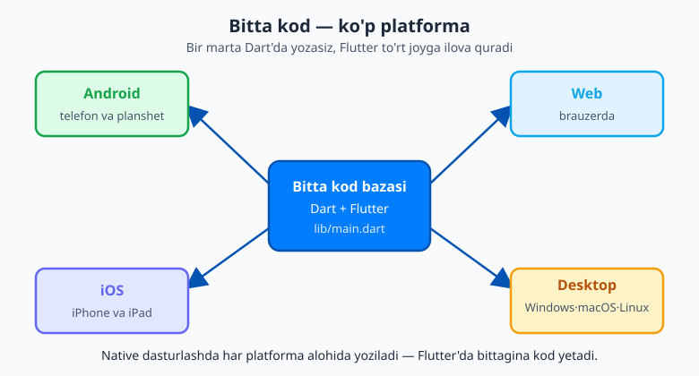
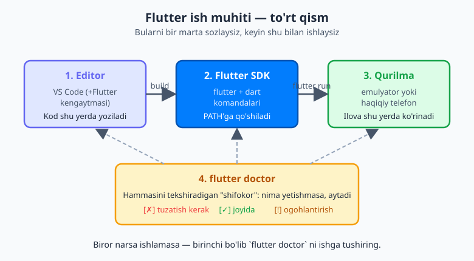
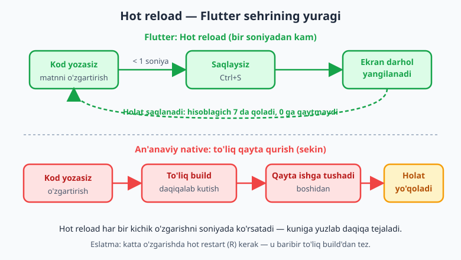

# 01 — Kirish va muhitni o'rnatish

[🏠 README](./README.md) · [Keyingi: 02 — Dart asoslari: o'zgaruvchi va tiplar ➡️](./02-dart-asoslari.md)

> **Bu bobda:** mobil dasturlash nima ekanini, native va cross-platform yondashuvlar farqini va Flutter qayerga to'g'ri kelishini ko'rib chiqamiz. Dart (til) va Flutter (freymvork) o'rtasidagi farqni aniq tushunamiz. So'ng eng amaliy qism — kompyuteringizga Flutter SDK'sini o'rnatamiz, `flutter doctor` bilan tekshiramiz, editor (VS Code) va emulyator sozlaymiz, birinchi `dart run` dasturimizni yozamiz va birinchi Flutter ilovamizni `flutter run` bilan ishga tushiramiz — eng muhimi, **hot reload** sehrini his qilamiz.

---

## Kirish: bu yo'l qayerga olib boradi

Agar siz hayotingizda hech qachon bir qator ham kod yozmagan bo'lsangiz — bu kitob aynan siz uchun. Biz mutlaqo noldan boshlaymiz. Bu bobning oxirida kompyuteringizda **ikkita** dastur ishlaydigan bo'ladi: birinchisi terminalga "Salom, dunyo!" deb yozadigan kichkina Dart dasturi, ikkinchisi esa — telefon ekranida ko'rinadigan, tugmasi bosiladigan haqiqiy mobil ilova.

Shoshmang. Bu bobda biz birorta murakkab kod yozmaymiz. Vazifamiz boshqa: **ustaxonani tayyorlash**. Duradgor yog'ochni kesishdan oldin asboblarini joylab oladi — biz ham shunday qilamiz. Muhitni bir marta to'g'ri sozlasangiz, qolgan 29 bob davomida unga qaytib tegmaysiz.

> **Maslahat.** Bu bobni shoshilmasdan, kompyuteringiz oldida o'tirib bajaring. Har bir komandani o'qib o'tmang — o'zingiz **tering va ishga tushiring**. Dasturlash — barmoqlar bilan o'rganiladigan hunar.

---

## 1. Mobil dasturlash nima?

Telefoningizdagi har bir ilova — Telegram, Instagram, bank ilovasi, taksi chaqirish dasturi — kimdir tomonidan **yozilgan**. Bu yozish jarayoni **mobil dasturlash** deb ataladi: telefon (mobil qurilma) ekranida ishlaydigan dasturlarni yaratish.

Ikki katta mobil platforma bor:

- **Android** — Google'ning operatsion tizimi. Dunyodagi telefonlarning ko'pchiligida shu turadi (Samsung, Xiaomi, Google Pixel va boshqalar).
- **iOS** — Apple'ning operatsion tizimi. Faqat iPhone va iPad'da ishlaydi.

Muammo shundaki, bu ikki platforma bir-biridan butunlay farq qiladi. Ular **boshqa tillarni** "tushunadi":

| Platforma | "Ona tili" (native) | Asosiy asbob |
|---|---|---|
| **Android** | Kotlin (yoki eski Java) | Android Studio |
| **iOS** | Swift (yoki eski Objective-C) | Xcode (faqat Mac'da) |

Bu "ona tili"da yozish **native dasturlash** deyiladi (inglizcha *native* — "tug'ma, asl"). Native yondashuv tez va kuchli, lekin bitta jiddiy kamchiligi bor.

> **Hayotiy o'xshatish.** Tasavvur qiling, siz bir xil kitobni yozyapsiz, lekin uni ham o'zbek, ham ingliz tilida **alohida** yozishingiz kerak. Ikki marta ish, ikki marta xato, ikki marta tahrir. Native dasturlash ham xuddi shunday: Android uchun Kotlin'da, iOS uchun Swift'da **bir xil ilovani ikki marta** yozasiz.

---

## 2. Cross-platform: bitta kod — ko'p platforma

Mana shu muammoni hal qilish uchun **cross-platform** (inglizcha "platformalararo") yondashuv paydo bo'ldi. G'oya sodda: **bitta kod yozasiz, u esa bir nechta platformada ishlaydi**.

Yana kitob o'xshatishiga qaytsak: cross-platform — bu kitobni bir tilda yozib, keyin uni **avtomatik** boshqa tillarga aylantiradigan sehrli mashina kabi. Bir marta yozasiz — Android ham, iOS ham oladi.

**Flutter** — aynan shunday cross-platform freymvork. Va u bitta koddan nafaqat ikki, balki **to'rt** xil maqsadga ilova quradi:



Bittagina kod yozasiz, Flutter esa undan Android telefon, iPhone, brauzerda ochiladigan veb-sayt va hatto kompyuter dasturini (Windows/macOS/Linux) quradi.

### Nega aynan Flutter?

Bugun cross-platform freymvorklari bir nechta (React Native, .NET MAUI va boshqalar), lekin Flutter ko'p sabablarga ko'ra ajralib turadi:

- **Bitta kod bazasi → ko'p platforma.** Android, iOS, web, desktop — hammasi bitta Dart kodidan. Bu vaqt va pulni keskin tejaydi.
- **Tezlik.** Flutter kodingizni har bir platformaning **native mashina kodiga** kompilyatsiya qiladi (AOT — Ahead-Of-Time). Ilova "tarjimon" orqali emas, to'g'ridan-to'g'ri qurilmada ishlaydi. Bundan tashqari **Impeller** degan grafik dvigateli ekranni to'g'ridan-to'g'ri GPU (videokarta) bilan chizadi — natijada animatsiyalar silliq va tez.
- **Katta ekotizim.** [pub.dev](https://pub.dev) saytida minglab tayyor paketlar bor — kamera, xarita, to'lov, baza bilan ishlash uchun. Ularning ko'pini bir qatorda loyihaga qo'shasiz.
- **O'sib borayotgan bozor.** Flutter dasturchilariga talab yildan-yilga oshmoqda. Bu — bugun o'rganishga arziydigan ko'nikma.

> **Eslatma.** Bu kitob misollarini asosan **Android emulyatori** yoki haqiqiy Android telefonda ishga tushirasiz, chunki bu istalgan kompyuterda (Windows/macOS/Linux) ishlaydi. iOS uchun ilova qurish va App Store'ga joylashtirish uchun esa **Mac kompyuter shart** — bu Apple'ning talabi, Flutter'ning emas.

---

## 3. Dart va Flutter — bu ikkisi bir narsa emas

Yangi o'rganuvchilar tez-tez chalkashadi: "Dart bilan Flutter — bir xilmi?" Yo'q. Ularni aniq ajratib oling, bu juda muhim:

- **Dart** — bu **dasturlash tili** (Google yaratgan). Til — bu so'zlar, grammatika, qoidalar to'plami. Inson tili (o'zbekcha, inglizcha) kabi, Dart ham — kompyuterga buyruq berish tili. `print('Salom')` kabi gaplar — Dart tilida yozilgan.
- **Flutter** — bu **UI freymvork** (interfeys quradigan asboblar to'plami), Dart tilida yozilgan. Flutter sizga tayyor "g'ishtlar" beradi: tugma, matn, rasm, ro'yxat. Siz ularni birlashtirib ekran qurasiz.

> **Hayotiy o'xshatish.** Dart — bu **o'zbek tili** (grammatika va so'zlar). Flutter — shu tilda yozilgan **oshpazlik kitobi** (tayyor retseptlar to'plami). Til bo'lmasa, kitobni o'qiy olmaysiz. Lekin tilni bilishning o'zi sizni oshpaz qilmaydi — retseptlarni ham o'rganishingiz kerak.

Mana shuning uchun bu kitob ikki qismdan boshlanadi:

1. **I qism (02–09-boblar): avval Dart tilini** o'rganamiz — o'zgaruvchi, funksiya, klass, null safety. Bularsiz Flutter'ga o'tib bo'lmaydi, xuddi grammatikani bilmasdan she'r yoza olmaganingiz kabi.
2. **II qismdan boshlab (10-bobdan): Flutter'ni** o'rganamiz — widgetlar, layout, holat (state), navigatsiya. Bu yerda haqiqiy ilovalar quramiz.

> **Diqqat.** "Tezroq mobil ilova quray" deb 02–09-boblarni o'tkazib yubormang. Dart asoslarisiz Flutter kodi sizga sehr bo'lib ko'rinadi — har qatorni tushunmasdan ko'chirib yozasiz. Avval tilni puxta o'rganing, keyin freymvork o'z-o'zidan tushunarli bo'ladi.

### Flutter ilova qanday ishlaydi (umumiy ko'rinish)

Hozircha chuqur kirmaymiz (buni [10-bobda](./10-flutter-kirish.md) batafsil ko'ramiz), lekin umumiy manzarani bilib qo'ying:

1. Siz **Dart tilida** kod yozasiz.
2. Flutter uni **kompilyatsiya** qiladi — ya'ni qurilma to'g'ridan-to'g'ri tushunadigan tez mashina kodiga aylantiradi.
3. Ilova telefonda **native tezlikda** ishlaydi.

Va bitta tub g'oya butun Flutter'ni boshqaradi: **hamma narsa — widget**. Tugma ham, matn ham, oraliq joy ham, butun ekran ham — hammasi "widget" deb ataladigan kichik qurilish bloklari. Siz ularni Lego g'ishtlari kabi bir-biriga ulab interfeys qurasiz. Hozircha bu so'zni eslab qo'ying — 10-bobda u hayotingizning markaziy tushunchasiga aylanadi.

---

## 4. Muhitni o'rnatish: amaliy yurak

Mana, bobning eng muhim qismi. Endi kompyuteringizni Flutter dasturlashga tayyorlaymiz. Bizga to'rt narsa kerak bo'ladi va ular bir-biriga ulanib ishlaydi:



1. **Flutter SDK** — Flutter'ning o'zi (komandalar, kutubxonalar, Dart tili ham ichida keladi).
2. **Editor** — kod yozadigan dastur (VS Code yoki Android Studio).
3. **Qurilma** — ilovani ko'rsatadigan joy (emulyator yoki haqiqiy telefon).
4. **`flutter doctor`** — hammasi to'g'ri ulanganini tekshiradigan "shifokor".

Keling, bularni birma-bir o'rnatamiz.

### 4.1. Flutter SDK'ni o'rnatish

**SDK** (Software Development Kit — "dasturiy ta'minot ishlab chiqish to'plami") — bu Flutter bilan ishlash uchun kerakli barcha asboblar jamlangan papka. Eng yaxshisi, Dart tili ham uning **ichida** keladi — alohida o'rnatish shart emas.

**1-qadam.** Brauzerda rasmiy saytga kiring: **[docs.flutter.dev/get-started/install](https://docs.flutter.dev/get-started/install)**. O'z operatsion tizimingizni (Windows / macOS / Linux) tanlang.

> **Diqqat.** Flutter'ni faqat **rasmiy saytdan** — `docs.flutter.dev` dan yuklab oling. Boshqa "tezroq" havolalar yoki uchinchi tomon saytlaridan yuklamang: ular eski yoki zararli versiya bo'lishi mumkin.

**2-qadam.** Sayt sizga ZIP arxivni yuklab olishni taklif qiladi. Uni yuklab oling va biror **doimiy joyga** ochib qo'ying. Tavsiya:

- **Windows:** `C:\src\flutter` (papka yo'lida bo'sh joy yoki maxsus belgilar bo'lmasin, masalan `C:\Program Files` ga **qo'ymang**).
- **macOS / Linux:** `~/development/flutter` (uy papkangiz ichida).

**3-qadam — PATH'ga qo'shish (eng muhim qadam).** **PATH** — bu operatsion tizimga "komandalarni qaysi papkalardan qidirishni" aytadigan ro'yxat. Flutter papkasidagi `bin` jildini PATH'ga qo'shsangiz, terminalning istalgan joyidan `flutter` deb yoza olasiz.

> **Hayotiy o'xshatish.** PATH — bu tizimning telefon kitobchasi. Siz `flutter` deganingizda, tizim shu kitobchadan "flutter qayerda yashaydi?" deb qidiradi. Agar Flutter'ning manzilini kitobchaga yozmasangiz, tizim "bunday komandani tanimayman" deydi.

Operatsion tizimga qarab:

- **Windows:** "Edit environment variables" (Muhit o'zgaruvchilarini tahrirlash) oynasini oching → `Path` → Yangi → `C:\src\flutter\bin` qo'shing. Rasmiy saytda aniq skrinshotli yo'riqnoma bor.
- **macOS / Linux:** terminalda profil faylingizga (`~/.zshrc` yoki `~/.bashrc`) quyidagini qo'shing:

```bash
export PATH="$PATH:$HOME/development/flutter/bin"
```

So'ng terminalni qayta oching (yoki `source ~/.zshrc` deb yangilang).

**4-qadam — tekshirish.** Terminalni (Windows'da PowerShell, macOS/Linux'da Terminal) qayta oching va tering:

```bash
flutter --version
```

Agar `Flutter 3.44.x` va `Dart 3.12.x` kabi qatorlar chiqsa — tabriklaymiz, SDK o'rnatildi!

> **Eslatma.** Bu kitob **Flutter 3.44 / Dart 3.12** (2026-yil, eng so'nggi turg'un versiyalar) asosida yozilgan va shularda tekshirilgan. Sizning versiyangiz biroz yangiroq bo'lsa ham xavotir olmang — asosiy g'oyalar bir xil qoladi.

### 4.2. `flutter doctor` — muhit shifokori

Flutter'da ajoyib asbob bor — `flutter doctor`. U kompyuteringizni "tekshiruvdan o'tkazadi" va nima yetishmayotganini aytadi. Tering:

```bash
flutter doctor
```

Natija taxminan shunday ko'rinadi (sizda biroz farq qilishi mumkin):

```text
Doctor summary (to see all details, run flutter doctor -v):
[✓] Flutter (Channel stable, 3.44.1, on ...)
[✓] Android toolchain - develop for Android devices
[✓] Chrome - develop for the web
[!] Android Studio (not installed)
[✓] VS Code
[✓] Connected device (1 available)
[✓] Network resources
```

Har bir qatorni o'qiymiz:

- **[✓] Flutter** — SDK to'g'ri o'rnatilgan. Zo'r.
- **[✓] Android toolchain** — Android ilova qurish uchun kerakli asboblar bor (Android SDK). Agar bu yerda `[✗]` bo'lsa, Android ilova qura olmaysiz — quyida tuzatamiz.
- **[✓] Chrome** — web uchun qurish mumkin (brauzerda).
- **[!] / [✗]** — bular ogohlantirish yoki muammo. `flutter doctor` har bir muammo uchun **uni qanday tuzatishni ham yozadi** — diqqat bilan o'qing va aytilganini bajaring.
- **[✓] Connected device** — kompyuterga ulangan qurilma (emulyator yoki telefon) topildi.

> **Maslahat.** `flutter doctor` — sizning eng yaqin do'stingiz. Biror narsa ishlamasa, birinchi navbatda shuni ishga tushiring. U deyarli har doim muammoning sababini va yechimini aytadi. Belgilar: `[✓]` — joyida, `[!]` — ogohlantirish (ko'pincha ishlayveradi), `[✗]` — tuzatish kerak.

Boshlash uchun **barcha qator [✓] bo'lishi shart emas**. Bizga eng kamida `Flutter` va Android (yoki web) ishlasa yetarli. Android Studio o'rnatmasangiz ham, VS Code bilan ishlay olasiz.

### 4.3. Editor: VS Code (yangi boshlovchilarga tavsiya)

**Editor** — bu kod yozadigan dastur. Ikki mashhur tanlov bor:

- **VS Code** — yengil, tez, oddiy. **Yangi boshlovchilarga tavsiya qilamiz.**
- **Android Studio** — kuchliroq, lekin og'irroq. Android emulyatorlarini boshqarish uchun qulay.

VS Code'ni o'rnatish:

1. [code.visualstudio.com](https://code.visualstudio.com) dan yuklab oling va o'rnating.
2. VS Code'ni oching, chap tomondagi **Extensions** (kvadratlardan iborat belgi) bo'limiga kiring.
3. Qidiruvga **"Flutter"** deb yozing va Flutter rasmiy kengaytmasini o'rnating (Dart kengaytmasi ham avtomatik keladi).

Bu kengaytma sizga rang berish, xatolarni ko'rsatish, avtomatik to'ldirish va eng muhimi — bir tugma bilan ilovani ishga tushirish imkonini beradi.

### 4.4. Qurilma: emulyator yoki haqiqiy telefon

Ilovani biror joyda ko'rishingiz kerak. Ikki yo'l bor:

**A) Android emulyatori** — kompyuteringizda "soxta telefon" ochiladi. Eng oson yo'li — Android Studio orqali:

1. Android Studio'ni o'rnating ([developer.android.com/studio](https://developer.android.com/studio)).
2. **Device Manager** → **Create Device** → biror telefon modeli tanlang → tizim obrazini yuklang → **Finish**.
3. Emulyatorni "Play" tugmasi bilan ishga tushiring — ekranda telefon paydo bo'ladi.

**B) Haqiqiy telefon (Android)** — ko'pincha tezroq va silliqroq ishlaydi:

1. Telefoningizda **Developer options** (Dasturchi sozlamalari)ni yoqing: Sozlamalar → Telefon haqida → "Build number"ni 7 marta bosing.
2. **USB debugging** (USB orqali sozlash)ni yoqing.
3. Telefonni USB kabel bilan kompyuterga ulang va telefonda chiqqan "Allow" (Ruxsat) so'roviga rozi bo'ling.

Ulangach, tekshiring:

```bash
flutter devices
```

Bu komanda ulangan barcha qurilmalarni ko'rsatadi.

> **Eslatma (iOS).** iOS simulyatori va iPhone'ga qurish faqat **Mac**'da Xcode orqali ishlaydi. Windows yoki Linux'da iOS ilova qura olmaysiz — bu Apple'ning cheklovi. Lekin tashvishlanmang: Dart va Flutter'ni o'rganish uchun Android (yoki web) yetib ortadi.

---

## 5. Birinchi dastur: sof Dart (Flutter'siz)

Flutter'ga o'tishdan oldin, keling, **eng birinchi dasturimizni** yozamiz — Flutter'siz, faqat Dart bilan. Bu dunyodagi har bir dasturchining an'anaviy birinchi qadami: ekranga "Salom, dunyo!" deb yozdirish.

VS Code'da `hello.dart` nomli yangi fayl yarating va ichiga **aniq shuni** yozing:

```dart
void main() {
  print('Salom, dunyo!');
}
```

Endi terminalda shu fayl turgan papkada tering:

```bash
dart run hello.dart
```

Natijada terminalda quyidagi paydo bo'ladi:

```text
Salom, dunyo!
```

**Tabriklaymiz — siz dasturchisiz!** Bu kichik dastur arzimasdek tuyulishi mumkin, lekin siz hozir kompyuterga buyruq berdingiz va u itoat qildi. Bu — katta safarning birinchi qadami.

### Bu uch qatorda nima sodir bo'ldi?

Har bir belgini tushunib olaylik — bular kelajakda yuzlab marta ishlatiladi:

- **`void main()`** — bu **funksiya**. `main` — maxsus nom: Dart **har doim shu yerdan boshlanadi**. Kompyuter dasturni ishga tushirganda eng birinchi `main` ichidagi gaplarni o'qiydi. (`void` — "hech narsa qaytarmaydi" degani; funksiyalarni keyingi qismda chuqur o'rganamiz.)
- **`{ }`** — jingalak qavslar. Ular **blok** hosil qiladi — funksiyaga tegishli gaplar shu qavslar ichida turadi. "Buyruqlar mana shu yerda boshlanib, mana shu yerda tugaydi" degani.
- **`print('Salom, dunyo!')`** — bu **komanda** (buyruq). `print` — ekranga (terminalga) matn chiqaradi. Qavs ichidagi `'Salom, dunyo!'` — chiqariladigan matn (u **tirnoq** ichida yoziladi, chunki bu matn — "string").
- **`;`** — nuqta-vergul. U har bir gapning **oxirini** bildiradi, xuddi o'zbek tilidagi nuqta kabi. Dart'da deyarli har bir buyruq `;` bilan tugaydi. Buni unutish — eng ko'p uchraydigan birinchi xato!

> **Maslahat.** `print('Salom, dunyo!')` ni `print('Mening ismim Oqil')` ga o'zgartirib, yana `dart run hello.dart` qiling. O'zgarish darhol ko'rinadi. Kichik o'zgartirishlar bilan o'ynab ko'ring — bu eng yaxshi o'rganish usuli.

---

## 6. Birinchi Flutter ilovasi

Endi haqiqiy mobil ilova quramiz. Flutter loyihalari maxsus tuzilmaga ega, shuning uchun ularni biz qo'lda emas, balki bitta komanda bilan yaratamiz.

### 6.1. Loyiha yaratish

Terminalda (loyihalarni saqlamoqchi bo'lgan papkangizda) tering:

```bash
flutter create salom_app
```

> **Diqqat.** Loyiha nomi faqat **kichik harf**, raqam va pastki chiziq (`_`) dan iborat bo'lishi kerak. `SalomApp` yoki `salom-app` ishlamaydi — `salom_app` deb yozing.

Bu komanda `salom_app` nomli papka yaratib, uning ichiga **to'liq ishlaydigan namuna ilova** joylaydi — siz hali bir qator ham yozmadingiz, lekin ilova allaqachon tayyor! Papkaga kiring:

```bash
cd salom_app
```

### 6.2. Loyiha tuzilmasi bilan tanishuv

`salom_app` ichini ochsangiz, ko'p papka va fayllar ko'rasiz. Hozircha hammasini tushunish shart emas — eng muhim to'rttasini bilib qo'ying:

| Joy | Nima u |
|---|---|
| **`lib/main.dart`** | Sizning **asosiy kodingiz**. Vaqtingizning 99% shu papkada o'tadi. `main()` shu yerda. |
| **`pubspec.yaml`** | Loyiha **"pasporti"**: nomi, versiyasi va **paketlar** (tashqi kutubxonalar) ro'yxati. Yangi paket qo'shsangiz, shu yerga yoziladi. |
| **`android/`** | Android'ga xos sozlamalar va fayllar. Boshida deyarli tegmaysiz. |
| **`ios/`** | iOS'ga xos fayllar (Mac'da kerak). Boshida deyarli tegmaysiz. |

> **Hayotiy o'xshatish.** `lib/main.dart` — bu sizning oshxonangiz, hamma "pishirish" shu yerda bo'ladi. `pubspec.yaml` — xarid ro'yxati (qaysi mahsulotlar kerak). `android/` va `ios/` — uy poydevori: bir marta quriladi, keyin kamdan-kam tegasiz.

### 6.3. Ilovani ishga tushirish

Emulyator yoki telefoningiz ulangan bo'lsin (4.4-bo'limga qarang). Endi sehrli komanda:

```bash
flutter run
```

Birinchi marta biroz kutasiz (Flutter ilovani quradi). So'ng emulyator/telefon ekranida **ko'k rangli ilova** paydo bo'ladi: o'rtada raqam (`0`) va pastki o'ng burchakda `+` tugmasi. `+` ni bossangiz, raqam ortib boradi. Bu — Flutter'ning standart namuna ilovasi (hisoblagich).

> **Maslahat.** VS Code'da `flutter run` o'rniga `F5` tugmasini bosishingiz ham mumkin (Run → Start Debugging). Natija bir xil. Ko'p dasturchilar shu yo'lni afzal ko'radi.

---

## 7. Hot reload — Flutter sehrining yuragi

Endi Flutter'ni boshqa freymvorklardan ajratib turadigan eng yoqimli xususiyatni ko'rsataman. Bu — **hot reload** (issiq qayta yuklash).

`flutter run` ishlab turibdi. VS Code'da `lib/main.dart` faylini oching va ichidan shunga o'xshash bir qatorni toping:

```dart
title: 'Flutter Demo Home Page',
```

Uni o'zgartiring:

```dart
title: 'Mening birinchi ilovam',
```

Endi faylni **saqlang** (`Ctrl+S` yoki Mac'da `Cmd+S`). Va ekranga qarang...

Ilova **bir soniyadan kamida** yangilandi! Matn darhol o'zgardi — ilovani qayta ishga tushirish, qaytadan kutish shart bo'lmadi. Bu — **hot reload**.



### Nega hot reload inqilobiy?

Hot reload'ni tushunish uchun **u bo'lmaganda** ish qanday kechishini tasavvur qiling (an'anaviy native dasturlashda):

1. Kodni o'zgartirasiz.
2. Butun ilovani qaytadan **build** qilasiz (yig'asiz) — bu **bir necha daqiqa** olishi mumkin.
3. Ilova qayta ishga tushadi va **boshidan** boshlaydi — siz tekshirayotgan ekranga **qaytadan** o'tishingiz kerak.
4. Kichik o'zgarishni ko'rasiz. Yana 1-qadamga qaytasiz.

Kuniga yuzlab marta. Har safar daqiqalab kutish. Bu — vaqtni ham, ruhni ham yeydigan jarayon.

Hot reload bularning hammasini hal qiladi:

- **Tezlik:** o'zgarish **bir soniyadan kam** vaqtda ekranda ko'rinadi.
- **Holat saqlanadi:** agar siz `+` tugmasini bosib raqamni `5` qilgan bo'lsangiz, hot reload'dan keyin ham raqam `5` bo'lib qoladi. Ilova boshidan boshlanmaydi — siz turgan joyingizdan davom etasiz.

> **Hayotiy o'xshatish.** An'anaviy build — har gal kitobning bitta harfini o'zgartirsangiz, butun kitobni qaytadan chop etishga o'xshaydi. Hot reload — ochiq kitobning o'sha betida turgancha bitta so'zni qalam bilan tuzatishdek: tez, nuqtai-joyda, qolgan hammasi joyida qoladi.

> **Eslatma.** Ba'zan hot reload yetmaydi (masalan, `main()` o'zgarsa yoki ilova holatini butunlay yangilash kerak bo'lsa). U holda **hot restart** ishlatiladi (terminalga `R` katta harf, yoki VS Code'da maxsus tugma): ilova qaytadan boshlanadi, lekin baribir to'liq build'dan ancha tez. Terminalda `flutter run` ishlab turganda kichkina `r` — hot reload, katta `R` — hot restart.

---

## 8. Xatolardan qo'rqmang

Oxirgi, lekin eng muhim gap. Yangi dasturchilar xatodan qo'rqishadi. Buni hoziroq tashlang:

> **Xatolar — dasturlashning bir qismi, ayb emas.** Dunyodagi har bir dasturchi — eng tajribalisi ham — har kuni xato qiladi. Farq shundaki, tajribali dasturchi xatoni **o'qishni** biladi.

Flutter va Dart sizga xato haqida **aniq xabar** beradi. Masalan, nuqta-vergulni unutsangiz:

```text
Error: Expected ';' after this.
```

Bu — "Bu yerdan keyin `;` kutilgan edi" degani. Xato xabari odatda:

1. **Nima** xato ekanini aytadi.
2. **Qaysi faylda va qaysi qatorda** ekanini ko'rsatadi.

Xatoni ko'rganda vahimaga tushmang. Diqqat bilan **o'qing** — javob ko'pincha o'sha yerda. Eng ko'p uchraydigan birinchi xatolar:

- Nuqta-vergul (`;`) unutilgan.
- Qavs (`)` yoki `}`) yopilmagan yoki ortiqcha.
- So'z xato yozilgan (`Print` o'rniga `print` — Dart **katta-kichik harfni farqlaydi**).

> **Maslahat.** Xato xabarini tushunmasangiz, uni internetdan qidiring (ko'chirib, Google'ga tashlang) — deyarli har bir xato sizdan oldin minglab odam tomonidan uchratilgan va yechilgan. Bu — uyat emas, dasturchining normal ish usuli.

Bu bobni tugatdingiz. Sizda endi ishlaydigan Flutter muhiti, birinchi Dart dasturingiz va birinchi mobil ilovangiz bor. Keyingi bobdan Dart tilini asoslaridan o'rganishni boshlaymiz.

---

## Xulosa

- **Mobil dasturlash** — telefon (Android/iOS) uchun ilova yaratish. **Native** yondashuvda har platforma uchun alohida yoziladi (Android — Kotlin, iOS — Swift); bu ikki marta ish.
- **Cross-platform** yondashuv bitta koddan ko'p platformaga ilova quradi. **Flutter** — bitta Dart kodidan Android, iOS, web va desktop'ga ilova quradi; tez (AOT + Impeller), katta ekotizimli va bozorda o'sib boruvchi.
- **Dart** — dasturlash tili; **Flutter** — Dart'da yozilgan UI freymvork. Ular bir narsa emas. Bu kitob avval Dart'ni (02–09), keyin Flutter'ni (10-bobdan) o'rgatadi.
- Muhit to'rt qismdan iborat: **Flutter SDK** (`docs.flutter.dev` dan, PATH'ga qo'shiladi), **editor** (VS Code + Flutter kengaytmasi), **qurilma** (emulyator yoki Android telefon), va **`flutter doctor`** (hammasini tekshiradi). iOS uchun Mac shart.
- Birinchi sof Dart dasturi: `void main() { print('Salom, dunyo!'); }`, `dart run hello.dart` bilan ishlaydi. `main` — boshlanish nuqtasi, `{ }` — blok, `print` — chiqarish, `;` — gap oxiri.
- Birinchi Flutter ilova: `flutter create salom_app` → `cd salom_app` → `flutter run`. Eng muhim fayl — `lib/main.dart`; paketlar — `pubspec.yaml` da.
- **Hot reload** — kodni saqlaganingizda ilova bir soniyadan kam vaqtda yangilanadi va **holat saqlanadi**. Bu an'anaviy sekin "build → restart" siklini o'rnini bosadi va Flutter'ni shu qadar yoqimli qiladi.
- **Xatolar — normal hodisa.** Xato xabarini o'qishni o'rganing: u nima va qayerda xato ekanini aytadi.

---

## Mashqlar

1. **(Oson)** Terminalda `flutter --version` va `flutter doctor` komandalarini bajaring. `flutter doctor` natijasida nechta qator `[✓]`, nechtasi `[!]` yoki `[✗]` ekanini sanab chiqing. Birorta `[✗]` bo'lsa, Flutter aytgan yechimni o'qib, uni tuzatishga harakat qiling.

2. **(Oson)** `salom.dart` nomli yangi fayl yarating va u ekranga ketma-ket **uchta** qator chiqarsin: ismingiz, yoshingiz va sevimli rangingiz. Faylni `dart run salom.dart` bilan ishga tushiring. (Maslahat: har biri uchun alohida `print(...)` ishlating.)

3. **(O'rta)** Dart va Flutter o'rtasidagi farqni o'z so'zlaringiz bilan, kimdir hech qachon kod yozmagan do'stingizga tushuntiradigandek, 2–3 jumlada yozing. Misol: "Dart — bu ..., Flutter esa — bu ...".

4. **(O'rta)** `flutter create test_app` bilan yangi loyiha yarating. `lib/main.dart` faylini oching va ichidagi `main()` funksiyasini toping. Loyihada yana qaysi muhim fayl/papkalar borligini (6.2-bo'limdagi jadval bo'yicha) sanab, har birining vazifasini bir jumlada yozing.

5. **(O'rta)** Ilovani `flutter run` bilan ishga tushiring (emulyator yoki telefonda). Ekrandagi `+` tugmasini bir necha marta bosib, raqamni `7` ga yetkazing. Endi `lib/main.dart` da biror matnni o'zgartiring va saqlang (hot reload). Raqam `7` bo'lib qoldimi yoki `0` ga qaytdimi? Nega shunday bo'ldi? Javobingizni yozing.

6. **(Qiyin)** Atayin xato qiling: `hello.dart` faylidagi `print('Salom, dunyo!')` qatoridan oxirgi `;` ni o'chiring va `dart run hello.dart` qiling. Chiqgan xato xabarini o'qing: u nimani va qaysi qatorni ko'rsatyapti? So'ng `;` ni qaytaring va dastur yana ishlashini tasdiqlang. Bu mashq nimani o'rgatdi?

<details markdown="1">
<summary>Yechim — 1</summary>

`flutter --version` Flutter va Dart versiyalarini ko'rsatadi (bu kitobda `Flutter 3.44.x` / `Dart 3.12.x`).

`flutter doctor` har bir komponent uchun belgi qo'yadi: `[✓]` — joyida, `[!]` — ogohlantirish (ko'pincha ishlayveradi), `[✗]` — tuzatish kerak. Aniq qatorlar soni har kompyuterda farq qiladi. Muhimi: agar `[✗]` bo'lsa, Flutter o'sha qator ostida **yechimni ham yozadi** — masalan "Run `flutter doctor --android-licenses`" yoki kerakli dasturni o'rnatish havolasi. Aynan shuni bajarib, qaytadan `flutter doctor` qiling — belgi `[✓]` ga aylanishi kerak.

</details>

<details markdown="1">
<summary>Yechim — 2</summary>

```dart
void main() {
  print('Oqil');
  print('25');
  print('Ko\'k');
}
```

`dart run salom.dart` natijasi:

```text
Oqil
25
Ko'k
```

Har bir `print(...)` o'z qatorida matn chiqaradi. E'tibor bering: tirnoq ichida apostrof (`'`) ishlatish uchun oldiga `\` qo'yiladi (`'Ko\'k'`) — buni [02-bobda](./02-dart-asoslari.md) batafsil ko'ramiz. Har bir gap oxiriga `;` qo'yishni unutmang.

</details>

<details markdown="1">
<summary>Yechim — 3</summary>

Namuna javob: "**Dart** — bu dasturlash tili, ya'ni kompyuterga buyruq beradigan so'zlar va grammatika to'plami (xuddi o'zbek tili kabi, lekin kompyuter uchun). **Flutter** esa — shu Dart tilida yozilgan tayyor asboblar to'plami bo'lib, uning yordamida telefon ilovasining ko'rinishini (tugma, matn, ro'yxat) Lego g'ishtlari kabi yig'amiz. Til bo'lmasa Flutter ishlamaydi, lekin Flutter bizga ilova qurishni ancha osonlashtiradi."

Asosiy fikr: Dart = til, Flutter = shu tilda ilova quradigan freymvork. Ular bir narsa emas.

</details>

<details markdown="1">
<summary>Yechim — 4</summary>

`main()` funksiyasi `lib/main.dart` faylida joylashgan — dastur shu yerdan boshlanadi.

Muhim fayl/papkalar:

- **`lib/main.dart`** — asosiy kod yoziladigan joy; vaqtingizning ko'p qismi shu yerda o'tadi.
- **`pubspec.yaml`** — loyiha pasporti: nomi, versiyasi va kerakli paketlar (tashqi kutubxonalar) ro'yxati.
- **`android/`** — Android platformasiga xos sozlamalar va fayllar.
- **`ios/`** — iOS platformasiga xos fayllar (ilovani iOS'ga qurish uchun, Mac kerak).

Boshlang'ich bosqichda asosan `lib/main.dart` bilan ishlaysiz; `android/` va `ios/` ga kamdan-kam tegasiz.

</details>

<details markdown="1">
<summary>Yechim — 5</summary>

Raqam **`7` bo'lib qoladi** (`0` ga qaytmaydi).

Sababi — **hot reload holatni saqlaydi**. Hot reload faqat o'zgargan kodni ilovaga "quyadi", lekin ilovani boshidan ishga tushirmaydi. Shuning uchun hisoblagichdagi joriy qiymat (`7`) joyida qoladi. Agar buning o'rniga **hot restart** (terminalda katta `R`) qilganingizda yoki ilovani butunlay qayta ishga tushirganingizda, raqam `0` ga qaytar edi — chunki restart ilovani noldan boshlaydi.

Aynan shu — hot reload'ning kuchli tomoni: siz tekshirayotgan holatni yo'qotmasdan kodni o'zgartira olasiz.

</details>

<details markdown="1">
<summary>Yechim — 6</summary>

`;` ni o'chirib `dart run` qilsangiz, taxminan shunday xato chiqadi:

```text
hello.dart:2:30: Error: Expected ';' after this.
  print('Salom, dunyo!')
                        ^
```

Xato xabari ikki narsani aytadi: (1) **nima** xato — `;` kutilgan edi ("Expected ';'"); (2) **qayerda** — `hello.dart` faylining 2-qatorida (`2:30` — 2-qator, 30-belgi), va `^` belgisi aniq joyni ko'rsatadi.

`;` ni qaytarsangiz, dastur yana muammosiz ishlaydi.

Bu mashq shuni o'rgatadi: **xato xabari — jazo emas, yo'l-yo'riq**. U sizga muammoning nima va qayerda ekanini aniq aytadi. Xatoni o'qishni o'rgansangiz, uni tuzatish oson.

</details>

---

[🏠 README](./README.md) · [Keyingi: 02 — Dart asoslari: o'zgaruvchi va tiplar ➡️](./02-dart-asoslari.md)
