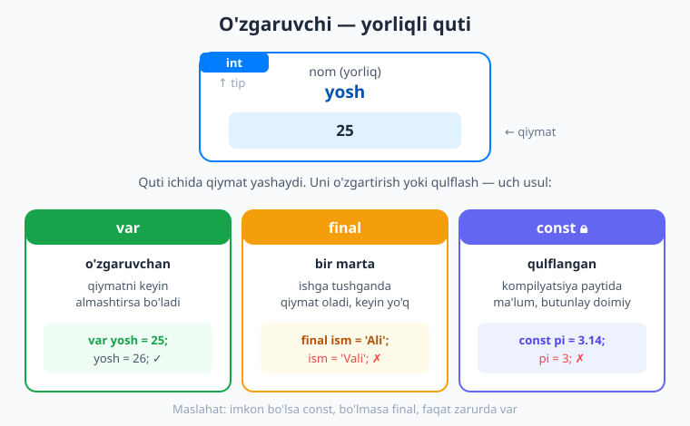
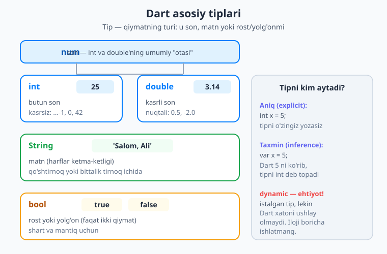
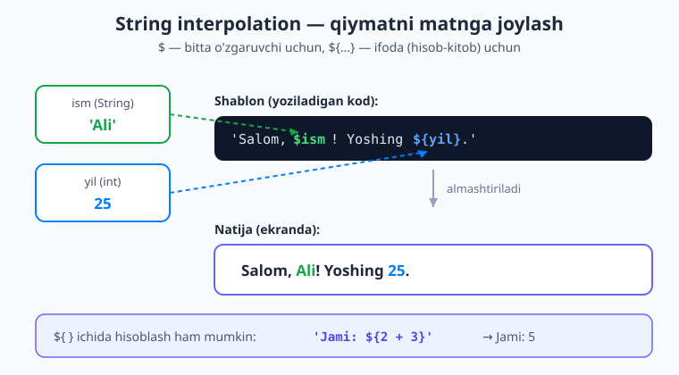

# 02 — Dart asoslari: o'zgaruvchi va tiplar

[⬅️ Oldingi: 01 — Kirish va muhitni o'rnatish](./01-kirish-muhit.md) · [🏠 README](./README.md) · [Keyingi: 03 — Boshqaruv oqimi ➡️](./03-boshqaruv-oqimi.md)

> **Bu bobda:** dasturlashning eng birinchi va eng muhim tushunchasi — **o'zgaruvchi** (variable) bilan tanishamiz. O'zgaruvchi nima, uni qanday e'lon qilish (`var`, `final`, `const`) va qachon qaysi birini ishlatish kerakligini o'rganamiz. Keyin Dart'ning asosiy **tiplari**ni (`int`, `double`, `String`, `bool`) ko'rib chiqamiz, sonlar bilan hisob-kitob qilamiz, matnlar (string) ustida ishlaymiz va Dart'ning eng ko'p ishlatiladigan imkoniyati — **string interpolation** bilan tanishamiz. Bob oxirida siz o'z dasturingizda qiymatlarni saqlash, hisoblash va chiroyli matn yasashni bilib olasiz.

---

## Kirish: nega o'zgaruvchi kerak?

Tasavvur qiling, siz do'kondasiz va xaridlaringizni bir qog'ozga yozib boryapsiz: "non — 5000 so'm, sut — 12000 so'm". Bu qog'oz — sizning **xotirangiz**. Keyin jami hisoblash kerak bo'lganda, siz shu yozuvlarga qaraysiz.

Dastur ham xuddi shunday ishlaydi. Dastur biror narsani **eslab qolishi** kerak: foydalanuvchining ismi, uning yoshi, savatdagi mahsulotlar soni. Mana shu "eslab qolish" uchun **o'zgaruvchi** (variable) ishlatiladi.

> **Hayotiy o'xshatish.** O'zgaruvchi — bu **yorliqli quti**. Qutining ustiga nom (yorliq) yozasiz, ichiga esa qiymat solasiz. Keyin shu nomni aytib, ichidagi qiymatga murojaat qilasiz. Masalan, "yosh" deb yozilgan qutiga `25` ni solib qo'yasiz — endi qachon "yosh" desangiz, dastur `25` ni beradi.



Bu bobdagi har bir kodni **o'zingiz yozib, ishga tushiring**. 01-bobda o'rnatgan muhitingizda yangi fayl yarating (masalan `asoslar.dart`), ichiga `void main() { ... }` yozing va kod misollarini shu `main` funksiyasi ichiga joylab, `dart run asoslar.dart` bilan ishga tushiring. (`main` — dastur ishga tushganda Dart birinchi bo'lib o'qiydigan joy; uni 04-bobda batafsil ko'ramiz. Hozircha — kodingiz shu figurali qavslar `{ }` ichiga yoziladi, deb biling.)

---

## 1. O'zgaruvchini e'lon qilish: `var`

O'zgaruvchini yaratish — uni **e'lon qilish** (declare) deyiladi. Eng oddiy usul — `var` kalit so'zi:

```dart
var yosh = 25;
```

Keling, bu qatorni so'zma-so'z o'qiymiz:

- `var` — "men yangi o'zgaruvchi yaratyapman" degani.
- `yosh` — o'zgaruvchining **nomi** (qutining yorlig'i). Nomni o'zingiz tanlaysiz.
- `=` — "tenglik" emas! Bu **o'zlashtirish** (assignment) belgisi: "o'ng tomondagi qiymatni chap tomondagi qutiga sol" degani.
- `25` — o'zgaruvchiga solinayotgan **qiymat**.
- `;` — qator oxiri. Dart'da deyarli har bir buyruq nuqta-vergul bilan tugaydi. **Uni unutmang** — eng ko'p uchraydigan xato shu.

Endi `yosh` nomini ishlatib, qiymatni ekranga chiqaramiz:

```dart
void main() {
  var yosh = 25;
  print(yosh); // ekranda: 25
}
```

`print(...)` — qavs ichidagi narsani ekranga (terminalga) chiqaradigan tayyor buyruq. Buni tez-tez ishlatamiz.

`var` bilan e'lon qilingan o'zgaruvchining qiymatini keyin **almashtirish** mumkin:

```dart
var yosh = 25;
yosh = 26; // qutidagi 25 o'rniga 26 solindi
print(yosh); // ekranda: 26
```

E'tibor bering: ikkinchi qatorda `var` **yo'q**. Chunki o'zgaruvchi allaqachon yaratilgan — biz faqat ichidagi qiymatni yangilayapmiz. `var` faqat **birinchi marta**, o'zgaruvchini tug'ilganda yoziladi.

!!! warning "Eng ko'p uchraydigan xatolar"
    - Nuqta-vergulni (`;`) unutish.
    - Bir o'zgaruvchini ikki marta `var` bilan e'lon qilish — `var yosh = 25; var yosh = 26;` xato beradi ("yosh allaqachon e'lon qilingan").
    - Yaratilmagan o'zgaruvchiga qiymat berish — `salom = 5;` ("salom" degan narsa yo'q) xato.

---

## 2. `final` — bir marta yoziladigan quti

Ko'pincha o'zgaruvchiga qiymatni **bir marta** beramiz va uni boshqa hech o'zgartirmaymiz. Masalan, foydalanuvchining tug'ilgan yili — u o'zgarmaydi. Bunday holatda `var` o'rniga `final` ishlatish yaxshiroq:

```dart
final ism = 'Ali';
print(ism); // Ali
```

`final` — "bu qutiga bir marta qiymat solinadi, keyin u **qulflanadi**" degani. Agar keyin uni o'zgartirmoqchi bo'lsangiz, Dart xato beradi:

```dart
final ism = 'Ali';
ism = 'Vali'; // ❌ XATO: final o'zgaruvchini o'zgartirib bo'lmaydi
```

Nega bu **foydali**? Chunki bu — sizning fikringizni himoya qiladi. Agar biror qiymat o'zgarmasligi kerak bo'lsa, uni `final` qiling — shunda kodning boshqa joyida tasodifan uni o'zgartirib qo'ysangiz, Dart sizni darhol ogohlantiradi. Bu — kelajakdagi xatolarning oldini oladi.

> **Hayotiy o'xshatish.** `var` — qaytadan yozish mumkin bo'lgan oddiy doska. `final` — markerda yozib, ustidan lak surilgan yozuv: bir marta yozdingiz, endi o'chmaydi.

---

## 3. `const` — butunlay doimiy (qulflangan) qiymat

`const` ham `final` kabi qiymatni qulflaydi, lekin bir muhim farqi bor: `const` qiymati **kompilyatsiya paytida** (ya'ni dastur hatto ishga tushishidan oldin, kod tarjima qilinayotgan paytda) ma'lum bo'lishi shart.

```dart
const pi = 3.14159;
const sekundDaqiqada = 60;
```

Bular — abadiy o'zgarmaydigan, "olamning haqiqatlari" kabi qiymatlar. `pi` doim `3.14159`, daqiqada doim `60` sekund. Bularni `const` qilish kerak.

### `final` va `const` — asosiy farq

Farqni bir misol bilan ko'raylik. Faraz qiling, biz dastur ishlayotgan **hozirgi vaqtni** olmoqchimiz:

```dart
// final — ishlaydi: qiymat dastur ishga tushganda hisoblanadi
final hozir = DateTime.now();

// const — XATO: hozirgi vaqt kompilyatsiya paytida ma'lum emas!
// const hozir = DateTime.now(); ❌
```

Mana qoidaning mohiyati:

- **`const`** — qiymat **oldindan, hoziroq** ma'lum (`3.14`, `60`, `'salom'`). Dart uni kodga "muhrlab" qo'yadi.
- **`final`** — qiymat dastur **ishlaganda** hisoblanadi (masalan hozirgi vaqt, foydalanuvchi kiritgan ism), lekin bir marta o'rnatilgach o'zgarmaydi.

> Har bir `const` ayni paytda `final` hamdir (u ham o'zgarmaydi). Lekin har bir `final` `const` bo'la olmaydi.

!!! tip "Oltin qoida: qaysi birini ishlatish kerak?"
    1. Avval **`const`** ishlatishga harakat qiling (eng qattiq, eng xavfsiz).
    2. Agar qiymat ish vaqtida hisoblansa — **`final`**.
    3. Faqat qiymat haqiqatan **o'zgarishi kerak bo'lsa** — **`var`**.

    Ya'ni: **`const` → `final` → `var`** tartibida o'ylang. Bu sizning kodingizni xavfsizroq qiladi va Flutter'da (keyinroq) ilovaning tezligiga ham yordam beradi.

---

## 4. Tiplar: qiymatning turi nima?

Har bir qiymatning o'z **turi** — **tipi** (type) bor. `25` — son, `'Ali'` — matn, `true` — rost/yolg'on. Tip Dart'ga "bu quti ichida qanday narsa yotibdi" deb aytadi, va Dart shu asosda sizni xatolardan himoya qiladi.

Dart'ning to'rtta asosiy tipi bor:



| Tip | Nima | Misol |
|---|---|---|
| `int` | butun son (kasrsiz) | `25`, `0`, `-7` |
| `double` | kasrli son (nuqtali) | `3.14`, `0.5`, `-2.0` |
| `String` | matn (harflar) | `'Salom'`, `"Ali"` |
| `bool` | rost yoki yolg'on | `true`, `false` |

Ko'rib turganingizdek, `int` va `double` — ikkalasi ham son. Dart'da ularning umumiy "otasi" — `num` tipi bor. Agar o'zgaruvchi ham butun, ham kasrli son bo'lishi mumkin bo'lsa, `num` ishlatasiz:

```dart
num narx = 100;   // hozir butun
narx = 99.99;     // endi kasrli — num ikkalasini ham qabul qiladi
```

### Tipni kim aytadi: aniq (explicit) va taxmin (inference)

Tipni ikki yo'l bilan ko'rsatish mumkin. **Birinchisi** — tipni o'zingiz aniq yozasiz:

```dart
int yosh = 25;
double narx = 3.14;
String ism = 'Ali';
bool faolmi = true;
```

**Ikkinchisi** — `var` ishlatasiz va Dart tipni **o'zi taxmin qiladi** (inference, "xulosa chiqarish"):

```dart
var yosh = 25;     // Dart 25 ni ko'rib, tipni int deb biladi
var narx = 3.14;   // double
var ism = 'Ali';   // String
var faolmi = true; // bool
```

Ikkalasi ham aynan bir xil natija beradi! `var yosh = 25;` aslida `int yosh = 25;` bilan teng — Dart shunchaki `25` ga qarab tipni o'zi topadi. Shuning uchun `var` qulay: kamroq yozasiz, tip esa baribir qat'iy (`yosh` keyin matn bo'lib qola olmaydi).

!!! note "Eslatma: tip o'zgarmaydi"
    `var yosh = 25;` dan keyin `yosh = 'Ali';` deb yozolmaysiz — Dart xato beradi, chunki `yosh` allaqachon `int`. Tip bir marta belgilanadi va o'zgarmaydi. Bu — yaxshi narsa: u sizni "sonni matn bilan adashtirib yuborish" kabi xatolardan saqlaydi.

### `dynamic` — va nega undan qochish kerak

Dart'da `dynamic` degan maxsus tip bor: u **istalgan** turdagi qiymatni qabul qiladi.

```dart
dynamic narsa = 25;
narsa = 'endi matn';  // ruxsat — chunki dynamic
narsa = true;         // bu ham ruxsat
```

Bu qulaydek tuyulishi mumkin, lekin aslida **xavfli**. `dynamic` bilan Dart sizni endi himoya qila olmaydi — u tipni "bilmaydi", shuning uchun xatolarni dastur **ishlaganda**, foydalanuvchi oldida portlatadi. Yangi boshlovchi sifatida `dynamic`'dan **iloji boricha qoching**. Deyarli har doim aniq tip yoki `var` yetarli.

---

## 5. Sonlar bilan ishlash

Sonlar ustida oddiy matematik amallar bajariladi. Dart'da quyidagi **arifmetik operatorlar** bor:

```dart
print(7 + 2); // 9   qo'shish
print(7 - 2); // 5   ayirish
print(7 * 2); // 14  ko'paytirish
print(7 / 2); // 3.5 bo'lish
print(7 ~/ 2); // 3  butun bo'lish
print(7 % 2); // 1   qoldiq (modul)
```

Bu yerda ikkita amal yangi boshlovchini ko'pincha chalkashtiradi, ularga alohida to'xtalamiz:

**`/` har doim `double` qaytaradi.** Hatto sonlar teng bo'linsa ham:

```dart
print(10 / 2); // 5.0  — 5 emas, balki 5.0 (double)!
```

**`~/` — butun bo'lish** (kasr qismi tashlab yuboriladi):

```dart
print(10 ~/ 3); // 3   (3.33... ning butun qismi)
print(7 ~/ 2);  // 3
```

**`%` — qoldiq** (modul): bo'lishdan qolgan qism. Juft/toq aniqlash uchun juda foydali:

```dart
print(10 % 3); // 1   (10 = 3*3 + 1)
print(8 % 2);  // 0   — qoldiq 0 bo'lsa, son juft
```

### Oshirish va kamaytirish

Bitta birga oshirish yoki kamaytirish uchun qisqa yozuv bor:

```dart
var soni = 10;
soni++;       // soni = soni + 1; bilan teng → 11
soni--;       // → 10 ga qaytdi
soni += 5;    // soni = soni + 5; → 15
soni -= 3;    // → 12
print(soni);  // 12
```

`++` va `--` ayniqsa sikllar (loops)da tez-tez ishlatiladi — 03-bobda ko'rasiz.

### Foydali son metodlari

Sonlarning o'ziga "biriktirilgan" (nuqta orqali chaqiriladigan) qulay **metodlar** bor:

```dart
double narx = 19.99;

print(narx.toInt());  // 19  — kasrni tashlab, butunga aylantiradi
print(narx.round());  // 20  — yaqin butun songa yaxlitlaydi
print(narx.ceil());   // 20  — yuqoriga yaxlitlaydi
print(narx.floor());  // 19  — pastga yaxlitlaydi

print((-5).abs());    // 5   — moduli (manfiyni musbat qiladi)
```

> **Metod nima?** Metod — qiymatga "biriktirilgan" tayyor amal. Uni `qiymat.metod()` ko'rinishida, nuqta qo'yib chaqirasiz. `19.99.round()` — "19.99 ni yaxlitla" degani. Metodlarni 07-bobda (OOP) chuqurroq tushunamiz; hozircha — bular tayyor, foydali "tugmalar" deb biling.

---

## 6. Matnlar (String) bilan ishlash

**String** — matn, ya'ni harflar, raqamlar va belgilar ketma-ketligi. Dart'da matnni **bir tirnoq** yoki **qo'shtirnoq** ichida yozasiz — farqi yo'q:

```dart
var a = 'Salom';   // bir tirnoq
var b = "Dunyo";   // qo'shtirnoq
```

Odatda **bir tirnoq** (`'...'`) ishlatiladi — bu Dart'da odat (konvensiya). Qo'shtirnoq esa matnning o'zida bir tirnoq (apostrof) bo'lganda qulay: `"It's me"`.

### String interpolation — Dart'ning eng sevimli imkoniyati

Endi Dart'da **eng ko'p ishlatiladigan** narsaga keldik. Faraz qiling, ism va yoshni bitta matnga jamlamoqchisiz. Buni qilishning chiroyli yo'li — **string interpolation** (matn ichiga qiymat joylash):

```dart
var ism = 'Ali';
var yil = 25;

print('Salom, $ism! Yoshing ${yil}.');
// ekranda: Salom, Ali! Yoshing 25.
```

Sehr `$` belgisida. Matn ichida `$o'zgaruvchi` yozsangiz, Dart uni o'sha o'zgaruvchining **qiymati bilan almashtiradi**:

- **`$ism`** — bitta o'zgaruvchi uchun: shunchaki `$` va nom.
- **`${...}`** — figurali qavs ichida **ifoda** (hisob-kitob) yozish mumkin:

```dart
var a = 2;
var b = 3;
print('Yig'indi: ${a + b}'); // Yig'indi: 5
print('Kvadrat: ${a * a}');  // Kvadrat: 4
```



> **Qoida sodda:** bitta o'zgaruvchi bo'lsa — `$nom`; agar nuqta, amal yoki murakkabroq ifoda bo'lsa — `${ifoda}`. Shubhalansangiz, doim `${...}` ishlating — u har doim ishlaydi.

Bu — eski, noqulay usuldan ancha yaxshi. Solishtiring (`+` bilan ulash — **konkatenatsiya**):

```dart
// Eski, noqulay usul — qiymatlarni "+" bilan yopishtirish:
print('Salom, ' + ism + '! Yoshing ' + yil.toString() + '.');

// Interpolation — toza va o'qilishi oson:
print('Salom, $ism! Yoshing $yil.');
```

Ikkalasi bir xil natija beradi, lekin ikkinchisi qanchalik tozaroq! Shuning uchun amaliyotda deyarli doim interpolation ishlating.

### Ko'p qatorli matn

Agar matn bir necha qatordan iborat bo'lsa, **uchta tirnoq** (`'''...'''`) ishlatasiz:

```dart
var xat = '''
Hurmatli Ali,
Sizni tabriklaymiz!
Hurmat bilan, Jamoa''';
print(xat);
```

Bu — ko'p qatorli matnni qulay yozish usuli (har qatorda `\n` yozish shart emas).

### Maxsus belgilar — escape

Ba'zi belgilarni matn ichida yozish uchun oldiga `\` (teskari chiziq) qo'yiladi:

```dart
print('U \'salom\' dedi.'); // U 'salom' dedi.   (\' — tirnoqning o'zi)
print('Birinchi qator\nIkkinchi qator'); // \n — yangi qatorga o'tadi
print('Yo\'l');             // Yo'l            (so'z ichidagi apostrof)
```

`\n` — yangi qator, `\'` — tirnoqning o'zi, `\\` — teskari chiziqning o'zi.

### Foydali String metodlari

Matnlar ham metodlarga boy:

```dart
var matn = 'Salom Dunyo';

print(matn.length);          // 11   — uzunligi (belgilar soni)
print(matn.toUpperCase());   // SALOM DUNYO  — katta harf
print(matn.toLowerCase());   // salom dunyo  — kichik harf
print(matn.contains('Dunyo')); // true  — ichida bormi?
print(matn.split(' '));      // [Salom, Dunyo]  — bo'shliq bo'yicha ajratish
print(matn.substring(0, 5)); // Salom  — 0-dan 5-gacha qism
print('   bo\'shliq   '.trim()); // bo'shliq  — chetlardagi bo'shliqni olib tashlaydi
```

Bular Flutter'da foydalanuvchi kiritgan matnni tekshirish va tozalashda doim asqotadi.

---

## 7. Mantiqiy qiymatlar (bool) va taqqoslash

**`bool`** tipi faqat ikki qiymatga ega: `true` (rost) yoki `false` (yolg'on). U "ha/yo'q", "ochiq/yopiq", "bormi/yo'qmi" kabi savollarning javobini saqlaydi.

`bool` qiymatlar ko'pincha **taqqoslash** (comparison) natijasida tug'iladi:

```dart
print(5 > 3);   // true   — katta
print(5 < 3);   // false  — kichik
print(5 >= 5);  // true   — katta yoki teng
print(3 <= 2);  // false  — kichik yoki teng
print(5 == 5);  // true   — teng (ikkita = belgisi!)
print(5 != 3);  // true   — teng emas
```

!!! warning "`=` va `==` — adashtirmang!"
    - `=` (bitta belgi) — **o'zlashtirish**: "qiymatni qutiga sol". `yosh = 25;`
    - `==` (ikkita belgi) — **taqqoslash**: "teng-mi?". `yosh == 25` → `true` yoki `false`.

    Bu — yangi boshlovchilarning eng ko'p adashadigan joyi. "Teng-mi?" deb so'raganda doim **ikkita** `=` ishlating.

### Mantiqiy operatorlar: `&&`, `||`, `!`

Bir nechta shartni birlashtirish uchun mantiqiy operatorlar ishlatiladi:

```dart
bool yosh18dan = 20 >= 18;  // true
bool pasportbor = true;

// && (VA) — ikkalasi ham true bo'lsa, natija true
print(yosh18dan && pasportbor); // true

// || (YOKI) — kamida bittasi true bo'lsa, natija true
print(yosh18dan || false);      // true

// ! (EMAS) — qiymatni teskari qiladi
print(!yosh18dan);              // false
```

| Operator | Nomi | Qachon `true` |
|---|---|---|
| `&&` | VA (and) | ikkala tomon ham `true` bo'lsa |
| `\|\|` | YOKI (or) | kamida bir tomon `true` bo'lsa |
| `!` | EMAS (not) | qiymatni teskari qiladi |

Bu operatorlar `if` shartlarida hayotiy ahamiyatga ega — ularni 03-bobda to'liq ishlatamiz.

---

## 8. Izohlar (comments) va `print`

**Izoh** (comment) — koddagi siz uchun yozilgan, Dart e'tibor bermaydigan matn. Izohlar kodni tushuntirish uchun kerak:

```dart
// Bu — bir qatorli izoh. // dan keyingisi e'tiborga olinmaydi.

/*
  Bu — ko'p qatorli izoh.
  Bir necha qator yozish mumkin.
*/

/// Bu — hujjat izohi (doc comment).
/// Funksiya yoki klassni tasvirlash uchun ishlatiladi.
void salom() {}
```

`print(...)` esa — biz allaqachon ishlatib kelayotgan, qavs ichidagi narsani ekranga chiqaradigan buyruq. Dasturni "ko'rish", tekshirish uchun eng oddiy vosita.

---

## 9. Bir nafas: null haqida (qisqacha)

Dart'da o'zgaruvchi **bo'sh** (hech qiymatsiz, ya'ni `null`) bo'la **olmaydi** — agar siz buni aniq ruxsat bermasangiz. Bu — Dart'ning eng kuchli himoyalaridan biri va u **"null xatosi"** deb nomlangan eng keng tarqalgan dastur xatosini deyarli butunlay yo'qotadi.

```dart
String ism = 'Ali';  // ism hech qachon null bo'la olmaydi
// ism = null;        // ❌ XATO

String? laqab;        // ? bilan — null bo'lishi mumkin
laqab = null;         // ✅ ruxsat
```

Hozircha shuni bilsangiz yetarli: oddiy tipga `?` qo'shsangiz, u "bo'sh bo'lishi mumkin" degan ma'noni beradi. Bu — juda muhim mavzu, shuning uchun unga butun bir bob bag'ishlaymiz: [06 — Null safety](./06-null-safety.md). Hozir esa o'tib ketamiz.

---

## Hammasini birlashtiramiz: kichik dastur

Endi shu bobda o'rganganlarimizni bitta amaliy misolda jamlaymiz — foydalanuvchini yoshini hisoblab, unga shaxsiy salomlashuv yasaydigan dastur:

```dart
void main() {
  // Ma'lumotlar — final, chunki ular o'zgarmaydi
  final ism = 'Laylo';
  final tugilganYil = 2001;
  const hozirgiYil = 2026; // const — bu qiymat oldindan ma'lum

  // Hisoblash
  var yosh = hozirgiYil - tugilganYil;

  // Mantiqiy tekshiruv
  var voyaga = yosh >= 18;

  // Interpolation bilan chiroyli matn
  print('Assalomu alaykum, $ism!');
  print('Siz $yosh yoshdasiz.');
  print('Voyaga yetganmisiz? $voyaga');
  print('Keyingi yili $ism ${yosh + 1} yoshga to\'ladi.');
}
```

Ishga tushiring (`dart run`), natija:

```text
Assalomu alaykum, Laylo!
Siz 25 yoshdasiz.
Voyaga yetganmisiz? true
Keyingi yili Laylo 26 yoshga to'ladi.
```

Mana — siz birinchi mazmunli Dart dasturingizni yozdingiz! Unda o'zgaruvchilar, tiplar, hisob-kitob, taqqoslash va interpolation — hammasi bor.

---

## Xulosa

- **O'zgaruvchi** — qiymat saqlaydigan yorliqli quti. E'lon qilish uch xil: `var` (o'zgaruvchan), `final` (bir marta yoziladi), `const` (kompilyatsiya paytida ma'lum, butunlay doimiy).
- **Oltin qoida:** `const` → `final` → `var` tartibida o'ylang. Iloji boricha qiymatni qulflang.
- Asosiy tiplar: **`int`** (butun son), **`double`** (kasrli), **`String`** (matn), **`bool`** (rost/yolg'on). `num` — `int` va `double`'ning umumiy otasi.
- Tip **aniq** (`int x = 5;`) yoki `var` bilan **taxmin** (`var x = 5;`) qilinadi — natija bir xil. **`dynamic`** dan qoching.
- Sonlar: `+ - * /` va maxsus `~/` (butun bo'lish), `%` (qoldiq). **`/` har doim `double` qaytaradi.** `++`/`--` bilan oshirish/kamaytirish. `.round()`, `.toInt()`, `.abs()` kabi metodlar.
- **String interpolation** (`'$nom'`, `'${ifoda}'`) — eng ko'p ishlatiladigan imkoniyat, matn yasashning toza yo'li. Ko'p qator uchun `'''...'''`, maxsus belgilar uchun `\n`, `\'`.
- String metodlari: `.length`, `.toUpperCase()`, `.contains()`, `.split()`, `.trim()`, `.substring()`.
- **`bool`** va taqqoslash (`== != > < >= <=`), mantiq (`&& || !`). `=` (o'zlashtirish) va `==` (taqqoslash) — adashtirmang.
- O'zgaruvchi `?` siz **null bo'la olmaydi** — to'liq [06-bobda](./06-null-safety.md).

## Mashqlar

Quyidagilarni o'zingiz yozib, ishga tushiring. Avval o'zingiz urinib ko'ring, keyin yechimga qarang.

1. **(Oson)** Uchta o'zgaruvchi yarating: ismingiz (`String`), yoshingiz (`int`) va bo'yingiz metrda (`double`). Ularning qiymatini bitta `print` bilan interpolation ishlatib chiqaring: `Mening ismim Ali, 25 yoshdaman, bo'yim 1.75 m.`

2. **(Oson)** `var soni = 100;` deb yarating. Uni `5` ga oshiring (`+=`), keyin `1` ga kamaytiring (`--`), natijani chiqaring. Keyin `final` bilan e'lon qilingan o'zgaruvchini o'zgartirishga urinib ko'ring va Dart qanday xato berishini kuzating.

3. **(O'rta)** Ikkita son o'zgaruvchisi (`a = 17`, `b = 5`) oling. Ularning yig'indisi, ayirmasi, ko'paytmasi, oddiy bo'linmasi (`/`), butun bo'linmasi (`~/`) va qoldig'ini (`%`) interpolation bilan chiroyli chiqaring. `/` natijasi nega `double` ekanini izohlang.

4. **(O'rta)** Bir `String` o'zgaruvchiga to'liq ismingizni yozing (masalan `'  ali valiyev  '` — atayin chetlarida bo'shliq bilan). Uni `.trim()` qiling, `.toUpperCase()` qiling, uzunligini (`.length`) chiqaring va `.split(' ')` bilan ism va familiyaga ajrating.

5. **(O'rta)** Do'kon hisobi: `narx = 12500` (`int`, bitta non), `soni = 3`. Jami summani hisoblang va shunday chiqaring: `3 ta non = 37500 so'm`. Keyin `bool` o'zgaruvchi yarating: xarid `30000` dan oshdimi? (`&&` yoki `>` ishlatib).

6. **(Qiyin)** Temperatura konvertori: `final selsiy = 25.0;` (`double`). Farengeytga aylantiring (formula: `F = C * 9 / 5 + 32`). Natijani `.round()` bilan yaxlitlab chiqaring: `25.0°C = 77°F`. Nega bu yerda `9 / 5` emas, balki butun hisobda ehtiyot bo'lish kerakligini o'ylab ko'ring (maslahat: `/` `double` beradi — bu yaxshi).

<details markdown="1">
<summary>Yechimlarni ko'rish</summary>

**1-mashq:**

```dart
void main() {
  final ism = 'Ali';
  final yosh = 25;
  final boy = 1.75;
  print('Mening ismim $ism, $yosh yoshdaman, bo\'yim $boy m.');
}
```

**2-mashq:**

```dart
void main() {
  var soni = 100;
  soni += 5; // 105
  soni--;    // 104
  print(soni); // 104

  final qulflangan = 10;
  // qulflangan = 20; // ❌ Error: final o'zgaruvchini o'zgartirib bo'lmaydi
  print(qulflangan);
}
```

`final` o'zgaruvchiga ikkinchi marta qiymat bersangiz, Dart shunday xato beradi: *"final variable can only be set once"* (final o'zgaruvchiga qiymat faqat bir marta beriladi).

**3-mashq:**

```dart
void main() {
  var a = 17;
  var b = 5;
  print('Yig\'indi: ${a + b}');     // 22
  print('Ayirma: ${a - b}');        // 12
  print('Ko\'paytma: ${a * b}');    // 85
  print('Bo\'linma: ${a / b}');     // 3.4   (double!)
  print('Butun bo\'linma: ${a ~/ b}'); // 3
  print('Qoldiq: ${a % b}');        // 2
}
```

`a / b` natijasi `3.4` — ya'ni `double`. Dart'da `/` operatori **har doim** `double` qaytaradi, hatto sonlar teng bo'linsa ham (`10 / 2` → `5.0`). Agar butun natija kerak bo'lsa, `~/` ishlating.

**4-mashq:**

```dart
void main() {
  var toliqIsm = '  ali valiyev  ';
  var tozalangan = toliqIsm.trim();      // 'ali valiyev'
  print(tozalangan.toUpperCase());        // ALI VALIYEV
  print('Uzunligi: ${tozalangan.length}'); // 11
  print(tozalangan.split(' '));           // [ali, valiyev]
}
```

**5-mashq:**

```dart
void main() {
  final narx = 12500;
  final soni = 3;
  var jami = narx * soni;            // 37500
  print('$soni ta non = $jami so\'m');

  var qimmat = jami > 30000;         // true
  print('30000 dan oshdimi? $qimmat');
}
```

**6-mashq:**

```dart
void main() {
  final selsiy = 25.0;
  var farengeyt = selsiy * 9 / 5 + 32; // 77.0
  print('$selsiy°C = ${farengeyt.round()}°F'); // 25.0°C = 77°F
}
```

Bu yerda `selsiy` `double` bo'lgani va `/` har doim `double` bergani uchun hisob to'g'ri chiqadi (kasr qismi yo'qolmaydi). Agar `selsiy` `int` bo'lib, butun bo'lish ishlatilganida, kasrlar yo'qolib, natija noto'g'ri bo'lishi mumkin edi. Mana nega son tipini to'g'ri tanlash muhim.

</details>

---

[⬅️ Oldingi: 01 — Kirish va muhitni o'rnatish](./01-kirish-muhit.md) · [🏠 README](./README.md) · [Keyingi: 03 — Boshqaruv oqimi ➡️](./03-boshqaruv-oqimi.md)
