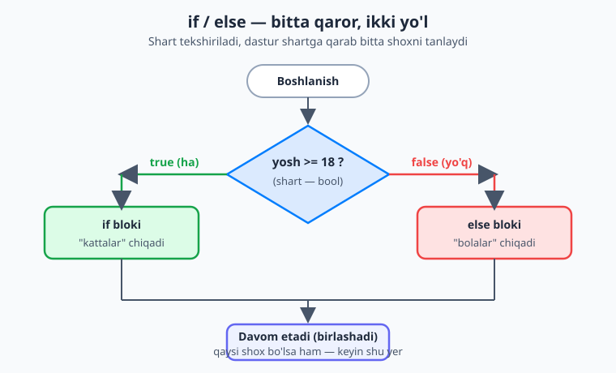
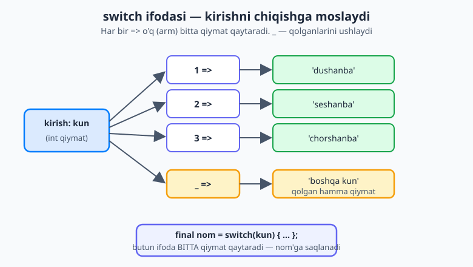
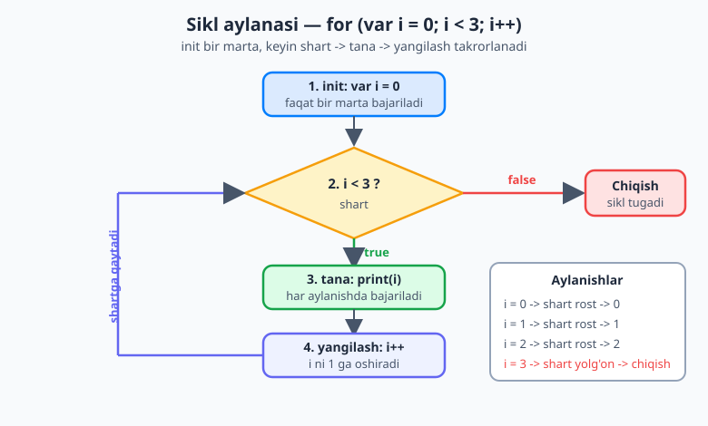

# 03 — Boshqaruv oqimi

[⬅️ Oldingi: 02 — Dart asoslari: o'zgaruvchi va tiplar](./02-dart-asoslari.md) · [🏠 README](./README.md) · [Keyingi: 04 — Funksiyalar ➡️](./04-funksiyalar.md)

> **Bu bobda:** dastur shartga qarab **qaror** qabul qilishni (`if`/`else`, ternary, `switch`) va ishni **takrorlash**ni (`for`, `while`, `do-while`) o'rganamiz. Dart 3 ning zamonaviy **`switch` ifodasi** bilan ham tanishamiz. Bu bob — Flutter'ga o'tishdan oldingi eng amaliy ko'nikma: deyarli har bir ilova "agar ... bo'lsa ... qil" va "ro'yxatdagi har bir element uchun ..." mantig'iga tayanadi.

---

## Nega boshqaruv oqimi kerak?

Hozirgacha yozgan dasturlaringiz bir tekis edi: birinchi qator, ikkinchi qator, uchinchi qator — yuqoridan pastga, hech qaerga burilmasdan. Bu — retsept emas, balki bitta to'g'ri yo'l.

Lekin haqiqiy dastur **qaror qabul qiladi** va **ishni takrorlaydi**. O'ylab ko'ring — oddiy oshxona retsepti ham shunday yozilgan:

- "**Agar** xamir ko'tarilgan bo'lsa, pechga sol; **aks holda** yana 10 daqiqa kut." — bu **shart** (conditional).
- "Tuxumni **3 marta** ayla." yoki "Idishdagi **har bir** sabzini archib chiq." — bu **sikl** (loop, takrorlash).

Boshqaruv oqimi (control flow) — dasturning shu "burilishlari": qaysi qatorlar bajarilishi, qaysilari o'tkazib yuborilishi va qaysilari necha marta takrorlanishi. Aynan shu narsa dasturni jonli qiladi.

> **Tushuncha:** "oqim" deganda dastur bajarilish paytida qatordan qatorga qanday "oqib o'tishini" tushunamiz. `if` va sikllar shu oqimni boshqaradi — shuning uchun "boshqaruv oqimi".

---

## `if` / `else if` / `else` — qaror qabul qilish

`if` — inglizcha "agar" degani. Qavs ichidagi **shart** `true` (rost) bo'lsa, jingalak qavs `{ }` ichidagi blok bajariladi:

```dart
int yosh = 20;

if (yosh >= 18) {
  print('Voyaga yetgan');
}
```

Bu yerda `yosh >= 18` — bir **bool** (mantiqiy) qiymat: u faqat `true` yoki `false` bo'ladi. (Bool tiplari va `>=`, `==` kabi taqqoslash operatorlarini 02-bobda ko'rgan edingiz — kerak bo'lsa, [02 — Dart asoslari](./02-dart-asoslari.md) ga qaytib oling.)

`else` — "aks holda". Shart `false` bo'lsa, `else` bloki ishlaydi:

```dart
int yosh = 15;

if (yosh >= 18) {
  print('Kattalar');
} else {
  print('Bolalar');   // shu chiqadi, chunki 15 >= 18 emas
}
```

Quyidagi blok-sxema shu mantiqni ko'rsatadi: bitta shart — ikki yo'l, keyin yana bitta yo'lga birlashadi.



**`else if`** — bir nechta shartni ketma-ket tekshirish uchun. Dart ularni **yuqoridan pastga** sinaydi va **birinchi rost** shartda to'xtaydi, qolganlariga qaramaydi:

```dart
int ball = 75;

if (ball >= 90) {
  print('A\'lo');
} else if (ball >= 70) {
  print('Yaxshi');        // shu chiqadi: 75 >= 90 emas, lekin 75 >= 70
} else if (ball >= 60) {
  print('Qoniqarli');
} else {
  print('Qoniqarsiz');
}
```

> **Tartib muhim!** Dart birinchi mos shartda to'xtagani uchun, shartlarni odatda **eng qattiqdan eng yumshoqqa** (katta sondan kichikka) joylaymiz. Agar `ball >= 60` ni birinchi yozsangiz, 95 ball ham "Qoniqarli" chiqib qoladi — chunki 95 ham 60 dan katta va Dart o'sha yerda to'xtaydi.

Shartlarni `&&` (va), `||` (yoki), `!` (emas) bilan birlashtirish mumkin:

```dart
int yosh = 25;
bool chiptasiBor = true;

if (yosh >= 18 && chiptasiBor) {
  print('Konsertga kirishingiz mumkin');
}
```

### Ternary operator: `shart ? a : b`

Ko'pincha biz "shartga qarab ikkitadan birini tanlab, **o'zgaruvchiga saqlaymiz**". Buni `if`/`else` bilan yozsa, 5 qator bo'ladi. **Ternary operator** uni bitta qatorga jamlaydi:

```dart
int yosh = 20;

// if/else bilan:
String holat;
if (yosh >= 18) {
  holat = 'kattalar';
} else {
  holat = 'bolalar';
}

// ternary bilan — aynan o'sha mantiq, bitta qatorda:
String holat2 = yosh >= 18 ? 'kattalar' : 'bolalar';
```

O'qilishi: "**shart** rostmi? Ha bo'lsa — `?` dan keyingi qiymat, yo'q bo'lsa — `:` dan keyingi qiymat." `?` ni "ha bo'lsa", `:` ni "aks holda" deb o'qing.

> **Qachon ternary, qachon `if`?** Ternary faqat **bitta qiymat tanlash** uchun yaxshi. Agar shoxlarda bir nechta amal bajarilsa yoki mantiq murakkablashsa — oddiy `if`/`else` o'qilishliroq. Ternary'ni ichma-ich (`a ? b : c ? d : e`) yozishdan saqlaning — buni o'qib bo'lmaydi.

### Kichik teaser: `??` ("null bo'lsa")

Dart'da yana bir foydali qisqartma bor — `??` operatori. U "chap tomon `null` bo'lsa, o'ng tomonni ol" degani:

```dart
String? ism;                      // hozircha null (02-bobdan: ? — null bo'lishi mumkin)
String korsatiladigan = ism ?? 'Mehmon';   // ism null -> 'Mehmon'
print(korsatiladigan);            // Mehmon
```

Buni hozircha "standart qiymat berish" deb tushuning. Null xavfsizligini — `?`, `!`, `??`, `?.` ni — to'liq, alohida bobda chuqur o'rganamiz; hozir shunchaki ko'rib qo'ying.

### Ichma-ich `if` va uni yassilashtirish

`if` ichida yana `if` yozish mumkin (nesting), lekin chuqurlashgani sari kodni o'qish qiyinlashadi:

```dart
// chuqur ichma-ich — o'qish qiyin
if (tizimgaKirgan) {
  if (adminmi) {
    print('Admin paneli');
  }
}
```

Ko'pincha shartlarni `&&` bilan birlashtirib **yassilashtirish** (flatten) mumkin:

```dart
// bir xil mantiq, tekisroq va o'qishli
if (tizimgaKirgan && adminmi) {
  print('Admin paneli');
}
```

> **Maslahat:** kod chap tomondan "zinapoyadek" ichkariga ketaversa, bu odatda yassilashtirish mumkinligining belgisi. Tekis kod — o'qishli kod.

---

## `switch` — bitta qiymatni ko'p variant bilan solishtirish

Ba'zan bitta o'zgaruvchini ko'p mumkin bo'lgan qiymat bilan solishtiramiz. Buni uzun `else if` zanjiri bilan yozish mumkin, lekin `switch` toza va aniqroq.

### Klassik `switch` (statement)

```dart
int kun = 3;

switch (kun) {
  case 1:
    print('Dushanba');
    break;
  case 2:
    print('Seshanba');
    break;
  case 3:
    print('Chorshanba');   // shu chiqadi
    break;
  default:
    print('Boshqa kun');   // hech bir case mos kelmasa
}
```

Bu yerda bir nechta muhim nuqta bor:

- **`case`** — har bir mumkin bo'lgan qiymat. `kun` qaysi `case` ga teng bo'lsa, o'sha blok bajariladi.
- **`default`** — hech bir `case` mos kelmaganda ishlaydigan "qolgan hammasi" shoxi (`if`/`else` dagi `else` kabi).
- **`break`** — shu `case` tugadi, `switch` dan chiq, degani.

> **Dart "fall-through" qilmaydi!** Ba'zi tillarda (C, Java) `break` yozishni unutsangiz, dastur keyingi `case` ga "tushib ketadi". Dart bunday qilmaydi: u bo'sh bo'lmagan `case` oxirida `break` (yoki `return`/`continue`) bo'lishini **talab qiladi**, aks holda kompilyator xato beradi. Shunga qaramay, `break` ni yozib qo'yish niyatingizni aniq ko'rsatadi — odat qiling.

**Bir nechta qiymatni bitta shoxga** birlashtirish uchun `case` larni ketma-ket yozing (oraliqni bo'sh qoldiring):

```dart
switch (kun) {
  case 6:
  case 7:
    print('Dam olish kuni');   // 6 yoki 7 -> shu yerga keladi
    break;
  default:
    print('Ish kuni');
}
```

### Zamonaviy `switch` ifodasi (expression) — Dart 3

Yuqoridagi `switch` **bir narsa qiladi** (statement). Lekin ko'pincha bizga **qiymat qaytaradigan** `switch` kerak — masalan, `kun` raqamiga qarab nom tanlab, uni o'zgaruvchiga saqlash. Dart 3 da buning uchun nafis **`switch` ifodasi** (switch expression) bor:

```dart
int kun = 3;

final nom = switch (kun) {
  1 => 'Dushanba',
  2 => 'Seshanba',
  3 => 'Chorshanba',
  _ => 'Boshqa kun',
};

print(nom);   // Chorshanba
```

Klassik `switch` dan farqini sezing:

- `case` so'zi **yo'q**, `break` **yo'q**, `:` o'rniga **`=>` (o'q)** ishlatiladi.
- Har bir "arm" (`o'q`) **bitta qiymat qaytaradi**, va butun `switch` shu qiymatni beradi — uni to'g'ridan-to'g'ri `final nom = ...` ga saqladik.
- **`_` (pastki chiziq)** — "wildcard", ya'ni "qolgan hamma qiymat". U `default` o'rnini bosadi.
- Oxirgi `}` dan keyin `;` qo'yiladi, chunki bu — butun bir **ifoda** (qiymat beradigan amal), `if` bloki emas.

Quyidagi sxema buni ko'rsatadi: kirish qiymatlari `=>` orqali chiqish qiymatlariga moslanadi, `_` esa qolganini ushlaydi va butun ifoda **bitta qiymat qaytaradi**.



Bu ayniqsa Flutter'da juda ko'p ishlatiladi — masalan, holatga qarab matn yoki rang tanlashda. Shuning uchun uni hozirdan o'rganib qo'yish foydali.

**Qisqacha `when` (guard) haqida.** `switch` ifodasida bir arm'ga qo'shimcha shart qo'yish mumkin — `when` bilan:

```dart
int ball = 85;

final baho = switch (ball) {
  >= 90 => 'A\'lo',
  >= 70 => 'Yaxshi',         // 85 shu yerga tushadi
  _ when ball >= 60 => 'Qoniqarli',
  _ => 'Qoniqarsiz',
};
```

> **Eslatma:** `switch` ning to'liq kuchi — **pattern matching** (qoliplarni moslash), `>= 90` kabi sonli qoliplar, records'ni qismlarga ajratish, **exhaustive** (barcha variant qamrab olingani kafolatlangan) `switch` — bularning hammasini keyinroq, [08 — Dart 3 zamonaviy imkoniyatlari](./08-dart3-zamonaviy.md) bobida chuqur o'rganamiz. Hozircha shuni biling: `switch` ifodasi qiymat qaytaradi va `_` qolganini ushlaydi — shu yetarli.

---

## Sikllar — ishni takrorlash

Sikl (loop) — bir blokni **ko'p marta** bajarish usuli. "Ekranga 1 dan 100 gacha sonlarni chiqar" deb 100 ta `print` yozmaysiz — bitta sikl yozasiz.

### `for` sikli (C-uslubidagi)

Eng ko'p ishlatiladigan sikl. U uch qismdan iborat:

```dart
for (var i = 0; i < 3; i++) {
  print('Salom, $i');
}
// Salom, 0
// Salom, 1
// Salom, 2
```

Qavs ichidagi uch qism (`;` bilan ajratilgan):

1. **init** (`var i = 0`) — sanagich (counter) e'lon qilinadi. **Faqat bir marta**, sikl boshida bajariladi.
2. **shart** (`i < 3`) — har aylanish oldidan tekshiriladi. `true` bo'lsa — tana bajariladi; `false` bo'lsa — sikl tugaydi.
3. **yangilash** (`i++`) — har aylanish oxirida bajariladi. `i++` — "`i` ni 1 ga oshir" degani.

Quyidagi sxema shu aylanani va har bir qadamdagi `i` qiymatini ko'rsatadi:



> **Nega `i < 3` bo'lsa 3 marta (0, 1, 2) takrorlanadi?** Chunki dasturchilar **0 dan** sanashni boshlaydi. `i` qiymatlari: 0, 1, 2 — uchta. `i` 3 ga yetganda `3 < 3` yolg'on bo'ladi va sikl to'xtaydi. Bu — yangi boshlovchilar uchun eng tez-tez uchraydigan chalkashlik, pastda "off-by-one" xatosini alohida ko'ramiz.

### `for-in` — ro'yxat bo'ylab yurish

Agar sizda bir ro'yxat (`List`) bo'lsa va uning har bir elementini ko'rib chiqmoqchi bo'lsangiz, indeks bilan ovora bo'lmang — `for-in` to'g'ridan-to'g'ri elementlarni beradi:

```dart
List<String> mevalar = ['olma', 'banan', 'uzum'];

for (final meva in mevalar) {
  print('Men $meva yaxshi ko\'raman');
}
// Men olma yaxshi ko'raman
// Men banan yaxshi ko'raman
// Men uzum yaxshi ko'raman
```

> `for-in` — "ro'yxatdagi **har bir** element uchun ..." mantig'i. Indeks kerak bo'lmasa, doim shuni tanlang: u soddaroq va xatoga kamroq joy qoldiradi. (`List` ni 05-bobda batafsil o'rganamiz.)

### `while` — shart bajarilguncha takrorlash

`while` — shart `true` bo'lib **turguncha** takrorlaydi. Tanani bajarishdan **oldin** shartni tekshiradi:

```dart
int son = 1;

while (son <= 5) {
  print(son);
  son++;        // MUHIM: shartni o'zgartiramiz, aks holda sikl tugamaydi!
}
// 1 2 3 4 5
```

`for` qancha marta takrorlashni **oldindan bilganda** qulay. `while` esa "**qachongacha**"ni bilmaganda — masalan, foydalanuvchi to'g'ri parol kiritguncha yoki o'yin tugaguncha.

### `do-while` — kamida bir marta bajarish

`do-while` `while` ga o'xshaydi, lekin shartni **oxirida** tekshiradi. Demak, tana **kamida bir marta** bajariladi — hatto shart birinchidanoq yolg'on bo'lsa ham:

```dart
int son = 10;

do {
  print('Bu bir marta baribir chiqadi: $son');
} while (son < 5);   // shart yolg'on, lekin tana allaqachon bir marta bajarildi
```

> Buni "avval qil, keyin so'ra" deb eslang. Kamdan-kam kerak bo'ladi (masalan, menyuni kamida bir marta ko'rsatib, keyin "yana?" deb so'rash), lekin bor ekanini biling.

### `break` va `continue`

Sikl ichida oqimni nozik boshqarish:

- **`break`** — siklni **butunlay** to'xtatadi va undan chiqadi.
- **`continue`** — joriy aylanishni **o'tkazib yuboradi** va keyingisiga o'tadi.

```dart
// break — qidirilgan narsa topilganda to'xtash
for (var i = 1; i <= 10; i++) {
  if (i == 5) {
    break;          // 5 ga yetganda butunlay chiqadi
  }
  print(i);         // 1 2 3 4
}

// continue — ba'zi elementlarni o'tkazib yuborish
for (var i = 1; i <= 5; i++) {
  if (i == 3) {
    continue;       // 3 ni o'tkazib, keyingisiga o'tadi
  }
  print(i);         // 1 2 4 5  (3 yo'q)
}
```

---

## Amaliy qoliplar

Quyidagilar — kundalik dasturlashda qayta-qayta uchraydigan kichik "retseptlar". Ularni tushunsangiz, ko'plab masalalarni yecha olasiz.

**1. Sonlar yig'indisi.** Bir o'zgaruvchini boshlab, har aylanishda ustiga qo'shib boramiz (bu — "akkumulyator" qolipi):

```dart
int yigindi = 0;
for (var i = 1; i <= 100; i++) {
  yigindi += i;     // yigindi = yigindi + i
}
print(yigindi);     // 5050  (1 dan 100 gacha yig'indi)
```

**2. FizzBuzz** — klassik mashq. 1 dan 15 gacha sonlarni chiqaramiz: 3 ga bo'linsa "Fizz", 5 ga "Buzz", ikkalasiga ham "FizzBuzz". `%` (qoldiq) operatori — bo'linish qoldig'ini beradi (`i % 3 == 0` degani "`i` qoldiqsiz 3 ga bo'linadi"):

```dart
for (var i = 1; i <= 15; i++) {
  if (i % 3 == 0 && i % 5 == 0) {
    print('FizzBuzz');
  } else if (i % 3 == 0) {
    print('Fizz');
  } else if (i % 5 == 0) {
    print('Buzz');
  } else {
    print(i);
  }
}
```

**3. Ro'yxatdagi eng kattasini topish.** "Hozirgi eng katta"ni saqlab, har elementni u bilan solishtiramiz:

```dart
List<int> sonlar = [12, 47, 5, 89, 33];
int engKatta = sonlar[0];      // birinchisini boshlang'ich deb olamiz

for (final son in sonlar) {
  if (son > engKatta) {
    engKatta = son;            // kattaroq topilsa, yangilaymiz
  }
}
print(engKatta);               // 89
```

**4. Sikl ichida matn yig'ish.** Har aylanishda string'ga qo'shib, natija qatorini quramiz:

```dart
String natija = '';
for (var i = 1; i <= 5; i++) {
  natija += '$i ';             // string interpolation (02-bobdan)
}
print(natija.trim());          // 1 2 3 4 5
```

---

## Yangi boshlovchilarning tez-tez uchraydigan xatolari

**1. `=` va `==` ni chalkashtirish.** `=` — **qiymat berish** (assignment), `==` — **tenglikni tekshirish** (taqqoslash). Shartda doim `==` kerak:

```dart
int x = 5;
if (x == 5) {        // TO'G'RI: tekshirish
  print('besh');
}
// if (x = 5)        // XATO: bu qiymat berish — Dart kompilyatori buni rad etadi
```

> Yaxshiyamki, Dart sizni himoya qiladi: shartga `int` qiymat berishga urinsangiz, kompilyator xato beradi (shart `bool` bo'lishi shart). Lekin odat sifatida har doim `==` yozayotganingizni tekshiring.

**2. "Off-by-one" — bir qadam adashish.** Bu eng mashhur xato. `i <= n` va `i < n` ni, 0 dan yoki 1 dan boshlashni adashtirib yuborish oson:

```dart
// 5 ta element chiqarmoqchimiz (0..4):
for (var i = 0; i < 5; i++) { }    // TO'G'RI: 5 marta (0,1,2,3,4)
for (var i = 0; i <= 5; i++) { }   // XATO: 6 marta (0,1,2,3,4,5)
```

> Ro'yxat indekslari **0 dan** boshlanadi va oxirgi indeks `uzunlik - 1`. `i < ro'yxat.length` yozsangiz, doim xavfsiz bo'lasiz.

**3. `break` ni unutish (niyat aniqligi).** Dart "fall-through" qilmagani uchun klassik `switch` da `break` ni unutish kompilyatsiya xatosini beradi — bu yaxshi, sizni xatodan saqlaydi. Lekin `break` ni doim yozish niyatingizni aniq ko'rsatadi. Qiymat qaytarish kerak bo'lsa — `break` bilan ovora bo'lmasdan **`switch` ifodasini** ishlating.

**4. Cheksiz sikl.** Agar siklning sharti **hech qachon** `false` bo'lmasa, dastur to'xtamay qoladi (va ko'pincha "muzlab" qoladi):

```dart
// XAVFLI — cheksiz sikl!
var son = 1;
while (son <= 5) {
  print(son);
  // son++ ni unutdik -> son doim 1 -> shart doim true -> tugamaydi
}
```

> Har `while`/`for` da o'zingizdan so'rang: "**shart qachon yolg'on bo'ladi?**" Agar javob "hech qachon" bo'lsa — sikl cheksiz. Sanagichni oshirayotganingizni yoki shartga yetayotganingizni tekshiring.

---

## Mashqlar

Quyidagi mashqlarni avval **o'zingiz** yeching, keyingina yechimga qarang. Har birini alohida faylda yozib, `dart run` bilan ishga tushiring.

1. Bir `int yosh` o'zgaruvchisi bering. `if`/`else` bilan: 18 dan katta yoki teng bo'lsa "kattalar", aks holda "bolalar" chiqaring. Keyin **xuddi shu mantiqni** ternary operator bilan bitta qatorda qayta yozing.
2. Bir `int ball` (0–100) bering. `else if` zanjiri bilan baho chiqaring: `>=90` → "A'lo", `>=70` → "Yaxshi", `>=60` → "Qoniqarli", aks holda "Qoniqarsiz".
3. 2-mashqdagi mantiqni Dart 3 ning **`switch` ifodasi** bilan qayta yozing (`>= 90 => ...` qoliplari va `_` bilan). Natijani `final baho` ga saqlab, `print` qiling.
4. `for` sikli bilan 1 dan 50 gacha bo'lgan **juft** sonlarni chiqaring. (Maslahat: `i % 2 == 0` — juftlik tekshiruvi.)
5. Bir `List<int> sonlar` bering. `for-in` bilan ularning **yig'indisini** va **eng kichigini** toping va chiqaring.
6. `while` sikli bilan 10 dan 1 gacha **teskari** sanab chiqing, oxirida "Uchirildi!" deb yozing.

<details markdown="1">
<summary>1-mashq yechimi</summary>

```dart
void main() {
  int yosh = 20;

  // if/else
  if (yosh >= 18) {
    print('kattalar');
  } else {
    print('bolalar');
  }

  // ternary — bir xil mantiq, bitta qator
  String holat = yosh >= 18 ? 'kattalar' : 'bolalar';
  print(holat);
}
```

</details>

<details markdown="1">
<summary>2-mashq yechimi</summary>

```dart
void main() {
  int ball = 75;

  if (ball >= 90) {
    print('A\'lo');
  } else if (ball >= 70) {
    print('Yaxshi');        // 75 shu yerga tushadi
  } else if (ball >= 60) {
    print('Qoniqarli');
  } else {
    print('Qoniqarsiz');
  }
}
```

> Shartlar kattadan kichikka tartibda — birinchi mos shartda to'xtaydi.

</details>

<details markdown="1">
<summary>3-mashq yechimi</summary>

```dart
void main() {
  int ball = 75;

  final baho = switch (ball) {
    >= 90 => 'A\'lo',
    >= 70 => 'Yaxshi',      // 75 shu armga tushadi
    >= 60 => 'Qoniqarli',
    _ => 'Qoniqarsiz',
  };

  print(baho);              // Yaxshi
}
```

> `switch` ifodasi qiymat qaytaradi — uni to'g'ridan-to'g'ri `final baho` ga saqladik. `_` qolgan hamma qiymatni ushlaydi.

</details>

<details markdown="1">
<summary>4-mashq yechimi</summary>

```dart
void main() {
  for (var i = 1; i <= 50; i++) {
    if (i % 2 == 0) {
      print(i);             // 2, 4, 6, ... 50
    }
  }

  // Muqobil yo'l: 2 dan boshlab 2 qadam bilan
  for (var i = 2; i <= 50; i += 2) {
    print(i);
  }
}
```

</details>

<details markdown="1">
<summary>5-mashq yechimi</summary>

```dart
void main() {
  List<int> sonlar = [12, 47, 5, 89, 33];

  int yigindi = 0;
  int engKichik = sonlar[0];   // birinchisini boshlang'ich deb olamiz

  for (final son in sonlar) {
    yigindi += son;
    if (son < engKichik) {
      engKichik = son;
    }
  }

  print('Yig\'indi: $yigindi');       // Yig'indi: 186
  print('Eng kichik: $engKichik');    // Eng kichik: 5
}
```

</details>

<details markdown="1">
<summary>6-mashq yechimi</summary>

```dart
void main() {
  int son = 10;

  while (son >= 1) {
    print(son);
    son--;            // MUHIM: kamaytiramiz, aks holda cheksiz sikl
  }

  print('Uchirildi!');
}
```

> `son--` — "`son` ni 1 ga kamaytir". Bu bo'lmasa, shart hech qachon yolg'on bo'lmaydi.

</details>

---

[⬅️ Oldingi: 02 — Dart asoslari: o'zgaruvchi va tiplar](./02-dart-asoslari.md) · [🏠 README](./README.md) · [Keyingi: 04 — Funksiyalar ➡️](./04-funksiyalar.md)
