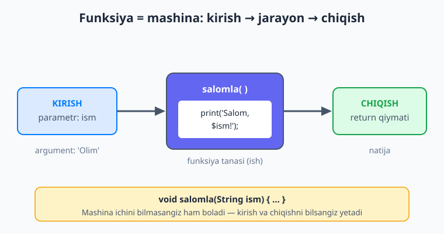
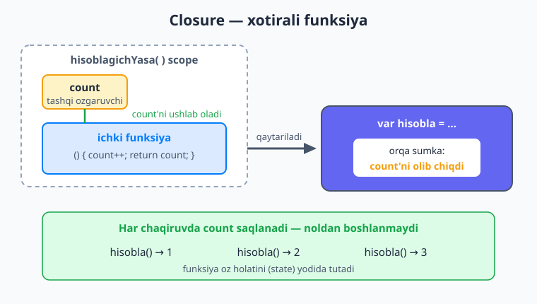

# 04 — Funksiyalar

[⬅️ Oldingi: 03 — Boshqaruv oqimi](./03-boshqaruv-oqimi.md) · [🏠 README](./README.md) · [Keyingi: 05 — To'plamlar: List, Set, Map ➡️](./05-toplamlar.md)

> **Bu bobda:** funksiya nima va **nega** kerakligini tushunamiz — bir bo'lak ishga nom berib, uni qayta-qayta ishlatishni o'rganamiz (DRY). Funksiyani e'lon qilish (return tipi, nom, parametrlar, tana), `void`, `return`, qisqa **arrow** sintaksis (`=>`), uch xil parametr (positional, named `{}` `required` va default bilan, optional positional `[]`), funksiyalar **birinchi-darajali qiymat** ekani, **anonim funksiyalar** (lambda), **yuqori-tartibli funksiyalar**, **closure** (xotirali funksiya) va qisqa rekursiyani ko'ramiz. Bularning hammasi keyinchalik Flutter'da har kuni ishlatadigan poydevor — chunki Flutter'da siz funksiyalarni doimo uzatasiz (`onPressed: () { ... }`).

---

## Nega funksiya kerak?

Tasavvur qiling, dasturingizda foydalanuvchini ismi bilan tabriklash kerak. Bir joyda yozasiz:

```dart
print('Salom, Olim! Xush kelibsiz.');
```

Keyin boshqa ekranda yana, yana boshqa joyda yana... O'ndan ortiq joyda bir xil qator. Endi rahbar aytadi: "Tabrik matnini o'zgartiraylik — 'Salom' o'rniga 'Assalomu alaykum' bo'lsin". Siz o'sha o'nta joyni topib, har birini qo'lda tuzatishingiz kerak. Bittasini unutsangiz — xato.

Bu — dasturlashdagi eng katta dushman: **takrorlash**. Yechim — bir bo'lak ishni bir marta yozib, unga **nom** berish. Mana shu nomlangan bo'lak — **funksiya**.

```dart
void salomla(String ism) {
  print('Salom, $ism! Xush kelibsiz.');
}
```

Endi o'sha o'nta joyda faqat `salomla('Olim');` deb yozasiz. Matnni o'zgartirmoqchi bo'lsangiz — **bitta** joyni, funksiya ichini tuzatasiz, hamma joy avtomatik yangilanadi.

Bu qoidaning o'zbekcha nomi yo'q-u, ingliz dasturchilar uni **DRY** deydi — *Don't Repeat Yourself* ("o'zingni takrorlama"). Funksiya — DRY'ni amalga oshiruvchi asosiy vosita.

Funksiya yana ikki narsani beradi:

- **O'qiluvchanlik.** `salomla('Olim')` degan qator nima qilishini nomidan tushunasiz. 50 qator kodni o'qigandan ko'ra, nomlangan funksiyalar zanjirini o'qish osonroq.
- **Sinash va tuzatish.** Bir funksiya buzilsa, faqat o'shani tekshirasiz. Xato bir joyda yashaydi, butun dasturga tarqalmaydi.

### Funksiyani mashina deb tasavvur qiling

Funksiyani **mashina** sifatida tasavvur qilish eng foydali analogiya. Sharbat qaynatgichni oling: ichiga **olma** solasiz (kirish), mashina ichida bir ish bo'ladi (jarayon), va tashqariga **sharbat** chiqadi (chiqish). Siz mashina ichida nima bo'layotganini bilishingiz shart emas — kirish va chiqishni bilsangiz yetadi.

Funksiya ham xuddi shunday: **parametrlar** orqali ma'lumot kiritasiz, funksiya **tanasi**da ish bajariladi, va `return` orqali natija **qaytadi**.



## Funksiyani e'lon qilish

Dart'da funksiyaning to'liq shakli to'rt qismdan iborat:

```dart
int qosh(int a, int b) {
  return a + b;
}
```

Bu qatorni o'ngdan chapga o'qiymiz:

| Qism | Misolda | Ma'nosi |
|---|---|---|
| **Return tipi** | `int` | Funksiya qanday tip qaytaradi |
| **Nom** | `qosh` | Funksiyani chaqirish uchun nom |
| **Parametrlar** | `(int a, int b)` | Funksiya nimani qabul qiladi |
| **Tana** | `{ ... }` | Bajariladigan ish |

`return a + b;` qatori ikki ishni qiladi: natijani (`a + b`) hisoblaydi **va** funksiyani darhol tugatib, shu qiymatni tashqariga chiqaradi. `return`dan keyingi har qanday kod ishlamaydi.

Funksiyani **chaqirish** (call) — uning nomini yozib, qavs ichida argumentlarni berish:

```dart
void main() {
  int natija = qosh(3, 5); // funksiyani chaqiramiz, 8 qaytadi
  print(natija);           // 8
}
```

📌 **Atama farqi:** funksiyani **e'lon qilganda** yozgan `a`, `b` — *parametrlar*. Funksiyani **chaqirganda** bergan `3`, `5` — *argumentlar*. Parametr — bo'sh quti, argument — quti ichiga solgan haqiqiy qiymat.

### `void` — hech narsa qaytarmaydigan funksiya

Ba'zi funksiyalar qiymat **qaytarmaydi** — ular faqat ish bajaradi (ekranga yozadi, faylga saqlaydi). Ularning return tipi — `void` ("hech narsa"):

```dart
void salomla(String ism) {
  print('Salom, $ism!');
  // return yo'q — chunki qaytaradigan qiymat yo'q
}
```

`void` aytadi: "bu funksiya foydali qiymat qaytarmaydi, uning natijasini o'zgaruvchiga olmang". `salomla` faqat ekranga yozish uchun chaqiriladi:

```dart
salomla('Lola'); // Salom, Lola!
```

💡 `void` funksiyada ham `return;` (qiymatsiz) yozish mumkin — bu funksiyani erta to'xtatish uchun ishlatiladi:

```dart
void tekshir(int yosh) {
  if (yosh < 0) {
    print('Yosh manfiy bo\'la olmaydi!');
    return; // funksiyadan darhol chiqamiz, pastdagi kod ishlamaydi
  }
  print('Yosh: $yosh');
}
```

## Arrow sintaksis — `=>`

Agar funksiya tanasi **bitta ifoda**dan iborat bo'lsa (ya'ni bitta narsani hisoblab `return` qiladi), uni qisqa **arrow** ("strelka") shaklida yozish mumkin. `=>` — bu "ushbu ifodani qaytar" degani.

Quyidagi ikki funksiya **bir xil** ishni qiladi:

```dart
// To'liq shakl:
int kvadrat(int n) {
  return n * n;
}

// Arrow shakli — qisqaroq:
int kvadrat(int n) => n * n;
```

`=> n * n` aynan `{ return n * n; }` degani: figurali qavs ham, `return` so'zi ham, nuqtali vergul ham kerak emas. Faqat **bitta ifoda** bo'lganda ishlaydi — ichida `if`, sikl yoki bir nechta qator bo'lsa, to'liq `{ ... }` shaklini ishlatasiz.

```dart
bool juftmi(int n) => n % 2 == 0;
String salomla(String ism) => 'Salom, $ism!';
```

💡 Arrow sintaksisni hozir yaxshilab o'rganing — Flutter'da uni **doimo** ko'rasiz. `build` metodi, hodisa ishlovchilari, `map` callbacklar — ko'pchiligi arrow shaklida yoziladi.

## Parametrlarning uch turi

Hozirgacha biz `qosh(int a, int b)` kabi **oddiy (positional)** parametrlarni ishlatdik. Lekin Dart'da parametrlarni berishning uch xil yo'li bor. Bu — Dart'ni Flutter uchun shunchalik qulay qiladigan eng muhim mavzulardan biri, shuning uchun har birini diqqat bilan ko'rib chiqamiz.

![Uch xil parametr turi yonma-yon: positional f(a, b), named f({required a, b=0}), optional positional f(a, [b]) — har biri chaqirish misoli bilan](rasmlar/fl04-parametr-turlari.svg)

### 1. Positional parametrlar (oddiy, majburiy)

Bular siz allaqachon ko'rgan oddiy parametrlar. Ularni **tartib bo'yicha** beriladi — birinchi argument birinchi parametrga, ikkinchisi ikkinchisiga tushadi:

```dart
double bmiHisobla(double vazn, double boy) {
  return vazn / (boy * boy);
}

bmiHisobla(70, 1.75); // 70 → vazn, 1.75 → boy
```

Tartib muhim: agar `bmiHisobla(1.75, 70)` deb adashtirsangiz, natija butunlay noto'g'ri bo'ladi, lekin Dart hech narsa demaydi — chunki ikkalasi ham `double`. Bu — positional parametrlarning kamchiligi: chaqiruvni o'qiganda **qaysi raqam nima ekanini bilmaysiz**.

### 2. Named parametrlar — `{}`

Mana shu muammoni **named** (nomlangan) parametrlar hal qiladi. Ularni figurali qavs `{}` ichiga yozasiz, va chaqirganda har bir argumentni **nomi bilan** berasiz:

```dart
double bmiHisobla({double vazn = 0, double boy = 0}) {
  return vazn / (boy * boy);
}

bmiHisobla(vazn: 70, boy: 1.75); // endi qaysi raqam nima ekani aniq!
```

Named parametrlar ikki katta foyda beradi:

- **O'qiluvchanlik.** `bmiHisobla(vazn: 70, boy: 1.75)` o'zini-o'zi tushuntiradi. Kodni o'qigan odam (yarim yildan keyin o'zingiz ham) darhol tushunadi.
- **Tartibdan ozodlik.** Named parametrlarni **istalgan tartibda** berish mumkin: `bmiHisobla(boy: 1.75, vazn: 70)` ham to'g'ri.

Yuqorida har bir named parametrga **default qiymat** berdik: `{double vazn = 0}`. Bu shuni anglatadiki, agar argument berilmasa, parametr o'sha default qiymatni oladi. Default qiymatli named parametr **ixtiyoriy** bo'ladi — chaqirganda uni tashlab ketish mumkin.

#### `required` — majburiy named parametr

Ba'zan named parametr kerakligini, lekin uni **majburiy** qilishni xohlaysiz. Buning uchun `required` kalit so'zini ishlatasiz:

```dart
double bmiHisobla({required double vazn, required double boy}) {
  return vazn / (boy * boy);
}

bmiHisobla(vazn: 70, boy: 1.75); // ✅ ikkalasi ham berilgan
bmiHisobla(vazn: 70);            // ❌ Xato: 'boy' berilmagan, lekin u required
```

`required` aytadi: "bu parametr nomlangan, lekin uni tashlab ketib bo'lmaydi — albatta ber". Default qiymat va `required`ni birga ishlatib bo'lmaydi (mantiqsiz — majburiy parametrning default qiymati keraksiz).

📌 **Mana eng muhim sir:** Flutter'dagi deyarli **har bir widget** named parametrlar bilan quriladi. Masalan, oldinda ko'radigan kodingiz shunday bo'ladi:

```dart
Text(
  'Salom',
  style: TextStyle(fontSize: 24, color: Colors.blue),
  textAlign: TextAlign.center,
)
```

Bu yerda `style`, `textAlign` — hammasi named parametrlar. Mana shuning uchun named parametrlarni hozir yaxshi o'zlashtirish juda muhim: ularsiz Flutter kodini hatto o'qib ham bo'lmaydi.

### 3. Optional positional parametrlar — `[]`

Uchinchi tur — **optional positional** parametrlar. Ular kvadrat qavs `[]` ichiga yoziladi, tartib bilan beriladi (named kabi nomi bilan emas), lekin **ixtiyoriy** bo'ladi:

```dart
String toliqIsm(String ism, [String? familiya]) {
  if (familiya == null) {
    return ism;
  }
  return '$ism $familiya';
}

toliqIsm('Olim');          // 'Olim'
toliqIsm('Olim', 'Karim'); // 'Olim Karim'
```

`[String? familiya]` — "familiya ixtiyoriy; berilmasa, qiymati `null` bo'ladi". `null` — "qiymat yo'q" degani; uni 06-bobda chuqur o'rganamiz. Optional positional parametrga ham default qiymat berish mumkin:

```dart
String takrorla(String matn, [int marta = 1]) {
  return matn * marta;
}

takrorla('ha');    // 'ha'
takrorla('ha', 3); // 'hahaha'
```

💡 **Qaysi birini tanlash?** Amaliy qoida: parametr bittagina va ma'nosi nomidan tushunarli bo'lsa — positional ishlating (`kvadrat(5)`). Bir nechta parametr bo'lsa yoki ma'no chalkash bo'lsa — named ishlating. Flutter'da deyarli har doim **named** ishlatiladi.

## Funksiyalar — birinchi-darajali qiymat

Mana endi qiziq bir narsani aytamiz: Dart'da **funksiya ham qiymat**. Xuddi `5` yoki `'salom'` kabi, funksiyani ham o'zgaruvchiga solib, boshqa funksiyaga uzatib, hatto qaytarib bo'ladi. Bunga "funksiyalar **birinchi-darajali** (first-class) qiymat" deyiladi.

Funksiyani o'zgaruvchiga solamiz:

```dart
int kvadrat(int n) => n * n;

void main() {
  var amal = kvadrat; // funksiyani o'zgaruvchiga soldik (qavs YO'Q!)
  print(amal(4));     // 16 — amal endi kvadratga ishora qiladi
}
```

Diqqat: `var amal = kvadrat;` da qavs **yo'q**. `kvadrat` (qavssiz) — funksiyaning o'zi; `kvadrat(4)` (qavs bilan) — funksiyani chaqirish. Bu farqni yaxshi tushunib oling.

### Anonim funksiyalar (lambda)

Agar funksiyani faqat bir joyda ishlatmoqchi bo'lsangiz, unga nom berishning hojati yo'q. **Nomsiz** funksiya yozish mumkin — bunga **anonim funksiya** yoki **lambda** deyiladi.

Anonim funksiya oddiy funksiyaga o'xshaydi, faqat nomi yo'q:

```dart
// Nomli funksiya:
int kvadrat(int n) => n * n;

// Xuddi shu — anonim, o'zgaruvchiga solingan:
var kvadrat2 = (int n) => n * n;
```

Anonim funksiyaning ikki shakli bor — bitta ifoda uchun arrow, ko'p qator uchun figurali qavs:

```dart
var ikkilantir = (int x) => x * 2;       // arrow: bitta ifoda

var tekshir = (int x) {                   // figurali qavs: bir nechta qator
  if (x > 0) {
    return 'musbat';
  }
  return 'musbat emas';
};
```

Anonim funksiyalarning haqiqiy kuchi — ularni **to'g'ridan-to'g'ri** boshqa funksiyaga uzatishda ko'rinadi. Mana shu yerda yuqori-tartibli funksiyalar boshlanadi.

## Yuqori-tartibli funksiyalar

**Yuqori-tartibli funksiya** (higher-order function) — bu funksiyani **qabul qiladigan** yoki funksiyani **qaytaradigan** funksiya. Nomi qo'rqinchli, lekin g'oya oddiy: agar funksiya ham qiymat bo'lsa, demak uni boshqa funksiyaga argument qilib berish ham tabiiy.

Klassik misol — `bir-bir` funksiyani biror amalni necha marta takrorlash:

```dart
void takrorla(int marta, void Function(int) amal) {
  for (int i = 0; i < marta; i++) {
    amal(i); // har safar bizga berilgan funksiyani chaqiramiz
  }
}

void main() {
  takrorla(3, (i) {
    print('Bu $i-takror');
  });
}
```

Bu yerda `void Function(int) amal` — "`amal` parametri `int` qabul qilib hech narsa qaytarmaydigan **funksiya**" degani. `takrorla`ga biz anonim funksiyani uzatdik, va u uni 3 marta chaqirdi. Natija:

```
Bu 0-takror
Bu 1-takror
Bu 2-takror
```

Funksiyani parametr sifatida qabul qilganda, uning tipini `qaytim_tipi Function(parametr_tiplari)` shaklida yozamiz. Yana bir misol — biror amalni qiymatga qo'llaydigan funksiya:

```dart
int qolla(int qiymat, int Function(int) amal) {
  return amal(qiymat);
}

void main() {
  print(qolla(5, (x) => x * x));   // 25 — kvadrat
  print(qolla(5, (x) => x + 100)); // 105 — yuzta qo'shish
}
```

Bitta `qolla` funksiyasi, lekin unga turli amallarni uzatib, turli natija olamiz. Funksiyani argument qilib uzatish — kodni shunchalik moslashuvchan qiladi.

💡 **Bu nima uchun muhim?** 05-bobda biz `List`larni o'rganganda `.map()`, `.where()` kabi metodlarni ko'ramiz — ularning **hammasi** yuqori-tartibli funksiyalar: ularga "har bir elementga nima qilish kerakligini" anonim funksiya orqali aytasiz. Masalan `[1, 2, 3].map((x) => x * 2)`. Hozir o'rganganingiz aynan o'sha mavzuga poydevor.

## Closure — xotirali funksiya

Endi funksiyalardagi eng "sehrli" tushunchaga keldik — **closure** ("yopilma"). Qo'rqmang, misol bilan oson tushuniladi.

**Closure** — bu o'zi tug'ilgan joydagi o'zgaruvchilarni **eslab qoladigan** funksiya. Ya'ni funksiya tashqi muhitdan tashqariga "chiqib ketsa" ham, o'sha muhitdagi o'zgaruvchini o'zi bilan "ko'tarib ketadi" — xuddi orqa sumkada olib yurgandek.

Klassik misol — **hisoblagich** (counter):

```dart
Function hisoblagichYasa() {
  int count = 0;       // bu o'zgaruvchi funksiya ichida tug'ildi

  return () {          // ichki anonim funksiyani qaytaramiz
    count++;           // u tashqaridagi count'ga murojaat qiladi
    return count;
  };
}

void main() {
  var hisobla = hisoblagichYasa(); // bir marta yasaymiz

  print(hisobla()); // 1
  print(hisobla()); // 2
  print(hisobla()); // 3
}
```

Bu yerda nima bo'lyapti? `hisoblagichYasa()` chaqirilganda, ichida `count = 0` yaratiladi va ichki funksiya **qaytariladi**. Odatda funksiya tugagach, uning ichidagi mahalliy o'zgaruvchilar (`count`) yo'qoladi. Lekin bu yerda qaytarilgan ichki funksiya `count`ni **eslab qoladi** — u `count`ni o'zi bilan "ko'tarib" chiqdi.

Shuning uchun `hisobla()`ni har chaqirganingizda, `count` saqlanib turadi va ortib boradi: 1, 2, 3. Har chaqiruvda noldan boshlanmaydi — funksiya o'z holatini (state) yodida tutadi.



📌 Har bir `hisoblagichYasa()` chaqiruvi **alohida** `count` yaratadi — closurelar bir-biriga aralashmaydi:

```dart
var a = hisoblagichYasa();
var b = hisoblagichYasa();

print(a()); // 1
print(a()); // 2
print(b()); // 1  — b'ning count'i alohida, noldan boshlandi
```

💡 **Closure Flutter'da qayerda kerak?** Juda ko'p! Flutter'da hodisa ishlovchilari (`onPressed`, `onTap`) deyarli har doim closure bo'ladi — ular o'zlari turgan joydagi o'zgaruvchilarni eslab, tugma bosilganda ishlatadi. Masalan, tugma bosilganda `count`ni oshirib, ekranni yangilaydigan kod aynan closure asosida ishlaydi.

## Scope — o'zgaruvchining ko'rinish doirasi

**Scope** (qamrov, ko'rinish doirasi) — o'zgaruvchi qayerdan ko'rinishini belgilaydi. Asosiy qoida: figurali qavs `{}` ichida e'lon qilingan o'zgaruvchi faqat **o'sha qavs ichida** yashaydi.

```dart
int globalSon = 100; // top-level: butun fayl bo'ylab ko'rinadi

void misol() {
  int mahalliy = 5; // faqat misol() ichida ko'rinadi

  if (mahalliy > 0) {
    int ichki = 10; // faqat shu if bloki ichida ko'rinadi
    print(ichki);   // ✅ to'g'ri
  }
  // print(ichki); // ❌ Xato: ichki bu yerda ko'rinmaydi
  print(mahalliy);  // ✅ to'g'ri
  print(globalSon); // ✅ global hamma joyda ko'rinadi
}
```

- **Top-level** (global) o'zgaruvchi — funksiyalardan tashqarida, fayl darajasida e'lon qilingan; hamma joyda ko'rinadi.
- **Mahalliy** (local) o'zgaruvchi — funksiya yoki blok ichida; faqat o'sha doirada ko'rinadi.

💡 Iloji boricha **mahalliy** o'zgaruvchi ishlating. Global o'zgaruvchilar kam bo'lgani yaxshi — ularni har joydan o'zgartirish mumkinligi xatolarga yo'l ochadi. Aytmoqchi, closurelar aynan scope qoidasi asosida ishlaydi: ichki funksiya tashqi scopedagi o'zgaruvchini ko'radi va eslab qoladi.

## Rekursiya — o'zini chaqiruvchi funksiya

So'nggi tushuncha — **rekursiya**: funksiya **o'z-o'zini** chaqirsa. Bu g'alati ko'rinadi, lekin ba'zi masalalar uchun juda tabiiy. Klassik misol — **faktorial** (`5! = 5 × 4 × 3 × 2 × 1 = 120`):

```dart
int faktorial(int n) {
  if (n <= 1) {
    return 1; // to'xtash sharti — bunisiz cheksiz takrorlanadi!
  }
  return n * faktorial(n - 1); // funksiya o'zini chaqiradi
}

void main() {
  print(faktorial(5)); // 120
}
```

`faktorial(5)` ishlashi: `5 * faktorial(4)` → `5 * 4 * faktorial(3)` → ... → `5 * 4 * 3 * 2 * 1`. 

⚠️ **Har bir rekursiyada to'xtash sharti (base case) bo'lishi SHART.** Bu yerda u — `if (n <= 1) return 1;`. Agar uni unutsangiz, funksiya o'zini cheksiz chaqiradi va dastur "stack overflow" xatosi bilan qulaydi. Rekursiyani yozganda har doim avval o'zingizdan so'rang: "bu qachon to'xtaydi?".

## Flutter bilan bog'lanish

Bu bobda o'rganganlaringiz Flutter'ning poydevori. Flutter'da siz funksiyalarni **doimiy** uzatasiz. Eng oddiy misol — tugma:

```dart
ElevatedButton(
  onPressed: () {
    print('Tugma bosildi!');
  },
  child: Text('Bosing'),
)
```

Bu yerda hamma narsa tanish bo'lishi kerak:

- `onPressed:` va `child:` — **named parametrlar** (bu bobda o'rgandik).
- `() { print(...); }` — **anonim funksiya** (closure): tugma bosilganda Flutter uni chaqiradi.
- `ElevatedButton` esa o'sha funksiyani qabul qiluvchi — ya'ni **yuqori-tartibli** widget.

Ya'ni: Flutter kodi sizga hozir mavhum ko'ringan bo'lsa-da, aslida siz uni allaqachon o'qiy olasiz. Funksiyalarni mukammal o'zlashtirish — Flutter sayohatingizning eng muhim qadami.

## Xulosa

- **Funksiya** — nomlangan, qayta-qayta ishlatiladigan kod bo'lagi. U takrorlashni yo'qotadi (**DRY**) va kodni o'qiluvchan qiladi. Tasavvur: kirish → jarayon → chiqish mashinasi.
- E'lon: `qaytim_tipi nom(parametrlar) { tana }`. `return` natijani qaytaradi va funksiyani tugatadi. **`void`** — hech narsa qaytarmaydigan funksiya.
- **Arrow `=>`** — bitta ifodali funksiya uchun qisqa shakl: `int kvadrat(int n) => n * n;`.
- Uch xil parametr: **positional** `f(a, b)` (tartib bilan), **named** `f({required a, b = 0})` (nomi bilan, o'qiluvchan), **optional positional** `f(a, [b])` (ixtiyoriy). Flutter'da deyarli doim **named** ishlatiladi.
- Funksiyalar — **birinchi-darajali qiymat**: o'zgaruvchiga solinadi, uzatiladi, qaytariladi. **Anonim funksiya** (lambda) — nomsiz funksiya.
- **Yuqori-tartibli funksiya** — funksiyani qabul qiladigan/qaytaradigan funksiya (`.map`/`.where` uchun poydevor).
- **Closure** — tashqi o'zgaruvchini eslab qoladigan funksiya; holatni chaqiruvlar orasida saqlaydi (Flutter callbacklarida muhim).
- **Scope** — o'zgaruvchining ko'rinish doirasi; mahalliyni afzal ko'ring. **Rekursiya** — o'zini chaqiruvchi funksiya; to'xtash sharti shart.

Keyingi bobda **to'plamlar**ni — `List`, `Set`, `Map` — o'rganamiz, va aynan o'sha yerda yuqori-tartibli funksiyalarning haqiqiy kuchini (`map`, `where`, `fold`) ko'ramiz.

## Mashqlar

Quyidagi mashqlarni o'zingiz yozib, `dart run` bilan ishga tushiring. Avval o'zingiz yeching, keyingina yechimga qarang.

1. **`kub`** — bitta `int` qabul qilib, uning kubini (`n * n * n`) qaytaruvchi funksiya yozing. Avval to'liq `{ return ...; }` shaklida, keyin **arrow** shaklida yozing.
2. **`salomla`** — bitta `String ism` qabul qilib, ekranga `'Assalomu alaykum, <ism>!'` chiqaruvchi `void` funksiya yozing. Uni uch xil ism bilan chaqiring.
3. **`toliqIsm`** — `ism` (majburiy) va `familiya` (ixtiyoriy) **named** parametrlar qabul qilsin. Familiya berilmasa, faqat ismni qaytarsin. `required` ishlatib, `ism`ni majburiy qiling.
4. **`narxHisobla`** — `narx` (`double`) va `chegirma` (`double`, default `0`) **named** parametrlar olib, chegirmadan keyingi narxni qaytarsin. `chegirma`siz va `chegirma` bilan chaqirib sinang.
5. **`qolla`** — `int qiymat` va `int Function(int) amal` qabul qilib, `amal(qiymat)`ni qaytaruvchi yuqori-tartibli funksiya yozing. Uni `(x) => x * 10` va `(x) => x - 1` anonim funksiyalari bilan chaqiring.
6. **`hisoblagichYasa`** — chaqirilganda har safar `1` ga ko'p son qaytaradigan **closure** qaytaruvchi funksiya yozing. Ikkita alohida hisoblagich yaratib, ular bir-biriga ta'sir qilmasligini ko'rsating.

<details markdown="1">
<summary>✅ Yechimlar</summary>

**1-mashq:**

```dart
// To'liq shakl:
int kub(int n) {
  return n * n * n;
}

// Arrow shakl:
int kub2(int n) => n * n * n;

void main() {
  print(kub(3));  // 27
  print(kub2(4)); // 64
}
```

**2-mashq:**

```dart
void salomla(String ism) {
  print('Assalomu alaykum, $ism!');
}

void main() {
  salomla('Olim');
  salomla('Lola');
  salomla('Karim');
}
```

**3-mashq:**

```dart
String toliqIsm({required String ism, String? familiya}) {
  if (familiya == null) {
    return ism;
  }
  return '$ism $familiya';
}

void main() {
  print(toliqIsm(ism: 'Olim'));                  // Olim
  print(toliqIsm(ism: 'Olim', familiya: 'Karim')); // Olim Karim
}
```

**4-mashq:**

```dart
double narxHisobla({required double narx, double chegirma = 0}) {
  return narx - (narx * chegirma / 100);
}

void main() {
  print(narxHisobla(narx: 100000));               // 100000.0
  print(narxHisobla(narx: 100000, chegirma: 20)); // 80000.0
}
```

**5-mashq:**

```dart
int qolla(int qiymat, int Function(int) amal) {
  return amal(qiymat);
}

void main() {
  print(qolla(5, (x) => x * 10)); // 50
  print(qolla(5, (x) => x - 1));  // 4
}
```

**6-mashq:**

```dart
Function hisoblagichYasa() {
  int count = 0;
  return () {
    count++;
    return count;
  };
}

void main() {
  var a = hisoblagichYasa();
  var b = hisoblagichYasa();

  print(a()); // 1
  print(a()); // 2
  print(a()); // 3
  print(b()); // 1  — b alohida, noldan boshlandi
}
```

</details>

---

[⬅️ Oldingi: 03 — Boshqaruv oqimi](./03-boshqaruv-oqimi.md) · [🏠 README](./README.md) · [Keyingi: 05 — To'plamlar: List, Set, Map ➡️](./05-toplamlar.md)
