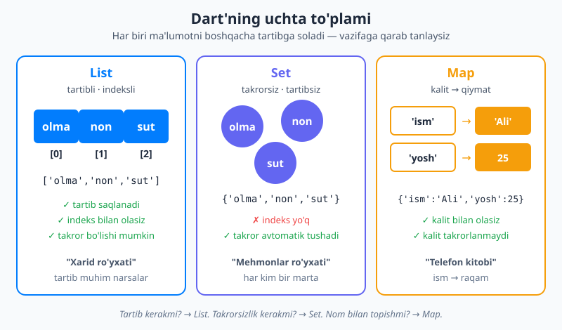

# 05 — To'plamlar: List, Set, Map

[⬅️ Oldingi: 04 — Funksiyalar](./04-funksiyalar.md) · [🏠 README](./README.md) · [Keyingi: 06 — Null safety ➡️](./06-null-safety.md)

> **Bu bobda:** ko'p qiymatni birga saqlashning uchta asosiy yo'lini o'rganamiz — **List** (tartibli ro'yxat, masalan xarid ro'yxati), **Set** (takrorsiz to'plam, masalan mehmonlar ro'yxati) va **Map** (kalit→qiymat lug'ati, masalan telefon kitobi). So'ng ularning ustidagi "kuchli vositalar" — `map`, `where`, `fold` kabi iterable metodlarni va Flutter UI'sida har kuni ishlatiladigan **spread `...`** hamda **collection-if / collection-for** sintaksisini ko'ramiz.

---

## Nega to'plam kerak?

Hozirgacha biz bitta o'zgaruvchida bitta qiymat saqladik:

```dart
String meva = 'olma';
```

Lekin haqiqiy dasturda ko'pincha **bir nechta** qiymat kerak bo'ladi. Do'konga borayotganingizdagi xarid ro'yxatini tasavvur qiling: olma, non, sut, tuxum... Bularning har biriga alohida o'zgaruvchi ochsak — `meva1`, `meva2`, `meva3` — bu nochor yo'l. Nechta narsa borligini oldindan bilmaymiz, ularni siklda aylanib chiqib bo'lmaydi, qo'shish-o'chirish ham qiyin.

**To'plam (collection)** — bu aynan shu muammoni hal qiladigan idish: u ichida **ko'p qiymatni birga** saqlaydi va ular bilan birgalikda ishlash imkonini beradi. Dart'da uchta asosiy to'plam bor, va ularning farqi — *ma'lumotni qanday tartibga solishida*:



Endi har birini alohida, sekin-asta ko'rib chiqamiz.

---

## List — tartibli ro'yxat

**List** (ro'yxat) — eng ko'p ishlatiladigan to'plam. U xuddi raqamlangan kichik qutilar qatori kabi: har bir qiymat o'z o'rnida turadi va siz qaysi tartibda qo'ygan bo'lsangiz, shu tartibda saqlanadi.

Ro'yxatni kvadrat qavs `[ ]` ichida, qiymatlarni vergul bilan ajratib yozamiz:

```dart
List<String> xarid = ['olma', 'non', 'sut'];
print(xarid);   // [olma, non, sut]
```

`List<String>` — "stringlardan iborat ro'yxat" degani. Burchakli qavs ichidagi `<String>` — ro'yxat *ichida nima turishini* aytadi (bu **generic** deyiladi, hozir shunchaki "ichidagi tip" deb tushuning). Agar `List<int>` desangiz — sonlar ro'yxati, `List<double>` — kasr sonlar ro'yxati.

> 💡 Dart ko'pincha tipni o'zi topadi. `var xarid = ['olma', 'non'];` desangiz, Dart boshlang'ich qiymatlarga qarab buni `List<String>` deb biladi. Lekin tipni ochiq yozish — kodingizni o'qigan odam (va kelajakdagi o'zingiz) uchun aniqroq. (`var`, `final` va tip yozish farqini [04-bob](./04-funksiyalar.md)dan eslang.)

### Indeks — har qiymatning raqami

Ro'yxatdagi har bir element o'z **indeksiga** (tartib raqamiga) ega. Eng muhim qoida — esda tuting:

📌 **Indeks 0 dan boshlanadi**, 1 dan emas. Ya'ni birinchi element `[0]`, ikkinchisi `[1]`, uchinchisi `[2]`.

```dart
List<String> xarid = ['olma', 'non', 'sut'];

print(xarid[0]);   // olma  (birinchi)
print(xarid[1]);   // non   (ikkinchi)
print(xarid[2]);   // sut   (uchinchi)
```

Nega 0 dan? Buni "boshidan necha qadam siljiganingiz" deb tushuning: birinchi element boshning o'zida — 0 qadam, ikkinchisi 1 qadam keyin. Bu ko'pchilik dasturlash tillarida shunday, va boshida g'alati tuyulsa-da, tez ko'nikasiz.

⚠️ Mavjud bo'lmagan indeksni so'rasangiz, dastur **xato** beradi (crash). Uch elementli ro'yxatda `xarid[3]` — bunday element yo'q:

```dart
print(xarid[3]);
// RangeError (index): Index out of range: index should be less than 3: 3
```

### Ro'yxat haqida ma'lumot olish

```dart
List<String> xarid = ['olma', 'non', 'sut'];

print(xarid.length);            // 3      — nechta element bor
print(xarid.first);             // olma   — birinchi element
print(xarid.last);              // sut    — oxirgi element
print(xarid.isEmpty);           // false  — bo'shmi?
print(xarid.contains('non'));   // true   — 'non' ichida bormi?
print(xarid.indexOf('sut'));    // 2      — 'sut' qaysi indeksda?
```

📌 `xarid.length` — element soni; oxirgi elementning indeksi esa har doim `length - 1` (bu yerda 2). `xarid.first` aslida `xarid[0]` bilan bir xil — shunchaki o'qishga qulayroq.

### Ro'yxatni o'zgartirish: qo'shish va o'chirish

Oddiy ro'yxat **o'zgaruvchan** (mutable) — ya'ni keyinchalik element qo'shsa, o'chirsa bo'ladi:

```dart
List<String> xarid = ['olma', 'non'];

xarid.add('sut');             // oxiriga qo'shadi      -> [olma, non, sut]
xarid.insert(0, 'tuxum');     // 0-indeksga joylaydi   -> [tuxum, olma, non, sut]
xarid.remove('non');          // qiymat bo'yicha o'chiradi -> [tuxum, olma, sut]
xarid.removeAt(0);            // indeks bo'yicha o'chiradi  -> [olma, sut]

print(xarid);                 // [olma, sut]
```

- `.add(x)` — `x` ni ro'yxat **oxiriga** qo'shadi.
- `.insert(i, x)` — `x` ni `i`-indeksga **kiritadi**, qolganlari bir qadam o'ngga suriladi.
- `.remove(x)` — birinchi uchragan `x` **qiymatini** o'chiradi.
- `.removeAt(i)` — `i`-**indeksdagi** elementni o'chiradi.

### O'zgarmas ro'yxat — `const`

Ba'zan ro'yxat hech qachon o'zgarmasligi kerak — masalan, hafta kunlari yoki sozlamalar. Bunday holda `const` ishlatamiz. `const` ro'yxatga `add` qilishga urinish **xato** beradi:

```dart
const kunlar = ['Dush', 'Sesh', 'Chor'];
kunlar.add('Pay');
// Unsupported operation: Cannot add to an unmodifiable list
```

💡 Qoida: ro'yxat o'zgarmasligi kerak bo'lsa — `const` qiling. Bu kodingizni xavfsizroq qiladi: "men buni hech qaerda o'zgartirmayman" degan kafolat beradi va tasodifiy o'zgarishlardan himoyalaydi.

### Ro'yxatni aylanib chiqish — `for-in`

Ro'yxatdagi har bir elementni navbatma-navbat ko'rib chiqish uchun `for-in` siklidan foydalanamiz (siklarni [04-bob oldidagi 03-bob](./04-funksiyalar.md)da ko'rgansiz):

```dart
List<String> xarid = ['olma', 'non', 'sut'];

for (var meva in xarid) {
  print('Sotib olish: $meva');
}
// Sotib olish: olma
// Sotib olish: non
// Sotib olish: sut
```

`for (var meva in xarid)` — "ro'yxatdagi har bir elementni navbat bilan `meva` deb atab, ich qismni bajar" deb o'qiladi. Bu indeks bilan o'ralashishdan ancha tozaroq.

---

## Set — takrorsiz to'plam

Endi boshqa muammoni tasavvur qiling: to'yga mehmonlar ro'yxatini tuzayapsiz. Bir odamni ikki marta yozsangiz, u baribir **bitta** mehmon. Tartib ham muhim emas — kim avval kelishi katta gap emas. Bizga kerak: **takrorsiz** to'plam.

Mana shu yerda **Set** (to'plam) ishlaydi. U ikkita maxsus xususiyatga ega:

1. **Takror bo'lmaydi** — bir xil qiymatni ikki marta qo'shsangiz, ikkinchisi e'tiborga olinmaydi.
2. **Tartib kafolatlanmaydi** — Set indeks bilan ishlamaydi (`set[0]` yo'q).

Set ham figurali qavs `{ }` ichida yoziladi:

```dart
Set<String> mehmonlar = {'Ali', 'Vali', 'Guli'};

mehmonlar.add('Ali');      // allaqachon bor — hech narsa qo'shilmaydi
mehmonlar.add('Salim');    // yangi — qo'shiladi

print(mehmonlar);          // {Ali, Vali, Guli, Salim}
print(mehmonlar.length);   // 4  — 'Ali' takrorlanmadi
```

📌 Diqqat: bo'sh `{}` — bu Set emas, **Map** (keyingi bo'lim). Bo'sh Set yozish uchun tipni ochiq ayting: `Set<String> bosh = {};` yoki `<String>{}`.

### Set qachon List'dan ustun?

Set'ning yana bir kuchli tomoni — `.contains` **juda tez** ishlaydi. List'da `contains` butun ro'yxatni boshdan-oxir tekshiradi (1000 element bo'lsa, 1000 ta solishtirish bo'lishi mumkin). Set esa qiymatni deyarli bir zumda topadi. Shuning uchun "bu narsa to'plamda bormi?" degan savol ko'p bo'lsa — Set tanlang.

Eng keng tarqalgan amaliy ish — **takrorlarni tozalash** (dedupe). List'ni Set'ga aylantiring, takrorlar o'z-o'zidan yo'qoladi:

```dart
List<int> sonlar = [1, 2, 2, 3, 3, 3, 4];
Set<int> noyob = sonlar.toSet();   // takrorlar tushib qoladi
print(noyob);                      // {1, 2, 3, 4}

// Yana ro'yxat kerak bo'lsa, qaytaring:
List<int> tozalangan = noyob.toList();
print(tozalangan);                 // [1, 2, 3, 4]
```

### To'plam amallari: birlashtirish va kesishish

Set matematik to'plamlar kabi ishlaydi:

```dart
Set<String> aDars = {'Matematika', 'Fizika', 'Tarix'};
Set<String> bDars = {'Fizika', 'Tarix', 'Geografiya'};

print(aDars.union(bDars));        // ikkalasining hammasi (birlashma)
// {Matematika, Fizika, Tarix, Geografiya}

print(aDars.intersection(bDars)); // faqat ikkisida ham bor (kesishma)
// {Fizika, Tarix}

print(aDars.difference(bDars));   // a'da bor, b'da yo'q (ayirma)
// {Matematika}
```

`union` — birlashtirish, `intersection` — umumiy qism, `difference` — faqat birinchisidagi farq. Bular "ikki guruhda kim umumiy?" kabi savollarga javob beradi.

---

## Map — kalit→qiymat lug'ati

Telefon kitobini tasavvur qiling. Unda siz **ism** bilan qidirasiz va **raqam** topasiz: "Ali" → "+998 90 123-45-67". Bu yerda muhimi indeks emas (Ali nechanchi yozilgani sizga qiziq emas), balki **nom orqali topish**.

**Map** (lug'at, xarita) aynan shunday ishlaydi: har bir qiymatga **kalit** (key) biriktiriladi, va siz qiymatni o'sha kalit orqali olasiz. Buni so'zlik (lug'at) deb ham tasavvur qilishingiz mumkin: so'z (kalit) → ta'rifi (qiymat).

Map ham figurali qavs ichida, lekin har juftlik `kalit: qiymat` ko'rinishida:

```dart
Map<String, dynamic> odam = {
  'ism': 'Ali',
  'yosh': 25,
  'shahar': 'Toshkent',
};

print(odam['ism']);     // Ali
print(odam['yosh']);    // 25
```

`Map<String, int>` ikkita tip oladi: **birinchisi — kalit tipi**, **ikkinchisi — qiymat tipi**. Yuqorida `Map<String, dynamic>` ishlatdik, chunki qiymatlar har xil (string va son aralash); `dynamic` "istalgan tip" degani. Agar barcha qiymatlar bir xil bo'lsa, aniqroq yozing:

```dart
Map<String, int> yoshlar = {
  'Ali': 25,
  'Vali': 30,
  'Guli': 22,
};

print(yoshlar['Vali']);   // 30
```

⚠️ Mavjud bo'lmagan kalitni so'rasangiz, Dart xato bermaydi — `null` qaytaradi (`null` — "qiymat yo'q" degani, keyingi [06-bobda](./06-null-safety.md) chuqur o'rganamiz):

```dart
print(yoshlar['Karim']);   // null  — bunday kalit yo'q
```

### Qo'shish, o'zgartirish, o'chirish

```dart
Map<String, int> yoshlar = {'Ali': 25};

yoshlar['Vali'] = 30;       // yangi juftlik qo'shadi
yoshlar['Ali'] = 26;        // mavjud kalitni yangilaydi (qiymat o'zgaradi)
yoshlar.remove('Vali');     // juftlikni o'chiradi

print(yoshlar);             // {Ali: 26}
```

📌 Diqqat: `yoshlar['Ali'] = 26` — agar `'Ali'` allaqachon bor bo'lsa, **eski qiymat ustiga yoziladi**; yo'q bo'lsa, yangi juftlik qo'shiladi. Kalitlar Map ichida **takrorlanmaydi** — bitta kalitda faqat bitta qiymat bo'ladi.

`.containsKey` bilan kalit borligini xavfsiz tekshiring:

```dart
if (yoshlar.containsKey('Ali')) {
  print('Ali bor, yoshi: ${yoshlar['Ali']}');
}
```

### Map'ni aylanib chiqish

Map'da uchta foydali bo'lim bor: `.keys` (kalitlar), `.values` (qiymatlar) va `.entries` (juftliklar):

```dart
Map<String, int> yoshlar = {'Ali': 25, 'Vali': 30};

print(yoshlar.keys);     // (Ali, Vali)
print(yoshlar.values);   // (25, 30)

// Har juftlikni aylanib chiqish:
for (var juft in yoshlar.entries) {
  print('${juft.key} -> ${juft.value} yosh');
}
// Ali -> 25 yosh
// Vali -> 30 yosh
```

Har bir `entry` (juftlik)ning `.key` (kaliti) va `.value` (qiymati) bor. Bu — Map'ni to'liq ko'rib chiqishning eng toza yo'li.

---

## Iterable metodlari — kuchli vositalar

Mana endi eng qiziq qismga keldik. List va Set'ning ustida bir guruh **kuchli metod** bor (ular birga "iterable metodlari" deyiladi). Bular yordamida siklning butun mantig'ini **bitta qatorda** ifodalash mumkin.

Bu metodlar **funksiyani parametr sifatida oladi** — ya'ni ular yuqori-tartibli funksiyalar. Agar `(x) => ...` ko'rinishidagi anonim funksiya va arrow yozuvini eslamasangiz, [04-bobga](./04-funksiyalar.md) qaytib o'qing — shu yerda har qadamda kerak bo'ladi.

### `.map` — har elementni o'zgartirish

`.map` har bir elementni **yangi qiymatga aylantiradi** va yangi ketma-ketlik qaytaradi (asl ro'yxatga tegmaydi). Diqqat: bu Map (lug'at) bilan adashtirmang — bu `.map()` metodi.

Ismlar ro'yxatini salomlashuvlar ro'yxatiga aylantiramiz:

```dart
List<String> ismlar = ['Ali', 'Vali', 'Guli'];

var salomlar = ismlar.map((ism) => 'Salom, $ism!').toList();
print(salomlar);
// [Salom, Ali!, Salom, Vali!, Salom, Guli!]
```

`ismlar.map((ism) => '...')` — "har bir `ism` uchun shu ifodani hisobla" degani. Oxiridagi `.toList()` natijani yana ro'yxatga aylantiradi (buning sababini quyida tushuntiramiz).

### `.where` — filtrlash

`.where` faqat **shartni qondiradigan** elementlarni qoldiradi (boshqa tillarda bu "filter" deyiladi):

```dart
List<int> sonlar = [1, 2, 3, 4, 5, 6];

var juftlar = sonlar.where((n) => n % 2 == 0).toList();
print(juftlar);   // [2, 4, 6]   — faqat juft sonlar
```

`(n) => n % 2 == 0` — "n juftmi?" (2 ga qoldiqsiz bo'linadimi). `true` qaytargan elementlar qoladi, qolgani tushib ketadi.

### Zanjirlash (chaining) — quvur kabi

Eng kuchli tomoni: bu metodlarni **ketma-ket ulash** mumkin. Bir metod natijasi keyingisiga "quvur" orqali o'tadi:

![Iterable quvuri: [1,2,3,4] ro'yxati .where (juftlarni saqlash) orqali [2,4] ga, so'ng .map (10 ga ko'paytirish) orqali [20,40] ga aylanadi](rasmlar/fl05-map-where.svg)

```dart
var natija = [1, 2, 3, 4]
    .where((x) => x % 2 == 0)   // juftlarni qoldir -> (2, 4)
    .map((x) => x * 10)         // 10 ga ko'paytir   -> (20, 40)
    .toList();                  // ro'yxatga aylantir

print(natija);   // [20, 40]
```

Buni chapdan o'ngga, "avval filtrla, keyin o'zgartir, keyin ro'yxatga aylantir" deb o'qing. Bir nechta `for` siklisiz, qo'shimcha o'zgaruvchisiz — tiniq va o'qishga oson.

> 💡 **Nega `.toList()`?** `.map` va `.where` aslida darrov ishlamaydi — ular "kechiktirilgan" (lazy) `Iterable` qaytaradi va faqat siz natijani so'raganingizda hisoblaydi. `.toList()` (yoki `.toSet()`) ularni "majburlab", haqiqiy ro'yxatga aylantiradi. Amalda: natijani saqlamoqchi yoki bir necha marta ishlatmoqchi bo'lsangiz — `.toList()` qo'shing.

### Yana to'rt foydali metod

```dart
List<int> baholar = [5, 4, 3, 5, 2];

// .forEach — har element uchun amal bajaradi (natija qaytarmaydi)
baholar.forEach((b) => print('Baho: $b'));

// .fold — hammasini bitta qiymatga "yig'adi" (boshlang'ich qiymat bilan)
int jami = baholar.fold(0, (yigindi, b) => yigindi + b);
print(jami);   // 19

// .any — kamida bittasi shartni qondiradimi?
print(baholar.any((b) => b == 2));    // true  (2 bor)

// .every — hammasi shartni qondiradimi?
print(baholar.every((b) => b >= 3));  // false (2 bor, u 3'dan kichik)
```

- `.forEach` — har element ustida amal bajaradi (`for-in` ning qisqa shakli).
- `.fold` — barcha elementni **bitta** natijaga to'playdi (yig'indi, ko'paytma, eng katta...). Birinchi argument — boshlang'ich qiymat (`0`), keyin har qadamda yig'indini yangilaydi. (`.reduce` ham xuddi shunday, lekin boshlang'ich qiymatsiz; bo'sh ro'yxatda xato berishi mumkin, shuning uchun `.fold` xavfsizroq.)
- `.any` — "kamida bittasi?"; `.every` — "hammasimi?".

💡 Bu metodlar Flutter'da **hamma joyda** uchraydi. Masalan, serverdan kelgan mahsulotlar ro'yxatini ekrandagi kartochkalar ro'yxatiga aylantirish — bu aynan `.map`. Shuning uchun ularni hozir mustahkam o'zlashtiring.

---

## Spread va collection-if / collection-for

Endi Flutter'ga to'g'ridan-to'g'ri ko'prik bo'ladigan, juda muhim sintaksisni ko'ramiz. Bular **ro'yxatni yaratishning o'zi ichida** ishlaydi.

### Spread `...` — ro'yxatni "yoyish"

`...` (spread operatori) bir ro'yxatning barcha elementlarini boshqa ro'yxat ichiga "to'kib" beradi:

```dart
List<int> birinchi = [1, 2, 3];
List<int> ikkinchi = [4, 5];

List<int> birga = [...birinchi, ...ikkinchi, 6];
print(birga);   // [1, 2, 3, 4, 5, 6]
```

`...birinchi` — "birinchining hamma elementini shu yerga qo'y" degani. Ikki ro'yxatni birlashtirish yoki ro'yxat boshiga/oxiriga qo'shimcha element qo'shishning eng toza yo'li.

### collection-for — ro'yxat ichida sikl

Odatda ma'lumotdan ro'yxat qurish uchun bo'sh ro'yxat ochib, siklda `.add` qilardik. **collection-for** buni bir qadamga qisqartiradi — `for`ni to'g'ridan-to'g'ri kvadrat qavs ichida yozasiz:

![collection-for: list literal ichidagi for sikli [for (var n in [1,2,3]) n*n] ifodasini [1,4,9] ro'yxatiga aylantiradi, va xuddi shu naqsh Flutter children ro'yxatini quradi](rasmlar/fl05-collection-for.svg)

```dart
// Eski uslub — uzun:
List<int> kvadratlar = [];
for (var n in [1, 2, 3]) {
  kvadratlar.add(n * n);
}

// collection-for — bir qatorda, aniq:
List<int> kvadratlar2 = [for (var n in [1, 2, 3]) n * n];

print(kvadratlar2);   // [1, 4, 9]
```

### collection-if — shartli element

**collection-if** bilan element ro'yxatga **faqat shart bajarilganda** qo'shiladi:

```dart
bool chegirmaBor = true;

List<String> menyu = [
  'Asosiy taom',
  'Salat',
  if (chegirmaBor) 'BONUS: Bepul shirinlik',   // faqat shart true bo'lsa
];

print(menyu);
// [Asosiy taom, Salat, BONUS: Bepul shirinlik]
```

`chegirmaBor` `false` bo'lganida, oxirgi element ro'yxatga umuman kirmaydi.

### Nega bu Flutter uchun shunchalik muhim?

Flutter'da ekranni quryotganda `children` (bolalar) deb nomlangan **widget ro'yxatini** beryapsiz. Aynan shu yerda spread, collection-if va collection-for kunni qutqaradi. Hozir bu kod sizga notanish — bu normal, biz Flutter'ga keyinroq o'tamiz — lekin **naqsh**ga e'tibor bering, u tanish:

```dart
Column(
  children: [
    Text('Sarlavha'),
    if (kirgan) LogoutTugma(),                         // shartli widget
    for (var m in mahsulotlar) MahsulotKarta(m),       // ro'yxatdan widgetlar
    ...qoshimchaWidgetlar,                             // boshqa ro'yxatni yoyish
  ],
)
```

Bu — "ma'lumotlar ro'yxatini ekrandagi widgetlar ro'yxatiga aylantirish". Bugun List, collection-for va collection-if'ni o'rganganingiz uchun, Flutter UI yozishni boshlaganingizda bu siz uchun yangi narsa bo'lmaydi — shunchaki yangi joyda ishlatasiz.

---

## Xulosa

- **List** `[ ]` — tartibli, indeksli ro'yxat. Indeks **0 dan** boshlanadi. `.add`/`.remove`/`.insert`, `.length`, `.first`/`.last`, `.contains`. O'zgarmasligi kerak bo'lsa — `const`. `for-in` bilan aylaniladi.
- **Set** `{ }` — takrorsiz, tartibsiz to'plam. Takrorlarni avtomatik tashlaydi (`.toSet()` bilan dedupe), `.contains` tez, `union`/`intersection`/`difference` amallari bor.
- **Map** `{kalit: qiymat}` — kalit→qiymat lug'ati (telefon kitobi). `map['kalit']` bilan olasiz (yo'q kalit `null` qaytaradi), `.keys`/`.values`/`.entries`, `.containsKey`.
- **Iterable metodlari**: `.map` (o'zgartirish), `.where` (filtrlash), `.fold`/`.reduce` (yig'ish), `.any`/`.every`, `.forEach`. Ularni **zanjirlash** mumkin; natijani `.toList()` bilan majburlang.
- **Spread `...`**, **collection-if** va **collection-for** — ro'yxatni yaratishning ichida ishlaydi va Flutter'da `children` qurishda har kuni ishlatiladi.

Keyingi bobda Dart'ning eng muhim xavfsizlik mexanizmiga — **null safety**ga o'tamiz: "qiymat yo'q" (`null`) holatini Dart qanday qilib xatoga aylanishidan oldin ushlab qolishini ko'ramiz.

---

## Mashqlar

> Har bir mashqni avval o'zingiz yeching, keyin yechimga qarang. Kod misollarini DartPad'da yoki `dart run` bilan ishga tushirib, natijani o'z ko'zingiz bilan ko'ring.

1. `List<String>` tipida `tillar` ro'yxatini yarating va unga 'Dart', 'Python', 'JavaScript' qo'shing. So'ng `.add` bilan 'Go' qo'shing, ikkinchi elementni (`[1]`) chop eting va `.length`ni ko'rsating.
2. `[10, 20, 30, 40, 50]` ro'yxatidan `.where` bilan faqat 25 dan katta sonlarni ajrating, so'ng `.map` bilan har birini 2 ga ko'paytiring. Natijani `.toList()` bilan ro'yxatga aylantirib chop eting (zanjirlashdan foydalaning).
3. `[1, 1, 2, 3, 3, 3, 4, 5, 5]` ro'yxatidagi **takrorlarni** Set yordamida tozalang va natijani yana saralangan ro'yxat ko'rinishida (`.toList()`) chop eting.
4. `Map<String, int>` tipida `narxlar` lug'atini yarating: `'olma': 8000`, `'non': 3000`, `'sut': 12000`. So'ng: (a) `'non'` narxini chop eting; (b) `'tuxum': 15000` qo'shing; (c) `.entries` bilan barcha mahsulot va narxlarni `"olma — 8000 so'm"` ko'rinishida chop eting.
5. `ismlar = ['ali', 'vali', 'guli']` ro'yxatini collection-for ishlatib, har bir ismni bosh harf bilan boshlangan salomga aylantiring (masalan `'Salom, ali!'`). (Maslahat: `[for (...) ...]`.)
6. collection-if bilan ishlang: `bool adminMi` o'zgaruvchisi bo'lsin. `['Bosh sahifa', 'Profil']` menyusiga `adminMi` `true` bo'lgandagina `'Admin panel'` bandini qo'shing. `adminMi` ni `true` va `false` qilib, ikkala natijani ko'ring.

## Yechimlar

<details markdown="1">
<summary>Yechim — 1</summary>

```dart
void main() {
  List<String> tillar = ['Dart', 'Python', 'JavaScript'];
  tillar.add('Go');

  print(tillar[1]);        // Python  (indeks 0 dan boshlanadi!)
  print(tillar.length);    // 4
  print(tillar);           // [Dart, Python, JavaScript, Go]
}
```

E'tibor bering: `[1]` — ikkinchi element, chunki birinchisi `[0]`. Ro'yxat o'zgaruvchan bo'lgani uchun `.add` ishladi.

</details>

<details markdown="1">
<summary>Yechim — 2</summary>

```dart
void main() {
  var natija = [10, 20, 30, 40, 50]
      .where((n) => n > 25)    // -> (30, 40, 50)
      .map((n) => n * 2)       // -> (60, 80, 100)
      .toList();

  print(natija);   // [60, 80, 100]
}
```

Quvurni chapdan o'ngga o'qing: avval filtrlash, keyin o'zgartirish. `.toList()` bo'lmasa, natija "kechiktirilgan" `Iterable` bo'lib qolardi.

</details>

<details markdown="1">
<summary>Yechim — 3</summary>

```dart
void main() {
  List<int> sonlar = [1, 1, 2, 3, 3, 3, 4, 5, 5];

  Set<int> noyob = sonlar.toSet();   // takrorlar tushadi -> {1, 2, 3, 4, 5}
  List<int> natija = noyob.toList(); // -> [1, 2, 3, 4, 5]

  print(natija);   // [1, 2, 3, 4, 5]
}
```

`.toSet()` — dedupe qilishning eng oson yo'li. Bu misolda kiritma allaqachon tartiblangani uchun natija ham tartibli chiqadi; har doim kafolat kerak bo'lsa, `natija.sort()` qo'shing.

</details>

<details markdown="1">
<summary>Yechim — 4</summary>

```dart
void main() {
  Map<String, int> narxlar = {
    'olma': 8000,
    'non': 3000,
    'sut': 12000,
  };

  // (a)
  print(narxlar['non']);   // 3000

  // (b)
  narxlar['tuxum'] = 15000;

  // (c)
  for (var juft in narxlar.entries) {
    print('${juft.key} — ${juft.value} so\'m');
  }
  // olma — 8000 so'm
  // non — 3000 so'm
  // sut — 12000 so'm
  // tuxum — 15000 so'm
}
```

`.entries` har juftlikning `.key` (mahsulot nomi) va `.value` (narx)ini beradi.

</details>

<details markdown="1">
<summary>Yechim — 5</summary>

```dart
void main() {
  List<String> ismlar = ['ali', 'vali', 'guli'];

  List<String> salomlar = [
    for (var ism in ismlar) 'Salom, $ism!',
  ];

  print(salomlar);
  // [Salom, ali!, Salom, vali!, Salom, guli!]
}
```

collection-for bo'sh ro'yxat + `.add` ga ehtiyojni yo'qotadi. (Xuddi shu natijani `ismlar.map((ism) => 'Salom, $ism!').toList()` bilan ham olish mumkin — ikkala yo'l ham to'g'ri.)

</details>

<details markdown="1">
<summary>Yechim — 6</summary>

```dart
void main() {
  bool adminMi = true;

  List<String> menyu = [
    'Bosh sahifa',
    'Profil',
    if (adminMi) 'Admin panel',
  ];

  print(menyu);
  // adminMi = true  -> [Bosh sahifa, Profil, Admin panel]
  // adminMi = false -> [Bosh sahifa, Profil]
}
```

`adminMi` `false` bo'lganda oxirgi band ro'yxatga umuman kirmaydi. Aynan shu naqshni keyinroq Flutter'da `children` ichida ishlatasiz: foydalanuvchi roli bo'yicha qaysi widget ko'rinishini boshqarish uchun.

</details>

---

[⬅️ Oldingi: 04 — Funksiyalar](./04-funksiyalar.md) · [🏠 README](./README.md) · [Keyingi: 06 — Null safety ➡️](./06-null-safety.md)
