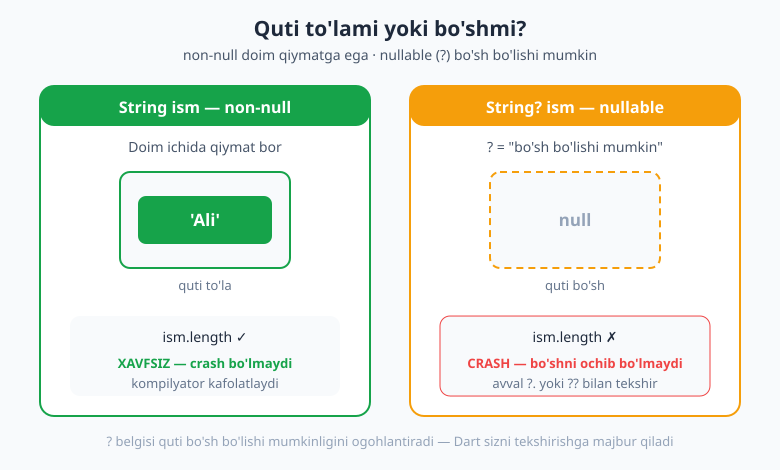
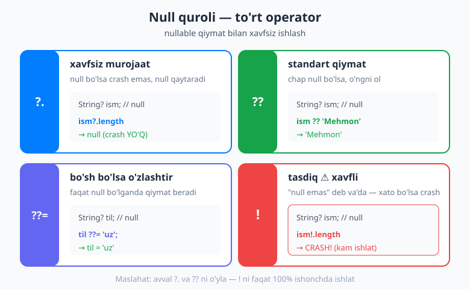
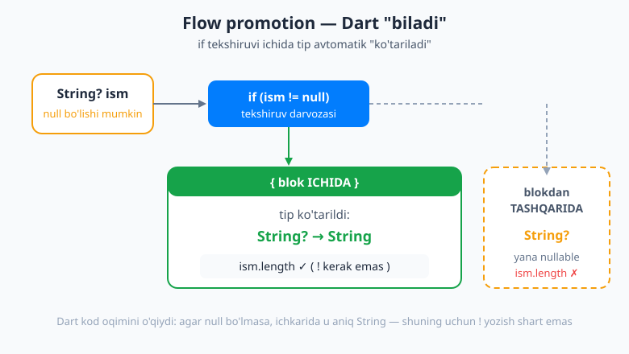

# 06 — Null safety

[⬅️ Oldingi: 05 — To'plamlar: List, Set, Map](./05-toplamlar.md) · [🏠 README](./README.md) · [Keyingi: 07 — OOP — obyektga yo'naltirilgan dasturlash ➡️](./07-oop-asoslari.md)

> **Bu bobda:** `null` nima va nega u dunyodagi eng qimmat xato deb ataladi; Dart'ning **sound null safety** kuchi — o'zgaruvchi standart holatda **null bo'la olmaydi**; nullable tip `?`; xavfsiz ishlash quroli `?.`, `??`, `??=`, `!`; **flow analysis (promotion)** — Dart `if` ichida tipni "yangilab" qo'yishi; `late` o'zgaruvchi va uning xavfi; va bularning bari Flutter'da nega kamroq xato (crash) keltirib chiqaradi.

---

## `null` nima va nega u muammo?

Tasavvur qiling, sizga **quti** berishdi. Qutining ustida yorliq bor: "ichida ism bor". Siz qutini ochasiz... lekin u **bo'sh**. Ichida hech narsa yo'q. Ana shu "hech narsa yo'q" holatini dasturlashda bitta maxsus so'z bilan ataymiz: **`null`**.

`null` — bu "**qiymat yo'q**" degani. Nol (`0`) emas, bo'sh satr (`''`) emas — umuman **hech narsa**.

Muammo shu yerda boshlanadi. Aytaylik, qutida ism bor deb ishonib, uning uzunligini o'lchamoqchi bo'ldingiz:

```dart
String ism = olibKel();   // quti — lekin ichi bo'sh (null) chiqdi
print(ism.length);        // BUM! bo'sh qutining uzunligini o'lchab bo'lmaydi
```

Agar `ism` aslida `null` bo'lsa, `ism.length` chaqirilganda dastur **ishlashni to'xtatadi** — bu **"null reference" xatosi**. Foydalanuvchining telefonida ilova **birdan yopiladi** (crash).

> 💡 Bu shunchalik keng tarqalgan va shunchalik ko'p ziyon keltirgan xatoki, uni o'ylab topgan olim **Tony Hoare** o'zi buni *"the billion-dollar mistake"* — **"milliard dollarlik xato"** deb atagan. Yarim asr davomida millionlab dasturlar aynan shu sababdan qulagan.

Eng yomoni: bu xato **dastur ishga tushganda**, ya'ni foydalanuvchining qo'lida sodir bo'ladi. Siz uni oldindan ko'rmaysiz.

Aynan shu muammoni Dart **ildizidan** hal qiladi.

---

## Sound null safety — Dart'ning kuchi

Dart 3.12'da **sound null safety standart va majburiy** (uni o'chirib bo'lmaydi). "Sound" so'zi "ishonchli, mustahkam" degani.

Asosiy g'oya juda oddiy va juda kuchli:

> **Standart holatda hech bir o'zgaruvchi `null` bo'la olmaydi.**

Ya'ni oddiy `String` tipidagi quti **doim** ichida qiymat saqlashga majbur. Uni bo'sh qoldira olmaysiz:

```dart
String ism = null;   // ❌ KOMPILYATSIYA XATOSI — hatto ishga ham tushmaydi
```

Bu juda muhim nuqta. Xato sizning telefoningizda emas, balki **kodni yozayotgan paytingizda, ekranda qizil chiziq** bilan ko'rsatiladi. Kompilyator (kodni tekshiruvchi) sizni **oldindan** himoya qiladi:

```dart
String ism = 'Ali';   // ✅ to'g'ri — ichida qiymat bor
print(ism.length);     // ✅ xavfsiz — ism hech qachon null bo'lolmaydi, demak crash yo'q
```

Mana shu — butun bobning yuragi. `String` tipidagi qutiga ishonsangiz bo'ladi: u **hech qachon** bo'sh emas. Demak `ism.length` doim xavfsiz.

> 🛡️ Eski tillarda (yoki eski Dart'da) har bir qiymat yashirin tarzda `null` bo'lishi mumkin edi — siz buni hech qachon bilmasdingiz. Sound null safety bu "yashirin tuzoq"ni butunlay yo'q qiladi.



---

## Nullable tiplar `?` — "bo'sh bo'lishi mumkin"

Lekin ba'zan bizga aynan "qiymat bo'lmasligi mumkin" holati **kerak** bo'ladi. Masalan, foydalanuvchi profilida "ikkinchi ism" maydoni bor, lekin uni hamma ham to'ldirmaydi. Bu yerda "qiymat yo'q" — bu **normal** holat.

Buning uchun tipdan keyin **savol belgisi `?`** qo'yamiz. Bu Dart'ga aytadi: "bu quti **bo'sh bo'lishi mumkin** (null bo'la oladi)".

```dart
String? ikkinchiIsm;   // ? bor — null bo'lishi MUMKIN. Boshlang'ich qiymati null.
ikkinchiIsm = 'Vali';  // ✅ keyin qiymat bersa ham bo'ladi
ikkinchiIsm = null;    // ✅ bo'sh qoldirsa ham bo'ladi — ? shunga ruxsat berdi
```

`?` belgisi — bu **rozilik** (opt-in). Siz Dart'ga "men bu yerda null bo'lishi mumkinligini bilaman va tayyorman" deysiz.

Endi ikki xil tip bor:

| Tip | Misol | null bo'la oladimi? |
|---|---|---|
| **non-null** (oddiy) | `String ism` | Yo'q ❌ — doim qiymat bor |
| **nullable** (`?` bilan) | `String? ism` | Ha ✅ — bo'sh bo'lishi mumkin |

Va eng qizig'i — nullable qutini to'g'ridan-to'g'ri ishlatib bo'lmaydi:

```dart
String? ism;
print(ism.length);   // ❌ XATO — Dart: "bu null bo'lishi mumkin, avval tekshir!"
```

Dart sizni majburlaydi: **agar quti bo'sh bo'lishi mumkin bo'lsa, uni ochishdan oldin tekshir**. Bu mantiqan to'g'ri-ku — bo'sh qutining uzunligini o'lchab bo'lmaydi. Endi buni qanday xavfsiz qilishni o'rganamiz.

---

## Nullable bilan xavfsiz ishlash — null quroli

Dart bizga nullable qiymatlar bilan ishlash uchun bir nechta qulay operator beradi. Ularni "null quroli" deb atasak bo'ladi.



### `?.` — xavfsiz murojaat (null-aware access)

Oddiy nuqta `.` o'rniga `?.` ishlatsangiz, Dart avval "quti bo'shmi?" deb tekshiradi. Agar bo'sh bo'lsa, crash qilish o'rniga shunchaki **`null` qaytaradi**:

```dart
String? ism;            // hozir null
print(ism?.length);     // crash YO'Q — natija: null

ism = 'Ali';
print(ism?.length);     // natija: 3
```

`?.` ni shunday o'qing: "agar bor bo'lsa, uning `.length` ini ol; agar yo'q bo'lsa — null".

### `??` — standart qiymat (default)

`??` operatori shunday ishlaydi: "**chap tomon null bo'lsa, o'ng tomonni ol**". Bu bizga "zaxira" (fallback) qiymat berishga imkon beradi:

```dart
String? ism;
String korsatiladigan = ism ?? 'Mehmon';   // ism null → 'Mehmon' olinadi
print(korsatiladigan);                       // Mehmon

ism = 'Ali';
print(ism ?? 'Mehmon');                      // Ali (chap tomon null emas)
```

`?.` va `??` ni birga ishlatish juda keng tarqalgan:

```dart
String? ism;
int uzunlik = ism?.length ?? 0;   // ism bo'lsa uzunligi, bo'lmasa 0
```

### `??=` — bo'sh bo'lsa o'zlashtir (assign-if-null)

`??=` o'zgaruvchiga qiymat **faqat u hozir null bo'lsa** beradi. Agar allaqachon qiymat bor bo'lsa — tegmaydi:

```dart
String? til;
til ??= 'uz';   // til null edi → endi 'uz'
print(til);      // uz

til ??= 'en';   // til allaqachon 'uz', null emas → o'zgarmaydi
print(til);      // uz
```

### `!` — "bang", null assertion (XAVFLI)

`!` operatori Dart'ga shunday deydi: "**menga ishon, bu yerda qiymat aniq bor, null emas**". U nullable qutini majburan non-null qilib ko'rsatadi:

```dart
String? ism = 'Ali';
print(ism!.length);   // 3 — biz "null emas" deb va'da berdik
```

Lekin agar **xato qilsangiz** va quti aslida bo'sh bo'lsa — `!` darhol **crash** qiladi:

```dart
String? ism;          // null
print(ism!.length);   // ❌ CRASH! "Null check operator used on a null value"
```

> ⚠️ `!` — bu xavfsizlik to'rini **o'zingiz olib tashlash**. U sizning va'dangizga ishonadi; va'dangiz noto'g'ri bo'lsa — dastur qulaydi. Shuning uchun `!` ni **juda kam, faqat 100% ishonchingiz komil bo'lganda** ishlating. Ko'p hollarda `?.` yoki `??` xavfsizroq tanlov.

### To'plamlarda null-aware

Bu quroldan to'plamlar (List, Map) bilan ham foydalanamiz:

```dart
List<int>? sonlar;
print(sonlar?.length);          // null (sonlar bo'sh)

List<int> hammasi = [0, ...?sonlar];   // ...?  — sonlar null bo'lsa, hech narsa qo'shilmaydi
print(hammasi);                         // [0]
```

`...?` — bu "spread" operatorining null-aware versiyasi: agar ro'yxat null bo'lsa, xato bermay shunchaki tashlab ketadi.

---

## Flow analysis (promotion) — Dart "biladi"

Mana eng go'zal qism. Aytaylik, nullable qutimiz bor va biz uni `if` bilan tekshirdik:

```dart
String? ism = olibKel();   // null bo'lishi mumkin

if (ism != null) {
  // shu blok ICHIDA Dart ANIQ biladi: ism null EMAS
  print(ism.length);       // ✅ ! kerak emas! Dart o'zi tushundi
}
```

`if (ism != null)` shartining **ichida** Dart o'zi mantiqan xulosa qiladi: "bu yerga faqat `ism` null bo'lmaganda kiriladi, demak ichkarida u aniq qiymatga ega". Shu sabab Dart `ism` ning tipini vaqtincha `String?` dan **`String`** ga **"ko'taradi" (promote)**. Endi `!` ham, `?.` ham kerak emas — oddiy `.` ishlatasiz.

Bu **flow analysis** (oqim tahlili) yoki **type promotion** (tip ko'tarilishi) deb ataladi. Dart kodingiz oqimini "o'qib", qaerda nima null emasligini o'zi aniqlaydi.

Blokdan **tashqarida** esa quti yana eski, nullable holatiga qaytadi:

```dart
if (ism != null) {
  print(ism.length);   // ICHKARIDA: String (xavfsiz)
}
print(ism.length);     // ❌ TASHQARIDA: yana String? — xato! null bo'lishi mumkin
```

Buni "erta qaytish" (early return) bilan ham yozish mumkin va u juda toza chiqadi:

```dart
void salomla(String? ism) {
  if (ism == null) return;   // null bo'lsa — chiqib ketamiz
  // shu nuqtadan keyin Dart biladi: ism — String (null emas)
  print('Salom, $ism!');     // ✅ xavfsiz
}
```



> 🎯 Promotion — bu nega Dart kodida `!` kam uchrashining sababi. To'g'ri yozilgan kodda Dart sizning o'rningizga deyarli hamma narsani tekshiradi.

---

## `late` — keyin tayinlanadigan o'zgaruvchi

Ba'zan bizda shunday holat bo'ladi: o'zgaruvchi **non-null** bo'lishi kerak (null bo'lmasligi kerak), lekin uni **e'lon qilgan zahoti** qiymat berolmaymiz — biroz **keyinroq** beramiz.

Bu yerda `late` kalit so'zi yordamga keladi. `late` Dart'ga shunday va'da beradi: "**hozir bo'sh, lekin men buni ishlatishdan oldin albatta to'ldiraman**":

```dart
late String xabar;   // hozir qiymat yo'q, lekin String? ham emas

void tayyorla() {
  xabar = 'Salom!';   // keyinroq to'ldiramiz
}

void korsat() {
  print(xabar);       // ✅ tayyorla() chaqirilgan bo'lsa — ishlaydi
}
```

`late` ning yana bir foydasi — **dangasa ishga tushirish** (lazy init): qiymat faqat **birinchi marta ishlatilganda** hisoblanadi. Agar hisoblash "qimmat" (sekin) bo'lsa, bu tejamkor:

```dart
late String ogirHisob = qimmatFunksiya();   // qimmatFunksiya() FAQAT birinchi murojaatda chaqiriladi
```

**Xavfi:** agar `late` o'zgaruvchini to'ldirishdan **oldin** ishlatib qo'ysangiz, Dart **`LateInitializationError`** beradi:

```dart
late String xabar;
print(xabar);   // ❌ CRASH — hali to'ldirilmagan!
```

> 📱 **Flutter'da nega kerak?** Keyinroq (16-bobda) `StatefulWidget` da `initState` deb nomlangan joyni ko'rasiz — u widget ekranga chiqishidan oldin bir marta ishlaydi. Ko'pincha o'zgaruvchini aynan o'sha yerda to'ldiramiz, e'lon paytida emas. Mana shunda `late` aynan to'g'ri keladi: "men buni `initState` da to'ldiraman, va'da beraman".

---

## `required` — qiymat berish shart

Funksiyalar bobida (04) **nomli parametrlar** (named parameters) bilan tanishgansiz. Null safety ular bilan ham bog'liq. Nomli parametr standart holatda ixtiyoriy, demak uni **nullable** qilish kerak edi. Lekin agar parametr **majburiy** bo'lishini xohlasangiz, `required` qo'yasiz:

```dart
void ro'yxat({required String ism, int yosh = 0}) {
  print('$ism, $yosh yosh');
}

ro'yxat(ism: 'Ali');          // ✅ ism berildi, yosh standart 0
ro'yxat(yosh: 25);            // ❌ XATO — ism berilmadi, lekin required!
```

`required` tufayli `ism` non-null `String` bo'la oladi: chaqiruvchi unga qiymat berishga **majbur**, shuning uchun u hech qachon bo'sh qolmaydi. Bu null safety bilan funksiya parametrlari qanday birga ishlashini ko'rsatadi.

---

## Amaliy misollar

Endi haqiqiy hayotda tez-tez uchraydigan holatlarni xavfsiz hal qilamiz.

### 1. Map'dan "bo'lishi mumkin yoki yo'q" qiymat olish

Map'dan kalit orqali qiymat olganingizda, natija **doim nullable** bo'ladi — chunki o'sha kalit umuman bo'lmasligi mumkin:

```dart
Map<String, String> sozlamalar = {'til': 'uz'};

String? tema = sozlamalar['tema'];   // 'tema' kaliti yo'q → null
String aniqTema = sozlamalar['tema'] ?? 'och';   // ?? bilan zaxira: 'och'
print(aniqTema);   // och
```

### 2. API'dan kelgan nullable maydon

Tarmoqdan (API) kelgan ma'lumotda ba'zi maydonlar bo'lmasligi mumkin. Ularni nullable deb belgilab, xavfsiz ishlatamiz:

```dart
class Foydalanuvchi {
  final String ism;
  final String? telefon;   // hamma ham telefon kiritmaydi → nullable
  Foydalanuvchi(this.ism, this.telefon);
}

void korsat(Foydalanuvchi u) {
  print('Ism: ${u.ism}');
  print('Tel: ${u.telefon ?? "ko'rsatilmagan"}');   // null bo'lsa zaxira matn
}
```

### 3. Zanjirli xavfsiz murojaat

Bir nechta nullable bosqichni `?.` bilan zanjirlaymiz — biror joyda null bo'lsa, butun zanjir null qaytaradi:

```dart
String? shahar = foydalanuvchi?.manzil?.shahar;   // birortasi null bo'lsa → shahar = null
print(shahar ?? 'Manzil yo'q');
```

---

## Tez-tez uchraydigan xatolar

- **`!` ni haddan tashqari ishlatish.** Har joyda `qiymat!` yozish — bu xavfsizlik to'rini olib tashlash bilan teng. Ko'p `!` bor kod — ko'p crash xatari. Avval `?.` yoki `??` ni o'ylang.
- **Kompilyator bilan "urushish".** Dart qizil chiziq ko'rsatganda, uni `!` bilan "zo'rlab bostirmang". Buning o'rniga tipni `?` qilib to'g'ri belgilang yoki `if (x != null)` bilan tekshiring. Kompilyator — dushman emas, **yordamchi**.
- **`late` ni to'ldirmaslik.** `late` — bu va'da. To'ldirmasdan ishlatsangiz, `LateInitializationError` keladi. Agar qiymat haqiqatan ham bo'lmasligi mumkin bo'lsa, `late` emas, `?` (nullable) ishlating.
- **Promotion'ni unutib `!` qo'shish.** `if (x != null)` ichida `x!` yozish — ortiqcha. Dart allaqachon biladi; oddiy `x` yeting.
- **Hamma narsani `?` qilib qo'yish.** Aksincha xato: kerak bo'lmasa-da hamma tipni nullable qilib, keyin har joyda `?.` va `??` bilan kurashish. Qiymat doim bo'lishi kerak bo'lsa — uni **non-null** qoldiring.

---

## Xulosa

- `null` — "qiymat yo'q". Uni o'ylamay ishlatish — klassik crash sababi ("milliard dollarlik xato").
- **Sound null safety** Dart'da standart: oddiy `String` **hech qachon** null bo'la olmaydi. Xato kodni yozish paytida ushlanadi, telefonda emas.
- **`?`** — tipni nullable qiladi: `String? ism` bo'sh bo'lishi mumkin.
- Null quroli: **`?.`** (xavfsiz murojaat), **`??`** (standart qiymat), **`??=`** (bo'sh bo'lsa o'zlashtir), **`!`** (xavfli tasdiq — kam ishlating).
- **Promotion**: `if (x != null)` ichida Dart o'zi tipni `String?` → `String` ga ko'taradi.
- **`late`**: non-null, lekin keyin to'ldiriladi (masalan Flutter'da `initState`). To'ldirilmasa — `LateInitializationError`.
- Natijada Flutter ilovangiz **kamroq qulaydi**, va analizator yo'l-yo'lakay sizni to'g'rilab boradi.

Endi siz tiplarni xavfsiz boshqarishni bilasiz. Keyingi bobda bu tiplardan **o'zingizning** murakkab tiplaringizni — klasslar va obyektlarni quramiz.

---

## Mashqlar

**1-mashq.** Quyidagi koddagi xatoni toping va to'g'rilang. Nega xato berayotganini bir jumlada tushuntiring.

```dart
String laqab = null;
print(laqab);
```

**2-mashq.** `String? sevimliRang` o'zgaruvchisi bor. Agar u null bo'lsa, ekranga `'tanlanmagan'`, aks holda rangning o'zini chiqaring — **`??`** yordamida bir qatorda yozing.

**3-mashq.** Quyidagi funksiyani **promotion** yordamida to'g'rilang (ya'ni `!` ishlatmasdan). Funksiya `ism` null bo'lsa `'Salom, mehmon!'`, aks holda `'Salom, <ism>!'` chiqarsin.

```dart
void salomla(String? ism) {
  print('Salom, ${ism!}!');   // ism null bo'lsa crash qiladi — tuzating
}
```

**4-mashq.** `Map<String, int> ballar = {'Ali': 90}` lug'ati bor. `'Vali'` ning balini xavfsiz oling: agar yo'q bo'lsa, `0` bo'lsin. `??` ishlating va natijani chiqaring.

**5-mashq.** `late int hisob;` e'lon qilingan. Quyidagi kodning **2-qatorida** nima sodir bo'ladi va nega? Crashni oldini olish uchun kodni tuzating.

```dart
late int hisob;
print(hisob);
hisob = 5;
```

**6-mashq.** `?.` va `??` ni birga ishlatib, `String? matn` ning uzunligini xavfsiz oling: agar `matn` null bo'lsa, natija `0` bo'lsin. Bir qatorda yozing.

<details markdown="1">
<summary>✅ Yechimlarni ko'rish</summary>

**1-mashq.** Oddiy `String` non-null, shuning uchun unga `null` berib bo'lmaydi — bu **kompilyatsiya xatosi** (kod ishga ham tushmaydi). Ikki yo'l bor:

```dart
String laqab = 'mehmon';   // 1-yo'l: haqiqiy qiymat ber
print(laqab);

// yoki bo'sh bo'lishi kerak bo'lsa, tipni nullable qil:
String? laqab2;            // 2-yo'l: ? qo'shdik → null bo'lishi mumkin
print(laqab2);             // null
```

**2-mashq.**

```dart
String? sevimliRang;
print(sevimliRang ?? 'tanlanmagan');   // null → 'tanlanmagan'
```

**3-mashq.** `if (ism != null)` bilan tekshirsak, Dart `ism` ni `String` ga ko'taradi va `!` kerak emas:

```dart
void salomla(String? ism) {
  if (ism == null) {
    print('Salom, mehmon!');
  } else {
    print('Salom, $ism!');   // shu blokda ism — String, ! yo'q
  }
}
```

**4-mashq.**

```dart
Map<String, int> ballar = {'Ali': 90};
int valiBal = ballar['Vali'] ?? 0;   // 'Vali' yo'q → null → 0
print(valiBal);                       // 0
```

**5-mashq.** 2-qatorda (`print(hisob);`) `hisob` hali to'ldirilmagan, shuning uchun **`LateInitializationError`** (crash) sodir bo'ladi — `late` "keyin to'ldiraman" deb va'da bergan, lekin biz o'qishdan oldin to'ldirmadik. Tuzatish: avval to'ldiramiz, keyin o'qiymiz:

```dart
late int hisob;
hisob = 5;        // avval to'ldir
print(hisob);     // keyin o'qi → 5
```

**6-mashq.**

```dart
String? matn;
int uzunlik = matn?.length ?? 0;   // matn null → ?.length null → ?? 0
print(uzunlik);                     // 0
```

</details>

---

[⬅️ Oldingi: 05 — To'plamlar: List, Set, Map](./05-toplamlar.md) · [🏠 README](./README.md) · [Keyingi: 07 — OOP — obyektga yo'naltirilgan dasturlash ➡️](./07-oop-asoslari.md)
