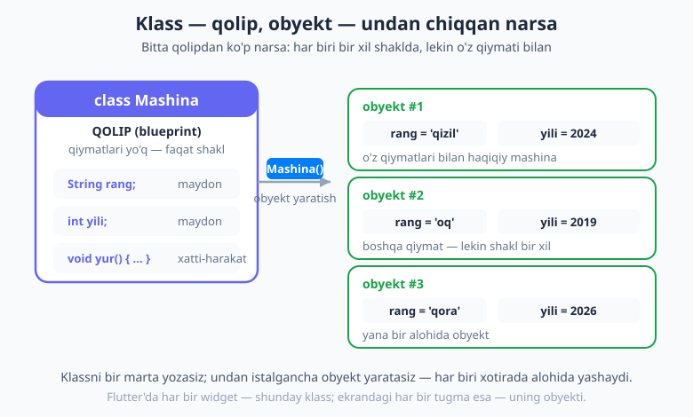
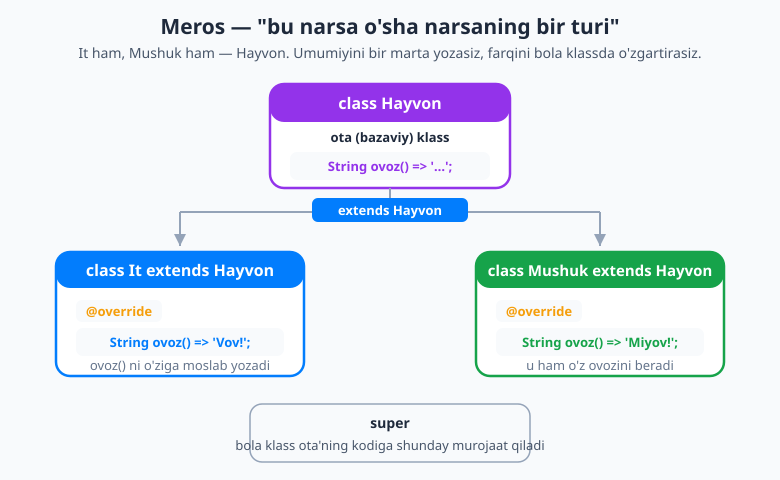
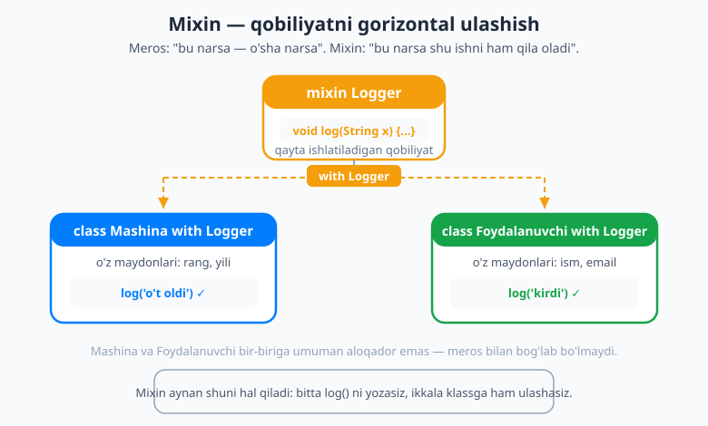

# 07 — OOP — obyektga yo'naltirilgan dasturlash

[⬅️ Oldingi: 06 — Null safety](./06-null-safety.md) · [🏠 README](./README.md) · [Keyingi: 08 — Dart 3 zamonaviy imkoniyatlari ➡️](./08-dart3-zamonaviy.md)

> **Bu bobda:** shu paytgacha biz alohida ma'lumotlar (`int yosh`, `String ism`) va alohida funksiyalar bilan ishladik. Lekin real dunyo bunday emas: mashinaning **rangi** ham, **yili** ham bor, va u **yura** ham oladi — ya'ni ma'lumot va xatti-harakat **bir narsada** birga yashaydi. Mana shu g'oyani — "narsalarni obyekt sifatida modellashtirish" — **OOP** (obyektga yo'naltirilgan dasturlash) deyiladi. Bu kitobning eng katta, eng tushuncha-talab bob. Shoshilmaymiz. Klass nima, obyekt nima, konstruktor, getter/setter, meros (`extends`), abstrakt klass, interfeys, mixin va enhanced enum — har birini misol bilan, sekin ko'rib chiqamiz. Va bu **Flutter uchun shart**: Flutter'da *hamma narsa — klass*. Har bir `Text`, `Container`, `Scaffold` — bu klass; ekrandagi har bir tugma esa — uning obyekti. OOP'ni tushunmasdan Flutter'ni tushunib bo'lmaydi.

---

## Nega OOP kerak?

Tasavvur qiling, dasturda uchta mashinani saqlashingiz kerak. OOP'siz shunday yozardingiz:

```dart
String mashina1Rang = 'qizil';
int mashina1Yili = 2024;

String mashina2Rang = 'oq';
int mashina2Yili = 2019;

String mashina3Rang = 'qora';
int mashina3Yili = 2026;
```

Ko'rib turibsiz — bu chalkash va xavfli. Har bir mashina uchun yangi nom o'ylab topishingiz kerak (`mashina1Rang`, `mashina2Rang`...), va `rang` bilan `yili` bir-biriga hech qanday bog'lanmagan — ular shunchaki yonma-yon turgan o'zgaruvchilar. Agar yana 100 ta mashina kerak bo'lsa-chi?

OOP'ning g'oyasi oddiy va kuchli: **real dunyodagi narsani — uning ma'lumotlari va xatti-harakatlari bilan birga — bitta "obyekt" qilib modellashtir**. Mashinaning rangi va yili — uning **ma'lumotlari**; yurishi — uning **xatti-harakati**. OOP ularni bitta qutiga joylaydi.

Buni tushunishning eng oson yo'li — **qolip va undan chiqqan narsa** o'xshatishi:

- **Klass** — bu *qolip* (masalan, pechenye kesadigan metall shakl). Qolipning o'zini yeb bo'lmaydi — u faqat "shaklni" belgilaydi: pechenyening rangi bor, og'irligi bor.
- **Obyekt** — bu o'sha qolipdan chiqqan *haqiqiy pechenye*. Bitta qolipdan istalgancha pechenye yasashingiz mumkin, va har biri o'z rangiga, o'z og'irligiga ega.



📌 Atamalarni mahkam yodda tuting, ular bob davomida qayta-qayta uchraydi:
> **Klass (class)** — qolip, ya'ni narsaning "loyihasi". **Obyekt (object)** yoki **nusxa (instance)** — o'sha qolipdan yaratilgan haqiqiy narsa. Bittasini "klass yozish", ikkinchisini "obyekt yaratish" deyiladi.

## Klass va obyekt

Keling, birinchi klassimizni yozamiz — `Mashina`. Klass `class` kalit so'zi bilan boshlanadi:

```dart
class Mashina {
  String rang = 'oq'; // maydon (field) — ma'lumot
  int yili = 2020;    // yana bir maydon

  void yur() {        // metod (method) — xatti-harakat
    print('$rang mashina ($yili) yo\'lga chiqdi.');
  }
}
```

Bu yerda nimalar bor:

- `class Mashina { ... }` — `Mashina` nomli yangi tip (qolip) e'lon qilyapmiz. Klass nomi odatda **bosh harf** bilan yoziladi (`Mashina`, `Kitob`, `Foydalanuvchi`) — bu Dart'da qabul qilingan qoida.
- `String rang` va `int yili` — bular **maydonlar** (field), ba'zan "xossalar" (property) ham deyiladi. Bular obyektning *ma'lumotlari*.
- `void yur() { ... }` — bu **metod** (method). Metod — klass ichidagi funksiya. U obyektning *xatti-harakati*.

Klassning o'zi shunchaki qolip — undan hali hech narsa "yaralmagan". Obyekt yaratish uchun klass nomidan keyin qavs qo'yamiz:

```dart
void main() {
  Mashina m = Mashina(); // obyekt (nusxa) yaratdik
  m.rang = 'qizil';      // maydoniga qiymat berdik (nuqta orqali)
  m.yili = 2024;
  m.yur();               // metodini chaqirdik
}
```

```text
qizil mashina (2024) yo'lga chiqdi.
```

📌 `Mashina()` — qavs bilan yozilgani **obyekt yaratayotganimizni** bildiradi. Boshqa tillarda buning oldida `new` so'zi turadi (`new Mashina()`); Dart'da `new` shart emas — uni yozmaymiz. Obyektning maydoniga `m.rang` kabi **nuqta** orqali murojaat qilamiz.

Endi OOP'ning go'zalligi ko'rinadi — har bir obyekt **o'z** qiymatlariga ega:

```dart
Mashina a = Mashina()..rang = 'qizil'..yili = 2024;
Mashina b = Mashina()..rang = 'oq'..yili = 2019;

a.yur(); // qizil mashina (2024) yo'lga chiqdi.
b.yur(); // oq mashina (2019) yo'lga chiqdi.
```

`a` ning rangini o'zgartirsangiz, `b` ga ta'sir qilmaydi — ular xotirada **alohida** yashaydi.

💡 `..` belgisini "kaskad" (cascade) deyiladi: u bir obyekt ustida ketma-ket bir nechta amal qilishga imkon beradi, har safar `m.` deb qaytarmasdan. Flutter widgetlarida juda ko'p uchraydi.

### `this` — "o'zim"

Metod ichida ba'zan "shu obyektning o'zining maydoni" ni aniq ko'rsatish kerak bo'ladi. Buning uchun `this` kalit so'zi bor — u "shu obyekt" degani:

```dart
class Mashina {
  String rang = 'oq';

  void rangOzgartir(String rang) {
    // bu yerda ikkita 'rang' bor: parametr va maydon
    this.rang = rang; // this.rang — maydon; rang — parametr
  }
}
```

📌 `this.rang` — obyektning **maydoni**; oddiy `rang` — metod **parametri**. Nomlar bir xil bo'lganda `this` qaysi biri ekanini ajratadi. Nomlar har xil bo'lsa (`rangOzgartir(String yangiRang)`), `this` shart emas — Dart o'zi tushunadi.

## Konstruktorlar — obyektni to'g'ri tug'dirish

Yuqorida biz obyekt yaratib, keyin maydonlarini birma-bir to'ldirdik. Bu noqulay va xavfli — kimdir maydonni to'ldirishni unutib qo'yishi mumkin. **Konstruktor** (constructor) — obyekt yaratilayotgan paytda chaqiriladigan maxsus metod; uning vazifasi obyektni boshlang'ich qiymatlar bilan to'ldirish.

Konstruktor nomi **klass nomi bilan bir xil** bo'ladi:

```dart
class Mashina {
  String rang;
  int yili;

  // konstruktor: obyekt yaratilganda rang va yili'ni qabul qiladi
  Mashina(String rang, int yili) {
    this.rang = rang;
    this.yili = yili;
  }
}

void main() {
  Mashina m = Mashina('qizil', 2024); // endi yaratishda darhol qiymat beramiz
}
```

### Qisqa shakl: `Mashina(this.rang, this.yili)`

Yuqoridagi konstruktor juda ko'p ishlatiladigan naqsh — "parametrni olib, shu nomli maydonga joylash". Dart buni shu qadar tez-tez ko'radiki, uning uchun **maxsus qisqa yozuv** ixtiro qildi:

```dart
class Mashina {
  String rang;
  int yili;

  Mashina(this.rang, this.yili); // tana ham, this.x = x ham shart emas!
}
```

📌 `Mashina(this.rang, this.yili)` — bu Dart'da eng ko'p uchraydigan konstruktor shakli. `this.rang` deb yozsangiz, Dart "kelgan birinchi argumentni `rang` maydoniga sol" deb tushunadi. Tana (`{ }`) ham kerak emas — `;` bilan tugaydi. Bu shaklni yodda tuting, uni Flutter'da minglab marta ko'rasiz.

### Nomlangan konstruktorlar (named constructors)

Ba'zan bitta klassni **bir nechta xil yo'l bilan** yaratishni xohlaysiz. Masalan, kitobni to'liq ma'lumot bilan, yoki muallifi noma'lum holda. Buning uchun **nomlangan konstruktor** bor — `KlassNomi.qoshimchaNom` ko'rinishida:

```dart
class Kitob {
  final String nom;
  final String muallif;
  final int yili;

  // odatiy (asosiy) konstruktor
  Kitob(this.nom, this.muallif, this.yili);

  // nomlangan konstruktor — nomi noma'lum kitob uchun
  Kitob.nomsiz(this.muallif, this.yili) : nom = 'Nomsiz';
}

void main() {
  final k1 = Kitob('O\'tgan kunlar', 'A. Qodiriy', 1925);
  final k2 = Kitob.nomsiz('Noma\'lum', 2026); // nomlangan konstruktor
  print(k1.nom); // O'tgan kunlar
  print(k2.nom); // Nomsiz
}
```

📌 `Kitob.nomsiz(...)` — bu **nomlangan konstruktor**. `Kitob.` dan keyingi qism (`nomsiz`) shunchaki uning ismini bildiradi, u alohida tip emas. `final` haqida 02-bobda bilib oldingiz: u maydonni bir marta o'rnatib, keyin o'zgartirmaslik degani. OOP'da maydonlarni `final` qilish — yaxshi odat.

`: nom = 'Nomsiz'` qismini **initializer list** (boshlang'ich qiymatlar ro'yxati) deyiladi — u konstruktor tanasidan **oldin** ishlaydi va `final` maydonlarni o'rnatish uchun ishlatiladi.

### `const` konstruktor — Flutter'ning siri

Agar klassning **hamma maydonlari `final`** bo'lsa, konstruktorni `const` qilishingiz mumkin. `const` konstruktor — kompilyatsiya paytida ma'lum bo'lgan, butunlay o'zgarmas obyekt yaratadi:

```dart
class Nuqta {
  final int x;
  final int y;
  const Nuqta(this.x, this.y); // const konstruktor
}

void main() {
  const a = Nuqta(1, 2); // const obyekt
  const b = Nuqta(1, 2);
  print(identical(a, b)); // true — Dart bir xil const obyektni qayta ishlatadi!
}
```

📌 `const` obyekt nega muhim? Chunki **Flutter'da uni hamma joyda ko'rasiz**: `const Text('Salom')`, `const SizedBox(height: 8)`. Bu Flutter'ga "bu widget hech qachon o'zgarmaydi" deb aytadi, va Flutter uni qayta-qayta yaratmasdan, bir marta yaratib qayta ishlatadi — bu ilovani **tezroq** qiladi. Hozircha shuni bilib qo'ying: maydonlari `final` bo'lsa, konstruktoringizni `const` qiling.

### `factory` konstruktor — har doim yangi obyekt yaratish shart emas

Oddiy konstruktor *har doim* yangi obyekt yaratadi. Lekin ba'zan buni xohlamaysiz — masalan, bir xil obyektni qayta-qayta yaratmasdan, eskisini qaytarib bersangiz (kesh — cache). `factory` konstruktor aynan shuni qiladi: u **obyektni o'zi qaytaradi**, va qanaqa obyekt qaytarishni siz hal qilasiz.

```dart
class Logger {
  final String nom;
  static final Map<String, Logger> _kesh = {};

  // private (ichki) konstruktor — faqat shu fayl ichida ishlatiladi
  Logger._ichki(this.nom);

  // factory: agar shu nomli logger bor bo'lsa, eskisini qaytaradi
  factory Logger(String nom) {
    return _kesh.putIfAbsent(nom, () => Logger._ichki(nom));
  }
}

void main() {
  final a = Logger('tarmoq');
  final b = Logger('tarmoq');
  print(identical(a, b)); // true — ikkalasi ham AYNAN bir obyekt!
}
```

📌 `factory` so'zi konstruktorga "men majburan yangi obyekt yaratmayman; nimani qaytarishni o'zim hal qilaman" deyish imkonini beradi. Bu yerda biz kesh ishlatdik. `static` maydon (bu yerda `_kesh`) — obyektga emas, **klassning o'ziga** tegishli, ya'ni hamma obyektlar uchun bitta umumiy nusxa. `factory` ni JSON'dan obyekt yaratishda ham ko'p ko'rasiz (21-bobda).

## Getter va setter — hisoblanadigan xossalar va inkapsulyatsiya

Ba'zi qiymatlarni saqlash shart emas — ularni **hisoblab** olish mumkin. Masalan, kishining to'liq ismi — ism va familiyaning birikmasi. Buning uchun **getter** bor: u maydonga o'xshab o'qiladi, lekin aslida funksiya:

```dart
class Inson {
  final String ism;
  final String familiya;
  Inson(this.ism, this.familiya);

  // getter: hisoblanadigan xossa
  String get toliqIsm => '$ism $familiya';
}

void main() {
  final p = Inson('Oqil', 'Imomnazarov');
  print(p.toliqIsm); // Oqil Imomnazarov — qavssiz! Maydonga o'xshaydi
}
```

📌 `String get toliqIsm => ...` — bu **getter**. E'tibor bering: uni `p.toliqIsm` deb, **qavssiz** o'qiyapmiz — xuddi oddiy maydon kabi. Lekin aslida u har safar hisoblaydi. `get` so'zi uni getter qiladi.

### Private maydonlar va inkapsulyatsiya

OOP'ning muhim g'oyasi — **inkapsulyatsiya** (encapsulation): obyektning ichki ma'lumotlarini tashqaridan bevosita o'zgartirishdan himoyalash. Masalan, bank hisobidagi balansni hech kim to'g'ridan-to'g'ri `-1000000` qilib qo'ya olmasligi kerak.

Dart'da maydon nomini **pastki chiziq `_`** bilan boshlasangiz, u **private** (yopiq) bo'ladi — faqat shu fayl (kutubxona) ichidan ko'rinadi:

```dart
class Hisob {
  String egasi;
  double _balans = 0; // _ bilan — private, tashqaridan ko'rinmaydi

  Hisob(this.egasi);

  // getter: balansni o'qishga ruxsat (lekin yozishga emas)
  double get balans => _balans;

  // setter: faqat musbat summa qo'shishga ruxsat — qoidani himoyalaymiz
  set qoshish(double summa) {
    if (summa > 0) {
      _balans += summa;
    }
  }
}

void main() {
  final h = Hisob('Oqil');
  h.qoshish = 100;     // setter orqali — tekshiruvdan o'tadi
  h.qoshish = -50;     // e'tiborga olinmaydi (manfiy)
  print(h.balans);     // 100.0
  // h._balans = -999; // ❌ XATO: _balans tashqaridan ko'rinmaydi
}
```

📌 Bu yerda muhim narsa sodir bo'ldi:
> `_balans` to'g'ridan-to'g'ri o'zgartirib bo'lmaydi. Tashqaridan unga faqat **getter** orqali qarash va **setter** orqali (qoidaga rioya qilib) qo'shish mumkin. Shu tariqa obyekt o'z ma'lumotini o'zi himoya qiladi — bu **inkapsulyatsiya**.

💡 `set qoshish(double summa)` — bu **setter**. Uni `h.qoshish = 100` deb, xuddi maydonga qiymat bergandek ishlatasiz, lekin orqada kodingiz (tekshiruv) ishlaydi. Amalda getter ko'p, setter kamroq ishlatiladi.

## Inheritance — meros olish (`extends`)

Endi OOP'ning eng kuchli vositalaridan biriga o'tamiz. Tasavvur qiling, sizda `It` va `Mushuk` klasslari bor. Ikkalasining ham **ismi** bor, ikkalasi ham **ovoz chiqaradi**, ikkalasi ham **tanishtiradi** o'zini. Bu kodni ikki marta yozish — isrofgarchilik.

**Meros (inheritance)** aynan shuni hal qiladi: umumiy narsani bitta **ota** (bazaviy) klassda yozasiz, farqli narsani esa **bola** klasslarda. Bola klass ota'dan hamma narsani **meros oladi** (`extends` kalit so'zi orqali):

```dart
class Hayvon {
  final String ism;
  Hayvon(this.ism);

  String ovoz() => 'noma\'lum ovoz';

  void tanish() {
    print('Men $ism, ovozim: ${ovoz()}');
  }
}

class It extends Hayvon {
  It(String ism) : super(ism); // ota konstruktorini chaqiramiz

  @override
  String ovoz() => 'Vov!'; // ota'ning ovoz() ini O'ZGARTIRAMIZ (override)
}

class Mushuk extends Hayvon {
  Mushuk(String ism) : super(ism);

  @override
  String ovoz() => 'Miyov!';
}
```

Ko'rib turibsiz: `It` va `Mushuk` `tanish()` metodini yozmadi — ular uni `Hayvon`'dan **meros** oldi. Lekin har biri `ovoz()` ni o'ziga moslab **qayta yozdi**.



Endi ishlatib ko'ramiz:

```dart
void main() {
  It('Bobik').tanish();    // Men Bobik, ovozim: Vov!
  Mushuk('Mosya').tanish(); // Men Mosya, ovozim: Miyov!
}
```

Tushuntiramiz, har bir kalit so'z muhim:

- `class It extends Hayvon` — "`It` — bu `Hayvon`ning bir turi". `extends` meros oluvchini bildiradi. Buni **"is-a"** (bu — o'sha) munosabati deyiladi: it — hayvon.
- `@override` — "men ota'dagi tayyor metodni qayta yozyapman" degan **belgi** (annotatsiya). U majburiy emas, lekin uni yozish yaxshi odat: Dart tekshiradi — siz haqiqatan ota'dagi metodni o'zgartiryapsizmi, yoki adashib yangi metod yaratyapsizmi.
- `: super(ism)` — bola konstruktori **ota konstruktorini** chaqiradi. `super` — "ota" degani.

### `super` bilan ota metodini chaqirish

`super` faqat konstruktor uchun emas — bola metod ichida **ota'ning o'sha metodini** ham chaqirishingiz mumkin. Bu "ota qilgan ishni qil, keyin yana o'zimnikini qo'sh" uchun foydali:

```dart
class Mushuk extends Hayvon {
  Mushuk(String ism) : super(ism);

  @override
  String ovoz() => 'Miyov!';

  @override
  void tanish() {
    super.tanish();             // avval OTA'ning tanish() ini ishlat
    print('($ism mushuk ekan)'); // keyin o'zimnikini qo'sh
  }
}
```

```text
Men Mosya, ovozim: Miyov!
(Mosya mushuk ekan)
```

📌 `super.tanish()` — ota klassdagi `tanish()` metodini chaqiradi. Uni o'zgartirilgan (override qilingan) metod ichida ishlatish — keng tarqalgan naqsh. Flutter'da `initState` kabi metodlarda doim `super.initState()` deb boshlaysiz (16-bobda ko'rasiz).

💡 **Qisqa konstruktor sintaksisi:** `It(String ism) : super(ism)` o'rniga Dart'da yanada qisqa yozuv bor — `It(super.ism)`. Bu argumentni to'g'ridan-to'g'ri ota konstruktoriga uzatadi. Ikkalasi ham bir xil ishlaydi; `super.ism` zamonaviyroq.

## Abstrakt klasslar — "to'liq bo'lmagan qolip"

Yuqoridagi `Hayvon`da bitta g'alatilik bor: `Hayvon('jonivor').ovoz()` chaqirsangiz, `'noma'lum ovoz'` chiqadi. Lekin "umuman hayvon" degan narsa yo'q — har bir hayvon **aniq** bir turdir (it, mushuk...). Demak, `Hayvon`ning o'zidan obyekt yaratish mantiqsiz.

Buning uchun **abstrakt klass** bor — `abstract class`. Bu "to'liq bo'lmagan qolip": undan to'g'ridan-to'g'ri obyekt yaratib bo'lmaydi, u faqat boshqalar meros olishi uchun mavjud. Bundan tashqari, unda **abstrakt metod** — tanasi yo'q, faqat "imzosi" bor metod — bo'lishi mumkin. Bola klass uni **majburan** to'ldirishi shart:

```dart
abstract class Hayvon {
  final String ism;
  Hayvon(this.ism);

  String ovoz(); // ABSTRAKT metod — tanasi yo'q, faqat va'da. Bola to'ldirishi SHART.

  void tanish() {
    print('Men $ism, ovozim: ${ovoz()}'); // oddiy metod — tanasi bor
  }
}

class It extends Hayvon {
  It(super.ism);

  @override
  String ovoz() => 'Vov!'; // SHART: abstrakt metodni to'ldirdik
}
```

📌 `abstract class Hayvon` — undan obyekt yaratib bo'lmaydi:
```dart
final h = Hayvon('jonivor'); // ❌ XATO: abstrakt klassdan obyekt yaratilmaydi
```
> Abstrakt klass — bu **shartnoma + qisman qolip**: "har bir hayvonning ovozi bo'lishi shart, lekin u qanday ovoz chiqarishini o'zi hal qiladi". `ovoz()` ning tanasini yozmadik — bu uni *abstrakt* metod qiladi. `It` uni to'ldirmasa, Dart xato beradi.

Bu juda foydali, chunki endi kompilyator sizning yodingizdan chiqishingizga yo'l qo'ymaydi: har bir yangi hayvon turi `ovoz()` ni albatta yozadi.

## Interfeyslar — `implements` bilan "shartnoma"

Meros (`extends`) bilan siz ota'ning **kodini** ham meros olasiz. Lekin ba'zan kodni emas, faqat **shaklni** (qanday metodlar bo'lishi kerakligini) meros olishni xohlaysiz. Bu — **interfeys**.

Dart'da alohida `interface` kalit so'zi yo'q — chunki **har bir klass bir vaqtning o'zida interfeys hamdir**. `implements` so'zi bilan istalgan klassni interfeys sifatida ishlatib, uning **hamma** metodlarini noldan yozishga majbur bo'lasiz:

```dart
abstract class Hayvon {
  String get ism;
  String ovoz();
  void tanish();
}

class RobotIt implements Hayvon {
  @override
  final String ism;
  RobotIt(this.ism);

  // implements bilan HAMMA narsani O'ZIMIZ yozamiz (kod meros olinmaydi)
  @override
  String ovoz() => 'beep-vov';

  @override
  void tanish() => print('Robot $ism: ${ovoz()}');
}
```

📌 `extends` va `implements` farqini yaxshi tushuning:
> - **`extends`** — ota'ning **kodini** meros olasiz (`tanish()` tayyor keladi). Bitta otadan meros olish mumkin.
> - **`implements`** — faqat **shartnomani** (qanday metodlar bo'lishi kerakligini) olasiz, kodni emas — hammasini o'zingiz yozasiz. Bir nechta interfeysni birdan implements qilish mumkin (`implements A, B, C`).
>
> Buni **"is-a"** (extends) va **"can-do"** (implements) deb eslab qoling: `It` *is a* `Hayvon`; `RobotIt` *can do* `Hayvon`ning ishlarini.

## Mixin — qobiliyatni gorizontal ulashish (`with`)

Mana bu — Dart'ning eng nafis vositalaridan biri. Muammoni tasavvur qiling: sizda butunlay **bir-biriga aloqasiz** ikkita klass bor — `Mashina` va `Foydalanuvchi`. Ikkalasiga ham "log yozish" (voqealarni qayd qilish) qobiliyati kerak. Lekin `Mashina`ni `Foydalanuvchi`dan meros qildirib bo'lmaydi — ular umuman boshqa narsalar!

Meros (`extends`) bu yerda yaramaydi, chunki meros **vertikal** — "bu narsa o'sha narsaning turi". Bizga esa **gorizontal** ulashish kerak — "bu narsa shu *qobiliyatga* ham ega". Mana shu uchun **mixin** bor.

`mixin` — bu qayta ishlatiladigan qobiliyatlar to'plami. Uni klassga `with` so'zi bilan "aralashtirasiz" (mix):

```dart
mixin Logger {
  void log(String xabar) {
    print('[LOG] $xabar');
  }
}

// ikkita BIR-BIRIGA ALOQASIZ klass — ikkalasi ham log qila oladi
class Foydalanuvchi with Logger {
  final String ism;
  Foydalanuvchi(this.ism);
  void kir() => log('$ism tizimga kirdi'); // mixin'dan kelgan log() ni ishlatamiz
}

class Server with Logger {
  void boshla() => log('Server ishga tushdi');
}

void main() {
  Foydalanuvchi('Lola').kir(); // [LOG] Lola tizimga kirdi
  Server().boshla();           // [LOG] Server ishga tushdi
}
```



📌 `mixin Logger { ... }` qobiliyatni **bir marta** yozasiz, keyin `with Logger` orqali istalgan klassga ulashasiz — ular bir-biriga umuman aloqador bo'lmasa ham. Bu meros emas: `Foydalanuvchi` `Logger`ning "turi" emas, u shunchaki `Logger`ning **qobiliyatiga ega**.

💡 **Flutter mixin'larni juda yaxshi ko'radi.** Animatsiya yozganingizda `with SingleTickerProviderStateMixin` deb yozasiz (27-bobda) — bu sizning klassingizga "kadr taymerini boshqarish" qobiliyatini qo'shadi. Hozir mixin nima ekanini bilib qo'ysangiz, o'sha paytda hayron bo'lmaysiz.

## Enhanced enum — chekli tanlovlar (qobiliyat bilan)

Ko'pincha bir qiymat faqat **aniq bir nechta variantdan biri** bo'lishi mumkin: foydalanuvchi holati — `aktiv`, `nofaol` yoki `bloklangan`; haftaning kuni; svetoforning rangi. Buni `String` bilan ifodalash xavfli (kimdir `'aktv'` deb xato yozadi). Yechim — **enum** (sanab o'tilgan tip):

```dart
enum Holat { aktiv, nofaol, bloklangan }

void main() {
  Holat h = Holat.aktiv;
  print(h);       // Holat.aktiv
  print(h.name);  // aktiv (matn ko'rinishi)
}
```

📌 `enum Holat { ... }` faqat ro'yxatdagi qiymatlarni qabul qiladi — `Holat.aktiv`, `Holat.nofaol`, `Holat.bloklangan`. Boshqasini berib bo'lmaydi, demak xato yozish imkonsiz. `.name` — qiymatning matn nomini ('aktiv') beradi.

Har bir enum'da avtomatik `.values` ro'yxati bo'ladi — bu uning hamma qiymatlari:

```dart
for (final h in Holat.values) {
  print(h.name); // aktiv, nofaol, bloklangan
}
```

### Enhanced enum — maydon va metodli enum

Dart'ning enum'lari oddiy ro'yxat bilan cheklanmaydi. Ular **enhanced** (kuchaytirilgan): har bir variantga **maydon**, **konstruktor** va **metod** qo'shishingiz mumkin — xuddi klass kabi! Bu juda kuchli:

```dart
enum Holat {
  aktiv('Aktiv', true),
  nofaol('Nofaol', false),
  bloklangan('Bloklangan', false);

  final String matn;     // har bir variant uchun maydon
  final bool ishlaydi;
  const Holat(this.matn, this.ishlaydi); // enum konstruktori (const bo'lishi shart)

  bool get ruxsatmi => ishlaydi; // enum'ga metod/getter ham qo'shsa bo'ladi
}

void main() {
  print(Holat.aktiv.matn);     // Aktiv
  print(Holat.bloklangan.ruxsatmi); // false
}
```

📌 Endi `Holat.aktiv` shunchaki yorliq emas — uning **ma'lumotlari** (`matn`, `ishlaydi`) va **xatti-harakati** (`ruxsatmi`) bor. Enum konstruktori `const` bo'lishi shart, va variantlardan keyin `;` qo'yib, so'ngra oddiy klass a'zolarini yozasiz.

Enum bilan eng tabiiy ishlash — `switch`. Hamma variantni qoplaganingizda, Dart buni tekshiradi (bu haqda 03 va 08-boblarda batafsil):

```dart
String xabar(Holat h) {
  return switch (h) {
    Holat.aktiv => 'Ichkariga marhamat',
    Holat.nofaol => 'Qayta faollashtiring',
    Holat.bloklangan => 'Kirish taqiqlangan',
  };
}
```

💡 `switch` ifoda (expression) sifatida qiymat qaytarmoqda — har bir variant uchun bitta natija. Agar biror variantni unutsangiz, Dart "hamma holat qoplanmagan" deb ogohlantiradi. Bu enum'larning kuchli tomoni.

## `toString()`, `==` va `hashCode` — obyektni ko'rsatish va solishtirish

Oddiy obyektni `print` qilsangiz, foydasiz natija chiqadi:

```dart
class Nuqta {
  final int x, y;
  const Nuqta(this.x, this.y);
}

void main() {
  print(Nuqta(1, 2)); // Instance of 'Nuqta' — foydasiz!
}
```

Buni tuzatish uchun `toString()` metodini **override** qilamiz — bu har bir obyektda mavjud, biz uni o'zimizga moslaymiz:

```dart
class Nuqta {
  final int x, y;
  const Nuqta(this.x, this.y);

  @override
  String toString() => 'Nuqta($x, $y)';
}

void main() {
  print(Nuqta(1, 2)); // Nuqta(1, 2) — endi tushunarli!
}
```

Yana bir nozik nuqta — obyektlarni **solishtirish**. Standart holatda Dart ikki obyektni faqat ular **aynan bir xil xotira joyida** bo'lsagina teng deb biladi, qiymatlari bir xil bo'lsa ham emas:

```dart
print(Nuqta(1, 2) == Nuqta(1, 2)); // false (!) — ikki alohida obyekt
```

Agar "qiymatlari bir xil bo'lsa — teng" deyishni xohlasangiz, `==` operatorini va `hashCode` ni override qilasiz (ular juftlikda yuriadi):

```dart
class Nuqta {
  final int x, y;
  const Nuqta(this.x, this.y);

  @override
  bool operator ==(Object other) =>
      other is Nuqta && other.x == x && other.y == y;

  @override
  int get hashCode => Object.hash(x, y);
}

void main() {
  print(Nuqta(1, 2) == Nuqta(1, 2)); // true — endi qiymatlar bo'yicha teng
}
```

📌 `==` va `hashCode` ni qo'lda yozish zerikarli va xatoga moyil. Yaxshi xabar: amalda buni **deyarli hech qachon qo'lda yozmaysiz**. Dart 3'ning **record**lari (08-bobda) avtomatik qiymat tengligiga ega; haqiqiy loyihalarda esa `freezed` kabi paketlar bularning hammasini siz uchun yaratadi. Hozircha bilib qo'ying: standart `==` — bu *bir xil obyektmi*, qiymat tengligi emas.

> **Oldinga bir qadam:** klasslar ustidan yanada qattiqroq nazorat — kim meros ola oladi, kim implements qila oladi (`base`, `interface`, `final`, `sealed` modifikatorlari) — keyingi, 08-bobning mavzusi. Hozircha bu so'zlarni eshitib qo'ysangiz yetadi.

## Hammasini birlashtiramiz

Endi o'rgangan tushunchalarni bitta kichik, izchil dasturda birlashtiramiz — abstrakt klass, meros, override, mixin va enhanced enum birga:

```dart
// chekli holatlar — maydonli enhanced enum
enum Kayfiyat {
  xursand('xursand'),
  och('och');

  final String matn;
  const Kayfiyat(this.matn);
}

// qayta ishlatiladigan qobiliyat
mixin Ovqatlanuvchi {
  void ovqatlan(String ism) => print('$ism ovqat yedi.');
}

// abstrakt ota — "umuman hayvon" yo'q, lekin har birining ovozi bor
abstract class Hayvon {
  final String ism;
  Hayvon(this.ism);

  String ovoz(); // abstrakt: har bir bola o'zi to'ldiradi

  void tanish() => print('Men $ism, ovozim: ${ovoz()}');
}

// bola klasslar — meros + override + mixin
class It extends Hayvon with Ovqatlanuvchi {
  Kayfiyat kayfiyat;
  It(super.ism, this.kayfiyat);

  @override
  String ovoz() => kayfiyat == Kayfiyat.och ? 'Vov-vov!!' : 'Vov!';
}

class Mushuk extends Hayvon with Ovqatlanuvchi {
  Mushuk(super.ism);

  @override
  String ovoz() => 'Miyov!';
}

void main() {
  final hayvonlar = <Hayvon>[
    It('Bobik', Kayfiyat.och),
    Mushuk('Mosya'),
  ];

  for (final h in hayvonlar) {
    h.tanish();      // meros olingan metod, override qilingan ovoz() bilan
  }
  (hayvonlar.first as It).ovqatlan('Bobik'); // mixin'dan kelgan qobiliyat
}
```

```text
Men Bobik, ovozim: Vov-vov!!
Men Mosya, ovozim: Miyov!
Bobik ovqat yedi.
```

📌 E'tibor bering: biz `List<Hayvon>` ichida `It` ham, `Mushuk` ham saqladik — ikkalasi ham `Hayvon` bo'lgani uchun. Sikl ichida `h.tanish()` chaqirilganda, har bir obyekt **o'z** `ovoz()` ini ishlatadi (it — vov, mushuk — miyov). Bu — OOP'ning yuragi: **bitta interfeys, ko'p xil xatti-harakat** (buni *polimorfizm* deyiladi). Aynan shu narsa Flutter'da `List<Widget>` ichiga turli-tuman widgetlarni joylash imkonini beradi.

---

OOP — bu kitobning eng katta tushuncha-yuki edi, va siz uni o'tdingiz. Endi siz **klass** (qolip) va **obyekt** (undan chiqqan narsa) ni ajrata olasiz; konstruktorning bir nechta shaklini (`this.x` qisqa shakli, named, `factory`, `const`) bilasiz; getter/setter bilan ma'lumotni inkapsulyatsiya qila olasiz; `extends` bilan meros olasiz va `@override` + `super` bilan metodlarni moslaysiz; `abstract` klass va `implements` interfeysi orasidagi farqni — "is-a" va "can-do" — tushunasiz; `mixin` bilan qobiliyat ulashasiz; va enhanced `enum` bilan chekli, aqlli tanlovlar yaratasiz. Bularning hammasi Flutter'da har kuni ishlatiladi — chunki Flutter butunlay shu g'oyalar ustiga qurilgan. Keyingi bobda Dart 3'ning eng zamonaviy imkoniyatlariga — record'lar, pattern matching, sealed klasslar va class modifikatorlariga — o'tamiz; ular OOP'ni yanada kuchaytiradi.

## Mashqlar

> Har bir mashqni **o'zingiz yozib**, `dart run` bilan ishga tushiring. Avval yechimsiz urinib ko'ring, keyin `<details>` ichidagi yechimga qarang. OOP'ni faqat o'qib emas, qo'l bilan yozib o'rganasiz.

**1.** `Talaba` klassini yarating: `ism` (String) va `baho` (int) maydonlari bilan. Qisqa konstruktor (`this.ism, this.baho`) yozing. Bitta `Talaba` obyekti yaratib, `ism`ini va `baho`sini chop eting.

<details markdown="1">
<summary>Yechim</summary>

```dart
class Talaba {
  String ism;
  int baho;
  Talaba(this.ism, this.baho);
}

void main() {
  final t = Talaba('Aziz', 5);
  print('${t.ism}: ${t.baho}');
}
```
</details>

**2.** `Talaba` klassiga `tavsif` nomli **getter** qo'shing: u `"Aziz — a'lochi"` (baho 5 bo'lsa) yoki `"Aziz — talaba"` (aks holda) qaytarsin.

<details markdown="1">
<summary>Yechim</summary>

```dart
class Talaba {
  String ism;
  int baho;
  Talaba(this.ism, this.baho);

  String get tavsif => baho == 5 ? '$ism — a\'lochi' : '$ism — talaba';
}

void main() {
  print(Talaba('Aziz', 5).tavsif); // Aziz — a'lochi
  print(Talaba('Vali', 3).tavsif); // Vali — talaba
}
```
</details>

**3.** `Hisob` klassini yarating: `_balans` (private, double) maydoni bilan. `balans` getter va `kirim(double summa)` metodini yozing (faqat musbat summa qo'shsin). Tashqaridan `_balans`ga to'g'ridan-to'g'ri murojaat qilib bo'lmasligini sharhda tushuntiring.

<details markdown="1">
<summary>Yechim</summary>

```dart
class Hisob {
  double _balans = 0; // private: faqat shu fayl ichidan ko'rinadi

  double get balans => _balans;

  void kirim(double summa) {
    if (summa > 0) _balans += summa; // qoidani himoyalaymiz
  }
}

void main() {
  final h = Hisob();
  h.kirim(100);
  h.kirim(-50); // e'tiborga olinmaydi
  print(h.balans); // 100.0
  // h._balans = 999; // ❌ XATO: _balans tashqaridan ko'rinmaydi (inkapsulyatsiya)
}
```
</details>

**4.** Abstrakt `Shakl` klassini yarating: abstrakt `double yuza()` metodi bilan. Undan `Doira(radius)` va `Kvadrat(tomon)` klasslarini meros qildiring (`extends`), har biri `yuza()` ni `@override` qilsin. `List<Shakl>` yaratib, har birining yuzasini chop eting.

<details markdown="1">
<summary>Yechim</summary>

```dart
import 'dart:math';

abstract class Shakl {
  double yuza(); // abstrakt: har bir shakl o'zicha hisoblaydi
}

class Doira extends Shakl {
  final double radius;
  Doira(this.radius);
  @override
  double yuza() => pi * radius * radius;
}

class Kvadrat extends Shakl {
  final double tomon;
  Kvadrat(this.tomon);
  @override
  double yuza() => tomon * tomon;
}

void main() {
  final shakllar = <Shakl>[Doira(2), Kvadrat(3)];
  for (final s in shakllar) {
    print('Yuza: ${s.yuza().toStringAsFixed(2)}');
  }
}
```
</details>

**5.** `Logger` mixin'ini yarating (`log(String)` metodi bilan). Uni ikkita aloqasiz klassga — `Buyurtma` va `Xabar` — `with` orqali qo'shing. Har biri o'z metodida `log(...)` ni chaqirsin.

<details markdown="1">
<summary>Yechim</summary>

```dart
mixin Logger {
  void log(String xabar) => print('[LOG] $xabar');
}

class Buyurtma with Logger {
  void yarat() => log('Yangi buyurtma yaratildi');
}

class Xabar with Logger {
  void yubor() => log('Xabar yuborildi');
}

void main() {
  Buyurtma().yarat(); // [LOG] Yangi buyurtma yaratildi
  Xabar().yubor();    // [LOG] Xabar yuborildi
}
```
</details>

**6.** Enhanced `Yonalish` enum'ini yarating: `shimol`, `janub`, `sharq`, `garb` variantlari, har biriga `belgi` (String, masalan `'N'`, `'S'`, `'E'`, `'W'`) maydoni bilan. `.values` bo'ylab aylanib, har birining nomi va belgisini chop eting; `switch` bilan bitta yo'nalishga qarab xabar qaytaruvchi funksiya yozing.

<details markdown="1">
<summary>Yechim</summary>

```dart
enum Yonalish {
  shimol('N'),
  janub('S'),
  sharq('E'),
  garb('W');

  final String belgi;
  const Yonalish(this.belgi);
}

String tavsif(Yonalish y) => switch (y) {
      Yonalish.shimol => 'Yuqoriga',
      Yonalish.janub => 'Pastga',
      Yonalish.sharq => 'O\'ngga',
      Yonalish.garb => 'Chapga',
    };

void main() {
  for (final y in Yonalish.values) {
    print('${y.name}: ${y.belgi} — ${tavsif(y)}');
  }
}
```
</details>

---

[⬅️ Oldingi: 06 — Null safety](./06-null-safety.md) · [🏠 README](./README.md) · [Keyingi: 08 — Dart 3 zamonaviy imkoniyatlari ➡️](./08-dart3-zamonaviy.md)
