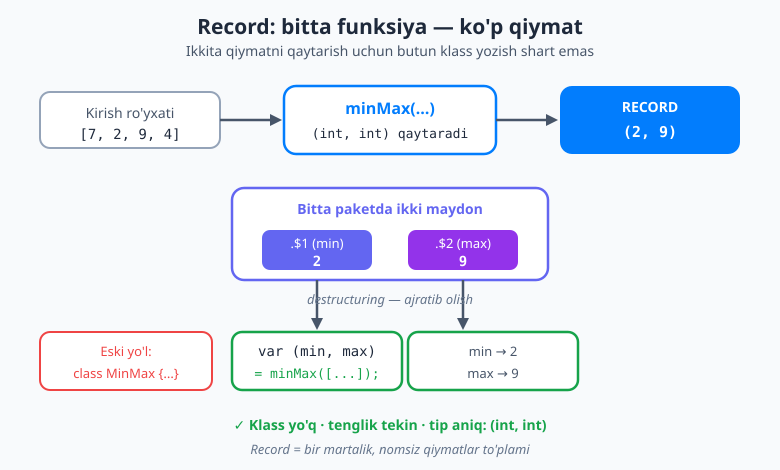
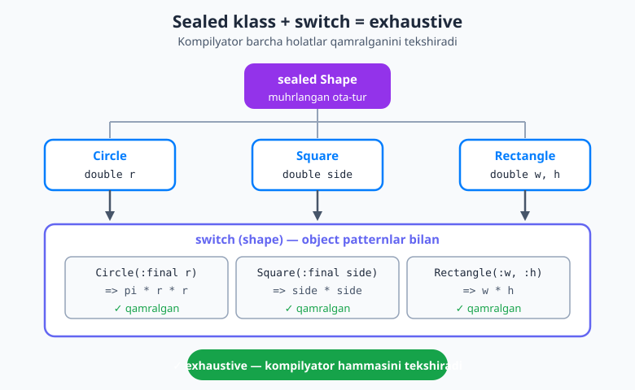
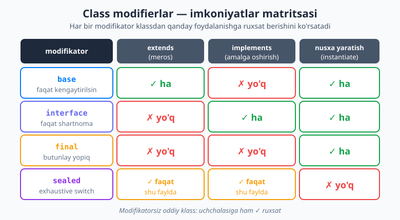

# 08 — Dart 3 zamonaviy imkoniyatlari

[⬅️ Oldingi: 07 — OOP — obyektga yo'naltirilgan dasturlash](./07-oop-asoslari.md) · [🏠 README](./README.md) · [Keyingi: 09 — Asinxron Dart ➡️](./09-asinxron-dart.md)

> **Bu bobda:** Dart 3 ni *zamonaviy* qiladigan imkoniyatlar bilan tanishasiz — **records** (qiymatlarni klass yozmasdan to'plash), **pattern matching va destructuring** (ma'lumotni shaklini tanib, bo'lib olish), **sealed klasslar** (`switch` ni *to'liq* — exhaustive — qiladigan "killer" imkoniyat), **class modifiers** (`base`/`interface`/`final`/`sealed`), **generics** (`<T>` bilan tip-xavfsiz qayta ishlatish), va **exceptions** (xatolarni boshqarish). Yo'l-yo'lakay nega Dart makroslari **bekor qilingani**ni va o'rniga nima ishlatilishini tushunamiz.

---

## Nega bu bob muhim

Oldingi boblarda siz Dart'ning "klassik" qismini o'rgandingiz: o'zgaruvchilar, funksiyalar, to'plamlar, null safety, OOP. Bularning hammasi Dart 1 va 2 da ham bor edi. Bu bobda esa **aynan Dart 3** olib kelgan yangiliklarni ko'ramiz — ular zamonaviy Dart kodini eski darslardan *butunlay* boshqacha ko'rsatadi.

Nega bularni alohida o'rganamiz? Chunki ular kundalik kodingizni **qisqaroq**, **xavfsizroq** va **o'qilishi osonroq** qiladi. Masalan, sealed klass + `switch` birikmasi butun bir xatolar turkumini — "men bir holatni unutib qoldirdim" degan xatoni — *kompilyatsiya vaqtida* tutib oladi. Bu Flutter'da holat (state) modellashtirishning poydevori; keyinroq Bloc va Riverpod'da aynan shu naqshni ishlatamiz.

Boshlaymiz.

---

## 1. Records — qiymatlarni klass yozmasdan to'plash

Tasavvur qiling: funksiyadan **ikkita** qiymat qaytarmoqchisiz — masalan ro'yxatdagi eng kichik va eng katta son. Eski yo'l bilan, buning uchun kichkina bir klass yozishingiz kerak edi:

```dart
// Eski (zerikarli) yo'l — bitta juftlik uchun butun klass
class MinMax {
  final int min;
  final int max;
  MinMax(this.min, this.max);
}
```

Bu juda ko'p "boilerplate" (takroriy, mazmunsiz) kod. **Record** aynan shu muammoni hal qiladi: u — **nomsiz, yengil qiymatlar to'plami**. Klass yozmasdan, bir nechta qiymatni bitta "paket"ga jamlaysiz.

### Positional (tartibli) record

```dart
var pair = (3, 'olma'); // tipi: (int, String)
print(pair.$1); // 3   — birinchi maydon
print(pair.$2); // olma — ikkinchi maydon
```

Maydonlarga `.$1`, `.$2`, `.$3` ... orqali murojaat qilasiz (tartib bo'yicha, **1 dan** boshlanadi).

### Named (nomli) record

Tartib raqami chalkash bo'lsa, maydonga **nom** bering:

```dart
var odam = (name: 'Ali', age: 25); // tipi: ({String name, int age})
print(odam.name); // Ali
print(odam.age);  // 25
```

### Funksiyadan bir nechta qiymat qaytarish

Records'ning eng kuchli ishlatilishi — bu. Endi klass kerak emas:

```dart
(int, int) minMax(List<int> sonlar) {
  var min = sonlar.first;
  var max = sonlar.first;
  for (final n in sonlar) {
    if (n < min) min = n;
    if (n > max) max = n;
  }
  return (min, max); // ikkita qiymatni bitta record qilib qaytaramiz
}

void main() {
  var natija = minMax([7, 2, 9, 4]);
  print(natija.$1); // 2  (eng kichik)
  print(natija.$2); // 9  (eng katta)
}
```

### Qiymat bo'yicha tenglik (value equality)

Record'larning maydonlari bir xil bo'lsa, ular **teng** hisoblanadi — siz hech narsa yozmasangiz ham. Klassda bunga `==` va `hashCode` ni qo'lda yozishingiz kerak edi:

```dart
var a = (1, 'x');
var b = (1, 'x');
print(a == b); // true — maydonlar bir xil, demak teng
```

> 🧩 **Qachon record, qachon klass?** Record — *bir martalik*, nomsiz juftlik uchun (funksiyadan qaytariladigan "(min, max)" kabi). Agar to'plamga **nom**, **metod**, yoki **xulq** kerak bo'lsa (masalan `User` bilan `login()` metodi) — klass yozing. Qoida: *agar buni hujjatda "tushuntirish" kerak bo'lsa — klass; agar shunchaki "ikki son" bo'lsa — record.*



---

## 2. Patterns va destructuring — shaklni tanib, bo'lib olish

**Pattern** (naqsh) — bu ma'lumotning *shakli*ni tasvirlaydigan ifoda. Dart shu shaklga qarab qiymatni **tekshira** oladi va **bo'laklarga ajrata** (destructure) oladi.

### Record'ni ajratish (destructuring)

Yuqoridagi `minMax` ni eslang. `.$1`/`.$2` o'rniga, natijani to'g'ridan-to'g'ri **ikki o'zgaruvchiga** ajratib olish mumkin:

```dart
var (min, max) = minMax([7, 2, 9, 4]);
print('Eng kichik: $min, eng katta: $max'); // Eng kichik: 2, eng katta: 9
```

`final (a, b) = pair;` — bu **destructuring**. O'ng tomondagi record "ochilib", maydonlari chap tomondagi o'zgaruvchilarga tarqatiladi. Bu ancha toza ko'rinadi.

### List pattern — ro'yxatni ajratish

```dart
var royxat = [10, 20, 30];
final [birinchi, _, uchinchi] = royxat; // o'rtadagini e'tiborsiz qoldirdik
print(birinchi);  // 10
print(uchinchi);  // 30
```

`_` (pastki chiziq) — "menga bu element kerak emas" degani. Bu **wildcard** (joker) pattern.

### Map pattern — lug'atdan kerakli kalitlarni olish

```dart
var foydalanuvchi = {'ism': 'Laylo', 'yosh': 22};
final {'ism': ism, 'yosh': yosh} = foydalanuvchi;
print('$ism, $yosh yosh'); // Laylo, 22 yosh
```

### Object pattern — obyektni ajratish

Agar sizda `Point` klassi bo'lsa (`x`, `y` getter'lari bilan), uni ham ajratib olishingiz mumkin:

```dart
class Point {
  final int x, y;
  Point(this.x, this.y);
}

void main() {
  var p = Point(3, 4);
  final Point(:x, :y) = p; // x va y ni p ichidan tortib oldik
  print('x=$x, y=$y'); // x=3, y=4
}
```

`Point(:x, :y)` — bu **object pattern**. `:x` — "x getter'ining qiymatini `x` nomli o'zgaruvchiga sol" degan qisqacha yozuv.

### if-case — shartli tanish va ajratish

`if-case` — eng foydali naqshlardan biri. U bir vaqtning o'zida **tekshiradi** va **ajratadi**. JSON (tarmoqdan kelgan ma'lumot) bilan ishlashda juda qulay:

```dart
Object? json = {'name': 'Dilnoza', 'age': 30};

if (json case {'name': String n}) {
  // Faqat 'name' kaliti bor VA uning qiymati String bo'lsagina bu yerga kiramiz
  print('Ism: $n'); // Ism: Dilnoza
} else {
  print('Noto\'g\'ri format');
}
```

E'tibor bering: `String n` — bu "qiymat String bo'lsin, va uni `n` ga sol" degani. Agar tip mos kelmasa, shart bajarilmaydi va `else` ishlaydi. Bu null safety bilan birga — tashqi, ishonchsiz ma'lumotni xavfsiz qabul qilishning eng zamonaviy yo'li.

---

## 3. switch + patterns — eng kuchli birikma

Siz `switch` ni 03-bobda ko'rgandingiz. Dart 3 da `switch` patternlar bilan birga **bir necha barobar kuchliroq** bo'ldi. Endi qiymatni nafaqat *tengligiga*, balki **shakliga**, **tipiga**, **diapazoniga** qarab tekshirasiz.

`switch` ni **ifoda (expression)** sifatida ham ishlatish mumkin — ya'ni qiymat *qaytaradi*:

```dart
String bahola(int ball) => switch (ball) {
  >= 90 => 'A\'lo',         // relational (taqqoslash) pattern
  >= 70 => 'Yaxshi',
  >= 50 => 'Qoniqarli',
  _ => 'Qoniqarsiz',        // _ — qolgan barcha holatlar
};
```

`>= 90` — bu **relational pattern** (taqqoslovchi naqsh). Mantiqiy naqshlarni ham birlashtirish mumkin (`||` va `&&`), hamda **guard** (`when`) qo'shimcha shart bering:

```dart
String tavsifla(int son) => switch (son) {
  0 => 'nol',
  1 || 2 || 3 => 'kichik',                  // logical OR pattern
  int n when n.isEven => 'katta, juft son', // when — qo'shimcha shart
  _ => 'katta, toq son',
};
```

> 💡 `switch` ifodasi `=>` (arrow) va `,` (vergul) bilan yoziladi; klassik `switch` operatori esa `case ...:` va `break` bilan. Ifoda — natija olmoqchi bo'lganingizda, operator — faqat ish bajartirmoqchi bo'lganingizda.

---

## 4. Sealed klasslar — exhaustive switch ("killer" imkoniyat)

Mana bobning eng muhim qismi.

`sealed` — bu **class modifier**. U bitta klassdan meros oladigan **barcha** turlarni *bitta faylda* "muhrlab" qo'yadi. Tashqaridan unga yangi vorislar qo'shib bo'lmaydi. Bu kompilyatorga juda kuchli ma'lumot beradi: *"bu turning barcha mumkin bo'lgan ko'rinishlari mana shular, boshqa yo'q"*.

Klassik misol — geometrik shakllar. Har xil shaklning yuzasini (maydonini) hisoblaymiz:

```dart
sealed class Shape {} // muhrlangan — vorislar faqat shu faylda

class Circle extends Shape {
  final double r;
  Circle(this.r);
}

class Square extends Shape {
  final double side;
  Square(this.side);
}

class Rectangle extends Shape {
  final double w, h;
  Rectangle(this.w, this.h);
}
```

Endi yuzani hisoblaymiz. `switch` ifodasida **object pattern**lar bilan har bir shaklni tanib, ichidagi maydonlarni ajratib olamiz:

```dart
double yuza(Shape shape) => switch (shape) {
  Circle(:final r) => 3.14159 * r * r,
  Square(:final side) => side * side,
  Rectangle(:final w, :final h) => w * h,
};

void main() {
  print(yuza(Circle(2)));        // 12.56636
  print(yuza(Square(3)));        // 9.0
  print(yuza(Rectangle(2, 5)));  // 10.0
}
```

`Circle(:final r)` — "agar bu `Circle` bo'lsa, uning `r` maydonini `r` o'zgaruvchisiga ol" degani.

### Nega bu "killer" imkoniyat?

Diqqat: yuqoridagi `switch` da `_` (default) **yo'q**, lekin kompilyator hech narsadan shikoyat qilmaydi. Nega? Chunki `Shape` — `sealed`. Kompilyator *biladi* — uchta variant bor (`Circle`, `Square`, `Rectangle`) va siz **uchchalasini ham** qamrab oldingiz. Bu **exhaustive** (to'liq) switch deyiladi.

Endi tasavvur qiling, kelajakda yangi shakl qo'shdingiz:

```dart
class Triangle extends Shape {
  final double base, height;
  Triangle(this.base, this.height);
}
```

Shu zahoti `yuza` funksiyasidagi `switch` **kompilyatsiya xatosi** beradi:
> *The type 'Shape' is not exhaustively matched by the switch cases since it doesn't match 'Triangle(...)'.*

Ya'ni kompilyatorning o'zi sizga: *"Triangle holatini unutib qoldirding!"* deb aytadi — ishlaganda emas, **kod yozayotganingizda**. Bu butun bir xatolar turkumini ("men bir holatni qamrab olmagan ekanman") tubdan yo'q qiladi.

> 🎯 **Flutter'ga ko'prik:** Aynan shu naqsh — holat (state) modellashtirishning oltin standarti. Masalan, yuklash holatini `sealed class YuklashHolati` qilib, `Yuklanmoqda` / `Muvaffaqiyat` / `Xato` vorislari bilan modellashtirsangiz, UI'da `switch` har bir holatni *majburan* qamrab oladi — birortasini unutib bo'lmaydi. Buni keyinroq Bloc va Riverpod boblarida qayta ko'ramiz.



---

## 5. Class modifiers — klasslar ustidan nazorat

Dart 3 klass nomidan oldin qo'yiladigan bir nechta **modifikator** keltirdi. Ular klassingizdan *boshqalar* qanday foydalanishi mumkinligini boshqaradi. Bu ayniqsa kutubxona (paket) yozayotganda — ya'ni API dizaynida — muhim.

Asosiy savol uchta: klassni **meros olish** (`extends`) mumkinmi? **interfeys sifatida amalga oshirish** (`implements`) mumkinmi? **nusxa yaratish** (`new`/konstruktor chaqirish) mumkinmi?

| Modifikator | `extends` (meros) | `implements` | nusxa yaratish | Qachon kerak |
|---|---|---|---|---|
| (modifikatorsiz) | ✅ ha | ✅ ha | ✅ ha | Oddiy, ochiq klass |
| `base` | ✅ ha (majburiy) | ❌ yo'q | ✅ ha | Faqat meros orqali kengaytirilsin |
| `interface` | ❌ yo'q | ✅ ha | ✅ ha | Faqat shartnoma (kontrakt) sifatida |
| `final` | ❌ yo'q | ❌ yo'q | ✅ ha | Kengaytirishni butunlay yopish |
| `sealed` | faqat shu faylda | faqat shu faylda | ❌ yo'q | Exhaustive switch uchun |

Qisqacha tushuntiramiz:

- **`base`** — vorislar klassni faqat `extends` qila oladi, `implements` qila olmaydi. Bu ichki holatingiz har doim meros olinishini kafolatlaydi (har bir voris ota-klass mantiqini "olib ketadi").

```dart
base class Hayvon {
  void nafasOl() => print('nafas...');
}
base class Mushuk extends Hayvon {} // ✅ extends — to'g'ri
// class Robot implements Hayvon {} // ❌ xato — base ni implements qilib bo'lmaydi
```

- **`interface`** — boshqalar uni faqat `implements` qila oladi (meros emas). Faqat "shartnoma" — qanday metodlar bo'lishi kerakligini belgilaydi, lekin amalga oshirishni majburlamaydi.

```dart
interface class Tolovchi {
  void tola(double summa) {}
}
class Karta implements Tolovchi {
  @override
  void tola(double summa) => print('$summa to\'landi');
}
```

- **`final`** — klassni butunlay "yopadi": uni na meros olish, na implement qilish mumkin. Kelajakda klassni o'zgartirsangiz, hech kimning kodi buzilmasligini kafolatlaysiz.

- **`sealed`** — yuqorida ko'rdik: muhrlangan ierarxiya + exhaustive switch. `sealed` klassdan to'g'ridan-to'g'ri nusxa yaratib bo'lmaydi (u faqat "umumiy ota").

- **`mixin class`** — ham oddiy klass sifatida (`extends`), ham `mixin` sifatida (`with`) ishlatish mumkin bo'lgan ikki tomonlama tur. Bu kodni qayta ishlatishda moslashuvchanlik beradi.

> 🧱 **Maslahat:** Boshlovchi sifatida modifikatorlarsiz oddiy klasslardan boshlang. Modifikatorlar — *kutubxona muallifi* uchun nozik asbob: "men foydalanuvchilarga aynan nimaga ruxsat beraman?" degan savolga javob. Ortiqcha qo'llamang.



---

## 6. Generics — `<T>` bilan tip-xavfsiz qayta ishlatish

Aslida siz generics'ni allaqachon ishlatib kelyapsiz: `List<int>`, `Map<String, int>` — bulardagi `<...>` aynan **generics**. `List<int>` — "faqat `int` saqlaydigan ro'yxat" degani.

**Generic** (umumiy tur) — bu *tipni parametr sifatida* qabul qiladigan kod. U bir martda yoziladi, lekin har xil tiplar bilan ishlaydi — ham qayta ishlatiladi, ham tip-xavfsiz qoladi.

### Generic funksiya

```dart
T birinchi<T>(List<T> royxat) => royxat.first;

void main() {
  int x = birinchi([10, 20, 30]);       // T = int  bo'ldi
  String s = birinchi(['a', 'b', 'c']); // T = String bo'ldi
  print('$x, $s'); // 10, a
}
```

`<T>` — bu "tip joy egasi" (placeholder). Funksiyani chaqirganingizda Dart `T` ning haqiqiy tipini *o'zi* aniqlaydi. Natijada `birinchi([10,20,30])` aniq `int` qaytaradi — `dynamic` emas, demak tip xavfsizligi saqlanadi.

### Generic klass

```dart
class Quti<T> {
  T narsa;
  Quti(this.narsa);

  T ochish() => narsa;
}

void main() {
  var sonQuti = Quti<int>(42);
  var matnQuti = Quti<String>('salom');
  print(sonQuti.ochish());  // 42
  print(matnQuti.ochish()); // salom
}
```

Bitta `Quti` klassi — ham sonlar, ham matnlar uchun, har biri o'z tipini saqlab.

### Bound (chegara) — `<T extends ...>`

Ba'zan generic tipni cheklamoqchi bo'lasiz. Masalan, faqat *sonlar* bilan ishlovchi funksiya:

```dart
T kattasi<T extends num>(T a, T b) => a > b ? a : b;

void main() {
  print(kattasi(3, 7));      // 7   (int — num'ning vorisi)
  print(kattasi(2.5, 1.1));  // 2.5 (double — num'ning vorisi)
  // kattasi('a', 'b');      // ❌ xato — String num emas
}
```

`<T extends num>` — "T albatta `num` yoki uning vorisi bo'lsin" degani. Shu tufayli funksiya ichida `>` operatorini ishlatishimiz mumkin (chunki `num` da u bor).

> 💡 **Nega generics?** Ikki sabab: **tip xavfsizligi** (`List<int>` ga `String` qo'sholmaysiz — xato kod yozayotganda tutiladi) va **qayta ishlatish** (bitta `Quti<T>` ni cheksiz tip uchun ishlatasiz). Ikkalasi birga — ortiqcha kod yo'q, lekin xatolar ham yo'q.

---

## 7. Exceptions — xatolarni boshqarish

Dasturda ko'pincha noto'g'ri narsa yuz beradi: fayl topilmaydi, tarmoq uziladi, foydalanuvchi noto'g'ri qiymat kiritadi. **Exception** (istisno) — bu "bu yerda muammo yuz berdi!" degan signal.

### throw — xatoni "otish"

```dart
double bol(int a, int b) {
  if (b == 0) {
    throw ArgumentError('Nolga bo\'lib bo\'lmaydi'); // xato otdik
  }
  return a / b;
}
```

`throw` xatoni "otadi" — shu paytdan funksiya to'xtaydi va boshqaruv uni "tutadigan" joyga sakraydi.

### try / on / catch / finally — xatoni "tutish"

```dart
void main() {
  try {
    var natija = bol(10, 0);
    print(natija);
  } on ArgumentError catch (e) {
    // Aniq tipdagi xatoni tutamiz
    print('Argument xatosi: ${e.message}');
  } catch (e) {
    // Boshqa har qanday xato
    print('Kutilmagan xato: $e');
  } finally {
    // BU HAR DOIM ishlaydi — xato bo'ldimi, yo'qmi
    print('Tekshiruv tugadi');
  }
}
```

- **`try`** — "xato bo'lishi mumkin" deb gumon qilingan kod.
- **`on <Tur>`** — aniq turdagi xatoni tutadi.
- **`catch (e)`** — istalgan xatoni tutadi (`e` — xato obyekti).
- **`finally`** — natijadan qat'i nazar har doim bajariladigan blok (masalan, faylni yopish, resursni bo'shatish).

### O'z exception'ingiz

Hech kim sizni majburlamaydi — istalgan `Exception` klassini o'zingiz yozishingiz mumkin:

```dart
class BoshHisobXatosi implements Exception {
  final String sabab;
  BoshHisobXatosi(this.sabab);

  @override
  String toString() => 'BoshHisobXatosi: $sabab';
}
```

### rethrow — xatoni qayta uzatish

Ba'zan xatoni *qisman* qayta ishlab (masalan, jurnalga yozib), keyin yuqoridagi chaqiruvchiga *uzatib* yubormoqchi bo'lasiz:

```dart
void qaytaIshla() {
  try {
    bol(5, 0);
  } catch (e) {
    print('Jurnalga yozildi: $e');
    rethrow; // xatoni o'zgartirmasdan yuqoriga uzatamiz
  }
}
```

> ⚖️ **Qachon `throw`, qachon `null` yoki Result?** Agar xato — *kutilgan, oddiy* holat bo'lsa (masalan, qidiruvda topilmadi), `null` qaytaring (06-bobdagi null safety bilan toza ishlaydi). Agar xato — *istisno, kutilmagan* (fayl buzilgan, tarmoq yo'q), `throw` qiling. Ba'zi loyihalar uchinchi yo'lni tanlaydi: muvaffaqiyat/xatoni bitta `sealed` "Result" turida modellashtirish — bu yuqoridagi sealed naqshning go'zal qo'llanishi.

---

## 8. Kodgeneratsiya — makroslar haqida haqiqat

Internetdagi eski (yoki noto'g'ri) maqolalarda **"Dart makroslari"** (macros) haqida o'qigan bo'lishingiz mumkin — go'yoki ular `freezed` kabi paketlarni keraksiz qiladi. **Bu endi to'g'ri emas.**

> ⚠️ **MUHIM:** Dart **makroslari 2025-yil yanvarda rasman bekor qilindi** (cancelled). Ular tilning qismi *emas* va kelajakda ham bo'lmaydi. Agar biror manba sizga makroslarni "ishlatishni" o'rgatsa — u eskirgan.

Unda data-klasslar va JSON uchun takroriy kodni kim kamaytiradi? Javob — **`build_runner`**. Bu — kod-generatsiya vositasi: u sizning kodingizni o'qib, *qo'shimcha* Dart faylini *avtomatik yozadi*. Eng mashhur paketlar:

- **`freezed`** — o'zgarmas (immutable) data-klasslar, `copyWith`, `==`, va **union**lar (sealed'ga o'xshash holatlar) ni avtomatik yaratadi.
- **`json_serializable`** — JSON'dan obyektga va aksincha o'tkazuvchi (`fromJson`/`toJson`) kodni avtomatik yozadi.

Ishlatish sodda: maxsus belgilar (annotatsiya) qo'yasiz, keyin terminalda generatsiyani ishga tushirasiz:

```bash
dart run build_runner build
```

Bu sizning `freezed`/`json_serializable` annotatsiyalaringizni o'qib, `*.g.dart` va `*.freezed.dart` fayllarini yozadi. Bu fayllarni qo'lda yozish kerak emas — vosita yozadi. JSON va tarmoq bilan ishlaganda buni 21-bobda amalda ko'ramiz.

Bitta yangi til kalit so'zi — **`augment`** (augmentations, "to'ldirish") — makroslarning *tor* o'rinbosari: u mavjud e'lonni boshqa faylda "to'ldirish" imkonini beradi va kod-generatorlar o'z natijasini chiroyliroq joylash uchun ishlatadi. Buni *makros* deb atamang — bu boshqa, ancha cheklangan mexanizm; kundalik ishda undan to'g'ridan-to'g'ri foydalanmaysiz.

> 💡 **Xulosa:** Boilerplate'ni kamaytirish kerakmi? `build_runner` + `freezed`/`json_serializable`. Makroslar — yo'q. Shuni eslab qoling, vaqtingizni eskirgan darslarga sarflamaysiz.

---

## Bobning xulosasi

- **Records** — klass yozmasdan qiymatlarni to'plash; `(int, String)` positional, `({int x, int y})` named; funksiyadan ko'p qiymat qaytarish uchun ideal; tenglik tekin keladi.
- **Patterns + destructuring** — ma'lumotni shakliga qarab tanib, bo'laklarga ajratish: `final (a, b) = ...`, list/map/object patternlar, `if-case`.
- **switch + patterns** — taqqoslash (`>= 18`), mantiqiy (`||`), guard (`when`) bilan kuchli moslashtirish; `switch` ifoda sifatida qiymat qaytaradi.
- **Sealed klasslar** — exhaustive (to'liq) switch: kompilyator unutilgan holatni *yozish vaqtida* tutadi. Holat modellashtirishning poydevori.
- **Class modifiers** — `base`/`interface`/`final`/`sealed`: API dizaynida klassdan qanday foydalanishni boshqarish.
- **Generics** — `<T>` bilan tip-xavfsiz, qayta ishlatiluvchi kod; `<T extends num>` bilan cheklash.
- **Exceptions** — `throw`/`try`/`on`/`catch`/`finally`/`rethrow`; o'z exception klasslaringiz; `throw` vs `null` tanlovi.
- **Kodgeneratsiya** — makroslar bekor qilingan; `build_runner` + `freezed`/`json_serializable` ishlating.

Endi siz zamonaviy Dart'ning eng kuchli vositalariga egasiz. Keyingi bobda dasturlashning yana bir muhim qirrasi — **vaqt**ni boshqarishni o'rganamiz: `Future`, `async`/`await` va `Stream`. Bu Flutter'ga o'tishdan oldingi *oxirgi* Dart bobi.

---

## Mashqlar

**1. Record bilan qaytarish.** `royxatTahlil` funksiyasini yozing: `List<int>` qabul qilib, named record `({int yigindi, double ortacha})` qaytarsin. Keyin natijani destructuring bilan ikki o'zgaruvchiga ajratib chop eting.

**2. if-case bilan JSON.** `Object? data` qabul qiladigan `salomBer` funksiyasini yozing. Agar `data` — `{'ism': String}` ko'rinishidagi map bo'lsa, "Salom, <ism>!" deb chop etsin; aks holda "Noma'lum" desin.

**3. Sealed + exhaustive switch.** `sealed class Tolov` yarating, vorislari: `Naqd(double summa)`, `Karta(String raqam)`, `Transfer(String hisob)`. `switch` ifodasi bilan har bir to'lovni qisqacha matnga aylantiruvchi `tasvirla(Tolov t)` funksiyasini yozing — `_` (default) **ishlatmang**.

**4. Generic Stack.** `Stack<T>` generic klassini yozing: `push(T)`, `pop()` (oxirgisini olib qaytaradi) va `boshmi` (bo'sh-yo'qligini bool qaytaradi) bilan. `Stack<int>` da sinab ko'ring.

**5. Exception bilan validatsiya.** `yoshTekshir(int yosh)` funksiyasini yozing: agar `yosh < 0` bo'lsa, o'zingizning `YoshXatosi` exception'ini `throw` qilsin. `main` ichida `try/catch` bilan chaqirib, xatoni chiroyli chop eting.

**6. (Qiyinroq) Pattern guard.** `switch` ifodasi va `when` guard'i bilan `fasl(int oy)` funksiyasini yozing: 12,1,2 → "qish", 3,4,5 → "bahor", 6,7,8 → "yoz", 9,10,11 → "kuz", boshqa → "noto'g'ri oy".

<details markdown="1">
<summary>✅ Yechimlar</summary>

**1. Record bilan qaytarish:**

```dart
({int yigindi, double ortacha}) royxatTahlil(List<int> sonlar) {
  var yigindi = sonlar.fold(0, (a, b) => a + b);
  var ortacha = sonlar.isEmpty ? 0.0 : yigindi / sonlar.length;
  return (yigindi: yigindi, ortacha: ortacha);
}

void main() {
  var (:yigindi, :ortacha) = royxatTahlil([10, 20, 30]);
  print('Yig\'indi: $yigindi, o\'rtacha: $ortacha'); // Yig'indi: 60, o'rtacha: 20.0
}
```

**2. if-case bilan JSON:**

```dart
void salomBer(Object? data) {
  if (data case {'ism': String ism}) {
    print('Salom, $ism!');
  } else {
    print('Noma\'lum');
  }
}

void main() {
  salomBer({'ism': 'Aziza'}); // Salom, Aziza!
  salomBer({'yosh': 20});     // Noma'lum
  salomBer(42);               // Noma'lum
}
```

**3. Sealed + exhaustive switch:**

```dart
sealed class Tolov {}

class Naqd extends Tolov {
  final double summa;
  Naqd(this.summa);
}

class Karta extends Tolov {
  final String raqam;
  Karta(this.raqam);
}

class Transfer extends Tolov {
  final String hisob;
  Transfer(this.hisob);
}

String tasvirla(Tolov t) => switch (t) {
  Naqd(:final summa) => 'Naqd to\'lov: $summa so\'m',
  Karta(:final raqam) => 'Karta orqali: $raqam',
  Transfer(:final hisob) => 'Transfer hisobga: $hisob',
};

void main() {
  print(tasvirla(Naqd(50000)));        // Naqd to'lov: 50000.0 so'm
  print(tasvirla(Karta('8600****'))); // Karta orqali: 8600****
}
```

> `_` yo'q — `Tolov` sealed bo'lgani uchun kompilyator uchchala holatni qamrab olganingizni biladi.

**4. Generic Stack:**

```dart
class Stack<T> {
  final List<T> _ichki = [];

  void push(T element) => _ichki.add(element);

  T pop() => _ichki.removeLast();

  bool get boshmi => _ichki.isEmpty;
}

void main() {
  var s = Stack<int>();
  s.push(1);
  s.push(2);
  print(s.pop());   // 2
  print(s.boshmi);  // false
  print(s.pop());   // 1
  print(s.boshmi);  // true
}
```

**5. Exception bilan validatsiya:**

```dart
class YoshXatosi implements Exception {
  final String xabar;
  YoshXatosi(this.xabar);
  @override
  String toString() => 'YoshXatosi: $xabar';
}

void yoshTekshir(int yosh) {
  if (yosh < 0) {
    throw YoshXatosi('Yosh manfiy bo\'lishi mumkin emas: $yosh');
  }
  print('Yosh to\'g\'ri: $yosh');
}

void main() {
  try {
    yoshTekshir(25);   // Yosh to'g'ri: 25
    yoshTekshir(-3);   // bu yerda xato otiladi
  } on YoshXatosi catch (e) {
    print('Tutib olindi -> $e'); // Tutib olindi -> YoshXatosi: Yosh manfiy...
  }
}
```

**6. Pattern guard bilan fasl:**

```dart
String fasl(int oy) => switch (oy) {
  12 || 1 || 2 => 'qish',
  3 || 4 || 5 => 'bahor',
  6 || 7 || 8 => 'yoz',
  9 || 10 || 11 => 'kuz',
  _ => 'noto\'g\'ri oy',
};

void main() {
  print(fasl(1));  // qish
  print(fasl(7));  // yoz
  print(fasl(13)); // noto'g'ri oy
}
```

> Bu yerda `when` shart emas — oddiy `||` patternlar yetarli. `when` ni murakkabroq shartda (`int n when n > 100`) ishlatasiz.

</details>

---

[⬅️ Oldingi: 07 — OOP — obyektga yo'naltirilgan dasturlash](./07-oop-asoslari.md) · [🏠 README](./README.md) · [Keyingi: 09 — Asinxron Dart ➡️](./09-asinxron-dart.md)
