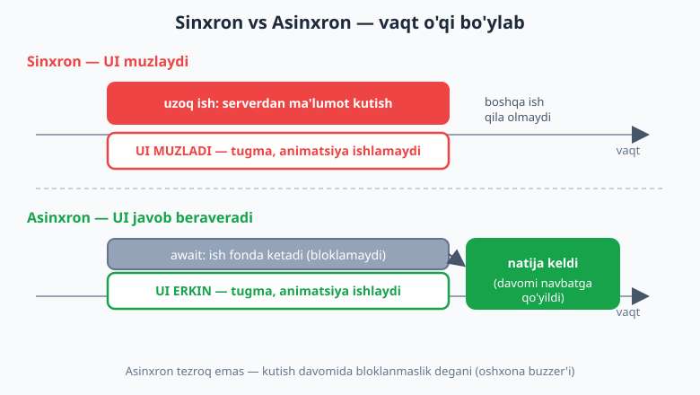
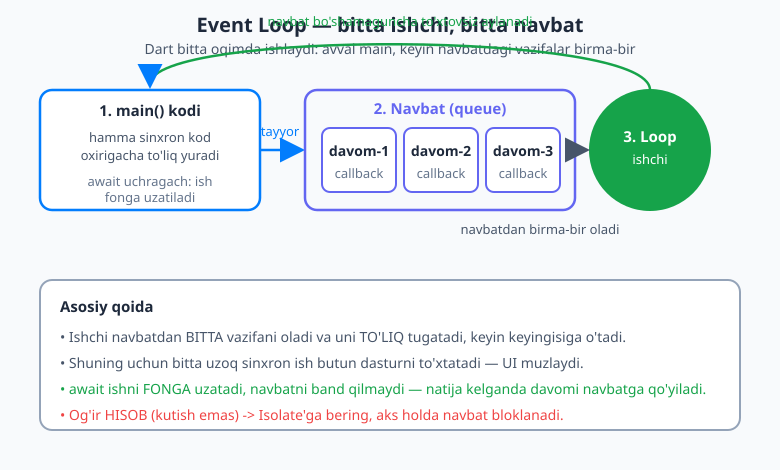
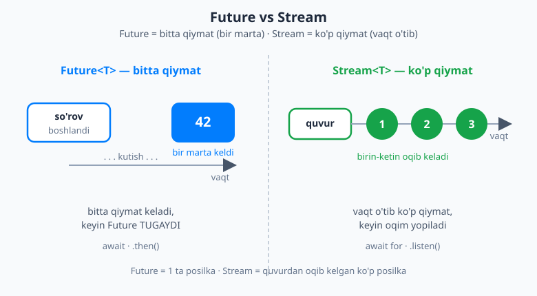

# 09 — Asinxron Dart

[⬅️ Oldingi: 08 — Dart 3 zamonaviy imkoniyatlari](./08-dart3-zamonaviy.md) · [🏠 README](./README.md) · [Keyingi: 10 — Flutter bilan tanishuv ➡️](./10-flutter-kirish.md)

> **Bu bobda:** ba'zi ishlar **vaqt talab qiladi** — internetdan ma'lumot olish, fayl o'qish, taymer. Agar dastur shu ishni "tik turib" kutsa, ekran **muzlab qoladi**. Asinxron (asynchronous) dasturlash aynan shu muammoni hal qiladi: kutayotgan paytda dastur boshqa ishlarni qiladi. Bobda Dart'ning **bitta oqim + event loop** modelini, `Future`ni (kelajakda keladigan bitta qiymat), `async`/`await`ni (asinxron kodni go'yo sinxrondek yozish), `Future.wait`ni (parallel kutish), `Stream`ni (vaqt o'tib **bir nechta** qiymat) va og'ir hisob uchun `Isolate`ni o'rganamiz. Bu bob — Flutter'dan oldin **majburiy**: Flutter'da har bir tarmoq chaqiruvi `Future`, har bir real-vaqt oqimi `Stream`.

---

## Muammo: kutish ekranni muzlatadi

Tasavvur qiling, ilovangiz serverdan foydalanuvchi ma'lumotini olishi kerak. Bu **bir zumda** bo'lmaydi — so'rov internetga ketadi, server javob qaytaradi, hammasi yarim soniya, ba'zan ikki soniya davom etadi. Endi savol: shu yarim soniya davomida dastur nima qiladi?

Agar **sinxron** (synchronous — "tik turib kutish") yozsangiz, dastur shu paytda **hech narsa qila olmaydi**. U javob kelguncha qotib turadi. Flutter ilovasida bu degani — ekran muzlaydi: foydalanuvchi tugmani bossa javob bo'lmaydi, animatsiya to'xtaydi, ilova "osilgan"dek ko'rinadi. Telefon egasi esa darhol ilovani yopadi.

Buni hayotiy misol bilan tushunaylik. **Oshxonaga** kirib taom buyurtma berdingiz:

- **Sinxron yo'l:** taom tayyor bo'lguncha kassa oldida qimirlamasdan turasiz. Boshqa hech narsa qila olmaysiz — qotib turibsiz. 15 daqiqa shunday.
- **Asinxron yo'l:** buyurtma berasiz, **buzzer** (chaqiruv tugmasi) olasiz va stolga borib o'tirasiz, telefoningizni ko'rasiz, suhbatlashasiz. Taom tayyor bo'lganda buzzer jiringlaydi — shunda borib olasiz. Kutish davomida **erkin** edingiz.

Asinxron dasturlash — aynan shu buzzer. Vaqt talab qiladigan ishni boshlab yuborasiz, "tayyor bo'lganda menga xabar ber" deysiz va ayni paytda dastur boshqa ishlarni bemalol bajaraveradi. Ish tugaganda — natija "jiringlab" keladi.



> 📌 Diqqat: asinxron **tezroq** degani emas. Taom baribir 15 daqiqada tayyor bo'ladi. Asinxron — kutish davomida **bloklanmaslik**, ya'ni boshqa ishlarni qila olish degani.

---

## Dart bitta oqimda ishlaydi: event loop

Asinxronlikni tushunish uchun avval Dart **qanday** kod yurgizishini bilish kerak. Ko'p tillarda parallellik uchun ko'p **oqim** (thread) ishlatiladi. Dart esa, asosan, **bitta oqimda** ishlaydi. Unda parallellik qayerda? Javob — **event loop** (hodisalar sikli).

Event loop'ni shunday tasavvur qiling: bu — to'xtovsiz aylanadigan kichkina ishchi. Uning oldida **navbat** (queue) turadi — bajarilishi kerak bo'lgan vazifalar ro'yxati. Ishchi navbatdan bitta vazifani oladi, **to'liq** bajaradi, keyin keyingisiga o'tadi. Vazifa tugamaguncha keyingisiga o'tmaydi.

```dart
void main() {
  print('1 — boshlandi');

  // Bu vazifa "keyinroq" bajarilsin deb navbatga qo'yiladi:
  Future(() => print('3 — navbatdagi vazifa'));

  print('2 — tugadi');
}
```

Chiqishi:

```
1 — boshlandi
2 — tugadi
3 — navbatdagi vazifa
```

E'tibor bering: `print('3...')` kodda **o'rtada** turibdi, lekin **oxirida** chiqdi. Chunki `Future(...)` ichidagi ish darhol bajarilmadi — u **navbatga qo'yildi**. Dart avval `main` funksiyaning hamma sinxron kodini oxirigacha yurgizadi (1, 2), keyingina event loop navbatdagi vazifaga (3) o'tadi.

Endi eng muhim xulosa: Dart bitta oqimda ishlagani uchun, **agar siz bitta vazifani uzoq vaqt band qilib tursangiz, butun dastur to'xtaydi**. Masalan, quyidagi kod — falokat:

```dart
// ❌ YOMON: bu sikl event loop'ni millionlab takror band qiladi.
// U tugamaguncha boshqa hech narsa — hatto tugma bosishi ham — ishlamaydi.
int yigindi = 0;
for (int i = 0; i < 5000000000; i++) {
  yigindi += i;
}
```

Bu og'ir sikl ishlayotganda event loop boshqa hech narsani qabul qila olmaydi — Flutter'da bu ekranning muzlashidir. **Saboq:** event loop'ni uzoq sinxron ish bilan band qilmang. Vaqt talab qiladigan ish — bu **kutish** (tarmoq, fayl) yoki **og'ir hisob** bo'lishi mumkin. Kutishni `Future`/`async` bilan, og'ir hisobni esa `Isolate` bilan hal qilamiz (ikkalasini ham shu bobda ko'ramiz).



> 💡 "`await` nega ekranni muzlatmaydi?" — chunki `await` event loop'ni **band qilmaydi**. U "men kutyapman, sen boshqa vazifalarni bajaraver" deydi. Natija kelganda funksiyaning davomi navbatga qo'yiladi. Aynan shu sirni quyida ochamiz.

---

## `Future` — kelajakda keladigan qiymat

**`Future`** (kelajak) — "hozir emas, **keyinroq** keladigan qiymat" ni anglatadi. U — oshxonadagi buzzer: hozir qo'lingizda taom yo'q, lekin keyin keladigan taomning **va'dasi** bor.

`Future` ham generic tip: `Future<T>` — kelajakda `T` tipidagi qiymat keladi deganidir.

- `Future<String>` — keyin **matn** keladi (masalan, foydalanuvchi ismi).
- `Future<int>` — keyin **son** keladi.
- `Future<void>` — keyin **qiymatsiz** ish tugaydi (faqat "bajarildi" signali).

`Future` ikki yo'l bilan tugaydi: yo **muvaffaqiyatli** qiymat bilan, yo **xato** (error) bilan. Bu ham buzzer kabi — taom tayyor bo'lishi yoki "kechirasiz, tugab qoldi" javobi kelishi mumkin.

Eng oson `Future` yaratish usuli — `Future.delayed`, ya'ni "shuncha vaqtdan keyin shu qiymatni ber":

```dart
// 2 soniyadan keyin matn qaytaradigan Future:
Future<String> salomBer() {
  return Future.delayed(
    const Duration(seconds: 2),
    () => 'Salom, dunyo!',
  );
}
```

`salomBer()` ni chaqirsangiz, qo'lingizda **darhol** `Future<String>` paydo bo'ladi — lekin ichidagi matn hali yo'q (quti hali yopiq). Matnga yetish uchun qutini "ochish" kerak. Ochishning eski usuli — `.then()`.

### `.then()` va `.catchError()` — eski uslub (qisqacha)

`async`/`await` paydo bo'lishidan oldin `Future` natijasini `.then()` bilan olishardi: "qiymat kelganda, mana shu funksiyani chaqir".

```dart
void main() {
  salomBer()
      .then((matn) => print(matn))            // qiymat kelganda chaqiriladi
      .catchError((xato) => print('Xato: $xato')); // xato bo'lsa chaqiriladi

  print('Bu birinchi chiqadi — Future hali kutilyapti');
}
```

Bu ishlaydi, lekin bir nechta `Future` ketma-ket kerak bo'lsa `.then()` ichida `.then()` paydo bo'lib, kod "narvon"ga aylanadi va o'qish qiyinlashadi. Shu sababli zamonaviy Dart'da asosiy usul — `async`/`await`. `.then()` ni faqat eski kodni o'qiy olish uchun bilib qo'ying.

---

## `async` / `await` — asosiy usul

`async`/`await` — asinxron kodni go'yo **oddiy sinxron kod**dek yozish imkonini beradi, lekin u baribir **bloklamaydi**. Bu — Dart'da asinxronlikning asosiy va eng o'qiladigan usuli.

Ikkita qoida bor, ular bir-birining aksi:

- **`async`** — funksiyani "asinxron" deb belgilaydi. Bunday funksiya **doim `Future` qaytaradi**: ichida `String` qaytarsangiz, tashqaridan u `Future<String>` bo'ladi.
- **`await`** — `Future` qutisini **ochib**, ichidagi qiymatni beradi. U faqat `async` funksiya ichida ishlatiladi.

```dart
Future<String> salomBer() {
  return Future.delayed(const Duration(seconds: 2), () => 'Salom!');
}

Future<void> main() async {           // main ham async bo'ldi
  print('Kutyapmiz...');
  final matn = await salomBer();      // quti ochilguncha "kutadi" (lekin bloklamaydi)
  print(matn);                        // 2 soniyadan keyin: Salom!
}
```

`await salomBer()` qatorida sehrgarlik yashiringan. Tashqaridan bu "2 soniya kutdik, keyin `matn`ga qiymatni oldik" kabi ko'rinadi — xuddi oddiy kod. Lekin ichkarida boshqacha: `await` event loop'ga "men kutyapman, boshqa vazifalarni yurgizaver" deydi. Natija kelganda funksiyaning **davomi** (ya'ni `print(matn)`) navbatga qo'yiladi va yurgiziladi. Shuning uchun ekran muzlamaydi.

### Realistik misol: foydalanuvchini "olish"

Hayotiy ko'rinishga keltiraylik — serverdan foydalanuvchi ismini olishni `Future.delayed` bilan **taqlid** qilamiz (haqiqiy tarmoq chaqiruvini 21-bobda ko'ramiz):

```dart
Future<String> foydalanuvchiOl(int id) async {
  // Haqiqatda bu yerda tarmoq so'rovi bo'ladi; biz 1 soniya "kutamiz":
  await Future.delayed(const Duration(seconds: 1));
  if (id <= 0) {
    throw Exception('Noto\'g\'ri id: $id');   // xato ham qaytishi mumkin
  }
  return 'Foydalanuvchi #$id';
}

Future<void> main() async {
  print('Yuklanmoqda...');
  final ism = await foydalanuvchiOl(7);
  print('Keldi: $ism');                       // Keldi: Foydalanuvchi #7
}
```

`foydalanuvchiOl` `async` bo'lgani uchun, garchi ichida `String` qaytarayotgan bo'lsa ham, uning tashqi tipi — `Future<String>`. Chaqirgan joyda `await` bilan ochib, oddiy `String` olamiz.

### Xatolarni `try` / `catch` bilan ushlash

`async`/`await` ning eng katta qulayligi: xatolarni **oddiy `try`/`catch`** bilan ushlaysiz — xuddi sinxron koddagidek. `.catchError()` kerak emas.

```dart
Future<void> main() async {
  try {
    final ism = await foydalanuvchiOl(-1);    // id noto'g'ri -> xato otadi
    print('Keldi: $ism');
  } catch (xato) {
    print('Muammo yuz berdi: $xato');         // Muammo yuz berdi: Exception: Noto'g'ri id: -1
  } finally {
    print('Yuklash tugadi (muvaffaqiyat yoki xato — bari bir).');
  }
}
```

Agar `await foydalanuvchiOl(-1)` ichida xato otsa, u `try` blokidan "sakrab" `catch`ga tushadi — xuddi oddiy istisno (exception) kabi. `finally` esa har holatda ishlaydi. Bu — 08-bobda ko'rgan `try/catch`ning aynan o'zi, lekin endi asinxron kod uchun. **Xatoni hech qachon e'tiborsiz qoldirmang:** tarmoq uzilishi, server xatosi — bular doim bo'lib turadi, ularni ushlash shart.

---

## Ketma-ket va parallel: `Future.wait`

Aytaylik, sizga uchta narsa kerak: foydalanuvchi, uning buyurtmalari va sozlamalari. Har biri 1 soniya "oladi". Ularni qanday olamiz?

**Ketma-ket (sequential)** — birini kutib, keyin ikkinchisini, keyin uchinchisini:

```dart
Future<void> ketmaKet() async {
  final a = await foydalanuvchiOl(1);   // 1 soniya
  final b = await foydalanuvchiOl(2);   // yana 1 soniya
  final c = await foydalanuvchiOl(3);   // yana 1 soniya
  print('$a, $b, $c');                  // jami: ~3 soniya
}
```

Bu **3 soniya** oladi — chunki har bir `await` oldingisi tugaguncha kutadi. Lekin bu uchta so'rov bir-biriga bog'liq emas-ku! Ularni **bir vaqtda** boshlasak bo'ladi. Buning uchun `Future.wait` bor — u bir nechta `Future`ni **parallel** kutadi va hammasi tayyor bo'lganda ro'yxat qaytaradi:

```dart
Future<void> parallel() async {
  final natijalar = await Future.wait([
    foydalanuvchiOl(1),
    foydalanuvchiOl(2),
    foydalanuvchiOl(3),
  ]);
  print(natijalar);    // [Foydalanuvchi #1, #2, #3] — jami: ~1 soniya!
}
```

Endi jami atigi **~1 soniya**, chunki uchovi bir vaqtda yurdi. Qoida oddiy: agar so'rovlar **bir-biriga bog'liq bo'lmasa** (biri ikkinchisining natijasini kutmasa), `Future.wait` bilan parallel qiling. Agar biri ikkinchisining natijasiga **bog'liq** bo'lsa (masalan, avval foydalanuvchini olib, keyin uning id'si bilan buyurtmalarini olish) — u holda ketma-ket `await` kerak.

> ⚠️ `Future.wait`da bitta `Future` xato otsa, butun `Future.wait` xato otadi. Har bir natijani alohida ushlamoqchi bo'lsangiz, `eagerError: false` yoki har bir `Future`ga o'z `.catchError`ini biriktirish kerak. Hozircha esa: bog'liqmas ishlarni parallel qilish — eng tez-tez kerak bo'ladigan optimizatsiya.

---

## `Stream` — vaqt o'tib keladigan **bir nechta** qiymat

`Future` — bitta qiymat (bitta buzzer jiringlashi). Lekin ba'zida bizga **ketma-ket, vaqt o'tib keladigan ko'p qiymat** kerak: har soniyada bir marta jiringlaydigan taymer, har bir tugma bosilishi, serverdan oqib keladigan xabarlar. Buni **`Stream`** (oqim) ifodalaydi.

Farqni shunday yodda saqlang:

- **`Future<T>`** — kelajakda **bitta** `T` keladi, keyin tugaydi. (Bitta posilka.)
- **`Stream<T>`** — vaqt o'tib **ko'p** `T` keladi: 1, 2, 3, ... keyin oqim yopiladi. (Quvur orqali oqib keladigan ko'p posilka.)



### `Stream` yaratish: `async*` va `yield`

O'z `Stream`ingizni `async*` (yulduzcha bilan!) funksiya orqali yaratasiz. Unda `return` o'rniga **`yield`** ishlatiladi — `yield` "mana, oqimga yana bitta qiymat chiqaraman, lekin funksiya davom etaveradi" deganidir.

```dart
// Har soniyada bir marta 1, 2, 3 chiqaradigan taymer-oqim:
Stream<int> sanagich(int oxiri) async* {
  for (int i = 1; i <= oxiri; i++) {
    await Future.delayed(const Duration(seconds: 1));
    yield i;     // oqimga i ni chiqaradi (return EMAS — davom etadi)
  }
}
```

### `Stream`ni tinglash: `await for` va `.listen()`

Oqimdan keladigan qiymatlarni ikki yo'l bilan "tinglash" mumkin. Birinchisi — **`await for`**, oddiy `for` kabi, lekin har bir qiymat **kelgan sayin** tanani yurgizadi:

```dart
Future<void> main() async {
  await for (final son in sanagich(3)) {
    print('Keldi: $son');     // har soniyada: Keldi: 1 / 2 / 3
  }
  print('Oqim tugadi.');
}
```

Ikkinchisi — **`.listen()`**, u callback ro'yxatdan o'tkazadi va `await` qilmasdan davom etadi (Flutter'da ko'p ishlatiladi):

```dart
void main() {
  sanagich(3).listen(
    (son) => print('Qiymat: $son'),         // har qiymatda
    onError: (xato) => print('Xato: $xato'), // xato bo'lsa
    onDone: () => print('Oqim yopildi'),     // oqim tugaganda
  );
}
```

### Single-subscription va broadcast (qisqacha)

`Stream`ning ikki turi bor. Standart `Stream` — **single-subscription** (bitta obunachi): uni faqat **bitta marta** tinglash mumkin, ikkinchi `.listen()` xato beradi. Bu — fayl o'qish kabi "boshidan oxirigacha bir marta" oqadigan ma'lumotlar uchun. **Broadcast** oqim esa **ko'p tinglovchi**ga ruxsat beradi (`.asBroadcastStream()` yoki `StreamController.broadcast()`) — masalan, bir nechta widget bir hodisani kuzatishi kerak bo'lganda. Hozircha shu farqni bilib qo'ying; tafsilotlarni 23-bobda ko'ramiz.

---

## Flutterga ko'prik: `FutureBuilder` va `StreamBuilder`

Nega bu bob Flutter'dan **oldin** kerak? Chunki Flutter'da asinxron ma'lumotni ekranga chizish to'g'ridan-to'g'ri shu tushunchalarga tayanadi:

- **Har bir tarmoq (API) chaqiruvi `Future` qaytaradi.** Foydalanuvchi profili, mahsulotlar ro'yxati, ob-havo — bularning hammasi `Future`. Flutter ularni ekranga aylantirish uchun **`FutureBuilder`** widgetini beradi: u `Future`ni kuzatadi va "yuklanmoqda → tayyor → xato" holatlariga qarab UI chizadi.
- **Real-vaqt ma'lumot `Stream` bilan keladi:** chat xabarlari, jonli narx, GPS joylashuv. Buni **`StreamBuilder`** widgeti ekranga chizadi.

Hozircha bularni faqat **tishlab ko'rish** uchun aytdik — kodini keyin yozamiz. Muhimi shu: agar `Future` va `Stream`ni hozir tushunmasangiz, Flutter'dagi ma'lumotli ekranlar siz uchun "sehr" bo'lib qolaveradi. Shuning uchun bu bob — poydevor.

> 🔗 Tarmoq va `FutureBuilder` — [21-bob: Tarmoq (networking) va API](./21-networking-http.md). `Stream` va `StreamBuilder` bilan reaktiv UI — [23-bob: Stream va reaktiv UI](./23-stream-reaktiv.md).

---

## `Isolate` — og'ir hisob uchun haqiqiy parallellik (qisqacha, ilg'or)

Yuqorida aytdik: `await` **kutishni** bloklamaydi. Lekin **og'ir hisob**-chi? Masalan, 50 MB lik JSON faylni tahlil qilish yoki rasmni qayta ishlash — bu kutish emas, bu **protsessorning haqiqiy ishi**. Bunday ishni `async` qilsangiz ham, u baribir bitta oqimda ishlaydi va event loop'ni band qiladi — ekran muzlaydi.

Mana shu yerda **`Isolate`** kerak. Isolate — Dart'dagi **haqiqiy parallellik**: alohida oqim, **alohida xotira** bilan. "Isolate" so'zi "ajratilgan" degani — u boshqa isolate xotirasini ko'ra olmaydi, ular faqat **xabar** orqali gaplashadi (postcard yuborish kabi). Shuning uchun bir isolate og'ir hisob qilsa, asosiy isolate (UI) bemalol ishlayveradi.

Eng oson yo'li — **`Isolate.run`** (Dart 3): og'ir funksiyani alohida isolate'da yurgizib, natijasini `await` qiladi:

```dart
// Og'ir, protsessorni band qiladigan hisob (taqlid):
int ogirHisob(int n) {
  int yigindi = 0;
  for (int i = 0; i < n; i++) {
    yigindi += i;
  }
  return yigindi;
}

Future<void> main() async {
  // Bu hisob ALOHIDA isolate'da yuradi — UI (asosiy isolate) muzlamaydi:
  final natija = await Isolate.run(() => ogirHisob(1000000000));
  print('Natija: $natija');
}
```

`Isolate.run` og'ir ishni boshqa isolate'ga "uloqtiradi", asosiy oqim esa erkin qoladi va natija tayyor bo'lganda `await` orqali oladi. **Qachon kerak?** Faqat og'ir, uzoq **hisob** uchun: katta JSON tahlili, rasm/video qayta ishlash, kriptografiya, murakkab algoritmlar. **Oddiy tarmoq kutishi uchun isolate kerak EMAS** — uni `async`/`await` o'zi muammosiz hal qiladi. Isolate — kam, lekin muhim hollarda ishlatiladigan kuchli vosita.

---

## Eng ko'p uchraydigan xatolar

- **`await`ni unutish.** `final ism = foydalanuvchiOl(7);` (`await`siz) yozsangiz, `ism`ga qiymat emas, `Future<String>` obyekti tushadi. Keyin `ism.toUpperCase()` qilolmaysiz — chunki u hali quti. Qoida: `async` funksiya natijasini ishlatishdan oldin deyarli doim `await` qiling.
- **Event loop'ni og'ir sinxron sikl bilan bloklash.** Millionlab takrorli `for` yoki katta hisob — ekranni muzlatadi. Yechim: og'ir hisobni `Isolate.run`ga bering.
- **Xatoni ushlamaslik.** Tarmoq uziladi, server xato beradi — bu **muqarrar**. `await`ni `try/catch`ga o'rang yoki `.catchError` qo'ying. Aks holda ilova kutilmaganda yiqiladi.
- **`async` qo'yib, `Future` qaytarishni unutish.** Funksiyani `async` qilsangiz, uning tipi avtomatik `Future<...>` bo'ladi — buni chaqirgan joyda ham `await` qilishni unutmang.
- **Single-subscription stream'ni ikki marta tinglash.** Oddiy `Stream`ni ikkinchi marta `.listen()` qilsangiz xato beradi — bunday holat uchun broadcast oqim kerak.

---

## Xulosa

- **Nega asinxron:** ba'zi ishlar vaqt oladi (tarmoq, fayl, taymer). Sinxron kutsangiz ekran muzlaydi. Asinxron — kutish davomida bloklanmaslik (oshxona buzzer'i).
- **Event loop:** Dart bitta oqimda ishlaydi; navbatdagi vazifalarni birma-bir yurgizadi. Uzoq sinxron ish — hammasini to'xtatadi.
- **`Future<T>`** — kelajakda keladigan **bitta** qiymat (yoki xato). `Future.delayed` yoki `async` funksiya yaratadi. Eski uslub — `.then()`/`.catchError()`.
- **`async`/`await`** — asosiy usul. `async` qiymatni `Future`ga o'raydi; `await` qutini ochib qiymatni beradi va event loop'ni bloklamaydi. Xatolar — oddiy `try/catch`.
- **`Future.wait`** — bog'liqmas so'rovlarni **parallel** kutadi (3 soniya → 1 soniya). Bog'liq bo'lsa — ketma-ket `await`.
- **`Stream<T>`** — vaqt o'tib keladigan **ko'p** qiymat. `async*` + `yield` yaratadi; `await for` yoki `.listen()` tinglaydi. Single-subscription vs broadcast.
- **Flutter ko'prigi:** har API chaqiruvi `Future` (→ `FutureBuilder`), real-vaqt — `Stream` (→ `StreamBuilder`).
- **`Isolate`** — og'ir **hisob** uchun haqiqiy parallellik (alohida xotira, xabar almashish). `Isolate.run`. Oddiy kutish uchun kerak emas.

---

## Mashqlar

> 💡 Mashqlarni alohida `.dart` faylda yozib, `dart run` bilan ishga tushiring. Asinxron natijalar tartibiga (qaysi `print` qachon chiqishiga) alohida e'tibor bering — bu event loop'ni his qilishga yordam beradi.

1. **Tartibni bashorat qiling.** Quyidagi kod nima chiqaradi va **qaysi tartibda**? Avval o'zingiz bashorat qiling, keyin ishga tushirib tekshiring.
   ```dart
   void main() {
     print('A');
     Future(() => print('B'));
     print('C');
   }
   ```

2. **`Future.delayed`.** `int` qaytaradigan `tasodifiySon()` funksiyasini yozing: 2 soniyadan keyin `42` qaytarsin (`Future.delayed` bilan). `main`da uni `await` qilib chop eting. Qaytish tipini aniq (`Future<int>`) yozing.

3. **`try/catch` bilan xato.** `bolish(int a, int b)` `async` funksiyasini yozing: `b == 0` bo'lsa `Exception` otsin, aks holda `a ~/ b` qaytarsin. `main`da uni `0`ga bo'lib ko'ring va xatoni `try/catch` bilan ushlab, tushunarli xabar chiqaring.

4. **Ketma-ket vs parallel.** Har biri 1 soniya `Future.delayed` qiladigan uchta funksiyani (a) ketma-ket `await` bilan, (b) `Future.wait` bilan chaqiring. Har ikki holat uchun `Stopwatch` bilan vaqtni o'lchang va farqni izohlang.

5. **`Stream` yaratish.** `async*` va `yield` bilan `teskariSanagich(int n)` oqimini yozing: `n`dan 1 gacha, har yarim soniyada bittadan qiymat chiqarsin. `await for` bilan tinglab, har bir qiymatni chop eting.

6. **`await`ni unutish tuzog'i.** 2-mashqdagi `tasodifiySon()`ni `await`**siz** chaqirib (`final x = tasodifiySon();`), `x`ni chop eting. Nima chiqadi va nega? So'ng `await` qo'shib to'g'rilang.

<details markdown="1">
<summary>Yechim — 1</summary>

Chiqishi:

```
A
C
B
```

`A` va `C` — sinxron kod, shuning uchun darhol, tartib bilan chiqadi. `Future(() => print('B'))` esa ishni **navbatga** qo'yadi; event loop `main`dagi hamma sinxron kod (A, C) tugagandan **keyin** navbatdan `B`ni oladi. Kodda B o'rtada bo'lsa-da, u oxirida chiqadi — event loop modelining asosiy isboti.

</details>

<details markdown="1">
<summary>Yechim — 2</summary>

```dart
Future<int> tasodifiySon() {
  return Future.delayed(const Duration(seconds: 2), () => 42);
}

Future<void> main() async {
  print('Kutyapmiz...');
  final son = await tasodifiySon();
  print('Keldi: $son');   // 2 soniyadan keyin: Keldi: 42
}
```

`tasodifiySon()` chaqirilganda darhol `Future<int>` qaytadi; `await` 2 soniya kutadi (lekin bloklamaydi) va ichidagi `42`ni beradi.

</details>

<details markdown="1">
<summary>Yechim — 3</summary>

```dart
Future<int> bolish(int a, int b) async {
  if (b == 0) {
    throw Exception('Nolga bo\'lib bo\'lmaydi');
  }
  return a ~/ b;
}

Future<void> main() async {
  try {
    final natija = await bolish(10, 0);
    print('Natija: $natija');
  } catch (xato) {
    print('Xato ushlandi: $xato');   // Xato ushlandi: Exception: Nolga bo'lib bo'lmaydi
  }
}
```

`await bolish(10, 0)` ichida xato otganda u `catch`ga "sakraydi" — xuddi sinxron `try/catch`dagidek. Asinxron kodda ham xatoni shunday tabiiy ushlaymiz.

</details>

<details markdown="1">
<summary>Yechim — 4</summary>

```dart
Future<int> ish(int n) => Future.delayed(const Duration(seconds: 1), () => n);

Future<void> main() async {
  // (a) Ketma-ket — ~3 soniya
  final s1 = Stopwatch()..start();
  await ish(1);
  await ish(2);
  await ish(3);
  print('Ketma-ket: ${s1.elapsed.inMilliseconds} ms');

  // (b) Parallel — ~1 soniya
  final s2 = Stopwatch()..start();
  await Future.wait([ish(1), ish(2), ish(3)]);
  print('Parallel: ${s2.elapsed.inMilliseconds} ms');
}
```

Ketma-ketda har `await` oldingisi tugaguncha kutadi — vaqtlar **qo'shiladi** (~3000 ms). `Future.wait`da uchovi bir vaqtda boshlanadi — eng uzuni qancha bo'lsa, jami shuncha (~1000 ms). Bog'liqmas ishlar uchun parallel doim tezroq.

</details>

<details markdown="1">
<summary>Yechim — 5</summary>

```dart
Stream<int> teskariSanagich(int n) async* {
  for (int i = n; i >= 1; i--) {
    await Future.delayed(const Duration(milliseconds: 500));
    yield i;
  }
}

Future<void> main() async {
  await for (final son in teskariSanagich(5)) {
    print('Qiymat: $son');   // har 0.5 soniyada: 5, 4, 3, 2, 1
  }
  print('Tugadi!');
}
```

`async*` funksiya `Stream` qaytaradi; har `yield` oqimga bitta qiymat chiqaradi, lekin funksiya davom etadi. `await for` har qiymat kelgan sayin tanani yurgizadi.

</details>

<details markdown="1">
<summary>Yechim — 6</summary>

```dart
Future<void> main() async {
  final x = tasodifiySon();   // ❌ await yo'q
  print(x);                   // Instance of 'Future<int>'  <- son emas, QUTI!

  final y = await tasodifiySon();   // ✅ to'g'ri
  print(y);                         // 42
}
```

`await`siz `x` — bu `Future<int>` obyektining o'zi (yopiq quti), shuning uchun `print(x)` `Instance of 'Future<int>'` chiqaradi, `42` emas. `await` qutini ochib, ichidagi `42`ni beradi. Bu — eng ko'p uchraydigan boshlovchi xatosi.

</details>

---

[⬅️ Oldingi: 08 — Dart 3 zamonaviy imkoniyatlari](./08-dart3-zamonaviy.md) · [🏠 README](./README.md) · [Keyingi: 10 — Flutter bilan tanishuv ➡️](./10-flutter-kirish.md)
