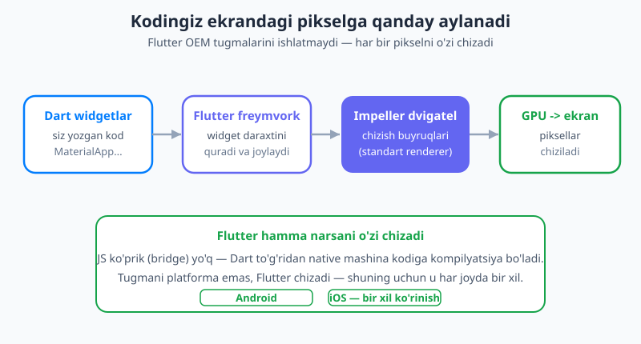
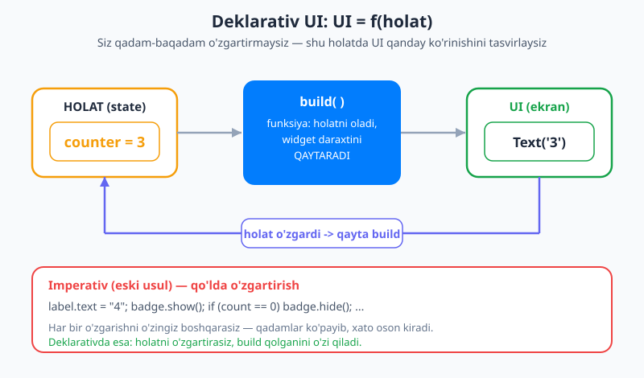
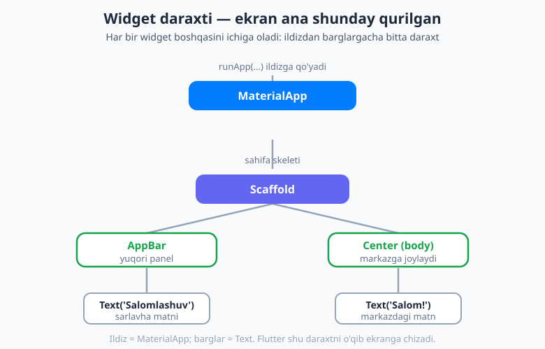

# 10 — Flutter bilan tanishuv

[⬅️ Oldingi: 09 — Asinxron Dart](./09-asinxron-dart.md) · [🏠 README](./README.md) · [Keyingi: 11 — Hamma narsa widget ➡️](./11-widgetlar-stateless.md)

---

> **Bu bobda:** mana, nihoyat — Dart tilini o'rgandingiz, endi **Flutter**ga qadam qo'yamiz. Bu kitobning birinchi Flutter bobi. Siz Flutter ichkarida qanday ishlashini (widget daraxti, Impeller dvigateli, GPU) tushunasiz; eng muhim aqliy o'zgarishni — **deklarativ UI** (`UI = f(holat)`) — o'zlashtirasiz; "hamma narsa widget" g'oyasini ko'rasiz; standart ilovaning `main.dart` faylini **satrma-satr** o'qiymiz (`runApp`, `MaterialApp`, `Scaffold`, `AppBar`, `Center`, `Text`); `build` metodi va `BuildContext` nima ekanini, `const` konstruktorlar nega muhimligini, **hot reload va hot restart** farqini bilib olasiz. Oxirida birgalikda chiroyli, mavzulangan (themed) birinchi ilovani quramiz.

---

## Dart'dan Flutter'ga: nima o'zgaradi?

Oldingi to'qqiz bobda siz Dart tilini o'rgandingiz: o'zgaruvchilar, funksiyalar, klasslar, null safety, `Future`/`Stream`. Bularning hammasi **konsolda** ishladi — `print(...)` orqali ekranga matn chiqardingiz, xolos.

Endi esa biz **ko'rinadigan**, barmoq bilan teginiladigan interfeyslar quramiz: tugmalar, ro'yxatlar, animatsiyalar. Lekin xotirjam bo'ling — siz yangi til o'rganmaysiz. Flutter ham o'sha Dart'da yoziladi. O'zgaradigan narsa — **fikrlash usuli**. Mana shu bob aynan shu o'zgarishga bag'ishlangan.

Avval bitta savolga javob beramiz: *nega Flutter umuman boshqa freymvorklardan farq qiladi?*

## Flutter ichkarida qanday ishlaydi?

Tasavvur qiling, siz rassomga "bu yerga ko'k kvadrat, uning ostiga 'Salom' yozuvi chiz" deb tasvirlaysiz. Rassom esa qo'liga cho'tka olib, har bir nuqtani **o'zi** bo'yaydi. Flutter aynan shunday ishlaydi.

Jarayon to'rt bosqichdan iborat:

1. **Siz widgetlar bilan UI'ni tasvirlaysiz.** "Yuqorida panel, markazda matn bo'lsin" deysiz — Dart kodida.
2. **Flutter freymvorki bu tasvirdan daraxt quradi.** Widgetlar bir-birining ichiga joylashgan ulkan oila daraxti — buni keyinroq batafsil ko'ramiz.
3. **Impeller dvigateli** (2026-yilda Flutter'ning **standart** renderer'i) bu daraxtni chizish buyruqlariga aylantiradi.
4. **GPU** (grafik protsessor) shu buyruqlar asosida ekranga **piksellarni** chizadi.



Eng muhim tushuncha shu: **Flutter har bir pikselni o'zi chizadi.** U telefonning tayyor (OEM) tugmalarini yoki matn maydonlarini olib ishlatmaydi — hamma narsani noldan o'zi rasm qiladi. Natijada ilovangiz Android'da ham, iOS'da ham **bir xil** ko'rinadi va bir xil his beradi, chunki ikkala holatda ham xuddi shu Flutter chizadi.

> 💡 **Ko'prik (bridge) yo'q.** Ba'zi boshqa freymvorklar (masalan ko'pgina "JavaScript" yondashuvlar) ekrandagi narsalarni boshqarish uchun JS bilan native platforma orasida har safar xabar uzatadigan **ko'prik** ishlatadi — bu sekinlik manbai bo'lishi mumkin. Flutter'da bunday ko'prik yo'q: Dart kodingiz to'g'ridan-to'g'ri **native mashina kodiga** kompilyatsiya qilinadi va Impeller bevosita GPU bilan ishlaydi. Shuning uchun Flutter "native tezlik" deyiladi.

Bu detallarni hozir yodlash shart emas. Bitta narsani eslab qoling: **siz UI'ni tasvirlaysiz, Flutter uni o'zi chizadi.**

## Deklarativ UI — eng muhim aqliy o'zgarish

Bu bobning eng muhim g'oyasi shu. Agar boshqa hamma narsani unutsangiz ham, buni eslab qoling.

Eski (imperativ) usulda dasturchi ekranni **qo'lda, qadam-baqadam** o'zgartirardi. Masalan, hisoblagich (counter) ilovasini tasavvur qiling. Tugma bosilganda eski usulda shunday yozardingiz:

```text
// Imperativ (eski) — "qanday qilib" o'zgartirishni aytasiz
hisob = hisob + 1;
yorliq.text = hisob.toString();   // ekrandagi matnni qo'lda yangilash
if (hisob > 0) tozalashTugmasi.korsat();
```

Muammo shundaki, **har bir o'zgarishni o'zingiz boshqarasiz**. Qaysidir joyda `yorliq.text`ni yangilashni unutsangiz — ekran eskirgan qiymatni ko'rsatib turaveradi. Ilova kattalashgan sari bunday "qo'lda yangilash" qadamlari ko'payib, xato kirib kelishi osonlashadi.

Flutter esa **deklarativ**. Siz "qanday o'zgartirish kerak"ni emas, balki **"shu holatda ekran qanday ko'rinishi kerak"**ni tasvirlaysiz. Buni mashhur formula bilan ifodalaydilar:

> **UI = f(holat)** — interfeys, holatning (state) funksiyasidir.

Ya'ni: sizda biror **holat** bor (masalan `counter = 3`). Siz bitta funksiya yozasiz — u shu holatni oladi va **shu holat uchun UI qanday ko'rinishini qaytaradi**. Holat o'zgarganda (`counter = 4` bo'lganda), Flutter o'sha funksiyani **qaytadan chaqiradi** va yangi UI'ni quradi. Siz ekranni qo'lda yangilamaysiz — faqat holatni o'zgartirasiz, qolganini Flutter qiladi.



```text
// Deklarativ (Flutter) — "nima ko'rinishi kerak"ni tasvirlaysiz
Text('$counter')   // counter qancha bo'lsa, shuni ko'rsat
// counter o'zgarsa — Flutter bu satrni qaytadan baholaydi
```

Bu Excel'ga o'xshaydi: `=A1+A2` formulasini bir marta yozasiz. `A1` o'zgarsa, natija **avtomatik** yangilanadi — siz har safar qaytadan hisoblamaysiz. Flutter'da `build` funksiyasi xuddi shunday formula.

> Holatni qanday saqlash va o'zgartirishni biz [16-bobda (StatefulWidget va setState)](./16-statefulwidget-setstate.md) chuqur o'rganamiz. Hozircha asosiy g'oyani — *holat o'zgaradi, UI qaytadan quriladi* — tushunsangiz kifoya.

## Hamma narsa — widget

Flutter falsafasining yuragi bitta jumla: **"hamma narsa — widget"**.

**Widget** — bu ekranning bir bo'lagini tasvirlaydigan kichik, qayta ishlatiladigan element. Lekin "widget" so'zini keng tushuning. Flutter'da:

- Matn — `Text` widget.
- Rasm — `Image` widget.
- Tugma — `ElevatedButton` widget.
- Markazga joylash — `Center` widget.
- Hatto **bo'sh joy** (padding), **tekislash** (alignment), **ustun/qator** ham — hammasi widget.

Ya'ni *ko'rinish* ham, *joylashuv (layout)* ham, *uslub (style)* ham — barchasi widget. Bu Lego'ga juda o'xshaydi: sizda turli shakldagi kichik bo'laklar bor va siz ularni **bir-birining ichiga joylashtirib** murakkab narsa quryapsiz.

Widgetlar bir-birining ichiga joylashganda **widget daraxti** (widget tree) hosil bo'ladi. Bitta ildiz widget bor, uning ichida bolalar (children), ularning ichida yana bolalar... — xuddi oila daraxti kabi. Flutter mana shu daraxtni o'qib ekranni chizadi.

> 💡 **Analogiya:** HTML bilgan bo'lsangiz — u yerda `<div>` ichida `<p>`, uning ichida `<span>` bo'lardi. Widget daraxti ham shunday joylashgan tuzilma, lekin teglar o'rniga Dart obyektlari (widgetlar) bor.

## Birinchi ilovaning anatomiyasi

Endi nazariyadan amaliyotga o'tamiz. Yangi Flutter loyihasi yaratganingizda (`flutter create salom_app`), Flutter sizga tayyor namuna beradi. Biz uni tozalab, o'zimizning sodda ilovamizni yozamiz va **har bir satrini** tushuntiramiz.

Mana to'liq `lib/main.dart` fayli:

```dart
import 'package:flutter/material.dart';

void main() => runApp(const MyApp());

class MyApp extends StatelessWidget {
  const MyApp({super.key});

  @override
  Widget build(BuildContext context) {
    return MaterialApp(
      title: 'Salom Flutter',
      theme: ThemeData(
        colorScheme: ColorScheme.fromSeed(seedColor: Colors.indigo),
      ),
      home: Scaffold(
        appBar: AppBar(
          title: const Text('Birinchi ilovam'),
        ),
        body: const Center(
          child: Text('Salom, Flutter!'),
        ),
      ),
    );
  }
}
```

Bu kod ishlaganda telefon ekranida yuqorida ko'k panel ("Birinchi ilovam" yozuvi bilan) va markazda "Salom, Flutter!" matni ko'rinadi. Endi bu fayl bir-bir nima qilishini ko'rib chiqamiz.

### `import` — Material kutubxonasi

```dart
import 'package:flutter/material.dart';
```

Bu satr **Material Design** widgetlarini (Google'ning dizayn tizimi) ilovangizga olib keladi: `MaterialApp`, `Scaffold`, `AppBar`, `Text`, `Colors` — bularning hammasi shu kutubxonadan. Deyarli har bir Flutter faylida birinchi satr aynan shu bo'ladi.

### `main()` va `runApp()`

```dart
void main() => runApp(const MyApp());
```

`main()` — Dart dasturining kirish nuqtasi ekanini 01-bobdan bilasiz. Flutter'da `main` ichida bitta vazifa bor: **`runApp(...)`** ni chaqirish. `runApp` o'ziga berilgan widgetni **ildiz** qilib oladi va uni butun ekranga joylashtiradi. Bu yerda biz `MyApp` degan o'z widgetimizni beryapmiz.

E'tibor bering — bu `=>` (arrow) sintaksisi, ya'ni `main()` shunchaki `runApp(const MyApp())` ni qaytaradi. `const` haqida pastda gaplashamiz.

### `MyApp` — birinchi widgetingiz

```dart
class MyApp extends StatelessWidget {
  const MyApp({super.key});
  ...
}
```

Mana, birinchi **o'z widgetingiz**. U `StatelessWidget`'dan meros oladi (`extends`) — bu "holatsiz", ya'ni vaqt o'tishi bilan o'zgarmaydigan widget degani. (Holatli `StatefulWidget`ni keyinroq ko'ramiz.)

- `const MyApp({super.key});` — bu **konstruktor**. `super.key` — har bir widgetga beriladigan ixtiyoriy "kalit"; Flutter undan widgetlarni daraxtda bir-biridan ajratishda foydalanadi. Hozircha shunchaki "har bir widget konstruktorida `super.key` bo'ladi" deb qabul qiling — sabablariga keyinroq qaytamiz.

### `build` metodi — UI'ni qaytaradigan funksiya

```dart
@override
Widget build(BuildContext context) {
  return MaterialApp( ... );
}
```

Bu — har bir widgetning **eng muhim** metodi. Esingizdami, deklarativ UI'da "holatni oladigan va UI qaytaradigan funksiya" haqida gapirdik? Mana **`build` aynan o'sha funksiya**. U bitta widget (aslida butun bir daraxt) **qaytaradi** — ana shu daraxt ekranga chiziladi.

Muhim qoidalar:

- `build`ni **siz chaqirmaysiz** — uni **Flutter** kerak bo'lganda (masalan holat o'zgarganda) o'zi chaqiradi.
- `build` **tez va "toza"** bo'lishi kerak: u faqat widget daraxtini qurishi lozim, og'ir hisob-kitob yoki fayl o'qish kabi ishlarni emas. Chunki u juda ko'p marta qayta chaqirilishi mumkin.

**`BuildContext context`** — bu argument widgetning daraxtdagi **o'rni** (manzili) haqida ma'lumot beradi: "men daraxtning qayerida turibman, ustimda qaysi widgetlar bor". Hozircha undan foydalanmaymiz, lekin u keyingi boblarda mavzu (theme), navigatsiya kabi narsalarga "yuqoriga qarab" murojaat qilishda kerak bo'ladi.

### `MaterialApp` — ilovaning qobig'i

```dart
return MaterialApp(
  title: 'Salom Flutter',
  theme: ThemeData(
    colorScheme: ColorScheme.fromSeed(seedColor: Colors.indigo),
  ),
  home: Scaffold( ... ),
);
```

`MaterialApp` — bu butun ilovani o'rab turuvchi **eng tashqi** widget. U juda ko'p narsani sozlaydi:

- **mavzu (theme)** — ranglar, shriftlar, umumiy ko'rinish;
- **navigatsiya (routing)** — ekranlar orasida o'tish (19-20 boblar);
- ilovaning umumiy nomi va sozlamalari.

`home:` — ilova ochilganda ko'rinadigan **birinchi ekran**. Bu yerda u `Scaffold`.

**Mavzu (theming):** `ColorScheme.fromSeed(seedColor: Colors.indigo)` — bitta "urug'" (seed) rangdan butun bir uyg'un rang palitrasini avtomatik yaratadi. Ya'ni siz faqat asosiy rangni (indigo — to'q ko'k) aytasiz, Flutter undan tugmalar, panellar, fon uchun mos ranglarni o'zi hisoblab chiqaradi.

> 💡 Bu **Material 3** dizayn tizimi — 2026-yilda Flutter'da **standart** (default). Eski darslardagi `useMaterial3: true` bayrog'ini yozish **shart emas** — u allaqachon yoqilgan. Mavzu, dark mode va tipografiyani kitobning keyingi qismida, Material 3 bobida chuqur ko'ramiz.

### `Scaffold` — sahifaning skeleti

```dart
home: Scaffold(
  appBar: AppBar( ... ),
  body: const Center( ... ),
),
```

`Scaffold` — bitta ekranning **skeleti** (asosiy karkasi). U Material dizayndagi sahifaning standart joylashuvini beradi va eng ko'p ishlatiladigan "uyalar" (slotlar)ga ega:

- `appBar:` — yuqoridagi panel (sarlavha, tugmalar);
- `body:` — sahifaning asosiy, katta o'rta qismi;
- `floatingActionButton:` — pastda-o'ngda turuvchi dumaloq tugma (masalan "+" qo'shish);
- yana `drawer`, `bottomNavigationBar` va boshqalar.

Siz faqat kerakli uyalarni to'ldirasiz, qolganini bo'sh qoldirasiz.

### `AppBar`, `Center`, `Text`

```dart
appBar: AppBar(
  title: const Text('Birinchi ilovam'),
),
body: const Center(
  child: Text('Salom, Flutter!'),
),
```

- **`AppBar`** — ekran yuqorisidagi panel. Uning `title:` uyasiga `Text` joylaymiz.
- **`Center`** — o'zining `child:` (bola) widgetini ota-ona maydonining **markaziga** joylaydigan layout widget. Bu yerda u "Salom, Flutter!" matnini ekran o'rtasiga olib chiqadi.
- **`Text`** — eng oddiy widget: ekranga matn chiqaradi.

E'tibor bering: `Center` faqat bitta `child:` oladi, `Scaffold` esa bir nechta nomli uya (`appBar`, `body`...) oladi. Qaysi widget nechta bola olishi — keyingi boblar mavzusi.

### Hammasini birlashtirsak — widget daraxti

Yuqoridagi kod aslida ana shunday joylashgan widget daraxtini quradi:



Ildizda `MaterialApp`, uning ichida `Scaffold`, undan ikki shox tarqaladi: `AppBar` (ichida `Text`) va `body` → `Center` → `Text`. Mana shu daraxtni Flutter o'qiydi va ekranga chizadi. Siz qachonki widgetlarni bir-birining ichiga yozsangiz, aslida **shu daraxtni qo'lda quryapsiz**.

## `const` konstruktorlar — nega muhim?

Yuqorida bir necha joyda `const` so'zini ko'rdingiz: `const MyApp()`, `const Center(...)`, `const Text('...')`. Nega?

`const Text('Salom, Flutter!')` — bu Flutter'ga: *"bu widget hech qachon o'zgarmaydi, uning qiymatlari kompilyatsiya vaqtida ma'lum"* deb aytadi. Natijada Flutter `build` har safar qayta chaqirilganda bu widgetni **qaytadan yaratmaydi** — bir marta yaratilgan nusxasini qayta ishlatadi.

Esingizda bo'lsin, `build` juda ko'p marta chaqiriladi (har holat o'zgarganda). Agar har safar barcha widgetlarni noldan yaratish kerak bo'lsa, bu bekorga ish bo'lardi. `const` aynan shu bekor ishni oldini oladi — bu **unumdorlik** (performance) uchun muhim.

> 💡 Qoida: **agar widget o'zgaruvchiga bog'liq bo'lmasa (qat'iy qiymatga ega bo'lsa), uni `const` qiling.** Masalan `const Text('Salom')` — `const` bo'ladi, lekin `Text('$ism')` (o'zgaruvchiga bog'liq) — `const` bo'lolmaydi. VS Code odatda buni o'zi taklif qiladi (lint).

## Hot reload va hot restart — dasturchining super-kuchi

Flutter'ni shunchalik yoqimli qiladigan narsalardan biri — siz kodni o'zgartirishingiz bilan natijani **bir soniyada** ko'rasiz. Buni `flutter run` ishlab turganda terminaldan boshqarasiz:

| Buyruq | Nomi | Nima qiladi |
|---|---|---|
| `r` | **Hot reload** | O'zgargan kodni darhol (bir soniyadan kam) ilovaga yuklaydi va UI'ni yangilaydi. **Holat saqlanib qoladi** — masalan hisoblagich qiymati yo'qolmaydi. |
| `R` | **Hot restart** | Ilovani noldan qayta ishga tushiradi. Tezroq (to'liq qayta o'rnatishdan), lekin **holat nolga qaytadi**. |

Ish jarayoni (dev loop) odatda shunday: ilovani `flutter run` bilan ishga tushirasiz → kodni o'zgartirasiz → saqlaysiz (yoki `r` bosasiz) → ekranda natijani ko'rasiz → yana o'zgartirasiz... Bu sikl shunchalik tez-ki, dizayn bilan **jonli tajriba qilib** o'rganasiz.

> 💡 **Qachon `r`, qachon `R`?** Ko'pincha `r` (hot reload) yetarli: rang, matn, joylashuvni o'zgartirsangiz. Lekin `main()` o'zgarsa yoki ilovani "boshidan" sinab ko'rmoqchi bo'lsangiz — `R` (hot restart) ishlating. Ba'zan hot reload o'zgarishni ko'rsatmasa, hot restart bilan urinib ko'ring.

## Birgalikda: chiroyliroq birinchi ilova

Endi o'rgangan hamma narsani birlashtirib, ozgina bezatilgan ilova quramiz: panel, markazda ikon va salomlashuv matni. Buni `lib/main.dart`ga yozing:

```dart
import 'package:flutter/material.dart';

void main() => runApp(const SalomApp());

class SalomApp extends StatelessWidget {
  const SalomApp({super.key});

  @override
  Widget build(BuildContext context) {
    return MaterialApp(
      title: 'Salom Flutter',
      theme: ThemeData(
        colorScheme: ColorScheme.fromSeed(seedColor: Colors.indigo),
      ),
      home: Scaffold(
        appBar: AppBar(
          title: const Text('Mening birinchi ilovam'),
        ),
        body: const Center(
          child: Column(
            mainAxisAlignment: MainAxisAlignment.center,
            children: [
              Icon(Icons.flutter_dash, size: 96),
              SizedBox(height: 16),
              Text(
                'Salom, Flutter dunyosi!',
                style: TextStyle(fontSize: 22, fontWeight: FontWeight.bold),
              ),
              SizedBox(height: 8),
              Text('Bu mening 0 dan qurgan birinchi ilovam.'),
            ],
          ),
        ),
      ),
    );
  }
}
```

Bu yerda yangi tanish-bilishlar:

- **`Column`** — bolalarini **ustun** qilib (yuqoridan pastga) joylaydi. `children:` — bir nechta bola ro'yxati.
- **`Icon(Icons.flutter_dash, size: 96)`** — tayyor ikonkalardan biri (Dash — Flutter maskoti). `Icons.` ichida minglab ikonka bor.
- **`SizedBox(height: 16)`** — shunchaki bo'sh joy (oraliq) qo'yadigan widget. Esingizdami — *bo'sh joy ham widget*.
- **`style: TextStyle(...)`** — matn ko'rinishini (o'lcham, qalinlik) sozlaydi.

`Column`, `Row` va layout'ni keyingi boblarda batafsil ko'ramiz — hozir shunchaki his qilib ko'ring. Ilovani ishga tushiring (`flutter run`), keyin matnni o'zgartiring va **`r` bosing** — natija darhol o'zgarganini ko'rasiz. Ikonni boshqasiga (`Icons.favorite`, `Icons.star`) almashtiring, `seedColor`ni `Colors.teal` yoki `Colors.deepOrange`ga o'zgartiring — butun ilova rangi qanday o'zgarishini kuzating. Mana shu — Flutter bilan o'rganishning eng yaxshi usuli: **tajriba qiling.**

## Keyingi qadam

Tabriklaymiz — siz birinchi Flutter ilovangizni qurdingiz va eng muhim g'oyani tushundingiz: **siz UI'ni deklarativ tarzda tasvirlaysiz, Flutter esa uni widget daraxti orqali chizadi.**

Keyingi [11-bobda](./11-widgetlar-stateless.md) "hamma narsa widget" g'oyasini chuqurlashtiramiz: `StatelessWidget`ni batafsil ko'rib, `Text`, `Icon`, `Image`, `Container` kabi asosiy ko'rinish widgetlari bilan tanishamiz. Holat (state) bilan ishlash — `setState` va o'zgaradigan UI — esa [16-bobda](./16-statefulwidget-setstate.md) keladi.

---

## Mashqlar

### Oson

1. O'z so'zlaringiz bilan "Flutter har bir pikselni o'zi chizadi" iborasi nimani anglatishini tushuntiring. Bu nega ilovani Android va iOS'da bir xil ko'rsatadi?
2. `UI = f(holat)` formulasini izohlang: bu yerda `f` nima, "holat" nima va natijada nima hosil bo'ladi?
3. Quyidagi widgetlarning har biri nima qilishini bir jumlada yozing: `MaterialApp`, `Scaffold`, `AppBar`, `Center`, `Text`.
4. Hot reload (`r`) va hot restart (`R`) farqi nimada? Qaysi biri holatni saqlaydi?
5. Nima uchun `const Text('Salom')` deb yozish yaxshi, lekin `const Text('$ism')` deb yozib bo'lmaydi?

### O'rta

6. Standart ilovaning widget daraxtini (`MaterialApp` → `Scaffold` → `AppBar`+`Text` va `body` → `Center` → `Text`) o'zingiz chizib chiqing yoki ro'yxat ko'rinishida yozing.
7. `build` metodi haqida uchta haqiqatni yozing: kim uni chaqiradi, u nima qaytaradi va nega u "tez" bo'lishi kerak.
8. To'liq, kompilyatsiya bo'ladigan `main.dart` yozing: u `AppBar`'da "Profil" sarlavhasini, `body`'da markazda "Tez orada..." matnini ko'rsatsin. `seedColor` sifatida `Colors.green` ishlating.

### Qiyin

9. Imperativ va deklarativ yondashuvni hisoblagich (counter) misolida solishtiring: imperativda tugma bosilganda nimalar qilinishi kerakligini va deklarativda buning o'rniga nima qilinishini tushuntiring (kod bo'lmasa ham bo'ladi, asosiy g'oyani aytib bering).
10. Bir o'quvchi: "`build` ichida har safar yangi `Text` obyekti yaratilsa, bu sekin emasmi?" deb so'rayapti. `const` konstruktorlar bu muammoni qanday hal qilishini tushuntiring.

<details markdown="1"><summary>Yechimlar</summary>

**1.** Flutter telefonning tayyor (OEM) tugma/matn elementlarini ishlatmaydi — o'rniga butun interfeysni Impeller dvigateli orqali GPU'da **o'zi** chizadi. Demak, tugmaning ko'rinishini platforma emas, Flutter belgilaydi. Shuning uchun bir xil kod Android'da ham, iOS'da ham aynan bir xil piksellarni chizadi — ko'rinish va xatti-harakat bir xil bo'ladi.

**2.** `f` — bu `build` funksiyasi (metodi). "Holat" — UI'ning hozirgi vaziyati (masalan `counter = 3`, kiritilgan matn, yuklanish holati). Natijada `f` shu holat uchun mos **widget daraxti** (UI) hosil qiladi. Holat o'zgarsa, `f` qaytadan chaqilib, yangi UI quriladi.

**3.**
- `MaterialApp` — butun ilovani o'rab, mavzu/navigatsiya/sozlamalarni boshqaradigan eng tashqi widget.
- `Scaffold` — bitta ekranning skeleti (`appBar`, `body`, `floatingActionButton` kabi uyalar bilan).
- `AppBar` — ekran yuqorisidagi panel (sarlavha, tugmalar).
- `Center` — bolasini ota maydonining markaziga joylaydi.
- `Text` — ekranga matn chiqaradi.

**4.** **Hot reload (`r`)** — o'zgargan kodni darhol yuklaydi va UI'ni yangilaydi, **holatni saqlab qoladi**. **Hot restart (`R`)** — ilovani noldan ishga tushiradi va **holatni nolga qaytaradi**. Holatni hot reload saqlaydi.

**5.** `const` widget kompilyatsiya vaqtida to'liq ma'lum bo'lgan, o'zgarmaydigan qiymatlardan tuzilgan bo'lishi kerak. `'Salom'` — qat'iy matn, shuning uchun `const` bo'ladi. `'$ism'` esa `ism` o'zgaruvchisiga bog'liq — uning qiymati ishlash vaqtida (runtime) aniqlanadi, kompilyatsiya vaqtida emas, shuning uchun `const` bo'lolmaydi.

**6.**
```text
MaterialApp
└── Scaffold
    ├── appBar: AppBar
    │   └── title: Text('Birinchi ilovam')
    └── body: Center
        └── child: Text('Salom, Flutter!')
```

**7.**
- Kim chaqiradi: **Flutter freymvorki** (siz emas) — kerak bo'lganda, masalan holat o'zgarganda.
- Nima qaytaradi: **widget** (aslida butun widget daraxti).
- Nega tez: u **ko'p marta** qayta chaqirilishi mumkin; agar `build` ichida og'ir ish (fayl o'qish, og'ir hisob) bo'lsa, ilova sekinlashadi. Shuning uchun `build` faqat daraxt qurishi kerak.

**8.**
```dart
import 'package:flutter/material.dart';

void main() => runApp(const ProfilApp());

class ProfilApp extends StatelessWidget {
  const ProfilApp({super.key});

  @override
  Widget build(BuildContext context) {
    return MaterialApp(
      title: 'Profil',
      theme: ThemeData(
        colorScheme: ColorScheme.fromSeed(seedColor: Colors.green),
      ),
      home: Scaffold(
        appBar: AppBar(
          title: const Text('Profil'),
        ),
        body: const Center(
          child: Text('Tez orada...'),
        ),
      ),
    );
  }
}
```

**9.** **Imperativ:** tugma bosilganda siz qo'lda bir nechta qadam bajarasiz — hisobni oshirasiz (`hisob++`), keyin ekrandagi matn widgetini topib uning qiymatini yangilaysiz (`yorliq.text = ...`), ehtimol boshqa elementlarni ko'rsatasiz/yashirasiz. Har bir o'zgarishni o'zingiz boshqarasiz, biror yangilashni unutsangiz UI eskirib qoladi. **Deklarativ (Flutter):** siz faqat **holatni** o'zgartirasiz (`hisob` ni oshirasiz) va Flutter'ga "qaytadan qur" deb signal berasiz. `build` shu yangi holat uchun butun UI'ni qaytadan tasvirlaydi — `Text('$hisob')` avtomatik yangi qiymatni ko'rsatadi. Siz ekranni qo'lda yangilamaysiz; "qanday" emas, "nima ko'rinishi kerak"ni tasvirlaysiz.

**10.** Ha, agar har `build` chaqiruvida widgetlar haqiqatan ham noldan yaratilsa, bu bekor ish bo'lardi. `const` konstruktor aynan shuni hal qiladi: `const Text('Salom')` kompilyatsiya vaqtida bir marta yaratiladi va Flutter uni qayta ishlatadi — `build` har safar chaqirilganda yangi nusxa yaratmaydi. Shuning uchun o'zgarmaydigan widgetlarni `const` qilish ilovani tezlashtiradi va keraksiz qayta qurishni kamaytiradi.

</details>

---

[⬅️ Oldingi: 09 — Asinxron Dart](./09-asinxron-dart.md) · [🏠 README](./README.md) · [Keyingi: 11 — Hamma narsa widget ➡️](./11-widgetlar-stateless.md)
