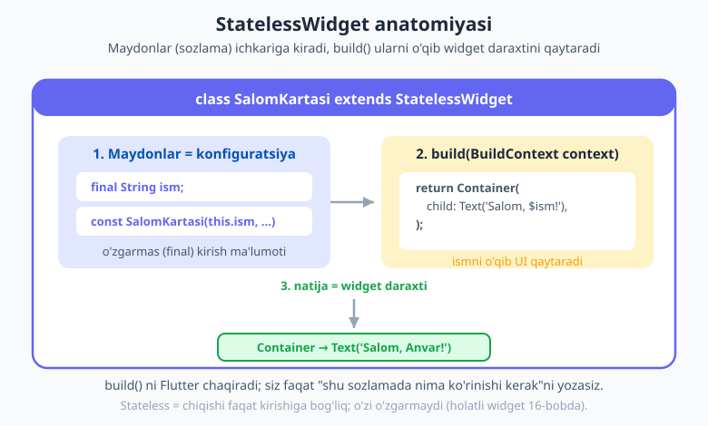
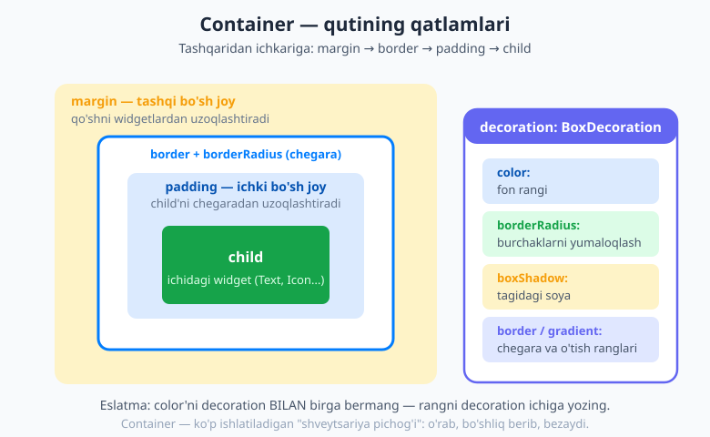
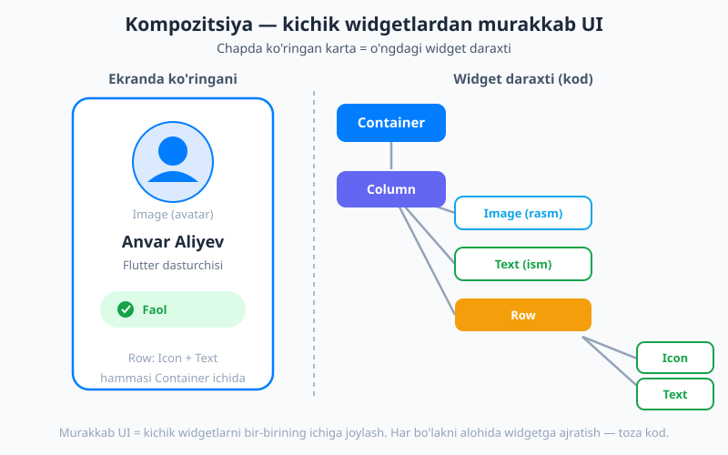

# 11 — Hamma narsa widget

[⬅️ Oldingi: 10 — Flutter bilan tanishuv](./10-flutter-kirish.md) · [🏠 README](./README.md) · [Keyingi: 12 — Layout I: Row, Column, Flex ➡️](./12-layout-row-column.md)

---

> **Bu bobda:** o'tgan bobda "hamma narsa widget" g'oyasini eshitdingiz. Endi uni **chuqur** o'rganamiz. Avval *nega* widget bunday ishlashini tushunamiz: widget — ekranning bir bo'lagining **o'zgarmas tavsifi**, va ular bir-birining ichiga joylashib **daraxt** hosil qiladi. Keyin o'zingizning **`StatelessWidget`**ingizni — `SalomKartasi`ni — noldan yozamiz: `build` metodi, `const` konstruktor, maydonlar (konfiguratsiya), `super.key`. So'ng eng ko'p ishlatiladigan ko'rinish widgetlarini birma-bir ko'ramiz: **`Text`** va `TextStyle`, **`Icon`**, **`Image`**, va Flutter'ning shveytsariya pichog'i — **`Container`** (uning `padding`/`margin`/`decoration` qatlamlari bilan). `SizedBox`, `Padding`, `Center` ham shu yerda. Oxirida hamma narsani birlashtirib, chiroyli **profil kartasini** quramiz va eng muhim ko'nikmani — **kompozitsiya** (kichik widgetlarni bir-birining ichiga joylash) — o'zlashtiramiz. Holat (state) bilan ishlash, ya'ni vaqt o'tishi bilan **o'zgaradigan** widgetlar, esa [16-bobda](./16-statefulwidget-setstate.md) keladi.

---

## Widget aslida nima?

O'tgan bobda widgetni "ekranning bir bo'lagini tasvirlaydigan element" deb atadik. Endi bitta nozik, lekin juda muhim narsani aytamiz:

> **Widget — bu ekranning emas, balki ekran *qanday ko'rinishi kerakligining* tavsifidir.**

Bu farqni tushunish Flutter'ni tushunishning kalitidir. Tasavvur qiling, siz uy quruvchiga **chizma** (loyiha) berasiz. Chizmaning o'zi uy emas — u shunchaki *uy qanday bo'lishi kerakligining qog'ozdagi tavsifi*. Quruvchi chizmaga qarab haqiqiy uyni quradi. Widget — ana shu **chizma**; haqiqiy "uy"ni (ekrandagi piksellarni) esa Flutter quradi.

Bundan ikkita muhim xulosa kelib chiqadi:

1. **Widget — o'zgarmas (immutable).** Chizmani chizib bo'lgach, uni o'chirmaysiz — yangi chizma chizasiz. Xuddi shunday, widget bir marta yaratilgach, uning ichidagi qiymatlar **o'zgarmaydi**. Agar ekran boshqacha ko'rinishi kerak bo'lsa, Flutter **yangi** widget yaratadi. Aynan shuning uchun widget maydonlari odatda `final` bo'ladi.
2. **Widget — arzon.** Widget shunchaki tavsif (oddiy Dart obyekti) bo'lgani uchun, uni yaratish va tashlab yuborish juda tez. Flutter sekundiga ko'p marta yangi widgetlar yaratadi — bu normal holat.

> 💡 **Eslatma — "o'zgarmas" deganda nima nazarda tutilyapti?** Widgetning *o'zi* o'zgarmaydi degani. Lekin ekran umuman o'zgarmaydi degani **emas**: holat o'zgarganda Flutter eski widgetni tashlab, **yangisini** quradi. Ya'ni o'zgarish — widgetni *tahrirlash* orqali emas, *almashtirish* orqali bo'ladi. Buni 16-bobda chuqur ko'ramiz.

## Widgetlar daraxtga birlashadi

Bitta widget kamdan-kam yolg'iz turadi. Odatda widgetlar bir-birining **ichiga** joylashadi: `Center`ning ichida `Text`, `Scaffold`ning ichida `AppBar` va `body`... Shunday qilib **widget daraxti** hosil bo'ladi — xuddi oila daraxti kabi: bitta ildiz, uning bolalari, ularning bolalari va hokazo.

Bu daraxtni siz **kodingiz tuzilishi** orqali quryapsiz. Qachonki bitta widgetni boshqasining `child:` yoki `children:` qismiga yozsangiz, aslida daraxtga shox qo'shyapsiz:

```dart
Center(                    // ildiz (bu bo'lakda)
  child: Container(        // uning bolasi
    child: Text('Salom'),  // uning bolasi (barg)
  ),
)
```

Bu daraxt — `Center → Container → Text`. Flutter mana shu tuzilmani o'qiydi va ekranga chizadi. Sizning vazifangiz — to'g'ri daraxtni tasvirlash, qolganini Flutter qiladi.

## StatelessWidget — o'zgarmas ko'rinish

Widgetlar ikki katta turga bo'linadi:

- **`StatelessWidget`** (holatsiz) — ko'rinishi faqat **kirish ma'lumotiga** (konfiguratsiyasiga) bog'liq, vaqt o'tishi bilan o'zi **o'zgarmaydi**. Masalan, "Salom, Anvar!" deb yozadigan karta — agar ism o'zgarmasa, karta ham o'zgarmaydi.
- **`StatefulWidget`** (holatli) — ichida **o'zgaradigan holat** bor; foydalanuvchi tugma bossa yoki ma'lumot kelsa, u **o'zini yangilab** turadi. Masalan, hisoblagich yoki "yoqtirish" tugmasi.

Bu bobda biz faqat **birinchisi** — `StatelessWidget` bilan ishlaymiz. Bu eng oddiy va eng ko'p ishlatiladigan tur. Holatli widgetlarni keyingiroq, [16-bobda](./16-statefulwidget-setstate.md), shoshilmasdan o'rganamiz.

`StatelessWidget`ni shunday tasavvur qiling: u **funksiya kabi** ishlaydi. Unga kirish (ism, rang, matn) berasiz, u sizga UI (widget daraxti) qaytaradi. Bir xil kirish — har doim bir xil chiqish. Hech qanday "yashirin" o'zgaruvchi yo'q.

## Birinchi o'z widgetingiz: `SalomKartasi`

Endi nazariyani amalda ko'ramiz. O'zimizning `StatelessWidget`imizni yozamiz — u `ism` qabul qilib, salomlashuvchi karta ko'rsatadi:

```dart
import 'package:flutter/material.dart';

class SalomKartasi extends StatelessWidget {
  final String ism; // maydon = konfiguratsiya (o'zgarmas kirish)

  const SalomKartasi({super.key, required this.ism});

  @override
  Widget build(BuildContext context) {
    return Container(
      padding: const EdgeInsets.all(16),
      child: Text('Salom, $ism!'),
    );
  }
}
```

Har bir qatorni tushunamiz — bu naqshni Flutter'da minglab marta yozasiz:

- **`class SalomKartasi extends StatelessWidget`** — `StatelessWidget`dan meros olib (07-bobdagi `extends` esingizdami?), o'z widgetimizni e'lon qilyapmiz.
- **`final String ism;`** — bu **maydon** (field). U widgetning **konfiguratsiyasi** — tashqaridan beriladigan kirish ma'lumoti. `final` bo'lgani muhim: widget o'zgarmas, demak maydonlari ham o'zgarmaydi.
- **`const SalomKartasi({super.key, required this.ism});`** — **konstruktor**.
  - `const` — bu widget o'zgarmas qiymatlardan tuzilishi mumkinligini bildiradi (10-bobda nega muhimligini ko'rgandik: Flutter uni qayta ishlatadi, tezroq bo'ladi).
  - `{super.key, required this.ism}` — jingalak qavs ichidagi **nomli parametrlar** (04-bob). `super.key` — har bir widgetga beriladigan ixtiyoriy kalit (Flutter undan daraxtdagi widgetlarni ajratishda foydalanadi — hozircha shunchaki yozib qo'ying). `required this.ism` — `ism`ni majburiy qiladi va uni `ism` maydoniga joylaydi (07-bobdagi `this.x` qisqa shakli).
- **`Widget build(BuildContext context)`** — bu **eng muhim metod**. U widget daraxtini **qaytaradi**. Bu yerda u `Container` ichida `Text` qaytaryapti. `ism` maydonini `'Salom, $ism!'` ichida ishlatyapmiz.



Endi bu widgetni ishlatamiz — uni boshqa widget ichiga oddiygina yozamiz:

```dart
const SalomKartasi(ism: 'Anvar')   // Salom, Anvar!
const SalomKartasi(ism: 'Laylo')   // Salom, Laylo!
```

Bir marta yozdik, **istalgancha** ishlatamiz — har safar boshqa `ism` bilan. Mana shu — widgetni **qayta ishlatish** (reuse)ning go'zalligi.

> 💡 **Nega o'z widgetimni yozaman, hammasini bitta katta `build` ichiga yozsam bo'lmaydimi?** Texnik jihatdan bo'ladi. Lekin ilova kattalashganda bitta `build` metodi yuzlab qatordan iborat, o'qib bo'lmaydigan "dev"ga aylanadi. Takrorlanadigan yoki mantiqan bir butun bo'lgan bo'laklarni **alohida widgetga ajratish** — kodni toza, qayta ishlatiladigan va tushunarli qiladi. Buni bob oxirida amalda ko'ramiz.

## `Text` va `TextStyle` — matnni ko'rsatish va bezash

Eng oddiy va eng ko'p ishlatiladigan widget — `Text`. U ekranga matn chiqaradi:

```dart
Text('Salom, dunyo!')
```

Lekin matnning **ko'rinishini** (o'lcham, rang, qalinlik) sozlash uchun unga `style:` parametrida `TextStyle` beramiz:

```dart
Text(
  'Sarlavha',
  style: TextStyle(
    fontSize: 24,                  // shrift o'lchami
    fontWeight: FontWeight.bold,   // qalinlik
    color: Color(0xFF027DFD),      // rang
    letterSpacing: 0.5,            // harflar orasidagi masofa
    fontStyle: FontStyle.italic,   // qiya (kursiv)
  ),
)
```

- **`fontSize`** — shrift o'lchami (mantiqiy piksellarda).
- **`fontWeight`** — qalinlik: `FontWeight.normal`, `FontWeight.bold`, yoki aniq `FontWeight.w300` ... `w900`.
- **`color`** — matn rangi. Tayyor ranglar (`Colors.red`, `Colors.blue`) yoki o'zingizniki (`Color(0xFF027DFD)` — `0xFF` to'liq shaffof emaslik, qolgani RRGGBB).
- **`fontStyle`**, **`letterSpacing`**, **`height`** (qatorlar orasidagi masofa) va boshqalar.

Uzun matn ekranga sig'masa nima bo'ladi? Buni `maxLines` va `overflow` boshqaradi:

```dart
Text(
  'Bu juda uzun matn bo\'lib, ekranga to\'liq sig\'masligi mumkin...',
  maxLines: 2,                       // ko'pi bilan 2 qator
  overflow: TextOverflow.ellipsis,   // ortig'ini "..." bilan kesadi
  textAlign: TextAlign.center,       // matnni markazga tekislaydi
)
```

- **`maxLines`** — matn nechta qatorgacha cho'zilishi mumkinligi.
- **`overflow`** — sig'magan qism bilan nima qilish: `TextOverflow.ellipsis` (oxiriga `...` qo'yadi), `.clip` (shartta kesadi), `.fade` (asta yo'qoladi).
- **`textAlign`** — matnni tekislash: `.left`, `.center`, `.right`, `.justify`.

> 💡 **Mavzulangan (themed) matn.** Har safar `fontSize`, `color`ni qo'lda yozish o'rniga, ilovaning umumiy mavzusidan tayyor matn uslublarini olishingiz mumkin: `Theme.of(context).textTheme.titleLarge`, `.bodyMedium` va hokazo. Bu butun ilova bo'ylab matnni bir xil va izchil qiladi. Mavzular va `Theme.of(context)` haqida kitobning keyingi qismida — Material 3 bobida — batafsil gaplashamiz. Hozircha `TextStyle`ni qo'lda yozish yetarli.

## `Icon` — tayyor belgilar

`Icon` widget ekranga **belgi** (piktogramma) chiqaradi: yurakcha, yulduzcha, sozlama g'ildiragi va minglab boshqalar. Material kutubxonasida tayyor ikonkalar `Icons.` ichida turadi:

```dart
Icon(
  Icons.favorite,        // qaysi ikonka
  color: Colors.red,     // rangi
  size: 32,              // o'lchami
)
```

- **`Icons.favorite`**, **`Icons.star`**, **`Icons.home`**, **`Icons.settings`**, **`Icons.search`** — `Icons.` dan keyin yozishni boshlasangiz, muharrir (VS Code) qolganini taklif qiladi. Minglab ikonka bor.
- **`color`** va **`size`** — rang va o'lcham (`fontSize` kabi mantiqiy piksellarda).

Ikonkalar tugmalar, ro'yxat elementlari, holat ko'rsatkichlari (masalan "tasdiqlangan" uchun `Icons.check_circle`) uchun juda ko'p ishlatiladi.

## `Image` — rasm ko'rsatish

Rasmni ekranga chiqarish uchun `Image` widget bor. Rasm qayerdan kelishiga qarab ikkita asosiy usul mavjud.

**Internetdan (`Image.network`):**

```dart
Image.network(
  'https://example.com/rasm.jpg',
  width: 120,
  height: 120,
  fit: BoxFit.cover,
)
```

**Ilova ichidagi fayldan (`Image.asset`):**

```dart
Image.asset('assets/avatar.png', width: 120, height: 120)
```

`Image.asset` ishlashi uchun rasmni avval **`pubspec.yaml`**da ro'yxatdan o'tkazish kerak (paketlarni ro'yxatdan o'tkazganday). Aks holda Flutter rasmni topolmaydi:

```yaml
flutter:
  assets:
    - assets/avatar.png
```

Foydali parametrlar:

- **`fit: BoxFit.cover`** — rasm berilgan maydonni **to'liq qoplaydi** (kerak bo'lsa chetlarini kesib). Boshqa variantlar: `BoxFit.contain` (to'liq sig'diradi, bo'sh joy qolishi mumkin), `BoxFit.fill` (cho'zib to'ldiradi — nisbat buzilishi mumkin).
- **`width` / `height`** — rasm o'lchami.
- **`errorBuilder`** — rasm yuklanmasa (masalan internet uzilsa) nima ko'rsatish:

```dart
Image.network(
  url,
  errorBuilder: (context, error, stackTrace) =>
      const Icon(Icons.broken_image, size: 48),
)
```

- **`loadingBuilder`** — rasm internetdan yuklanayotganda (masalan aylanuvchi indikator) nima ko'rsatish. Tarmoq rasmlari uchun foydali.

> 💡 Hozir `errorBuilder`/`loadingBuilder`ning to'liq sintaksisini yodlash shart emas. Asosiysini eslab qoling: **internetdan kelgan rasm yuklanmasligi yoki sekin kelishi mumkin**, va `Image.network` sizga bu holatlarni chiroyli boshqarish imkonini beradi.

## `Container` — shveytsariya pichog'i

`Container` — Flutter'da eng ko'p ishlatiladigan widgetlardan biri. U **ko'p maqsadli quti**: bitta bolasini (`child`) o'rab oladi va unga bo'shliq, fon, chegara, soya — istalganini qo'sha oladi. Aynan shuning uchun uni "shveytsariya pichog'i" deyishadi.

`Container`ni tushunish uchun uning **qatlamlarini** bilish kerak. Tashqaridan ichkariga: **margin → border → padding → child**:



```dart
Container(
  margin: const EdgeInsets.all(12),   // tashqi bo'sh joy (qo'shnilardan uzoq)
  padding: const EdgeInsets.all(16),  // ichki bo'sh joy (child'ni chetdan uzoq)
  width: 200,
  height: 80,
  alignment: Alignment.center,        // child'ni ichida qayerga joylash
  color: Colors.blue,                 // oddiy fon rangi
  child: const Text('Ichidagi matn'),
)
```

### `padding` va `margin` — `EdgeInsets`

`padding` (ichki bo'shliq) va `margin` (tashqi bo'shliq) qiymatlari `EdgeInsets` orqali beriladi. Uning bir necha qulay shakli bor:

```dart
EdgeInsets.all(16)                          // har to'rt tomondan 16
EdgeInsets.symmetric(horizontal: 24, vertical: 8) // chap/o'ng 24, yuqori/past 8
EdgeInsets.only(left: 16, top: 8)           // faqat tanlangan tomonlardan
```

- **`padding`** — quti chegarasi bilan ichidagi `child` orasidagi bo'shliq.
- **`margin`** — quti chegarasi bilan **tashqaridagi** qo'shni widgetlar orasidagi bo'shliq.

Buni "matnni qutiga joylash" deb tasavvur qiling: `padding` — matn bilan qutining ichki devori orasidagi bo'shliq; `margin` — quti bilan boshqa qutilar orasidagi bo'shliq.

### `color` vs `decoration` — muhim qoida

Oddiy fon rangi kerak bo'lsa, `color:` yetarli. Lekin yumaloq burchaklar, chegara, soya yoki gradient kerak bo'lsa — **`decoration: BoxDecoration(...)`** ishlatasiz:

```dart
Container(
  padding: const EdgeInsets.all(20),
  decoration: BoxDecoration(
    color: Colors.white,                          // fon rangi (decoration ichida!)
    borderRadius: BorderRadius.circular(16),      // yumaloq burchaklar
    border: Border.all(color: Colors.blue, width: 2), // chegara
    boxShadow: [
      BoxShadow(
        color: Colors.black.withValues(alpha: 0.1), // yengil soya
        blurRadius: 12,
        offset: const Offset(0, 4),
      ),
    ],
  ),
  child: const Text('Bezatilgan quti'),
)
```

> ⚠️ **Diqqat — ko'p uchraydigan xato!** `color:` va `decoration:` ni **bir vaqtda bermang** — Flutter xato beradi. Sababi oddiy: rang allaqachon `decoration` ichida (`BoxDecoration(color: ...)`) belgilanadi. Demak, `decoration` ishlatsangiz, rangni ham uning **ichiga** yozing, tashqaridagi `color:`ni emas.

`BoxDecoration`ning asosiy imkoniyatlari: `color` (fon), `borderRadius` (yumaloq burchak), `border` (chegara), `boxShadow` (soya), `gradient` (rang o'tishi). Ular bilan oddiy `Container`dan chiroyli karta yasash mumkin.

## `SizedBox`, `Padding`, `Center` — kichik, lekin kerakli

Bu uchta kichik widget juda tez-tez ishlatiladi.

**`SizedBox`** — aniq o'lchamli quti, yoki ko'pincha shunchaki **bo'sh joy** (oraliq) qo'yish uchun:

```dart
SizedBox(height: 16)         // 16 piksel balandlikdagi vertikal oraliq
SizedBox(width: 8)           // 8 piksel kenglikdagi gorizontal oraliq
SizedBox(width: 100, height: 100, child: ...) // aniq o'lchamli quti
```

Esingizdami — *bo'sh joy ham widget*. `Column` yoki `Row` ichida elementlar orasiga oraliq qo'yish uchun `SizedBox`dan ko'p foydalanasiz.

**`Padding`** — faqat bolasiga bo'shliq qo'shadi (boshqa hech narsa qilmaydi):

```dart
Padding(
  padding: const EdgeInsets.all(16),
  child: const Text('Atrofida bo\'shliq'),
)
```

> 💡 **`Padding` vs `Container` padding'i.** Ikkalasi ham bo'shliq qo'shadi. Agar sizga **faqat** bo'shliq kerak bo'lsa (rang, chegara, o'lcham kerak emas) — sodda `Padding` ishlating, u "niyatingizni" aniqroq ko'rsatadi. Rang/chegara ham kerak bo'lsa — `Container` qulayroq, chunki hammasi bitta joyda.

**`Center`** — bolasini ota maydonining **markaziga** joylaydi (10-bobda ko'rgandingiz):

```dart
Center(child: const Text('O\'rtada'))
```

## Kompozitsiya — kichik bo'laklardan murakkab UI

Endi eng muhim ko'nikmaga keldik. Flutter'da murakkab interfeysni **bitta ulkan widget** bilan emas, balki **ko'plab kichik widgetlarni bir-birining ichiga joylash** bilan quriladi. Buni **kompozitsiya** (composition) deyiladi — Lego'dagidek, kichik bo'laklardan katta narsa yig'asiz.

Keling, hamma o'rgangan narsani birlashtirib, **profil kartasini** quramiz: `Container` (quti) ichida `Column` (ustun), uning ichida rasm, ism, lavozim va pastda "Faol" belgisi (`Icon` + `Text`):

```dart
import 'package:flutter/material.dart';

class ProfilKartasi extends StatelessWidget {
  final String ism;
  final String lavozim;
  final String rasmUrl;

  const ProfilKartasi({
    super.key,
    required this.ism,
    required this.lavozim,
    required this.rasmUrl,
  });

  @override
  Widget build(BuildContext context) {
    return Container(
      width: 240,
      padding: const EdgeInsets.all(20),
      decoration: BoxDecoration(
        color: Colors.white,
        borderRadius: BorderRadius.circular(20),
        boxShadow: [
          BoxShadow(
            color: Colors.black.withValues(alpha: 0.08),
            blurRadius: 16,
            offset: const Offset(0, 6),
          ),
        ],
      ),
      child: Column(
        mainAxisSize: MainAxisSize.min,
        children: [
          // 1. Yumaloq avatar (rasm)
          ClipOval(
            child: Image.network(
              rasmUrl,
              width: 88,
              height: 88,
              fit: BoxFit.cover,
              errorBuilder: (context, error, stack) =>
                  const Icon(Icons.person, size: 88),
            ),
          ),
          const SizedBox(height: 12),

          // 2. Ism
          Text(
            ism,
            style: const TextStyle(fontSize: 18, fontWeight: FontWeight.bold),
          ),
          const SizedBox(height: 4),

          // 3. Lavozim
          Text(
            lavozim,
            style: const TextStyle(fontSize: 13, color: Colors.grey),
          ),
          const SizedBox(height: 16),

          // 4. "Faol" belgisi — Row ichida Icon + Text
          Row(
            mainAxisSize: MainAxisSize.min,
            children: const [
              Icon(Icons.check_circle, color: Colors.green, size: 18),
              SizedBox(width: 6),
              Text('Faol', style: TextStyle(color: Colors.green)),
            ],
          ),
        ],
      ),
    );
  }
}
```

Ishlatish:

```dart
const ProfilKartasi(
  ism: 'Anvar Aliyev',
  lavozim: 'Flutter dasturchisi',
  rasmUrl: 'https://example.com/anvar.jpg',
)
```

Bu karta aslida shunday widget daraxtini quradi — chap tomonda ekranda ko'ringani, o'ng tomonda kod tuzilishi:



Diqqat qiling — bizda yangi tanishlar bor:

- **`Column`** — bolalarini ustun qilib (yuqoridan pastga) joylaydi; **`Row`** — qator qilib (chapdan o'ngga). Bularni keyingi [12-bobda](./12-layout-row-column.md) batafsil o'rganamiz. `mainAxisSize: MainAxisSize.min` — ustun/qator faqat bolalariga yetadigancha joy egallashini bildiradi.
- **`ClipOval`** — bolasini (rasmni) **doira** shaklida kesadi — yumaloq avatar shunday yasaladi.
- Elementlar orasidagi **`SizedBox`**lar — vertikal oraliqlar.

Mana shu — kompozitsiya: rasm, matn, ikonka kabi **kichik, oddiy** widgetlardan, ularni `Container` va `Column`/`Row` ichiga joylab, butun bir **chiroyli karta** qurdik. Hech bir widget murakkab emas — murakkablik ularning **birikishidan** tug'iladi.

> 💡 **Yaxshi odat — widgetlarni ajrating.** Yuqorida butun kartani bitta `ProfilKartasi` widgetiga ajratdik. Endi uni istalgan joyda, istalgan ma'lumot bilan qayta ishlatishimiz mumkin. Agar karta yana ham murakkablashsa, masalan "Faol" belgisini ham alohida `HolatBelgisi` widgetiga ajratish mumkin edi. **Qoida:** `build` metodingiz juda uzayib ketsa yoki bir bo'lak takrorlanayotgan bo'lsa — uni alohida widgetga ajrating. Bu kodni o'qish va saqlashni osonlashtiradi.

## Keyingi qadam

Tabriklaymiz — endi siz Flutter'ning yuragini tushunasiz: **widget — ekranning o'zgarmas tavsifi**, ular **daraxtga** birlashadi, va siz o'z `StatelessWidget`laringizni yozib, ularni **kompozitsiya** orqali murakkab UI'ga yig'asiz. `Text`, `Icon`, `Image`, `Container`, `SizedBox`, `Padding`, `Center` — eng ko'p ishlatiladigan ko'rinish widgetlari endi qo'lingizda.

Lekin bir narsani sezgan bo'lsangiz kerak: `Column` va `Row`ni shunchaki "his qildik", chuqur tushunmadik. Keyingi [12-bobda](./12-layout-row-column.md) aynan **joylashuv (layout)** — `Row`, `Column`, `Flex`, ularning tekislash (alignment) va cho'zilish (`Expanded`) qoidalari — bilan jiddiy shug'ullanamiz. So'ngra, vaqt o'tishi bilan **o'zgaradigan** widgetlar — holat (state), `setState` — [16-bobda](./16-statefulwidget-setstate.md) keladi.

---

## Mashqlar

> Har bir mashqni o'zingiz yozib, `flutter run` bilan ishga tushirib ko'ring. Avval yechimsiz urinib ko'ring, keyin `<details>` ichidagi yechimga qarang.

### Oson

1. O'z so'zlaringiz bilan tushuntiring: "widget — o'zgarmas tavsif" iborasi nimani anglatadi? Chizma va uy o'xshatishini ishlating.
2. `StatelessWidget` va `StatefulWidget` farqi nimada? Qaysi biri "vaqt o'tishi bilan o'zini yangilab turadi"?
3. `Container`da `padding` va `margin` farqini bir jumlada tushuntiring.
4. Nima uchun `Container`ga `color:` va `decoration:` ni bir vaqtda berish xato? To'g'ri usul qanday?

### O'rta

5. `TashrifQogozi` nomli `StatelessWidget` yozing: u `ism` va `kasb` (ikkala `String`) qabul qilsin. `build`da `Container` ichida `Column` qaytarsin: yuqorida `ism` (katta, qalin matn), pastida `kasb` (kichikroq, kulrang matn). `const` konstruktor va `super.key`ni unutmang.
6. Bezatilgan `Container` yozing: oq fon, 12 radiusli yumaloq burchaklar, ko'k chegara (width 2) va yengil soya. Ichida `EdgeInsets.all(16)` padding bilan "Salom" matni bo'lsin.
7. Bitta `Row` yarating: ichida `Icon(Icons.star, color: Colors.amber)`, keyin 8 piksel oraliq (`SizedBox`), keyin `Text('4.8 reyting')` bo'lsin.

### Qiyin

8. 5-mashqdagi `TashrifQogozi`ni kengaytiring: pastiga `Icon` + `Text` dan iborat "aloqa qatori" qo'shing (masalan `Icons.email` + email manzili). Bu qatorni **alohida** `StatelessWidget`ga (`AloqaQatori`, parametrlari: `ikonka` va `matn`) ajrating va uni `TashrifQogozi` ichida ishlating. Nima uchun bunday ajratish foydali ekanini bir jumlada izohlang.

<details markdown="1"><summary>Yechimlar</summary>

**1.** Widget ekranning o'zi emas — u ekran qanday ko'rinishi kerakligining **tavsifi** (xuddi uy chizmasi uydan farq qilganidek). Chizma — qog'ozdagi reja; haqiqiy uyni quruvchi quradi. Xuddi shunday, widget — Dart kodidagi tavsif; haqiqiy piksellarni Flutter chizadi. "O'zgarmas" degani: widgetni yaratgandan keyin uning qiymatlari o'zgarmaydi — ekran boshqacha bo'lishi kerak bo'lsa, Flutter eski widgetni tashlab yangisini quradi.

**2.** `StatelessWidget` — ko'rinishi faqat kirish (konfiguratsiya)ga bog'liq, vaqt o'tishi bilan o'zi o'zgarmaydi. `StatefulWidget` — ichida o'zgaradigan holat bor, foydalanuvchi harakati yoki yangi ma'lumot kelganda o'zini yangilab turadi. Vaqt o'tishi bilan o'zini yangilab turadigani — `StatefulWidget`.

**3.** `padding` — quti chegarasi bilan ichidagi `child` orasidagi **ichki** bo'shliq; `margin` — quti bilan **tashqaridagi** qo'shni widgetlar orasidagi bo'shliq.

**4.** Chunki fon rangi `decoration` (`BoxDecoration`) ichida ham belgilanadi — `color:`ni alohida berish ikki joyda ziddiyatga olib keladi, shuning uchun Flutter xato beradi. To'g'ri usul: `decoration` ishlatsangiz, rangni uning ichiga yozing — `decoration: BoxDecoration(color: Colors.white, ...)`.

**5.**
```dart
import 'package:flutter/material.dart';

class TashrifQogozi extends StatelessWidget {
  final String ism;
  final String kasb;

  const TashrifQogozi({super.key, required this.ism, required this.kasb});

  @override
  Widget build(BuildContext context) {
    return Container(
      padding: const EdgeInsets.all(16),
      child: Column(
        crossAxisAlignment: CrossAxisAlignment.start,
        mainAxisSize: MainAxisSize.min,
        children: [
          Text(
            ism,
            style: const TextStyle(fontSize: 20, fontWeight: FontWeight.bold),
          ),
          const SizedBox(height: 4),
          Text(
            kasb,
            style: const TextStyle(fontSize: 14, color: Colors.grey),
          ),
        ],
      ),
    );
  }
}
```

**6.**
```dart
Container(
  padding: const EdgeInsets.all(16),
  decoration: BoxDecoration(
    color: Colors.white,
    borderRadius: BorderRadius.circular(12),
    border: Border.all(color: Colors.blue, width: 2),
    boxShadow: [
      BoxShadow(
        color: Colors.black.withValues(alpha: 0.1),
        blurRadius: 8,
        offset: const Offset(0, 3),
      ),
    ],
  ),
  child: const Text('Salom'),
)
```

**7.**
```dart
Row(
  mainAxisSize: MainAxisSize.min,
  children: const [
    Icon(Icons.star, color: Colors.amber),
    SizedBox(width: 8),
    Text('4.8 reyting'),
  ],
)
```

**8.**
```dart
import 'package:flutter/material.dart';

// alohida ajratilgan, qayta ishlatiladigan widget
class AloqaQatori extends StatelessWidget {
  final IconData ikonka;
  final String matn;

  const AloqaQatori({super.key, required this.ikonka, required this.matn});

  @override
  Widget build(BuildContext context) {
    return Row(
      mainAxisSize: MainAxisSize.min,
      children: [
        Icon(ikonka, size: 16, color: Colors.blue),
        const SizedBox(width: 6),
        Text(matn),
      ],
    );
  }
}

class TashrifQogozi extends StatelessWidget {
  final String ism;
  final String kasb;
  final String email;

  const TashrifQogozi({
    super.key,
    required this.ism,
    required this.kasb,
    required this.email,
  });

  @override
  Widget build(BuildContext context) {
    return Container(
      padding: const EdgeInsets.all(16),
      child: Column(
        crossAxisAlignment: CrossAxisAlignment.start,
        mainAxisSize: MainAxisSize.min,
        children: [
          Text(
            ism,
            style: const TextStyle(fontSize: 20, fontWeight: FontWeight.bold),
          ),
          const SizedBox(height: 4),
          Text(kasb, style: const TextStyle(fontSize: 14, color: Colors.grey)),
          const SizedBox(height: 12),
          AloqaQatori(ikonka: Icons.email, matn: email), // ajratilgan widget
        ],
      ),
    );
  }
}
```

*Nima uchun foydali:* "aloqa qatori" mantiqan bir butun (ikonka + matn) — uni alohida widgetga ajratsak, kodni qayta ishlatishimiz (masalan telefon raqami uchun ham `AloqaQatori(ikonka: Icons.phone, ...)`), `build` metodini qisqa va o'qilishli saqlashimiz mumkin.

</details>

---

[⬅️ Oldingi: 10 — Flutter bilan tanishuv](./10-flutter-kirish.md) · [🏠 README](./README.md) · [Keyingi: 12 — Layout I: Row, Column, Flex ➡️](./12-layout-row-column.md)
