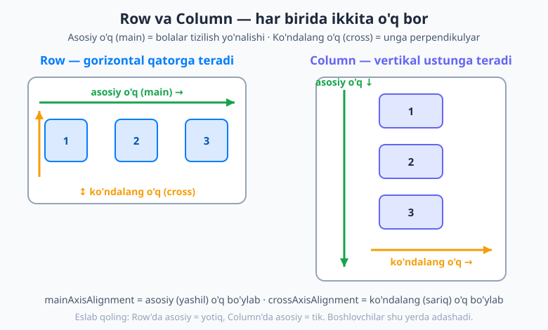
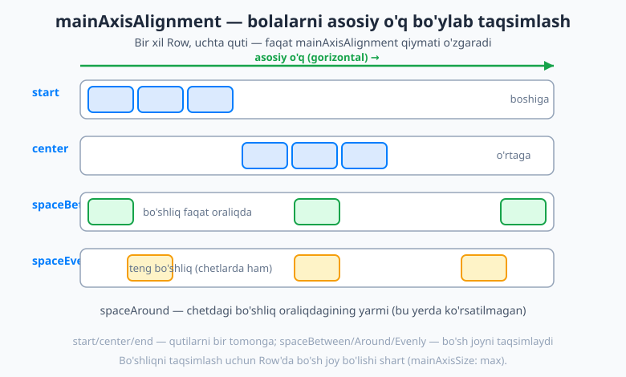
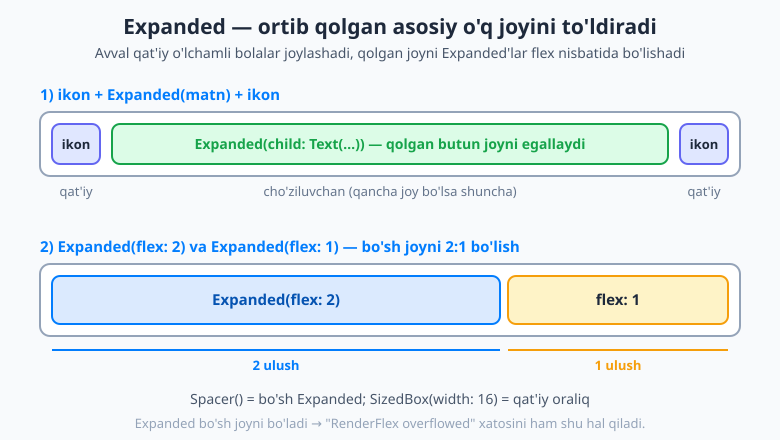

# 12 — Layout I: Row, Column, Flex

[⬅️ Oldingi: 11 — Hamma narsa widget](./11-widgetlar-stateless.md) · [🏠 README](./README.md) · [Keyingi: 13 — Layout II: Stack va Constraints ➡️](./13-layout-stack-constraints.md)

---

> **Bu bobda:** nihoyat eng ko'p ishlatiladigan ko'nikmaga yetib keldik — **joylashuv (layout)**. Bolalar widgetlarni yonma-yon yoki ustma-ust qanday terishni o'rganasiz. Eng muhim aqliy model — har bir `Row` va `Column`ning **ikkita o'qi** (asosiy va ko'ndalang) — ni o'zlashtirasiz; `mainAxisAlignment` va `crossAxisAlignment` bilan bolalarni taqsimlash va tekislashni; `mainAxisSize` bilan widget joyni to'ldirishini yoki bolasiga moslashishini; `Expanded`, `Flexible`, `Spacer` va `SizedBox` bilan joyni bo'lish va oraliq qo'yishni ko'rasiz. Row va Column'ni bir-birining ichiga joylab haqiqiy interfeyslar (profil qatori, tugmalar paneli) quramiz. Oxirida boshlovchini eng ko'p qiynaydigan **"RenderFlex overflowed"** xatosi nima va uni qanday tuzatishni aniq bilib olasiz.

---

## Nega bu bob eng muhimlaridan biri?

10- va 11-boblarda `Center` va `Text` kabi bir nechta widget ko'rdik. Lekin haqiqiy ekran — bu bitta matn emas: yuqorida panel, o'rtada ro'yxat, pastda tugmalar, har bir qatorda ikon, matn, tugma yonma-yon turadi.

Mana shu "yonma-yon" va "ustma-ust" terishni Flutter'da ikkita widget bajaradi: **`Row`** va **`Column`**. Deyarli **har bir** Flutter ekrani ularsiz qurilmaydi. Shuning uchun bu bobni yaxshi o'zlashtirsangiz, qolgan layout'lar ancha oson keladi.

Avval eng muhim g'oyani — ikki o'q modelini — tushunib olamiz. Boshlovchilar aynan shu yerda adashadi, biz esa adashmaymiz.

## Ikki o'q: asosiy (main) va ko'ndalang (cross)

Tasavvur qiling, supraga mehmonlarni o'tqazyapsiz. Agar ularni **bitta uzun stol bo'ylab yonma-yon** o'tqazsangiz — bu `Row`. Agar **bir-birining ortidan, qator-qator** o'tqazsangiz (oldingi qator, keyingi qator) — bu `Column`.

- **`Row`** — bolalarini **gorizontal** (chapdan o'ngga) yonma-yon teradi.
- **`Column`** — bolalarini **vertikal** (yuqoridan pastga) ustun qilib teradi.

Endi eng muhim qismi. Har bir `Row` va `Column`ning **ikkita o'qi** bor:

- **Asosiy o'q (main axis)** — widget bolalarini **tergan yo'nalish**.
- **Ko'ndalang o'q (cross axis)** — asosiy o'qqa **perpendikulyar** (tik) yo'nalish.

Va mana qaltis joy — bu o'qlar `Row` va `Column`da **almashib ketadi**:

| Widget | Asosiy o'q (main) | Ko'ndalang o'q (cross) |
|---|---|---|
| `Row` | gorizontal (↔) | vertikal (↕) |
| `Column` | vertikal (↕) | gorizontal (↔) |



Nega buni yodlash muhim? Chunki bolalarni joylashtiruvchi ikki xossa — `mainAxisAlignment` va `crossAxisAlignment` — aynan shu o'qlarga ishora qiladi. `Row`da `mainAxisAlignment` bolalarni **yotiq** suradi, `Column`da esa **tik** suradi. Agar o'qlarni adashtirsangiz, "nega bu widget yon tomonga emas, pastga ketdi?" deb hayron bo'lasiz.

> 💡 **Eslab qolish hiylasi:** asosiy o'q — bu widget bolalarni **qaysi tomonga tizadi**, o'sha yo'nalish. `Row` so'zi "qator" — yotiq, demak asosiysi yotiq. `Column` so'zi "ustun" — tik, demak asosiysi tik.

Eng sodda misol:

```dart
Row(
  children: [
    Text('Bir'),
    Text('Ikki'),
    Text('Uch'),
  ],
)
```

Bu uchta matnni **yonma-yon** qo'yadi: `Bir Ikki Uch`. Agar `Row`ni `Column`ga almashtirsangiz — xuddi shu uchta matn **ustun** bo'lib, bir-birining ostiga tushadi. Boshqa hech narsa o'zgarmaydi — faqat o'qning yo'nalishi.

## mainAxisAlignment — bolalarni asosiy o'q bo'ylab taqsimlash

Endi savol: agar `Row`da uchta kichik quti bo'lsa-yu, `Row`ning o'zi ekran kengligida bo'lsa, **ortib qolgan bo'sh joy** qayerga ketadi? Buni **`mainAxisAlignment`** hal qiladi. U bolalarni **asosiy o'q bo'ylab** qayerga to'plashni aytadi.

Olti qiymati bor:

| Qiymat | Nima qiladi |
|---|---|
| `start` | bolalarni **boshiga** to'playdi (Row uchun — chapga). Standart. |
| `end` | bolalarni **oxiriga** (o'ngga) to'playdi. |
| `center` | bolalarni **o'rtaga** to'playdi. |
| `spaceBetween` | bo'sh joyni **faqat bolalar orasiga** teng bo'ladi (chetlarda bo'shliq yo'q). |
| `spaceAround` | har bir bola **atrofiga** teng bo'shliq; chetdagi bo'shliq oraliqdagining yarmi. |
| `spaceEvenly` | hamma bo'shliq (chetlar ham, oraliqlar ham) **butunlay teng**. |



Kodda shunday yoziladi:

```dart
Row(
  mainAxisAlignment: MainAxisAlignment.spaceBetween,
  children: [
    Icon(Icons.arrow_back),
    Text('Sarlavha'),
    Icon(Icons.more_vert),
  ],
)
```

Bu — klassik panel: chapda orqaga tugma, o'rtada (aniqrog'i, oxirida) sarlavha, o'ngda menyu — uchovi imkon qadar bir-biridan uzoqlashtirilgan.

> 💡 **Muhim shart:** `spaceBetween`, `spaceAround`, `spaceEvenly` faqat `Row`da **ortib qolgan joy bo'lsa** ishlaydi. Agar `Row` o'z bolalariga aniq mos kelsa (joy ortmasa), taqsimlanadigan hech narsa qolmaydi. Joy bor-yo'qligini `mainAxisSize` belgilaydi — buni pastda ko'ramiz.

## crossAxisAlignment — ko'ndalang o'q bo'ylab tekislash

`mainAxisAlignment` asosiy o'q bo'ylab edi. Endi **ko'ndalang** o'q-chi? Agar `Row`da turli **balandlikdagi** widgetlar bo'lsa, ular vertikal (ko'ndalang) bo'yicha qayerga tekislanadi — yuqoriga, o'rtaga, pastga? Buni **`crossAxisAlignment`** hal qiladi.

| Qiymat | Row uchun ma'nosi |
|---|---|
| `center` | bolalar vertikal o'rtaga tekislanadi. **Standart.** |
| `start` | yuqoriga tekislanadi. |
| `end` | pastga tekislanadi. |
| `stretch` | bolalar ko'ndalang o'q bo'yicha **to'liq cho'ziladi** (Row uchun — to'liq balandlikka). |
| `baseline` | matn **tagchizig'i** (baseline) bo'yicha tekislanadi — turli o'lchamdagi matnlar uchun. |

```dart
Row(
  crossAxisAlignment: CrossAxisAlignment.start,
  children: [
    Icon(Icons.star, size: 40),
    Text('Kichik matn'),
  ],
)
```

Bu yerda katta ikon va kichik matn **tepasidan** tekislanadi. `center` (standart) bo'lsa, kichik matn ikonning o'rtasiga to'g'ri kelardi.

> 💡 `Column`da o'qlar almashganini unutmang: `Column`da `crossAxisAlignment` bolalarni **gorizontal** (chap/o'ng/o'rta) tekislaydi. Masalan `CrossAxisAlignment.start` Column'da bolalarni chap chekkaga teraydi. `baseline` ishlatsangiz, `textBaseline: TextBaseline.alphabetic` ham berishingiz kerak bo'ladi.

## mainAxisSize — to'ldirsinmi yoki bolasiga moslashsinmi?

Yana bir muhim xossa: `Row` (yoki `Column`) **qancha joy egallaydi**?

- **`MainAxisSize.max`** (standart) — asosiy o'q bo'yicha **bor joyni to'liq** egallaydi. `Row` butun ekran kengligini, `Column` butun balandlikni oladi. Aynan shu sababli `mainAxisAlignment` ishlaydi — chunki ortiqcha joy bor.
- **`MainAxisSize.min`** — faqat **bolalariga yetadigancha** joy egallaydi, qolganini bo'sh qoldiradi (qisib oladi).

```dart
Row(
  mainAxisSize: MainAxisSize.min,   // faqat bolalar enicha
  children: [
    Icon(Icons.check, color: Colors.green),
    SizedBox(width: 4),
    Text('Bajarildi'),
  ],
)
```

Bu hiyla juda foydali: masalan ikon + matnni bitta "tugma ichi" qilib, **kichik** o'ramni hosil qilmoqchi bo'lsangiz, `MainAxisSize.min` ishlatasiz — aks holda `Row` butun ekranni cho'zib yuboradi.

> 💡 Esda tuting: `spaceBetween` kabi taqsimlash faqat `MainAxisSize.max` bilan ma'noli — chunki `min`da taqsimlanadigan bo'sh joy qolmaydi.

## Expanded va Flexible — qolgan joyni egallash

Endi eng kuchli vositaga keldik. Ko'pincha siz bitta bolaning **"qolgan barcha joyni egallashini"** xohlaysiz. Masalan: chapda ikon, o'ngda ikon, o'rtadagi matn esa **ortib qolgan joyni to'la** olsin. Buni **`Expanded`** qiladi.

`Expanded` — o'z bolasini asosiy o'q bo'yicha **ortib qolgan joyga cho'zadigan** widget. Avval qat'iy o'lchamli bolalar joylashadi, qolgan joyni `Expanded`'lar bo'lib oladi.



### Klassik 1: ikon + cho'ziluvchan matn + ikon

```dart
Row(
  children: [
    Icon(Icons.person),
    SizedBox(width: 12),
    Expanded(
      child: Text('Juda uzun ism va familiya bu yerga sig\'adi'),
    ),
    Icon(Icons.chevron_right),
  ],
)
```

Bu eng ko'p ishlatiladigan qator turi — ro'yxatdagi bitta element. Chap va o'ng ikonlar o'z o'lchamida qoladi, o'rtadagi matn esa **qolgan butun joyni** egallaydi. Matn uzun bo'lsa ham, u ikonlarni "itarib yubormaydi" — o'z chegarasida qoladi (va kerak bo'lsa qisqaradi/o'raladi).

### Klassik 2: 2:1 nisbatda bo'lish (flex)

`Expanded`ning `flex:` parametri bilan bir nechta `Expanded` bo'sh joyni **nisbat** bo'yicha bo'lishadi:

```dart
Row(
  children: [
    Expanded(
      flex: 2,                                // 2 ulush
      child: Container(color: Colors.blue, height: 80),
    ),
    Expanded(
      flex: 1,                                // 1 ulush
      child: Container(color: Colors.amber, height: 80),
    ),
  ],
)
```

`flex: 2` va `flex: 1` — demak bo'sh joy **2:1** nisbatda bo'linadi: chap blok o'ngdan ikki barobar keng bo'ladi. `flex` ko'rsatilmasa, standart qiymati `1`. Ikki teng ustun uchun ikkalasiga ham `Expanded()` (flex'siz) yozsangiz, ular 50/50 bo'linadi.

### Flexible — yumshoqroq aka

`Flexible` ham `Expanded`ga o'xshaydi, lekin nozik farqi bor — `fit:` parametrida:

- `Flexible(fit: FlexFit.tight, ...)` — bu **aynan `Expanded`**. Bola berilgan joyni **to'liq** egallashga **majbur**.
- `Flexible(fit: FlexFit.loose, ...)` — bola **ko'pi bilan** shuncha joy olishi mumkin, lekin **kerak bo'lmasa** to'ldirmaydi. Ya'ni bola kichik bo'lsa, kichik qoladi; faqat sig'maydigan bo'lsa, mavjud joygacha qisiladi.

```dart
Row(
  children: [
    Flexible(
      fit: FlexFit.loose,
      child: Text('Bu matn kerakli joyni oladi, ortig\'ini emas'),
    ),
    Icon(Icons.info),
  ],
)
```

> 💡 **Qaysi birini ishlataman?** Ko'pincha **`Expanded`** yetarli — "qolgan joyni to'la egalla" degani. `Flexible(fit: loose)` esa "sig'sa kichik qol, sig'masa qisil" kerak bo'lganda ishlatiladi. Boshlovchi sifatida `Expanded`dan boshlang.

### Spacer va SizedBox — bo'shliq qo'yish

Ikki tez-tez kerak bo'ladigan kichik yordamchi:

- **`SizedBox(width: 16)`** (Row uchun) yoki **`SizedBox(height: 16)`** (Column uchun) — **qat'iy** o'lchamli bo'sh joy. Bolalar orasiga aniq 16 piksel oraliq qo'yadi. (Esingizda bo'lsa — 10-bobda *bo'sh joy ham widget* degan edik.)
- **`Spacer()`** — **cho'ziluvchan** bo'sh joy. Aslida u bo'sh `Expanded` — qolgan joyni egallaydi va bolalarni bir-biridan suradi.

```dart
Row(
  children: [
    Text('Chapda'),
    Spacer(),              // qolgan joyni "yutadi"
    Text('O\'ngda'),
  ],
)
```

Bu `mainAxisAlignment: MainAxisAlignment.spaceBetween` bilan deyarli bir xil natija beradi — ikki matnni ikki chetga suradi. `Spacer()`ning afzalligi — uni xohlagan joyga, hatto bittadan ortiq qo'yib, bo'shliqni nozik boshqarish mumkin.

## Row va Column'ni bir-birining ichiga joylash

Haqiqiy ekranlar `Row` va `Column`ni **bir-birining ichiga** joylab quriladi. Bu — Lego bo'laklarini ulashga o'xshaydi. Mana ro'yxatdagi bitta element — avatar, ism va izoh (ustun), ortida ikon:

```dart
Row(
  crossAxisAlignment: CrossAxisAlignment.center,
  children: [
    CircleAvatar(child: Text('OI')),     // avatar
    SizedBox(width: 12),
    Expanded(                            // o'rtadagi matn bloki cho'ziladi
      child: Column(
        crossAxisAlignment: CrossAxisAlignment.start,   // chapga tekisla
        mainAxisSize: MainAxisSize.min,
        children: [
          Text(
            'Oqil Imomnazarov',
            style: TextStyle(fontWeight: FontWeight.bold),
          ),
          SizedBox(height: 4),
          Text('Onlayn', style: TextStyle(color: Colors.green)),
        ],
      ),
    ),
    Icon(Icons.chevron_right),           // ortidagi ikon
  ],
)
```

E'tibor bering: tashqarisi **`Row`** (avatar | matn | ikon — yonma-yon), o'rtasidagi `Expanded` ichida esa **`Column`** (ism va izoh — ustma-ust). Ichki `Column`da `crossAxisAlignment: start` — chunki Column'da bu **gorizontal** tekislash, ya'ni matnlarni chap chekkaga teraydi. Mana shunday bir nechta sodda widgetdan murakkab interfeys quriladi.

## "RenderFlex overflowed" — boshlovchining eng ko'p uchratadigan xatosi

Endi eng muhim amaliy mavzu. Ertami-kechmi siz ekranning chekkasida **sariq-qora chiziqli tasma** va konsolda quyidagi xatoni ko'rasiz:

```text
A RenderFlex overflowed by 73 pixels on the right.
```

Qo'rqmang — bu juda keng tarqalgan va tushunarli xato. Keling, **nega** yuz berishini ko'ramiz.

`Row` bolalarini gorizontal teraydi. Agar bolalarning umumiy kengligi `Row`ga berilgan joydan **katta** bo'lsa — ular sig'maydi va "toshib ketadi" (overflow). Eng ko'p uchraydigan sabab — `Row` ichidagi **uzun `Text`**: matn juda uzun bo'lib, qolgan ikonlarni chekkadan tashqariga itarib yuboradi.

```dart
// MUAMMOLI: uzun matn Row'dan toshib ketadi
Row(
  children: [
    Icon(Icons.message),
    Text('Bu juda-juda uzun xabar matni bo\'lib, ekran kengligiga aslo sig\'maydi va toshib ketadi'),
    Icon(Icons.delete),
  ],
)
```

`Text` o'z tabiatiga ko'ra "menga qancha kerak bo'lsa, shuncha joy ber" deydi — va `Row`ga sig'magancha cho'ziladi. Yechim — unga **chegara** berish:

**Yechim 1 — `Expanded` (eng ko'p ishlatiladigan):**

```dart
Row(
  children: [
    Icon(Icons.message),
    Expanded(child: Text('Bu juda uzun xabar...')),   // qolgan joyga sig'sin
    Icon(Icons.delete),
  ],
)
```

`Expanded` matnga "faqat shu chegaradagi joyni ol" deydi. Matn endi toshmaydi — kerak bo'lsa keyingi qatorga o'raladi yoki `overflow: TextOverflow.ellipsis` bilan `...` qilib qisqaradi.

**Yechim 2 — gorizontal aylantirish (scroll):** agar bolalar haqiqatan ko'p bo'lsa va ularni ekranga sig'dirish shart bo'lmasa, `Row`ni `SingleChildScrollView(scrollDirection: Axis.horizontal, child: Row(...))` ichiga oling — foydalanuvchi yon tomonga surib ko'radi.

**Yechim 3 — `Wrap`:** agar bolalar (masalan teglar) **sig'magani keyingi qatorga o'tib ketsa** mayli desangiz, `Row` o'rniga **`Wrap`** ishlating. `Wrap` `Row`ga o'xshaydi, lekin joy tugaganda avtomatik **yangi qatorga** o'tadi — overflow bo'lmaydi:

```dart
Wrap(
  spacing: 8,        // qatordagi oraliq
  runSpacing: 8,     // qatorlar orasidagi oraliq
  children: [
    Chip(label: Text('Dart')),
    Chip(label: Text('Flutter')),
    Chip(label: Text('Layout')),
    // ... ko'p bo'lsa o'zi keyingi qatorga tushadi
  ],
)
```

> 💡 **Vertikal overflow ham bo'ladi.** `Column` ekran balandligidan oshib ketsa, xuddi shu xatoni ko'rasiz ("overflowed at the bottom"). Yechimi ham o'xshash: agar mazmun ekranga sig'masa, `Column`ni `SingleChildScrollView` ichiga oling, shunda foydalanuvchi pastga surib o'qiy oladi. (Layout cheklovlari — `constraints` — qanday tarqalishini [13-bobda](./13-layout-stack-constraints.md) chuqurroq ko'ramiz.)

Eng muhim xulosa: **overflow — bu Flutter sizga "bolalar joyga sig'madi" deb aytishi.** Bu qo'rqinchli emas, balki foydali signal — yechimi deyarli har doim `Expanded`/`Flexible`, scroll yoki `Wrap`.

## Birgalikda quramiz

O'rgangan hamma narsani bitta ekranda jamlaymiz: profil qatori, markazlashtirilgan ustun, tugmalar paneli (`spaceBetween`) va 2:1 bo'linma.

```dart
import 'package:flutter/material.dart';

void main() => runApp(const LayoutDemo());

class LayoutDemo extends StatelessWidget {
  const LayoutDemo({super.key});

  @override
  Widget build(BuildContext context) {
    return MaterialApp(
      theme: ThemeData(
        colorScheme: ColorScheme.fromSeed(seedColor: Colors.indigo),
      ),
      home: Scaffold(
        appBar: AppBar(title: const Text('Layout demo')),
        body: Padding(
          padding: const EdgeInsets.all(16),
          child: Column(
            crossAxisAlignment: CrossAxisAlignment.stretch,
            children: [
              // 1) Profil qatori: avatar + cho'ziluvchan matn + ikon
              Row(
                children: [
                  const CircleAvatar(child: Text('OI')),
                  const SizedBox(width: 12),
                  const Expanded(
                    child: Text(
                      'Oqil Imomnazarov',
                      style: TextStyle(fontSize: 18, fontWeight: FontWeight.bold),
                    ),
                  ),
                  const Icon(Icons.chevron_right),
                ],
              ),
              const SizedBox(height: 24),

              // 2) Markazlashtirilgan ustun
              const Column(
                children: [
                  Icon(Icons.flutter_dash, size: 64),
                  SizedBox(height: 8),
                  Text('Markazda', style: TextStyle(fontSize: 16)),
                ],
              ),
              const SizedBox(height: 24),

              // 3) Tugmalar paneli: spaceBetween
              Row(
                mainAxisAlignment: MainAxisAlignment.spaceBetween,
                children: [
                  TextButton(onPressed: () {}, child: const Text('Bekor')),
                  FilledButton(onPressed: () {}, child: const Text('Saqlash')),
                ],
              ),
              const SizedBox(height: 24),

              // 4) 2:1 bo'linma
              SizedBox(
                height: 60,
                child: Row(
                  children: [
                    Expanded(
                      flex: 2,
                      child: Container(color: Colors.indigo.shade200),
                    ),
                    const SizedBox(width: 8),
                    Expanded(
                      flex: 1,
                      child: Container(color: Colors.amber.shade300),
                    ),
                  ],
                ),
              ),
            ],
          ),
        ),
      ),
    );
  }
}
```

Bu kodni ishga tushiring (`flutter run`) va tajriba qiling: `spaceBetween`ni `spaceEvenly`ga, `flex: 2`ni `flex: 3`ga o'zgartiring, `Expanded`ni olib tashlab profil matnini juda uzun qiling — **overflow tasmasi** paydo bo'lganini ko'ring, keyin `Expanded`ni qaytarib qo'ying. Mana shu — layout'ni his qilib o'rganishning eng tez yo'li.

## Keyingi qadam

Endi sizda Flutter layout'ining eng muhim quroli bor: **`Row` va `Column`, ularning ikki o'qi, taqsimlash, tekislash, `Expanded`/`Flexible` bilan joyni bo'lish va overflow'ni tuzatish.** Deyarli har bir ekranni shular bilan qurasiz.

Keyingi [13-bobda](./13-layout-stack-constraints.md) layout'ning ikkinchi qismiga o'tamiz: widgetlarni **ustma-ust** qo'yadigan `Stack`, va Flutter layout'ining yuragi bo'lgan **constraints** (cheklovlar) tizimi — "constraints pastga, o'lcham yuqoriga" qoidasini chuqur ko'ramiz. Shunda `Row` nega bolasini cho'zadi yoki qisadi degan savolga to'liq javob olasiz.

---

## Mashqlar

### Oson

1. `Row` va `Column` bolalarini qaysi yo'nalishda teradi? Har biri uchun asosiy (main) va ko'ndalang (cross) o'q qaysi yo'nalishda ekanini ayting.
2. `mainAxisAlignment` va `crossAxisAlignment` orasidagi farq nimada? Qaysi biri qaysi o'q bo'ylab ishlaydi?
3. `MainAxisSize.max` va `MainAxisSize.min` farqini tushuntiring. `spaceBetween` qaysi biri bilan ishlaydi va nega?
4. `SizedBox(width: 16)` va `Spacer()` orasidagi farq nima? Qaysi biri qat'iy, qaysi biri cho'ziluvchan?
5. "RenderFlex overflowed" xatosi nimani anglatadi? Eng ko'p uchraydigan sababi nima?

### O'rta

6. Quyidagi `Row` uchta `Text`ni ekranning ikki chetiga va o'rtasiga tarqatadi degan natija kerak. To'g'ri `mainAxisAlignment` qiymatini tanlang va kodini yozing:
   ```dart
   Row(
     mainAxisAlignment: /* ??? */,
     children: [Text('Chap'), Text('O\'rta'), Text('O\'ng')],
   )
   ```
7. Ro'yxat elementi quring (kod yozing): chapda `Icon(Icons.email)`, o'rtada cho'ziluvchan uzun matn (`Expanded`), o'ngda `Icon(Icons.star)`. Matn uzun bo'lsa ham toshmasligi kerak.
8. `Row` ichida `Expanded(flex: 3)` va `Expanded(flex: 1)` bo'lsa, bo'sh joy qanday nisbatda bo'linadi? Agar `flex` umuman yozilmasa nima bo'ladi?

### Qiyin

9. Quyidagi kod overflow xatosini beradi. **Nega** toshib ketishini tushuntiring va **uchta** turli yechim taklif qiling (kod bilan):
   ```dart
   Row(
     children: [
       Icon(Icons.label),
       Text('Bu juda uzun teg nomi ekranga sig\'maydi va toshib ketadi albatta'),
       Icon(Icons.close),
     ],
   )
   ```
10. Tashqi `Row` ichiga ichki `Column` joylab, chat ilovasidagi xabar qatorini quring: chapda avatar (`CircleAvatar`), o'rtada ustun (ism qalin + xabar matni, chapga tekislangan), bu ustun qolgan joyni egallasin. `crossAxisAlignment`ni Column'da nega `start` qilganingizni tushuntiring.

<details markdown="1"><summary>Yechimlar</summary>

**1.** `Row` bolalarini **gorizontal** (chapdan o'ngga), `Column` esa **vertikal** (yuqoridan pastga) teradi. `Row`da asosiy o'q **gorizontal**, ko'ndalang o'q **vertikal**. `Column`da teskari: asosiy o'q **vertikal**, ko'ndalang o'q **gorizontal**. Asosiy o'q har doim — bolalar tergan yo'nalish.

**2.** `mainAxisAlignment` bolalarni **asosiy o'q** bo'ylab taqsimlaydi (Row uchun — gorizontal, ya'ni chap/o'rta/o'ng yoki bo'shliqni bo'lish). `crossAxisAlignment` esa **ko'ndalang o'q** bo'ylab tekislaydi (Row uchun — vertikal, ya'ni yuqori/o'rta/past). Birinchisi bolalarni "tergan yo'nalish" bo'yicha, ikkinchisi unga perpendikulyar yo'nalish bo'yicha joylaydi.

**3.** `MainAxisSize.max` (standart) — widget asosiy o'q bo'yicha **bor joyni to'liq** egallaydi. `MainAxisSize.min` — faqat **bolalariga yetgancha** joy oladi. `spaceBetween` (va boshqa `space*`lar) faqat `max` bilan ishlaydi, chunki taqsimlash uchun **ortib qolgan bo'sh joy** kerak; `min`da bola hajmidan ortiq joy qolmaydi.

**4.** `SizedBox(width: 16)` — **qat'iy** o'lchamli bo'sh joy: aniq 16 piksel oraliq qo'yadi. `Spacer()` — **cho'ziluvchan** bo'sh joy (bo'sh `Expanded`): qolgan butun joyni egallab, bolalarni bir-biridan suradi. SizedBox — qat'iy, Spacer — cho'ziluvchan.

**5.** "RenderFlex overflowed" — `Row` (yoki `Column`) bolalari unga berilgan joyga **sig'magani** haqida ogohlantirish. Eng ko'p sababi — `Row` ichidagi **uzun `Text`**: matn cho'zilib, qolgan widgetlarni ekran chekkasidan tashqariga itarib yuboradi.

**6.** `spaceBetween` — u bolalarni ikki chetga suradi va bo'sh joyni oraliqlarga teng bo'ladi:
```dart
Row(
  mainAxisAlignment: MainAxisAlignment.spaceBetween,
  children: [Text('Chap'), Text('O\'rta'), Text('O\'ng')],
)
```

**7.**
```dart
Row(
  children: [
    const Icon(Icons.email),
    const SizedBox(width: 12),
    const Expanded(
      child: Text(
        'Juda uzun matn bu yerga sig\'adi va toshmaydi, chunki Expanded chegara beradi',
        overflow: TextOverflow.ellipsis,
      ),
    ),
    const SizedBox(width: 12),
    const Icon(Icons.star),
  ],
)
```
`Expanded` matnga "faqat qolgan joyni ol" deydi, shuning uchun u ikonlarni itarmaydi.

**8.** `flex: 3` va `flex: 1` bo'sh joyni **3:1** nisbatda bo'ladi — birinchi blok ikkinchisidan uch barobar keng. Agar `flex` yozilmasa, standart qiymat **`1`** bo'ladi, ya'ni ikkita oddiy `Expanded()` joyni **teng (50/50)** bo'lib oladi.

**9.** Toshib ketadi, chunki uzun `Text` o'ziga kerakli kenglikni so'raydi va u `Row`ga sig'maydi — `Text`ga hech kim chegara qo'ymagan, shuning uchun u ikonlarni chetga itaradi.

*Yechim 1 — Expanded:*
```dart
Row(
  children: [
    const Icon(Icons.label),
    const Expanded(child: Text('Bu juda uzun teg nomi...', overflow: TextOverflow.ellipsis)),
    const Icon(Icons.close),
  ],
)
```
*Yechim 2 — gorizontal scroll:*
```dart
SingleChildScrollView(
  scrollDirection: Axis.horizontal,
  child: Row(
    children: const [Icon(Icons.label), Text('Bu juda uzun teg nomi...'), Icon(Icons.close)],
  ),
)
```
*Yechim 3 — Wrap (keyingi qatorga o'tadi):*
```dart
Wrap(
  spacing: 8,
  crossAxisAlignment: WrapCrossAlignment.center,
  children: const [Icon(Icons.label), Text('Bu juda uzun teg nomi...'), Icon(Icons.close)],
)
```

**10.**
```dart
Row(
  crossAxisAlignment: CrossAxisAlignment.start,
  children: [
    const CircleAvatar(child: Text('A')),
    const SizedBox(width: 12),
    Expanded(
      child: Column(
        crossAxisAlignment: CrossAxisAlignment.start,
        mainAxisSize: MainAxisSize.min,
        children: const [
          Text('Aziza', style: TextStyle(fontWeight: FontWeight.bold)),
          SizedBox(height: 4),
          Text('Salom! Bugun uchrashamizmi?'),
        ],
      ),
    ),
  ],
)
```
Column'da `crossAxisAlignment: start` ishlatdik, chunki Column'ning **ko'ndalang o'qi gorizontal** — ya'ni `start` matnlarni **chap chekkaga** teraydi. Standart `center` bo'lsa, ism va xabar markazga to'g'rilanib, chat ko'rinishi g'alati bo'lardi. Tashqi `Row` da `start` esa uzun xabar bir necha qatorga cho'zilsa, avatar **tepada** qolishini ta'minlaydi.

</details>

---

[⬅️ Oldingi: 11 — Hamma narsa widget](./11-widgetlar-stateless.md) · [🏠 README](./README.md) · [Keyingi: 13 — Layout II: Stack va Constraints ➡️](./13-layout-stack-constraints.md)
