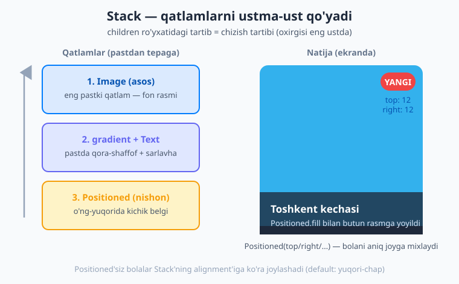
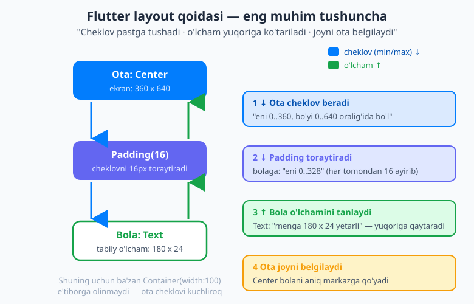

# 13 — Layout II: Stack va Constraints

[⬅️ Oldingi: 12 — Layout I: Row, Column, Flex](./12-layout-row-column.md) · [🏠 README](./README.md) · [Keyingi: 14 — Material 3, Cupertino va theming ➡️](./14-material-cupertino-theming.md)

---

> **Bu bobda:** o'tgan bobda `Row` va `Column` bilan widgetlarni **yonma-yon** va **ustma-ust** terib o'rgandingiz. Endi navbat — bir widgetni **boshqasining ustiga** qo'yish (`Stack`/`Positioned`) va Flutter'da layout aslida **qanday hisoblanishini** tushunishga keldi. Bu — beginnerlar eng ko'p qoqiladigan, lekin tushunilgach hammasi **"klik"** bo'ladigan bob. Siz `Stack`, `Positioned`, `Positioned.fill` bilan qatlamli interfeys (rasm ustida matn, avatar ustida nishon) quryapsiz; `Align`/`Center`/`Padding` bilan joylashtirishni boshqarasiz; Flutter'ning mashhur layout qoidasini — **"cheklov pastga, o'lcham yuqoriga, joyni ota belgilaydi"** — qadam-baqadam o'zlashtirasiz; `BoxConstraints`/`ConstrainedBox`, `LayoutBuilder`, `MediaQuery`, `SafeArea` va `Wrap`'ni ko'rasiz; oxirida rasm-banner, teg-bulut va torayganda ustunga aylanadigan **responsive** ikki-panel quramiz.

---

## Nima uchun bu bob alohida?

O'tgan bobda `Row`/`Column` bilan widgetlarni **ketma-ket** terdingiz. Lekin haqiqiy ilovalarda ko'pincha narsalar **bir-birining ustida** turadi: rasm ustida sarlavha, profil suratining burchagidagi yashil "onlayn" nuqtasi, fotosurat ostidagi qoraygan gradient. Bularning hammasi `Row`/`Column` bilan emas, **`Stack`** bilan quriladi.

Va yana bir narsa bor — har bir beginner shu joyda hayron qoladi: *"Men `Container`ga `width: 100` berdim, lekin u baribir butun ekranni egalladi. Nega?"* Bu savolga javob — Flutter layout **algoritmi**. Uni bir marta tushunsangiz, layout bilan bog'liq xatolaringizning aksariyati o'z-o'zidan tushunarli bo'lib qoladi. Shuning uchun bu bobni diqqat bilan o'qing — bu sarmoya keyingi barcha boblarda foyda beradi.

## `Stack` — qatlamlarni ustma-ust qo'yish

`Stack` (so'zma-so'z "uyum", "to'plam") — bolalarini **bir-birining ustiga** qo'yadigan layout widget. Xuddi stolga bir necha varaq qog'ozni ustma-ust tashlagandek: pastdagisi ko'rinmay qoladi, ustidagisi ko'rinadi.

```dart
Stack(
  children: [
    Container(color: Colors.blue, width: 200, height: 200), // pastki qatlam
    const Icon(Icons.star, size: 48),                        // ustidagi qatlam
  ],
)
```

Muhim qoida: **`children` ro'yxatidagi tartib — chizish tartibi.** Ro'yxatdagi **birinchi** element eng **pastda**, **oxirgisi** eng **ustda** chiziladi. Ya'ni keyingi bolalar oldingilarning ustiga tushadi.

Default holatda barcha bolalar `Stack`ning **yuqori-chap** burchagiga joylashadi (bir-birining ustiga). Buni ikki yo'l bilan boshqaramiz: `alignment` (hammasini bir tomonga) yoki `Positioned` (har birini aniq joyga).

### `Positioned` — bolani aniq joyga mixlash

`Stack` ichidagi bolani aniq koordinataga qo'yish uchun uni `Positioned` bilan o'raymiz. `Positioned` to'rt chetdan masofa beradi: `top`, `right`, `bottom`, `left`.

```dart
Stack(
  children: [
    Image.network('https://.../rasm.jpg'),    // asos
    Positioned(
      top: 12,
      right: 12,
      child: Container(
        padding: const EdgeInsets.symmetric(horizontal: 10, vertical: 4),
        decoration: BoxDecoration(
          color: Colors.red,
          borderRadius: BorderRadius.circular(12),
        ),
        child: const Text('YANGI', style: TextStyle(color: Colors.white)),
      ),
    ),
  ],
)
```

Bu yerda `top: 12, right: 12` degani: "bolani yuqoridan 12 piksel, o'ngdan 12 piksel masofada joylashtir". Mana shunday qilib **avatar ustidagi nishon (badge)** yoki **rasm burchagidagi yorliq** quriladi.

> 💡 `top` va `bottom`ning **ikkalasini** ham bersangiz, bolaning **balandligi** shu ikki chet orasiga cho'ziladi. Xuddi shunday `left` + `right` enini belgilaydi. Faqat bittasini bersangiz — bola o'z tabiiy o'lchamida qoladi, shunchaki o'sha chetga "yopishadi".

### `Positioned.fill` — butun maydonni egallash

Agar bola `Stack`ning **butun** maydonini to'ldirishini istasangiz, `Positioned.fill` ishlating — bu `Positioned(top: 0, right: 0, bottom: 0, left: 0)` ning qisqa shakli:

```dart
Positioned.fill(
  child: DecoratedBox(
    decoration: BoxDecoration(/* gradient */),
  ),
)
```

Bu rasm ustiga **gradient parda** yoyish uchun juda qo'l keladi (matn o'qilishi uchun fotosuratning pastini qoraytirish).



### Amaliyot: rasm ustida sarlavha (banner)

Endi o'rganganlarimizni birlashtirib, klassik **banner** quramiz — fotosurat, uning pastida qoraygan gradient va ustida oq matn:

```dart
Stack(
  children: [
    // 1-qatlam: asos rasm
    Image.network(
      'https://picsum.photos/600/300',
      width: double.infinity,
      height: 200,
      fit: BoxFit.cover,
    ),

    // 2-qatlam: pastdan yuqoriga qoraygan gradient (matn o'qilishi uchun)
    Positioned.fill(
      child: DecoratedBox(
        decoration: BoxDecoration(
          gradient: LinearGradient(
            begin: Alignment.bottomCenter,
            end: Alignment.center,
            colors: [Colors.black.withValues(alpha: 0.7), Colors.transparent],
          ),
        ),
      ),
    ),

    // 3-qatlam: pastki-chapda sarlavha matni
    const Positioned(
      left: 16,
      bottom: 16,
      child: Text(
        'Toshkent kechasi',
        style: TextStyle(
          color: Colors.white,
          fontSize: 22,
          fontWeight: FontWeight.bold,
        ),
      ),
    ),

    // 4-qatlam: o'ng-yuqorida "YANGI" nishoni
    Positioned(
      top: 12,
      right: 12,
      child: Container(
        padding: const EdgeInsets.symmetric(horizontal: 10, vertical: 4),
        decoration: BoxDecoration(
          color: Colors.red,
          borderRadius: BorderRadius.circular(12),
        ),
        child: const Text('YANGI', style: TextStyle(color: Colors.white)),
      ),
    ),
  ],
)
```

E'tibor bering — qatlamlar tartibi mantiqiy: avval rasm, ustiga gradient (rasmni qoraytiradi), eng ustiga matn va nishon (ular doim ko'rinib turadi). Tartibni almashtirsangiz (masalan gradientni matndan keyin qo'ysangiz), matn gradient ostida qolib ketadi.

> ⚠️ **`Stack`ning o'lchami.** `Stack` o'zining `Positioned`siz (oddiy) bolalarining eng kattasiga moslab kattalashadi. Yuqoridagi misolda `Image` aniq balandlik (`height: 200`) berganligi uchun `Stack` ham shuncha bo'ladi. Agar barcha bolalar `Positioned` bo'lsa, `Stack`ka o'lcham beradigan hech narsa qolmaydi — uni `SizedBox` yoki balandligi aniq ota ichiga qo'ying.

## `Align`, `Center` va `Alignment` koordinatalari

`Center`ni 10-bobdan bilasiz — bolani ota maydonining **markaziga** qo'yadi. `Align` esa undan kuchliroq: bolani **istalgan** tomonga qo'yadi.

```dart
Align(
  alignment: Alignment.bottomRight,   // pastki-o'ng burchak
  child: FloatingActionButton(onPressed: () {}, child: const Icon(Icons.add)),
)
```

`Alignment`ning tayyor qiymatlari intuitiv: `Alignment.topLeft`, `Alignment.topCenter`, `Alignment.center`, `Alignment.bottomRight` va hokazo.

Lekin ulardan tashqari `Alignment` aslida **koordinata tizimi**. U `Alignment(x, y)` ko'rinishida ikkita son oladi, ikkalasi ham **-1 dan +1 gacha**:

- `x = -1` → eng chap, `x = 0` → markaz, `x = +1` → eng o'ng;
- `y = -1` → eng tepa, `y = 0` → markaz, `y = +1` → eng past.

Demak `Alignment.center` aslida `Alignment(0, 0)`, `Alignment.bottomRight` esa `Alignment(1, 1)`. Oraliq qiymatlar ham mumkin: `Alignment(0.5, -0.5)` — markazdan biroz o'ngda va tepada.

> 💡 `Stack`ning ham `alignment:` parametri bor — u **`Positioned`siz** bolalarni qayerga yig'ishni belgilaydi (default `Alignment.topLeft`). Masalan `Stack(alignment: Alignment.center, children: [...])` — oddiy bolalarni markazga to'playdi.

### `FractionallySizedBox` — ota o'lchamining ulushi

Ba'zan bolaning o'lchamini piksel emas, **foiz** bilan berish kerak: "ota enining 70 foizi". Buni `FractionallySizedBox` qiladi:

```dart
FractionallySizedBox(
  widthFactor: 0.7,   // ota enining 70%
  child: Container(height: 40, color: Colors.indigo),
)
```

Bu progress-bar yoki ekran kengligiga moslashadigan tugmalar uchun qulay.

## Flutter layout algoritmi — eng muhim tushuncha

Mana, bobning yuragi. Agar boshqa hamma narsani unutsangiz ham, shu jumlani eslab qoling:

> **Cheklov pastga tushadi. O'lcham yuqoriga ko'tariladi. Joyni ota belgilaydi.**
> *(Constraints go down. Sizes go up. Parent sets position.)*

Bu nima degani? Flutter ekranni chizishdan oldin har bir widgetning o'lchamini va o'rnini hisoblashi kerak. U buni widget daraxti bo'ylab **uch bosqichda** qiladi.

### Bosqichma-bosqich

**1. Cheklov pastga tushadi.** Har bir ota widget o'z bolasiga **cheklov** (constraint) beradi. Cheklov — bu to'rtta son: `minWidth`, `maxWidth`, `minHeight`, `maxHeight`. Ma'nosi: "Sen shu eni va bo'yi oralig'ida bo'lishing **shart**". Masalan ekranning ildizi: "sen 0..360 eni, 0..640 bo'yi oralig'ida bo'l".

**2. O'lcham yuqoriga ko'tariladi.** Bola shu cheklov **ichida** o'ziga mos o'lchamni **tanlaydi** va uni otasiga qaytaradi. Masalan `Text` "menga 180×24 yetarli" deydi (cheklov ruxsat bersa). Ota bu o'lchamni o'z bolasidan **eshitadi**.

**3. Joyni ota belgilaydi.** Endi ota bolaning o'lchamini biladi va uni o'z ichida **qayerga** qo'yishni hal qiladi. `Center` markazga qo'yadi, `Align(bottomRight)` pastki-o'ngga qo'yadi. **Bola o'zining o'rnini bilmaydi** — buni doim ota belgilaydi.



### Aniq misol bilan "yurib chiqamiz"

Quyidagi oddiy daraxtni olaylik:

```dart
Center(
  child: Padding(
    padding: const EdgeInsets.all(16),
    child: Text('Salom'),
  ),
)
```

Endi algoritmni qadam-baqadam kuzatamiz:

1. Ekran `Center`ga cheklov beradi: `maxWidth: 360, maxHeight: 640` (telefon ekrani).
2. `Center` shu cheklovni o'zgartirmasdan (lekin **bo'sh** qilib — pastda tushuntiramiz) `Padding`ga uzatadi.
3. `Padding` har tomondan 16px ajratadi, demak bolasiga **toraytirilgan** cheklov beradi: `maxWidth: 360 − 32 = 328`.
4. `Text('Salom')` o'z matnini o'lchaydi: masalan `52×20`. Bu cheklovga sig'adi, shuning uchun `Text` "men 52×20" deb **yuqoriga** qaytaradi.
5. `Padding` bolasining o'lchamiga 32 qo'shadi → `84×52` deb otasiga qaytaradi.
6. `Center` bu o'lchamni oladi va `Padding`ni ekranning **aniq markaziga** joylashtiradi.

Mana shu — Flutter har bir kadr (frame) uchun butun daraxt bo'ylab bajaradigan jarayon.

### Nega "tight" va "loose" muhim?

Cheklovlar ikki xil bo'ladi:

- **Tight (qattiq):** `min == max`. Ya'ni "**aniq** shu o'lchamda bo'l, boshqa variant yo'q". Masalan ekranning ildizi bolasiga "aniq butun ekran bo'l" deydi.
- **Loose (bo'sh):** `min = 0`, `max` esa biror chegara. Ya'ni "0 dan max gacha **istagan** o'lchamingni tanla".

Mana endi eng ko'p beriladigan savolga javob: *nega `Container(width: 100)` ba'zan e'tiborga olinmaydi?*

```dart
// 1-holat: Container e'tiborga OLINMAYDI
Container(width: 100, color: Colors.blue)
// agar bu widget body to'g'ridan-to'g'ri bo'lsa, butun ekranni egallaydi!

// 2-holat: Container ENINI hurmat qiladi
Center(
  child: Container(width: 100, color: Colors.blue),
)
```

1-holatda `Scaffold.body` `Container`ga **tight** cheklov beradi ("aniq butun ekran bo'l"). `Container` esa tight cheklovga bo'ysunishga **majbur** — shuning uchun `width: 100` e'tiborga olinmaydi.

2-holatda esa `Center` bolasiga **loose** cheklov beradi ("0..360 oralig'ida istaganingni tanla"). Endi `Container` o'zining `width: 100` ini erkin tanlay oladi. **`Center` aynan shu uchun ko'p ishlatiladi — u cheklovni "bo'shatadi".**

> 💡 Qoida: **bola otasi bergan cheklovni hech qachon buza olmaydi.** `Container(width: 100)` aslida "men **iloji bo'lsa** 100 bo'lishni xohlayman" degani. Agar cheklov tight bo'lsa — bu istak inobatga olinmaydi. Layout xatosida birinchi savol: "bu widgetga otasi qanday cheklov berdi?"

## `BoxConstraints` va `ConstrainedBox`

Ba'zan cheklovni **o'zingiz** qo'shimcha cheklamoqchi bo'lasiz — masalan "bu kartaning eni 400 pikseldan oshmasin" (keng ekranlarda matn juda cho'zilib ketmasligi uchun). Buni `ConstrainedBox` qiladi:

```dart
ConstrainedBox(
  constraints: const BoxConstraints(maxWidth: 400),
  child: Card(child: Text('Bu karta eng ko\'pi 400px keng bo\'ladi')),
)
```

`BoxConstraints` — bu o'sha to'rtta sonni (`minWidth`, `maxWidth`, `minHeight`, `maxHeight`) o'rab turuvchi obyekt. Foydali konstruktorlari:

- `BoxConstraints(maxWidth: 400)` — eni 400 dan oshmasin;
- `BoxConstraints.expand()` — bor joyni to'liq egalla;
- `BoxConstraints.tightFor(width: 100, height: 50)` — aniq shu o'lcham.

> 💡 `Container`ning `constraints:` parametri ham bor — ya'ni `ConstrainedBox`ni alohida o'rashning o'rniga `Container(constraints: BoxConstraints(maxWidth: 400), child: ...)` deb yozsa bo'ladi.

## `LayoutBuilder` — ota cheklovini o'qish

Hozirgacha cheklov "yashirin" edi — uni Flutter ichida boshqarardi. Lekin ba'zan biz **otamiz qancha joy berganini** bilib, shunga qarab **boshqacha** UI qurmoqchimiz. Masalan: "ekran keng bo'lsa — ikki panel yonma-yon, tor bo'lsa — ustma-ust".

Mana shu yerda **`LayoutBuilder`** keladi. U `builder` funksiyasiga ota bergan `constraints`ni **uzatadi**, siz esa shunga qarab qaror qabul qilasiz:

```dart
LayoutBuilder(
  builder: (context, constraints) {
    if (constraints.maxWidth >= 600) {
      // keng ekran → yonma-yon
      return Row(
        children: const [
          Expanded(child: RoyxatPanel()),
          Expanded(child: TafsilotPanel()),
        ],
      );
    } else {
      // tor ekran → ustma-ust
      return Column(
        children: const [
          RoyxatPanel(),
          TafsilotPanel(),
        ],
      );
    }
  },
)
```


E'tibor bering — `MediaQuery` (pastda) butun **ekran** o'lchamini beradi, `LayoutBuilder` esa aynan **shu widgetga** ajratilgan joyni beradi. Shuning uchun `LayoutBuilder` aniqroq: u widget ekranning yarmida tursa ham, faqat o'sha yarmini "ko'radi". Bu **responsive** (moslashuvchan) interfeysning asosi — biz buni [28-bobda](./README.md) (platforma va moslashuv) chuqurlashtiramiz.

## `MediaQuery` va `SafeArea` — ekran haqida ma'lumot

`MediaQuery` butun **qurilma ekrani** haqidagi ma'lumotlarni beradi: o'lcham, orientatsiya, tizim panellari (notch, status bar):

```dart
final size = MediaQuery.of(context).size;       // ekran o'lchami
print(size.width);                                // masalan 392.0
print(size.height);

final orientation = MediaQuery.of(context).orientation; // portrait / landscape
```

`MediaQuery.of(context).size` — ekranning umumiy eni va bo'yi. Buni "ekranning yarmini egallasin" kabi qarorlarda ishlatasiz.

**`SafeArea`** — bu juda muhim, amaliy widget. Zamonaviy telefonlarda yuqorida **notch** (kamera o'yig'i), status bar, pastda esa navigatsiya chizig'i bor. Agar UI'ngiz ulardan **ostiga** tushib qolsa, matn o'qilmay qoladi. `SafeArea` bolasini shu "xavfli" zonalardan **avtomatik chetlatadi**:

```dart
Scaffold(
  body: SafeArea(
    child: Column(
      children: [ /* kontent endi notch ostiga tushmaydi */ ],
    ),
  ),
)
```

> 💡 `Scaffold` `AppBar` bilan ishlatilganda yuqorisini odatda o'zi himoya qiladi, lekin `AppBar`siz to'liq ekranli UI qurganingizda `SafeArea`ni unutmang.

## `Wrap` — joy tugaganda yangi qatorga o'tish

`Row` bilan bog'liq mashhur muammoni eslang: agar bolalar enga sig'masa, "overflow" (sariq-qora chiziqli ogohlantirish) chiqadi. `Wrap` aynan shu muammoni hal qiladi — u `Row` kabi, lekin joy tugaganda bolalarni **avtomatik yangi qatorga** o'tkazadi:

```dart
Wrap(
  spacing: 8,        // bolalar orasidagi gorizontal oraliq
  runSpacing: 8,     // qatorlar orasidagi vertikal oraliq
  children: const [
    Chip(label: Text('Flutter')),
    Chip(label: Text('Dart')),
    Chip(label: Text('Mobile')),
    Chip(label: Text('iOS')),
    Chip(label: Text('Android')),
    Chip(label: Text('Web')),
  ],
)
```

Bu **teg-bulut** (tag cloud), filtr-chiplar, ranglar palitrasi kabi "qancha sig'sa shuncha, qolgani pastga" interfeyslar uchun ideal. `alignment:` parametri bilan qatorlar ichidagi tekislashni ham boshqarasiz.

## `AspectRatio` va `IntrinsicHeight` (qisqacha)

**`AspectRatio`** — bolaning **nisbatini** (eni:bo'yi) saqlaydi. Masalan video yoki rasmni doim 16:9 ko'rsatish:

```dart
AspectRatio(
  aspectRatio: 16 / 9,
  child: Container(color: Colors.black),
)
```

U otadan kelgan enga moslab bo'yini avtomatik hisoblaydi (yoki aksincha) — shunda nisbat buzilmaydi.

**`IntrinsicHeight`** — `Row` ichidagi bolalarni eng balandiga **tenglashtiradi** (masalan ikki kartani bir balandlikda qilish). Foydali, lekin bitta ogohlantirish bilan:

> ⚠️ **Unumdorlik (performance) ogohlantirishi.** `IntrinsicHeight` (va `IntrinsicWidth`) Flutter'ni bolalarni **ikki marta** o'lchashga majbur qiladi — bu sekinroq. Faqat haqiqatan kerak bo'lganda, kichik daraxtlarda ishlating. Ko'p hollarda muammoni `Expanded` yoki aniq balandlik bilan hal qilsa bo'ladi.

## Layoutni nazorat qilish (debugging)

Layout xatolari boshlanuvchini cho'chitadi, lekin Flutter yordam beradi:

- **`BoxConstraints forces an infinite width/height` / "unbounded constraints" xatosi.** Bu eng tez-tez uchraydigan xato. Ma'nosi: bolaga "**cheksiz** joy" berildi-yu, bola o'sha cheksizlikni to'ldirishga urinyapti. Klassik sabab — `Column` ichiga `ListView` qo'yish (`Column` bolasiga cheksiz balandlik beradi, `ListView` esa "qancha bersang shuncha olaman" deydi → cheksizlik). Yechim: `ListView`ni `Expanded` bilan o'rash yoki aniq balandlik berish.
- **Flutter Inspector / "Debug Paint".** DevTools'dagi **Inspector** widget daraxtini ko'rsatadi va biror widgetni tanlasangiz, unga qanday cheklov berilganini aytadi. **Debug Paint** rejimini yoqsangiz, har bir widgetning chegaralari, paddinglari ekranda chiziq bilan ko'rinadi — "bu bo'sh joy qayerdan keldi?" degan savolga darhol javob beradi. Buni 29-bobda (testing va debugging) batafsil ko'ramiz.

> 💡 Layout xatosini ko'rganda vahima qilmang. Xato matnini **diqqat bilan o'qing** — Flutter odatda qaysi widget muammo qilayotganini va nima qilish kerakligini aniq aytadi. Eng birinchi savol doim bitta: **"bu widgetga otasi qanday cheklov berdi — tight, loose yoki cheksiz?"**

## Birgalikda: responsive profil sahifasi

Endi bobning hammasini birlashtiramiz. Quramiz: tepada rasm-banner (`Stack`), pastida teg-bulut (`Wrap`), va keng ekranda ikki ustunga, tor ekranda bitta ustunga aylanadigan tartib (`LayoutBuilder`).

```dart
import 'package:flutter/material.dart';

void main() => runApp(const ProfilApp());

class ProfilApp extends StatelessWidget {
  const ProfilApp({super.key});

  @override
  Widget build(BuildContext context) {
    return MaterialApp(
      theme: ThemeData(
        colorScheme: ColorScheme.fromSeed(seedColor: Colors.indigo),
      ),
      home: Scaffold(
        appBar: AppBar(title: const Text('Profil')),
        body: SafeArea(
          child: LayoutBuilder(
            builder: (context, constraints) {
              final banner = _buildBanner();
              final teglar = _buildTeglar();

              // keng ekran → banner va teglar yonma-yon
              if (constraints.maxWidth >= 600) {
                return Row(
                  crossAxisAlignment: CrossAxisAlignment.start,
                  children: [
                    Expanded(child: banner),
                    Expanded(
                      child: Padding(
                        padding: const EdgeInsets.all(16),
                        child: teglar,
                      ),
                    ),
                  ],
                );
              }

              // tor ekran → ustma-ust
              return Column(
                crossAxisAlignment: CrossAxisAlignment.start,
                children: [
                  banner,
                  Padding(padding: const EdgeInsets.all(16), child: teglar),
                ],
              );
            },
          ),
        ),
      ),
    );
  }

  Widget _buildBanner() {
    return Stack(
      children: [
        Image.network(
          'https://picsum.photos/600/300',
          width: double.infinity,
          height: 200,
          fit: BoxFit.cover,
        ),
        Positioned.fill(
          child: DecoratedBox(
            decoration: BoxDecoration(
              gradient: LinearGradient(
                begin: Alignment.bottomCenter,
                end: Alignment.center,
                colors: [Colors.black.withValues(alpha: 0.7), Colors.transparent],
              ),
            ),
          ),
        ),
        const Positioned(
          left: 16,
          bottom: 16,
          child: Text(
            'Oqil Imomnazarov',
            style: TextStyle(
              color: Colors.white,
              fontSize: 22,
              fontWeight: FontWeight.bold,
            ),
          ),
        ),
        Positioned(
          top: 12,
          right: 12,
          child: Container(
            padding: const EdgeInsets.symmetric(horizontal: 10, vertical: 4),
            decoration: BoxDecoration(
              color: Colors.green,
              borderRadius: BorderRadius.circular(12),
            ),
            child: const Text('Onlayn', style: TextStyle(color: Colors.white)),
          ),
        ),
      ],
    );
  }

  Widget _buildTeglar() {
    const teglar = ['Flutter', 'Dart', 'Mobile', 'iOS', 'Android', 'Web', 'UI'];
    return Wrap(
      spacing: 8,
      runSpacing: 8,
      children: [
        for (final t in teglar) Chip(label: Text(t)),
      ],
    );
  }
}
```

Bu ilovani ishga tushiring, keyin oynani (web/desktop'da) yoki emulyatorni **kengaytiring-toraytiring** — 600 piksel chegarasidan o'tganda layout **avtomatik** ustun↔qator orasida almashganini ko'rasiz. Mana shu — bitta kod bazasidan turli ekranlarga moslashadigan interfeys.

## Keyingi qadam

Tabriklaymiz — siz layout'ning eng chuqur tushunchasini o'zlashtirdingiz. Endi bilasiz: widgetlarni `Stack` bilan **qatlamlash**, `Align`/`Center` bilan **joylashtirish**, va eng muhimi — Flutter cheklovlarni **pastga**, o'lchamlarni **yuqoriga** tashiydi, joyni esa **ota** belgilaydi. Bu qoidani bilgan dasturchi uchun layout xatolari endi sir emas.

Keyingi [14-bobda](./14-material-cupertino-theming.md) ko'rinishga — **uslub va mavzu**ga (theming) o'tamiz: Material 3 rang tizimi, `ThemeData`, dark mode, tipografiya va iOS uslubidagi Cupertino widgetlari. Ilovangiz nafaqat to'g'ri joylashgan, balki **chiroyli** ham bo'ladi.

---

## Mashqlar

### Oson

1. `Stack`ning `children` ro'yxatida tartib nimani belgilaydi? Birinchi va oxirgi element qatlamlarning qaysi biriga (pastki/ustki) tushadi?
2. `Positioned(top: 12, right: 12, child: ...)` nima qiladi? `Positioned.fill` esa nima qiladi va u qanday qisqartma?
3. `Alignment` koordinata tizimida `x` va `y` qanday qiymatlar oladi? `Alignment.center` va `Alignment.bottomRight` sonli ko'rinishda nimaga teng?
4. Flutter layout qoidasini bitta jumlada yozing (uchta qism: cheklov, o'lcham, joy).
5. `Wrap` `Row`dan nimasi bilan farq qiladi? Qaysi holatda `Wrap` ishlatish kerak?

### O'rta

6. Nima uchun `Container(width: 100, color: Colors.blue)` to'g'ridan-to'g'ri `Scaffold.body`ga qo'yilsa butun ekranni egallaydi, lekin `Center` ichiga qo'yilsa 100 piksel bo'ladi? "Tight" va "loose" cheklov tushunchalari bilan tushuntiring.
7. `LayoutBuilder` va `MediaQuery` orasidagi farqni ayting: ularning har biri qaysi o'lchamni beradi va qaysi biri "shu widgetga ajratilgan joyni" beradi?
8. `SafeArea` nima muammoni hal qiladi? Qaysi holatda uni ishlatish ayniqsa muhim?
9. `IntrinsicHeight` nima qiladi va nega undan ehtiyot bo'lib foydalanish kerak?

### Qiyin

10. To'liq, kompilyatsiya bo'ladigan `Stack` yozing: pastida ko'k `Container` (eni va bo'yi 150), uning o'ng-yuqori burchagida (top: 8, right: 8) qizil dumaloq "nuqta" (eni va bo'yi 16) bo'lsin. Bu — bildirishnoma nishonining (notification badge) asosiy g'oyasi.
11. Bir o'quvchi `Column` ichiga `ListView` qo'ydi va "unbounded height" xatosini oldi. Bu xato nega chiqdi (cheklovlar tilida tushuntiring) va uni qanday tuzatish mumkin?
12. `LayoutBuilder` ishlatib, agar ajratilgan kenglik 400 dan kichik bo'lsa bitta `Text('Tor')`, aks holda `Text('Keng')` ko'rsatadigan widget yozing.

<details markdown="1"><summary>Yechimlar</summary>

**1.** `children` ro'yxatidagi tartib — **chizish tartibi**. Birinchi element eng **pastki** qatlamga (asos), oxirgi element eng **ustki** qatlamga tushadi. Keyingi bolalar oldingilarning ustiga chiziladi.

**2.** `Positioned(top: 12, right: 12, child: ...)` — bolani `Stack`ning yuqori chetidan 12 piksel, o'ng chetidan 12 piksel masofaga joylaydi. `Positioned.fill` esa bolani `Stack`ning **butun maydoniga** yoyadi — bu `Positioned(top: 0, right: 0, bottom: 0, left: 0)` ning qisqa shakli.

**3.** `x` va `y` ikkalasi ham **-1 dan +1 gacha** qiymat oladi: `x = -1` chap, `0` markaz, `+1` o'ng; `y = -1` tepa, `0` markaz, `+1` past. Demak `Alignment.center` = `Alignment(0, 0)`, `Alignment.bottomRight` = `Alignment(1, 1)`.

**4.** **Cheklov (constraints) pastga tushadi** (ota → bola), **o'lcham (size) yuqoriga ko'tariladi** (bola → ota), **joyni (position) ota belgilaydi**.

**5.** `Row` bolalarni faqat bitta gorizontal qatorga teradi va joy yetmasa "overflow" xatosi beradi. `Wrap` esa joy tugaganda bolalarni **avtomatik yangi qatorga** o'tkazadi. `Wrap`ni soni o'zgaruvchan, enga sig'masligi mumkin bo'lgan elementlarda (teg-chiplar, filtrlar) ishlatamiz.

**6.** `Scaffold.body` o'z bolasiga **tight** cheklov beradi — "aniq butun ekran bo'l, boshqa variant yo'q". Bola tight cheklovga bo'ysunishga **majbur**, shuning uchun `Container`ning `width: 100` istagi inobatga olinmaydi. `Center` esa bolasiga **loose** cheklov beradi — "0 dan max gacha **istaganingni** tanla". Endi `Container` o'zining 100 pikselini erkin tanlay oladi. Ya'ni `Center` cheklovni "bo'shatib" beradi.

**7.** `MediaQuery.of(context).size` butun **qurilma ekrani** o'lchamini beradi. `LayoutBuilder` esa `builder`dagi `constraints` orqali aynan **shu widgetga ajratilgan joyni** beradi. Demak "shu widgetga ajratilgan joy" — `LayoutBuilder`. Shuning uchun widget ekranning bir qismida tursa, `LayoutBuilder` aniqroq qaror berishga yordam beradi.

**8.** `SafeArea` UI'ni qurilmaning **tizim zonalari** (notch/kamera o'yig'i, status bar, pastki navigatsiya chizig'i) ostiga tushib qolishidan saqlaydi. U bolani shu zonalardan avtomatik chetlatadi. Ayniqsa `AppBar`siz, to'liq ekranli interfeys qurganda muhim — aks holda kontent notch yoki status bar ostida qolib o'qilmay qoladi.

**9.** `IntrinsicHeight` `Row` ichidagi bolalarni eng balandiga **tenglashtiradi**. Undan ehtiyot bo'lish kerak, chunki u Flutter'ni bolalarni **ikki marta** o'lchashga majbur qiladi — bu unumdorlikni (performance) pasaytiradi. Faqat haqiqatan kerak bo'lganda, kichik daraxtlarda ishlatish tavsiya etiladi.

**10.**
```dart
Stack(
  children: [
    Container(width: 150, height: 150, color: Colors.blue),
    Positioned(
      top: 8,
      right: 8,
      child: Container(
        width: 16,
        height: 16,
        decoration: const BoxDecoration(
          color: Colors.red,
          shape: BoxShape.circle,
        ),
      ),
    ),
  ],
)
```

**11.** `Column` o'z bolalariga vertikal yo'nalishda **cheksiz (unbounded)** balandlik beradi — "qancha kerak bo'lsa shuncha bo'l". `ListView` esa "menga bergan **butun** balandlikni olaman" deydi. Ikkalasi uchrashganda: `ListView` cheksizlikni to'ldirishga urinadi → "unbounded height" xatosi. Tuzatish: `ListView`ni **`Expanded`** bilan o'rash (`Expanded(child: ListView(...))`) — shunda `Column` qolgan aniq balandlikni beradi; yoki `ListView`ga `SizedBox(height: ...)` orqali aniq balandlik berish; yoki `shrinkWrap: true` ishlatish (kichik ro'yxatlar uchun).

**12.**
```dart
LayoutBuilder(
  builder: (context, constraints) {
    if (constraints.maxWidth < 400) {
      return const Text('Tor');
    } else {
      return const Text('Keng');
    }
  },
)
```

</details>

---

[⬅️ Oldingi: 12 — Layout I: Row, Column, Flex](./12-layout-row-column.md) · [🏠 README](./README.md) · [Keyingi: 14 — Material 3, Cupertino va theming ➡️](./14-material-cupertino-theming.md)
