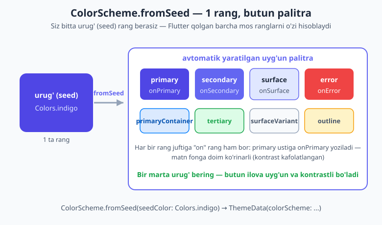
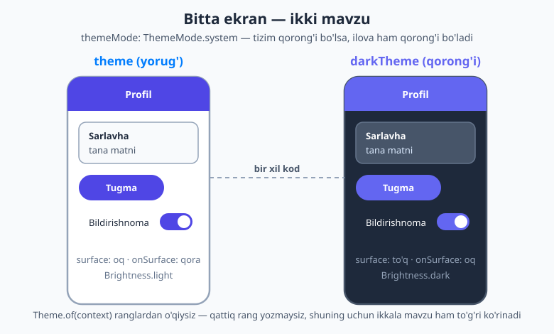
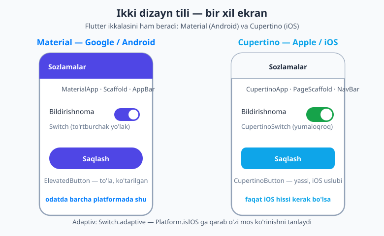

# 14 — Material 3, Cupertino va theming

[⬅️ Oldingi: 13 — Layout II: Stack va Constraints](./13-layout-stack-constraints.md) · [🏠 README](./README.md) · [Keyingi: 15 — Asosiy UI widgetlar ➡️](./15-ui-widgetlar.md)

---

> **Bu bobda:** ilovangizga **chiroyli va izchil ko'rinish** beradigan ikki narsani o'rganamiz. Birinchidan, Flutter beradigan ikkita dizayn tili — **Material** (Google/Android, Flutter standarti) va **Cupertino** (Apple/iOS ko'rinishi). Ikkinchidan, **theming** (mavzulash): `ColorScheme.fromSeed` bilan bitta urug' rangdan butun uyg'un palitra yaratish; `theme`/`darkTheme`/`themeMode` orqali **yorug' va qorong'i** rejimni qo'llab-quvvatlash; `Theme.of(context)` orqali ranglar va shriftlarni qattiq yozmasdan, mavzudan o'qib olish; **tipografiya** (`TextTheme`) va maxsus shriftlar. So'ngra **Cupertino** widgetlarini va **adaptiv UI** (`Switch.adaptive`, `Platform.isIOS`) yondashuvini ko'ramiz. Oxirida bir ekranni Material va Cupertino uslubida, yorug' va qorong'i mavzu bilan birga quramiz.

---

## Nega theming kerak? — "qattiq rang" muammosi

Tasavvur qiling, ilovangizda 40 ta ekran bor va har birida tugmalarni ko'k qildingiz: `color: Color(0xFF4F46E5)`. Ertaga rahbar "ko'kni emas, yashilni xohlaymiz" deydi. Endi siz 40 ta ekrandagi har bir tugmani **qo'lda** topib o'zgartirishingiz kerak. Bittasini unutsangiz — u eski rangda qolib ketadi.

Bu — **qattiq kodlangan rang** (hardcoded color) muammosi. Yechimi oddiy: rangni har joyda qaytarib yozmaslik, balki **bitta markaziy joyda** belgilash va hamma joydan **shu manbaga murojaat qilish**. Aynan shuni **theming** (mavzulash) deydi.

Excel'dagi formulani eslang: `=A1` deb yozsangiz, `A1`ni bir marta o'zgartirib barcha hujayralarni yangilaysiz. Theming ham shunday — ilovaning ranglari va shriftlari uchun "yagona haqiqat manbai" (single source of truth).

## Ikki dizayn tili: Material va Cupertino

Flutter ikkita tayyor **dizayn tili** (design language) bilan keladi — ya'ni ikki xil tugma, panel, switch ko'rinishi to'plami:

- **Material** — Google'ning dizayn tizimi. Android'ning tabiiy ko'rinishi va Flutter'da **standart** (default). 10-bobdan tanish `MaterialApp`, `Scaffold`, `AppBar`, `ElevatedButton` — bularning hammasi Material.
- **Cupertino** — Apple'ning iOS dizayni. iPhone'dagi yumaloq tugmalar, ingichka navigatsiya paneli, o'ziga xos switch — shu his.

Eng muhimi shuni eslab qoling: **Flutter har bir pikselni o'zi chizadi** (10-bobdan), shuning uchun u Material'ni ham, Cupertino'ni ham har qanday platformada chiza oladi. Ya'ni iOS telefonida ham Material ilova ishlaydi, Android'da ham Cupertino ilova ishlaydi — ko'rinish kodda tanlanadi, telefonda emas.

Ko'pchilik ilovalar **hamma joyda Material** ishlatadi (chunki u standart va to'liq) — bu mutlaqo normal. Cupertino esa ilovangiz "haqiqiy iPhone ilovasidek" his berishi kerak bo'lganda kerak bo'ladi. Buni bob oxirida batafsil ko'ramiz.

## Material 3 — endi standart

Avval bir narsani aniqlashtirib olaylik. Material dizaynining eng yangi avlodi — **Material 3** (qisqacha M3). U yumaloqroq shakllar, yangilangan komponentlar va **dinamik rang** (bitta urug'dan butun palitra) bilan keladi.

Muhim: 2026-yilda Material 3 Flutter'da **standart** (default). Ya'ni siz shunchaki `ThemeData()` yozsangiz — u allaqachon Material 3. Eski darslarda ko'rishingiz mumkin bo'lgan `useMaterial3: true` bayrog'ini yozish endi **shart emas** — u avtomatik yoqilgan.

```dart
// Eski darslar shunday yozardi — endi KERAK EMAS:
// ThemeData(useMaterial3: true, ...)

// 2026-da yetarli:
ThemeData(colorScheme: ColorScheme.fromSeed(seedColor: Colors.indigo))
```

> 💡 Agar internetdagi eski misolda `useMaterial3: true` ko'rsangiz — xavotir olmang, u xato emas, shunchaki **ortiqcha**. Hozir Material 3 baribir yoqilgan.

## `ColorScheme.fromSeed` — bitta rangdan butun palitra

Ilovaning rangi `ColorScheme` degan obyektda saqlanadi. Unda bir necha "rol"li rang bor: `primary` (asosiy), `secondary` (ikkilamchi), `surface` (sirt — kartalar, fon), `error` (xato — qizil) va boshqalar.

Ularning har birini qo'lda tanlash qiyin — ranglar bir-biriga uyg'un bo'lishi kerak-ku. Shuning uchun Flutter ajoyib yordamchi beradi: **`ColorScheme.fromSeed`**. Siz unga bitta **urug' rang** (seed color) berasiz, u esa qolgan barcha mos ranglarni **o'zi hisoblab** chiqaradi.



```dart
final scheme = ColorScheme.fromSeed(seedColor: Colors.indigo);
// scheme.primary, scheme.secondary, scheme.surface, scheme.error ... — hammasi tayyor
```

Diagrammadagi muhim detal: har bir rang juftiga **"on" rang** ham hosil bo'ladi. `primary` — tugma foni bo'lsa, `onPrimary` — uning ustidagi matn rangi. Flutter buni shunday hisoblaydiki, matn fonga doimo **ko'rinarli** (kontrastli) bo'ladi. Ya'ni qaysi rangni urug' qilib bersangiz ham, "oq fonda oq matn" kabi o'qib bo'lmaydigan holat yuzaga kelmaydi.

Buni `ThemeData`ga ulaymiz va `MaterialApp`ga beramiz:

```dart
import 'package:flutter/material.dart';

void main() => runApp(const MyApp());

class MyApp extends StatelessWidget {
  const MyApp({super.key});

  @override
  Widget build(BuildContext context) {
    return MaterialApp(
      title: 'Mavzulangan ilova',
      theme: ThemeData(
        colorScheme: ColorScheme.fromSeed(seedColor: Colors.indigo),
      ),
      home: const HomeScreen(),
    );
  }
}
```

Endi `seedColor`ni `Colors.teal` yoki `Colors.deepOrange`ga o'zgartirsangiz — **butun ilova rangi** uyg'un tarzda o'zgaradi. Bu — theming'ning kuchi: bitta satr, butun palitra.

## Yorug' va qorong'i mavzu

Zamonaviy telefonlar **qorong'i rejim** (dark mode) beradi — tunda ko'zga qulay, fon to'q bo'ladi. Yaxshi ilova tizim sozlamasiga ergashishi kerak: tizim yorug' bo'lsa — yorug', qorong'i bo'lsa — qorong'i.

Flutter'da buni uchta parametr bilan boshqarasiz:

- **`theme:`** — yorug' mavzu.
- **`darkTheme:`** — qorong'i mavzu.
- **`themeMode:`** — qaysi birini ishlatish: `ThemeMode.light`, `ThemeMode.dark` yoki `ThemeMode.system` (tizimga ergashish).



```dart
return MaterialApp(
  theme: ThemeData(
    colorScheme: ColorScheme.fromSeed(seedColor: Colors.indigo),
  ),
  darkTheme: ThemeData(
    colorScheme: ColorScheme.fromSeed(
      seedColor: Colors.indigo,
      brightness: Brightness.dark, // <-- qorong'i variant
    ),
  ),
  themeMode: ThemeMode.system, // tizimga ergash
  home: const HomeScreen(),
);
```

E'tibor bering — ikkala mavzuda ham **bir xil urug' rang** (`Colors.indigo`), faqat `brightness` farq qiladi: `Brightness.light` va `Brightness.dark`. Flutter qorong'i variant uchun to'q sirtlar va yorug' matnni o'zi hisoblaydi. Siz alohida 40 ta qorong'i rang tanlamaysiz — bittagina urug' yetarli.

> 💡 **Sinash:** kompyuteringiz yoki telefoningiz sozlamalaridan tizim mavzusini yorug'dan qorong'iga o'zgartiring — `ThemeMode.system` tufayli ilova **o'zi** mos rejimga o'tadi, kodga tegmaysiz ham.

## Mavzudan foydalanish: `Theme.of(context)`

Mavzu belgilab qo'yish — ishning yarmi. Endi widgetlarda **shu mavzudan o'qishni** o'rganamiz. Bu bobning eng amaliy ko'nikmasi.

Qattiq rang yozish o'rniga, **mavzudagi rangga murojaat qiling**:

```dart
@override
Widget build(BuildContext context) {
  // Joriy mavzu ranglari va shriftlarini olamiz:
  final colors = Theme.of(context).colorScheme;
  final texts = Theme.of(context).textTheme;

  return Container(
    color: colors.primary,                 // qattiq rang EMAS — mavzudan
    child: Text(
      'Salom',
      style: texts.titleLarge!.copyWith(    // mavzu shrifti
        color: colors.onPrimary,            // primary ustida ko'rinarli matn
      ),
    ),
  );
}
```

`Theme.of(context)` — bu `BuildContext`dan foydalanib (10-bobdan eslang — bu widgetning daraxtdagi o'rni), **daraxt yuqorisida** turgan eng yaqin `MaterialApp` mavzusini topadi. Ya'ni siz "menga yuqoridagi mavzuni ber" deysiz, Flutter esa uni topib beradi.

Nega bu shunchalik muhim? Chunki shu paytdan boshlab:

- **Yorug'/qorong'i avtomatik ishlaydi.** Mavzu o'zgarsa, `colors.primary` ham, `colors.surface` ham mos qiymatga aylanadi — siz hech narsa qilmaysiz.
- **Bir joydan boshqarasiz.** Urug' rangni o'zgartirsangiz, butun ilova izchil yangilanadi.
- **Kontrast kafolatlanadi.** `onPrimary`, `onSurface` kabi ranglar matnni doimo ko'rinarli qiladi.

> 💡 **Oltin qoida:** widgetda rang yoki shrift yozmoqchi bo'lsangiz, avval o'zingizdan so'rang — *"buni mavzudan olsam bo'lmaydimi?"* Ko'pincha bo'ladi. `Colors.blue` deb qattiq yozish — oxirgi chora.

### Komponent mavzulari (qisqacha)

Ba'zan butun ilovadagi barcha tugmalar bir xil ko'rinishini xohlaysiz — masalan, hamma `ElevatedButton` yumaloq burchakli bo'lsin. Buni har bir tugmaga yozmasdan, `ThemeData` ichida **bir marta** belgilash mumkin:

```dart
ThemeData(
  colorScheme: ColorScheme.fromSeed(seedColor: Colors.indigo),
  appBarTheme: const AppBarTheme(centerTitle: true), // barcha AppBar sarlavhasi markazda
  elevatedButtonTheme: ElevatedButtonThemeData(
    style: ElevatedButton.styleFrom(
      shape: RoundedRectangleBorder(
        borderRadius: BorderRadius.circular(20),
      ),
    ),
  ),
)
```

Endi ilovadagi **har bir** `AppBar` va `ElevatedButton` shu sozlamaga bo'ysunadi. Bu — izchillikning kaliti.

## Tipografiya — `TextTheme`

Ranglar kabi, **shriftlar** ham mavzuda saqlanadi. Material 3 matn uchun tayyor, nomlangan uslublar beradi — har birining o'lchami va qalinligi oldindan uyg'unlashtirilgan:

| Uslub | Tipik ishlatilish |
|---|---|
| `displayLarge`, `displayMedium`, `displaySmall` | juda katta sarlavhalar (bosh ekran) |
| `headlineLarge`, `headlineMedium`, `headlineSmall` | bo'lim sarlavhalari |
| `titleLarge`, `titleMedium`, `titleSmall` | karta/panel sarlavhalari |
| `bodyLarge`, `bodyMedium`, `bodySmall` | oddiy tana matni (`bodyMedium` — standart) |
| `labelLarge`, `labelMedium`, `labelSmall` | tugma yorlig'i, mayda yozuv |

Foydalanish:

```dart
Text('Katta sarlavha', style: Theme.of(context).textTheme.headlineMedium),
Text('Oddiy matn',     style: Theme.of(context).textTheme.bodyMedium),
```

Qattiq `fontSize: 28` yozish o'rniga nomlangan uslubdan foydalanish ilovani izchil qiladi: barcha sarlavhalar bir xil o'lchamda bo'ladi.

### Maxsus shrift (custom font)

O'z shriftingizni qo'shmoqchi bo'lsangiz, ikki yo'l bor:

1. **`pubspec.yaml`ga shrift faylini qo'shish** — shrift `.ttf` faylini loyihaga joylaysiz:

   ```yaml
   flutter:
     fonts:
       - family: Inter
         fonts:
           - asset: fonts/Inter-Regular.ttf
           - asset: fonts/Inter-Bold.ttf
             weight: 700
   ```

   So'ng mavzuda: `ThemeData(fontFamily: 'Inter', ...)`.

2. **`google_fonts` paketi** — yuzlab Google shriftini fayl yuklamasdan ishlatish imkonini beradi (`flutter pub add google_fonts`). Yangi boshlovchilar uchun eng oson yo'l; paketlar bilan ishlashni keyingi boblarda ko'ramiz.

## Cupertino — iOS ko'rinishi

Endi ikkinchi dizayn tiliga o'tamiz. Agar ilovangiz **iPhone'dagidek** his berishi kerak bo'lsa, Material o'rniga **Cupertino** widgetlaridan foydalanasiz. Ular `package:flutter/cupertino.dart` ichida:

```dart
import 'package:flutter/cupertino.dart';
```

Asosiy Cupertino widgetlari — Material'dagi tanishlarning iOS ekvivalentlari:

| Material | Cupertino (iOS) |
|---|---|
| `MaterialApp` | `CupertinoApp` |
| `Scaffold` | `CupertinoPageScaffold` |
| `AppBar` | `CupertinoNavigationBar` |
| `ElevatedButton` | `CupertinoButton` |
| `Switch` | `CupertinoSwitch` |

Sodda Cupertino ekran:

```dart
import 'package:flutter/cupertino.dart';

class IosEkran extends StatelessWidget {
  const IosEkran({super.key});

  @override
  Widget build(BuildContext context) {
    return CupertinoPageScaffold(
      navigationBar: const CupertinoNavigationBar(
        middle: Text('Sozlamalar'), // iOS'da sarlavha markazda
      ),
      child: Center(
        child: CupertinoButton.filled(
          onPressed: () {},
          child: const Text('Saqlash'),
        ),
      ),
    );
  }
}
```



Diagrammada ko'rib turganingizdek, bir xil ekran — sozlama qatori, switch va tugma — ikki tilda **boshqacha** ko'rinadi. Material'da tugma to'la va "ko'tarilgan", AppBar yassi va sarlavha chapda; Cupertino'da tugma yumaloqroq va yassi, navigatsiya paneli ingichka chiziqli va sarlavha markazda.

> 💡 **Qachon Cupertino?** Faqat iOS uchun mo'ljallangan va "tabiiy iPhone ilovasi" hissi muhim bo'lganda. Aks holda — Material hamma joyda yetarli va kamroq mehnat talab qiladi. Ko'pchilik ilovalar shunday qiladi.

## Adaptiv UI — bir kod, ikki platforma

Mana amaliy savol: ilovam Android'da Material switch, iPhone'da esa iOS switch ko'rsatsin, lekin men ikki marta kod yozmayin desam-chi?

Flutter buni **adaptiv** konstruktorlar bilan hal qiladi. Eng oddiy misol — `Switch.adaptive`:

```dart
Switch.adaptive(
  value: yoqilgan,
  onChanged: (yangi) => setState(() => yoqilgan = yangi),
)
```

`Switch.adaptive` ishlash vaqtida platformani tekshiradi: iOS'da **CupertinoSwitch**, boshqa joyda oddiy **Material Switch** chizadi — siz hech narsa qilmaysiz. Bir nechta widgetda `.adaptive` varianti bor (`Switch.adaptive`, `CircularProgressIndicator.adaptive` va h.k.).

Platformani o'zingiz ham tekshira olasiz:

```dart
import 'dart:io' show Platform;

if (Platform.isIOS) {
  // iOS uchun maxsus narsa
} else {
  // Android va boshqalar
}

// Yoki widget ichida, context orqali:
if (Theme.of(context).platform == TargetPlatform.iOS) { ... }
```

> 💡 **Amaliy maslahat:** ko'pchilik ilovalar **hamma joyda Material** ishlatadi va faqat **muhim** joylarda (masalan switch, dialog) adaptiv bo'ladi. To'liq ikkita alohida iOS/Android dizayn qurish — katta mehnat va kamdan-kam kerak. Boshlovchi sifatida: Material'dan boshlang, kerak bo'lsa `*.adaptive` qo'shing.

## Birgalikda: mavzulangan ilova

Endi o'rganganlarimizni birlashtiramiz: urug' rang + yorug'/qorong'i mavzu, va `Theme.of(context)`dan o'qiydigan ekran. Bu kod to'liq ishlaydi:

```dart
import 'package:flutter/material.dart';

void main() => runApp(const SozlamaApp());

class SozlamaApp extends StatelessWidget {
  const SozlamaApp({super.key});

  @override
  Widget build(BuildContext context) {
    return MaterialApp(
      title: 'Sozlamalar',
      theme: ThemeData(
        colorScheme: ColorScheme.fromSeed(seedColor: Colors.indigo),
        appBarTheme: const AppBarTheme(centerTitle: true),
      ),
      darkTheme: ThemeData(
        colorScheme: ColorScheme.fromSeed(
          seedColor: Colors.indigo,
          brightness: Brightness.dark,
        ),
        appBarTheme: const AppBarTheme(centerTitle: true),
      ),
      themeMode: ThemeMode.system,
      home: const SozlamaEkran(),
    );
  }
}

class SozlamaEkran extends StatelessWidget {
  const SozlamaEkran({super.key});

  @override
  Widget build(BuildContext context) {
    final colors = Theme.of(context).colorScheme;
    final texts = Theme.of(context).textTheme;

    return Scaffold(
      appBar: AppBar(title: const Text('Sozlamalar')),
      body: Padding(
        padding: const EdgeInsets.all(16),
        child: Column(
          crossAxisAlignment: CrossAxisAlignment.start,
          children: [
            Text('Profil', style: texts.headlineSmall),
            const SizedBox(height: 8),
            Text(
              'Mavzu tizim sozlamasiga ergashadi.',
              style: texts.bodyMedium!.copyWith(color: colors.onSurfaceVariant),
            ),
            const SizedBox(height: 24),
            // Adaptiv switch: iOS'da iOS ko'rinishi, Android'da Material
            Row(
              mainAxisAlignment: MainAxisAlignment.spaceBetween,
              children: [
                Text('Bildirishnomalar', style: texts.titleMedium),
                Switch.adaptive(value: true, onChanged: (_) {}),
              ],
            ),
            const SizedBox(height: 24),
            ElevatedButton(
              onPressed: () {},
              child: const Text('Saqlash'),
            ),
          ],
        ),
      ),
    );
  }
}
```

E'tibor bering — bu ekranda **birorta ham qattiq rang yo'q**. Hamma rang `colors`dan, hamma shrift `texts`dan keladi. Shuning uchun tizim qorong'i rejimga o'tsa, butun ekran o'zi moslashadi. Aynan shunday yozish kerak.

> Holatni (masalan switch yoqilgan/o'chirilgan) haqiqiy o'zgartirish uchun `StatefulWidget` va `setState` kerak — uni keyingi boblarda ko'ramiz. Hozircha e'tiborni **mavzu**ga qarating.

## Keyingi qadam

Endi siz ilovangizga izchil, professional ko'rinish bera olasiz: bitta urug' rangdan butun palitra, yorug'/qorong'i rejim, mavzudan o'qiydigan widgetlar, va kerak bo'lsa iOS uslubidagi Cupertino yoki adaptiv komponentlar.

Keyingi [15-bobda](./15-ui-widgetlar.md) asosiy UI widgetlari bilan tanishamiz — tugmalar, matn maydonlari, kartalar, ro'yxatlar va boshqalar. U yerda bu bobda o'rgangan mavzudan o'qish ko'nikmangiz juda asqotadi: yangi widgetlarni ham qattiq rang bilan emas, mavzu bilan bezatasiz.

---

## Mashqlar

### Oson

1. Material va Cupertino dizayn tillari nima? Har biri qaysi platforma (kompaniya) bilan bog'liq va Flutter'da qaysi biri **standart**?
2. `useMaterial3: true` bayrog'ini 2026-yilda yozish kerakmi? Nega?
3. `ColorScheme.fromSeed` nima qiladi? Unga nechta rang berasiz va natijada nima olasiz?
4. `themeMode: ThemeMode.system` nimani anglatadi? `theme` va `darkTheme`dan qaysi biri qachon ishlatiladi?
5. Nima uchun widgetda `Color(0xFF4F46E5)` deb qattiq yozgandan ko'ra `Theme.of(context).colorScheme.primary` yozish yaxshiroq?

### O'rta

6. Yorug' va qorong'i mavzuni bir xil urug' rang (`Colors.teal`) bilan yaratadigan `MaterialApp` qismini yozing: `theme`, `darkTheme` (`Brightness.dark`) va `themeMode: ThemeMode.system` bilan.
7. `primary` va `onPrimary` ranglari orasidagi farqni tushuntiring. Nega Flutter "on" ranglarni alohida hisoblaydi?
8. Quyidagi `TextTheme` uslublarini tipik ishlatilishi bo'yicha moslang: `headlineMedium`, `bodyMedium`, `labelSmall`. Har biriga bittadan misol holat ayting.
9. `Switch.adaptive` oddiy `Switch`dan nimasi bilan farq qiladi? U iOS va Android'da nima ko'rsatadi?

### Qiyin

10. Bir o'quvchi: "Cupertino bor ekan, har doim iOS'da Cupertino, Android'da Material ishlatishim shartmi?" deb so'rayapti. Unga amaliy maslahat bering: ko'pchilik ilovalar nima qiladi va adaptivlik qayerda o'rinli?
11. To'liq, kompilyatsiya bo'ladigan `main.dart` yozing: `seedColor` — `Colors.deepPurple`; yorug' va qorong'i mavzu; bosh ekran `AppBar`da "Sozlamalar", `body`da markazda mavzudan o'qilgan rangli `Text('Mavzu tayyor')` (`titleLarge` uslubida) ko'rsatsin. Ekranda birorta ham qattiq rang bo'lmasin.

<details markdown="1"><summary>Yechimlar</summary>

**1.** **Material** — Google'ning dizayn tizimi (Android'ning tabiiy ko'rinishi), Flutter'da **standart**. **Cupertino** — Apple'ning iOS dizayni (iPhone ko'rinishi). Flutter ikkalasini ham beradi, lekin standarti — Material.

**2.** Yo'q, **shart emas**. 2026-yilda Material 3 Flutter'da allaqachon standart (default), shuning uchun `useMaterial3: true` ortiqcha. Eski misollarda uni ko'rsangiz, xato emas — shunchaki keraksiz.

**3.** U bitta **urug' rang** (seed) oladi va undan butun **uyg'un palitra** yaratadi: `primary`, `secondary`, `surface`, `error` va ularning `on*` juftliklari. Siz faqat 1 ta rang berasiz, to'liq `ColorScheme` olasiz.

**4.** `ThemeMode.system` — ilova **tizim sozlamasiga ergashadi**: tizim yorug' rejimda bo'lsa `theme` ishlatiladi, qorong'i rejimda bo'lsa `darkTheme` ishlatiladi. Siz qaysi birini majburlamaysiz — telefon o'zi tanlaydi.

**5.** Qattiq rang bir joyga "yopishib" qoladi: o'zgartirmoqchi bo'lsangiz, hamma joyda qo'lda topib o'zgartirasiz, va u qorong'i rejimga moslashmaydi. `Theme.of(context).colorScheme.primary` esa markaziy mavzudan keladi — bir joydan o'zgartirasiz, yorug'/qorong'i avtomatik ishlaydi, kontrast kafolatlanadi.

**6.**
```dart
MaterialApp(
  theme: ThemeData(
    colorScheme: ColorScheme.fromSeed(seedColor: Colors.teal),
  ),
  darkTheme: ThemeData(
    colorScheme: ColorScheme.fromSeed(
      seedColor: Colors.teal,
      brightness: Brightness.dark,
    ),
  ),
  themeMode: ThemeMode.system,
  home: const HomeScreen(),
);
```

**7.** `primary` — fon yoki to'ldirish rangi (masalan tugma foni). `onPrimary` — **shu primary ustiga** yoziladigan matn/ikon rangi. Flutter "on" ranglarni alohida hisoblaydi, chunki fon ustidagi matn doimo **ko'rinarli (kontrastli)** bo'lishi kerak — masalan to'q ko'k fonda oq matn. Shunday qilib "oq fonda oq matn" kabi o'qib bo'lmaydigan holat oldi olinadi.

**8.**
- `headlineMedium` — bo'lim sarlavhasi (masalan ekrandagi "Profil" katta yozuvi).
- `bodyMedium` — oddiy tana matni (masalan paragraf, tavsif). Bu standart matn uslubi.
- `labelSmall` — mayda yozuv (masalan rasm ostidagi izoh yoki kichik teg).

**9.** `Switch.adaptive` ishlash vaqtida **platformani tekshiradi**: iOS'da `CupertinoSwitch` (iOS ko'rinishi), boshqa platformalarda oddiy Material `Switch` chizadi. Oddiy `Switch` esa hamma joyda bir xil — har doim Material ko'rinishi. Adaptiv variant bilan bitta kod ikki platformada tabiiy ko'rinadi.

**10.** Yo'q, shart emas. **Ko'pchilik ilovalar hamma joyda Material ishlatadi** — bu mutlaqo normal va kamroq mehnat. To'liq ikkita alohida (iOS uchun butunlay Cupertino, Android uchun butunlay Material) dizayn qurish katta ish va kamdan-kam kerak bo'ladi. Amaliy yondashuv: Material'dan boshlang, faqat **muhim** joylarda (switch, indikator kabi) `*.adaptive` konstruktorlarni qo'shing — shunda kichik narsalar har platformada tabiiy his beradi, lekin siz ikki marta kod yozmaysiz.

**11.**
```dart
import 'package:flutter/material.dart';

void main() => runApp(const SozlamaApp());

class SozlamaApp extends StatelessWidget {
  const SozlamaApp({super.key});

  @override
  Widget build(BuildContext context) {
    return MaterialApp(
      title: 'Sozlamalar',
      theme: ThemeData(
        colorScheme: ColorScheme.fromSeed(seedColor: Colors.deepPurple),
      ),
      darkTheme: ThemeData(
        colorScheme: ColorScheme.fromSeed(
          seedColor: Colors.deepPurple,
          brightness: Brightness.dark,
        ),
      ),
      themeMode: ThemeMode.system,
      home: const SozlamaEkran(),
    );
  }
}

class SozlamaEkran extends StatelessWidget {
  const SozlamaEkran({super.key});

  @override
  Widget build(BuildContext context) {
    final colors = Theme.of(context).colorScheme;
    final texts = Theme.of(context).textTheme;

    return Scaffold(
      appBar: AppBar(title: const Text('Sozlamalar')),
      body: Center(
        child: Text(
          'Mavzu tayyor',
          style: texts.titleLarge!.copyWith(color: colors.primary),
        ),
      ),
    );
  }
}
```

</details>

---

[⬅️ Oldingi: 13 — Layout II: Stack va Constraints](./13-layout-stack-constraints.md) · [🏠 README](./README.md) · [Keyingi: 15 — Asosiy UI widgetlar ➡️](./15-ui-widgetlar.md)
