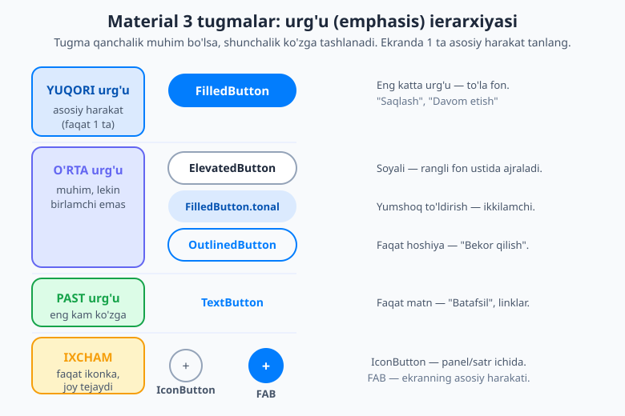
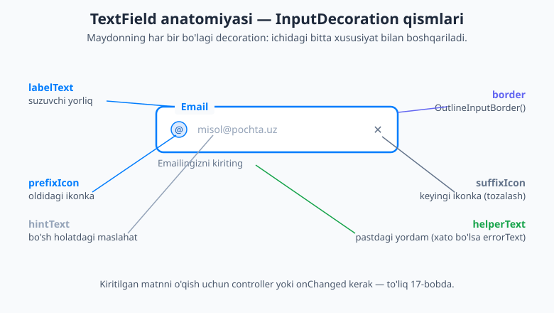
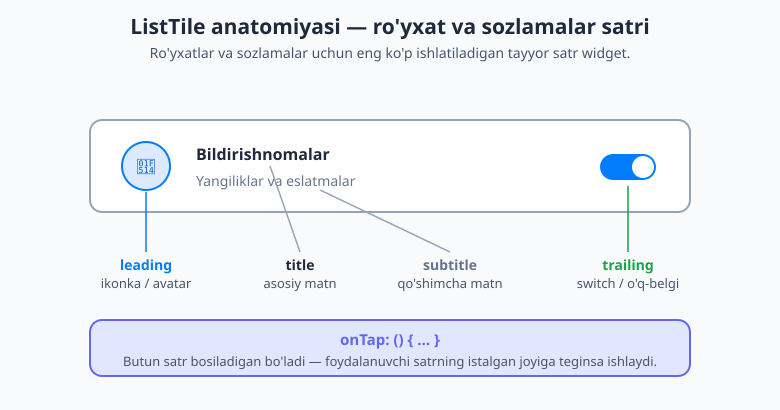

# 15 — Asosiy UI widgetlar

[⬅️ Oldingi: 14 — Material 3, Cupertino va theming](./14-material-cupertino-theming.md) · [🏠 README](./README.md) · [Keyingi: 16 — StatefulWidget va setState ➡️](./16-statefulwidget-setstate.md)

---

> **Bu bobda:** endi qurilish g'ishtlari bilan tanishamiz — deyarli **har bir ilova** ishlatadigan asosiy UI widgetlar katalogi. Material 3 **tugmalar ierarxiyasini** (`FilledButton`, `ElevatedButton`, `FilledButton.tonal`, `OutlinedButton`, `TextButton`, `IconButton`, `FloatingActionButton`) va qaysi birini qachon ishlatishni o'rganamiz; `TextField` va uning `InputDecoration` qismlarini bo'lak-bo'lak ko'ramiz; tanlov boshqaruvlari — `Checkbox`, `Switch`, `Radio`, `Slider`; tarkibni guruhlovchi `Card`; ro'yxatlarning ishchi oti `ListTile`; `Chip` oilasi; va foydalanuvchiga **fikr-mulohaza** (feedback) berish — `SnackBar`, `AlertDialog`, progress indikatorlari. Oxirida bularni birlashtirib **sozlamalar ekrani** va **login formasi** layout'ini quramiz. Muhim ogohlantirish: bu yerda widgetlarning **shaklini** ko'rsatamiz; ularni *jonli* (bosilganda haqiqatan o'zgaradigan) qilish uchun **holat** kerak — bu keyingi, [16-bob](./16-statefulwidget-setstate.md) mavzusi.

---

## Katalog boshlanishidan oldin: nega bu boblar muhim

Oldingi boblarda layout'ni (`Row`, `Column`, `Container`, `Stack`) va Material 3 mavzusini ([14-bob](./14-material-cupertino-theming.md)) ko'rdik — ya'ni narsalarni **qayerga** qo'yishni va ular qanday **rang** olishini bilamiz. Endi esa shu joylarga **nima** qo'yishni o'rganamiz: tugmalar, matn maydonlari, kalitlar (switch), kartochkalar.

Buni oshxonadagi idishlar to'plamiga o'xshating. Sizda allaqachon javon (layout) va dizayn (theme) bor. Bu bob — **idishlarning o'zi**: piyola, tarelka, qoshiq. Har birini bir marta tanisangiz, keyin har bir ovqatda (ilovada) qayta-qayta ishlatasiz. Shuning uchun bu bobni **lug'at** sifatida o'qing — hozir bir o'qib chiqing, keyin kerak bo'lganda qaytib kelib qaraysiz.

> 💡 **Bitta tushunchani oldindan aytib qo'yamiz.** Quyidagi ko'p widgetlarda `onPressed:`, `onChanged:`, `onTap:` kabi parametrlar bor — bular foydalanuvchi tegiganda **chaqiriladigan funksiya**. Bu yerda biz ularning ichida ko'pincha `print(...)` yozamiz yoki "16-bobda jonli qilamiz" deymiz. Sababi: tugma bosilganda ekrandagi qiymatni **haqiqatan o'zgartirish** uchun `StatefulWidget` va `setState` kerak — bu [16-bobning](./16-statefulwidget-setstate.md) mavzusi. Hozircha *shaklni* o'rganamiz.

## Tugmalar — Material 3 ierarxiyasi

Tugma — foydalanuvchi bosadigan, biror harakatni boshlaydigan element. Flutter'da bitta "tugma" emas, balki **bir nechta turdagi** tugma bor. Nega? Chunki ekrandagi har bir tugma **bir xil darajada muhim emas**. "Saqlash" tugmasi "Bekor qilish"dan muhimroq; "Batafsil" havolasi ulardan ham past. Material 3 shu muhimlik darajasini — **urg'u** (emphasis) — tugma ko'rinishi orqali ifodalashni taklif qiladi.



Qoida sodda: **ekrandagi eng muhim, asosiy harakatni eng baland urg'uli tugma bilan ko'rsating, qolganlarini pastroq bilan.** Bitta ekranda odatda **faqat bitta** yuqori urg'uli (to'la rangli) tugma bo'lishi kerak — aks holda foydalanuvchining ko'zi qayerga qarashni bilmaydi.

### FilledButton — yuqori urg'u (asosiy harakat)

Eng muhim, birlamchi harakat uchun. To'la rangli foni bilan ko'zga eng yaqqol tashlanadi.

```dart
FilledButton(
  onPressed: () {
    print('Saqlandi!');
  },
  child: const Text('Saqlash'),
)
```

Eng muhim parametr — **`onPressed:`**. Bu tugma bosilganda ishga tushadigan funksiya. Va mana bitta juda muhim qoida:

> 💡 **`onPressed: null` — tugmani o'chiradi (disabled).** Agar `onPressed` ga `null` bersangiz, tugma kulrang va bosilmaydigan bo'lib qoladi. Bu juda foydali: masalan, forma to'liq to'ldirilmaguncha "Yuborish" tugmasini `null` qilib o'chirib qo'yasiz. (Buni dinamik qilish — qachon `null`, qachon funksiya — ham holatga bog'liq, 16-bob.)

```dart
const FilledButton(
  onPressed: null,            // o'chirilgan — kulrang, bosilmaydi
  child: Text('Hozircha mumkin emas'),
)
```

### ElevatedButton va FilledButton.tonal — o'rta urg'u

`ElevatedButton` — biroz **soyali** (ko'tarilgan) tugma. Rangli yoki rasmli fon ustida joylashganda yaxshi ajraladi.

```dart
ElevatedButton(
  onPressed: () => print('bosildi'),
  child: const Text('Qo\'shish'),
)
```

`FilledButton.tonal` — `FilledButton`'ning yumshoqroq, ochroq rangli ko'rinishi. Ikkilamchi, lekin baribir e'tiborni tortadigan harakatlar uchun ("yuqori"dan past, "outlined"dan baland).

```dart
FilledButton.tonal(
  onPressed: () => print('tonal bosildi'),
  child: const Text('Saralash'),
)
```

### OutlinedButton — o'rta/past urg'u

Faqat **hoshiya** (chiziq) bilan, ichi bo'sh. Ko'pincha "Bekor qilish" yoki ikkilamchi tanlov uchun, FilledButton yonida juftlik bo'lib turadi.

```dart
OutlinedButton(
  onPressed: () => print('bekor qilindi'),
  child: const Text('Bekor qilish'),
)
```

### TextButton — past urg'u

Eng kam ko'zga tashlanadigan tugma — faqat matn, fonsiz va hoshiyasiz. "Batafsil", "Parolni unutdingizmi?", dialog ichidagi tugmalar uchun.

```dart
TextButton(
  onPressed: () => print('batafsil'),
  child: const Text('Batafsil'),
)
```

### Ikonkali tugmalar (`.icon` konstruktori)

Yuqoridagi har bir tugmaning **`.icon`** ko'rinishi bor — matn yoniga ikonka qo'shadi. Bu harakatning ma'nosini tezroq tushuntiradi.

```dart
FilledButton.icon(
  onPressed: () => print('yuklab olinmoqda'),
  icon: const Icon(Icons.download),
  label: const Text('Yuklab olish'),   // bu yerda child emas, label!
)
```

> 💡 E'tibor bering: oddiy konstruktorda `child:` bor edi, `.icon` konstruktorida esa `icon:` va **`label:`** bo'ladi.

### IconButton — faqat ikonka

Matnsiz, faqat ikonka. Joy tejaydi — shuning uchun `AppBar`da, satr ichida, ro'yxat oxirida ko'p ishlatiladi (qidiruv, sozlamalar, yopish belgisi).

```dart
IconButton(
  onPressed: () => print('qidiruv'),
  icon: const Icon(Icons.search),
  tooltip: 'Qidirish',     // ustiga bosib turganda chiqadigan maslahat
)
```

### FloatingActionButton (FAB) — ekranning asosiy harakati

Dumaloq, suzib turadigan tugma — odatda ekranning pastki-o'ng burchagida. Ekrandagi **eng asosiy** harakat uchun ishlatiladi (masalan "yangi xabar", "+"). U `Scaffold`ning maxsus uyasiga joylanadi:

```dart
Scaffold(
  appBar: AppBar(title: const Text('Vazifalar')),
  body: const Center(child: Text('Ro\'yxat shu yerda')),
  floatingActionButton: FloatingActionButton(
    onPressed: () => print('yangi vazifa'),
    tooltip: 'Qo\'shish',
    child: const Icon(Icons.add),
  ),
)
```

### Tugma ko'rinishini sozlash — `styleFrom`

Tugma rangi yoki o'lchamini o'zgartirmoqchi bo'lsangiz, har bir tugma turining `styleFrom` yordamchisi bor. U `ButtonStyle` obyektini qulay tarzda yasab beradi:

```dart
FilledButton(
  onPressed: () {},
  style: FilledButton.styleFrom(
    backgroundColor: Colors.green,
    padding: const EdgeInsets.symmetric(horizontal: 32, vertical: 16),
  ),
  child: const Text('Yashil tugma'),
)
```

> 💡 Ko'pincha buning kerak ham bo'lmaydi: [14-bobdagi](./14-material-cupertino-theming.md) `ColorScheme` allaqachon barcha tugmalarga uyg'un ranglar beradi. `styleFrom`ni faqat alohida tugmani ajratmoqchi bo'lganingizda ishlating.

## TextField — matn kiritish maydoni

`TextField` — foydalanuvchi **klaviaturadan matn yozadigan** maydon: ism, email, parol, izoh. Bu deyarli har bir formada bor.

Eng muhim parametr — **`decoration:`**, unga `InputDecoration(...)` beriladi. Aynan shu maydonning ko'rinishini — yorliq, maslahat matni, ikonkalar, hoshiya — boshqaradi. Quyidagi rasmda har bir qism qaysi xususiyatdan kelishini ko'ring:



```dart
TextField(
  decoration: InputDecoration(
    labelText: 'Email',                 // suzuvchi yorliq
    hintText: 'misol@pochta.uz',        // bo'sh holatdagi maslahat
    helperText: 'Emailingizni kiriting', // pastdagi yordam matni
    prefixIcon: const Icon(Icons.email), // oldidagi ikonka
    border: const OutlineInputBorder(),  // to'liq hoshiya
  ),
)
```

`InputDecoration`ning eng ko'p ishlatiladigan qismlari:

| Xususiyat | Nima qiladi |
|---|---|
| `labelText` | Maydon ustida turuvchi yorliq (fokuslanganda suzib yuqoriga chiqadi). |
| `hintText` | Maydon bo'sh bo'lganda ichida ko'rinadigan kulrang maslahat. |
| `helperText` | Maydon ostidagi kichik yordam matni. |
| `prefixIcon` / `suffixIcon` | Maydon boshidagi / oxiridagi ikonka. |
| `border: OutlineInputBorder()` | Maydonni to'liq ramka (hoshiya) bilan o'raydi. |

### Klaviatura turi va parol

`keyboardType` — qaysi turdagi klaviatura chiqishini belgilaydi (raqamlar uchun raqamli klaviatura qulayroq). `obscureText: true` esa yozilgan matnni nuqtalar bilan yashiradi — **parol** uchun shart.

```dart
// Raqam kiritish uchun
TextField(
  keyboardType: TextInputType.number,
  decoration: const InputDecoration(labelText: 'Yosh'),
)

// Email uchun
TextField(
  keyboardType: TextInputType.emailAddress,
  decoration: const InputDecoration(labelText: 'Email'),
)

// Parol uchun — yozilgan belgilar yashiriladi
TextField(
  obscureText: true,
  decoration: const InputDecoration(
    labelText: 'Parol',
    prefixIcon: Icon(Icons.lock),
  ),
)
```

### Kiritilgan matnni qanday o'qiymiz?

Foydalanuvchi yozgan matnni olishning ikki yo'li bor:

- **`onChanged:`** — har bir belgi o'zgarganda chaqiriladigan funksiya, yangi matnni argument sifatida beradi:

```dart
TextField(
  onChanged: (matn) {
    print('Hozir yozilgan: $matn');
  },
)
```

- **`controller:`** — `TextEditingController` orqali maydonni boshqarish (matnni o'qish, tozalash, oldindan to'ldirish).

> 💡 `TextEditingController`, forma validatsiyasi (`Form` + `TextFormField` bilan "email noto'g'ri" kabi tekshiruvlar) — bularning hammasini [17-bobda](./17-formalar-kiritma.md) keyin, formalarga bag'ishlangan bo'limda batafsil ko'ramiz. Hozircha `onChanged` bilan matnni "eshitishni" biling — bu yetarli.

## Tanlov boshqaruvlari — Checkbox, Switch, Radio, Slider

Bular foydalanuvchi **tanlov** qiladigan widgetlar: belgilash katakchasi, yoqish/o'chirish kaliti, variantlardan birini tanlash, qiymatni surg'ich bilan o'rnatish.

Hammasining umumiy shakli **bir xil**: ular `value` (hozirgi qiymat) va `onChanged` (qiymat o'zgarganda chaqiriladigan funksiya) oladi.

> ⚠️ **Juda muhim:** bu widgetlar **o'zicha o'zgarmaydi.** Siz `value:` ga bergan qiymatni ko'rsatadi, xolos. Foydalanuvchi bosganda `onChanged` chaqiriladi — lekin ekranda haqiqatan belgi qo'yilishi uchun **siz `value`ni yangilab, qaytadan qurishingiz** kerak. Buning uchun esa **holat** (state) lozim. Quyida widgetlarning *shaklini* ko'rsatamiz; ularni **jonli qilishni [16-bobda](./16-statefulwidget-setstate.md)** o'rganamiz. Shuning uchun `onChanged` ichida hozircha `print` yozamiz.

### Checkbox — belgilash katakchasi

Ha/yo'q tanlovi uchun (masalan "Shartlarga roziman").

```dart
Checkbox(
  value: true,                      // hozirgi holat (belgilangan)
  onChanged: (yangi) {
    print('Checkbox: $yangi');      // 16-bobda value'ni yangilaymiz
  },
)
```

### Switch — yoqish/o'chirish kaliti

Sozlamalarda biror narsani yoqish/o'chirish uchun (Wi-Fi, bildirishnomalar).

```dart
Switch(
  value: false,
  onChanged: (yangi) => print('Switch: $yangi'),
)
```

### Radio / RadioGroup — bir nechtadan bittasini tanlash

`Radio` — bir-birini istisno qiladigan variantlar uchun (faqat bittasi tanlangan bo'ladi: masalan "Erkak / Ayol"). Material 3'da bir guruh radiolarni `RadioGroup` bilan o'rab, umumiy tanlangan qiymatni boshqariladi:

```dart
RadioGroup<String>(
  groupValue: 'erkak',                  // hozir tanlangan variant
  onChanged: (yangi) => print('Tanlandi: $yangi'),
  child: const Column(
    children: [
      RadioListTile<String>(
        value: 'erkak',
        title: Text('Erkak'),
      ),
      RadioListTile<String>(
        value: 'ayol',
        title: Text('Ayol'),
      ),
    ],
  ),
)
```

### Slider — surg'ich bilan qiymat tanlash

Diapazondagi qiymatni (ovoz balandligi, yorqinlik) tanlash uchun.

```dart
Slider(
  value: 0.4,           // 0.0 dan 1.0 gacha (standart diapazon)
  onChanged: (yangi) => print('Slider: $yangi'),
)
```

### Qulay ko'rinishlar — CheckboxListTile va SwitchListTile

Amalda siz ko'pincha katakcha yoniga **yorliq matni** ham qo'yishni istaysiz. Buni qo'lda `Row` qurmasdan, tayyor **`CheckboxListTile`** va **`SwitchListTile`** widgetlari hal qiladi — ular `Checkbox`/`Switch`ni `ListTile` (matnli satr) ichiga joylab beradi:

```dart
SwitchListTile(
  value: true,
  onChanged: (yangi) => print('Bildirishnoma: $yangi'),
  title: const Text('Bildirishnomalar'),
  subtitle: const Text('Yangiliklar haqida xabar berish'),
  secondary: const Icon(Icons.notifications),
)
```

Sozlamalar ekranida aynan shu ko'rinish eng ko'p kerak bo'ladi.

## Card — tarkibni guruhlash

`Card` — burchaklari yumaloqlangan, biroz soyali "kartochka". U bog'liq ma'lumotlarni **bir guruh** qilib, qolganidan vizual ajratadi (mahsulot, profil, xabar kartochkasi).

```dart
Card(
  elevation: 2,                       // soya darajasi (balandlik)
  child: Padding(
    padding: const EdgeInsets.all(16),
    child: Column(
      crossAxisAlignment: CrossAxisAlignment.start,
      children: const [
        Text('Flutter kursi', style: TextStyle(fontSize: 18, fontWeight: FontWeight.bold)),
        SizedBox(height: 8),
        Text('0 dan ekspertgacha. 26 ta bob.'),
      ],
    ),
  ),
)
```

> 💡 `Card`ning o'zi ichki bo'shliq (padding) bermaydi — shuning uchun ichiga ko'pincha `Padding` qo'yiladi. `shape:` orqali burchak shaklini, `elevation:` orqali soyani sozlashingiz mumkin.

## ListTile — ro'yxatlarning ishchi oti

`ListTile` — eng ko'p ishlatiladigan **satr** widget. Ro'yxatlarda, menyularda va ayniqsa **sozlamalar ekranlarida** har bir qatorni shu yasaydi. U tayyor, standart joylashuvga ega bo'lgan to'rt uyani beradi:



```dart
ListTile(
  leading: const Icon(Icons.person),    // chapdagi ikonka/avatar
  title: const Text('Profil'),          // asosiy matn
  subtitle: const Text('Ism, rasm, bio'), // qo'shimcha matn
  trailing: const Icon(Icons.chevron_right), // o'ngdagi belgi (o'q)
  onTap: () => print('Profil ochildi'),  // butun satr bosiladi
)
```

`ListTile`ning uyalari:

| Uya | Odatda nima qo'yiladi |
|---|---|
| `leading` | Chapdagi ikonka yoki avatar. |
| `title` | Asosiy matn (sarlavha). |
| `subtitle` | Title ostidagi qo'shimcha matn. |
| `trailing` | O'ngdagi element — o'q (`Icons.chevron_right`), `Switch` yoki `Chip`. |
| `onTap` | Butun satr bosilganda chaqiriladi. |

> 💡 `onTap` — `ListTile`ni butunlay bosiladigan qiladi: foydalanuvchi satrning **istalgan joyiga** tegsa ishlaydi, faqat ikonkaga emas. Sozlamalar va menyularda navigatsiya uchun shu juda qulay.

## Chip oilasi — ixcham yorliq/tanlovlar

`Chip` — kichik, dumaloq burchakli "tabletka" shaklidagi element. Teglar, filtrlar yoki kichik harakatlar uchun ishlatiladi.

```dart
// Oddiy yorliq
const Chip(label: Text('Flutter'))

// Bosiladigan harakat chip'i
ActionChip(
  label: const Text('Ulashish'),
  avatar: const Icon(Icons.share, size: 18),
  onPressed: () => print('ulashildi'),
)

// Filtr chip'i — tanlanadigan/o'chiriladigan (holat kerak — 16-bob)
FilterChip(
  label: const Text('Bepul'),
  selected: true,
  onSelected: (tanlandi) => print('Filtr: $tanlandi'),
)
```

`ActionChip` bosilganda biror harakat qiladi; `FilterChip` esa tanlanadigan (belgilanadigan) bo'lib, filtrlar uchun ishlatiladi — uning ham haqiqiy tanlanishi holatga bog'liq.

## Fikr-mulohaza (feedback) widgetlari

Foydalanuvchiga "men sizni eshitdim" deb bildirish ham UI'ning muhim qismi. Eng ko'p ishlatiladiganlari:

### SnackBar — pastdan chiqadigan qisqa xabar

Ekran pastida bir necha soniya ko'rinib yo'qoladigan kichik xabar ("Saqlandi", "Internet yo'q"). Uni `ScaffoldMessenger` orqali ko'rsatasiz:

```dart
ElevatedButton(
  onPressed: () {
    ScaffoldMessenger.of(context).showSnackBar(
      const SnackBar(content: Text('Saqlandi!')),
    );
  },
  child: const Text('Saqlash'),
)
```

> 💡 `ScaffoldMessenger.of(context)` — `context`dan eng yaqin `Scaffold`ning "xabarchisi"ni topadi va unga SnackBar ko'rsatishni buyuradi. `context` haqida [10-bobda](./README.md) gaplashgandik — bu widgetning daraxtdagi o'rni.

### AlertDialog — modal dialog

Foydalanuvchidan **tasdiq** so'raydigan oyna ("O'chirishni xohlaysizmi?"). `showDialog` bilan chiqariladi:

```dart
showDialog(
  context: context,
  builder: (context) => AlertDialog(
    title: const Text('O\'chirish'),
    content: const Text('Rostdan ham o\'chirilsinmi?'),
    actions: [
      TextButton(
        onPressed: () => Navigator.pop(context),  // dialogni yopish
        child: const Text('Yo\'q'),
      ),
      FilledButton(
        onPressed: () => Navigator.pop(context),
        child: const Text('Ha'),
      ),
    ],
  ),
);
```

E'tibor bering — dialog ichidagi tugmalar ham aynan o'sha tanish `TextButton` va `FilledButton` (past urg'u "Yo'q", yuqori urg'u "Ha"). Dialoglar va navigatsiyani to'liq [19-bobda](./README.md) ko'ramiz.

### Progress indikatorlari — kutilmoqda

Biror narsa yuklanayotganini bildiradi:

```dart
const CircularProgressIndicator()   // aylanadigan dumaloq
const LinearProgressIndicator()     // gorizontal chiziq
```

Qiymat bermasangiz, ular **cheksiz** (qancha vaqt qolganini bilmaganda) animatsiya qiladi. Aniq foiz ma'lum bo'lsa, `value: 0.7` kabi bersa, to'lib boradigan ko'rsatkich bo'ladi.

## Hammasini birlashtiramiz

Endi bu widgetlarni **alohida** emas, **birga** — haqiqiy ekranlarga yig'amiz. Ana shunda ularning kuchini his qilasiz.

### 1) Sozlamalar ekrani — `ListTile` + `SwitchListTile`

Sozlamalar ekrani — bu deyarli butunlay `ListTile` va `SwitchListTile`lardan tuzilgan ro'yxat. `Card` ichiga joylab, chiroyli guruh qilamiz:

```dart
import 'package:flutter/material.dart';

class SozlamalarEkrani extends StatelessWidget {
  const SozlamalarEkrani({super.key});

  @override
  Widget build(BuildContext context) {
    return Scaffold(
      appBar: AppBar(title: const Text('Sozlamalar')),
      body: ListView(
        children: [
          const Card(
            margin: EdgeInsets.all(12),
            child: Column(
              children: [
                SwitchListTile(
                  value: true,
                  onChanged: _stub,           // 16-bobda jonli qilamiz
                  secondary: Icon(Icons.notifications),
                  title: Text('Bildirishnomalar'),
                ),
                SwitchListTile(
                  value: false,
                  onChanged: _stub,
                  secondary: Icon(Icons.dark_mode),
                  title: Text('Tungi rejim'),
                ),
              ],
            ),
          ),
          Card(
            margin: const EdgeInsets.all(12),
            child: Column(
              children: [
                ListTile(
                  leading: const Icon(Icons.person),
                  title: const Text('Profil'),
                  subtitle: const Text('Ism, rasm'),
                  trailing: const Icon(Icons.chevron_right),
                  onTap: () => print('Profil'),
                ),
                ListTile(
                  leading: const Icon(Icons.lock),
                  title: const Text('Maxfiylik'),
                  trailing: const Icon(Icons.chevron_right),
                  onTap: () => print('Maxfiylik'),
                ),
              ],
            ),
          ),
        ],
      ),
    );
  }

  // Switch hozircha qiymatni o'zgartira olmaydi (holat 16-bobda) —
  // shuning uchun shunchaki "tegildi" deb chop etamiz.
  static void _stub(bool yangi) => print('Switch: $yangi');
}
```

> 💡 `ListView` — bolalarni vertikal **aylantiriladigan** (scroll) ro'yxat qilib joylaydi (ko'p elementlarda `Column`dan farqli ravishda chetiga sig'maganda aylantirib ko'rsatadi). Ro'yxatlarni keyingi bobda batafsil ko'ramiz.

### 2) Login formasi layout'i — `TextField` + `FilledButton`

Login ekrani — ikkita `TextField` (email va parol) va bitta yuqori urg'uli `FilledButton`. Pastida past urg'uli `TextButton` ("Parolni unutdingizmi?"):

```dart
import 'package:flutter/material.dart';

class LoginEkrani extends StatelessWidget {
  const LoginEkrani({super.key});

  @override
  Widget build(BuildContext context) {
    return Scaffold(
      appBar: AppBar(title: const Text('Kirish')),
      body: Padding(
        padding: const EdgeInsets.all(24),
        child: Column(
          mainAxisAlignment: MainAxisAlignment.center,
          children: [
            const TextField(
              keyboardType: TextInputType.emailAddress,
              decoration: InputDecoration(
                labelText: 'Email',
                prefixIcon: Icon(Icons.email),
                border: OutlineInputBorder(),
              ),
            ),
            const SizedBox(height: 16),
            const TextField(
              obscureText: true,
              decoration: InputDecoration(
                labelText: 'Parol',
                prefixIcon: Icon(Icons.lock),
                border: OutlineInputBorder(),
              ),
            ),
            const SizedBox(height: 24),
            // To'la kenglikdagi asosiy tugma
            SizedBox(
              width: double.infinity,
              child: FilledButton(
                onPressed: () => print('Kirish bosildi'),
                child: const Text('Kirish'),
              ),
            ),
            TextButton(
              onPressed: () => print('Parolni tiklash'),
              child: const Text('Parolni unutdingizmi?'),
            ),
          ],
        ),
      ),
    );
  }
}
```

> 💡 `SizedBox(width: double.infinity, child: FilledButton(...))` — bu tugmani ota maydonning **to'liq kengligiga** cho'zadi. Login tugmalari odatda shunday keng bo'ladi. Hozircha yozilgan matnni o'qimaymiz (controller — 17-bob), faqat layout va tugmani ko'rsatyapmiz.

### 3) Kartochkalar ro'yxati

`Card` + `ListTile` birikmasi — eng ko'p uchraydigan "kontent ro'yxati" namunasi (mahsulotlar, maqolalar, kontaktlar):

```dart
ListView(
  children: const [
    Card(
      margin: EdgeInsets.symmetric(horizontal: 12, vertical: 6),
      child: ListTile(
        leading: Icon(Icons.book),
        title: Text('Flutter kitobi'),
        subtitle: Text('26 bob · boshlovchilar uchun'),
        trailing: Icon(Icons.chevron_right),
      ),
    ),
    Card(
      margin: EdgeInsets.symmetric(horizontal: 12, vertical: 6),
      child: ListTile(
        leading: Icon(Icons.code),
        title: Text('Dart asoslari'),
        subtitle: Text('9 bob · til poydevori'),
        trailing: Icon(Icons.chevron_right),
      ),
    ),
  ],
)
```

## Keyingi qadam

Endi sizda ilovaning asosiy qurilish g'ishtlari bor: tugmalar, matn maydonlari, kalitlar, kartochkalar, ro'yxat satrlari va fikr-mulohaza widgetlari. Ekranni "tashqi" tarzda qurishni — *qanday ko'rinishini* — to'liq bilasiz.

Lekin bir narsa hali yetishmaydi: bu ekranlar **jonli emas**. `Switch`ni bossangiz o'zgarmaydi, `TextField`ga yozsangiz tugma yonmaydi, `Slider`ni sursangiz qiymat qotib turadi. Buning sababi — biz hech qayerda **holatni** (state) yangilamadik.

Aynan shu — keyingi [16-bobning](./16-statefulwidget-setstate.md) mavzusi: `StatelessWidget`dan `StatefulWidget`ga o'tib, `setState` orqali holatni o'zgartirishni va shu bilan UI'ni qaytadan qurishni o'rganamiz. Ana shunda bu bobdagi barcha widgetlar haqiqatan **tirik** bo'ladi.

---

## Mashqlar

### Oson

1. Material 3 tugmalarini urg'u (emphasis) bo'yicha **eng baland**dan **eng past**gacha tartiblang: `TextButton`, `FilledButton`, `OutlinedButton`. Har biri uchun bittadan haqiqiy misol harakat yozing (masalan "Saqlash").
2. `onPressed: null` tugmaga nima qiladi? Bu qaysi vaziyatda foydali bo'ladi?
3. `InputDecoration`ning quyidagi xususiyatlari nima qilishini bir jumlada yozing: `labelText`, `hintText`, `prefixIcon`, `border`.
4. `ListTile`ning to'rt uyasini (`leading`, `title`, `subtitle`, `trailing`) ayting va har biriga odatda nima qo'yilishini yozing.
5. Parol uchun `TextField`da qaysi parametrni `true` qilish kerak, va u nima qiladi?

### O'rta

6. To'liq, kompilyatsiya bo'ladigan `Scaffold` yozing: `AppBar`da "Mahsulot" sarlavhasi, `body`da markazda bitta `Card`, kartochka ichida `ListTile` (`leading` — `Icons.shopping_cart`, `title` — "Telefon", `subtitle` — "1 200 000 so'm").
7. Login formasidagi "Kirish" tugmasi nega `SizedBox(width: double.infinity, ...)` ichiga o'ralgan? Buni olib tashlasak nima o'zgaradi?
8. `Checkbox`, `Switch`, `Slider` widgetlarining umumiy ikkita parametri qaysi? Nega bu kitobning hozirgi bosqichida ularning `onChanged` ichiga `print` yozyapmiz, qiymatni o'zgartirmayapmiz?

### Qiyin

9. Bitta sozlamalar `Card`i yozing: ichida ikkita `SwitchListTile` ("Bildirishnomalar", "Tungi rejim") va bitta `ListTile` ("Til", `trailing` — o'q-belgi, `onTap` bilan). `onChanged`/`onTap` ichida `print` ishlating va kod nega hozir *jonli* emasligini bir izoh bilan tushuntiring.
10. `FilledButton`, `FilledButton.tonal`, `OutlinedButton`, `TextButton` — bularning hammasi bitta "Buyurtma berish" ekranida bo'lsa, qaysi harakatga qaysi birini berasiz? Misol harakatlarni o'zingiz tanlab, tanlovingizni urg'u ierarxiyasi bilan asoslang.

<details markdown="1"><summary>Yechimlar</summary>

**1.** Eng balanddan eng pastgacha: **`FilledButton`** (yuqori urg'u — asosiy harakat, masalan "Saqlash") → **`OutlinedButton`** (o'rta urg'u — ikkilamchi, masalan "Bekor qilish") → **`TextButton`** (past urg'u — masalan "Batafsil"). To'la rangli fon eng ko'p e'tibor tortadi, faqat hoshiya o'rtacha, faqat matn eng kam.

**2.** `onPressed: null` tugmani **o'chiradi** (disabled) — u kulrang bo'lib qoladi va bosilmaydi. Bu, masalan, forma to'liq to'ldirilmaguncha "Yuborish" tugmasini faolsiz qilib turish uchun foydali — foydalanuvchi xato vaziyatda tugmani bosa olmaydi.

**3.**
- `labelText` — maydon ustida turuvchi yorliq (fokuslanganda yuqoriga suzib chiqadi).
- `hintText` — maydon bo'sh bo'lganda ichida ko'rinadigan kulrang maslahat matni.
- `prefixIcon` — maydon boshidagi (chap tomondagi) ikonka.
- `border` — maydonni o'rab turuvchi hoshiya (`OutlineInputBorder()` to'liq ramka beradi).

**4.**
- `leading` — chapdagi ikonka yoki avatar.
- `title` — asosiy matn (sarlavha).
- `subtitle` — title ostidagi qo'shimcha matn.
- `trailing` — o'ngdagi element: o'q-belgi (`Icons.chevron_right`), `Switch` yoki `Chip`.

**5.** `obscureText: true`. U yozilgan har bir belgini nuqta bilan yashiradi, shunda parol ekranda ochiq ko'rinmaydi.

**6.**
```dart
import 'package:flutter/material.dart';

class MahsulotEkrani extends StatelessWidget {
  const MahsulotEkrani({super.key});

  @override
  Widget build(BuildContext context) {
    return Scaffold(
      appBar: AppBar(title: const Text('Mahsulot')),
      body: const Center(
        child: Card(
          child: ListTile(
            leading: Icon(Icons.shopping_cart),
            title: Text('Telefon'),
            subtitle: Text('1 200 000 so\'m'),
          ),
        ),
      ),
    );
  }
}
```

**7.** `SizedBox(width: double.infinity, ...)` tugmani ota maydonning **to'liq kengligiga** cho'zadi — login tugmalari odatda shunday keng bo'ladi (bosish oson va vizual jihatdan asosiy harakat ekani bilinadi). Uni olib tashlasak, `FilledButton` faqat o'z matni sig'adigancha (matn kengligida) qisqaradi va o'rtada kichik tugma bo'lib qoladi.

**8.** Umumiy ikkita parametr — **`value`** (hozirgi qiymat) va **`onChanged`** (qiymat o'zgarganda chaqiriladigan funksiya). `print` yozyapmiz, chunki bu widgetlar **o'zicha o'zgarmaydi**: ekranda haqiqatan belgi qo'yilishi uchun `value`ni yangilab, widgetni qaytadan qurish kerak — buning uchun esa **holat** (`StatefulWidget` + `setState`) lozim, u esa 16-bobda. Hozircha faqat shaklni ko'rsatyapmiz.

**9.**
```dart
Card(
  margin: const EdgeInsets.all(12),
  child: Column(
    children: [
      SwitchListTile(
        value: true,
        onChanged: (yangi) => print('Bildirishnoma: $yangi'),
        secondary: const Icon(Icons.notifications),
        title: const Text('Bildirishnomalar'),
      ),
      SwitchListTile(
        value: false,
        onChanged: (yangi) => print('Tungi rejim: $yangi'),
        secondary: const Icon(Icons.dark_mode),
        title: const Text('Tungi rejim'),
      ),
      ListTile(
        leading: const Icon(Icons.language),
        title: const Text('Til'),
        trailing: const Icon(Icons.chevron_right),
        onTap: () => print('Til tanlash'),
      ),
    ],
  ),
)
```
Bu kod *jonli* emas, chunki `SwitchListTile`ning `value`si qat'iy (`true`/`false`) yozib qo'yilgan. Foydalanuvchi switch'ni bossa `onChanged` ishlaydi (`print` chiqadi), lekin `value` o'zgarmagani uchun switch ekranda ko'tarilgan holatda qoladi. Uni jonli qilish uchun `value`ni o'zgaruvchidan olib, `setState` bilan yangilash kerak — 16-bob.

**10.** Tipik tanlov (urg'u ierarxiyasiga ko'ra):
- **`FilledButton`** → "Buyurtma berish" — ekranning **asosiy** harakati, eng baland urg'u (faqat bitta bo'lishi kerak).
- **`FilledButton.tonal`** yoki **`OutlinedButton`** → "Savatga qo'shish" — muhim, lekin birlamchi emas (o'rta urg'u).
- **`OutlinedButton`** → "Bekor qilish" — ikkilamchi, faqat hoshiya bilan.
- **`TextButton`** → "Mahsulot tafsilotlari" yoki "Yetkazib berish shartlari" — past urg'uli, havola kabi.

Asos: bitta ekranda foydalanuvchini bitta asosiy harakatga (`FilledButton`) yo'naltirish kerak; qolganlari pastroq urg'u bilan e'tiborni o'g'irlamasligi lozim.

</details>

---

[⬅️ Oldingi: 14 — Material 3, Cupertino va theming](./14-material-cupertino-theming.md) · [🏠 README](./README.md) · [Keyingi: 16 — StatefulWidget va setState ➡️](./16-statefulwidget-setstate.md)
