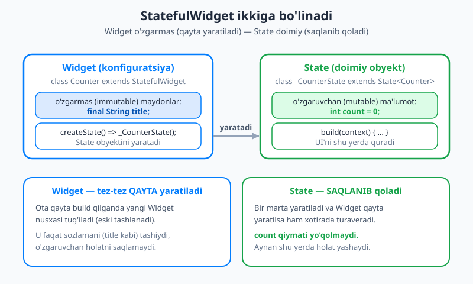
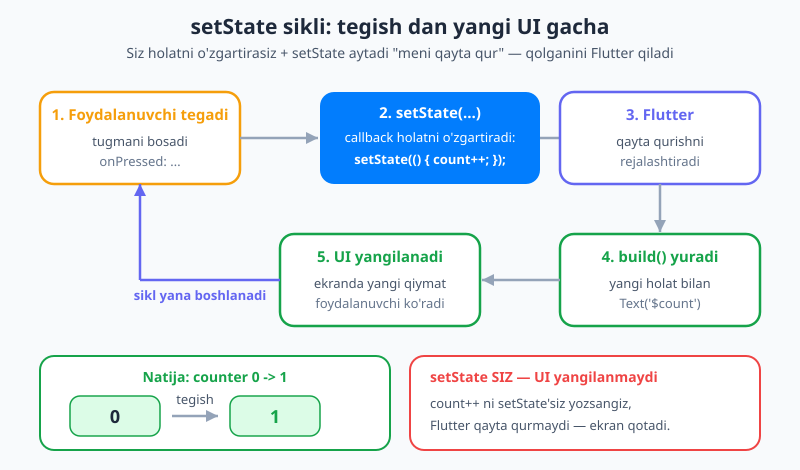
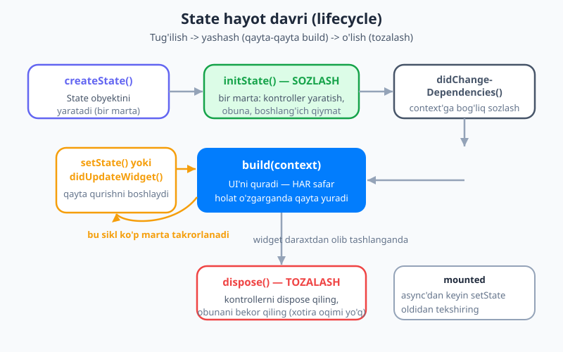

# 16 — StatefulWidget va setState

[⬅️ Oldingi: 15 — Asosiy UI widgetlar](./15-ui-widgetlar.md) · [🏠 README](./README.md) · [Keyingi: 17 — Formalar va foydalanuvchi kiritmasi ➡️](./17-formalar-kiritma.md)

---

> **Bu bobda:** mana, nihoyat — ilovangiz **jonlanadi**. Shu paytgacha qurgan ekranlaringiz chiroyli edi, lekin **harakatsiz**: tugmani bossangiz ham hech narsa o'zgarmasdi. Bu bobda biz buni tuzatamiz. Avval [10-bobdagi](./10-flutter-kirish.md) **`UI = f(holat)`** g'oyasini eslaymiz va nega `StatelessWidget` o'zgara olmasligini ko'ramiz. Keyin **`StatefulWidget`**ni — uning ikkiga (o'zgarmas `Widget` + o'zgaruvchan `State`) bo'linishini va nega aynan shunday bo'linishini tushunamiz. So'ng bu bobning **yuragi** — **`setState`** bilan tanishamiz: holatni o'zgartirib, Flutter'ga "qaytadan qur" deb aytasiz. Birgalikda **hisoblagich (counter)**, **kalit (toggle/Switch)** va **like-tugma** quramiz. Undan keyin **hayot davri (lifecycle) metodlari**ni — `initState`, `dispose`, `build`, `mounted` — va **kontrollerlar** (`TextEditingController`) namunasini o'rganamiz. Oxirida **holatni qayerda saqlash** ("lifting state up") va `setState`ning chegaralarini ko'rib, eng ko'p uchraydigan xatolarni sanab o'tamiz.

---

## Eslatma: UI = f(holat)

[10-bobni](./10-flutter-kirish.md) eslang. Biz Flutter'ning eng muhim g'oyasini bir formula bilan ifodaladik:

> **UI = f(holat)** — interfeys, holatning (state) funksiyasidir.

Ya'ni: sizda biror **holat** (state) bor, `build` funksiyasi shu holatni oladi va u uchun mos UI'ni qaytaradi. Holat o'zgarsa, Flutter `build`'ni qaytadan chaqiradi va yangi UI quradi.

Ammo shu paytgacha qurgan barcha widgetlaringiz **`StatelessWidget`** edi. Nomidan ham bilinadi: *stateless* — "holatsiz". Bunday widget bir marta `build` qilinadi va undan keyin **o'zgarmaydi**. Uning maydonlari `final` (qat'iy), demak ularni keyin o'zgartirib bo'lmaydi.

Lekin haqiqiy ilovalarda ko'p narsa **o'zgaradi**:

- hisoblagich tugma bosilganda **ko'payadi**;
- kalit (switch) yoqiladi va o'chiriladi;
- like-tugma bosilganda yurakcha **to'ladi**;
- formada foydalanuvchi matn **kiritadi**.

Bularning hammasi uchun sizga **holat** kerak — widget **eslab qoladigan, o'zgaruvchan ma'lumot**. Mana shu holatni saqlash va o'zgartirish uchun Flutter'da **`StatefulWidget`** bor.

> 💡 **Aniqlik:** "holat" (state) deganda — vaqt o'tishi bilan o'zgaradigan va ekranga ta'sir qiladigan ma'lumotni tushuning. `count = 3`, `yoqilganmi = true`, `kiritilganMatn = "Salom"` — bularning hammasi holat.

## StatefulWidget vs StatelessWidget

Endi eng muhim tushunchaga keldik. `StatefulWidget` **ikkita klassdan** iborat:

1. **Widget klassi** — `StatefulWidget`'dan meros oladi. Bu **o'zgarmas** (immutable): faqat sozlamalarni (konfiguratsiya) tashiydi, masalan boshlang'ich qiymat yoki sarlavha. Uning maydonlari `final`.
2. **State klassi** — `State<T>`'dan meros oladi. Bu **o'zgaruvchan** (mutable): aynan shu yerda holat (o'zgaruvchan maydonlar) va **`build` metodi** yashaydi.

Nega ikkiga bo'linadi? Sabab chuqur va muhim. Esingizdami, `build` juda **ko'p marta** chaqiriladi va ota widget qayta qurilganda Flutter ko'pincha widget obyektining **yangi nusxasini** yaratadi. Agar holat shu widget ichida saqlansa, har safar yangi nusxa tug'ilganda holat **yo'qolib** ketardi (hisoblagich har qayta qurishda nolga qaytib turardi).

Yechim: **Widget'ni tashlab, qayta yaratish mumkin — lekin State obyekti xotirada saqlanib qoladi.** Flutter widget nusxasini almashtirsa ham, o'sha turdagi State'ni **eslab qoladi**. Demak holat omon qoladi.



Diagrammada ko'rinib turibdi: chap tarafdagi `Widget` (konfiguratsiya) qayta-qayta yaratiladi, lekin o'ng tarafdagi `State` obyekti (`count = 0` saqlanadigan joy) **doimiy** — qayta qurishlarda yo'qolmaydi. Ikkalasini **`createState`** metodi bog'laydi.

Mana standart "skelet" (boilerplate). Buni yodlashga urinmang — VS Code'da `stful` deb yozsangiz, muhit o'zi to'ldirib beradi:

```dart
import 'package:flutter/material.dart';

// 1-klass: o'zgarmas Widget (konfiguratsiya)
class Hisoblagich extends StatefulWidget {
  const Hisoblagich({super.key});

  @override
  State<Hisoblagich> createState() => _HisoblagichState();
}

// 2-klass: o'zgaruvchan State (holat + build)
class _HisoblagichState extends State<Hisoblagich> {
  int count = 0; // <-- HOLAT: o'zgaruvchan maydon

  @override
  Widget build(BuildContext context) {
    return Text('$count');
  }
}
```

Diqqat qiling:

- `createState()` — `Widget` klassining yagona vazifasi: o'ziga mos `State` obyektini yaratib qaytarish.
- `_HisoblagichState` nomi `_` (pastki chiziq) bilan boshlanadi — bu Dart'da **maxfiy** (private) degani. Odatda State klassi shunday yoziladi, chunki u faqat shu faylda kerak.
- `State<Hisoblagich>` — burchakli qavs ichida o'z Widget turingizni yozasiz. Bu State'ga `widget` orqali Widget konfiguratsiyasiga murojaat qilish imkonini beradi (buni pastda ko'ramiz).
- Holat (`int count = 0`) — `final` **emas**, chunki u o'zgarishi kerak. U `State` klassining oddiy maydoni.

## setState — bu bobning yuragi

State'da o'zgaruvchan maydon bor, lekin uni shunchaki o'zgartirsangiz — ekran yangilanmaydi. Nega? Chunki **Flutter sizning maydonlaringizni kuzatib turmaydi.** U `count++` qilganingizni "sezmaydi". Siz unga **o'zingiz aytishingiz** kerak: "men holatni o'zgartirdim, iltimos meni qaytadan qur".

Mana shu xabarni beradigan metod — **`setState`**:

```dart
setState(() {
  count++; // holatni shu yerda o'zgartiring
});
```

`setState` ikki ish qiladi bir vaqtda:

1. **ichidagi funksiyani ishga tushiradi** — siz holatni o'zgartirasiz (`count++`);
2. **Flutter'ga signal beradi** — "bu State o'zgardi, uni qayta qurishni rejalashtir".

Shundan keyin Flutter `build`'ni qaytadan chaqiradi, `build` esa yangi `count` qiymati bilan yangi UI qaytaradi, ekran yangilanadi. Mana to'liq sikl:



> 💡 **Eng muhim qoida:** holatni **doim `setState` ichida** o'zgartiring. Agar `count++` ni `setState`'siz yozsangiz, qiymat xotirada o'zgaradi, lekin **ekran yangilanmaydi** — Flutter qayta qurish kerakligini bilmaydi. Bu yangi boshlovchilarning **eng ko'p uchraydigan xatosi**: "kod to'g'ri, lekin ekran qotib turibdi".

**`setState` ichida nima qilmaslik kerak?** Faqat **holatni o'zgartiring** — qisqa, tez ish. `setState` ichida:

- **`await`/asinxron** ish qilmang (tarmoqdan ma'lumot yuklash kabi). Avval `await` bilan ma'lumotni oling, **keyin** natijani `setState` ichida saqlang.
- **og'ir hisob-kitob** qilmang. Hisobni `setState`dan tashqarida bajaring, faqat tayyor natijani ichida saqlang.

```dart
// ❌ NOTO'G'RI — asinxron ish setState ichida
setState(() async {           // bunday qilmang
  data = await api.fetch();
});

// ✅ TO'G'RI — avval kut, keyin holatni saqla
final natija = await api.fetch();
setState(() {
  data = natija;              // faqat o'zgartirish
});
```

## Birinchi misol: hisoblagich (counter)

Endi nazariyani amalga aylantiramiz. Mana to'liq, ishlaydigan hisoblagich ilovasi. Tugma bosilganda raqam ko'payadi:

```dart
import 'package:flutter/material.dart';

void main() => runApp(const MaterialApp(home: HisoblagichSahifa()));

class HisoblagichSahifa extends StatefulWidget {
  const HisoblagichSahifa({super.key});

  @override
  State<HisoblagichSahifa> createState() => _HisoblagichSahifaState();
}

class _HisoblagichSahifaState extends State<HisoblagichSahifa> {
  int count = 0; // HOLAT

  void _oshir() {
    setState(() {
      count++; // holatni o'zgartirib, qayta qurishni so'raymiz
    });
  }

  @override
  Widget build(BuildContext context) {
    return Scaffold(
      appBar: AppBar(title: const Text('Hisoblagich')),
      body: Center(
        child: Text(
          '$count',
          style: const TextStyle(fontSize: 48, fontWeight: FontWeight.bold),
        ),
      ),
      floatingActionButton: FloatingActionButton(
        onPressed: _oshir, // tugma bosilganda _oshir chaqiriladi
        child: const Icon(Icons.add),
      ),
    );
  }
}
```

Bu kodni jonli ishga tushiring (`flutter run`) va "+" tugmasini bir necha marta bosing — raqam o'sib boradi. Nima sodir bo'lyapti?

1. Tugma bosiladi → `onPressed` `_oshir`'ni chaqiradi.
2. `_oshir` ichida `setState(() { count++; })` — `count` 0 dan 1 ga oshadi va Flutter'ga "qayta qur" deyiladi.
3. Flutter `build`'ni qayta chaqiradi → `Text('$count')` endi `'1'` ko'rsatadi.
4. Ekran yangilanadi.

> 💡 **Tajriba qiling:** `_oshir` ichidagi `setState(...)` qatorini olib tashlab, faqat `count++;` qoldiring. Ilovani qayta ishga tushiring va tugmani bosing — raqam **o'zgarmaydi**! `count` aslida xotirada ko'payib turibdi, lekin `setState` chaqirilmagani uchun Flutter `build`'ni qaytadan ishga tushirmayapti. Mana shu — yuqorida aytgan eng muhim qoidaning amaliy isboti.

## Ikkinchi misol: kalit (toggle / Switch)

[15-bobda](./15-ui-widgetlar.md) `Switch` widgetini ko'rgan, lekin u "ishlamasdi" — chunki holatni saqlash usulini hali bilmasdik. Endi `setState` bilan u jonlanadi. `Switch` ikkita narsani so'raydi: `value` (hozir yoqilganmi?) va `onChanged` (foydalanuvchi o'zgartirganda chaqiriladigan callback).

```dart
class BildirishnomaKaliti extends StatefulWidget {
  const BildirishnomaKaliti({super.key});

  @override
  State<BildirishnomaKaliti> createState() => _BildirishnomaKalitiState();
}

class _BildirishnomaKalitiState extends State<BildirishnomaKaliti> {
  bool yoqilgan = false; // HOLAT

  @override
  Widget build(BuildContext context) {
    return SwitchListTile(
      title: const Text('Bildirishnomalar'),
      value: yoqilgan, // UI holatni aks ettiradi
      onChanged: (yangiQiymat) {
        setState(() {
          yoqilgan = yangiQiymat; // holatni yangilaymiz
        });
      },
    );
  }
}
```

E'tibor bering — `value: yoqilgan` deyapmiz, ya'ni **kalit ko'rinishi holatdan kelib chiqadi** (`UI = f(holat)`). Foydalanuvchi kalitni surganda `onChanged` chaqiriladi, biz `setState` ichida `yoqilgan`ni yangilaymiz, Flutter `build`'ni qayta chaqiradi va kalit yangi holatda chiziladi. Siz kalitni "qo'lda" surmaysiz — faqat holatni o'zgartirasiz.

> 💡 **`SwitchListTile`** — bu `Switch` + matn (sarlavha) ni birga beradigan qulay widget. Faqat kalit kerak bo'lsa, oddiy `Switch(value: ..., onChanged: ...)` ishlatishingiz mumkin.

## Uchinchi misol: like-tugma

Endi o'rganganingizni mustahkamlash uchun **like-tugma** quramiz: bosilganda yurakcha to'ladi yoki bo'shaydi, va yoqtirganlar soni o'zgaradi. Bu yerda **ikkita** holat bor:

```dart
class LikeTugma extends StatefulWidget {
  const LikeTugma({super.key});

  @override
  State<LikeTugma> createState() => _LikeTugmaState();
}

class _LikeTugmaState extends State<LikeTugma> {
  bool yoqtirilgan = false; // HOLAT 1
  int soni = 0;             // HOLAT 2

  void _almashtir() {
    setState(() {
      yoqtirilgan = !yoqtirilgan;       // teskarisiga o'tkazamiz
      soni += yoqtirilgan ? 1 : -1;     // sonni mosga keltiramiz
    });
  }

  @override
  Widget build(BuildContext context) {
    return Row(
      mainAxisSize: MainAxisSize.min,
      children: [
        IconButton(
          onPressed: _almashtir,
          icon: Icon(
            yoqtirilgan ? Icons.favorite : Icons.favorite_border,
            color: yoqtirilgan ? Colors.red : null,
          ),
        ),
        Text('$soni'),
      ],
    );
  }
}
```

Bu misolda muhim bir narsa ko'rinadi: **bitta `setState` ichida bir nechta holatni** birga o'zgartirish mumkin (`yoqtirilgan` va `soni`). Flutter ulardan keyin **bir marta** qayta quradi. Ikonkaning ko'rinishi (`favorite` yoki `favorite_border`) va rangi to'liq holatdan kelib chiqadi — yana o'sha `UI = f(holat)`.

## Hayot davri (lifecycle) metodlari

State obyekti tug'iladi, yashaydi (ko'p marta `build` qilinadi) va o'ladi. Bu yo'l davomida Flutter ma'lum nuqtalarda sizning State'ingizdagi maxsus metodlarni chaqiradi. Bularni **hayot davri (lifecycle) metodlari** deyiladi. Mana ularning tartibi:



Eng muhim ikkitasi — `initState` (boshida, **sozlash** uchun) va `dispose` (oxirida, **tozalash** uchun):

- **`createState()`** — State obyektini yaratadi. Bir marta. (Buni odatda o'zgartirmaysiz.)
- **`initState()`** — State birinchi marta yaratilganda **bir marta** chaqiriladi, `build`'dan oldin. Bu yerda **boshlang'ich sozlash** qilinadi: kontrollerlar yaratish, obunaga yozilish (subscription), boshlang'ich ma'lumotni yuklash. ⚠️ Bu yerda `context`ga bog'liq ishlarni (masalan `Theme.of(context)`) qilmang — buning uchun `didChangeDependencies` bor.
- **`didChangeDependencies()`** — `initState`'dan keyin va keyinroq bog'liqliklar o'zgarganda chaqiriladi. `context`ga bog'liq sozlash uchun. (Boshida kamroq kerak bo'ladi.)
- **`didUpdateWidget(eski)`** — **ota** widget yangi konfiguratsiya (yangi `Widget` nusxasi) bergan paytda chaqiriladi. Yangi sozlama eskidan farq qilsa, mos amalni shu yerda qilasiz.
- **`build()`** — UI'ni quradi. **Har bir qayta qurishda** ishlaydi (har `setState`da). Tez va toza bo'lishi shart.
- **`dispose()`** — State butunlay o'chirilganda (widget daraxtdan olib tashlanganda) **bir marta** chaqiriladi. Bu yerda **tozalash** qilinadi: kontrollerlarni `dispose` qilish, obunalarni bekor qilish. ⚠️ Buni unutsangiz — **xotira oqimi** (memory leak) bo'ladi.

Mana hayot davrini ko'rsatadigan kichik misol. Konsolda chiqishni kuzating:

```dart
class HayotDavri extends StatefulWidget {
  const HayotDavri({super.key});

  @override
  State<HayotDavri> createState() => _HayotDavriState();
}

class _HayotDavriState extends State<HayotDavri> {
  @override
  void initState() {
    super.initState(); // har doim super'ni chaqiring
    debugPrint('initState — bir marta: sozlash');
  }

  @override
  Widget build(BuildContext context) {
    debugPrint('build — har qayta qurishda');
    return const Text('Hayot davri misoli');
  }

  @override
  void dispose() {
    debugPrint('dispose — bir marta: tozalash');
    super.dispose(); // dispose'da super'ni OXIRIDA chaqiring
  }
}
```

> 💡 **Qoida:** `initState`'da `super.initState()`ni **birinchi**, `dispose`'da `super.dispose()`ni **oxirgi** qator qilib chaqiring. Aks holda Flutter ogohlantirish beradi.

## Kontrollerlar namunasi: yarat, ishlat, dispose qil

Ko'p widgetlar (matn maydoni, animatsiya, ro'yxat) **kontroller** orqali boshqariladi. Kontroller — bu vaqt o'tishi bilan yashaydigan, xotira egallaydigan obyekt. Shuning uchun u **uchta bosqichdan** o'tadi: `initState`'da **yaratiladi**, `build`'da **ishlatiladi**, `dispose`'da **tozalanadi**.

```dart
class IzohMaydoni extends StatefulWidget {
  const IzohMaydoni({super.key});

  @override
  State<IzohMaydoni> createState() => _IzohMaydoniState();
}

class _IzohMaydoniState extends State<IzohMaydoni> {
  // odatda kontrollerni 'late final' maydon qilib e'lon qilamiz
  late final TextEditingController _kontroller;

  @override
  void initState() {
    super.initState();
    _kontroller = TextEditingController(); // 1. YARAT
  }

  @override
  Widget build(BuildContext context) {
    return TextField(
      controller: _kontroller, // 2. ISHLAT
      decoration: const InputDecoration(labelText: 'Izoh yozing'),
    );
  }

  @override
  void dispose() {
    _kontroller.dispose(); // 3. TOZALA — bu juda muhim!
    super.dispose();
  }
}
```

**Nega `dispose` shunchalik muhim?** `TextEditingController` (va `AnimationController`, oqimlarga obuna kabilar) xotira va resurs egallaydi. Agar State o'chirilganda ularni `dispose` qilmasangiz, ular **xotirada osilib qoladi** — bu **xotira oqimi** (memory leak). Ilova vaqt o'tgan sari sekinlashadi va ko'p xotira "yeydi". Qoida oddiy: **yaratgan har bir kontrollerni `dispose` qiling.**

> 💡 `TextField` va formalar bilan to'liq ishlashni [17-bobda](./17-formalar-kiritma.md) chuqur ko'ramiz. Hozir asosiy **namuna**ni eslang: yarat (`initState`) → ishlat (`build`) → tozala (`dispose`).

## `mounted` — async'dan keyin himoya

Bitta nozik holat bor. Tasavvur qiling, tugma bosilganda tarmoqdan ma'lumot yuklayapsiz (`await`), keyin natijani `setState` bilan saqlamoqchisiz. Lekin yuklash davom etayotganda foydalanuvchi sahifadan chiqib ketishi mumkin — o'shanda State **o'chiriladi** (`dispose` bo'ladi). O'chgan State'da `setState` chaqirsangiz — Flutter **xato** beradi.

Yechim — `mounted` maydonini tekshirish. `mounted` — State hozir ham daraxtda ("ulangan") yoki yo'qligini bildiradigan `bool`:

```dart
Future<void> _yukla() async {
  final natija = await api.malumotOl(); // kutish davomida
  if (!mounted) return; // State o'chgan bo'lsa — to'xtaymiz
  setState(() {
    data = natija;
  });
}
```

Qoida: **`await`'dan keyin `setState` chaqirishdan oldin `if (!mounted) return;` yozing.**

## Holatni qayerda saqlash? "Lifting state up"

Endi muhim savol: holat **qaysi** widgetda yashashi kerak? Tasavvur qiling, ikki widget bitta holatga bog'liq — masalan, bitta tugma sonni oshiradi, boshqa joyda esa o'sha son ko'rsatiladi. Holat qayerda turishi kerak?

Javob: **holatni ikkala widgetning eng yaqin umumiy "ota"sida saqlang.** Bu yondashuv **"holatni yuqoriga ko'tarish" (lifting state up)** deyiladi. Keyin:

- ma'lumotni **pastga** — bolalarga konstruktor orqali uzatasiz (`Bola(qiymat: count)`);
- hodisalarni **yuqoriga** — callback (funksiya) orqali qaytarasiz (`Tugma(onBosildi: _oshir)`).

```dart
// Ota: holat shu yerda yashaydi
class Ota extends StatefulWidget {
  const Ota({super.key});
  @override
  State<Ota> createState() => _OtaState();
}

class _OtaState extends State<Ota> {
  int count = 0;

  @override
  Widget build(BuildContext context) {
    return Column(
      children: [
        KorsatuvchiBola(qiymat: count),          // ma'lumot PASTGA
        TugmaBola(
          onBosildi: () => setState(() => count++), // callback YUQORIGA
        ),
      ],
    );
  }
}
```

Bu yerda `KorsatuvchiBola` va `TugmaBola` — oddiy `StatelessWidget` bo'lishi mumkin; ular holatni saqlamaydi, faqat ota bergan ma'lumotni ko'rsatadi va hodisani ortga qaytaradi.

### setState'ning chegaralari → keyingi qadam

`setState` ajoyib, lekin uning **chegarasi** bor. Ilova kattalashganda holat ko'pincha **chuqurda** kerak bo'ladi: ota → bola → nabira → chevara... Holatni shu zanjir bo'ylab konstruktor orqali qatma-qat uzatish kerak bo'lib qoladi — buni **"prop-drilling"** (qiymatni qatlamlar orasidan o'tkazib o'tkazish) deyiladi. Bu zerikarli va xatoga moyil.

Aynan shu muammoni hal qilish uchun **holat boshqaruvi (state management)** vositalari bor. Ular holatni bitta markaziy joyda saqlab, kerakli widgetga **to'g'ridan-to'g'ri** yetkazadi — qatma-qat uzatishsiz. Biz bulardan birini — **Provider**ni — [24-bobda](./24-provider.md) o'rganamiz. Hozircha esa `setState` mahalliy (lokal) holat uchun, ayniqsa o'rganishning shu bosqichida, **mukammal** vosita.

## Eng ko'p uchraydigan xatolar

Yangi boshlovchilar `setState` bilan ko'p adashadi. Mana eng tez-tez uchraydiganlari:

- **`setState`siz o'zgartirish.** `count++` deysiz, lekin `setState` ichida emas → ekran yangilanmaydi. Holatni doim `setState` ichida o'zgartiring.
- **`build` ichida `setState` chaqirish.** Bu **cheksiz sikl** keltirib chiqaradi: `build` → `setState` → qayta `build` → yana `setState`... Ilova qotadi. `setState`ni **hodisalardan** (`onPressed` kabi) yoki hayot davri metodlaridan chaqiring, hech qachon `build` ichidan emas.
- **`build` ichida og'ir ish.** Tarmoq so'rovi, fayl o'qish, og'ir hisob — bularni `build` ichida qilmang. `build` ko'p marta chaqiriladi; bunday ishlarni `initState`'da yoki hodisalarda bajaring.
- **`dispose`ni unutish.** Kontroller yaratdingiz, lekin `dispose` qilmadingiz → xotira oqimi. Yaratgan har bir kontrollerni `dispose` qiling.
- **`dispose`dan keyin `setState`.** Asinxron ishdan keyin State o'chgan bo'lishi mumkin. `await`dan keyin `if (!mounted) return;` bilan himoyalaning.

## Keyingi qadam

Tabriklaymiz — ilovangiz endi **jonli**! Siz Flutter'ning interaktivlik yuragini o'rgandingiz: `StatefulWidget` holatni `Widget`+`State` bo'linishi orqali saqlaydi, `setState` esa holatni o'zgartirib qayta qurishni boshlaydi. Hayot davri metodlari (`initState`/`dispose`) va `mounted` bilan resurslarni to'g'ri boshqarishni ko'rdingiz.

Keyingi [17-bobda](./17-formalar-kiritma.md) bu bilimni amalga oshirib, **formalar va foydalanuvchi kiritmasi** bilan ishlaymiz: `TextField`, `TextEditingController`, validatsiya (tekshirish) va `Form` widgeti. Holatni butun ilova bo'ylab keng tarqatish — **Provider** bilan — esa [24-bobda](./24-provider.md) keladi.

---

## Mashqlar

### Oson

1. O'z so'zlaringiz bilan ayting: nega `StatefulWidget` ikkita klassga (`Widget` va `State`) bo'linadi? Qaysi biri o'zgarmas, qaysi biri o'zgaruvchan?
2. `setState` ikkita ishni bir vaqtda qiladi. Bu ikki ish nima?
3. Bir o'quvchi `count++;` deb yozdi (`setState`siz), lekin ekran yangilanmayapti. Sabab nimada? Tuzating.
4. `initState` va `dispose` metodlari nima uchun? Har biriga bittadan amaliy misol (nima qilinadi) keltiring.

### O'rta

5. To'liq, kompilyatsiya bo'ladigan **hisoblagich** ilovasini yozing, lekin endi **ikkita** tugma bilan: biri sonni oshiradi (`+`), ikkinchisi kamaytiradi (`-`). Son markazda ko'rinsin.
6. `TextEditingController` ishlatadigan kichik `StatefulWidget` yozing: u `initState`'da kontroller yaratsin, `build`'da `TextField`da ishlatsin va `dispose`'da tozalasin. Nega `dispose` shart ekanini bir jumlada izohlang.
7. Quyidagi xatoni toping va tuzating: dasturchi `build` metodi ichida `setState(() => count++);` yozib qo'ygan. Nima bo'ladi va nega?

### Qiyin

8. "Lifting state up" g'oyasini tushuntiring: holatni qayerda saqlash kerak, ma'lumot qaysi tomonga (yuqoriga yoki pastga) va callback qaysi tomonga uzatiladi? Kichik kod yoki diagramma bilan ko'rsating.
9. Tugma bosilganda asinxron `await api.malumotOl()` chaqirib, natijani `setState` bilan saqlaydigan metod yozing. `mounted` tekshiruvini qo'ying va **nega** kerakligini izohlang.
10. `setState`ning chegarasi nimada? "Prop-drilling" nima va u qachon muammoga aylanadi? Bu muammoni qaysi yondashuv hal qiladi (kelajakdagi bobga ishora qilib)?

<details markdown="1"><summary>Yechimlar</summary>

**1.** `StatefulWidget` ikkiga bo'linadi, chunki widget obyekti tez-tez qayta yaratiladi (ota har qayta qurganda yangi nusxa tug'ilishi mumkin), lekin holat saqlanib qolishi kerak. **`Widget` klassi** — o'zgarmas (immutable), faqat konfiguratsiyani tashiydi, maydonlari `final`. **`State` klassi** — o'zgaruvchan (mutable), holat (o'zgaruvchan maydonlar) va `build` shu yerda yashaydi va u qayta qurishlarda xotirada saqlanib qoladi.

**2.** `setState`: (1) o'ziga berilgan funksiyani ishga tushiradi — siz holatni shu yerda o'zgartirasiz; (2) Flutter'ga "bu State o'zgardi, qayta qurishni rejalashtir" deb signal beradi. Shuning uchun `build` qaytadan chaqiriladi va UI yangilanadi.

**3.** `count++` `setState` ichida emas — Flutter holat o'zgarganini bilmaydi, shuning uchun `build`'ni qaytadan chaqirmaydi va ekran eski qiymatda qotib qoladi. Tuzatish:
```dart
setState(() {
  count++;
});
```

**4.**
- **`initState`** — State birinchi marta yaratilganda bir marta, `build`'dan oldin chaqiriladi; **sozlash** uchun. Misol: `_kontroller = TextEditingController();` (kontroller yaratish), yoki boshlang'ich ma'lumotni yuklashni boshlash.
- **`dispose`** — State o'chirilganda bir marta chaqiriladi; **tozalash** uchun. Misol: `_kontroller.dispose();` (kontrollerni tozalash) yoki oqim obunasini bekor qilish — xotira oqimining oldini olish.

**5.**
```dart
import 'package:flutter/material.dart';

void main() => runApp(const MaterialApp(home: Hisoblagich()));

class Hisoblagich extends StatefulWidget {
  const Hisoblagich({super.key});
  @override
  State<Hisoblagich> createState() => _HisoblagichState();
}

class _HisoblagichState extends State<Hisoblagich> {
  int count = 0;

  @override
  Widget build(BuildContext context) {
    return Scaffold(
      appBar: AppBar(title: const Text('Hisoblagich')),
      body: Center(
        child: Text(
          '$count',
          style: const TextStyle(fontSize: 48, fontWeight: FontWeight.bold),
        ),
      ),
      floatingActionButton: Row(
        mainAxisAlignment: MainAxisAlignment.end,
        children: [
          FloatingActionButton(
            onPressed: () => setState(() => count--),
            child: const Icon(Icons.remove),
          ),
          const SizedBox(width: 12),
          FloatingActionButton(
            onPressed: () => setState(() => count++),
            child: const Icon(Icons.add),
          ),
        ],
      ),
    );
  }
}
```

**6.**
```dart
class IzohMaydoni extends StatefulWidget {
  const IzohMaydoni({super.key});
  @override
  State<IzohMaydoni> createState() => _IzohMaydoniState();
}

class _IzohMaydoniState extends State<IzohMaydoni> {
  late final TextEditingController _kontroller;

  @override
  void initState() {
    super.initState();
    _kontroller = TextEditingController();
  }

  @override
  Widget build(BuildContext context) {
    return TextField(controller: _kontroller);
  }

  @override
  void dispose() {
    _kontroller.dispose();
    super.dispose();
  }
}
```
`dispose` shart, chunki `TextEditingController` xotira/resurs egallaydi; uni tozalamasak xotira oqimi (memory leak) bo'ladi.

**7.** `build` ichida `setState` chaqirilsa, u qayta qurishni rejalashtiradi → `build` yana ishlaydi → yana `setState`... bu **cheksiz sikl**ga olib keladi, ilova qotadi (yoki Flutter xato beradi). Tuzatish: `setState`ni `build` ichidan **olib tashlang** va uni faqat hodisalardan (`onPressed` kabi) yoki hayot davri metodidan chaqiring. Boshlang'ich qiymat kerak bo'lsa, uni maydon e'lonida yoki `initState`'da bering.

**8.** **Holatni** ikki (yoki undan ko'p) widgetning **eng yaqin umumiy otasida** saqlash kerak ("lifting state up"). **Ma'lumot pastga** uzatiladi — ota bolaga konstruktor orqali qiymat beradi (`Bola(qiymat: count)`). **Callback (funksiya) yuqoriga** uzatiladi — bola hodisani ota bergan funksiya orqali ortga qaytaradi (`Tugma(onBosildi: () => setState(...))`). Shunda holatga ta'sir qiladigan widgetlar bir manbadan boshqariladi va sinxron qoladi.

**9.**
```dart
Future<void> _yukla() async {
  final natija = await api.malumotOl();
  if (!mounted) return; // State o'chgan bo'lsa to'xtaymiz
  setState(() {
    data = natija;
  });
}
```
`mounted` tekshiruvi kerak, chunki `await` davomida (kutish paytida) foydalanuvchi sahifadan chiqib ketishi va State o'chirilishi (`dispose`) mumkin. O'chgan State'da `setState` chaqirilsa, Flutter xato beradi. `if (!mounted) return;` shu holatda metodni xavfsiz to'xtatadi.

**10.** `setState` faqat **mahalliy (lokal)** holat uchun qulay. Ilova kattalashganda holat chuqurda (ota → bola → nabira → ...) kerak bo'lib qoladi va uni shu zanjir bo'ylab konstruktor orqali qatma-qat uzatishga to'g'ri keladi — bu **"prop-drilling"**. U zerikarli, ko'p kod talab qiladi va xatoga moyil: oraliq widgetlar o'zlariga kerak bo'lmagan ma'lumotni faqat "o'tkazib berish" uchun qabul qiladi. Buni **holat boshqaruvi (state management)** hal qiladi — masalan **Provider** ([24-bob](./24-provider.md)) — holatni markaziy joyda saqlab, kerakli widgetga to'g'ridan-to'g'ri yetkazadi.

</details>

---

[⬅️ Oldingi: 15 — Asosiy UI widgetlar](./15-ui-widgetlar.md) · [🏠 README](./README.md) · [Keyingi: 17 — Formalar va foydalanuvchi kiritmasi ➡️](./17-formalar-kiritma.md)
