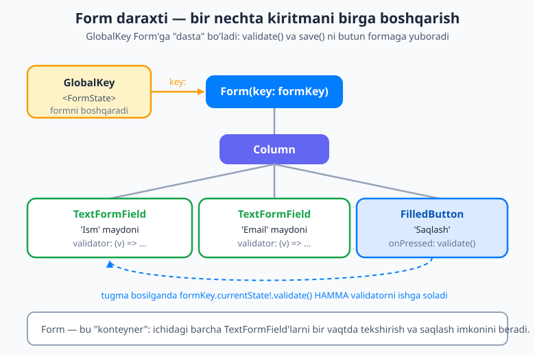
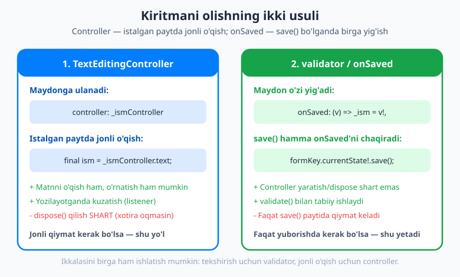
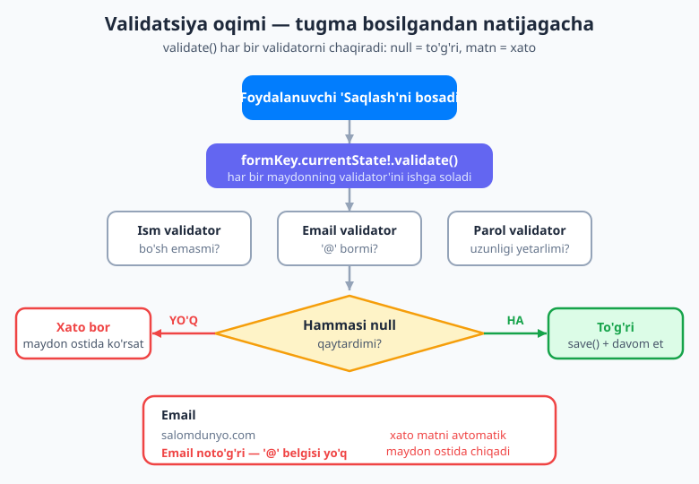

# 17 — Formalar va foydalanuvchi kiritmasi

[⬅️ Oldingi: 16 — StatefulWidget va setState](./16-statefulwidget-setstate.md) · [🏠 README](./README.md) · [Keyingi: 18 — Ro'yxatlar va scroll ➡️](./18-royxatlar-scroll.md)

---

> **Bu bobda:** deyarli har bir jiddiy ilovada foydalanuvchidan **ma'lumot olish** kerak bo'ladi — ro'yxatdan o'tish, kirish, profil tahrirlash, qidiruv. Mana shu bobda biz **forma**larni o'rganamiz: bir nechta kiritma maydonini birga boshqarish, ularni **bir vaqtda tekshirish** (validatsiya) va **bir vaqtda saqlash**. Siz `Form` va uni boshqaradigan `GlobalKey<FormState>` nima ekanini; `TextEditingController` orqali maydon matnini o'qish/o'rnatishni; `TextFormField`ning `validator:` va `onSaved:` callbacklarini; `formKey.currentState!.validate()` va `.save()` qanday ishlashini; eng yaxshi UX uchun `autovalidateMode: AutovalidateMode.onUserInteraction`ni; fokusni boshqarishni (`FocusNode`, "Keyingi" tugmasi); klaviatura turini, parol yashirishni, faqat raqam kiritishni; hamda forma ichida ochiluvchi ro'yxat, sana tanlash va checkboxni o'rganasiz. Oxirida birgalikda **to'liq, tekshiriladigan ro'yxatdan o'tish formasini** noldan quramiz.

---

## Nega "forma" kerak? Bitta maydondan ko'p maydonga

Tasavvur qiling, sizda ro'yxatdan o'tish ekrani bor: ism, email, parol va parolni tasdiqlash. To'rtta maydon. Foydalanuvchi "Ro'yxatdan o'tish" tugmasini bosganda siz **hammasini birdan** tekshirishingiz kerak: ism bo'sh emasmi, email to'g'rimi, parol yetarli uzunmi, ikki parol bir xilmi?

Har bir maydonni alohida, qo'lda tekshirsangiz — kod tez orada chalkash bo'lib ketadi. Aynan shu yerda **`Form`** yordamga keladi. `Form` — bu bir nechta kiritma maydonini **bitta guruh** qilib birlashtiradigan widget. U sizga ikki kuchli imkon beradi:

- **Hammasini bir vaqtda tekshirish** — bitta buyruq bilan barcha maydonlarning validatorlarini ishga tushirasiz.
- **Hammasini bir vaqtda saqlash** — bitta buyruq bilan barcha maydonlardan qiymatni yig'ib olasiz.

`Form` ko'rinmaydi — u faqat ichidagi maydonlarni **boshqaruvchi** rol o'ynaydi (xuddi 10-bobdagi `Center` kabi layout emas, balki "dirijyor"). Uni boshqarish uchun esa sizga unga "dasta" kerak — bu **`GlobalKey<FormState>`**.



```dart
final _formKey = GlobalKey<FormState>();

// ...build ichida:
Form(
  key: _formKey,
  child: Column(
    children: [
      TextFormField(/* ... */),
      TextFormField(/* ... */),
      FilledButton(
        onPressed: () {
          // _formKey orqali butun formaga buyruq beramiz
          if (_formKey.currentState!.validate()) {
            // hamma maydon to'g'ri — davom etamiz
          }
        },
        child: const Text('Saqlash'),
      ),
    ],
  ),
)
```

`GlobalKey<FormState>` nima qiladi? U `Form` widgetining **holatiga** (`FormState`) tashqaridan murojaat qilish kalitidir. `_formKey.currentState` orqali siz "men shu formaga gaplashayapman" deysiz va unga `validate()`, `save()`, `reset()` kabi buyruqlarni yuborasiz. Kalitsiz formani boshqarib bo'lmaydi.

> 💡 **`GlobalKey` — kamyob mehmon.** 10-bobdagi oddiy `key:` (`super.key`) widgetlarni daraxtda ajratish uchun edi. `GlobalKey` esa kuchliroq: u orqali widgetning **holatiga** murojaat qilasiz. Uni faqat shunday zarur joylarda — masalan forma boshqarishda — ishlating, har bir widgetga emas.

## `TextEditingController` — maydon matnini boshqarish

Forma maydonlariga o'tishdan oldin, kiritmani **o'qish**ning eng to'g'ridan-to'g'ri usuli bilan tanishaylik — **`TextEditingController`**.

Controller (boshqaruvchi) — bu matn maydoniga **ulanadigan** kichik obyekt. U orqali siz:

- maydondagi matnni **istalgan paytda o'qiysiz** (`controller.text`);
- matnni dasturiy yo'l bilan **o'rnatasiz** (`controller.text = 'salom'`);
- foydalanuvchi yozganini **kuzatasiz** (listener qo'shib).

Controllerni qayerda yaratamiz? 16-bobdan eslang: o'zgaradigan, "uzoq yashaydigan" obyektlar `StatefulWidget`ning `State` klassida saqlanadi. Controller ham xuddi shunday — uni `State` ichida maydon sifatida yaratamiz va **`dispose()`** metodida tozalaymiz:

```dart
class _NomFormState extends State<NomForm> {
  final _ismController = TextEditingController();

  @override
  void dispose() {
    _ismController.dispose(); // MAJBURIY: xotirani bo'shatadi
    super.dispose();
  }

  @override
  Widget build(BuildContext context) {
    return TextField(
      controller: _ismController,
      decoration: const InputDecoration(labelText: 'Ism'),
    );
  }
}
```

Endi istalgan paytda — masalan tugma bosilganda — matnni o'qiysiz:

```dart
final ism = _ismController.text;
print('Kiritilgan ism: $ism');
```

> ⚠️ **Eng ko'p uchraydigan xato:** controllerni `dispose()` qilishni unutish. 16-bobda ko'rganimizdek, `dispose()` — `State` o'lganda chaqiriladigan tozalash metodi. Controller `dispose` qilinmasa, u xotirada qolib ketadi (**xotira oqishi** — memory leak). Qoida: **har bir yaratgan controllerni `dispose()` qiling.**

### Kiritmani olishning ikki yo'li

Maydondan qiymat olishning ikki asosiy usuli bor, va ularni adashtirmaslik muhim:

1. **`TextEditingController` orqali** — matnni **jonli**, istalgan paytda o'qiysiz (`controller.text`). Matnni o'rnatish yoki yozilayotganini kuzatish kerak bo'lsa, shu yo'l.
2. **`onChanged` / `onSaved` callback orqali** — Flutter qiymatni sizga **uzatadi**. `onChanged` har bir harf yozilganda chaqiriladi; `onSaved` esa forma `save()` qilinganda.



Qaysi birini tanlash kerak? Agar sizga **faqat yuborish vaqtida** qiymat kerak bo'lsa — `onSaved` yetarli, controller yaratish/dispose qilish shart emas. Agar matnni **jonli o'qish/o'rnatish** kerak bo'lsa (masalan "parolni tasdiqlash" maydonini asosiy parol bilan solishtirish) — controller ishlating. Ikkalasini birga ham qo'llash mumkin.

## `TextFormField` — formaga moslashgan matn maydoni

10-16 boblarda `TextField` bilan tanishdingiz. **`TextFormField`** — bu uning "forma-aware" (formani biluvchi) ukasi. Tashqi ko'rinishi bir xil, lekin u `Form` bilan ishlashga moslashgan: `validator:` va `onSaved:` callbacklarini qabul qiladi va `Form` uni avtomatik "ko'radi".

Eng muhim qismi — **`validator:`**. Bu funksiya maydondagi qiymatni oladi va:

- agar qiymat **to'g'ri** bo'lsa — **`null` qaytaradi** (xato yo'q);
- agar qiymat **xato** bo'lsa — **xato matnini (`String`)** qaytaradi; bu matn maydon ostida qizil rangda avtomatik ko'rsatiladi.

```dart
TextFormField(
  decoration: const InputDecoration(
    labelText: 'Ism',
    prefixIcon: Icon(Icons.person),
  ),
  validator: (value) {
    if (value == null || value.isEmpty) {
      return 'Ism majburiy'; // xato matni
    }
    return null; // hammasi joyida
  },
)
```

E'tibor bering: `value` — `String?` (null bo'lishi mumkin), shuning uchun `value == null || value.isEmpty` deb tekshiramiz. **`null` qaytarish = maydon to'g'ri.** Buni esda tuting — ko'pchilik adashadigan joy aynan shu.

### `decoration:` — maydon ko'rinishi va xatosi

`decoration: InputDecoration(...)` — maydonning ko'rinishini sozlaydi: yorliq (`labelText`), ko'rsatma matn (`hintText`), ikonlar (`prefixIcon`, `suffixIcon`), chegara (`border`). Eng yaxshi yangilik: validatordan qaytgan **xato matni `decoration` orqali avtomatik** maydon ostida ko'rsatiladi — siz buni qo'lda qilmaysiz.

```dart
TextFormField(
  decoration: const InputDecoration(
    labelText: 'Email',
    hintText: 'siz@misol.com',
    prefixIcon: Icon(Icons.email),
    border: OutlineInputBorder(),
  ),
  // ...
)
```

## Validatsiya oqimi — `validate()` va `save()`

Endi eng muhim qismga keldik: tugma bosilganda nima sodir bo'ladi?



Oqim shunday:

1. Foydalanuvchi "Saqlash" tugmasini bosadi.
2. Siz **`_formKey.currentState!.validate()`** ni chaqirasiz. Bu buyruq formadagi **har bir** `TextFormField`ning `validator`ini ishga soladi.
3. Agar **barcha** validatorlar `null` qaytarsa — `validate()` **`true`** qaytaradi (forma to'g'ri).
4. Agar **birortasi** xato matn qaytarsa — `validate()` **`false`** qaytaradi va o'sha maydon(lar) ostida xato matni ko'rsatiladi.

```dart
if (_formKey.currentState!.validate()) {
  // hamma maydon to'g'ri
  _formKey.currentState!.save(); // har bir onSaved'ni chaqiradi
  // ...endi yig'ilgan qiymatlar bilan ishlash mumkin
}
```

**`save()`** alohida buyruq: u har bir maydonning `onSaved:` callbackini chaqiradi, ya'ni qiymatlarni "yig'ib oladi". Odatda avval `validate()` bilan tekshirib, faqat to'g'ri bo'lsagina `save()` chaqiramiz.

### `autovalidateMode` — qachon tekshirish kerak?

Yuqoridagi usulda xato faqat tugma bosilganda ko'rinadi. Lekin yaxshiroq UX bor: foydalanuvchi yozayotganda **darhol** fikr-mulohaza berish. Buni `autovalidateMode` boshqaradi:

```dart
Form(
  key: _formKey,
  autovalidateMode: AutovalidateMode.onUserInteraction,
  child: /* ... */,
)
```

`AutovalidateMode.onUserInteraction` — eng yaxshi tanlov. U shunday ishlaydi: forma **dastlab** xato ko'rsatmaydi (foydalanuvchi hali hech narsa kiritmagan bo'lsa, uni qizil bilan "qo'rqitish" yomon). Lekin foydalanuvchi **birinchi marta** maydon bilan ishlagandan keyin, validatsiya har bir o'zgarishda avtomatik ishlaydi — xato bo'lsa darhol ko'rsatadi, tuzatilsa darhol yo'qoladi.

> ⚠️ **Boshidanoq tekshirmang.** `AutovalidateMode.always` formani ochilishidanoq barcha bo'sh maydonlarni qizil qiladi — foydalanuvchi hali yozishni boshlamasdan turib. Bu noqulay. Deyarli har doim `onUserInteraction` ishlating.

## Fokusni boshqarish — maydondan maydonga o'tish

Yaxshi formada foydalanuvchi klaviaturadagi "Keyingi" tugmasi bilan bir maydondan ikkinchisiga sakrab o'tadi. Buni **`FocusNode`** boshqaradi — bu har bir maydonning "fokusi"ni (ya'ni hozir qaysi maydon tahrirlanayotganini) ifodalovchi obyekt.

Asosiy g'oya:

- `textInputAction: TextInputAction.next` — klaviaturadagi tugmani "Keyingi" qiladi (oxirgi maydonda `TextInputAction.done`).
- `onFieldSubmitted:` — foydalanuvchi shu tugmani bosganda chaqiriladi; bu yerda fokusni keyingi maydonga o'tkazamiz.
- `FocusScope.of(context).requestFocus(node)` — fokusni berilgan `FocusNode`ga uzatadi.
- `FocusScope.of(context).unfocus()` — fokusni olib tashlaydi (klaviaturani yopadi); odatda yuborish (submit) paytida ishlatamiz.

```dart
final _emailFocus = FocusNode(); // State ichida; dispose() shart!

// Ism maydonida:
TextFormField(
  textInputAction: TextInputAction.next,
  onFieldSubmitted: (_) {
    FocusScope.of(context).requestFocus(_emailFocus); // emailga o'tadi
  },
  decoration: const InputDecoration(labelText: 'Ism'),
),

// Email maydonida:
TextFormField(
  focusNode: _emailFocus,
  textInputAction: TextInputAction.done,
  decoration: const InputDecoration(labelText: 'Email'),
),
```

> ⚠️ `FocusNode` ham `dispose()` qilinishi kerak — xuddi controller kabi. `State` ichida yaratgan har bir `FocusNode`ni `dispose()` metodida tozalang.

## Klaviatura va kiritmani sozlash

Yaxshi forma **to'g'ri klaviaturani** ko'rsatadi va noto'g'ri kiritishni oldini oladi:

- **`keyboardType:`** — qaysi klaviatura chiqishini belgilaydi: `TextInputType.emailAddress` (email uchun, `@` tugmasi bilan), `TextInputType.number` (raqamlar), `TextInputType.phone` (telefon).
- **`obscureText: true`** — parol maydonlari uchun: yozilgan belgilar nuqtacha bilan yashiriladi.
- **`inputFormatters:`** — kiritishni filtrlaydi. Masalan `FilteringTextInputFormatter.digitsOnly` faqat raqam kiritishga ruxsat beradi (harflarni qabul qilmaydi).
- **`maxLength:`** — maksimal belgilar soni (va pastda hisoblagich ko'rsatadi).

```dart
// Faqat raqam qabul qiluvchi telefon maydoni:
TextFormField(
  keyboardType: TextInputType.phone,
  inputFormatters: [FilteringTextInputFormatter.digitsOnly],
  maxLength: 9,
  decoration: const InputDecoration(labelText: 'Telefon'),
)
```

> 💡 `inputFormatters` ishlatish uchun `import 'package:flutter/services.dart';` kerak bo'ladi — `FilteringTextInputFormatter` shu kutubxonada.

### Parolni yashirish/ko'rsatish tugmasi

Parol maydonlarida ko'p uchraydigan naqsh: ko'z ikonkasini bosib parolni vaqtincha ko'rsatish. Buni `obscureText`ni boshqaradigan **holat** (16-bobdagi `setState`) bilan qilamiz:

```dart
bool _parolYashirin = true; // State ichida

TextFormField(
  obscureText: _parolYashirin,
  decoration: InputDecoration(
    labelText: 'Parol',
    suffixIcon: IconButton(
      icon: Icon(_parolYashirin ? Icons.visibility : Icons.visibility_off),
      onPressed: () {
        setState(() => _parolYashirin = !_parolYashirin);
      },
    ),
  ),
)
```

## Formadagi boshqa kiritmalar

Forma faqat matn maydonidan iborat emas. Quyidagilar ham `Form` ichida ishlaydi:

- **`DropdownButtonFormField`** — ochiluvchi ro'yxat (masalan shahar tanlash). U ham `validator:` qabul qiladi.
- **Sana tanlash** — `showDatePicker(...)` — kalendar oynasini ochadi va `Future<DateTime?>` qaytaradi (9-bobdagi `Future` esingizdami).
- **Checkbox** — `CheckboxListTile` bilan, masalan "Shartlarga roziman".

```dart
// Ochiluvchi ro'yxat:
DropdownButtonFormField<String>(
  decoration: const InputDecoration(labelText: 'Shahar'),
  items: const [
    DropdownMenuItem(value: 'toshkent', child: Text('Toshkent')),
    DropdownMenuItem(value: 'samarqand', child: Text('Samarqand')),
  ],
  onChanged: (value) { /* tanlandi */ },
  validator: (value) => value == null ? 'Shahar tanlang' : null,
),

// Sana tanlash:
final sana = await showDatePicker(
  context: context,
  firstDate: DateTime(1950),
  lastDate: DateTime.now(),
);
if (sana != null) {
  // foydalanuvchi sana tanladi
}
```

## Birgalikda: to'liq ro'yxatdan o'tish formasi

Endi hamma narsani birlashtiramiz. Quyidagi forma: ism, email, parol (yashirish tugmasi bilan) va parolni tasdiqlash. Tugma bosilganda tekshiradi va muvaffaqiyatli bo'lsa `SnackBar` ko'rsatadi. Bu — to'liq, kompilyatsiya bo'ladigan kod:

```dart
import 'package:flutter/material.dart';

class RoyxatdanOtish extends StatefulWidget {
  const RoyxatdanOtish({super.key});

  @override
  State<RoyxatdanOtish> createState() => _RoyxatdanOtishState();
}

class _RoyxatdanOtishState extends State<RoyxatdanOtish> {
  final _formKey = GlobalKey<FormState>();
  final _parolController = TextEditingController();
  bool _parolYashirin = true;

  @override
  void dispose() {
    _parolController.dispose(); // MAJBURIY
    super.dispose();
  }

  void _yubor() {
    // fokusni olib, klaviaturani yopamiz
    FocusScope.of(context).unfocus();

    if (_formKey.currentState!.validate()) {
      _formKey.currentState!.save();
      ScaffoldMessenger.of(context).showSnackBar(
        const SnackBar(content: Text('Ro\'yxatdan muvaffaqiyatli o\'tdingiz!')),
      );
    }
  }

  @override
  Widget build(BuildContext context) {
    return Scaffold(
      appBar: AppBar(title: const Text('Ro\'yxatdan o\'tish')),
      body: Padding(
        padding: const EdgeInsets.all(16),
        child: Form(
          key: _formKey,
          autovalidateMode: AutovalidateMode.onUserInteraction,
          child: Column(
            children: [
              TextFormField(
                textInputAction: TextInputAction.next,
                decoration: const InputDecoration(
                  labelText: 'Ism',
                  prefixIcon: Icon(Icons.person),
                ),
                validator: (value) {
                  if (value == null || value.trim().isEmpty) {
                    return 'Ism majburiy';
                  }
                  return null;
                },
              ),
              const SizedBox(height: 12),
              TextFormField(
                keyboardType: TextInputType.emailAddress,
                textInputAction: TextInputAction.next,
                decoration: const InputDecoration(
                  labelText: 'Email',
                  prefixIcon: Icon(Icons.email),
                ),
                validator: (value) {
                  if (value == null || value.isEmpty) {
                    return 'Email majburiy';
                  }
                  if (!value.contains('@')) {
                    return 'Email noto\'g\'ri';
                  }
                  return null;
                },
              ),
              const SizedBox(height: 12),
              TextFormField(
                controller: _parolController,
                obscureText: _parolYashirin,
                textInputAction: TextInputAction.next,
                decoration: InputDecoration(
                  labelText: 'Parol',
                  prefixIcon: const Icon(Icons.lock),
                  suffixIcon: IconButton(
                    icon: Icon(
                      _parolYashirin ? Icons.visibility : Icons.visibility_off,
                    ),
                    onPressed: () {
                      setState(() => _parolYashirin = !_parolYashirin);
                    },
                  ),
                ),
                validator: (value) {
                  if (value == null || value.length < 6) {
                    return 'Parol kamida 6 belgi bo\'lsin';
                  }
                  return null;
                },
              ),
              const SizedBox(height: 12),
              TextFormField(
                obscureText: true,
                textInputAction: TextInputAction.done,
                decoration: const InputDecoration(
                  labelText: 'Parolni tasdiqlang',
                  prefixIcon: Icon(Icons.lock_outline),
                ),
                onFieldSubmitted: (_) => _yubor(),
                validator: (value) {
                  if (value != _parolController.text) {
                    return 'Parollar mos kelmadi';
                  }
                  return null;
                },
              ),
              const SizedBox(height: 24),
              FilledButton(
                onPressed: _yubor,
                child: const Text('Ro\'yxatdan o\'tish'),
              ),
            ],
          ),
        ),
      ),
    );
  }
}
```

Bu kodda o'rgangan hamma narsa bir joyda:

- **`_formKey`** — `GlobalKey<FormState>` orqali formani boshqaramiz.
- **`_parolController`** — parolni **jonli** o'qiymiz, chunki "tasdiqlash" maydonining validatori uni asosiy parol bilan solishtiradi (`value != _parolController.text`). Bu — controller kerak bo'ladigan klassik holat. Va u `dispose()` qilinadi.
- **`autovalidateMode: onUserInteraction`** — foydalanuvchi yozgani sari xatolar jonli ko'rsatiladi.
- **`_parolYashirin`** holati va `IconButton` — parolni ko'rsatish/yashirish tugmasi.
- **`textInputAction.next`/`.done`** + oxirgi maydonda `onFieldSubmitted: (_) => _yubor()` — klaviatura tugmasidan to'g'ridan-to'g'ri yuborish.
- **`_yubor()`** — avval `unfocus()` (klaviaturani yopadi), keyin `validate()`, so'ng `save()`, oxirida `SnackBar`.

Bu formani ishga tushiring, noto'g'ri email kiriting (`@` belgisiz) — maydon ostida xato darhol ko'rinadi. Parollarni har xil yozing — "Parollar mos kelmadi" chiqadi. Hammasini to'g'ri to'ldirib tugmani bosing — pastda yashil `SnackBar` ko'rinadi.

## Tez-tez uchraydigan xatolar

- **Controller/FocusNode'ni `dispose()` qilmaslik.** Har bir yaratgan controller va `FocusNode`ni `dispose()` da tozalang — aks holda xotira oqishi bo'ladi (16-bobdagi `dispose` qoidasi).
- **`null` `currentState` da `validate()` chaqirish.** `_formKey.currentState!` — agar `Form` hali daraxtda qurilmagan bo'lsa (yoki kalitni boshqa formaga ulagan bo'lsangiz) `currentState` `null` bo'ladi va `!` xatoga olib keladi. Kalit aynan o'sha `Form`ga ulanganiga ishonch hosil qiling.
- **Boshidanoq tekshirish.** `AutovalidateMode.always` formani ochilishidanoq qizilga bo'yaydi. `onUserInteraction` ishlating.
- **`validator`da qaytarish chalkashligi.** Esda tuting: **`null` = to'g'ri**, **`String` = xato**. Teskarisini yozib qo'ymang.
- **`TextField` va `TextFormField`ni adashtirish.** `Form` ichida validatsiya kerak bo'lsa — `TextFormField` ishlating (`TextField`da `validator:` yo'q).

## Keyingi qadam

Endi siz foydalanuvchidan ma'lumot olishni — formalar qurish, tekshirish va saqlashni — bilasiz. Bu deyarli har bir ilovaning markaziy qismi. Keyingi [18-bobda](./18-royxatlar-scroll.md) **ro'yxatlar va scroll**ni o'rganamiz: `ListView` bilan uzun ro'yxatlarni samarali ko'rsatish, `ListView.builder` bilan minglab elementni "kerak bo'lganda" qurish va scroll qilinadigan kontentni boshqarish. Forma bilan yig'ilgan ma'lumotni ko'pincha aynan ro'yxat sifatida ko'rsatamiz.

---

## Mashqlar

### Oson

1. O'z so'zlaringiz bilan tushuntiring: `Form` widget nima uchun kerak va `GlobalKey<FormState>` unda qanday rol o'ynaydi?
2. `TextFormField`ning `validator:` callbacki to'g'ri qiymat uchun nimani, xato qiymat uchun nimani qaytaradi?
3. `validate()` va `save()` farqi nimada? Odatda qaysi biri avval chaqiriladi?
4. `AutovalidateMode.onUserInteraction` va `AutovalidateMode.always` orasidagi farq nima? Nega ko'pincha birinchisi yaxshiroq?
5. Nega har bir `TextEditingController`ni `dispose()` qilish kerak? Buni qaysi metodda qilamiz?

### O'rta

6. Bitta `TextFormField` yozing: u "Yosh" maydoni bo'lsin, faqat raqam qabul qilsin (`inputFormatters`), tegishli klaviatura chiqsin (`keyboardType`) va bo'sh bo'lsa "Yoshni kiriting" xatosini bersin.
7. Parolni ko'rsatish/yashirish tugmasini (`suffixIcon` + `IconButton`) qanday qilasiz? `obscureText`ni nima boshqaradi va `setState` bu yerda nega kerak?
8. Email validatorini yozing: maydon bo'sh bo'lsa "Email majburiy", `@` belgisi bo'lmasa "Email noto'g'ri", aks holda `null` qaytarsin.

### Qiyin

9. "Parolni tasdiqlash" maydonining validatorini yozish uchun nega `onSaved` emas, balki `TextEditingController` ishlatish qulayroq? Tushuntiring va kod parchasini ko'rsating.
10. Quyidagi kodda nima xato? Tuzating va sababini ayting:
    ```dart
    onPressed: () {
      if (_formKey.currentState.validate()) {
        // ...
      }
    }
    ```

<details markdown="1"><summary>Yechimlar</summary>

**1.** `Form` — bir nechta kiritma maydonini bitta guruh qilib birlashtiradigan widget. U ichidagi barcha maydonlarni **bir vaqtda tekshirish** (`validate()`) va **bir vaqtda saqlash** (`save()`) imkonini beradi. `GlobalKey<FormState>` esa shu `Form`ning holatiga tashqaridan murojaat qilish "dasta"sidir — `_formKey.currentState` orqali formaga `validate()`, `save()`, `reset()` buyruqlarini yuborasiz. Kalitsiz formani boshqarib bo'lmaydi.

**2.** Qiymat **to'g'ri** bo'lsa — `validator` **`null`** qaytaradi (xato yo'q). Qiymat **xato** bo'lsa — **xato matnini (`String`)** qaytaradi; bu matn maydon ostida avtomatik ko'rsatiladi.

**3.** `validate()` — barcha maydonlarning validatorini ishga soladi va hammasi to'g'ri bo'lsa `true`, biror xato bo'lsa `false` qaytaradi (xatolarni ekranda ko'rsatadi). `save()` — har bir maydonning `onSaved` callbackini chaqirib qiymatlarni yig'adi. Odatda **avval `validate()`** chaqiriladi, faqat u `true` qaytarsagina `save()` chaqiriladi.

**4.** `onUserInteraction` — forma dastlab xato ko'rsatmaydi, lekin foydalanuvchi birinchi marta maydon bilan ishlagandan keyin har bir o'zgarishda validatsiyani avtomatik ishga soladi. `always` — formani ochilishidanoq barcha (hatto bo'sh) maydonlarni tekshiradi va qizilga bo'yaydi. `onUserInteraction` yaxshiroq, chunki foydalanuvchini hali yozishni boshlamasdan turib xato bilan "qo'rqitmaydi".

**5.** `TextEditingController` xotirada joy egallaydi va `State` o'lganda avtomatik tozalanmaydi. `dispose()` qilinmasa — u xotirada qolib ketadi (xotira oqishi). Buni `State` klassining **`dispose()`** metodida qilamiz: `_controller.dispose();` keyin `super.dispose();`.

**6.**
```dart
import 'package:flutter/services.dart'; // FilteringTextInputFormatter uchun

TextFormField(
  keyboardType: TextInputType.number,
  inputFormatters: [FilteringTextInputFormatter.digitsOnly],
  decoration: const InputDecoration(labelText: 'Yosh'),
  validator: (value) {
    if (value == null || value.isEmpty) {
      return 'Yoshni kiriting';
    }
    return null;
  },
)
```

**7.** Parol yashirinligini `bool _parolYashirin = true;` holati boshqaradi, u `obscureText: _parolYashirin` ga beriladi. `suffixIcon` ga `IconButton` qo'yamiz; uning `onPressed`ida `setState` orqali holatni teskarisiga o'zgartiramiz. `setState` shuning uchun kerakki, `obscureText`ning yangi qiymati bilan UI **qayta qurilishi** kerak — aks holda ikonka va matn yashirinligi yangilanmaydi.
```dart
suffixIcon: IconButton(
  icon: Icon(_parolYashirin ? Icons.visibility : Icons.visibility_off),
  onPressed: () => setState(() => _parolYashirin = !_parolYashirin),
)
```

**8.**
```dart
validator: (value) {
  if (value == null || value.isEmpty) {
    return 'Email majburiy';
  }
  if (!value.contains('@')) {
    return 'Email noto\'g\'ri';
  }
  return null;
}
```

**9.** "Parolni tasdiqlash" maydonining validatori asosiy parol qiymatini **o'sha lahzada** bilishi kerak (ularni solishtirish uchun). `onSaved` faqat `save()` chaqirilganda ishlaydi — ya'ni qiymat validatsiya paytida hali tayyor emas. `TextEditingController` esa matnni **istalgan paytda** beradi (`controller.text`), shuning uchun tasdiqlash validatorida uni to'g'ridan-to'g'ri ishlatish qulay:
```dart
final _parolController = TextEditingController(); // asosiy parol maydoniga ulanadi

// tasdiqlash maydonida:
validator: (value) {
  if (value != _parolController.text) {
    return 'Parollar mos kelmadi';
  }
  return null;
}
```
(Va `_parolController`ni `dispose()` qilishni unutmang.)

**10.** Xato: `_formKey.currentState` — bu `null` bo'lishi mumkin (`FormState?` turi), shuning uchun unga to'g'ridan-to'g'ri `.validate()` qo'llab bo'lmaydi — kompilyatsiya xatosi. Tuzatish: `null`-emasligini bildiruvchi `!` qo'yamiz:
```dart
onPressed: () {
  if (_formKey.currentState!.validate()) {
    // ...
  }
}
```
`!` — "bu yerda `currentState` `null` emas degan kafolat beraman" degani (6-bobdagi null safety). `Form` daraxtda qurilgan bo'lsa, `currentState` haqiqatan ham `null` bo'lmaydi.

</details>

---

[⬅️ Oldingi: 16 — StatefulWidget va setState](./16-statefulwidget-setstate.md) · [🏠 README](./README.md) · [Keyingi: 18 — Ro'yxatlar va scroll ➡️](./18-royxatlar-scroll.md)
