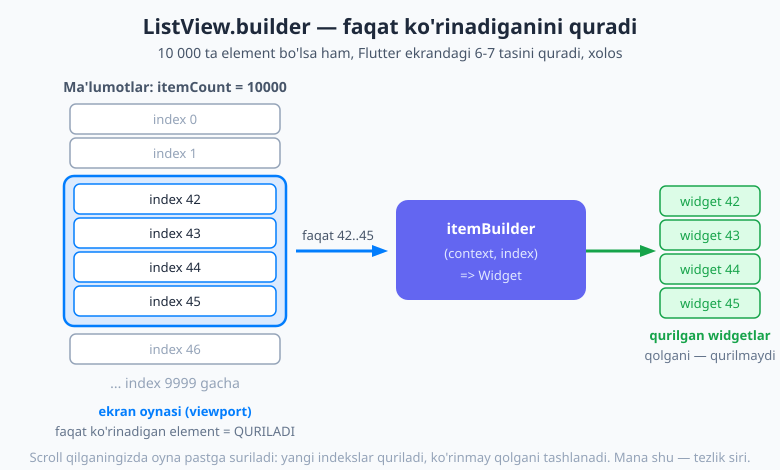
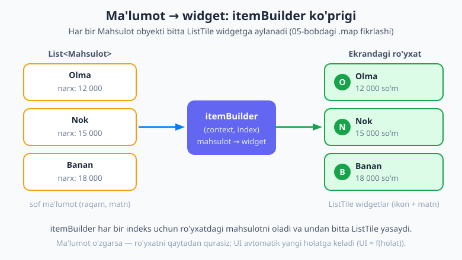
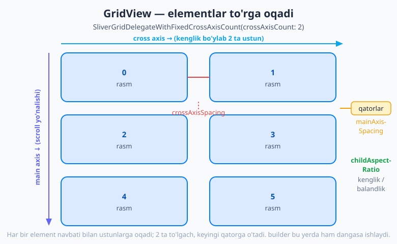

# 18 — Ro'yxatlar va scroll

[⬅️ Oldingi: 17 — Formalar va foydalanuvchi kiritmasi](./17-formalar-kiritma.md) · [🏠 README](./README.md) · [Keyingi: 19 — Navigatsiya: Navigator 1.0 ➡️](./19-navigatsiya-navigator.md)

---

> **Bu bobda:** telefoningizdagi deyarli har bir ilova — bu ro'yxat: chat, lenta (feed), sozlamalar, mahsulotlar. Shuning uchun ro'yxat qurish — Flutter'da eng ko'p ishlatadigan ko'nikmangiz. Siz `ListView`ning ikki ko'rinishini — qisqa, qat'iy ro'yxat uchun `ListView(children: [...])` va **uzun, dinamik** ro'yxatlar uchun eng muhim **`ListView.builder`**ni o'rganasiz; nega builder **dangasa** (lazy) ekanini — ya'ni 10 000 elementdan faqat ekranda ko'rinadiganini quradi — tushunasiz; `List<Data>` ma'lumotni widgetlarga aylantirishni (05-bobdagi `.map` fikri); ajratgich chiziqli `ListView.separated`ni; gorizontal ro'yxatlarni; `GridView` bilan to'r (grid); aralash kontentni scroll qiluvchi `SingleChildScrollView`ni; ilg'or scroll effektlari uchun **sliverlar** (yig'iladigan `SliverAppBar`); va jonli o'zaro ta'sirlar — pastga tortib yangilash (`RefreshIndicator`), surib o'chirish (`Dismissible`), sudrab tartiblash (`ReorderableListView`)ni ko'rasiz. Oxirida kontaktlar ro'yxati, foto-to'r va pull-to-refresh lentasini quramiz.

---

## Nega ro'yxatlar muhim?

Telefoningizni qo'lingizga oling va istalgan ilovani oching. Telegram — bu suhbatlar ro'yxati, har bir suhbat — xabarlar ro'yxati. Instagram — postlar lentasi. Sozlamalar — bandlar ro'yxati. Do'kon ilovasi — mahsulotlar ro'yxati. Aslida zamonaviy ilovalarning **katta qismi — bu shunchaki chiroyli ro'yxatlar.**

Shuning uchun bu bob amaliy jihatdan eng qadrli boblardan biri. Ro'yxat qurishni o'rgansangiz, real ilovaning yarmini qurishni o'rganasiz.

Bizning yo'limiz oddiydan murakkabga: avval bir nechta qat'iy elementli oddiy ro'yxat, keyin **uzun, dinamik** ro'yxat (eng muhim qism), keyin to'r (grid), aralash kontent va nihoyat jonli o'zaro ta'sirlar.

## `ListView` — eng oddiy ro'yxat

Eng oddiy ro'yxat — `ListView` ichiga bir nechta widget tashlash. U bolalarini ustun qilib (yuqoridan pastga) joylaydi va agar ular ekranga sig'masa — **avtomatik scroll** qilinadi. (`Column` bilan farqi shu: `Column` scroll qilmaydi, sig'magan joyda u "toshib ketadi".)

```dart
ListView(
  children: const [
    ListTile(leading: Icon(Icons.wifi), title: Text('Wi-Fi')),
    ListTile(leading: Icon(Icons.bluetooth), title: Text('Bluetooth')),
    ListTile(leading: Icon(Icons.battery_full), title: Text('Batareya')),
  ],
)
```

Bu yerda yangi tanish — **`ListTile`**. Bu Material dizayndagi tayyor "ro'yxat bandi" widgeti: chap tomonda ikon (`leading`), o'rtada sarlavha (`title`), ostida tavsif (`subtitle`), o'ng tomonda yana bir widget (`trailing`) bo'lishi mumkin. Ro'yxat bandlarini qo'lda yasash o'rniga `ListTile` bilan tez va chiroyli qilasiz.

`ListView(children: [...])` qachon yaxshi? **Faqat elementlar soni oz va oldindan ma'lum bo'lganda** — masalan 5-10 ta sozlama bandi. Sababini hozir tushuntiramiz.

## `ListView.builder` — uzun ro'yxatlar uchun (eng muhim)

Endi bobning yuragiga keldik. Tasavvur qiling, sizda 10 000 ta xabar bor. Yuqoridagi `ListView(children: [...])` usuli bilan siz **10 000 ta widgetni birato'la** ro'yxatga yozishingiz kerak bo'ladi. Flutter ularning hammasini bir vaqtda xotirada quradi — hatto ekranda bir vaqtning o'zida atigi 7-8 tasi ko'rinsa ham! Bu xotirani behuda sarflaydi va ilovani sekinlashtiradi (ekran "tutab-tutab", ya'ni *jank* bilan suriladi).

Yechim — **`ListView.builder`**. U ikki narsa so'raydi:

- **`itemCount`** — jami nechta element bor (masalan `10000`);
- **`itemBuilder`** — funksiya: u `(context, index)` oladi va **shu indeksdagi** element uchun bitta widget qaytaradi.

```dart
ListView.builder(
  itemCount: 10000,
  itemBuilder: (context, index) {
    return ListTile(
      leading: CircleAvatar(child: Text('${index + 1}')),
      title: Text('Element raqami $index'),
    );
  },
)
```

### Nega builder bunchalik muhim? — dangasa (lazy) rendering

`ListView.builder`ning siri shu: u `itemBuilder`ni **hamma 10 000 element uchun emas**, balki **faqat hozir ekranda ko'rinadigan** (va ozgina atrofidagi) elementlar uchun chaqiradi. Ya'ni ekranda 7 ta element ko'rinsa, Flutter `itemBuilder`ni taxminan shuncha marta chaqiradi — qolgan 9 993 ta element **umuman qurilmaydi**, ular hozir xotirada yo'q.

Siz pastga scroll qilganingizda esa ekran "oynasi" (viewport) pastga suriladi: yangi ko'ringan indekslar uchun `itemBuilder` chaqiriladi (ular endi quriladi), yuqoriga chiqib ko'rinmay qolganlari esa tashlab yuboriladi. Bu xuddi cheksiz uzun gazetani o'qiyotgandek: siz faqat **ko'z oldingizdagi** qismni ko'rasiz, qolgan minglab qator allaqachon bosilgan emas — kerak bo'lganda chop etiladi.



Mana shu **dangasa (lazy) rendering** — Flutter ro'yxatlarni shuncha tez qiladigan asosiy g'oya. Element soni 10 ta bo'ladimi yoki 10 milliondami — ekranda baribir 7-8 tasi quriladi, demak tezlik bir xil qoladi.

> 💡 **Oltin qoida:** elementlar soni oz va qat'iy bo'lsa — `ListView(children: [...])`. Element ko'p, dinamik yoki ma'lumotdan kelsa — **doimo `ListView.builder`**. Shubha bo'lsa, builder'ni tanlang — u hech qachon yomon emas.

### Ma'lumotni widgetga aylantirish

Real ilovada ro'yxat odatda **ma'lumotdan** keladi — masalan `List<Mahsulot>`. `itemBuilder`ning vazifasi — har bir ma'lumot elementini **widgetga aylantirish**. Bu aynan [05-bobdagi `.map`](./05-toplamlar.md) fikrlash usuli: u yerda biz har bir elementni yangi qiymatga aylantirgan edik; bu yerda esa har bir elementni **widgetga** aylantiramiz.

```dart
class Mahsulot {
  final String nomi;
  final int narx;
  const Mahsulot(this.nomi, this.narx);
}

final mahsulotlar = const [
  Mahsulot('Olma', 12000),
  Mahsulot('Nok', 15000),
  Mahsulot('Banan', 18000),
];

// ... build ichida:
ListView.builder(
  itemCount: mahsulotlar.length,
  itemBuilder: (context, index) {
    final m = mahsulotlar[index];          // shu indeksdagi ma'lumot
    return ListTile(
      leading: CircleAvatar(child: Text(m.nomi[0])),
      title: Text(m.nomi),
      subtitle: Text('${m.narx} so\'m'),
    );
  },
)
```

E'tibor bering: `itemCount` ni endi qo'lda yozmaymiz — `mahsulotlar.length`ni beramiz, shunda ro'yxat ma'lumot bilan **o'zi mosashadi**. Ma'lumotga yangi mahsulot qo'shsangiz, ro'yxat ham uzayadi.



## `ListView.separated` — orasiga ajratgich

Ko'pincha ro'yxat bandlari orasiga **ajratgich chiziq** (divider) qo'yishni xohlaysiz. Buni qo'lda qilish o'rniga `ListView.separated` bor — u `itemBuilder`dan tashqari yana **`separatorBuilder`** so'raydi: bu funksiya har ikki band **orasiga** nima qo'yilishini qaytaradi.

```dart
ListView.separated(
  itemCount: mahsulotlar.length,
  itemBuilder: (context, index) => ListTile(
    title: Text(mahsulotlar[index].nomi),
  ),
  separatorBuilder: (context, index) => const Divider(height: 1),
)
```

`Divider` — yupqa gorizontal chiziq. Ajratgich o'rniga bo'sh joy (`SizedBox(height: 8)`) ham qo'yishingiz mumkin.

## `padding` va gorizontal ro'yxatlar

Ro'yxatning chetlariga bo'sh joy qo'shish uchun `padding:` beriladi:

```dart
ListView.builder(
  padding: const EdgeInsets.all(16),   // har tomondan 16 px bo'sh joy
  itemCount: mahsulotlar.length,
  itemBuilder: (context, index) => /* ... */,
)
```

Sukut bo'yicha ro'yxat **vertikal** (yuqoridan pastga) suriladi. Lekin gorizontal "karusel" (masalan bosh sahifadagi tavsiya etilgan kartochkalar) qilish uchun `scrollDirection: Axis.horizontal` beriladi:

```dart
SizedBox(
  height: 160,                              // gorizontal ro'yxatga balandlik kerak
  child: ListView.builder(
    scrollDirection: Axis.horizontal,
    itemCount: mahsulotlar.length,
    itemBuilder: (context, index) => Card(
      child: SizedBox(width: 120, child: Center(child: Text(mahsulotlar[index].nomi))),
    ),
  ),
)
```

Diqqat: gorizontal ro'yxatni `SizedBox` bilan o'rab, unga **balandlik** bering — aks holda Flutter "men qancha baland bo'lishni bilmayman" deydi.

## `GridView` — ikki o'lchamli to'r

Ba'zan ro'yxat emas, **to'r** kerak: foto galereya, ilovalar paneli, mahsulot kartochkalari ikki-uch ustunda. Buning uchun `GridView.builder` bor. U ham `itemCount` + `itemBuilder` oladi (`ListView.builder` kabi dangasa ishlaydi), lekin qo'shimcha **`gridDelegate`** so'raydi — bu to'rning *shaklini* belgilaydi.

Eng ko'p ishlatiladigani — **`SliverGridDelegateWithFixedCrossAxisCount`** (uzun nom, lekin ma'nosi oddiy: "qator bo'ylab qat'iy sondagi ustun"):

```dart
GridView.builder(
  gridDelegate: const SliverGridDelegateWithFixedCrossAxisCount(
    crossAxisCount: 2,        // qator bo'ylab nechta ustun
    mainAxisSpacing: 12,      // qatorlar orasidagi bo'sh joy
    crossAxisSpacing: 12,     // ustunlar orasidagi bo'sh joy
    childAspectRatio: 1,      // har bir katak kengligi / balandligi (1 = kvadrat)
  ),
  itemCount: 30,
  itemBuilder: (context, index) => Container(
    color: Colors.indigo.shade100,
    child: Center(child: Text('$index')),
  ),
)
```

Elementlar ustunlarga **navbati bilan oqadi**: birinchisi 1-ustunga, ikkinchisi 2-ustunga, ustunlar to'lgach keyingi qatorga o'tadi.



- **`crossAxisCount`** — qatordagi ustunlar soni.
- **`mainAxisSpacing` / `crossAxisSpacing`** — qatorlar va ustunlar orasidagi bo'sh joy.
- **`childAspectRatio`** — har bir katakning kengligi-balandligiga nisbati. `1` — kvadrat; `0.7` — bo'yi cho'zilgan (rasm + ostida matn uchun qulay).

> 💡 **Moslashuvchan (responsive) to'r.** Agar siz "ustunlar soni" emas, "har bir katak taxminan shuncha keng bo'lsin" demoqchi bo'lsangiz — `SliverGridDelegateWithMaxCrossAxisExtent(maxCrossAxisExtent: 150)` ishlating. U ekran kengligiga qarab ustunlar sonini **o'zi** hisoblaydi: keng planshetda ko'proq ustun, tor telefonda kamroq. Turli o'lchamdagi ekranlar uchun ideal.

## `SingleChildScrollView` — aralash kontentni scroll qilish

`ListView` — bir xil bandlardan iborat **ro'yxat** uchun. Lekin ba'zan sizda ro'yxat emas, **aralash** kontent bor: sarlavha, rasm, bir nechta matn paragrafi, tugma — hammasi `Column` ichida, va u ekranga sig'maydi. Bunda `ListView` mos kelmaydi.

Layout boblarida ko'rgan tanish muammoni eslang: `Column` ekranga sig'magan joyda sariq-qora chiziqli **RenderFlex overflow** ogohlantirishini beradi. Yechim — `Column`ni **`SingleChildScrollView`** ichiga o'rash:

```dart
SingleChildScrollView(
  child: Column(
    children: [
      Image.asset('rasm.jpg'),
      const Text('Uzun tavsif...'),
      const SizedBox(height: 20),
      ElevatedButton(onPressed: () {}, child: const Text('Sotib olish')),
      // ... ko'p kontent — endi scroll bo'ladi, toshib ketmaydi
    ],
  ),
)
```

`SingleChildScrollView` o'zining **bitta** bolasini (odatda `Column`) scroll qilinadigan qiladi.

**Qachon nima?** Bandlar bir xil va ko'p/dinamik bo'lsa — `ListView.builder` (dangasa, tezroq). Kontent aralash va miqdori cheklangan bo'lsa (masalan bitta sahifa: profil, mahsulot detali) — `SingleChildScrollView` + `Column`.

## Sliverlar — ilg'or scroll effektlari (kirish)

Ba'zan oddiy ro'yxat yetarli emas: siz pastga surganingizda **yig'iladigan sarlavha** (collapsing header) bo'lsin yoki bitta scroll ichida ro'yxat va to'r aralash kelsin. Mana shunda **sliverlar** kerak bo'ladi.

"Sliver" — bu scroll qilinadigan maydonning bir **bo'lagi**. Ularni `CustomScrollView` ichiga yig'asiz, va u hammasini **bitta** umumiy scroll qilib boshqaradi. Eng ko'p ishlatiladigan sliverlar:

- **`SliverAppBar`** — scroll qilganda **yig'iladigan/cho'ziladigan** panel (masalan tepada katta rasm, scroll qilsangiz u kichik sarlavhaga aylanadi).
- **`SliverList`** / **`SliverGrid`** — ro'yxat va to'rning sliver ko'rinishi.
- **`SliverToBoxAdapter`** — oddiy bitta widgetni (masalan bir banner) sliverlar orasiga qo'yish uchun "adapter".

Mana yig'iladigan sarlavhali sodda misol:

```dart
CustomScrollView(
  slivers: [
    SliverAppBar(
      expandedHeight: 200,                  // to'liq ochilganda balandligi
      pinned: true,                         // yig'ilganda tepada qotib qoladi
      flexibleSpace: const FlexibleSpaceBar(
        title: Text('Galereya'),
      ),
    ),
    SliverList.builder(
      itemCount: 50,
      itemBuilder: (context, index) => ListTile(title: Text('Element $index')),
    ),
  ],
)
```

Bu kod ishlaganda tepada katta panel bo'ladi; pastga surganingizda u silliq yig'ilib, ixcham sarlavhaga aylanadi (`pinned: true` tufayli butunlay yo'qolmaydi). Sliverlar — kuchli mavzu; hozircha shu kirish yetarli, kerak bo'lganda chuqurroq o'rganasiz.

## Jonli o'zaro ta'sirlar

Ro'yxatlarni "jonli" qiladigan tayyor widgetlar bilan tanishamiz.

### `RefreshIndicator` — pastga tortib yangilash

Mashhur "pull-to-refresh" — ro'yxatni tepasidan pastga tortib, yangi ma'lumot yuklash. `ListView`ni `RefreshIndicator` bilan o'rab, `onRefresh:` ga **Future qaytaradigan** funksiya beriladi (asinxron ma'lumot yuklash — [09-bobdagi `Future`](./09-asinxron-dart.md)ni eslang). Foydalanuvchi tortganda aylanuvchi indikator chiqadi va Future tugaguncha aylanadi.

```dart
RefreshIndicator(
  onRefresh: () async {
    await malumotniQaytaYukla();           // server'dan yangi ma'lumot
  },
  child: ListView.builder(
    itemCount: elementlar.length,
    itemBuilder: (context, index) => ListTile(title: Text(elementlar[index])),
  ),
)
```

`onRefresh` **`async`** bo'lishi va `Future` qaytarishi shart — Flutter shu Future tugashini kutib, indikatorni qachon to'xtatishni biladi.

### `Dismissible` — surib o'chirish

Bandni chap yoki o'ngga **surib o'chirish** (swipe-to-delete) — Gmail'dagidek. Har bir bandni `Dismissible` ga o'rab, unga **noyob `key`** va `onDismissed:` (surilgandan keyin ma'lumotdan o'chirish) beriladi:

```dart
Dismissible(
  key: ValueKey(element.id),               // har bir element uchun noyob kalit — SHART
  background: Container(color: Colors.red),
  onDismissed: (direction) {
    setState(() => elementlar.remove(element));   // ma'lumotdan o'chir
  },
  child: ListTile(title: Text(element.nomi)),
)
```

Diqqat: `key` **majburiy va noyob** bo'lishi kerak — Flutter qaysi band o'chirilganini shu kalit orqali biladi. `onDismissed` ichida ma'lumotni ham o'chirishni unutmang, aks holda UI va ma'lumot bir-biriga mos kelmay qoladi.

### `ReorderableListView` — sudrab tartiblash

Foydalanuvchi bandlarni **bosib turib sudrab** tartibini o'zgartira oladigan ro'yxat (masalan "sevimlilar"ni qayta tartiblash). `onReorder:` funksiyasi qaysi element qayerdan qayerga ko'chganini beradi:

```dart
ReorderableListView.builder(
  itemCount: elementlar.length,
  itemBuilder: (context, index) => ListTile(
    key: ValueKey(elementlar[index]),      // har bir bandga noyob key SHART
    title: Text(elementlar[index]),
  ),
  onReorder: (oldIndex, newIndex) {
    setState(() {
      if (newIndex > oldIndex) newIndex -= 1;
      final element = elementlar.removeAt(oldIndex);
      elementlar.insert(newIndex, element);
    });
  },
)
```

### `ScrollController` — scroll holatini bilish

`ScrollController` — ro'yxatning **scroll holatini** kuzatish va boshqarish vositasi: foydalanuvchi qancha pastga surdi, oxiriga yetdimi? Eng mashhur qo'llanishi — **cheksiz scroll** (infinite scroll): foydalanuvchi ro'yxat oxiriga yaqinlashganda avtomatik yana ma'lumot yuklash (Instagram lentasi kabi). Controller'ni `ListView`ning `controller:` ga ulaysiz va `controller.position` orqali holatni o'qiysiz. Bu ilg'orroq mavzu — hozircha shunday vosita borligini bilib qo'ying.

## Birgalikda: kontaktlar ro'yxati

O'rgangan asosiy g'oyani — ma'lumotdan `ListView.builder` orqali ro'yxat qurishni — to'liq, ishlaydigan misolda yig'amiz:

```dart
import 'package:flutter/material.dart';

void main() => runApp(const KontaktApp());

class Kontakt {
  final String ism;
  final String telefon;
  const Kontakt(this.ism, this.telefon);
}

class KontaktApp extends StatelessWidget {
  const KontaktApp({super.key});

  @override
  Widget build(BuildContext context) {
    final kontaktlar = const [
      Kontakt('Oybek Karimov', '+998 90 123 45 67'),
      Kontakt('Laylo Tosheva', '+998 91 234 56 78'),
      Kontakt('Sardor Aliyev', '+998 93 345 67 89'),
      Kontakt('Madina Yusupova', '+998 94 456 78 90'),
    ];

    return MaterialApp(
      theme: ThemeData(
        colorScheme: ColorScheme.fromSeed(seedColor: Colors.teal),
      ),
      home: Scaffold(
        appBar: AppBar(title: const Text('Kontaktlar')),
        body: ListView.separated(
          itemCount: kontaktlar.length,
          separatorBuilder: (context, index) => const Divider(height: 1),
          itemBuilder: (context, index) {
            final k = kontaktlar[index];
            return ListTile(
              leading: CircleAvatar(child: Text(k.ism[0])),
              title: Text(k.ism),
              subtitle: Text(k.telefon),
              trailing: const Icon(Icons.phone),
            );
          },
        ),
      ),
    );
  }
}
```

Ishga tushiring: chiroyli, ajratgich chiziqli kontaktlar ro'yxati ko'rinadi. `kontaktlar` ro'yxatiga yana band qo'shsangiz — ro'yxat o'zi uzayadi, chunki `itemCount` ma'lumot uzunligiga bog'langan. Mana shu — **ma'lumotdan UI**.

## Tez-tez uchraydigan xatolar

- **Uzun ro'yxat uchun `ListView(children: [...])` ishlatish.** Yuzlab/minglab element bo'lsa, hammasi birato'la quriladi — ilova sekinlashadi (*jank*). Yechim: **`ListView.builder`**.
- **Scroll qilinadigan widgetlarni ehtiyotsiz ichma-ich joylash.** `ListView` ichiga yana `ListView` qo'ysangiz, ichkisi "men qancha baland bo'lishni bilmayman" (unbounded height) deb xato beradi. Yechim: ichki ro'yxatga `shrinkWrap: true` qo'shing yoki unga aniq balandlik bering (`SizedBox` bilan). Lekin `shrinkWrap` ro'yxatni dangasa qilmaydi — hammasini quradi, shuning uchun katta ro'yxatlarda undan qoching; bunday holatlarda `CustomScrollView` + sliverlar to'g'riroq.
- **`Column`ni scroll uchun ishlatishga urinish.** `Column` scroll qilmaydi — sig'magan kontent overflow beradi. Yechim: `SingleChildScrollView` (aralash kontent) yoki `ListView` (bandlar).
- **`Dismissible`/`ReorderableListView`da `key` ni unutish.** Noyob `key` bo'lmasa, Flutter qaysi band ekanini ajrata olmaydi — xato yoki noto'g'ri xatti-harakat. Har doim `ValueKey(...)` bilan noyob kalit bering.

## Keyingi qadam

Endi siz har qanday ilovaning umurtqa pog'onasini — ro'yxat va to'rlarni — qura olasiz, va eng muhimi, **nega `ListView.builder` dangasa ishlab tezlik beradi**ni tushunasiz. Bandlar, to'rlar, pull-to-refresh, surib o'chirish — bularning hammasi qo'lingizda.

Lekin hozircha bizning ro'yxatlarimiz bitta ekranda turibdi. Foydalanuvchi bandga bossa nima bo'ladi? Odatda **boshqa ekran** ochilishi kerak — masalan kontaktga bossangiz uning to'liq sahifasi. Keyingi [19-bobda](./19-navigatsiya-navigator.md) **navigatsiya**ni — ekranlar orasida o'tishni (`Navigator`, `push`, `pop`) o'rganamiz va ro'yxatdagi bandni bosib detal sahifasiga o'tishni amalda ko'ramiz.

---

## Mashqlar

### Oson

1. `ListView(children: [...])` va `ListView.builder` o'rtasidagi farqni o'z so'zlaringiz bilan tushuntiring. Qaysi birini 10 000 elementli ro'yxat uchun ishlatasiz va nega?
2. "Dangasa (lazy) rendering" nima degani? `ListView.builder` 10 000 elementli ro'yxatda `itemBuilder`ni necha marta chaqiradi (taxminan)?
3. `ListView.builder`ga kerak bo'lgan ikki narsani ayting: ular nima qiladi?
4. `ListView.separated`da `separatorBuilder` nima vazifa bajaradi?
5. Qachon `SingleChildScrollView` ishlatasiz, qachon `ListView`? Bitta-bitta misol keltiring.

### O'rta

6. Sizda `List<String> shaharlar = ['Toshkent', 'Samarqand', 'Buxoro']` bor. `ListView.builder` bilan har bir shaharni `ListTile` ko'rsatadigan kod yozing (`itemCount` va `itemBuilder` bilan).
7. `GridView.builder` uchun `SliverGridDelegateWithFixedCrossAxisCount` ning to'rt parametri (`crossAxisCount`, `mainAxisSpacing`, `crossAxisSpacing`, `childAspectRatio`) har biri nima qilishini bir jumlada yozing.
8. Bir o'quvchi `Column` ichiga ko'p widget joyladi va sariq-qora "overflow" chizig'ini ko'rdi. Unga muammoni va yechimni tushuntiring.

### Qiyin

9. `RefreshIndicator`ning `onRefresh` funksiyasi nega `async` bo'lishi va `Future` qaytarishi shart? (Maslahat: indikator qachon to'xtashini Flutter qanday biladi?)
10. Nima uchun katta ro'yxatda `ListView`ni `shrinkWrap: true` bilan boshqa scroll ichiga joylash yomon g'oya? Bu dangasa rendering bilan qanday ziddiyatga keladi va o'rniga nima ishlatish kerak?

<details markdown="1"><summary>Yechimlar</summary>

**1.** `ListView(children: [...])` barcha bolalarni **bir vaqtda** quradi — faqat element soni oz va qat'iy bo'lganda mos. `ListView.builder` esa `itemBuilder` orqali **faqat ekranda ko'rinadigan** elementlarni quradi (dangasa). 10 000 element uchun **`ListView.builder`**ni ishlataman, chunki `ListView(children:)` hamma 10 000 widgetni birato'la qurib ilovani sekinlashtiradi, builder esa baribir faqat 7-8 tasini quradi.

**2.** Dangasa rendering — Flutter elementni **faqat kerak bo'lganda** (ekranga ko'ringanda) quradi, hammasini oldindan emas. 10 000 elementli ro'yxatda `itemBuilder` faqat ekranda ko'rinadigan (va ozgina atrofidagi) elementlar uchun — taxminan **7-15 marta** — chaqiriladi, qolgani scroll qilganda chaqiriladi.

**3.** `itemCount` — jami nechta element borligi (ro'yxat uzunligi). `itemBuilder` — `(context, index)` oladigan va shu indeksdagi element uchun bitta widget qaytaradigan funksiya.

**4.** `separatorBuilder` har **ikki band orasiga** qo'yiladigan widgetni qaytaradi (masalan `Divider` chizig'i yoki `SizedBox` bo'sh joy). Shunday qilib bandlar orasiga ajratgich qo'lda yozilmaydi.

**5.** `SingleChildScrollView` — **aralash, cheklangan** kontentni scroll qilganda (masalan profil sahifasi: rasm + matn + tugma `Column` ichida). `ListView` — **bir xil bandlardan iborat ro'yxat** uchun (masalan xabarlar yoki kontaktlar). Birinchisi bitta `Column`ni scroll qiladi, ikkinchisi ko'p bandni (va `builder` bilan dangasa).

**6.**
```dart
final shaharlar = const ['Toshkent', 'Samarqand', 'Buxoro'];

ListView.builder(
  itemCount: shaharlar.length,
  itemBuilder: (context, index) {
    return ListTile(
      leading: const Icon(Icons.location_city),
      title: Text(shaharlar[index]),
    );
  },
)
```

**7.**
- `crossAxisCount` — bitta qatordagi ustunlar soni (masalan 2 yoki 3).
- `mainAxisSpacing` — **qatorlar** orasidagi bo'sh joy (scroll yo'nalishi bo'ylab).
- `crossAxisSpacing` — **ustunlar** orasidagi bo'sh joy (qator bo'ylab).
- `childAspectRatio` — har bir katakning kengligi-balandligiga nisbati (`1` = kvadrat, `< 1` = bo'yi cho'zilgan).

**8.** Muammo: `Column` scroll qilmaydi — bolalari ekran balandligiga sig'masa, ortiqcha qism "toshib ketadi" va Flutter **RenderFlex overflow** ogohlantirishini (sariq-qora chiziq) ko'rsatadi. Yechim: `Column`ni **`SingleChildScrollView`** ichiga o'rash — shunda kontent scroll qilinadigan bo'ladi va toshib ketmaydi. (Agar bandlar bir xil va ko'p bo'lsa, `ListView` bilan almashtirish ham mumkin.)

**9.** `RefreshIndicator` aylanuvchi indikatorni **`onRefresh` qaytargan `Future` tugaguncha** ko'rsatib turadi. Agar funksiya `Future` qaytarmasa, Flutter yangilash qachon **tugaganini** bilmaydi — indikatorni qachon to'xtatishni aniqlay olmaydi. Shuning uchun u `async` bo'lib, `await` bilan ma'lumot yuklab bo'lgach tugaydigan `Future` qaytarishi shart: shu Future yakunlanganda Flutter indikatorni yashiradi.

**10.** `shrinkWrap: true` ro'yxatga "men kontentim qancha bo'lsa, shuncha balandlikni egallayman" deydi — buning uchun Flutter **hamma** elementni o'lchashi kerak bo'ladi, demak hammasi quriladi. Bu `ListView.builder`ning asosiy afzalligi — **dangasa rendering**ni bekor qiladi: katta ro'yxatda barcha element qurilib, tezlik yo'qoladi. To'g'ri yechim — ichma-ich `ListView` o'rniga **`CustomScrollView` + sliverlar** (`SliverList`/`SliverGrid`) ishlatish: shunda hammasi bitta dangasa scroll ostida birlashadi va faqat ko'rinadigan elementlar quriladi.

</details>

---

[⬅️ Oldingi: 17 — Formalar va foydalanuvchi kiritmasi](./17-formalar-kiritma.md) · [🏠 README](./README.md) · [Keyingi: 19 — Navigatsiya: Navigator 1.0 ➡️](./19-navigatsiya-navigator.md)
