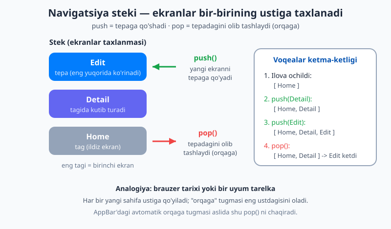
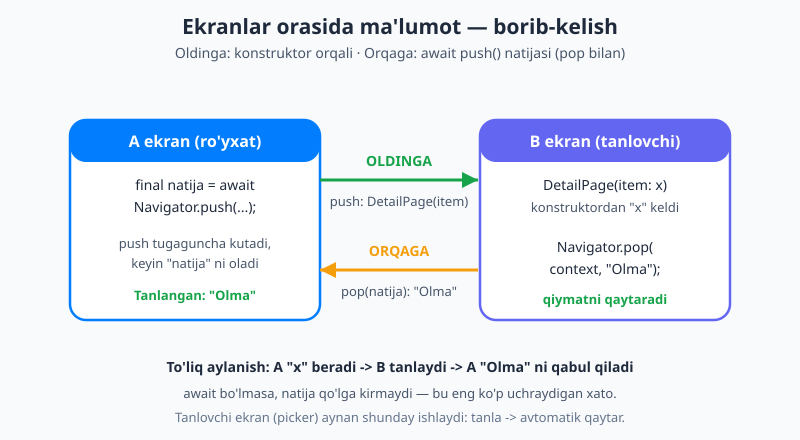
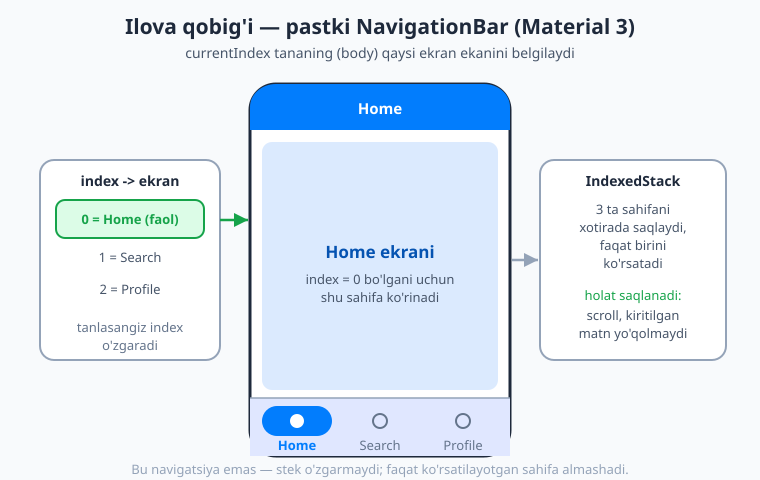

# 19 — Navigatsiya: Navigator 1.0

[⬅️ Oldingi: 18 — Ro'yxatlar va scroll](./18-royxatlar-scroll.md) · [🏠 README](./README.md) · [Keyingi: 20 — go_router bilan deklarativ navigatsiya ➡️](./20-go-router.md)

---

> **Bu bobda:** haqiqiy ilovalar bitta ekrandan iborat emas — ro'yxatdan elementga, undan tahrirlash sahifasiga o'tasiz. Shu bobda siz ekranlar orasida qanday harakatlanishni o'rganasiz. Avval **stek** modelini — ekranlar bir-birining ustiga taxlanishini — tushunasiz. Keyin `Navigator.push` va `Navigator.pop` bilan ekran ochasiz va yopasiz; `MaterialPageRoute` nima ekanini bilasiz. Ma'lumotni **oldinga** (konstruktor orqali) va **orqaga** (`await push` + `pop(natija)`) uzatishni — masalan tanlovchi (picker) ekran natijani qaytarishini — to'liq misolda ko'rasiz. Nomli yo'nalishlar (`routes`, `pushNamed`), stek operatsiyalari (`pushReplacement`, `pushAndRemoveUntil`, `popUntil`, `canPop`), dialog/bottom sheet/SnackBar kabi vaqtinchalik oynalar, hamda `NavigationBar`, `Drawer`, `TabBar` bilan ilova qobig'ini qurish — barchasini bosqichma-bosqich o'tamiz. Oxirida imperativ `Navigator`ning chegaralarini ko'rib, keyingi bobdagi `go_router`ga zamin tayyorlaymiz.

---

## Nega navigatsiya kerak?

Hozirgacha qurgan ilovalaringiz bitta ekranda ishladi. Lekin haqiqiy ilovani o'ylang: Telegram'da chatlar **ro'yxati** bor — bittasini bossangiz, **suhbat** ekrani ochiladi; profilga bossangiz — **profil** ekrani; orqaga bossangiz — yana ro'yxatga qaytasiz. Ilova ekrandan ekranga **o'tib** turadi.

**Navigatsiya (navigation)** — bu ekranlar (Flutter tilida ularni **route**, ya'ni "yo'nalish" deyiladi) orasida harakatlanishni boshqarish. Flutter'da buni `Navigator` degan widget bajaradi. U har bir ilovada (`MaterialApp` ichida) avtomatik mavjud — siz uni qo'lda yaratmaysiz, faqat undan foydalanasiz.

> 💡 **Termin:** *route* (yo'nalish) — bu odatda butun bir ekran. Bu bobda "route", "ekran" va "sahifa" so'zlarini deyarli bir ma'noda ishlatamiz.

## Stek modeli — eng muhim g'oya

Navigatsiyani tushunish uchun bitta tushunchani o'zlashtirishingiz kerak: **stek (stack)**.

Bir uyum tarelkani tasavvur qiling. Yangi tarelkani **eng ustiga** qo'yasiz. Olmoqchi bo'lsangiz ham — yana **eng ustidagisini** olasiz. Ostidagilarga to'g'ridan-to'g'ri tegolmaysiz. Mana shu "oxirgi kirgan — birinchi chiqadi" tartibi **stek** deyiladi.

Flutter'da ochiq ekranlar aynan shunday stek hosil qiladi:

- Ilova ochilganda stekda bitta ekran bor — birinchi (ildiz) ekran.
- Yangi ekranga o'tsangiz, u stek **ustiga qo'shiladi** — bu **push** ("itarish").
- Orqaga qaytsangiz, eng ustdagi ekran **olib tashlanadi** — bu **pop** ("chiqarish").
- Ekranda doim **stek eng ustidagi** ekran ko'rinadi.



Bu xuddi brauzer tarixiga o'xshaydi: yangi sahifaga o'tganingizda u tarixga qo'shiladi, "orqaga" tugmasi sizni avvalgisiga qaytaradi. Aynan shu sabab telefon va `AppBar`dagi **orqaga tugmasi** sizdan hech narsa so'ramay ishlaydi — u shunchaki stek ustidagi ekranni `pop` qiladi.

## `Navigator.push` va `Navigator.pop`

Eng asosiy ikki amalni ko'ramiz. Avval ikkita oddiy ekran tayyorlaymiz:

```dart
import 'package:flutter/material.dart';

class BirinchiEkran extends StatelessWidget {
  const BirinchiEkran({super.key});

  @override
  Widget build(BuildContext context) {
    return Scaffold(
      appBar: AppBar(title: const Text('Birinchi ekran')),
      body: Center(
        child: ElevatedButton(
          child: const Text('Ikkinchi ekranga o\'tish'),
          onPressed: () {
            Navigator.push(
              context,
              MaterialPageRoute(builder: (context) => const IkkinchiEkran()),
            );
          },
        ),
      ),
    );
  }
}

class IkkinchiEkran extends StatelessWidget {
  const IkkinchiEkran({super.key});

  @override
  Widget build(BuildContext context) {
    return Scaffold(
      appBar: AppBar(title: const Text('Ikkinchi ekran')),
      body: Center(
        child: ElevatedButton(
          child: const Text('Orqaga'),
          onPressed: () {
            Navigator.pop(context);
          },
        ),
      ),
    );
  }
}
```

Bu yerda eng muhim ikki satr:

```dart
// Yangi ekranni stek ustiga qo'yish (push):
Navigator.push(
  context,
  MaterialPageRoute(builder: (context) => const IkkinchiEkran()),
);

// Stek ustidagi ekranni olib tashlash (pop) — orqaga qaytish:
Navigator.pop(context);
```

Buni bo'lib tushunamiz:

- **`Navigator.push(context, ...)`** — birinchi argument `context` (widgetning daraxtdagi o'rni; u orqali Flutter qaysi `Navigator`dan foydalanishni biladi). Ikkinchi argument — qaysi **route**ni ochish.
- **`MaterialPageRoute`** — bu "route"ning bir turi. U sizga **platforma uslubidagi o'tish animatsiyasini** beradi: Android'da sahifa pastdan ko'tariladi, iOS'da o'ngdan suriladi. Uning `builder:` argumenti — yangi ekranni **quradigan** funksiya: `(context) => const IkkinchiEkran()`.
- **`Navigator.pop(context)`** — stek ustidagi ekranni olib tashlaydi va oldingisiga qaytaradi.

> 💡 **Sizga `pop` ko'pincha shart emas.** `Navigator.push` orqali ochilgan ekranning `AppBar`ida Flutter **avtomatik orqaga tugmasini** (←) qo'yadi. Foydalanuvchi uni bossa yoki telefonning orqaga tugmasini bossa — Flutter o'zi `pop` qiladi. Yuqoridagi "Orqaga" tugmasi shunchaki `pop`ni qo'lda ko'rsatish uchun.

`MaterialPageRoute(builder: (context) => ...)` ko'rinishini birinchi ko'rganda biroz og'irroq tuyulishi mumkin, lekin u har doim bir xil — yodlab qoldirasiz: **push qil, MaterialPageRoute ber, builder ichida ekranni qaytar.**

## Ma'lumotni oldinga uzatish — konstruktor orqali

Odatda yangi ekranga **biror narsa** bilan o'tasiz: mahsulotlar ro'yxatidan bittasini bossangiz, detal ekran aynan **shu mahsulotni** ko'rsatishi kerak. Buni qilishning eng toza usuli — ma'lumotni **konstruktor orqali** uzatish.

Tasavvur qiling, bizda oddiy mahsulot bor:

```dart
class Mahsulot {
  final String nomi;
  final int narxi;
  const Mahsulot(this.nomi, this.narxi);
}
```

Detal ekran konstruktorida shu mahsulotni **talab qiladi**:

```dart
class MahsulotDetal extends StatelessWidget {
  final Mahsulot mahsulot; // konstruktordan keladi
  const MahsulotDetal({super.key, required this.mahsulot});

  @override
  Widget build(BuildContext context) {
    return Scaffold(
      appBar: AppBar(title: Text(mahsulot.nomi)),
      body: Center(
        child: Text(
          '${mahsulot.nomi} — ${mahsulot.narxi} so\'m',
          style: const TextStyle(fontSize: 20),
        ),
      ),
    );
  }
}
```

Ro'yxat ekranida esa push qilayotganda mahsulotni shunchaki **konstruktorga beramiz**:

```dart
onTap: () {
  Navigator.push(
    context,
    MaterialPageRoute(
      builder: (context) => MahsulotDetal(mahsulot: bosilgan),
    ),
  );
}
```

Mana shu — eng sodda va eng ishonchli yo'l. Nega? Chunki `MahsulotDetal` konstruktorida `required this.mahsulot` turibdi — agar mahsulotni bermasangiz, **kod hatto kompilyatsiya bo'lmaydi**. Ya'ni "ekranga ma'lumot berishni unutish" xatosi bo'lishi mumkin emas; Dart tipi sizni himoya qiladi.



> 💡 **Qoida:** ekranga ma'lumotni odatda **konstruktor orqali** bering. Bu tip-xavfsiz (type-safe) — IDE sizga avtomatik to'ldirishni ko'rsatadi, xato qiymat bersangiz darhol ogohlantiradi. Pastda ko'radigan "nomli yo'nalish" usuli moslashuvchanroq, lekin tip tekshiruvini yo'qotadi.

## Ma'lumotni orqaga qaytarish — `await push` va `pop(natija)`

Endi teskari yo'nalishni ko'ramiz. Ko'pincha yangi ekran biror **natija** qaytarishi kerak. Klassik misol — **tanlovchi (picker)**: foydalanuvchi alohida ekranda rang/shahar/mahsulotni tanlaydi, keyin tanlovi bilan oldingi ekranga qaytadi.

Buning siri ikki narsada:

1. Push **natija qaytaradi** (`Future` ko'rinishida), shuning uchun uni `await` bilan kutamiz.
2. Yangi ekran `pop` qilganda **qiymat** ham beradi: `Navigator.pop(context, qiymat)`.

Avval tanlovchi ekran — bu yerda har bir element bosilganda o'z qiymati bilan `pop` qiladi:

```dart
class RangTanlash extends StatelessWidget {
  const RangTanlash({super.key});

  @override
  Widget build(BuildContext context) {
    const ranglar = ['Qizil', 'Yashil', 'Ko\'k'];
    return Scaffold(
      appBar: AppBar(title: const Text('Rang tanlang')),
      body: ListView(
        children: [
          for (final rang in ranglar)
            ListTile(
              title: Text(rang),
              onTap: () {
                // tanlangan rangni qaytarib, bu ekranni yopamiz:
                Navigator.pop(context, rang);
              },
            ),
        ],
      ),
    );
  }
}
```

Endi chaqiruvchi ekran — u tanlovchini `await` bilan ochadi va qaytgan natijani oladi:

```dart
class Sozlamalar extends StatefulWidget {
  const Sozlamalar({super.key});
  @override
  State<Sozlamalar> createState() => _SozlamalarState();
}

class _SozlamalarState extends State<Sozlamalar> {
  String tanlanganRang = 'tanlanmagan';

  Future<void> _rangniTanla() async {
    final natija = await Navigator.push<String>(
      context,
      MaterialPageRoute(builder: (context) => const RangTanlash()),
    );
    // Foydalanuvchi tanlamasdan orqaga bossa, natija null bo'ladi:
    if (natija != null) {
      setState(() => tanlanganRang = natija);
    }
  }

  @override
  Widget build(BuildContext context) {
    return Scaffold(
      appBar: AppBar(title: const Text('Sozlamalar')),
      body: Center(
        child: Column(
          mainAxisAlignment: MainAxisAlignment.center,
          children: [
            Text('Tanlangan rang: $tanlanganRang',
                style: const TextStyle(fontSize: 18)),
            const SizedBox(height: 16),
            ElevatedButton(
              onPressed: _rangniTanla,
              child: const Text('Rang tanlash'),
            ),
          ],
        ),
      ),
    );
  }
}
```

Bu yerda nimalar bo'lyapti:

- `await Navigator.push<String>(...)` — push **`Future`** qaytaradi. `<String>` Flutter'ga "men `String` natija kutyapman" deydi. `await` esa foydalanuvchi tanlovchi ekrandan qaytguncha **kutadi**.
- Tanlovchida `Navigator.pop(context, rang)` chaqirilganda — aynan shu `rang` qiymati `await` natijasi bo'lib qaytadi.
- Agar foydalanuvchi hech narsa tanlamay orqaga tugmasini bossa, `pop` qiymatsiz ishlaydi va natija **`null`** bo'ladi — shuning uchun `if (natija != null)` tekshiruvi muhim.

> ⚠️ **Eng ko'p uchraydigan xato:** `await` ni unutish. `final natija = Navigator.push(...)` (await'siz) yozsangiz, `natija` `Future` bo'lib qoladi-yu, ammo qiymat hech qachon "ochilmaydi". Natija kutayotgan bo'lsangiz — **doim `await` qo'ying** (va funksiyani `async` qiling).

## Nomli yo'nalishlar (named routes)

Hozirgacha har safar `MaterialPageRoute(builder: ...)` yozdik. Kichik ilovada bu yetarli. Lekin ekranlar ko'paysa, har biriga **nom** (masalan `/profil`, `/sozlamalar`) berib, bir joyda ro'yxat qilish qulayroq bo'lishi mumkin.

Yo'nalishlarni `MaterialApp`da e'lon qilasiz:

```dart
MaterialApp(
  initialRoute: '/',                       // ilova ochilganda
  routes: {
    '/': (context) => const BoshEkran(),
    '/profil': (context) => const ProfilEkran(),
    '/sozlamalar': (context) => const Sozlamalar(),
  },
);
```

Endi nom orqali o'tasiz:

```dart
Navigator.pushNamed(context, '/profil');
```

Nomli yo'nalishga ham ma'lumot uzatish mumkin — `arguments` orqali:

```dart
Navigator.pushNamed(context, '/detal', arguments: bosilganMahsulot);
```

Qabul qiluvchi ekranda esa uni `ModalRoute` orqali o'qiysiz:

```dart
@override
Widget build(BuildContext context) {
  final mahsulot = ModalRoute.of(context)!.settings.arguments as Mahsulot;
  return Scaffold(
    appBar: AppBar(title: Text(mahsulot.nomi)),
    // ...
  );
}
```

E'tibor bering — bu yerda `as Mahsulot` deb **qo'lda tipga aylantirish** kerak, chunki `arguments` ning tipi `Object?` (ya'ni "har qanday narsa"). Agar noto'g'ri tip bersangiz, xato faqat **ishlash vaqtida** (runtime) chiqadi.

**Konstruktor vs nomli yo'nalish:**

| | Konstruktor (`MahsulotDetal(mahsulot: x)`) | Nomli (`pushNamed('/detal', arguments: x)`) |
|---|---|---|
| Tip xavfsizligi | ✅ to'liq, kompilyatsiya vaqtida tekshiriladi | ❌ `Object?`, qo'lda `as` kerak |
| Markazlashtirish | yo'nalishlar tarqoq | hammasi `routes:` da bir joyda |
| Eng yaxshi qachon | aksariyat holatlar | juda ko'p ekranli ilovada |

> 💡 **Muhim:** 2026-yilda jiddiy ilovalarda nomli yo'nalishlar o'rniga ko'pincha **`go_router`** ishlatiladi — u veb-URL'lar, deep link va murakkab oqimlarni ancha yaxshi boshqaradi. Buni keyingi [20-bobda](./20-go-router.md) o'rganamiz. Hozircha asosiy g'oyani — "yo'nalishga nom berish mumkin" — bilsangiz kifoya.

## Stek operatsiyalari — `push`dan boshqalar

`push` va `pop` — eng ko'p ishlatiladigani, lekin yana bir nechta foydali amal bor. Ularning hammasi shu **stekni** boshqaradi.

### `pushReplacement` — ustidagini almashtirish

Joriy ekranni stekdan olib tashlab, o'rniga yangisini qo'yadi. Klassik misol: **login → home**. Login muvaffaqiyatli bo'lganda, foydalanuvchi orqaga bosib login ekraniga **qaytmasligi** kerak:

```dart
Navigator.pushReplacement(
  context,
  MaterialPageRoute(builder: (context) => const BoshEkran()),
);
```

### `pushAndRemoveUntil` — stekni tozalash

Yangi ekran qo'shadi va undan oldingilarni **o'chiradi**. Klassik misol: **logout → login**. Chiqishdan keyin butun ilova ichidagi ekranlar stekdan ketishi va faqat login qolishi kerak:

```dart
Navigator.pushAndRemoveUntil(
  context,
  MaterialPageRoute(builder: (context) => const LoginEkran()),
  (route) => false, // false => barcha eski ekranlarni olib tashla
);
```

### `popUntil` — bir nechta ekranni orqaga

Stekdan ekranlarni shartga yetguncha `pop` qiladi. Masalan, chuqurroq kirib ketgan bo'lsangiz, to'g'ridan-to'g'ri bosh ekranga qaytish:

```dart
Navigator.popUntil(context, (route) => route.isFirst);
```

### `canPop` va `maybePop` — orqaga qaytish mumkinmi?

`Navigator.canPop(context)` — stekda olib tashlanadigan ekran bormi-yo'qligini tekshiradi (`true`/`false`). Agar siz birinchi (ildiz) ekrandasiz, `pop` qiladigan narsa yo'q. `Navigator.maybePop(context)` esa — "mumkin bo'lsa pop qil" degani: agar orqaga qaytish mumkin bo'lsa pop qiladi, bo'lmasa hech narsa qilmaydi (xato chiqarmaydi).

> ⚠️ **Birinchi ekranda `pop` qilmang.** Stekda bitta ekran qolganda `Navigator.pop` qilsangiz — ilova "bo'sh" holatga tushib qolishi mumkin. Shubha bo'lsa `maybePop` ishlating yoki avval `canPop` bilan tekshiring.

## Vaqtinchalik oynalar: dialog, bottom sheet, SnackBar

Ba'zan butun ekranni almashtirmasdan, **ustiga** kichik oyna chiqarmoqchi bo'lasiz: tasdiqlash so'rovi, tanlov menyusi yoki qisqa xabar. Qizig'i shundaki, bular ham ichida **route** — ular ham `Navigator` stekiga (overlay sifatida) qo'yiladi, shuning uchun ularni ham `pop` bilan yopasiz.

### `showDialog` + `AlertDialog`

Tasdiqlash oynasi — "Rostdan ham o'chirmoqchimisiz?" — natija qaytaradi (push kabi):

```dart
Future<void> _ochirishniTasdiqla() async {
  final javob = await showDialog<bool>(
    context: context,
    builder: (context) => AlertDialog(
      title: const Text('O\'chirish'),
      content: const Text('Bu elementni o\'chirmoqchimisiz?'),
      actions: [
        TextButton(
          onPressed: () => Navigator.pop(context, false), // yo'q
          child: const Text('Bekor qilish'),
        ),
        FilledButton(
          onPressed: () => Navigator.pop(context, true), // ha
          child: const Text('O\'chirish'),
        ),
      ],
    ),
  );

  if (javob == true) {
    // haqiqatdan o'chirish kodi shu yerda
  }
}
```

E'tibor bering — bu xuddi `push`/`pop` kabi: `await showDialog<bool>(...)` natijani kutadi, dialog ichidagi tugmalar `Navigator.pop(context, true/false)` bilan javobni qaytaradi.

> 💡 **`SimpleDialog`** — bu `AlertDialog`ning soddaroq turi: tasdiqlash o'rniga **variantlar ro'yxatini** ko'rsatish uchun (`SimpleDialogOption` bilan). Foydalanuvchi variantni bossa, siz `Navigator.pop(context, tanlangan)` bilan qaytarasiz.

### `showModalBottomSheet`

Ekranning pastidan ko'tariladigan panel — masalan "ulashish" yoki amal menyusi:

```dart
showModalBottomSheet(
  context: context,
  builder: (context) => Padding(
    padding: const EdgeInsets.all(16),
    child: Column(
      mainAxisSize: MainAxisSize.min,
      children: [
        ListTile(
          leading: const Icon(Icons.share),
          title: const Text('Ulashish'),
          onTap: () => Navigator.pop(context),
        ),
        ListTile(
          leading: const Icon(Icons.delete),
          title: const Text('O\'chirish'),
          onTap: () => Navigator.pop(context),
        ),
      ],
    ),
  ),
);
```

### `SnackBar` — qisqa xabar

Ekran pastida bir necha soniya ko'rinib yo'qoladigan kichik xabar (masalan "Saqlandi"). Bu `Navigator` orqali emas, **`ScaffoldMessenger`** orqali ko'rsatiladi:

```dart
ScaffoldMessenger.of(context).showSnackBar(
  const SnackBar(content: Text('Saqlandi!')),
);
```

> 💡 **Nega `ScaffoldMessenger`?** Agar SnackBar to'g'ridan-to'g'ri `Scaffold`ga bog'langanda, ekran almashganda u darhol yo'qolib ketardi. `ScaffoldMessenger` esa undan ustun turadi — shuning uchun ekran o'zgarsa ham xabar tinch ko'rinib turaveradi.

## Ilova qobig'i: NavigationBar, Drawer, TabBar

Yuqoridagilar **bir yo'nalishli** harakat edi (ichkariga kirib-chiqasiz). Lekin ko'p ilovalarda **bir darajadagi** asosiy bo'limlar bor: "Asosiy", "Qidiruv", "Profil". Bularning orasida o'tish — bu push/pop **emas** (stek o'zgarmaydi), shunchaki ko'rsatilayotgan bo'limni almashtirish.

### Pastki NavigationBar (Material 3)

Material 3'da pastki navigatsiya uchun **`NavigationBar`** ishlatiladi (eski `BottomNavigationBar` ham hali ishlaydi, lekin yangi ilovada `NavigationBar` afzal). Joriy bo'lim **indeks** (0, 1, 2...) bilan belgilanadi; foydalanuvchi bo'limni bossa, indeksni o'zgartiramiz va body shunga mos sahifani ko'rsatadi.



Mana 3 bo'limli to'liq qobiq. `IndexedStack` uch sahifani saqlaydi va faqat tanlanganini ko'rsatadi:

```dart
import 'package:flutter/material.dart';

class IlovaQobigi extends StatefulWidget {
  const IlovaQobigi({super.key});
  @override
  State<IlovaQobigi> createState() => _IlovaQobigiState();
}

class _IlovaQobigiState extends State<IlovaQobigi> {
  int _index = 0; // joriy bo'lim

  // Har bo'lim uchun bittadan sahifa:
  static const _sahifalar = [
    Center(child: Text('Asosiy', style: TextStyle(fontSize: 24))),
    Center(child: Text('Qidiruv', style: TextStyle(fontSize: 24))),
    Center(child: Text('Profil', style: TextStyle(fontSize: 24))),
  ];

  @override
  Widget build(BuildContext context) {
    return Scaffold(
      appBar: AppBar(title: const Text('Mening ilovam')),
      // IndexedStack: barcha sahifani saqlaydi, faqat _index'dagisini ko'rsatadi
      body: IndexedStack(index: _index, children: _sahifalar),
      bottomNavigationBar: NavigationBar(
        selectedIndex: _index,
        onDestinationSelected: (yangiIndex) {
          setState(() => _index = yangiIndex);
        },
        destinations: const [
          NavigationDestination(icon: Icon(Icons.home), label: 'Asosiy'),
          NavigationDestination(icon: Icon(Icons.search), label: 'Qidiruv'),
          NavigationDestination(icon: Icon(Icons.person), label: 'Profil'),
        ],
      ),
    );
  }
}
```

Asosiy g'oya: `selectedIndex` joriy bo'limni ko'rsatadi, `onDestinationSelected` bo'lim bosilganda chaqiriladi va biz `setState` bilan `_index`ni yangilaymiz. `IndexedStack` shu indeksdagi sahifani ko'rsatadi.

> 💡 **Nega `IndexedStack`, oddiy almashtirish emas?** `IndexedStack` barcha sahifalarni **xotirada saqlab** turadi, faqat bittasini ko'rsatadi. Shuning uchun bir bo'limda ro'yxatni pastga scroll qilib, boshqasiga o'tib qaytsangiz — scroll holati **yo'qolmaydi**. Agar `body: _sahifalar[_index]` deb yozsangiz, har safar sahifa noldan quriladi va holat ketadi.

### Drawer — yon menyu

`Scaffold`ga `drawer:` bersangiz, chetdan suriladigan yon menyu paydo bo'ladi va `AppBar`da uni ochadigan "hamburger" (☰) tugmasi avtomatik chiqadi:

```dart
Scaffold(
  appBar: AppBar(title: const Text('Bosh sahifa')),
  drawer: Drawer(
    child: ListView(
      children: [
        const DrawerHeader(child: Text('Menyu')),
        ListTile(
          title: const Text('Sozlamalar'),
          onTap: () {
            Navigator.pop(context); // avval drawer'ni yop
            Navigator.push(
              context,
              MaterialPageRoute(builder: (context) => const Sozlamalar()),
            );
          },
        ),
      ],
    ),
  ),
  body: const Center(child: Text('Asosiy mazmun')),
);
```

E'tibor bering: drawer'dagi elementni bosganda avval `Navigator.pop(context)` bilan **drawer'ni yopamiz**, keyin kerakli ekranga `push` qilamiz.

### TabBar — yuqori yorliqlar

Bir sahifa ichida ufqiy yorliqlar (masalan "Yangiliklar / Mashhur / Sevimlilar") uchun `TabBar` + `TabBarView` + `DefaultTabController` ishlatiladi:

```dart
DefaultTabController(
  length: 3,
  child: Scaffold(
    appBar: AppBar(
      title: const Text('Yangiliklar'),
      bottom: const TabBar(
        tabs: [
          Tab(text: 'Yangi'),
          Tab(text: 'Mashhur'),
          Tab(text: 'Sevimli'),
        ],
      ),
    ),
    body: const TabBarView(
      children: [
        Center(child: Text('Yangi maqolalar')),
        Center(child: Text('Mashhur maqolalar')),
        Center(child: Text('Sevimli maqolalar')),
      ],
    ),
  ),
);
```

`DefaultTabController` yorliqlar bilan `TabBarView` orasidagi bog'lanishni o'zi boshqaradi — `length:` yorliqlar soniga teng bo'lishi kerak.

## Imperativ `Navigator`ning chegaralari

Bu bobda ko'rgan usul **imperativ** deyiladi: siz qadam-baqadam "buni push qil, buni pop qil" deysiz. Kichik va o'rta ilovalar uchun bu juda yaxshi ishlaydi.

Lekin ilova o'sgan sari ba'zi muammolar paydo bo'ladi:

- **Veb-URL'lar.** Flutter web'da har bir ekranga to'g'ri manzil (`/mahsulot/42`) berish, foydalanuvchi URL'ni qo'lda yozsa to'g'ri ekran ochilishi — imperativ `Navigator`da murakkab.
- **Deep link** (chuqur havola). Bildirishnoma bosilganda to'g'ridan-to'g'ri aniq ekranga (va stek to'g'ri tuzilgan holatda) kirish.
- **Murakkab oqimlar.** "Agar login bo'lmasa, qaerga bormoqchi bo'lsa ham login ekraniga yo'naltir" kabi shartli yo'naltirishlar tarqoq bo'lib ketadi.

Aynan shu muammolarni hal qilish uchun **deklarativ** navigatsiya — `go_router` paketi mavjud. U "joriy holat shu bo'lsa, ekranlar steki shunaqa ko'rinadi" deb tasvirlaydi (xuddi `UI = f(holat)` g'oyasidek). Buni keyingi [20-bobda](./20-go-router.md) batafsil o'rganamiz.

> 💡 Lekin imperativ `Navigator`ni bilish baribir muhim — `go_router` ham ichida xuddi shu stek modelida ishlaydi, dialog/bottom sheet/SnackBar esa har doim aynan shu bobdagidek qoladi.

## Eng ko'p uchraydigan xatolar

- **`await` ni unutish.** Push'dan natija kutsangiz, `final r = await Navigator.push(...)` yozing va funksiyani `async` qiling. `await`siz natija hech qachon kelmaydi.
- **`pop`dan keyin eski `context`dan foydalanish.** Ekran yopilgach (`pop`dan keyin) o'sha ekranning `context`i endi yaroqsiz. Shuning uchun `pop` qilib, keyin **darhol** o'sha context bilan boshqa ishni (masalan `ScaffoldMessenger.of(context)`) qilmang — bu xatoga olib keladi.
- **Birinchi ekranda `pop`.** Stekda bitta ekran qolganda `pop` qilmang; shubha bo'lsa `maybePop` ishlating.
- **Orqaga tugmasini hisobga olmaslik.** Foydalanuvchi har doim telefonning orqaga tugmasini bosishi mumkin — ekraningiz shunga tayyor bo'lsin (masalan to'ldirilmagan forma yo'qolib qolmasin).

## Keyingi qadam

Endi siz ilovani bir necha ekranli qila olasiz: `push`/`pop` bilan o'tasiz, ma'lumotni oldinga (konstruktor) va orqaga (`pop(natija)`) uzatasiz, dialog/bottom sheet/SnackBar chiqarasiz va `NavigationBar`/`Drawer`/`TabBar` bilan ilova qobig'ini qurasiz.

Keyingi [20-bobda](./20-go-router.md) **`go_router`** bilan **deklarativ** navigatsiyani o'rganamiz: URL-asoslangan yo'nalishlar, deep link, shartli yo'naltirish va yana ko'p narsa — zamonaviy Flutter ilovalarining standart yondashuvi.

---

## Mashqlar

### Oson

1. O'z so'zlaringiz bilan **stek** modelini tushuntiring: `push` va `pop` nima qiladi, ekranda qaysi ekran ko'rinadi? Brauzer tarixi bilan o'xshashligini ayting.
2. `Navigator.push(context, MaterialPageRoute(builder: (context) => const Sahifa()))` satridagi har bir qismni izohlang: `push`, `context`, `MaterialPageRoute`, `builder`.
3. `Navigator.push` orqali ochilgan ekranning `AppBar`ida orqaga (←) tugmasi qayerdan paydo bo'ladi? Uni bosganda nima sodir bo'ladi?
4. Ma'lumotni ekranga **konstruktor orqali** uzatish nega "nomli yo'nalish + arguments" usulidan tip jihatidan xavfsizroq?

### O'rta

5. To'liq, kompilyatsiya bo'ladigan ikki ekranli ilova yozing: `BoshEkran`'da tugma bo'lsin, u `IkkinchiEkran`ga o'tsin; `IkkinchiEkran`'da matn va "Orqaga" tugmasi bo'lsin.
6. `pushReplacement` va `pushAndRemoveUntil` farqini misol bilan tushuntiring: qaysi biri login uchun, qaysi biri logout uchun va nega?
7. 3 bo'limli (`Asosiy`/`Qidiruv`/`Profil`) `NavigationBar`li ilova qobig'ini yozing. Nega `IndexedStack` ishlatamiz?

### Qiyin

8. **Tanlovchi (picker) ekran** yozing: chaqiruvchi ekranda tanlangan shahar ko'rinsin; tugma bosilganda alohida ekran ochilib, shaharlar ro'yxatidan bittasi tanlansin va u `pop(natija)` orqali qaytsin. `await` va `null` holatini to'g'ri ishlang.
9. Foydalanuvchi "O'chirish" bosganda `AlertDialog` bilan tasdiq so'ralsin (Ha/Yo'q), keyin natijaga qarab `SnackBar`da "O'chirildi" yoki hech narsa ko'rsatilsin. `showDialog<bool>` va `Navigator.pop(context, true/false)` ishlating.
10. Bir o'quvchi: "`Navigator.push(...)` yozdim, lekin tanlangan qiymat hech qachon kelmayapti" deyapti. Ehtimoliy ikki sababni (await yo'q; ekran `pop(qiymat)` o'rniga shunchaki `pop()` qilgan) tushuntiring va tuzatishni ko'rsating.

<details markdown="1"><summary>Yechimlar</summary>

**1.** Stek — "oxirgi kirgan birinchi chiqadi" tartibidagi taxlanma. `push` yangi ekranni stek **ustiga** qo'yadi; `pop` esa eng **ustdagini** olib tashlaydi. Ekranda doim stek eng ustidagi ekran ko'rinadi. Brauzer tarixi ham shunday: yangi sahifaga o'tsangiz u tarixga qo'shiladi (push), "orqaga" tugmasi sizni avvalgisiga qaytaradi (pop).

**2.**
- `push` — yangi ekranni stek ustiga qo'yadigan amal.
- `context` — widgetning daraxtdagi o'rni; u orqali Flutter qaysi `Navigator`dan foydalanishni biladi.
- `MaterialPageRoute` — platforma uslubidagi o'tish animatsiyasini beradigan route turi.
- `builder` — yangi ekranni quradigan funksiya; `(context) => const Sahifa()` ko'rinishida.

**3.** Bu tugmani **Flutter avtomatik** qo'shadi — chunki ekran `push` orqali ochilgan, ya'ni stekda uning ostida boshqa ekran bor. Tugmani bosganda Flutter `Navigator.pop(context)` ni chaqiradi va oldingi ekranga qaytaradi.

**4.** Konstruktor usulida (`MahsulotDetal(mahsulot: x)`) parametr aniq tipga ega va `required` bo'lishi mumkin — agar bermasangiz yoki noto'g'ri tip bersangiz, kod **kompilyatsiya bo'lmaydi**. Nomli yo'nalishda `arguments` tipi `Object?` bo'lib, qabul qiluvchida `as Mahsulot` bilan qo'lda aylantiriladi — xato faqat ishlash vaqtida (runtime) chiqadi va e'tibordan chetda qolishi mumkin.

**5.**
```dart
import 'package:flutter/material.dart';

void main() => runApp(const MaterialApp(home: BoshEkran()));

class BoshEkran extends StatelessWidget {
  const BoshEkran({super.key});
  @override
  Widget build(BuildContext context) {
    return Scaffold(
      appBar: AppBar(title: const Text('Bosh ekran')),
      body: Center(
        child: ElevatedButton(
          child: const Text('Ikkinchi ekranga'),
          onPressed: () {
            Navigator.push(
              context,
              MaterialPageRoute(builder: (context) => const IkkinchiEkran()),
            );
          },
        ),
      ),
    );
  }
}

class IkkinchiEkran extends StatelessWidget {
  const IkkinchiEkran({super.key});
  @override
  Widget build(BuildContext context) {
    return Scaffold(
      appBar: AppBar(title: const Text('Ikkinchi ekran')),
      body: Center(
        child: Column(
          mainAxisAlignment: MainAxisAlignment.center,
          children: [
            const Text('Salom, bu ikkinchi ekran!'),
            const SizedBox(height: 16),
            ElevatedButton(
              child: const Text('Orqaga'),
              onPressed: () => Navigator.pop(context),
            ),
          ],
        ),
      ),
    );
  }
}
```

**6.** `pushReplacement` joriy ekranni olib tashlab o'rniga yangisini qo'yadi — bitta ekranni almashtiradi. **Login** uchun mos: login muvaffaqiyatli bo'lganda uni home bilan almashtiramiz, shunda foydalanuvchi orqaga bosib login'ga qaytmaydi. `pushAndRemoveUntil` esa yangi ekran qo'yadi va undan oldingilarning **hammasini** (`(route) => false`) o'chiradi — **logout** uchun mos: chiqishdan keyin ilova ichidagi barcha ekranlar ketib, faqat login qoladi.

**7.**
```dart
import 'package:flutter/material.dart';

class Qobiq extends StatefulWidget {
  const Qobiq({super.key});
  @override
  State<Qobiq> createState() => _QobiqState();
}

class _QobiqState extends State<Qobiq> {
  int _index = 0;
  static const _sahifalar = [
    Center(child: Text('Asosiy')),
    Center(child: Text('Qidiruv')),
    Center(child: Text('Profil')),
  ];

  @override
  Widget build(BuildContext context) {
    return Scaffold(
      appBar: AppBar(title: const Text('Ilova')),
      body: IndexedStack(index: _index, children: _sahifalar),
      bottomNavigationBar: NavigationBar(
        selectedIndex: _index,
        onDestinationSelected: (i) => setState(() => _index = i),
        destinations: const [
          NavigationDestination(icon: Icon(Icons.home), label: 'Asosiy'),
          NavigationDestination(icon: Icon(Icons.search), label: 'Qidiruv'),
          NavigationDestination(icon: Icon(Icons.person), label: 'Profil'),
        ],
      ),
    );
  }
}
```
`IndexedStack` barcha sahifalarni xotirada saqlaydi va faqat tanlanganini ko'rsatadi, shuning uchun bo'limlar orasida o'tganda har birining holati (scroll, kiritilgan matn) yo'qolmaydi.

**8.**
```dart
import 'package:flutter/material.dart';

class ShaharSozlama extends StatefulWidget {
  const ShaharSozlama({super.key});
  @override
  State<ShaharSozlama> createState() => _ShaharSozlamaState();
}

class _ShaharSozlamaState extends State<ShaharSozlama> {
  String _shahar = 'tanlanmagan';

  Future<void> _tanla() async {
    final natija = await Navigator.push<String>(
      context,
      MaterialPageRoute(builder: (context) => const ShaharRoyxat()),
    );
    if (natija != null) {
      setState(() => _shahar = natija);
    }
  }

  @override
  Widget build(BuildContext context) {
    return Scaffold(
      appBar: AppBar(title: const Text('Manzil')),
      body: Center(
        child: Column(
          mainAxisAlignment: MainAxisAlignment.center,
          children: [
            Text('Shahar: $_shahar', style: const TextStyle(fontSize: 18)),
            const SizedBox(height: 16),
            ElevatedButton(
              onPressed: _tanla,
              child: const Text('Shahar tanlash'),
            ),
          ],
        ),
      ),
    );
  }
}

class ShaharRoyxat extends StatelessWidget {
  const ShaharRoyxat({super.key});
  @override
  Widget build(BuildContext context) {
    const shaharlar = ['Toshkent', 'Samarqand', 'Buxoro'];
    return Scaffold(
      appBar: AppBar(title: const Text('Shahar tanlang')),
      body: ListView(
        children: [
          for (final s in shaharlar)
            ListTile(
              title: Text(s),
              onTap: () => Navigator.pop(context, s),
            ),
        ],
      ),
    );
  }
}
```
`await` natijani kutadi; foydalanuvchi tanlamay orqaga bossa, natija `null` bo'ladi va `if (natija != null)` uni e'tiborsiz qoldiradi.

**9.**
```dart
Future<void> _ochirish(BuildContext context) async {
  final javob = await showDialog<bool>(
    context: context,
    builder: (context) => AlertDialog(
      title: const Text('O\'chirish'),
      content: const Text('Bu elementni o\'chirmoqchimisiz?'),
      actions: [
        TextButton(
          onPressed: () => Navigator.pop(context, false),
          child: const Text('Yo\'q'),
        ),
        FilledButton(
          onPressed: () => Navigator.pop(context, true),
          child: const Text('Ha'),
        ),
      ],
    ),
  );

  if (javob == true) {
    // o'chirish amali...
    ScaffoldMessenger.of(context).showSnackBar(
      const SnackBar(content: Text('O\'chirildi')),
    );
  }
}
```
`showDialog<bool>` natijani kutadi; tugmalar `pop(true/false)` bilan javob qaytaradi. `javob == true` bo'lgandagina `SnackBar` ko'rsatamiz (`null` — foydalanuvchi tashqariga bosib dialog'ni yopgani).

**10.** Ikki ehtimoliy sabab:
- **`await` yo'q.** `final r = Navigator.push(...)` yozilgan bo'lsa, `r` — `Future`, qiymat emas. Tuzatish: `final r = await Navigator.push<String>(...)` va funksiya `async` bo'lsin.
- **Ekran qiymatsiz `pop` qilgan.** Tanlovchi ekran `Navigator.pop(context)` (qiymatsiz) chaqirgan bo'lsa, natija doim `null` keladi. Tuzatish: `Navigator.pop(context, tanlanganQiymat)` deb qiymat bilan qaytarish.

</details>

---

[⬅️ Oldingi: 18 — Ro'yxatlar va scroll](./18-royxatlar-scroll.md) · [🏠 README](./README.md) · [Keyingi: 20 — go_router bilan deklarativ navigatsiya ➡️](./20-go-router.md)
