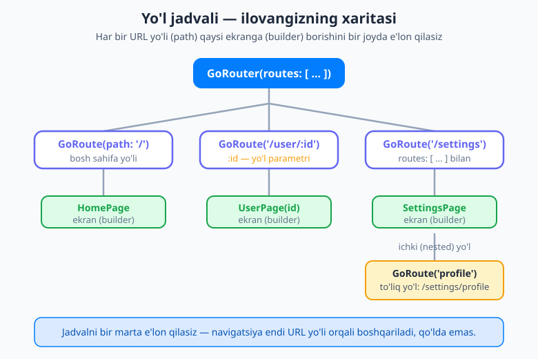
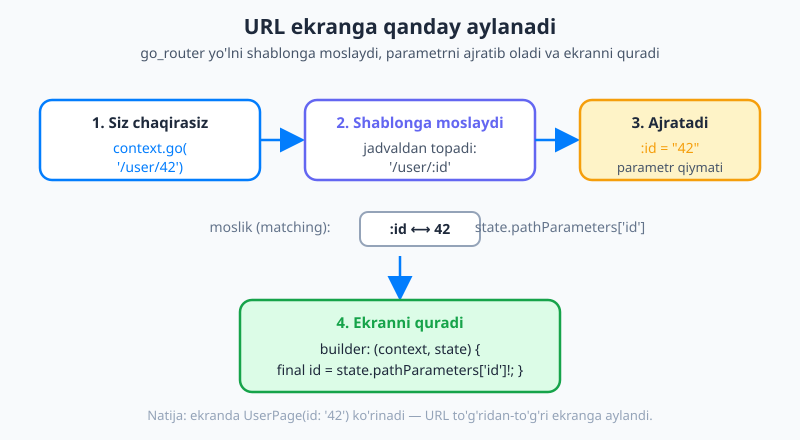
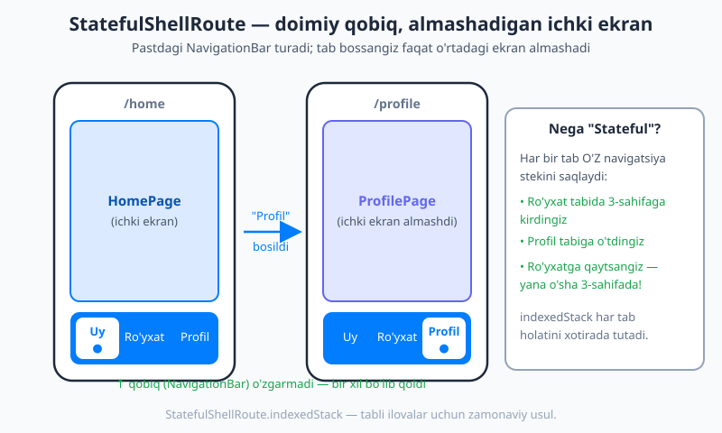

# 20 — go_router bilan deklarativ navigatsiya

[⬅️ Oldingi: 19 — Navigatsiya: Navigator 1.0](./19-navigatsiya-navigator.md) · [🏠 README](./README.md) · [Keyingi: 21 — Tarmoq (networking) va API ➡️](./21-networking-http.md)

---

> **Bu bobda:** oldingi bobda `Navigator.push` bilan ekrandan ekranga **qo'lda** o'tishni o'rgandingiz. Bu kichik ilovalar uchun yaxshi, lekin ilova kattalashganda — chuqur havolalar (deep link), veb-manzillar, login himoyasi, tablar bilan murakkablashadi. Endi rasmiy, **deklarativ** yo'naltirish paketi — **go_router** bilan tanishamiz. Siz *nega* uni ishlatishni, **yo'l jadvali** (route table) qanday tuzilishini, `context.go` va `context.push` farqini, **yo'l parametrlari** (`/user/:id`), **so'rov parametrlari** (`?q=...`) va `extra` orqali ma'lumot uzatishni, **nomli yo'llar**ni, **ichki (nested) yo'llar**ni, doimiy pastki menyu uchun **StatefulShellRoute**ni, login uchun **redirect** himoyasini va **deep linking**ni o'rganasiz. Oxirida bularning hammasini birlashtirib kichik ilova quramiz.

---

## Nega go_router kerak? (Navigator 1.0 ning chegaralari)

[19-bobda](./19-navigatsiya-navigator.md) `Navigator` bilan ishladik:

```dart
Navigator.push(
  context,
  MaterialPageRoute(builder: (context) => const DetailPage()),
);
```

Bu **imperativ** usul: siz "hozir, mana shu ekranni stekka qo'shgin" deb **qadam-baqadam buyruq** berasiz. Hisoblang — bu 10-bobdagi imperativ UI muammosiga juda o'xshaydi: hamma narsani qo'lda boshqarasiz.

Ilova kichik bo'lsa, bu yetarli. Lekin ilova o'sgan sari muammolar paydo bo'ladi:

- **Chuqur havolalar (deep linking).** Foydalanuvchi bildirishnomani bossa, to'g'ridan-to'g'ri `/user/42` ekraniga tushishi kerak. Imperativ usulda buni qo'lda yig'ish — bosh og'rig'i.
- **Veb (web) manzillar.** Flutter veb-da ishlaganda brauzer manzil qatorida `myapp.com/user/42` ko'rinishi kerak, "Orqaga" tugmasi ham ishlashi lozim. `Navigator.push` bunga tabiiy mos kelmaydi.
- **Login himoyasi (auth guard).** "Agar foydalanuvchi kirmagan bo'lsa, har qanday himoyalangan ekrandan login sahifasiga yo'naltir" — buni har bir `push` oldida qo'lda tekshirish charchatadi.
- **Tablar va ichki navigatsiya.** Pastki menyuli ilovada har bir tabning o'z tarixi bo'lishi kerak — buni Navigator 1.0 bilan qurish murakkab.

**go_router** — Flutter jamoasi tomonidan tavsiya etilgan **rasmiy** yo'naltirish paketi. Uning g'oyasi oddiy va kuchli: siz ilovaning barcha ekranlarini **bir jadvalda** — *qaysi URL yo'li → qaysi ekran* — deb e'lon qilasiz. Shundan keyin navigatsiya **URL orqali** boshqariladi: `context.go('/user/42')` deysiz, qolganini go_router qiladi.

> 💡 **Imperativ va deklarativ — yana o'sha farq.** Navigator 1.0 da siz *"qadam"* (push, pop) buyurasiz. go_router da siz *"manzil"* (`/user/42`) aytasiz — go_router o'zi qaysi ekranlarni ko'rsatishni hisoblab chiqaradi. Bu xuddi 10-bobdagi `UI = f(holat)` g'oyasiga o'xshaydi: bu yerda **UI = f(URL)**.

## O'rnatish (setup)

Avval paketni qo'shamiz. Terminalda loyiha papkasida:

```bash
flutter pub add go_router
```

Bu `pubspec.yaml` ga eng so'nggi versiyani qo'shadi:

```yaml
dependencies:
  flutter:
    sdk: flutter
  go_router: ^17.3.0
```

> 💡 `^17.3.0` dagi `^` (karet) belgisi "17.3.0 va undan yuqori, lekin 18.0.0 dan past" degani — kichik yangilanishlarni avtomatik oladi, lekin katta (buzuvchi) o'zgarishlardan himoya qiladi.

Endi `GoRouter` obyektini yaratamiz va uni `MaterialApp.router` ga ulaymiz. Diqqat: oddiy `MaterialApp` emas, balki **`MaterialApp.router`** ishlatiladi:

```dart
import 'package:flutter/material.dart';
import 'package:go_router/go_router.dart';

final router = GoRouter(
  routes: [
    GoRoute(
      path: '/',
      builder: (context, state) => const HomePage(),
    ),
    GoRoute(
      path: '/about',
      builder: (context, state) => const AboutPage(),
    ),
  ],
);

void main() => runApp(const MyApp());

class MyApp extends StatelessWidget {
  const MyApp({super.key});

  @override
  Widget build(BuildContext context) {
    return MaterialApp.router(
      title: 'go_router demo',
      routerConfig: router,
    );
  }
}
```

Mana shu — eng kichik to'liq go_router ilovasi. Uchta bo'lakni ajratib oling:

- **`GoRouter(routes: [...])`** — yo'l jadvali. Har bir `GoRoute` bitta `path` (URL yo'li) va bitta `builder` (shu yo'l uchun quriladigan ekran) ga ega.
- **`builder: (context, state) => ...`** — bu funksiya shu yo'l ochilganda qaysi widgetni qaytarishni aytadi. `state` — joriy yo'l haqidagi ma'lumot (parametrlar va h.k.); pastda ishlatamiz.
- **`MaterialApp.router(routerConfig: router)`** — ilovaga "navigatsiyani endi shu router boshqaradi" deb aytadi.



Yuqoridagi rasmda ko'rganingizdek, `GoRouter` — ildiz, undan `GoRoute`lar tarmoqlanadi va har biri bitta ekranga olib boradi. Bu **ilovangizning xaritasi**.

## Asosiy navigatsiya: `go` va `push` farqi

Endi ekranlar orasida o'tamiz. go_router ikkita asosiy usul beradi va ular **muhim farqqa** ega:

```dart
// 1) go — butun stekni almashtiradi (replace)
ElevatedButton(
  onPressed: () => context.go('/about'),
  child: const Text('About ga o\'tish'),
)

// 2) push — joriy ekran ustiga yangisini QO'YADI (stack)
ElevatedButton(
  onPressed: () => context.push('/about'),
  child: const Text('About ni ochish'),
)
```

`context.go(...)` va `context.push(...)` — bular go_router qo'shadigan qulay (extension) metodlar. Ishlatish uchun `import 'package:go_router/go_router.dart';` yetarli.

Farqni tushunish uchun navigatsiya **stekini** (ustun qilib taxlangan ekranlar) eslang:

| Metod | Nima qiladi | Qachon ishlatiladi |
|---|---|---|
| **`context.go('/about')`** | Stekni **tozalab**, `/about` ni asosiy qiladi. "Orqaga" bosib qaytib bo'lmaydi (chunki ostida hech narsa qolmaydi). | Tublar orasida, login dan keyin, "bosh sahifaga qayt" kabi holatlarda. |
| **`context.push('/about')`** | `/about` ni joriy ekran **ustiga** qo'yadi. "Orqaga" bosib qaytish mumkin. | Detal sahifasini ochish, ro'yxatdan elementga kirish kabi holatlarda. |

Orqaga qaytish uchun:

```dart
context.pop(); // ustki ekranni olib tashlaydi (push bilan qo'yilganni qaytaradi)
```

> 💡 **Oddiy qoida:** chuqurroq kirayotgan bo'lsangiz (ro'yxat → detal) — **`push`**. Bir butun bo'limni boshqasiga almashtirayotgan bo'lsangiz (login → bosh sahifa) — **`go`**. Ikkilanib qolsangiz: ko'pincha ro'yxatdan detalga `push`, tublar orasida `go`.

## Yo'l parametrlari: `/user/:id`

Ko'pincha ekran biror ma'lumotga bog'liq bo'ladi: "42-raqamli foydalanuvchi sahifasi". Buni URL yo'lining bir qismi qilib o'tkazamiz — bu **yo'l parametri** (path parameter). Yo'lda `:` bilan boshlanadigan qism — o'rin tutuvchi:

```dart
GoRoute(
  path: '/user/:id',
  builder: (context, state) {
    final id = state.pathParameters['id']!; // "42"
    return UserPage(userId: id);
  },
),
```

`:id` — bu "bu yerda istalgan qiymat kelishi mumkin" degani. Navigatsiya:

```dart
context.go('/user/42');   // id = "42"
context.go('/user/7');    // id = "7"
```

Ekran ichida shu qiymatni `state.pathParameters['id']` orqali olamiz. U **doim `String`** bo'ladi — agar son kerak bo'lsa, `int.parse(id)` qiling.



Rasmda ko'rsatilganidek, `context.go('/user/42')` chaqirilganda go_router uni `/user/:id` shabloniga **moslaydi**, `id = "42"` ni **ajratib oladi** va `builder` orqali ekranni quradi. Mana shu — URL ning ekranga aylanishi.

### So'rov parametrlari: `?q=...`

Qidiruv yoki filtr kabi *ixtiyoriy* qiymatlar uchun **so'rov parametrlari** (query parameters) qulay. Ular yo'l shablonida e'lon qilinmaydi — to'g'ridan-to'g'ri URL ga `?` dan keyin qo'shiladi:

```dart
context.go('/search?q=flutter&sort=new');
```

Ekran ichida ularni `state.uri.queryParameters` dan o'qiymiz:

```dart
GoRoute(
  path: '/search',
  builder: (context, state) {
    final query = state.uri.queryParameters['q'] ?? '';  // "flutter"
    final sort = state.uri.queryParameters['sort'] ?? ''; // "new"
    return SearchPage(query: query, sort: sort);
  },
),
```

> 💡 **Yo'l parametri vs so'rov parametri.** `/user/:id` — *zarur*, ekranni aniqlaydigan qism (qaysi foydalanuvchi). `?q=...` — *ixtiyoriy*, qo'shimcha sozlama (qidiruv matni, saralash). Yo'q bo'lsa `null` qaytadi, shuning uchun `?? ''` bilan standart qiymat berish odat.

### `extra`: butun obyektni uzatish

Ba'zan parametr matn emas, balki butun bir **obyekt** (masalan `Product` nusxasi). Uni URL ga sig'dirib bo'lmaydi — buning uchun `extra` bor:

```dart
context.go('/detail', extra: product); // product — Product obyekti
```

Ekran ichida:

```dart
GoRoute(
  path: '/detail',
  builder: (context, state) {
    final product = state.extra as Product;
    return DetailPage(product: product);
  },
),
```

> ⚠️ **Diqqat:** `extra` veb-da brauzer yangilansa (reload) **yo'qoladi** va deep link bilan kelmaydi (chunki u URL da emas, xotirada uzatiladi). Shuning uchun `extra` ni faqat ilova ichidagi tez uzatish uchun ishlating; ekran qayta yuklanganda ham kerak bo'ladigan ma'lumotni **yo'l yoki so'rov parametri** qiling (`/detail/:id`), keyin ma'lumotni `id` bo'yicha qaytadan yuklang.

## Nomli yo'llar: URL satrlaridan ajralish

Kodingiz bo'ylab `'/user/42'` kabi matn yozish xavfli — yo'l o'zgarsa (`/user/` → `/users/`), hamma joyni qo'lda tuzatish kerak. **Nomli yo'llar** bu bog'liqlikni uzadi: yo'lga `name` beriladi, navigatsiyada esa matn emas, nom ishlatiladi:

```dart
GoRoute(
  name: 'user',
  path: '/user/:id',
  builder: (context, state) =>
      UserPage(userId: state.pathParameters['id']!),
),
```

Navigatsiya:

```dart
context.goNamed('user', pathParameters: {'id': '42'});
// query bilan:
context.goNamed(
  'search',
  queryParameters: {'q': 'flutter'},
);
```

Endi `/user/:id` yo'lini kelajakda o'zgartirsangiz, faqat bitta joyni (`GoRoute` dagi `path`) o'zgartirasiz — `goNamed('user', ...)` chaqiruvlari o'zgarmaydi.

## Ichki (nested) yo'llar

Yo'llar daraxt kabi joylasha oladi: bir `GoRoute` ichida `routes:` orqali bola yo'llar e'lon qilinadi. Bola yo'lning `path` i **ota yo'lga qo'shiladi**:

```dart
GoRoute(
  path: '/settings',
  builder: (context, state) => const SettingsPage(),
  routes: [
    GoRoute(
      path: 'profile', // boshida '/' YO'Q — chunki u nisbiy
      builder: (context, state) => const ProfileSettingsPage(),
    ),
  ],
),
```

Bu yerda bola yo'lning to'liq manzili — **`/settings/profile`**. E'tibor bering: bola `path` i `'profile'` deb yoziladi (boshida `/` yo'q), chunki u otaga **nisbiy**. Navigatsiya odatdagidek: `context.go('/settings/profile')`.

> 💡 Ichki yo'llar URL ierarxiyasini tabiiy aks ettiradi: `/settings` → `/settings/profile` → `/settings/profile/edit`. Bu, ayniqsa, veb va deep link uchun toza tuzilma beradi.

## Doimiy pastki menyu: `StatefulShellRoute`

Ko'pgina ilovalarda pastda **NavigationBar** (tablar: Uy, Ro'yxat, Profil) bo'ladi. U doimo ko'rinib turishi, tab almashganda esa faqat o'rtadagi ekran o'zgarishi kerak. Bundan ham muhimi: har bir tab **o'z navigatsiya tarixini** saqlashi kerak — Ro'yxat tabida ichkari kirib, Profilga o'tib, qaytib kelganingizda yana o'sha joyda bo'lishingiz lozim.

Buni `StatefulShellRoute.indexedStack` hal qiladi. "Shell" (qobiq) — doimiy ramka (NavigationBar), uning ichidagi "branch"lar — har bir tabning o'z stagi:



```dart
final router = GoRouter(
  initialLocation: '/home',
  routes: [
    StatefulShellRoute.indexedStack(
      builder: (context, state, navigationShell) {
        // navigationShell — joriy tab tarkibini ko'rsatadigan widget.
        // Uni doimiy qobiq (Scaffold + NavigationBar) ichiga joylaymiz.
        return ScaffoldWithNavBar(navigationShell: navigationShell);
      },
      branches: [
        // 1-tab: Uy
        StatefulShellBranch(
          routes: [
            GoRoute(path: '/home', builder: (c, s) => const HomePage()),
          ],
        ),
        // 2-tab: Ro'yxat (ichida detal yo'li ham bor)
        StatefulShellBranch(
          routes: [
            GoRoute(
              path: '/list',
              builder: (c, s) => const ListPage(),
              routes: [
                GoRoute(
                  path: 'detail/:id',
                  builder: (c, s) =>
                      DetailPage(id: s.pathParameters['id']!),
                ),
              ],
            ),
          ],
        ),
        // 3-tab: Profil
        StatefulShellBranch(
          routes: [
            GoRoute(path: '/profile', builder: (c, s) => const ProfilePage()),
          ],
        ),
      ],
    ),
  ],
);
```

Doimiy qobiq widgeti — pastida `NavigationBar` bo'lgan oddiy `Scaffold`:

```dart
class ScaffoldWithNavBar extends StatelessWidget {
  const ScaffoldWithNavBar({super.key, required this.navigationShell});

  final StatefulNavigationShell navigationShell;

  @override
  Widget build(BuildContext context) {
    return Scaffold(
      body: navigationShell, // joriy tabning ekrani shu yerda ko'rinadi
      bottomNavigationBar: NavigationBar(
        selectedIndex: navigationShell.currentIndex,
        onDestinationSelected: (index) {
          // shu indeksli tabga o'tish (o'sha tab tarixini saqlab)
          navigationShell.goBranch(
            index,
            initialLocation: index == navigationShell.currentIndex,
          );
        },
        destinations: const [
          NavigationDestination(icon: Icon(Icons.home), label: 'Uy'),
          NavigationDestination(icon: Icon(Icons.list), label: 'Ro\'yxat'),
          NavigationDestination(icon: Icon(Icons.person), label: 'Profil'),
        ],
      ),
    );
  }
}
```

Asosiy g'oyalar:

- **`navigationShell`** — go_router beradigan widget; u joriy tanlangan tabning tarkibini ko'rsatadi. Uni `Scaffold` ning `body:` iga qo'yasiz.
- **`navigationShell.currentIndex`** — qaysi tab tanlanganini bildiradi; `NavigationBar` ni shu bilan moslaymiz.
- **`navigationShell.goBranch(index)`** — tablar orasida o'tadi va har bir tabning **o'z stekini** saqlaydi (`indexedStack` shuning uchun). `initialLocation:` ni shunday berish — allaqachon ochiq tab qayta bosilganda uni boshiga (ildiziga) qaytaradi, bu odatiy xulq.

> 💡 Mana shu — 2026-yilda tabli (pastki menyuli) Flutter ilova qurishning **zamonaviy, tavsiya etilgan** usuli. `StatefulShellBranch` har bir tabning navigatsiya holatini mustaqil tutgani uchun foydalanuvchi tajribasi tabiiy bo'ladi.

## Login himoyasi: `redirect`

Himoyalangan ekranlarni qo'riqlash uchun `GoRouter` ga **`redirect`** funksiyasi beriladi. U **har bir navigatsiyadan oldin** chaqiriladi va: `String?` qaytaradi — agar `null` bo'lsa "davom et", agar yo'l qaytarsa "o'sha yo'lga yo'naltir".

```dart
final router = GoRouter(
  refreshListenable: authState, // auth holati o'zgarsa, redirect qayta baholanadi
  redirect: (context, state) {
    final loggedIn = authState.isLoggedIn;
    final goingToLogin = state.matchedLocation == '/login';

    // Kirmagan va login sahifasiga ketmayotgan bo'lsa -> login ga
    if (!loggedIn && !goingToLogin) return '/login';

    // Allaqachon kirgan va login sahifasiga ketayotgan bo'lsa -> bosh sahifaga
    if (loggedIn && goingToLogin) return '/home';

    return null; // hech qanday yo'naltirish kerak emas
  },
  routes: [
    GoRoute(path: '/login', builder: (c, s) => const LoginPage()),
    GoRoute(path: '/home', builder: (c, s) => const HomePage()),
    // ... qolgan himoyalangan yo'llar
  ],
);
```

Muhim qismlar:

- **`state.matchedLocation`** — foydalanuvchi qaysi yo'lga bormoqchi ekani. Uni tekshirib, login sahifasining o'zini bloklab qo'ymaslikka e'tibor bering (aks holda cheksiz yo'naltirish bo'ladi).
- **`null` qaytarish** — "yo'naltirish shart emas, davom et" degani.
- **`refreshListenable`** — bu yerga `Listenable` (masalan `ChangeNotifier` bo'lgan `authState`) berasiz. Foydalanuvchi kirgan/chiqqanda `authState` o'zgarishi haqida xabar berishi bilan go_router `redirect` ni **qayta baholaydi** va ekranni avtomatik yangilaydi. Holat boshqaruvini keyingi boblarda batafsil ko'ramiz; hozircha g'oya: *auth o'zgardi → router qayta tekshiradi*.

### 404 sahifasi: `errorBuilder`

Mavjud bo'lmagan yo'lga (`/mavjud-emas`) o'tilganda nima ko'rsatishni `errorBuilder` belgilaydi:

```dart
final router = GoRouter(
  errorBuilder: (context, state) => Scaffold(
    body: Center(child: Text('Sahifa topilmadi: ${state.uri}')),
  ),
  routes: [ /* ... */ ],
);
```

## Deep linking — URL to'g'ridan-to'g'ri ekranga

go_router ning eng katta yutug'i shundaki, **har bir ekran URL ga ega**. Bu deep linkingni deyarli tekin qiladi:

- **Veb-da:** brauzer manzil qatorida `myapp.com/user/42` ko'rinadi; uni nusxalab, boshqa odamga yuborsangiz, u to'g'ri ekranni ochadi; brauzerning "Orqaga/Oldinga" tugmalari ishlaydi.
- **Mobil-da:** push-bildirishnoma yoki tashqi havola ilovani `/user/42` da ochishi mumkin — chunki bu URL aynan o'sha ekranga moslanadi.

Siz buning uchun qo'shimcha kod yozmaysiz — yo'l jadvalini to'g'ri tuzganingiz uchun bu **avtomatik** ishlaydi. (Platformaga bog'lash — Android'da `intent-filter`, iOS'da universal links — alohida sozlash talab qiladi, lekin bu loyiha sozlamasi, go_router mantig'i emas.)

## Birgalikda: kichik ilova

Endi o'rgangan narsalarni birlashtiramiz: bosh sahifa, ro'yxat, detal (`:id`), profil — pastki menyuli `StatefulShellRoute` bilan, va kirmagan foydalanuvchini login ga yo'naltiruvchi `redirect` bilan. Quyida router qismi (ekran widgetlari sodda, joy tejash uchun qisqartirilgan):

```dart
import 'package:flutter/material.dart';
import 'package:go_router/go_router.dart';

// Oddiy auth holati (real ilovada bu to'liqroq bo'ladi)
final authState = AuthState();

class AuthState extends ChangeNotifier {
  bool isLoggedIn = false;
  void login() { isLoggedIn = true; notifyListeners(); }
  void logout() { isLoggedIn = false; notifyListeners(); }
}

final router = GoRouter(
  initialLocation: '/home',
  refreshListenable: authState,
  redirect: (context, state) {
    final loggedIn = authState.isLoggedIn;
    final goingToLogin = state.matchedLocation == '/login';
    if (!loggedIn && !goingToLogin) return '/login';
    if (loggedIn && goingToLogin) return '/home';
    return null;
  },
  routes: [
    GoRoute(path: '/login', builder: (c, s) => const LoginPage()),
    StatefulShellRoute.indexedStack(
      builder: (c, s, navigationShell) =>
          ScaffoldWithNavBar(navigationShell: navigationShell),
      branches: [
        StatefulShellBranch(routes: [
          GoRoute(path: '/home', builder: (c, s) => const HomePage()),
        ]),
        StatefulShellBranch(routes: [
          GoRoute(
            path: '/list',
            builder: (c, s) => const ListPage(),
            routes: [
              GoRoute(
                name: 'item',
                path: 'item/:id',
                builder: (c, s) => DetailPage(id: s.pathParameters['id']!),
              ),
            ],
          ),
        ]),
        StatefulShellBranch(routes: [
          GoRoute(path: '/profile', builder: (c, s) => const ProfilePage()),
        ]),
      ],
    ),
  ],
);

void main() => runApp(const MyApp());

class MyApp extends StatelessWidget {
  const MyApp({super.key});
  @override
  Widget build(BuildContext context) {
    return MaterialApp.router(
      title: 'go_router demo',
      theme: ThemeData(
        colorScheme: ColorScheme.fromSeed(seedColor: Colors.indigo),
      ),
      routerConfig: router,
    );
  }
}
```

Ro'yxatdan detalga o'tish (nomli yo'l bilan, `/list` tabi ichida):

```dart
// ListPage ichida, biror element bosilganda:
onTap: () => context.goNamed('item', pathParameters: {'id': '42'}),
```

Login sahifasi shunchaki `authState.login()` ni chaqiradi — `refreshListenable` tufayli router darhol `redirect` ni qayta baholaydi va bosh sahifaga o'tkazadi:

```dart
// LoginPage ichida:
ElevatedButton(
  onPressed: () => authState.login(), // redirect bizni /home ga olib boradi
  child: const Text('Kirish'),
)
```

Bu ilova endi: deep link orqali ochiladi (har ekran URL ga ega), tablar har biri o'z tarixini saqlaydi va himoyalangan ekranlar login bilan qo'riqlanadi — hammasi **deklarativ jadval** orqali.

## Qachon ortiqcha o'ylamaslik kerak?

go_router kuchli, lekin u **har doim ham shart emas**. Agar ilovangizda bor-yo'g'i ikki-uchta ekran bo'lsa va deep link, veb yoki tablar kerak bo'lmasa — [19-bobdagi](./19-navigatsiya-navigator.md) oddiy `Navigator.push`/`pop` butunlay yetarli va soddaroq.

go_router o'zining haqiqiy qiymatini ilova **o'sgan sari** ko'rsatadi: ko'p ekran, chuqur havolalar, veb-qo'llab-quvvatlash, login oqimlari, tablar paydo bo'lganda. Shunda "qo'lda push qilish" tarqoq bo'lib ketadi, jadval esa tartibni saqlaydi.

> 💡 **Qoida:** kichik boshlang — Navigator 1.0 bilan. Ilova bir necha ekrandan oshib, navigatsiya murakkablashganda go_router ga o'ting. Vaqtidan oldin murakkablik ham xato.

## Keyingi qadam

Bu bobda ilovangiz ekranlari orasida URL asosida, deklarativ harakatlanishni o'rgandingiz: yo'l jadvali, `go`/`push`, yo'l/so'rov/`extra` parametrlari, nomli va ichki yo'llar, doimiy `StatefulShellRoute` menyusi, login uchun `redirect` va deep linking.

Endi ilovangiz ko'p ekranli bo'lib, har biri ma'lumot ko'rsatishi kerak. Lekin bu ma'lumot qayerdan keladi? Keyingi [21-bobda](./21-networking-http.md) **tarmoq (networking)** bilan ishlashni — internetdan `http` orqali ma'lumot olish, JSON ni o'qish va uni ekranga chiqarishni o'rganamiz. O'sha paytda `/user/:id` yo'liga kelgan `id` bo'yicha haqiqiy foydalanuvchi ma'lumotini serverdan yuklaymiz.

---

## Mashqlar

### Oson

1. O'z so'zlaringiz bilan ayting: `context.go('/about')` va `context.push('/about')` orasidagi farq nima? Qaysi biridan keyin "Orqaga" bosib qaytib bo'lmaydi?
2. Quyidagi yo'l uchun: `GoRoute(path: '/product/:id', ...)`. `context.go('/product/9')` chaqirilganda `id` ning qiymati nima bo'ladi va uni ekran ichida qanday o'qiysiz?
3. `MaterialApp` o'rniga go_router bilan qaysi konstruktor ishlatiladi va `GoRouter` obyekti unga qaysi parametr orqali beriladi?
4. Yo'l parametri (`/user/:id`) bilan so'rov parametri (`?q=...`) orasidagi farqni bir-ikki jumlada tushuntiring. Qaysi biri "ixtiyoriy" deb hisoblanadi?

### O'rta

5. Quyidagi yo'l jadvalini tuzing (faqat `routes:` qismi): `/` → `HomePage`, `/cart` → `CartPage`, va `/cart` ning ichki yo'li `checkout` → `CheckoutPage`. Ichki yo'lning to'liq URL i qanday bo'ladi?
6. `name: 'user'`, `path: '/user/:id'` bo'lgan yo'lga nomli navigatsiya yozing: `id = 100` bo'lgan foydalanuvchi sahifasiga o'ting. Nima uchun nomli yo'l matnli `context.go('/user/100')` dan yaxshiroq bo'lishi mumkin?
7. `redirect` funksiyasi `null` qaytarsa nima bo'ladi? Yo'l (masalan `/login`) qaytarsa-chi? Login sahifasining o'zida cheksiz yo'naltirishni qanday oldini olasiz?

### Qiyin

8. `StatefulShellRoute.indexedStack` nima uchun "stateful" (holatli) deb ataladi? Uch tabli ilovada (Uy/Ro'yxat/Profil) foydalanuvchi Ro'yxat tabida ichki sahifaga kirib, Profilga o'tib, keyin Ro'yxatga qaytsa nima ko'radi va nega?
9. Bir o'quvchi `extra` orqali `Product` obyektini uzatib, veb-da sahifani yangilagach (reload) ilova qulab tushganidan shikoyat qilyapti. Muammo nimada va uni qanday hal qilish kerak?
10. Kichik (2 ekranli) ilova uchun go_router shartmi? Qachon Navigator 1.0 dan go_router ga o'tish mantiqan to'g'ri bo'ladi? Javobingizni asoslang.

<details markdown="1"><summary>Yechimlar</summary>

**1.** `context.go('/about')` — butun navigatsiya stekini almashtiradi: `/about` asosiy (va odatda yagona) ekran bo'lib qoladi, ostida boshqa ekran qolmaydi, shuning uchun "Orqaga" bosib qaytib bo'lmaydi. `context.push('/about')` esa `/about` ni joriy ekran **ustiga** qo'yadi — ostidagi ekran saqlanadi va "Orqaga" (yoki `context.pop()`) bilan qaytish mumkin. Qaytib bo'lmaydigani — **`go`**.

**2.** `id` ning qiymati — **`"9"`** (matn/`String`, son emas). Ekran ichida `builder` ichida shunday o'qiysiz:
```dart
final id = state.pathParameters['id']!; // "9"
```
Agar son kerak bo'lsa, `int.parse(id)` qiling.

**3.** `MaterialApp.router` ishlatiladi va `GoRouter` obyekti unga **`routerConfig:`** parametri orqali beriladi:
```dart
MaterialApp.router(routerConfig: router)
```

**4.** **Yo'l parametri** (`/user/:id`) — ekranni *aniqlaydigan*, zarur qism; u yo'l shablonida `:` bilan e'lon qilinadi (qaysi foydalanuvchi). **So'rov parametri** (`?q=...`) — qo'shimcha, *ixtiyoriy* sozlama (qidiruv matni, saralash); u shablonda e'lon qilinmaydi va `state.uri.queryParameters` dan o'qiladi. Ixtiyoriy deb hisoblanadigani — **so'rov parametri** (yo'q bo'lsa `null` qaytadi).

**5.**
```dart
routes: [
  GoRoute(path: '/', builder: (c, s) => const HomePage()),
  GoRoute(
    path: '/cart',
    builder: (c, s) => const CartPage(),
    routes: [
      GoRoute(
        path: 'checkout', // boshida '/' yo'q — nisbiy
        builder: (c, s) => const CheckoutPage(),
      ),
    ],
  ),
],
```
Ichki yo'lning to'liq URL i — **`/cart/checkout`**.

**6.**
```dart
context.goNamed('user', pathParameters: {'id': '100'});
```
Nomli yo'l yaxshiroq, chunki u kodni URL **satrining shaklidan ajratadi**: kelajakda `path` ni o'zgartirsangiz (`/user/:id` → `/users/:id`), faqat `GoRoute` dagi bitta joyni tuzatasiz; `goNamed('user', ...)` chaqiruvlari o'zgarishsiz ishlaydi. Matnli `context.go('/user/100')` esa har joyda qo'lda tuzatishni talab qiladi va yozuv xatosiga moyil.

**7.** `redirect` **`null`** qaytarsa — yo'naltirish kerak emas, navigatsiya so'ralgan yo'lda **davom etadi**. Agar yo'l (masalan `'/login'`) qaytarsa — foydalanuvchi o'sha yo'lga **yo'naltiriladi**. Cheksiz yo'naltirishni `state.matchedLocation` ni tekshirib oldini olasiz: agar foydalanuvchi allaqachon `/login` ga ketayotgan bo'lsa, yana `/login` qaytarmaslik kerak:
```dart
final goingToLogin = state.matchedLocation == '/login';
if (!loggedIn && !goingToLogin) return '/login';
return null;
```

**8.** "Stateful" deyiladi, chunki u har bir tab (branch) ning **navigatsiya holatini/stekini alohida xotirada saqlaydi** (`indexedStack` — barcha tablarni qurib, faqat tanlanganini ko'rsatadi). Foydalanuvchi Ro'yxat tabida ichki sahifaga kirsa, keyin Profilga o'tib, so'ng Ro'yxatga qaytsa — u **yana o'sha ichki sahifada** bo'ladi, boshidan emas. Sababi: Ro'yxat branchining steki yo'qotilmagan, tab almashganda u shunchaki ko'rinmas bo'lib turgan, qaytganda o'sha holatda tiklanadi.

**9.** Muammo: `extra` ma'lumotni URL da emas, **xotirada** uzatadi. Veb-da sahifa yangilanganda (reload) ilova qaytadan ishga tushadi va xotiradagi `extra` **yo'qoladi** — `state.extra as Product` `null` bo'lib, `null` ni `Product` ga keltirish qulashga olib keladi. Yechim: qayta yuklashda ham kerak bo'ladigan ma'lumotni `extra` orqali emas, **yo'l parametri** orqali uzatish (`/detail/:id`), keyin ekran ichida `id` bo'yicha `Product` ni qaytadan yuklash (masalan serverdan yoki lokal saqlovdan). Shunda URL o'zi yetarli ma'lumotni saqlaydi.

**10.** Yo'q, kichik (2 ekranli) ilova uchun go_router shart emas — bunday holatda [19-bobdagi](./19-navigatsiya-navigator.md) `Navigator.push`/`pop` soddaroq va yetarli. go_router ga o'tish quyidagilar paydo bo'lganda mantiqan to'g'ri bo'ladi: ko'p ekran, **chuqur havolalar** (bildirishnoma/havola to'g'ridan-to'g'ri ekran ochishi), **veb-qo'llab-quvvatlash** (brauzer URL/Orqaga tugmasi), **login himoyasi** va **tabli navigatsiya**. Qisqasi: navigatsiya qo'lda boshqarish murakkablashganda. Vaqtidan oldin go_router qo'shish ortiqcha murakkablik — kerakli payt kelganda o'ting.

</details>

---

[⬅️ Oldingi: 19 — Navigatsiya: Navigator 1.0](./19-navigatsiya-navigator.md) · [🏠 README](./README.md) · [Keyingi: 21 — Tarmoq (networking) va API ➡️](./21-networking-http.md)
