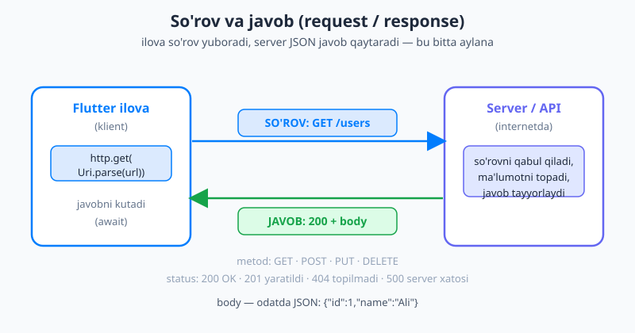
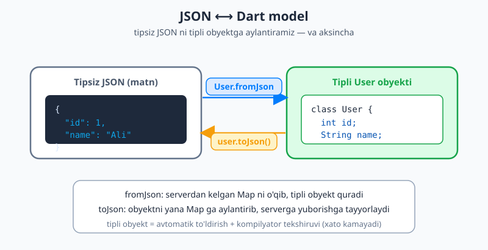
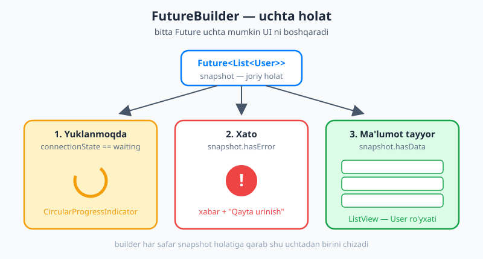

# 21 — Tarmoq (networking) va API

[⬅️ Oldingi: 20 — go_router bilan deklarativ navigatsiya](./20-go-router.md) · [🏠 README](./README.md) · [Keyingi: 22 — Mahalliy ma'lumotlarni saqlash ➡️](./22-mahalliy-saqlash.md)

---

> **Bu bobda:** ko'pchilik ilovalar ma'lumotni o'zida saqlamaydi — uni **serverdan** (internetdagi kompyuterdan) oladi: foydalanuvchilar ro'yxati, mahsulotlar, ob-havo, yangiliklar. Bu bob shu jarayonni boshdan oxir o'rgatadi. Avval **nega** kerakligini va tarmoqning asoslarini (so'rov/javob, HTTP metodlar, status kodlar, JSON) tushunamiz. Keyin **`http`** paketi bilan haqiqiy so'rov yuboramiz, kelgan **JSON ni Dart modeliga** aylantiramiz (`fromJson`/`toJson`), uni **`FutureBuilder`** orqali ekranga — yuklanmoqda / xato / tayyor uchta holatda — chizamiz. So'ngra mashhur muqobil **`dio`** ni, kodni toza tutadigan **repository** namunasini, xatolar va offline ni boshqarishni ko'rib chiqamiz. Oxirida ommaviy API dan foydalanuvchilarni yuklab ko'rsatadigan kichik ilova quramiz. Bu bob to'g'ridan-to'g'ri [9-bobdagi](./09-asinxron-dart.md) `Future`/`async`/`await` ga tayanadi.

---

## Nega tarmoq kerak? (so'rov va javob)

Tasavvur qiling, siz Telegram yoki Instagram ochasiz. Postlar, rasmlar, izohlar — bularning hech biri ilovaning ichida "yashirin" turmaydi. Telefoningizda faqat **ko'rsatuvchi kod** (UI) bor; haqiqiy ma'lumot esa internetdagi **server**da. Ilova ochilganda u serverga "menga so'nggi postlarni ber" deb **so'rov** (request) yuboradi, server esa **javob** (response) qaytaradi. Bu — har bir zamonaviy ilovaning yuragi.

Bu suhbatni hayotiy misol bilan tushunaylik. **Restoranda** ofitsiantni chaqirasiz va "bitta osh" deysiz (so'rov). Ofitsiant oshxonaga boradi, ovqatni olib keladi (javob). Siz oshxona ichida nima bo'layotganini bilmaysiz — sizga faqat **natija** kerak. Tarmoqda ham xuddi shunday: ilova so'rov yuboradi, server qanday ishlashidan qat'i nazar, javob qaytaradi.

Bu suhbat **HTTP** degan til (protokol) orqali boradi. HTTP da bir nechta asosiy tushuncha bor:

**1. Metod (method)** — siz nima qilmoqchisiz:

| Metod | Ma'nosi | Misol |
|---|---|---|
| **GET** | ma'lumotni **o'qish** (olish) | foydalanuvchilar ro'yxatini olish |
| **POST** | yangi ma'lumot **yaratish** | yangi post qo'shish |
| **PUT** | mavjud ma'lumotni **yangilash** | profilni tahrirlash |
| **DELETE** | ma'lumotni **o'chirish** | postni o'chirish |

**2. Status kodi (status code)** — server javobida "qanday ketdi" ni bildiruvchi son:

| Kod | Ma'nosi |
|---|---|
| **200** | OK — hammasi joyida, ma'lumot tayyor |
| **201** | Yaratildi (Created) — POST muvaffaqiyatli yangi narsa yaratdi |
| **400** | Noto'g'ri so'rov (Bad Request) — siz yuborgan ma'lumot xato |
| **401** | Ruxsatsiz (Unauthorized) — kirish kerak (token yo'q/xato) |
| **404** | Topilmadi (Not Found) — bunday manzil/resurs yo'q |
| **500** | Server xatosi — muammo serverda |

Oddiy qoida: **2xx** — muvaffaqiyat, **4xx** — siz (klient) xato qildingiz, **5xx** — server xato qildi.

**3. Sarlavhalar (headers)** — so'rov/javob haqidagi qo'shimcha ma'lumot: ma'lumot turi (`Content-Type: application/json`), avtorizatsiya tokeni (`Authorization: Bearer ...`) va h.k.

**4. Body (tana)** — asosiy ma'lumotning o'zi. Bugun deyarli har doim u **JSON** formatida bo'ladi.



Rasmda ko'rganingizdek, bu **aylana**: ilova so'rovni yuboradi (metod + manzil), server uni qabul qiladi, ma'lumotni topadi va javobni (status kodi + body) qaytaradi. Bizning ish — shu aylanani Flutter kodida qurish.

> 💡 **JSON nima?** JSON (JavaScript Object Notation) — ma'lumotni matn ko'rinishida yozish usuli. U Dart `Map` va `List` ga juda o'xshaydi: `{"id": 1, "name": "Ali"}` — kalit-qiymat juftliklari; `[1, 2, 3]` — ro'yxat. Server va ilova bir-biri bilan aynan shu "umumiy til"da gaplashadi.

### Mashq qilish uchun ommaviy API

Boshlash uchun haqiqiy server qurish shart emas. Internetda **bepul, ochiq test API**lar bor. Eng mashhuri — **JSONPlaceholder** (`https://jsonplaceholder.typicode.com`): u soxta foydalanuvchilar, postlar, izohlar qaytaradi. Biz shu bobda undan foydalanamiz. Masalan, `https://jsonplaceholder.typicode.com/users` manziliga GET so'rov yuborsangiz, 10 ta soxta foydalanuvchining JSON ro'yxatini qaytaradi.

## `http` paketi: birinchi so'rov

Dart'da tarmoq bilan ishlashning eng oddiy yo'li — rasmiy **`http`** paketi. Avval uni qo'shamiz. Terminalda loyiha papkasida:

```bash
flutter pub add http
```

Bu `pubspec.yaml` ga qo'shadi:

```yaml
dependencies:
  flutter:
    sdk: flutter
  http: ^1.2.0
```

> 💡 `^1.2.0` dagi `^` (karet) "1.2.0 va undan yuqori, lekin 2.0.0 dan past" degani — kichik yangilanishlarni avtomatik oladi, buzuvchi katta o'zgarishlardan saqlaydi.

Endi birinchi GET so'rovni yuboramiz. E'tibor bering — tarmoq so'rovi vaqt oladi, shuning uchun funksiya **`async`** va so'rov **`await`** bilan ([9-bob](./09-asinxron-dart.md) ni eslang):

```dart
import 'package:http/http.dart' as http;

Future<void> foydalanuvchilarniOl() async {
  final url = Uri.parse('https://jsonplaceholder.typicode.com/users');
  final response = await http.get(url);

  if (response.statusCode == 200) {
    // muvaffaqiyat: ma'lumot response.body ichida (JSON matn)
    print(response.body);
  } else {
    // muvaffaqiyatsiz: status kodiga qarab xatoni boshqaramiz
    print('Xato: ${response.statusCode}');
  }
}
```

Uchta muhim qismni ajratib oling:

- **`Uri.parse('https://...')`** — `http.get` oddiy matn emas, `Uri` obyektini kutadi. `Uri.parse` matnni shunga aylantiradi.
- **`await http.get(url)`** — so'rovni yuboradi va javobni **kutadi** (lekin ekranni bloklamaydi). Natija — `http.Response` obyekti.
- **`response.statusCode`** va **`response.body`** — javobning ikki muhim qismi: status kodi (son) va body (matn, odatda JSON).

> ⚠️ **Android/iOS ruxsati.** Internetga chiqish uchun ruxsat kerak. Android'da `android/app/src/main/AndroidManifest.xml` ga `<uses-permission android:name="android.permission.INTERNET"/>` qo'shilgan bo'lishi kerak (yangi loyihalarda odatda bor). iOS da `https` (xavfsiz) manzillar uchun qo'shimcha sozlama shart emas.

### POST: ma'lumot yuborish

Yangi ma'lumot yaratish uchun **POST** ishlatamiz. Bu safar so'rovga **sarlavha** (`Content-Type`) va **body** (JSON ga aylantirilgan ma'lumot) qo'shamiz. JSON ga aylantirish uchun `dart:convert` dagi `jsonEncode` dan foydalanamiz:

```dart
import 'dart:convert';
import 'package:http/http.dart' as http;

Future<void> postYaratish() async {
  final url = Uri.parse('https://jsonplaceholder.typicode.com/posts');
  final response = await http.post(
    url,
    headers: {'Content-Type': 'application/json'},
    body: jsonEncode({
      'title': 'Salom',
      'body': 'Bu mening birinchi postim',
      'userId': 1,
    }),
  );

  if (response.statusCode == 201) {        // 201 = yaratildi
    print('Yaratildi: ${response.body}');
  } else {
    print('Xato: ${response.statusCode}');
  }
}
```

E'tibor bering: POST muvaffaqiyatli bo'lganda odatda **201** (Created) qaytadi, **200** emas. `jsonEncode({...})` esa Dart `Map` ni JSON **matniga** aylantiradi — server matn kutadi, Dart obyektini emas.

## JSON ↔ Dart: model klasslari

Yuqorida `response.body` — bu shunchaki **matn** (`String`). Undagi `name` maydoniga qanday yetamiz? `response.body['name']` ishlamaydi, chunki u matn, `Map` emas. Avval matnni Dart strukturasiga **dekodlash** (parse qilish) kerak.

Buni `dart:convert` dagi **`jsonDecode`** qiladi:

```dart
import 'dart:convert';

final body = '{"id": 1, "name": "Ali"}';
final data = jsonDecode(body);   // Map<String, dynamic>
print(data['name']);             // Ali
```

`jsonDecode` JSON obyektni `Map<String, dynamic>` ga, JSON ro'yxatni `List<dynamic>` ga aylantiradi. **`dynamic`** — "tipi noma'lum, har narsa bo'lishi mumkin" degani. Bu xavfli: `data['naam']` (xato yozsangiz) `null` qaytaradi, kompilyator sizni ogohlantirmaydi. Shu sababli biz ma'lumotni **tipli model klassi**ga o'tkazamiz.

Quyida `User` model klassi. Diqqat — ikkita maxsus metod bor:

```dart
class User {
  final int id;
  final String name;
  final String email;

  User({required this.id, required this.name, required this.email});

  // JSON Map dan User quradi (serverdan -> obyekt)
  factory User.fromJson(Map<String, dynamic> json) {
    return User(
      id: json['id'] as int,
      name: json['name'] as String,
      email: json['email'] as String,
    );
  }

  // User ni yana JSON Map ga aylantiradi (obyekt -> serverga)
  Map<String, dynamic> toJson() {
    return {
      'id': id,
      'name': name,
      'email': email,
    };
  }
}
```

- **`factory User.fromJson(...)`** — `Map` ni qabul qilib, undan tipli `User` quradi. `factory` — bu konstruktorning maxsus turi; hozircha "obyekt qaytaradigan konstruktor" deb tushuning. Har bir maydonni `json['...']` dan o'qib, kerakli tipga aylantiramiz.
- **`Map<String, dynamic> toJson()`** — teskari yo'nalish: `User` ni yana `Map` ga aylantiradi. Buni `jsonEncode` bilan birga POST/PUT da serverga yuborish uchun ishlatamiz.



Rasmda ko'rganingizdek, `fromJson` — serverdan kelgan **tipsiz** JSON ni **tipli** obyektga aylantiradigan ko'prik; `toJson` esa teskari yo'nalish. Tipli obyekt bilan ishlash xavfsizroq: `user.naam` deb xato yozsangiz, kompilyator **darhol** ogohlantiradi (`Map` da esa indamay `null` qaytardi).

### Ro'yxatni parse qilish

`/users` manzili bitta emas, **ko'p** foydalanuvchi qaytaradi — ya'ni JSON **ro'yxat** (`List`). Uni shunday parse qilamiz:

```dart
import 'dart:convert';

List<User> foydalanuvchilarniParse(String body) {
  final List<dynamic> jsonList = jsonDecode(body); // [ {...}, {...}, ... ]
  return jsonList
      .map((item) => User.fromJson(item as Map<String, dynamic>))
      .toList();
}
```

Bu yerda toplamlar bobida ko'rgan `.map(...).toList()` ishlaydi: ro'yxatdagi **har bir** JSON elementni `User.fromJson` orqali `User` obyektiga aylantirib, yangi `List<User>` yig'amiz.

Endi so'rov va parse'ni birlashtiramiz — natijada `Future<List<User>>`:

```dart
import 'dart:convert';
import 'package:http/http.dart' as http;

Future<List<User>> foydalanuvchilarniOl() async {
  final url = Uri.parse('https://jsonplaceholder.typicode.com/users');
  final response = await http.get(url);

  if (response.statusCode == 200) {
    final List<dynamic> jsonList = jsonDecode(response.body);
    return jsonList
        .map((item) => User.fromJson(item as Map<String, dynamic>))
        .toList();
  } else {
    throw Exception('Foydalanuvchilarni yuklab bo\'lmadi: ${response.statusCode}');
  }
}
```

Status 200 bo'lmasa, biz `Exception` **otamiz** — bu juda muhim. Funksiyani chaqirgan joy (`FutureBuilder`) bu xatoni ushlab, foydalanuvchiga "muammo bo'ldi" deb ko'rsatadi. Xatoni indamay yutib yubormang.

### Katta modellar uchun: `json_serializable` (qo'lda yozish charchatadi)

Yuqoridagi `fromJson`/`toJson` ni qo'lda yozish kichik model uchun yaxshi. Lekin model 20-30 maydonli bo'lsa, har birini qo'lda yozish zerikarli **va** xatoga moyil. Bunday holatda **kod generatsiyasi** (codegen) yordam beradi: siz faqat maydonlarni e'lon qilasiz, `fromJson`/`toJson` ni mashina **avtomatik** yozadi.

Buning standart yo'li — **`json_serializable`** paketi **`build_runner`** bilan birga:

```yaml
dependencies:
  json_annotation: ^4.9.0

dev_dependencies:
  build_runner: ^2.4.0
  json_serializable: ^6.8.0
```

Model shunday yoziladi:

```dart
import 'package:json_annotation/json_annotation.dart';

part 'user.g.dart';   // generatsiya qilinadigan fayl

@JsonSerializable()
class User {
  final int id;
  final String name;
  final String email;

  User({required this.id, required this.name, required this.email});

  // generatsiya qilingan funksiyalarga ulaymiz:
  factory User.fromJson(Map<String, dynamic> json) => _$UserFromJson(json);
  Map<String, dynamic> toJson() => _$UserToJson(this);
}
```

So'ng terminalda generatsiyani ishga tushirasiz:

```bash
dart run build_runner build
```

Bu `user.g.dart` faylini yaratadi va undagi `_$UserFromJson` / `_$UserToJson` funksiyalari sizning `fromJson`/`toJson` ga ulanadi. Endi maydon qo'shsangiz, faqat klassni o'zgartirib, buyruqni qayta ishga tushirasiz — qo'lda hech narsa yozmaysiz.

> ⚠️ **Muhim aniqlik.** Dart'da bir paytlar **makrolar** (macros) orqali codegen rejalashtirilgandi. Bu g'oya **bekor qilingan** — u endi yo'q. 2026-yilda JSON codegen ning **yagona** standart yo'li — `json_serializable` + `build_runner` (yuqoridagidek). Internetdagi eski maslahatlarda "makro" ko'rsangiz, e'tiborsiz qoldiring.

> 💡 Kichik loyihada qo'lda `fromJson` yozish butunlay yaxshi — `build_runner` qo'shimcha sozlama va generatsiya bosqichini talab qiladi. Modellar ko'payganda codegen ga o'ting.

## `FutureBuilder`: `Future` ni UI ga aylantirish

Endi eng qiziq qism. Bizda `Future<List<User>>` bor — kelajakda foydalanuvchilar ro'yxatini beradigan va'da. Lekin ekran **hozir** chizilishi kerak, ma'lumot esa hali yo'q. Bu paytda nima ko'rsatamiz? Va xato bo'lsa-chi?

Flutter buning uchun **`FutureBuilder`** widgetini beradi. U bitta `Future` ni kuzatadi va uning holatiga qarab **uchta** turli UI dan birini chizadi:



Rasmda ko'rganingizdek, bitta `Future` uchta mumkin holatga ega: **yuklanmoqda** (kutyapmiz → spinner), **xato** (muammo → xabar), **ma'lumot tayyor** (→ ro'yxat). `FutureBuilder` ning `builder` funksiyasi har safar `snapshot` (joriy holat lavhasi) ga qarab shu uchtadan birini qaytaradi:

```dart
FutureBuilder<List<User>>(
  future: foydalanuvchilarniOl(),     // kuzatiladigan Future
  builder: (context, snapshot) {
    // 1) hali yuklanmoqda?
    if (snapshot.connectionState == ConnectionState.waiting) {
      return const Center(child: CircularProgressIndicator());
    }
    // 2) xato bo'ldimi?
    if (snapshot.hasError) {
      return Center(child: Text('Xato: ${snapshot.error}'));
    }
    // 3) ma'lumot tayyor!
    final users = snapshot.data!;       // List<User>
    return ListView.builder(
      itemCount: users.length,
      itemBuilder: (context, i) => ListTile(
        title: Text(users[i].name),
        subtitle: Text(users[i].email),
      ),
    );
  },
)
```

Uch holatni tartib bilan tekshiramiz:

1. **`snapshot.connectionState == ConnectionState.waiting`** — `Future` hali bajarilyapti. Aylanuvchi **`CircularProgressIndicator`** ko'rsatamiz ("yuklanmoqda...").
2. **`snapshot.hasError`** — `Future` xato otdi (masalan, tarmoq uzildi yoki server 500 qaytardi). Xato xabarini ko'rsatamiz. Xatoning o'zi `snapshot.error` da.
3. Agar ikkalasi ham bo'lmasa — ma'lumot tayyor. **`snapshot.data!`** orqali natijani (`List<User>`) olib, ro'yxatni chizamiz. `!` — "bu yerda `null` emasligiga ishonchim komil" degani; biz waiting va error holatlarini tekshirib bo'lgani uchun bu xavfsiz.

### Eng katta tuzoq: `build` ichida `Future` yaratmang

Bir nozik, lekin juda muhim xato bor. Yuqorida `future: foydalanuvchilarniOl()` ni to'g'ridan-to'g'ri `builder` ichidagi `FutureBuilder` ga berdik. Agar bu `FutureBuilder` **`build` metodi ichida** yaratilsa, muammo paydo bo'ladi: Flutter `build` ni tez-tez (har `setState`, har o'lcham o'zgarganda) qayta chaqiradi. Har safar `build` ishlaganda `foydalanuvchilarniOl()` **yangidan** chaqiriladi — ya'ni har gal yangi tarmoq so'rovi ketadi va ro'yxat doimo "qaytadan yuklanmoqda" holatiga tushadi.

Yechim: `Future` ni **bir marta** yaratib, uni saqlash. Buning uchun avvalroq ko'rgan `StatefulWidget` dan foydalanamiz va `Future` ni `initState` da boshlaymiz:

```dart
class UsersPage extends StatefulWidget {
  const UsersPage({super.key});
  @override
  State<UsersPage> createState() => _UsersPageState();
}

class _UsersPageState extends State<UsersPage> {
  late Future<List<User>> _usersFuture;   // Future ni saqlaymiz

  @override
  void initState() {
    super.initState();
    _usersFuture = foydalanuvchilarniOl(); // BIR MARTA boshlanadi
  }

  @override
  Widget build(BuildContext context) {
    return FutureBuilder<List<User>>(
      future: _usersFuture,   // har build da O'SHA Future ishlatiladi
      builder: (context, snapshot) {
        if (snapshot.connectionState == ConnectionState.waiting) {
          return const Center(child: CircularProgressIndicator());
        }
        if (snapshot.hasError) {
          return Center(child: Text('Xato: ${snapshot.error}'));
        }
        final users = snapshot.data!;
        return ListView.builder(
          itemCount: users.length,
          itemBuilder: (context, i) => ListTile(
            title: Text(users[i].name),
            subtitle: Text(users[i].email),
          ),
        );
      },
    );
  }
}
```

Endi `Future` `initState` da **bir marta** yaratiladi va `_usersFuture` da saqlanadi; `build` qancha chaqirilsa ham, `FutureBuilder` o'sha bitta `Future` ni ishlatadi — qayta-qayta so'rov ketmaydi.

> ⚠️ **Qoida:** `FutureBuilder` ga beriladigan `Future` ni **`build` ichida yaratmang**. Uni `initState` (yoki state maydoni) da bir marta yaratib saqlang. Bu — boshlovchilar eng ko'p tushadigan tuzoqlardan biri.

## `dio`: kuchliroq muqobil

`http` paketi oddiy va yetarli. Lekin loyiha o'sgan sari takrorlanadigan ishlar paydo bo'ladi: har so'rovga bir xil bazaviy manzil va sarlavhalar qo'shish, har so'rovni log qilish, tokenni avtomatik biriktirish, xatolarni bir joyda boshqarish. **`dio`** paketi aynan shularni osonlashtiradi.

```bash
flutter pub add dio
```

```yaml
dependencies:
  dio: ^5.7.0
```

`dio` ning afzalliklari:

- **Bazaviy sozlama (`BaseOptions`)** — bazaviy manzil va umumiy sarlavhalarni bir marta beriladi.
- **JSON ni avtomatik dekodlash** — `response.data` allaqachon `Map`/`List` (qo'lda `jsonDecode` shart emas).
- **Interceptor**lar — har so'rov/javobning oralig'iga "ulanib", umumiy ishni (log, token qo'shish) bajaradigan vositalar.
- **Yaxshiroq xato boshqaruvi** — xatolar `DioException` orqali keladi, turi (timeout, javob xatosi, ulanish xatosi) bilan.

```dart
import 'package:dio/dio.dart';

final dio = Dio(
  BaseOptions(
    baseUrl: 'https://jsonplaceholder.typicode.com',
    connectTimeout: const Duration(seconds: 10),
    receiveTimeout: const Duration(seconds: 10),
  ),
);

Future<List<User>> foydalanuvchilarniOl() async {
  try {
    final response = await dio.get('/users');   // baseUrl ga qo'shiladi
    // dio JSON ni o'zi dekodlaydi -> response.data allaqachon List
    final List<dynamic> data = response.data;
    return data.map((e) => User.fromJson(e as Map<String, dynamic>)).toList();
  } on DioException catch (e) {
    // dio xatolari aynan shu turda keladi
    throw Exception('Tarmoq xatosi: ${e.message}');
  }
}
```

`http` bilan solishtiring: bu yerda `Uri.parse` yo'q (faqat `/users`), `jsonDecode` yo'q (`response.data` tayyor), va xatolar `DioException` orqali tartibli keladi.

### Interceptor: log va token

Interceptor — har so'rov yuborilishidan oldin va har javob qaytishidan keyin avtomatik chaqiriladigan "oraliq" kod. Masalan, har so'rovga avtorizatsiya tokenini qo'shish va hammasini konsolga log qilish:

```dart
dio.interceptors.add(
  InterceptorsWrapper(
    onRequest: (options, handler) {
      options.headers['Authorization'] = 'Bearer SIZNING_TOKEN';
      print('-> ${options.method} ${options.uri}');
      handler.next(options);   // so'rovni davom ettir
    },
    onResponse: (response, handler) {
      print('<- ${response.statusCode}');
      handler.next(response);
    },
  ),
);
```

Endi tokenni har so'rovga **qo'lda** qo'shishingiz shart emas — interceptor buni avtomatik qiladi. Bu, ayniqsa, login bilan ishlaydigan ilovalarda juda qulay.

> 💡 **Qaysi birini tanlash?** Kichik ilova, bir-ikki so'rov — **`http`** yetarli va yengil. Ko'p so'rov, umumiy sarlavha/token, log, markazlashgan xato boshqaruvi kerak bo'lsa — **`dio`**. Ikkalasi ham bir xil `Future` qaytargani uchun, `FutureBuilder` ularning ikkalasi bilan ham bir xil ishlaydi.

## Repository namunasi: UI ni tarmoqdan ajratish

Yuqoridagi misollarda tarmoq kodi (URL, `jsonDecode`, status tekshiruvi) widget bilan aralashib ketishi mumkin. Bu noqulay: ekran kodi ham UI, ham tarmoq mas'uliyatini ko'taradi; serverni o'zgartirsangiz, UI kodini ham kavlashga to'g'ri keladi.

Yaxshi yechim — barcha tarmoq mantig'ini **`Repository`** degan alohida klassga yig'ish. Repository tashqi olamga faqat **tayyor modellar** beradi; u JSON, status kodi, qaysi paket ishlatilgani kabi tafsilotlarni **yashiradi**:

```dart
class UserRepository {
  final Dio _dio;
  UserRepository(this._dio);

  Future<List<User>> getUsers() async {
    final response = await _dio.get('/users');
    final List<dynamic> data = response.data;
    return data.map((e) => User.fromJson(e as Map<String, dynamic>)).toList();
  }

  Future<User> createUser(User user) async {
    final response = await _dio.post('/users', data: user.toJson());
    return User.fromJson(response.data as Map<String, dynamic>);
  }
}
```

Endi UI shunchaki `repository.getUsers()` deydi — u JSON, status, paket haqida hech narsa bilmaydi:

```dart
_usersFuture = userRepository.getUsers();
```

Afzalliklari:

- **Mas'uliyat ajraladi.** UI faqat ko'rsatadi; tarmoq Repository ichida.
- **Almashtirish oson.** `http` dan `dio` ga o'tsangiz yoki manzil o'zgarsa — faqat Repository o'zgaradi, UI tegmaydi.
- **Test qilish oson.** Testda soxta (mock) Repository berib, tarmoqsiz tekshirish mumkin.

> 💡 Repository — keyingi boblardagi **holat boshqaruvi** (state management) uchun ham poydevor. Ko'pincha holat boshqaruvi Repository dan ma'lumot oladi va uni butun ilovaga tarqatadi.

## Xatolar va UX: foydalanuvchini unutmang

Tarmoq **ishonchsiz**: internet uzilishi mumkin, server sekin yoki o'chgan bo'lishi mumkin. Yaxshi ilova bularni hisobga oladi. Bir necha amaliy qoida:

**1. Har doim `try/catch` va status tekshiruvi.** Xatoni `Exception` qilib otib, `FutureBuilder` da ko'rsating. Hech qachon xatoni indamay yutmang.

**2. Timeout qo'ying.** Server javob bermasa, ilova abadiy "yuklanmoqda" da qotib qolmasligi kerak. `http` da:

```dart
final response = await http
    .get(url)
    .timeout(const Duration(seconds: 10));   // 10 soniyada javob bo'lmasa -> xato
```

`dio` da buni `BaseOptions` dagi `connectTimeout`/`receiveTimeout` hal qiladi (yuqorida ko'rdik).

**3. Tushunarli xabar + "Qayta urinish".** Foydalanuvchiga texnik tafsilot (`SocketException: ...`) emas, sodda xabar ko'rsating va qayta urinish imkonini bering. `FutureBuilder` ning xato shoxida:

```dart
if (snapshot.hasError) {
  return Center(
    child: Column(
      mainAxisSize: MainAxisSize.min,
      children: [
        const Text('Ma\'lumotni yuklab bo\'lmadi. Internetni tekshiring.'),
        const SizedBox(height: 12),
        ElevatedButton(
          onPressed: () => setState(() {
            _usersFuture = foydalanuvchilarniOl();   // qaytadan urinish
          }),
          child: const Text('Qayta urinish'),
        ),
      ],
    ),
  );
}
```

"Qayta urinish" tugmasi `setState` ichida `Future` ni **qayta** yaratadi — shunda `FutureBuilder` yangi `Future` ni kuzatib, yana yuklashni boshlaydi.

> 💡 **Offline holat.** Agar ilova internetsiz ham qisman ishlashi kerak bo'lsa, ma'lumotni mahalliy saqlash (kesh) qo'l keladi: oxirgi yuklangan ma'lumotni saqlab, internet yo'q paytda shuni ko'rsatish. Buni keyingi [22-bobda](./22-mahalliy-saqlash.md) — mahalliy saqlash mavzusida ko'ramiz.

## Birgalikda: foydalanuvchilar ilovasi

Endi o'rgangan hamma narsani birlashtiramiz: `http` bilan foydalanuvchilarni yuklaymiz, JSON ni `User` modeliga aylantiramiz, `FutureBuilder` bilan uch holatni (yuklanmoqda / xato / ro'yxat) chizamiz va xato bo'lsa "Qayta urinish" beramiz.

```dart
import 'dart:convert';
import 'package:flutter/material.dart';
import 'package:http/http.dart' as http;

// --- Model ---
class User {
  final int id;
  final String name;
  final String email;
  User({required this.id, required this.name, required this.email});

  factory User.fromJson(Map<String, dynamic> json) => User(
        id: json['id'] as int,
        name: json['name'] as String,
        email: json['email'] as String,
      );
}

// --- Tarmoq (oddiy repository vazifasini bajaradi) ---
Future<List<User>> foydalanuvchilarniOl() async {
  final url = Uri.parse('https://jsonplaceholder.typicode.com/users');
  final response = await http.get(url).timeout(const Duration(seconds: 10));
  if (response.statusCode == 200) {
    final List<dynamic> jsonList = jsonDecode(response.body);
    return jsonList
        .map((e) => User.fromJson(e as Map<String, dynamic>))
        .toList();
  } else {
    throw Exception('Server xatosi: ${response.statusCode}');
  }
}

void main() => runApp(const MyApp());

class MyApp extends StatelessWidget {
  const MyApp({super.key});
  @override
  Widget build(BuildContext context) {
    return MaterialApp(
      title: 'Foydalanuvchilar',
      theme: ThemeData(
        colorScheme: ColorScheme.fromSeed(seedColor: Colors.indigo),
      ),
      home: const UsersPage(),
    );
  }
}

// --- Ekran ---
class UsersPage extends StatefulWidget {
  const UsersPage({super.key});
  @override
  State<UsersPage> createState() => _UsersPageState();
}

class _UsersPageState extends State<UsersPage> {
  late Future<List<User>> _usersFuture;

  @override
  void initState() {
    super.initState();
    _usersFuture = foydalanuvchilarniOl();   // bir marta boshlanadi
  }

  void _qaytaUrinish() {
    setState(() {
      _usersFuture = foydalanuvchilarniOl(); // yangi Future
    });
  }

  @override
  Widget build(BuildContext context) {
    return Scaffold(
      appBar: AppBar(title: const Text('Foydalanuvchilar')),
      body: FutureBuilder<List<User>>(
        future: _usersFuture,
        builder: (context, snapshot) {
          // 1) yuklanmoqda
          if (snapshot.connectionState == ConnectionState.waiting) {
            return const Center(child: CircularProgressIndicator());
          }
          // 2) xato
          if (snapshot.hasError) {
            return Center(
              child: Column(
                mainAxisSize: MainAxisSize.min,
                children: [
                  const Text('Yuklab bo\'lmadi. Internetni tekshiring.'),
                  const SizedBox(height: 12),
                  ElevatedButton(
                    onPressed: _qaytaUrinish,
                    child: const Text('Qayta urinish'),
                  ),
                ],
              ),
            );
          }
          // 3) ma'lumot tayyor
          final users = snapshot.data!;
          return ListView.builder(
            itemCount: users.length,
            itemBuilder: (context, i) => ListTile(
              leading: CircleAvatar(child: Text('${users[i].id}')),
              title: Text(users[i].name),
              subtitle: Text(users[i].email),
            ),
          );
        },
      ),
    );
  }
}
```

Bu ilova: ochilganda spinner ko'rsatadi, ma'lumot kelganda foydalanuvchilar ro'yxatini chizadi, internet yo'q bo'lsa xato xabari + "Qayta urinish" beradi. Mana shu — haqiqiy ilovalarning ma'lumot ekranining asosiy skeleti.

POST ham xuddi shunday ulanadi — masalan, "Qo'shish" tugmasi bosilganda yangi foydalanuvchi yuborish (`http.post` yoki `repository.createUser`), so'ng ro'yxatni qayta yuklash (`_qaytaUrinish` kabi).

## Keyingi qadam

Bu bobda ilovangiz internetdagi server bilan gaplashishni o'rgandi: so'rov/javob va HTTP asoslari, `http` bilan GET/POST, JSON ni `fromJson`/`toJson` orqali tipli modelga aylantirish (va katta modellar uchun `json_serializable` + `build_runner` — makro emas!), `FutureBuilder` bilan uch holatni boshqarish, `dio` va interceptorlar, repository namunasi hamda xato/timeout/qayta urinish UX si.

Lekin har safar ilova ochilganda serverdan qayta yuklash — sekin va internetga bog'liq. Foydalanuvchi sozlamalari, oxirgi ko'rilgan ma'lumot, login holati — bularni telefonning o'zida **saqlab** qo'ysak yaxshi bo'lardi. Keyingi [22-bobda](./22-mahalliy-saqlash.md) **mahalliy ma'lumotlarni saqlash**ni — `SharedPreferences`, fayllar va mahalliy ma'lumotlar bazasini o'rganamiz va serverdan kelgan ma'lumotni keshlashni ko'ramiz.

---

## Mashqlar

### Oson

1. O'z so'zlaringiz bilan ayting: HTTP **so'rov** (request) va **javob** (response) nima? Aylananing to'rt qismi (metod, manzil, status kodi, body) har birining vazifasini bir jumlada tushuntiring.
2. Quyidagi status kodlarni guruhlang — qaysi biri muvaffaqiyat, qaysi biri klient xatosi, qaysi biri server xatosi: `200`, `404`, `500`, `201`, `401`. POST muvaffaqiyatli bo'lganda odatda qaysi kod qaytadi?
3. `response.body` ni nima uchun to'g'ridan-to'g'ri `response.body['name']` deb o'qib bo'lmaydi? Undagi `name` ga yetish uchun avval qaysi funksiyani chaqirish kerak?
4. `jsonDecode` va `jsonEncode` farqi nima? Qaysi biri serverga **yuborish**dan oldin, qaysi biri serverdan **kelgan**ini o'qishda ishlatiladi?

### O'rta

5. Quyidagi JSON uchun `Product` model klassini yozing (`fromJson` bilan): `{"id": 5, "title": "Olma", "price": 1200}`. `price` ni `int` deb oling. So'ng JSON ro'yxatni (`[{...}, {...}]`) `List<Product>` ga parse qiladigan kodni yozing.
6. `FutureBuilder` ning `builder` funksiyasida tekshiriladigan **uch holat** qaysilar va har biri qaysi UI ni qaytaradi? `snapshot.data!` dagi `!` nima uchun bu yerda xavfsiz?
7. Bir o'quvchi `FutureBuilder` doimo "yuklanmoqda" da qoladi va ekran titrayotgandek ko'rinadi, deb shikoyat qilyapti. Uning kodida `FutureBuilder(future: foydalanuvchilarniOl(), ...)` `build` metodi ichida. Muammo nimada va qanday tuzatasiz?

### Qiyin

8. `http` va `dio` ni solishtiring: `dio` qanday ishlarni avtomatik qiladi (kamida uchtasini sanang) va qachon `http` ni, qachon `dio` ni tanlagan bo'lardingiz? Javobingizni asoslang.
9. Nima uchun tarmoq mantig'ini `UserRepository` klassiga ajratish foydali? Kamida ikkita aniq afzallikni keltiring va `http` dan `dio` ga o'tish misolida tushuntiring.
10. "Dart makrolari JSON codegen uchun standart yo'l" — bu da'vo to'g'rimi? Nima uchun? 2026-yilda `fromJson`/`toJson` ni avtomatik generatsiya qilishning to'g'ri yo'li qaysi va u qaysi ikki paketni talab qiladi?

<details markdown="1">
<summary>Yechim — 1</summary>

**So'rov (request)** — ilova serverga yuboradigan "iltimos": menga shu ma'lumotni ber / shuni yarat. **Javob (response)** — server qaytaradigan natija. To'rt qism:

- **Metod** — nima qilmoqchisiz (GET = o'qish, POST = yaratish, PUT = yangilash, DELETE = o'chirish).
- **Manzil (URL)** — qaysi resurs (masalan `/users`).
- **Status kodi** — javobda "qanday ketdi" (200 = OK, 404 = topilmadi, ...).
- **Body** — asosiy ma'lumotning o'zi, odatda JSON.

</details>

<details markdown="1">
<summary>Yechim — 2</summary>

- **Muvaffaqiyat (2xx):** `200` (OK), `201` (Yaratildi).
- **Klient xatosi (4xx):** `404` (topilmadi), `401` (ruxsatsiz).
- **Server xatosi (5xx):** `500`.

POST yangi narsa muvaffaqiyatli yaratganda odatda **`201`** (Created) qaytadi.

</details>

<details markdown="1">
<summary>Yechim — 3</summary>

Chunki `response.body` — **matn** (`String`), `Map` emas. Matnda kvadrat qavs bilan kalit bo'yicha o'qib bo'lmaydi. Avval uni `jsonDecode` bilan dekodlash kerak:

```dart
final data = jsonDecode(response.body); // Map<String, dynamic>
print(data['name']);
```

`jsonDecode` JSON obyektni `Map` ga, JSON ro'yxatni `List` ga aylantiradi — shundan keyingina `['name']` ishlaydi.

</details>

<details markdown="1">
<summary>Yechim — 4</summary>

- **`jsonDecode`** — JSON **matnini** Dart strukturasiga (`Map`/`List`) aylantiradi. Serverdan **kelgan** `response.body` ni o'qishda ishlatiladi.
- **`jsonEncode`** — Dart `Map`/`List` ni JSON **matniga** aylantiradi. Serverga **yuborish**dan oldin (POST/PUT body) ishlatiladi.

Qisqasi: `Encode` = chiqishga (yuborish), `Decode` = kirishga (o'qish).

</details>

<details markdown="1">
<summary>Yechim — 5</summary>

```dart
class Product {
  final int id;
  final String title;
  final int price;
  Product({required this.id, required this.title, required this.price});

  factory Product.fromJson(Map<String, dynamic> json) => Product(
        id: json['id'] as int,
        title: json['title'] as String,
        price: json['price'] as int,
      );
}

List<Product> productlarniParse(String body) {
  final List<dynamic> jsonList = jsonDecode(body);
  return jsonList
      .map((e) => Product.fromJson(e as Map<String, dynamic>))
      .toList();
}
```

`.map(...).toList()` ro'yxatdagi har bir JSON elementni `Product.fromJson` orqali `Product` ga aylantirib, `List<Product>` yig'adi.

</details>

<details markdown="1">
<summary>Yechim — 6</summary>

Uch holat:

1. **Yuklanmoqda:** `snapshot.connectionState == ConnectionState.waiting` → `CircularProgressIndicator` (spinner).
2. **Xato:** `snapshot.hasError` → xato xabari (va ko'pincha "Qayta urinish").
3. **Ma'lumot tayyor:** ikkalasi ham bo'lmasa → `snapshot.data!` orqali natijani olib, ro'yxat/kontent chiziladi.

`snapshot.data!` dagi `!` xavfsiz, chunki biz **avval** waiting va error holatlarini tekshirib, ulardan o'tib ketdik — qolgan yagona holat ma'lumot tayyor holati bo'lib, `data` `null` emasligiga ishonchimiz komil.

</details>

<details markdown="1">
<summary>Yechim — 7</summary>

Muammo: `FutureBuilder` ga beriladigan `Future` (`foydalanuvchilarniOl()`) `build` metodi ichida yaratilgan. Flutter `build` ni tez-tez qayta chaqiradi (har `setState`, o'lcham o'zgarishi), har safar **yangi** `Future` yaratiladi va `FutureBuilder` doimo "yuklanmoqda" dan boshlanadi — natijada spinner aylanaveradi.

Yechim: `Future` ni `StatefulWidget` ning `initState` ida **bir marta** yaratib, state maydonida saqlash:

```dart
late Future<List<User>> _usersFuture;

@override
void initState() {
  super.initState();
  _usersFuture = foydalanuvchilarniOl();   // bir marta
}

// build ichida:
FutureBuilder<List<User>>(future: _usersFuture, builder: ...)
```

Endi `build` qancha chaqirilsa ham, o'sha bitta `Future` ishlatiladi.

</details>

<details markdown="1">
<summary>Yechim — 8</summary>

`dio` avtomatik qiladigan ishlar (kamida uchta):

- **Bazaviy manzil va umumiy sarlavhalar** (`BaseOptions`) — har so'rovga qo'lda qo'shish shart emas.
- **JSON ni avtomatik dekodlash** — `response.data` allaqachon `Map`/`List`, qo'lda `jsonDecode` kerak emas.
- **Interceptor**lar — har so'rov/javobga ulanib, log yoki token qo'shishni markazlashtiradi.
- (Qo'shimcha) **timeout va `DioException` orqali tartibli xato boshqaruvi.**

**Tanlov:** kichik ilova, bir-ikki oddiy so'rov — `http` (yengil, qo'shimcha sozlamasiz). Ko'p so'rov, umumiy token/sarlavha, log, markazlashgan xato boshqaruvi kerak bo'lsa — `dio` (takror kodni kamaytiradi). Ikkalasi ham `Future` qaytaradi, shuning uchun UI (FutureBuilder) o'zgarmaydi.

</details>

<details markdown="1">
<summary>Yechim — 9</summary>

Repository tarmoq mantig'ini bir joyga yig'adi va tashqariga faqat tayyor modellar beradi. Afzalliklari:

- **Mas'uliyat ajraladi:** UI faqat ko'rsatadi, JSON/status/paket tafsilotlarini bilmaydi — kod tushunarli va sinovga oson bo'ladi.
- **Almashtirish oson:** `http` dan `dio` ga o'tsangiz yoki manzil/sarlavha o'zgarsa, faqat `UserRepository` ichini o'zgartirasiz; barcha ekranlar (`repository.getUsers()` ni chaqiradigan joylar) **o'zgarishsiz** ishlaydi. Agar tarmoq kodi widgetlar ichiga tarqalgan bo'lsa, har bir joyni qo'lda tuzatishga to'g'ri kelardi.
- **Test qulayligi:** testda soxta (mock) Repository berib, haqiqiy tarmoqsiz UI ni tekshirish mumkin.

</details>

<details markdown="1">
<summary>Yechim — 10</summary>

Yo'q, bu da'vo **noto'g'ri**. Dart'da makrolar (macros) orqali codegen g'oyasi bir paytlar rejalashtirilgan edi, lekin u **bekor qilingan** — makrolar tilda yo'q. Shuning uchun "makro — standart yo'l" degan har qanday (ko'pincha eski) maslahatga ishonmaslik kerak.

2026-yilda `fromJson`/`toJson` ni avtomatik generatsiya qilishning to'g'ri yo'li — **`json_serializable`** paketi **`build_runner`** bilan birga: klassga `@JsonSerializable()` qo'yasiz, `part 'x.g.dart';` e'lon qilasiz va `dart run build_runner build` ni ishga tushirib generatsiya qildirasiz. (Kichik modellarda qo'lda yozish ham mutlaqo to'g'ri.)

</details>

---

[⬅️ Oldingi: 20 — go_router bilan deklarativ navigatsiya](./20-go-router.md) · [🏠 README](./README.md) · [Keyingi: 22 — Mahalliy ma'lumotlarni saqlash ➡️](./22-mahalliy-saqlash.md)
