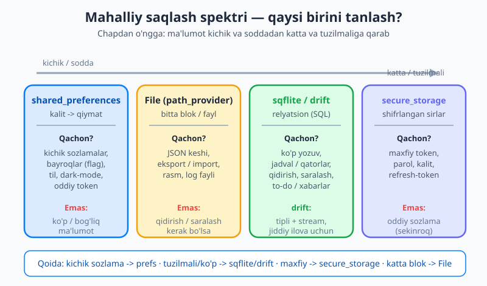
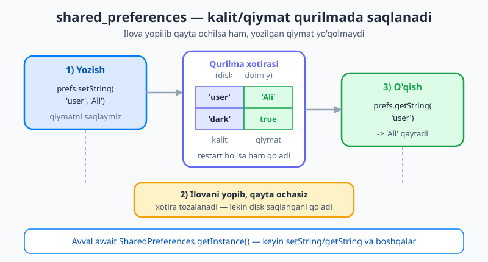
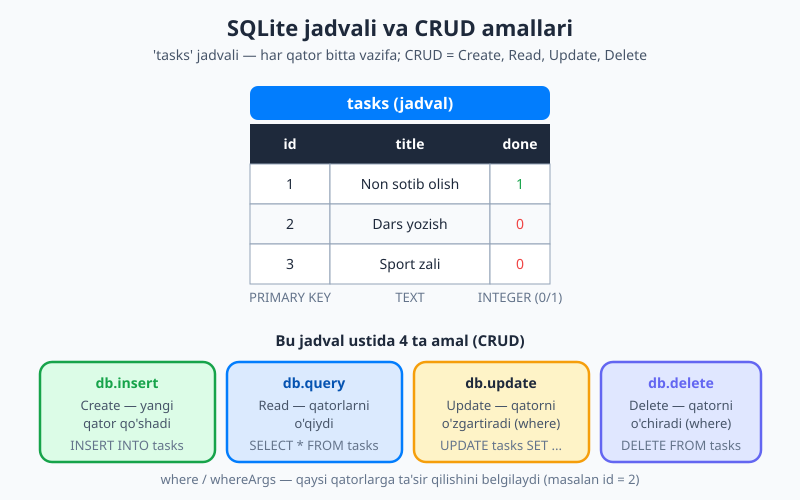

# 22 — Mahalliy ma'lumotlarni saqlash

[⬅️ Oldingi: 21 — Tarmoq (networking) va API](./21-networking-http.md) · [🏠 README](./README.md) · [Keyingi: 23 — Stream va reaktiv UI ➡️](./23-stream-reaktiv.md)

---

> **Bu bobda:** [21-bobda](./21-networking-http.md) internetdan ma'lumot oldik — lekin u ilova yopilishi bilan yo'qoladi. Endi ma'lumotni **qurilmaning o'zida saqlashni** o'rganamiz, toki u ilova qayta ishga tushganda ham joyida tursin: sozlamalar, kesh, oflayn ma'lumot, login token. Siz *nega* mahalliy saqlash kerakligini va saqlashning **spektrini** — kichik kalit-qiymatdan (**shared_preferences**) faylgacha (**path_provider**), undan SQL ma'lumotlar bazasigacha (**sqflite**) — ko'rasiz. Maxfiy ma'lumot uchun **flutter_secure_storage**, jiddiy ilovalar uchun zamonaviy, tipli **drift** bilan tanishasiz. Qaysi birini qachon tanlashni o'rganasiz, **repository (ombor) namunasi** bilan bazani toza o'rab olasiz va oxirida vazifalarni `sqflite` da saqlaydigan kichik **to-do ilova** quramiz.

---

## Nega mahalliy saqlash kerak?

Hozirgacha qurgan ilovalaringizda barcha ma'lumot — `setState` ichidagi o'zgaruvchilar, ro'yxatlar, sozlamalar — faqat **xotirada** (RAM da) yashar edi. Bu degani: foydalanuvchi ilovani yopib qayta ochsa, hammasi **noldan boshlanadi**. Dark-mode yoqilgan edi — o'chib qoldi. To-do ro'yxati to'la edi — bo'shab qoldi. Login qilgan edingiz — yana login so'raladi.

Buni xona stoliga o'xshating: stol ustidagi narsalar tez qo'l ostida (xotira), lekin kechqurun xonadan chiqsangiz, kimdir stolni tozalab qo'yadi. Narsa ertangi kungacha qolishini xohlasangiz — uni **tortmaga** (qurilma diskiga) solib qo'yishingiz kerak. **Mahalliy saqlash** — aynan shu tortma.

Mahalliy saqlashga tipik nomzodlar:

- **Sozlamalar:** dark-mode yoqilganmi, til (uz/en), bildirishnoma yoqilganmi.
- **Login holati / token:** foydalanuvchi kirgan, har safar parol so'ramaylik.
- **Kesh (cache):** [21-bobda](./21-networking-http.md) serverdan olingan ma'lumotni saqlab, keyingi safar internetsiz ham ko'rsatish (oflayn rejim).
- **Foydalanuvchi ma'lumoti:** to-do ro'yxati, qaydlar, savatcha — ilova o'zining asosiy ma'lumotini diskda saqlaydi.

Lekin "saqlash" bitta narsa emas. Bir bayt bayroq (`dark = true`) bilan minglab tartiblangan yozuvni (qaydlar bazasi) bir xil vositada saqlash noto'g'ri. Shuning uchun avval **spektr** bilan tanishamiz.

## Saqlash spektri: qaysi vositani tanlash?

Flutter da mahalliy saqlashning bir nechta vositasi bor va ular **ma'lumot hajmi va tuzilmasiga** qarab joylashadi:



Rasmda ko'rganingizdek, chapdan o'ngga ma'lumot kichik va soddadan katta va tuzilmaliga o'tadi:

- **`shared_preferences`** — kalit → qiymat. Kichik, oddiy qiymatlar uchun (sozlama, bayroq, token).
- **File** (`path_provider` bilan) — bitta blob/fayl. JSON keshi, eksport, rasm.
- **`sqflite` / `drift`** — relyatsion SQL bazasi. Ko'p va tartiblangan ma'lumot (qaydlar, vazifalar).
- **`flutter_secure_storage`** — shifrlangan sirlar. Maxfiy token, parol.

Endi har birini navbatma-navbat ko'ramiz va kichikdan boshlaymiz.

## shared_preferences — kichik kalit-qiymatlar

`shared_preferences` — eng oddiy mahalliy saqlash. U **kalit → qiymat** lug'ati (xuddi Dart `Map` iga o'xshash), lekin u diskda saqlanadi va ilova qayta ochilganda ham joyida turadi. U faqat oddiy turlarni qo'llaydi: `String`, `int`, `double`, `bool`, `List<String>`.



Rasmdagi g'oya oddiy: `setString('user', 'Ali')` bilan yozasiz, ilovani yopib qayta ochasiz, `getString('user')` esa baribir `'Ali'` ni qaytaradi — chunki qiymat diskda saqlangan.

Avval paketni qo'shamiz:

```bash
flutter pub add shared_preferences
```

`pubspec.yaml` ga shu kabi yoziladi:

```yaml
dependencies:
  shared_preferences: ^2.3.0
```

Asosiy ishlatish — avval `getInstance()` bilan obyektni olamiz (bu asinxron, chunki diskni o'qiydi), keyin yozamiz/o'qiymiz:

```dart
import 'package:shared_preferences/shared_preferences.dart';

Future<void> demo() async {
  // 1) Avval nusxa olamiz (disk o'qiladi -> await kerak)
  final prefs = await SharedPreferences.getInstance();

  // 2) Yozish
  await prefs.setString('username', 'Ali');
  await prefs.setBool('darkMode', true);
  await prefs.setInt('launchCount', 5);

  // 3) O'qish
  final name = prefs.getString('username');     // 'Ali'  (yo'q bo'lsa null)
  final dark = prefs.getBool('darkMode') ?? false; // standart: false
  final count = prefs.getInt('launchCount') ?? 0;  // standart: 0
}
```

Diqqat qilingan ikki nuqta:

- **`getInstance()` — `await` qilinadi.** U diskdagi qiymatlarni xotiraga o'qiydi. Bir marta olib, keyin uni qayta ishlatish odat (har safar chaqirmaslik).
- **O'qishda qiymat yo'q bo'lsa `null` qaytadi.** Shuning uchun `?? false` yoki `?? 0` bilan **standart qiymat** berasiz — bu, ayniqsa, ilova birinchi marta ishga tushganda muhim, chunki hali hech narsa saqlanmagan.

### Amaliy misol: dark-mode tugmasini saqlash

Mana to'liq, ishlaydigan kichik misol — sozlamani saqlaydi va ilova qayta ochilganda tiklaydi:

```dart
import 'package:flutter/material.dart';
import 'package:shared_preferences/shared_preferences.dart';

void main() => runApp(const MyApp());

class MyApp extends StatefulWidget {
  const MyApp({super.key});
  @override
  State<MyApp> createState() => _MyAppState();
}

class _MyAppState extends State<MyApp> {
  bool _dark = false;

  @override
  void initState() {
    super.initState();
    _loadSettings(); // ilova ochilishi bilan saqlangan qiymatni tiklaymiz
  }

  Future<void> _loadSettings() async {
    final prefs = await SharedPreferences.getInstance();
    setState(() => _dark = prefs.getBool('darkMode') ?? false);
  }

  Future<void> _toggleDark(bool value) async {
    setState(() => _dark = value);
    final prefs = await SharedPreferences.getInstance();
    await prefs.setBool('darkMode', value); // diskka yozamiz
  }

  @override
  Widget build(BuildContext context) {
    return MaterialApp(
      theme: ThemeData(
        brightness: _dark ? Brightness.dark : Brightness.light,
      ),
      home: Scaffold(
        appBar: AppBar(title: const Text('Sozlamalar')),
        body: SwitchListTile(
          title: const Text('Tungi rejim'),
          value: _dark,
          onChanged: _toggleDark,
        ),
      ),
    );
  }
}
```

Endi tugmani yoqib, ilovani butunlay yopib qayta ochsangiz — tungi rejim **yoqilgan holda** qoladi. Sababi: qiymat `prefs.setBool` bilan diskka yozilgan, `initState` dagi `_loadSettings` esa uni qaytadan o'qiydi.

> 💡 **Nima uchun va nima uchun emas.** `shared_preferences` — *kichik, oddiy* qiymatlar uchun: bir nechta sozlama, bayroq, oddiy token. U **ma'lumotlar bazasi emas**: ko'p yozuvni (yuzlab qaydlar), bir-biriga bog'liq ma'lumotni (foydalanuvchi → buyurtmalar) yoki qidirish/saralash kerak bo'lgan ma'lumotni unda saqlamang. Buning uchun pastda `sqflite` bor.

## Fayllar bilan ishlash: path_provider + dart:io

Ba'zan butun bir **blob** ni — bitta JSON hujjati, kesh, rasm yoki log faylini — saqlamoqchi bo'lasiz. Buning uchun ikki narsa kerak: *qayerga* yozish (papka manzili) va *qanday* yozish (fayl operatsiyasi).

Papkani **`path_provider`** beradi. Telefonda ilova istalgan joyga yoza olmaydi — unga ajratilgan xavfsiz papka bo'ladi. `getApplicationDocumentsDirectory()` aynan o'sha "hujjatlar" papkasini qaytaradi (ilova o'chmaguncha saqlanadigan). Faylni o'qish/yozishni esa Dart ning o'rnatilgan **`dart:io`** kutubxonasidagi `File` bajaradi.

```bash
flutter pub add path_provider path
```

```yaml
dependencies:
  path_provider: ^2.1.0
  path: ^1.9.0
```

`path` paketi — bu manzillarni xavfsiz birlashtirish uchun (`join(...)`); u platformaga mos ajratuvchi (`/` yoki `\`) qo'yadi, qo'lda yozishdan ishonchliroq.

```dart
import 'dart:convert'; // jsonEncode / jsonDecode
import 'dart:io';      // File
import 'package:path/path.dart' as p;
import 'package:path_provider/path_provider.dart';

// Yozish uchun fayl manzilini olamiz
Future<File> _localFile(String name) async {
  final dir = await getApplicationDocumentsDirectory();
  return File(p.join(dir.path, name)); // .../documents/notes.json
}

// JSON ni faylga yozamiz
Future<void> saveNotes(List<String> notes) async {
  final file = await _localFile('notes.json');
  await file.writeAsString(jsonEncode(notes)); // List -> JSON matn -> fayl
}

// JSON ni fayldan o'qiymiz
Future<List<String>> loadNotes() async {
  final file = await _localFile('notes.json');
  if (!await file.exists()) return []; // hali yozilmagan bo'lsa, bo'sh
  final text = await file.readAsString();
  final data = jsonDecode(text) as List;  // JSON matn -> List
  return data.cast<String>();
}
```

Bu yerda `jsonEncode`/`jsonDecode` — [21-bobdagi](./21-networking-http.md) JSON bilan ishlash; faqat endi tarmoqdan emas, **fayldan** o'qiymiz/yozamiz.

> 💡 **Fayl qachon mantiqiy?** Fayl — bir butun blokni saqlash uchun yaxshi: serverdan kelgan JSON javobini keshlash (oflayn ko'rsatish uchun), foydalanuvchi ma'lumotini eksport/import qilish, rasm yoki PDF saqlash. Ammo agar ma'lumotni **qidirish, saralash yoki qisman yangilash** kerak bo'lsa — fayl noqulay, chunki har safar butun faylni o'qib, qaytadan yozasiz. Bunday vaziyatda ma'lumotlar bazasi kerak.

## sqflite — SQLite ma'lumotlar bazasi

Ma'lumot ko'p, tartiblangan va undan **so'rov** (qidirish, saralash, yangilash) qilish kerak bo'lganda — relyatsion ma'lumotlar bazasi eng to'g'ri vosita. Flutter da bu uchun **`sqflite`** paketi ishlatiladi; u qurilmada **SQLite** bazasini (telefon ichidagi yengil SQL bazasi) boshqaradi.

Eslatma: SQLite — bu xuddi Excel jadvaliga o'xshash, lekin SQL tilida so'rovlar yozish mumkin bo'lgan haqiqiy baza. Ma'lumot **jadvallarda**, jadval esa **ustun** (column) va **qator** (row) lardan iborat.



Rasmda `tasks` jadvali ko'rsatilgan: har bir qator — bitta vazifa, ustunlari `id`, `title`, `done`. Pastda esa **CRUD** amallari — `insert` (qo'shish), `query` (o'qish), `update` (o'zgartirish), `delete` (o'chirish) — jadvalga moslangan.

```bash
flutter pub add sqflite path
```

```yaml
dependencies:
  sqflite: ^2.4.0
  path: ^1.9.0
```

### Bazani ochish va jadval yaratish

Bazani `openDatabase` bilan ochamiz. `version:` — bazaning versiyasi, `onCreate:` esa baza **birinchi marta** yaratilganda chaqiriladigan funksiya — u yerda jadvallarni quramiz:

```dart
import 'package:path/path.dart';
import 'package:sqflite/sqflite.dart';

Future<Database> openAppDatabase() async {
  // Baza fayli uchun manzil: .../databases/app.db
  final path = join(await getDatabasesPath(), 'app.db');

  return openDatabase(
    path,
    version: 1,
    onCreate: (db, version) async {
      // Baza birinchi marta yaratilganda jadval quriladi
      await db.execute('''
        CREATE TABLE tasks (
          id INTEGER PRIMARY KEY AUTOINCREMENT,
          title TEXT NOT NULL,
          done INTEGER NOT NULL DEFAULT 0
        )
      ''');
    },
  );
}
```

Jadval ustunlarini tushunaylik:

- **`id INTEGER PRIMARY KEY AUTOINCREMENT`** — har qatorning yagona raqami; `AUTOINCREMENT` tufayli yangi qator qo'shilganda raqam avtomatik o'sadi (1, 2, 3...).
- **`title TEXT NOT NULL`** — vazifa matni; `NOT NULL` — bo'sh bo'lishi mumkin emas.
- **`done INTEGER NOT NULL DEFAULT 0`** — bajarilganmi? SQLite da `bool` turi yo'q, shuning uchun `0` (yo'q) yoki `1` (ha) sifatida saqlaymiz; standart `0`.

### CRUD: qo'shish, o'qish, yangilash, o'chirish

`sqflite` bu amallar uchun qulay metodlar beradi. Diqqat qiling: ma'lumot Dart tomonida `Map<String, Object?>` ko'rinishida bo'ladi (ustun nomi → qiymat):

```dart
// CREATE — yangi qator qo'shish
Future<int> insertTask(Database db, String title) {
  return db.insert('tasks', {'title': title, 'done': 0});
  // qaytaradigan qiymat — yangi qatorning id si
}

// READ — barcha qatorlarni o'qish (eng yangisi birinchi)
Future<List<Map<String, Object?>>> readTasks(Database db) {
  return db.query('tasks', orderBy: 'id DESC');
}

// UPDATE — bitta qatorni o'zgartirish (qaysi qator? -> where)
Future<void> setDone(Database db, int id, bool done) async {
  await db.update(
    'tasks',
    {'done': done ? 1 : 0},
    where: 'id = ?',          // ? — o'rin tutuvchi
    whereArgs: [id],          // ? ga keladigan qiymat
  );
}

// DELETE — bitta qatorni o'chirish
Future<void> deleteTask(Database db, int id) async {
  await db.delete('tasks', where: 'id = ?', whereArgs: [id]);
}
```

> ⚠️ **Nima uchun `?` va `whereArgs`?** Hech qachon qiymatni to'g'ridan-to'g'ri SQL matniga yopishtirmang (`where: 'id = $id'` kabi). Buning o'rniga `?` o'rin tutuvchisi va `whereArgs` ishlating. Bu **SQL injection** (xavfsizlik hujumi) dan himoya qiladi va maxsus belgilarni to'g'ri qochiradi (escape). Bu qoidani har doim eslang.

Kerak bo'lganda xom SQL ham yozsa bo'ladi:

```dart
// Faqat bajarilmagan vazifalar (raw SQL)
final pending = await db.rawQuery(
  'SELECT * FROM tasks WHERE done = ?',
  [0],
);
```

### Migratsiya: `onUpgrade` (qisqacha)

Vaqt o'tib bazaga yangi ustun qo'shish kerak bo'lsa-chi? Mavjud foydalanuvchilarda baza allaqachon bor — uni o'chirib bo'lmaydi. Buning uchun `version:` ni oshirib, `onUpgrade:` da o'zgarishni yozasiz:

```dart
openDatabase(
  path,
  version: 2, // 1 -> 2 ga oshirdik
  onCreate: (db, v) async { /* ... jadval yaratish ... */ },
  onUpgrade: (db, oldVersion, newVersion) async {
    if (oldVersion < 2) {
      // 1-versiyadan kelganlarga yangi ustun qo'shamiz
      await db.execute('ALTER TABLE tasks ADD COLUMN priority INTEGER DEFAULT 0');
    }
  },
);
```

`onUpgrade` — faqat versiya oshganda, eski bazasi bor foydalanuvchilarda chaqiriladi. Hozircha shuni bilish yetarli: jiddiy ilovada baza sxemasi o'zgarsa, migratsiya yozasiz.

## Repository (ombor) namunasi: bazani toza o'rab olish

Yuqoridagi `db.insert`, `db.query` chaqiruvlarini to'g'ridan-to'g'ri widget ichida yozish mumkin, lekin bu **yomon fikr**: UI kodingiz SQL bilan aralashib ketadi va bazani keyin almashtirish (masalan `drift` ga o'tish) qiyinlashadi.

Yaxshiroq yo'l — **repository** (ombor) namunasi: barcha baza mantig'ini bitta sinfga yig'asiz, qolgan ilova esa faqat toza metodlarni (`addTask`, `getTasks`...) chaqiradi va baza ichida nima borligini bilmaydi. Bu — toza ajratish (separation of concerns).

Avval ma'lumot uchun oddiy model sinfi:

```dart
class Task {
  final int? id;        // baza beradi (yangi vazifada hali null)
  final String title;
  final bool done;

  Task({this.id, required this.title, this.done = false});

  // Map (bazadan) -> Task
  factory Task.fromMap(Map<String, Object?> m) => Task(
        id: m['id'] as int?,
        title: m['title'] as String,
        done: (m['done'] as int) == 1, // 0/1 -> bool
      );

  // Task -> Map (bazaga)
  Map<String, Object?> toMap() => {
        'title': title,
        'done': done ? 1 : 0,
      };
}
```

Endi repository — u bazani saqlaydi va toza metodlar beradi:

```dart
class TaskRepository {
  Database? _db;

  // Bazani bir marta ochib, keyin qayta ishlatamiz
  Future<Database> get _database async {
    _db ??= await openAppDatabase();
    return _db!;
  }

  Future<List<Task>> getTasks() async {
    final db = await _database;
    final rows = await db.query('tasks', orderBy: 'id DESC');
    return rows.map(Task.fromMap).toList();
  }

  Future<void> addTask(String title) async {
    final db = await _database;
    await db.insert('tasks', Task(title: title).toMap());
  }

  Future<void> toggleTask(Task task) async {
    final db = await _database;
    await db.update(
      'tasks',
      {'done': task.done ? 0 : 1}, // teskarisiga aylantiramiz
      where: 'id = ?',
      whereArgs: [task.id],
    );
  }

  Future<void> removeTask(int id) async {
    final db = await _database;
    await db.delete('tasks', where: 'id = ?', whereArgs: [id]);
  }
}
```

Endi UI faqat `repo.getTasks()`, `repo.addTask('Non olish')` deydi — SQL ni ko'rmaydi ham. Ertaga bazani `drift` ga o'zgartirsangiz, faqat `TaskRepository` ichini yangilaysiz; UI o'zgarmaydi.

> 💡 **21-bob bilan birga: oflayn kesh.** Repository g'oyasi tarmoq bilan ham juda mos keladi. `getTasks()` ni shunday yozish mumkin: avval serverdan ([21-bob](./21-networking-http.md)) yangi ma'lumot olishga urinadi; muvaffaqiyatli bo'lsa, uni bazaga yozadi va qaytaradi; internet yo'q bo'lsa, **bazadagi oxirgi saqlangan** ma'lumotni qaytaradi. Shu tariqa ilovangiz oflaynda ham ishlaydi — bu repository namunasining katta foydasi.

## drift — zamonaviy, tipli va reaktiv (qisqacha)

`sqflite` kuchli, lekin so'rovlarni **matn** sifatida yozasiz (`'SELECT * FROM tasks'`) — kompilyator ularda xato borligini sezmaydi, faqat ish vaqtida bilasiz. Jiddiy ilovalar uchun zamonaviy yechim — **`drift`**: u ham SQLite ustiga quriladi (`sqflite` ni ishlatadi), lekin ustidan **tipli** (type-safe) qatlam beradi.

`drift` ning afzalliklari:

- **Tipli so'rovlar:** jadvallar va so'rovlardan Dart sinflari kod-generatsiya qilinadi. Ustun nomida xato qilsangiz — kompilyator darhol aytadi, ish vaqtida emas.
- **Reaktiv `Stream`:** so'rovni `Stream` sifatida kuzatish mumkin — baza o'zgarganda UI **avtomatik** yangilanadi. Bu to'g'ridan-to'g'ri [23-bobdagi](./23-stream-reaktiv.md) `Stream` mavzusiga ulanadi.

`drift` kod-generatsiyani **`build_runner`** orqali qiladi (kompilyatsiya vaqtida kod yaratadi — bu maxsus til xususiyati emas, oddiy vosita). Biz bu yerda chuqur kirmaymiz; hozircha shuni yodda tuting: o'rganish uchun `sqflite` to'g'ridan-to'g'ri va ravshan, ammo **katta, jiddiy ilova** qurganingizda `drift` — "kattalar uchun" tanlov, ayniqsa UI ni baza bilan reaktiv (`Stream`) bog'lamoqchi bo'lsangiz.

## flutter_secure_storage — maxfiy ma'lumot (qisqacha)

Login token, parol yoki API kaliti kabi **maxfiy** ma'lumotni `shared_preferences` da saqlamang — u oddiy, **shifrlanmagan** holatda yotadi va o'qib olinishi mumkin. Bunday ma'lumot uchun **`flutter_secure_storage`** bor: u qiymatni qurilmaning xavfsiz omboriga (Android'da Keystore, iOS'da Keychain) **shifrlab** saqlaydi.

```dart
import 'package:flutter_secure_storage/flutter_secure_storage.dart';

const storage = FlutterSecureStorage();

await storage.write(key: 'authToken', value: 'eyJhbGc...'); // shifrlab yozadi
final token = await storage.read(key: 'authToken');         // o'qiydi
await storage.delete(key: 'authToken');                      // o'chiradi (logout)
```

API si `shared_preferences` ga o'xshaydi (kalit/qiymat), lekin u shifrlangani uchun biroz sekinroq — shuning uchun **faqat maxfiy** ma'lumot uchun ishlating, oddiy sozlama uchun emas.

## Qaysi birini tanlash — qaror qo'llanmasi

Hammasini bir jadvalda jamlaymiz:

| Ma'lumot turi | Tavsiya | Sabab |
|---|---|---|
| Kichik sozlama, bayroq (dark-mode, til) | **shared_preferences** | sodda kalit-qiymat, kam ma'lumot |
| Tuzilmali, ko'p, qidiriladigan ma'lumot (qaydlar, vazifalar) | **sqflite** yoki **drift** | SQL bilan so'rov, saralash, yangilash |
| Maxfiy ma'lumot (token, parol, kalit) | **flutter_secure_storage** | shifrlangan, xavfsiz |
| Katta blok / fayl (JSON kesh, eksport, rasm) | **File** (`path_provider`) | bir butun blobni saqlash qulay |
| Jiddiy ilovada baza + reaktiv UI | **drift** | tipli, `Stream` bilan avtomatik yangilanish |

> 💡 **Oddiy aqliy filtr.** O'zingizdan so'rang: *(1)* maxfiymi? → `secure_storage`. *(2)* Bitta-ikkita oddiy qiymatmi? → `shared_preferences`. *(3)* Ko'p, tartiblangan, qidiriladiganmi? → `sqflite`/`drift`. *(4)* Bir butun blokmi (kesh/eksport)? → `File`. Aksariyat ilovalar bir vaqtning o'zida bir nechtasini ishlatadi (masalan: sozlama → prefs, ma'lumot → sqflite, token → secure_storage).

## Birgalikda: sqflite bilan to-do ilova

Endi o'rgangan narsalarni birlashtiramiz. Vazifalarni `sqflite` da saqlaydigan (qo'shish/ro'yxat/belgilash/o'chirish), bitta sozlamani esa `shared_preferences` da saqlaydigan kichik ilova quramiz. Yuqoridagi `Task` modeli va `TaskRepository` ni shu yerda ishlatamiz:

```dart
import 'package:flutter/material.dart';

void main() => runApp(const TodoApp());

class TodoApp extends StatelessWidget {
  const TodoApp({super.key});
  @override
  Widget build(BuildContext context) {
    return MaterialApp(
      theme: ThemeData(
        colorScheme: ColorScheme.fromSeed(seedColor: Colors.indigo),
      ),
      home: const TodoPage(),
    );
  }
}

class TodoPage extends StatefulWidget {
  const TodoPage({super.key});
  @override
  State<TodoPage> createState() => _TodoPageState();
}

class _TodoPageState extends State<TodoPage> {
  final _repo = TaskRepository(); // bazani o'rab turuvchi ombor
  final _controller = TextEditingController();
  List<Task> _tasks = [];

  @override
  void initState() {
    super.initState();
    _refresh(); // ochilishi bilan bazadan yuklaymiz
  }

  Future<void> _refresh() async {
    final tasks = await _repo.getTasks();
    setState(() => _tasks = tasks);
  }

  Future<void> _add() async {
    final text = _controller.text.trim();
    if (text.isEmpty) return;
    await _repo.addTask(text); // bazaga yozamiz
    _controller.clear();
    await _refresh();          // ro'yxatni yangilaymiz
  }

  Future<void> _toggle(Task task) async {
    await _repo.toggleTask(task);
    await _refresh();
  }

  Future<void> _remove(int id) async {
    await _repo.removeTask(id);
    await _refresh();
  }

  @override
  Widget build(BuildContext context) {
    return Scaffold(
      appBar: AppBar(title: const Text('Vazifalar (sqflite)')),
      body: Column(
        children: [
          Padding(
            padding: const EdgeInsets.all(12),
            child: Row(
              children: [
                Expanded(
                  child: TextField(
                    controller: _controller,
                    decoration: const InputDecoration(
                      hintText: 'Yangi vazifa...',
                      border: OutlineInputBorder(),
                    ),
                    onSubmitted: (_) => _add(),
                  ),
                ),
                const SizedBox(width: 8),
                FilledButton(onPressed: _add, child: const Text('Qo\'shish')),
              ],
            ),
          ),
          Expanded(
            child: _tasks.isEmpty
                ? const Center(child: Text('Hali vazifa yo\'q'))
                : ListView.builder(
                    itemCount: _tasks.length,
                    itemBuilder: (context, i) {
                      final task = _tasks[i];
                      return ListTile(
                        leading: Checkbox(
                          value: task.done,
                          onChanged: (_) => _toggle(task),
                        ),
                        title: Text(
                          task.title,
                          style: TextStyle(
                            decoration: task.done
                                ? TextDecoration.lineThrough
                                : null,
                          ),
                        ),
                        trailing: IconButton(
                          icon: const Icon(Icons.delete_outline),
                          onPressed: () => _remove(task.id!),
                        ),
                      );
                    },
                  ),
          ),
        ],
      ),
    );
  }
}
```

Bu ilova endi vazifalarni qurilma bazasida saqlaydi: qo'shasiz, belgilaysiz, o'chirasiz — keyin ilovani butunlay yopib qayta ochsangiz ham, ro'yxat **joyida** turadi. Sababini eslang: har bir o'zgarish `TaskRepository` orqali `sqflite` bazasiga yoziladi, `initState` esa uni qaytadan yuklaydi.

> 💡 **Diqqat qildingizmi?** UI kodida bironta ham `db.insert` yoki SQL yo'q — hammasi `_repo` orqali. Bu repository namunasining kuchi: widget faqat "vazifa qo'sh", "vazifani o'chir" deydi; *qanday* saqlanishi esa repozitoriy ishi. Keyingi [23-bobda](./23-stream-reaktiv.md) bu ro'yxatni `Stream` bilan **avtomatik** yangilanadigan qilishni ko'ramiz — `_refresh()` ni qo'lda chaqirmasdan.

## Keyingi qadam

Bu bobda ma'lumotni qurilmada saqlashning butun spektrini o'rgandingiz: `shared_preferences` (kichik kalit-qiymat), `path_provider` + `File` (bloblar/JSON), `sqflite` (relyatsion SQL bazasi va CRUD), `drift` (zamonaviy tipli, reaktiv) va `flutter_secure_storage` (maxfiy ma'lumot). Repository namunasi bilan bazani toza o'rab oldingiz va vazifalarni saqlaydigan to-do ilova qurdingiz.

Hozircha har bir o'zgarishdan keyin ro'yxatni `_refresh()` bilan **qo'lda** yangilashga majbur bo'ldik. Keyingi [23-bobda](./23-stream-reaktiv.md) **`Stream`** va **reaktiv UI** ni o'rganamiz: ma'lumot manbai (baza yoki tarmoq) o'zgarganda UI ning o'zi avtomatik yangilanadigan bo'ladi — `drift` ning `Stream` so'rovlari aynan shu g'oyaga asoslanadi.

---

## Mashqlar

### Oson

1. O'z so'zlaringiz bilan ayting: nega ma'lumotni `setState` ichidagi oddiy o'zgaruvchida emas, mahalliy saqlashda (disk) saqlash kerak bo'ladi? Bir-ikki misol keltiring.
2. `shared_preferences` qaysi turlarni qo'llaydi? Quyidagilardan qaysi biri u uchun **mos emas**: dark-mode bayrog'i, foydalanuvchi nomi, 500 ta qayddan iborat ro'yxat, tanlangan til?
3. `final name = prefs.getString('username')` chaqiruvi qiymat hali hech qachon saqlanmagan bo'lsa nimani qaytaradi? Buni xavfsiz qilish uchun kodni qanday yozasiz (standart qiymat bilan)?
4. `sqflite` da `done` ustunini nega `bool` emas, balki `INTEGER` (0/1) sifatida saqlaymiz?

### O'rta

5. Quyidagi SQLite jadvalini yarating (faqat `CREATE TABLE` qismi): `notes` jadvali — `id` (avtomatik o'suvchi asosiy kalit), `text` (bo'sh bo'lmaydigan matn), `createdAt` (matn). `onCreate` ichida qanday yoziladi?
6. `db.update('tasks', {...}, where: 'id = ?', whereArgs: [id])` chaqiruvida nega qiymatni `where: 'id = $id'` deb yozish o'rniga `?` va `whereArgs` ishlatiladi? Bu qanday muammodan himoya qiladi?
7. To'rt xil ma'lumot bering: (a) tanlangan til (`uz`), (b) login token (maxfiy), (c) 1000 ta mahsulot ro'yxati qidiruv bilan, (d) serverdan kelgan JSON javobni oflayn kesh qilish. Har biri uchun spektrdan qaysi vositani tanlaysiz va nega?

### Qiyin

8. Repository (ombor) namunasi nima va u qanday foyda beradi? To-do ilovamizda baza `sqflite` dan `drift` ga o'zgartirilsa, UI kodining qancha qismini o'zgartirish kerak bo'ladi va nega?
9. Bir o'quvchi `shared_preferences` ga foydalanuvchining barcha qaydlarini bitta uzun matn qilib saqlayapti va "qidirish juda sekin, har safar hammasini o'qib, qaytadan yozaman" deb shikoyat qilyapti. Muammo nimada va siz unga qaysi vositaga o'tishni tavsiya qilasiz? Nega?
10. `getApplicationDocumentsDirectory()` nima qaytaradi va nega ilova faylni istalgan joyga emas, aynan shu papkaga yozadi? `path` paketidagi `join(...)` ni qo'lda `'/'` bilan birlashtirish o'rniga ishlatish nega yaxshiroq?

<details markdown="1"><summary>Yechimlar</summary>

**1.** `setState` ichidagi o'zgaruvchi faqat **xotirada** (RAM) yashaydi — ilova yopilishi bilan yo'qoladi. Mahalliy saqlash esa ma'lumotni **diskka** yozadi, shuning uchun u ilova qayta ishga tushganda ham joyida turadi. Misollar: dark-mode sozlamasi (qayta ochilganda yoqilgan qolishi kerak), login token (har safar parol so'ramaslik uchun), to-do ro'yxati (ilova yopilganda yo'qolmasligi kerak).

**2.** `shared_preferences` faqat oddiy turlarni qo'llaydi: `String`, `int`, `double`, `bool`, `List<String>`. **Mos emas: 500 ta qayddan iborat ro'yxat** — bu ko'p va tuzilmali ma'lumot, uni `sqflite` da saqlash kerak. Qolganlari (dark-mode bayrog'i = `bool`, foydalanuvchi nomi = `String`, til = `String`) mos.

**3.** Hech qachon saqlanmagan bo'lsa **`null`** qaytadi. Xavfsiz yozish — `??` bilan standart qiymat berish:
```dart
final name = prefs.getString('username') ?? 'Mehmon';
```
Shunda ilova birinchi marta ishga tushganda (hali hech narsa saqlanmaganda) `null` o'rniga ma'lumotli standart qiymat bo'ladi.

**4.** SQLite da `bool` turi **yo'q**. Shuning uchun mantiqiy qiymatni `INTEGER` sifatida — `0` (false/yo'q) yoki `1` (true/ha) — saqlaymiz. O'qiyotganda `(m['done'] as int) == 1` bilan qaytadan `bool` ga aylantiramiz.

**5.**
```dart
onCreate: (db, version) async {
  await db.execute('''
    CREATE TABLE notes (
      id INTEGER PRIMARY KEY AUTOINCREMENT,
      text TEXT NOT NULL,
      createdAt TEXT
    )
  ''');
},
```

**6.** `?` — o'rin tutuvchi (placeholder); haqiqiy qiymat `whereArgs` ro'yxati orqali alohida uzatiladi. Bu **SQL injection** dan himoya qiladi: agar qiymatni to'g'ridan-to'g'ri matnga (`'id = $id'`) yopishtirsangiz va qiymat ichida zararli SQL bo'lsa, u bajarilib ketishi mumkin. `?`/`whereArgs` esa qiymatni faqat *ma'lumot* deb qabul qiladi, kod sifatida emas, va maxsus belgilarni to'g'ri qochiradi (escape).

**7.** (a) Tanlangan til (`uz`) → **shared_preferences** (kichik, oddiy `String` sozlama). (b) Login token → **flutter_secure_storage** (maxfiy, shifrlangan bo'lishi kerak). (c) 1000 ta mahsulot qidiruv bilan → **sqflite** (yoki `drift`) — ko'p, tuzilmali, qidiriladigan ma'lumot uchun SQL bazasi. (d) Serverdan kelgan JSON javobni oflayn kesh → **File** (`path_provider`) — bir butun blokni saqlash, yoki strukturali bo'lsa `sqflite`; oddiy kesh uchun fayl yetarli.

**8.** Repository — barcha baza (yoki manba) mantig'ini bitta sinfga yig'ib, qolgan ilovaga faqat toza metodlar (`getTasks`, `addTask`...) beradigan namuna; UI baza ichida nima borligini bilmaydi. Foydasi: **toza ajratish** — UI kodida SQL bo'lmaydi, va manba o'zgarsa, UI ga tegmaysiz. To-do ilovamizda `sqflite` dan `drift` ga o'tilsa, **faqat `TaskRepository` ichini** o'zgartirasiz; `_TodoPageState` (UI) kodi **umuman o'zgarmaydi**, chunki u baribir `_repo.getTasks()`, `_repo.addTask(...)` ni chaqiradi.

**9.** Muammo: `shared_preferences` — kichik kalit-qiymat ombori, **ma'lumotlar bazasi emas**. Qaydlarni bitta uzun matn qilib saqlasa, har qidirish/o'zgartirishda **butun matnni o'qib, qaytadan yozishga** majbur — bu sekin va xavfli (parallel yozuvlar bir-birini buzishi mumkin). Tavsiya: **`sqflite`** (yoki `drift`) ga o'tish — har qayd alohida qator bo'ladi, qidirish/saralash/yangilash SQL bilan tez va faqat kerakli qatorga ta'sir qiladi.

**10.** `getApplicationDocumentsDirectory()` — ilovaga ajratilgan, **doimiy** "hujjatlar" papkasini qaytaradi (ilova o'chirilmaguncha saqlanadi). Ilova istalgan joyga yoza olmaydi, chunki mobil platformalarda har ilova o'z "qum qutisi" (sandbox) ichida ishlaydi — boshqa joylar himoyalangan yoki vaqtinchalik. `join(...)` ni ishlatish yaxshiroq, chunki u manzil qismlarini platformaga **mos ajratuvchi** bilan birlashtiradi (Android/iOS da `/`, ammo kod platformadan mustaqil bo'ladi) va qo'lda `'/'` qo'yishdagi xatolarning (ikki marta `//`, yoki ajratuvchi tushib qolishi) oldini oladi.

</details>

---

[⬅️ Oldingi: 21 — Tarmoq (networking) va API](./21-networking-http.md) · [🏠 README](./README.md) · [Keyingi: 23 — Stream va reaktiv UI ➡️](./23-stream-reaktiv.md)
