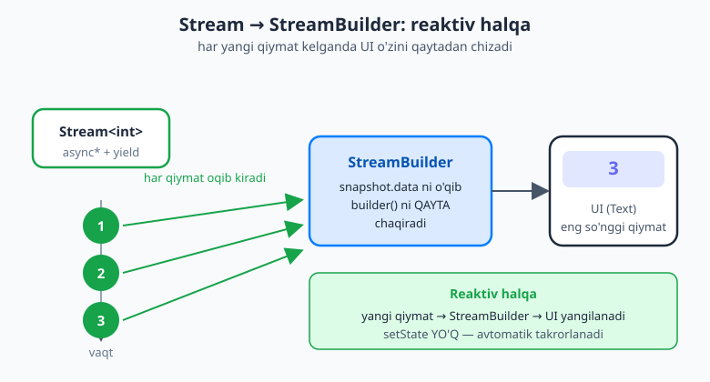
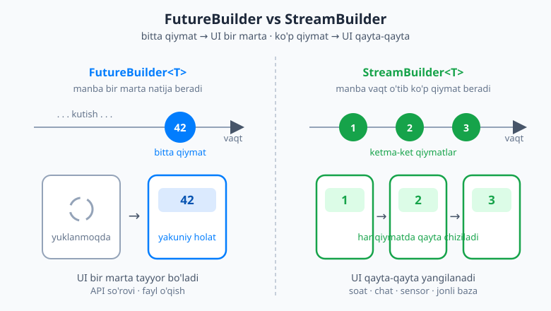
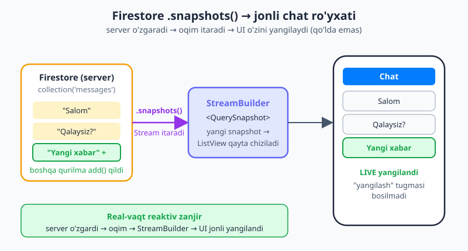

# 23 — Stream va reaktiv UI

[⬅️ Oldingi: 22 — Mahalliy ma'lumotlarni saqlash](./22-mahalliy-saqlash.md) · [🏠 README](./README.md) · [Keyingi: 24 — Provider va InheritedWidget ➡️](./24-provider.md)

---

> **Bu bobda:** [21-bobda](./21-networking-http.md) `FutureBuilder` bilan **bitta marta** keladigan ma'lumotni ekranga chizdik. Lekin ko'p ma'lumot **vaqt o'tib o'zgaradi**: jonli soat, hisoblagich, chat xabarlari, sensor. Bunday ma'lumotni ekranga **avtomatik** chizish uchun **`Stream`** va uning Flutter'dagi sherigi **`StreamBuilder`** kerak. Bu bobda *reaktiv UI* — ya'ni ma'lumot manbasi yangi qiymat chiqargan zahoti **o'zini yangilaydigan** interfeys — qanday qurilishini o'rganasiz: `StreamBuilder` bilan jonli soat, `async*`/`yield` va `StreamController` bilan oqim yaratish, `StreamSubscription` ni `dispose` da bekor qilish (xotira oqishidan saqlanish), `.map`/`.where` bilan oqimni o'zgartirish, va nihoyat **Firebase** (Firestore + Auth) bilan **jonli yangilanadigan** chat ro'yxati — reaktiv UI ning eng yorqin namunasi. Bu bob holat boshqaruviga ([24–26-boblar](./24-provider.md)) ko'prik: Stream — reaktivlikning asosiy g'ishti.

---

## Nega reaktiv UI? `Future` yetmaydigan joy

[09-bobda](./09-asinxron-dart.md) ikkita tushunchani ajratgandik:

- **`Future<T>`** — kelajakda **bitta** qiymat keladi, keyin tugaydi. (Bitta posilka.)
- **`Stream<T>`** — vaqt o'tib **ko'p** qiymat keladi: 1, 2, 3, ... keyin oqim yopiladi. (Quvurdan oqib keladigan ko'p posilka.)

[21-bobda](./21-networking-http.md) `FutureBuilder` bilan serverdan **bir marta** ma'lumot oldik: so'rov ketdi, javob keldi, ekran chizildi — tamom. Bu ko'p holatda yetarli (mahsulot ro'yxati, foydalanuvchi profili).

Lekin tasavvur qiling: ekranda **jonli soat** kerak — har soniyada vaqt o'zgarsin. Yoki **chat** — boshqa odam xabar yozsa, sizning ekraningizda **darhol** paydo bo'lsin. Yoki **hisoblagich** — fonda son o'sib borsin. Bularning hammasida ma'lumot *bir marta* emas, *qayta-qayta* o'zgaradi.

`FutureBuilder` bunga yaramaydi — u faqat bitta natijani kutadi. Bu yerda bizga **reaktiv UI** kerak:

> 📌 **Reaktiv UI** — bu ma'lumot manbasi yangi qiymat chiqargan zahoti **o'zini avtomatik qayta chizadigan** interfeys. Siz "endi ekranni yangila" deb qo'lda buyruq bermaysiz — UI manbaga *reaktsiya* qiladi, shuning uchun "reaktiv". Bu 10-bobdagi `UI = f(holat)` g'oyasining vaqt bo'yicha davomi: holat o'zgardi → UI o'zgardi, avtomatik.

Va aynan `Stream` — vaqt o'tib o'zgaradigan ma'lumotning tabiiy ifodasi. Demak, reaktiv UI = **`Stream` + uni kuzatib turadigan widget**. O'sha widget — `StreamBuilder`.

---

## `StreamBuilder` — `FutureBuilder` ning oqim sherigi

[21-bobda](./21-networking-http.md) `FutureBuilder` ni ko'rgansiz: u `Future` ni kuzatadi va "yuklanmoqda → tayyor → xato" holatlariga qarab UI chizadi. **`StreamBuilder`** xuddi shunday, faqat bitta katta farq bilan: u `Stream` ni kuzatadi va **har bir yangi qiymat kelganda UI ni qaytadan chizadi**.

Eng oddiy misol — har soniyada o'sadigan hisoblagich. Avval oqimni yaratamiz (`async*`/`yield` ni 09-bobda ko'rgansiz), keyin `StreamBuilder` bilan ekranga chizamiz:

```dart
import 'package:flutter/material.dart';

// Har soniyada bittadan o'sadigan son chiqaradigan oqim:
Stream<int> sanagich() async* {
  int son = 0;
  while (true) {
    await Future.delayed(const Duration(seconds: 1));
    son++;
    yield son;   // oqimga yangi qiymat chiqaradi: 1, 2, 3, ...
  }
}

class SanagichEkran extends StatelessWidget {
  const SanagichEkran({super.key});

  @override
  Widget build(BuildContext context) {
    return StreamBuilder<int>(
      stream: sanagich(),                 // qaysi oqimni kuzatamiz
      initialData: 0,                     // hali qiymat kelmaganda ko'rsatiladigan
      builder: (context, snapshot) {
        return Text(
          'Soniya: ${snapshot.data}',     // har yangi qiymatda QAYTADAN chiziladi
          style: const TextStyle(fontSize: 32),
        );
      },
    );
  }
}
```

Oqim har soniyada `1, 2, 3, ...` chiqaradi va `Text` har safar yangi son bilan **o'zini qaytadan chizadi** — siz `setState` ham chaqirmaysiz. Bu — reaktiv UI ning to'liq qisqacha namunasi.



Rasmda ko'rganingizdek, oqim har yangi qiymat chiqarganda u `StreamBuilder` ga "oqib kiradi", `builder` qayta chaqiriladi va UI eng so'nggi qiymatni ko'rsatadi. Mana shu — **reaktiv halqa**.

### `snapshot` — oqimning hozirgi holati

`builder` funksiyasiga `snapshot` (suratga olish) keladi — bu **shu lahzada oqim qaysi holatda ekani** haqidagi ma'lumot. U bilan to'g'ri ishlash uchun uchta narsani tekshirish kerak (xuddi `FutureBuilder` dagidek):

```dart
StreamBuilder<int>(
  stream: sanagich(),
  builder: (context, snapshot) {
    // 1) Xato bormi?
    if (snapshot.hasError) {
      return Text('Xato: ${snapshot.error}');
    }
    // 2) Oqim hali ulanmagan / birinchi qiymat hali kelmagan?
    if (snapshot.connectionState == ConnectionState.waiting) {
      return const CircularProgressIndicator();
    }
    // 3) Ma'lumot bormi?
    if (snapshot.hasData) {
      return Text('Soniya: ${snapshot.data}');
    }
    // Hech narsa yo'q (oqim bo'sh):
    return const Text('Hali ma\'lumot yo\'q');
  },
)
```

`snapshot` ning asosiy xossalari:

| Xossa | Ma'nosi |
|---|---|
| **`snapshot.connectionState`** | Oqim holati: `waiting` (kutilyapti, hali qiymat yo'q), `active` (oqim ishlayapti, qiymat keldi), `done` (oqim yopildi). |
| **`snapshot.hasData`** | Hozirda ko'rsatadigan qiymat bormi (`true`/`false`). |
| **`snapshot.data`** | So'nggi kelgan qiymat (oqim tipiga mos: `int`, `String`, ...). |
| **`snapshot.hasError`** | Oqim xato chiqardimi. |
| **`snapshot.error`** | O'sha xatoning o'zi. |

> 💡 **Muhim:** `StreamBuilder` har yangi hodisada `builder` ni **qaytadan** chaqiradi. Shuning uchun `builder` ichida og'ir hisob qilmang yoki yangi obyekt yaratmang — u tez-tez ishlaydi. Faqat `snapshot` ni o'qib, UI ni yig'ing.

### `StreamBuilder` qachon, `FutureBuilder` qachon?

Bu — eng muhim farq. Yodda saqlang:



- **`FutureBuilder<T>`** — manba **bir marta** natija beradigan bo'lsa (API so'rovi, fayl o'qish). UI: yuklanmoqda → bir marta yakuniy holat.
- **`StreamBuilder<T>`** — manba **vaqt o'tib qayta-qayta** qiymat beradigan bo'lsa (soat, chat, sensor, jonli baza). UI: har qiymatda **qaytadan** yangilanadi.

Oddiy savol bering: *"Bu ma'lumot bir marta keladimi, yoki vaqt o'tib o'zgaradimi?"* Bir marta — `FutureBuilder`. O'zgaradi — `StreamBuilder`.

---

## Oqim yaratishning uch yo'li

`StreamBuilder` ga beradigan oqimni qayerdan olamiz? Uch asosiy usul bor.

### 1. `async*` + `yield` — generator usuli

Buni yuqorida va [09-bobda](./09-asinxron-dart.md) ko'rdik: `async*` funksiya oqim qaytaradi, `yield` har safar oqimga bitta qiymat chiqaradi. Teskari sanoq (countdown) misoli:

```dart
// 10 dan 0 gacha, har soniyada bittadan:
Stream<int> teskariSanoq() async* {
  for (int i = 10; i >= 0; i--) {
    await Future.delayed(const Duration(seconds: 1));
    yield i;
  }
  // sikl tugadi -> oqim avtomatik yopiladi (done)
}
```

Bu usul **oqim mantig'i o'zingizda** bo'lganda qulay: siz qiymatlarni qachon va qanday chiqarishni hisoblab turasiz.

### 2. `StreamController` — imperativ usul

Ba'zan qiymat *qachon* kelishi siz hisoblamaydigan hodisaga bog'liq: tugma bosilishi, websocket xabari, tashqi callback. Bunday holda **`StreamController`** kerak — bu "qo'lda boshqariladigan oqim". Siz `.add()` bilan unga **istalgan paytda** qiymat tashlaysiz, `.stream` orqali tinglovchilarga uzatasiz, ish tugagach `.close()` bilan yopasiz:

```dart
final controller = StreamController<String>();

// Istalgan joydan oqimga qiymat tashlash:
controller.add('Salom');
controller.add('Yangi xabar');

// Tinglash (yoki StreamBuilder ga berish):
controller.stream.listen((xabar) => print(xabar));

// Ish tugagach — MAJBURIY yopish (aks holda resurs oqadi):
controller.close();
```

`StreamController` ni shunday tasavvur qiling: u — **ikki uchli quvur**. Bir uchidan (`.add`) siz qiymat tashlaysiz, ikkinchi uchidan (`.stream`) qiymatlar oqib chiqadi. Tugma bosilishlarini, tashqi hodisalarni oqimga aylantirish — aynan shu yerda.

### 3. `Stream.periodic` — tayyor davriy oqim

Agar sizga shunchaki "har N vaqtda bir qiymat" kerak bo'lsa, qo'lda `async*` yozish shart emas — Dart `Stream.periodic` ni beradi:

```dart
// Har soniyada o'sadigan son (0, 1, 2, ...):
final soat = Stream<int>.periodic(
  const Duration(seconds: 1),
  (hisob) => hisob,   // har takrorda chiqariladigan qiymat
);
```

Bu jonli soat yoki taymer uchun eng qisqa yo'l.

---

## Bitta tinglovchi va broadcast: oqimning ikki turi

[09-bobda](./09-asinxron-dart.md) qisqacha aytib o'tgandik, endi to'liq tushunamiz. Oddiy `Stream` — **single-subscription** (bitta obunachi): uni faqat **bir marta** tinglash mumkin. Ikkinchi marta `.listen()` qilsangiz yoki ikkita `StreamBuilder` bir oqimni tinglashga urinsa — **xato** otadi:

```dart
final oqim = sanagich();
oqim.listen((x) => print('A: $x'));
oqim.listen((x) => print('B: $x'));   // ❌ Bad state: Stream has already been listened to.
```

Sababi: single-subscription oqim — bu "boshidan oxirigacha bir marta oqadigan quvur" (fayl o'qish kabi). Uni ikki joyga bo'lib bo'lmaydi.

Agar **bir nechta tinglovchi** kerak bo'lsa (masalan, ikkita widget bir hodisani kuzatishi kerak) — **broadcast** (ko'pga uzatuvchi) oqim ishlatiladi. Ikki yo'li bor:

```dart
// 1) Mavjud oqimni broadcast ga aylantirish:
final efir = sanagich().asBroadcastStream();

// 2) StreamController ni broadcast qilib yaratish:
final controller = StreamController<String>.broadcast();
```

Broadcast oqimni xohlagancha tinglovchi kuzatishi mumkin — xuddi radio efiri kabi: bir manba, ko'p qabul qiluvchi.

> ⚠️ **Diqqat:** `StreamBuilder` ichkarida oqimni `.listen()` qiladi. Agar bitta single-subscription oqimni ikkita `StreamBuilder` ga bersangiz, ikkinchisi qulaydi. Yechim: yo har biriga alohida oqim bering, yo broadcast oqim ishlating. Eng yaxshisi: oqim chiqaruvchi funksiyani (`sanagich()`) `StreamBuilder` ning `stream:` iga to'g'ridan-to'g'ri **chaqirish** o'rniga, uni bir marta o'zgaruvchiga olib, `initState` da yarating (pastda ko'ramiz).

---

## `StreamSubscription` va `dispose`: xotira oqishidan saqlanish

`StreamBuilder` ishlatsangiz, obunani **u o'zi boshqaradi** — siz qo'lda tinglamaysiz, demak qo'lda bekor qilish ham kerak emas. Lekin ba'zan oqimni **qo'lda** `.listen()` qilasiz (masalan, `StatefulWidget` ichida holatni yangilash uchun). Bunda `.listen()` sizga **`StreamSubscription`** (obuna) qaytaradi — va siz uni **`dispose` da bekor qilishingiz SHART**:

```dart
class JonliEkran extends StatefulWidget {
  const JonliEkran({super.key});
  @override
  State<JonliEkran> createState() => _JonliEkranState();
}

class _JonliEkranState extends State<JonliEkran> {
  StreamSubscription<int>? _obuna;   // obunani saqlab qo'yamiz
  int _son = 0;

  @override
  void initState() {
    super.initState();
    _obuna = sanagich().listen((qiymat) {
      setState(() => _son = qiymat);   // har qiymatda UI ni yangilaymiz
    });
  }

  @override
  void dispose() {
    _obuna?.cancel();    // ❗ MAJBURIY: obunani bekor qilamiz
    super.dispose();
  }

  @override
  Widget build(BuildContext context) => Text('Son: $_son');
}
```

**Nega bu shart?** [16-bobda](./16-statefulwidget-setstate.md) `dispose` — widget yo'q qilinganda chaqiriladigan "tozalash" metodi ekanini ko'rgansiz. Agar obunani bekor qilmasangiz, oqim qiymat chiqarishda davom etadi va allaqachon yo'q qilingan widget'ning `setState` ini chaqirishga urinadi — bu **xato** beradi va **xotira oqishi** (memory leak) keltirib chiqaradi: yo'q qilingan ekran xotirada osilib qoladi.

> 🔗 **Qoida (16-bobning takrori):** nimaniki `initState` da ochsangiz — `controller`, `listen` obunasi, `StreamController` — uni `dispose` da yoping/bekor qiling. Bu juda muhim odat. `StreamController` uchun esa `dispose` da `controller.close()` chaqiring.

> 💡 **Qaysi birini tanlash?** Agar oqimni faqat **ekranga chizish** kerak bo'lsa — `StreamBuilder` ishlating (u tozalashni o'zi qiladi, kod kamroq). Agar oqimga reaktsiya qilib **boshqa ish** qilish kerak bo'lsa (navigatsiya, snackbar ko'rsatish, holatni o'zgartirish) — qo'lda `.listen()` + `dispose` da `.cancel()`.

---

## Oqimni o'zgartirish: `.map`, `.where`, `.distinct`, `.take`

Oqim — bu vaqt bo'yicha "ro'yxat" kabi, shuning uchun 05-bobdagi `map`/`where` ga o'xshash metodlar unda ham bor. Faqat bu yerda ular **har bir kelgan qiymatga** qo'llanadi va **yangi oqim** qaytaradi:

```dart
final manba = Stream<int>.periodic(
  const Duration(milliseconds: 500),
  (i) => i,
);

manba
    .where((x) => x.isEven)      // faqat juft sonlar o'tadi
    .map((x) => x * 10)          // har birini 10 ga ko'paytiradi
    .take(3)                     // faqat dastlabki 3 tasini olib, keyin yopadi
    .listen(print);              // 0, 20, 40
```

Eng ko'p ishlatiladigan o'zgartiruvchilar:

| Metod | Nima qiladi |
|---|---|
| **`.map((x) => ...)`** | Har bir qiymatni boshqasiga aylantiradi. |
| **`.where((x) => ...)`** | Faqat shartga mos qiymatlarni o'tkazadi. |
| **`.distinct()`** | Ketma-ket takrorlangan bir xil qiymatlarni o'tkazib yuboradi (faqat o'zgargani o'tadi). |
| **`.take(n)`** | Faqat dastlabki `n` qiymatni olib, keyin oqimni yopadi. |

Bu metodlarni **zanjir** qilib ishlatish mumkin (yuqoridagidek), xuddi `List` metodlari kabi. Natija — toza, deklarativ oqim quvuri.

---

## Haqiqiy reaktiv manbalar

Yuqorida o'rgangan narsalar o'yinchoq emas — real ilovalarda oqim hamma joyda:

- **Qidiruv qutisi (debounce).** Foydalanuvchi har harf yozganda serverga so'rov yuborish — isrof. Buning o'rniga matn o'zgarishlarini oqimga aylantirib, `Duration` bilan **kutib** (debounce), foydalanuvchi yozishni to'xtatgachgina so'rov yuboriladi. (Tushuncha sifatida: matn oqimini `.where`/kechiktirish bilan filtrlaysiz.)
- **Sensorlar.** Akselerometr, GPS joylashuv, batareya holati — bularning hammasi paketlar orqali `Stream` sifatida keladi: qurilma o'zgarganda yangi qiymat oqib keladi.
- **WebSocket.** Server real-vaqtda ma'lumot itarsa (jonli narx, o'yin holati), `WebSocket` ulanishi `Stream` beradi — har xabar yangi qiymat. (Buni keyingi bosqichda ko'rasiz.)

Umumiy naqsh bitta: **hodisa manbasi → `Stream` → `StreamBuilder` → reaktiv UI**.

---

## Firebase: backend'siz reaktiv ilova (tushuncha)

Endi reaktiv UI ning **eng yorqin** namunasiga keldik. Buni tushunish uchun avval *nega* Firebase degan savolga javob beraylik.

### Nega Firebase?

Real chat ilovasi qurmoqchisiz. Sizga server kerak: xabarlarni saqlaydigan baza, foydalanuvchilarni boshqaradigan auth tizimi, va — eng qiyini — bir foydalanuvchi xabar yozganda **boshqalarning ekraniga darhol yetkazadigan** real-vaqt mexanizmi. Bularning hammasini noldan yozish — haftalab ish.

**Firebase** — Google'ning **backend-as-a-service** (xizmat sifatidagi backend) platformasi. U serverni siz uchun ishlaydi: hech qanday server kodi yozmaysiz, faqat ilovangizdan to'g'ridan-to'g'ri foydalanasiz. Asosiy xizmatlar:

- **Firestore** — real-vaqt hujjatlar bazasi (NoSQL). Ma'lumot o'zgarsa, barcha ulangan qurilmalarga **avtomatik** yetkaziladi.
- **Authentication** — foydalanuvchi kirishi (email, Google, telefon va h.k.) — tayyor.
- **Hosting, Storage, Functions** — sayt joylash, fayl saqlash, server funksiyalari.

### O'rnatish (qisqacha — Google loyihasi kerak)

Firebase ishlatish uchun avval [console.firebase.google.com](https://console.firebase.google.com) da **loyiha** yaratasiz (bepul reja yetarli). Keyin loyihangizni Firebase'ga ulaysiz. 2026-yilda tavsiya etilgan yo'l — **FlutterFire CLI**:

```bash
# Firebase CLI va FlutterFire CLI o'rnatilgan deb hisoblaymiz
flutterfire configure
```

Bu buyruq loyihangizni Firebase bilan bog'laydi va `firebase_options.dart` faylini avtomatik yaratadi. Keyin paketlarni qo'shasiz:

```bash
flutter pub add firebase_core cloud_firestore firebase_auth
```

Va `main` da Firebase'ni ishga tushirasiz:

```dart
import 'package:firebase_core/firebase_core.dart';
import 'firebase_options.dart';

Future<void> main() async {
  WidgetsFlutterBinding.ensureInitialized();
  await Firebase.initializeApp(
    options: DefaultFirebaseOptions.currentPlatform,
  );
  runApp(const MyApp());
}
```

> 📌 **Diqqat:** Firebase to'liq sozlamasi (Google loyihasi, CLI, platforma fayllari) bu bobning maqsadidan tashqarida — uni alohida o'tasiz. Bu yerda muhimi: Firebase qanday **`Stream` beradi** va u reaktiv UI bilan qanday bog'lanadi. Quyidagi kodlar shu g'oyani ko'rsatadi.

### Firestore + `StreamBuilder` = jonli chat ro'yxati

Mana reaktiv UI ning eng kuchli namunasi. Firestore'ning **`.snapshots()`** metodi `Stream<QuerySnapshot>` qaytaradi — kolleksiya **o'zgargan har safar** yangi qiymat chiqaradigan oqim. Uni `StreamBuilder` ga berib, **jonli yangilanadigan** xabarlar ro'yxatini olamiz:

```dart
import 'package:cloud_firestore/cloud_firestore.dart';

class ChatRoyxat extends StatelessWidget {
  const ChatRoyxat({super.key});

  @override
  Widget build(BuildContext context) {
    // 'messages' kolleksiyasini vaqt bo'yicha tartiblab kuzatamiz:
    final oqim = FirebaseFirestore.instance
        .collection('messages')
        .orderBy('vaqt')
        .snapshots();   // <- Stream<QuerySnapshot> qaytaradi

    return StreamBuilder<QuerySnapshot>(
      stream: oqim,
      builder: (context, snapshot) {
        if (snapshot.hasError) {
          return Text('Xato: ${snapshot.error}');
        }
        if (snapshot.connectionState == ConnectionState.waiting) {
          return const Center(child: CircularProgressIndicator());
        }

        final hujjatlar = snapshot.data!.docs;   // xabarlar ro'yxati
        return ListView.builder(
          itemCount: hujjatlar.length,
          itemBuilder: (context, i) {
            final matn = hujjatlar[i]['matn'] as String;
            return ListTile(title: Text(matn));
          },
        );
      },
    );
  }
}
```

Yangi xabar qo'shish — shunchaki kolleksiyaga hujjat **qo'shish**:

```dart
FirebaseFirestore.instance.collection('messages').add({
  'matn': 'Salom!',
  'vaqt': FieldValue.serverTimestamp(),
});
```

Mana eng muhim jihat: bu `add` chaqirilganda siz **ro'yxatni qo'lda yangilamaysiz**. Firestore xabar qo'shilganini sezadi, `.snapshots()` oqimi yangi qiymat chiqaradi, `StreamBuilder` `builder` ni qaytadan chaqiradi va ro'yxat **o'zini yangilaydi** — hatto xabarni **boshqa** qurilma yozgan bo'lsa ham!



Rasmda ko'rganingizdek: birovning telefonidan xabar yuboriladi → Firestore serverda o'zgaradi → `.snapshots()` oqimi **barcha** ulangan qurilmalarga yangilanishni itaradi → har qurilmadagi `StreamBuilder` ro'yxatni qaytadan chizadi. **Hech qanday "yangilash" tugmasi yo'q** — bu haqiqiy real-vaqt reaktiv UI.

### `firebase_auth`: login holatini oqim boshqaradi

Firebase Auth ham reaktiv: **`authStateChanges()`** metodi foydalanuvchi **kirgan/chiqqan har safar** qiymat chiqaradigan `Stream<User?>` beradi — kirsa `User`, chiqsa `null`:

```dart
import 'package:firebase_auth/firebase_auth.dart';

class IlovaIldizi extends StatelessWidget {
  const IlovaIldizi({super.key});

  @override
  Widget build(BuildContext context) {
    return StreamBuilder<User?>(
      stream: FirebaseAuth.instance.authStateChanges(),
      builder: (context, snapshot) {
        if (snapshot.connectionState == ConnectionState.waiting) {
          return const Scaffold(
            body: Center(child: CircularProgressIndicator()),
          );
        }
        // Foydalanuvchi kirgan bo'lsa -> chat, aks holda -> login
        if (snapshot.hasData) {
          return const ChatEkran();
        }
        return const LoginEkran();
      },
    );
  }
}
```

Foydalanuvchi tizimga kirsa, `authStateChanges()` `User` chiqaradi, `StreamBuilder` qayta chiziladi va avtomatik chat ekraniga o'tadi. Chiqsa — aksincha. Bu 20-bobdagi go_router `redirect` bilan ham bog'lanadi: o'sha `refreshListenable` o'rnida ham aynan shu auth oqimi turishi mumkin — kirish holati o'zgarsa, router yo'naltirishni qayta baholaydi.

---

## `drift` oqimlari: mahalliy baza ham reaktiv

[22-bobda](./22-mahalliy-saqlash.md) `drift` (mahalliy SQL baza) bilan tanishdingiz — u ham reaktiv: `drift` da so'rovni `.watch()` qilsangiz, u `Stream` qaytaradi va **jadval o'zgarganda** (qator qo'shilsa/o'chsa) avtomatik yangi natija chiqaradi, ya'ni `StreamBuilder` orqali UI internetsiz ham o'zini jonli yangilaydi.

---

## Holat boshqaruviga ko'prik

Diqqat qiling: bu bobda biz reaktivlikning **eng past darajadagi g'ishtini** — `Stream` ni — o'rgandik. Keyingi [24–26-boblarda](./24-provider.md) ko'radigan professional **holat boshqaruvi** (state management) yechimlari ko'p jihatdan aynan shu ustiga quriladi:

- **Provider/ChangeNotifier** — `Listenable` (oqimga o'xshash xabar berish).
- **Riverpod** — `AsyncNotifier` va `Stream` provayderlar.
- **Bloc** — to'g'ridan-to'g'ri **oqim ustiga qurilgan**: hodisalar oqimi kiradi, holatlar oqimi chiqadi.

Demak, `Stream` va `StreamBuilder` ni hozir mustahkam tushunsangiz, holat boshqaruvi siz uchun "sehr" bo'lmaydi — uning ostidagi reaktiv mexanizmni allaqachon bilasiz.

---

## Eng ko'p uchraydigan xatolar

- **`StreamBuilder` ning `stream:` iga har `build` da yangi oqim berish.** `stream: sanagich()` deb to'g'ridan-to'g'ri chaqirsangiz, har qayta chizishda **yangi** oqim yaratiladi va sanoq noldan boshlanadi. Yechim: oqimni `StatefulWidget` ning `initState` ida bir marta o'zgaruvchiga oling, keyin `stream: _oqim` bering.
- **`StreamSubscription` ni `dispose` da bekor qilmaslik.** Qo'lda `.listen()` qilsangiz, `dispose` da `.cancel()` qiling — aks holda xotira oqishi va "yo'q widget'ga setState" xatosi.
- **`StreamController` ni `.close()` qilmaslik.** Ochilgan controller resursni ushlab turadi — `dispose` da `controller.close()` shart.
- **Single-subscription oqimni ikki joyda tinglash.** Ikkita `StreamBuilder` bitta oddiy oqimni tinglasa, ikkinchisi qulaydi. Broadcast oqim ishlating yoki har biriga alohida oqim bering.
- **`snapshot.data` ni tekshirmasdan ishlatish.** Birinchi chizishda `data` `null` bo'lishi mumkin (`waiting` holati). `hasData` ni yoki `connectionState` ni avval tekshiring.

---

## Xulosa

- **Reaktiv UI** — ma'lumot manbasi yangi qiymat chiqarganda **o'zini avtomatik qayta chizadigan** interfeys. `UI = f(holat)` ning vaqt bo'yicha davomi.
- **`Future` = bitta qiymat** (→ `FutureBuilder`), **`Stream` = vaqt o'tib ko'p qiymat** (→ `StreamBuilder`). "Bir marta keladimi yoki o'zgaradimi?" — tanlovni shu hal qiladi.
- **`StreamBuilder<T>`** oqimni kuzatadi va **har yangi qiymatda** `builder` ni qaytadan chaqiradi. `snapshot` orqali `connectionState`/`hasData`/`hasError`/`data` ni tekshiring.
- **Oqim yaratish:** `async*`/`yield` (generator), `StreamController` (imperativ: `.add`/`.stream`/`.close`), `Stream.periodic` (davriy).
- **Single-subscription vs broadcast:** oddiy oqim bir marta tinglanadi; ko'p tinglovchi uchun `.asBroadcastStream()` yoki `StreamController.broadcast()`.
- **Xotira oqishi:** qo'lda `.listen()` bersangiz `StreamSubscription` ni `dispose` da `.cancel()` qiling (16-bob qoidasi); `StreamController` ni `.close()` qiling.
- **O'zgartirish:** `.map`/`.where`/`.distinct`/`.take` — oqimni deklarativ filtrlash va aylantirish.
- **Firebase (tushuncha):** backend'siz backend. **Firestore `.snapshots()`** → `Stream<QuerySnapshot>` → `StreamBuilder` = **jonli chat ro'yxati**. **`authStateChanges()`** → login holatini boshqaradi. (To'liq sozlash Google loyihasi + FlutterFire CLI talab qiladi.)
- **`drift` `.watch()`** mahalliy bazani ham reaktiv qiladi.
- **Ko'prik:** Stream — reaktivlikning g'ishti; holat boshqaruvi (24–26-bob), ayniqsa Bloc, aynan shu ustiga quriladi.

---

## Mashqlar

> 💡 `StreamBuilder` mashqlarini haqiqiy Flutter ilovasida sinab ko'ring (`flutter run`). Oqim har qiymat chiqarganda ekran o'zgarishini kuzating — bu reaktivlikni *his qilishga* yordam beradi.

### Oson

1. **`Future` yoki `Stream`?** Quyidagi har bir holat uchun `FutureBuilder` mi yoki `StreamBuilder` kerakligini ayting va sababini bir jumla bilan tushuntiring: (a) serverdan foydalanuvchi profilini bir marta yuklash, (b) jonli soat, (c) chat xabarlari ro'yxati, (d) tugma bosilganda bir marta rasm yuklash.

2. **`snapshot` ni o'qish.** `StreamBuilder` `builder` ida `snapshot` ning qaysi uchta xossasini tekshirish kerak va har biri nimani bildiradi? `snapshot.connectionState == ConnectionState.waiting` qachon `true` bo'ladi?

3. **`Stream.periodic`.** Har **2 soniyada** o'sadigan son (0, 1, 2, ...) chiqaradigan oqimni `Stream.periodic` bilan yozing.

### O'rta

4. **Jonli soat.** `Stream.periodic` va `StreamBuilder` ishlatib, ekranda **har soniyada** yangilanadigan joriy vaqtni (`DateTime.now()`) ko'rsatadigan widget yozing. (Maslahat: oqim `int` chiqaradi, `builder` ichida `DateTime.now()` ni o'qing.)

5. **`StreamController` bilan.** `StreamController<String>` yarating. Ikkita tugma bo'lsin: biri oqimga `'A'` qo'shsin (`.add`), ikkinchisi `'B'`. `StreamBuilder` so'nggi qo'shilgan harfni ko'rsatsin. `dispose` da nima qilish kerak?

6. **Oqimni filtrlash.** `Stream.periodic` bilan har 500ms da 0,1,2,3,... chiqaradigan oqim yarating. `.where` va `.map` bilan: faqat **toq** sonlarni o'tkazib, har birini kvadratga ko'taring (1, 9, 25, ...). Natijani `.listen` bilan chop eting.

### Qiyin

7. **Xotira oqishi tuzog'i.** Bir o'quvchi `StatefulWidget` ida `initState` da `sanagich().listen(...)` qilgan, lekin `dispose` ni yozmagan. Ekrandan chiqib-kirganda konsol "setState() called after dispose()" xatosi bilan to'lyapti. Muammo nimada va uni qanday tuzatasiz? Kod bilan ko'rsating.

8. **Firestore reaktivligi.** `FirebaseFirestore.instance.collection('messages').snapshots()` qaysi tipdagi obyekt qaytaradi? Bir foydalanuvchi `add(...)` bilan yangi xabar qo'shganda, **boshqa** qurilmadagi chat ro'yxati nima uchun **qo'lda yangilashsiz** o'zgaradi? Reaktiv zanjirni (server → ... → UI) so'z bilan tasvirlang.

9. **Nega Stream holat boshqaruviga ko'prik?** Bloc "oqim ustiga qurilgan" deyiladi. `Stream` va `StreamBuilder` ni tushunish nima uchun keyingi boblardagi (Provider/Riverpod/Bloc) holat boshqaruvini o'rganishni osonlashtiradi? 2-3 jumla bilan asoslang.

<details markdown="1">
<summary>Yechim — 1</summary>

(a) **`FutureBuilder`** — profil bir marta keladi va o'zgarmaydi.
(b) **`StreamBuilder`** — vaqt har soniyada o'zgaradi, qayta-qayta yangilanadi.
(c) **`StreamBuilder`** — yangi xabarlar vaqt o'tib qo'shiladi, ro'yxat jonli o'zgaradi.
(d) **`FutureBuilder`** — rasm bir marta yuklanadi va tugaydi.

Qoida: ma'lumot **bir marta** kelsa — `FutureBuilder`; **vaqt o'tib o'zgarsa** — `StreamBuilder`.

</details>

<details markdown="1">
<summary>Yechim — 2</summary>

Uchta asosiy tekshiruv:

- **`snapshot.hasError`** — oqim xato chiqardimi (chiqargan bo'lsa `snapshot.error` ni ko'rsatamiz).
- **`snapshot.connectionState`** — oqim holati: `waiting` (hali qiymat yo'q), `active` (ishlayapti), `done` (yopildi).
- **`snapshot.hasData`** — ko'rsatadigan qiymat bormi (`snapshot.data` ni ishlatishdan oldin).

`connectionState == ConnectionState.waiting` — oqim ulangan, lekin **hali birinchi qiymat kelmagan** paytda `true` bo'ladi (yuklanish indikatorini ko'rsatish uchun ideal).

</details>

<details markdown="1">
<summary>Yechim — 3</summary>

```dart
final oqim = Stream<int>.periodic(
  const Duration(seconds: 2),
  (hisob) => hisob,   // 0, 1, 2, ... har 2 soniyada
);
```

`(hisob) => hisob` — har takror raqamini o'zini qaytaradi, shuning uchun oqim 0 dan boshlab o'sadi.

</details>

<details markdown="1">
<summary>Yechim — 4</summary>

```dart
class JonliSoat extends StatelessWidget {
  const JonliSoat({super.key});

  @override
  Widget build(BuildContext context) {
    final tik = Stream<int>.periodic(
      const Duration(seconds: 1),
      (i) => i,
    );

    return StreamBuilder<int>(
      stream: tik,
      builder: (context, snapshot) {
        final hozir = DateTime.now();
        final matn =
            '${hozir.hour}:${hozir.minute.toString().padLeft(2, '0')}'
            ':${hozir.second.toString().padLeft(2, '0')}';
        return Text(matn, style: const TextStyle(fontSize: 40));
      },
    );
  }
}
```

Oqim har soniyada qiymat chiqaradi → `builder` qayta chaqiriladi → `DateTime.now()` qaytadan o'qiladi → soat yangilanadi. (Real ilovada bu oqimni `StatefulWidget`da bir marta yarating, har `build` da emas.)

</details>

<details markdown="1">
<summary>Yechim — 5</summary>

```dart
class HarfEkran extends StatefulWidget {
  const HarfEkran({super.key});
  @override
  State<HarfEkran> createState() => _HarfEkranState();
}

class _HarfEkranState extends State<HarfEkran> {
  final _controller = StreamController<String>();

  @override
  void dispose() {
    _controller.close();   // ❗ controller ni yopish SHART
    super.dispose();
  }

  @override
  Widget build(BuildContext context) {
    return Column(
      children: [
        StreamBuilder<String>(
          stream: _controller.stream,
          builder: (context, snapshot) =>
              Text('So\'nggi: ${snapshot.data ?? "-"}',
                  style: const TextStyle(fontSize: 28)),
        ),
        Row(
          mainAxisAlignment: MainAxisAlignment.center,
          children: [
            ElevatedButton(
              onPressed: () => _controller.add('A'),
              child: const Text('A qo\'shish'),
            ),
            const SizedBox(width: 12),
            ElevatedButton(
              onPressed: () => _controller.add('B'),
              child: const Text('B qo\'shish'),
            ),
          ],
        ),
      ],
    );
  }
}
```

`dispose` da **`_controller.close()`** chaqirish shart — aks holda controller resursni ushlab qoladi (xotira oqishi).

</details>

<details markdown="1">
<summary>Yechim — 6</summary>

```dart
final manba = Stream<int>.periodic(
  const Duration(milliseconds: 500),
  (i) => i,
);

manba
    .where((x) => x.isOdd)       // faqat toq: 1, 3, 5, ...
    .map((x) => x * x)           // kvadratga: 1, 9, 25, ...
    .listen(print);             // 1, 9, 25, 49, ...
```

`.where` faqat toq sonlarni o'tkazadi, `.map` har birini kvadratga aylantiradi. Metodlar zanjir bo'lib, toza oqim quvurini hosil qiladi.

</details>

<details markdown="1">
<summary>Yechim — 7</summary>

Muammo: `initState` da ochilgan obuna (`StreamSubscription`) hech qachon **bekor qilinmagan**. Widget yo'q qilinگach ham oqim qiymat chiqaraveradi va yo'q widget'ning `setState` ini chaqiradi — bu xato va xotira oqishi.

Yechim — obunani saqlab, `dispose` da `.cancel()`:

```dart
class _EkranState extends State<Ekran> {
  StreamSubscription<int>? _obuna;
  int _son = 0;

  @override
  void initState() {
    super.initState();
    _obuna = sanagich().listen((q) {
      setState(() => _son = q);
    });
  }

  @override
  void dispose() {
    _obuna?.cancel();   // ✅ tuzatish: obunani bekor qilamiz
    super.dispose();
  }

  @override
  Widget build(BuildContext context) => Text('$_son');
}
```

Qoida: `initState` da ochsang — `dispose` da yop. (Bu xatoni umuman uchratmaslik uchun `StreamBuilder` ishlatsangiz, obunani u o'zi boshqaradi.)

</details>

<details markdown="1">
<summary>Yechim — 8</summary>

`.snapshots()` — **`Stream<QuerySnapshot>`** qaytaradi: kolleksiya o'zgargan har safar yangi `QuerySnapshot` (joriy hujjatlar to'plami) chiqaradigan oqim.

Boshqa qurilmada ro'yxat qo'lda yangilashsiz o'zgarishining sababi — reaktiv zanjir:

1. Foydalanuvchi A `add(...)` bilan Firestore'ga yangi hujjat qo'shadi.
2. Firestore **serverda** kolleksiya o'zgarganini sezadi.
3. Server bu o'zgarishni **barcha ulangan** qurilmalarning `.snapshots()` oqimiga **itaradi** (push).
4. Har qurilmadagi `StreamBuilder` yangi `QuerySnapshot` ni oladi va `builder` ni qaytadan chaqiradi.
5. `ListView` yangi xabar bilan qayta chiziladi — **avtomatik**, hech qanday "yangilash" tugmasiz.

Mana shu — haqiqiy real-vaqt reaktiv UI: server → oqim → `StreamBuilder` → UI.

</details>

<details markdown="1">
<summary>Yechim — 9</summary>

`Stream` — reaktivlikning eng past darajadagi g'ishti: "vaqt o'tib o'zgaradigan ma'lumot" ni ifodalaydi, `StreamBuilder` esa uni UI ga bog'laydi. Holat boshqaruvi yechimlari aynan shu g'oya ustiga quriladi — masalan **Bloc** to'g'ridan-to'g'ri oqim ustiga qurilgan: hodisalar oqimi kiradi, holatlar oqimi chiqadi. Riverpod'da `Stream`/`AsyncNotifier` provayderlar bor. Shuning uchun `Stream` va reaktiv halqani (manba o'zgardi → UI yangilandi) hozir tushunsangiz, keyingi boblardagi mavhumroq abstraksiyalar siz uchun tanish mexanizmning qulay o'rami bo'lib ko'rinadi — "sehr" emas.

</details>

---

[⬅️ Oldingi: 22 — Mahalliy ma'lumotlarni saqlash](./22-mahalliy-saqlash.md) · [🏠 README](./README.md) · [Keyingi: 24 — Provider va InheritedWidget ➡️](./24-provider.md)
