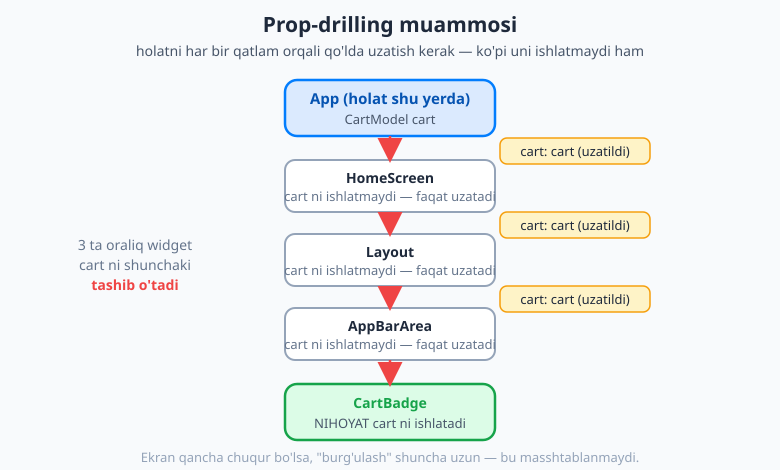
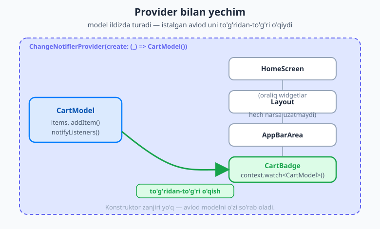
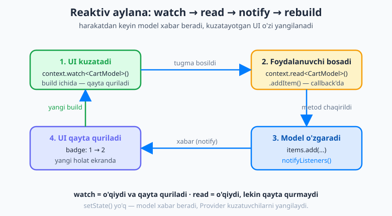

# 24 — Provider va InheritedWidget

[⬅️ Oldingi: 23 — Stream va reaktiv UI](./23-stream-reaktiv.md) · [🏠 README](./README.md) · [Keyingi: 25 — Riverpod (3.x) ➡️](./25-riverpod.md)

---

> **Bu bobda:** mana, holat boshqaruvi (state management) — Flutter o'rganishdagi eng muhim bosqichlardan biri. [16-bobda](./16-statefulwidget-setstate.md) `setState` bilan **bitta widget ichidagi** holatni o'zgartirishni o'rgandingiz. Lekin haqiqiy ilovada bir xil ma'lumotni (kim tizimga kirgani, savatdagi mahsulotlar, tanlangan mavzu/tema) **ko'p ekran** ko'rishi kerak. Buni `setState` bilan qilishga urinsangiz, **prop-drilling** degan og'riqli muammoga duch kelasiz. Avval shu muammoni *his qilamiz*. Keyin Flutter'ning o'zidagi yechim poydevorini — **`InheritedWidget`**ni tushunamiz. So'ng uning qulay o'ramasi — **`provider`** paketini o'rganamiz: **`ChangeNotifier`** (holat saqlovchi model), **`ChangeNotifierProvider`** (modelni daraxtga joylash), va o'qish usullari — **`context.watch`**, **`context.read`**, **`context.select`**, **`Consumer`**. Yengilroq variant — **`ValueNotifier`** + **`ValueListenableBuilder`**ni ham ko'ramiz. Birgalikda **savat (cart)** va **mavzu almashtirgich (theme switcher)** quramiz. Oxirida halol gaplashamiz: Provider qachon yaxshi, qachon Riverpod (keyingi bob) yoki Bloc kerak.

---

## Muammo: `setState` masshtablanmaydi

[16-bobni](./16-statefulwidget-setstate.md) eslang: `setState` holatni **bitta widget ichida** saqlaydi. Hisoblagich misolida `count` aynan o'sha widgetga tegishli edi va faqat o'sha widget uni ko'rardi. Bu kichik, mahalliy holat uchun ajoyib.

Endi haqiqiy ilovani tasavvur qiling — onlayn do'kon. Bizda **savat** (cart) bor. Savatga mahsulot qo'shilganda:

- yuqoridagi **AppBar** dagi savat belgisi (badge) yangi sonni ko'rsatishi kerak;
- **savat ekrani** ro'yxatni yangilashi kerak;
- ehtimol **bosh sahifa** ham "savatda 3 ta mahsulot" deb yozishi kerak.

Bu uchta joy **bir xil holatni** ko'rsatadi. Savat qayerda "yashaydi"? `setState` bilan bitta yo'l bor: holatni shu uchta widgetning **umumiy ota-onasiga** ko'tarish — buni [16-bobda](./16-statefulwidget-setstate.md) "lifting state up" (holatni yuqoriga ko'tarish) deb atagandik. Ko'pincha bu eng yuqori widget — `App` ning o'zi bo'lib qoladi.

Lekin holat yuqorida bo'lsa, uni pastdagi widgetga **yetkazish** kerak. Flutter'da ma'lumot daraxt bo'ylab pastga konstruktor parametrlari orqali uzatiladi. Mana muammo qanday ko'rinadi:

```dart
// App'da holat bor
class App extends StatefulWidget { /* ... */ }

class _AppState extends State<App> {
  CartModel cart = CartModel();

  @override
  Widget build(BuildContext context) {
    // cart ni pastga uzatamiz...
    return HomeScreen(cart: cart);
  }
}

// HomeScreen cart ni ISHLATMAYDI — faqat pastga uzatadi
class HomeScreen extends StatelessWidget {
  const HomeScreen({super.key, required this.cart});
  final CartModel cart;

  @override
  Widget build(BuildContext context) => Layout(cart: cart); // yana uzatadi
}

// Layout ham cart ni ISHLATMAYDI — faqat uzatadi
class Layout extends StatelessWidget {
  const Layout({super.key, required this.cart});
  final CartModel cart;

  @override
  Widget build(BuildContext context) => AppBarArea(cart: cart); // yana...
}

// AppBarArea ham ISHLATMAYDI — yana uzatadi
class AppBarArea extends StatelessWidget {
  const AppBarArea({super.key, required this.cart});
  final CartModel cart;

  @override
  Widget build(BuildContext context) => CartBadge(cart: cart); // nihoyat!
}

// CartBadge — NIHOYAT cart ni haqiqatan ishlatadi
class CartBadge extends StatelessWidget {
  const CartBadge({super.key, required this.cart});
  final CartModel cart;

  @override
  Widget build(BuildContext context) => Text('${cart.items.length}');
}
```

Sezdingizmi? `HomeScreen`, `Layout`, `AppBarArea` — uchtasi ham `cart` ni **o'zi ishlatmaydi**. Ular shunchaki uni qabul qiladi va pastga uzatadi. Bu — **prop-drilling** (so'zma-so'z: "xususiyatni burg'ulab o'tkazish"). Ma'lumot yetib borishi uchun siz uni har bir oraliq qatlamga "tashitishingiz" kerak.



Rasmda ko'rganingizdek, holat (`cart`) eng yuqorida, ishlatuvchi (`CartBadge`) eng pastda. Orasidagi har bir widget faqat "pochta tashuvchi" — ma'lumotni ushlab pastga uzatadi. Endi tasavvur qiling, ekran 8 qavat chuqur bo'lsa yoki holat o'zgarsa (`CartModel` o'rniga boshqa nom) — har bir konstruktorni qo'lda tuzatish kerak. Bu **masshtablanmaydi**.

> 💡 **Nega bu shunchalik yomon?** Prop-drilling kodni **mo'rt** (fragile) qiladi: oraliq widget'lar o'zi ishlatmaydigan narsaga bog'lanib qoladi. Yangi ma'lumot qo'shsangiz (masalan, `user`), yana hamma qatlamni yangilash kerak. Callback'lar (yuqoriga "qo'sh" deb signal berish) bilan kurashish ham xuddi shunday tarqoq bo'ladi. Bizga ma'lumotni **oraliq qatlamlardan o'tkazmasdan** to'g'ridan-to'g'ri ulashadigan mexanizm kerak.

## `InheritedWidget`: Flutter'ning poydevori

Yaxshi xabar: Flutter'da bu muammoni hal qiladigan **o'rnatilgan** (built-in) mexanizm bor — **`InheritedWidget`**. Uning g'oyasi shunday: siz ma'lumotni daraxtning yuqori qismiga bir marta joylaysiz, va **ixtiyoriy chuqurlikdagi** har qanday avlod (descendant) uni `context` orqali to'g'ridan-to'g'ri o'qiy oladi — oraliq konstruktorlarga tegmasdan.

Aslida siz buni allaqachon ishlatgansiz! `Theme.of(context)` ([14-bob](./14-material-cupertino-theming.md), mavzu bobi), `MediaQuery.of(context)`, `Navigator.of(context)` — bularning **hammasi** `InheritedWidget` ustiga qurilgan. Siz `Theme.of(context).colorScheme` deganingizda, Flutter daraxt bo'ylab **yuqoriga** yurib, eng yaqin `Theme` ni topadi va undan ranglarni oladi. Hech qanday prop-drilling yo'q.

Texnik jihatdan bu shunday ishlaydi: avlod widget `context.dependOnInheritedWidgetOfExactType<T>()` ni chaqiradi. Bu ikki ishni qiladi:

1. Daraxt bo'ylab yuqoriga yurib, `T` turidagi eng yaqin `InheritedWidget` ni **topadi** va qaytaradi.
2. Shu widgetni "men senga bog'liqman" deb **ro'yxatga oladi** — ya'ni o'sha `InheritedWidget` o'zgarsa (yangi ma'lumot bilan), bu avlod **avtomatik qayta quriladi**.

Mana qo'lda yozilgan eng kichik misol (tushunish uchun — amalda kamdan-kam yozasiz):

```dart
class CartProvider extends InheritedWidget {
  const CartProvider({
    super.key,
    required this.cart,
    required super.child,
  });

  final CartModel cart;

  // Avlodlar shu metod orqali topadi
  static CartProvider of(BuildContext context) {
    return context.dependOnInheritedWidgetOfExactType<CartProvider>()!;
  }

  // Flutter buni so'raydi: ma'lumot o'zgardimi? Agar ha — kuzatuvchilar qayta quriladi
  @override
  bool updateShouldNotify(CartProvider oldWidget) => cart != oldWidget.cart;
}
```

Endi **istalgan** chuqurlikdagi avlod prop-drillingsiz o'qiydi:

```dart
final cart = CartProvider.of(context).cart; // to'g'ridan-to'g'ri!
```

> 💡 **Muhim:** `InheritedWidget` — bu **sehr emas**, balki Provider, Theme, MediaQuery va Riverpod ham (qisman) uning ustiga qurilgan poydevor. Lekin uni qo'lda yozish **zerikarli**: `of` metodi, `updateShouldNotify`, holat o'zgarganda butun `InheritedWidget` ni qaytadan yaratish (chunki u o'zi `immutable`)... Buni har safar yozmaslik uchun **`provider` paketi** chiqdi — u xuddi shu mexanizmni qulay, oz kod bilan o'raydi.

## `provider` paketi: qulay o'rama

`provider` — Flutter jamoasi tomonidan tavsiya etilgan, eng keng tarqalgan oddiy holat-boshqaruv yechimi. U `InheritedWidget` ni siz uchun yozadi. O'rnatamiz:

```bash
flutter pub add provider
```

Bu `pubspec.yaml` ga qo'shadi:

```yaml
dependencies:
  flutter:
    sdk: flutter
  provider: ^6.1.0
```

> 💡 `^6.1.0` dagi `^` (karet) "6.1.0 va undan yuqori, lekin 7.0.0 dan past" degani — xavfsiz kichik yangilanishlarni oladi.

Provider uch bo'lakdan iborat: **model** (`ChangeNotifier`), **joylash** (`ChangeNotifierProvider`) va **o'qish** (`watch`/`read`/`select`/`Consumer`). Birma-bir ko'ramiz.

### 1-bo'lak: `ChangeNotifier` — holat saqlovchi model

**`ChangeNotifier`** — Flutter o'zida bor oddiy sinf. U bitta vazifani bajaradi: o'ziga "tinglovchilar" (listeners) ulanishiga ruxsat beradi va `notifyListeners()` chaqirilganda hammasiga "men o'zgardim!" deb xabar beradi.

Modelimiz `ChangeNotifier` dan meros oladi (`extends`), holatni ichida saqlaydi, va uni o'zgartiruvchi metodlar **oxirida `notifyListeners()` chaqiradi**:

```dart
import 'package:flutter/foundation.dart';

class CartModel extends ChangeNotifier {
  // Holat — TASHQARIDAN o'zgartirib bo'lmaydigan qilamiz (private + faqat o'qish)
  final List<String> _items = [];
  List<String> get items => List.unmodifiable(_items);

  int get count => _items.length;

  void addItem(String name) {
    _items.add(name);
    notifyListeners(); // <- "o'zgardim, kuzatuvchilar qayta qurilsin!"
  }

  void removeItem(String name) {
    _items.remove(name);
    notifyListeners();
  }

  void clear() {
    _items.clear();
    notifyListeners();
  }
}
```

Diqqat qiling: `_items` — **private** (oldida `_`) va tashqariga faqat `List.unmodifiable` orqali ochiladi. Bu muhim qoida: holatni faqat model **metodlari** o'zgartirsin, chunki o'zgartirishdan keyin `notifyListeners()` chaqirilishi shart. Tashqaridan to'g'ridan-to'g'ri `cart.items.add(...)` qilsangiz, hech kim xabardor bo'lmaydi va UI yangilanmaydi.

> ⚠️ **Eng ko'p uchraydigan xato:** holatni o'zgartirib, `notifyListeners()` ni **unutib qoldirish**. Bunda ma'lumot o'zgaradi, lekin ekran eskicha qoladi — chunki hech kimga xabar berilmagan. Har bir o'zgartiruvchi metod oxirida `notifyListeners()` borligini tekshiring.

### 2-bo'lak: `ChangeNotifierProvider` — modelni daraxtga joylash

Endi modelni daraxtga qo'yamiz — odatda **ildizga yaqin**, undan pastda joylashgan barcha widgetlar ko'ra olishi uchun:

```dart
void main() {
  runApp(
    ChangeNotifierProvider(
      create: (context) => CartModel(), // model bir marta yaratiladi
      child: const MyApp(),
    ),
  );
}
```

`create: (context) => CartModel()` — modelni **bir marta** yaratadi va undagi avlodlar uchun saqlaydi. Provider modelni o'zi `dispose` qiladi (ilova yopilganda tozalaydi), shuning uchun siz buni qo'lda qilishingiz shart emas.



Rasmda ko'rganingizdek, `CartModel` endi `ChangeNotifierProvider` ichida — daraxtning yuqorisida. Oraliq widget'lar (`HomeScreen`, `Layout`, `AppBarArea`) **hech narsa uzatmaydi**; eng pastdagi `CartBadge` modelni o'zi to'g'ridan-to'g'ri so'rab oladi. Prop-drilling yo'qoldi.

Bir nechta model kerak bo'lsa (savat **va** mavzu **va** foydalanuvchi), ularni alohida `ChangeNotifierProvider` bilan ichma-ich yozish o'rniga **`MultiProvider`** ishlatiladi — toza va tekis:

```dart
void main() {
  runApp(
    MultiProvider(
      providers: [
        ChangeNotifierProvider(create: (_) => CartModel()),
        ChangeNotifierProvider(create: (_) => ThemeModel()),
        ChangeNotifierProvider(create: (_) => UserModel()),
      ],
      child: const MyApp(),
    ),
  );
}
```

### 3-bo'lak: o'qish — `watch`, `read`, `select`, `Consumer`

Model daraxtda. Endi uni qanday **o'qiymiz**? Provider bir nechta usul beradi va ular orasidagi **farqni** tushunish — bu bobning kaliti.

**`context.watch<T>()`** — modelni o'qiydi **va** unga obuna bo'ladi: model `notifyListeners()` chaqirsa, bu widget **qayta quriladi**. Faqat `build` metodi ichida ishlating:

```dart
@override
Widget build(BuildContext context) {
  final cart = context.watch<CartModel>(); // obuna bo'ladi
  return Text('Savatda: ${cart.count} ta'); // count o'zgarsa, qayta quriladi
}
```

**`context.read<T>()`** — modelni o'qiydi, lekin **obuna bo'lmaydi** (qayta qurmaydi). Buni **callback'larda** (`onPressed`, `onTap`) — ya'ni metod chaqirish uchun ishlating:

```dart
ElevatedButton(
  onPressed: () {
    context.read<CartModel>().addItem('Olma'); // shunchaki metodni chaqiramiz
  },
  child: const Text('Savatga qo\'shish'),
)
```

> ⚠️ **Asosiy qoida (yodda tuting):**
> - **`build` ichida ko'rsatish uchun → `watch`** (chunki o'zgarganda qayta qurilishi kerak).
> - **`onPressed`/`onTap` ichida metod chaqirish uchun → `read`** (chunki bu yer qayta qurilmaydi; `watch` ni callback'da ishlatish xatoga olib keladi).

**`context.select<T, R>()`** — `watch` ning aniqroq, tejamkor varianti. Modelning **bitta maydoniga** obuna bo'ladi: faqat o'sha maydon o'zgarsa qayta quriladi. Katta modelda ortiqcha qayta qurilishni kamaytiradi:

```dart
@override
Widget build(BuildContext context) {
  // Faqat count o'zgarsa qayta quriladi — items ro'yxati boshqa joyi o'zgarsa, yo'q
  final count = context.select<CartModel, int>((cart) => cart.count);
  return Text('$count');
}
```

**`Consumer<T>`** — `watch` ga muqobil, **widget** ko'rinishidagi usul. U faqat o'z ichidagi qismni qayta quradi (butun `build` ni emas) va `child` orqali **o'zgarmaydigan** qismni optimallashtiradi:

```dart
Consumer<CartModel>(
  // child — bir marta quriladi va saqlanadi (qayta qurilmaydi)
  child: const Icon(Icons.shopping_cart),
  builder: (context, cart, child) {
    return Row(
      children: [
        child!, // o'zgarmas ikona — tekin qayta ishlatiladi
        Text('${cart.count}'), // faqat shu qism cart o'zgarganda yangilanadi
      ],
    );
  },
)
```

> 💡 **Qachon `Consumer`, qachon `watch`?** `context.watch` — soddaroq va ko'pincha yetarli; u butun `build` metodini model'ga obuna qiladi. `Consumer` — qayta qurilishni **kichikroq qismga cheklash** kerak bo'lganda (katta `build` ichida faqat bitta `Text` model'ga bog'liq bo'lsa) va `child` optimizatsiyasi kerak bo'lganda foydali. Ikkalasi bir xil natija beradi, farq — qayta qurish **ko'lamida**.

Eski koddan `Provider.of<T>(context, listen: false)` ham uchraydi — bu `context.read<T>()` ning to'liq shakli (`listen: true` esa `watch` ga teng). Yangi kodda qisqa `read`/`watch` ni afzal ko'ring.

## Oqim: hammasi qanday bog'lanadi

Endi bo'laklarni bitta **reaktiv aylanaga** birlashtiramiz. Mana to'liq oqim:



Rasmdagi qadamlar:

1. **UI kuzatadi** — widget `build` ichida `context.watch<CartModel>()` bilan modelni o'qiydi va unga obuna bo'ladi.
2. **Foydalanuvchi harakat qiladi** — tugmani bosadi; `onPressed` ichida `context.read<CartModel>().addItem('Olma')` chaqiriladi.
3. **Model o'zgaradi** — `addItem` ro'yxatga qo'shadi va **`notifyListeners()`** chaqiradi.
4. **UI qayta quriladi** — `notifyListeners` xabari `watch` qilgan barcha widget'larga boradi; ular yangi holat bilan qaytadan quriladi (badge `1` dan `2` ga).

Diqqat: bu yerda **`setState` yo'q**. Holat o'zgarishi haqidagi xabarni model `notifyListeners()` orqali beradi, Provider esa kuzatuvchi widget'larni topib qayta quradi. Bu — `setState` dan asosiy farq: holat endi widget ichida emas, **alohida modelda** yashaydi va ko'p ekran uni ulashishi mumkin.

## Yengilroq variant: `ValueNotifier` + `ValueListenableBuilder`

Ba'zan butun model kerak emas — sizda atigi **bitta qiymat** o'zgaradi (masalan, hisoblagich soni yoki "yoqilgan/o'chiq" kaliti). Bunday hol uchun Flutter'da **paketsiz** (built-in) yengil yechim bor: **`ValueNotifier`** + **`ValueListenableBuilder`**.

`ValueNotifier<T>` — bitta `T` qiymatni saqlaydi va u o'zgarsa **avtomatik** xabar beradi (siz `notifyListeners()` yozmaysiz):

```dart
final counter = ValueNotifier<int>(0);

// O'zgartirish — .value ga yangi qiymat berish kifoya (o'zi xabar beradi)
counter.value++;
```

UI da uni `ValueListenableBuilder` bilan tinglaymiz — faqat shu builder qismi qayta quriladi:

```dart
ValueListenableBuilder<int>(
  valueListenable: counter,
  builder: (context, value, child) => Text('$value'),
)
```

> 💡 **`ValueNotifier` qachon?** Bir-ikkita oddiy qiymat uchun, paket o'rnatishni xohlamaganingizda — ideal. Lekin holat o'sib, bir nechta maydon va murakkab mantiq paydo bo'lsa, `ChangeNotifier` + Provider toza-roq. Qoida: kichik va lokal → `ValueNotifier`; ulashiladigan va o'suvchi → Provider. `ValueNotifier` ham aslida `ChangeNotifier` ning ixtisoslashgan turi — bog'liqlikni sezdingizmi.

## Arxitektura: model'ni UI dan ajrating

Provider'dan to'g'ri foydalanishning eng muhim qoidasi: **model'ni UI dan ajrating**. `CartModel` faqat Flutter widget'lariga emas — sof Dart sinfi bo'lsin (`import 'package:flutter/foundation.dart';` yetarli, `material.dart` kerak emas). Shunda modelni alohida sinab ko'rish (test) oson bo'ladi va u UI dan mustaqil yashaydi.

Yana bir bosqich: modelni [21/22-boblardagi](./21-networking-http.md) **repozitoriy** (repository — ma'lumot manbasi: API, lokal saqlov) bilan birlashtiring. Model UI uchun **holatni** ochib beradi, ma'lumotni esa repozitoriydan oladi:

```dart
class ProductsModel extends ChangeNotifier {
  ProductsModel(this._repository);
  final ProductRepository _repository; // 21/22-bobdagi repozitoriy

  List<Product> _products = [];
  List<Product> get products => List.unmodifiable(_products);

  bool _loading = false;
  bool get loading => _loading;

  Future<void> load() async {
    _loading = true;
    notifyListeners();          // UI: "yuklanmoqda" spinnerini ko'rsatadi

    _products = await _repository.fetchProducts(); // tarmoqdan oladi

    _loading = false;
    notifyListeners();          // UI: ro'yxatni ko'rsatadi
  }
}
```

Bu — toza qatlamlash: **UI** (widget'lar) → **model** (`ChangeNotifier`, holat va mantiq) → **repozitoriy** (ma'lumot manbasi). Har bir qatlam o'z ishini biladi va alohida sinaladi.

## Birgalikda: savat va mavzu almashtirgich

Endi hammasini birlashtirib, ikkita modelli kichik ilova quramiz: **savat** (badge hamma joyda yangilanadi) va **mavzu almashtirgich** (yorug'/qorong'i).

Avval mavzu modeli:

```dart
import 'package:flutter/material.dart';

class ThemeModel extends ChangeNotifier {
  bool _isDark = false;
  bool get isDark => _isDark;

  ThemeMode get mode => _isDark ? ThemeMode.dark : ThemeMode.light;

  void toggle() {
    _isDark = !_isDark;
    notifyListeners();
  }
}
```

Ikkala modelni `MultiProvider` bilan ildizga joylaymiz:

```dart
void main() {
  runApp(
    MultiProvider(
      providers: [
        ChangeNotifierProvider(create: (_) => CartModel()),
        ChangeNotifierProvider(create: (_) => ThemeModel()),
      ],
      child: const MyApp(),
    ),
  );
}
```

`MaterialApp` mavzuni model'dan o'qiydi — shuning uchun bu yer model'ni **`watch`** qiladi (mavzu o'zgarsa, butun ilova qayta qurilishi va ranglar yangilanishi kerak):

```dart
class MyApp extends StatelessWidget {
  const MyApp({super.key});

  @override
  Widget build(BuildContext context) {
    final themeModel = context.watch<ThemeModel>(); // mavzuga obuna

    return MaterialApp(
      title: 'Provider demo',
      theme: ThemeData(
        colorScheme: ColorScheme.fromSeed(seedColor: Colors.indigo),
      ),
      darkTheme: ThemeData(
        colorScheme: ColorScheme.fromSeed(
          seedColor: Colors.indigo,
          brightness: Brightness.dark,
        ),
      ),
      themeMode: themeModel.mode, // model qaror qiladi: yorug' yoki qorong'i
      home: const ShopPage(),
    );
  }
}
```

Asosiy sahifa: AppBar'da savat badge (yangilanadi), mavzu kaliti, va mahsulot tugmasi:

```dart
class ShopPage extends StatelessWidget {
  const ShopPage({super.key});

  @override
  Widget build(BuildContext context) {
    return Scaffold(
      appBar: AppBar(
        title: const Text('Do\'kon'),
        actions: [
          // mavzu kaliti — Switch model holatini ko'rsatadi (watch) va o'zgartiradi (read)
          Switch(
            value: context.watch<ThemeModel>().isDark,
            onChanged: (_) => context.read<ThemeModel>().toggle(),
          ),
          // savat badge — alohida widget (pastda)
          const CartBadge(),
          const SizedBox(width: 12),
        ],
      ),
      body: Center(
        child: ElevatedButton(
          onPressed: () => context.read<CartModel>().addItem('Mahsulot'),
          child: const Text('Savatga qo\'shish'),
        ),
      ),
    );
  }
}
```

Savat badge — faqat **soni** ga bog'liq, shuning uchun `select` bilan tejamkor qilamiz (savat ichi boshqa o'zgarsa, badge bekorga qayta qurilmaydi):

```dart
class CartBadge extends StatelessWidget {
  const CartBadge({super.key});

  @override
  Widget build(BuildContext context) {
    // faqat count o'zgarganda qayta quriladi
    final count = context.select<CartModel, int>((cart) => cart.count);
    return Padding(
      padding: const EdgeInsets.all(8),
      child: Chip(label: Text('Savat: $count')),
    );
  }
}
```

E'tibor bering: `CartBadge` ga **hech qanday parametr uzatilmadi** — u `context` orqali modelni o'zi topdi. Tugmani bossangiz, `addItem` chaqiriladi, `CartModel` `notifyListeners()` qiladi, va badge avtomatik `Savat: 1` → `Savat: 2` ga yangilanadi. Bu — bobning boshidagi prop-drilling muammosining **toza yechimi**.

## Halol gap: Provider'ning o'rni va chegaralari

Provider — **oddiy**, **yengil** va eng keng tarqalgan yechim. Boshlovchilar uchun ideal: tushuntirishi oson, kam kod, `setState` dan tabiiy keyingi qadam. Ko'p haqiqiy ilovalar faqat Provider bilan ham mukammal ishlaydi.

Lekin u mukammal emas, va bu chegaralar keyingi bob — **Riverpod**ga o'tishni asoslaydi:

- **Tur bo'yicha qidirish (runtime lookup).** `context.read<CartModel>()` model'ni **ishlash vaqtida**, turi bo'yicha qidiradi. Agar shu turdagi Provider daraxtda yuqorida bo'lmasa, ilova **ishga tushganda** (kompilyatsiyada emas) `ProviderNotFoundException` bilan qulaydi. Kompilyator sizni oldindan ogohlantirmaydi.
- **`BuildContext` ga bog'liqlik.** Provider'ni o'qish uchun har doim `context` kerak — ya'ni model'ga faqat widget daraxti ichidan murojaat qila olasiz. `context` yo'q joyda (oddiy funksiya, boshqa model) o'qish noqulay.
- **Bir turdan bittadan.** Bir xil turdagi ikkita `CartModel` ni bitta daraxtda farqlash murakkab.

Riverpod (keyingi [25-bob](./25-riverpod.md)) aynan shu muammolarni hal qilish uchun yaratilgan: u **`context` ga bog'liq emas**, qidiruvi **kompilyatsiya vaqtida xavfsizroq**, va testlash oson. **Bloc** esa — yana bir mashhur muqobil — ko'proq tuzilma (struktura) va event/state ajratimi beradi, kattaroq jamoa loyihalari uchun. Biz ularni keyingi boblarda solishtiramiz.

> 💡 **Maslahat:** boshlovchi sifatida **Provider'dan boshlang** — uning g'oyalari (`ChangeNotifier`, `notifyListeners`, daraxtga obuna) Riverpod va Bloc'da ham asos bo'lib qoladi. Provider'ni tushunsangiz, qolganlarini o'rganish ancha oson kechadi. Vaqtidan oldin eng murakkab yechimni tanlash — odatiy xato.

## Keyingi qadam

Bu bobda holat boshqaruvining birinchi qadamini bosdingiz: prop-drilling muammosini *his qildingiz*, uning poydevori — `InheritedWidget` ni tushundingiz, va `provider` paketi bilan amaliy yechim qurdingiz — `ChangeNotifier` model, `ChangeNotifierProvider`/`MultiProvider` joylash, va `watch`/`read`/`select`/`Consumer` o'qish usullari. `ValueNotifier` yengil muqobilini ham ko'rdingiz, model'ni repozitoriy bilan toza qatlamlashni ham.

Keyingi [25-bobda](./25-riverpod.md) **Riverpod (3.x)** bilan tanishamiz — Provider'ning bu bobda sanab o'tilgan chegaralarini (runtime lookup, `context` bog'liqligi) hal qiluvchi zamonaviy muqobil. Provider'da o'rgangan tushunchalaringiz o'sha yerda ham asqotadi.

---

## Mashqlar

### Oson

1. O'z so'zlaringiz bilan ayting: **prop-drilling** nima va u nima uchun muammo? `setState` ([16-bob](./16-statefulwidget-setstate.md)) bilan ko'p ekranda holat ulashishga urinsangiz, nega aynan shu muammoga duch kelasiz?
2. `context.watch<T>()` va `context.read<T>()` orasidagi farq nima? Qaysi birini `build` ichida ko'rsatish uchun, qaysi birini `onPressed` ichida ishlatasiz va nega?
3. `ChangeNotifier` model'ida holatni o'zgartirgandan keyin **qaysi metodni** chaqirish shart? Uni unutsangiz nima bo'ladi?
4. `Theme.of(context)` va `MediaQuery.of(context)` qaysi Flutter mexanizmi ustiga qurilgan? Bu Provider bilan qanday bog'liq?

### O'rta

5. Quyidagi `ChangeNotifier` modelini yozing: `FavoritesModel` — ichida `Set<String> _ids` bo'lsin, `toggle(String id)` metodi id bo'lsa o'chirsin, bo'lmasa qo'shsin, va `bool isFavorite(String id)` getter bo'lsin. `notifyListeners()` ni to'g'ri joyga qo'ying. Holatni tashqaridan o'zgartirishdan qanday himoyalaysiz?
6. `context.watch<CartModel>()` o'rniga `context.select<CartModel, int>((c) => c.count)` ishlatishning afzalligi nima? Qaysi holatda bu farq seziladi?
7. `MultiProvider` nima uchun kerak? Uch xil model (`CartModel`, `ThemeModel`, `UserModel`) ni ildizga joylovchi `main()` funksiyasini yozing.

### Qiyin

8. Bir o'quvchi savatga mahsulot qo'shyapti — `context.read<CartModel>()` chaqirilganda ilova `ProviderNotFoundException` bilan qulayapti. Eng ehtimoliy sabab nima va uni qanday tuzatasiz? Nega bu xato kompilyatsiyada emas, ishga tushganda chiqadi?
9. `ValueNotifier` + `ValueListenableBuilder` ni qachon `ChangeNotifier` + Provider o'rniga tanlaysiz? Bitta `bool` "yoqilgan/o'chiq" kaliti uchun `ValueNotifier` bilan to'liq misol yozing (e'lon, o'zgartirish, UI da ko'rsatish).
10. Provider'ning ikkita asosiy chegarasini ayting va har biri Riverpod'ga ([25-bob](./25-riverpod.md)) o'tishni qanday asoslashini tushuntiring. Boshlovchiga nega baribir Provider'dan boshlashni tavsiya qilamiz?

<details markdown="1"><summary>Yechimlar</summary>

**1.** **Prop-drilling** — holatni daraxtning yuqorisidan pastdagi uni ishlatuvchi widgetga yetkazish uchun **har bir oraliq widget konstruktoriga** parametr sifatida uzatish, garchi o'sha oraliq widgetlar holatni **o'zi ishlatmasa ham**. Bu muammo, chunki oraliq widgetlar o'ziga keraksiz narsaga bog'lanib qoladi, kod mo'rt bo'ladi (har o'zgarishda hamma qatlamni tuzatish kerak) va masshtablanmaydi. `setState` bilan ko'p ekranda holat ulashish uchun holatni umumiy otaga ko'tarish ("lifting state up") kerak — lekin u yuqorida bo'lsa, pastga yetkazish uchun aynan prop-drilling kerak bo'ladi.

**2.** `context.watch<T>()` — model'ni o'qiydi **va unga obuna bo'ladi**: model `notifyListeners()` chaqirsa, widget **qayta quriladi**. `context.read<T>()` — o'qiydi, lekin **obuna bo'lmaydi** (qayta qurmaydi). `build` ichida ko'rsatish uchun **`watch`** (chunki o'zgarganda yangilanishi kerak); `onPressed`/`onTap` callback'da metod chaqirish uchun **`read`** (chunki callback qayta qurilmaydi, obuna keraksiz — `watch` ni u yerda ishlatish noto'g'ri).

**3.** **`notifyListeners()`** ni chaqirish shart. Uni unutsangiz, ma'lumot o'zgaradi, lekin hech kimga xabar berilmaydi — kuzatuvchi widgetlar **qayta qurilmaydi** va ekran eski holatda qoladi (ilova "buzilgandek" tuyuladi, lekin ma'lumot aslida o'zgargan).

**4.** Ikkalasi ham **`InheritedWidget`** ustiga qurilgan: `.of(context)` daraxt bo'ylab yuqoriga yurib eng yaqin `Theme`/`MediaQuery` ni topadi va undagi qiymatni qaytaradi, prop-drillingsiz. Bog'liqlik: `provider` paketi ham xuddi shu `InheritedWidget` mexanizmini ishlatadi — Provider aslida `InheritedWidget` ni siz uchun qulay o'rab beradi.

**5.**
```dart
import 'package:flutter/foundation.dart';

class FavoritesModel extends ChangeNotifier {
  final Set<String> _ids = {};
  // tashqariga faqat o'qish uchun — o'zgartirib bo'lmaydigan nusxa
  Set<String> get ids => Set.unmodifiable(_ids);

  bool isFavorite(String id) => _ids.contains(id);

  void toggle(String id) {
    if (_ids.contains(id)) {
      _ids.remove(id);
    } else {
      _ids.add(id);
    }
    notifyListeners(); // o'zgartirishdan keyin — shart
  }
}
```
Himoya: `_ids` **private** (`_`) va tashqariga faqat `Set.unmodifiable` orqali ochiladi, shuning uchun holatni faqat `toggle` metodi o'zgartiradi — bu `notifyListeners()` chaqirilishini kafolatlaydi.

**6.** `context.select` faqat **tanlangan maydon** (`count`) o'zgarganda qayta quradi; `context.watch` esa model **har qanday** `notifyListeners()` da (masalan, savatdagi mahsulot nomi o'zgarsa, lekin soni o'sha qolsa ham) qayta quradi. Afzallik — **ortiqcha qayta qurilishni kamaytirish** (samaradorlik). Farq, ayniqsa, katta/murakkab modelda yoki tez-tez o'zgaradigan holatda seziladi: badge faqat songa bog'liq bo'lsa, `select` bilan u faqat son o'zgarganda yangilanadi.

**7.** `MultiProvider` — bir nechta provider'ni ichma-ich (ugma-ichli) yozmasdan, **tekis ro'yxatda** joylash uchun; kod o'qilishi oson bo'ladi va chuqur joylashuv ("provider piramidasi") oldini oladi.
```dart
void main() {
  runApp(
    MultiProvider(
      providers: [
        ChangeNotifierProvider(create: (_) => CartModel()),
        ChangeNotifierProvider(create: (_) => ThemeModel()),
        ChangeNotifierProvider(create: (_) => UserModel()),
      ],
      child: const MyApp(),
    ),
  );
}
```

**8.** Eng ehtimoliy sabab: `CartModel` uchun **`ChangeNotifierProvider` daraxtda yuqorida joylashtirilmagan** (yoki `read` chaqirayotgan widget shu provider'ning avlodi emas — masalan, provider'ni juda pastga qo'ygan). Tuzatish: `ChangeNotifierProvider(create: (_) => CartModel())` (yoki `MultiProvider`) ni `read` qilayotgan widgetdan **yuqoriroqqa**, odatda `main()` da `runApp` ichiga qo'yish. Bu xato **ishga tushganda** chiqadi, chunki Provider model'ni **turi bo'yicha ishlash vaqtida** (runtime) qidiradi — kompilyator `read<CartModel>()` to'g'ri tur ekanini ko'radi, lekin daraxtda mos provider bor-yo'qligini **oldindan** bilolmaydi.

**9.** `ValueNotifier` + `ValueListenableBuilder` ni **bitta oddiy qiymat** o'zgaradigan, paket o'rnatishni xohlamaydigan va holat lokal bo'lgan holatda tanlaysiz (hisoblagich, bitta kalit). `ChangeNotifier`+Provider esa bir nechta maydon, murakkab mantiq va ko'p ekranda ulashish kerak bo'lganda. Misol:
```dart
final isOn = ValueNotifier<bool>(false);

// O'zgartirish (masalan tugma onPressed da):
isOn.value = !isOn.value; // o'zi xabar beradi, notifyListeners kerak emas

// UI da ko'rsatish:
ValueListenableBuilder<bool>(
  valueListenable: isOn,
  builder: (context, value, child) => Switch(
    value: value,
    onChanged: (v) => isOn.value = v,
  ),
)
```

**10.** Ikkita asosiy chegara: **(a) Tur bo'yicha runtime qidirish** — Provider model'ni ishlash vaqtida turi bo'yicha topadi, mos provider bo'lmasa ilova `ProviderNotFoundException` bilan qulaydi (kompilyator oldindan ogohlantirmaydi); Riverpod qidiruvni xavfsizroq va `context` siz qiladi. **(b) `BuildContext` ga bog'liqlik** — Provider'ni o'qish uchun har doim `context` kerak, ya'ni faqat widget daraxti ichidan; Riverpod `context` ga bog'liq emas, shuning uchun model'larni bir-biridan va oddiy funksiyalardan o'qish osonroq, testlash ham qulay. Shunga qaramay boshlovchiga **Provider tavsiya qilinadi**, chunki uning tushunchalari (`ChangeNotifier`, `notifyListeners`, daraxtga obuna, `watch`/`read`) Riverpod va Bloc'da ham asos bo'lib qoladi — Provider'ni bilsangiz, qolganlarini o'rganish soddalashadi.

</details>

---

[⬅️ Oldingi: 23 — Stream va reaktiv UI](./23-stream-reaktiv.md) · [🏠 README](./README.md) · [Keyingi: 25 — Riverpod (3.x) ➡️](./25-riverpod.md)
