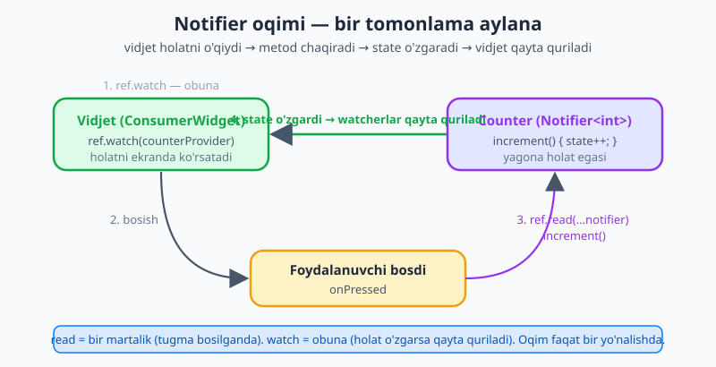
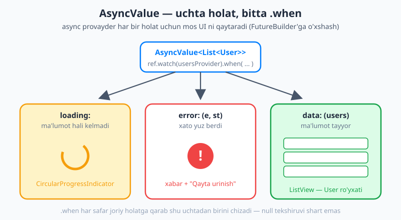
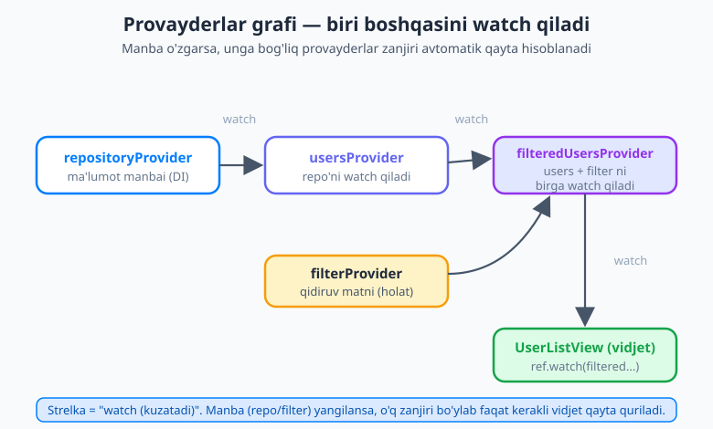

# 25 — Riverpod (3.x)

[⬅️ Oldingi: 24 — Provider va InheritedWidget](./24-provider.md) · [🏠 README](./README.md) · [Keyingi: 26 — Bloc va Cubit ➡️](./26-bloc-cubit.md)

---

> **Bu bobda:** [24-bobda](./24-provider.md) `Provider` paketi bilan holatni vidjet daraxti orqali ulashishni o'rgandingiz. U yaxshi, lekin o'sib borgan ilovada bir nechta nozik kamchiligi bor: ba'zi xatolar faqat *ishga tushganda* (runtime'da) sezilib, `BuildContext`'ga bog'liqligi esa holatni sinash va birlashtirishni qiyinlashtiradi. Endi *xuddi shu muallif* yaratgan **Riverpod** paketi bilan tanishamiz — bu "tuzatilgan Provider". Siz *nega* Riverpod (kompilyatsiya-xavfsizlik, `BuildContext`'dan ozodlik, oson birlashtirish, ichki async), uni **o'rnatish** (`ProviderScope`), vidjetda provayderni **o'qish** (`ConsumerWidget`, `ref.watch`/`ref.read`/`ref.listen`), provayder **turlari** (`Provider`, `StateProvider`, zamonaviy `NotifierProvider`, async uchun `AsyncNotifierProvider`/`FutureProvider`), tavsiya etilgan **kod-generatsiya** (`@riverpod` + `build_runner` — *makros emas!*), provayderlarni **birlashtirish/hosila qilish** (`.family`, `.autoDispose`), **yon ta'sir va yangilash** (`ref.invalidate`, `ref.listen`) va **sinash** (test) ni o'rganasiz. Oxirida hisoblagich, async foydalanuvchilar ro'yxati va filtrlangan hosila ro'yxat quramiz.

---

## Nega Riverpod? (Provider'ning nozik kamchiliklari)

[24-bobda](./24-provider.md) `Provider` paketi holatni vidjet daraxtidan yuqoriga qo'yib, pastdagi vidjetlar uni `context.watch`/`Consumer` bilan o'qishini ko'rdik. Bu ishlaydi — lekin uch xil og'riq bor:

- **Xato faqat ishga tushganda sezildi.** Agar vidjet daraxtida tegishli `Provider` topilmasa, ilova *ishlab turganda* `ProviderNotFoundException` bilan qulaydi. Kompilyator bu xatoni oldindan ushlamaydi — siz uni faqat o'sha ekranni ochganingizda ko'rasiz.
- **`BuildContext`'ga bog'liqlik.** Provider holatni `context` (vidjet daraxtidagi joylashuv) orqali topadi. Demak holatni o'qish uchun sizda doim `BuildContext` bo'lishi shart — bu test yozishni va daraxtdan tashqarida holatga murojaat qilishni noqulay qiladi.
- **Birlashtirish noqulay.** "A holatdan B holatni hisoblab chiqarish" yoki "ikki holatni birlashtirish" — Provider'da bir oz mashaqqatli.

**Riverpod** — Provider'ning *muallifi* (Remi Rousselet) tomonidan yozilgan, ana shu uch og'riqni davolovchi paket. Nomi ham bejiz emas: "Riverpod" — "Provider" so'zining harflarini qayta tartiblash (anagramma). G'oyasi: provayderlarni vidjet daraxtiga emas, balki **global, lekin nazoratli (scoped)** obyektlarga aylantirish.

Riverpod nimani yaxshilaydi:

- **Kompilyatsiya-xavfsizlik.** Provayderni noto'g'ri ishlatsangiz, kod *kompilyatsiya bo'lmaydi* — xato ekranni ochishdan oldin, yozish paytida bilinadi. `ProviderNotFoundException` kabi runtime ajablanish yo'q.
- **`BuildContext`'dan ozod.** Holatni o'qish uchun `context` shart emas — `ref` orqali o'qiladi. Shuning uchun holatga vidjetdan tashqarida ham (masalan boshqa provayder ichida) murojaat qilsa bo'ladi.
- **Oson birlashtirish.** Bir provayder boshqasini `ref.watch` qilib, undan **hosila** (derived) holat chiqaradi. Manba o'zgarsa, hosila avtomatik yangilanadi.
- **Ichki async qo'llab-quvvatlash.** Async ma'lumot uchun maxsus `AsyncValue` turi bor — yuklanmoqda/xato/tayyor holatlarini bitta joyda, toza tarzda boshqaradi.
- **Sinaluvchanlik (testability).** Provayderlarni testda soxta (fake) versiyalar bilan **almashtirish** (override) oson — bu Riverpod'ning katta yutug'i.
- **Avtomatik tozalash (auto-dispose).** Provayder ishlatilmay qolsa, xotirani o'zi bo'shatadi.

> 💡 **Qisqasi:** Riverpod = "Provider, tuzatilgan". Agar siz Provider'ni o'rgangan bo'lsangiz, g'oyalar tanish: "holatni bir joyga qo'yib, vidjetlar uni kuzatadi". Farqi — Riverpod buni daraxtga emas, `ref`'ga bog'laydi, shuning uchun xavfsizroq va moslashuvchanroq.

## O'rnatish (setup)

Avval paketni qo'shamiz. Terminalda loyiha papkasida:

```bash
flutter pub add flutter_riverpod
```

Bu `pubspec.yaml` ga eng so'nggi versiyani qo'shadi:

```yaml
dependencies:
  flutter:
    sdk: flutter
  flutter_riverpod: ^3.3.0
```

So'ng — bu yagona **majburiy** qadam — butun ilovani `ProviderScope` ga o'rab qo'yamiz. `ProviderScope` — barcha provayderlar holatini saqlaydigan idish (konteyner); usiz Riverpod ishlamaydi:

```dart
import 'package:flutter/material.dart';
import 'package:flutter_riverpod/flutter_riverpod.dart';

void main() {
  runApp(
    const ProviderScope( // <-- butun ilovani shunga o'raymiz
      child: MyApp(),
    ),
  );
}
```

> 💡 `^3.3.0` dagi `^` (karet) belgisi "3.3.0 va undan yuqori, lekin 4.0.0 dan past" degani — kichik yangilanishlarni avtomatik oladi, buzuvchi katta o'zgarishlardan himoya qiladi. Riverpod'ning hozirgi (2026) versiyasi — **3.x**.

## Provayderni vidjetda o'qish

Provayderni o'qish uchun vidjetga `ref` (reference — "murojaat") obyekti kerak. Eng oson yo'l — vidjetni `StatelessWidget` o'rniga **`ConsumerWidget`** qilish: u `build` metodiga qo'shimcha `ref` argumentini beradi:

```dart
class CounterText extends ConsumerWidget {
  const CounterText({super.key});

  @override
  Widget build(BuildContext context, WidgetRef ref) { // <-- ref qo'shildi
    final count = ref.watch(counterProvider); // obuna bo'lib o'qish
    return Text('Hisob: $count');
  }
}
```

`ref` orqali holatni o'qishning uch usuli bor — ularni farqlash juda muhim:

| Metod | Nima qiladi | Qayerda ishlatiladi |
|---|---|---|
| **`ref.watch(p)`** | Provayderga **obuna** bo'ladi: qiymat o'zgarsa, vidjet **qayta quriladi**. | `build` ichida — UI ko'rsatadigan qiymatni o'qishda. |
| **`ref.read(p)`** | Qiymatni **bir martalik** o'qiydi, obuna bo'lmaydi. | Callback ichida (tugma bosilganda) — metod chaqirishda. |
| **`ref.listen(p, cb)`** | O'zgarishni "tinglaydi" va **yon ta'sir** bajaradi (qayta qurmaydi). | `build` ichida — SnackBar ko'rsatish, navigatsiya kabi. |

Eng keng tarqalgan xato — `build` ichida `ref.read` ishlatish yoki callback ichida `ref.watch` ishlatish. Oddiy qoida:

> 💡 **Qoida:** UI'da ko'rsatish uchun o'qiyapsizmi — **`ref.watch`** (build ichida). Tugma bosilganda biror amal qilyapsizmi — **`ref.read`** (callback ichida). "Voqea sodir bo'lganda bir marta nimadir qil" (SnackBar/navigatsiya) — **`ref.listen`**.

Agar butun vidjetni emas, balki uning **kichik bir qismini** kuzatishni xohlasangiz, `Consumer` vidjetidan foydalaning — faqat shu qism qayta quriladi:

```dart
Consumer(
  builder: (context, ref, child) {
    final count = ref.watch(counterProvider);
    return Text('Hisob: $count');
  },
)
```

`StatefulWidget` kerak bo'lsa — **`ConsumerStatefulWidget`** (juft `ConsumerState`) bor; unda `ref` `State` ichida to'g'ridan-to'g'ri ishlatiladi.

## Provayder turlari — soddadan zamonaviygacha

Riverpod'da bir nechta provayder turi bor. Ularni soddadan murakkabga qarab quramiz.

### `Provider` — o'qish uchun (hosila, DI)

Eng sodda tur. O'zgarmas yoki hisoblangan qiymatni beradi — masalan boshqa obyektga **bog'liqlik in'ektsiyasi** (dependency injection) yoki hosila qiymat:

```dart
final greetingProvider = Provider<String>((ref) {
  return 'Salom, Flutter!';
});
```

`ref` — bu provayder ichida boshqa provayderlarni o'qish uchun beriladi (pastda hosila holatda ko'ramiz).

### `StateProvider` — oddiy o'zgaruvchan qiymat

Bitta oddiy o'zgaruvchan qiymat (son, matn, bool) uchun. Eng tez yo'l, lekin u **eski (legacy)** uslub hisoblanadi — jiddiy holat uchun pastdagi `NotifierProvider` tavsiya etiladi:

```dart
// DIQQAT: Riverpod 3'da StateProvider (va boshqa legacy provayderlar) asosiy
// paketdan emas, alohida 'legacy.dart' faylidan keladi — uni ham import qiling:
import 'package:flutter_riverpod/legacy.dart';

final filterProvider = StateProvider<String>((ref) => '');
// O'zgartirish:  ref.read(filterProvider.notifier).state = 'al';
```

> ⚠️ `StateProvider` faqat eng oddiy qiymatlar uchun qulay. Mantiqi bor holat (metodlar, validatsiya, bir nechta maydon) kerak bo'lsa — `NotifierProvider` ishlating. Yangi kodda `StateProvider`'ga ko'p suyanmang.
>
> 📌 **Riverpod 3 muhim o'zgarishi.** `StateProvider`, `StateNotifierProvider` va `StateNotifier` kabi *eski* provayderlar Riverpod 3'da asosiy `flutter_riverpod.dart` barrelidan **olib tashlandi** — ular endi `import 'package:flutter_riverpod/legacy.dart';` orqali keladi. Agar `StateProvider isn't defined` xatosini ko'rsangiz — aynan shu importni qo'shing. Zamonaviy `Notifier`/`AsyncNotifier` esa asosiy importning o'zida bor.

### `NotifierProvider` + `Notifier<T>` — zamonaviy asosiy yo'l

Bu — o'zgaruvchan holatni boshqarishning **tavsiya etilgan** usuli. Siz `Notifier<T>` dan meros oluvchi klass yozasiz: `build()` boshlang'ich holatni qaytaradi, metodlar esa `state` ni o'zgartiradi. `state` ga yangi qiymat berganingizda — kuzatuvchi vidjetlar avtomatik qayta quriladi:

```dart
class Counter extends Notifier<int> {
  @override
  int build() => 0; // boshlang'ich holat

  void increment() => state++; // state o'zgardi -> watcherlar qayta quriladi
  void decrement() => state--;
  void reset() => state = 0;
}

final counterProvider = NotifierProvider<Counter, int>(Counter.new);
```

E'tibor bering: holatni `state` orqali o'zgartirasiz, `setState` emas. Oqim bir tomonlama va toza:



Rasmda ko'rganingizdek: (1) vidjet `ref.watch` bilan obuna bo'ladi → (2) foydalanuvchi tugmani bosadi → (3) callback `ref.read(counterProvider.notifier).increment()` ni chaqiradi → (4) `state++` ishlaydi va barcha kuzatuvchilar qayta quriladi. Ma'lumot faqat **bir yo'nalishda** aylanadi — bu xulqni oldindan aytishni osonlashtiradi.

Vidjetda ishlatish:

```dart
class CounterPage extends ConsumerWidget {
  const CounterPage({super.key});

  @override
  Widget build(BuildContext context, WidgetRef ref) {
    final count = ref.watch(counterProvider); // qiymatni o'qish (obuna)
    return Scaffold(
      appBar: AppBar(title: const Text('Hisoblagich')),
      body: Center(child: Text('$count', style: const TextStyle(fontSize: 48))),
      floatingActionButton: FloatingActionButton(
        // .notifier orqali metodga kiramiz; read — bir martalik
        onPressed: () => ref.read(counterProvider.notifier).increment(),
        child: const Icon(Icons.add),
      ),
    );
  }
}
```

> 💡 **`provider` va `provider.notifier` farqi.** `ref.watch(counterProvider)` — *qiymat* ni (`int`) qaytaradi. `ref.read(counterProvider.notifier)` — *Notifier obyekti* ni (metodlar bor: `increment`, `reset`) qaytaradi. Qiymatni o'qiganda `provider`, metod chaqirganda `provider.notifier`.

### Async holat: `AsyncNotifierProvider`, `FutureProvider`/`StreamProvider`

[21-bobda](./21-networking-http.md) serverdan ma'lumot olishni `FutureBuilder` bilan ko'rgan edik: u Future'ning *yuklanmoqda / xato / tayyor* uchta holatini boshqaradi. Riverpod'da bu vazifani **`AsyncValue<T>`** turi bajaradi — async natija doim shu uch holatdan birida bo'ladi.

Eng sodda yo'l — **`FutureProvider`**: async funksiya yozasiz, u `Future` qaytaradi, Riverpod uni `AsyncValue` ga o'raydi:

```dart
final usersProvider = FutureProvider<List<User>>((ref) async {
  final repo = ref.watch(repositoryProvider); // boshqa provayderga bog'liqlik
  return repo.fetchUsers(); // Future<List<User>> qaytaradi
});
```

Vidjetda `AsyncValue` ni **`.when`** bilan ochasiz — uch holat uchun uchta builder beradi:

```dart
class UserListView extends ConsumerWidget {
  const UserListView({super.key});

  @override
  Widget build(BuildContext context, WidgetRef ref) {
    final usersAsync = ref.watch(usersProvider); // AsyncValue<List<User>>
    return usersAsync.when(
      loading: () => const Center(child: CircularProgressIndicator()),
      error: (e, st) => Center(child: Text('Xato: $e')),
      data: (users) => ListView(
        children: [for (final u in users) ListTile(title: Text(u.name))],
      ),
    );
  }
}
```



Rasmda ko'rinib turganidek, `.when` xuddi [21-bobdagi](./21-networking-http.md) `FutureBuilder` kabi ishlaydi — lekin yanada toza: `connectionState` yoki `snapshot.hasData` ni qo'lda tekshirish, `null` xavfi yo'q. Har bir holat aniq nomlangan: `loading`, `error`, `data`.

Agar holatni **vaqt o'tib** o'zgartiradigan murakkab async mantiq kerak bo'lsa (masalan qayta yuklash metodlari bilan), `AsyncNotifierProvider` + `AsyncNotifier<T>` ishlatiladi — bu `Notifier`ning async ekvivalenti:

```dart
class UsersNotifier extends AsyncNotifier<List<User>> {
  @override
  Future<List<User>> build() async {
    final repo = ref.watch(repositoryProvider);
    return repo.fetchUsers();
  }

  Future<void> refresh() async {
    state = const AsyncValue.loading(); // qayta yuklanmoqda
    state = await AsyncValue.guard(() => ref.read(repositoryProvider).fetchUsers());
  }
}

final usersProvider2 = AsyncNotifierProvider<UsersNotifier, List<User>>(UsersNotifier.new);
```

Uzluksiz oqim (real vaqtli yangilanish, WebSocket) uchun esa **`StreamProvider`** bor — u `Stream` qaytaradi ([9-bobdagi](./09-asinxron-dart.md) `Stream`'ni eslang) va xuddi shunday `AsyncValue` beradi.

## Kod-generatsiya — Riverpod 3'ning tavsiya etilgan yo'li

Yuqorida provayderlarni *qo'lda* e'lon qildik (`NotifierProvider<Counter, int>(Counter.new)`). Riverpod 3'da **tavsiya etilgan** zamonaviyroq usul bor: **`@riverpod` annotatsiyasi** + kod-generatsiya. Siz funksiya yoki klass yozib, ustiga `@riverpod` qo'yasiz — provayderni kod-generator siz uchun yaratadi.

> ⚠️ **MUHIM — bu makros emas!** Riverpod kod-generatsiyasi **`build_runner`** asbobi orqali ishlaydi: u `.g.dart` faylga kod *yozadi*. Dart "makros" (macros) tajribasi **bekor qilingan**, shuning uchun u bilan adashtirmang — bu oddiy, barqaror `build_runner` codegen.

Avval kerakli paketlarni qo'shamiz (codegen uchun uchta qo'shimcha):

```yaml
dependencies:
  flutter_riverpod: ^3.3.0
  riverpod_annotation: ^3.0.0

dev_dependencies:
  build_runner: ^2.4.0
  riverpod_generator: ^3.0.0
```

Endi hisoblagichni annotatsiya bilan yozamiz. `part 'fayl.g.dart';` qatori generator yozadigan faylni ulaydi, klass esa `_$Counter` (generatsiya qilinadigan asos) dan meros oladi:

```dart
import 'package:riverpod_annotation/riverpod_annotation.dart';

part 'counter.g.dart'; // generator shu faylni yaratadi

@riverpod
class Counter extends _$Counter {
  @override
  int build() => 0; // boshlang'ich holat

  void increment() => state++;
}
// `counterProvider` ni generator avtomatik yaratadi!
```

Async ma'lumot uchun — shunchaki async funksiyaga `@riverpod` qo'yamiz; u `FutureProvider` ga aylanadi:

```dart
@riverpod
Future<List<User>> users(Ref ref) async {
  final repo = ref.watch(repositoryProvider);
  return repo.fetchUsers();
}
// `usersProvider` (FutureProvider) avtomatik yaratiladi.
```

Generatorni ishga tushirish — u kodingizni kuzatib, har o'zgarishda `.g.dart` ni yangilab turadi:

```bash
dart run build_runner watch -d
```

Codegen'ning afzalligi: provayder turini (`NotifierProvider<Counter, int>`) qo'lda yozmaysiz, xato qilish ehtimoli kamayadi, va `.autoDispose` avtomatik yoqiladi (pastda).

> 💡 Boshlang'ich uchun: qo'lda e'lon qilish (yuqoridagi `NotifierProvider(...)`) tushunish uchun aniqroq. Kattaroq loyihada esa codegen tavsiya etiladi — kamroq qo'l kodi, kamroq xato. Ikkalasi ham *aynan bir xil* ishlaydi.

## Birlashtirish va hosila holat

Riverpod'ning eng kuchli tomoni — provayderlar **bir-birini `ref.watch` qila oladi**. Shunda bir holatdan ikkinchisini *hosila* (derived) qilib chiqarasiz va manba o'zgarsa hosila o'zi yangilanadi.

Masalan: barcha foydalanuvchilar (`usersProvider`) va qidiruv matni (`filterProvider`) dan **filtrlangan ro'yxat** chiqaramiz:

```dart
final filterProvider = StateProvider<String>((ref) => '');

final filteredUsersProvider = Provider<List<User>>((ref) {
  final filter = ref.watch(filterProvider);            // matnni kuzatadi
  final usersAsync = ref.watch(usersProvider);         // ro'yxatni kuzatadi
  final users = usersAsync.value ?? [];                // hali yuklanmagan bo'lsa []
  if (filter.isEmpty) return users;
  return users.where((u) => u.name.toLowerCase().contains(filter.toLowerCase())).toList();
});
```

Endi `filterProvider` yoki `usersProvider` o'zgarsa — `filteredUsersProvider` avtomatik qayta hisoblanadi, uni kuzatayotgan vidjet esa qayta quriladi. Siz hech narsani qo'lda ulamaysiz:



Rasmda butun zanjir ko'rinadi: `repositoryProvider` (manba) → `usersProvider` (uni watch qiladi) → `filteredUsersProvider` (`users` va `filter` ni birga watch qiladi) → vidjet faqat oxirgisini watch qiladi. Bu **yo'naltirilgan graf** (DAG): har bir tugun yuqorisidagilarni kuzatadi, o'zgarish pastga oqadi.

### `.family` — parametrli provayder

Ba'zan provayderga **argument** kerak: "shu *id* li foydalanuvchi". Buning uchun `.family` bor — provayderni funksiya kabi parametr bilan chaqirasiz:

```dart
final userProvider = FutureProvider.family<User, int>((ref, id) async {
  final repo = ref.watch(repositoryProvider);
  return repo.fetchUser(id);
});

// Vidjetda:
final userAsync = ref.watch(userProvider(42)); // id = 42
```

Codegen bilan bu yanada tabiiy — funksiyaga shunchaki qo'shimcha parametr qo'shasiz: `Future<User> user(Ref ref, int id) async => ...`.

### `.autoDispose` — xotirani bo'shatish

Standart holatda provayder bir marta yaratilsa, ilova davomida xotirada qoladi. `.autoDispose` esa provayderni **hech kim kuzatmay qolgan zahoti** tozalaydi — bu, ayniqsa, `.family` (har xil id uchun ko'p nusxa) va vaqtinchalik ekranlar uchun foydali:

```dart
final searchProvider = FutureProvider.autoDispose<List<User>>((ref) async {
  // qidiruv ekrani yopilsa, bu provayder o'zini tozalaydi
  return ref.watch(repositoryProvider).search('al');
});
```

> 💡 **Codegen bilan `.autoDispose` avtomatik** — `@riverpod` qo'yilgan har bir provayder standart holatda auto-dispose bo'ladi. Doimiy saqlanishi kerak bo'lsa, `@Riverpod(keepAlive: true)` deysiz. Qo'lda e'londa esa `.autoDispose` ni o'zingiz qo'shasiz.

## Yon ta'sir va yangilash

**`ref.invalidate(p)`** — provayderni "eskirgan" deb belgilaydi va uni *qayta hisoblashga* majbur qiladi. Bu async ma'lumotni qayta yuklash (refresh) uchun ajoyib:

```dart
// "Yangilash" tugmasi — usersProvider'ni qaytadan fetch qiladi:
onPressed: () => ref.invalidate(usersProvider),
```

**`ref.listen`** — holat o'zgarganda **yon ta'sir** bajarish uchun (UI qurish emas): xato kelganda SnackBar ko'rsatish, login bo'lganda boshqa ekranga o'tish kabi. Uni `build` ichida yozasiz, lekin u qayta qurmaydi:

```dart
@override
Widget build(BuildContext context, WidgetRef ref) {
  ref.listen(usersProvider, (previous, next) {
    if (next is AsyncError) {
      ScaffoldMessenger.of(context).showSnackBar(
        const SnackBar(content: Text('Ma\'lumot yuklanmadi')),
      );
    }
  });
  // ... qolgan UI
}
```

> 💡 **`watch` va `listen` farqi.** `ref.watch` — qiymatni *UI'da ko'rsatish* uchun (o'zgarsa qayta quradi). `ref.listen` — o'zgarishga *reaksiya* qilish (SnackBar/navigatsiya) uchun, qayta qurmaydi. SnackBar ni `watch` ichida ko'rsatmang — har qayta qurishda takror chiqib ketadi.

## Sinash (testing) — Riverpod'ning katta yutug'i

Provayderlar `ref`'ga bog'langani uchun, testda ularni soxta (fake) versiyalar bilan **almashtirish** juda oson. `ProviderContainer` — testdagi `ProviderScope`ning kodli ekvivalenti; `overrides` orqali haqiqiy provayderni soxtasiga almashtirasiz:

```dart
test('filtrlangan ro\'yxat to\'g\'ri ishlaydi', () {
  final container = ProviderContainer(
    overrides: [
      // haqiqiy repository o'rniga soxtasini in'ektsiya qilamiz
      repositoryProvider.overrideWithValue(FakeRepository()),
    ],
  );
  addTearDown(container.dispose); // test tugagach tozalash

  container.read(filterProvider.notifier).state = 'al';
  final result = container.read(filteredUsersProvider);
  expect(result.every((u) => u.name.toLowerCase().contains('al')), isTrue);
});
```

Mana shu — `BuildContext`'siz, hech qanday vidjet qurmasdan holat mantig'ini sinash imkoni. Provider'da bunga erishish ancha qiyinroq edi.

## Riverpod yoki Bloc? (halol taqqoslash)

Keyingi [26-bobda](./26-bloc-cubit.md) yana bir mashhur holat boshqaruvi — **Bloc/Cubit** bilan tanishamiz. Ikkalasi ham yaxshi; tanlov — uslub masalasi:

- **Riverpod** — moslashuvchan, kompilyatsiya-xavfsiz, kam qoidali (boilerplate). Provayderlarni erkin birlashtirasiz. Ko'pchilik ilova uchun ajoyib, ayniqsa async ma'lumot ko'p bo'lsa.
- **Bloc** — yanada **tuzilgan** (structured) va **voqea asosli** (event-driven): UI *voqea* (event) yuboradi, Bloc uni *holat*ga aylantiradi. Bu qat'iy oqim katta jamoalarda mashhur, chunki "kim nimani qachon o'zgartirdi" aniq ko'rinadi.

> 💡 To'g'ri javob yo'q — ikkalasi ham real ilovalarda keng ishlatiladi. Riverpod tezroq boshlanadi va moslashuvchanroq; Bloc qat'iyroq tuzilma va voqealar izini (audit) beradi. Avval ikkalasini ko'ring, keyin loyihangizga mosini tanlang.

## Keyingi qadam

Bu bobda Riverpod 3'ni o'rgandingiz: *nega* u kerak (kompilyatsiya-xavfsizlik, `BuildContext`'dan ozodlik, oson birlashtirish, ichki async), `ProviderScope` bilan o'rnatish, `ConsumerWidget` + `ref.watch`/`read`/`listen` bilan o'qish, provayder turlari (`Provider`, `StateProvider`, zamonaviy `NotifierProvider`, async uchun `AsyncNotifierProvider`/`FutureProvider` + `AsyncValue.when`), tavsiya etilgan codegen (`@riverpod` + `build_runner` — *makros emas*), birlashtirish (`.family`, `.autoDispose`), yangilash (`ref.invalidate`, `ref.listen`) va `ProviderContainer` bilan sinash.

Keyingi [26-bobda](./26-bloc-cubit.md) **Bloc va Cubit** bilan — voqea asosli, qat'iy tuzilgan holat boshqaruvi bilan tanishamiz va uni Riverpod bilan amalda solishtiramiz.

---

## Mashqlar

### Oson

1. O'z so'zlaringiz bilan ayting: Riverpod Provider'ning qaysi uch og'rig'ini davolaydi? "Kompilyatsiya-xavfsizlik" nimani anglatadi?
2. Har bir ilovada qaysi vidjet **majburiy** ravishda butun ilovani o'rashi kerak, va nega? Uni `main` da qanday yozasiz?
3. `ref.watch`, `ref.read` va `ref.listen` — har birini bir jumla bilan tushuntiring va qaysi biri `build` ichida, qaysi biri callback ichida ishlatilishini ayting.
4. `ref.watch(counterProvider)` va `ref.read(counterProvider.notifier)` — bu ikkisi nimani qaytaradi va farqi nimada?

### O'rta

5. `Notifier<int>` dan meros oluvchi `Counter` klassini yozing: boshlang'ich qiymati 0, `increment()`, `decrement()` va `reset()` metodlari bilan. So'ng unga mos `NotifierProvider` ni e'lon qiling.
6. Quyidagi `FutureProvider` ning qiymatini vidjetda `.when` bilan ko'rsating — yuklanmoqda, xato va tayyor holatlari uchun mos UI yozing:
   ```dart
   final productsProvider = FutureProvider<List<String>>((ref) async => fetchProducts());
   ```
7. `@riverpod` annotatsiyasi bilan ishlaydigan kod-generatsiya **makrosmi**? Aniq tushuntiring: u qaysi asbob bilan ishlaydi va kod qayerga yoziladi?

### Qiyin

8. `allTodosProvider` (barcha vazifalar) va `showCompletedProvider` (`StateProvider<bool>`) berilgan. Faqat shu sozlamaga qarab vazifalarni filtrlaydigan **hosila** `visibleTodosProvider` ni yozing. Manbalardan biri o'zgarsa nima bo'ladi va nega siz hech narsani qo'lda ulamaysiz?
9. Bir o'quvchi `build` metodi ichida xato kelganda SnackBar ko'rsatish uchun `ref.watch` ishlatib, SnackBar bir necha marta takror chiqib ketishidan shikoyat qilyapti. Muammo nimada va to'g'ri yechim qaysi `ref` metodi bilan bo'ladi?
10. `.autoDispose` nima qiladi va nega `.family` bilan birga, ayniqsa, foydali? Codegen (`@riverpod`) ishlatganda `.autoDispose` xulqi qanday bo'ladi?

<details markdown="1"><summary>Yechimlar</summary>

**1.** Riverpod uch og'riqni davolaydi: (1) **runtime xato** — Provider'da topilmagan provayder ilova ishlaganda `ProviderNotFoundException` bilan qulaydi; Riverpod'da bu kompilyatsiya xatosi bo'ladi. (2) **`BuildContext`'ga bog'liqlik** — Riverpod holatni `ref` orqali o'qiydi, `context` shart emas. (3) **birlashtirish noqulayligi** — Riverpod'da bir provayder boshqasini `ref.watch` qilib hosila holat chiqaradi. **Kompilyatsiya-xavfsizlik** = xato kodni *yozish/kompilyatsiya* paytida bilinadi, ilovani ishga tushirib o'sha ekranni ochishni kutish shart emas.

**2.** **`ProviderScope`** majburiy — u barcha provayderlar holatini saqlaydigan idish; usiz Riverpod ishlamaydi. `main` da butun ilovani shunga o'raysiz:
```dart
void main() => runApp(const ProviderScope(child: MyApp()));
```

**3.** **`ref.watch(p)`** — provayderga obuna bo'ladi va qiymat o'zgarsa vidjetni qayta quradi; `build` ichida ishlatiladi. **`ref.read(p)`** — qiymatni bir martalik o'qiydi, obuna bo'lmaydi; callback (tugma bosilishi) ichida ishlatiladi. **`ref.listen(p, cb)`** — o'zgarishni tinglab yon ta'sir (SnackBar/navigatsiya) bajaradi, qayta qurmaydi; `build` ichida yoziladi.

**4.** `ref.watch(counterProvider)` — provayderning **qiymati**ni (masalan `int`) qaytaradi (UI'da ko'rsatish uchun). `ref.read(counterProvider.notifier)` — **Notifier obyekti**ni qaytaradi, unda holatni o'zgartiruvchi metodlar (`increment`, `reset`) bor. Qisqasi: qiymat uchun `provider`, metod uchun `provider.notifier`.

**5.**
```dart
class Counter extends Notifier<int> {
  @override
  int build() => 0;

  void increment() => state++;
  void decrement() => state--;
  void reset() => state = 0;
}

final counterProvider = NotifierProvider<Counter, int>(Counter.new);
```

**6.**
```dart
@override
Widget build(BuildContext context, WidgetRef ref) {
  final productsAsync = ref.watch(productsProvider);
  return productsAsync.when(
    loading: () => const Center(child: CircularProgressIndicator()),
    error: (e, st) => Center(child: Text('Xato: $e')),
    data: (products) => ListView(
      children: [for (final p in products) ListTile(title: Text(p))],
    ),
  );
}
```

**7.** **Yo'q, bu makros emas.** Makros (Dart macros) tajribasi bekor qilingan. `@riverpod` kod-generatsiyasi **`build_runner`** asbobi orqali ishlaydi: u kodingizni o'qib, provayderni alohida **`.g.dart`** faylga *yozadi* (`part 'fayl.g.dart';` bilan ulanadi). Generatorni `dart run build_runner watch -d` bilan ishga tushirasiz; u o'zgarishlarni kuzatib `.g.dart` ni yangilab turadi.

**8.**
```dart
final visibleTodosProvider = Provider<List<Todo>>((ref) {
  final todos = ref.watch(allTodosProvider);
  final showCompleted = ref.watch(showCompletedProvider);
  if (showCompleted) return todos;
  return todos.where((t) => !t.isCompleted).toList();
});
```
`allTodosProvider` yoki `showCompletedProvider` o'zgarsa — Riverpod `visibleTodosProvider` ni avtomatik **qayta hisoblaydi**, uni `ref.watch` qilayotgan vidjet esa qayta quriladi. Siz hech narsani qo'lda ulamaysiz, chunki `ref.watch` *bog'liqlik grafi*ni o'zi quradi: hosila provayder qaysi provayderlarni watch qilsa, o'shalarga avtomatik obuna bo'ladi va ular o'zgarganda yangilanadi.

**9.** Muammo: `ref.watch` `build` ichida har qayta qurishda qayta o'qiydi va SnackBar'ni har safar (har rebuild'da) takror ko'rsatadi — SnackBar UI *qurish* emas, balki *yon ta'sir*. To'g'ri yechim — **`ref.listen`** ishlatish: u faqat qiymat *o'zgarganda* bir marta chaqiriladi va vidjetni qayta qurmaydi:
```dart
ref.listen(dataProvider, (prev, next) {
  if (next is AsyncError) {
    ScaffoldMessenger.of(context).showSnackBar(
      const SnackBar(content: Text('Xato yuz berdi')),
    );
  }
});
```

**10.** `.autoDispose` provayderni **hech kim kuzatmay qolgan zahoti tozalaydi** (xotiradan bo'shatadi), keyin yana kerak bo'lsa qaytadan yaratiladi. `.family` bilan, ayniqsa, foydali, chunki `.family` har xil argument (masalan har bir `id`) uchun **alohida nusxa** yaratadi — agar ular tozalanmasa, ishlatilmayotgan nusxalar xotirada to'planib qoladi; `.autoDispose` har bir nusxani kerakmay qolganda bo'shatadi. **Codegen** (`@riverpod`) ishlatganda `.autoDispose` **standart yoqilgan** — har bir generatsiya qilingan provayder avtomatik auto-dispose bo'ladi; doimiy saqlash kerak bo'lsa `@Riverpod(keepAlive: true)` deyiladi.

</details>

---

[⬅️ Oldingi: 24 — Provider va InheritedWidget](./24-provider.md) · [🏠 README](./README.md) · [Keyingi: 26 — Bloc va Cubit ➡️](./26-bloc-cubit.md)
