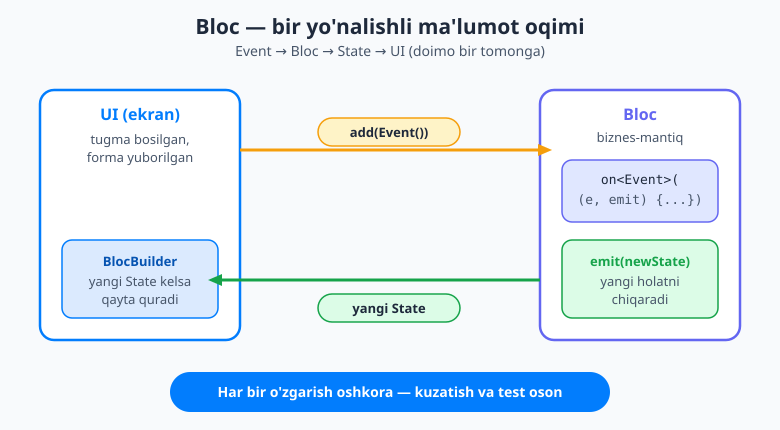
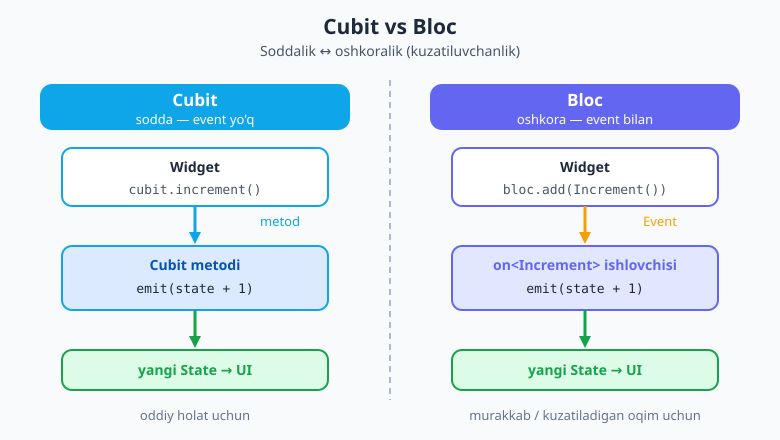
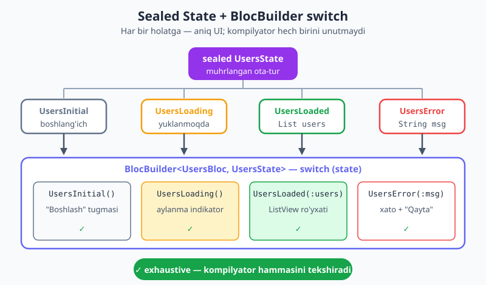

# 26 — Bloc va Cubit

[⬅️ Oldingi: 25 — Riverpod (3.x)](./25-riverpod.md) · [🏠 README](./README.md) · [Keyingi: 27 — Animatsiya ➡️](./27-animatsiya.md)

> **Bu bobda:** holatni boshqarishning yana bir mashhur — ayniqsa katta jamoalar va korxona (enterprise) loyihalarida sevimli — yondashuvi **Bloc** bilan tanishasiz. Avval uning soddaroq yarmi **Cubit** ni (`emit` bilan to'g'ridan-to'g'ri holat chiqarish), so'ng to'la **Bloc** ni (Event &#8594; ishlovchi &#8594; State) o'rganamiz. Holatni **sealed klass** bilan modellashtirishni (8-bobdagi naqsh), `BlocBuilder`/`BlocListener`/`BlocConsumer` bilan UI ni ulashni va asinxron "foydalanuvchilarni yuklash" oqimini quramiz. Oxirida Provider, Riverpod va Bloc ni taqqoslab, qaysi birini qachon tanlashni hal qilamiz.

---

## Nega aynan Bloc?

[24-bobda](./24-provider.md) Provider, [25-bobda](./25-riverpod.md) Riverpod bilan holatni (state) boshqarishni ko'rdingiz. Ularning ikkalasi ham ajoyib. Unda nega yana bir kutubxona kerak?

Tasavvur qiling: katta jamoa, o'nlab ekran, murakkab biznes-mantiq. Bunday loyihada eng og'riqli savol — **"holat nega o'zgardi?"**. Tugma bosildimi? Tarmoqdan javob keldimi? Qaysi kod bu o'zgarishni keltirib chiqardi? Provider'da har kim `notifyListeners()` ni xohlagan joyda chaqirishi mumkin — izini topish qiyinlashadi.

Bloc boshqacha qoida qo'yadi: **har bir o'zgarish oshkora va bir yo'nalishli bo'lsin**. G'oya juda sodda:

1. UI **hodisa (Event)** chiqaradi — "foydalanuvchi tugmani bosdi".
2. Bloc bu hodisani **qabul qiladi**, biznes-mantiqni bajaradi.
3. Bloc yangi **holat (State)** ni **chiqaradi (emit)**.
4. UI yangi holatga qarab **qayta quriladi**.

Ma'lumot doimo bir tomonga oqadi: UI &#8594; Event &#8594; Bloc &#8594; State &#8594; UI. Bunga **bir yo'nalishli oqim** (unidirectional data flow) deyiladi. Buning foydasi katta:

- **Bashoratli (predictable):** holat faqat `emit` orqali o'zgaradi, boshqa hech qanday "yashirin" yo'l yo'q.
- **Kuzatiladigan (traceable):** har bir Event va har bir State — alohida obyekt. Ularni jurnalga yozish, kuzatish oson.
- **Testlanadigan:** "shu Event kelsa, shu State chiqishi kerak" — toza, sof funksiya kabi sinaladi.

Bloc poydevorida **stream'lar** (oqimlar) yotadi — asinxron bobda ko'rganimizdek, oqim — vaqt o'tib kelayotgan qiymatlar ketma-ketligi. Bloc ham aslida "holatlar oqimi"ni chiqarib turadi; siz uni faqat o'rab olingan, qulay API orqali ishlatasiz, oqim mexanikasi bilan ovora bo'lmaysiz.



> **Eslatma:** "Bloc" so'zi ikki ma'noda ishlatiladi — umumiy **naqsh/kutubxona** nomi sifatida ("Bloc bilan yozish") va aniq **`Bloc` klassi** sifatida (`Cubit` ga qarama-qarshi). Kontekstdan farqlanadi; biz aniq klassni nazarda tutganda har doim koddagidek `Bloc` deb yozamiz.

### O'rnatish

Loyihaga ikki paketni qo'shamiz — `bloc` (sof Dart yadrosi) va `flutter_bloc` (Flutter vidjetlari):

```yaml
# pubspec.yaml
dependencies:
  flutter_bloc: ^9.0.0
  bloc: ^9.0.0
```

Terminalda:

```bash
flutter pub add flutter_bloc bloc
```

Keyinroq `bloc_test`, `hydrated_bloc` haqida ham qisqacha gaplashamiz.

---

## 1. Cubit — soddaroq yarmidan boshlaymiz

Bloc'ni o'rganishni **Cubit** dan boshlash to'g'ri, chunki u — Bloc'ning soddalashtirilgan ko'rinishi. Cubit'da **hodisa (event) yo'q**. Siz shunchaki **metodlar** yozasiz, ular ichida `emit` bilan yangi holat chiqarasiz. Tamom.

Klassik misol — sanagich (counter). Holat — bitta `int` (joriy son):

```dart
import 'package:flutter_bloc/flutter_bloc.dart';

// Cubit<int> — holatimiz tipi int
class CounterCubit extends Cubit<int> {
  CounterCubit() : super(0); // boshlang'ich holat: 0

  void increment() => emit(state + 1); // joriy holatga (state) 1 qo'shamiz
  void decrement() => emit(state - 1);
}
```

Bu yerda nimalar bo'lyapti?

- `Cubit<int>` — burchakli qavs ichidagi `int` bizning **holat tipimiz**. Holat istalgan tip bo'lishi mumkin: son, `String`, klass, sealed klass.
- `super(0)` — **boshlang'ich holat**. Cubit yaratilganda holat darrov `0` bo'ladi.
- `state` — har qanday joyda **joriy holat**ni o'qiydigan xossa. Uni siz qo'lda o'zgartira olmaysiz.
- `emit(...)` — **yangi holatni chiqaradigan** yagona yo'l. `emit` chaqirilgach, bu Cubit'ni tinglovchi barcha UI yangilanadi.

Diqqat: holatni faqat `emit` o'zgartiradi. `state = ...` deb yozolmaysiz — bu xato. Aynan shu cheklov holatni bashoratli qiladi.

---

## 2. Cubit ni UI ga ulash

Cubit yozildi — endi uni ekranga bog'laymiz. Uch qadam bor: **berish (provide)**, **o'qish (read)** va **qayta qurish (build)**.

### BlocProvider — Cubit ni berish

Vidjet daraxtining yuqorisida `BlocProvider` joylashtiramiz. U Cubit'ni yaratadi va undan pastdagi barcha vidjetlarga yetkazadi:

```dart
BlocProvider(
  create: (_) => CounterCubit(), // Cubit shu yerda yaratiladi
  child: const CounterPage(),
)
```

Bir nechta Cubit/Bloc kerak bo'lsa, ularni `MultiBlocProvider` ichiga yig'asiz (xuddi Provider'dagi `MultiProvider` kabi):

```dart
MultiBlocProvider(
  providers: [
    BlocProvider(create: (_) => CounterCubit()),
    BlocProvider(create: (_) => AuthCubit()),
  ],
  child: const MyApp(),
)
```

### context.read — metod chaqirish

Tugma bosilganda Cubit metodini chaqirish kerak. Buni `context.read<CounterCubit>()` orqali qilamiz — u Cubit obyektining o'zini topib beradi, lekin **qayta qurishga obuna bo'lmaydi** (shuning uchun tugma ishlovchilarida xuddi shuni ishlatamiz):

```dart
onPressed: () => context.read<CounterCubit>().increment(),
```

### BlocBuilder — holatga qarab qayta qurish

Sonni ekranga chiqarish va u o'zgarganda yangilanish uchun `BlocBuilder` ni ishlatamiz. U Cubit'ni tinglaydi va har safar yangi holat kelganda `builder` ni qayta chaqiradi:

```dart
BlocBuilder<CounterCubit, int>(
  builder: (context, state) {
    return Text('$state', style: const TextStyle(fontSize: 48));
  },
)
```

Burchakli qavslar: birinchi — qaysi Cubit/Bloc (`CounterCubit`), ikkinchi — uning holat tipi (`int`). `builder` ga keladigan `state` — aynan joriy holat.

To'liq sahifa shunday ko'rinadi:

```dart
class CounterPage extends StatelessWidget {
  const CounterPage({super.key});

  @override
  Widget build(BuildContext context) {
    return Scaffold(
      appBar: AppBar(title: const Text('Sanagich (Cubit)')),
      body: Center(
        child: BlocBuilder<CounterCubit, int>(
          builder: (context, state) =>
              Text('$state', style: const TextStyle(fontSize: 48)),
        ),
      ),
      floatingActionButton: Row(
        mainAxisAlignment: MainAxisAlignment.end,
        children: [
          FloatingActionButton(
            onPressed: () => context.read<CounterCubit>().decrement(),
            child: const Icon(Icons.remove),
          ),
          const SizedBox(width: 12),
          FloatingActionButton(
            onPressed: () => context.read<CounterCubit>().increment(),
            child: const Icon(Icons.add),
          ),
        ],
      ),
    );
  }
}
```

> **`read` va `watch` farqi:** `context.read<T>()` faqat obyektni oladi, qayta qurishni keltirib chiqarmaydi — uni `onPressed` kabi joylarda ishlating. `context.watch<T>().state` esa holatga **obuna bo'ladi** va o'zgarganda vidjetni qayta quradi — lekin amaliyotda qayta qurishni `BlocBuilder` bilan, kerakli qism atrofida cheklab qilgan ma'qul.

---

## 3. Bloc — endi event'lar bilan

Cubit'da metod to'g'ridan-to'g'ri `emit` qiladi. **Bloc** esa orada bir qatlam qo'shadi: avval **hodisa (Event)** obyekti, keyin o'sha hodisani qayta ishlaydigan **ishlovchi (handler)**. Nega bu qo'shimcha qatlam kerak? Chunki endi har bir niyat — "Increment", "Decrement", "Reset" — alohida, nomli obyekt bo'ladi. Ularni jurnalga yozish, kuzatish, qaytadan o'ynatish (replay) mumkin. Katta loyihada bu "audit izi" bebaho.

Avval hodisalarni e'lon qilamiz. Dart 3'ning **sealed klassi** ([8-bob](./08-dart3-zamonaviy.md)) bu yerga juda mos — barcha mumkin bo'lgan hodisalar bitta muhrlangan oilada:

```dart
// Hodisalar (event)
sealed class CounterEvent {}

final class Increment extends CounterEvent {}
final class Decrement extends CounterEvent {}
```

Endi Bloc'ning o'zi. Konstruktor ichida har bir hodisa tipiga `on<...>` bilan ishlovchi ro'yxatdan o'tkazamiz:

```dart
class CounterBloc extends Bloc<CounterEvent, int> {
  CounterBloc() : super(0) {
    on<Increment>((event, emit) => emit(state + 1));
    on<Decrement>((event, emit) => emit(state - 1));
  }
}
```

Diqqat qiling:

- `Bloc<CounterEvent, int>` — endi **ikki** tip kerak: hodisa tipi (`CounterEvent`) va holat tipi (`int`).
- `on<Increment>(...)` — "agar `Increment` hodisasi kelsa, mana shu funksiyani ishlat". Funksiya ikki argument oladi: `event` (hodisaning o'zi, kerak bo'lsa undagi ma'lumotni o'qiysiz) va `emit` (yangi holat chiqaradigan funksiya).
- Cubit'dagi `super(0)`, `state` va `emit` — bularning hammasi Bloc'da ham xuddi shunday ishlaydi.

UI tarafida farq faqat bitta: metod chaqirish o'rniga **hodisa qo'shamiz** — `add(...)`:

```dart
// Cubit edi:  context.read<CounterCubit>().increment();
// Bloc bo'ldi: hodisa obyektini qo'shamiz
onPressed: () => context.read<CounterBloc>().add(Increment()),
```

`BlocBuilder` esa deyarli o'zgarmaydi — faqat tipni `CounterBloc` qilamiz:

```dart
BlocBuilder<CounterBloc, int>(
  builder: (context, state) => Text('$state', style: const TextStyle(fontSize: 48)),
)
```



### Cubit'mi yoki Bloc'mi?

Aynan bitta sanagichni ikki usulda yozdik — endi farq ko'rinib turibdi. Qaysi birini tanlash kerak?

| | **Cubit** | **Bloc** |
|---|---|---|
| Hodisa (event) | yo'q — to'g'ridan-to'g'ri metod | bor — `add(Event())` |
| Kodi | kamroq, soddaroq | ko'proq "boilerplate" |
| Kuzatuv izi | metod nomi | har bir hodisa alohida obyekt |
| Qachon | oddiy holat, kam logika | murakkab, audit kerak bo'lgan oqim |

**Amaliy maslahat:** Cubit'dan boshlang. Ehtiyoj paydo bo'lganda (hodisalarni jurnalga yozish, `debounce`/`throttle` qilish, murakkab oqim) Bloc'ga o'tasiz. Cubit va Bloc'ni bitta loyihada bemalol aralash ishlatsa bo'ladi.

---

## 4. Holatni sealed klass bilan modellashtirish

Sanagichda holat — oddiy `int` edi. Lekin real ilovalarda holat ko'pincha **bir nechta turdagi** bo'ladi: "hali hech narsa yo'q", "yuklanmoqda", "ma'lumot keldi", "xato yuz berdi". Bularni bitta `bool isLoading` va bitta `String? error` bilan ifodalash chalkash va xatoga moyil — masalan, `isLoading == true` bo'la turib `error` ham to'lib qolishi mumkin.

Yechim — holatni **sealed klass** bilan modellashtirish. Har bir holat — alohida tur:

```dart
// foydalanuvchi modeli (soddalashtirilgan)
class User {
  final String name;
  User(this.name);
}

// Holatlar — muhrlangan oila
sealed class UsersState {}

final class UsersInitial extends UsersState {}            // hali boshlanmagan
final class UsersLoading extends UsersState {}            // yuklanmoqda
final class UsersLoaded extends UsersState {               // muvaffaqiyat
  final List<User> users;
  UsersLoaded(this.users);
}
final class UsersError extends UsersState {                // xato
  final String message;
  UsersError(this.message);
}
```

Endi UI'da `switch` bilan har bir holatni alohida quramiz. `UsersState` **sealed** bo'lgani uchun `switch` **exhaustive** bo'ladi — agar bir holatni unutsangiz, kompilyator darrov ogohlantiradi. Bu Bloc'ning sealed klass bilan birikkandagi "super kuchi":

```dart
BlocBuilder<UsersBloc, UsersState>(
  builder: (context, state) {
    return switch (state) {
      UsersInitial() => const Center(child: Text('Boshlash uchun tugmani bosing')),
      UsersLoading() => const Center(child: CircularProgressIndicator()),
      UsersLoaded(:final users) => ListView(
          children: [for (final u in users) ListTile(title: Text(u.name))],
        ),
      UsersError(:final message) => Center(child: Text('Xato: $message')),
    };
  },
)
```

`UsersLoaded(:final users)` — bu [8-bobdagi](./08-dart3-zamonaviy.md) **object pattern**: holat `UsersLoaded` bo'lsa, uning ichidagi `users` ro'yxatini darrov ajratib oladi. Endi har bir holat aniq UI'ga ega va birortasi ham unutilmaydi.



---

## 5. Asinxron oqim — foydalanuvchilarni yuklash

Endi hamma narsani birlashtiramiz. Real vazifa: tugma bosilganda serverdan foydalanuvchilarni yuklash. Bu yerda asinxron oqim tabiiy: avval **Loading** chiqaramiz, so'ng repozitoriyni (ma'lumotni qayerdan olishni biluvchi qatlam) kutamiz, natijada **Loaded** yoki **Error** chiqaramiz.

Avval hodisa — bitta "yukla" buyrug'i:

```dart
sealed class UsersEvent {}
final class UsersRequested extends UsersEvent {}
```

Repozitoriy — ma'lumotni qayerdan olishni biluvchi sodda klass (bu yerda taqlid qilamiz):

```dart
class UsersRepository {
  Future<List<User>> fetchUsers() async {
    await Future.delayed(const Duration(seconds: 1)); // tarmoq taqlidi
    return [User('Ali'), User('Vali'), User('Hadicha')];
  }
}
```

Endi Bloc. Ishlovchi `async` bo'ladi va jarayon davomida bir necha marta `emit` qiladi:

```dart
class UsersBloc extends Bloc<UsersEvent, UsersState> {
  final UsersRepository repo;

  UsersBloc(this.repo) : super(UsersInitial()) {
    on<UsersRequested>((event, emit) async {
      emit(UsersLoading());              // 1) "yuklanmoqda" holatini chiqaramiz
      try {
        final users = await repo.fetchUsers(); // 2) repozitoriyni kutamiz
        emit(UsersLoaded(users));        // 3a) muvaffaqiyat
      } catch (e) {
        emit(UsersError(e.toString()));  // 3b) xato
      }
    });
  }
}
```

E'tibor bering: bitta ishlovchi **bir necha marta** `emit` qilishi mumkin (avval Loading, keyin Loaded/Error). Aynan shuning uchun UI avtomatik ravishda "aylanuvchi indikator" dan "ro'yxat" ga o'tadi — siz hech qayerda qo'lda almashtirmaysiz.

UI tarafini ulaymiz. Bloc'ni beramiz va tugmaga `UsersRequested` hodisasini biriktiramiz:

```dart
class UsersPage extends StatelessWidget {
  const UsersPage({super.key});

  @override
  Widget build(BuildContext context) {
    return BlocProvider(
      create: (_) => UsersBloc(UsersRepository()),
      child: Scaffold(
        appBar: AppBar(title: const Text('Foydalanuvchilar')),
        body: BlocBuilder<UsersBloc, UsersState>(
          builder: (context, state) => switch (state) {
            UsersInitial() => const Center(child: Text('"Yukla" tugmasini bosing')),
            UsersLoading() => const Center(child: CircularProgressIndicator()),
            UsersLoaded(:final users) => ListView(
                children: [for (final u in users) ListTile(title: Text(u.name))],
              ),
            UsersError(:final message) => Center(child: Text('Xato: $message')),
          },
        ),
        floatingActionButton: Builder(
          builder: (context) => FloatingActionButton(
            onPressed: () => context.read<UsersBloc>().add(UsersRequested()),
            child: const Icon(Icons.refresh),
          ),
        ),
      ),
    );
  }
}
```

> **Nega `Builder`?** `context.read<UsersBloc>()` ishlashi uchun kontekst `BlocProvider` ostida bo'lishi kerak. Bu yerda `BlocProvider` to'g'ridan-to'g'ri `Scaffold` ustida turibdi, shuning uchun `floatingActionButton` ga `Builder` orqali yangi, "ichkaridagi" kontekst beramiz. Amalda esa sahifani ko'pincha alohida vidjetga ajratasiz va bu muammo o'z-o'zidan yo'qoladi.

---

## 6. BlocListener va BlocConsumer — yon ta'sirlar

`BlocBuilder` UI ni qayta **quradi**. Lekin ba'zi narsalarni qayta qurish kerak emas — ularni bir marta **bajarish** kerak: snackbar ko'rsatish, boshqa ekranga o'tish, dialog ochish. Bularga **yon ta'sir** (side effect) deyiladi. Buning uchun `BlocListener` bor — u holat o'zgarganda `listener` ni chaqiradi, lekin hech narsa qaytarmaydi (UI qurmaydi):

```dart
BlocListener<UsersBloc, UsersState>(
  listener: (context, state) {
    if (state is UsersError) {
      ScaffoldMessenger.of(context).showSnackBar(
        SnackBar(content: Text(state.message)),
      );
    }
  },
  child: const UsersView(),
)
```

Agar bitta joyda **ham qurish, ham yon ta'sir** kerak bo'lsa — `BlocConsumer` ikkalasini birlashtiradi:

```dart
BlocConsumer<UsersBloc, UsersState>(
  listener: (context, state) {
    if (state is UsersError) {
      ScaffoldMessenger.of(context).showSnackBar(
        SnackBar(content: Text(state.message)),
      );
    }
  },
  builder: (context, state) => switch (state) {
    UsersLoading() => const Center(child: CircularProgressIndicator()),
    _ => const UsersView(),
  },
)
```

### buildWhen va listenWhen — optimallashtirish

Ba'zan har bir holat o'zgarishida qayta qurish/tinglash shart emas. `buildWhen` (va `listenWhen`) — eski va yangi holatni solishtirib, "haqiqatan qayta qurish kerakmi?" degan savolga `bool` qaytaradigan funksiya:

```dart
BlocBuilder<CounterBloc, int>(
  // faqat son juftdan toqqa (yoki teskari) o'tganda qayta qur
  buildWhen: (previous, current) => previous.isEven != current.isEven,
  builder: (context, state) => Text('$state'),
)
```

Buni faqat o'lchab, haqiqatan zarurat bo'lganda ishlating — odatda Bloc'ning o'zi yetarlicha tejamkor.

---

## 7. Bloc ekotizimi — qisqacha

Bloc atrofida foydali yordamchi paketlar bor. Hozir chuqur kirmaymiz, lekin nomlarini bilib qo'ying:

- **`bloc_test`** — Bloc va Cubit'ni sinash uchun. `blocTest` yordamida "shu hodisa kelsa, shu holatlar ketma-ketligi chiqishi kerak" deb yozasiz:
  ```dart
  blocTest<CounterBloc, int>(
    'Increment 0 ni 1 ga oshiradi',
    build: () => CounterBloc(),
    act: (bloc) => bloc.add(Increment()),
    expect: () => [1],
  );
  ```
- **`hydrated_bloc`** — holatni avtomatik diskka saqlaydi va ilova qayta ochilganda tiklaydi (`HydratedCubit`/`HydratedBloc`). Foydalanuvchi sozlamalari, savat kabilar uchun.
- **Bloc observer** — barcha Bloc/Cubit'lardagi har bir o'zgarishni bitta joyda kuzatish (`Bloc.observer = ...`). Nosozliklarni tuzatishda (debugging) qulay: butun ilovadagi holat oqimini jurnaldan ko'rasiz.

---

## 8. Provider, Riverpod, Bloc — qaysi birini tanlash?

Mana trilogiya yakuni. Uchchalasi ham holatni boshqaradi, lekin urg'usi har xil:

| | **Provider** (24-bob) | **Riverpod** (25-bob) | **Bloc** (shu bob) |
|---|---|---|---|
| Ruhi | sodda, ergonomik | kompilyatsiyada xavfsiz, moslashuvchan | tuzilmali, hodisaga asoslangan |
| Asosiy g'oya | `InheritedWidget` ustidan qulay qatlam | global, tip-xavfsiz provayderlar | Event &#8594; State, bir yo'nalishli |
| Boilerplate | kam | o'rtacha | ko'proq (ayniqsa Bloc) |
| Kuchli tomoni | tez boshlash | xavfsizlik, sinash, ixtiyoriylik | kuzatuv izi, jamoa intizomi |
| Eng mos | kichik/o'rta ilova | yangi loyiha uchun yaxshi standart | katta jamoa, korxona, murakkab oqim |

**"Eng yaxshisi" yo'q** — loyiha va jamoaga moslab tanlanadi. Qisqa qaror yo'riqnomasi:

- Ilova kichik, tezda boshlamoqchimisiz? &#8594; **Provider** yetarli.
- Yangi loyiha, xavfsiz va moslashuvchan standart kerakmi? &#8594; **Riverpod** — ko'pchilik uchun yaxshi sukut tanlovi.
- Katta jamoa, murakkab biznes-mantiq, har bir o'zgarishni kuzatish/test qilish muhimmi? &#8594; **Bloc** — intizom va tuzilma beradi.

Eng muhimi: bittasini yaxshi o'rganing. Naqsh (UI &#8594; harakat &#8594; yangi holat &#8594; qayta qurish) hammasida bir xil — kutubxonani almashtirish keyinroq oson bo'ladi.

---

## Mashqlar

### Oson

1. O'z so'zlaringiz bilan tushuntiring: **Cubit** va **Bloc** orasidagi asosiy farq nima? Qaysi biri "hodisa (event)" tushunchasini ishlatadi?
2. `emit` nima qiladi va nega holatni `state = ...` deb to'g'ridan-to'g'ri o'zgartirib bo'lmaydi?
3. `context.read<T>()` va `context.watch<T>()` orasidagi farqni ayting. Tugmaning `onPressed` ishlovchisida qaysi birini ishlatasiz va nega?

### O'rta

4. `BlocBuilder`, `BlocListener` va `BlocConsumer` — uchalasi ham nima uchun? Snackbar ko'rsatish uchun qaysi birini ishlatish kerak va nega `BlocBuilder` emas?
5. Sanagich uchun `ResetEvent` qo'shing: Bloc'ga `Reset` hodisasini va uning `on<Reset>` ishlovchisini yozing (holatni `0` ga qaytarsin), so'ng UI'da uni qo'shadigan tugmani ko'rsating.
6. Quyidagi holat modeli sealed klass bilan qayta yozilsin va nega bu yaxshiroq ekanini tushuntiring:
   ```dart
   class State {
     bool isLoading;
     List<User>? users;
     String? error;
   }
   ```

### Qiyin

7. `UsersBloc` ning asinxron ishlovchisi nega bir nechta `emit` chaqiradi? Tartibni (qaysi holat birinchi, qaysi keyin) tushuntiring va `try/catch` ning roli nimada?
8. Bir o'quvchi `BlocBuilder` ichidagi `switch` ga `default:` qo'shmoqchi. Nega sealed holatda buni qilmaslik **afzal**? Agar keyinchalik yangi holat (`UsersEmpty`) qo'shilsa, `default` borligi qanday muammoga olib keladi?
9. Loyihangizda holatni boshqarish uchun Provider, Riverpod va Bloc'dan birini tanlashingiz kerak. Loyihangizni qisqa tasvirlang (hajmi, jamoa, murakkablik) va tanlovingizni asoslang. "Eng yaxshisi yo'q" degani nimani anglatadi?

<details markdown="1"><summary>Yechimlar</summary>

**1.** **Cubit** — hodisasiz: siz to'g'ridan-to'g'ri **metod** chaqirasiz (`increment()`), u esa `emit` qiladi. **Bloc** — orada **hodisa (Event)** qatlami bor: UI `add(Increment())` bilan hodisa qo'shadi, `on<Increment>` ishlovchisi uni qabul qilib `emit` qiladi. Demak hodisa tushunchasini **Bloc** ishlatadi. Cubit soddaroq, Bloc esa har bir niyatni alohida, kuzatiladigan obyektga aylantiradi.

**2.** `emit(yangiHolat)` — yangi holatni chiqaradi va shu Cubit/Bloc'ni tinglayotgan barcha UI (masalan `BlocBuilder`) ni qayta quradi. `state = ...` deb to'g'ridan-to'g'ri o'zgartirib bo'lmaydi, chunki `state` faqat o'qiladigan xossa — bu **ataylab** qilingan cheklov. Holat faqat `emit` orqali, bitta nazorat nuqtasidan o'zgarsa, har bir o'zgarish bashoratli va kuzatiladigan bo'ladi.

**3.** `context.read<T>()` obyektni oladi, lekin holatga **obuna bo'lmaydi** (qayta qurmaydi). `context.watch<T>()` esa obuna bo'ladi va holat o'zgarganda vidjetni qayta quradi. `onPressed` ishlovchisida **`read`** ni ishlatamiz — chunki u `build` paytida emas, faqat tugma bosilganda bir marta chaqiriladi; u yerda obuna kerak emas (va `build` ichida `watch` chaqirmaganimiz uchun `watch` bu yerda noo'rin bo'lardi).

**4.** **`BlocBuilder`** — holatga qarab UI **quradi** (qayta chizadi). **`BlocListener`** — holat o'zgarganda bir martalik **yon ta'sir** bajaradi (snackbar, navigatsiya, dialog) va UI qurmaydi. **`BlocConsumer`** — ikkalasini birlashtiradi. Snackbar uchun **`BlocListener`** (yoki `BlocConsumer`ning `listener` qismi) kerak, `BlocBuilder` emas — chunki `BlocBuilder` qayta qurish uchun, snackbar esa qayta quriladigan UI emas, balki bir martalik harakat. Uni `builder` ichida chaqirsangiz, har qurishda (masalan ekran aylanganda) takror ko'rsatilib qolishi mumkin.

**5.** Hodisa va ishlovchi:
```dart
final class Reset extends CounterEvent {}

// CounterBloc konstruktori ichida:
on<Reset>((event, emit) => emit(0));
```
UI'dagi tugma:
```dart
FloatingActionButton(
  onPressed: () => context.read<CounterBloc>().add(Reset()),
  child: const Icon(Icons.restart_alt),
)
```

**6.** Sealed klass bilan:
```dart
sealed class UsersState {}
final class UsersInitial extends UsersState {}
final class UsersLoading extends UsersState {}
final class UsersLoaded extends UsersState {
  final List<User> users;
  UsersLoaded(this.users);
}
final class UsersError extends UsersState {
  final String message;
  UsersError(this.message);
}
```
Bu yaxshiroq, chunki eski modelda **mumkin bo'lmagan** holatlar yuzaga kelishi mumkin: masalan `isLoading == true` bo'la turib `users` ham, `error` ham to'lib qolishi — bu mantiqan ziddiyat. Sealed modelda har bir holat **bir-birini istisno qiladi** (faqat bittasi bo'la oladi), `switch` esa exhaustive bo'lib, birorta holatni unutib qoldirsangiz kompilyator ogohlantiradi.

**7.** Asinxron ishlovchi bir necha `emit` qiladi, chunki jarayon **bosqichma-bosqich**: avval `emit(UsersLoading())` — UI darrov aylanuvchi indikator ko'rsatadi; keyin `await repo.fetchUsers()` bilan natijani kutadi; muvaffaqiyatda `emit(UsersLoaded(users))`, xatoda `emit(UsersError(...))`. Tartib: **Loading &#8594; (Loaded yoki Error)**. `try/catch` — tarmoq/server xatosini tutib, ilovani qulatish o'rniga uni `UsersError` holatiga aylantiradi; shunda UI xatoni chiroyli ko'rsatadi va foydalanuvchi qayta urinishi mumkin.

**8.** `default` qo'shmaslik afzal, chunki sealed klass + `default`siz `switch` **exhaustive** bo'ladi — barcha holatlar qamralganini **kompilyator** tekshiradi. Agar `default` qo'shsangiz, yangi holat (`UsersEmpty`) qo'shilganda kompilyator **ogohlantirmaydi** — `UsersEmpty` jimgina `default` ga tushib ketadi va siz uchun mo'ljallanmagan UI ko'rsatiladi (yashirin xato). `default`siz esa kompilyator "`UsersEmpty` qamralmagan" deb darrov xato beradi va siz uni ataylab qayta ishlashga majbur bo'lasiz. Sealed klassning butun kuchi shunda.

**9.** Namuna javob: *"Loyiham — 4 kishilik jamoa quradigan o'rta-katta savdo ilovasi; ko'p ekran, murakkab buyurtma/to'lov oqimi, har bir holat o'zgarishini kuzatish va test qilish muhim. Shuning uchun **Bloc** ni tanlayman — hodisaga asoslangan tuzilma jamoaga yagona intizom beradi va `bloc_test` bilan biznes-mantiqni ishonchli sinaymiz."* — Asoslash to'g'ri bo'lsa, har qanday tanlov qabul qilinadi. **"Eng yaxshisi yo'q"** degani: har bir kutubxonaning kuchli tomoni boshqa kontekstda eng mos keladi — kichik ilovaga Bloc ortiqcha murakkablik, katta jamoaga esa Provider yetarli intizom bermasligi mumkin. To'g'ri tanlov — loyiha hajmi, jamoa va murakkablikka bog'liq, mavhum "yaxshilik"ka emas.

</details>

---

[⬅️ Oldingi: 25 — Riverpod (3.x)](./25-riverpod.md) · [🏠 README](./README.md) · [Keyingi: 27 — Animatsiya ➡️](./27-animatsiya.md)
