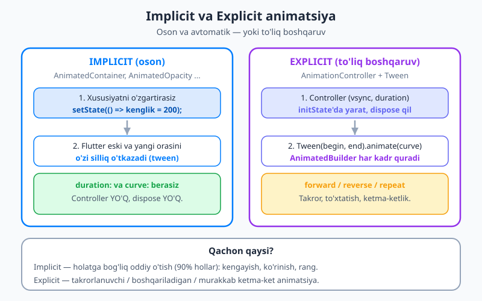
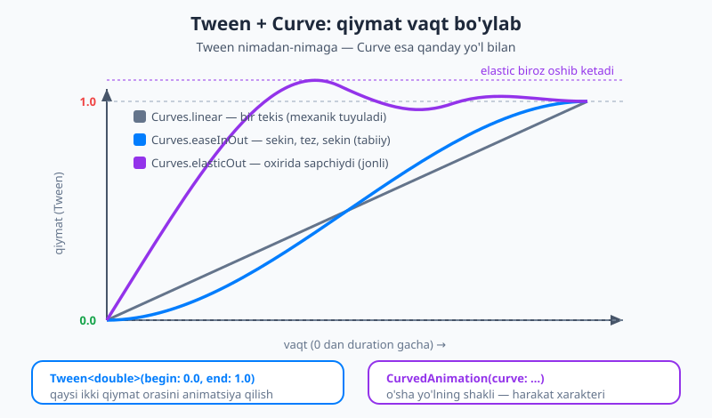
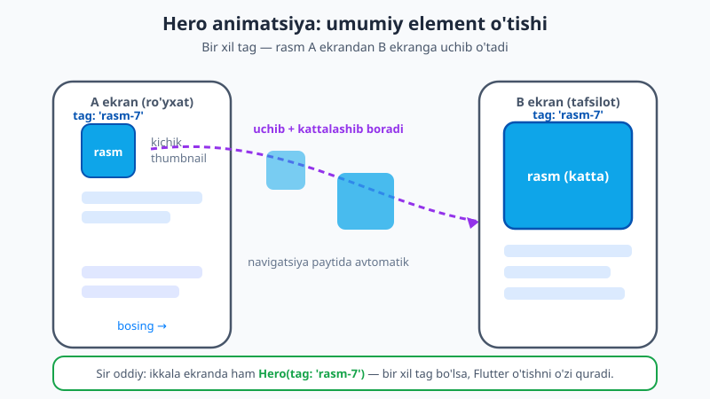

# 27 — Animatsiya

[⬅️ Oldingi: 26 — Bloc va Cubit](./26-bloc-cubit.md) · [🏠 README](./README.md) · [Keyingi: 28 — Platforma, paketlar va moslashuv ➡️](./28-platforma-paketlar.md)

---

> **Bu bobda:** ilovangizga **harakat** olib kiramiz. Avval **nega** animatsiya kerakligini — u e'tiborni yo'naltirishi, holat o'zgarishini tushuntirishi va ilovani "jonli" qilishini ko'ramiz, hamda asosiy qoidani o'rganamiz: animatsiya **bezak uchun emas, xabar uchun**. So'ng eng oson yo'l — **implicit (yashirin) animatsiyalar** bilan boshlaymiz: `AnimatedContainer`, `AnimatedOpacity`, `AnimatedSwitcher`, `TweenAnimationBuilder` — xususiyatni `setState` bilan o'zgartirasiz, qolganini Flutter o'zi qiladi. Keyin **egri chiziqlar (curves)** harakatga qanday "xarakter" berishini, **Hero** animatsiyasi ekranlar orasida rasmni qanday "uchirishini" ko'ramiz. Undan keyin **explicit (oshkor) animatsiyalar** — `AnimationController`, `Tween`, `AnimatedBuilder` bilan to'liq boshqaruvni qo'lga olamiz. Birgalikda **animatsiyalangan like-tugma**, **Hero rasm o'tishi** va **pulsatsiyalanuvchi yuklagich (loader)** quramiz. Oxirida **qaysi birini tanlash**, mashhur **paketlar** (`flutter_animate`, `lottie`, `rive`) va **unumdorlik bilan qulaylik (accessibility)** haqida gaplashamiz.

---

## Nega animatsiya?

Tasavvur qiling: tugmani bosdingiz va ekran **birdaniga** boshqa holatga "sakrab" o'tdi. Ko'z nima o'zgarganini ilg'amay qoladi — "nima bo'ldi?" degan savol tug'iladi. Endi tasavvur qiling: o'sha o'zgarish **silliq**, chorak soniyada amalga oshdi. Ko'z harakatni kuzatadi, miya esa "ha, ana u narsa shu yerga ko'chdi" deb tushunadi. Mana shu — animatsiyaning asosiy vazifasi.

Animatsiya uch ishni qiladi:

- **e'tiborni yo'naltiradi** — yangi paydo bo'lgan element silliq kirib kelsa, ko'z o'sha yerga qaraydi;
- **holat o'zgarishini tushuntiradi** — element A holatdan B holatga o'tganini ko'rsatadi (masalan, kichik rasm kattalashib tafsilot sahifasiga aylanadi);
- **ilovani jonli va sayqallangan qiladi** — silliq harakat ilovani "qimmat" va ishonchli ko'rsatadi.

Flutter animatsiyalarni **Impeller** grafik dvigateli yordamida sekundiga 60 yoki 120 kadr (fps) tezlikda chizadi — ya'ni harakat **silliq**, "sakramaydi".

> 💡 **Eng muhim qoida:** animatsiya — **xabar berish vositasi, bezak emas**. "Chiroyli ko'rinsin" deb hamma narsani aylantirib, sakratib yubormang. Yaxshi animatsiya **nozik va tez** bo'ladi (odatda 200–400 millisekund). Foydalanuvchi uni ko'pincha "sezmaydi" — shunchaki ilova "to'g'ri" tuyuladi.

Flutter'da animatsiyaning **ikki xil yo'li** bor, va biz aynan oson birinchisidan boshlaymiz.



## Implicit (yashirin) animatsiyalar — shu yerdan boshlang

**Implicit animatsiya** — bu eng oson yo'l, va aksariyat ehtiyojlaringizni qoplaydi. G'oya juda sodda: maxsus `Animated...` widgetlar bor, ularning biror xususiyatini (kenglik, rang, shaffoflik...) `setState` bilan o'zgartirsangiz, ular yangi qiymatga **birdan sakramay**, **silliq o'tadi**. Siz hech qanday kontroller yaratmaysiz, hech narsani `dispose` qilmaysiz — Flutter hammasini o'zi qiladi.

Eng mashhuri — **`AnimatedContainer`**. U oddiy `Container`'ga o'xshaydi, lekin qo'shimcha `duration:` (qancha vaqtda o'tsin) va ixtiyoriy `curve:` (qanday yo'l bilan) oladi:

```dart
class KengayuvchiKarta extends StatefulWidget {
  const KengayuvchiKarta({super.key});

  @override
  State<KengayuvchiKarta> createState() => _KengayuvchiKartaState();
}

class _KengayuvchiKartaState extends State<KengayuvchiKarta> {
  bool kengmi = false; // HOLAT

  @override
  Widget build(BuildContext context) {
    return GestureDetector(
      onTap: () => setState(() => kengmi = !kengmi), // holatni almashtiramiz
      child: AnimatedContainer(
        duration: const Duration(milliseconds: 300), // 0.3 soniyada o'tsin
        curve: Curves.easeInOut,                      // silliq egri chiziq
        width: kengmi ? 280 : 140,   // holatga qarab kenglik o'zgaradi
        height: 140,
        decoration: BoxDecoration(
          color: kengmi ? const Color(0xFF027DFD) : const Color(0xFF94A3B8),
          borderRadius: BorderRadius.circular(16),
        ),
        alignment: Alignment.center,
        child: const Text('Bosing', style: TextStyle(color: Colors.white)),
      ),
    );
  }
}
```

E'tibor bering — biz **hech qanday animatsiya kodini yozmadik**. Faqat `width` va `color`ni `setState` ichida o'zgartirdik. `AnimatedContainer` eski qiymat (140) va yangi qiymat (280) orasini 300 millisekundda **o'zi to'ldiradi** (bu to'ldirish jarayoni **tween** deyiladi — "between", ya'ni "oraliq"). Bu `UI = f(holat)` g'oyasining ([16-bob](./16-statefulwidget-setstate.md)) animatsiyalangan ko'rinishi: holatni o'zgartirasiz, qolganini Flutter qiladi.

### Implicit oilasi

`AnimatedContainer` yolg'iz emas — butun bir oila bor. Har biri ma'lum bir xususiyatni animatsiya qiladi:

- **`AnimatedOpacity`** — shaffoflikni (`opacity: 0.0` ↔ `1.0`) silliq o'zgartiradi: ko'rinish/yo'qolish (fade).
- **`AnimatedAlign`** — bolani bir joydan boshqa joyga silliq suradi (`alignment:`).
- **`AnimatedPadding`** — ichki bo'shliqni (padding) silliq o'zgartiradi.
- **`AnimatedPositioned`** — `Stack` ichida bolaning o'rnini (`top/left/...`) silliq ko'chiradi.
- **`AnimatedDefaultTextStyle`** — matn uslubini (o'lcham, rang) silliq o'zgartiradi.
- **`AnimatedSwitcher`** — bir widgetdan boshqasiga **kesishib o'tadi** (cross-fade): eskisini yo'qotib, yangisini ko'rsatadi.

Mana `AnimatedOpacity` bilan oddiy "yoqib-o'chirish" (fade toggle):

```dart
class XiraToggle extends StatefulWidget {
  const XiraToggle({super.key});

  @override
  State<XiraToggle> createState() => _XiraToggleState();
}

class _XiraToggleState extends State<XiraToggle> {
  bool korinadimi = true; // HOLAT

  @override
  Widget build(BuildContext context) {
    return Column(
      children: [
        AnimatedOpacity(
          opacity: korinadimi ? 1.0 : 0.0, // holatga qarab shaffoflik
          duration: const Duration(milliseconds: 400),
          child: const FlutterLogo(size: 120),
        ),
        TextButton(
          onPressed: () => setState(() => korinadimi = !korinadimi),
          child: Text(korinadimi ? 'Yashir' : 'Ko\'rsat'),
        ),
      ],
    );
  }
}
```

**`AnimatedSwitcher`** esa — bitta widgetni boshqasiga almashtirganda foydali. Masalan, yuklanish indikatoridan natijaga o'tish:

```dart
AnimatedSwitcher(
  duration: const Duration(milliseconds: 300),
  child: yuklanmoqda
      ? const CircularProgressIndicator(key: ValueKey('loader'))
      : const Icon(Icons.check, key: ValueKey('done'), size: 48),
)
```

> 💡 **Diqqat:** `AnimatedSwitcher` ikki bolani **farqlay olishi** uchun har biriga boshqa-boshqa `key:` bering (masalan `ValueKey('loader')` va `ValueKey('done')`). Aks holda Flutter ularni "bir xil widget" deb biladi va kesishuvni (cross-fade) ko'rsatmaydi.

### `TweenAnimationBuilder` — istalgan qiymatni bir marta animatsiya qilish

Ba'zan tayyor `Animated...` widget yo'q — masalan, sonni `0` dan `100` gacha "sanab" ko'rsatmoqchisiz. **`TweenAnimationBuilder`** aynan shu uchun: `Tween` berasiz, u qiymatni `begin`'dan `end`'gacha animatsiya qiladi va har kadrda `builder`ni chaqiradi:

```dart
TweenAnimationBuilder<double>(
  tween: Tween(begin: 0, end: 100),
  duration: const Duration(seconds: 1),
  builder: (context, qiymat, child) {
    return Text(qiymat.toStringAsFixed(0), // 0, 1, 2 ... 100
        style: const TextStyle(fontSize: 32, fontWeight: FontWeight.bold));
  },
)
```

## Curves — harakatning "xarakteri"

Yuqorida `curve: Curves.easeInOut` ni ko'rdik. **Curve (egri chiziq)** — bu animatsiya **qanday yo'l bilan** o'tishini belgilaydi: tekis tezlikdami, sekin boshlab tezlashadimi, oxirida "sapchiydimi". Animatsiya muddati (`duration`) bir xil bo'lsa ham, curve uning **xarakterini** butunlay o'zgartiradi.



Diagrammada ko'rinib turibdi: bir xil vaqt ichida `linear` to'g'ri chiziq bilan (bir tekis, biroz "mexanik"), `easeInOut` esa sekin boshlab, o'rtada tezlashib, oxirida yana sekinlashadi (tabiiy harakatga o'xshaydi) — va `elasticOut` oxirida biroz oshib ketib, "sapchib" joyiga qaytadi (jonli, o'ynoqi). Eng ko'p ishlatiladiganlari:

- **`Curves.easeInOut`** — universal, tabiiy. Shubhalansangiz shuni tanlang.
- **`Curves.easeOut`** — tez boshlab, oxirida sekinlashadi (yangi element kirib kelishida yaxshi).
- **`Curves.elasticOut`** — sapchib turadigan, o'ynoqi (like-tugma kabi e'tibor tortuvchi joylarda).
- **`Curves.bounceOut`** — koptokdek sakrab to'xtaydi.

Curve'ni istalgan implicit `Animated...` widgetga (`curve:`) yoki explicit animatsiyaga (`CurvedAnimation` orqali, pastda ko'ramiz) berishingiz mumkin.

## Hero — ekranlar orasidagi umumiy element

Endi eng **ta'sirli, lekin eng oson** animatsiyalardan biri. Tasavvur qiling: ro'yxatda kichik rasm (thumbnail) bor, foydalanuvchi unga bosadi va tafsilot sahifasi ochiladi. **Hero** animatsiyasi shu kichik rasmni katta rasmga **uchirib, kattalashtirib** o'tkazadi — go'yo bitta rasm ekrandan ekranga "ko'chgandek". Bu **umumiy element o'tishi** (shared element transition) deyiladi.

Sehri shunday oddiy: ikkala ekranda ham rasmni **`Hero`** widgetiga o'rab, **bir xil `tag`** berasiz. Flutter navigatsiya ([19-bob](./19-navigatsiya-navigator.md) — Navigator) paytida bir xil tag'li `Hero`'larni **o'zi topib bog'laydi** va o'tishni quradi.



```dart
// A ekran (ro'yxat) — kichik rasm
GestureDetector(
  onTap: () => Navigator.push(
    context,
    MaterialPageRoute(builder: (_) => const TafsilotEkran()),
  ),
  child: const Hero(
    tag: 'rasm-7', // <-- bir xil tag
    child: Icon(Icons.image, size: 60),
  ),
);

// B ekran (tafsilot) — katta rasm
class TafsilotEkran extends StatelessWidget {
  const TafsilotEkran({super.key});

  @override
  Widget build(BuildContext context) {
    return Scaffold(
      body: Center(
        child: Hero(
          tag: 'rasm-7', // <-- AYNAN o'sha tag
          child: const Icon(Icons.image, size: 220),
        ),
      ),
    );
  }
}
```

Xolos! Ikkala `Hero`'da `tag: 'rasm-7'` bir xil bo'lgani uchun, A'dan B'ga o'tganda rasm avtomatik ravishda uchib kattalashadi, orqaga qaytganda esa kichrayib joyiga qaytadi.

> 💡 **Diqqat:** bir ekrandagi `tag`'lar **takrorlanmasligi** kerak — har bir Hero'ning tag'i o'sha ekranda **noyob** bo'lsin. Ro'yxatda ko'p rasm bo'lsa, tag'ga element ID'sini qo'shing: `tag: 'rasm-${element.id}'`.

## Explicit (oshkor) animatsiyalar — to'liq boshqaruv

Implicit animatsiya 90% hollarni qoplaydi, lekin u **bir martalik, holatga bog'liq** o'tishlar uchun. Ba'zan sizga ko'proq kerak bo'ladi: **takrorlanuvchi** animatsiya (doimiy pulsatsiya), **to'xtatib-davom ettiriladigan** harakat, yoki **murakkab ketma-ketlik**. Bularning hammasini boshqarish uchun **explicit animatsiya** bor — uning yuragi **`AnimationController`**.

`AnimationController` — bu animatsiyaning "dvigateli": u 0.0 dan 1.0 gacha qiymatni siz bergan `duration` davomida o'zgartiradi va `forward()` (oldinga), `reverse()` (orqaga), `repeat()` (takror) bilan boshqariladi.

Controller uchun ikki narsa muhim:

1. Unga **`vsync`** kerak — bu "ekran kadrlari bilan sinxronlash" manbai. U uchun State'ingizga **`SingleTickerProviderStateMixin`** ni (bitta controller bo'lsa) "aralashtirasiz" (mixin). Mixin nima ekanini [7-bobda](./07-oop-asoslari.md) ko'rgansiz — bu klassga tayyor xulq-atvor "qo'shadigan" usul. (Bir nechta controller kerak bo'lsa, `TickerProviderStateMixin` ishlatiladi.)
2. U resurs egallaydi, shuning uchun [16-bobdagi](./16-statefulwidget-setstate.md) qoidaga amal qiling: **`initState`'da yarating, `dispose`'da `dispose()` qiling.** Aks holda — xotira oqimi.

Controller bizga 0.0–1.0 oralig'idagi "xom" qiymat beradi. Uni kerakli oraliqqa (masalan 0.8–1.2 o'lcham) va kerakli curve'ga aylantirish uchun **`Tween`** va **`CurvedAnimation`** ishlatamiz, natijani esa **`AnimatedBuilder`** orqali ekranga chizamiz (`AnimatedBuilder` har kadrda qayta quradi).

Mana to'liq misol — **pulsatsiyalanuvchi yuklagich** (doimiy "nafas oluvchi" doira):

```dart
import 'package:flutter/material.dart';

class PulsatsiyaLoader extends StatefulWidget {
  const PulsatsiyaLoader({super.key});

  @override
  State<PulsatsiyaLoader> createState() => _PulsatsiyaLoaderState();
}

// 1) mixin — vsync uchun (7-bobdagi mixin tushunchasi)
class _PulsatsiyaLoaderState extends State<PulsatsiyaLoader>
    with SingleTickerProviderStateMixin {
  late final AnimationController _controller;
  late final Animation<double> _olcham;

  @override
  void initState() {
    super.initState();
    // 2) controllerni initState'da YARATAMIZ
    _controller = AnimationController(
      vsync: this, // mixin shu 'this'ni vsync qila oladi
      duration: const Duration(milliseconds: 800),
    )..repeat(reverse: true); // oldinga-orqaga doimiy takror

    // 3) 0.0-1.0 ni 0.8-1.2 ga aylantiramiz + curve beramiz
    _olcham = Tween<double>(begin: 0.8, end: 1.2).animate(
      CurvedAnimation(parent: _controller, curve: Curves.easeInOut),
    );
  }

  @override
  Widget build(BuildContext context) {
    // 4) AnimatedBuilder har kadrda qayta quradi
    return AnimatedBuilder(
      animation: _olcham,
      builder: (context, child) {
        return Transform.scale(
          scale: _olcham.value, // joriy qiymat (0.8 dan 1.2 gacha)
          child: child,         // child qayta qurilmaydi — tejamkor
        );
      },
      child: Container(
        width: 80,
        height: 80,
        decoration: const BoxDecoration(
          color: Color(0xFF027DFD),
          shape: BoxShape.circle,
        ),
      ),
    );
  }

  @override
  void dispose() {
    _controller.dispose(); // 5) controllerni TOZALAYMIZ — shart!
    super.dispose();
  }
}
```

Bu yerda muhim naqshlar:

- **`..repeat(reverse: true)`** — controllerni darhol takror ishga tushiradi; `reverse: true` uni oldinga (0.8→1.2) va orqaga (1.2→0.8) yuritadi, natijada "nafas olish" effekti chiqadi. `forward()` faqat oldinga bir marta yuradi, `reverse()` orqaga qaytaradi.
- **`AnimatedBuilder`'ning `child:`** — animatsiya qilinmaydigan qism (bu yerda `Container`) `child`ka beriladi va har kadrda qayta qurilmaydi. Bu unumdorlik uchun foydali naqsh.
- Aylantirish (`Transform.rotate`) yoki o'lcham (`Transform.scale`) — bular **arzon** amallar (GPU darajasida), shuning uchun ravon ishlaydi.

> 💡 **Ketma-ket (staggered) animatsiya** — bitta controllerdan bir nechta `Tween` chiqarib, har biriga `Interval(0.0, 0.5)` kabi vaqt oralig'ini berib, elementlarni **navbatma-navbat** animatsiya qilish mumkin. Bu ilg'or mavzu; hozircha shuni bilib qo'ying: bitta controller bir nechta harakatni boshqara oladi.

## Qaysi birini tanlash?

Oddiy qoida:

- **Implicit** (`AnimatedContainer` va oilasi) — holatga bog'liq **oddiy, bir martalik** o'tishlar uchun. Ehtiyojlaringizning ~90% i. Kontroller yo'q, dispose yo'q, kam kod.
- **Explicit** (`AnimationController`) — **takrorlanuvchi**, **boshqariladigan** (to'xtatish/davom ettirish) yoki **murakkab ketma-ket** animatsiyalar uchun. Ko'proq kod, lekin to'liq nazorat.

Maslahat: **doim implicit'dan boshlang.** Faqat implicit yetmasagina (masalan, doimiy aylanuvchi yuklagich kerak bo'lsa) explicit'ga o'ting.

## Paketlar (qisqacha)

Standart vositalardan tashqari, qulay paketlar ham bor:

- **`flutter_animate`** — zamonaviy, **deklarativ** uslub: animatsiyalarni zanjir qilib yozasiz. Juda qisqa va o'qish oson:
  ```dart
  const Text('Salom').animate().fadeIn(duration: 300.ms).slideY(begin: 0.2);
  ```
  Ko'p hollarda explicit controller yozishdan qutqaradi.
- **`lottie`** — dizaynerlar **After Effects**'da yaratgan animatsiyalarni (JSON fayl) ilovada o'ynatadi. Murakkab, illyustrativ animatsiyalar (yuklanish, bo'sh holat rasmlari) uchun ideal.
- **`rive`** — **interaktiv** vektor animatsiyalari: holatga reaksiya bildiradigan (masalan, bosilganda o'zgaradigan) animatsiyalar. O'yinsimon UI uchun.

Qachon paketga murojaat qilish kerak? Standart `Animated...` widgetlar va `flutter_animate` aksariyat ehtiyojni qoplaydi. Tayyor, "dizaynerona" murakkab animatsiya kerak bo'lsa — `lottie`/`rive` ga qarang.

## Unumdorlik va qulaylik (accessibility)

Animatsiya silliq va hammabop bo'lishi uchun:

- **`Transform` va `Opacity`ni afzal ko'ring** — bularni GPU arzon bajaradi. Har kadrda `width`/`height` ni qayta hisoblatadigan og'ir layout o'zgarishlardan ehtiyot bo'ling.
- **Har kadrda og'ir ish qilmang** — `AnimatedBuilder`/`builder` ichida tarmoq so'rovi, fayl o'qish yoki katta hisob-kitob qilmang. U sekundiga 60+ marta chaqiriladi.
- **Muddatni qisqa tuting** — 200–400 ms. Uzoq animatsiya foydalanuvchini kuttiradi va bezovta qiladi.
- **Reduced-motion (kam harakat) sozlamasini hurmat qiling.** Ba'zi foydalanuvchilar tizim sozlamalarida animatsiyalarni o'chiradi (vestibulyar sezgirlik tufayli). Buni tekshiring:
  ```dart
  final harakatYoq = MediaQuery.of(context).disableAnimations;
  // harakatYoq == true bo'lsa — animatsiyani o'tkazib yuboring
  // yoki muddatni Duration.zero qiling.
  ```
  Shuningdek, `MediaQuery.of(context).accessibleNavigation` — ekran o'quvchisi (screen reader) yoqilganini bildiradi; bunday holda ham animatsiyani soddalashtiring.

## Keyingi qadam

Tabriklaymiz — endi ilovangiz nafaqat **jonli** ([16-bob](./16-statefulwidget-setstate.md)), balki **silliq va sayqallangan** ham! Siz implicit animatsiyalar bilan oddiy o'tishlarni (`AnimatedContainer`, `AnimatedOpacity`, `AnimatedSwitcher`, `TweenAnimationBuilder`), curve'lar bilan harakat xarakterini, `Hero` bilan ekranlararo umumiy element o'tishini va explicit `AnimationController` bilan to'liq boshqariladigan animatsiyalarni o'rgandingiz. Eng muhimi — animatsiya **xabar uchun, nozik va tez** bo'lishi kerakligini bilib oldingiz.

Keyingi [28-bobda](./28-platforma-paketlar.md) ilovani turli **platformalarga** (Android, iOS, veb, desktop) moslashtirish, paketlardan foydalanish va ekran o'lchamlariga moslashuvchan (responsive) UI qurishni ko'ramiz.

---

## Mashqlar

### Oson

1. O'z so'zlaringiz bilan ayting: implicit va explicit animatsiyaning farqi nimada? Har biriga bittadan misol-widget keltiring va qaysi biri kontroller talab qilishini ayting.
2. Animatsiyaning asosiy qoidasi — "bezak emas, xabar". Bu nimani anglatadi? Tipik animatsiya muddati qancha bo'lishi tavsiya etiladi?
3. `AnimatedContainer`'ga qaysi ikki "qo'shimcha" parametr beriladi (oddiy `Container`'da yo'q)? Har biri nima qiladi?
4. `Curves.linear`, `Curves.easeInOut` va `Curves.elasticOut` orasidagi farqni so'z bilan tasvirlang. Qaysi birini "shubhalansangiz" tanlash kerak?

### O'rta

5. To'liq, kompilyatsiya bo'ladigan `StatefulWidget` yozing: bosilganda kvadrat 100×100 dan 200×200 ga **silliq** kengayib-toraysin. Faqat **implicit** animatsiya va `setState` ishlating. `duration` va `curve` bering.
6. `AnimatedSwitcher` ishlatib, tugma bosilganda `CircularProgressIndicator` va `Icon(Icons.check)` orasida kesishib (cross-fade) o'tadigan kichik widget yozing. Nega har bir bolaga alohida `key:` kerakligini bir jumlada izohlang.
7. Ikki ekran orasida `Hero` animatsiyasi qurish uchun nima qilish kerak? Minimal kod yozing (A ekranda kichik, B ekranda katta rasm) va `tag` haqidagi asosiy qoidani ayting.

### Qiyin

8. Explicit animatsiya yozing: ikona **doimiy** aylanib tursin (yuklanish belgisi kabi). `AnimationController`, `SingleTickerProviderStateMixin`, `AnimatedBuilder` va `Transform.rotate` ishlating. `initState`/`dispose` to'g'ri bo'lsin. Nega `dispose` shartligini izohlang.
9. `AnimatedBuilder`'da `child:` parametrini berishning unumdorlik bo'yicha foydasi nimada? Bir jumlada tushuntiring.
10. Qulaylik (accessibility): foydalanuvchi tizimda animatsiyalarni o'chirgan bo'lsa, buni ilovada qanday aniqlaysiz va nima qilasiz? Kod parchasi bilan ko'rsating.

<details markdown="1"><summary>Yechimlar</summary>

**1.** **Implicit** animatsiyada siz widgetning xususiyatini (`width`, `color`, `opacity`) `setState` bilan o'zgartirasiz va Flutter eski-yangi qiymat orasini **o'zi silliq o'tkazadi** — kontroller **kerak emas**. Misol: `AnimatedContainer`, `AnimatedOpacity`. **Explicit** animatsiyada esa `AnimationController` yaratib, har kadrni **o'zingiz boshqarasiz** (forward/reverse/repeat) — kontroller **kerak** va uni `dispose` qilish shart. Misol: `AnimationController` + `AnimatedBuilder`.

**2.** "Bezak emas, xabar" — animatsiya shunchaki "chiroyli ko'rinish" uchun emas, balki **nima o'zgarganini tushuntirish, e'tiborni yo'naltirish** uchun bo'lishi kerak. Ortiqcha, har joyda harakat foydalanuvchini chalg'itadi. Tavsiya etilgan muddat — **200–400 millisekund** (nozik va tez).

**3.** `duration:` — animatsiya qancha vaqtda (masalan 300 ms) amalga oshishini belgilaydi. `curve:` — o'tish **qanday yo'l bilan** (tezlik xarakteri) bo'lishini belgilaydi (masalan `Curves.easeInOut`). Bu ikkisi `AnimatedContainer`'ni oddiy `Container`'dan farqlaydi.

**4.** `Curves.linear` — bir tekis tezlik, biroz "mexanik" tuyuladi. `Curves.easeInOut` — sekin boshlab, o'rtada tezlashib, oxirida yana sekinlashadi (tabiiy harakat). `Curves.elasticOut` — oxirida biroz oshib ketib "sapchib" joyiga qaytadi (o'ynoqi, e'tibor tortuvchi). Shubhalansangiz — **`Curves.easeInOut`** ni tanlang.

**5.**
```dart
import 'package:flutter/material.dart';

class KengayuvchiKvadrat extends StatefulWidget {
  const KengayuvchiKvadrat({super.key});
  @override
  State<KengayuvchiKvadrat> createState() => _KengayuvchiKvadratState();
}

class _KengayuvchiKvadratState extends State<KengayuvchiKvadrat> {
  bool kattami = false;

  @override
  Widget build(BuildContext context) {
    return GestureDetector(
      onTap: () => setState(() => kattami = !kattami),
      child: AnimatedContainer(
        duration: const Duration(milliseconds: 300),
        curve: Curves.easeInOut,
        width: kattami ? 200 : 100,
        height: kattami ? 200 : 100,
        color: const Color(0xFF027DFD),
      ),
    );
  }
}
```

**6.**
```dart
AnimatedSwitcher(
  duration: const Duration(milliseconds: 300),
  child: yuklanmoqda
      ? const CircularProgressIndicator(key: ValueKey('loader'))
      : const Icon(Icons.check, key: ValueKey('done'), size: 48),
)
```
Har bir bolaga alohida `key:` kerak, chunki `AnimatedSwitcher` shu kalit orqali ikki bolani **farqlaydi**; kalitsiz Flutter ularni "bir xil widget" deb biladi va kesishuvni (cross-fade) ko'rsatmaydi.

**7.** Ikkala ekranda ham rasmni `Hero` widgetiga o'rab, **bir xil `tag`** berish kerak. Navigatsiya paytida Flutter bir xil tag'li `Hero`'larni topib, rasmni biridan ikkinchisiga uchirib o'tkazadi.
```dart
// A ekran (kichik)
Hero(tag: 'rasm-7', child: Icon(Icons.image, size: 60));
// B ekran (katta)
Hero(tag: 'rasm-7', child: Icon(Icons.image, size: 220));
```
Asosiy qoida: bitta ekrandagi tag'lar **noyob** bo'lishi kerak (takrorlanmasin).

**8.**
```dart
import 'package:flutter/material.dart';

class AylanuvchiIkona extends StatefulWidget {
  const AylanuvchiIkona({super.key});
  @override
  State<AylanuvchiIkona> createState() => _AylanuvchiIkonaState();
}

class _AylanuvchiIkonaState extends State<AylanuvchiIkona>
    with SingleTickerProviderStateMixin {
  late final AnimationController _controller;

  @override
  void initState() {
    super.initState();
    _controller = AnimationController(
      vsync: this,
      duration: const Duration(seconds: 1),
    )..repeat(); // doimiy aylanish
  }

  @override
  Widget build(BuildContext context) {
    return AnimatedBuilder(
      animation: _controller,
      builder: (context, child) {
        return Transform.rotate(
          angle: _controller.value * 2 * 3.1415926, // 0 dan to'liq aylanagacha
          child: child,
        );
      },
      child: const Icon(Icons.refresh, size: 48),
    );
  }

  @override
  void dispose() {
    _controller.dispose();
    super.dispose();
  }
}
```
`dispose` shart, chunki `AnimationController` resurs (kadr "tikeri") egallaydi; uni tozalamasak, widget o'chsa ham controller ishlashda davom etadi — bu **xotira oqimi** (memory leak).

**9.** `AnimatedBuilder`'ning `child:` parametriga animatsiya qilinmaydigan (o'zgarmas) qismni berasiz; u **bir marta** quriladi va har kadrda **qayta qurilmaydi** — `builder` faqat o'zgaruvchan o'rashni (masalan `Transform`) qayta quradi. Bu har kadrda kamroq ish bajarib, animatsiyani **ravon** qiladi.

**10.** `MediaQuery.of(context).disableAnimations` orqali aniqlanadi — u `true` bo'lsa, foydalanuvchi tizimda animatsiyalarni o'chirgan. Bunday holda animatsiyani o'tkazib yuborish yoki muddatni `Duration.zero` qilish kerak:
```dart
final harakatYoq = MediaQuery.of(context).disableAnimations;
return AnimatedContainer(
  duration: harakatYoq ? Duration.zero : const Duration(milliseconds: 300),
  curve: Curves.easeInOut,
  width: kengmi ? 280 : 140,
  // ...
);
```
Shu yo'l bilan harakatga sezgir foydalanuvchilarga (vestibulyar sezgirlik) hurmat ko'rsatamiz.

</details>

---

[⬅️ Oldingi: 26 — Bloc va Cubit](./26-bloc-cubit.md) · [🏠 README](./README.md) · [Keyingi: 28 — Platforma, paketlar va moslashuv ➡️](./28-platforma-paketlar.md)
