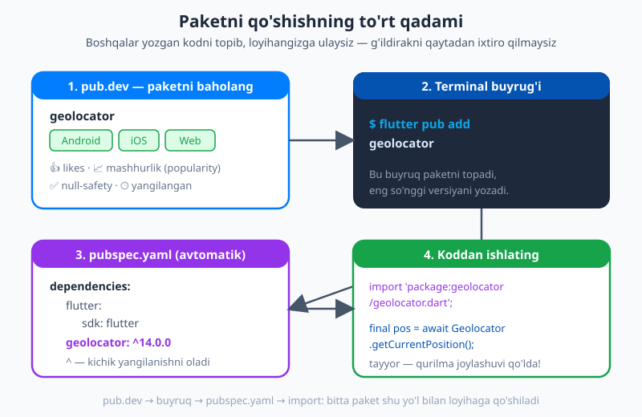
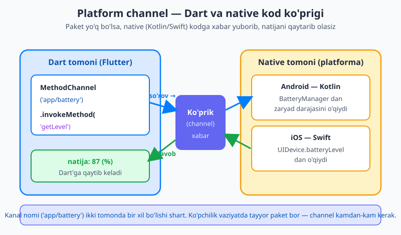
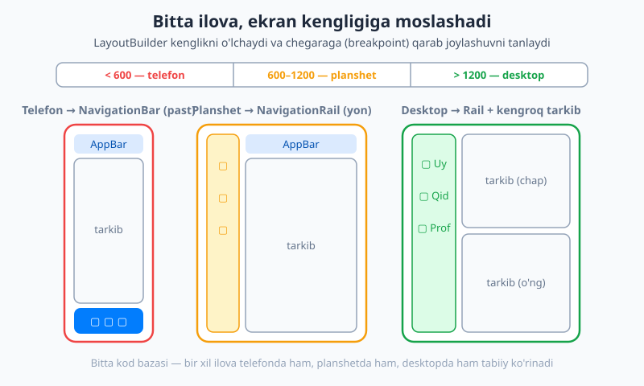

# 28 — Platforma, paketlar va moslashuv

[⬅️ Oldingi: 27 — Animatsiya](./27-animatsiya.md) · [🏠 README](./README.md) · [Keyingi: 29 — Testing, debugging va ishlab chiqarish ➡️](./29-testing-performance.md)

---

> **Bu bobda:** shu paytgacha siz Flutter'ning "ichki dunyosi"da ishladingiz — widgetlar, holat, navigatsiya, animatsiya. Endi ilovangizni **tashqi dunyoga** ulaymiz. Avval **paketlar va pub.dev** ekotizimi bilan tanishamiz: `flutter pub add` qanday ishlaydi, `pubspec.yaml`dagi versiya cheklovlari (`^`), va yaxshi paketni qanday tanlash kerak. So'ng **qurilma imkoniyatlari**ni paketlar orqali ishlatamiz — `image_picker` (kamera/galereya), `geolocator` (joylashuv), `url_launcher`, `permission_handler` (ruxsatlar). Keyin **platform channel** g'oyasi bilan tanishamiz — paket bo'lmaganda native (Kotlin/Swift) kodga murojaat qilish. Undan keyin **moslashuvchi (responsive) va adaptiv dizayn** — telefon, planshet, desktop va orientatsiyaga moslashish. Oxirida **xalqarolashtirish (i18n)** — ilovani ikki tilda qilish — va **qulaylik (accessibility)** — ilovani hamma uchun ishlatsa bo'ladigan qilish. Bu bob keng, lekin har bir mavzu amaliy va loyihangizga darhol kerak bo'ladi.

---

## Nega paketlar? G'ildirakni qaytadan ixtiro qilmang

Tasavvur qiling: ilovangizga foydalanuvchi suratini galereyadan tanlash imkoniyati kerak. Buni noldan yozish — kamera ruxsatlari, Android va iOS uchun alohida native kod, fayl yo'llarini boshqarish — bir necha kunlik mehnat. Ammo kimdir buni allaqachon yozib, sinab, minglab ilovalarda ishlatgan va **bepul** ulashgan. Siz uni bir buyruq bilan loyihangizga qo'shasiz.

Bu **paket** (package) — boshqalar yozgan, qayta ishlatsa bo'ladigan kod to'plami. Flutter'ning paket do'koni — **[pub.dev](https://pub.dev)** — minglab paketni saqlaydi. Bu xuddi JavaScript'dagi npm yoki Python'dagi PyPI'ga o'xshaydi: nima kerak bo'lsa, ehtimol kimdir uni yozib qo'ygan.

> 💡 **Nega o'zingiz yozmaysiz?** Yaxshi paket yuzlab odam tomonidan sinalgan, turli qurilmalarda tekshirilgan va doimiy yangilanib turadi. Sizning bir kunda yozgan kodingiz hech qachon shu darajaga yetolmaydi. Dasturlashda "tayyor yechimni ishlatish" — dangasalik emas, **donolik**.

## `pubspec.yaml` — ilovangizning pasporti

Har bir Flutter loyihasida `pubspec.yaml` nomli fayl bor. Bu — loyihangizning **pasporti**: nomi, versiyasi, bog'liqliklari (paketlari), shrift va rasm (asset)lari shu yerda e'lon qilinadi. Eng muhim qismi — `dependencies`:

```yaml
name: mening_ilovam
description: Birinchi Flutter ilovam.
version: 1.0.0

environment:
  sdk: ^3.10.0

dependencies:
  flutter:
    sdk: flutter
  http: ^1.5.0          # tarmoq paketi (21-bobdan tanish)

dev_dependencies:
  flutter_test:
    sdk: flutter
  flutter_lints: ^6.0.0  # faqat ishlab chiqishda kerak
```

Ikki turdagi bog'liqlik bor:

- **`dependencies`** — ilovangiz **ishlash** uchun kerak bo'lgan paketlar (`http`, `geolocator`). Ular tayyor ilovaga ham qo'shiladi.
- **`dev_dependencies`** — faqat **ishlab chiqish** paytida kerak bo'lganlar (test paketlari, linter, kod generatorlari). Ular tayyor ilovaga **kirmaydi**, shuning uchun uning hajmini oshirmaydi.

> ⚠️ `pubspec.yaml` — YAML formatida. Bu yerda **bo'shliqlar (indentatsiya) muhim**: tab ishlatmang, har bosqichda 2 ta bo'shliq qo'ying. Bitta noto'g'ri bo'shliq butun faylni buzadi.

## Paketni qo'shish: `flutter pub add`

Paketni qo'lda `pubspec.yaml`ga yozish o'rniga, eng oson yo'l — terminalda buyruq berish. Loyiha papkasida:

```bash
flutter pub add geolocator
```

Bu buyruq uch ishni qiladi: paketning eng so'nggi mos versiyasini topadi, uni `pubspec.yaml`ning `dependencies`iga yozadi, va yuklab oladi. Faylga shunday qator qo'shiladi:

```yaml
dependencies:
  geolocator: ^14.0.0
```

`dev_dependencies`ga qo'shish uchun `--dev` bayrog'ini qo'shing:

```bash
flutter pub add --dev build_runner
```

Agar siz `pubspec.yaml`ni **qo'lda** tahrirlasangiz (masalan, hamkasbingizning loyihasini ochib), paketlarni yuklash uchun:

```bash
flutter pub get
```

`flutter pub add` aslida `flutter pub get`ni o'zi chaqiradi, shuning uchun ko'pincha `add` yetarli. `pub get` — loyihani birinchi marta klonlaganingizda yoki faylni qo'lda o'zgartirganingizda kerak bo'ladi.



### Versiya cheklovlari: `^` belgisi nimani anglatadi?

`geolocator: ^14.0.0` dagi `^` (karet) belgisi muhim. U "**14.0.0 va undan yuqori, lekin 15.0.0 dan past**" degani. Ya'ni:

- `14.0.1`, `14.3.0`, `14.9.9` — **mumkin** (kichik yangilanishlar, xatolar tuzatilishi).
- `15.0.0` — **mumkin emas** (katta versiya, buzuvchi o'zgarishlar bo'lishi mumkin).

Bu **semantik versiya** (semantic versioning) qoidasi: `KATTA.KICHIK.TUZATISH`. Katta raqam o'zgarsa — eski kod buzilishi mumkin; kichik raqam — yangi imkoniyat (eski kod ishlaydi); oxirgisi — xato tuzatish. `^` belgisi sizni avtomatik xato tuzatishlar bilan ta'minlaydi, lekin kutilmagan buzilishlardan himoya qiladi.

> 💡 `flutter pub upgrade` paketlarni cheklov ichida eng yangiga ko'taradi. `flutter pub outdated` esa qaysi paketlar eskirganini ko'rsatadi — vaqti-vaqti bilan tekshirib turing.

### pub.dev sahifasini qanday o'qish kerak

[pub.dev](https://pub.dev)da paket sahifasiga kirganingizda quyidagilarga e'tibor bering — bu sizga paket **ishonchli**ligini baholashga yordam beradi:

- **Platformalar** — paket sahifasida qaysi platformalar (Android, iOS, Web, Windows, macOS, Linux) qo'llab-quvvatlanishi yozadi. Sizning ilovangiz veb-da ham ishlashi kerak bo'lsa, paket Web'ni qo'llab-quvvatlashini tekshiring.
- **Likes (yoqtirishlar)** va **popularity (mashhurlik)** — ko'p odam ishlatadigan paket odatda yaxshiroq sinalgan.
- **Pub Points** — pub.dev'ning avtomatik baho-ochkosi (hujjat, null-safety, kod sifati bo'yicha).
- **Oxirgi yangilanish sanasi** — paket faol qo'llab-quvvatlanayotganini ko'rsatadi. 2-3 yil yangilanmagan paketdan ehtiyot bo'ling.
- **Null-safety** — zamonaviy paketlar null-safety'ni qo'llab-quvvatlaydi (6-bobni eslang). Deyarli barcha hozirgi paketlar buni qiladi.

> ⚠️ Paket tanlashda "eng birinchi qidiruv natijasi"ni ko'r-ko'rona olmang. Platformalar, mashhurlik va oxirgi yangilanishni tekshiring. Notanish, kam ishlatiladigan paket loyihangizga keyinchalik bosh og'rig'i bo'lishi mumkin.

## Qurilma imkoniyatlaridan foydalanish

Endi paketlarni amalda ishlatamiz. Telefonning haqiqiy imkoniyatlari — kamera, joylashuv, telefon qo'ng'irog'i — uchun maxsus paketlar bor. Mana eng ko'p ishlatiladiganlari:

| Paket | Nima qiladi |
|---|---|
| **`image_picker`** | Galereyadan rasm tanlash yoki kamera bilan suratga olish |
| **`geolocator`** | Qurilmaning GPS joylashuvini olish |
| **`url_launcher`** | Havola, telefon raqami yoki email'ni ochish |
| **`permission_handler`** | Ish vaqtidagi (runtime) ruxsatlarni so'rash va tekshirish |
| **`connectivity_plus`** | Internet aloqasi bor-yo'qligini bilish (Wi-Fi/mobil/yo'q) |
| **`camera`** | Ilova ichida to'liq kamera oqimini boshqarish |
| **`shared_preferences`** | Kichik sozlamalarni qurilmada saqlash |
| **`package_info_plus`** / **`device_info_plus`** | Ilova versiyasi / qurilma haqida ma'lumot |

### Misol: galereyadan rasm tanlash (`image_picker`)

Avval paketni qo'shamiz:

```bash
flutter pub add image_picker
```

So'ng foydalanish — galereyadan rasm tanlash:

```dart
import 'package:image_picker/image_picker.dart';

final picker = ImagePicker();

Future<void> rasmTanla() async {
  final XFile? rasm = await picker.pickImage(source: ImageSource.gallery);
  if (rasm == null) return; // foydalanuvchi bekor qildi
  print('Tanlangan fayl: ${rasm.path}');
  // rasm.path orqali uni Image.file(...) bilan ko'rsatishingiz mumkin
}
```

`ImageSource.gallery` o'rniga `ImageSource.camera` bersangiz, kamera ochiladi. `XFile?` — tanlangan fayl (`null` bo'lsa, foydalanuvchi bekor qilgan; har doim tekshiring).

### Misol: joriy joylashuvni olish (`geolocator`)

```dart
import 'package:geolocator/geolocator.dart';

Future<Position?> joylashuvniOl() async {
  // 1) Joylashuv xizmati (GPS) yoqilganmi?
  final yoqilgan = await Geolocator.isLocationServiceEnabled();
  if (!yoqilgan) return null;

  // 2) Ruxsatni tekshirish va so'rash
  var ruxsat = await Geolocator.checkPermission();
  if (ruxsat == LocationPermission.denied) {
    ruxsat = await Geolocator.requestPermission();
    if (ruxsat == LocationPermission.denied) return null;
  }
  if (ruxsat == LocationPermission.deniedForever) return null;

  // 3) Joylashuvni olish
  return await Geolocator.getCurrentPosition();
}
```

E'tibor bering: joylashuvni **so'rashdan oldin** uch narsani tekshiramiz — GPS yoqilganmi, ruxsat bormi, agar yo'q bo'lsa so'raymiz. Bu naqsh (pattern) deyarli barcha qurilma imkoniyatlarida takrorlanadi.

### Misol: tashqi havola, telefon, email (`url_launcher`)

```dart
import 'package:url_launcher/url_launcher.dart';

// Veb-sahifa ochish
await launchUrl(Uri.parse('https://ioqil.uz'));

// Telefon raqamini terish
await launchUrl(Uri.parse('tel:+998901234567'));

// Email yozish
await launchUrl(Uri.parse('mailto:salom@misol.uz'));
```

`Uri.parse(...)` matnni manzilga aylantiradi; `tel:`, `mailto:`, `https:` — turli sxemalar. Telefon qurilmasi shu sxemaga mos ilovani ochadi.

### ⚠️ Eng muhim qoida: ruxsatlarni e'lon qiling

Kamera, joylashuv, mikrofon kabi imkoniyatlardan foydalanish uchun **ikki narsa** kerak:

**1) Platforma fayllarida e'lon qilish.** Android'da bu `android/app/src/main/AndroidManifest.xml`:

```xml
<uses-permission android:name="android.permission.ACCESS_FINE_LOCATION"/>
<uses-permission android:name="android.permission.CAMERA"/>
```

iOS'da bu `ios/Runner/Info.plist` — bu yerda foydalanuvchiga ko'rinadigan **sabab** ham yoziladi:

```xml
<key>NSLocationWhenInUseUsageDescription</key>
<string>Yaqin atrofdagi do'konlarni ko'rsatish uchun joylashuvingiz kerak.</string>
<key>NSCameraUsageDescription</key>
<string>Profil rasmingizni olish uchun kameradan foydalanamiz.</string>
```

**2) Ish vaqtida (runtime) so'rash.** Zamonaviy telefonlarda ilova o'rnatilganida emas, balki **kerak bo'lganda** ruxsat so'raladi. Yuqoridagi `geolocator` misolida buni ko'rdik. Murakkabroq holatlar uchun `permission_handler` paketi yagona, qulay interfeys beradi:

```dart
import 'package:permission_handler/permission_handler.dart';

final holat = await Permission.camera.request();
if (holat.isGranted) {
  // ruxsat berildi — kamerani ishlat
} else if (holat.isPermanentlyDenied) {
  // foydalanuvchi "boshqa so'rama" dedi — sozlamalarni ochishni taklif qil
  await openAppSettings();
}
```

> 💡 **Esda tuting:** ruxsatni faqat platforma faylida e'lon qilsangiz, ish vaqtida so'ramaysiz — ilova ishlamaydi (yoki qulaydi). Ikkalasini ham qiling. Va har doim foydalanuvchi **rad etishi mumkin**ligini hisobga oling — kodingiz buni boshqarishi shart.

## Platform channel — paket bo'lmaganda

99% holatda kerakli imkoniyat uchun tayyor paket topiladi. Lekin ba'zan juda maxsus narsa kerak bo'ladi (masalan, kompaniyangizning xususiy qurilmasi bilan ishlash), va paket yo'q. Shunda siz **native kod**ga (Android uchun Kotlin, iOS uchun Swift) to'g'ridan-to'g'ri murojaat qilishingiz mumkin — buning ko'prigi **platform channel** deyiladi.

G'oyasi oddiy: Dart tomoni va native tomoni **xabarlar** orqali gaplashadi. Dart "menga batareya darajasini ber" deb xabar yuboradi, native kod javob qaytaradi:

```dart
import 'package:flutter/services.dart';

// Ikkala tomon ham bir xil kanal nomini bilishi kerak
const battery = MethodChannel('app/battery');

Future<int> batareyaDarajasi() async {
  // 'getLevel' — native tomonda biz yozadigan metod nomi
  final int daraja = await battery.invokeMethod('getLevel');
  return daraja;
}
```

Native tomonda (masalan Android — Kotlin) `'getLevel'` so'rovini qabul qilib, batareya darajasini o'qib qaytaradigan kod yoziladi. Bu kitob doirasidan tashqarida, lekin g'oyani tushunish muhim: **kanal nomi** (`'app/battery'`) va **metod nomi** (`'getLevel'`) ikki tomonda **bir xil** bo'lishi kerak — aks holda xabar manzilini topmaydi.



> 💡 **Boshlovchi uchun amaliy maslahat:** platform channel — ilg'or mavzu. Deyarli har doim avval pub.dev'da tayyor paket qidiring. Channel'ni faqat haqiqatan paket yo'q bo'lganda va siz native kod yoza oladigan paytda ishlatasiz. Uni bu yerda eslab qo'yganimizning sababi — Flutter'ning native qurilma bilan qanday "gaplashishi"ni tushunishingiz uchun.

## Moslashuvchi (responsive) va adaptiv dizayn

Hozirgacha ilovamiz, ehtimol, faqat telefon ekranida yaxshi ko'ringan. Lekin Flutter bir kod bilan telefon, **planshet**, **buklanadigan** (foldable), **veb** va **desktop**da ishlaydi. Bularning ekran o'lchami juda har xil. Ilovangiz katta ekranda ham yaxshi ko'rinishi uchun unga **moslashuvchi** bo'lishni o'rgatish kerak.

Ikki yaqin tushunchani ajratamiz:

- **Responsive (moslashuvchi)** — *o'lcham* o'zgarganda joylashuv o'zgaradi. Masalan, telefonda bir ustun, planshetda ikki ustun.
- **Adaptive (adaptiv)** — *platforma* yoki kontekstga mos **boshqa komponent** ishlatiladi. Masalan, telefonda pastki menyu (`NavigationBar`), planshetda yon menyu (`NavigationRail`).

Amalda ikkalasini birga ishlatasiz. Asboblarimiz:

### `MediaQuery` — ekran haqida ma'lumot

`MediaQuery` — joriy ekran haqidagi ma'lumotlar manbai: o'lcham, orientatsiya, xavfsiz hududlar (notch), matn kattaligi:

```dart
final media = MediaQuery.of(context);
final kenglik = media.size.width;       // ekran kengligi (piksellarda)
final balandlik = media.size.height;
final orientatsiya = media.orientation;  // portrait yoki landscape
final tepaPadding = media.padding.top;   // status bar / notch balandligi
```

### `LayoutBuilder` — ota cheklovini o'qish

`MediaQuery` butun **ekran** o'lchamini beradi. `LayoutBuilder` esa **ota-widget** bergan joyni (constraints) o'qiydi — bu ko'pincha aniqroq, chunki sizning widget'ingiz ekranning faqat bir qismini egallashi mumkin. Buni [13-bobda](./13-layout-stack-constraints.md) ko'rgansiz:

```dart
LayoutBuilder(
  builder: (context, constraints) {
    if (constraints.maxWidth < 600) {
      return const TelefonKorinishi(); // tor joy
    } else {
      return const KengKorinishi();    // keng joy
    }
  },
)
```

### Breakpoint'lar (chegaralar)

Ekran kengligi bo'yicha "telefon / planshet / desktop"ni ajratish uchun **chegara qiymatlar** (breakpoints) ishlatiladi. Material dizayn tavsiyasiga yaqin amaliy chegaralar:

```dart
enum Qurilma { telefon, planshet, desktop }

Qurilma qurilmaTuri(double kenglik) {
  if (kenglik < 600) return Qurilma.telefon;
  if (kenglik < 1200) return Qurilma.planshet;
  return Qurilma.desktop;
}
```



### Adaptiv navigatsiya: `NavigationBar` ↔ `NavigationRail`

Endi amalda quramiz: tor ekranda pastki menyu (`NavigationBar`), keng ekranda yon menyu (`NavigationRail`). Bu — adaptiv dizaynning klassik misoli:

```dart
class AdaptivKorinish extends StatefulWidget {
  const AdaptivKorinish({super.key});

  @override
  State<AdaptivKorinish> createState() => _AdaptivKorinishState();
}

class _AdaptivKorinishState extends State<AdaptivKorinish> {
  int _tanlangan = 0;

  // Uchta bo'lim uchun oddiy sahifalar
  final _sahifalar = const [
    Center(child: Text('Uy')),
    Center(child: Text('Qidiruv')),
    Center(child: Text('Profil')),
  ];

  @override
  Widget build(BuildContext context) {
    return LayoutBuilder(
      builder: (context, constraints) {
        final keng = constraints.maxWidth >= 600;

        if (keng) {
          // KENG: yon NavigationRail + tarkib yonma-yon
          return Scaffold(
            body: Row(
              children: [
                NavigationRail(
                  selectedIndex: _tanlangan,
                  onDestinationSelected: (i) =>
                      setState(() => _tanlangan = i),
                  labelType: NavigationRailLabelType.all,
                  destinations: const [
                    NavigationRailDestination(
                        icon: Icon(Icons.home), label: Text('Uy')),
                    NavigationRailDestination(
                        icon: Icon(Icons.search), label: Text('Qidiruv')),
                    NavigationRailDestination(
                        icon: Icon(Icons.person), label: Text('Profil')),
                  ],
                ),
                const VerticalDivider(width: 1),
                Expanded(child: _sahifalar[_tanlangan]),
              ],
            ),
          );
        } else {
          // TOR: pastki NavigationBar
          return Scaffold(
            body: _sahifalar[_tanlangan],
            bottomNavigationBar: NavigationBar(
              selectedIndex: _tanlangan,
              onDestinationSelected: (i) =>
                  setState(() => _tanlangan = i),
              destinations: const [
                NavigationDestination(icon: Icon(Icons.home), label: 'Uy'),
                NavigationDestination(
                    icon: Icon(Icons.search), label: 'Qidiruv'),
                NavigationDestination(
                    icon: Icon(Icons.person), label: 'Profil'),
              ],
            ),
          );
        }
      },
    );
  }
}
```

Diqqat qiling: **tanlangan indeks (`_tanlangan`) bitta** — telefonda ham, planshetda ham bir xil holat ishlatiladi. Faqat **ko'rinish** o'zgaradi. Bu — adaptiv dizaynning go'zalligi: bir mantiq, ikki tashqi ko'rinish.

> 💡 **Sinash:** desktop yoki veb-da ilovani ishga tushirib, oynani sichqoncha bilan torayting-kengaytiring. 600px chegarasidan o'tganda menyu pastdan yonga (yoki teskari) o'tib turishini ko'rasiz. `OrientationBuilder` esa shunga o'xshash, lekin **orientatsiya** (portret/landshaft) o'zgarganda ishlaydi.

## Xalqarolashtirish (i18n) — ilovani ko'p tilda qilish

Ilovangizni o'zbek va ingliz tillarida ko'rsatmoqchimisiz? Buni **i18n** (internationalization — "xalqarolashtirish", 18 ta harf orasida bo'lgani uchun shunday qisqartiriladi) deyiladi. Matnlarni kodga to'g'ridan-to'g'ri yozish o'rniga, ularni alohida **til fayllari**ga ajratasiz, Flutter esa qurilma tiliga qarab to'g'risini tanlaydi.

### 1-qadam: paketlarni qo'shish

```yaml
dependencies:
  flutter:
    sdk: flutter
  flutter_localizations:
    sdk: flutter
  intl: any
```

Va `pubspec.yaml`ga generatsiyani yoqamiz:

```yaml
flutter:
  generate: true
```

### 2-qadam: ARB fayllari (tarjimalar)

Loyihada `lib/l10n/` papkasini yarating va har bir til uchun bitta **ARB** fayl (`.arb` — JSON'ga o'xshash format). Ingliz tili — `app_en.arb`:

```json
{
  "greeting": "Hello!",
  "itemCount": "{count, plural, =0{No items} =1{1 item} other{{count} items}}",
  "@itemCount": {
    "placeholders": { "count": { "type": "int" } }
  }
}
```

O'zbek tili — `app_uz.arb`:

```json
{
  "greeting": "Salom!",
  "itemCount": "{count, plural, =0{Element yo'q} =1{1 ta element} other{{count} ta element}}"
}
```

`itemCount` — **ko'plik** (plural) misoli: `count` qiymatiga qarab to'g'ri shakl tanlanadi. `{count}` — **o'rin tutuvchi** (placeholder), unga haqiqiy son qo'yiladi.

### 3-qadam: kod generatsiya qilish

```bash
flutter gen-l10n
```

Bu buyruq ARB fayllaridan `AppLocalizations` klassini avtomatik yaratadi. (Agar `generate: true` qo'ygan bo'lsangiz, `flutter run` paytida ham avtomatik ishlaydi.)

### 4-qadam: `MaterialApp`ga ulash

```dart
import 'package:flutter/material.dart';
import 'package:flutter_localizations/flutter_localizations.dart';
import 'package:flutter_gen/gen_l10n/app_localizations.dart';

MaterialApp(
  localizationsDelegates: AppLocalizations.localizationsDelegates,
  supportedLocales: AppLocalizations.supportedLocales, // [en, uz]
  // locale: const Locale('uz'), // majburan bitta tilni qo'yish (ixtiyoriy)
  home: const BoshSahifa(),
)
```

### 5-qadam: matnlardan foydalanish

Endi kodda matnni `AppLocalizations`dan olasiz:

```dart
@override
Widget build(BuildContext context) {
  final l10n = AppLocalizations.of(context)!;
  return Column(
    children: [
      Text(l10n.greeting),         // "Salom!" yoki "Hello!"
      Text(l10n.itemCount(5)),     // "5 ta element" / "5 items"
    ],
  );
}
```

`AppLocalizations.of(context)!` — joriy tilga mos tarjimalarni beradi. Qurilma tili o'zbek bo'lsa — o'zbekcha, ingliz bo'lsa — inglizcha matn chiqadi. **Sehr shu yerda:** matn endi bir joyda (ARB fayl), kodda esa faqat kalit (`greeting`).

> 💡 **RTL (o'ngdan-chapga) qo'llab-quvvatlash.** Arab yoki ibroniy kabi o'ngdan-chapga yoziladigan tillar uchun Flutter `Directionality`ni **avtomatik** boshqaradi: `Row`, `padding`'dagi `start`/`end` to'g'ri tomonga aylanadi. Shuning uchun `left`/`right` o'rniga `start`/`end` (masalan `EdgeInsetsDirectional`) ishlatish — yaxshi odat.

## Qulaylik (accessibility, a11y) — ilovani hamma uchun

**Qulaylik** (accessibility, qisqacha **a11y**) — ilovangizni ko'rish, eshitish yoki harakat qiyinchiligi bor odamlar ham ishlata olishini ta'minlash. Bu nafaqat insoniy mas'uliyat, balki App Store va Google Play talablariga ham kiradi. Yaxshi xabar: Flutter buning ko'p qismini avtomatik qiladi, sizdan esa bir nechta odatlar talab etiladi.

### Ekran o'quvchilarga (screen reader) yordam: `Semantics`

Ko'zi ojiz foydalanuvchilar **ekran o'quvchi** (Android'da TalkBack, iOS'da VoiceOver) bilan ishlaydi — u ekrandagi narsalarni ovoz bilan o'qib beradi. Matnli widgetlarni Flutter o'zi tushuntiradi, lekin **rasm** yoki **ikonka** tugmasi nima ekanini bilmaydi. Shuning uchun ularga **yorliq** (label) berasiz:

```dart
// Rasm uchun semanticLabel:
Image.asset('rasmlar/logo.png', semanticLabel: 'Kompaniya logotipi')

// Ikonka uchun:
Icon(Icons.favorite, semanticLabel: 'Sevimlilarga qo\'shilgan')

// Murakkabroq holat uchun Semantics widgeti:
Semantics(
  label: 'Yangi xabar yozish',
  button: true,
  child: GestureDetector(
    onTap: _yozish,
    child: const Icon(Icons.edit),
  ),
)
```

Aksincha, bezak uchun (hech qanday ma'no bermaydigan) rasmni ekran o'quvchidan **yashirish** kerak bo'lsa — `ExcludeSemantics`:

```dart
ExcludeSemantics(child: Image.asset('rasmlar/bezak.png'))
```

### Matn kattaligini hurmat qiling: `textScaler`

Ko'zi xira foydalanuvchilar telefon sozlamalarida matnni kattalashtiradi. Agar siz balandlikni qattiq belgilab qo'ysangiz (`SizedBox(height: 40)` ichida katta matn), matn sig'maydi va kesiladi. Yechim: **qattiq balandlik bermang**, matnga o'sishiga ruxsat bering. Joriy masshtabni `MediaQuery`dan o'qishingiz mumkin:

```dart
final masshtab = MediaQuery.textScalerOf(context);
```

> ⚠️ Eng keng tarqalgan a11y xatosi — matn o'lchamini kattalashtirgan foydalanuvchida buziladigan dizayn. Sinash uchun: telefon sozlamalarida shrift o'lchamini eng kattaga qo'ying va ilovangizni tekshiring — hamma narsa ko'rinib turibdimi?

### Yetarli kontrast va katta bosish maydoni

- **Rang kontrasti.** Matn va orqa fon orasida yetarli farq bo'lishi kerak (och kulrang fonda och kulrang matn — yomon). WCAG tavsiyasi: oddiy matn uchun kamida 4.5:1 kontrast nisbati.
- **Bosish maydoni (tap target).** Tugmalar va bosiladigan elementlar kamida **48×48 piksel** bo'lishi kerak — aks holda barmoq bilan aniq bosish qiyin. Material widgetlari (`IconButton`, `ElevatedButton`) buni odatda o'zi ta'minlaydi.

### Birlashtirib: qulay rasm-tugma

Mana, hammasini birlashtirgan kichik misol — qulay (accessible) rasm-tugma:

```dart
Semantics(
  label: 'Profil rasmini o\'zgartirish',
  button: true,
  child: InkWell(
    onTap: _rasmTanla,
    child: Padding(
      padding: const EdgeInsets.all(12), // 48x48 ga yetkazadi
      child: const Icon(Icons.camera_alt, size: 24),
    ),
  ),
)
```

Bunda: `Semantics` ekran o'quvchiga "Profil rasmini o'zgartirish, tugma" deydi; `Padding` bosish maydonini 48×48 ga yetkazadi; `InkWell` bosilganda to'lqin effekti beradi. Bir nechta qator — katta foyda.

> 💡 **Nega bu muhim?** Dunyoda milliardlab odam u yoki bu darajada qulaylik imkoniyatlariga muhtoj. Ilovangiz ularni ham qamrab olsa — siz auditoriyangizni kengaytirasiz **va** to'g'ri ish qilasiz. Bundan tashqari, App Store/Play Store ilovani tekshirganda a11y'ni hisobga oladi.

## Birgalikda: keng, ko'p tilli va qulay ilova

Endi o'rgangan uch g'oyani bitta `MaterialApp`da birlashtiramiz — adaptiv navigatsiya (`AdaptivKorinish`, yuqorida), ikki tilli i18n va qulay tugmalar:

```dart
import 'package:flutter/material.dart';
import 'package:flutter_localizations/flutter_localizations.dart';
import 'package:flutter_gen/gen_l10n/app_localizations.dart';

void main() => runApp(const MyApp());

class MyApp extends StatelessWidget {
  const MyApp({super.key});

  @override
  Widget build(BuildContext context) {
    return MaterialApp(
      title: 'Moslashuvchi ilova',
      theme: ThemeData(
        colorScheme: ColorScheme.fromSeed(seedColor: Colors.indigo),
      ),
      // i18n: ikki til (en + uz)
      localizationsDelegates: AppLocalizations.localizationsDelegates,
      supportedLocales: AppLocalizations.supportedLocales,
      // Adaptiv navigatsiya: telefon NavigationBar ↔ planshet NavigationRail
      home: const AdaptivKorinish(),
    );
  }
}
```

Bu ilova endi: katta ekranlarda yon menyu, kichik ekranlarda pastki menyu ko'rsatadi; qurilma tiliga qarab o'zbekcha yoki inglizcha matn chiqaradi; ekran o'quvchilar va katta matn bilan ham to'g'ri ishlaydi. Bularning hammasini **bir kod bazasi** bilan — Flutter'ning kuchi shunda.

## Keyingi qadam

Bu bobda ilovangizni tashqi dunyoga uladingiz: paketlar va pub.dev, qurilma imkoniyatlari (kamera, joylashuv, ruxsatlar), platform channel g'oyasi, moslashuvchi va adaptiv dizayn, xalqarolashtirish va qulaylik. Endi ilovangiz turli qurilma, til va foydalanuvchiga moslasha oladi.

Lekin yaxshi ilova — nafaqat ishlaydigan, balki **ishonchli** ilova. Keyingi [29-bobda](./29-testing-performance.md) **testing, debugging va ishlab chiqarish** mavzusiga o'tamiz: kodingizni avtomatik test bilan qanday himoyalash, xatolarni topish (debugging), unumdorlikni (performance) yaxshilash va ilovani do'konga chiqarishga tayyorlash. Shu paytda bu bobdagi paketlar va adaptiv kodlarni ham test bilan mustahkamlaymiz.

---

## Mashqlar

### Oson

1. `dependencies` va `dev_dependencies` orasidagi farq nima? `flutter_lints` qaysi biriga kiradi va nega?
2. `http: ^1.5.0` cheklovi qaysi versiyalarni ruxsat etadi va qaysilarini etmaydi? `1.9.0` va `2.0.0` — qaysi biri mumkin?
3. Galereyadan rasm tanlash uchun qaysi paketni qo'shasiz va terminal buyrug'i qanday bo'ladi? `pickImage` qaytaradigan qiymat `null` bo'lsa, bu nimani anglatadi?
4. **Responsive** va **adaptive** dizayn orasidagi farqni o'z so'zlaringiz bilan, bittadan misol bilan tushuntiring.

### O'rta

5. Bir o'quvchi `geolocator` bilan joylashuvni olmoqchi, `AndroidManifest.xml`ga ruxsatni qo'shgan, lekin ilova hech narsa qaytarmayapti. U nimani unutgan bo'lishi mumkin? Joylashuvni olishdan oldin tekshirilishi kerak bo'lgan uch narsani sanang.
6. `LayoutBuilder` bilan shunday widget yozing: agar ota kengligi 600 dan kichik bo'lsa `Column`, aks holda `Row` qaytarsin (ichida ixtiyoriy ikkita matn bo'lsin). `MediaQuery` o'rniga `LayoutBuilder` ishlatishning afzalligi nima?
7. i18n sozlashda `app_en.arb` va `app_uz.arb` fayllarining vazifasi nima? `flutter gen-l10n` buyrug'i nima qiladi va kodda matnni qanday olasiz?

### Qiyin

8. Quyidagi tugma a11y nuqtai nazaridan yomon: `GestureDetector(onTap: ..., child: Icon(Icons.delete, size: 18))`. Uni qulayroq qiling — kamida ikkita muammoni toping va tuzating.
9. Platform channel qachon kerak bo'ladi va u qanday ishlaydi (xabar oqimini tushuntiring)? Nega boshlovchiga avval pub.dev'da paket qidirish tavsiya etiladi? Kanal nomi ikki tomonda bir xil bo'lmasa nima bo'ladi?
10. Bir ilova telefonda yaxshi ishlaydi, lekin planshetda matn juda kichik va menyu pastda noqulay. Adaptiv qilish uchun siz qaysi uch narsani o'zgartirasiz? Har biri uchun qaysi widget yoki yondashuvni ishlatishingizni ayting.

<details markdown="1"><summary>Yechimlar</summary>

**1.** `dependencies` — ilova **ishlash** uchun kerak bo'lgan paketlar; ular tayyor ilovaga ham qo'shiladi. `dev_dependencies` — faqat **ishlab chiqish** paytida kerak bo'lganlar (testlar, linterlar, generatorlar); ular tayyor ilovaga **kirmaydi**. `flutter_lints` — `dev_dependencies`ga kiradi, chunki u faqat kod yozish paytida tahlil/maslahat beradi; tayyor ilova ishlashiga aloqasi yo'q, shuning uchun uni ilova hajmiga qo'shish keraksiz.

**2.** `^1.5.0` — "1.5.0 dan yuqori, lekin 2.0.0 dan past" degani. `1.9.0` — **mumkin** (hali 2.0.0 dan past, kichik versiya). `2.0.0` — **mumkin emas** (katta versiya, buzuvchi o'zgarish bo'lishi mumkin, shuning uchun `^` uni o'tkazmaydi).

**3.** Paket — `image_picker`, buyruq:
```bash
flutter pub add image_picker
```
`pickImage(...)` `null` qaytarsa — bu foydalanuvchi **bekor qilgani** (rasm tanlamay chiqib ketgani) degani. Shuning uchun har doim `if (rasm == null) return;` bilan tekshirish kerak.

**4.** **Responsive** — *o'lcham* o'zgarganda joylashuv moslashadi (masalan, telefonda bir ustun, planshetda ikki ustun — bir xil widgetlar, boshqa joylashuv). **Adaptive** — kontekstga mos **boshqa komponent** ishlatiladi (masalan, telefonda `NavigationBar`, planshetda `NavigationRail` — boshqa widget). Qisqasi: responsive = "qayta joylashtirish", adaptive = "boshqa komponent tanlash".

**5.** U **ish vaqtida (runtime) ruxsat so'rash**ni unutgan bo'lishi mumkin — `AndroidManifest.xml`da e'lon qilish yetarli emas, zamonaviy Android'da ruxsatni kod orqali ham so'rash kerak. Joylashuvdan oldin tekshirilishi kerak bo'lgan uch narsa:
1. Joylashuv xizmati (GPS) yoqilganmi — `Geolocator.isLocationServiceEnabled()`.
2. Ruxsat holatini tekshirish — `Geolocator.checkPermission()`.
3. Agar `denied` bo'lsa, ruxsat so'rash — `Geolocator.requestPermission()` (va `deniedForever` holatini boshqarish).

**6.**
```dart
LayoutBuilder(
  builder: (context, constraints) {
    if (constraints.maxWidth < 600) {
      return const Column(
        children: [Text('Birinchi'), Text('Ikkinchi')],
      );
    } else {
      return const Row(
        children: [Text('Birinchi'), Text('Ikkinchi')],
      );
    }
  },
)
```
Afzalligi: `MediaQuery` butun **ekran** o'lchamini beradi, `LayoutBuilder` esa **ota-widget** bergan haqiqiy joyni (constraints) beradi. Agar widget'ingiz ekranning faqat bir qismida (masalan, yon panel ichida) bo'lsa, `LayoutBuilder` aniqroq qaror beradi.

**7.** `app_en.arb` va `app_uz.arb` — har bir til uchun **tarjima fayllari** (kalit → matn juftliklari). `flutter gen-l10n` ulardan `AppLocalizations` klassini avtomatik **generatsiya** qiladi. Kodda matnni shunday olasiz:
```dart
final l10n = AppLocalizations.of(context)!;
Text(l10n.greeting); // joriy tilga mos matn
```
Qurilma tiliga qarab to'g'ri til avtomatik tanlanadi.

**8.** Ikki (yoki undan ko'p) muammo: (a) ekran o'quvchi tugmaning nima ekanini bilmaydi — `semanticLabel`/`Semantics` yo'q; (b) bosish maydoni juda kichik (`size: 18`, hech qanday padding yo'q) — 48×48 ga yetmaydi. Tuzatilgan versiya:
```dart
Semantics(
  label: 'O\'chirish',
  button: true,
  child: InkWell(
    onTap: _ochir,
    child: const Padding(
      padding: EdgeInsets.all(14), // bosish maydonini kattalashtiradi
      child: Icon(Icons.delete, size: 24),
    ),
  ),
)
```
(Yoki sodda yo'l: `IconButton(onPressed: _ochir, icon: Icon(Icons.delete), tooltip: 'O\'chirish')` — u 48×48 va semantikani o'zi ta'minlaydi.)

**9.** Platform channel — kerakli imkoniyat uchun **tayyor paket yo'q** bo'lganda, native (Kotlin/Swift) kodga to'g'ridan-to'g'ri murojaat qilish uchun kerak. Xabar oqimi: Dart `MethodChannel('nom').invokeMethod('metod')` bilan **so'rov xabari** yuboradi → ko'prik orqali native tomonga o'tadi → native kod uni bajarib, **javob xabari**ni qaytaradi → natija Dart'da `await` orqali olinadi. Boshlovchiga avval paket qidirish tavsiya etiladi, chunki channel ilg'or mavzu (native kod yozishni talab qiladi) va 99% holatda tayyor, sinalgan paket allaqachon mavjud. Kanal nomi ikki tomonda **bir xil bo'lmasa**, xabar manzilini topmaydi — native kod chaqirilmaydi (xato yoki javobsizlik bo'ladi).

**10.** Uch o'zgarish:
1. **Navigatsiyani adaptiv qilish** — keng ekranda pastki `NavigationBar` o'rniga yon `NavigationRail` ko'rsatish. Buni `LayoutBuilder` + kenglik chegarasi (masalan `>= 600`) bilan tanlash.
2. **Joylashuvni moslashtirish** — `LayoutBuilder`/`MediaQuery` bilan kenglikni o'lchab, keng ekranda tarkibni ikki ustun qilib yoki maksimal kenglik berib (juda cho'zilmasligi uchun) joylashtirish.
3. **Matnni moslashtirish** — qattiq kichik shrift o'lchamlarini ishlatmaslik; `Theme`dagi matn uslublariga tayanish va `MediaQuery.textScalerOf(context)`ni hurmat qilish, balandlikni qattiq belgilamaslik — shunda katta ekranda ham, kattalashtirilgan matnda ham to'g'ri ko'rinadi.

</details>

---

[⬅️ Oldingi: 27 — Animatsiya](./27-animatsiya.md) · [🏠 README](./README.md) · [Keyingi: 29 — Testing, debugging va ishlab chiqarish ➡️](./29-testing-performance.md)
