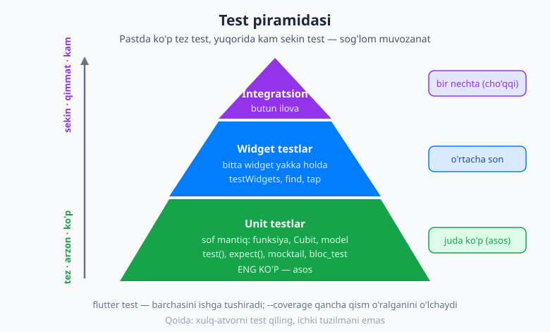
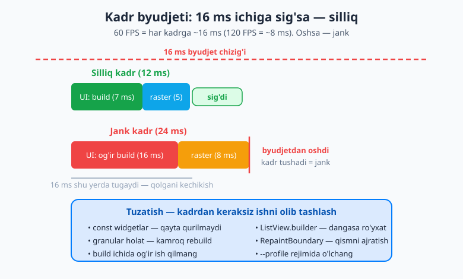
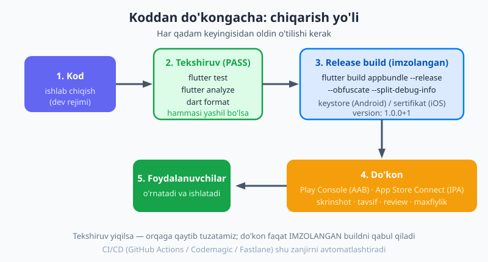

# 29 — Testing, debugging va ishlab chiqarish

[⬅️ Oldingi: 28 — Platforma, paketlar va moslashuv](./28-platforma-paketlar.md) · [🏠 README](./README.md) · [Keyingi: 30 — Yakuniy loyiha: to'liq ilova ➡️](./30-kapston-loyiha.md)

---

> **Bu bobda:** ilovangiz tayyor bo'lib qoldi — endi uni *ishonchli* qilish va *odamlarga yetkazish* kerak. Avval **nega test yozish** kerakligini tushunasiz, so'ng **test piramidasi**ning uch qavatini o'rganasiz: tez va arzon **unit testlar** (sof mantiq — Cubit, util, model; `mocktail` bilan soxta obyektlar va [`bloc_test`](./26-bloc-cubit.md)), **widget testlar** (`testWidgets`, `tester.pumpWidget`, `find.*`, `tester.tap`) va kamsonli **integratsion testlar** (haqiqiy qurilmada). Keyin **debugging** — qizil xato ekranini o'qish, `debugPrint`, **Flutter DevTools** (Inspector, Performance, Memory), `flutter analyze` va `dart format`. So'ng **unumdorlik (performance)** — kadr byudjeti (16 ms), "jank", `const` widgetlar, dangasa ro'yxatlar va `RepaintBoundary`. Nihoyat **ilovani chiqarish (release)** — `flutter build appbundle`, imzolash (keystore), versiyalash, ikonka/splash va do'konga (Play Store / App Store) yuborish. Oxirida to'liq **ishga tushirish nazorat ro'yxati** (checklist).

---

## Nega umuman test yozamiz?

Tasavvur qiling: siz ilovaga yangi xususiyat qo'shdingiz. Bir-ikki ekranni qo'lda ochib, "ishlayapti shekilli" deb xulosa qildingiz. Lekin siz ko'rmagan yana o'nlab ekran bor — va ulardan biri sizning o'zgartirishingiz tufayli **buzilgan** bo'lishi mumkin. Buni qachon bilib olasiz? Foydalanuvchi shikoyat qilganda. Bu — eng yomon payt.

**Test** — bu kodingizni avtomatik tekshiradigan boshqa kod. Siz bir marta "bu funksiya 2 + 2 ga 4 qaytarishi kerak" deb yozasiz, keyin har safar `flutter test` deganingizda kompyuter buni siz uchun **soniyalarda** tekshiradi. Testlar ikki katta foyda beradi:

- **Regressiyani ushlaydi.** "Regressiya" — ilgari ishlagan narsaning yangi o'zgartirish tufayli buzilishi. Testlar bo'lsa, buzilgan joyni *darhol*, foydalanuvchidan oldin bilib olasiz.
- **Qo'rqmasdan refaktoring qilish imkonini beradi.** Kodni tozalash, qayta yozish — har doim "bir narsani buzib qo'ymadimmi?" degan qo'rquv bilan keladi. Testlar yashil bo'lib tursa, dadil o'zgartirasiz: agar bir narsa buzilsa, test qizil bo'ladi.

> 💡 **Asosiy g'oya:** test yozish "qo'shimcha ish" emas — bu *kelajakdagi o'zingizga* sovg'a. Bugun yozilgan test ertaga sizni tunda turib bug qidirishdan saqlaydi.

## Test piramidasi — uch qavat

Hamma test bir xil emas. Ularni **piramida** ko'rinishida tasavvur qilish — sohada eng mashhur va foydali model:



Yuqoridagi rasmda ko'rganingizdek, piramidaning **asosi keng** (ko'p test), **cho'qqisi tor** (kam test). Sababi: pastdagi testlar **tez va arzon**, yuqoridagilar **sekin va qimmat**. Shuning uchun ko'p sonli unit test, o'rtacha widget test va ozgina integratsion test yozish — sog'lom muvozanat.

| Qavat | Nimani tekshiradi | Tezligi | Soni |
|---|---|---|---|
| **Unit** (asos) | Sof mantiq: bitta funksiya, Cubit, model | Juda tez (millisekund) | Ko'p |
| **Widget** (o'rta) | Bitta widget yakka holda: ko'rinish + bosish | O'rtacha | O'rtacha |
| **Integratsion** (cho'qqi) | Butun ilova haqiqiy qurilmada | Sekin | Kam |

Endi har bir qavatni alohida ko'rib chiqamiz.

## Unit testlar — sof mantiqni tekshirish

**Unit test** — eng kichik, eng tez test. U bitta "birlik" (unit) — masalan bitta funksiya, bitta sinf metodi yoki bitta Cubit — ni UI'siz, tarmoqsiz, sof holda tekshiradi.

Hamma test `package:flutter_test` (yoki sof Dart loyihasida `package:test`) dan keladi. Asosiy uchta vosita:

- **`test('nomi', () { ... })`** — bitta testni e'lon qiladi.
- **`expect(haqiqiy, kutilgan)`** — natija kutilganidek ekanini tekshiradi. Bu testning yuragi.
- **`group('nomi', () { ... })`** — bog'liq testlarni guruhga yig'adi.

Testlar `test/` papkasida, nomi `*_test.dart` bilan tugaydigan fayllarda turadi. Mana oddiy util funksiya testi:

```dart
import 'package:flutter_test/flutter_test.dart';

// Sinaladigan sof funksiya
int qoshish(int a, int b) => a + b;

void main() {
  group('qoshish', () {
    test('ikki musbat sonni qo\'shadi', () {
      expect(qoshish(2, 3), equals(5));
    });

    test('manfiy son bilan ishlaydi', () {
      expect(qoshish(-1, 1), equals(0));
    });
  });
}
```

`equals(5)` — bu **matcher** (moslashtiruvchi): "natija 5 ga teng bo'lsin" degani. Boshqa keng tarqalgan matcherlar: `isTrue`, `isFalse`, `isNull`, `isNotNull`, `greaterThan(10)`, `throwsException` (xato tashlashini tekshirish).

### Cubit'ni test qilish

Eng foydali unit test — holat boshqaruvi mantig'ini tekshirish. [26-bobdagi](./26-bloc-cubit.md) `CounterCubit`ni eslang — uni testlash juda oson, chunki u sof Dart: kiritasiz, holatni tekshirasiz.

```dart
import 'package:flutter_test/flutter_test.dart';
import 'package:flutter_bloc/flutter_bloc.dart';

class CounterCubit extends Cubit<int> {
  CounterCubit() : super(0);
  void increment() => emit(state + 1);
  void decrement() => emit(state - 1);
}

void main() {
  group('CounterCubit', () {
    test('boshlang\'ich holati 0', () {
      expect(CounterCubit().state, equals(0));
    });

    test('increment holatni 1 ga oshiradi', () {
      final cubit = CounterCubit();
      cubit.increment();
      expect(cubit.state, equals(1));
    });
  });
}
```

### `bloc_test` bilan blocni tekshirish

Bloc/Cubit uchun maxsus `bloc_test` paketi bor — u "ushbu hodisalardan keyin holat shu ketma-ketlikda chiqishi kerak" degan tekshiruvni yengillashtiradi:

```dart
import 'package:bloc_test/bloc_test.dart';
import 'package:flutter_test/flutter_test.dart';

void main() {
  blocTest<CounterCubit, int>(
    'increment -> increment qilingach [1, 2] chiqaradi',
    build: () => CounterCubit(),
    act: (cubit) => cubit..increment()..increment(),
    expect: () => [1, 2],
  );
}
```

`build:` — sinaladigan cubitni yaratadi, `act:` — unga ta'sir qiladi, `expect:` — chiqishi kutilgan holatlar ro'yxati. Bu Cubit testini ancha ixcham qiladi.

### Mocking — `mocktail` bilan soxta obyektlar

Ko'pincha sinaladigan kod boshqa narsaga bog'liq bo'ladi — masalan ma'lumotni internetdan oladigan `repository`. Testda haqiqiy internetga chiqishni xohlamaymiz: u sekin, ishonchsiz va testni serverga bog'lab qo'yadi. Yechim — **mock** (soxta) obyekt: u haqiqiy obyektga o'xshab ko'rinadi, lekin biz aytgan tayyor javobni qaytaradi.

Buning uchun **`mocktail`** paketi ishlatiladi (`mockito` ham bor, lekin `mocktail` koddan oldindan generatsiya talab qilmaydi — soddaroq):

```dart
import 'package:flutter_test/flutter_test.dart';
import 'package:mocktail/mocktail.dart';

// Haqiqiy interfeys
abstract class WeatherRepository {
  Future<int> harorat(String shahar);
}

// Soxta nusxa
class MockWeatherRepository extends Mock implements WeatherRepository {}

void main() {
  test('repository qaytargan haroratni o\'qiydi', () async {
    final repo = MockWeatherRepository();

    // "harorat('Toshkent') chaqirilsa, 25 qaytar" deb o'rgatamiz
    when(() => repo.harorat('Toshkent')).thenAnswer((_) async => 25);

    final natija = await repo.harorat('Toshkent');
    expect(natija, equals(25));

    // Metod haqiqatan chaqirilganini tekshiramiz
    verify(() => repo.harorat('Toshkent')).called(1);
  });
}
```

Asosiy uchta amal: **`when(...).thenAnswer(...)`** (soxta javobni o'rgatish — asinxron uchun, [09-bobdagi `Future`](./09-asinxron-dart.md)ni eslang; sinxron uchun `thenReturn`), **`verify(...)`** (metod chaqirilganini tasdiqlash), va `Mock` dan meros olish.

> 💡 **Oltin qoida — xulq-atvorni test qiling, ichki tuzilmani emas.** "Tugma bosilsa, hisob 1 ga oshadi" degan *xulq*ni tekshiring; "ichida `_count` o'zgaruvchisi bor" degan *ichki detal*ni emas. Aks holda kodni biroz qayta yozishingiz bilan barcha testlar buziladi — bu testlarni foydadan ko'ra to'siqqa aylantiradi.

## Widget testlar — UI'ni yakka holda tekshirish

Unit test mantiqni tekshiradi, lekin "tugma bosilganda matn yangilanadimi?" degan UI savoliga javob bermaydi. Buni **widget test** hal qiladi: u bitta widgetni *soxta ekranda* quradi, unga teginadi, va ko'rinishni tekshiradi — bularning hammasi **haqiqiy qurilmasiz**, juda tez.

Asosiy farq: `test(...)` o'rniga **`testWidgets(...)`** ishlatiladi va u sizga **`WidgetTester tester`** beradi — bu soxta ekranni boshqaradigan vosita.

```dart
import 'package:flutter/material.dart';
import 'package:flutter_test/flutter_test.dart';

void main() {
  testWidgets('Hisoblagich tugma bosilganda oshadi', (tester) async {
    // 1) Widgetni soxta ekranga quramiz
    await tester.pumpWidget(const MaterialApp(home: CounterPage()));

    // 2) Boshida "0" ko'rinishini tekshiramiz
    expect(find.text('0'), findsOneWidget);
    expect(find.text('1'), findsNothing);

    // 3) "+" ikonkasiga tegamiz
    await tester.tap(find.byIcon(Icons.add));

    // 4) Kadrni qayta chizamiz (setState'dan keyin shart!)
    await tester.pump();

    // 5) Endi "1" ko'rinishi kerak
    expect(find.text('1'), findsOneWidget);
  });
}
```

Bu testni bo'laklab tushunamiz:

- **`tester.pumpWidget(...)`** — widgetni soxta ekranga "ekib" (pump) quradi. Diqqat: widgetni `MaterialApp` (yoki kamida `MaterialApp(home: ...)`) ichiga o'rang — aks holda `Theme`, `Directionality` kabi kontekst topilmay xato bo'ladi.
- **`find.*`** — ekrandan widget topadi: `find.text('0')` (matn bo'yicha), `find.byIcon(Icons.add)` (ikonka bo'yicha), `find.byKey(...)` (kalit bo'yicha), `find.byType(ElevatedButton)` (tur bo'yicha).
- **Matcherlar:** `findsOneWidget` (aniq bitta topildi), `findsNothing` (topilmadi), `findsNWidgets(3)` (aniq 3 ta), `findsWidgets` (bir yoki ko'p).
- **`tester.tap(...)`** — topilgan widgetga teginadi (boshqalar: `tester.enterText(...)`, `tester.drag(...)`).
- **`tester.pump()`** — kadrni qayta chizadi. Buni unutsangiz, ekran eski holatda qoladi va test "1 topilmadi" deb yiqiladi.

### `pump` va `pumpAndSettle` farqi

- **`tester.pump()`** — *bitta* kadrni qayta chizadi. Oddiy `setState` o'zgarishlari uchun yetarli.
- **`tester.pumpAndSettle()`** — animatsiya yoki kechikadigan o'zgarish **tinchiguncha** (settle) kadrlarni qayta-qayta chizadi. Masalan ekran o'tish animatsiyasi yoki `SnackBar` chiqishini kutish kerak bo'lganda ishlatiladi.

> 💡 Sodda qoida: oddiy holat o'zgarishida `pump()`, animatsiya/o'tish tugashini kutish kerak bo'lsa `pumpAndSettle()`. Noto'g'risini ishlatish testni yiqitadi yoki muzlatib qo'yadi.

## Integratsion testlar — butun ilova qurilmada

Unit va widget testlar soxta muhitda, qurilmasiz ishlaydi. Lekin ba'zan "ilova haqiqiy telefonda, boshidan oxirigacha, haqiqiy oqim bilan ishlaydimi?" degan savol qoladi: login → bosh sahifa → buyurtma berish. Buni **integratsion test** tekshiradi.

Buning uchun `integration_test` paketi loyihangizga qo'shiladi (u Flutter SDK bilan keladi). Testlar `integration_test/` papkasida yoziladi va haqiqiy qurilmada/emulyatorda quyidagicha ishga tushiriladi:

```bash
flutter test integration_test
```

Kodi widget testga juda o'xshaydi (`tester`, `find`, `tap`), lekin butun ilovani ishga tushiradi. Ular **sekin** (haqiqiy qurilma kerak), shuning uchun piramidaning cho'qqisida — kam sonda, faqat eng muhim oqimlar uchun yoziladi.

## Testlarni ishga tushirish va qamrov (coverage)

Hamma testni ishga tushirish oddiy:

```bash
flutter test                    # barcha unit + widget testlar
flutter test test/cubit_test.dart   # bitta fayl
flutter test --coverage         # qamrov (coverage) ma'lumoti bilan
```

`--coverage` kodingizning **qancha qismi** testlar bilan o'ralganini o'lchaydi va `coverage/lcov.info` fayliga yozadi. Lekin diqqat: yuqori foiz o'z-o'zidan sifat kafolati emas — *muhim mantiq* o'ralganligi raqamdan muhimroq. 100% qamrov uchun ahamiyatsiz testlar yozishdan ko'ra, asosiy mantiqni puxta sinash afzal.

## Debugging — xatolarni tushunish va DevTools

Test yashil bo'lsa ham, ishlab chiqish jarayonida xatolar muqarrar. Flutter ularni topishda yordam beradigan kuchli vositalarga ega.

### Qizil xato ekrani va stack trace

Build paytida xato bo'lsa, Flutter mashhur **qizil xato ekrani** (ko'pincha "red screen of death" deyiladi) ni ko'rsatadi — qizil fonda xato matni. Bu qo'rqinchli ko'rinsa-da, aslida *do'st*: u nima buzilganini va qaysi qatorda ekanini aytadi. **Stack trace** (xato izi) — xato qaysi funksiyalar zanjiri orqali yuzaga kelganini ko'rsatadigan ro'yxat; eng yuqoridagi qator odatda sizning kodingizdagi aybdor joy.

### `debugPrint` va `assert`

Eng sodda debugging — konsolga chop etish. Flutter'da `print` o'rniga **`debugPrint`** ishlating: u juda uzun matnni kesib, konsolni to'ldirib yubormaydi, va release rejimida osongina o'chiriladi.

```dart
debugPrint('Foydalanuvchi: ${user.name}, holat: $state');
```

**`assert`** — faqat debug rejimida ishlaydigan tekshiruv: shart noto'g'ri bo'lsa, ilovani darhol to'xtatib, xatoni ko'rsatadi. "Bu yerga `null` kelmasligi kerak" kabi taxminlarni himoyalash uchun ajoyib (release buildda butunlay olib tashlanadi, demak tezlikka ta'sir qilmaydi):

```dart
assert(narx >= 0, 'Narx manfiy bo\'lishi mumkin emas: $narx');
```

### Flutter DevTools — vizual asboblar to'plami

**DevTools** — Flutter'ning brauzerda ochiladigan kuchli debugging asboblar to'plami. Uni IDE'dan (VS Code / Android Studio) tugma bilan yoki terminalda `dart devtools` bilan ochasiz. Asosiy panellar:

- **Inspector** — widget daraxtini (widget tree) ko'rsatadi: ilovangiz qaysi widgetlardan tuzilganini, ularning xossalarini ko'rasiz. "Layout Explorer" esa `Row`/`Column`ning joylashuvini vizual tushuntiradi — layout muammolarini hal qilishda bebaho.
- **Performance** — kadrlar qancha vaqt olishini ko'rsatadi (pastda batafsil).
- **Memory** — xotira ishlatilishini kuzatadi (xotira "oqishi"ni — memory leak — topish uchun).
- **Network** — ilova qilgan tarmoq so'rovlarini ko'rsatadi.
- **Logging** — `debugPrint` va tizim loglari oqimi.

### Birinchi himoya: `flutter analyze` va `dart format`

Xatolarni *yozayotgan paytdayoq* ushlash debugdan ham yaxshiroq. Ikki buyruq buni qiladi:

```bash
flutter analyze     # statik tahlil: ishlatilmagan o'zgaruvchi, null xavfi, yomon naqsh
dart format .       # kodni standart uslubda avtomatik tekislaydi
```

`flutter analyze` — kodni *ishga tushirmasdan* tekshiradi va potensial muammolarni (xato bo'lishi mumkin bo'lgan joylar, foydasiz kod) ro'yxatlaydi. `dart format` esa butun jamoaning kodi bir xil ko'rinishini ta'minlaydi. Bu ikkalasini har commit'dan oldin ishga tushirish — professional odat.

## Unumdorlik (performance) — silliq 60/120 kadr

Foydalanuvchi ilovangizni "silliq" yoki "tutab turadi" deb his qiladi. Buning ortida aniq matematika bor.

### Kadr byudjeti va "jank"

Ekran soniyasiga ma'lum sonda yangilanadi: ko'pchilik qurilmada **60 FPS** (soniyasiga 60 kadr), yangiroqlarida **120 FPS**. 60 FPS demak — har bir kadr uchun atigi **~16 millisekund** vaqt bor (120 FPS uchun ~8 ms). Flutter shu vaqt ichida kadrni qurib (build), joylab (layout) va chizib (paint) ulgurishi kerak.

Agar bir kadr 16 ms dan oshib ketsa, u kadr **tushib qoladi** (dropped frame) — ekran bir lahza qotadi. Mana shu — **"jank"** (silkinish, tutash). Foydalanuvchi buni darhol sezadi.



Rasmda ko'rganingizdek, kadr 16 ms byudjetiga sig'sa — silliq (yashil); oshib ketsa — jank (qizil). Yaxshi xabar: 2026-yilda Flutter standart **Impeller** renderini ishlatadi — u eski renderga nisbatan kadrlarni ancha barqaror va silliq chizadi, "birinchi animatsiya tutashi" muammosini bartaraf qiladi.

### Eng ko'p uchraydigan yutuqlar

Jankning asosiy sababi — kadrda **keraksiz ish** qilish. Mana eng samarali tuzatishlar:

- **`const` konstruktorlar/widgetlar.** Widget `const` bo'lsa, Flutter uni qayta qurmaydi — bir marta qurib, qayta-qayta ishlatadi. `const Text('Salom')` har rebuild'da tejaydi. Bu eng oson va eng katta yutuqlardan biri.
- **Granular (mayda) holat — kamroq rebuild.** Butun ekranni qayta qurish o'rniga, faqat o'zgargan kichik qismni qayta quring. [24/25-boblardagi](./24-provider.md) holat boshqaruvi vositalari (`Consumer`, `Selector`, `BlocBuilder`) aynan shu uchun: ular faqat kerakli bo'lakni yangilaydi.
- **`ListView.builder` — dangasa ro'yxat.** Ro'yxatlar bobidan eslang: u faqat ekrandagi elementlarni quradi. Uzun ro'yxatda `ListView(children: [...])` o'rniga doimo `builder`.
- **`RepaintBoundary`.** Tez-tez qayta chiziladigan qismni (masalan animatsiya) qolganidan ajratib, "faqat shu qismni qayta chiz" deydi — qolgan ekran behuda qayta chizilmaydi.
- **`build` ichida og'ir ish qilmang.** `build` metodi tez-tez (har kadrda) chaqirilishi mumkin. Unda fayl o'qish, murakkab hisob, tarmoq so'rovi qilmang — bularni tashqariga (`initState`, repository) chiqaring.
- **Rasmlarni keshlang.** Tarmoqdan kelgan rasmlar uchun `cached_network_image` kabi paket har safar qayta yuklamaslik uchun keshlaydi.

### DevTools Performance bilan profillash

Qaerda jank borligini taxmin qilmang — **o'lchang**. DevTools'ning **Performance** paneli har kadrni vaqt o'qiga (timeline) chizadi. U ikkita asosiy oqimni ko'rsatadi: **UI thread** (Dart kodingiz — build/layout) va **Raster thread** (chizish/GPU). Qaysi biri 16 ms dan oshsa — muammo o'sha tomonda.

> ⚠️ **Eng muhim qoida:** unumdorlikni **`--profile` rejimida** o'lchang, debug rejimida emas! Debug build qo'shimcha tekshiruvlar tufayli ataylab sekin — uning tezligi haqiqiy emas. `flutter run --profile` haqiqiy unumdorlikni ko'rsatadi (release'ga yaqin, lekin profillash asboblari yoqilgan).

## Ilovani chiqarish (build va release)

Ilova tayyor, testlar yashil — endi uni **do'konga** chiqaramiz. Kod do'kongacha qanday yo'l bosishini ko'rib chiqamiz:



### Release build buyruqlari

Android uchun ikki format bor:

```bash
flutter build appbundle           # AAB — Play Store uchun TAVSIYA ETILGAN
flutter build apk                 # APK — to'g'ridan-to'g'ri o'rnatish/sinov uchun
flutter build apk --split-per-abi # har protsessor turi uchun alohida, kichikroq APK
```

**`appbundle` (AAB)** — Play Store'ning afzal formati: Google har foydalanuvchining qurilmasiga moslab optimallashtirilgan kichik APK yaratadi. Oddiy **`apk`** esa to'g'ridan-to'g'ri o'rnatish yoki sinov uchun qulay.

iOS uchun (faqat **Mac + Xcode** kerak):

```bash
flutter build ipa                 # App Store uchun
```

Hamma release buildga **`--release`** bayrog'i (build appbundle/ipa'da u standart) yoki rejim ko'zda tutiladi — bu debug tekshiruvlarsiz, optimallashtirilgan, tez build beradi.

### Imzolash (signing) — eng muhim qadam

Do'kon faqat **imzolangan** ilovani qabul qiladi. Imzo — ilova haqiqatan sizdan kelganini isbotlaydi.

**Android — keystore:** avval bir marta kalit (keystore) yaratasiz, so'ng uni loyihaga ulaysiz. `android/key.properties` faylida kalit ma'lumoti turadi (uni **hech qachon** git'ga qo'shmang!):

```properties
storePassword=parol
keyPassword=parol
keyAlias=upload
storeFile=/yo'l/upload-keystore.jks
```

So'ng `android/app/build.gradle` (yoki `.gradle.kts`) faylida `signingConfigs` shu `key.properties`ni o'qiydigan qilib sozlanadi. Bir marta sozlasangiz, keyingi har release shu kalit bilan avtomatik imzolanadi.

**iOS — sertifikat va provisioning:** Apple ekotizimida imzo sertifikat (certificate) va provisioning profile orqali boshqariladi. Buni odatda Xcode yoki App Store Connect'da sozlaysiz. (Apple Developer hisobi — yiliga to'lov talab qiladi.)

### Versiyalash

Har release ilovaning **versiyasini** oshirishi kerak — do'kon eski va yangi nusxani shu bilan ajratadi. Versiya `pubspec.yaml` da turadi:

```yaml
version: 1.0.0+1
```

- `1.0.0` — odamlarga ko'rinadigan versiya nomi (Android'da `versionName`, iOS'da marketing version).
- `+1` — ichki, har release'da o'sishi **shart** bo'lgan build raqami (Android'da `versionCode`, iOS'da build number). Yangi nusxa eskidan kattaroq raqamga ega bo'lishi kerak.

### Ikonka, splash va kod himoyasi

- **App ikonka:** `flutter_launcher_icons` paketi bitta rasmdan barcha platforma/o'lchamlar uchun ikonka generatsiya qiladi.
- **Splash screen (ochilish ekrani):** `flutter_native_splash` ilova yuklanayotganda ko'rinadigan ekranni sozlaydi.
- **Obfuscation (kodni chalkashtirish):** release buildda kodingiz nomlarini chalkashtirib, teskari muhandislikni qiyinlashtirish uchun:

```bash
flutter build appbundle --obfuscate --split-debug-info=build/symbols
```

`--split-debug-info` — chalkashtirilgan stack trace'larni keyin tiklash uchun "symbol" fayllarini saqlaydi. Bu fayllarni saqlab qo'ying — release'dagi xatoni o'qish uchun kerak bo'ladi.

### Do'konga yuborish

- **Play Console** (Android): AAB faylni yuklaysiz, do'kon sahifasini to'ldirasiz (skrinshotlar, tavsif, ikonka, maxfiylik siyosati), va tekshiruvga (review) yuborasiz.
- **App Store Connect** (iOS): IPA'ni Xcode yoki Transporter orqali yuklaysiz, metama'lumot va skrinshotlarni to'ldirasiz, Apple'ning tekshiruviga yuborasiz (Apple tekshiruvi qattiqroq va sekinroq).

Ikkala do'kon ham **maxfiylik siyosati** (privacy policy) va ilova qanday ma'lumot to'plashi haqida ma'lumot talab qiladi — buni oldindan tayyorlang.

### CI/CD — avtomatlashtirish (qisqacha)

Har release'ni qo'lda qurib, imzolab, yuklash zerikarli va xatoga moyil. **CI/CD** (uzluksiz integratsiya/yetkazib berish) buni avtomatlashtiradi: kod git'ga yuklanganda serverda testlar avtomatik ishlaydi, build qilinadi, hatto do'konga yuboriladi. Mashhur vositalar: **GitHub Actions** (bepul, git bilan integratsiya), **Codemagic** (Flutter'ga maxsus), **Fastlane** (do'konga yuborishni avtomatlashtiradi). Boshlovchi uchun: avval qo'lda chiqarishni o'rganing, jamoangiz o'sgach CI/CD'ga o'ting.

## Ishga tushirish nazorat ro'yxati (checklist)

Ilovani do'konga chiqarishdan oldin shu ro'yxatdan o'ting:

- [ ] **`flutter test`** — barcha testlar yashil.
- [ ] **`flutter analyze`** — hech qanday ogohlantirish/xato yo'q.
- [ ] **`dart format .`** — kod tekislangan.
- [ ] **Release build** ishlaydi (`flutter build appbundle` / `ipa` xatosiz).
- [ ] **Ikonka va splash** sozlangan (`flutter_launcher_icons`, `flutter_native_splash`).
- [ ] **Imzolash** sozlangan (Android keystore / iOS sertifikat); `key.properties` git'da emas.
- [ ] **Versiya** oshirilgan (`pubspec.yaml`dagi `+build` raqami).
- [ ] **`--obfuscate --split-debug-info`** ishlatilgan, symbol fayllar saqlangan.
- [ ] **Do'kon aktivlari** tayyor (skrinshotlar, tavsif, kategoriya).
- [ ] **Maxfiylik siyosati** mavjud va havola berilgan.
- [ ] Haqiqiy qurilmada **release build sinab** ko'rilgan.

## Keyingi qadam

Bu bobda ilovangizni *ishonchli* va *chiqarishga tayyor* qilishni o'rgandingiz: test piramidasi (unit → widget → integratsion), `mocktail` bilan mocking va `bloc_test`, DevTools bilan debugging, `flutter analyze`/`dart format`, kadr byudjeti va unumdorlik yutuqlari, va nihoyat imzolash, versiyalash va do'konga yuborish — to'liq nazorat ro'yxati bilan.

Endi sizda Flutter ilovasini *qurish*dan *yetkazish*gacha barcha ko'nikma bor. Keyingi [30-bobda](./30-kapston-loyiha.md) — **yakuniy loyiha**: o'rgangan hamma narsani — widgetlar, navigatsiya, holat boshqaruvi, tarmoq, test va release — bitta **to'liq, real ilova**da birlashtiramiz.

---

## Mashqlar

### Oson

1. Test piramidasining uch qavatini ayting. Nega asosida (eng ko'p) unit test, cho'qqisida (eng kam) integratsion test turadi?
2. `test(...)` va `expect(...)` har biri nima qiladi? `expect(qoshish(2, 2), equals(4))` qatorini o'z so'zlaringiz bilan tushuntiring.
3. Widget testda `tester.tap(...)` dan keyin `tester.pump()` ni chaqirishni unutsangiz nima bo'ladi va nega?
4. Kadr byudjeti nima? 60 FPS uchun bitta kadrga necha millisekund vaqt bor, va bu vaqtdan oshib ketsa nima yuz beradi (bu hodisa qanday ataladi)?

### O'rta

5. Quyidagi sof funksiya uchun `group` ichida ikkita unit test yozing: `bool juftmi(int n) => n % 2 == 0`. Biri juft son, biri toq son uchun bo'lsin.
6. `find.text('Saqlash')`, `find.byIcon(Icons.delete)`, `find.byType(ElevatedButton)` — uchalasi nimani topadi? `findsOneWidget` va `findsNothing` matcherlari orasidagi farq nima?
7. `mocktail`da `when(() => repo.harorat('Toshkent')).thenAnswer((_) async => 25)` qatori nima qiladi? Nega testda haqiqiy repository o'rniga mock ishlatamiz (kamida ikkita sabab)?

### Qiyin

8. Bir o'quvchi `flutter run` (debug rejim) da ilovasini o'lchab, "juda sekin, jank bor" deb xulosa qildi. Uning xulosasi nega ishonchsiz va u nimani qilishi kerak edi?
9. `pubspec.yaml`da `version: 1.2.0+5` turibdi. `1.2.0` va `+5` har biri nimani anglatadi? Yangi release chiqarayotganda qaysi qismni o'zgartirish **shart** va nega?
10. Bir jamoa ilovani imzolashda `android/key.properties` faylini git'ga (ochiq repozitoriyga) qo'shib yuborgan. Bu nega jiddiy xavf, va to'g'ri amaliyot qanday bo'lishi kerak edi?

<details markdown="1"><summary>Yechimlar</summary>

**1.** Uch qavat: **unit** (sof mantiq — funksiya/Cubit/model), **widget** (bitta widget yakka holda — ko'rinish va bosish), **integratsion** (butun ilova haqiqiy qurilmada). Asosida unit testlar ko'p, chunki ular **tez va arzon** (millisekundda, qurilmasiz ishlaydi); cho'qqisida integratsion testlar kam, chunki ular **sekin va qimmat** (haqiqiy qurilma kerak). Shu muvozanat tez fikr-mulohaza beradi.

**2.** `test('nomi', () { ... })` — bitta testni e'lon qiladi (nom + ichida bajariladigan kod). `expect(haqiqiy, kutilgan)` — natija kutilganidek ekanini tekshiradi; mos kelmasa test yiqiladi. `expect(qoshish(2, 2), equals(4))` — "`qoshish(2, 2)` ning natijasi 4 ga teng bo'lsin" degani; agar funksiya 4 dan boshqa narsa qaytarsa, test qizil bo'ladi.

**3.** `tester.pump()` ni unutsangiz, ekran **eski holatda qoladi** — bosish holatni o'zgartirgan bo'lsa ham, Flutter kadrni qayta chizmaydi, shuning uchun keyingi `expect(find.text('1'), findsOneWidget)` "1 topilmadi" deb yiqiladi. Sababi: `tap` faqat hodisani yuboradi; UI'ni yangilash uchun yangi kadr chizilishi kerak, buni `pump()` qiladi.

**4.** Kadr byudjeti — bitta kadrni qurib, joylab va chizib ulgurish uchun beriladigan vaqt. 60 FPS uchun bu **~16 ms** (1000 ms ÷ 60). Bu vaqtdan oshsa, kadr **tushib qoladi** (dropped frame) — ekran bir lahza qotadi; bu hodisa **"jank"** (silkinish/tutash) deb ataladi va foydalanuvchi uni darhol sezadi.

**5.**
```dart
import 'package:flutter_test/flutter_test.dart';

bool juftmi(int n) => n % 2 == 0;

void main() {
  group('juftmi', () {
    test('juft son uchun true qaytaradi', () {
      expect(juftmi(4), isTrue);
    });

    test('toq son uchun false qaytaradi', () {
      expect(juftmi(7), isFalse);
    });
  });
}
```

**6.** `find.text('Saqlash')` — ekranda 'Saqlash' matnli widgetni topadi. `find.byIcon(Icons.delete)` — `Icons.delete` ikonkali widgetni topadi. `find.byType(ElevatedButton)` — turi `ElevatedButton` bo'lgan widgetni topadi. `findsOneWidget` — aynan **bitta** mos widget topilganini tekshiradi; `findsNothing` — **hech qanday** mos widget topilmaganini tekshiradi (masalan, biror narsa hali ko'rinmasligi kerakligini tasdiqlash uchun).

**7.** Bu qator mockga "agar `harorat('Toshkent')` chaqirilsa, asinxron ravishda `25` qaytar" deb **o'rgatadi** — haqiqiy hisob/tarmoqsiz, oldindan belgilangan javob. Mock ishlatish sabablari: (1) **tezlik va ishonchlilik** — haqiqiy tarmoq sekin va beqaror, mock esa darhol va doimo bir xil javob beradi; (2) **boshqariluvchanlik** — kerakli holatni (masalan xato yoki aniq qiymat) ataylab yaratib, sinaladigan kodni shu holatda tekshira olamiz; (yana: test tashqi serverga bog'liq bo'lmaydi).

**8.** Debug rejim (`flutter run` standart rejimi) ataylab sekin — u qo'shimcha tekshiruvlar, assertlar va optimallashtirilmagan kod bilan ishlaydi, shuning uchun uning tezligi **haqiqiy emas**. Unumdorlikni o'lchash uchun u **`flutter run --profile`** (profile rejimi) ishlatishi kerak edi — bu release'ga yaqin tezlikni beradi, lekin DevTools profillash asboblari yoqilgan. Profile rejimida DevTools Performance panelida UI va Raster oqimlarini ko'rib, haqiqiy jank manbasini topadi.

**9.** `1.2.0` — odamlarga ko'rinadigan **versiya nomi** (Android `versionName`, iOS marketing version). `+5` — ichki **build raqami** (Android `versionCode`, iOS build number). Yangi release'da **build raqami (`+5`) ni oshirish shart** — chunki do'kon (Play Store/App Store) yangi nusxani eskisidan aynan shu raqam orqali ajratadi; agar u oshmasa, do'kon yangi yuklamani **rad etadi**. Versiya nomini (`1.2.0`) o'zgartirish foydalanuvchiga ko'rinadi, lekin majburiy emas.

**10.** `key.properties` parol va imzolash kaliti yo'lini saqlaydi — bu ilovangizni imzolaydigan **maxfiy** ma'lumot. U ochiq repozitoriyga tushsa, boshqalar sizning imzongiz bilan soxta yangilanish chiqarishi yoki ilovangizga taqlid qilishi mumkin — bu jiddiy xavfsizlik buzilishi. To'g'ri amaliyot: `key.properties` va keystore faylini **`.gitignore`** ga qo'shib, git'ga **hech qachon** qo'shmaslik; ularni alohida, xavfsiz joyda (parol menejeri, CI'ning maxfiy o'zgaruvchilari) saqlash. Agar tasodifan yuklangan bo'lsa — kalitni darhol yangi bilan almashtirish va sirlarni o'zgartirish kerak.

</details>

---

[⬅️ Oldingi: 28 — Platforma, paketlar va moslashuv](./28-platforma-paketlar.md) · [🏠 README](./README.md) · [Keyingi: 30 — Yakuniy loyiha: to'liq ilova ➡️](./30-kapston-loyiha.md)
