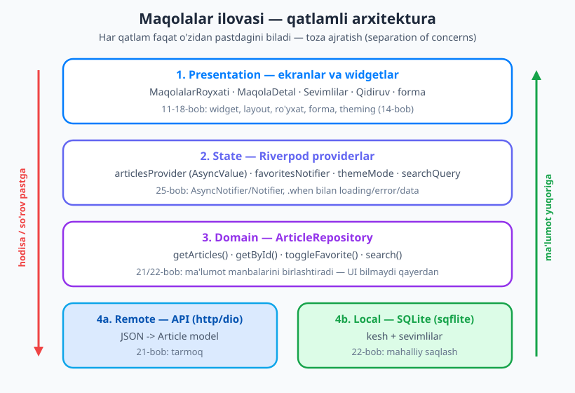
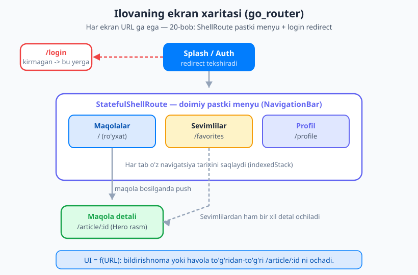
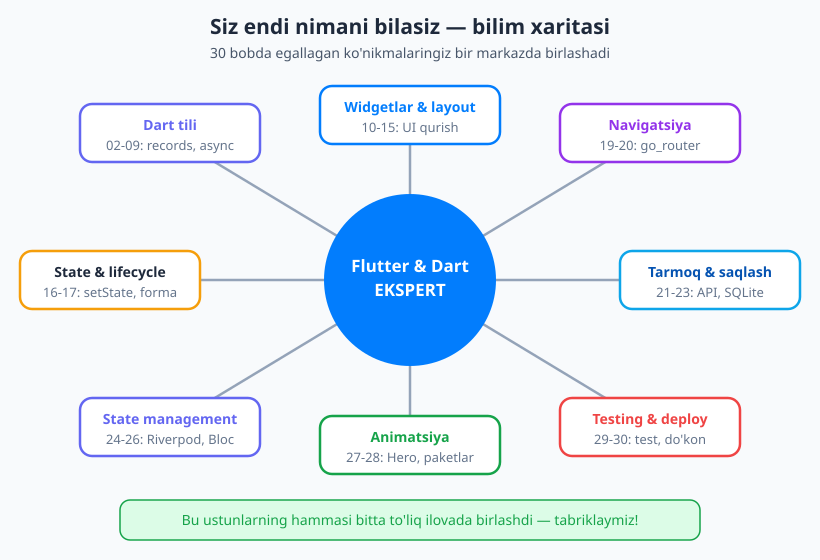

# 30 — Yakuniy loyiha: to'liq ilova

[⬅️ Oldingi: 29 — Testing, debugging va ishlab chiqarish](./29-testing-performance.md) · [🏠 README](./README.md)

---

> **Bu bobda:** mana shu lahza uchun butun kitobni o'qib keldingiz. Endi 29 bobda o'rgangan hamma narsani — Dart tili, widgetlar, layout, holat, navigatsiya, tarmoq, mahalliy saqlash, Riverpod, animatsiya, test va do'konga joylash — **bitta haqiqiy, ishlab-chiqarishga yaqin ilovada** birlashtiramiz. Biz **"Maqolalar"** — kichik yangiliklar/maqolalar o'quvchisini noldan quramiz: API'dan ro'yxat keladi, detal sahifa bor, sevimlilar lokal bazada saqlanadi, qidiruv ishlaydi, yorug'/qorong'i mavzu bor, sevimlilar esa login bilan himoyalanadi. Eng muhimi: **har bir qaror qaysi bobdan kelganini** aytib boramiz, shunda butun kitob xotirangizda bir butun bo'lib joylashadi. Bu shunchaki "yana bir misol" emas — bu sizning **Flutter dasturchi** ekanligingizning isboti.

---

## Nega aynan bunday quramiz?

Yangi boshlovchi va tajribali dasturchini ajratadigan narsa — kod yozish **emas**. Ikkalasi ham `ListView` yoza oladi. Farq — **tuzilma** (struktura): kod o'sganda u tarqab ketmaydimi yoki tartibli qoladimi.

Shuning uchun ishni ekrandan emas, **arxitekturadan** boshlaymiz. Ilovani to'rt qatlamga ajratamiz va har qatlam faqat o'zidan pastdagini biladi:



- **Presentation (1-qatlam)** — ko'rinadigan qism: ekranlar va widgetlar ([11–18-bob](./README.md)). Bu qatlam *faqat* holatga qaraydi va hodisalarni yuboradi; u API yoki bazani **bilmaydi**.
- **State (2-qatlam)** — Riverpod providerlar ([25-bob](./25-riverpod.md)). UI bilan ma'lumot orasidagi ko'prik: yuklanish/xato/data holatlarini boshqaradi.
- **Domain (3-qatlam)** — `ArticleRepository`. "Maqolalarni ber" deganda, ular API'dan keladimi yoki keshdanmi — buni faqat repozitoriy biladi. UI uchun bu sir.
- **Data (4-qatlam)** — ikki manba: uzoq server (API, [21-bob](./21-networking-http.md)) va mahalliy baza (SQLite, [22-bob](./22-mahalliy-saqlash.md)).

Diqqat qiling: rasmda **hodisa pastga, ma'lumot yuqoriga** oqadi. Foydalanuvchi tugmani bosadi (hodisa pastga tushadi → provider → repozitoriy → API), natija qaytib yuqoriga ko'tariladi (data → provider → ekran qayta quriladi). Bu bir tomonlama oqim — uni 10-bobda *UI = f(holat)* deb atagandik.

> 💡 **Nega bu shuncha muhim?** Ertaga API o'zgarsa yoki SQLite o'rniga boshqa baza qo'ysangiz — faqat Data qatlamiga tegasiz, UI'ga umuman qo'l urmaysiz. Qatlamlar bir-birini "bilmaganidan" kelib chiqadigan erkinlik — bu professional ilovaning yuragi.

## 1-qadam: loyiha va tuzilma (10/29-bob)

Avval loyihani yaratamiz:

```bash
flutter create maqolalar
cd maqolalar
```

Endi paketlarni qo'shamiz. Har birini — qaysi bobdan tanish ekanini eslab — birma-bir o'rnatamiz:

```bash
flutter pub add flutter_riverpod riverpod_annotation go_router http sqflite path shared_preferences
flutter pub add dev:riverpod_generator dev:build_runner
```

Natijada `pubspec.yaml` shunday ko'rinadi (versiyalar 2026-yil iyun holatiga ko'ra):

```yaml
name: maqolalar
description: Maqolalar o'quvchisi — kapston loyiha
publish_to: 'none'
version: 1.0.0+1

environment:
  sdk: ^3.12.0

dependencies:
  flutter:
    sdk: flutter
  flutter_riverpod: ^3.3.0        # 25-bob: holat boshqaruvi
  riverpod_annotation: ^3.3.0     # codegen annotatsiyalari
  go_router: ^17.3.0              # 20-bob: navigatsiya
  http: ^1.2.0                    # 21-bob: tarmoq
  sqflite: ^2.4.0                 # 22-bob: mahalliy SQLite
  path: ^1.9.0                    # baza yo'lini qurish uchun
  shared_preferences: ^2.3.0      # 22-bob: kichik sozlamalar (mavzu)

dev_dependencies:
  flutter_test:
    sdk: flutter
  riverpod_generator: ^3.3.0      # provider kodini generatsiya qiladi
  build_runner: ^2.4.13           # codegen ishga tushiruvchi
  flutter_lints: ^5.0.0
```

> ⚠️ **Codegen — makros emas.** Riverpod'ning `@riverpod` annotatsiyasi va `json_serializable` kabi vositalar kodni **`build_runner`** orqali generatsiya qiladi (siz `dart run build_runner watch` ishga tushirasiz, u `.g.dart` fayllarni yozadi). Dart'da bir paytlar rejalashtirilgan "makros" imkoniyati **bekor qilingan** — shuning uchun 2026-yilda ham standart yo'l codegen.

Endi papka tuzilmasini **xususiyat-birinchi** (feature-first) tartibda quramiz — har bir xususiyat o'z papkasida, ichida o'sha to'rt qatlam:

```
lib/
├── main.dart                  # runApp + ProviderScope + router
├── core/
│   ├── theme.dart             # 14-bob: ThemeData (yorug'/qorong'i)
│   └── router.dart            # 20-bob: GoRouter konfiguratsiyasi
├── features/
│   └── articles/
│       ├── data/
│       │   ├── article_api.dart       # 21-bob: API manbasi
│       │   └── article_db.dart        # 22-bob: SQLite manbasi
│       ├── domain/
│       │   ├── article.dart           # 07/08-bob: model
│       │   └── article_repository.dart# 3-qatlam: birlashtiruvchi
│       ├── application/
│       │   └── articles_providers.dart# 25-bob: Riverpod providerlar
│       └── presentation/
│           ├── articles_screen.dart   # ro'yxat
│           ├── article_detail_screen.dart
│           ├── favorites_screen.dart
│           └── widgets/article_card.dart
└── ...
```

> 💡 **Nega xususiyat-birinchi?** Kichik ilovada "barcha ekranlar bitta `screens/` papkada" yetarli. Lekin ilova o'sganda, bir xususiyat ustida ishlaganda uning hamma fayli bir joyda turishi — qidirishni va jamoa bilan ishlashni osonlashtiradi. Bu [29-bobdagi](./29-testing-performance.md) "boshqariladigan kod" g'oyasining davomi.

## 2-qadam: dizayn tizimi (14-bob)

Ilovaning ko'rinishini bir joyda — `core/theme.dart` da — belgilaymiz. Material 3 standart bo'lgani uchun bizga `ColorScheme.fromSeed` yetadi: bitta "urug'" rangdan butun palitra (yorug' va qorong'i) avtomatik tug'iladi.

```dart
// lib/core/theme.dart
import 'package:flutter/material.dart';

const _seed = Color(0xFF027DFD); // brendimiz rangi

ThemeData lightTheme() => ThemeData(
      colorScheme: ColorScheme.fromSeed(seedColor: _seed),
      // Material 3 — 2026-da standart, alohida bayroq kerak emas
    );

ThemeData darkTheme() => ThemeData(
      colorScheme: ColorScheme.fromSeed(
        seedColor: _seed,
        brightness: Brightness.dark,
      ),
    );
```

`MaterialApp` ga ikkala mavzuni ham beramiz va `themeMode` ni provider boshqaradi (pastda) — shunda foydalanuvchi yorug'/qorong'ini almashtira oladi:

```dart
// main.dart ichida (to'liq versiyasi 6-qadamda)
MaterialApp.router(
  theme: lightTheme(),
  darkTheme: darkTheme(),
  themeMode: themeMode, // providerdan keladi
  routerConfig: router,
)
```

## 3-qadam: model (07/08-bob)

Ma'lumotni ekranga to'g'ridan-to'g'ri "xom JSON" (Map) sifatida olib chiqmaymiz — avval uni **tipli model**ga aylantiramiz. Bu [07-bobdagi](./07-oop-asoslari.md) klasslar va [08-bobdagi](./08-dart3-zamonaviy.md) zamonaviy Dart imkoniyatlaridan foydalanadi:

```dart
// lib/features/articles/domain/article.dart
class Article {
  const Article({
    required this.id,
    required this.title,
    required this.body,
    required this.imageUrl,
    this.isFavorite = false,
  });

  final int id;
  final String title;
  final String body;
  final String imageUrl;
  final bool isFavorite;

  // JSON -> Article (21-bob: serverdan kelgan Map'ni o'qiymiz)
  factory Article.fromJson(Map<String, dynamic> json) => Article(
        id: json['id'] as int,
        title: json['title'] as String,
        body: json['body'] as String,
        imageUrl: json['imageUrl'] as String? ?? '',
      );

  // Article -> Map (22-bob: SQLite ga yozish uchun)
  Map<String, dynamic> toMap() => {
        'id': id,
        'title': title,
        'body': body,
        'imageUrl': imageUrl,
      };

  // O'zgarmas (immutable) nusxa — faqat bitta maydonni o'zgartirib
  Article copyWith({bool? isFavorite}) => Article(
        id: id,
        title: title,
        body: body,
        imageUrl: imageUrl,
        isFavorite: isFavorite ?? this.isFavorite,
      );
}
```

> 💡 **Qo'lda yozdik — lekin kattalashganda?** Kichik modelda `fromJson`/`toMap` ni qo'lda yozish toza va tushunarli. Maydonlar ko'paysa, `json_serializable` yoki `freezed` paketlari shu kodni `build_runner` orqali **avtomatik** generatsiya qiladi (`@JsonSerializable()` annotatsiyasi → `article.g.dart`). Bu — yana o'sha codegen, makros emas. Boshlash uchun qo'lda yozish butunlay yetarli.

## 4-qadam: ma'lumot qatlami (21/22-bob)

Endi ma'lumotning kelib chiqishi. Avval **ikki manba**, keyin ularni birlashtiruvchi **repozitoriy**.

### API manbasi (21-bob)

```dart
// lib/features/articles/data/article_api.dart
import 'dart:convert';
import 'package:http/http.dart' as http;
import '../domain/article.dart';

class ArticleApi {
  ArticleApi({http.Client? client}) : _client = client ?? http.Client();
  final http.Client _client;

  static const _base = 'https://example.com/api';

  Future<List<Article>> fetchArticles() async {
    final res = await _client.get(Uri.parse('$_base/articles'));
    if (res.statusCode != 200) {
      throw Exception('Server xatosi: ${res.statusCode}');
    }
    final list = jsonDecode(res.body) as List<dynamic>;
    return list
        .map((e) => Article.fromJson(e as Map<String, dynamic>))
        .toList();
  }
}
```

> 💡 `http.Client` ni konstruktorga parametr qilib oldik (`{http.Client? client}`). Bu kichik qaror — lekin u [29-bobdagi](./29-testing-performance.md) **testni** osonlashtiradi: testda soxta (mock) klient berib, haqiqiy internetga chiqmasdan tekshiramiz. Pastda buni ko'rasiz.

### SQLite manbasi (22-bob)

Lokal baza ikki vazifani bajaradi: **kesh** (internet bo'lmaganda oxirgi ro'yxatni ko'rsatish) va **sevimlilar** (qaysi maqola yoqqani).

```dart
// lib/features/articles/data/article_db.dart
import 'package:sqflite/sqflite.dart';
import 'package:path/path.dart' as p;
import '../domain/article.dart';

class ArticleDb {
  Database? _db;

  Future<Database> get _database async =>
      _db ??= await _open();

  Future<Database> _open() async {
    final dir = await getDatabasesPath();
    return openDatabase(
      p.join(dir, 'maqolalar.db'),
      version: 1,
      onCreate: (db, _) async {
        await db.execute('''
          CREATE TABLE articles(
            id INTEGER PRIMARY KEY,
            title TEXT, body TEXT, imageUrl TEXT,
            isFavorite INTEGER NOT NULL DEFAULT 0
          )
        ''');
      },
    );
  }

  Future<void> cacheArticles(List<Article> items) async {
    final db = await _database;
    final batch = db.batch();
    for (final a in items) {
      // mavjud sevimli holatini buzmaslik uchun INSERT OR IGNORE'ga yaqin xulq
      batch.insert('articles', a.toMap(),
          conflictAlgorithm: ConflictAlgorithm.replace);
    }
    await batch.commit(noResult: true);
  }

  Future<List<Article>> readCached() async {
    final db = await _database;
    final rows = await db.query('articles');
    return rows
        .map((r) => Article.fromJson(r).copyWith(
              isFavorite: (r['isFavorite'] as int) == 1,
            ))
        .toList();
  }

  Future<void> setFavorite(int id, bool value) async {
    final db = await _database;
    await db.update('articles', {'isFavorite': value ? 1 : 0},
        where: 'id = ?', whereArgs: [id]);
  }

  Future<List<Article>> readFavorites() async {
    final db = await _database;
    final rows =
        await db.query('articles', where: 'isFavorite = 1');
    return rows
        .map((r) => Article.fromJson(r).copyWith(isFavorite: true))
        .toList();
  }
}
```

### Repozitoriy — manbalarni birlashtiruvchi (3-qatlam)

Mana shu klass — arxitekturaning yuragi. UI **faqat shu bilan gaplashadi**; API'mi yoki bazami — bu repozitoriyning ichki ishi:

```dart
// lib/features/articles/domain/article_repository.dart
import 'article.dart';
import '../data/article_api.dart';
import '../data/article_db.dart';

class ArticleRepository {
  ArticleRepository({required this.api, required this.db});
  final ArticleApi api;
  final ArticleDb db;

  /// Avval serverdan urinib ko'radi; bo'lmasa kesh (offline) qaytaradi.
  Future<List<Article>> getArticles() async {
    try {
      final fresh = await api.fetchArticles();
      await db.cacheArticles(fresh); // keshni yangilaymiz
      // sevimlilar holatini lokaldan birlashtiramiz
      final cached = await db.readCached();
      final favIds =
          cached.where((a) => a.isFavorite).map((a) => a.id).toSet();
      return fresh
          .map((a) => a.copyWith(isFavorite: favIds.contains(a.id)))
          .toList();
    } catch (_) {
      final cached = await db.readCached();
      if (cached.isEmpty) rethrow; // kesh ham yo'q -> xatoni ko'rsatamiz
      return cached; // offline: oxirgi keshni ko'rsatamiz
    }
  }

  Future<List<Article>> getFavorites() => db.readFavorites();

  Future<void> toggleFavorite(Article a) =>
      db.setFavorite(a.id, !a.isFavorite);
}
```

> 💡 **Nega `getArticles` ichida `try/catch`?** Bu [09-bobdagi](./09-asinxron-dart.md) asinxron xato boshqaruvi. Foydalanuvchi metroda, internetsiz bo'lsa — ilova qulamaydi, oxirgi keshni ko'rsatadi. Aynan shu "kichik g'amxo'rliklar" havaskor ilovani professionaldan ajratadi.

## 5-qadam: holat boshqaruvi — Riverpod (25-bob)

Endi ma'lumot va UI orasidagi ko'prik. Riverpod'da providerlar — **ma'lumotning manbai**, widgetlar esa ularni "tinglaydi". Avval qatlamlarni provider qilamiz, keyin ro'yxat/sevimli/qidiruv/mavzuni.

```dart
// lib/features/articles/application/articles_providers.dart
import 'package:flutter/material.dart';
import 'package:flutter_riverpod/flutter_riverpod.dart';
import '../data/article_api.dart';
import '../data/article_db.dart';
import '../domain/article.dart';
import '../domain/article_repository.dart';

// 1) Qatlamlarni "ulash" (dependency injection — 25-bob)
final apiProvider = Provider((ref) => ArticleApi());
final dbProvider = Provider((ref) => ArticleDb());

final repositoryProvider = Provider(
  (ref) => ArticleRepository(
    api: ref.watch(apiProvider),
    db: ref.watch(dbProvider),
  ),
);

// 2) Maqolalar ro'yxati — asinxron holat (AsyncValue)
class ArticlesNotifier extends AsyncNotifier<List<Article>> {
  @override
  Future<List<Article>> build() =>
      ref.watch(repositoryProvider).getArticles();

  Future<void> refresh() async {
    state = const AsyncLoading();
    state = await AsyncValue.guard(
      () => ref.read(repositoryProvider).getArticles(),
    );
  }

  Future<void> toggleFavorite(Article a) async {
    await ref.read(repositoryProvider).toggleFavorite(a);
    ref.invalidateSelf();      // ro'yxatni qayta yuklaymiz
    ref.invalidate(favoritesProvider);
  }
}

final articlesProvider =
    AsyncNotifierProvider<ArticlesNotifier, List<Article>>(
  ArticlesNotifier.new,
);

// 3) Sevimlilar — alohida asinxron provider
final favoritesProvider = FutureProvider<List<Article>>(
  (ref) => ref.watch(repositoryProvider).getFavorites(),
);

// 4) Qidiruv matni — oddiy holat
final searchQueryProvider = StateProvider<String>((ref) => '');

// 5) Hosilaviy (derived) provider: ro'yxat + qidiruv -> filtrlangan ro'yxat
final filteredArticlesProvider = Provider<AsyncValue<List<Article>>>((ref) {
  final query = ref.watch(searchQueryProvider).toLowerCase();
  final articles = ref.watch(articlesProvider);
  return articles.whenData(
    (list) => query.isEmpty
        ? list
        : list
            .where((a) => a.title.toLowerCase().contains(query))
            .toList(),
  );
});

// 6) Mavzu rejimi (yorug'/qorong'i) — 14-bob bilan ulanadi
final themeModeProvider =
    StateProvider<ThemeMode>((ref) => ThemeMode.system);
```

Diqqat qiling: `filteredArticlesProvider` — **hosilaviy** provider. U ikki manbani (`articlesProvider` + `searchQueryProvider`) birlashtiradi va ulardan biri o'zgarsa, avtomatik qayta hisoblanadi. Bu Riverpod'ning eng kuchli g'oyasi: holatni qo'lda ulamaysiz, **bog'liqlik o'zi oqadi**.

Yuqoridagi arxitektura rasmida 2-qatlam (State) aynan shu providerlar: ular Domain (repozitoriy) va Presentation (ekranlar) orasida turadi va `AsyncValue` orqali yuklanish/xato/data holatini yuqoriga uzatadi.

> 💡 **`AsyncValue` nega bunchalik qulay?** U uchta holatni bitta tipga jamlaydi: *yuklanmoqda* (`loading`), *xato* (`error`), *tayyor* (`data`). UI da `.when(...)` bilan uchchalasini ham bir joyda chiroyli ko'rsatamiz — `bool isLoading`, `String? error` kabi alohida bayroqlarni qo'lda boshqarmaymiz. Bu [25-bobning](./25-riverpod.md) markaziy saboqi edi.

## 6-qadam: navigatsiya — go_router (20-bob)

Ekranlar xaritasini bir jadvalda e'lon qilamiz: ro'yxat, sevimlilar, profil — doimiy pastki menyu (`StatefulShellRoute`) ichida; detal sahifa esa `/article/:id` bo'yicha.



```dart
// lib/core/router.dart
import 'package:flutter/material.dart';
import 'package:go_router/go_router.dart';
import '../features/articles/presentation/articles_screen.dart';
import '../features/articles/presentation/article_detail_screen.dart';
import '../features/articles/presentation/favorites_screen.dart';

final router = GoRouter(
  initialLocation: '/',
  routes: [
    GoRoute(path: '/login', builder: (c, s) => const LoginScreen()),
    StatefulShellRoute.indexedStack(
      builder: (c, s, shell) => ScaffoldWithNavBar(shell: shell),
      branches: [
        StatefulShellBranch(routes: [
          GoRoute(
            path: '/',
            builder: (c, s) => const ArticlesScreen(),
            routes: [
              GoRoute(
                name: 'article',
                path: 'article/:id',
                builder: (c, s) => ArticleDetailScreen(
                  id: int.parse(s.pathParameters['id']!),
                ),
              ),
            ],
          ),
        ]),
        StatefulShellBranch(routes: [
          GoRoute(
              path: '/favorites',
              builder: (c, s) => const FavoritesScreen()),
        ]),
        StatefulShellBranch(routes: [
          GoRoute(
              path: '/profile', builder: (c, s) => const ProfileScreen()),
        ]),
      ],
    ),
  ],
  // Sevimlilar login bilan himoyalangan (20-bob: redirect):
  redirect: (context, state) {
    final goingFav = state.matchedLocation == '/favorites';
    if (goingFav && !authState.isLoggedIn) return '/login';
    return null;
  },
  refreshListenable: authState,
);
```

`main.dart` esa hamma narsani birlashtiradi — `ProviderScope` (Riverpod uchun **shart**), mavzu va router:

```dart
// lib/main.dart
import 'package:flutter/material.dart';
import 'package:flutter_riverpod/flutter_riverpod.dart';
import 'core/theme.dart';
import 'core/router.dart';
import 'features/articles/application/articles_providers.dart';

void main() => runApp(const ProviderScope(child: MaqolalarApp()));

class MaqolalarApp extends ConsumerWidget {
  const MaqolalarApp({super.key});

  @override
  Widget build(BuildContext context, WidgetRef ref) {
    final mode = ref.watch(themeModeProvider);
    return MaterialApp.router(
      title: 'Maqolalar',
      theme: lightTheme(),
      darkTheme: darkTheme(),
      themeMode: mode,
      routerConfig: router,
    );
  }
}
```

> 💡 `ProviderScope` — butun ilovani o'rab turadigan ildiz. Riverpod providerlari faqat shu doirada yashaydi. Uni unutsangiz, `ref.watch(...)` ishlamaydi — bu eng ko'p uchraydigan birinchi xato.

## 7-qadam: UI ekranlar (11–18-bob)

Endi qiziq qism — ekranlar. Ularda butun II–III qism birlashadi: widgetlar, layout, ro'yxat, forma. E'tibor bering — bu ekranlar **arzon** (UI = f(holat)): ular faqat providerni tinglaydi va `.when` bilan uchala holatni chizadi.

### Ro'yxat ekrani (18-bob: `ListView.builder` + pull-to-refresh)

```dart
// lib/features/articles/presentation/articles_screen.dart
import 'package:flutter/material.dart';
import 'package:flutter_riverpod/flutter_riverpod.dart';
import 'package:go_router/go_router.dart';
import '../application/articles_providers.dart';
import 'widgets/article_card.dart';

class ArticlesScreen extends ConsumerWidget {
  const ArticlesScreen({super.key});

  @override
  Widget build(BuildContext context, WidgetRef ref) {
    final filtered = ref.watch(filteredArticlesProvider);

    return Scaffold(
      appBar: AppBar(
        title: const Text('Maqolalar'),
        bottom: PreferredSize(
          preferredSize: const Size.fromHeight(60),
          child: Padding(
            padding: const EdgeInsets.all(8),
            // 17-bob: qidiruv maydoni
            child: TextField(
              decoration: const InputDecoration(
                hintText: 'Qidirish...',
                prefixIcon: Icon(Icons.search),
                border: OutlineInputBorder(),
              ),
              onChanged: (v) =>
                  ref.read(searchQueryProvider.notifier).state = v,
            ),
          ),
        ),
      ),
      // 25-bob: .when bilan loading/error/data
      body: filtered.when(
        loading: () => const Center(child: CircularProgressIndicator()),
        error: (e, _) => Center(child: Text('Xato: $e')),
        data: (articles) {
          if (articles.isEmpty) {
            return const Center(child: Text('Hech narsa topilmadi'));
          }
          return RefreshIndicator(
            onRefresh: () =>
                ref.read(articlesProvider.notifier).refresh(),
            child: ListView.builder(
              itemCount: articles.length,
              itemBuilder: (c, i) => ArticleCard(
                article: articles[i],
                onTap: () => context.goNamed(
                  'article',
                  pathParameters: {'id': '${articles[i].id}'},
                ),
                onFavorite: () => ref
                    .read(articlesProvider.notifier)
                    .toggleFavorite(articles[i]),
              ),
            ),
          );
        },
      ),
    );
  }
}
```

`articles.isEmpty`, `loading`, `error` — uchchala holatni ham qopladik. Bu [29-bobdagi](./29-testing-performance.md) "har holatni o'ylab qo'y" tamoyili: bo'sh, yuklanmoqda, xato — hammasi foydalanuvchiga aniq ko'rinadi.

### Karta widgeti (15-bob: `Card`, animatsiyali sevimli — 27-bob)

```dart
// lib/features/articles/presentation/widgets/article_card.dart
import 'package:flutter/material.dart';
import '../../domain/article.dart';

class ArticleCard extends StatelessWidget {
  const ArticleCard({
    super.key,
    required this.article,
    required this.onTap,
    required this.onFavorite,
  });

  final Article article;
  final VoidCallback onTap;
  final VoidCallback onFavorite;

  @override
  Widget build(BuildContext context) {
    return Card(
      margin: const EdgeInsets.symmetric(horizontal: 12, vertical: 6),
      child: ListTile(
        // 27-bob: Hero — ro'yxatdan detalga silliq o'tish
        leading: Hero(
          tag: 'article-${article.id}',
          child: CircleAvatar(
            backgroundImage:
                article.imageUrl.isNotEmpty
                    ? NetworkImage(article.imageUrl)
                    : null,
            child: article.imageUrl.isEmpty
                ? const Icon(Icons.article)
                : null,
          ),
        ),
        title: Text(article.title),
        subtitle: Text(
          article.body,
          maxLines: 2,
          overflow: TextOverflow.ellipsis,
        ),
        // 27-bob: AnimatedSwitcher bilan animatsiyali yurakcha
        trailing: IconButton(
          onPressed: onFavorite,
          icon: AnimatedSwitcher(
            duration: const Duration(milliseconds: 250),
            transitionBuilder: (child, anim) =>
                ScaleTransition(scale: anim, child: child),
            child: Icon(
              article.isFavorite
                  ? Icons.favorite
                  : Icons.favorite_border,
              key: ValueKey(article.isFavorite),
              color: article.isFavorite ? Colors.red : null,
            ),
          ),
        ),
        onTap: onTap,
      ),
    );
  }
}
```

> 💡 `AnimatedSwitcher` ichidagi `ValueKey(article.isFavorite)` — sehrli nuqta: kalit o'zgargani uchun Flutter eski ikonkani yangisiga **animatsiya bilan** almashtiradi. Bu [27-bobdagi](./27-animatsiya.md) "kichik harakat, katta sayqal" g'oyasi.

### Detal ekrani (Hero + responsive)

```dart
// lib/features/articles/presentation/article_detail_screen.dart
import 'package:flutter/material.dart';
import 'package:flutter_riverpod/flutter_riverpod.dart';
import '../application/articles_providers.dart';

class ArticleDetailScreen extends ConsumerWidget {
  const ArticleDetailScreen({super.key, required this.id});
  final int id;

  @override
  Widget build(BuildContext context, WidgetRef ref) {
    final async = ref.watch(articlesProvider);
    return Scaffold(
      appBar: AppBar(title: const Text('Maqola')),
      body: async.when(
        loading: () => const Center(child: CircularProgressIndicator()),
        error: (e, _) => Center(child: Text('Xato: $e')),
        data: (list) {
          final a = list.firstWhere((x) => x.id == id);
          return ListView(
            padding: const EdgeInsets.all(16),
            children: [
              Hero(
                tag: 'article-${a.id}',
                child: a.imageUrl.isNotEmpty
                    ? Image.network(a.imageUrl)
                    : const SizedBox.shrink(),
              ),
              const SizedBox(height: 16),
              Text(a.title,
                  style: Theme.of(context).textTheme.headlineSmall),
              const SizedBox(height: 12),
              Text(a.body),
            ],
          );
        },
      ),
    );
  }
}
```

Boshqa ekranlar (`FavoritesScreen`, `LoginScreen`, `ProfileScreen`, `ScaffoldWithNavBar`) xuddi shu naqshni takrorlaydi — joy tejash uchun ularni mashqlarga qoldiramiz.

## 8-qadam: sayqal — responsive va a11y (27/28-bob)

Bitta ko'rinish telefon va planshetda turlicha bo'lishi kerak: telefonda ro'yxat, planshetda esa **chap ro'yxat + o'ng detal** (master-detail). [28-bobdagi](./28-platforma-paketlar.md) `LayoutBuilder` buni hal qiladi:

```dart
LayoutBuilder(
  builder: (context, constraints) {
    if (constraints.maxWidth > 600) {
      // planshet: ikki ustun
      return Row(children: [
        const Expanded(flex: 2, child: ArticlesScreen()),
        Expanded(flex: 3, child: DetailPane()),
      ]);
    }
    return const ArticlesScreen(); // telefon: bitta ustun
  },
)
```

A11y (qulaylik) uchun: rasmlarga `Semantics(label: ...)` yoki `Image(semanticLabel: ...)` bering, tugmalarning o'lchami yetarli (kamida 48×48) bo'lsin, matn kontrastiga e'tibor bering. Ko'p tillilik (i18n) uchun `flutter_localizations` qo'shiladi — bularning hammasi 28-bobda batafsil.

## 9-qadam: test (29-bob)

Endi ilovamiz ishlashiga ishonch hosil qilamiz. Ikki xil test yozamiz.

**Repozitoriy uchun unit test** — soxta API/DB berib, internetga chiqmasdan mantiqni tekshiramiz:

```dart
// test/article_repository_test.dart
import 'package:flutter_test/flutter_test.dart';
import 'package:maqolalar/features/articles/domain/article.dart';
import 'package:maqolalar/features/articles/domain/article_repository.dart';
import 'package:maqolalar/features/articles/data/article_api.dart';
import 'package:maqolalar/features/articles/data/article_db.dart';

// Soxta (fake) manbalar — haqiqiy tarmoq/baza o'rniga
class FakeApi extends ArticleApi {
  @override
  Future<List<Article>> fetchArticles() async => [
        const Article(
            id: 1, title: 'Salom', body: 'matn', imageUrl: ''),
      ];
}

class FakeDb extends ArticleDb {
  @override
  Future<void> cacheArticles(List<Article> items) async {}
  @override
  Future<List<Article>> readCached() async => [];
}

void main() {
  test('getArticles serverdan ro\'yxat qaytaradi', () async {
    final repo = ArticleRepository(api: FakeApi(), db: FakeDb());
    final result = await repo.getArticles();

    expect(result, hasLength(1));
    expect(result.first.title, 'Salom');
  });
}
```

**Widget testi** — ro'yxat ekranida yuklanish indikatori ko'rinishini tekshiramiz (`ProviderScope` bilan o'rab, providerni soxta bilan almashtiramiz):

```dart
// test/articles_screen_test.dart
import 'package:flutter/material.dart';
import 'package:flutter_test/flutter_test.dart';
import 'package:flutter_riverpod/flutter_riverpod.dart';
import 'package:maqolalar/features/articles/application/articles_providers.dart';
import 'package:maqolalar/features/articles/presentation/articles_screen.dart';

void main() {
  testWidgets('boshlanishida yuklanish indikatori ko\'rinadi',
      (tester) async {
    await tester.pumpWidget(
      ProviderScope(
        overrides: [
          // hech qachon tugamaydigan Future -> doim loading holati
          filteredArticlesProvider.overrideWith(
            (ref) => const AsyncLoading(),
          ),
        ],
        child: const MaterialApp(home: ArticlesScreen()),
      ),
    );

    expect(find.byType(CircularProgressIndicator), findsOneWidget);
  });
}
```

> 💡 **`overrides` — Riverpod'ning testdagi super-kuchi.** Provider'ni testda boshqasiga almashtirib, har qanday holatni (loading/error/data) majburlay olasiz. Aynan shu uchun 5-qadamda qatlamlarni provider qildik — endi ularni testda **almashtirib qo'yish** osongina. Yaxshi arxitektura testni o'zi sovg'a qiladi.

Testlarni ishga tushirish:

```bash
flutter test
```

## 10-qadam: do'konga (29-bob)

Ilova tayyor — endi uni dunyoga chiqaramiz. [29-bobdagi](./29-testing-performance.md) yo'l xaritasi:

1. **Ikonka va splash** — `flutter_launcher_icons` va `flutter_native_splash` paketlari bilan.
2. **Versiya** — `pubspec.yaml` dagi `version: 1.0.0+1` (`1.0.0` — ko'rinadigan versiya, `+1` — build raqami; har relizda oshiriladi).
3. **Imzolash (signing)** — Android uchun `keystore` yaratib, `key.properties` da sozlash.
4. **Release qurish:**
   ```bash
   flutter build appbundle --release   # Google Play uchun .aab
   flutter build ipa --release         # App Store uchun (Mac kerak)
   ```
5. **Joylash** — Play Console / App Store Connect ga yuklash, skrinshotlar, tavsif.

Tabriklaymiz — bu sizning birinchi **to'liq, do'konga tayyor** ilovangiz.

## Hammasi bir jadvalda: qaysi qism qaysi bobdan

| Ilova qismi | Nima qiladi | Manba bob |
|---|---|---|
| `Article` modeli, `copyWith`, `fromJson` | tipli ma'lumot | [07/08-bob](./08-dart3-zamonaviy.md) |
| `try/catch`, `Future`, `await` | asinxron ma'lumot oqimi | [09-bob](./09-asinxron-dart.md) |
| Ekranlar, `ListView.builder`, `Card` | ko'rinadigan UI | 11–18-bob |
| `ThemeData`, yorug'/qorong'i, `themeMode` | dizayn tizimi | [14-bob](./README.md) |
| `TextField` qidiruv, forma | foydalanuvchi kiritmasi | 17-bob |
| `StatefulShellRoute`, `/article/:id`, `redirect` | navigatsiya | [20-bob](./20-go-router.md) |
| `ArticleApi` (`http`) | serverdan ma'lumot | [21-bob](./21-networking-http.md) |
| `ArticleDb` (`sqflite`), kesh, sevimlilar | mahalliy saqlash | [22-bob](./22-mahalliy-saqlash.md) |
| Providerlar, `AsyncValue`, `.when`, `overrides` | holat boshqaruvi | [25-bob](./25-riverpod.md) |
| `Hero`, `AnimatedSwitcher` | animatsiya/sayqal | 27-bob |
| `LayoutBuilder`, a11y, i18n | moslashuv | 28-bob |
| unit + widget test, build/release | sifat va do'kon | [29-bob](./29-testing-performance.md) |

## TABRIKLAYMIZ — siz endi Flutter dasturchisiz! 🎉



To'xtab, bir lahzaga shuni o'ylab ko'ring. Kitobning birinchi sahifasida, ehtimol, hech qachon kod yozmagandingiz. Endi esa siz:

- **Dart tilini** — o'zgaruvchidan tortib records, pattern matching, sealed klasslar va asinxron oqimgacha — bilasiz.
- **Widgetlardan** to'liq interfeys qura olasiz: layout, ro'yxat, forma, mavzu.
- **Holatni** professional darajada boshqarasiz — `setState` dan Riverpod'gacha.
- Ilovangizni **URL bilan navigatsiya** qilasiz, **API'dan** ma'lumot olasiz, uni **mahalliy bazada** saqlaysiz.
- Kodingizni **test** bilan himoyalaysiz va **do'konga** chiqarasiz.

Yuqoridagi bilim xaritasidagi har bir ustun — bu sizning egallagan ko'nikmangiz. Va eng muhimi: siz bularni **alohida-alohida emas, bir butun ilovada birlashtira oldingiz**. Aynan shu — dasturchilik.

> 🎓 "Ekspert" degani — hamma narsani yodlab olgan degani emas. Ekspert — **muammoni qatlamlarga ajratib, har biriga to'g'ri vositani tanlay oladigan** odam. Endi siz buni qila olasiz.

## Qayerga borish kerak — keyingi qadamlar

Bu kitobning oxiri, lekin sizning yo'lingizning boshi. Mana yo'nalishlar:

1. **O'z ilovangizni quring.** Eng muhim qadam. Sizni qiziqtiradigan narsani tanlang — vazifalar ro'yxati, xarajat hisoblagich, ob-havo — va uni noldan quring. Maqolalar ilovasini namuna sifatida ishlating.
2. **Ochiq kodga (open source) hissa qo'shing.** pub.dev'dagi sevimli paketingizning GitHub'iga kiring, "good first issue" yorlig'idagi vazifani toping. Boshqalarning kodini o'qish — eng tez o'sish yo'li.
3. **Chuqurroq mavzular:**
   - **Maxsus render obyektlari** (`CustomPainter`, `RenderObject`) — Flutter'ni o'z chizmangizgacha egish.
   - **Platforma plaginlari** (platform channels) — native Android/iOS kodi bilan ko'prik.
   - **Flutter web va desktop** — bitta koddan brauzer va kompyuter ilovasi.
   - **Animatsiyaga chuqur sho'ng'ish** — `AnimationController`, `CustomTween`, fizik animatsiyalar.
4. **Hamjamiyat va hujjatlar.** [docs.flutter.dev](https://docs.flutter.dev) — rasmiy, doim yangilanadigan manba. Flutter Discord, r/FlutterDev, mahalliy Flutter jamoasi — savol berish va o'rganish uchun.

Va eng oxiri: **muntazam yozing**. Mahorat o'qishdan emas, qo'l bilan keladi. Hot reload — sizning eng yaqin do'stingiz. Yangi loyiha oching va boshlang.

Yo'lingiz baxtli bo'lsin, dasturchi! 🚀

---

## Mashqlar

Bu mashqlar — Maqolalar ilovasini **kengaytirish** uchun. Har birini o'zingiz urinib ko'ring, keyin yechim eskiziga qarang.

### Oson

1. **Sevimlilar ekranini quring.** `FavoritesScreen` ni yozing: `favoritesProvider` ni tinglab, `.when` bilan sevimli maqolalar ro'yxatini ko'rsating. Bo'sh holat ("Hali sevimli yo'q") ni ham qo'shing.
2. **Profil ekraniga mavzu tugmasini qo'shing.** `ProfileScreen` da `Switch` qo'ying: u `themeModeProvider` ni `ThemeMode.light` va `ThemeMode.dark` orasida almashtirsin.

### O'rta

3. **Saralash (sort) qo'shing.** Yangi `sortProvider` (StateProvider) yarating: maqolalarni sarlavha bo'yicha A→Z yoki Z→A saralasin. `filteredArticlesProvider` ni shu saralashni ham hisobga oladigan qilib yangilang.
4. **Qidiruvni "debounce" qiling.** Hozir har harf bosilganda qidiruv ishlaydi. Foydalanuvchi yozishni to'xtatgach 300 ms kutib, keyin filtrlashni amalga oshiring (toymasin deb).

### Qiyin

5. **Detal ekranini chidamli (robust) qiling.** Hozir `firstWhere` maqola topilmasa qulaydi. Maqola ro'yxatda bo'lmasa (masalan to'g'ridan-to'g'ri deep link bilan kelingan) — uni repozitoriydan `getById(id)` bilan alohida yuklang.
6. **Offline indikator.** Repozitoriy kesh qaytarganda (offline holat), ekranning tepasida "Internet yo'q — keshlangan ma'lumot" degan satr (banner) ko'rsating.

<details markdown="1"><summary>Yechim eskizlari</summary>

**1.** `FavoritesScreen` ro'yxat ekrani bilan deyarli bir xil — faqat `favoritesProvider` ni tinglaydi:
```dart
class FavoritesScreen extends ConsumerWidget {
  const FavoritesScreen({super.key});
  @override
  Widget build(BuildContext context, WidgetRef ref) {
    final favs = ref.watch(favoritesProvider);
    return Scaffold(
      appBar: AppBar(title: const Text('Sevimlilar')),
      body: favs.when(
        loading: () => const Center(child: CircularProgressIndicator()),
        error: (e, _) => Center(child: Text('Xato: $e')),
        data: (list) => list.isEmpty
            ? const Center(child: Text('Hali sevimli yo\'q'))
            : ListView(
                children: [for (final a in list) ArticleCard(
                  article: a, onTap: () {}, onFavorite: () {},
                )],
              ),
      ),
    );
  }
}
```

**2.** Profil ekranida `Switch`:
```dart
final mode = ref.watch(themeModeProvider);
SwitchListTile(
  title: const Text('Qorong\'i mavzu'),
  value: mode == ThemeMode.dark,
  onChanged: (on) => ref.read(themeModeProvider.notifier).state =
      on ? ThemeMode.dark : ThemeMode.light,
)
```

**3.** Saralash provideri va filtrga ulash:
```dart
final sortAscProvider = StateProvider<bool>((ref) => true);

final filteredArticlesProvider = Provider<AsyncValue<List<Article>>>((ref) {
  final query = ref.watch(searchQueryProvider).toLowerCase();
  final asc = ref.watch(sortAscProvider);
  return ref.watch(articlesProvider).whenData((list) {
    var out = query.isEmpty
        ? [...list]
        : list.where((a) => a.title.toLowerCase().contains(query)).toList();
    out.sort((a, b) =>
        asc ? a.title.compareTo(b.title) : b.title.compareTo(a.title));
    return out;
  });
});
```

**4.** Debounce — `Timer` bilan. `TextField.onChanged` da:
```dart
Timer? _debounce;
void onChanged(String v) {
  _debounce?.cancel();
  _debounce = Timer(const Duration(milliseconds: 300), () {
    ref.read(searchQueryProvider.notifier).state = v;
  });
}
```
`Timer` uchun `import 'dart:async';`. (Toza yechim — buni alohida `ConsumerStatefulWidget` ga olib, `dispose` da `_debounce?.cancel()` qilish.)

**5.** Repozitoriyga `getById` qo'shing, detalda alohida provider bilan yuklang:
```dart
// repository:
Future<Article> getById(int id) async {
  final all = await getArticles();
  return all.firstWhere((a) => a.id == id);
}
// provider (family — id bo'yicha):
final articleByIdProvider =
    FutureProvider.family<Article, int>((ref, id) =>
        ref.watch(repositoryProvider).getById(id));
```
Detal ekrani endi `ref.watch(articleByIdProvider(id)).when(...)` ishlatadi — ro'yxatga bog'liq emas, deep link bilan ham ishlaydi.

**6.** Repozitoriy offline qaytganini bildirishi kerak. Soddasi — natijani `(List<Article>, bool fromCache)` **record** ([08-bob](./08-dart3-zamonaviy.md)) qilib qaytarish:
```dart
Future<(List<Article>, bool)> getArticles() async {
  try {
    final fresh = await api.fetchArticles();
    await db.cacheArticles(fresh);
    return (fresh, false); // serverdan
  } catch (_) {
    return (await db.readCached(), true); // keshdan
  }
}
```
Ekranda `fromCache == true` bo'lsa, `MaterialBanner` yoki tepa satr ko'rsating. (Provider tipini ham shunga moslang.)

</details>

---

[⬅️ Oldingi: 29 — Testing, debugging va ishlab chiqarish](./29-testing-performance.md) · [🏠 README](./README.md)
